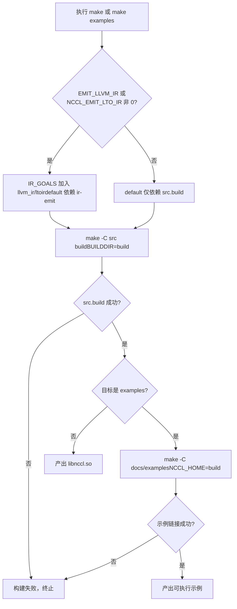
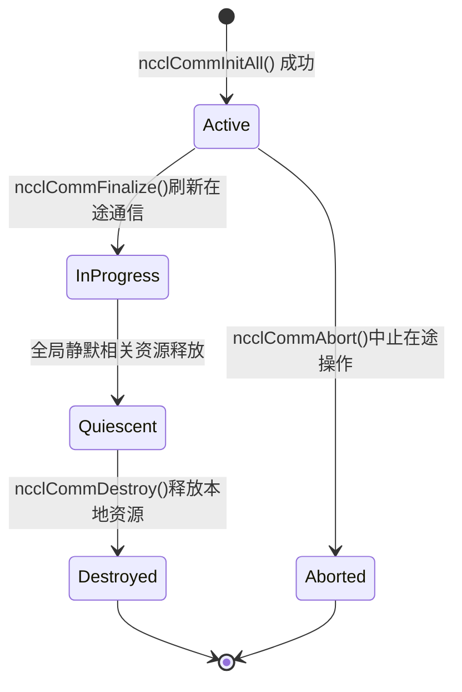

# Kapitel 1: Ausführung und Phänomene: Externes Verhalten am Beispiel eines AllReduce

Bevor wir in irgendeinen Kernel-Code eintauchen, bringen wir NCCL zunächst zum Laufen und beobachten sein nach außen sichtbares Verhalten. Dieses Kapitel liest keinen Kernel-Code, sondern tut nur eines: ein überprüfbares Bezugssystem aufbauen – jede spätere Analyse interner Mechanismen muss letztlich das hier beobachtete externe Verhalten erklären können.

# 1.1 Die Projektstruktur von NCCL aus Sicht des Build-Einstiegs

## Intuitives Modell

Das Build-System gleicht den Bauplänen eines Gebäudes: Es bestimmt nicht, wer darin wohnt, aber es legt fest, welche Räume existieren und wohin die Türen führen. Wenn der Build-Einstieg unübersichtlich ist, schafft man nicht einmal den ersten Schritt des „Zum-Laufen-Bringens“. NCCL bietet gleichzeitig zwei Build-Einstiege – Makefile und CMake. Ihre Unterschiede zu verstehen, ist der erste Schritt zum Verständnis der Projektorganisation dieses Projekts.

## Die Struktur der beiden Build-Einstiege

Das oberste`Makefile`ist eine extrem dünne Dispatcher-Schicht, die selbst keine Quelldatei kompiliert, sondern die Arbeit an die Makefiles der jeweiligen Unterverzeichnisse weiterleitet.

[FACT:Makefile:44-45]definiert die`src.%`-Musterregel und leitet Ziele wie`src.build`、`src.install`an`src/Makefile`：

```
src.%:
	${MAKE} -C src $* BUILDDIR=${ABSBUILDDIR}
```

[FACT:Makefile:47-48]definiert das`examples`-Ziel, das von`src.build`abhängt und dann in das`docs/examples`-Verzeichnis wechselt, um die Beispiele zu bauen:

```
examples: src.build
	${MAKE} -C docs/examples NCCL_HOME=${ABSBUILDDIR}
```

Beachten Sie die Abhängigkeitsbeziehung hier: Der Build der Beispiele hängt davon ab, dass`src.build`zuerst abgeschlossen wird, da die Beispiele gegen die NCCL-Bibliothek gelinkt werden müssen und die`NCCL_HOME`-Umgebungsvariable das Build-Ausgabeverzeichnis an das Makefile der Beispiele weitergibt. Das ist die Build-Reihenfolge-Einschränkung „erst die Bibliothek, dann die Beispiele“.

[FACT:Makefile:29]listet alle bereinigbaren Zielmengen auf:

```
TARGETS := src pkg nccl4py ir
```

[FACT:Makefile:30]mit der Ersetzungsreferenz-Syntax von GNU Make`${TARGETS:%=%.clean}`erweitert`src pkg nccl4py ir`zu`src.clean pkg.clean nccl4py.clean ir.clean`, wodurch alle Bereinigungsziele auf einmal definiert werden. Dies ist eine in Makefiles übliche Technik der "datengesteuerten Regeln" – um ein neues Modul hinzuzufügen, muss nur ein Wort zu`TARGETS`hinzugefügt werden.

## CMake-Einstieg: Woher die Versionsnummer kommt

Der CMake-Einstieg ist deutlich komplexer als das Makefile, da er plattformübergreifende Aspekte, CUDA-Versionserkennung, Architekturauswahl usw. behandeln muss. Wir konzentrieren uns nur auf die Teile, die direkt mit dem "zum Laufen bringen" zusammenhängen.

[FACT:CMakeLists.txt:5-11]zeigt die Herkunft der Versionsnummer – sie ist nicht in CMakeLists.txt fest codiert, sondern wird aus`makefiles/version.mk`gelesen und per Regex extrahiert:

```cmake
file(READ ${CMAKE_SOURCE_DIR}/makefiles/version.mk VERSION_CONTENT)
string(REGEX REPLACE ".*NCCL_MAJOR[ ]*:=[ ]*([0-9]+).*" "\\1" NCCL_MAJOR "${VERSION_CONTENT}")
...
math(EXPR NCCL_VERSION_CODE "(${NCCL_MAJOR} * 10000) + (${NCCL_MINOR} * 100) + ${NCCL_PATCH}")
```

> **[Design Inference & Architectural Trade-offs]**
> Die Versionsnummer wird zentral in`version.mk`abgelegt, sodass sowohl das Makefile- als auch das CMake-Buildsystem dieselbe Versionsquelle nutzen. Dadurch wird die klassische Ingenieursfalle "inkonsistente Versionsnummern zwischen zwei Buildsystemen" vermieden.`NCCL_VERSION_CODE`Die Berechnungsformel`MAJOR*10000 + MINOR*100 + PATCH`stimmt mit dem`NCCL_VERSION`Makro in der Header-Datei überein.

[FACT:CMakeLists.txt:14-20]Diese Versionsnummern werden über`add_compile_definitions`in alle C++-Quelldateien injiziert:

```cmake
add_compile_definitions(
    NCCL_USE_CMAKE
    NCCL_MAJOR=${NCCL_MAJOR}
    NCCL_MINOR=${NCCL_MINOR}
    NCCL_PATCH=${NCCL_PATCH}
    NCCL_VERSION_CODE=${NCCL_VERSION_CODE}
)
```

[FACT:CMakeLists.txt:24-25]deklariert die Projektsprachen als CUDA, CXX, C:

```cmake
project(NCCL VERSION ${NCCL_MAJOR}.${NCCL_MINOR}.${NCCL_PATCH}
        LANGUAGES CUDA CXX C)
```

## CUDA-Architekturauswahl: Warum der Standardwert so komplex ist

[FACT:CMakeLists.txt:140-171]ist ein längerer Logikblock, der abhängig von der CUDA-Version`CMAKE_CUDA_ARCHITECTURES`festlegt. Am Beispiel von CUDA 12.8 und höher:

```cmake
elseif(${CUDA_MAJOR} EQUAL 12)
    if(${CUDA_MINOR} LESS 8)
        set(CMAKE_CUDA_ARCHITECTURES "50;60;61;70;80;90")
    else()
        set(CMAKE_CUDA_ARCHITECTURES "50;60;61;70;80;90;100;120")
    endif()
```

> **[Design Inference & Architectural Trade-offs]**
> Die Designmotivation hinter dieser Logik ist: PTX neuer Architekturen (wie 100, 120) wird nur von neueren CUDA-Toolchains erkannt. Wenn man bei älterem CUDA gewaltsam eine neue Architektur angibt, schlägt die Kompilierung direkt fehl. Daher muss die Standard-Architekturliste dynamisch an die CUDA-Version angepasst werden. Für den Leser bedeutet das:**Wenn Sie`CMAKE_CUDA_ARCHITECTURES`nicht explizit setzen, enthält das Kompilierungsergebnis ein Fatbin mit einer langen Liste von Architekturen, und die Kompilierungszeit verlängert sich erheblich**. In Produktionsumgebungen wird üblicherweise die Zielarchitektur explizit angegeben, um den Build zu beschleunigen.

## Entscheidungsdiagramm des Build-Prozesses

Die folgende Abbildung zeigt den vollständigen Entscheidungspfad von der Ausführung von`make`bis zum fertigen lauffähigen Beispiel:



Der entscheidende Zweig in diesem Diagramm ist, ob`IR_GOALS`nicht leer ist – er bestimmt, ob der Standard-Build zusätzlich die LLVM-IR-Generierung auslöst. Für Leser, die nur "zum Laufen bringen" wollen, genügt es,`EMIT_LLVM_IR=0`beizubehalten, um den kürzesten Pfad zu nehmen.

# 1.2 Voraussetzungen für ein minimal lauffähiges Programm

## Intuitives Modell

Ein NCCL-Programm zu schreiben ist wie die Organisation einer Telefonkonferenz mit mehreren Teilnehmern. Sie müssen zuerst klären: Wie viele Personen nehmen teil (Anzahl der Geräte), wer ist wer (Rank), über welche Leitung wird gesprochen (Stream). Fehlt eines davon, kann die Konferenz nicht starten. In diesem Abschnitt betrachten wir anhand des`01_communicators`Beispiels, wie diese drei Voraussetzungen im Code aussehen.

## Datenstruktur: Drei Arrays tragen den gesamten Zustand

[FACT:docs/examples/01_communicators/01_multiple_devices_single_process/c/main.cc:88-92]definiert die Kernvariablen des Beispiels:

```c
int num_gpus;                 // Number of available CUDA devices
ncclComm_t *comms = NULL;     // Array of NCCL communicators (one per GPU)
cudaStream_t *streams = NULL; // Array of CUDA streams (one per GPU)
int *devices = NULL;          // Array of device IDs to use
```

Hier zeigt sich der Kern des NCCL-Programmiermodells für Einzelprozess-Mehrfach-GPU:**Jede GPU hat eine Kommunikationsdomäne, einen Stream und eine Gerätenummer**. Die Länge aller drei Arrays ist`num_gpus`, der Index`i`entspricht der`i`-ten GPU.

`ncclComm_t`ist in der Header-Datei als undurchsichtiger Zeiger definiert.[FACT:src/nccl.h.in:36]gibt seinen tatsächlichen Typ an:

```c
typedef struct ncclComm* ncclComm_t;
```

> **[Design Inference & Architectural Trade-offs]**
> Der "undurchsichtige Zeiger" (opaque pointer) ist eine klassische Technik zur Informationsverbergung in der Sprache C: Die Header-Datei legt nur den Zeigertyp`struct ncclComm*`offen, Benutzercode kann nicht auf die internen Felder der Struktur zugreifen, alle Operationen müssen über API-Funktionen erfolgen. Dadurch kann NCCL das interne Layout von`ncclComm`frei ändern, ohne die ABI zu brechen. Für Anfänger lässt sich das so verstehen: "Sie erhalten ein Blackbox-Handle, das nur über die offizielle Schnittstelle bedient werden kann."

## Schritt für Schritt: Von der Geräteerkennung zur Erstellung der Kommunikationsdomäne

**Erster Schritt: Anzahl der Geräte ermitteln.** [FACT:docs/examples/01_communicators/01_multiple_devices_single_process/c/main.cc:96-104]ruft`cudaGetDeviceCount`auf und prüft, ob der Wert 0 ist:

```c
CUDACHECK(cudaGetDeviceCount(&num_gpus));

if (num_gpus == 0) {
    fprintf(stderr, "ERROR: No CUDA devices found on this system\n");
    ...
    return 1;
}
```

Was dieser Schritt tut: Die CUDA-Laufzeit wird gefragt: "Wie viele GPUs gibt es auf dieser Maschine?" Wenn 0 zurückgegeben wird, bedeutet das, dass keine Geräte verfügbar sind, und das Programm beendet sich direkt – dies ist die vorgelagerte Schutzbedingung.

**Zweiter Schritt: Host-Speicher allozieren und Geräteliste befüllen.** [FACT:docs/examples/01_communicators/01_multiple_devices_single_process/c/main.cc:114-121]alloziert drei Arrays und prüft, ob die Allokation erfolgreich war:

```c
devices = (int *)malloc(num_gpus * sizeof(int));
comms = (ncclComm_t *)malloc(num_gpus * sizeof(ncclComm_t));
streams = (cudaStream_t *)malloc(num_gpus * sizeof(cudaStream_t));

if (!devices || !comms || !streams) {
    fprintf(stderr, "ERROR: Failed to allocate memory for device arrays\n");
    return 1;
}
```

[FACT:docs/examples/01_communicators/01_multiple_devices_single_process/c/main.cc:126-136]füllt`devices[i] = i`in einer Schleife und gibt die Eigenschaften jedes Geräts aus:

```c
for (int i = 0; i >CUDA: cudaGetDeviceCount(&num_gpus)
    CUDA-->>App: num_gpus = N
    loop i in 0..N-1
        App->>CUDA: cudaSetDevice(devices[i])
        App->>CUDA: cudaStreamCreate(&streams[i])
        CUDA-->>App: streams[i]
    end
    App->>NCCL: ncclCommInitAll(comms, N, devices)
    Note over NCCL: 内部为每个设备建立通信域分配 rank 0..N-1
    NCCL-->>App: comms[0..N-1]
    loop i in 0..N-1
        App->>NCCL: ncclCommUserRank(comms[i], &rank)
        NCCL-->>App: rank = i
        App->>NCCL: ncclCommCount(comms[i], &size)
        NCCL-->>App: size = N
    end
```

Kopieren`ncclCommInitAll`Dieses Sequenzdiagramm offenbart den entscheidenden Punkt:**ist ein**synchron blockierender Aufruf

## Designüberlegung: Warum wird ncclCommInitAll benötigt

> **[Design Inference & Architectural Trade-offs]**
> Im Mehrprozess-Szenario verwaltet jeder Prozess nur eine GPU, und es genügt,`ncclCommInitRank`jeweils separat zu initialisieren. Im Single-Process-Multi-GPU-Szenario jedoch, wenn der Benutzer`ncclCommInitRank`manuell für jede Karte aufrufen muss, muss er die „Synchronisation zwischen mehreren Ranks“ bewältigen – doch in einem Single-Process gibt es nur einen Thread, der nicht mehrere Ranks gleichzeitig vorantreiben kann, was zu einem Deadlock führt.`ncclCommInitAll`Die Bibliothek kapselt diese Koordination intern und verwendet interne Mechanismen (üblicherweise Multithreading oder eine Zustandsmaschine), um die synchronisierte Initialisierung aller Ranks abzuschließen, und stellt dem Benutzer einen einfachen synchronen Aufruf bereit. Das ist der grundlegende Grund für die Existenz der „Komfortfunktion“.

# 1.3 Das vollständige externe Verhalten eines AllReduce

## Intuitives Modell

AllReduce ist die am häufigsten verwendete Operation in der kollektiven Kommunikation: Jeder Teilnehmer steuert einen Datensatz bei, und alle erhalten die Summe aller Daten. Wie bei einer Gruppenarbeit zur Berechnung der Gesamtpunktzahl – jeder meldet seine eigene Punktzahl, und am Ende hat jeder eine Kopie der Gesamtpunktzahl der Klasse. In diesem Abschnitt verfolgen wir das`03_collectives/01_allreduce`Beispiel und betrachten das vollständige externe Verhalten eines AllReduce vom Aufruf bis zur Ergebnisüberprüfung.

## Datenstrukturen: Datenpuffer und Initialisierung

[FACT:docs/examples/03_collectives/01_allreduce/c/main.cc:59-63]definiert die Kernvariablen:

```c
int num_gpus = 0;
ncclComm_t *comms;
cudaStream_t *streams;
float **sendbuff;
float **recvbuff;
```

Beachten Sie, dass`sendbuff`und`recvbuff``float**`sind – Zeiger auf Zeigerarrays. Jedes`sendbuff[i]`ist die Gerätespeicheradresse auf der`i`-ten GPU.

[FACT:docs/examples/03_collectives/01_allreduce/c/main.cc:99]definiert den Datenumfang:

```c
const size_t size = 32 * 1024 * 1024; // 32M floats for demonstration
```

32M floats, jeweils 4 Bytes, also 128 MB Sendepuffer und 128 MB Empfangspuffer, jeweils eine Kopie pro Karte.

[FACT:docs/examples/03_collectives/01_allreduce/c/main.cc:101-120]ist die Initialisierungsschleife für jedes Gerät:

```c
for (int i = 0; i  **[Design Inference & Architectural Trade-offs]**
> Der Kernwiderspruch besteht darin: Kollektive Kommunikation erfordert, dass alle Ranks gleichzeitig teilnehmen, aber in einem Single-Thread können Sie`ncclAllReduce`nur nacheinander aufrufen. Wenn der erste`ncclAllReduce`-Aufruf blockiert und auf andere Ranks wartet, während die Aufrufe der anderen Ranks noch nicht abgesetzt wurden, kommt es zum Deadlock. Die Rolle des Group-Mechanismus ist:`ncclGroupStart`Alle Aufrufe nach`ncclGroupEnd`werden nur „registriert“, nicht tatsächlich gestartet;

**Erst bei** [FACT:docs/examples/03_collectives/01_allreduce/c/main.cc:139-142]：

```c
for (int i = 0; i 首元素=0"]
        r0["recvbuff[0]"]
    end
    subgraph dev1["GPU 1 (rank 1)"]
        s1["sendbuff[1]首元素=1"]
        r1["recvbuff[1]"]
    end
    subgraph dev2["GPU 2 (rank 2)"]
        s2["sendbuff[2]首元素=2"]
        r2["recvbuff[2]"]
    end
    s0 -->|ncclAllReducencclFloat ncclSum| reduce["归约求和0+1+2=3"]
    s1 -->|ncclAllReducencclFloat ncclSum| reduce
    s2 -->|ncclAllReducencclFloat ncclSum| reduce
    reduce -->|广播结果| r0
    reduce -->|广播结果| r1
    reduce -->|广播结果| r2
```

AllReduce-Datenflussdiagramm`recvbuff`Kopieren

## Dieses Diagramm zeigt die beiden Phasen von AllReduce: zuerst Reduzieren (reduce), dann Broadcast (broadcast). Das

> **[Design Inference & Architectural Trade-offs]**
> Designüberlegung: Warum Group statt einzelner Aufrufe verwenden`ncclGroupStart`/`ncclGroupEnd`〔Designschlussfolgerung und Architekturabwägung〕

```c
for (int i = 0; i  **[Design Inference & Architectural Trade-offs]**
> Kopieren`ncclCommFinalize`〔Designschlussfolgerung und Architekturabwägung〕**Warum muss die Zerstörung in zwei Schritte aufgeteilt werden?**ist eine`ncclCommDestroy`globale Operation**– sie erfordert die Teilnahme aller Ranks, um sicherzustellen, dass keine Kommunikation unterwegs ist.**ist eine`ncclCommDestroy`lokale Operation

## – sie gibt nur die Ressourcen des lokalen Prozesses frei und blockiert nicht. Dieses Design entkoppelt „Warten auf Stille aller Ranks“ und „Freigabe lokaler Ressourcen“: Ersteres kann länger dauern (muss auf das Netzwerkgegenüber warten), Letzteres ist eine rein lokale Operation. Wenn es nur ein

[FACT:docs/examples/01_communicators/01_multiple_devices_single_process/c/main.cc:221-249]gäbe, müsste es beide Aufgaben gleichzeitig übernehmen, entweder zu lange blockieren oder keine globale Stille garantieren können.[FACT:docs/examples/01_communicators/01_multiple_devices_single_process/c/main.cc:218-219]Die vollständige Kette der Zerstörungsreihenfolge

```c
// IMPORTANT: Proper cleanup is critical for NCCL applications
// Resources must be cleaned up in the correct order to avoid issues
```

betont:

Kopieren[FACT:docs/examples/01_communicators/01_multiple_devices_single_process/c/main.cc:224-227]）

2. Finalize + Destroy Kommunikationsdomäne ([FACT:docs/examples/01_communicators/01_multiple_devices_single_process/c/main.cc:233-240]）

3. CUDA-Stream zerstören ([FACT:docs/examples/01_communicators/01_multiple_devices_single_process/c/main.cc:246-249]）

4. Host-Speicher freigeben ([FACT:docs/examples/01_communicators/01_multiple_devices_single_process/c/main.cc:253-255]）

## Zustandsmaschine der Kommunikationsdomäne

`ncclCommFinalize`Die Dokumentation von erwähnt explizit Zustandsübergänge, was den Zulassungskriterien für eine Zustandsmaschine entspricht:



Der entscheidende Übergang dieser Zustandsmaschine ist`InProgress -> Quiescent`: Er wird durch das Ereignis „globale Stille" ausgelöst, nicht direkt durch einen Funktionsaufruf. Das bedeutet,`ncclCommFinalize`dass die Kommunikationsdomäne nach der Rückkehr von möglicherweise noch im Zustand`InProgress`verbleibt und durch Polling von`ncclCommGetAsyncError`ermittelt werden muss, wann sie in`Quiescent`。

## Designüberlegung: Warum die Zerstörungsreihenfolge nicht vertauscht werden darf

> **[Design Inference & Architectural Trade-offs]**
> Was würde schiefgehen, wenn zuerst der CUDA-Stream und dann die Kommunikationsdomäne zerstört würde? Die Kommunikationsdomäne könnte intern eine Referenz auf den Stream halten (z. B. für Abschlussbenachrichtigungen asynchroner Operationen). Wenn der Stream zuerst zerstört wird und die Kommunikationsdomäne bei Finalize auf den bereits zerstörten Stream zugreift, führt dies zu undefiniertem Verhalten. Ebenso, wenn zuerst der Host-Speicher freigegeben wird (`comms`-Array) und dann die Kommunikationsdomäne zerstört wird,`ncclCommDestroy`erhält man einen Wildzeiger. Deshalb muss die Reihenfolge „zuerst synchronisieren, dann Kommunikationsdomäne zerstören, dann Stream zerstören, zuletzt Host-Speicher freigeben" lauten –**die Abhängigkeitsbeziehungen bestimmen, dass die Zerstörungsreihenfolge umgekehrt zur Erstellungsreihenfolge sein muss**。

# 1.5 Leitfaden zur Vermeidung von Fallstricken in der Produktion

## Fallstrick 1: Vergessenes Group führt zu Deadlock

Dies ist der häufigste Fehler von Anfängern. Im Szenario mit einem Prozess und mehreren GPUs führt ein direkter Schleifenaufruf von`ncclAllReduce`ohne Group beim ersten Aufruf zu einem Deadlock. Die Symptome sind: Das Programm hängt, die CPU-Auslastung ist nahe 0, es gibt keine Ausgabe.

Diagnosemethode: Mit`gdb`am Prozess anhängen und prüfen, ob der Stack in der internen Wartelogik von NCCL hängt. Falls ja, prüfen, ob`ncclGroupStart`/`ncclGroupEnd`。

## Fallstrick 2: Ergebnisse lesen, ohne den Stream zu synchronisieren

[FACT:src/nccl.h.in:854-856]erklärt explizit, dass`ncclGroupEnd`nur das Einreihen in die Warteschlange garantiert, nicht die Fertigstellung. Wenn die Stream-Synchronisierung von[FACT:docs/examples/03_collectives/01_allreduce/c/main.cc:139-142]weggelassen und direkt`recvbuff`gelesen wird, liest man unvollständige Daten.

Die Symptome sind: Ergebnisse sind mal richtig, mal falsch, oder es werden nur Nullen gelesen. Der Grund ist, dass`cudaMemcpy`standardmäßig synchron ist, aber es synchronisiert den**aktuellen Stream**, während AllReduce möglicherweise auf einem anderen Stream ausgeführt wird. Diagnosemethode: Vor dem Lesen der Ergebnisse`cudaStreamSynchronize`einfügen. Wenn das Problem verschwindet, lag es an diesem Fallstrick.

## Fallstrick 3: Falsche Zerstörungsreihenfolge führt zu Segmentation Fault

Wenn vor`ncclCommDestroy`bereits`cudaFree`für`sendbuff`/`recvbuff`ausgeführt wurde, greift die Kommunikationsdomäne bei Finalize möglicherweise noch auf diese Puffer zu, was zu Segmentation Fault oder Datenbeschädigung führt.

Die Symptome sind: Das Programm stürzt in der Beendigungsphase ab oder liest gelegentlich Müll-Daten. Diagnosemethode: Die Reihenfolge des Aufräumcodes prüfen und sicherstellen, dass die Zerstörung der Kommunikationsdomäne vor der Freigabe aller CUDA-Ressourcen erfolgt.

## Fallstrick 4: Verwechslung von Gerätenummer und Rank

[FACT:docs/examples/01_communicators/01_multiple_devices_single_process/c/main.cc:198-200]hat eine Validierung:

```c
if (device != devices[i]) {
    printf(" [WARNING: Expected device %d]", devices[i]);
}
```

> **[Design Inference & Architectural Trade-offs]**
> Rank und Device sind zwei verschiedene Konzepte. Rank ist die logische Nummer innerhalb der Kommunikationsdomäne (0 bis nRanks-1), Device ist die physische GPU-Nummer. In der`ncclCommInitAll`Standardverwendung von gilt`devices[i] = i`, daher sind Rank und Device zufällig gleich. Wenn jedoch ein benutzerdefiniertes`devlist`übergeben wird (z. B.`{2, 0, 1}`), entspricht Rank 0 dem Device 2. Die Verwechslung dieser beiden Konzepte führt dazu, dass Daten an die falsche GPU gesendet werden.

# Zusammenfassung dieses Kapitels

In diesem Kapitel haben wir drei Dinge erledigt:

1. **Build-Einstiegspunkt**: Verständnis des Weiterleitungsmechanismus von Makefile und der Herkunft der Versionsnummer in CMake sowie der CUDA-Architekturauswahllogik. Die entscheidende Schlussfolgerung ist, dass`make examples`zuerst die Bibliothek und dann die Beispiele baut,`NCCL_HOME`und das Build-Artefakt-Verzeichnis an die Beispiele übergibt.

2. **Die drei Elemente eines minimal lauffähigen Programms**: Geräteanzahl (`cudaGetDeviceCount`), Rank (automatisch von`ncclCommInitAll`zugewiesen), Stream (einer pro GPU).`ncclCommInitAll`ist der bequeme Einstiegspunkt für Einzelprozess-MultigPU, der die synchronisierte Initialisierung mehrerer Ranks innerhalb der Bibliothek kapselt.

3. **Das vollständige externe Verhalten eines AllReduce**: Von`ncclGroupStart`um mehrere`ncclAllReduce`Aufrufe herum, bis zur Übermittlung durch`ncclGroupEnd`, dann Warten auf Abschluss durch`cudaStreamSynchronize`und schließlich Ergebnisvalidierung. Der Group-Mechanismus ist der Schlüssel zur Deadlock-Vermeidung im Single-Thread-MultigPU-Szenario.

4. **Lebenszyklus der Kommunikationsdomäne**：`ncclCommFinalize`(globale Stille) +`ncclCommDestroy`(lokale Freigabe) als zweistufige Zerstörung sowie die Reihenfolgebeschränkung „zuerst synchronisieren, dann Kommunikationsdomäne zerstören, dann Stream zerstören, zuletzt Host-Speicher freigeben".

# Denkanstöße und Selbsttest dieses Kapitels

Q1: Was passiert im Single-Thread-MultigPU-Szenario, wenn man ncclGroupStart/ncclGroupEnd von[FACT:docs/examples/03_collectives/01_allreduce/c/main.cc:130-136]entfernt und stattdessen direkt in einer Schleife ncclAllReduce aufruft? Warum?

**Referenzanalyse**: Es kommt zu einem Deadlock. Die Header-Datei[FACT:src/nccl.h.in:844-864]erklärt den Grund: Kollektive Kommunikationsaufrufe können eine Inter-CPU-Synchronisation ausführen, die die gleichzeitige Teilnahme aller Ranks erfordert. In einem Single-Thread wartet NCCL beim ersten Schleifendurchlauf, wenn`ncclAllReduce(comms[0], ...)`aufgerufen wird, darauf, dass andere Ranks ebenfalls AllReduce initiieren, um fortzufahren. Aber die Aufrufe der anderen Ranks sind in der Schleife noch nicht an der Reihe (da der aktuelle Thread beim ersten Aufruf blockiert ist), sodass der erste Aufruf niemals auf andere Ranks warten kann – Deadlock.

Die Rolle des Group-Mechanismus besteht darin, „Initiierung" und „Ausführung" zu trennen:`ncclGroupStart`Alle Aufrufe nach werden nur registriert,`ncclGroupEnd`erst bei werden alle registrierten Operationen gemeinsam übermittelt, sodass sie parallel voranschreiten können. Dies vermeidet grundlegend den Single-Thread-Deadlock.

Verifikationsmethode: Programm ohne Group ausführen und mit`gdb`attach betrachtet den Stack; er bleibt in der Wartelogik innerhalb von NCCL stehen, die CPU-Auslastung liegt nahe 0.

Q2: [FACT:docs/examples/03_collectives/01_allreduce/c/main.cc:139-142]Kann cudaStreamSynchronize durch cudaDeviceSynchronize ersetzt werden? Welche semantischen Unterschiede bestehen zwischen beiden? In welchen Szenarien führt diese Ersetzung zu Problemen?

**Referenzanalyse**: Kann durch`cudaDeviceSynchronize`ersetzt werden, aber die Semantik ist unterschiedlich.`cudaStreamSynchronize(streams[i])`wartet nur auf den Abschluss von Operationen im angegebenen Stream;`cudaDeviceSynchronize`wartet auf dem aktuellen Gerät auf**alle**Operationen aller Streams.

Im Szenario mit einem Prozess und mehreren GPUs`cudaDeviceSynchronize`synchronisiert nur das aktuelle Gerät (bestimmt durch`cudaSetDevice`), daher muss es in Verbindung mit einer`cudaSetDevice(i)`-Schleife verwendet werden. Wenn`cudaSetDevice`，`cudaDeviceSynchronize`weggelassen wird, wird nur das Standardgerät (normalerweise device 0) synchronisiert; das AllReduce anderer Geräte ist möglicherweise noch nicht abgeschlossen.

Header-Datei[FACT:src/nccl.h.in:854-856]betont, dass`ncclGroupEnd`nur die Einreihung in die Warteschlange garantiert, nicht die Fertigstellung, daher ist eine Synchronisierung erforderlich. Die Verwendung von`cudaStreamSynchronize`ist präziser, da es nur auf die relevanten Streams wartet und nicht fälschlicherweise auf irrelevante Operationen wartet. Das Problem bei der Verwendung von`cudaDeviceSynchronize`ist: Wenn auf dem Gerät andere irrelevante, lang laufende Kernel vorhanden sind, wird fälschlicherweise auf diese gewartet, was die Leistung verringert.

Q3: [FACT:docs/examples/01_communicators/01_multiple_devices_single_process/c/main.cc:233-240]Die Zerstörungsreihenfolge ist „zuerst alle Kommunikationsdomänen Finalize, dann alle Kommunikationsdomänen Destroy“. Welche Probleme entstehen, wenn man zu „für jede Kommunikationsdomäne zuerst Finalize, dann Destroy“ ändert (d. h. beide Operationen in einer Schleife ausführt)?

**Referenzanalyse**: Dies würde die Group-Semantik verletzen. Die aktuelle Schreibweise ist:

```c
ncclGroupStart();
for (i) ncclCommFinalize(comms[i]);
ncclGroupEnd();
for (i) ncclCommDestroy(comms[i]);
```

`ncclCommFinalize`wird von Group umschlossen, was bedeutet, dass alle Finalize-Operationen der Kommunikationsdomänen gemeinsam übermittelt werden und parallel voranschreiten können. Wenn man stattdessen Folgendes schreibt:

```c
for (i) {
    ncclCommFinalize(comms[i]);
    ncclCommDestroy(comms[i]);
}
```

Das`ncclCommFinalize(comms[0])`der ersten Iteration blockiert und wartet darauf, dass alle Ranks still werden, aber die Finalize-Operationen der anderen Kommunikationsdomänen wurden noch nicht initiiert, was zu einem Deadlock führt – dies ist dieselbe Art von Problem wie der Deadlock in Q1.

Außerdem erklärt die Header-Datei[FACT:src/nccl.h.in:309-309], dass`ncclCommFinalize`bei der Rückkehr die Kommunikationsdomäne möglicherweise noch im Zustand`ncclInProgress`ist und auf globale Stille warten muss, um in`ncclSuccess`überzugehen. Wenn unmittelbar danach`ncclCommDestroy`ausgeführt wird, könnten lokale Ressourcen freigegeben werden, bevor die Kommunikationsdomäne vollständig still ist, was zu undefiniertem Verhalten führt. Die korrekte Vorgehensweise ist, nach Finalize`ncclCommGetAsyncError`abzufragen, um den Status zu bestätigen, und dann Destroy auszuführen.

Diese externen Verhaltensweisen bilden das Bezugssystem für alle nachfolgenden Quellcode-Analysen. In Kapitel 2 werden wir das zentrale mentale Modell aufbauen: die fünf Kernkonzepte Kommunikationsdomäne, Kanal, Algorithmus, Protokoll und Transportschicht, und untersuchen, wie NCCL diese Konzepte intern organisiert.
