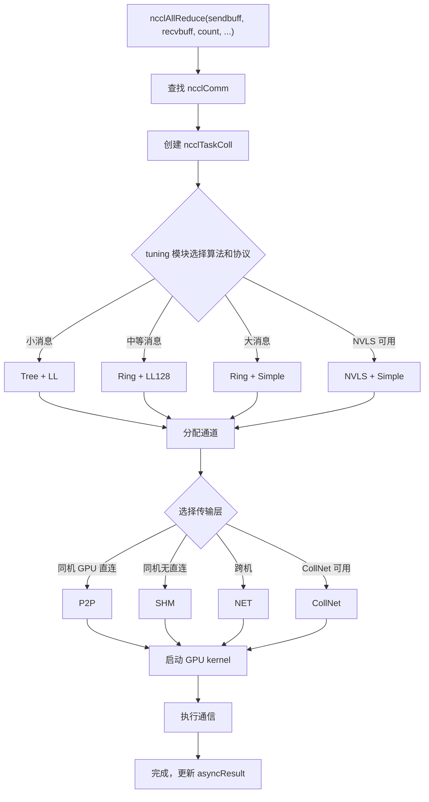

# Kapitel 2: Kernabstraktionsmodell: Kommunikationsoperatoren, Topologie, Algorithmen, Protokolle und Transportschicht

Im vorherigen Kapitel haben wir NCCL zum Laufen gebracht und das externe Verhalten der drei APIs ncclCommInitRank, ncclAllReduce und ncclCommDestroy beobachtet. Doch das externe Verhalten ist nur die Spitze des Eisbergs – was passiert tatsächlich auf der GPU, wenn ncclAllReduce zurückkehrt? Welchen Weg nehmen die Daten? Warum unterscheidet sich die Leistung desselben AllReduce auf verschiedenen Maschinen so stark? Um diese Fragen zu beantworten, muss zunächst das gemeinsame Vokabular von NCCL etabliert werden. Dieses Kapitel zerlegt nacheinander fünf Kernabstraktionen: Kommunikationsdomäne (ncclComm), Kanal (channel), Algorithmus (algorithm), Protokoll (protocol) und Transportschicht (transport). Diese fünf Konzepte ziehen sich durch das gesamte Buch, und jede nachfolgende Kapitelanalyse wird sie verwenden. Wer ihre Beziehungen zueinander versteht, versteht das Skelett von NCCL.

# 2.1 Kommunikationsdomäne ncclComm: Der Kommunikationskontext eines Prozesses

## Intuitives Modell

Stellen Sie sich`ncclComm`als einen „Gruppenchat“ vor: Jeder Prozess erhält nach dem Beitritt zum Gruppenchat eine Gruppen-ID, und danach werden alle Nachrichten in dieser Gruppe gesendet. Wie viele Personen in der Gruppe sind (`nRanks`), wer ich bin (`rank`), welche Route genommen wird (`channels`), welche Regeln verwendet werden (`config`) – all das ist in diesem Gruppenchat-Objekt gespeichert.

Ohne`ncclComm`wüsste NCCL nicht, „wer mit wem kommuniziert“ und „wohin die Daten gesendet werden“ – bei jedem API-Aufruf müssten die Rank-Liste neu ausgehandelt und Verbindungen neu aufgebaut werden, was einen untragbaren Aufwand bedeuten würde.

## Datenstruktur und Speicherlayout

`ncclComm`ist die zentralste Struktur in ganz NCCL und definiert in`src/include/comm.h`. Sie ist extrem umfangreich (fast 300 Zeilen); wir betrachten die Schlüsselfelder nach Funktionsgruppen.

**Identitätskennzeichnung und Lebenszyklus-Sentinels**

[FACT:src/include/comm.h:576-580]definiert`startMagic`，[FACT:src/include/comm.h:879-881]definiert`endMagic`. Diese beiden Felder sind keine Sicherheitsschlüssel, sondern Sentinels zur Erkennung von Speicherüberschreitungen. An[FACT:src/include/comm.h:883-885]befinden sich zwei`static_assert`：

```c
static_assert(offsetof(struct ncclComm, startMagic) == 0, "startMagic must be the first field of ncclComm");
static_assert(offsetof(struct ncclComm, endMagic) == sizeof(struct ncclComm) - sizeof(uint64_t),
              "endMagic must be the last field of ncclComm");
```

> **[Design Inference & Architectural Trade-offs]**
> Diese beiden Assertions erzwingen zur Kompilierungszeit, dass`startMagic`an der Anfangsadresse der Struktur und`endMagic`am Ende liegt. Zur Laufzeit kann durch Prüfung, ob diese beiden Magic Numbers manipuliert wurden, schnell festgestellt werden, ob der`ncclComm`-Zeiger gültig ist – dies ist sehr nützlich bei der Fehlersuche in Multithread-Umgebungen für Bugs wie „Wild Pointer greift auf zerstörte Kommunikationsdomäne zu“.

**Rank- und Topologie-Informationen**

[FACT:src/include/comm.h:628-629]definiert`rank`und`nRanks`– meine Nummer in der Kommunikationsdomäne und die Gesamtzahl der Teilnehmer.[FACT:src/include/comm.h:644-652]definiert knotenbezogene Felder:`node`(Nummer des Knotens, auf dem ich mich befinde),`nNodes`(Gesamtzahl der Knoten),`localRank`(Nummer innerhalb des Knotens),`localRanks`(Anzahl der GPUs innerhalb des Knotens) sowie drei Zuordnungstabellen`rankToNode`、`rankToLocalRank`、`localRankToRank`。

> **[Design Inference & Architectural Trade-offs]**
> Diese drei Mapping-Tabellen sind die Grundlage topologiebewusster Algorithmen. Zum Beispiel muss der Ring-Algorithmus wissen, „ob mein nächster Rank im selben Knoten liegt“, um zu entscheiden, ob NVLink oder das Netzwerk verwendet wird. Ohne diese Mapping-Tabellen müsste bei jeder Algorithmusauswahl die Topologie neu abgefragt werden, was enormen Overhead verursacht.

**Kanäle und Puffer**

[FACT:src/include/comm.h:593-593]definiert`channels[MAXCHANNELS]`– dies ist ein Array aller Kanäle innerhalb der Kommunikationsdomäne.[FACT:src/include/comm.h:674-676]definiert die Anzahl der Kanäle:`nChannels`(Anzahl der Verbindungskanäle),`collChannels`(Anzahl der Enqueue-Kanäle für kollektive Kommunikation),`nvlsChannels`(Anzahl der NVLS-Kanäle).

[FACT:src/include/comm.h:691-693]definiert die Puffergrößen:`buffSizes[NCCL_NUM_PROTOCOLS]`(Puffergröße pro Protokoll),`p2pChunkSize`(P2P-Blockgröße),`nvlsChunkSize`(NVLS-Blockgröße).

> **[Design Inference & Architectural Trade-offs]**
> `buffSizes`Der Index des Arrays ist der Protokoll-Enum-Wert (LL/LL128/Simple), was bedeutet, dass jedes Protokoll eine eigene Puffergrößenkonfiguration hat. Das LL-Protokoll benötigt kleine Puffer zur Latenzreduzierung, das Simple-Protokoll benötigt große Puffer zur Bandbreitenerhöhung – dieses Array ermöglicht die Koexistenz beider Anforderungen.

**Arbeitswarteschlange und FIFO**

[FACT:src/include/comm.h:719-728]definiert die Felder der Arbeits-FIFO:`workFifoBytes`(FIFO-Größe, Zweierpotenz),`workFifoBuf`(Host-seitiger FIFO-Puffer),`workFifoBufDev`(Device-seitiger FIFO-Puffer),`workFifoProduced`(Anzahl der produzierten Bytes),`workFifoConsumed`(Anzahl der konsumierten Bytes).

> **[Design Inference & Architectural Trade-offs]**
> Dies ist ein typischer Producer-Consumer-Ringpuffer. Die Host-Seite (Producer) schreibt Arbeitsbeschreibungen in die FIFO, der GPU-Kernel (Consumer) liest und führt sie aus.`workFifoBytes`muss eine Zweierpotenz sein, damit Bitmasken anstelle von Modulo-Operationen verwendet werden können, um die Indexberechnung zu beschleunigen.

**Prozessinterne Synchronisationsbarriere**

[FACT:src/include/comm.h:731-731]definiert den Synchronisationsmechanismus für mehrere Kommunikationsdomänen innerhalb eines Prozesses:

```c
struct ncclComm* intraComm0; // leader of intra-process comms (self possible)
struct ncclComm* intraNext; // next of intra-process comms, intraComm0 is head
int intraRank;
int intraRanks;
uint32_t intraBarrierPhase;
char intraPad1[64 - sizeof(uint64_t)];
uint64_t intraBarrierCounter; // only used if this is intraComm0
char intraPad2[64 - sizeof(uint64_t)];
uint64_t intraBarrierGate; // only used if this is intraComm0
```

Beachten Sie`intraPad1`und`intraPad2`haben die Größe`64 - sizeof(uint64_t)`, also 56 Bytes. Zusammen mit dem vorherigen`uint64_t`-Feld belegt jede Feldgruppe genau 64 Bytes – das ist eine Cache Line.

> **[Design Inference & Architectural Trade-offs]**
> Dies ist eine typische**Cache-Line-Padding-**Technik.`intraBarrierCounter`und`intraBarrierGate`werden von mehreren Threads häufig gelesen und geschrieben. Wenn sie dieselbe Cache Line teilen, führt dies zu**False Sharing**: Wenn ein Thread`intraBarrierCounter`ändert, wird der`intraBarrierGate`-Cache eines anderen Threads ungültig, was zu einem drastischen Leistungsabfall führt. Durch 56-Byte-Padding werden sie auf verschiedene Cache Lines aufgeteilt – eine Standardtechnik der hochperformanten nebenläufigen Programmierung.

**Asynchroner Fehlerstatus**

[FACT:src/include/comm.h:705-705]definiert`asyncResult`– dieses Feld zeichnet den asynchronen Operationsstatus der Kommunikationsdomäne auf. Im vorherigen Kapitel haben wir erwähnt, dass`ncclCommFinalize`bei der Rückkehr die Kommunikationsdomäne möglicherweise noch im`ncclInProgress`-Status ist, was durch dieses Feld verfolgt wird.

## Szenario-getriebener Walkthrough: Von ncclCommInitRank zur Strukturbefüllung

Wenn der Benutzer`ncclCommInitRank(&comm, nranks, commId, rank)`aufruft, weist NCCL intern eine`ncclComm`-Struktur zu und füllt sie Feld für Feld. Wir folgen diesem Ablauf, um zu sehen, wie die Schlüsselfelder gesetzt werden:

**Erster Schritt: Zuweisung und Nullsetzung**

NCCL verwendet`ncclCalloc`, um`ncclComm`zuzuweisen, wodurch sichergestellt wird, dass alle Felder initial 0 sind. Zu diesem Zeitpunkt werden`startMagic`und`endMagic`auf`NCCL_MAGIC`（[FACT:src/include/comm.h:563-569]gesetzt (definiert als`0x0280028002800280`, mit dem Kommentar „Nickel atomic number is 28“).

**Zweiter Schritt: Identitätsinformationen befüllen**

`rank`、`nRanks`、`cudaDev`wird aus Parametern und der CUDA-API abgerufen.`commHash`wird durch Hashing von`ncclCommId`erhalten und dient der Konsistenzprüfung in der späteren Netzwerkkommunikation.

**Dritter Schritt: Topologiegraph aufbauen**

NCCL ruft das Topologie-Erkennungsmodul auf, um alle GPUs, Netzwerkkarten und PCI-Switches zu enumerieren und das`topo`-Feld aufzubauen ([FACT:src/include/comm.h:595-595]). Dieser Topologiegraph bestimmt die spätere Algorithmusauswahl und Pfadplanung.

**Vierter Schritt: Kanäle initialisieren**

`channels[MAXCHANNELS]`Das`id`-Array wird einzeln initialisiert. Für jeden Kanal wird`peers`auf den Array-Index gesetzt,`devPeers`und

**-Zeiger werden zugewiesen.**

Fünfter Schritt: Transportverbindungen aufbauen`setup`Basierend auf dem Topologiegraphen wählt NCCL für jedes Rank-Paar die Transportschicht (P2P/SHM/NET) und ruft die entsprechenden`connect`und`channels[i].peers[j]`-Callbacks auf. Die Verbindungsinformationen werden in

**gespeichert.**

Sechster Schritt: Magic Number setzen`endMagic`Schließlich wird`NCCL_MAGIC`auf

## gesetzt, um die Initialisierung der Struktur zu markieren.

**Design-Überlegungen und Produktions-Fallstricke`ncclComm`Warum ist**

> **[Design Inference & Architectural Trade-offs]**
> `ncclComm`〔Design-Inferenz und Architektur-Abwägungen〕

**enthält fast 300 Felder, da es den gesamten Zustand einer Kommunikationsdomäne trägt. Die Design-Philosophie von NCCL ist „einmal initialisieren, mehrfach wiederverwenden“ – bei der Initialisierung werden alle möglicherweise benötigten Informationen berechnet und gespeichert, zur Laufzeit wird direkt nachgeschlagen, um wiederholte Berechnungen zu vermeiden. Der Preis ist ein größerer Speicherverbrauch (etwa einige KB pro Kommunikationsdomäne), aber verglichen mit GPU-Speicher und Netzwerkbandbreite ist dieser Speicher vernachlässigbar.**

> **[Design Inference & Architectural Trade-offs]**
> `ncclComm`〔Design-Inferenz und Architektur-Abwägungen〕`ncclComm`ist nicht threadsicher. Wenn zwei Threads gleichzeitig`ncclAllReduce`，`workFifoProduced`für dieselbe

**aufrufen, konkurrieren Felder wie**

`ncclCommDestroy`, was zu Datenbeschädigung führt. Die korrekte Vorgehensweise ist, dass jeder Thread eine eigene Kommunikationsdomäne verwendet oder Aufrufe durch externe Locks serialisiert werden.`startMagic`Fallstrick-Szenario Zwei: Zugriff nach der Zerstörung`endMagic`Nachdem

**den Strukturspeicher freigegeben hat, führt ein Zugriff durch einen Thread, der noch einen Zeiger hält, zum Lesen von freigegebenem Speicher.**

und`intraBarrierCounter`können helfen, diese Situation zu erkennen – wenn die Magic Number nicht übereinstimmt, ist der Zeiger ungültig.`intraBarrierGate`Fallstrick-Szenario Drei: Cache-Line-False-Sharing

# In Mehrprozess-Szenarien (ein Rank pro Prozess) ist das Padding von

## und

besonders wichtig. Ohne Padding würden sich die Barrierenoperationen mehrerer Prozesse gegenseitig stören, was die Synchronisationslatenz von Nanosekunden auf Mikrosekunden ansteigen lässt.`channel`Es ist das „Förderband“ von NCCL – es unterteilt die Daten einer kollektiven Kommunikation in mehrere Teile, wobei jeder Kanal unabhängig einen Teil transportiert und parallel voranschreitet, um die Bandbreitennutzung zu verbessern.

Ohne Kanäle können alle Daten nur einen Pfad nutzen, die mehreren physischen Verbindungen zwischen GPUs (mehrere Netzwerkkarten, mehrere NVLink-Gruppen) können nicht gleichzeitig genutzt werden, und die Bandbreitennutzung sinkt erheblich.

## Datenstruktur und Speicherlayout

`ncclChannel`Definiert in[FACT:src/include/comm.h:169-191]：

```c
struct ncclChannel {
  struct ncclChannelPeer** peers;
  struct ncclDevChannelPeer** devPeers;
  /* devPeer pointer array used for host side access */
  struct ncclDevChannelPeer** devPeersHostPtr;
  struct ncclRing ring;
  int* devRingUserRanks;
  struct ncclTree tree;

  struct ncclTree collnetChain;
  struct ncclDirect collnetDirect;

  struct ncclNvls nvls;

  int id; // index of this channel
  uint32_t workFifoProduced; // +1 successor of last used work fifo byte

  /* comm split sharable resources */
  struct ncclChannelPeer* collnetPeers;
  struct ncclDevChannelPeer* collnetDevPeers;
  struct ncclChannelPeer* nvlsPeers;
  struct ncclDevChannelPeer* nvlsDevPeers;
};
```

**Analyse der Schlüsselfelder**

- `peers` / `devPeers`: Verweist auf die Verbindungsinformationen aller Ranks innerhalb dieses Kanals.`peers`Ist die Host-seitige Ansicht,`devPeers`Ist die geräteseitige Ansicht (direkter Zugriff durch den GPU-Kernel).
- `ring`: Topologiebeschreibung des Ring-Algorithmus – Vorgänger und Nachfolger jedes Ranks.
- `tree`: Topologiebeschreibung des Tree-Algorithmus – Elternknoten und Liste der Kindknoten.
- `collnetChain` / `collnetDirect`: Zwei Variantentopologien des CollNet-Algorithmus.
- `nvls`: Topologiebeschreibung von NVLink SHARP.
- `id`: Kanalindex, von 0 bis`nChannels-1`。
- `workFifoProduced`: Der FIFO-Produktionszeiger der Arbeit dieses Kanals.

> **[Design Inference & Architectural Trade-offs]**
> Beachten Sie`ring`、`tree`、`collnetChain`、`collnetDirect`、`nvls`Diese fünf Felder sind**parallel**– derselbe Kanal kann gleichzeitig Topologiebeschreibungen für mehrere Algorithmen enthalten. Zur Laufzeit wird je nach Algorithmusauswahl entschieden, welches Feld verwendet wird. Dieses Design ermöglicht den Algorithmuswechsel, ohne den Kanal neu aufzubauen – es muss nur das gelesene Feld gewechselt werden.

**Berechnung der Kanalanzahl**

Die Kanalanzahl ist definiert in`ncclComm`definiert ([FACT:src/include/comm.h:674-676]）：

```c
int nChannels; // connection nChannels
int collChannels; // enqueue nChannels
int nvlsChannels; // enqueue nChannels
```

> **[Design Inference & Architectural Trade-offs]**
> `nChannels`Ist die tatsächlich aufgebaute Verbindungsanzahl,`collChannels`Ist die Anzahl der Kanäle, die beim Einreihen kollektiver Kommunikation verwendet wird,`nvlsChannels`Ist die Anzahl der dedizierten NVLS-Kanäle. Die drei können unterschiedlich sein – zum Beispiel werden einige Kanäle nur für P2P und nicht für kollektive Kommunikation verwendet.

**P2P-Kanalplanung**

[FACT:src/include/channel.h:21-33]Definiert die`ncclP2pChannelBaseForRound`Funktion zur Berechnung der Kanalbasis, die in jeder Runde der P2P-Kommunikation verwendet wird:

```c
inline uint8_t ncclP2pChannelBaseForRound(struct ncclComm* comm, int p2pRound) {
  int base;
  if (comm->nNodes > 1) {
    int localSize = comm->p2pSchedGroupSize;
    int groupDelta = p2pRound / localSize;
    int localDelta = p2pRound % localSize;
    base = groupDelta * divUp(localSize, NCCL_MAX_DEV_WORK_P2P_PER_BATCH);
    base += localDelta / NCCL_MAX_DEV_WORK_P2P_PER_BATCH;
  } else {
    base = p2pRound;
  }
  return reverseBits(base, log2Up(comm->p2pnChannels));
}
```

> **[Design Inference & Architectural Trade-offs]**
> Die Logik dieser Funktion ist: In Multi-Node-Szenarien wird die P2P-Kommunikation nach „Gruppen“ geplant, wobei die Ranks innerhalb jeder Gruppe benachbarte Kanäle verwenden; in Single-Node-Szenarien wird jede Runde direkt einem Kanal zugeordnet.`reverseBits`Ist eine Bit-Umkehroperation, die verwendet wird, um die Kanalzuweisung zu streuen und Hotspot-Konzentration zu vermeiden.

## Szenariogesteuerter Walkthrough: Wie ein AllReduce Kanäle zuweist

Angenommen, es gibt 8 Ranks und 4 Kanäle und es wird ein AllReduce ausgeführt. Die Daten werden in 4 Teile aufgeteilt, wobei jeder Teil von einem Kanal verantwortet wird.

**Erster Schritt: Algorithmusauswahl**

Das Tuning-Modul von NCCL wählt je nach Nachrichtengröße und Topologie den Algorithmus (z. B. Ring) und das Protokoll (z. B. Simple).

**Zweiter Schritt: Kanalzuweisung**

`ncclTaskColl`Die Struktur ([FACT:src/include/comm.h:212-273]) wird erstellt, wobei das Feld`nChannels`auf 4 gesetzt wird (die Felder[FACT:src/include/comm.h:254-254]）。`channelLo`und`channelHi`([FACT:src/include/comm.h:256-257]) markieren den von dieser Aufgabe verwendeten Kanalbereich.

**Dritter Schritt: Datenaufteilung**

Jeder Kanal verantwortet`count / nChannels`Elemente. Kanal 0 verarbeitet die Elemente 0 bis count/4-1, Kanal 1 verarbeitet die Elemente count/4 bis count/2-1, und so weiter.

**Vierter Schritt: Parallele Ausführung**

Die GPU-Kernel der 4 Kanäle werden gleichzeitig gestartet und führen jeweils auf ihrem eigenen Datenslice ein Ring-AllReduce aus. Da es keine Datenabhängigkeiten zwischen den Kanälen gibt, können sie vollständig parallel ausgeführt werden.

**Fünfter Schritt: Zusammenführung der Ergebnisse**

Nach Abschluss aller Kanäle enthält der recv-Puffer jedes Ranks das vollständige AllReduce-Ergebnis.

## Nebenläufigkeitskontrolle und Hardware-Interaktion

**Zuordnung von Kanälen zu GPU-Ressourcen**

> **[Design Inference & Architectural Trade-offs]**
> Jeder Kanal ist normalerweise an einen unabhängigen CUDA-Stream oder eine GPU-Hardware-Warteschlange gebunden. Dadurch können Kernel verschiedener Kanäle auf der GPU nebenläufig ausgeführt werden, wodurch SM-Ressourcen (Streaming-Multiprozessoren) vollständig genutzt werden.

**Zuordnung von Kanälen zu Netzwerkgeräten**

In Multi-NIC-Szenarien können verschiedene Kanäle an verschiedene NICs gebunden werden. Zum Beispiel bei 4 Kanälen und 2 NICs: Kanal 0 und 1 laufen über NIC A, Kanal 2 und 3 über NIC B. Dadurch kann die Bandbreite beider NICs genutzt werden.

**Auswahl der Kanalanzahl**

> **[Design Inference & Architectural Trade-offs]**
> Eine höhere Kanalanzahl ist nicht immer besser. Eine Erhöhung der Kanalanzahl bringt mit sich:

- Mehr Kernel-Start-Overhead
- Mehr Verbindungsaufbau-Overhead
- Komplexere Synchronisation

Das Tuning-Modul von NCCL wählt je nach Nachrichtengröße automatisch die optimale Kanalanzahl. Kleine Nachrichten verwenden wenige Kanäle (weniger Overhead), große Nachrichten verwenden viele Kanäle (höhere Bandbreite).

## Produktions-Fallstricke

**Fallstrick-Szenario eins: Unsachgemäße Konfiguration der Kanalanzahl**

> **[Design Inference & Architectural Trade-offs]**
> Wenn manuell`NCCL_NCHANNELS`zu groß eingestellt wird, übersteigt in Szenarien mit kleinen Nachrichten der Kernel-Start-Overhead den Nutzen, und die Leistung sinkt stattdessen. Es wird empfohlen, NCCL automatisch wählen zu lassen, es sei denn, es gibt einen klaren Optimierungsbedarf.

**Fallstrick-Szenario zwei: Nichtübereinstimmung von Kanälen und Topologie**

> **[Design Inference & Architectural Trade-offs]**
> Wenn die Kanalanzahl die Anzahl der physischen Verbindungen übersteigt, teilen sich einige Kanäle Verbindungen und echte Parallelität ist nicht möglich. Zum Beispiel bei 2 NICs und 8 Kanälen können tatsächlich nur 2 Kanäle gleichzeitig übertragen, die übrigen 6 warten in der Warteschlange.

**Fallstrick-Szenario drei: P2P-Kanalkonflikt**

`ncclP2pChannelBaseForRound`Die`reverseBits`Operation, wenn sie fehlerhaft implementiert ist, führt dazu, dass mehrere Runden demselben Kanal zugeordnet werden, was Serialisierung verursacht.[FACT:src/include/channel.h:32-32]Die`reverseBits(base, log2Up(comm->p2pnChannels))`stellt eine gleichmäßige Kanalzuweisung sicher.

# 2.3 Algorithmus algorithm: Topologieorganisation von Tree/Ring/CollNet/NVLS/PAT

## Intuitives Modell

Von Peking nach Shanghai kann man mit dem Hochgeschwindigkeitszug, dem Flugzeug oder dem Auto fahren; jede Methode eignet sich für unterschiedliche Entfernungen und Personenzahlen. Die Algorithmen von NCCL sind genau diese „Reisemethoden“ – Ring eignet sich für stabile Bandbreite bei großen Nachrichten, Tree für niedrige Latenz bei kleinen Nachrichten, CollNet nutzt Netzwerkkarten-Offloading, NVLS nutzt NVLink-SHARP-Hardwarebeschleunigung, und PAT ist eine parallelisierte Variante von NVLS.

Ohne Algorithmusauswahl könnte NCCL nur in einem festen Modus kommunizieren, könnte sich nicht an unterschiedliche Nachrichtengrößen und Topologien anpassen, und die Leistung würde stark darunter leiden.

## Datenstrukturen und Speicherlayout

**Ring-Algorithmus**

Der Kern des Ring-Algorithmus ist`ncclRing`Struktur (in`src/include/comm.h`durch`channels[i].ring`referenziert).[FACT:src/include/collectives.h:81-116]definiert die`RingAlgorithm`Basisklasse:

```c
class RingAlgorithm {
protected:
  int refCount;
  int nRanks;
  int nStepsPerLoop;
  int chunkSteps;
  int sliceSteps;
  ssize_t sliceSize;
  ssize_t loopSize;
  ssize_t channelSize;
  uint8_t* sendbuff;
  uint8_t* recvbuff;
  void* sendMhandle;
  void* recvMhandle;
  void* srecvMhandle;

public:
  virtual void getNextSendAddr(int curStep, uint8_t** sendbuffOut, size_t* sizeOut, void** mhandleOut) = 0;
  virtual void getNextRecvAddr(int curStep, uint8_t** recvbuffOut, size_t* sizeOut, void** mhandleOut) = 0;
  int incRefCount() {
    return (int)COMPILER_ATOMIC_ADD_FETCH(&refCount, 1, std::memory_order_relaxed);
  }
  int decRefCount() {
    return (int)COMPILER_ATOMIC_SUB_FETCH(&refCount, 1, std::memory_order_release);
  }
  RingAlgorithm() {
    refCount = 0;
  }
  virtual ~RingAlgorithm() {};
};
```

**Analyse der Schlüsselfelder**

- `refCount`: Referenzzähler, wird von Proxy-Threads und GPU-Kernels gemeinsam genutzt, um Algorithmusobjekte zu teilen.
- `nRanks`: Anzahl der Knoten im Ring.
- `nStepsPerLoop`: Anzahl der Schritte pro Schleifendurchlauf. AllReduce ist`2*(nRanks-1)*chunkSteps`（[FACT:src/include/collectives.h:218-218]）。
- `chunkSteps` / `sliceSteps`: Block-Schritte und Slice-Schritte, steuern die Granularität der Pipeline.
- `sliceSize` / `loopSize` / `channelSize`: Slice-Größe, Loop-Größe, Channel-Größe.
- `sendbuff` / `recvbuff`: Sende- und Empfangspufferzeiger.
- `sendMhandle` / `recvMhandle` / `srecvMhandle`: Speicher-Handle, wird für die Netzwerkregistrierung verwendet.

**Atomare Operationen des Referenzzählers**

[FACT:src/include/collectives.h:106-108]zeigt`incRefCount`und`decRefCount`：

```c
int incRefCount() {
  return (int)COMPILER_ATOMIC_ADD_FETCH(&refCount, 1, std::memory_order_relaxed);
}
int decRefCount() {
  return (int)COMPILER_ATOMIC_SUB_FETCH(&refCount, 1, std::memory_order_release);
}
```

> **[Design Inference & Architectural Trade-offs]**
> `incRefCount`verwendet`memory_order_relaxed`– das Erhöhen des Referenzzählers erfordert keine Synchronisation, es muss nur Atomarität gewährleistet sein.`decRefCount`verwendet`memory_order_release`– beim Verringern des Referenzzählers muss sichergestellt werden, dass vorherige Schreiboperationen für andere Threads sichtbar sind (da dies die Objektzerstörung auslösen kann).

**RingARAlgorithm: Ring-Implementierung von AllReduce**

[FACT:src/include/collectives.h:118-234]definiert`RingARAlgorithm`, erbt von`RingAlgorithm`. Kernmethoden sind`getNextSendAddr`und`getNextRecvAddr`。

[FACT:src/include/collectives.h:126-167]von`getNextSendAddr`Logik:

```c
void getNextSendAddr(int curStep, uint8_t** sendbuffOut, size_t* sizeOut, void** mhandleOut) {
  int curLoop = curStep / nStepsPerLoop;
  int curLoopStage = (curStep % nStepsPerLoop) / chunkSteps;
  int chunkStage = curLoopStage % nRanks;
  int sliceStage = (curStep % chunkSteps) / sliceSteps;
  ssize_t elemOffset = curLoop * loopSize;
  ssize_t remSize = channelSize - elemOffset;
  // ... 计算 chunkOffset, sliceOffset, curSliceSize ...
  if (remSize  **[Design Inference & Architectural Trade-offs]**
> Der Kern dieses Codes ist**Adressberechnung**: Gegeben die aktuelle Schrittnummer`curStep`, berechne, welcher Slice welches Datenblocks gesendet werden soll.`chunkId`Die Berechnung von`(ringIndex + nRanks - 1 - chunkStage) % nRanks`implementiert die Rückwärtspropagierung im Ring – jeder Rank empfängt Daten vom Vorgänger, verarbeitet sie und sendet sie an den Nachfolger.

**PAT-Algorithmus**

PAT (Parallel Aggregated Tree) ist eine parallelisierte Variante von NVLS.[FACT:src/include/collectives.h:416-423]definiert`ncclPatStep`：

```c
struct ncclPatStep {
  int recvDim, sendDim, recvOffset, sendOffset, stepOffset, postRecv, postSend, nelem, last, flags;
  // PAT algo computation thread step number; -1 while the slot is free.
  int step;
  // This PAT group's offset within the shared NVLS slot.
  int nvlsOffset;
  size_t inpIx, outIx;
};
```

[FACT:src/include/collectives.h:425-435]definiert`ncclPatPeer`：

```c
struct ncclPatPeer {
  uint64_t step;
  struct ncclConnInfo* conn;
  struct ncclConnFifo* connFifo;
  void* buff;
  uint64_t* headPtr;
  uint64_t* tailPtr;
  uint64_t stepCache;
  long long int accSize;
  int connStepSize;
};
```

> **[Design Inference & Architectural Trade-offs]**
> Die Kernidee des PAT-Algorithmus ist**mehrere kleine Schritte zu einem großen Schritt zu aggregieren**, um den Synchronisationsaufwand zu reduzieren.`ncclPatStep`beschreibt die Sende-/Empfangsdimensionen, Offsets, Elementanzahl usw. eines Aggregationsschritts.`ncclPatPeer`beschreibt den Verbindungsstatus und die Pufferzeiger eines Peer-Knotens.

## Szenario-getriebener Walkthrough: Schrittevolution von Ring AllReduce

Angenommen, es gibt 4 Ranks (0, 1, 2, 3), jeder Rank hat 4 Elemente, und es wird Ring AllReduce ausgeführt.

**Reduce-Scatter-Phase**

- Schritt 0: Rank 0 sendet Element 0 an Rank 1, Rank 1 sendet Element 1 an Rank 2, Rank 2 sendet Element 2 an Rank 3, Rank 3 sendet Element 3 an Rank 0.
- Schritt 1: Jeder Rank addiert das empfangene Element zum lokalen entsprechenden Element und sendet es dann an den nächsten Rank.
- Schritt 2: Weiter akkumulieren und weitergeben.
- Schritt 3: Zu diesem Zeitpunkt besitzt jeder Rank ein vollständiges Reduktionsergebnis (Rank 0 hat das Ergebnis von Element 3, Rank 1 hat das Ergebnis von Element 0 usw.).

**AllGather-Phase**

- Schritte 4–6: Jeder Rank propagiert sein Reduktionsergebnis entlang des Rings, schließlich besitzen alle Ranks das vollständige Ergebnis.

[FACT:src/include/collectives.h:218-218]Die`nStepsPerLoop = 2 * (nRanks - 1) * chunkSteps`von`(nRanks-1)*chunkSteps`entspricht genau diesem Ablauf: Reduce-Scatter benötigt`(nRanks-1)*chunkSteps`Schritte, AllGather benötigt ebenfalls`2*(nRanks-1)*chunkSteps`Schritte, insgesamt

## Designüberlegungen und Produktions-Fallstricke

**Warum existieren Ring und Tree nebeneinander?**

> **[Design Inference & Architectural Trade-offs]**
> Der Ring-Algorithmus hat eine hohe Bandbreiteneffizienz (jede Verbindung überträgt), aber die Latenz wächst linear mit der Anzahl der Ranks. Der Tree-Algorithmus hat logarithmische Latenz, aber geringe Bandbreiteneffizienz (nur ein Teil der Verbindungen arbeitet). NCCL wählt automatisch basierend auf der Nachrichtengröße: kleine Nachrichten verwenden Tree (latenzempfindlich), große Nachrichten verwenden Ring (bandbreitenempfindlich).

**Fallstrick-Szenario 1: Falsche Algorithmusauswahl**

> **[Design Inference & Architectural Trade-offs]**
> Wenn man manuell erzwingt, Ring für kleine Nachrichten zu verwenden, steigt die Latenz deutlich an. Es wird empfohlen, das Tuning-Modul automatisch auswählen zu lassen, es sei denn, es gibt klare Leistungsanalysedaten, die einen manuellen Eingriff unterstützen.

**Fallstrick-Szenario 2: NVLS-Hardware nicht unterstützt**

NVLS erfordert spezifische Hardwareunterstützung (NVLink SHARP). Wenn die Hardware dies nicht unterstützt, der Code aber NVLS erzwingt, wird auf Ring oder Tree zurückgefallen, was jedoch mit Leistungsschwankungen einhergehen kann.[FACT:src/include/comm.h:755-755]Das`nvlsSupport`Feld von

**markiert, ob die Hardware NVLS unterstützt.**

Fallstrick-Szenario 3: Konfiguration des Aggregationsfaktors des PAT-Algorithmus`aggFactor`Der[FACT:src/include/collectives.h:537-560]des PAT-Algorithmus bestimmt, wie viele Schritte aggregiert werden.`aggFactor`zeigt die Berechnungslogik von

```c
aggFactor = 1;
size_t channelSize = end - offset;
while (stepSize / (channelSize * sizeof(T) * aggFactor) >= 2 && aggFactor  1 && aggFactor  **[Design Inference & Architectural Trade-offs]**
> `aggFactor`Ein zu kleiner`stepSize`、`channelSize`、`nranks`führt zu hohem Synchronisationsaufwand, ein zu großer zu Pipeline-Blasen. NCCL berechnet den optimalen Wert automatisch basierend auf

# 2.4 Protokoll protocol: Drei Datenübertragungsstrategien LL/LL128/Simple

## Intuitives Modell

Beim Versenden eines Pakets kann man „Same-Day-Express“, „Next-Day-Lieferung“ oder „normalen Versand“ wählen – Geschwindigkeit und Kosten unterscheiden sich. Die Protokolle von NCCL sind genau diese „Versandarten“ – LL (Low Latency) eignet sich für die latenzarme Übertragung kleiner Nachrichten, LL128 für die 128-Byte-ausgerichtete Übertragung mittlerer Nachrichten, und Simple für die bandbreitenstarke Übertragung großer Nachrichten.

Ohne Protokollauswahl könnte NCCL Daten nur mit einer festen Strategie transportieren und wäre nicht in der Lage, zwischen Latenz und Bandbreite abzuwägen.

## Datenstrukturen und Speicherlayout

**Protokoll-Enumeration**

[FACT:src/include/comm.h:55-57]definiert die protokollbezogenen Thread-Schwellenwerte:

```c
#define NCCL_LL_THREAD_THRESHOLD 8
#define NCCL_LL128_THREAD_THRESHOLD 8
#define NCCL_SIMPLE_THREAD_THRESHOLD 64
```

> **[Design Inference & Architectural Trade-offs]**
> Diese Schwellenwerte bestimmen, wie viele Threads jedes Protokoll verwendet. LL und LL128 nutzen 8 Threads (niedrige Latenz, wenige Threads genügen), Simple nutzt 64 Threads (hohe Bandbreite, erfordert mehr Threads für den parallelen Transport).

**Protokollpuffer**

[FACT:src/include/comm.h:691-691]definiert`buffSizes[NCCL_NUM_PROTOCOLS]`– jedes Protokoll hat eine eigene Puffergröße.

**Protokollbezogene FIFO-Struktur**

[FACT:src/include/comm.h:59-83]definiert`ncclSendMem`und`ncclRecvMem`：

```c
struct ncclSendMem {
  union {
    struct {
      uint64_t head;
      char pad1[CACHE_LINE_SIZE - sizeof(uint64_t)];
      void* ptrExchange;
      uint64_t redOpArgExchange[2];
      char pad2[CACHE_LINE_SIZE - sizeof(void*) - 2 * sizeof(uint64_t)];
      int offsFifo[NCCL_STEPS];
    };
    char pad3[MEM_ALIGN];
  };
};

struct ncclRecvMem {
  union {
    struct {
      uint64_t tail;
      char pad1[CACHE_LINE_SIZE - sizeof(uint64_t)];
      struct ncclConnFifo connFifo[NCCL_STEPS];
      int flush; // For GDRCopy-based flush
    };
    char pad4[MEM_ALIGN];
  };
};
```

> **[Design Inference & Architectural Trade-offs]**
> `ncclSendMem`und`ncclRecvMem`sind die Shared-Memory-Strukturen für Senden und Empfangen.`head`und`tail`sind die Lese-/Schreibzeiger des Ringpuffers,`pad1`stellt sicher, dass sie sich in unterschiedlichen Cache-Zeilen befinden.`connFifo`Das Array speichert die Verbindungsinformationen für jeden Schritt (Modus, Offset, Größe, Zeiger), definiert in[FACT:src/include/collectives.h:72-77]：

```c
struct ncclConnFifo {
  int mode;
  ssize_t offset;
  ssize_t size;
  void* ptr;
};
```

**Protokollauswahllogik**

> **[Design Inference & Architectural Trade-offs]**
> Die Protokollauswahl erfolgt durch das Tuning-Modul und berücksichtigt folgende Faktoren:

- Nachrichtengröße: Kleine Nachrichten verwenden LL, mittlere LL128, große Simple.
- Topologie: NVLink-Verbindungen eignen sich für LL128, Netzwerkverbindungen für Simple.
- Hardware-Fähigkeiten: Bestimmte GPU-Architekturen sind für spezifische Protokolle optimiert.

## Szenario-getriebener Walkthrough: Datenübertragung mit dem LL-Protokoll

Angenommen, es werden 1 KB Daten mit dem LL-Protokoll übertragen.

**Erster Schritt: Daten in den Sendepuffer schreiben**

Die Host-Seite schreibt die Daten in`sendbuff`und aktualisiert dann den`ncclSendMem.head`-Zeiger, um den GPU-Kernel über neue Daten zu informieren.

**Zweiter Schritt: GPU-Kernel liest Daten**

Der GPU-Kernel pollt den`head`-Zeiger, erkennt neue Daten und liest die Daten aus`sendbuff`.

**Dritter Schritt: Datenübertragung**

Der GPU-Kernel sendet die Daten über NVLink oder das Netzwerk an den Ziel-Rank.

**Vierter Schritt: Ziel-Rank empfängt Daten**

Der GPU-Kernel des Ziel-Ranks schreibt die Daten in`recvbuff`und aktualisiert dann den`ncclRecvMem.tail`-Zeiger.

**Fünfter Schritt: Host-Seite liest Daten**

Die Host-Seite pollt den`tail`-Zeiger, erkennt neue Daten und liest die Daten aus`recvbuff`.

## Nebenläufigkeitskontrolle und Hardware-Interaktion

**Der Latenzmechanismus des LL-Protokolls**

> **[Design Inference & Architectural Trade-offs]**
> Das LL-Protokoll verwendet**Polling**anstelle von Interrupts, um das Eintreffen von Daten zu erkennen. Der GPU-Kernel liest kontinuierlich den`head`-Zeiger und verarbeitet Änderungen sofort. Dies hat eine geringere Latenz als Interrupts, belegt jedoch GPU-Rechenressourcen.

**Die 128-Byte-Ausrichtung des LL128-Protokolls**

> **[Design Inference & Architectural Trade-offs]**
> Das LL128-Protokoll erfordert, dass Daten auf 128 Byte ausgerichtet sind, sodass jede Übertragung genau eine Cache-Zeile füllt. Die Vorteile der Ausrichtung sind:

- Reduzierung von partiellen Cache-Zeilen-Schreibvorgängen (Partial Cache Line Write)
- Verbesserung der Speicherbandbreitennutzung
- Vereinfachung der Hardware-Verarbeitungslogik

**Batch-Übertragung des Simple-Protokolls**

> **[Design Inference & Architectural Trade-offs]**
> Das Simple-Protokoll verwendet**Batch-Übertragung**Modus: Daten werden angesammelt und in einem Durchgang gesendet, wodurch die Anzahl der Synchronisationen reduziert wird. Dies eignet sich für Szenarien mit großen Nachrichten, da der Synchronisationsaufwand auf eine große Datenmenge verteilt wird.

## Leitfaden zur Vermeidung von Fallstricken im Produktivbetrieb

**Fallstrick-Szenario 1: Protokoll und Nachrichtengröße passen nicht zusammen**

> **[Design Inference & Architectural Trade-offs]**
> Wenn das LL-Protokoll erzwungen für große Nachrichten verwendet wird, sinkt die Leistung drastisch. Denn das Designziel des LL-Protokolls ist niedrige Latenz, nicht hohe Bandbreite. Große Nachrichten sollten das Simple-Protokoll verwenden.

**Fallstrick-Szenario 2: LL128-Ausrichtungsproblem**

> **[Design Inference & Architectural Trade-offs]**
> Wenn die Daten nicht auf 128 Byte ausgerichtet sind, fällt das LL128-Protokoll auf LL oder Simple zurück, was zu instabiler Leistung führt. Es wird empfohlen, sicherzustellen, dass sowohl Sende- als auch Empfangspuffer auf 128 Byte ausgerichtet sind.

**Fallstrick-Szenario 3: Aufwand für Protokollwechsel**

> **[Design Inference & Architectural Trade-offs]**
> Ein dynamischer Protokollwechsel zur Laufzeit verursacht zusätzlichen Aufwand. NCCL legt das Protokoll bei der Initialisierung fest und wechselt zur Laufzeit nicht mehr. Falls ein Wechsel erforderlich ist, muss die Kommunikationsdomäne neu initialisiert werden.

# 2.5 Transportschicht transport: P2P/SHM/NET/CollNet als zugrundeliegende Transportkanäle

## Intuitives Modell

Von Punkt A nach Punkt B kann man zu Fuß gehen, Fahrrad fahren, U-Bahn fahren oder ein Taxi nehmen – die Transportschicht von NCCL sind genau diese verschiedenen „Fortbewegungsarten“. Die obere Ebene kümmert sich nicht darum, wie genau der Transport erfolgt, sondern nur darum, ob die Zustellung möglich ist. P2P ist „zu Fuß gehen“ (direkte GPU-zu-GPU-Verbindung innerhalb eines Knotens), SHM ist „Fahrrad fahren“ (Shared Memory), NET ist „U-Bahn fahren“ (Netzwerk), CollNet ist „Taxi nehmen“ (NIC-Offload).

Ohne die Abstraktion der Transportschicht müsste die obere Algorithmusebene für jede physische Verbindung unterschiedlichen Code schreiben, was keine Wiederverwendung ermöglichen würde.

## Datenstrukturen und Speicherlayout

**Transportschicht-Enumeration**

[FACT:src/include/transport.h:18-23]definiert die Transportschicht-Typen:

```c
#define NTRANSPORTS 4
#define TRANSPORT_UNDEFINED -1
#define TRANSPORT_P2P 0
#define TRANSPORT_SHM 1
#define TRANSPORT_NET 2
#define TRANSPORT_COLLNET 3
```

**Transportschicht-Schnittstelle**

[FACT:src/include/transport.h:129-146]definiert`ncclTransportComm`– die Kommunikationsschnittstelle der Transportschicht:

```c
struct ncclTransportComm {
  ncclResult_t (*setup)(struct ncclComm* comm, struct ncclTopoGraph* graph, struct ncclPeerInfo*, struct ncclPeerInfo*,
                        struct ncclConnect*, struct ncclConnector*, int channelId, int connIndex);
  ncclResult_t (*connect)(struct ncclComm* comm, struct ncclConnect*, int nranks, int rank, struct ncclConnector*);
  ncclResult_t (*free)(struct ncclComm* comm, struct ncclConnector*);
  ncclResult_t (*proxySharedInit)(struct ncclProxyConnection* connection, struct ncclProxyState* proxyState,
                                  int nChannels);
  ncclResult_t (*proxySetup)(struct ncclProxyConnection* connection, struct ncclProxyState* proxyState, void* reqBuff,
                             int reqSize, void* respBuff, int respSize, int* done);
  ncclResult_t (*proxyConnect)(struct ncclProxyConnection* connection, struct ncclProxyState* proxyState, void* reqBuff,
                               int reqSize, void* respBuff, int respSize, int* done);
  ncclResult_t (*proxyFree)(struct ncclProxyConnection* connection, struct ncclProxyState* proxyState);
  ncclResult_t (*proxyProgress)(struct ncclProxyState* proxyState, struct ncclProxyArgs*);
  ncclResult_t (*proxyRegister)(struct ncclProxyConnection* connection, struct ncclProxyState* proxyState,
                                void* reqBuff, int reqSize, void* respBuff, int respSize, int* done);
  ncclResult_t (*proxyDeregister)(struct ncclProxyConnection* connection, struct ncclProxyState* proxyState,
                                  void* reqBuff, int reqSize, int* done);
};
```

**Analyse der wichtigsten Callbacks**

- `setup`: Vorbereitende Arbeiten vor dem Verbindungsaufbau, Austausch der Verbindungsparameter.
- `connect`: Tatsächlicher Verbindungsaufbau.
- `free`: Freigabe der Verbindungsressourcen.
- `proxySharedInit`: Initialisiert die von Proxy-Threads gemeinsam genutzten Ressourcen.
- `proxySetup` / `proxyConnect`: Verbindungsaufbau auf der Proxy-Thread-Seite.
- `proxyProgress`: Der Proxy-Thread treibt die Datenübertragung voran.
- `proxyRegister` / `proxyDeregister`: Speicherregistrierung und -abmeldung.

**Transport-Layer-Struktur**

[FACT:src/include/transport.h:148-154]definiert`ncclTransport`：

```c
struct ncclTransport {
  const char name[8];
  ncclResult_t (*canConnect)(int*, struct ncclComm* comm, struct ncclTopoGraph* graph, struct ncclPeerInfo*,
                             struct ncclPeerInfo*);
  struct ncclTransportComm send;
  struct ncclTransportComm recv;
};
```

> **[Design Inference & Architectural Trade-offs]**
> `name`ist der Name des Transport-Layers (z. B. "P2P", "SHM", "NET"),`canConnect`beurteilt, ob dieser Transport-Layer zwischen zwei Ranks verwendet werden kann,`send`und`recv`sind die Kommunikationsschnittstellen für Sende- bzw. Empfangsrichtung.

**Transport-Layer-Instanzen**

[FACT:src/include/transport.h:36-36]deklariert vier Transport-Layer-Instanzen:

```c
extern struct ncclTransport p2pTransport;
extern struct ncclTransport shmTransport;
extern struct ncclTransport netTransport;
extern struct ncclTransport collNetTransport;
```

[FACT:src/include/transport.h:36-36]definiert das Transport-Layer-Array:

```c
extern struct ncclTransport* ncclTransports[];
```

**Peer-Knoten-Informationen**

[FACT:src/include/transport.h:46-74]definiert`ncclPeerInfo`– Metadaten, die zwischen Ranks ausgetauscht werden:

```c
struct ncclPeerInfo {
  int rank;
  int cudaDev;
  int nvmlDev;
  int gdrSupport;
  uint64_t hostHash;
  uint64_t pidHash;
  dev_t shmDev;
  int64_t busId;
  cudaUUID_t gpuUuid;
  struct ncclComm* comm;
  int cudaCompCap;
  int gpuCftSupport;
  size_t totalGlobalMem;
  // MNNVL support
  nvmlGpuFabricInfoV_t fabricInfo;
  int fabricHandleSupport;
  int cuMemSupport;
  int version;
  uint64_t supportedGinTypeBitMask;
  bool crossNicSupport;
  bool rmaPluginAvailable;
  bool cuMemGdrSupport;
  int mloPart; // MLOPart partition index, or -1 if not an MLOPart GPU
  int cudaDriverVersion;
  bool gpuCftMulticastSupport;
  bool gpuCftCountedSupport;
  uint32_t gitVersionHash;
};
```

> **[Design Inference & Architectural Trade-offs]**
> Diese Felder dienen dazu, zu bestimmen, welcher Transport-Layer zwischen zwei Ranks verwendet werden kann:

- `hostHash`gleich → derselbe Host → P2P oder SHM verfügbar
- `hostHash`unterschiedlich → verschiedene Hosts → NET erforderlich
- `gdrSupport`→ ob GPUDirect RDMA unterstützt wird
- `cudaCompCap`→ GPU-Compute-Capability, beeinflusst die Protokollauswahl

## Szenario-getriebener Walkthrough: Aufbau einer P2P-Verbindung

Angenommen, zwei Ranks befinden sich auf demselben Host, dann wählt NCCL den P2P-Transport-Layer.

**Erster Schritt: PeerInfo austauschen**

Die beiden Ranks tauschen über den Bootstrap-Kanal`ncclPeerInfo`aus und bestätigen, dass sie sich auf demselben Host befinden und die GPUs P2P unterstützen.

**Zweiter Schritt: canConnect aufrufen**

[FACT:src/include/transport.h:148-154]Der`canConnect`-Callback wird aufgerufen, prüft die Topologie-Karte, um zu bestätigen, dass zwischen den beiden GPUs eine NVLink- oder PCIe-Verbindung besteht.

**Dritter Schritt: setup aufrufen**

`p2pTransport.send.setup`und`p2pTransport.recv.setup`werden aufgerufen, um Verbindungsparameter (z. B. IPC-Handles) vorzubereiten.

**Vierter Schritt: connect aufrufen**

`p2pTransport.send.connect`und`p2pTransport.recv.connect`werden aufgerufen, um die Verbindung tatsächlich herzustellen.

**Fünfter Schritt: Speicher registrieren**

Falls RDMA erforderlich ist, wird`proxyRegister`aufgerufen, um Sende- und Empfangspuffer zu registrieren.

## Nebenläufigkeitskontrolle und Hardware-Interaktion

**P2P-Transport-Layer**

> **[Design Inference & Architectural Trade-offs]**
> P2P verwendet den CUDA-IPC-Mechanismus (Inter-Process Communication), der es einer GPU ermöglicht, direkt auf den Speicher einer anderen GPU zuzugreifen. Dies erfordert:

- Beide GPUs befinden sich in derselben PCIe-Domäne oder NVLink-Domäne
- Das Betriebssystem unterstützt CUDA IPC
- Ausreichende Berechtigungen

**SHM-Transport-Layer**

> **[Design Inference & Architectural Trade-offs]**
> SHM verwendet den gemeinsamen Host-Speicher als Zwischenspeicher. Wenn zwischen zwei GPUs keine direkte Verbindung besteht, werden die Daten zuerst in den Host-Speicher kopiert und dann auf die Ziel-GPU kopiert. Dies ist langsamer als P2P, aber kompatibler.

**NET-Transport-Layer**

> **[Design Inference & Architectural Trade-offs]**
> NET verwendet Netzwerkgeräte (InfiniBand oder RoCE) zur Datenübertragung. Dies erfordert:

- Das Netzwerkgerät unterstützt GPUDirect RDMA (optional, aber empfohlen)
- Korrekte Netzwerkkonfiguration (IP-Adresse, Subnetzmaske usw.)
- Ausreichende Netzwerkbandbreite

**CollNet-Transport-Layer**

> **[Design Inference & Architectural Trade-offs]**
> CollNet nutzt die kollektive Kommunikations-Offload-Fähigkeit der Netzwerkkarte (z. B. NVIDIA SHARP). Die Netzwerkkarte führt Reduktionsoperationen direkt aus und reduziert so die Rechenlast der GPU. Dies erfordert:

- Eine Netzwerkkarte, die SHARP unterstützt
- Korrekte SHARP-Konfiguration

## Produktions-Fallstricke vermeiden

**Fallstrick-Szenario 1: P2P nicht verfügbar**

> **[Design Inference & Architectural Trade-offs]**
> Wenn zwischen zwei GPUs kein NVLink vorhanden ist und die PCIe-Topologie P2P nicht unterstützt, fällt NCCL auf SHM zurück. Dies führt zu Leistungseinbußen. Durch`NCCL_P2P_DISABLE=1`kann P2P zwangsweise deaktiviert werden, um die Leistungsänderung zu beobachten.

**Fallstrick-Szenario 2: Fehlerhafte Netzwerkkonfiguration**

> **[Design Inference & Architectural Trade-offs]**
> Wenn die IP-Adresse des Netzwerkgeräts falsch konfiguriert ist, kann der NET-Transport-Layer keine Verbindung herstellen. Häufige Fehler sind: falsche Subnetzmaske, fehlende Routing-Tabelle, blockierende Firewall. Es wird empfohlen,`ibstat`und`ibping`zu verwenden, um die InfiniBand-Verbindung zu prüfen.

**Fallstrick-Szenario 3: GPUDirect RDMA nicht aktiviert**

> **[Design Inference & Architectural Trade-offs]**
> Wenn`gdrSupport`0 ist, fällt der NET-Transport-Layer auf den Modus „zuerst in den Host-Speicher kopieren, dann senden" zurück, wodurch die Latenz deutlich steigt. Prüfen Sie, ob das`nvidia-peermem`-Modul geladen ist und ob der Netzwerkkartentreiber GPUDirect unterstützt.

# 2.6 Wie das Quintett kombiniert wird: Der vollständige Lebenszyklus einer Kommunikation

## Kombinationsbeziehungsdiagramm



## Vollständiger Lebenszyklus

**Phase 1: API-Aufruf**

Der Benutzer ruft`ncclAllReduce`auf und übergibt Sendepuffer, Empfangspuffer, Elementanzahl, Datentyp, Reduktionsoperation, Kommunikationsdomäne, CUDA-Stream.

**Phase 2: Task-Erstellung**

NCCL erstellt die`ncclTaskColl`-Struktur ([FACT:src/include/comm.h:212-273]), füllt`func`（AllReduce）、`sendbuff`、`recvbuff`、`count`、`datatype`、`opHost`und andere Felder.

**Phase 3: Algorithmus- und Protokollauswahl**

Das Tuning-Modul wählt basierend auf Nachrichtengröße, Topologiestruktur und Hardware-Fähigkeiten den Algorithmus (Ring/Tree/NVLS) und das Protokoll (LL/LL128/Simple). Das Auswahlergebnis wird in`ncclTaskColl`die`algorithm`und`protocol`-Felder geschrieben ([FACT:src/include/comm.h:227-227]）。

**Phase 4: Kanalzuweisung**

Basierend auf Algorithmus und Protokoll werden die Anzahl der verwendeten Kanäle und der Kanalbereich bestimmt.`nChannels`、`channelLo`、`channelHi`Das[FACT:src/include/comm.h:254-257]）。

**-Feld wird gesetzt (**

Phase 5: Transport-Layer-Auswahl`channels[i].peers[j]`Basierend auf der Topologie-Karte wird für jedes Rank-Paar ein Transport-Layer (P2P/SHM/NET/CollNet) ausgewählt. Die Verbindungsinformationen werden in

**gespeichert.**

Phase 6: Kernel-Start`ncclKernelPlan`（[FACT:src/include/comm.h:357-410]NCCL erstellt

**Phase Sieben: Kommunikation ausführen**

Der GPU-Kernel liest die Arbeits-FIFO und führt Datenübertragungs- und Reduktionsoperationen aus. Proxy-Threads treiben die Netzwerk-I/O asynchron voran.

**Phase Acht: Abschluss**

Nachdem alle Kanäle abgeschlossen sind,`asyncResult`wird auf`ncclSuccess`gesetzt. Der Benutzer kann den Status über`ncclCommGetAsyncError`abfragen.

## Designüberlegungen

**Warum werden die fünf Komponenten benötigt?**

> **[Design Inference & Architectural Trade-offs]**
> Diese fünf Abstraktionen lösen jeweils Probleme in unterschiedlichen Dimensionen:

- `ncclComm`: Löst das Problem „Wer kommuniziert mit wem".
- `channel`: Löst das Problem „Wie wird parallelisiert".
- `algorithm`: Löst das Problem „Welche Topologie wird verwendet".
- `protocol`: Löst das Problem „Welche Strategie wird verwendet".
- `transport`: Löst das Problem „Welcher physische Link wird verwendet".

Sie kombinieren sich orthogonal, sodass NCCL sich an verschiedene Hardwarekonfigurationen und Nachrichtengrößen anpassen kann, ohne für jede Kombination speziellen Code schreiben zu müssen.

**Flexibilität der Kombination**

> **[Design Inference & Architectural Trade-offs]**
> Die Anzahl der Kombinationen der fünf Komponenten beträgt:

- Algorithmen: 5 Arten (Tree/Ring/CollNet/NVLS/PAT)
- Protokolle: 3 Arten (LL/LL128/Simple)
- Transportschichten: 4 Arten (P2P/SHM/NET/CollNet)

# Gedanken und Selbsttest dieses Kapitels

Q1: Wenn in[FACT:src/include/comm.h:731-731]das`intraPad1[64 - sizeof(uint64_t)]`zu`intraPad1[0]`geändert wird (d. h. das Cache-Line-Padding entfernt wird), welche Leistungsprobleme treten in Mehrprozess-Szenarien auf? Warum?

**Referenzanalyse**：

Nach dem Entfernen des Paddings`intraBarrierPhase`、`intraBarrierCounter`、`intraBarrierGate`werden die drei Felder eng im Speicher angeordnet und teilen sich wahrscheinlich dieselbe Cache-Line (üblicherweise 64 Bytes).

In Mehrprozess-Szenarien hat jeder Prozess seine eigene`ncclComm`-Kopie, aber die`intraComm0`und`intraBarrierCounter`der Leader-Kommunikationsdomäne, auf die`intraBarrierGate`zeigt, werden von allen Prozessen gelesen und geschrieben. Wenn Prozess A`ncclCommIntraBarrierIn`aufruft, um`intraBarrierCounter`（[FACT:src/include/comm.h:943-959]zu aktualisieren), führt dies dazu, dass die`intraBarrierGate`-Cache-Line von Prozess B ungültig wird. Prozess B pollt in`ncclCommIntraBarrierOut`auf`intraBarrierGate`（[FACT:src/include/comm.h:962-977]), und bei jeder Cache-Invalidierung muss neu aus dem Speicher geladen werden, wodurch die Latenz von Nanosekunden auf Mikrosekunden steigt.

Dies ist das**False-Sharing-Problem (False Sharing)**. Das Auffüllen von 56 Bytes stellt sicher, dass jedes Feld eine eigene Cache-Line belegt und beseitigt False Sharing.

Q2: Wenn in[FACT:src/include/collectives.h:106-108]das`incRefCount`von`memory_order_relaxed`zu`memory_order_seq_cst`geändert wird, welche Auswirkungen hätte das? Warum hat der Autor`relaxed`？

**Referenzanalyse**：

`memory_order_seq_cst`würde globale sequenzielle Konsistenz erzwingen, bei jeder Erhöhung des Referenzzählers müsste eine Speicherbarriere eingefügt werden, was zu Leistungseinbußen führt.

`incRefCount`muss nur Atomarität garantieren und keine anderen Speicheroperationen synchronisieren. Denn das Erhöhen des Referenzzählers löst keine Objektzerstörung aus und hängt nicht von Schreiboperationen anderer Threads ab.`memory_order_relaxed`erfüllt genau diese Anforderung – es garantiert nur Atomarität und fügt keine Barrieren ein.

Im Vergleich dazu`decRefCount`（[FACT:src/include/collectives.h:109-111]) verwendet`memory_order_release`, da das Verringern des Referenzzählers möglicherweise die Objektzerstörung auslöst und sichergestellt werden muss, dass vorherige Schreiboperationen für andere Threads sichtbar sind.

Dies ist eine klassische Anwendung des C++-Speichermodells: Auswahl der schwächsten Speicherordnung basierend auf der Operationssemantik, um die Leistung unter der Voraussetzung der Korrektheit zu maximieren.

Q3: Wenn in[FACT:src/include/channel.h:32-32]das`reverseBits(base, log2Up(comm->p2pnChannels))`so geändert wird, dass es direkt`base % comm->p2pnChannels`zurückgibt, in welchen Szenarien würde dies zu Leistungseinbußen führen? Warum?

**Referenzanalyse**：

`reverseBits`ist eine Bitumkehroperation, die zur Streuung der Kanalzuweisung verwendet wird. Direkte Modulo-Operation würde zu einer Regelmäßigkeit in der Kanalzuweisung führen: Runde 0 verwendet Kanal 0, Runde 1 verwendet Kanal 1, ..., Runde N verwendet Kanal N%p2pnChannels.

In Mehrknoten-Szenarien, wenn P2P-Kommunikation mehrerer Ranks gleichzeitig stattfindet, führt die regelmäßige Kanalzuweisung zu Hotspot-Konzentration – einige Kanäle werden gleichzeitig von mehreren Ranks verwendet, während andere Kanäle leer bleiben. Dies verursacht Link-Überlastung und verringert die Gesamtbandbreiteneffizienz.

`reverseBits`streut die Kanalzuweisung, sodass verschiedene Runden scheinbar zufällige Kanäle verwenden und die Last gleichmäßig verteilt wird. Dies ist eine klassische Technik des**Lastausgleichs**.

Darüber hinaus`reverseBits`ist eine reine Bitoperation und schneller als die Modulo-Operation (Modulo erfordert eine Divisionsanweisung, Bitoperationen nur wenige Anweisungen).

---

Im nächsten Kapitel werden wir tiefer in die interne Implementierung von`ncclCommInitRank`eintauchen und sehen, wie NCCL von einer leeren`ncclComm`-Struktur ausgehend schrittweise den Topologiegraphen aufbaut, Kanäle initialisiert, Transportverbindungen herstellt und schließlich eine nutzbare Kommunikationsdomäne aufbaut. Das in diesem Kapitel aufgebaute mentale Modell der fünf Komponenten wird im nächsten Kapitel Stück für Stück umgesetzt.

Diese fünf Abstraktionen existieren nicht isoliert: Die Kommunikationsdomäne ist der Container, der Kanal ist die Einheit der parallelen Ausführung, der Algorithmus bestimmt, wie Daten reduziert werden, das Protokoll legt fest, wie Daten kodiert werden, und die Transportschicht ist dafür verantwortlich, wie Daten bewegt werden. Ihre Kombination – 5 Dimensionen mit jeweils 3 bis 4 Optionen – bildet den Suchraum für die NCCL-Leistungsoptimierung. Doch wie wird dieses Kommunikationsdomänenobjekt nun von Grund auf aufgebaut? Im nächsten Kapitel werden wir tiefer in die Aufrufkette von ncclCommInitRank eintauchen und sehen, wie NCCL in der Initialisierungsphase Geräteerkennung, Topologieerkennung und Kanalzuweisung durchführt und wann die Schlüsselfelder comm->rank, comm->nRanks, comm->channels usw. zugewiesen werden.
