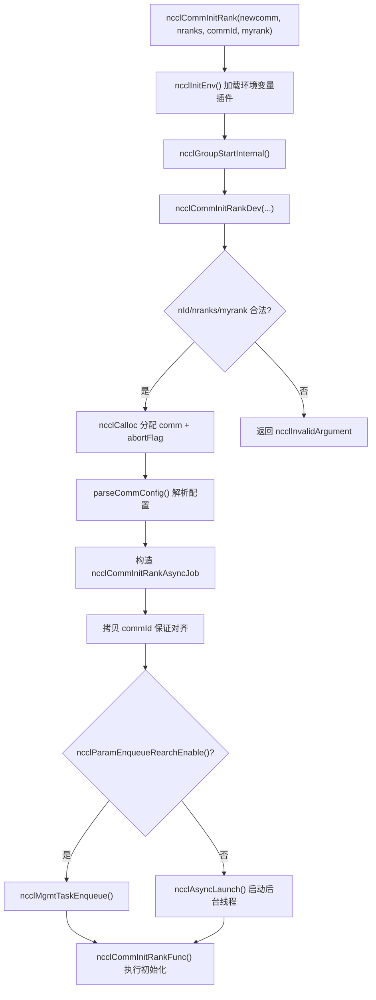
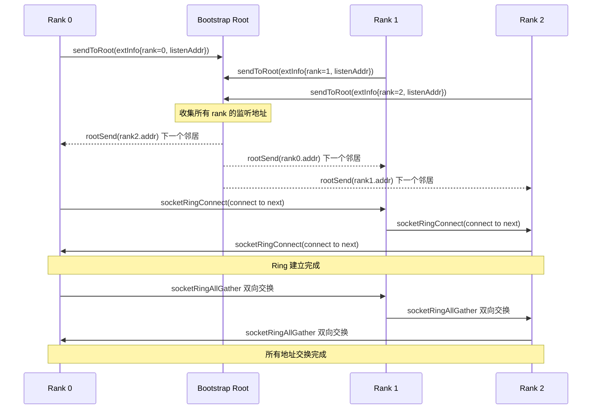
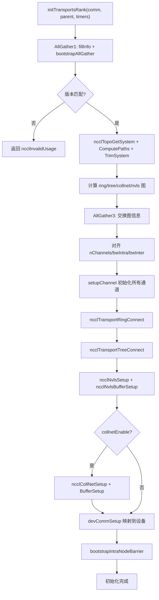

# Kapitel 3: Initialisierungseinstieg: Wie ncclCommInitRank eine Gruppe isolierter Prozesse zu einer Kommunikationsdomäne aufbaut

Im vorherigen Kapitel haben wir fünf zentrale Abstraktionen eingeführt, die sich durch das gesamte Buch ziehen: ncclComm, channel, algorithm, protocol und transport. Zusammen bilden sie das gemeinsame Vokabular für „eine Kommunikation = mehrere channel × ein algorithm × ein protocol × mehrere transport“. Jetzt wollen wir eine grundlegendere Frage beantworten: Wie genau wird dieses ncclComm-Objekt von Grund auf aufgebaut? Wenn Sie ncclCommInitRank aufrufen, muss NCCL innerhalb von einigen hundert Millisekunden eine Reihe komplexer Operationen abschließen: bestätigen, dass alle Ranks vollständig sind, Geräteinformationen austauschen, die Maschinentopologie erkennen, Datenpfade berechnen, GPU-Speicher und Host-Speicher zuweisen und all dies schließlich in einem ncclComm-Objekt bündeln. Dieses Kapitel folgt dieser Aufrufkette vom API-Einstiegspunkt bis hinunter zur letzten Kapillare von initTransportsRank.

# 3.1 API-Einstiegspunkt: die synchrone Hülle und der asynchrone Kern von ncclCommInitRank

## Intuitives Modell

`ncclCommInitRank`Oberflächlich betrachtet „erstellt man eine Kommunikationsdomäne“, tatsächlich aber wird „eine Hintergrundaufgabe gestartet und dann (standardmäßig) auf deren Abschluss gewartet“. Das ist wie beim Bestellen in einem Restaurant: Der Bestellvorgang (der API-Aufruf) kehrt sofort zurück, aber die Küche bereitet das Gericht (die eigentliche Initialisierung) im Hintergrund zu. Der standardmäßige „Blockiermodus“ lässt Sie am Tresen warten, bis das Gericht fertig ist, während der „nicht blockierende Modus“ Ihnen eine Abholnummer gibt, sodass Sie in der Zwischenzeit etwas anderes tun können.

Ohne diese asynchrone Designschicht könnte NCCL während der Initialisierung nicht mit Szenarien wie CUDA-Graph-Capture oder der parallelen Initialisierung mehrerer Kommunikationsdomänen zusammenarbeiten – jede Initialisierung würde zu einer seriellen, blockierenden Operation werden, die sich nicht mit dem Benutzercode überlappen lässt.

## Datenstrukturen und Speicherlayout

Betrachten wir zunächst den API-Einstiegspunkt selbst.`ncclCommInitRank`Es ist eine extrem dünne synchrone Hülle:

[FACT:src/init.cc:2946-2970]

Sie erledigt vier Dinge: Aufruf von`ncclInitEnv()`Laden des Umgebungsvariablen-Plugins, Aktivieren der NVTX-Leistungsmarkierungen, Auslesen der aktuellen CUDA-Gerätenummer und anschließend Aufruf von`ncclGroupStartInternal()`Eintritt in die group-Semantik und schließlich Delegierung der eigentlichen Arbeit an`ncclCommInitRankDev`。

Beachten Sie`ncclGroupStartInternal()` / `ncclGroupEndInternal()`Dieses Aufrufpaar – selbst wenn Sie nur eine Kommunikationsdomäne initialisieren, verpackt NCCL sie in die group-Semantik. Dies dient dazu, den Fall „Benutzer initialisiert mehrere Kommunikationsdomänen innerhalb einer group“ einheitlich zu behandeln und zu vermeiden, zwei Codepfade für einzelne und mehrere Kommunikationsdomänen zu schreiben.

Die eigentliche Parameterprüfung und Objektzuweisung erfolgt in`ncclCommInitRankDev`in:

[FACT:src/init.cc:2851-2943]

Diese Funktion ist die „zentrale Leitstelle“ der gesamten Kette. Sie führt zunächst die Parameterprüfung durch (`nId`Bereich,`nranks`/`myrank`Gültigkeit), weist dann die`ncclComm`Struktur selbst zu sowie drei Felder im Zusammenhang mit dem Abbruchmechanismus:`abortFlag`(hostseitiges atomares Flag),`abortFlagDev`(geräteseitig sichtbare Kopie im festen Speicher),`abortFlagRefCount`(Referenzzähler, da aus split hervorgegangene untergeordnete Kommunikationsdomänen möglicherweise das abortFlag der übergeordneten Kommunikationsdomäne gemeinsam nutzen).

Hier gibt es ein bemerkenswertes Detail –`comm->startMagic = comm->endMagic = NCCL_MAGIC`：

[FACT:src/init.cc:2886-2886]

Dieses Magic-Wert-Paar ist wie ein „Siegel“ am Anfang und Ende der`ncclComm`Struktur eingeklemmt. Jeder Out-of-Bounds-Schreibvorgang oder jede Beschädigung der Struktur zerstört dieses Magic-Paar, und nachfolgende Operationen können durch deren Überprüfung Speicherüberschreibungen erkennen. Dies ist ein kostengünstiger, aber wirksamer Schutz der Speicherintegrität.

## Step-by-Step Walkthrough

Wenn`ncclCommInitRankDev`bis zum Ende gelangt, konstruiert es eine`ncclCommInitRankAsyncJob`und startet die asynchrone Aufgabe:

[FACT:src/init.cc:2896-2929]

`job`Die Struktur trägt alle für die Initialisierung erforderlichen Parameter. Beachten Sie, dass`job->commId`eine**Kopie**ist und nicht direkt auf die vom Benutzer übergebene`commId`：

[FACT:src/init.cc:2903-2910]

verweist. Warum kopieren? Der Quellcodekommentar gibt die Antwort:`ncclUniqueId`und`ncclBootstrapHandle`haben unterschiedliche Ausrichtungsanforderungen; das vom Benutzer übergebene Array ist möglicherweise nicht korrekt an die von`ncclBootstrapHandle`benötigte Grenze ausgerichtet. Das Kopieren in neu zugewiesenen Speicher kann die Ausrichtung garantieren. Dies ist eine typische „ABI-Kompatibilitätsfalle“ – der Benutzer sieht`ncclUniqueId`, intern muss es als`ncclBootstrapHandle`verwendet werden; beide haben dieselbe Größe, aber unterschiedliche Ausrichtung.

Schließlich wird je nach Wert von`ncclParamEnqueueRearchEnable()`die Aufgabe entweder in die Verwaltungswarteschlange eingereiht oder direkt über`ncclAsyncLaunch`gestartet:

[FACT:src/init.cc:2922-2929]

`ncclAsyncLaunch`erstellt einen neuen Thread, der`ncclCommInitRankFunc`ausführt. Im Blockiermodus (Standard) wartet der Aufrufer in`ncclGroupEndInternal()`auf die Beendigung dieses Threads; im nicht blockierenden Modus kehrt der Aufrufer sofort zurück, und der Benutzer fragt den Status später über`ncclCommGetAsyncError`ab.

## Designüberlegungen

Der Kern des Designs hier ist „synchrone API + asynchrone Implementierung“. Warum lässt man`ncclCommInitRank`nicht direkt alle Initialisierungen synchron ausführen? Weil NCCL den nicht blockierenden Modus von`ncclCommInitRankConfig`unterstützen muss und der nicht blockierende Modus erfordert, dass die Initialisierung in einem Hintergrundthread läuft. Wenn der synchrone Pfad und der asynchrone Pfad zwei getrennte Codepfade wären, würde sich der Wartungsaufwand verdoppeln. Indem alles einheitlich asynchron läuft und der synchrone Pfad lediglich „nach dem Start sofort warten“ bedeutet, gibt es nur eine Codebasis.



# 3.2 Bootstrap: der erste Steuerkanal zwischen den Ranks

## Intuitives Modell

Bootstrap ist NCCLs „WeChat-Gruppe vor der Besprechung“. Bevor die eigentliche Kommunikation beginnt, müssen alle Ranks zunächst einen Steuerkanal einrichten, um Metadaten auszutauschen wie „Wer bin ich, auf welcher Maschine bin ich, welches GPU-Modell habe ich, wie lautet meine Netzwerkkartenadresse“. Ohne Bootstrap sind die Ranks eine Gruppe von Fremden, die sich gegenseitig nicht kennen und keine Kommunikation koordinieren können.

Wenn Bootstrap fehlschlägt oder eine Zeitüberschreitung auftritt, bleibt die gesamte Initialisierung der Kommunikationsdomäne hängen – dies ist eine der häufigsten Ursachen für NCCL-Hänger in Produktionsumgebungen.

## Datenstrukturen und Speicherlayout

Der Kernzustand von Bootstrap wird in der`bootstrapState`Struktur gespeichert:

[FACT:src/bootstrap.cc:527-546]

Dieses Struct hat mehrere Schlüsselfelder, die es wert sind, näher erläutert zu werden:

- `ring`: Eine Union, entweder ein Netzwerkgeräte-Handle (`net.sendComm`/`net.recvComm`) oder ein Paar von Sockets (`socket.send`/`socket.recv`). Dies entspricht zwei Bootstrap-Modi: dem standardmäßigen socketbasierten Modus und dem netzwerkgerätebasierten`NCCL_OOB_NET_ENABLE`-Modus.
- `listen`: Informationen zum Listening-Endpunkt, ebenfalls in Netzwerk- und Socket-Form verfügbar.
- `peerP2pAddresses` / `peerProxyAddresses`: Ein Array der P2P-Adressen und Proxy-Adressen aller Ranks, gefüllt durch Ring-Allgather.
- `unexpectedConnections`: Eine verkettete Liste, die "empfangene, aber noch nicht zugeordnete" Verbindungen zwischenspeichert. Dies ist ein entscheidendes Design des Bootstrap-Protokolls – da der Empfänger nicht vorhersehen kann, wer sich zuerst verbindet, müssen nicht zugeordnete Verbindungen zunächst gespeichert werden.
- `asyncSendQueue` + `asyncSendLock` + `asyncSendCond`: Asynchrone Sendewarteschlange und ihre Synchronisierungsprimitive, verwendet für gleichzeitiges Senden im TLS-verschlüsselten Modus.

`bootstrapState`Die Zuweisung von  erfolgt am Anfang von`bootstrapInit`:

[FACT:src/bootstrap.cc:769-776]

Beachten Sie die Zeile`comm->bootstrap = state`– der Bootstrap-Zustand wird an die Kommunikationsdomäne angehängt, und alle nachfolgenden Bootstrap-Operationen greifen über`comm->bootstrap`darauf zu.

## Step-by-Step Walkthrough

`bootstrapInit`ist die Hauptfunktion des Bootstraps. Zerlegen wir sie in Ausführungsreihenfolge:

**Erster Schritt: Magic-Wert bestimmen.**magic ist das "Erkennungssignal" der Bootstrap-Kommunikation – nur Ranks mit demselben magic können sich miteinander verbinden.

[FACT:src/bootstrap.cc:778-788]

Bei normaler Initialisierung (`handles != NULL`) stammt magic vom ersten Handle; bei split/grow (`parent != NULL`) wird magic über`hashCombine(parent->magic, parent->childCount)`abgeleitet. Dies stellt sicher, dass jede Unterkommunikationsdomäne ein eindeutiges magic hat.

**Zweiter Schritt: Listening-Socket erstellen.**Jeder Rank benötigt zwei Listening-Endpunkte: einen für Ring-Nachbarverbindungen (`STATE_LISTEN(state, socket)`) und einen für Root-Verbindungen (`listenSockRoot`）：

[FACT:src/bootstrap.cc:797-831]

Hier gibt es eine entscheidende Aufgabenteilung: Der Ring-Listening-Socket verwendet`comm->magic`, während der Root-Listening-Socket`BOOTSTRAP_HANDLE(handles, curr_root)->magic`verwendet. Warum? Weil Root der globale Koordinator ist und alle Ranks sich mit ihm verbinden müssen, verwendet er ein einheitliches magic; Ring-Nachbarn sind punktuell, daher reicht das magic der Kommunikationsdomäne selbst aus.

**Dritter Schritt: Zeitversetzte Verbindung.**Wenn die Anzahl der Ranks sehr groß ist, führen gleichzeitige Verbindungen aller Ranks zum Root zu einem Verbindungssturm. NCCL verwendet`NCCL_UID_STAGGER_RATE`und`NCCL_UID_STAGGER_THRESHOLD`zur Steuerung der Zeitversetzung:

[FACT:src/bootstrap.cc:833-843]

Wenn die Anzahl der Ranks, die ein Root verwaltet, einen Schwellenwert überschreitet (Standard 256), berechnet jeder Rank basierend auf seiner lokalen ID unter dem Root die Verzögerung in Mikrosekunden und schläft dann. Dies ist eine einfache, aber effektive "Token-Bucket"-artige Ratenbegrenzung.

**Vierter Schritt: Eigene Verbindungsinformationen an den Root senden.**Jeder Rank sendet seine Listening-Adresse an den Root:

[FACT:src/bootstrap.cc:845-867]

Nachdem der Root die Informationen aller Ranks erhalten hat, führt er eine "Ring-Paarung" durch – er sendet die Adresse von Rank i an Rank i-1 und die Adresse von Rank i+1 an Rank i. So kennt jeder Rank seine Vorgänger- und Nachfolgernachbarn im Ring.

**Fünfter Schritt: Ring-Verbindung herstellen.**Jeder Rank verbindet sich mit seinem "nächsten" Nachbarn und akzeptiert gleichzeitig die Verbindung des "vorherigen" Nachbarn:

[FACT:src/bootstrap.cc:885-894]

Hier verwendet`socketRingConnect`intern`bootstrapConcurrent`– im TLS-verschlüsselten Modus müssen connect und accept gleichzeitig ausgeführt werden, sonst kommt es zu einem Deadlock (da der TLS-Handshake die gleichzeitige Teilnahme beider Seiten erfordert). Im unverschlüsselten Modus werden connect und accept seriell ausgeführt.

**Sechster Schritt: AllGather aller Adressen.**Nachdem der Ring aufgebaut ist, wird über`ringAllInfo`ein AllGather aller P2P-Adressen, Proxy-Adressen und UDS-Adressen aller Ranks durchgeführt:

[FACT:src/bootstrap.cc:934-938]

`ringAllInfo`ruft intern`bootstrapAllGather`auf, welches im Socket-Modus`socketRingAllGather`verwendet – einen bidirektionalen Ring-AllGather-Algorithmus, bei dem N Ranks nur N/2 Schritte benötigen:

[FACT:src/bootstrap.cc:1363-1412]

Dieser bidirektionale Algorithmus ist die entscheidende Leistungsoptimierung des Bootstraps. Der traditionelle unidirektionale Ring-AllGather benötigt N-1 Schritte, die bidirektionale Version halbiert die Schrittzahl. In jedem Schritt werden gleichzeitig Daten in beide Richtungen gesendet und empfangen, wobei`socketDoubleSendRecv`4 Operationen (2 Senden, 2 Empfangen) in einen einzigen Systemaufruf bündelt.

## Nebenläufigkeitskontrolle und zugrundeliegende Interaktion

Die Nebenläufigkeitskontrolle des Bootstraps hat mehrere Ebenen:

**Erste Ebene: Abbruchprüfung.**Alle blockierenden Schleifen prüfen regelmäßig das abortFlag:

[FACT:src/bootstrap.cc:150-159]

`BOOTSTRAP_N_CHECK_ABORT`ist auf 10000 gesetzt, was bedeutet, dass alle 10000 Schleifendurchläufe das Abbruch-Flag geprüft wird. Diese Zahl ist ein Kompromiss zwischen Leistung und Reaktionsfähigkeit – zu häufige Prüfungen beeinträchtigen die Leistung, zu seltene führen zu verzögerter Abbruchreaktion.

**Zweite Ebene: Asynchrone Sendewarteschlange.**Im TLS-verschlüsselten Modus kann`bootstrapSend`nicht synchron ausgeführt werden (da der TLS-Handshake die Teilnahme des Empfängers erfordert), daher legt NCCL die Sendevorgänge in einen separaten Thread:

[FACT:src/bootstrap.cc:1161-1217]

Hier gibt es einen raffinierten Reihenfolgemechanismus.`bootstrapAsyncSendMain`prüft vor dem Senden, ob sich in der Warteschlange ein "früherer, an denselben (peer, tag) gerichteter Sendevorgang" befindet:

[FACT:src/bootstrap.cc:1124-1152]

Warum muss die Sendereihenfolge für dasselbe (peer, tag) gewährleistet sein? Die Quellcode-Kommentare erklären es klar: Der Empfänger ordnet Verbindungen nach (peer, tag) zu. Wenn zwei Nachrichten an dasselbe (peer, tag) in vertauschter Reihenfolge ankommen, ordnet der Empfänger sie falsch zu. Während der NVLS-Initialisierung wird mehrfach mit demselben Tag an denselben Peer gesendet, daher ist diese Reihenfolgegarantie erforderlich.

**Dritte Ebene: Warteschlange für unerwartete Verbindungen.**Der Empfänger kann nicht vorhersehen, wer sich zuerst verbindet, daher`socketAccept`werden nicht übereinstimmende Verbindungen in eine`unexpectedConnections`verknüpfte Liste eingefügt:

[FACT:src/bootstrap.cc:1276-1300]

Dieses Design löst ein klassisches verteiltes Problem: Mehrere Ranks können gleichzeitig Verbindungen zu dir initiieren, aber deine`bootstrapRecv`Aufrufreihenfolge ist fest. Wenn nicht übereinstimmende Verbindungen direkt verworfen werden, läuft der Sender in einen Timeout; wenn blockierend gewartet wird, kann ein Deadlock entstehen. Das Einfügen in eine Warteschlange ist die sicherste Vorgehensweise.

## Produktions-Fallstricke

**Fallstrick 1: Bootstrap-Timeout führt zum Hängen der Initialisierung.**Wenn ein Rank aufgrund von Netzwerkproblemen keine Verbindung zum Root herstellen kann, warten alle anderen Ranks unendlich lange auf`ncclSocketAccept`oder`ncclSocketRecv`. NCCL hat keinen integrierten Bootstrap-Timeout-Mechanismus; der einzige Ausweg ist abortFlag. In Produktionsumgebungen wird empfohlen,`NCCL_UID_STAGGER_RATE`festzulegen, um Verbindungsstürme in großen Clustern abzumildern.

**Fallstrick 2:`NCCL_COMM_ID`Konflikt mit mehreren Handles.**Wenn der Benutzer die Umgebungsvariable`NCCL_COMM_ID`setzt, zwingt NCCL`nId`auf 1 herunter:

[FACT:src/init.cc:2912-2921]

Das bedeutet, dass die Multi-Handle-Funktion von`ncclCommInitRankScalable`stillschweigend deaktiviert wird. Wenn du scalable-Initialisierung verwendest und gleichzeitig`NCCL_COMM_ID`setzt, weicht das Verhalten von deinen Erwartungen ab.

**Fallstrick 3: Deadlock im TLS-Modus.**Im TLS-verschlüsselten Modus blockieren beide Seiten im TLS-Handshake, wenn connect und accept nicht parallel ausgeführt werden.`bootstrapConcurrent`wurde genau entwickelt, um dieses Problem zu lösen:

[FACT:src/bootstrap.cc:648-669]

Im unverschlüsselten Modus wird seriell ausgeführt (zuerst send, dann recv); im verschlüsselten Modus wird ein Thread für send gestartet und der Hauptthread übernimmt recv.



# 3.3 commAlloc: Das Speichergerüst des Kommunikationsdomänen-Objekts

## Intuitives Modell

`commAlloc`ist die „Rohbauübergabe" der Kommunikationsdomäne – es wird Speicher für die Struktur zugewiesen, alle Felder auf sichere Standardwerte initialisiert, notwendige CUDA-Objekte und Synchronisierungsprimitive erstellt, aber die „Innenausbau"-Inhalte wie Topologieinformationen, Kanal Konfiguration und Transportverbindungen sind noch nicht gefüllt. Wenn man`ncclComm`mit einem Gebäude vergleicht,`commAlloc`ist das Fundamentlegen und Rahmenbauen,`initTransportsRank`ist erst die Innenausstattung.

Ohne die Initialisierung von`commAlloc`würde nachfolgender Code auf nicht initialisierte Felder zugreifen und unvorhersehbares Verhalten verursachen – zum Beispiel, wenn`comm->channels[c].id`ein Zufallswert wäre, würde die Kanalinitialisierungslogik den Kanalzustand falsch beurteilen.

## Datenstruktur und Speicherlayout

`commAlloc`Signatur und Anfangsvalidierung von

[FACT:src/init.cc:512-526]

:`ndev`Es validiert zunächst die Gültigkeit von`rank`und`memPermanent`, konstruiert dann zwei Speicherstapel (`memScoped`und`rank`), setzt`nRanks`und`memPermanent`. Diese beiden Speicherstapel sind die Speicherverwaltungsinfrastruktur von NCCL –`memScoped`wird für Zuweisungen mit derselben Lebensdauer wie die Kommunikationsdomäne verwendet,

für temporäre Zuweisungen.

[FACT:src/init.cc:528-531]

`cudaGetDevice`Als Nächstes folgt die CUDA-Geräteerkennung:`ncclCudaCompCap`ruft die aktuelle Gerätenummer ab,

ruft die Rechenfähigkeit ab. Die Quellcode-Kommentare sagen es ganz direkt: „Try to create a CUDA object right away. If there is something wrong with the device we're on, better know it early." – Geräteprobleme frühzeitig aufdecken, um zu vermeiden, dass sie erst spät in der Initialisierung entdeckt werden.

[FACT:src/init.cc:533-555]

Dann folgt die Zuweisung oder Vererbung gemeinsamer Ressourcen:`parent == NULL || !parent->shareResources`Hier gibt es eine wichtige Verzweigung: Wenn`ncclSharedResources`, wird ein neues`ncclSharedResources`erstellt; andernfalls werden die gemeinsamen Ressourcen der übergeordneten Kommunikationsdomäne geerbt und der Referenzzähler erhöht.

enthält Geräte-Streams, Host-Streams, Start-Events, Scratch-Events usw. – diese Ressourcen können im Split-Szenario von untergeordneten Kommunikationsdomänen wiederverwendet werden, um doppelte Erstellung zu vermeiden.`sharedRes->refCount = 1`Beachte die Zeile

– der anfängliche Referenzzähler ist 1, wird bei jeder Split-Freigabe erhöht und erst beim Freigeben der letzten Referenz tatsächlich zerstört.

[FACT:src/init.cc:547-549]

Als Nächstes folgt die Initialisierung von Netzwerk, RMA und GIN:`ncclNetInit`Diese drei Subsysteme sind jeweils für Netzwerktransport, Remote-Speicherzugriff und GPU-initiierte Netzwerkkommunikation zuständig. Ihre Initialisierungsreihenfolge ist wichtig –`ncclRmaInit`muss vor

erfolgen, da RMA vom Netzwerk-Plugin abhängt.

[FACT:src/init.cc:567-576]

Initialisierung des Speichermanagers:`ncclMemManager`Auch hier gibt es die beiden Pfade Shared/Neu.

ist für die Verwaltung des CUDA-Speicherpools und des Registrierungs-Caches zuständig.

[FACT:src/init.cc:607-608]

Kanalinitialisierungsmarkierung:`id`Diese Zeile setzt`setupChannel`aller Kanäle auf -1, was „nicht initialisiert" bedeutet. Das spätere

prüft diesen Wert, um zu entscheiden, ob eine Initialisierung erforderlich ist.

[FACT:src/init.cc:619-632]

Konstruktion der Interrupt-Warteschlangen:`commAlloc`NCCL verwendet intrusive Queues zur Verwaltung verschiedener Aufgaben. Diese Warteschlangen werden in der

-Phase alle leer konstruiert und bei späterer Aufgabeneinreihung direkt verwendet.

[FACT:src/init.cc:636-652]

Erstellung des CUDA-Speicherpools:`cudaDevAttrMemoryPoolsSupported`Wenn das Gerät Speicherpools unterstützt (`~uint64_t(0)`), wird ein Speicherpool vom Typ pinned erstellt und der Freigabeschwellenwert auf den Maximalwert (

## Step-by-Step Walkthrough

) gesetzt, was „niemals automatisch freigeben" bedeutet. Dies soll verhindern, dass die CUDA-Laufzeit Speicher ohne Wissen von NCCL zurückfordert.

1. `commAlloc(comm, NULL, 8, rank)`Verfolgen wir ein konkretes Initialisierungsszenario: Einzelmaschine mit 8 GPUs, ein Rank pro Prozess, normale Initialisierung.`parent == NULL`。

wird aufgerufen,`comm->rank = rank`，`comm->nRanks = 8`。

3. `cudaGetDevice`2. Validierung bestanden,`comm->compCap`gibt die aktuelle Gerätenummer zurück,

wird gesetzt.`ncclSharedResources`4. Neues

5. `ncclNetInit`Netzwerk-Plugin initialisieren (möglicherweise Socket oder IB).

6. `ncclMemManagerInit`Speichermanager erstellen.

7. `getBusId`PCI-Bus-ID abrufen,`ncclNvmlDeviceGetHandleByPciBusId`NVML-Handle abrufen.

8. `dmaBufSupported`DMA-BUF-Unterstützung erkennen.

9. Zuweisen`connectSend` / `connectRecv`Bitmap-Array.

10. Alle Kanäle`id`auf -1 setzen.

11. Alle Interrupt-Warteschlangen konstruieren.

12. CUDA-Speicherpool erstellen.

## Designüberlegungen

`commAlloc`Das bemerkenswerteste Design ist das Prinzip "so früh wie möglich scheitern". Es ruft`cudaGetDevice`am Anfang der Funktion auf, anstatt zu warten, bis später Geräteinformationen benötigt werden. Der Vorteil: Wenn das Gerät Probleme hat (z. B. von einem anderen Prozess exklusiv belegt ist), wird der Fehler früh in der Initialisierung aufgedeckt, nicht erst nachdem viel Speicher zugewiesen wurde.

Ein weiteres Design ist die Initialisierung von`preconnectNext`:

[FACT:src/init.cc:598-598]

`reinterpret_cast<struct ncclComm*>(0x1)`ist ein Sentinel-Wert, der den Zustand "nächste Vorverbindung" markiert. Diese Technik, einen ungültigen Zeigerwert als Statusmarkierung zu verwenden, ist in der Systemprogrammierung weit verbreitet – sie spart Speicher im Vergleich zu einem zusätzlichen booleschen Feld, aber man muss darauf achten, ihn nicht zu dereferenzieren.

# 3.4 initTransportsRank: Topologie-Erkennung und Kanalzuweisung

## Intuitives Modell

`initTransportsRank`ist das "Herz" der Initialisierung. Es erledigt drei wichtige Dinge: Austausch aller Geräte- und Topologieinformationen aller Ranks durch zwei AllGathers; Berechnung der Graphstrukturen für Algorithmen wie ring/tree/collnet/nvls basierend auf diesen Informationen; abschließend Aufbau aller Transportverbindungen. Wenn man die Kommunikationsdomäne mit einem städtischen Verkehrssystem vergleicht,`initTransportsRank`ist der Prozess der Planung aller Straßen, Überführungen und Buslinien.

Ohne diesen Schritt wüsste NCCL nicht, welchen Weg die Daten nehmen sollen – es könnte Daten Umwege schicken lassen oder gar keinen erreichbaren Pfad finden.

## Datenstrukturen und Speicherlayout

`initTransportsRank`hat sehr viele lokale Variablen; wir schauen uns die wichtigsten an:

[FACT:src/init.cc:1163-1179]

Hier werden die einzelnen Graphstrukturen aus dem`comm->graphs`-Array herausgezogen und Aliase erstellt.`graphs`Das Array ist nach Algorithmus indiziert; beachten Sie, dass`nvlsGraph`zweimal verwendet wird (NVLS und NVLSTree teilen sich dieselbe Graphstruktur).

Zwei wichtige temporäre Strukturen:

[FACT:src/init.cc:1181-1206]

`graphInfo`speichert die Graphinformationen eines einzelnen Ranks für einen bestimmten Algorithmus (Kanalanzahl, Bandbreite, Typ usw.),`allGatherInfo`ist die Dateneinheit für AllGather und enthält die Graphinformationen aller Algorithmen plus Topologie-Rank-Informationen.

## Step-by-Step Walkthrough

**Phase eins: AllGather1 – Geräteinformationen austauschen.**

[FACT:src/init.cc:1234-1239]

Jeder Rank ruft`fillInfo`auf, um seine eigenen`ncclPeerInfo`zu füllen, und tauscht sie dann über`bootstrapAllGather`aus.`fillInfo`Die gefüllten Informationen umfassen: Rank-Nummer, CUDA-Gerätenummer, NVML-Gerätenummer, NCCL-Version, Git-Hash, Host-Hash, Prozess-Hash, GPU-UUID, Bus-ID, Speichergröße, Treiberversion usw.

[FACT:src/init.cc:888-982]

Beachten Sie`info->hostHash = getHostHash() + commHash`und`info->pidHash = getPidHash() + commHash`– Host-Hash und PID-Hash werden um den commHash ergänzt. Dies dient dazu, verschiedene Kommunikationsdomänen auf derselben Maschine zu unterscheiden.

Nach Abschluss des AllGather durchläuft jeder Rank die Informationen aller Peers und berechnet globale Attribute:

[FACT:src/init.cc:1250-1303]

Diese Schleife erledigt vieles: Versionsinkompatibilitäten erkennen, Knotenanzahl zählen,`cuMemSupport`schneiden, erkennen, ob mehrere Ranks dieselbe GPU verwenden, Schnittmenge der GIN-Typ-Masken berechnen usw. Beachten Sie die Zählweise von`nNodes`– bei jedem unterschiedlichen hostHash wird inkrementiert, was voraussetzt, dass die Ranks knotenweise zusammenhängend angeordnet sind.

**Phase zwei: Topologie-Erkennung.**

[FACT:src/init.cc:1390-1403]

Diese sechs Schritte sind der Kernprozess der Topologie-Erkennung:`ncclTopoGetSystem`Systemgeräte aufzählen und Topologiegraph aufbauen,`ncclTopoComputePaths`Pfade von GPU zu NIC berechnen,`ncclTopoTrimSystem`nicht erreichbare Geräte entfernen und Pfade erneut berechnen,`ncclTopoSearchInit`Suchzustand initialisieren und schließlich die Topologie ausgeben.

**Phase drei: Graphberechnung.**

[FACT:src/init.cc:1421-1468]

Nacheinander werden fünf Graphen berechnet: ring, tree, collnet chain, collnet direct, nvls. Jeder Graph hat unterschiedliche Pattern- und Kanalanzahl-Einschränkungen. Beachten Sie`treeGraph->minChannels = ringGraph->nChannels`– die Kanalanzahl von tree wird auf dieselbe wie die von ring beschränkt, um die Kanalausrichtung zwischen verschiedenen Algorithmen sicherzustellen.

**Phase vier: AllGather3 – Graphinformationen austauschen.**

[FACT:src/init.cc:1490-1533]

Jeder Rank trägt seine Graphinformationen in`allGather3Data[rank]`ein und ruft dann erneut`bootstrapAllGather`auf. Die diesmal ausgetauschten Informationen umfassen: pattern/nChannels/bwIntra/bwInter/typeIntra/typeInter/crossNic für jeden Algorithmus, CPU-Architektur, P2P-Kanalanzahl, Anzahl der Netzwerkgeräte, Anzahl der CollNet-Geräte usw.

Nach Abschluss von AllGather3 durchläuft jeder Rank die Graphinformationen aller Peers und gleicht sie durch Minimum/Maximum ab:

[FACT:src/init.cc:1687-1703]

Beachten Sie die Abgleichsstrategie hier:`nChannels`、`sameChannels`、`bwIntra`、`bwInter`Minimum nehmen,`typeIntra`、`typeInter`、`crossNic`Maximum nehmen. Warum? Weil Kanalanzahl und Bandbreite durch die schwächste Verbindung begrenzt sind, während Typ und crossNic vereinigt werden müssen, um Kompatibilität sicherzustellen.

**Phase fünf: Transportverbindungen aufbauen.**

[FACT:src/init.cc:1811-1892]

Hier gibt es zwei Zweige:`runtimeConn`Wenn wahr, nur Kanal-Setup ohne Verbindung (Verbindung wird auf Laufzeit verschoben), andernfalls sofort alle Verbindungen aufbauen. Die Verbindungsreihenfolge ist: ring → tree → NVLS → PAT → NVLS tree → CollNet.

## Nebenläufigkeitskontrolle und Hardware-Interaktion

`initTransportsRank`Es gibt einige bemerkenswerte Nebenläufigkeits-/Hardware-Interaktionspunkte in

**CPU-Affinitätseinstellung:**

[FACT:src/init.cc:1406-1412]

NCCL bindet den aktuellen Thread an einen CPU-Kern in der Nähe der GPU, um sicherzustellen, dass die Host-Speicherzuweisung auf dem lokalen NUMA-Knoten erfolgt. Dies reduziert die Latenz bei NUMA-übergreifenden Zugriffen.

**NVLS-Initialisierung:**

[FACT:src/init.cc:1419-1419]

`ncclNvlsInit`Erkennung der NVLink-SHARP-Unterstützung. NVLS ermöglicht es dem Switch, Reduce-Operationen direkt auszuführen, was die AllReduce-Latenz erheblich reduziert.

**Proxy-Thread-Erstellung:**

[FACT:src/init.cc:1780-1786]

Der Proxy-Thread ist für die asynchrone Abwicklung der Netzwerk-I/O verantwortlich. Er wird in`initTransportsRank`erstellt, und danach laufen alle Netzwerkoperationen über den Proxy.

## Produktions-Fallstricke vermeiden – Leitfaden

**Fallstrick 1: Anzahl der Netzwerkgeräte stimmt nicht überein.**Wenn die Anzahl der lokalen Netzwerkkarten verschiedener Ranks unterschiedlich ist, meldet NCCL einen Fehler:

[FACT:src/init.cc:1576-1596]

Es sei denn, man setzt`NCCL_IGNORE_NET_MISMATCH=1`. Dies ist in heterogenen Clustern häufig anzutreffen – einige Knoten haben 8 Netzwerkkarten, andere nur 4. Das Ignorieren der Nichtübereinstimmung kann zu Leistungseinbußen führen, da die Anzahl der Kanäle durch den schwächsten Knoten begrenzt wird.

**Fallstrick 2: Mehrere Ranks teilen sich dieselbe GPU.**Wenn zwei Ranks dieselbe GPU-UUID haben, verweigert NCCL die Initialisierung:

[FACT:src/init.cc:1291-1296]

Es sei denn, man setzt`NCCL_MULTI_RANK_GPU_ENABLE=1`. Diese Prüfung verhindert Leistungsprobleme durch Fehlkonfiguration des Benutzers.

**Fallstrick 3: Unzureichende Anzahl von CollNet-Knoten.**CollNet benötigt mindestens`NCCL_COLLNET_NODE_THRESHOLD`Knoten, um aktiviert zu werden:

[FACT:src/init.cc:1720-1728]

Der Standard-Schwellenwert ist 2. In einer Single-Node-Umgebung wird CollNet automatisch deaktiviert.



# 3.5 NCCL_PARAM: Die Compile-Zeit-Magie des Umgebungsvariablen-Systems

## Intuitives Modell

`NCCL_PARAM`ist die „Konfigurationsschalter-Fabrik" von NCCL. Es verwendet Makros, um zur Compile-Zeit eine Funktion zu generieren, die beim ersten Aufruf zur Laufzeit die Umgebungsvariable liest und das Ergebnis zwischenspeichert. Das ist wie ein Lichtschalter zu Hause – man drückt ihn (ruft die Funktion auf), das Licht geht an (gibt den Konfigurationswert zurück), und danach wird der Schalterzustand gemerkt, sodass man nicht jedes Mal erneut drücken muss.

Ohne diesen Mechanismus müsste NCCL an jeder Stelle, an der eine Konfiguration verwendet wird, manuell`getenv`aufrufen und den String parsen, was den Code extrem langwierig und fehleranfällig machen würde.

## Datenstruktur und Speicherlayout

`NCCL_PARAM`Definition des Makros:

[FACT:src/include/param.h:22-31]

Dieses Makro generiert nach der Expansion eine Funktion`ncclParam##name()`, die intern drei statische Variablen enthält:

- `uninitialized = INT64_MIN`: Sentinel-Wert, der „noch nicht initialisiert" bedeutet.
- `noCache`: Drei-Zustands-Flag, -1 bedeutet nicht initialisiert, 0 bedeutet cachen, 1 bedeutet nicht cachen.
- `cache`: Der zwischengespeicherte Wert, initial`uninitialized`。

Die Funktionslogik ist: Wenn`cache`noch`uninitialized`ist, wird`ncclLoadParam`aufgerufen, um zu laden; andernfalls wird direkt`cache`。`COMPILER_EXPECT(..., false)`zurückgegeben.  teilt dem Compiler mit, dass dieser Zweig selten durchlaufen wird, um den Hot Path zu optimieren.

`ncclLoadParam`Implementierung:

[FACT:src/misc/param.cc:78-108]

Es verwendet einen Mutex, um den gesamten Ladevorgang zu schützen, prüft zuerst die`noCache`Strategie, dann ob der Cache gültig ist, und liest anschließend die Umgebungsvariable und parst sie. Bei Parse-Fehlern wird der Standardwert verwendet und eine Warnung ausgegeben.

## Step-by-Step Walkthrough

Am Beispiel von`NCCL_PARAM(BuffSize, "BUFFSIZE", -2)`:

[FACT:src/init.cc:1007-1007]

Nach der Makro-Expansion wird generiert:

```cpp
int64_t ncclParamBuffSize() {
  constexpr int64_t uninitialized = INT64_MIN;
  static int8_t noCache = -1;
  static_assert(-2 != uninitialized, "...");
  static int64_t cache = uninitialized;
  if (COMPILER_EXPECT(COMPILER_ATOMIC_LOAD(&cache, std::memory_order_relaxed) == uninitialized, false)) {
    return ncclLoadParam("NCCL_BUFFSIZE", -2, uninitialized, &cache, &noCache);
  }
  return cache;
}
```

Beim ersten Aufruf ist`cache == uninitialized`, und es wird`ncclLoadParam`betreten. Es liest die`NCCL_BUFFSIZE`Umgebungsvariable und gibt den Standardwert -2 zurück, wenn sie nicht gesetzt ist. Dann wird gemäß der`noCache`Strategie entschieden, ob zwischengespeichert wird.

`noCache`Die  Strategie wird durch`ncclParamIsCacheDisabled`bestimmt:

[FACT:src/misc/param.cc:74-76]

Wenn der Umgebungsvariablenname einem bestimmten Muster entspricht (z. B. auf`_`endet), wird nicht zwischengespeichert und jedes Mal neu gelesen. Dies ermöglicht dem Benutzer, bestimmte Konfigurationen zur Laufzeit dynamisch zu ändern.

## Designüberlegungen

Das Raffinierte an diesem Design ist die „Zero-Cost-Abstraktion": Auf dem Hot Path gibt es nur einen atomaren Ladevorgang und einen Vergleich, keine Locks, kein String-Parsing. Nur der Cold Path (erstes Laden) zahlt den vollen Preis.`COMPILER_EXPECT`weist den Compiler an, den Hot Path im vorderen Teil des Instruction Cache zu platzieren, um die Leistung weiter zu verbessern.

Ein weiteres Design ist das Drei-Zustands-Design von`noCache`. -1 bedeutet „noch nicht entschieden", 0 bedeutet „cachen", 1 bedeutet „nicht cachen". Diese Entscheidung wird nur einmal beim ersten Laden getroffen und danach nicht mehr geändert.

## Produktions-Fallstricke vermeiden – Leitfaden

**Fallstrick 1: Tippfehler bei Umgebungsvariablen.**Wenn der Benutzer`NCCL_BUFSIZE`statt`NCCL_BUFFSIZE`schreibt, meldet NCCL keinen Fehler, sondern verwendet einfach den Standardwert. Es wird empfohlen,`NCCL_DEBUG=ENV`zu verwenden, um alle erkannten Umgebungsvariablen anzuzeigen.

**Fallstrick 2:`NCCL_CONF_FILE`Ladereihenfolge.**NCCL lädt nacheinander`$NCCL_CONF_FILE`(oder`~/.nccl.conf`) und`/etc/nccl.conf`：

[FACT:src/misc/param.cc:52-67]

Später geladene Dateien überschreiben früher geladene. Wenn beide Dateien dieselbe Variable setzen,`/etc/nccl.conf`wird der Wert von  wirksam.

**Fallstrick 3:`noCache`Thread-Sicherheit der Variable.**Der Quellcode-Kommentar besagt: „noCache is only load/stored within the mutex, no need for atomic":

[FACT:src/misc/param.cc:74-76]

Das bedeutet, dass Lesen und Schreiben von`noCache`unter Mutex-Schutz stehen und keine atomaren Operationen erfordern. Aber das Lesen von`cache`ist lock-free (Hot Path), daher wird atomares Laden verwendet.

# 3.6 devCommSetup: Die Kommunikationsdomäne auf das Gerät abbilden

## Intuitives Modell

`devCommSetup`ist die „geräteseitige Projektion" der Kommunikationsdomäne. GPU-Kernel laufen auf dem Gerät und können nicht direkt auf die`ncclComm`Struktur im Host-Speicher zugreifen. Daher muss NCCL die Schlüsselfelder der Kommunikationsdomäne in gerätezugänglichen Speicher kopieren, um`ncclDevComm`zu bilden. Das ist wie eine Kopie des Firmen-Telefonbuchs an jeden Arbeitsplatz zu legen – die Mitarbeiter müssen nicht jedes Mal zur Rezeption laufen, um nach der Telefonnummer eines Kollegen zu fragen.

Ohne`devCommSetup`kann der GPU-Kernel nicht wissen, welchen Rank, welche Kanal-Konfiguration, welche Puffergröße usw. er hat, und der kollektive Kommunikations-Kernel kann überhaupt nicht starten.

## Datenstruktur und Speicherlayout

`devCommSetup`verwendet eine temporäre Struktur`ncclKernelCommAndChannels`, um die auf das Gerät zu kopierenden Daten zu verpacken:

[FACT:src/init.cc:712-746]

Diese Struktur enthält`ncclDevComm`(geräteseitige Kommunikationsdomäne) und das Kanal-Array. Die Funktion füllt zuerst die hostseitigen Daten in die temporäre Struktur und führt dann ein einmaliges`cudaMemcpyAsync`auf das Gerät durch.

Befüllung der Schlüsselfelder:

[FACT:src/init.cc:734-746]

Beachten Sie`comm->devComm = &devCommAndChans->comm`– die hostseitige`comm->devComm`zeigt auf`ncclDevComm`im Gerätespeicher. Beim späteren Kernel-Start wird`comm->devComm`als Parameter übergeben.

Füllen der Kanalinformationen:

[FACT:src/init.cc:829-843]

Die Zeiger peers, ring, tree, collnetChain, collnetDirect und nvls jedes Kanals werden auf die Geräteseite kopiert. Beachten Sie`ring.userRanks`erfordert eine zusätzliche`cudaMemcpyAsync`, da es sich um ein Array handelt.

## Step-by-Step Walkthrough

1. Gerätestream abrufen:`ncclStrongStreamAcquire`Einen starken Stream (strong stream) abrufen, um sicherzustellen, dass nachfolgende asynchrone Kopien geordnet ausgeführt werden.

2. Gerätespeicher zuweisen:`ncclCudaCallocAsync`Zuweisen`devCommAndChans`。

3. Temporäre Host-seitige Struktur füllen: rank, nRanks, node, nNodes, abortFlag, buffSizes usw. setzen.

4. Zuweisen und kopieren`rankToLocalRank`Array.

5. Berechnen`workFifoBytes`: Abhängig vom CC-Status (Confidential Computing) entscheiden.

6. workFifo-Puffer zuweisen: Im GDR-Modus`ncclGdrCudaCalloc`verwenden, andernfalls`ncclCudaHostCalloc`。

7. Profiler-Zähler zuweisen.

8. Fortschrittszähler zuweisen (falls aktiviert).

9. Kanalinformationen füllen.

10. Einmalige Kopie auf das Gerät:`ncclCudaMemcpyAsync(devCommAndChans, &tmpCommAndChans, 1, deviceStream)`。

11. Starken Stream freigeben und synchronisieren.

## Designüberlegungen

`devCommSetup`Das bemerkenswerteste Design in ist die "Batch-Kopie". NCCL ruft nicht für jedes Feld einzeln`cudaMemcpy`auf, sondern packt alle Felder in eine temporäre Struktur und erledigt alles mit einem einzigen`cudaMemcpyAsync`. Dies reduziert die Anzahl der CUDA-API-Aufrufe und den Synchronisierungsaufwand erheblich.

Ein weiteres Design ist`workFifoBytes`die CC-Behandlung:

[FACT:src/init.cc:750-763]

Im CC-Modus (Confidential Computing)`workFifoBytes`wird auf 0 gesetzt, da GDR-Kopien im CC-Modus nicht verfügbar sind. Dies ist eine elegante Degradierung aufgrund einer Hardware-Einschränkung.

## Produktions-Fallstricke

**Falle eins:`devCommSetup`muss vor der Barriere aufgerufen werden.**Der Quellcode-Kommentar erklärt den Grund:

[FACT:src/init.cc:1950-1952]

Wenn es nach der Barriere aufgerufen wird, haben möglicherweise bereits Threads mit dem Start des NCCL-Kernels begonnen, während der Gerätespeicher noch nicht vollständig zugewiesen ist, was zu einem Deadlock führt.

**Falle zwei:`workFifoBytes`muss eine Zweierpotenz sein.**Andernfalls warnt NCCL und verwendet den Standardwert:

[FACT:src/init.cc:757-762]

# Gedanken und Selbsttest dieses Kapitels

Q1: Wenn die Logik in[FACT:src/init.cc:1291-1296]zur Erkennung "mehrere Ranks verwenden dieselbe GPU" entfernt würde, in welchen Szenarien würde dies zu Problemen führen? Warum lehnt NCCL diese Konfiguration standardmäßig ab?

**Referenzanalyse**：

Dieser Code prüft, ob die GPU-UUIDs zweier Ranks auf demselben Host identisch sind. Wenn sie identisch sind und`NCCL_MULTI_RANK_GPU_ENABLE=0`(Standard), wird`ncclInvalidUsage`。

zurückgegeben. Nach Entfernen dieser Prüfung würden mehrere Ranks dieselbe GPU gemeinsam nutzen. Dies führt zu:

1. **P2P-Übertragungskonflikten**: NCCLs P2P-Übertragung geht davon aus, dass jeder Rank eine GPU exklusiv nutzt. Wenn zwei Ranks eine GPU gemeinsam nutzen, schreiben sie gleichzeitig in denselben Puffer derselben GPU, was zu Datenrennen und fehlerhaften Ergebnissen führt.

2. **Kanalzuweisungskonflikten**：`comm->channels`Die Kanalressourcen (Puffer, FIFO) in werden pro Rank zugewiesen. Ranks, die eine GPU gemeinsam nutzen, konkurrieren um dieselben Ressourcen.

3. **Leistungskatastrophe**: Selbst ohne Korrektheitsprobleme teilen sich zwei Ranks die Rechenleistung und Speicherbandbreite einer GPU, was zu einem drastischen Leistungsabfall führt.

NCCL lehnt diese Konfiguration standardmäßig ab, um "schnell zu scheitern" – anstatt den Benutzer stundenlang mit einer fehlerhaften Konfiguration debuggen zu lassen, wird bei der Initialisierung ein klarer Fehler gemeldet.`NCCL_MULTI_RANK_GPU_ENABLE=1`ist ein Notausgang für Benutzer, die genau wissen, was sie tun (z. B. MPS-Szenarien).

Q2: Wenn die Logik in[FACT:src/bootstrap.cc:1129-1134]zum Warten auf "eine frühere Sendung an dasselbe (peer, tag)" entfernt würde, in welchen Szenarien würde dies zu einer falschen Zuordnung auf der Empfängerseite führen?

**Referenzanalyse**：

Dieser Code wartet im asynchronen Sendethread, bis keine frühere Sendung an dasselbe (peer, tag) mehr in der Warteschlange steht.

Nach Entfernen dieses Wartens könnten zwei Sendungen an dasselbe (peer, tag) gleichzeitig ausgeführt werden, und die Reihenfolge des Eintreffens beim Empfänger ist unbestimmt. Der`socketAccept`des Empfängers gleicht Verbindungen nach (peer, tag) ab:

[FACT:src/bootstrap.cc:1291-1292]

Wenn Sender A`bootstrapSend`zuerst aufruft, aber später ankommt, und Sender B später aufruft, aber zuerst ankommt, würde der Empfänger die Nachricht von B als Antwort auf A behandeln. Dies führt zu Datenverschiebung – der Empfänger glaubt, die Antwort auf die erste Anfrage erhalten zu haben, tatsächlich ist es die der zweiten.

Der Quellcode-Kommentar weist explizit auf dieses Szenario hin: "NVLS setup broadcasts to the same peers with the same tag several times during init". Während der NVLS-Initialisierung wird mehrmals mit demselben Tag an denselben Peer gesendet. Wenn die Reihenfolge vertauscht wird, wird die NVLS-Konfiguration völlig durcheinandergebracht.

Der Preis für diese Reihenfolgegarantie ist: Sendungen an dasselbe (peer, tag) werden serialisiert. Aber Sendungen an unterschiedliche (peer, tag) bleiben parallel, sodass der Gesamtdurchsatz nicht beeinträchtigt wird.

Q3: Wenn die Ausrichtungsstrategie in[FACT:src/init.cc:1691-1697]von "nChannels nimmt min, typeIntra nimmt max" auf "alle nehmen min" oder "alle nehmen max" geändert würde, zu welchen Problemen würde dies jeweils führen?

**Referenzanalyse**：

Die aktuelle Strategie ist:`nChannels`、`sameChannels`、`bwIntra`、`bwInter`nimmt min,`typeIntra`、`typeInter`、`crossNic`nimmt max.

**Wenn alle min nehmen**：`typeIntra`und`typeInter`Das Nehmen des Minimums führt dazu, dass der Übertragungstyp einiger Ranks herabgestuft wird. Zum Beispiel unterstützt Rank A P2P (typeIntra=P2P), Rank B unterstützt nur SHM (typeIntra=SHM), nach dem Nehmen des Minimums verwenden alle Ranks SHM. Aber der Enum-Wert von SHM könnte kleiner sein als der von P2P, das Nehmen des Minimums würde den falschen Typ auswählen. Tatsächlich`typeIntra`ist es eine Bitmaske oder ein Enum, das Nehmen des Maximums dient dazu, den Typ mit der „stärksten Fähigkeit" auszuwählen.

**Wenn überall das Maximum genommen wird**：`nChannels`führt das Nehmen des Maximums dazu, dass einigen Ranks mehr Kanäle zugewiesen werden, als ihre Fähigkeiten zulassen. Zum Beispiel kann Rank A nur 4 Kanäle unterstützen, Rank B unterstützt 8, nach dem Nehmen des Maximums versuchen alle Ranks 8 Kanäle zu verwenden, Rank A wird fehlschlagen oder die Leistung wird sinken.`bwIntra`Das Nehmen des Maximums führt zu einer zu optimistischen Bandbreitenschätzung, das Tuning-Modul könnte einen ungeeigneten Algorithmus auswählen.

Das Wesen dieser Ausrichtungsstrategie ist:**Ressourcenbeschränkungen nehmen die Schnittmenge (min), Fähigkeits-Enums nehmen die Vereinigung (max)**. Kanalanzahl und Bandbreite sind „Obergrenzen"-Beschränkungen, es muss der konservativste Wert genommen werden; der Übertragungstyp ist ein „Fähigkeits"-Enum, das Nehmen des Maximalwerts stellt sicher, dass alle Ranks eine kompatible Übertragungsmethode finden können.

Im nächsten Kapitel werden wir tiefer in die Topologie-Erkennung und Graphsuche eintauchen und sehen, wie NCCL die GPUs, Netzwerkkarten und PCI-Switches im Rechner aufzählt, eine vollständige Topologiekarte erstellt und auf dieser Karte die optimale Ring- und Tree-Struktur sucht. Die in diesem Kapitel aufgestellte Bootstrap-Kommunikation, das commAlloc-Speichergerüst und der initTransportsRank-Hauptablauf werden im nächsten Kapitel einzeln in ihren Topologie-Details entfaltet.

Bis hierhin haben wir die Aufrufkette von ncclCommInitRank vollständig durchlaufen und den gesamten Prozess des Aufbaus des ncclComm-Objekts von Grund auf gesehen. Aber es gibt einen kritischen Schritt im Initialisierungsprozess, den wir nur flüchtig gestreift haben: Wie erkennt NCCL die GPUs und Netzwerkkarten im Inneren des Rechners und entscheidet darauf basierend, welchen Weg die Daten nehmen sollen? Genau das ist das Thema, das im nächsten Kapitel vertieft wird – Topologie-Erkennung und Graphsuche. Wir werden zerlegen, wie src/graph/topo.cc PCI/NVLink/Netzwerkkarten-Geräte aufzählt und die Topologiekarte erstellt, wie src/graph/search.cc auf dieser Karte den optimalen Pfad sucht und wie src/graph/rings.cc und trees.cc die Suchergebnisse in Ring- und Tree-Algorithmus-Topologien konkretisieren. Wenn du diesen Mechanismus verstehst, wirst du begreifen, warum NCCL auf verschiedenen Rechnern automatisch den passenden Algorithmus auswählen kann.
