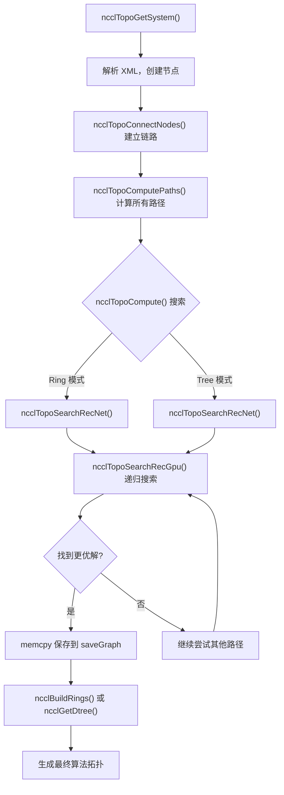
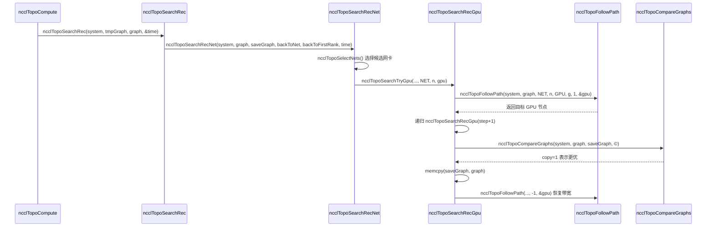

# Kapitel 4: Topologie-Erkennung und Graphsuche: Wie NCCL die physische Vernetzung von Multi-GPU-Systemen „sieht"

Im vorherigen Kapitel sind wir entlang der Aufrufkette von ncclCommInitRank schichtweise nach unten vorgedrungen und haben gesehen, wann das Feld comm->topo gefüllt wird, aber wir haben seine interne Struktur nicht entfaltet. Wie also „sieht" NCCL die GPUs und Netzwerkkarten im Rechner und organisiert sie zu nutzbaren Topologieinformationen? Dieses Kapitel wird drei Schlüsselschritte dieses Prozesses zerlegen: topo.cc ist dafür verantwortlich, physische Geräte in einen Graphen aufzuzählen, search.cc sucht auf diesem Graphen den optimalen Pfad, und rings.cc und trees.cc konkretisieren die Suchergebnisse in die beiden Algorithmus-Topologien Ring und Tree. Nur wenn man das Zusammenspiel dieser drei versteht, kann man begreifen, warum NCCL auf verschiedenen Rechnern automatisch den passenden Algorithmus auswählen kann.

# Topologiekarte: Den Rechner als eine „U-Bahn-Linienkarte" zeichnen

## Intuitives Modell

Stell dir vor, du bist ein Kurier, der gerade in einer fremden Stadt angekommen ist. Du musst ein Paket von Punkt A nach Punkt B bringen, aber du weißt nicht, welcher Weg der schnellste ist. Du brauchst eine Karte – auf der alle Stationen (GPU, Netzwerkkarte, CPU, PCI-Switch) und die Verbindungen zwischen den Stationen (NVLink, PCIe, Netzwerk) eingezeichnet sind. Die Topologiekarte von NCCL ist genau diese Karte.

Ohne diese Karte könnte NCCL nur blind annehmen, dass „alle GPUs die gleiche Bandbreite haben", was auf einem Rechner mit 8 GPUs und vollständiger NVLink-Vernetzung vielleicht noch ausreichen mag, aber sobald komplexe Topologien mit NUMA-Übergreifung, PCI-Switch-Übergreifung und gemischtem NVLink + PCIe auftreten, würde es den falschen Pfad wählen und Daten, die eigentlich über NVLink laufen sollten, in langsames PCIe stopfen, was die Leistung direkt halbiert.

## Datenstruktur und Speicherlayout

Der Kern der Topologiekarte ist`ncclTopoSystem`, sie speichert alle Geräte gruppiert nach Knotentyp. Die Knotentypen sind definiert im`topoNodeTypeStr`-Array:

[FACT:src/graph/topo.cc:33-35]

```c
const char* topoNodeTypeStr[] = {"GPU", "PCI", "NVS", "CPU", "NIC", "NET", "GIN", "RMA", "DEV", "CXB"};
const char* topoLinkTypeStr[] = {"LOC", "NVL", "", "C2C", "PCI", "", "", "", "", "SYS", "NET"};
const char* topoPathTypeStr[] = {"LOC", "NVL", "NVB", "C2C", "PIX", "PXB", "P2C", "PXN", "PHB", "SYS", "NET", "DIS"};
```

Diese drei Arrays definieren jeweils die String-Darstellungen von Knotentyp, Linktyp und Pfadtyp. Beachte die Reihenfolge von`topoPathTypeStr`– sie dient gleichzeitig als Sortierung der Pfadqualität: Je kleiner der Index, desto schneller der Pfad.`LOC`(lokal) am schnellsten,`DIS`(getrennt) am langsamsten. Diese Reihenfolge wird in der späteren Suche immer wieder verwendet, um die Vor- und Nachteile von Pfaden zu vergleichen.

Jeder Knoten wird durch`ncclTopoNode`repräsentiert und bei der Erstellung werden je nach Typ unterschiedliche Felder initialisiert. Am Beispiel eines GPU-Knotens:

[FACT:src/graph/topo.cc:105-141]

```c
ncclResult_t ncclTopoCreateNode(struct ncclTopoSystem* system, struct ncclTopoNode** node, int type, uint64_t id) {
  if (system->nodes[type].count == NCCL_TOPO_MAX_NODES) {
    WARN("Error : tried to create too many nodes of type %d", type);
    return ncclInternalError;
  }
  struct ncclTopoNode* n = system->nodes[type].nodes + system->nodes[type].count;
  system->nodes[type].count++;
  n->type = type;
  n->id = id;
  if (type == GPU) {
    n->gpu.dev = NCCL_TOPO_UNDEF;
    n->gpu.rank = NCCL_TOPO_UNDEF;
    n->gpu.cudaCompCap = NCCL_TOPO_UNDEF;
    n->gpu.mloPart = NCCL_TOPO_UNDEF;
  } else if (type == CPU) {
    ...
```

Hier gibt es einige wichtige Designpunkte. Erstens: Knoten werden in einem vorab zugewiesenen Array gespeichert (`system->nodes[type].nodes`), nicht in einer verketteten Liste. Das bedeutet, dass die Knoten im Speicher zusammenhängend angeordnet sind, was beim Durchlaufen cachefreundlich ist. Zweitens:`NCCL_TOPO_MAX_NODES`ist eine harte Obergrenze; wird sie überschritten, gibt es einen Fehler – dies verhindert unbegrenztes Wachstum bei topologischen Anomalien. Drittens: Jeder Knoten hat ein`id`Feld, das eine 64-Bit-Ganzzahl ist; die oberen 32 Bit sind die systemId (welcher Host), die unteren 32 Bit die localId (Gerätenummer innerhalb des Hosts).

Die Verbindungen zwischen Knoten werden durch`ncclTopoLink`dargestellt.`ncclTopoConnectNodes`ist für den Aufbau bidirektionaler Verbindungen verantwortlich:

[FACT:src/graph/topo.cc:179-204]

```c
ncclResult_t ncclTopoConnectNodes(struct ncclTopoNode* node, struct ncclTopoNode* remNode, int type, float bw) {
  // Aggregate links into higher bw for NVLink
  struct ncclTopoLink* link;
  for (link = node->links; link - node->links != NCCL_TOPO_MAX_LINKS && link->remNode; link++) {
    if (link->remNode == remNode && link->type == type) break;
  }
  if (link - node->links == NCCL_TOPO_MAX_LINKS) {
    WARN("Error : too many Topo links (max %d)", NCCL_TOPO_MAX_LINKS);
    return ncclInternalError;
  }
  if (link->remNode == NULL) node->nlinks++;
  link->type = type;
  link->remNode = remNode;
  link->bw += bw;

  // Sort links in BW descending order
  struct ncclTopoLink linkSave;
  memcpy(&linkSave, link, sizeof(struct ncclTopoLink));
  while (link != node->links) {
    if ((link - 1)->bw >= linkSave.bw) break;
    memcpy(link, link - 1, sizeof(struct ncclTopoLink));
    link--;
  }
  memcpy(link, &linkSave, sizeof(struct ncclTopoLink));
  return ncclSuccess;
}
```

Diese Funktion erledigt drei Dinge. Erstens: Sie sucht, ob bereits eine Verbindung zum selben Ziel und desselben Typs existiert – falls ja, wird die Bandbreite aufsummiert (`link->bw += bw`). Dies behandelt den Fall, dass mehrere NVLinks mit derselben GPU verbunden sind: 4 NVLinks mit je 25 GB/s ergeben aggregiert 100 GB/s. Zweitens: Wird keine gefunden, wird eine neue Verbindung hinzugefügt. Drittens: Nach dem Einfügen wird nach Bandbreite absteigend sortiert, sodass bei späteren Durchläufen zuerst Verbindungen mit hoher Bandbreite gesehen werden.

> **[Design Inference & Architectural Trade-offs]**
> Die Designmotivation für die absteigende Sortierung nach Bandbreite besteht darin, dass der Suchalgorithmus frühzeitig Pfade mit hoher Bandbreite findet und dadurch schneller zu einer besseren Lösung konvergiert. Die Suche hat ein Timeout-Limit (später zu sehen unter`NCCL_SEARCH_TIMEOUT`); die Sortierung ermöglicht es, das begrenzte Zeitbudget auf vielversprechendere Pfade zu verwenden.

## Szenariogesteuerter Step-by-Step-Walkthrough

Nun ein konkretes Szenario: Ein 8-GPU-A100-Server, bei dem jede Karte über NVLink vollvernetzt ist und zusätzlich 4 Mellanox ConnectX-6-NICs in PCIe-Steckplätzen stecken. Bei der NCCL-Initialisierung wird`ncclTopoGetSystem`aufgerufen; es liest Geräteinformationen aus einer XML-Datei (erzeugt von`nvidia-topologyd`oder NCCL selbst) und baut dann den Topologiegraphen auf.

Erster Schritt: Parsen des CPU-Knotens.`ncclTopoAddCpu`liest Architektur, Hersteller und Modell der CPU aus dem XML und erstellt den CPU-Knoten:

[FACT:src/graph/topo.cc:806-875]

```c
ncclResult_t ncclTopoAddCpu(struct ncclXmlNode* xmlCpu, struct ncclTopoSystem* system) {
  int numaId;
  NCCLCHECK(xmlGetAttrInt(xmlCpu, "numaid", &numaId));
  int systemId;
  NCCLCHECK(ncclGetSystemId(system, xmlCpu, &systemId));
  struct ncclTopoNode* cpu;
  NCCLCHECK(ncclTopoCreateNode(system, &cpu, CPU, NCCL_TOPO_ID(systemId, numaId)));
  ...
  for (int s = 0; s nSubs; s++) {
    struct ncclXmlNode* node = xmlCpu->subs[s];
    if (strcmp(node->name, "pci") == 0) NCCLCHECK(ncclTopoAddPci(node, system, cpu, systemId, numaId));
    if (strcmp(node->name, "nic") == 0) {
      ...
    }
  }
  return ncclSuccess;
}
```

Der CPU-Knoten ist die Wurzel des Topologiebaums. Unter jeder CPU hängen der PCI-Teilbaum und NIC-Knoten.`ncclTopoAddPci`verarbeitet den PCI-Baum rekursiv; bei einer GPU wird ein GPU-Knoten erstellt, bei einer NIC ein NIC-Knoten.

Zweiter Schritt: Hinzufügen der NVLink-Verbindungen. Beachten Sie, dass`ncclTopoAddGpu`nur die grundlegenden Attribute der GPU liest; der Kommentar sagt ausdrücklich: "Do not go any further, nvlinks will be added in a second pass":

[FACT:src/graph/topo.cc:590-598]

```c
ncclResult_t ncclTopoAddGpu(struct ncclXmlNode* xmlGpu, struct ncclTopoSystem* system, struct ncclTopoNode* gpu) {
  NCCLCHECK(xmlGetAttrInt(xmlGpu, "rank", &gpu->gpu.rank));
  NCCLCHECK(xmlGetAttrInt(xmlGpu, "sm", &gpu->gpu.cudaCompCap));
  NCCLCHECK(xmlGetAttrInt(xmlGpu, "dev", &gpu->gpu.dev));
  NCCLCHECK(xmlGetAttrInt(xmlGpu, "gdr", &gpu->gpu.gdrSupport));
  NCCLCHECK(xmlGetAttrIntDefault(xmlGpu, "mlopart", &gpu->gpu.mlopart, NCCL_TOPO_UNDEF));
  // Do not go any further, nvlinks will be added in a second pass
  return ncclSuccess;
}
```

Warum zwei Durchläufe? Weil NVLink eine Verbindung zwischen GPUs ist und beide GPU-Knoten bereits existieren müssen, um die Verbindung aufzubauen. Der erste Durchlauf erstellt alle Knoten, der zweite Durchlauf`ncclTopoAddNvLinks`verbindet sie dann.

Dritter Schritt: Verarbeitung der Netzwerkgeräte.`ncclTopoAddNic`durchläuft die net/gin/rma-Unterknoten unter der NIC und ruft jeweils die entsprechende Hinzufügen-Funktion auf. Am Beispiel von`ncclTopoAddNet`:

[FACT:src/graph/topo.cc:461-503]

```c
static ncclResult_t ncclTopoAddNet(struct ncclXmlNode* xmlNet, struct ncclXmlNode* parent,
                                   struct ncclTopoSystem* system, struct ncclTopoNode* nic, int systemId) {
  int dev;
  NCCLCHECK(xmlGetAttrInt(xmlNet, "dev", &dev));
  int64_t netId = NCCL_TOPO_ID(systemId, dev);
  struct ncclTopoNode* net;
  NCCLCHECK(ncclTopoCreateNode(system, &net, NET, netId));
  net->net.dev = dev;
  int mbps;
  NCCLCHECKNOWARN(xmlGetAttrIntDefault(xmlNet, "speed", &mbps, 0), NCCL_GRAPH);
  if (mbps net.bw = mbps / 8000.0;
  ...
  NCCLCHECK(ncclTopoConnectNodes(nic, net, LINK_NET, net->net.bw));
  NCCLCHECK(ncclTopoConnectNodes(net, nic, LINK_NET, net->net.bw));
  return ncclSuccess;
}
```

Beachten Sie die Umrechnung`mbps / 8000.0`: mbps sind Megabit pro Sekunde; Division durch 8000 ergibt GB/s (da 1 GB/s = 8000 Mbps). Wenn die NIC speed = -1 meldet (bei manchen virtuellen NICs der Fall), wird standardmäßig 10000 Mbps = 1.25 GB/s angenommen.

Vierter Schritt: Abschlussverarbeitung.`ncclTopoGetSystemFromXml`führt nach dem Hinzufügen aller Knoten und Verbindungen noch einige Aufräumarbeiten durch:

[FACT:src/graph/topo.cc:1080-1088]

```c
  NCCLCHECK(ncclTopoAddNvLinks(topNode, *topoSystem, NULL, 0));
  NCCLCHECK(ncclTopoAddC2c(topNode, *topoSystem, NULL, 0));
  NCCLCHECK(ncclTopoAddPciLinks(topNode, *topoSystem, NULL, 0));

  NCCLCHECK(ncclTopoFlattenBcmSwitches(*topoSystem));
  NCCLCHECK(ncclTopoConnectCpus(*topoSystem));
  NCCLCHECK(ncclTopoSortSystem(*topoSystem));
```

`ncclTopoFlattenBcmSwitches`behandelt den Sonderfall von Broadcom Gen4 PCIe-Switches – diese präsentieren sich als zweistufige Switches, haben aber tatsächlich volle Bandbreite und müssen "flachgeklopft" werden, damit der Suchalgorithmus nicht in die Irre geführt wird.`ncclTopoConnectCpus`verbindet alle CPU-Knoten miteinander (NUMA-übergreifender Zugriff läuft über SYS-Verbindungen).`ncclTopoSortSystem`sortiert die Verbindungen so, dass PCI-Downstream-Verbindungen vorne stehen, was das Durchlaufen erleichtert.

## Designüberlegungen und Stolperfallen im Produktivbetrieb

> **[Design Inference & Architectural Trade-offs]**
> **Warum XML als Zwischenformat?**Weil die Topologieerkennung prozessübergreifend geteilt werden muss – jeder Rank erkennt nur die von ihm verwalteten GPUs, tauscht dann per Bootstrap XML aus und fusioniert schließlich zu einer vollständigen Topologie. XML ist ein selbstbeschreibendes Textformat, das sich gut debuggen lässt (kann gedumpt und angesehen werden) und versionskompatibel ist.

**Stolperfalle eins:`ncclTopoGetNode`meldet keinen Fehler, wenn kein Knoten gefunden wird.**Betrachten Sie diese Funktion:

[FACT:src/graph/topo.cc:95-103]

```c
ncclResult_t ncclTopoGetNode(struct ncclTopoSystem* system, struct ncclTopoNode** node, int type, uint64_t id) {
  for (int i = 0; i nodes[type].count; i++) {
    if (system->nodes[type].nodes[i].id == id) {
      *node = system->nodes[type].nodes + i;
      return ncclSuccess;
    }
  }
  return ncclSuccess;
}
```

Wird nichts gefunden, gibt sie`ncclSuccess`zurück, aber`*node`bleibt unverändert (der Aufrufer initialisiert üblicherweise auf NULL). Der Aufrufer muss selbst`*node == NULL`prüfen. Dieses Design ist fehleranfällig – vergisst der Aufrufer die Prüfung, stürzt eine spätere Dereferenzierung ab.

**Stolperfalle zwei:`ncclTopoConnectNodes`Die Bandbreitenakkumulation von**kann zu Überlauf führen.`link->bw += bw`Wenn zwischen demselben Knotenpaar viele Verbindungen bestehen (z. B. im NVSwitch-Szenario), kann

**auf sehr große Werte anwachsen. Obwohl die float-Präzision ausreicht, kann die Sortierlogik bei ungewöhnlich vielen Verbindungen problematisch werden.`ncclTopoRemoveNode`Stolperfalle drei:**Die Zeigerkorrektur von

[FACT:src/graph/topo.cc:143-177]

```c
ncclResult_t ncclTopoRemoveNode(struct ncclTopoSystem* system, int type, int index) {
  struct ncclTopoNode* delNode = system->nodes[type].nodes + index;
  for (int t = 0; t paths[t] != nullptr) {
      WARN("Cannot remove topology node %d/%lx while paths are computed", type, delNode->id);
      return ncclInternalError;
    }
    for (int n = 0; n nodes[t].count; n++) {
      struct ncclTopoNode* node = system->nodes[t].nodes + n;
      if (node == delNode) continue;
      for (int l = 0; l nlinks; l++) {
        while (l nlinks && node->links[l].remNode == delNode) {
          memmove(node->links + l, node->links + l + 1, (node->nlinks - l - 1) * sizeof(struct ncclTopoLink));
          node->nlinks--;
        }
        if (l nlinks && node->links[l].remNode->type == type && node->links[l].remNode >= delNode) {
          node->links[l].remNode--;
        }
      }
    }
  }
  ...
```

Kopieren`node->links[l].remNode--`Hier gibt es eine Feinheit:`sizeof(struct ncclTopoNode)`korrigiert die Zeiger. Da Knoten in einem zusammenhängenden Array gespeichert sind, rücken nach dem Löschen eines Knotens die Adressen aller nachfolgenden Knoten um ein`memmove`Zuvor ausgeführt, die Reihenfolge ist entscheidend.

# Pfadsuche: Die „optimale Route" im Graphen finden

## Intuitives Modell

Eine Karte allein reicht nicht – man braucht auch einen Navigationsalgorithmus. Die Pfadsuche von NCCL ist zweistufig: Die erste Stufe ist die Vorverarbeitung, die die kürzesten Pfade zwischen allen Knotenpaaren berechnet (BFS); die zweite Stufe ist die Graphsuche, die auf den Vorverarbeitungsergebnissen verschiedene Ring-/Tree-Strukturen ausprobiert und diejenige mit der höchsten Bandbreite findet.

Ohne Pfadsuche könnte NCCL nur eine feste Reihenfolge wie „GPU 0 verbunden mit GPU 1 verbunden mit GPU 2..." hartcodieren, was bei nicht-uniformer Topologie zur Wahl langsamer Pfade führen würde.

## Datenstrukturen und Speicherlayout

Die zentrale Datenstruktur der Pfadsuche ist`ncclTopoLinkList`, die den vollständigen Pfad von einem Quellknoten zu einem Zielknoten speichert:

```c
struct ncclTopoLinkList {
  struct ncclTopoLink* list[NCCL_TOPO_MAX_HOPS];  // 路径上的链路
  int count;      // 跳数
  float bw;       // 瓶颈带宽
  int type;       // 路径类型（PATH_LOC, PATH_NVL, ...）
  int capacity;   // list 数组的容量
};
```

Jeder Knoten hat ein`paths[type]`-Array, das die Pfade zu allen Knoten dieses Typs speichert. Zum Beispiel speichert das`paths[NET]`eines GPU-Knotens die Pfade zu allen Netzwerkkarten.

Die Pfadberechnung wird von`ncclTopoSetPaths`durchgeführt, einer BFS:

[FACT:src/graph/paths.cc:52-147]

```c
static ncclResult_t ncclTopoSetPaths(struct ncclTopoNode* baseNode, struct ncclTopoSystem* system) {
  if (baseNode->paths[baseNode->type] == NULL) {
    NCCLCHECK(ncclCalloc(baseNode->paths + baseNode->type, system->nodes[baseNode->type].count));
    for (int i = 0; i nodes[baseNode->type].count; i++) baseNode->paths[baseNode->type][i].type = PATH_DIS;
  }

  // breadth-first search to set all paths to that node in the system
  struct ncclTopoNodeList nodeList;
  struct ncclTopoNodeList nextNodeList = {{0}, 0};
  nodeList.count = 1;
  nodeList.list[0] = baseNode;
  ...
  while (nodeList.count) {
    nextNodeList.count = 0;
    for (int n = 0; n type, baseNode->id, &path));
      for (int l = 0; l nlinks; l++) {
        struct ncclTopoLink* link = node->links + l;
        struct ncclTopoNode* remNode = link->remNode;
        ...
        float bw = std::min(path->bw, link->bw);
        ...
        // Update if better path type, OR same type with higher bw, OR same type/bw with strickly fewer hops.
        if (newType type || (newType == remPath->type && remPath->bw type && remPath->bw == bw && remPath->count > (path->count + 1))) {
          ...
          remPath->bw = bw;
          remPath->type = newType;
          ...
        }
      }
    }
    memcpy(&nodeList, &nextNodeList, sizeof(nodeList));
  }
  return ncclSuccess;
}
```

Die BFS startet von`baseNode`und expandiert schichtweise. Bei jedem Erreichen eines neuen Knotens werden die Engpassbandbreite des Pfades (`std::min(path->bw, link->bw)`) und der Pfadtyp berechnet. Für die Berechnung des Pfadtyps gibt es einige spezielle Regeln:

- Wenn zwei PCI-Switches durchlaufen werden, wird der Typ zu`PATH_PXB`
- Wenn die CPU durchlaufen wird, wird der Typ zu`PATH_PHB`
- Wenn ein DEV-Knoten durchlaufen wird und es sich um NVLink handelt, wird der Typ zu`PATH_NVB`

Die Aktualisierungsbedingung ist „besserer Pfad": besserer Typ, oder gleicher Typ aber höhere Bandbreite, oder gleicher Typ und gleiche Bandbreite aber weniger Hops.

## Szenario-getriebener Step-by-Step-Walkthrough

Nun zur zweiten Suchstufe.`ncclTopoCompute`ist der Einstiegspunkt, der verschiedene Parameterkombinationen ausprobiert und`ncclTopoSearchRec`zur Suche aufruft.

Der Kern der Suche ist die rekursive Funktion`ncclTopoSearchRecGpu`. Sie startet von einer GPU und versucht, zur nächsten GPU zu gelangen, bis alle GPUs durchlaufen sind und einen Pfad bilden:

[FACT:src/graph/search.cc:639-756]

```c
ncclResult_t ncclTopoSearchRecGpu(struct ncclTopoSystem* system, struct ncclTopoGraph* graph,
                                  struct ncclTopoGraph* saveGraph, struct ncclTopoNode* gpu, int step, int backToNet,
                                  int backToFirstRank, int forcedOrder, int* time) {
  if ((*time) nChannels++;
    NCCLCHECKGOTO(ncclTopoCompareGraphs(system, graph, saveGraph, ©), ret, exit);
    if (copy) {
      memcpy(saveGraph, graph, sizeof(struct ncclTopoGraph));
      if (graph->nChannels == graph->maxChannels) *time = -1;
    }
    if (graph->nChannels maxChannels) {
      NCCLCHECKGOTO(ncclTopoSearchRec(system, graph, saveGraph, time), ret, exit);
    }
    graph->nChannels--;
    ret = ncclSuccess;
    goto exit;
  }
  graph->intra[graph->nChannels * ngpus + step] = gpu->gpu.rank;
  g = gpu - system->nodes[GPU].nodes;
  if (step == backToNet) {
    // first get back to NIC
    ...
  } else if (graph->pattern == NCCL_TOPO_PATTERN_NVLS) {
    ...
  } else if (step nodes[GPU].count - 1) {
    // Go to next GPU
    ...
  } else if (step == backToFirstRank) {
    // Find first GPU and loop back to it
    ...
  } else {
    // Next path
    NCCLCHECKGOTO(ncclTopoSearchRecGpu(system, graph, saveGraph, gpu, ngpus, -1, -1, forcedOrder, time), ret, exit);
  }
  ...
}
```

Diese Funktion hat mehrere Schlüsselverzweigungen:

1. **`step == ngpus`**: Alle GPUs wurden durchlaufen, ein vollständiger Pfad wurde gebildet. Nun wird`nChannels`inkrementiert, der aktuelle Graph mit dem gespeicherten optimalen Graphen verglichen und bei Besserung gespeichert. Dann wird rekursiv`ncclTopoSearchRec`aufgerufen, um den nächsten Channel zu suchen.

2. **`step == backToNet`**: Es muss zur Netzwerkkarte zurückgekehrt werden. Dies tritt im Ring-Modus auf (die letzte GPU muss sich mit der Start-Netzwerkkarte verbinden) oder im Tree-Modus (die erste GPU muss sich mit der Netzwerkkarte verbinden).

3. **`step < ngpus - 1`**: Weiter zur nächsten GPU. Hier wird`ncclTopoSearchNextGpuSort`aufgerufen, um die Kandidaten-GPUs zu sortieren.

4. **`step == backToFirstRank`**: Im Ring-Modus muss die letzte GPU sich mit der ersten GPU verbinden.

5. **`else`**: Der Pfad endet, die nächste Runde beginnt.

`ncclTopoSearchNextGpuSort`bestimmt die Reihenfolge, in der die nächste GPU ausprobiert wird:

[FACT:src/graph/search.cc:254-327]

```c
ncclResult_t ncclTopoSearchNextGpuSort(struct ncclTopoSystem* system, struct ncclTopoGraph* graph,
                                       struct ncclTopoNode* gpu, int* next, int* countPtr, int sortNet) {
  const uint64_t flag = 1ULL nChannels);
  int ngpus = system->nodes[GPU].count;
  struct ncclTopoLinkList* paths = gpu->paths[GPU];
  ...
  for (int i = 1; i nodes[GPU].nodes[g].used & flag) continue;
    scores[count].g = g;
    scores[count].startIndex = i;
    scores[count].intraNhops = paths[g].count;
    scores[count].intraBw = paths[g].bw;
    if (netPaths) {
      scores[count].interNhops = netPaths[g].count;
      scores[count].interPciBw = gpuPciBw(system->nodes[GPU].nodes + g);
      scores[count].interBw = netPaths[g].bw;
    }
    count++;
  }

  // Sort GPUs
  qsort(scores, count, sizeof(struct ncclGpuScore), cmpScore);
  ...
}
```

Es bewertet jede Kandidaten-GPU und die Sortierregel lautet: Zuerst interBw (Bandbreite zur Netzwerkkarte), dann interPciBw, dann interNhops, dann intraBw, schließlich intraNhops. Diese Priorität spiegelt das Optimierungsziel von NCCL wider: Maschinenübergreifende Kommunikation ist der Engpass, daher werden GPUs mit hoher Netzwerkkarten-Bandbreite bevorzugt.

## Designüberlegungen und Produktions-Fallstricke

**Warum hat die Suche ein Timeout?**Betrachten wir diese Konstanten:

[FACT:src/graph/search.cc:329-330]

```c
#define NCCL_SEARCH_GLOBAL_TIMEOUT (1ULL count, bw, &step));
  if (step count) goto rewind;
  // Enough bandwidth : return destination node.
  graph->nHops += mult * path->count;
  *node = system->nodes[type2].nodes + index2;
  return ncclSuccess;
rewind:
  // Not enough bandwidth : rewind and exit.
  NCCLCHECK(followPath(path, node1, step, -bw, &step));
  return ncclSuccess;
}
```

`followPath`modifiziert die`bw`jeder Verbindung im Pfad (reduziert die bereits genutzte Bandbreite). Wenn die Suche fehlschlägt, muss`followPath`aufgerufen werden, um mit`-bw`wiederherzustellen. Dieses „Reduzieren-Wiederherstellen"-Muster ist in der rekursiven Suche fehleranfällig – wenn ein Zweig die Wiederherstellung vergisst, sieht die nachfolgende Suche falsche Bandbreiten.

**Fallstrick zwei:`ncclTopoCompareGraphs`Die Vergleichslogik von**ist sehr subtil. Sie vergleicht vorrangig`nChannels * bwIntra`, aber es gibt eine Reihe von Sonderfällen:

[FACT:src/graph/search.cc:446-477]

```c
ncclResult_t ncclTopoCompareGraphs(struct ncclTopoSystem* system, struct ncclTopoGraph* graph,
                                   struct ncclTopoGraph* refGraph, int* copy) {
  // 1. Try to get the same nChannels between Rings and Trees
  if (graph->nChannels minChannels) return ncclSuccess;
  const bool evenReference = refGraph->nChannels > 0 && !(refGraph->nChannels & 1);
  const bool evenReferenceIsBetter = refGraph->nChannels * refGraph->bwIntra >= graph->nChannels * graph->bwIntra;
  // Favor an even number of channels when aggregate bandwidth is equal or better.
  if (graph->pattern != NCCL_TOPO_PATTERN_NVLS && evenReference && (graph->nChannels & 1) &&
      graph->nChannels nodes[NET].count && evenReferenceIsBetter)
    return ncclSuccess;
  ...
```

> **[Design Inference & Architectural Trade-offs]**
> Warum werden gerade Channel bevorzugt? Weil der Ring-Algorithmus bei geraden Channels besser paaren kann – jeder Channel kann in zwei Hälften geteilt werden, eine im Uhrzeigersinn und eine gegen den Uhrzeigersinn, was Netzwerkkongestion reduziert.

# Ring und Tree: Suchergebnisse in algorithmische Topologie umwandeln

## Intuitives Modell

Der Suchalgorithmus findet eine Menge von Pfaden, aber der Algorithmus benötigt eine eindeutige „Wer sendet an wen"-Reihenfolge. Ring reiht alle Ranks zu einem Kreis auf, jeder Rank empfängt vom vorherigen und sendet an den nächsten. Tree hingegen ist ein Baum, bei dem Daten von der Wurzel nach unten fließen oder von den Blättern nach oben zusammenlaufen.

Ohne diese beiden Module würde der Suchalgorithmus nur eine Menge von Pfaden finden, könnte aber dem GPU-Kernel nicht mitteilen, wie genau Daten gesendet werden sollen.

## Datenstrukturen und Speicherlayout

Der Aufbau des Rings wird von`ncclBuildRings`durchgeführt:

[FACT:src/graph/rings.cc:29-74]

```c
ncclResult_t ncclBuildRings(int nrings, int* rings, int rank, int nranks, int* prev, int* next) {
  ncclResult_t ret = ncclSuccess;
  uint64_t* rankFound;
  int rankFoundSize = DIVUP(nranks, 64);
  NCCLCHECK(ncclCalloc(&rankFound, rankFoundSize));

  for (int r = 0; r  0 so it has to be our child 1, not 0.
    *d1 = nranks > 1 ? bit >> 1 : -1;
    return ncclSuccess;
  }

  up = (rank ^ bit) | (bit = nranks) up = (rank ^ bit);
  *parentChildType = (rank > 1;
  // down0 is always within bounds
  down0 = lowbit == 0 ? -1 : rank - lowbit;

  down1 = lowbit == 0 ? -1 : rank + lowbit;
  // Make sure down1 is within bounds
  while (down1 >= nranks) {
    down1 = lowbit == 0 ? -1 : rank + lowbit;
    lowbit >>= 1;
  }
  *d0 = down0;
  *d1 = down1;

  return ncclSuccess;
}
```

Diese Funktion konstruiert einen Binärbaum mit Bitoperationen. Die Kernidee ist: das niedrigste Nicht-Null-Bit`bit`des Ranks finden, der Elternknoten ist`(rank ^ bit) | (bit << 1)`, das linke Kind ist`rank - (bit >> 1)`, das rechte Kind ist`rank + (bit >> 1)`. Das ASCII-Diagramm im Kommentar zeigt diese Struktur sehr anschaulich.

## Szenario-getriebener Step-by-Step-Walkthrough

Nehmen wir 8 Karten im Ring als Beispiel. Angenommen, die Suchergebnisse geben für jeden Rang die`next`Zeiger an:

```
rank 0 -> rank 1
rank 1 -> rank 2
...
rank 7 -> rank 0
```

`ncclBuildRings`Ausgehend von Rang 0 werden nacheinander 1, 2, ..., 7 besucht und schließlich zurück zu 0. Die generierte`rings[0..7] = {0, 1, 2, 3, 4, 5, 6, 7}`。

Für Tree`ncclGetBtree`werden für jeden Rang Elternknoten und Kindknoten berechnet. Nehmen wir Rang 1 als Beispiel:

- `bit`= 1 (das niedrigste Nicht-Null-Bit ist Bit 0)
- `up = (1 ^ 1) | (1 << 1) = 0 | 2 = 2`
- `up >= nranks`? 2 < 8, also`up = 2`
- `parentChildType = (1 < 2) ? 0 : 1 = 0`(ist das erste Kind des Elternknotens)
- `lowbit = 0`, also`down0 = -1`
- `down1 = -1`

Daher ist der Elternknoten von Rang 1 Rang 2, und es gibt keine Kindknoten. Das entspricht der Baumstruktur im Kommentar: Rang 1 ist ein Blatt.

## Designüberlegungen und Stolperfallen im Produktivbetrieb

> **[Design Inference & Architectural Trade-offs]**
> **Warum verwendet Tree Bitoperationen statt eines expliziten Baums?**Weil jeder Rang nur seinen eigenen Elternknoten und seine Kindknoten kennen muss und keine globale Baumstruktur benötigt. Bitoperationen können diese Informationen in O(1) berechnen und vermeiden den Aufwand für Speicherung und Synchronisation des gesamten Baums.

**Stolperfalle eins:`ncclBuildRings`Die Validierung von kann übersprungen werden.**Wenn das`next`Array einen Zyklus hat (zum Beispiel Rang 0 -> Rang 1 -> Rang 0), wird die Schleife nach`nranks`Iterationen beendet, aber die`current != rank`Prüfung würde dieses Problem erfassen. Wenn die Länge des Zyklus jedoch genau ein`nranks`Faktor ist und nicht alle Ränge enthält,`rankFound`wird die Prüfung erfassen.

**Stolperfalle zwei:`ncclGetDtree`Die Behandlung ungerader Ränge.**Bei einer ungeraden Anzahl von Rängen ist der zweite Baum eine „Verschiebung“ statt einer „Spiegelung“:

[FACT:src/graph/trees.cc:90-112]

```c
ncclResult_t ncclGetDtree(int nranks, int rank, int* s0, int* d0_0, int* d0_1, int* parentChildType0, int* s1,
                          int* d1_0, int* d1_1, int* parentChildType1) {
  // First tree ... use a btree
  ncclGetBtree(nranks, rank, s0, d0_0, d0_1, parentChildType0);
  // Second tree ... mirror or shift
  if (nranks % 2 == 1) {
    // shift
    int shiftrank = (rank - 1 + nranks) % nranks;
    ...
  } else {
    // mirror
    int u, d0, d1;
    ncclGetBtree(nranks, nranks - 1 - rank, &u, &d0, &d1, parentChildType1);
    *s1 = u == -1 ? -1 : nranks - 1 - u;
    ...
  }
  return ncclSuccess;
}
```

Der Doppelbaum (Double Tree) ist die Tree-Algorithmus-Implementierung von NCCL – zwei Bäume arbeiten gleichzeitig, einer ist für die erste Hälfte der Daten zuständig, einer für die zweite Hälfte, wodurch die Bandbreitennutzung verbessert wird. Bei ungeraden Rängen würde eine Spiegelung zu einer unvollständigen Rangzuordnung führen, daher wird stattdessen eine Verschiebung verwendet.

# Das Zusammenspiel der drei: von der Topologie zum Algorithmus

Nun verbinden wir die drei Module miteinander. Der gesamte Ablauf kann in einem Diagramm dargestellt werden:



Dieses Diagramm zeigt den vollständigen Ablauf von der Topologieerkennung bis zur Algorithmusgenerierung. Beachten Sie, dass`ncclTopoSearchRecGpu`eine rekursive Funktion ist, die kontinuierlich verschiedene GPU-Reihenfolgen ausprobiert, bis ein Timeout auftritt oder die optimale Lösung gefunden wird.

Betrachten wir noch ein feiner granuliertes Sequenzdiagramm, das die Interaktion der Module während des Suchprozesses zeigt:



Dieses Sequenzdiagramm zeigt die Kernschleife der Suche: NIC auswählen -> GPU ausprobieren -> rekursiv suchen -> Ergebnisse vergleichen -> Bandbreite wiederherstellen.

# Zusammenfassung dieses Kapitels

Dieses Kapitel zerlegt die drei Aspekte der NCCL-Topologiebewusstheit:

1. **Topologieerkennung**（`topo.cc`): Geräteinformationen aus XML lesen, GPU/CPU/PCI/NIC-Knoten erstellen, NVLink/PCIe/Netzwerkverbindungen aufbauen und ein vollständiges Topologiediagramm bilden.

2. **Pfadsuche**（`search.cc` + `paths.cc`): Zuerst werden mit BFS die kürzesten Pfade zwischen allen Knotenpaaren vorberechnet, dann wird mit rekursiver Suche versucht, verschiedene Ring-/Tree-Strukturen zu finden, um die Lösung mit der höchsten Bandbreite zu ermitteln.

3. **Algorithmus-Topologiegenerierung**（`rings.cc` + `trees.cc`): Die Suchergebnisse werden in eine konkrete Rangreihenfolge umgewandelt. Ring verwendet`ncclBuildRings`zur Erzeugung des Rings, Tree verwendet`ncclGetBtree`zur Erzeugung des Binärbaums.

# Denkanstöße und Selbsttests dieses Kapitels

Q1: Wenn man in`ncclTopoConnectNodes`die Bandbreitenakkumulation`link->bw += bw`in`link->bw = std::max(link->bw, bw)`ändert, in welchen Szenarien führt das zu Leistungseinbußen? Warum?

**Referenzanalyse**: Die Bandbreitenakkumulation behandelt den Fall mehrerer paralleler Verbindungen. Nehmen wir vier NVLink-Verbindungen mit jeweils 25 GB/s als Beispiel: Nach der Akkumulation sind es 100 GB/s, nach der Max-Bildung nur 25 GB/s. In`ncclTopoSetPaths`ist die Pfadbandbreite`std::min(path->bw, link->bw)`. Wenn die Verbindungsbandbreite unterschätzt wird, wird die Bandbreite des gesamten Pfads unterschätzt. Dies führt dazu, dass`ncclTopoCompareGraphs`das falsche Diagramm auswählt – möglicherweise wird eine Lösung mit mehr Channels, aber geringerer Bandbreite pro Channel gewählt, was in der tatsächlichen Leistung schlechter ist. Konkretes Szenario: 8 A100-Karten vollständig über NVLink verbunden, zwischen jedem GPU-Paar gibt es 4 NVLink-Verbindungen. Die Akkumulation ergibt 100 GB/s, die Max-Bildung ergibt 25 GB/s. Der Suchalgorithmus würde annehmen, dass NVLink und PCIe Gen4 x16 (etwa 25 GB/s) die gleiche Bandbreite haben, und könnte einen Pfad über PCIe wählen.

Q2: `ncclTopoSearchRecGpu`In`(*time)--`wird am Funktionseingang ausgeführt. Wenn die Suche ein Timeout hat (`*time <= 0`), kehrt die Funktion direkt zurück. In welchen Fällen führt dieses Design dazu, dass die Suche in eine Endlosschleife gerät? Wie kann man das beheben?

**Referenzanalyse**：`(*time)--`wird am Eingang dekrementiert. Wenn`*time`den Anfangswert 0 oder negativ hat, kehrt die Funktion direkt zurück und dekrementiert nicht. Wenn`*time`jedoch eine sehr große positive Zahl ist, wird bei jeder Rekursion dekrementiert und schließlich 0 erreicht. Das Problem ist: Wenn die Rekursionstiefe eines Zweigs sehr groß ist, aber nach jedem Dekrement`*time`immer noch größer als 0 ist, wird die Suche fortgesetzt. Das eigentliche Risiko ist die`ncclTopoSearchRec`in`goto search`Schleife – wenn`time`in der Schleife nicht korrekt zurückgesetzt wird, kann es zu einer Endlosschleife kommen. Betrachten wir die`ncclTopoCompute`in`globalTimeout`Logik:`globalTimeout -= time`wird bei jedem`search`Label ausgeführt. Wenn`globalTimeout`negativ wird, wird`goto done`. Aber wenn`time`auf`NCCL_SEARCH_TIMEOUT`，`globalTimeout`zurückgesetzt wird, wird es möglicherweise nie negativ. Die Lösung besteht darin, sicherzustellen, dass`globalTimeout`nach jeder Suche dekrementiert wird und dass es eine harte Obergrenze gibt.

Q3: `ncclTopoFollowPath`wird bei fehlgeschlagener Suche aufgerufen, um`followPath(path, node1, step, -bw, &step)`die Bandbreite wiederherzustellen. Was passiert, wenn ein rekursiver Zweig vor der Wiederherstellung zurückkehrt (zum Beispiel`NCCLCHECKGOTO`springt zu`exit`)? Wie kann man dieses Problem erkennen?

**Referenzanalyse**: Wenn die Wiederherstellung übersprungen wird, bleibt die Verbindungsbandbreite auf dem Pfad im abgezogenen Zustand. Nachfolgende Suchen sehen dann falsche Bandbreiten und könnten die optimale Lösung verpassen. Erkennungsmethode: In`ncclTopoCompute`Nach dem Ende werden alle Verbindungen durchlaufen und überprüft, ob die Bandbreite mit dem Anfangswert übereinstimmt. Wenn eine Abweichung festgestellt wird, bedeutet dies, dass eine Wiederherstellung übersehen wurde. Reparaturmethode: Verwenden Sie ein Guard-Objekt im RAII-Stil, das die Bandbreite beim Destruktor automatisch wiederherstellt. Oder speichern Sie vor jeder Suche einen Snapshot der Bandbreite aller Verbindungen und stellen Sie ihn nach der Suche wieder her. Der aktuelle Ansatz von NCCL besteht darin, bei jedem`ncclTopoFollowPath`Aufrufpunkt manuell Vorwärts- und Rückwärtsaufrufe zu paaren, was fehleranfällig ist. Ein robusteres Design besteht darin, die Bandbreitenreduzierung und -wiederherstellung in eine Funktion zu kapseln, um sicherzustellen, dass sie paarweise auftreten.

Im nächsten Kapitel werden wir tiefer in das tuning-Modul eintauchen und sehen, wie NCCL basierend auf den Ergebnissen der Topologiesuche und der Nachrichtengröße die endgültige Auswahl zwischen Algorithmen wie Ring, Tree, CollNet usw. trifft. Die in diesem Kapitel erstellten Topologiegraphen, Pfadsuchergebnisse und Algorithmusvorlagen werden zur Eingabe des tuning-Moduls.

Durch den Aufbau des Graphen in topo.cc, die Pfadsuche in search.cc sowie die Topologiegenerierung in rings.cc und trees.cc realisiert NCCL die Designphilosophie, beliebige Topologien mit einer generischen Graphstruktur zu beschreiben, mit konfigurierbaren Suchalgorithmen die optimale Lösung zu finden und mit einfachen Vorlagen den endgültigen Algorithmus zu generieren. Dieser Mechanismus ermöglicht es NCCL, auf Maschinen von 2-GPU-Workstations bis zu 10000-GPU-Clustern automatisch geeignete Algorithmen auszuwählen. Der Topologiegraph liefert jedoch nur die Kandidatenpfade für Algorithmen; welche Route und welches Protokoll für eine bestimmte Kommunikation verwendet werden sollen, erfordert eine feinere Entscheidung. Im nächsten Kapitel konzentrieren wir uns auf das Verzeichnis src/tuning und sehen, wie das tuning-Modul unter Einbeziehung von Kostenmodellen und Algorithmusschätzungen die endgültige Auswahl zwischen Ring/Tree/NVLS/PAT sowie LL/LL128/Simple trifft.
