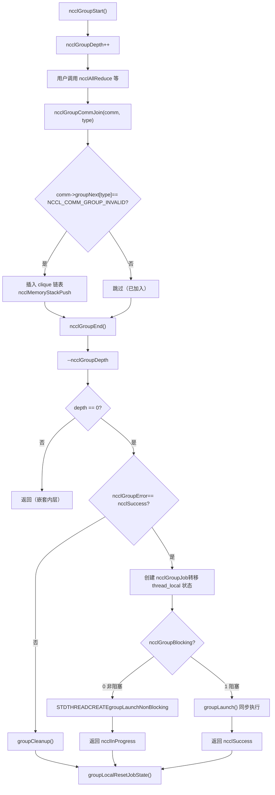
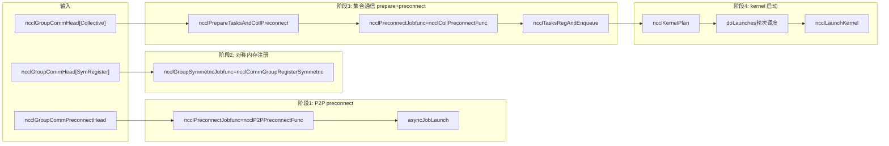

# Kapitel 7: Task-Scheduler: Wie task_sched die Ausführungsreihenfolge mehrerer Channels und Kernel orchestriert

Im vorherigen Kapitel haben wir ncclAllReduce bis zu ncclTaskColl verfolgt – das Aufgabenbeschreibungsobjekt liegt bereits in comm->planner. Aber die Aufgabenbeschreibung ist nur ein „Arbeitsauftrag", noch kein tatsächlich auf der GPU laufender Kernel. Dieses Kapitel beantwortet drei Fragen: Wie werden mehrere API-Aufrufe gesammelt und gemeinsam übermittelt? Wie werden die gesammelten Aufgaben auf mehrere Channels aufgeteilt? Wodurch werden Reihenfolge und Abhängigkeiten zwischen mehreren Kernels garantiert? Zunächst ein übergreifendes mentalen Modell. Stellen Sie sich NCCL als ein Restaurant vor: ncclGroupStart/ncclGroupEnd ist der „Einkaufswagen", in den der Benutzer mehrere Gerichte (mehrere kollektive Kommunikationsaufrufe) legt; ncclGroupEnd ist die „Bestellung", erst dann beginnt die Küche, die Gerichte gemäß der Bestellung zuzubereiten. Und doLaunches ist der „Speisen-Verteiler", der entscheidet, welche Gerichte zuerst serviert werden und welche parallel zubereitet werden können. Ohne Group-Semantik wird jedes Gericht einzeln bestellt, und die Küche muss für jedes Gericht neu anfeuern (Kernel starten), was enormen Overhead verursacht; ohne die Rundenplanung von doLaunches würden die Kernel mehrerer Channels in falscher Reihenfolge starten, was Datenabhängigkeiten zerstört.

# I. Globaler Zustand der Group-Semantik: thread_local-Variablen und das „Einkaufswagen"-Modell

## Intuitives Modell

`ncclGroupStart`und`ncclGroupEnd`Alle Kommunikationsaufrufe dazwischen starten nicht sofort einen Kernel, sondern werden „angesammelt". Wo werden sie angesammelt? In**thread-lokalen (thread_local)**globalen Variablen. Warum thread_local? Weil NCCL annimmt, dass Group-Aufrufe innerhalb desselben Threads seriell ablaufen, und verschiedene Threads jeweils unabhängige Einkaufswagen haben, die sich nicht gegenseitig stören. Wären diese Zustände globale Variablen statt thread_local, würden zwei Threads, die gleichzeitig`ncclGroupStart`aufrufen, sich gegenseitig überschreiben, sodass die Aufgaben eines Threads durch`ncclGroupEnd`eines anderen Threads übermittelt werden – das wäre katastrophal.

## Datenstruktur und Speicherlayout

Betrachten wir zunächst die globale Zustandsdefinition der Group.

[FACT:src/group.cc:34-34]

```cpp
thread_local int ncclGroupDepth = 0; // depth of ncclGroupStart nesting
thread_local ncclResult_t ncclGroupError = ncclSuccess;
thread_local struct ncclComm* ncclGroupCommHead[ncclGroupTaskTypeNum] = {nullptr};
thread_local struct ncclComm* ncclGroupCommPreconnectHead = nullptr;
thread_local struct ncclIntruQueue ncclAsyncJobs;
thread_local int ncclGroupBlocking = -1; /* default mode */
```

Feldweise Aufschlüsselung:

- **`ncclGroupDepth`**: Verschachtelungstiefe.`ncclGroupStart`kann verschachtelt aufgerufen werden (obwohl unüblich), bei jedem`ncclGroupStart`wird um eins erhöht,`ncclGroupEnd`um eins verringert. Erst wenn sie auf 0 sinkt, wird tatsächlich übermittelt. Das ist wie ein Einkaufswagen, der verschachtelt werden kann – man öffnet einen Unter-Einkaufswagen in einem Einkaufswagen, und erst beim äußersten Checkout wird tatsächlich bestellt.
- **`ncclGroupError`**: Wenn ein beliebiger Aufruf innerhalb der Group fehlschlägt, wird der Fehler hier aufgezeichnet und bei`ncclGroupEnd`einheitlich behandelt. Dies vermeidet den inkonsistenten Zustand, dass „nach einem fehlgeschlagenen Aufruf nachfolgende Aufrufe weiterhin Dinge in den Einkaufswagen legen".
- **`ncclGroupCommHead[ncclGroupTaskTypeNum]`**: Listenkopf der nach Aufgabentyp gruppierten Kommunikationsdomänen.`ncclGroupTaskTypeNum`ist die Anzahl der Aufgabentypen (kollektive Kommunikation, primitive Aufgaben, Verwaltungsaufgaben, symmetrische Registrierung usw.). Jeder Typ hat eine verkettete Liste, deren Knoten`ncclComm`sind und durch`comm->groupNext[type]`verkettet werden. Warum nach Typ aufteilen? Weil verschiedene Aufgabentypen unterschiedliche Übermittlungszeitpunkte und Abhängigkeitsbeziehungen haben – kollektive Kommunikationsaufgaben müssen zuerst preconnect ausführen, Verwaltungsaufgaben (wie destroy) müssen zuletzt ausgeführt werden.
- **`ncclGroupCommPreconnectHead`**: Verkettete Liste der Kommunikationsdomänen, die vorverbunden werden müssen. Vorverbindung bedeutet „Netzwerkverbindungen im Voraus aufbauen", um Verzögerungen zu vermeiden, die entstehen, wenn Verbindungen erst beim Kernel-Start aufgebaut werden.
- **`ncclAsyncJobs`**: Asynchrone Aufgabenwarteschlange. Einige Aufgaben (wie`ncclCommInitRank`) sind asynchron, werden in diese Warteschlange gestellt und bei`ncclGroupEnd`einheitlich gestartet.
- **`ncclGroupBlocking`**: Blockierungsmodus-Flag.`-1`bedeutet noch nicht bestimmt,`0`bedeutet nicht blockierend,`1`bedeutet blockierend. Innerhalb derselben Gruppe dürfen blockierende und nicht-blockierende Kommunikationsdomänen nicht gemischt werden, andernfalls wird ein Fehler gemeldet.

Hier gibt es ein entscheidendes Design:`ncclGroupCommHead`ist**Array**, jedes Element ist eine verkettete Liste. Die Listenknoten werden durch`comm->groupNext[type]`verkettet, anstatt eine separate Listenknotenstruktur zu verwenden. Das bedeutet, dass im`ncclComm`Strukturfeld das`groupNext`Array-Feld reserviert werden muss. Dieses Design einer „intrusiven verketteten Liste" vermeidet zusätzliche Speicherallokation, aber der Preis dafür ist, dass die`ncclComm`Struktur größer wird.

## Szenariogesteuerter Step-by-Step Walkthrough

**Szenario**: Der Benutzer ruft`ncclGroupStart()`auf und ruft dann zweimal hintereinander`ncclAllReduce`auf (jeweils für zwei verschiedene Kommunikationsdomänen commA und commB) und ruft schließlich`ncclGroupEnd()`。

**Erster Schritt:`ncclGroupStart`Was wurde getan?**

[FACT:src/include/group.h:63-66]

```cpp
inline ncclResult_t ncclGroupStartInternal() {
  ncclGroupDepth++;
  return ncclSuccess;
}
```

Äußerst einfach: Tiefe um eins erhöhen. Keine Speicherallokation, keine Locks, keine Systemaufrufe. Deshalb hat`ncclGroupStart`nahezu keinen Overhead.

**Zweiter Schritt:`ncclAllReduce`Was passiert, wenn es innerhalb einer Gruppe aufgerufen wird?**

`ncclAllReduce`Intern wird`ncclGroupCommJoin(comm, ncclGroupTaskTypeCollective)`aufgerufen, um die Kommunikationsdomäne zur Gruppen-verketteten Liste hinzuzufügen.

[FACT:src/include/group.h:80-116]

```cpp
inline void ncclGroupCommJoin(struct ncclComm* comm, int type) {
  if (comm->groupNext[type] == reinterpret_cast(NCCL_COMM_GROUP_INVALID)) {
    // Insert comm into ncclGroupCommHead adjacent to sibling comms. This preserves
    // the users program order yet insures siblings occur consecutively. This
    // is required by doLaunches() in "group.cc".
    struct ncclComm** pp = &ncclGroupCommHead[type];
    while (*pp != nullptr && comm->intraComm0 != (*pp)->intraComm0) pp = &(*pp)->groupNext[type];

    // didn't find its clique, we need to insert it with ascending order based on commHash
    if (*pp == nullptr) {
      pp = &ncclGroupCommHead[type];
      while (*pp != nullptr && (*pp)->commHash commHash) pp = &(*pp)->groupNext[type];
    }
    comm->groupNext[type] = *pp;
    *pp = comm;
    // Comms gets a new memory stack scope upon joining. Each task batched for
    // this comm is allocated there.
    if (type == ncclGroupTaskTypeCollective || type == ncclGroupTaskTypeRawTask) {
      // Initialize planner
      ncclMemoryStackPush(&comm->memScoped);
      ncclKernelPlanner::Peer* tmp = comm->planner.peers;
      ncclIntruQueue* tmpRmaQueues = comm->planner.rmaTaskQueues;
      int numRmaCtx = comm->config.numRmaCtx;
      memset(&comm->planner, 0, sizeof(comm->planner));
      comm->planner.peers = tmp;
      comm->planner.bcast_info.minBcastPeer = INT_MAX;
      comm->planner.bcast_info.maxBcastPeer = INT_MIN;
      comm->planner.rmaTaskQueues = tmpRmaQueues;
      if (comm->planner.rmaTaskQueues != NULL) {
        for (int i = 0; i planner.rmaTaskQueues[i]);
        }
      }
    }
  }
  ncclGroupBlocking = comm->config.blocking;
}
```

Dieser Code hat mehrere raffinierte Aspekte:

1. **Idempotenzprüfung**：`if (comm->groupNext[type] == NCCL_COMM_GROUP_INVALID)`stellt sicher, dass dieselbe Kommunikationsdomäne innerhalb derselben Gruppe nur einmal hinzugefügt wird. Wenn der Benutzer`ncclAllReduce`zweimal für dieselbe comm aufruft, wird sie beim zweiten Mal nicht erneut zur verketteten Liste hinzugefügt, aber die Aufgabe wird an`comm->planner`angehängt.

2. **clique-Sortierung**：`intraComm0`ist die Kennung einer „globalen Entität". Wenn mehrere Kommunikationsdomänen zur selben globalen Entität gehören (z. B. durch`ncclCommSplit`aufgespalten), haben sie dieselbe`intraComm0`, was als clique bezeichnet wird. Der Code sucht zuerst anhand von`intraComm0`die clique, und fügt comm neben den Geschwisterknoten derselben clique ein. Wenn keine clique gefunden wird, wird nach`commHash`aufsteigend eingefügt. Diese Sortierung dient dazu, dass`doLaunches`die Barrier-Synchronisation innerhalb einer clique korrekt handhaben kann.

3. **Speicherstack-Gültigkeitsbereich**：`ncclMemoryStackPush(&comm->memScoped)`weist für diese comm einen neuen Speicherstack-Gültigkeitsbereich innerhalb der Gruppe zu. Alle für diese comm zugewiesenen Aufgaben (`ncclTaskColl`usw.) werden von diesem Stack alloziert.`ncclGroupCommLeave`wird`ncclMemoryStackPop`den gesamten Aufgabenspeicher auf einmal freigeben – dies ist die klassische Optimierung „Batch-Allokation, Batch-Freigabe", die den Overhead von einzelnem`malloc/free`pro Aufgabe vermeidet.

4. **Planner-Zurücksetzung**：`memset(&comm->planner, 0, sizeof(comm->planner))`leert den Planner, behält aber die`peers`und`rmaTaskQueues`Zeiger bei (zuerst in temporäre Variablen speichern, nach memset wiederherstellen). Warum beibehalten? Weil diese beiden vorab allokierte Arrays sind und nicht jedes Mal neu allokiert werden müssen.`bcast_info`Das min/max von wird auf`INT_MAX/INT_MIN`zurückgesetzt, für die spätere Merge-Optimierung von Broadcast-Aufgaben.

**Dritter Schritt:`ncclGroupEnd`Was wurde getan?**

[FACT:src/group.cc:1039-1164]

`ncclGroupEndInternal`ist der Kern. Abschnittsweise Analyse:

[FACT:src/group.cc:1048-1061]

```cpp
if (ncclGroupDepth == 0) {
  WARN("ncclGroupEnd: not in a group call.");
  ret = ncclInvalidUsage;
  goto exit;
}
// ...
if ((--ncclGroupDepth) > 0) goto exit;
```

Zuerst wird die Tiefe geprüft, dann um eins verringert. Wenn sie nach der Verringerung noch größer als 0 ist, bedeutet dies, dass wir uns noch in einer verschachtelten inneren Gruppe befinden, und es wird direkt zurückgegeben, ohne zu committen. Nur wenn sie auf 0 verringert wird, wird fortgefahren.

[FACT:src/group.cc:1063]

```cpp
if ((ret = ncclGroupError) != ncclSuccess) goto fail;
```

Wenn irgendein Aufruf innerhalb der Gruppe fehlgeschlagen ist, wird direkt zum fail-Cleanup gesprungen.

[FACT:src/group.cc:1084-1093]

```cpp
NEW_NOTHROW_GOTO(groupJob, ncclGroupJob, ret, fail);
ncclIntruQueueConstruct(&groupJob->asyncJobs);
groupJob->groupRefCount = 0;
groupJob->nonBlockingInit = false;
memcpy(groupJob->groupCommHead, ncclGroupCommHead, sizeof(ncclGroupCommHead));
groupJob->groupCommPreconnectHead = ncclGroupCommPreconnectHead;
groupJob->groupError = ncclSuccess;
groupJob->abortFlag = false;
groupJob->joined = false;
ncclIntruQueueTransfer(&groupJob->asyncJobs, &ncclAsyncJobs);
```

Es wird ein`ncclGroupJob`erstellt und der thread_local Gruppenstatus in das job-Objekt „übertragen".`ncclIntruQueueTransfer`überträgt die`ncclAsyncJobs`Warteschlange vollständig an`groupJob->asyncJobs`. Dieser Schritt ist entscheidend: Der thread_local Status ist „temporär", das job-Objekt ist „persistent" und kann von asynchronen Threads gehalten werden.

[FACT:src/group.cc:1095-1147]

```cpp
if (hasCommHead || !ncclIntruQueueEmpty(&groupJob->asyncJobs) || ncclGroupCommPreconnectHead != nullptr) {
  /* make sure ncclGroupBlocking has been set. */
  if (ncclGroupBlocking != 0 && ncclGroupBlocking != 1) {
    WARN("Invalid group blocking state %d", ncclGroupBlocking);
    ret = ncclInternalError;
    goto fail;
  }
  if (ncclGroupBlocking == 0) {
    /* nonblocking group */
    // ... 设置 async error 为 ncclInProgress，创建线程执行 groupLaunchNonBlocking
    groupJob->base.func = groupLaunchNonBlocking;
    STDTHREADCREATE_GOTO(groupJob->base.thread, ncclAsyncJobMain, ret, fail, &groupJob->base);
    groupJob->nonBlockingInit = true;
    ret = ncclInProgress;
  } else {
    /* blocking group */
    int savedDev;
    CUDACHECKGOTO(cudaGetDevice(&savedDev), ret, fail);
    NCCLCHECKGOTO(groupLaunch(&groupJob->base, internalSimInfoPtr), ret, fail);
    CUDACHECKGOTO(cudaSetDevice(savedDev), ret, fail);
    if (simInfo) memcpy((void*)simInfo, (void*)internalSimInfoPtr, realSize);
    delete groupJob;
  }
} else {
  // Free when not needed (single rank case)
  delete groupJob;
}
```

Blockierender Modus: Direkter Aufruf von`groupLaunch`im aktuellen Thread, synchrone Ausführung. Nicht-blockierender Modus: Ein Thread wird erstellt, der`groupLaunchNonBlocking`ausführt, und es wird sofort`ncclInProgress`zurückgegeben. Der Benutzer fragt den Fortschritt später über`ncclCommGetAsyncError`ab.

Beachten Sie die Speicherung und Wiederherstellung von`cudaGetDevice`/`cudaSetDevice`:`groupLaunch`wechselt intern das CUDA-Gerät (da verschiedene comms auf verschiedenen GPUs sein können) und stellt nach der Ausführung das ursprüngliche Gerät des Benutzers wieder her. Dies verhindert, dass „NCCL intern das Gerät wechselt und nicht zurückwechselt", was dazu führt, dass nachfolgende CUDA-Aufrufe des Benutzers auf dem falschen Gerät laufen.

## Designüberlegungen und Produktions-Fallstricke

**Falle 1: Mischung von blockierenden und nicht-blockierenden Kommunikationsdomänen**。`ncclAsyncLaunch`Es gibt eine Prüfung in:

[FACT:src/group.cc:55-64]

```cpp
/* check if there are blocking and nonblocking comms at the same time in group. */
if (comm->destroyFlag) {
  ncclGroupBlocking = 1;
} else if (ncclGroupBlocking == -1) {
  /* first met communicator */
  ncclGroupBlocking = comm->config.blocking;
} else if (ncclGroupBlocking != comm->config.blocking) {
  WARN("Blocking and nonblocking communicators are not allowed in the same group.");
  ret = ncclInvalidArgument;
}
```

Warum ist die Mischung nicht erlaubt? Weil blockierende Gruppen im aktuellen Thread synchron ausgeführt werden und nicht-blockierende Gruppen in einem unabhängigen Thread asynchron ausgeführt werden. Bei einer Mischung kann nicht bestimmt werden, ob`ncclGroupEnd`synchron zurückkehren oder`ncclInProgress`zurückgeben soll. In der Produktionsumgebung, wenn der Benutzer versehentlich blockierende und nicht-blockierende comms in dieselbe Gruppe packt, erhält er`ncclInvalidArgument`, aber zu diesem Zeitpunkt ist der Gruppenstatus bereits verunreinigt und muss erneut`ncclGroupStart`。

**Falle 2:`ncclGroupError`Die Propagation von**. Wenn ein Aufruf innerhalb der Gruppe fehlschlägt, wird`ncclGroupError`gesetzt,`ncclGroupEnd`springt zum fail-Zweig und führt`groupCleanup`。`groupCleanup`aus. Es wird über alle comms iteriert, der Plan-Speicher im Planner freigegeben, der Planner zurückgesetzt und die rawTaskQueue bereinigt. Wenn dieser Schritt nicht sauber ausgeführt wird, verbleiben beim nächsten`ncclGroupStart`alte Daten im Planner, was zu doppelter Aufgabenübermittlung oder Speicherlecks führt.

[FACT:src/group.cc:514-607]

```cpp
static void groupCleanup(struct ncclComm** groupCommHeadPtr,
                         struct ncclIntruQueue* asyncJobsPtr,
                         ncclResult_t error) {
  struct ncclComm* comm;
  for (int type = 0; type groupNext[type];
      (void)ncclGroupCommLeave(comm, type);
      // We don't know if preconnect succeeded or happened at all, so clear
      // the flags that let `taskAppend()` skip over checking if preconnect
      // is needed.
      if (type == ncclGroupTaskTypeCollective || type == ncclGroupTaskTypeRawTask) {
        comm->preconnectNext = reinterpret_cast(0x1);
        for (int i = 0; i nRanks; i++) {
          comm->connectSend[i] = 0UL;
          comm->connectRecv[i] = 0UL;
        }
        // Reclaim abandoned kernel plan memory.
        while (!ncclIntruQueueEmpty(&comm->planner.planQueue)) {
          struct ncclKernelPlan* plan = ncclIntruQueueDequeue(&comm->planner.planQueue);
          if (!plan->persistent) {
            while (!ncclIntruQueueEmpty(&plan->proxyOpQueue)) {
              struct ncclProxyOp* pxop = ncclIntruQueueDequeue(&plan->proxyOpQueue);
              ncclMemoryPoolFree(&comm->memPool_ncclProxyOp, pxop);
            }
            ncclMemoryPoolFree(&comm->memPool_ncclKernelPlan, plan);
          }
        }
        // Reset comm->planner to empty.
        // ...
      }
      // ...
    }
  }
  // ...
}
```

Beachten Sie die Zeile`comm->preconnectNext = reinterpret_cast<struct ncclComm*>(0x1)`. Dies ist ein „Sentinel-Wert", der anzeigt, dass „diese comm erneut preconnect benötigt". Warum? Weil beim Cleanup nicht bekannt ist, ob preconnect erfolgreich war, wird erzwungen, dass beim nächsten Mal erneut geprüft wird.`0x1`Dieser Wert ist sehr raffiniert – er ist kein gültiger Zeiger, kann aber als „nicht initialisiert"-Markierung verwendet werden.`ncclGroupCommPreconnect`prüft`if (comm->preconnectNext == reinterpret_cast<struct ncclComm*>(0x1))`, um zu entscheiden, ob es zur preconnect-verketteten Liste hinzugefügt werden muss.

---

# Zwei, Aufgabenvorbereitung:`ncclPrepareTasks`Wie man eine Aufgabenbeschreibung in eine planbare Einheit umwandelt

## Intuitives Modell

`ncclPrepareTasks`Das ist der Schritt „Vorbereitung“. Die Zutaten im Einkaufswagen (die Aufgabenbeschreibung) sind noch roh und müssen erst gewaschen, geschnitten und vorbereitet werden (Festlegung des Algorithmus, des Protokolls, der Channel-Aufteilung), bevor sie in den Topf kommen (Kernel-Start). Wenn dieser Schritt übersprungen und der Kernel direkt gestartet wird, weiß der Kernel nicht, wie die Daten aufgeteilt werden sollen oder welchen Weg sie nehmen müssen, und stürzt sofort ab.

## Szenariogesteuerter Step-by-Step-Walkthrough

`ncclPrepareTasks`In`groupLaunchLegacy`aufgerufen:

[FACT:src/group.cc:705-746]

```cpp
static ncclResult_t ncclPrepareTasksAndCollPreconnect(
  struct ncclComm* comm, ncclSimInfo_t* simInfo,
  struct ncclIntruQueue* asyncCollJobs) {
  if (ncclParamSingleProcMemRegEnable()) {
    // 单进程内存注册模式：把 prepare 和 preconnect 合并成一个异步 job
    struct ncclPrepareTasksAndCollPreconnectJob* job;
    NEW_NOTHROW(job, ncclPrepareTasksAndCollPreconnectJob);
    job->base.func = ncclPrepareTasksAndCollPreconnectFunc;
    // ...
    ncclIntruQueueEnqueue(asyncCollJobs, &job->base);
  } else {
    bool needConnect = false;
    bool algoNeedConnect[NCCL_NUM_ALGORITHMS];
    memset(algoNeedConnect, 0, sizeof(bool) * NCCL_NUM_ALGORITHMS);

    CUDACHECK(cudaSetDevice(comm->cudaDev));
    NCCLCHECK(ncclPrepareTasks(comm, algoNeedConnect, &needConnect, simInfo));

    if (comm->cuMemSupport && needConnect) {
      // 创建 preconnect job
      struct ncclPreconnectJob* job;
      NEW_NOTHROW(job, ncclPreconnectJob);
      job->base.func = ncclCollPreconnectFunc;
      // ...
      ncclIntruQueueEnqueue(asyncCollJobs, &job->base);
    }
  }
  return ncclSuccess;
}
```

`ncclPrepareTasks`Die Ausgabe besteht aus zwei Dingen:`algoNeedConnect`Array (welche Algorithmen Verbindungen aufbauen müssen) und`needConnect`Flag (ob eine Verbindung erforderlich ist). Wenn`needConnect`wahr ist und cuMem unterstützt wird, wird ein Preconnect-Job erstellt und asynchron ausgeführt.

`ncclPrepareTasks`Was passiert intern? Es durchläuft`comm->planner`die Aufgaben, bestimmt für jede Aufgabe den Algorithmus und das Protokoll und ruft dann`taskAppend`auf, um die Aufgabe an den Plan des Planers anzuhängen. Diese Logik wurde im vorherigen Kapitel bereits erläutert und wird hier nicht wiederholt.

Kernpunkte:`ncclPrepareTasks`ist**wird pro Comm einzeln aufgerufen**, aber Preconnect wird**pro Clique stapelweise ausgeführt**. Warum? Siehe`groupLaunchLegacy`den Kommentar in:

[FACT:src/group.cc:818-834]

```cpp
do {
  // We need to preconnect connections for collectives clique by clique to avoid
  // race condition for split shared comms which can connect the same connections
  // at the same time.
  comm = cliqueHead;
  do {
    NCCLCHECKGOTO(ncclPrepareTasksAndCollPreconnect(comm, simInfo, &asyncCollJobs), ret, fail);
    comm = comm->groupNext[ncclGroupTaskTypeCollective];
  } while (comm != nullptr && comm->intraComm0 == cliqueHead->intraComm0);
  // connect
  NCCLCHECKGOTO(asyncJobLaunch(&asyncCollJobs, groupAbortFlag), ret, fail);
  // ...
  cliqueHead = comm;
} while (cliqueHead != nullptr);
```

Der Kommentar sagt es ganz klar:**Preconnect wird Clique für Clique einzeln ausgeführt, um Race Conditions zu vermeiden, die entstehen, wenn Split Shared Comms gleichzeitig dieselbe Verbindungsgruppe aufbauen.**. Wenn zwei Comms aus demselben übergeordneten Comm gesplittet wurden, können sie einige Verbindungen gemeinsam nutzen. Bei parallelem Preconnect könnten zwei Threads gleichzeitig versuchen, dieselbe Verbindung aufzubauen, was zu doppelten Verbindungen oder inkonsistenten Verbindungszuständen führt. Die serielle Ausführung pro Clique stellt sicher, dass zu jedem Zeitpunkt nur eine Clique Verbindungen aufbaut.

## Nebenläufigkeitskontrolle und Interaktion mit der unteren Ebene

`asyncJobLaunch`ist der Kern der asynchronen Aufgabenausführung:

[FACT:src/group.cc:609-678]

```cpp
static ncclResult_t asyncJobLaunch(struct ncclIntruQueue* asyncJobsMain,
                                   volatile bool* groupAbortFlag) {
  ncclResult_t ret = ncclSuccess;
  bool jobsDone = false;
  bool errorJobAbortFlag = false;

  if (!ncclIntruQueueEmpty(asyncJobsMain)) {
    struct ncclAsyncJob* job = ncclIntruQueueHead(asyncJobsMain);
    if (job->next == nullptr) {
      // 只有一个 job，直接在当前线程执行，避免线程创建开销
      job->isThreadMain = true;
      ncclAsyncJobMain(job);
      job->state = ncclGroupJobJoined;
      return job->result;
    }
    // 多个 job，每个创建一个线程
    do {
      STDTHREADCREATE(job->thread, ncclAsyncJobMain, job);
      job = job->next;
    } while (job != nullptr);

    do {
      jobsDone = true;
      job = ncclIntruQueueHead(asyncJobsMain);
      do {
        ncclGroupJobState_t state = COMPILER_ATOMIC_LOAD(&job->state, std::memory_order_acquire);
        if (state == ncclGroupJobRunning) {
          jobsDone = false;
        } else if (state == ncclGroupJobDone) {
          int err;
          if ((err = ncclThreadJoin(job->thread)) != ncclSuccess) {
            WARN("asyncJobLaunch: failed to join thread for job");
            ret = ncclSystemError;
          }
          job->state = ncclGroupJobJoined;
          if (job->result != ncclSuccess && ret == ncclSuccess) {
            ret = job->result;
            errorJobAbortFlag = true;
          }
        } else {
          // safety check
          if (state != ncclGroupJobJoined) {
            WARN("Async job state is %d, expected %d", state, ncclGroupJobJoined);
            if (ret == ncclSuccess) ret = ncclInternalError;
            errorJobAbortFlag = true;
          }
        }

        if (!job->destroyFlag &&
            (COMPILER_ATOMIC_LOAD(groupAbortFlag, std::memory_order_acquire) || errorJobAbortFlag == true)) {
          COMPILER_ATOMIC_STORE(job->abortFlag, uint32_t(1), std::memory_order_release);
          COMPILER_ATOMIC_STORE(job->abortFlagDev, uint32_t(1), std::memory_order_release);
          if (job->childAbortFlag) {
            COMPILER_ATOMIC_STORE(job->childAbortFlag, uint32_t(1), std::memory_order_release);
            COMPILER_ATOMIC_STORE(job->childAbortFlagDev, uint32_t(1), std::memory_order_release);
          }
        }

        job = job->next;
      } while (job != nullptr);
      // Let preconnect threads progress.
      if (jobsDone == false) std::this_thread::sleep_for(std::chrono::microseconds(1));
    } while (jobsDone == false);

    if (ret != ncclSuccess) goto fail;
  }

exit:
  return ret;
fail:
  goto exit;
}
```

Dieser Code enthält mehrere wichtige Designentscheidungen:

1. **Single-Job-Optimierung**: Wenn sich nur ein Job in der Warteschlange befindet, wird kein Thread erstellt, sondern direkt im aktuellen Thread ausgeführt. Dies vermeidet den Overhead für Thread-Erstellung und Join. Bei einer Gruppe mit nur einem Comm ist dies der Normalfall.

2. **Atomarer Zustandsautomat**：`job->state`ist eine atomare Variable mit drei Zuständen:`ncclGroupJobRunning`、`ncclGroupJobDone`、`ncclGroupJobJoined`. Nach Abschluss der Ausführung setzt der Worker-Thread sie mit`COMPILER_ATOMIC_STORE(..., std::memory_order_release)`auf`Done`; der Hauptthread liest sie mit`COMPILER_ATOMIC_LOAD(..., std::memory_order_acquire)`. Die Release/Acquire-Paarung stellt sicher, dass alle Speicherschreibvorgänge des Worker-Threads für den Hauptthread sichtbar sind.

3. **Busy-Wait + Micro-Sleep**: Der Hauptthread fragt den Status aller Jobs ab. Wenn noch ein Job läuft, wird nach`sleep_for(1us)`weiter abgefragt. Warum 1 Mikrosekunde statt einer Condition Variable? Weil Preconnect eine kurze Aufgabe ist (normalerweise einige zehn Mikrosekunden bis einige Millisekunden) und der Aufwach-Overhead einer Condition Variable größer sein kann als Busy-Wait. Der 1-Mikrosekunden-Schlaf vermeidet reines Spinning und damit CPU-Verschwendung.

4. **Fehlerpropagierung und Abbruch**: Wenn ein Job fehlschlägt, wird`errorJobAbortFlag`gesetzt und für alle nachfolgenden Jobs wird`abortFlag`atomar auf 1 gesetzt. Der Worker-Thread prüft während der Ausführung`abortFlag`und beendet sich vorzeitig, wenn ein Abbruch erkannt wird. Dies ist ein „Fail-Fast“-Mechanismus, der verhindert, dass nach dem Fehlschlagen eines Jobs andere Jobs weiter sinnlos laufen.

## Mermaid-Diagramm: Kontrollfluss der Group-Übermittlung



---

# Drei,`doLaunches`: Rundenplanung für mehrere Channels und mehrere Kernel

## Intuitives Modell

`doLaunches`ist der „Speisenverteiler“. Die Küche (GPU) hat mehrere Herdplatten (Channels), und jedes Gericht (Kernel-Plan) muss der Reihe nach serviert werden. Aber Gerichte verschiedener Comms können parallel serviert werden, während Gerichte desselben Comms sequenziell serviert werden müssen. Der Verteiler muss sicherstellen, dass Comms innerhalb derselben Clique synchron voranschreiten (mittels Barrier) und verschiedene Cliquen unabhängig voneinander voranschreiten können.

## Datenstruktur und Speicherlayout

`doLaunches`Die zentrale Datenstruktur von`ncclKernelPlan`ist`comm->planner.unlaunchedPlansHead`。

[FACT:src/group.cc:427-503]

```cpp
ncclResult_t doLaunches(struct ncclComm* head, int taskType) {
  ncclResult_t result = ncclSuccess;
  struct ncclComm* cliqueHead = head;
  struct ncclComm* cliqueNextHead;
  bool useBarrier = ncclParamLaunchMode == ncclLaunchModeGroup;
  // This outer loop iterates over cliques of comms which are siblings of the
  // same global entity. We calculate a clique as all comms which have the same
  // `intraComm0` value.
  do {
    struct ncclComm* comm = cliqueHead;
    bool capturingYes = false, capturingNo = false;
    do {
      (ncclCudaGraphValid(comm->planner.capturingGraph) ? capturingYes : capturingNo) = true;
      CUDACHECKGOTO(cudaSetDevice(comm->cudaDev), result, failure);
      NCCLCHECKGOTO(ncclLaunchPrepare(comm), result, failure);
      if (useBarrier) ncclCommIntraBarrierIn(comm, 1);
      comm = comm->groupNext[taskType];
    } while (comm != nullptr && comm != reinterpret_cast(NCCL_COMM_GROUP_INVALID) &&
             comm->intraComm0 == cliqueHead->intraComm0);
    cliqueNextHead = comm;

    if (capturingYes && capturingNo) {
      // We have entered barriers but are aborting without leaving them. Thus
      // these comms are permanently trashed. We need a good mechanism for
      // tracking and reporting that.
      WARN("Either none or all communicators in a ncclGroup() can be CUDA graph captured.");
      result = ncclInvalidUsage;
      goto failure;
    }

    while (true) {
      // Iterate rounds of launches for clique.
      bool moreRounds = false;
      comm = cliqueHead;
      do {
        // Iterate clique members.
        struct ncclComm* next = comm->groupNext[taskType];
        if (useBarrier) {
          // Barrier reduction result tells us if this was the final round.
          moreRounds = 0 != ncclCommIntraBarrierOut(comm);
        } else {
          moreRounds |= comm->planner.unlaunchedPlansHead != nullptr;
        }
        if (moreRounds) {
          // Pop next unlaunched kernel
          struct ncclKernelPlan* plan = comm->planner.unlaunchedPlansHead;
          if (plan != nullptr) {
            comm->planner.unlaunchedPlansHead = plan->next;
            CUDACHECKGOTO(cudaSetDevice(comm->cudaDev), result, failure);
            NCCLCHECKGOTO(ncclLaunchKernelBefore_NoUncapturedCuda(comm, plan), result, failure);
            if (plan->isCeColl) {
              NCCLCHECKGOTO(ncclLaunchCeColl(comm, plan), result, failure);
            } else if (plan->isRma) {
              NCCLCHECKGOTO(ncclLaunchRma(comm, plan), result, failure);
            } else {
              NCCLCHECKGOTO(ncclLaunchKernel(comm, plan), result, failure);
            }
          }
          // Barrier reduction input indicates if we require further rounds.
          if (useBarrier) ncclCommIntraBarrierIn(comm, comm->planner.unlaunchedPlansHead != nullptr ? 1 : 0);
          if (plan != nullptr) {
            NCCLCHECKGOTO(ncclLaunchKernelAfter_NoCuda(comm, plan), result, failure);
          }
        } else {
          // Final round.
          CUDACHECKGOTO(cudaSetDevice(comm->cudaDev), result, failure);
          NCCLCHECKGOTO(ncclLaunchFinish(comm), result, failure);
        }
        comm = next;
      } while (comm != reinterpret_cast(NCCL_COMM_GROUP_INVALID) && comm != cliqueNextHead);
      if (!moreRounds) break;
    }
    cliqueHead = cliqueNextHead;
  } while (cliqueHead != nullptr && cliqueHead != reinterpret_cast(NCCL_COMM_GROUP_INVALID));
failure:
  return result;
}
```

## Kopieren

**Szenariogesteuerter Step-by-Step-Walkthrough**Szenario`intraComm0`: Zwei Comms (commA und commB) gehören zur selben Clique (

**identisch), und jeder Comm hat 3 Kernel-Pläne, die gestartet werden sollen.**

Erste Schleifenebene: Cliquen durchlaufen`do-while`Die äußere`cliqueHead`durchläuft alle Cliquen.`do-while`ist der erste Comm der aktuellen Clique. Die innere`comm->intraComm0 == cliqueHead->intraComm0`）。

durchläuft alle Comms innerhalb der Clique (

- `cudaSetDevice(comm->cudaDev)`für jeden Comm:
- `ncclLaunchPrepare(comm)`: Wechselt zur GPU, die diesem Comm entspricht.
- `ncclCommIntraBarrierIn(comm, 1)`: Bereitet den Start vor, einschließlich Einrichten des CUDA-Streams, Prüfen von Ressourcen usw.

**: Eintritt in die Barrier mit einem Anfangswert von 1.**

`while (true)`Zweite Schleifenebene: Rundenplanung

Die Schleife führt „Runden“ aus. In jeder Runde startet jeder Comm innerhalb der Clique einen Kernel-Plan.`moreRounds`Der Schlüssel liegt in der Berechnung von

- **:**（`useBarrier == true`）：`moreRounds = 0 != ncclCommIntraBarrierOut(comm)`。`ncclCommIntraBarrierOut`Mit Barrier-Modus**ist eine**comm-übergreifende Barrier-Reduktionsoperation`ncclCommIntraBarrierIn`. Sie wartet, bis alle Comms innerhalb der Clique`moreRounds`aufgerufen haben, und gibt dann das Reduktionsergebnis aller Eingabewerte zurück (hier logisches Oder). Wenn irgendein Comm noch nicht gestartete Pläne hat, ist das Reduktionsergebnis 1,`moreRounds`ist true, und die nächste Runde wird fortgesetzt. Wenn alle Comms keine nicht gestarteten Pläne mehr haben, ist das Reduktionsergebnis 0,
- **ist false, und es wird in die Final Round eingetreten.**：`moreRounds |= comm->planner.unlaunchedPlansHead != nullptr`. Überprüfe direkt, ob jeder comm noch einen nicht gestarteten Plan hat. Beachte, dass hier`|=`verwendet wird, solange ein comm noch einen Plan hat,`moreRounds`ist true.

Warum wird eine Barriere benötigt? Weil die comms innerhalb einer Clique „Geschwister" sind, die möglicherweise GPU-Ressourcen oder Netzwerkverbindungen teilen. Wenn ein comm 3 Kernel startet und ein anderer nur 1, tritt der zuerst fertig gestartete comm in`ncclLaunchFinish`ein, gibt Ressourcen frei, während der andere comm diese Ressourcen noch verwendet, was zu use-after-free führt. Die Barriere stellt sicher, dass alle comms innerhalb der Clique synchron voranschreiten: Entweder starten alle die N-te Runde oder alle treten in die final round ein.

**Kernel-Start-Zweig**

[FACT:src/group.cc:477-483]

```cpp
if (plan->isCeColl) {
  NCCLCHECKGOTO(ncclLaunchCeColl(comm, plan), result, failure);
} else if (plan->isRma) {
  NCCLCHECKGOTO(ncclLaunchRma(comm, plan), result, failure);
} else {
  NCCLCHECKGOTO(ncclLaunchKernel(comm, plan), result, failure);
}
```

Drei Plan-Typen:

- `isCeColl`: CollNet-Kollektivkommunikation (Kollektivkommunikation mittels NIC-Offload).
- `isRma`: RMA-Aufgaben (Remote Memory Access).
- Standard: normaler GPU-Kernel.

Die Startfunktionen unterscheiden sich je nach Typ, folgen aber alle dem Muster „Before -> Launch -> After":

- `ncclLaunchKernelBefore_NoUncapturedCuda`: Vorbereitung vor dem Start (Kernel-Parameter setzen, auf das Gerät hochladen usw.).
- `ncclLaunchKernel`: Tatsächlicher Kernel-Start (`cudaLaunchKernel`）。
- `ncclLaunchKernelAfter_NoCuda`: Bereinigung nach dem Start (Status aktualisieren, temporäre Ressourcen freigeben).

**Final round**

Wenn`moreRounds`false ist, wird`ncclLaunchFinish(comm)`ausgeführt. Dieser Schritt führt die abschließende Bereinigung durch: Plan-Speicher freigeben, comm-Status aktualisieren, Proxy-Threads benachrichtigen usw.

## Nebenläufigkeitskontrolle und Hardware-Interaktion

`ncclCommIntraBarrierIn/Out`ist das Synchronisierungsprimitiv der comms innerhalb einer Clique. Seine Implementierung umfasst atomare Operationen und Spin-Waiting.`In`schreibt den Wert in den gemeinsamen Speicher,`Out`wartet, bis alle comms geschrieben haben, und liest dann das Reduktionsergebnis. Diese Barriere ist**prozessübergreifend**(falls sich die comms in verschiedenen Prozessen befinden); zugrunde liegend werden möglicherweise gemeinsamer Speicher oder das Netzwerk verwendet.

Warum eine Barriere verwenden statt einfach zu „prüfen, ob alle comms noch Pläne haben"? Weil das „Prüfen" nicht atomar ist: Wenn commA prüft, hat commB noch einen Plan, und commA entscheidet weiterzumachen; aber commB startet unmittelbar nach der Prüfung von commA den letzten Plan und tritt in die final round ein. commA startet noch Kernel, während commB bereits gemeinsame Ressourcen freigegeben hat. Die Barriere macht „Prüfen" und „Entscheiden" zu einer atomaren Operation und beseitigt diese Race Condition.

## Leitfaden zur Vermeidung von Fallstricken in der Produktion

**Fallstrick 1: Gemischte Verwendung von CUDA Graph Capture**。

[FACT:src/group.cc:448-455]

```cpp
if (capturingYes && capturingNo) {
  // We have entered barriers but are aborting without leaving them. Thus
  // these comms are permanently trashed. We need a good mechanism for
  // tracking and reporting that.
  WARN("Either none or all communicators in a ncclGroup() can be CUDA graph captured.");
  result = ncclInvalidUsage;
  goto failure;
}
```

Wenn ein Teil der comms innerhalb einer Clique im CUDA-Graph-Capture-Modus ist und ein anderer nicht, wird direkt ein Fehler gemeldet. Der Kommentar besagt „these comms are permanently trashed" – weil sie in die Barriere eingetreten, aber nicht ausgetreten sind, ist der Barrierestatus dieser comms dauerhaft inkonsistent und sie können danach nicht mehr verwendet werden. Dies ist ein**nicht behebbarer Fehler**, und der Benutzer muss die Kommunikationsdomäne neu erstellen. In der Produktionsumgebung erhält der Benutzer, wenn er Graph-Capture- und Nicht-Capture-comms mischt,`ncclInvalidUsage`, aber schwerwiegender ist, dass die comms bereits beschädigt sind.

**Fallstrick 2:`useBarrier`Konfigurationsabhängigkeit von**。`useBarrier = ncclParamLaunchMode == ncclLaunchModeGroup`. Wenn der Benutzer`NCCL_LAUNCH_MODE=GROUP`setzt, wird der Barriere-Pfad verwendet; andernfalls der Nicht-Barriere-Pfad. Im Nicht-Barriere-Pfad wird`moreRounds`mit`|=`akkumuliert, aber jeder comm entscheidet unabhängig. Wenn commA noch einen Plan hat und commB nicht, tritt commB in die final round ein und führt`ncclLaunchFinish`aus, während commA noch Kernel startet. Dies ist in manchen Szenarien sicher (keine gemeinsamen Ressourcen zwischen den comms), aber wenn Proxy-Threads oder Netzwerkverbindungen geteilt werden, kann es zu Problemen führen. Daher wird standardmäßig der Barriere-Modus empfohlen.

---

# Vier.`groupLaunchLegacy`Die vollständige Ausführungskette von

## Szenariobasierter Step-by-Step-Walkthrough

`groupLaunchLegacy`ist der vollständige Übermittlungsablauf im blockierenden Modus. Ausführung in Reihenfolge:

**Phase 1: P2P-Preconnect**

[FACT:src/group.cc:756-774]

```cpp
if (!simInfo && groupCommPreconnectHeadMain != nullptr) {
  struct ncclComm* comm = groupCommPreconnectHeadMain;
  do {
    struct ncclPreconnectJob* job;
    NEW_NOTHROW_GOTO(job, ncclPreconnectJob, ret, fail);
    job->base.func = ncclP2PPreconnectFunc;
    // ...
    ncclIntruQueueEnqueue(asyncJobsMain, (struct ncclAsyncJob*)job);
    struct ncclComm* next = comm->preconnectNext;
    comm->preconnectNext = reinterpret_cast(0x1);
    comm = next;
  } while (comm != nullptr);
}
NCCLCHECKGOTO(asyncJobLaunch(asyncJobsMain, groupAbortFlag), ret, fail);
```

Für jeden comm, der preconnect benötigt, wird ein`ncclP2PPreconnectFunc`-Job erstellt und dann stapelweise gestartet.`ncclP2PPreconnectFunc`ruft intern`ncclTransportP2pSetup`auf, um die P2P-Verbindung herzustellen.

**Phase 2: Symmetrische Speicherregistrierung**

[FACT:src/group.cc:778-808]

```cpp
// only loop through sym alloc and register tasks
for (int type = ncclGroupTaskTypeSymRegister; type destroyFlag && job->comm && !job->comm->config.blocking &&
      groupCommHeadMain[ncclGroupTaskTypeCollective] == nullptr) {
    (void)ncclCommSetAsyncError(job->comm, ret);
  }
  if (job->destructor) job->destructor((void*)job);
}

for (int type = 0; type groupNext[type];
    // Poll for callbacks sent to us from other threads.
    if (comm->reclaimSteps == GROUP_MAX_RECLAIM_STEPS) {
      NCCLCHECKGOTO(ncclCommPollCallbacks(comm, /*waitSome=*/false), ret, fail);
      comm->reclaimSteps = 0;
    } else {
      comm->reclaimSteps++;
    }
    (void)ncclGroupCommLeave(comm, type);
    if (!comm->config.blocking) {
      (void)ncclCommSetAsyncError(comm, ret);
    }
    groupCommHeadMain[type] = next;
  }
}
```

Asynchrone Jobs bereinigen, dann alle comms durchlaufen und`ncclGroupCommLeave`aufrufen. Beachte den Zähler von`reclaimSteps`: Alle`GROUP_MAX_RECLAIM_STEPS`(10) group-Aufrufe, callbacks einmal abfragen. Dies vermeidet den Overhead, callbacks bei jeder Gruppe abzufragen, und stellt gleichzeitig sicher, dass sich callbacks nicht unbegrenzt ansammeln.

## Mermaid-Diagramm:`groupLaunchLegacy`Datenfluss von



---

# Fünf,`groupLaunchEnqueueRearch`: Der Scheduler der neuen Architektur

## Intuitives Modell

`groupLaunchEnqueueRearch`ist die neue Scheduling-Architektur, die NCCL derzeit entwickelt. Sie unterteilt Aufgaben vorbereitung, Scheduling und Start in feinere Phasen und verwaltet sie mit asynchronen Job-Warteschlangen. Derzeit sind die Module Scheduler und Launcher „noch nicht implementiert" und fallen auf das Legacy-`doLaunches`。

[FACT:src/group.cc:991-996]

```cpp
// Schedule and launch tasks. Scheduler and launcher module of the enqueue framework
// is not yet implemented and falls back to the legacy launcher: a single phased
// doLaunches over the clique, run here on the user's thread.
if (!simInfo && groupCommHeadMain[ncclGroupTaskTypeRawTask] != nullptr) {
  NCCLCHECKGOTO(doLaunches(groupCommHeadMain[ncclGroupTaskTypeRawTask], ncclGroupTaskTypeRawTask), ret, fail);
}
```

Ausführungsablauf der neuen Architektur:

1. **Aufgaben verwalten**：`ncclMgmtTaskJobFunc`verarbeitet`mgmtTaskQueue`Aufgaben in (z. B. destroy).

2. **Aufgaben vorbereitung**：`ncclTaskPrepareJobFunc`ruft auf`ncclTaskPrepare`。

3. **Scheduling und Start**: Rückfall auf`doLaunches`。

Die neue Architektur verwendet`ncclGroupJobLaunch`ersetzt`asyncJobLaunch`, fügt strengere Statusprüfungen hinzu:

[FACT:src/group.cc:113-116]

```cpp
} else {
  /* safety check */
  assert(state == ncclGroupJobJoined);
}
```

Die Legacy-Version verwendet`WARN`statt`assert`, die neue Architektur verwendet`assert`. Dies zeigt, dass die neue Architektur höhere Anforderungen an die Korrektheit der Zustandsmaschine stellt.

## Designüberlegungen

Die Motivation der neuen Architektur ist**Entkopplung**: Das Legacy-`groupLaunchLegacy`presst alle Phasen in eine Funktion, was Wartung und Erweiterung erschwert. Die neue Architektur teilt jede Phase in eigenständige Job-Typen auf, die über Warteschlangen verkettet werden. Da Scheduler und Launcher jedoch noch nicht implementiert sind, ist dies nur ein „Framework zuerst".

`ncclParamEnqueueRearchEnable()`steuert, ob die neue Architektur oder Legacy verwendet wird:

[FACT:src/group.cc:1031-1033]

```cpp
static ncclResult_t groupLaunch(struct ncclAsyncJob* job_, ncclSimInfo_t* simInfo = NULL) {
  return ncclParamEnqueueRearchEnable() ? groupLaunchEnqueueRearch(job_, simInfo) : groupLaunchLegacy(job_, simInfo);
}
```

Benutzer können über die Umgebungsvariable`NCCL_ENQUEUE_REARCH_ENABLE`umschalten. In Produktionsumgebungen wird empfohlen, die Standardeinstellung (Legacy) beizubehalten, da sich die neue Architektur noch in Entwicklung befindet.

---

# Sechs, nicht-blockierende Gruppen und asynchrone Fehlerbehandlung

## Szenariogesteuerter Step-by-Step-Walkthrough

Der Kern nicht-blockierender Gruppen ist`ncclGroupJobComplete`und`ncclGroupJobAbort`：

[FACT:src/group.cc:1166-1190]

```cpp
ncclResult_t ncclGroupJobComplete(struct ncclGroupJob* groupJob) {
  ncclResult_t ret = ncclSuccess;
  if (groupJob && groupJob->nonBlockingInit) {
    if (!COMPILER_ATOMIC_EXCHANGE(&groupJob->joined, true, std::memory_order_acq_rel)) {
      ret = ncclAsyncJobComplete(&groupJob->base);
    }
    if (ncclAtomicRefCountDecrement(&groupJob->groupRefCount) == 0) {
      delete groupJob;
    }
  }
  return ret;
}

ncclResult_t ncclGroupJobAbort(struct ncclGroupJob* groupJob) {
  if (groupJob && groupJob->nonBlockingInit) {
    if (!COMPILER_ATOMIC_EXCHANGE(&groupJob->joined, true, std::memory_order_acq_rel)) {
      COMPILER_ATOMIC_STORE(&groupJob->abortFlag, true, std::memory_order_relaxed);
      ncclAsyncJobComplete(&groupJob->base);
    }
    if (ncclAtomicRefCountDecrement(&groupJob->groupRefCount) == 0) {
      delete groupJob;
    }
  }
  return ncclSuccess;
}
```

Schlüsseldesign:

1. **`joined`Atomares Flag**: Verwendet`COMPILER_ATOMIC_EXCHANGE`, um sicherzustellen, dass nur ein Thread die join-Logik ausführen kann. Wenn zwei Threads gleichzeitig`ncclGroupJobComplete`aufrufen, führt nur einer tatsächlich join aus, der andere überspringt direkt. Dies verhindert Double-Join.

2. **Referenzzählung**：`groupRefCount`zeichnet auf, wie viele comms diesem group job zugeordnet sind. Jedes comm erhöht die Referenzzählung in`ncclGroupEndInternal`:

[FACT:src/group.cc:1108-1111]

```cpp
if (job->comm->groupJob == NULL) {
  job->comm->groupJob = groupJob;
  groupJob->groupRefCount++;
}
```

Nur wenn alle comms`ncclGroupJobComplete`oder`ncclGroupJobAbort`aufgerufen haben und die Referenzzählung auf 0 sinkt, wird der group job gelöscht. Dies stellt sicher, dass die Lebensdauer des group jobs alle zugeordneten comms abdeckt.

3. **abort-Semantik**：`ncclGroupJobAbort`setzt zuerst`abortFlag`, dann join. Der Worker-Thread prüft während der Ausführung`abortFlag`und beendet sich vorzeitig, wenn ein abort erkannt wird. Dies ist „kooperative Stornierung" – nicht das gewaltsame Beenden von Threads, sondern das Prüfen eines Flags durch den Thread selbst, gefolgt von einem Exit.

## Produktions-Fallstricke

**Falle 3: Fehlerabfrage bei nicht-blockierenden Gruppen**. Nicht-blockierende Gruppen geben`ncclInProgress`zurück, der Benutzer muss den Fortschritt über`ncclCommGetAsyncError`abfragen. Wenn der Benutzer vergisst abzufragen und direkt die nächste Kommunikation aufruft, kann ein`ncclInProgress`-Fehler auftreten. Noch schwerwiegender ist, dass wenn der group job noch läuft und der Benutzer`ncclCommDestroy`aufruft, dies zu einem Use-after-free führt. NCCL verhindert dies durch`comm->groupJob`-Zeiger und Referenzzählung:`ncclCommDestroy`prüft zuerst`comm->groupJob`, und wenn ein unvollständiger group job vorhanden ist, wird gewartet oder ein Fehler gemeldet.

**Falle 4:`ncclGroupJobComplete`Rückgabewert von**. Wenn der group job fehlschlägt,`ncclAsyncJobComplete`gibt einen Fehlercode zurück. Aber`ncclGroupJobComplete`gibt diesen Fehlercode nur beim ersten Aufruf zurück, nachfolgende Aufrufe geben`ncclSuccess`zurück (da`joined`bereits true ist). Der Benutzer muss den Rückgabewert beim ersten Aufruf prüfen, sonst gehen Fehlerinformationen verloren.

---

# Zusammenfassung dieses Kapitels

In diesem Kapitel haben wir die vollständige Scheduling-Kette von NCCL von der „Aufgabenbeschreibung" bis zum „Kernel-Start" zerlegt:

1. **Group-Semantik**：`ncclGroupStart/ncclGroupEnd`sammelt Aufgaben über thread_local-Variablen,`ncclGroupEnd`reicht sie bei ein. Der blockierende Modus führt synchron aus, der nicht-blockierende Modus erstellt Threads für asynchrone Ausführung.

2. **Aufgaben vorbereitung**：`ncclPrepareTasks`bestimmt Algorithmus/Protokoll,`ncclPrepareTasksAndCollPreconnect`führt preconnect für jede Clique einzeln durch, um Races bei split comms zu vermeiden.

3. **Runden-Scheduling**：`doLaunches`gruppiert nach Clique, synchronisiert comms innerhalb einer Clique mit einer Barriere und startet pro Runde einen kernel plan, bis alle plans gestartet sind.

4. **Asynchrone Aufgaben**：`asyncJobLaunch`verwaltet asynchrone Jobs mit einer atomaren Zustandsmaschine und Busy-Waiting, unterstützt schnelles Fehlschlagen und abort.

5. **Neue Architektur**：`groupLaunchEnqueueRearch`ist ein in Entwicklung befindliches neues Scheduling-Framework, das derzeit auf das Legacy-`doLaunches`。

Das nächste Kapitel betritt die letzte Meile des Kernel-Starts:`ncclLaunchKernel`wie`ncclKernelPlan`in einen tatsächlich auf der GPU ausgeführten Kernel umgewandelt wird und wie die Geräteseite`DevComm`Metadaten liest.

# Denkanstöße und Selbsttests dieses Kapitels

F1: Wenn man`ncclGroupCommJoin`in`ncclMemoryStackPush(&comm->memScoped)`entfernt, was passiert? In welchen Szenarien führt dies zu Speicherlecks oder Datenbeschädigung?

**Referenzanalyse**：`ncclMemoryStackPush`für comm in group

Damit ist die Aufgabenbeschreibung zu einem ausführbaren Startplan geworden: Die group-Semantik fasst mehrere API-Aufrufe zu einer einzigen Übermittlung zusammen, die channel-Aufteilung verteilt die Aufgaben auf mehrere Ausführungsströme, und die Rundenplanung von doLaunches gewährleistet die Reihenfolge und Abhängigkeiten zwischen den Kernels. Doch ein Plan bleibt letztlich nur ein Plan – wie wird aus der Aufgabenbeschreibung auf der Host-Seite ein Grid auf der GPU? Im nächsten Kapitel tauchen wir in ncclLaunchKernel ein und betrachten die Parameteraufbereitung, die Auswahl der Kernel-Varianten und den cudaLaunchKernel-Aufruf, um den letzten Sprung von Host zu Device zu vollenden.
