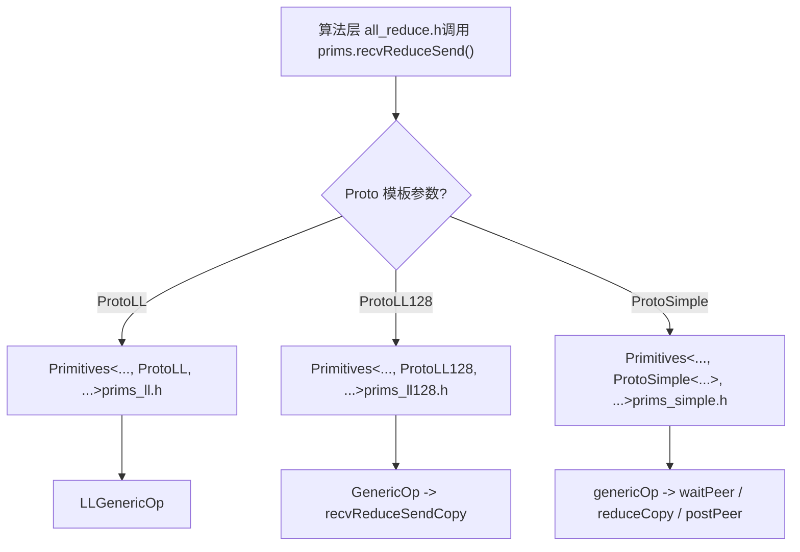
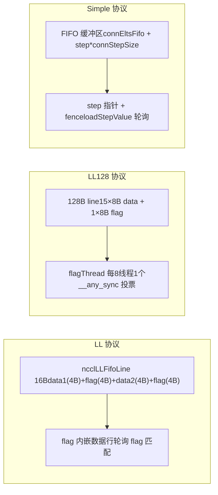

# ← Vorheriges Kapitel: Kapitel 7

# Offizielle Quelle: NVIDIA/nccl

Im vorherigen Kapitel haben wir verfolgt, wie die Host-Seite ein AllReduce in einen __global__ Kernel übersetzt, und gesehen, wie der geräteseitige Einstiegspunkt ncclKernelMain die Verteilung basierend auf Algorithmus und Protokoll durchführt. Doch die Verteilung wählt nur das Werkzeug aus; was die Leistung tatsächlich bestimmt, ist, wie diese Werkzeuge den Datentransport ausführen. Dieses Kapitel taucht tief in die drei Transportprimitive unter src/device ein: LL, LL128 und Simple, analysiert deren Datenübertragungsimplementierungen einzeln und versteht die Abwägungen zwischen Latenz und Bandbreite bei verschiedenen Protokollen.

# Warum dasselbe AllReduce drei Transportprimitive benötigt

Zunächst ein intuitives Modell. Stellen Sie sich eine Fließbandfabrik vor: Rohmaterial (Benutzerdaten) kommt an einem Ende hinein, Fertigprodukte kommen am anderen Ende heraus, und dazwischen gibt es mehrere Stationen (Ranks), die Halbfertigprodukte austauschen müssen. Es gibt drei Arten, Halbfertigprodukte zu transportieren:

- **LL（Low Latency）**: Wie zwei Personen, die sich gegenüberstehen und Notizzettel weiterreichen – während des Weiterreichens weiß der Empfänger sofort „das ist für dich", fast null Handshake-Overhead. Aber der Zettel ist sehr klein, es können nur 8 Byte Nutzdaten auf einmal übertragen werden. Geeignet für kleine Nachrichten.
- **LL128**: Ersetzt den Notizzettel durch einen 128-Byte-Haftzettel, überträgt 120 Byte Nutzdaten auf einmal, erfordert aber, dass der Haftzettel 16-Byte-aligned platziert wird, sonst muss zuerst im Shared Memory „neu formatiert" werden. Geeignet für mittlere Nachrichten.
- **Simple**: Wie ein Paketautomat – zuerst wird das Paket in den Schrank gelegt (FIFO-Puffer), dann wird eine Benachrichtigung „Fach Nr. N hat Ware" gesendet. Der Handshake-Overhead ist groß, aber es kann viel auf einmal transportiert werden. Geeignet für große Nachrichten.

> **[Design Inference & Architectural Trade-offs]**
> Was wäre, wenn es nur ein Primitiv gäbe? Nur LL: Große Nachrichten würden die Bandbreite ersticken, weil „jede Nachricht auf die Bestätigung des Flags durch die Gegenseite warten muss"; nur Simple: Kleine Nachrichten würden durch den festen Overhead von „FIFO schreiben + Benachrichtigung senden + auf Benachrichtigung warten" in der Latenz explodieren. Dass die Leistungskurve von NCCL bei etwa 8KB und 128KB deutliche Knickpunkte aufweist, hat hier seine Wurzel.

Die drei Primitive teilen sich dasselbe Template-Gerüst`Primitives<T, RedOp, Fan, Direct, Proto, P2p, isNetOffload>`, durch den Template-Parameter`Proto`werden drei Versionen spezialisiert[FACT:src/device/primitives.h:117-117]。`ProtoLL`、`ProtoLL128`、`ProtoSimple`Die drei Strukturen tragen jeweils protokollbezogene Konstanten und Berechnungsmethoden[FACT:src/device/primitives.h:25-75], der Algorithmuscode ruft nur`prims.send()`、`prims.recvReduceSend()`solche einheitlichen Schnittstellen auf und kümmert sich nicht darum, welches Protokoll zugrunde liegt.



Diese Abbildung erklärt, „warum dieselbe AllReduce-Logik drei Transportprimitive benötigt": Die Algorithmusebene ist protokollunabhängig, die Protokollunterschiede sind in den`Primitives`drei Spezialisierungen gekapselt.

# LL: Zero-Handshake-Transport mit in der Datenzeile eingebettetem Flag

## Intuitives Modell

Der Kerngedanke von LL ist:**„Daten" und die Markierung „ob die Daten bereit sind" werden in dieselbe 16-Byte-Lese-/Schreibeinheit gesteckt**. Der Empfänger benötigt keine zusätzliche „Benachrichtigungsnachricht", er muss nur das Flag-Feld in der Datenzeile abfragen; wenn das Flag übereinstimmt, sind die Daten angekommen. Das ist wie beim Briefversand, bei dem die „Unterschrift des Empfängers" direkt auf den Umschlag gedruckt wird – der Briefträger sieht die Unterschrift und weiß, ob er zustellen soll, ohne einen separaten Empfangsschein ausstellen zu müssen.

Ohne dieses Design müsste der Empfänger zuerst auf eine Benachrichtigung „Daten wurden geschrieben" warten und dann zurückgehen, um die Daten zu lesen – zwei Speicher-Roundtrips, verdoppelte Latenz.

## Datenstruktur und Speicherlayout

Die Transporteinheit von LL ist`union ncclLLFifoLine`, aus dem Assembly von`storeLL`lässt sich das Layout erkennen[FACT:src/device/prims_ll.h:154-158]：

```
st.volatile.global.v4.u32 [%0], {%1,%2,%3,%4};
// 写入 4 个 u32：data1, flag, data2, flag
```

Ein`ncclLLFifoLine`ist 16 Byte groß, angeordnet als`[data1(4B) | flag(4B) | data2(4B) | flag(4B)]`. Die Nutzdaten sind nur 8 Byte (data1 + data2), die anderen 8 Byte sind vollständig Flag. Das ist der Grund, warum`ProtoLL::calcBytePerGrain()`zurückgibt`sizeof(uint64_t)`– „One 16-byte line has 8-bytes of data"[FACT:src/device/primitives.h:55-57]。

Schlüsselfelder (`Primitives`LL-Spezialisierung)[FACT:src/device/prims_ll.h:20-42]：

| Feld | Typ | Funktion |
| --- | --- | --- |
| `recvStep[i]` / `sendStep[i]` | `uint64_t[MaxRecv/MaxSend]` | Schrittweiser Zähler pro Peer, bestimmt Puffer-Offset und Flag-Wert |
| `recvBuff[i]` / `sendBuff[i]` | `ncclLLFifoLine*` | Zeigt auf die FIFO-Pufferbasisadresse jedes Peers |
| `recvConnHeadPtr` | `volatile uint64_t*` | Globaler Zeiger auf der Empfängerseite für „bis zu welchem Schritt konsumiert wurde" |
| `sendConnHeadPtr` | `volatile uint64_t*` | Globaler Zeiger auf der Senderseite für „bis zu welchem Schritt die Gegenseite konsumiert hat" |
| `sendConnHeadCache` | `uint64_t` | Cached den zuletzt gelesenen head-Wert, um nicht jedes Mal den globalen Speicher lesen zu müssen |

Der Puffer-Offset wird berechnet durch`recvOffset(i) = (recvStep[i] % NCCL_STEPS) * stepLines`[FACT:src/device/prims_ll.h:44-46]，`NCCL_STEPS`ist die Anzahl der Slots im Ringpuffer,`stepLines`ist die Anzahl der Zeilen pro Slot. Der Flag-Wert wird berechnet durch`recvFlag(i) = NCCL_LL_FLAG(recvStep[i] + 1)`[FACT:src/device/prims_ll.h:56-58], beachten Sie`+1`– da der initiale Flag-Wert 0 ist, muss das Flag des ersten Schritts 1 sein, um es von „nicht geschrieben" unterscheiden zu können.

## Szenario-getriebener Walkthrough: Ein recvReduceSend

Angenommen, Rank 0 führt im Ring AllReduce`recvReduceSend`aus: Daten vom vorherigen Rank empfangen, mit lokalen Daten reduzieren, dann an den nächsten Rank senden. Die Aufrufkette ist`recvReduceSend(inpIx, eltN)` → `LLGenericOp<1, 1, Input, -1>(inpIx, -1, eltN, false)` [FACT:src/device/prims_ll.h:403-405]。

**Erster Schritt: Warten, bis der Sendepuffer verfügbar ist.** `waitSend`prüft`sendConnHeadCache + NCCL_STEPS < sendConnHead + 1` [FACT:src/device/prims_ll.h:73-89]. Die Bedeutung ist: Wenn der Konsumfortschritt der Gegenseite (head) zu weit hinter mir zurückliegt, ist der Ringpuffer fast voll und es muss gewartet werden.`NCCL_STEPS`ist die Gesamtzahl der Puffer-Slots,`sendConnHead + 1`ist der Slot, den ich gleich belegen werde. Beim Warten wird`*sendConnHeadPtr`abgefragt, der Cache aktualisiert und periodisch`checkAbort`aufgerufen, um zu prüfen, ob abgebrochen wurde[FACT:src/device/prims_ll.h:73-89]。

**Zweiter Schritt: Lokale Daten laden.** `DataLoader::loadBegin`behandelt das Alignment-Problem[FACT:src/device/prims_ll.h:200-216]. Wenn`sizeof(T) <= 2`(z. B. half oder int8), ist die Quelladresse möglicherweise nicht 4-Byte-aligned, also wird zuerst 4-Byte-aligned in`u4[0..2]`eingelesen,`misalign`aufgezeichnet, und dann in`loadFinish`mit`__funnelshift_r`durch byteweises Verschieben der korrekte 64-Bit-Wert zusammengesetzt[FACT:src/device/prims_ll.h:218-225]. Dies ist eine typische „Aligned-Read + Shift-Rekombination"-Technik, die die Leistungseinbußen nicht-alignierter Zugriffe vermeidet.

**Dritter Schritt: Gegenseitige Daten lesen und auf Flag warten.** `readLL`ist der Kern[FACT:src/device/prims_ll.h:108-122]：

```cpp
do {
  asm volatile("ld.volatile.global.v4.u32 {%0,%1,%2,%3}, [%4];" ...);
  if (checkAbort(abort, 1, spins)) break;
} while ((flag1 != flag) || (flag2 != flag));
```

Es verwendet`ld.volatile.global.v4.u32`Einmalig 16 Bytes lesen (4 u32), dann prüfen, ob beide flag-Felder gleich dem erwarteten Wert sind.`volatile`Das Schlüsselwort stellt sicher, dass der Compiler diesen Lesevorgang nicht wegoptimiert oder in ein Register cacht – da die Gegenseite jederzeit neue Daten schreiben kann. Beide flags müssen übereinstimmen, weil der Schreibende`storeLL`einmal 4 u32 schreibt, was theoretisch in zwei 8-Byte-Schreibvorgänge aufgeteilt werden könnte; nur wenn beide flags übereinstimmen, ist garantiert, dass die 16 Bytes vollständig sind.

**Vierter Schritt: reduce und senden.**Nach Empfang von peerData`applyReduce(redOp, peerData, data)`eine Reduktion durchführen[FACT:src/device/prims_ll.h:279]. Dann`storeLL(sendPtr(i) + offset, data, sendFlag(i))`das Ergebnis in den Sendepuffer schreiben[FACT:src/device/prims_ll.h:295-296]. Auf die Sendereihenfolge achten: zuerst`i=1..MaxSend`senden (normalerweise der Netzwerk-Peer), zuletzt`i=0`senden (normalerweise der lokale Peer)[FACT:src/device/prims_ll.h:291-297]. Der Kommentar ist sehr klar: „Send : inter-node, then intra-node, then local" – zuerst das Langsame senden (Netzwerk), damit es im Hintergrund läuft, dann das Schnelle (lokal), so dass der lokale Peer nicht auf das Netzwerk wartet.

**Fünfter Schritt: step vorantreiben und posten.** `incRecv(i)`Den Empfangs-Step inkrementieren[FACT:src/device/prims_ll.h:91-93]，`postRecv()`und`recvConnHead`in den globalen Zeiger zurückschreiben[FACT:src/device/prims_ll.h:94-97], um der Gegenseite mitzuteilen: „Ich habe diesen Schritt konsumiert". Auf der Sendeseite`incSend`gibt es eine spezielle Logik[FACT:src/device/prims_ll.h:99-106]：

```cpp
if ((sendStep[i] & NCCL_LL_CLEAN_MASK) == NCCL_LL_CLEAN_MASK) {
  for (int o = offset; o  *head) { ... }
}
```

Im DirectRead-Modus von sendrecv muss der Sender warten, bis der Empfänger die Daten vollständig gelesen hat, bevor er zurückkehren kann. Wenn der Empfänger aus irgendeinem Grund den tail nicht vorantreibt, kommt es zu einem Deadlock beim Sender. Dieses Warten muss nach`barrier()`erfolgen, da sonst möglicherweise eine Konkurrenz mit dem post-Thread entsteht.

**Fallstrick 3:`roundUp`verursachter step-Sprung.** `loadRecvConn`und`loadSendConn`enthalten beide`step = roundUp(step, SlicePerChunk * StepPerSlice)` [FACT:src/device/prims_simple.h:486, 533]. Dies richtet den step an der slice-Grenze aus, aber wenn der step des vorherigen Schritts nicht ausgerichtet war, werden die übersprungenen Slots nicht korrekt initialisiert. Der Code fügt in`loadRecvConn`eine Anweisung`*connStepPtr = step`hinzu, um das Credit zurückzugeben[FACT:src/device/prims_simple.h:489]。

# Vergleich und Auswahl der drei Primitiven



| Dimension | LL | LL128 | Simple |
| --- | --- | --- | --- |
| Nutzlastrate | 50% | 93.75% | ~100% |
| Synchronisationsmethode | flag eingebettet, Polling | flagThread + warp-Abstimmung | step-Zeiger + fence |
| Ausrichtungsanforderung | Keine (mit Verschiebungs-Neuzusammensetzung) | 16 Bytes | Keine |
| Geeignete Nachrichtengröße | Klein (< 8KB) | Mittel (8KB ~ 128KB) | Groß (> 128KB) |
| Pufferlayout | `ncclLLFifoLine[]` | `uint64_t[]`nach 128B line | `T[]` FIFO |
| Direct-Unterstützung | Keine (`PrimitivesWithoutDirect`Degradierung) | Keine (wie links) | Vollständige Unterstützung |

LL und LL128 erben beide`PrimitivesWithoutDirect` [FACT:src/device/prims_ll.h:9-10, src/device/prims_ll128.h:13-14], da ihr Pufferlayout das direkte Lesen und Schreiben des Peer-Speichers nicht unterstützt. Simple hingegen implementiert den Direct-Modus vollständig und unterstützt P2P-Direktverbindungen und NVLS.

# Designüberlegungen

> **[Design Inference & Architectural Trade-offs]**
> **Warum muss das flag von LL zweimal wiederholt werden?**Weil GPU-Global-Memory-Schreibvorgänge keine Atomarität garantieren.`storeLL`Beim Schreiben von 16 Bytes kann die Hardware dies in zwei 8-Byte-Schreibvorgänge aufteilen. Wenn nur ein flag vorhanden ist, könnte der Empfänger die Daten als bereit betrachten, obwohl nur die Hälfte geschrieben wurde. Die beiden flags befinden sich in der ersten bzw. zweiten Hälfte der 16 Bytes. Nur wenn beide Schreibvorgänge abgeschlossen sind, stimmen beide flags überein.

**Warum muss Simple einen warp reservieren?** [FACT:src/device/prims_simple.h:625-626]Der Kommentar besagt: „For send operations, we need an extra warp to overlap the threadfence and the copy“.`fence_acq_rel_sys()`ist eine teure Operation. Wenn alle Threads auf den Abschluss des fence warten, geht viel Zeit verloren. Ein reservierter warp führt speziell den fence aus, während andere warps weiter die nächste Datencharge transportieren können.

> **[Design Inference & Architectural Trade-offs]**
> **Warum erfolgt die step-Vorantreibung von LL128 am Ende von GenericOp und nicht in recvReduceSendCopy?**Weil der Transport von LL128 auf warp-Ebene erfolgt und mehrere warps parallel verschiedene slices verarbeiten können. Wenn in`recvReduceSendCopy`der step vorangetrieben wird, würde jeder warp ihn einmal vorantreiben, was zu mehrfachem Vorantreiben des step führt. Die einheitliche Vorantreibung am Ende von`GenericOp`stellt sicher, dass jeder slice nur einmal vorangetrieben wird.

# Zusammenfassung dieses Kapitels

Dieses Kapitel hat die Implementierung der drei Transportprimitiven eingehend behandelt:

1. **LL**: Mit 16-Byte-`ncclLLFifoLine`wird das flag in die Datenzeile eingebettet. Der Empfänger muss nur das flag auf Übereinstimmung abfragen, um die Datenbereitschaft zu bestätigen. Nutzlast 50%, geeignet für kleine Nachrichten. Kern ist`readLL`von`ld.volatile.global.v4.u32`und`storeLL`von`st.volatile.global.v4.u32`。

2. **LL128**: Das flag wird in den letzten 8 Bytes jedes 128-Byte-Blocks konzentriert, wodurch die Nutzlast auf 93.75% steigt. Mit`flagThread`(1 pro 8 Threads) wird das flag überprüft,`__any_sync`führt die warp-Abstimmung durch. Bei Nichtausrichtung erfolgt ein Neu-Layout über Shared Memory.

3. **Simple**: FIFO-Puffer + step-Zeiger-Benachrichtigung für hohen Durchsatz bei großen Nachrichten.`flags`Bit-Flags kodieren die Rolle,`waitPeer`pollt den step,`postPeer`aktualisiert den step und führt fence aus. Vollständige Unterstützung des Direct-Modus.

Die drei Primitiven teilen dasselbe Template-Gerüst und werden durch`Proto`Template-Parameter spezialisiert. Die Algorithmusebene ruft nur die einheitliche Schnittstelle auf und kümmert sich nicht um das zugrunde liegende Protokoll. Das ist die Antwort auf die Frage „Warum benötigt dieselbe AllReduce-Logik drei Transportprimitiven“: Unterschiedliche Nachrichtengrößen erfordern unterschiedliche Synchronisationsstrategien und Pufferlayouts. Die drei Primitiven sind jeweils für kleine, mittlere und große Nachrichten optimiert.

# Denkanstöße und Selbsttest dieses Kapitels

Q1: Wenn man die cleanup-Logik in`incSend`([FACT:src/device/prims_ll.h:99-106]) entfernt, in welchen Szenarien kommt es zu Datenkorruption? Warum?

**Referenzanalyse**: Die cleanup-Logik schreibt bei`sendStep[i] & NCCL_LL_CLEAN_MASK == NCCL_LL_CLEAN_MASK`alle Zeilen des gesamten slice mit dem aktuellen flag (Daten mit 0 gefüllt). Wenn sie entfernt wird, können bei einem step-Wraparound an der`NCCL_LL_CLEAN_MASK`-Grenze einige Zeilen noch das flag der vorherigen Runde haben. Wenn das flag der vorherigen Runde zufällig dem entspricht, was der Empfänger in dieser Runde erwartet, könnte der Empfänger fälschlicherweise annehmen, dass die Daten bereit sind, und die Restdaten der vorherigen Runde lesen. Dies ist ein typisches ABA-Problem. Die Auslösebedingung ist ein lang andauernder Betrieb (step überschreitet`NCCL_LL_CLEAN_MASK`Zyklen) und das flag kehrt zufällig zum gleichen Wert zurück. Solche Bugs sind extrem schwer zu reproduzieren, da eine präzise step-Ausrichtung erforderlich ist.

F2: Im Destruktor des Simple-Protokolls – worauf warten die Wartevorgänge im NetRegMode ([FACT:src/device/prims_simple.h:794-804]) und im DirectRead ([FACT:src/device/prims_simple.h:814-824]) jeweils? Was passiert in Szenarien mit hoher Nebenläufigkeit, wenn man einen davon entfernt?

**Referenzanalyse**: NetRegMode wartet darauf, dass der Proxy-Thread`connFifo[prevStep].size`auf -1 setzt, was bedeutet, dass die Netzwerkkarte das Senden abgeschlossen hat. Wenn man dies entfernt, könnte der nächste Kernel den Sendepuffer überschreiben, der gerade von der Netzwerkkarte per DMA gelesen wird, was dazu führt, dass die Netzwerkkarte veraltete Daten liest. DirectRead wartet darauf, dass die Empfängerseite den Tail voranschiebt (`*tail > *head`), was bedeutet, dass die Empfängerseite den direkten Puffer vollständig gelesen hat. Wenn man dies entfernt, könnte der Sender den Puffer überschreiben, bevor die Empfängerseite ihn vollständig gelesen hat, was dazu führt, dass die Empfängerseite neue statt alte Daten liest. In Szenarien mit hoher Nebenläufigkeit sind beide Wartevorgänge erforderlich; das Entfernen eines beliebigen führt zu Datenrennen. Der Unterschied besteht darin, dass NetRegMode das „Lesen durch die Netzwerkkarte" verhindert, während DirectRead das „Lesen durch die GPU des Gegenübers" verhindert.

F3: LL128s`loadRegsBegin`geht bei Nichtausrichtung den Weg über Shared-Memory-Umsortierung ([FACT:src/device/prims_ll128.h:115-141]). Um wie viel langsamer ist dieser Pfad im Vergleich zum ausgerichteten Pfad? Warum verlangt NCCL nicht direkt, dass Benutzerpuffer 16-Byte-ausgerichtet sein müssen?

**Referenzanalyse**: Der nicht ausgerichtete Pfad hat drei zusätzliche Schritte: Schreiben in den Shared Memory,`__syncwarp()`, Lesen aus dem Shared Memory. Obwohl die Bandbreite des Shared Memory hoch ist, ist`__syncwarp()`ein Synchronisationspunkt, der den Warp blockiert, bis alle Threads das Schreiben abgeschlossen haben. Grob geschätzt ist der nicht ausgerichtete Pfad 20–40 % langsamer als der ausgerichtete Pfad, abhängig von Shared-Memory-Bank-Konflikten. NCCL erzwingt keine Ausrichtung, weil Benutzer Puffer mit beliebigem Offset übergeben könnten (z. B. Tensor-Slices); erzwungene Ausrichtung würde die Flexibilität der API einschränken. Die Strategie von NCCL lautet: „Bei Ausrichtung den schnellen Pfad nehmen, bei Nichtausrichtung den langsamen Pfad nehmen, aber Korrektheit garantieren." In Produktionsumgebungen wird Benutzern empfohlen, Puffer möglichst 16-Byte-ausgerichtet zu allokieren, um den schnellen Pfad zu nutzen.

Damit haben wir die Datenübertragungsmechanismen der drei Primitive LL, LL128 und Simple gemeistert; sie bieten den übergeordneten Algorithmen flexible Mittel zur Leistungssteuerung. Das nächste Kapitel taucht in den Kern der kollektiven Kommunikationsalgorithmen ein und betrachtet, wie AllReduce, AllGather, ReduceScatter usw. diese Primitive aufrufen und wie Algorithmen wie Ring, Tree und CollNet die Datenströme organisieren, um schließlich Ende-zu-Ende-Kollektivkommunikation zu realisieren.
