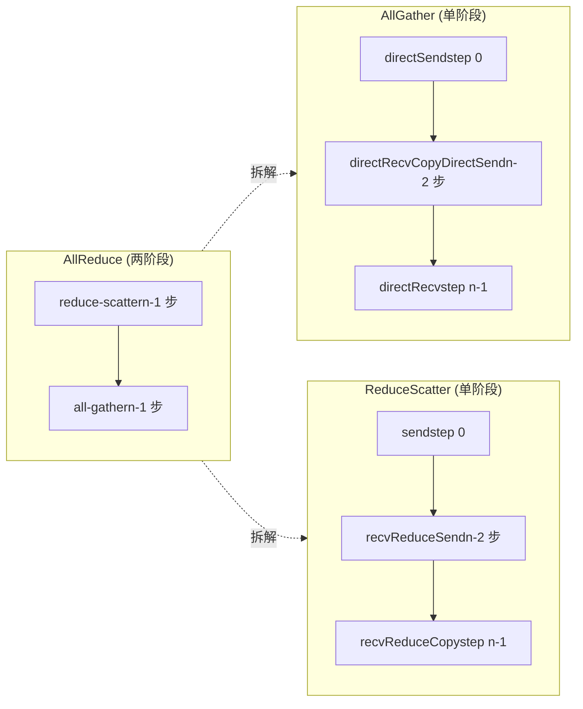
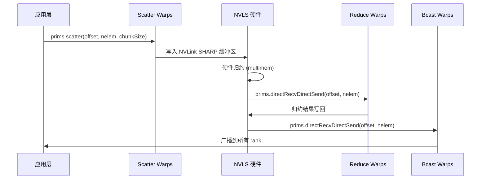

# Kapitel 10: Kerne kollektiver Kommunikationsalgorithmen: geräteseitige Implementierung von AllReduce, AllGather, ReduceScatter

Das vorherige Kapitel hat die drei Protokollprimitive LL, LL128 und Simple zerlegt; sie sind die „Motoren" der Datenübertragung, aber der Motor selbst weiß nicht, was er bewegen soll, wohin und in welcher Reihenfolge. Die in diesem Kapitel betrachtete Gruppe von Algorithmuskernel-Dateien unter src/device ist das „Getriebe" – sie übersetzen die kollektiven Kommunikationssemantiken von AllReduce, AllGather und ReduceScatter in eine Folge von Primitivaufrufen wie prims.directSend und prims.directRecvReduceDirectSend. Der Kernwiderspruch dieses Kapitels lässt sich in einem Satz zusammenfassen: Warum benötigt dasselbe AllReduce vier völlig unterschiedliche geräteseitige Implementierungen – Ring, Tree, CollNet und NVLS? Die Antwort liegt in der Übereinstimmung zwischen „Datenfluss-Topologie" und „Hardwarefähigkeiten". Ring nutzt die geringste Netzwerkbandbreite für eine zweistufige Pipeline, Tree reduziert die Latenz durch baumförmige Reduktion auf log(n), und CollNet/NVLS verlagern die Reduktion auf die Netzwerkkarte oder den NVLink-Switch. Dieses Kapitel zerlegt sie einzeln.

# 10.1 Ring AllReduce: Wie eine zweistufige Pipeline im Kernel umgesetzt wird

## Intuitives Modell: „Staffellauf" am ringförmigen Fließband

Stellen Sie sich n Arbeiter vor, die im Kreis stehen, jeder mit einer Kiste Rohmaterial. Das Ziel von AllReduce ist, dass am Ende jeder das „fertige Produkt aus der Mischung aller Rohmaterialien" erhält. Der Ring-Algorithmus arbeitet in zwei Phasen: In der ersten Phase (Reduce-Scatter) reicht jeder die Kiste entlang des Rings weiter und mischt bei jeder Station sein eigenes Rohmaterial ein; nach n-1 Stationen hat jeder genau eine „vollständig gemischte" Fertigware, aber nur einen Anteil von 1/n; in der zweiten Phase (All-Gather) werden diese Fertigwarenanteile noch einmal entlang des Rings weitergegeben, und jeder vervollständigt alle Anteile.

Ohne Ring wäre die einfachste Methode, dass jeder Rank die Daten an den Root sendet, der Root reduziert und dann broadcastet – die Netzwerkbandbreite des Root wird zum Engpass, und je größer n, desto langsamer. Das Raffinierte an Ring ist:**Die Sende- und Empfangsmenge jedes Ranks beträgt das 2(n-1)/n-fache der Datenmenge und wird unabhängig von n auf alle Verbindungen verteilt.**。

## Datenstruktur und Speicherlayout

Der zentrale Zustand des Ring-Algorithmus befindet sich in`ncclRing`Struktur (definiert in device.h, wird in diesem Kapitel nicht weiter ausgeführt),`runRing`es werden nur zwei Felder daraus verwendet:

- `ring->index`: Die logische Position dieses Ranks im Ring, verwendet zur Berechnung, „welcher Chunk im j-ten Schritt verarbeitet werden soll".
- `ring->prev` / `ring->next`: Die Nummern der Vorgänger- und Nachfolger-Ranks, als`Primitives`Konstruktorparameter recv/send peer.

Die entscheidenden Blockparameter werden von`ncclCollCbdPart`berechnet ([FACT:src/device/all_reduce.h:21-22]）：

```
ncclCollCbdPart(work, ncclShmem.channelId, Proto::Id, sizeof(T), (ssize_t*)nullptr, &gridOffset, &channelCount, &chunkCount);
```

Diese Funktion unterteilt die Daten der gesamten Kommunikationsdomäne nach Channel und gibt drei Werte aus:`gridOffset`(Startoffset der von diesem Channel verantworteten Daten im gesamten Buffer),`channelCount`(Gesamtzahl der von diesem Channel verantworteten Elemente),`chunkCount`(Anzahl der Chunk-Elemente, die jedem Rank zugeteilt werden).`chunkCount`ist die Granularität des Ring-Algorithmus – bei jedem Schritt wird ein Chunk übertragen.

`loopCount = nranks * chunkCount`（[FACT:src/device/all_reduce.h:23]) gibt die Datenmenge an, die „eine vollständige Runde" verarbeitet. Die äußere Schleife`for (elemOffset = 0; elemOffset < channelCount; elemOffset += loopCount)`（[FACT:src/device/all_reduce.h:34]) bedeutet: Wenn die Channel-Datenmenge die Menge übersteigt, die eine Runde verarbeiten kann, werden mehrere Runden ausgeführt.

## Step-by-Step Walkthrough: Der vollständige Aufrufablauf eines Ring AllReduce

Szenario: 4 Ranks (nranks=4), der`ringIx=0`，`chunkCount=100`，`channelCount=400`dieses Ranks (genau eine Runde).

**Schritt 0: Den „eigenen Chunk" an die nächste GPU weiterreichen**（[FACT:src/device/all_reduce.h:42-47]）

```
chunk = modRanks(ringIx + nranks - 1);   // = 3
chunkOffset = chunk * chunkCount;         // = 300
offset = gridOffset + elemOffset + chunkOffset;
nelem = min(chunkCount, remCount - chunkOffset);
prims.directSend(offset, offset, nelem);
```

`modRanks`ist ein Lambda, das eine Subtraktion modulo nranks durchführt ([FACT:src/device/all_reduce.h:40]）。`ringIx + nranks - 1`bedeutet „die Chunk-Nummer des vorherigen Ranks". Warum wird in Schritt 0 Chunk 3 gesendet? Weil in der Reduce-Scatter-Phase des Rings jeder Rank zuerst die Datenmenge sendet, die er „nicht behalten soll" (d. h. den Chunk des Vorgänger-Ranks).`directSend`sendet nur, empfängt nicht, da zu diesem Zeitpunkt noch keine Daten empfangen wurden.

**Schritte 1 bis nranks-2: Empfangen, Reduzieren und Weiterleiten**（[FACT:src/device/all_reduce.h:50-56]）

```
for (int j = 2; j 计算 chunkCount/loopCount"] --> loop{"elemOffset |否| done["返回"]
    loop -->|是| s0["step 0: directSendchunk = ringIx-1"]
    s0 --> mid{"j 从 2 到 nranks-1?"}
    mid -->|是| s1["directRecvReduceDirectSendchunk = ringIx-j"]
    s1 --> mid
    mid -->|否| s2["step nranks-1directRecvReduceCopyDirectSendpostOp=true"]
    s2 --> ag{"j 从 1 到 nranks-2?"}
    ag -->|是| s3["directRecvCopyDirectSend纯转发"]
    s3 --> ag
    ag -->|否| s4["directRecv收最后一块"]
    s4 --> loop
```

## Designüberlegung: Warum die Chunk-Reihenfolge des Rings „rückwärts" verläuft

Beachten Sie das Muster der Chunk-Nummerierung: In Schritt 0 wird`ringIx-1`gesendet, in Schritt j wird`ringIx-j`verarbeitet, im letzten Schritt wird`ringIx+0`verarbeitet. Dies ist eine**gegen den Uhrzeigersinn**verlaufende Progression. Warum? Weil jeder Rank des Rings nur „den Chunk behält, für dessen Reduktion er verantwortlich ist" (d. h.`ringIx+0`), alle anderen Chunks nur durchlaufen. Die Progression gegen den Uhrzeigersinn stellt sicher: Wenn ein Chunk eine vollständige Runde zurück zum Startpunkt gelangt, sind genau nranks Reduktionen abgeschlossen und das Endergebnis entsteht. Bei einer Progression im Uhrzeigersinn würde der Chunk auf dem falschen Rank reduziert werden.

## Produktions-Fallstrick:`remCount < loopCount`Alignment-Falle bei

[FACT:src/device/all_reduce.h:38]Es gibt eine leicht zu übersehende Codezeile:

```
if (remCount = 256) nthreadsSplit += 64;
} else {
  nthreadsSplit = (nthreads * 7 / (10 * WARP_SIZE)) * WARP_SIZE;
}
```

Das Simple-Protokoll teilt hälftig auf; das LL/LL128-Protokoll teilt im Verhältnis 7:3 auf, da „Daten von 3 Quellen empfangen und reduzieren“ rechenintensiver ist als „an 3 Ziele senden“, weshalb der Reduktionsgruppe mehr Threads zugewiesen werden.

Dann`tid < nthreadsSplit`führen die Threads von die Reduktion nach oben aus ([FACT:src/device/all_reduce.h:175-202]), die übrigen Threads den Broadcast nach unten ([FACT:src/device/all_reduce.h:203-224]). Die beiden Gruppen unterscheiden ihre jeweiligen Kommunikationsgruppen durch den`Proto::MaxGroupWidth`-Offset ([FACT:src/device/all_reduce.h:189]von`0 * Proto::MaxGroupWidth`und[FACT:src/device/all_reduce.h:210]von`1 * Proto::MaxGroupWidth`）。

## Designüberlegung: Warum der Wurzelknoten von Tree speziell behandelt werden muss

Der Wurzelknoten der baumförmigen Reduktion ist der „Sammelpunkt“; seine Empfangsmenge ist ein Vielfaches der Kindknoten, seine Sendemenge ist null (Reduktionsphase). Wenn der Wurzelknoten ebenfalls den generischen`directRecvReduceDirectSend`durchlaufen würde, würde er versuchen, an`tree->up`(-1) zu senden, was zu einem Bereichsfehler führt. Daher muss er mit dem`if (tree->up == -1)`-Zweig separat behandelt werden. Analog dazu die`tree->down[0] == -1`-Prüfung des Blattknotens.

## Produktions-Fallstrick: das „Hot-Root“-Problem des Tree-Algorithmus

Der Wurzelknoten von Tree trägt den gesamten Reduktionsverkehr. Wenn die GPU, auf der sich der Wurzelknoten befindet, zufällig ein langsamer Knoten ist (z. B. eingeschränkte PCIe-Bandbreite), wird das gesamte AllReduce verlangsamt. NCCLs Gegenmaßnahme ist:**Jeder Channel wählt eine andere Wurzel**, um die Last des Wurzelknotens auf mehrere Ranks zu verteilen. Deshalb verwendet`runTreeSplit`der Wurzelknoten-Zweig in`FanSymmetric<NCCL_MAX_TREE_ARITY_TOP>`（[FACT:src/device/all_reduce.h:168]) – er muss gleichzeitig die Reduktion mehrerer Kindknoten verarbeiten. Wenn in der Produktionsumgebung eine ungleichmäßige Tree-AllReduce-Leistung festgestellt wird, prüfen Sie, ob die Wurzelknotenverteilung der Channels gleichmäßig ist.

# 10.3 AllGather und ReduceScatter: die „Halbstrecken“-Varianten von Ring

## Intuitives Modell: AllReduce in zwei Hälften aufteilen

AllGather und ReduceScatter sind im Wesentlichen die beiden Phasen von AllReduce, jeweils als eigenständige API. AllGather führt nur das „Sammeln“ durch – jeder Rank steuert einen Datenanteil bei, am Ende erhalten alle alle Daten. ReduceScatter führt nur „Reduktion + Streuung“ durch – alle steuern Daten bei, nach der Reduktion erhält jeder einen Anteil.

Ohne diese beiden eigenständigen APIs könnten Benutzer bei „zuerst reduzieren, dann sammeln“ oder „zuerst sammeln, dann reduzieren“ nur AllReduce aufrufen und manuell aufteilen, wodurch die Hälfte der Bandbreite verschwendet würde.

## Ring-Implementierung von AllGather

`all_gather.h`von`runRing`（[FACT:src/device/all_gather.h:14-88]) ist einfacher als AllReduce: keine Reduktion, nur Kopieren und Weiterleiten.

**Schritt 0: eigene Daten an die nächste GPU senden**（[FACT:src/device/all_gather.h:51-60]）

```
rankDest = ringRanks[0];
offset = dataOffset + rankDest * count;
if ((inputBuf + dataOffset == outputBuf + offset) || isNetOffload) {
  prims.directSend(dataOffset, offset, nelem);
} else {
  prims.directCopySend(dataOffset, offset, nelem);
}
```

Hier gibt es eine In-Place-Prüfung: Wenn`inputBuf + dataOffset == outputBuf + offset`, bedeutet dies, dass Eingabe und Ausgabe derselbe Speicherbereich sind (In-Place-AllGather), direkt`directSend`; andernfalls`directCopySend`(zuerst in die Ausgabe kopieren, dann senden).

**Mittlere nranks-2 Schritte: reine Weiterleitung**（[FACT:src/device/all_gather.h:62-67]）

```
prims.directRecvCopyDirectSend(offset, offset, nelem);
```

**Letzter Schritt: den letzten Block empfangen**（[FACT:src/device/all_gather.h:69-74]）

```
prims.directRecv(offset, nelem);
```

## isNetOffload: einzelner Warp steuert das Netzwerk + mehrere Warps kopieren parallel

[FACT:src/device/all_gather.h:28-36]hat einen speziellen Zweig:

```
if (isNetOffload) {
  workNthreads = WARP_SIZE;
  chunkCount = NCCL_MAX_NET_SIZE;
} else {
  workNthreads = nthreads;
}
```

Wenn`isNetOffload=true`(Single-RPN- + Netzwerkregistrierungsmodus), wird nur 1 Warp zur Steuerung der Ring-Kommunikation verwendet, die übrigen Warps führen parallel „Kopieren der Quelldaten in den Zielbuffer“ durch ([FACT:src/device/all_gather.h:76-82]). Dies dient dazu, bei nicht-In-Place-AllGather den Kopieraufwand mit dem Kommunikationsaufwand zu überlappen.

Am Ende gibt es ein`barrier_sync(14, nthreads)`（[FACT:src/device/all_gather.h:87]), und der Kommentar erklärt es sehr klar: Es muss gewartet werden, bis alle Warps fertig sind, sonst könnte der nächste Work outputBuf wiederverwenden und eine Race-Condition verursachen. Barrier 14 wird verwendet, um die eigene Barrier von prims und`__syncthreads()`。

## Ring-Implementierung von ReduceScatter

`reduce_scatter.h`von`runRing`（[FACT:src/device/reduce_scatter.h:14-56]) ist die Reduce-Scatter-Phase von AllReduce, separat herausgezogen:

**Schritt 0: eigene Daten an die nächste GPU senden**（[FACT:src/device/reduce_scatter.h:39-42]）

```
rankDest = ringRanks[nranks - 1];
offset = dataOffset + rankDest * count;
prims.send(offset, nelem);
```

**Mittlere nranks-2 Schritte: empfangen, reduzieren und weiterleiten**（[FACT:src/device/reduce_scatter.h:44-49]）

```
prims.recvReduceSend(offset, nelem);
```

**Letzter Schritt: empfangen und reduzieren, um das Endergebnis zu erzeugen**（[FACT:src/device/reduce_scatter.h:61-64]）

```
prims.recvReduceCopy(offset, dataOffset, nelem, /*postOp=*/true);
```

Beachten Sie den letzten Schritt`recvReduceCopy`hat zwei Offsets:`offset`(Empfangsquelle) und`dataOffset`(lokale Eingabe), das Reduktionsergebnis wird geschrieben nach`dataOffset`。

## Datenfluss-Vergleichsdiagramm



## Produktions-Fallstrick: Die Grenzen der In-Place-Erkennung

[FACT:src/device/all_gather.h:55]Die In-Place-Erkennung von`inputBuf + dataOffset == outputBuf + offset`hängt von exakter Zeigergleichheit ab. Wenn die vom Benutzer übergebenen sendbuff und recvbuff einen Offset haben, aber logisch derselbe Speicherbereich sind, schlägt diese Prüfung fehl, was zum Pfad`directCopySend`führt – zwar korrekt, aber mit einer zusätzlichen Kopie. In der Produktionsumgebung wird empfohlen, bei In-Place-AllGather sicherzustellen, dass sendbuff und recvbuff vollständig übereinstimmen.

# 10.4 CollNet und NVLS: Reduktion auf Hardware auslagern

## Intuitives Modell: Den „Switch" rechnen lassen

Ring und Tree lassen „die GPU selbst die Reduktion berechnen". CollNet und NVLS verfolgen einen anderen Ansatz: Die Reduktionsoperation wird auf die Netzwerkkarte (CollNet) oder den NVLink-Switch (NVLS) ausgelagert. Die GPU ist nur dafür verantwortlich, die Daten zu senden; die Hardware führt die Reduktion durch und sendet das Ergebnis zurück. Das ist wie der Wechsel von „jeder Arbeiter mischt seine eigenen Zutaten" zu „die Zutaten werden zu einem zentralen Mixer gebracht, der sie mischt und dann verteilt".

Ohne Hardware-Offloading beansprucht die Reduktionsoperation SM-Ressourcen der GPU, und die Reduktionslatenz kann nicht verborgen werden.

## Thread-Aufteilung bei CollNet Direct

`RunWorkColl<ncclFuncAllReduce, ..., NCCL_ALGO_COLLNET_DIRECT, ...>`Die`run`（[FACT:src/device/all_reduce.h:249-386]) teilt die Threads in vier Gruppen auf:

```
const int nThreadsScatter = WARP_SIZE + ((hasUp && hasDn) ? COLLNET_COPY_THREADS : ...);
const int nThreadsGather = ((hasUp && hasDn) ? COLLNET_COPY_THREADS : ...);
const int nThreadsBcast = WARP_SIZE + ((hasUp && hasDn) ? COLLNET_COPY_THREADS : ...);
const int nThreadsReduce = work->nWarps * WARP_SIZE - nThreadsScatter - nThreadsGather - nThreadsBcast;
```

Die vier Thread-Gruppen sind jeweils verantwortlich für: Scatter (Daten auf die einzelnen Rails verteilen), Reduce (nach der Reduktion ans Netzwerk senden), Gather (von den einzelnen Rails einsammeln), Bcast (nach Empfang aus dem Netzwerk broadcasten).`COLLNET_COPY_THREADS = 96`（[FACT:src/device/all_reduce.h:250]) ist die feste Anzahl von Kopier-Threads.

## netRegUsed: Puffer-Layout im Netzwerk-Registrierungsmodus

[FACT:src/device/all_reduce.h:280-288]hat eine entscheidende Verzweigung:

```
if (work->netRegUsed) {
  offsetBase = bid * chunkSize;
  maxNelems = size;
  peerOffset = nChannels * chunkSize;
} else {
  offsetBase = bid * direct->nHeads * chunkSize;
  maxNelems = direct->nHeads * chunkSize;
  peerOffset = chunkSize;
}
```

`netRegUsed`Im Modus werden die Puffer kanalweise kontinuierlich angeordnet (`bid * chunkSize`), der Peer-Offset ist`nChannels * chunkSize`; im Nicht-Registrierungsmodus werden sie nach Head angeordnet (`bid * nHeads * chunkSize`), der Peer-Offset ist`chunkSize`. Dieser Unterschied rührt daher, dass der Netzwerk-Registrierungsmodus kontinuierliche Puffer erfordert, um DMA der Netzwerkkarte zu ermöglichen.

## Warp-Zuweisung bei NVLS

`RunWorkColl<ncclFuncAllReduce, ..., NCCL_ALGO_NVLS, ...>`Die`run`（[FACT:src/device/all_reduce.h:391-523]) verwendet eine feinere Warp-Zuweisung:

```
const int bcastWarps = hasOut ? (work->regUsed ? ((totalWarps - 2) >> 1) - 1 : 2) : 0;
const int reduceWarps = work->regUsed ? (totalWarps - bcastWarps - 2) : (hasOut ? 3 : nranks regUsed ? 1 : (totalWarps - reduceWarps - bcastWarps + 1) >> 1;
const int gatherWarps = work->regUsed ? 1 : (totalWarps - reduceWarps - bcastWarps) >> 1;
```

`regUsed`Im Modus belegen scatter/gather jeweils nur 1 Warp (da die NVLS-Hardware direkt auf den registrierten Speicher zugreift), reduce nimmt den Großteil ein; im Nicht-Registrierungsmodus belegen scatter/gather jeweils etwa die Hälfte, reduce wird je nach Rank-Anzahl angepasst (≤6 verwendet 7 Warps, sonst 5 Warps).

## Zeitablauf-Interaktionsdiagramm



## Produktions-Fallstrick: Die`direct->out == -1`Falle bei CollNet

[FACT:src/device/reduce_scatter.h:521]hat eine Zeile:

```
if (direct->out == -1) __trap();
```

Wenn die out-Verbindung von CollNet nicht aufgebaut ist (-1), führt ein direktes`__trap()`zum Absturz des Kernels. Das ist defensive Programmierung – CollNet hängt von der Netzwerkkarte ab; wenn die Initialisierung der Netzwerkkarte fehlschlägt, ist out gleich -1, und eine weitere Ausführung würde zu undefiniertem Verhalten führen. Wenn in der Produktionsumgebung ein Kernel-Trap auftritt, prüfen Sie, ob die CollNet-Netzwerkkarte ordnungsgemäß initialisiert wurde.

# 10.5 Broadcast und Reduce: Die zwei einfachsten kollektiven Operationen

## Broadcast: Vom Root ausfächern

`broadcast.h`Die`runRing`（[FACT:src/device/broadcast.h:14-64])-Logik ist direkt: Der Root-Knoten sendet Daten, andere Knoten leiten weiter, der letzte Knoten empfängt nur.

```
if (rank == root) {
  if (inputBuf == outputBuf || isNetOffload) {
    prims.directSend(offset, offset, nelem);
  } else {
    prims.directCopySend(offset, offset, nelem);
  }
} else if (nextRank == root) {
  prims.directRecv(offset, nelem);
} else {
  prims.directRecvCopyDirectSend(offset, offset, nelem);
}
```

Drei Verzweigungen: Root sendet, der Vorgänger des Roots empfängt, Zwischenknoten leiten weiter. Beachten Sie, dass`nextRank == root`prüft, ob „der nächste Knoten des aktuellen Knotens der Root ist", d. h. der aktuelle Knoten ist der letzte im Ring – er empfängt nur und sendet nicht.

## Reduce: Zum Root hin zusammenführen

`reduce.h`Die`runRing`（[FACT:src/device/reduce.h:14-53]) ist die Umkehrung von Broadcast:

```
if (prevRank == root) {
  prims.send(offset, nelem);
} else if (rank == root) {
  prims.recvReduceCopy(offset, offset, nelem, /*postOp=*/true);
} else {
  prims.recvReduceSend(offset, nelem);
}
```

`prevRank == root`Der Knoten

## sendet nur (er ist der Vorgänger des Roots), der Root empfängt nur und reduziert, Zwischenknoten empfangen, reduzieren und leiten gleichzeitig weiter.

Design-Überlegung: Warum Broadcast/Reduce ebenfalls Ring verwenden**Broadcast und Reduce könnten theoretisch mit Tree eine niedrigere Latenz erreichen, aber NCCL wählt Ring, weil:**Die Datenmengen dieser beiden Operationen sind normalerweise klein, die Ring-Implementierung ist einfacher und kann den Ring-Codepfad von AllReduce wiederverwenden

## . Die Komplexität von Tree (Root-Knoten-Auswahl, Thread-Aufteilung) bringt bei kleinen Nachrichten keinen nennenswerten Nutzen.

Produktions-Fallstrick: Bandbreitenengpass am Root-Knoten bei Broadcast**Der Root-Knoten von Broadcast muss alle Daten senden; wenn der Root ein langsamer Knoten ist, wird der gesamte Broadcast verlangsamt. NCCLs Gegenmaßnahme ist:**Broadcast unterstützt ebenfalls mehrere Channels, wobei der Root jedes Channels unterschiedlich sein kann`work->root`. Beachten Sie jedoch, dass

# global ist und alle Channels denselben Root teilen – das liegt an der Semantik von Broadcast (es gibt nur eine Quelle). Wenn Broadcast in der Produktionsumgebung langsam ist, prüfen Sie die Netzwerkbandbreite des Root-Knotens.

10.6 Algorithmus-Auswahlmatrix: RunWorkColl-Template-Spezialisierung`RunWorkColl`Alle Algorithmus-Kernel werden über[FACT:src/device/all_reduce.h:228-788]Template-Spezialisierungen registriert (

| ). Jede Spezialisierung entspricht einer Kombination aus „Funktion × Algorithmus × Protokoll": | Funktion | Algorithmus | Protokoll |
| --- | --- | --- | --- |
| AllReduce | RING | SIMPLE | [FACT:src/device/all_reduce.h:230-233] |
| AllReduce | TREE | SIMPLE | [FACT:src/device/all_reduce.h:238-244] |
| AllReduce | COLLNET_DIRECT | SIMPLE | [FACT:src/device/all_reduce.h:249-386] |
| AllReduce | NVLS | SIMPLE | [FACT:src/device/all_reduce.h:391-523] |
| AllReduce | NVLS_TREE | SIMPLE | [FACT:src/device/all_reduce.h:528-634] |
| AllReduce | COLLNET_CHAIN | SIMPLE | [FACT:src/device/all_reduce.h:639-759] |
| AllReduce | RING | LL | [FACT:src/device/all_reduce.h:764-766] |
| AllReduce | TREE | LL | [FACT:src/device/all_reduce.h:771-773] |
| AllReduce | RING | LL128 | [FACT:src/device/all_reduce.h:778-780] |
| AllReduce | TREE | LL128 | [FACT:src/device/all_reduce.h:785-787] |

Spezialisierungsposition**CollNet und NVLS unterstützen nur das SIMPLE-Protokoll**. Der Grund: Diese beiden Algorithmen basieren auf Hardware-Offloading, und der latenzarme Synchronisationsmechanismus von LL/LL128 ist mit Hardware-Offloading inkompatibel – die Latenz der Hardware-Reduktion ist deutlich größer als das Flag-Polling von LL, sodass LL den Overhead sogar erhöht.

## Die inhärente Logik der Protokollauswahl

- **LL**: Kleine Nachrichten (< 8KB), Latenz hat Priorität. Ring und Tree unterstützen beide.
- **LL128**: Mittlere Nachrichten (8KB - 1MB), 128-Byte-Ausrichtung. Ring und Tree unterstützen beide.
- **SIMPLE**: Große Nachrichten (> 1MB), Bandbreite hat Priorität. Alle Algorithmen unterstützen dies.

## Produktions-Fallstricke: Kombinationsbeschränkungen von Protokoll und Algorithmus

Wenn der Benutzer erzwingt,`NCCL_PROTO=LL`aber der Algorithmus CollNet ist, fällt NCCL in der Tuning-Phase auf SIMPLE zurück. Wenn in der Produktionsumgebung festgestellt wird, dass die Protokolleinstellung nicht wirksam wird, prüfen Sie, ob der Algorithmus dieses Protokoll unterstützt.

# Designüberlegungen: Warum dieselbe AllReduce-Logik so viele Implementierungen benötigt

Rückblickend auf dieses Kapitel: AllReduce hat sechs Algorithmusimplementierungen – Ring, Tree, CollNet Direct, CollNet Chain, NVLS und NVLS Tree. Dies ist keine Redundanz, sondern**die optimale Lösung für unterschiedliche Hardware-Topologien und Nachrichtengrößen**：

- **Ring**: Universell, geeignet für große Nachrichten, höchste Bandbreitennutzung.
- **Tree**: Geeignet für große Cluster, Latenz O(log n).
- **CollNet**: Geeignet für Cluster mit NICs, die Reduktion unterstützen, entlastet die GPU-Berechnung.
- **NVLS**: Geeignet für Single-Node-NVLink-Vollvermaschung, Hardware-Multicast-Reduktion.

Das Tuning-Modul von NCCL (Kapitel 5) wählt automatisch basierend auf Nachrichtengröße, Rank-Anzahl und Topologie aus. Die geräteseitige Implementierung muss nur sicherstellen, dass „jede Kombination korrekt ist"; die Auswahllogik liegt auf der Host-Seite.

# Zusammenfassung dieses Kapitels

Dieses Kapitel hat`src/device`unter sechs Algorithmus-Kernel-Dateien analysiert:

1. **Ring AllReduce**（[FACT:src/device/all_reduce.h:14-83]): Zweistufige Pipeline, reduce-scatter + all-gather, jede Phase n-1 Schritte.

2. **Tree AllReduce**（[FACT:src/device/all_reduce.h:86-225]): Baumförmige Reduktion, Latenz O(log n),`runTreeSplit`verwendet Thread-Aufteilung zur Implementierung der Reduktions-Broadcast-Pipeline.

3. **AllGather**（[FACT:src/device/all_gather.h:14-88]): Ring einsstufig, unterstützt in-place und netOffload.

4. **ReduceScatter**（[FACT:src/device/reduce_scatter.h:14-56]): Ring einsstufig, ist die reduce-scatter-Phase von AllReduce.

5. **Broadcast/Reduce**（[FACT:src/device/broadcast.h:14-64]、[FACT:src/device/reduce.h:14-53]): Einfachste Ring-Variante.

6. **CollNet/NVLS**（[FACT:src/device/all_reduce.h:247-635]): Hardware-Offloading, unterstützt nur das SIMPLE-Protokoll.

# Denkanstöße und Selbsttests dieses Kapitels

Q1: In der reduce-scatter-Phase von Ring AllReduce wird in Schritt 0`directSend`verwendet, in den Zwischenschritten`directRecvReduceDirectSend`, im letzten Schritt`directRecvReduceCopyDirectSend`. Wenn man im letzten Schritt`postOp=true`weglässt, in welchem Szenario entstehen dann fehlerhafte Ergebnisse?

**Referenzanalyse**：`postOp=true`löst Nachoperationen aus (z. B. Division bei der Mittelwertbildung). Am Beispiel von`ncclAvg`: Die Reduktion ist eine Summierung, postOp ist die Division durch nranks. Wenn man`postOp`weglässt, wird im letzten Schritt nur reduziert und nicht dividiert; im recvbuff steht dann die „Summe" statt des „Mittelwerts". In der reduce-scatter-Phase behält jeder Rank nur das Endergebnis eines Chunks, und dieser Chunk ist genau`ringIx+0`（[FACT:src/device/all_reduce.h:60]). Wenn postOp fehlt, wird die Summe dieses Chunks nicht durch nranks dividiert, und die anschließende all-gather-Phase verbreitet diese fehlerhafte „Summe" an alle Ranks. Hinweis: Nur der letzte Schritt benötigt postOp, da nur dieser Schritt ein „vollständiges Reduktionsergebnis" erzeugt; die Reduktionen der Zwischenschritte sind Teilsummen und benötigen kein postOp. Wenn in der Produktionsumgebung festgestellt wird, dass das AllReduce-Ergebnis um den Faktor nranks zu groß ist, prüfen Sie, ob postOp korrekt übergeben wird.

Q2: `runTreeSplit`Im LL/LL128-Protokoll werden Threads im Verhältnis 7:3 aufgeteilt ([FACT:src/device/all_reduce.h:163]), während im Simple-Protokoll im Verhältnis 1:1 aufgeteilt wird ([FACT:src/device/all_reduce.h:157]). Was passiert, wenn man das LL-Protokoll zwangsweise ebenfalls auf 1:1 ändert?

**Referenzanalyse**: Die Reduktionsgruppe von LL/LL128 muss von bis zu 3 Kindknoten Daten empfangen und reduzieren ([FACT:src/device/all_reduce.h:187]von`FanAsymmetric<NCCL_MAX_TREE_ARITY, 1>`), rechenintensiv; die Broadcast-Gruppe führt nur Kopieren und Weiterleiten durch ([FACT:src/device/all_reduce.h:208]von`FanAsymmetric<1, NCCL_MAX_TREE_ARITY>`), rechenleicht. Die 7:3-Aufteilung gibt der Reduktionsgruppe genügend Threads für die 3-Wege-Reduktion, während die Broadcast-Gruppe wenige, aber ausreichende Threads hat. Bei einer Änderung auf 1:1 hat die Reduktionsgruppe zu wenige Threads und die Reduktion wird zum Engpass; die Broadcast-Gruppe hat überschüssige Threads, was Verschwendung ist. Noch gravierender: Das Flag-Polling des LL-Protokolls ist Busy-Waiting, und mehr Threads erhöhen die Flag-Konkurrenz. Wenn in der Produktionsumgebung festgestellt wird, dass Tree AllReduce unter dem LL-Protokoll anomale Leistung zeigt, prüfen Sie, ob die Berechnung von`nthreadsSplit`geändert wurde.

Q3: Im`isNetOffload`-Modus von AllGather treibt nur 1 Warp die Ring-Kommunikation an ([FACT:src/device/all_gather.h:32]), während die übrigen Warps parallel kopieren ([FACT:src/device/all_gather.h:76-82]). Wenn man das abschließende`barrier_sync(14, nthreads)`（[FACT:src/device/all_gather.h:87]) weglässt, in welchem Szenario entsteht dann eine Datenrennsituation?

**Referenzanalyse**：`barrier_sync`Es wird sichergestellt, dass alle Warps (einschließlich Kommunikations-Warps und Kopier-Warps) diese Arbeit abgeschlossen haben, bevor mit der nächsten Arbeit begonnen wird. Wenn dies entfernt wird, könnte ein Kommunikations-Warp mit der Kommunikation der nächsten Arbeit beginnen, bevor der Kopier-Warp outputBuf fertig geschrieben hat, und die nächste Arbeit könnte denselben outputBuf wiederverwenden. Konkretes Szenario: Bei zwei aufeinanderfolgenden AllGather-Operationen schreibt der Kopier-Warp der ersten Operation noch am Ende von outputBuf, während der Kommunikations-Warp der zweiten Operation bereits neue Daten in outputBuf schreibt, wodurch die Daten der ersten Operation überschrieben werden. Im Kommentar steht es ganz klar: „otherwise, we can have contention if next work will use the outputBuf in this work“. Die Verwendung von Barrier 14 anstelle der Standard-Barrier dient dazu, die internen Barrieren von prims und`__syncthreads()`zu umgehen, um Deadlocks zu vermeiden. Wenn in der Produktionsumgebung gelegentlich fehlerhafte AllGather-Ergebnisse auftreten, sollte überprüft werden, ob die Barrier im`isNetOffload`-Pfad wegoptimiert wurde.

Bis hierhin haben wir gesehen, wie der geräteseitige Algorithmus-Kernel den Datenfluss organisiert. Jeder Algorithmus ruft über`Primitives`die Primitive des vorherigen Kapitels auf; die Algorithmusebene kümmert sich nur darum, „wer an wen sendet, welchen Chunk sendet, reduziert oder kopiert“. Das nächste Kapitel taucht in die Transportschicht-Abstraktion ein und betrachtet, wie P2P, SHM, NET und NVLS zu einer einheitlichen Schnittstelle zusammengeführt werden und wie die Proxy-Threads auf der Host-Seite mit dem geräteseitigen Kernel zusammenarbeiten, um maschinenübergreifende Kommunikation zu ermöglichen.

Kernregel: Alle Algorithmen rufen Primitive über die Primitives-Template-Klasse auf; der Algorithmus ist nur für die „Datenfluss-Topologie“ verantwortlich, die Primitive für den „Datentransport“. Diese Schichtung ermöglicht es, neue Algorithmen hinzuzufügen, indem nur die Topologie-Logik implementiert wird, ohne sich um die zugrunde liegende Synchronisation kümmern zu müssen. Doch unabhängig davon, wie sich die Topologie ändert, müssen die Daten letztendlich über physische Verbindungen übertragen werden. Das nächste Kapitel taucht in das Verzeichnis src/transport ein und betrachtet, wie NCCL mit einer einheitlichen Transport-Schnittstelle die Unterschiede zwischen P2P, SHM, NET und NVLS verbirgt und welche setup/connect/send/recv-Semantik jeder Transport hat. Dies ist die Grundlage für das Verständnis maschinenübergreifender Kommunikation.
