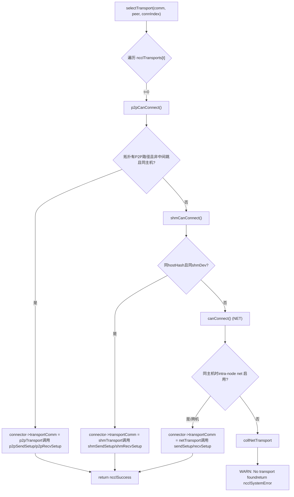
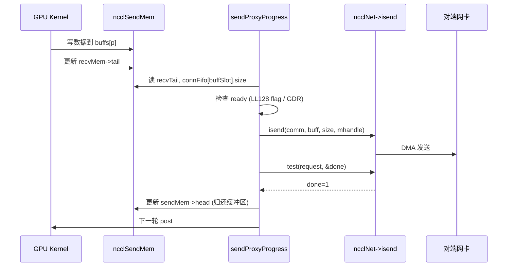

# Kapitel 11: Transportschicht-Abstraktion: Wie P2P, SHM, NET und NVLS unter einer einheitlichen Schnittstelle vereint werden

Im vorherigen Kapitel sind wir tief in den Algorithmus-Kernel eingedrungen und haben gesehen, wie Ring AllReduce Daten aufteilt und in zwei Phasen reduziert, und wie Tree AllReduce mithilfe einer Baumstruktur die Latenz senkt – aber diese Algorithmen definieren nur die logische Sicht „wer an wen sendet, welchen Chunk sendet“. Die Daten müssen letztendlich die realen physischen Verbindungen durchqueren: NVLink, PCIe, Shared Memory oder Netzwerkkarte. Dieses Kapitel zerlegt das Verzeichnis src/transport und betrachtet, wie NCCL mit einer einheitlichen ncclTransport-Schnittstelle die vier physischen Kanäle P2P, SHM, NET und NVLS zu einem einzigen Gesicht verschmilzt und damit die letzte Meile von der Algorithmus-Topologie zur physischen Übertragung bewältigt.

# I. Einheitliche Schnittstelle: Wie ncclTransport vier physische Kanäle verbirgt

## Intuitives Modell

Stellen Sie sich ein Logistikunternehmen vor: Egal ob der Kunde einen Stadtkurier (P2P), eine Übergabe im Gebäude (SHM), einen überprovinziellen Transport (NET) oder eine Direktverbindung (NVLS) verschickt, an der Rezeption wird nur ein „Frachtbrief“ ausgefüllt. Dieser Frachtbrief ist die`ncclTransport`-Struktur – sie legt fest, dass jede Transportart feste Aktionen wie`canConnect`、`setup`、`connect`、`free`bereitstellen muss. Ohne diese Abstraktionsschicht müsste der übergeordnete Algorithmus vier Sätze von`if-else`schreiben, um zu entscheiden, welche Verbindung genommen wird, und bei der Einführung neuer Hardware müssten alle Algorithmen geändert werden.

## Datenstruktur und Speicherlayout

NCCL registriert alle Transporte in einem globalen Array; die Reihenfolge bestimmt die Priorität:

[FACT:src/transport.cc:15-20]

```c
struct ncclTransport* ncclTransports[NTRANSPORTS] = {
  &p2pTransport,
  &shmTransport,
  &netTransport,
  &collNetTransport,
};
```

Die Array-Reihenfolge bestimmt die Auswahlreihenfolge: P2P zuerst, dann SHM, dann NET, schließlich CollNet. Jeder Transport wird durch die`ncclTransport`-Struktur beschrieben, die einen`canConnect`-Funktionszeiger und zwei`ncclTransportComm`enthält (je einen für send/recv). Am Beispiel von P2P:

[FACT:src/transport/p2p.cc:1493-1498]

```c
struct ncclTransport p2pTransport = {"P2P",
                                     p2pCanConnect,
                                     {p2pSendSetup, p2pSendConnect, p2pSendFree, NULL, p2pSendProxySetup, NULL,
                                      p2pSendProxyFree, NULL, p2pProxyRegister, p2pProxyDeregister},
                                     {p2pRecvSetup, p2pRecvConnect, p2pRecvFree, NULL, p2pRecvProxySetup, NULL,
                                      p2pRecvProxyFree, NULL, p2pProxyRegister, p2pProxyDeregister}};
```

`ncclTransportComm`Die Feldreihenfolge von`setup`ist feste „Lebenszyklus-Slots“:`connect`(Ressourcen vorbereiten),`free`(Verbindungsinformationen austauschen),`proxySharedInit`(freigeben),`proxySetup`、`proxyConnect`、`proxyFree`、`proxyProgress`、`proxyRegister`、`proxyDeregister`(Proxy-Shared-Initialisierung),`proxyProgress`. Beachten Sie, dass der`NULL`-Slot von P2P`proxyProgress`ist – denn P2P nutzt direkten GPU-Zugriff auf den Speicher des Gegenübers und benötigt keinen Host-Proxy-Thread für den Datentransport; während der`sendProxyProgress`/`recvProxyProgress`von NET

## ist, da Netzwerkkarten-I/O von einem Host-Thread angetrieben werden muss.

Szenario-getriebener Walkthrough: Wie eine Verbindung einen Transport auswählt`selectTransport`：

[FACT:src/transport.cc:23-44]

```c
template 
static ncclResult_t selectTransport(struct ncclComm* comm, struct ncclTopoGraph* graph, struct ncclConnect* connect,
                                    int channelId, int peer, int connIndex, int* transportType) {
  struct ncclPeerInfo* myInfo = comm->peerInfo + comm->rank;
  struct ncclPeerInfo* peerInfo = comm->peerInfo + peer;
  struct ncclConnector* connector = (type == 1) ? comm->channels[channelId].peers[peer]->send + connIndex :
                                                  comm->channels[channelId].peers[peer]->recv + connIndex;
  for (int t = 0; t send : &transport->recv;
    int ret = 0;
    NCCLCHECK(transport->canConnect(&ret, comm, graph, myInfo, peerInfo));
    if (ret) {
      connector->transportComm = transportComm;
      NCCLCHECK(transportComm->setup(comm, graph, myInfo, peerInfo, connect, connector, channelId, connIndex));
      if (transportType) *transportType = t;
      return ncclSuccess;
    }
  }
  WARN("No transport found for rank %d[%lx] -> rank %d[%lx]", myInfo->rank, myInfo->busId, peerInfo->rank,
       peerInfo->busId);
  return ncclSystemError;
}
```

`type==1`zeigt die send-Richtung an,`type==0`zeigt die recv-Richtung an. Die Schleife fragt nacheinander jede Art von transport`canConnect`: Rückgabe von`ret=1`bedeutet „Ich kann diese Aufgabe erledigen“, sofort wird`connector->transportComm`auf die entsprechende Richtung dieses transports gesetzt und dessen`setup`aufgerufen. Wenn alle transports 0 zurückgeben, wird eine Warnung ausgegeben und`ncclSystemError`。

`canConnect`zurückgegeben. Die Entscheidungslogik spiegelt die „Territorialgrenzen“ der einzelnen transports wider. Am Beispiel von P2P:

[FACT:src/transport/p2p.cc:129-157]

```c
ncclResult_t p2pCanConnect(int* ret, struct ncclComm* comm, struct ncclTopoGraph* graph, struct ncclPeerInfo* info1,
                           struct ncclPeerInfo* info2) {
  initCeOperation();
  int intermediateRank;
  int isCrossClique;
  NCCLCHECK(ncclTopoCheckP2p(comm, comm->topo, info1->rank, info2->rank, ret, NULL, &intermediateRank, NULL,
                             &isCrossClique));
  if (*ret == 0) return ncclSuccess;
  if (intermediateRank != -1) {
    if (useMemcpy) *ret = 0;
    return ncclSuccess;
  }
  if (!isCrossClique) {
    int useNet = 0;
    NCCLCHECK(ncclTopoCheckNet(comm->topo, info1->rank, info2->rank, &useNet));
    if (useNet) {
      *ret = 0;
      return ncclSuccess;
    }
  }
  if (info1->hostHash != comm->peerInfo[comm->rank].hostHash || info1->hostHash != info2->hostHash) {
    return ncclSuccess;
  }
  ...
```

Die Entscheidungskette von P2P: Zuerst wird die Topologie gefragt, „ob es einen P2P-Pfad zwischen zwei ranks gibt“; wenn es Zwischen-Hops gibt (`intermediateRank != -1`) und CE memcpy aktiviert ist, wird P2P aufgegeben und an SHM/NET übergeben; wenn die Topologie nahelegt, das Netzwerk zu verwenden (`useNet`), wird ebenfalls aufgegeben; schließlich wird geprüft, ob es sich um denselben Host handelt. Die Entscheidung bei SHM ist einfacher:

[FACT:src/transport/shm.cc:61-83]

```c
static ncclResult_t shmCanConnect(int* ret, struct ncclComm* comm, struct ncclTopoGraph* graph,
                                  struct ncclPeerInfo* info1, struct ncclPeerInfo* info2) {
  *ret = 0;
  initShmLocality();
  if (ncclParamShmDisable() == 1) return ncclSuccess;
  int useNet = 0;
  NCCLCHECK(ncclTopoCheckNet(comm->topo, info1->rank, info2->rank, &useNet));
  if (useNet) return ncclSuccess;
  if (info1->hostHash != info2->hostHash) return ncclSuccess;
  if (info1->shmDev != info2->shmDev) return ncclSuccess;
  *ret = 1;
  return ncclSuccess;
}
```

SHM erfordert denselben Host (`hostHash`identisch) und die gemeinsame Nutzung desselben`/dev/shm`（`shmDev`identisch, für Kommunikation zwischen Containern). NET hingegen gibt fast immer 1 zurück und prüft nur bei demselben Host, ob intra-node net deaktiviert ist:

[FACT:src/transport/net.cc:160-168]

```c
static ncclResult_t canConnect(int* ret, struct ncclComm* comm, struct ncclTopoGraph* graph, struct ncclPeerInfo* info1,
                               struct ncclPeerInfo* info2) {
  *ret = 1;
  if (info1->hostHash == info2->hostHash) {
    NCCLCHECK(ncclTopoCheckNet(comm->topo, info1->rank, info2->rank, ret));
  }
  return ncclSuccess;
}
```

NET ist der „Fallback“ – solange niemand zuvor übernimmt, übernimmt es. NVLS'`canConnect`gibt direkt 0 zurück:

[FACT:src/transport/nvls.cc:21-26]

```c
ncclResult_t nvlsCanConnect(int* ret, struct ncclComm* comm, struct ncclTopoGraph* graph, struct ncclPeerInfo* info1,
                            struct ncclPeerInfo* info2) {
  // This transport cannot be used for p2p
  *ret = 0;
  return ncclSuccess;
}
```

NVLS verwendet nicht den regulären peer-to-peer-Verbindungspfad, sondern baut über`ncclNvlsSetup`separat eine Multicast-Gruppe auf, daher gibt`canConnect`immer 0 zurück.



## Designüberlegungen

> **[Design Inference & Architectural Trade-offs]**
> Warum „Array-Reihenfolge + canConnect-Abstimmung“ statt einer expliziten Routing-Tabelle? Weil die Topologie dynamisch ist: Dieselbe Maschine kann aufgrund von`NCCL_P2P_DISABLE`, Container-Isolation, CUDA-IPC-Verfügbarkeit und anderen Faktoren dazu führen, dass P2P nicht verfügbar ist; in diesem Fall wird automatisch auf SHM oder NET heruntergestuft. Der Abstimmungsmechanismus lässt jeden transport selbst beurteilen, „ob ich es kann“; ein neuer transport muss nur als weiterer Eintrag im Array hinzugefügt werden, ohne die Auswahllogik zu ändern. Genau das ist die Verkörperung des Open-Closed-Prinzips in der Systemprogrammierung.

# Zwei, P2P: Vier Formen der direkten GPU-Verbindung auf demselben Rechner

## Intuitives Modell

P2P bedeutet „Nachbarn reichen sich Dinge direkt“ – GPU 0 liest und schreibt direkt den Speicher von GPU 1, ohne CPU oder Netzwerkkarte. Ohne P2P müsste die Kommunikation zwischen mehreren Karten auf demselben Rechner über den Host-Speicher umgeleitet werden, was die Latenz verdoppelt und die Bandbreite halbiert.

## Datenstruktur und Speicherlayout

P2P hat intern vier Formen, unterschieden durch`enum p2pType`:

[FACT:src/transport/p2p.cc:19-24]

```c
enum p2pType {
  P2P_DIRECT,
  P2P_INTERMEDIATE,
  P2P_IPC,
  P2P_CUMEM
};
```

- `P2P_DIRECT`: Unterschiedliche GPUs im selben Prozess, direkter Zugriff über Zeiger (am schnellsten).
- `P2P_INTERMEDIATE`: Keine direkte Verbindung zwischen zwei GPUs, Weiterleitung über eine Zwischen-GPU erforderlich.
- `P2P_IPC`: Prozessübergreifend, Import des Peer-Speichers über traditionelles`cudaIpcOpenMemHandle`.
- `P2P_CUMEM`: Prozessübergreifend, Import über die cuMem-API (`cuMemExportToShareableHandle`), unterstützt feinere Speicherverwaltung.

Kernressourcenstruktur:

[FACT:src/transport/p2p.cc:79-94]

```c
struct p2pResources {
  enum p2pType type;
  union {
    struct ncclSendMem* sendDevMem;
    struct ncclRecvMem* recvDevMem;
  };
  void* sendMemIpc;
  int sendMemSameProc;
  void* recvMemIpc;
  int recvMemSameProc;
  // CE memcpy support
  struct p2pShmProxyInfo proxyInfo;
  struct p2pShm* shm;
  struct p2pShm* devShm;
  ncclShmIpcDesc_t desc;
};
```

`sendDevMem`/`recvDevMem`ist eine union – der Sender kümmert sich nur um`sendDevMem`, der Empfänger nur um`recvDevMem`, sie teilen sich einen Speicherbereich.`sendMemIpc`/`recvMemIpc`speichert das importierte Peer-Speicherhandle,`sendMemSameProc`/`recvMemSameProc`markiert, ob es sich um denselben Prozess handelt (entscheidet, ob beim Freigeben`ncclCuMemFreeAddr`oder`cudaIpcCloseMemHandle`）。

verwendet wird). Die Verbindungsinformationsstruktur`p2pConnectInfo`wird über bootstrap ausgetauscht:

[FACT:src/transport/p2p.cc:38-44]

```c
struct p2pConnectInfo {
  int rank;
  int read;
  struct ncclP2pBuff p2pBuff;
  // Used by CE memcpy
  ncclShmIpcDesc_t desc;
};
static_assert(sizeof(struct p2pConnectInfo) transportResources = resources;
  int useRead, intermediateRank;
  NCCLCHECK(p2pGetInfo(comm, myInfo, peerInfo, &useRead, &intermediateRank));
  if (useMemcpy) useRead = 0;
  ...
  int sendSize = sizeof(struct ncclSendMem);
  if (info->read) sendSize += comm->buffSizes[NCCL_PROTO_SIMPLE];
  ALIGN_SIZE(sendSize, CUDA_IPC_MIN);
  ...
```

Kernpunkte:`sendSize`Im P2P-Read-Modus muss zusätzlich die SIMPLE-Protokollpuffergröße hinzugefügt werden – denn im Read-Modus wird der SIMPLE-Puffer des Senders direkt vom Empfänger gelesen und muss zusammen mit`ncclSendMem`in demselben gemeinsam nutzbaren Speicher allokiert werden.`ALIGN_SIZE(sendSize, CUDA_IPC_MIN)`Stellt sicher, dass die Größe auf die minimale CUDA-IPC-Granularität ausgerichtet ist.

Anschließend wird je nach`intermediateRank`und Prozessbeziehung die Form gewählt:

[FACT:src/transport/p2p.cc:416-437]

```c
  if (intermediateRank == -1) {
    info->rank = myInfo->rank;
    if (P2P_SAME_PID(myInfo, peerInfo) && ncclParamP2pDirectDisable() == 0 && useMemcpy == 0) {
      resources->type = P2P_DIRECT;
      ...
    } else {
      if (ncclCuMemEnable()) {
        resources->type = P2P_CUMEM;
        ...
      } else {
        resources->type = P2P_IPC;
        ...
      }
    }
    send->conn.flags |= info->read ? NCCL_P2P_READ : NCCL_P2P_WRITE;
  } else {
    resources->type = P2P_INTERMEDIATE;
    info->rank = intermediateRank;
    ...
  }
```

`P2P_SAME_PID`Das Makro prüft, ob es derselbe Host und derselbe Prozess ist:

[FACT:src/transport/p2p.cc:334-335]

```c
#define P2P_SAME_PID(MYINFO, PEERINFO) \
  ((MYINFO->hostHash == PEERINFO->hostHash) && (MYINFO->pidHash == PEERINFO->pidHash))
```

Wenn es derselbe Prozess ist, direct nicht deaktiviert und memcpy nicht aktiviert ist, dann ist es das schnellste`P2P_DIRECT`– direkt den Peer-Zeiger nehmen. Andernfalls IPC/CUMEM verwenden.

Danach wird über den Proxy-Thread ein gemeinsam nutzbarer Puffer allokiert:

[FACT:src/transport/p2p.cc:457-468]

```c
  NCCLCHECK(ncclProxyConnect(comm, TRANSPORT_P2P, 1, info->rank, &send->proxyConn));
  if (useMemcpy) {
    NCCLCHECK(ncclProxyCallBlocking(comm, &send->proxyConn, ncclProxyMsgSetup, NULL, 0, &resources->proxyInfo,
                                    sizeof(struct p2pShmProxyInfo)));
    memcpy(&info->desc, &resources->proxyInfo.desc, sizeof(ncclShmIpcDesc_t));
  } else {
    NCCLCHECK(ncclProxyCallBlocking(comm, &send->proxyConn, ncclProxyMsgSetup, &req, sizeof(struct ncclP2pRequest),
                                    &info->p2pBuff, sizeof(struct ncclP2pBuff)));
    NCCLCHECK(p2pMap(comm, &send->proxyConn, myInfo, comm->peerInfo + info->rank, &info->p2pBuff,
                     (void**)&resources->sendDevMem, &resources->sendMemIpc));
    resources->sendMemSameProc = P2P_SAME_PID(myInfo, (comm->peerInfo + info->rank));
  }
```

`ncclProxyCallBlocking`ist ein synchrones RPC: Der Host-Thread sendet eine Nachricht an den Proxy-Thread, der Proxy-Thread ruft`p2pSendProxySetup`auf, um einen gemeinsam nutzbaren Puffer zu allokieren, und gibt`ncclP2pBuff`(einschließlich IPC-Handle) zurück. Dann mappt`p2pMap`den Peer-Puffer in den lokalen Adressraum.

`p2pMap`ist die zentrale Mapping-Funktion:

[FACT:src/transport/p2p.cc:349-390]

```c
static ncclResult_t p2pMap(struct ncclComm* comm, struct ncclProxyConnector* proxyConn, struct ncclPeerInfo* myInfo,
                           struct ncclPeerInfo* peerInfo, struct ncclP2pBuff* p2pBuff, void** devMem, void** ipcPtr) {
  if (P2P_SAME_PID(myInfo, peerInfo)) {
    if (peerInfo->cudaDev != myInfo->cudaDev) {
      cudaError_t err = cudaDeviceEnablePeerAccess(peerInfo->cudaDev, 0);
      ...
      if (ncclCuMemEnable()) {
        NCCLCHECK(ncclCuMemAllocAddr(devMem, &p2pBuff->ipcDesc.memHandle, p2pBuff->size));
        CUCHECK(cuMemRelease(p2pBuff->ipcDesc.memHandle));
        *ipcPtr = *devMem;
        ...
      } else {
        *devMem = p2pBuff->directPtr;
        *ipcPtr = NULL;
      }
    } else {
      *devMem = p2pBuff->directPtr;
      *ipcPtr = NULL;
    }
  } else {
    NCCLCHECK(ncclP2pImportShareableBuffer(comm, peerInfo->rank, p2pBuff->size, &p2pBuff->ipcDesc, devMem,
                                           p2pBuff->directPtr, ncclMemOffload));
    *ipcPtr = *devMem;
  }
  return ncclSuccess;
}
```

Gleicher Prozess, unterschiedliche GPUs: Zuerst`cudaDeviceEnablePeerAccess`den P2P-Kanal öffnen, dann direkt`directPtr`verwenden (da der Adressraum im selben Prozess geteilt wird). Prozessübergreifend:`ncclP2pImportShareableBuffer`aufrufen, um das Peer-Speicherhandle zu importieren.

## Nebenläufigkeitskontrolle und Hardware-Interaktion

Die Synchronisation von P2P beruht auf dem`ncclSendMem`/`ncclRecvMem`in`head`/`tail`Zeiger. Der Sender schreibt`head`, um dem Empfänger mitzuteilen „bis wohin ich geschrieben habe“, der Empfänger schreibt`tail`, um dem Sender mitzuteilen „bis wohin ich gelesen habe“. Dies ist ein typischer lockfreier Producer-Consumer:

[FACT:src/transport/p2p.cc:571-576]

```c
  } else {
    send->conn.tail = &remDevMem->tail;
    send->conn.head = &resources->sendDevMem->head;
    send->conn.ptrExchange = &resources->sendDevMem->ptrExchange;
    send->conn.redOpArgExchange = resources->sendDevMem->redOpArgExchange;
  }
```

`head`zeigt auf das lokale`sendDevMem`，`tail`zeigt auf das Peer-`remDevMem`. Der GPU-Kernel implementiert die GPU-übergreifende Synchronisation durch Lesen und Schreiben dieser beiden Zeiger, ohne CPU-Eingriff.

## Produktions-Fallstricke

**Falle 1: P2P Read und memcpy schließen sich gegenseitig aus.**Siehe`p2pSendConnect`：

[FACT:src/transport/p2p.cc:551-559]

```c
  for (int p = 0; p read && p == NCCL_PROTO_SIMPLE) {
      /* For P2P Read the SIMPLE buffer is local (ncclSendMem) */
      if (resources->sendDevMem == NULL) return ncclInternalError; // We should not use read + memcpy
      send->conn.buffs[p] = (char*)(resources->sendDevMem + 1);
    } else {
      send->conn.buffs[p] = buff;
      buff += comm->buffSizes[p];
    }
  }
```

Wenn`read=1`aber`sendDevMem==NULL`, direkt`ncclInternalError`zurückgeben. Wenn dieser Fehler in der Produktionsumgebung auftritt, prüfen, ob gleichzeitig`NCCL_P2P_READ_ENABLE=1`und`NCCL_P2P_USE_CUDA_MEMCPY=1`gesetzt wurden – diese beiden haben widersprüchliche Semantik.

**Falle 2: Freigabereihenfolge bei prozessübergreifender Nutzung.** `p2pSendFree`Je nach`sendMemSameProc`wird die Freigabemethode bestimmt:

[FACT:src/transport/p2p.cc:624-651]

```c
ncclResult_t p2pSendFree(struct ncclComm* comm, struct ncclConnector* send) {
  struct p2pResources* resources = (struct p2pResources*)send->transportResources;
  if (resources) {
    if (ncclCuMemEnable()) {
      if (resources->sendMemIpc) {
        if (resources->sendMemSameProc) {
          NCCLCHECK(ncclCuMemFreeAddr(resources->sendMemIpc, comm->memManager));
        } else {
          NCCLCHECK(ncclCudaFree(resources->sendMemIpc, comm->memManager));
        }
      }
      ...
```

Im selben Prozess wird`ncclCuMemFreeAddr`verwendet (gibt nur die Adresszuordnung frei, nicht den physischen Speicher), prozessübergreifend wird`ncclCudaFree`(Gibt physischen Speicher frei). Eine Verwechslung führt zu Speicherlecks oder Use-after-free.

# Drei, SHM: Der Streit um „wer stellt den Speicher“ beim Shared Memory

## Intuitives Modell

SHM ist „zwei Prozesse teilen sich eine Whiteboard“ – der Sender schreibt, der Empfänger liest. Aber wo steht das Whiteboard? Beim Sender (sender-side), der Empfänger kommt herüber zum Lesen; oder beim Empfänger (receiver-side), der Sender geht hinüber zum Schreiben? Das ist das Problem, das der`NCCL_SHM_LOCALITY`Parameter lösen soll.

## Datenstruktur und Speicherlayout

[FACT:src/transport/shm.cc:28-34]

```c
struct shmSendResources {
  struct ncclRecvMem* remHostMem;
  struct ncclRecvMem* devRemHostMem;
  ncclShmIpcDesc_t remDesc;
  struct ncclSendMem* hostMem;
  struct ncclSendMem* devHostMem;
};

struct shmRecvResources {
  struct ncclSendMem* remHostMem;
  struct ncclSendMem* devRemHostMem;
  ncclShmIpcDesc_t remDesc;
  struct ncclRecvMem* hostMem;
  struct ncclRecvMem* devHostMem;
};
```

Beachte, dass`hostMem`und`devHostMem`paarweise auftreten:`hostMem`ist ein Host-seitiger Zeiger,`devHostMem`ist ein geräteseitiger Zeiger (über UVA oder cuMem gemappt).`remHostMem`/`devRemHostMem`ist die lokale Abbildung des Shared Memory der Gegenseite.

## Szenario-getriebener Walkthrough: Locality-Wahl bei SHM

`shmSendSetup`Je nach locality wird entschieden, wie viel Speicher alloziert wird:

[FACT:src/transport/shm.cc:88-119]

```c
static ncclResult_t shmSendSetup(struct ncclComm* comm, struct ncclTopoGraph* graph, struct ncclPeerInfo* myInfo,
                                 struct ncclPeerInfo* peerInfo, struct ncclConnect* connectInfo,
                                 struct ncclConnector* send, int channelId, int connIndex) {
  struct shmSendResources* resources;
  struct shmConnectInfo* info = (struct shmConnectInfo*)connectInfo;
  size_t shmSize = sizeof(struct ncclSendMem);
  struct shmRequest req;

  NCCLCHECK(ncclCalloc(&resources, 1));
  send->transportResources = resources;

  if (shmLocality == SHM_SEND_SIDE) {
    for (int p = 0; p buffSizes[p];
  }
  req.size = shmSize;
  if (myInfo->hostHash == peerInfo->hostHash && myInfo->pidHash == peerInfo->pidHash) req.legacy = true;
  else req.legacy = false;

  NCCLCHECK(ncclProxyConnect(comm, TRANSPORT_SHM, 1, myInfo->rank, &send->proxyConn));
  NCCLCHECK(ncclProxyCallBlocking(comm, &send->proxyConn, ncclProxyMsgSetup, (void*)&req, sizeof(struct shmRequest),
                                  (void*)info, sizeof(struct shmConnectInfo)));

  info->rank = comm->rank;
  resources->hostMem = (struct ncclSendMem*)info->buf.hptr;
  resources->devHostMem = (struct ncclSendMem*)info->buf.dptr;
  ...
```

`shmLocality == SHM_SEND_SIDE`wird vom Sender der Datenpuffer alloziert (`shmSize`plus alle Protokollpuffer); andernfalls nur`ncclSendMem`die Kontrollstruktur.`req.legacy`markiert, ob es sich um denselben Prozess handelt – innerhalb desselben Prozesses kann traditionelles`mmap`verwendet werden, prozessübergreifend sind cuMem oder`/dev/shm`Dateien erforderlich.

`shmSendConnect`entscheidet je nach locality, ob`buffs`auf lokal oder auf die Gegenseite zeigt:

[FACT:src/transport/shm.cc:153-176]

```c
static ncclResult_t shmSendConnect(struct ncclComm* comm, struct ncclConnect* connectInfo, int nranks, int rank,
                                   struct ncclConnector* send) {
  struct shmConnectInfo* info = (struct shmConnectInfo*)connectInfo;
  struct shmSendResources* resources = (struct shmSendResources*)send->transportResources;
  char* buff;

  NCCLCHECK(ncclShmImportShareableBuffer(comm, info->rank, &info->desc, (void**)&resources->remHostMem,
                                         (void**)&resources->devRemHostMem, &resources->remDesc));

  buff = shmLocality == SHM_SEND_SIDE ? (char*)(resources->devHostMem + 1) : (char*)(resources->devRemHostMem + 1);
  for (int p = 0; p conn.buffs[p] = buff;
    buff += comm->buffSizes[p];
  }
  send->conn.tail = &resources->devRemHostMem->tail;
  send->conn.head = &resources->devHostMem->head;
  send->conn.stepSize = comm->buffSizes[NCCL_PROTO_SIMPLE] / NCCL_STEPS;
  ...
```

`SHM_SEND_SIDE`：`buffs`zeigt auf lokales`devHostMem`(Sender schreibt in eigenen Speicher);`SHM_RECV_SIDE`：`buffs`zeigt auf die Gegenseite`devRemHostMem`(Sender schreibt in den Speicher des Empfängers).`head`zeigt immer auf lokal,`tail`zeigt immer auf die Gegenseite – denn der Sender aktualisiert`head`, der Empfänger aktualisiert`tail`。

## Designüberlegungen

> **[Design Inference & Architectural Trade-offs]**
> Warum standardmäßig`SHM_RECV_SIDE`? Weil der Empfänger normalerweise die Daten aus dem Shared Memory in seinen eigenen GPU-Speicher kopieren muss. Wenn das Shared Memory lokal beim Empfänger liegt, ist der Kopierpfad kürzer (lokaler Speicher → lokale GPU), was NUMA-übergreifende Zugriffe vermeidet. Der Sender schreibt zwar in entfernten Speicher, was einen zusätzlichen knotenübergreifenden Schreibvorgang bedeutet, aber der Sender ist normalerweise eine rechenintensive GPU, und Schreibvorgänge können asynchron erfolgen.

## Produktions-Fallstricke

**Falle: Container-übergreifendes`/dev/shm`wird nicht geteilt.** `shmCanConnect`Prüfe`info1->shmDev != info2->shmDev`：

[FACT:src/transport/shm.cc:76-78]

```c
  TRACE(NCCL_INIT | NCCL_SHM, "peer1 shmDev %lx peer2 shmDev %lx", info1->shmDev, info2->shmDev);
  if (info1->shmDev != info2->shmDev) return ncclSuccess;
```

Wenn zwei Container unterschiedliche`/dev/shm`，`shmDev`mounten, wird SHM automatisch auf NET heruntergestuft. Wenn in der Produktion festgestellt wird, dass Kommunikation zwischen Hosts über das Netzwerk läuft, prüfe, ob die`/dev/shm`Mounts der Container konsistent sind.

# Vier, NET: Mapping-Tabelle und Proxy-Fortschritt bei der Netzwerkübertragung

## Intuitives Modell

NET ist „Städteübergreifender Expressversand“ – Daten werden verpackt und der Netzwerkkarte übergeben, die sie über Glasfaser zur Gegenseite schickt. Aber die Netzwerkkarte kennt keine GPU-Speicheradressen; sie braucht eine „Adress-Mapping-Tabelle“, um GPU-virtuelle Adressen in physische Adressen zu übersetzen, die die Netzwerkkarte versteht. Diese Tabelle ist`connectMap`。

## Datenstruktur und Speicherlayout

[FACT:src/transport/net.cc:73-86]

```c
struct connectMapMem {
  char* gpuPtr;
  char* cpuPtr;
  ssize_t size;
  ncclIpcDesc ipcDesc;
  ncclShmIpcDesc_t attachDesc;
  ncclShmIpcDesc_t createDesc;
};

struct connectMap {
  int sameProcess;
  int shared;
  int cudaDev;
  // First 3 bits of offsets determine the mem bank. 001 is host mem, 011 is dev mem, 101 is shared host mem and 111
  // is shared dev mem.
  struct connectMapMem mems[NCCL_NET_MAP_MEMS];
  // Offsets. 3 MSBs indicate mem bank, 111 indicates NULL.
  struct {
    uint32_t sendMem;
    uint32_t recvMem;
    uint32_t buffs[NCCL_NUM_PROTOCOLS];
  } offsets;
};
```

`connectMap`ist ein „Speicherbank“-System:`mems`Das Array hat 5 Slots (`NCCL_NET_MAP_MEMS=5`), die jeweils host mem, dev mem, shared host mem, shared dev mem, GDC mem entsprechen.`offsets`Jedes Feld in

ist eine 32-Bit-Ganzzahl, wobei die oberen 3 Bits kodieren, „welche Bank“, und die unteren 29 Bits den „Offset innerhalb der Bank“ kodieren.

[FACT:src/transport/net.cc:36-46]

```c
#define NCCL_NET_MAP_OFFSET_BANK(mapStruct, offsetName) ((mapStruct)->offsets.offsetName >> 30)

#define NCCL_NET_MAP_OFFSET_NULL(mapStruct, offsetName) (((mapStruct)->offsets.offsetName >> 29) == 0)

#define NCCL_NET_MAP_GET_POINTER(mapStruct, cpuOrGpu, offsetName) \
  (NCCL_NET_MAP_OFFSET_NULL(mapStruct, offsetName) ? \
     NULL : \
     (mapStruct)->mems[NCCL_NET_MAP_OFFSET_BANK(mapStruct, offsetName)].cpuOrGpu##Ptr + \
       ((mapStruct)->offsets.offsetName & NCCL_NET_MAP_MASK_OFFSET))

#define NCCL_NET_MAP_DEV_MEM(mapStruct, offsetName) (((mapStruct)->offsets.offsetName & NCCL_NET_MAP_MASK_DEVMEM) != 0)
```

`NCCL_NET_MAP_GET_POINTER(map, gpu, sendMem)`Kopieren`offsets.sendMem`Nach der Expansion: Nimm die oberen 2 Bits von`mems[bank].gpuPtr`als Bank-Index, addiere den unteren 29-Bit-Offset zu`connectMap`, um den tatsächlichen Zeiger zu erhalten. Diese Kodierung komprimiert „welcher Speicherbereich + Offset innerhalb des Bereichs“ in eine 32-Bit-Ganzzahl und spart so die Übertragungsgröße von

## Szenario-getriebener Walkthrough: Mapping-Aufbau in sendProxyConnect

`sendProxyConnect`ist die komplexeste Funktion in NET und ist für den Aufbau der Netzwerkkartenverbindung, die Allokation von Puffern und die Registrierung von Speicher verantwortlich:

[FACT:src/transport/net.cc:858-1041]

```c
static ncclResult_t sendProxyConnect(struct ncclProxyConnection* connection, struct ncclProxyState* proxyState,
                                     void* reqBuff, int reqSize, void* respBuff, int respSize, int* done) {
  struct sendNetResources* resources = (struct sendNetResources*)(connection->transportResources);
  ...
  if (resources->shared) {
    // Shared buffers
    ...
    if (resources->maxRecvs > 1 && ncclParamNetSharedComms()) {
      // Connect or reuse connection for a netdev/remote rank.
      ...
      if (comms->sendComm[resources->channelId] == NULL &&
          comms->activeConnect[resources->channelId] == (resources->tpLocalRank + 1)) {
        ret = proxyState->ncclNet->connect(proxyState->netContext, resources->netDev, req->handle,
                                           comms->sendComm + resources->channelId, &resources->netDeviceHandle);
      }
      ...
```

`maxRecvs > 1`aktiviert „Shared Connection“: Mehrere Channels teilen sich dieselbe Netzwerkkartenverbindung, um die Anzahl der Verbindungen zu reduzieren.`activeConnect`Das Array stellt sicher, dass nur ein lokaler Rank die Verbindung initiiert, um Duplikate zu vermeiden.

Dann werden Puffer alloziert und registriert:

[FACT:src/transport/net.cc:933-956]

```c
  if (resources->shared == 0) {
    // Only allocate dedicated buffers for ring/tree, not for p2p
    for (int p = 0; p useGdr ? 1 : 0, proxyState->buffSizes[p],
                               buffs[p]);
      resources->buffSizes[p] = proxyState->buffSizes[p];
    }
  } else {
    // Get shared buffers
    int bank = resources->useGdr ? NCCL_NET_MAP_SHARED_DEVMEM : NCCL_NET_MAP_SHARED_HOSTMEM;
    struct connectMapMem* mapMem = map->mems + bank;
    NCCLCHECK(sharedNetBuffersInit(proxyState, resources->useGdr, resources->tpLocalRank, 0, map->sameProcess,
                                   proxyState->p2pnChannels, &mapMem->gpuPtr, &mapMem->cpuPtr, &mapMem->size,
                                   &mapMem->ipcDesc));
    resources->buffSizes[NCCL_PROTO_SIMPLE] = mapMem->size;
    ...
```

`NCCL_NET_MAP_ADD_POINTER`Das Makro registriert den Puffer bei`connectMap`：

[FACT:src/transport/net.cc:48-62]

```c
#define NCCL_NET_MAP_ADD_POINTER(mapStruct, shared, dev, memSize, offsetName) \
  do { \
    int bank = NCCL_NET_MAP_MASK_USED + (dev) * NCCL_NET_MAP_MASK_DEVMEM + (shared) * NCCL_NET_MAP_MASK_SHARED; \
    if ((shared) == 0) { \
      if (dev) { \
        (mapStruct)->offsets.offsetName = bank + (mapStruct)->mems[NCCL_NET_MAP_DEVMEM].size; \
        (mapStruct)->mems[NCCL_NET_MAP_DEVMEM].size += memSize; \
      } else { \
        (mapStruct)->offsets.offsetName = bank + (mapStruct)->mems[NCCL_NET_MAP_HOSTMEM].size; \
        (mapStruct)->mems[NCCL_NET_MAP_HOSTMEM].size += memSize; \
      } \
    } else { \
      (mapStruct)->offsets.offsetName = bank; \
    } \
  } while (0);
```

Nicht-Shared-Puffer: Schreibe`size`der aktuellen Bank als Offset in`offsets`, dann`size += memSize`– das ist ein Bump-Allocator. Shared-Puffer: Schreibe direkt die Bank-Nummer, Offset ist 0 (da ein Shared-Puffer als Ganzes eine Bank ist).

Schließlich wird der Speicher bei der Netzwerkkarte registriert:

[FACT:src/transport/net.cc:1004-1035]

```c
  for (int p = 0; p buffers[p] = NCCL_NET_MAP_GET_POINTER(map, cpu, buffs[p]);
    if (resources->buffers[p]) {
#if CUDA_VERSION >= 11070
      int type = NCCL_NET_MAP_DEV_MEM(map, buffs[p]) ? NCCL_PTR_CUDA : NCCL_PTR_HOST;
      if (type == NCCL_PTR_CUDA && resources->useDmaBuf) {
        int dmabuf_fd;
        size_t dmaBufSize = resources->buffSizes[p];
        ALIGN_SIZE(dmaBufSize, ncclOsGetPageSize());
        CUCHECK(cuMemGetHandleForAddressRange((void*)&dmabuf_fd, (CUdeviceptr)resources->buffers[p], dmaBufSize,
                                              CU_MEM_RANGE_HANDLE_TYPE_DMA_BUF_FD,
                                              getHandleForAddressRangeFlags(resources->useGdr)));
        NCCLCHECK(proxyState->ncclNet->regMrDmaBuf(resources->netSendComm, resources->buffers[p],
                                                   resources->buffSizes[p], type, 0ULL, dmabuf_fd,
                                                   &resources->mhandles[p]));
        (void)close(dmabuf_fd);
      } else
#endif
      {
        NCCLCHECK(proxyState->ncclNet->regMr(resources->netSendComm, resources->buffers[p], resources->buffSizes[p],
                                             NCCL_NET_MAP_DEV_MEM(map, buffs[p]) ? NCCL_PTR_CUDA : NCCL_PTR_HOST,
                                             &resources->mhandles[p]));
      }
      ...
```

Bevorzugt wird der DMA-BUF-Pfad verwendet (`cuMemGetHandleForAddressRange`holt den fd und übergibt ihn an das Netzwerkkarten-Plugin); bei Fehlschlag wird auf`regMr`zurückgegriffen (traditionelles nv_peermem GDR).

## Nebenläufigkeitskontrolle und Hardware-Interaktion: Die dreistufige Pipeline von sendProxyProgress

`sendProxyProgress`ist die Datenbewegungs-Engine von NET und verwendet eine dreistufige „post → transmit → done“-Pipeline:

[FACT:src/transport/net.cc:1324-1491]

```c
static ncclResult_t sendProxyProgress(struct ncclProxyState* proxyState, struct ncclProxyArgs* args) {
  ...
  if (args->state == ncclProxyOpProgress) {
    int p = args->protocol;
    int maxDepth = std::min(NCCL_STEPS, NCCL_SHARED_STEPS / args->nsubs);
    for (int s = 0; s nsubs; s++) {
      struct ncclProxySubArgs* sub = args->subs + s;
      ...
      // Post buffers to the GPU
      if (sub->posted nsteps && sub->posted done + maxDepth) {
        ...
        if (resources->shared) {
          ...
          volatile uint64_t* sendHead = resources->gdcSync ? resources->gdcSync : &resources->sendMem->head;
          sub->posted += args->sliceSteps;
          *sendHead = sub->base + sub->posted - NCCL_STEPS;
          if (resources->gdcSync) wc_store_fence(); // Flush out WC write
        } else {
          sub->posted += args->sliceSteps;
        }
        ...
        continue;
      }
      // Check whether we received data from the GPU and send it to the network
      if (sub->transmitted posted && sub->transmitted done + NCCL_STEPS) {
        ...
        if (connFifo[buffSlot].size != -1 && (*recvTail > tail || p == NCCL_PROTO_LL)) {
          ...
          if (ready) {
            ...
            NCCLCHECK(proxyState->ncclNet->isend(resources->netSendComm, buff, size, resources->tpRank,
                                                 sub->sendMhandle, phandle, sub->requests + buffSlot));
            ...
```

- **post**: Der Proxy-Thread aktualisiert`sendMem->head`und teilt der GPU mit „Der Puffer ist bereit, Daten können geschrieben werden“.
- **transmit**: Prüfe, ob`recvMem->tail`voranschreitet (GPU hat fertig geschrieben), prüfe`connFifo[buffSlot].size != -1`(Datengröße wurde eingetragen), dann rufe`ncclNet->isend`auf, um asynchrones Senden zu initiieren.
- **done**: Rufe`ncclNet->test`auf, um den Abschluss des Sendens zu prüfen, aktualisiere`sendMem->head`und gib den Puffer zurück.

`wc_store_fence()`ist eine Write-Combining-Barriere – im GDRCopy-Szenario muss die CPU nach dem Schreiben von`gdcSync`den Write-Combining-Puffer flushen, sonst sieht die GPU die Aktualisierung nicht.

## Produktions-Fallstricke

**Falle 1: Flag-Validierung des LL128-Protokolls.**Wenn sich die Daten im sysmem (nicht GDR) befinden, muss der Proxy-Thread die LL128-Flags Zeile für Zeile prüfen:

[FACT:src/transport/net.cc:1388-1403]

```c
          if (p == NCCL_PROTO_LL128) {
            ready = resources->useGdr;
            if (!ready) {
              uint64_t flag = sub->base + sub->transmitted + 1;
              int nFifoLines = DIVUP(connFifo[buffSlot].size, sizeof(uint64_t) * NCCL_LL128_LINEELEMS);
              volatile uint64_t* lines = (volatile uint64_t*)buff;
              ready = 1;
              for (int i = 0; i  0 && p == NCCL_PROTO_SIMPLE && needFlush) {
            struct recvNetResources* resources = (struct recvNetResources*)(subGroup->connection->transportResources);
            if (resources->gdcFlush) {
#if defined(__x86_64__)
              asm volatile("mfence" ::: "memory");
              asm volatile("mov (%0), %%eax" ::"l"(resources->gdcFlush) : "%eax", "memory");
#else
              std::atomic_thread_fence(std::memory_order_seq_cst);
              uint64_t dummy;
              NCCLCHECK(ncclGdrCudaRead(resources->gdrDesc, &dummy, resources->gdcFlush, sizeof(dummy)));
#endif
            }
```

`mfence`Stellt sicher, dass der Lesevorgang des CQE-Poll nicht vor den flush-Lesevorgang verschoben wird;`mov (%0), %%eax`Erzwingt einen PCIe-Lesevorgang, der die CPU anhält, bis alle vorherigen PCIe posted writes (einschließlich NIC-DMA) übermittelt sind. Dies ist der Schlüssel im GDRCopy-Szenario, um zu verhindern, dass „die NIC meldet, dass das Schreiben abgeschlossen ist, die Daten aber noch im PCIe-Puffer liegen“. Wird dieser Abschnitt entfernt, kann die Empfängerseite veraltete Daten lesen.



# Fünf, NVLS: Multicast-Gruppen und UC/MC-Speicherbindung

## Intuitives Modell

NVLS ist ein „Rundfunksender“ – ein Rank schreibt Daten in eine Multicast-Gruppe, und die Hardware kopiert sie automatisch an alle Abonnenten. Traditionelles AllReduce erfordert N-1 Punkt-zu-Punkt-Übertragungen, NVLS benötigt nur 1 Multicast-Schreibvorgang + 1 Multicast-Lesevorgang. Ohne NVLS wächst die Latenz von AllReduce im großen Maßstab linear mit der Anzahl der Ranks.

## Datenstrukturen und Speicherlayout

Der Kern von NVLS ist die Bindung von „UC（Unicast）-Speicher“ und „MC（Multicast）-Speicher“.`nvlsAllocBindUc`UC-Speicher zuweisen und an eine MC-Gruppe binden:

[FACT:src/transport/nvls.cc:225-277]

```c
static ncclResult_t nvlsAllocBindUc(struct ncclComm* comm, const struct ncclMcPartition* partition, size_t size,
                                    struct ncclNvlsUcSegment* outUc) {
  CUmemAllocationProp ucprop;
  ...
  ucprop.type = CU_MEM_ALLOCATION_TYPE_PINNED;
  ucprop.location.type = CU_MEM_LOCATION_TYPE_DEVICE;
  ucprop.location.id = comm->cudaDev;
  ucprop.requestedHandleTypes = ncclCuMemHandleType;
  CUCHECKGOTO(cuMemGetAllocationGranularity(&ucgran, &ucprop, CU_MEM_ALLOC_GRANULARITY_RECOMMENDED), ret, fail);
  ALIGN_SIZE(ucsize, ucgran);
  CUCHECKGOTO(cuMemAddressReserve((CUdeviceptr*)&ucptr, ucsize, ucgran, 0U, 0), ret, fail);
  CUCHECKGOTO(cuMemCreate(&ucHandle, ucsize, &ucprop, 0), ret, fail1);
  CUCHECKGOTO(cuMemMap((CUdeviceptr)ucptr, ucsize, 0, ucHandle, 0), ret, fail2);
  CUCHECKGOTO(cuMemSetAccess((CUdeviceptr)ucptr, ucsize, &comm->nvlsResources->accessDesc, 1), ret, fail3);
  CUDACHECKGOTO(cudaMemset(ucptr, 0, ucsize), ret, fail3);
  NCCLCHECKGOTO(ncclMemTrack(comm->memManager, ucptr, ucsize, ucHandle, ncclCuMemHandleType, ncclMemPersist), ret,
                fail3);
  NCCLCHECKGOTO(bootstrapIntraNodeBarrier(comm->bootstrap, comm->localRankToRank, comm->localRank, comm->localRanks,
                                          comm->localRankToRank[0]),
                ret, fail3);
  NCCLCHECKGOTO(ncclMcPartitionBindMem(partition, 0 /*offsetInPartition*/, ucHandle, 0 /*memOffset*/, ucsize), ret,
                fail3);
  ...
```

Ablauf:`cuMemCreate`Physischen Speicher zuweisen →`cuMemMap`Auf virtuelle Adresse abbilden →`cuMemSetAccess`GPU-Zugriffsrechte festlegen →`ncclMcPartitionBindMem`Den UC-physischen Speicher an den angegebenen Offset der MC-Gruppe binden. Nach der Bindung kopiert die Hardware die Daten in alle gebundenen UC-Speicher, sobald ein Rank eine MC-Adresse beschreibt.

Beachten Sie`bootstrapIntraNodeBarrier`vor`cuMulticastBindMem`– der Kommentar besagt, dass dies geschieht, um „den möglichen Hänger in cuMulticastBindMem während eines Abbruchs zu mildern“. Dies ist eine Verteidigung auf Hardware-Ebene: Wenn ein Rank während des Bindungsvorgangs abbricht, könnten andere Ranks in`cuMulticastBindMem`hängen bleiben.

## Szenariogesteuerter Walkthrough: Das Pufferlayout von ncclNvlsBufferSetup

[FACT:src/transport/nvls.cc:279-368]

```c
ncclResult_t ncclNvlsBufferSetup(struct ncclComm* comm) {
  ...
  nvlsStepSize = comm->nvlsChunkSize;
  buffSize = nvlsStepSize * NCCL_STEPS;
  nvlsPerRankSize = nChannels * 2 * buffSize;
  nvlsTotalSize = nvlsPerRankSize * nHeads;
  ...
  if (resources->dataUc.ptr == NULL) {
    NCCLCHECKGOTO(nvlsAllocBindUc(comm, &resources->dataPartition, nvlsTotalSize, &resources->dataUc), res, fail);
  }
  ...
  for (int h = 0; h nRanks + 1 + h;
    for (int c = 0; c channels + c;
      struct ncclChannelPeer* peer = channel->peers[nvlsPeer];

      // Reduce UC -> MC
      peer->send[1].conn.buffs[NCCL_PROTO_SIMPLE] = (char*)resources->dataUc.ptr + (h * 2 * nChannels + c) * buffSize;
      peer->recv[0].conn.buffs[NCCL_PROTO_SIMPLE] =
        (char*)resources->dataPartition.ptr + (h * 2 * nChannels + c) * buffSize;

      // Broadcast MC -> UC
      peer->recv[1].conn.buffs[NCCL_PROTO_SIMPLE] =
        (char*)resources->dataUc.ptr + ((h * 2 + 1) * nChannels + c) * buffSize;
      peer->send[0].conn.buffs[NCCL_PROTO_SIMPLE] =
        (char*)resources->dataPartition.ptr + ((h * 2 + 1) * nChannels + c) * buffSize;
      ...
```

Pufferlayout: Jeder Head hat`2 * nChannels`Puffer (die Hälfte für Reduce, die Hälfte für Broadcast).`send[1]`und`recv[0]`sind die Reduce-Richtung (UC → MC),`recv[1]`und`send[0]`sind die Broadcast-Richtung (MC → UC).`dataUc.ptr`ist der lokale UC-Speicher,`dataPartition.ptr`ist die MC-Gruppen-Zuordnungsadresse.

## Designüberlegungen

> **[Design Inference & Architectural Trade-offs]**
> Warum gibt NVLS`canConnect`0 zurück? Weil NVLS keine Punkt-zu-Punkt-Übertragung ist – es ist ein „Eins-zu-Viele“-Multicast-Modell.`selectTransport`Die Schleife von ist für Punkt-zu-Punkt-Verbindungen ausgelegt, der Verbindungsaufbau von NVLS läuft über einen`ncclNvlsSetup`unabhängigen Pfad. NVLS in das`ncclTransports`-Array aufzunehmen dient nur dazu, die`free`-Schnittstelle zu vereinheitlichen (`nvlsSendFree`/`nvlsRecvFree`), die tatsächliche Verbindungslogik ist völlig unabhängig.

## Produktions-Fallstricke vermeiden

**Falle: MNNVL unterstützt keine NVLS-Pufferregistrierung.**Siehe`ncclNvlsSetup`：

Bis hierhin hat NCCL durch die ncclTransport-Abstraktionsschicht erfolgreich die vier heterogenen Kanäle P2P, SHM, NET und NVLS zu einer einheitlichen Schnittstelle zusammengeführt, sodass der Algorithmuskern nicht wissen muss, ob darunter NVLink oder eine Netzwerkkarte liegt. Aber die Transportschicht löst nur „wie Kanäle abstrahiert werden“, sie beantwortet noch nicht „wie Daten asynchron angetrieben werden“. Im nächsten Kapitel konzentrieren wir uns auf src/proxy.cc und src/include/proxy.h, um zu sehen, wie Proxy-Threads auf der Host-Seite asynchron den Netzwerk-Sende- und Empfangsbetrieb vorantreiben und mit dem GPU-Kernel eine Produzenten-Konsumenten-Beziehung bilden, und enthüllen den Schlüsselmechanismus der Asynchronität von NCCL.
