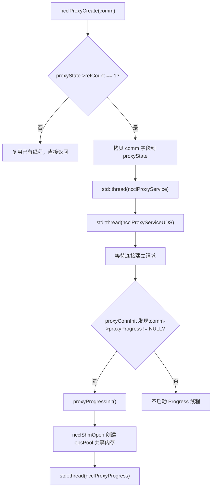
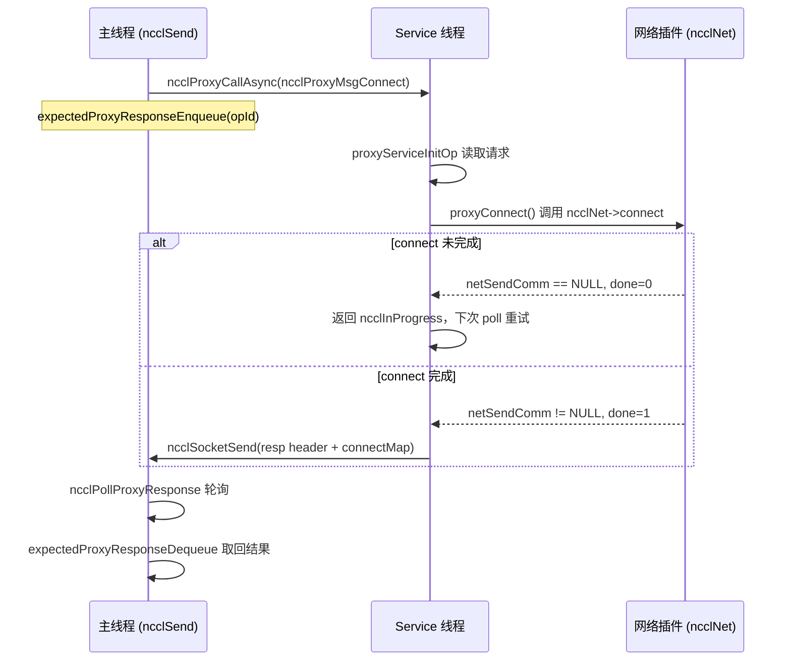
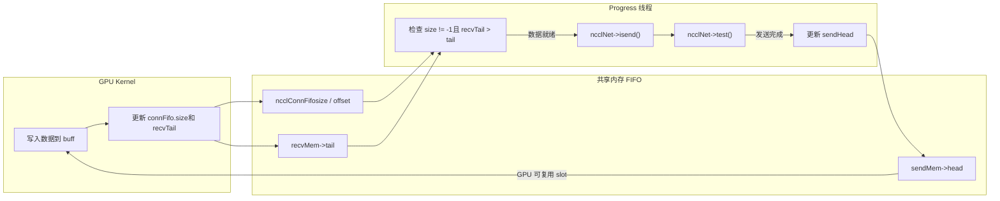

# Kapitel 12: Asynchrone Planung von Proxy-Threads: Wie proxy.cc I/O und Kernel-Ausführung entkoppelt

Das vorherige Kapitel hat die Transport-Abstraktionsschicht zerlegt und gezeigt, wie NCCL mit einer einheitlichen Schnittstelle die Unterschiede zwischen P2P/SHM/NET/NVLS verdeckt. Aber die Transportschicht beantwortet nur „welchen Kanal die Daten nehmen“, noch nicht „wie die Daten asynchron angetrieben werden“. Wenn der GPU-Kernel direkt auf Netzwerkwartezeiten blockiert, werden die Recheneinheiten durch I/O ausgebremst. Dieses Kapitel konzentriert sich auf`src/proxy.cc`und`src/include/proxy.h`und zeigt, wie NCCL mit unabhängigen Host-Threads den Netzwerk-I/O aus dem Kernel-Ausführungspfad herauslöst und mit der GPU eine Produzenten-Konsumenten-Beziehung bildet.

# 12.1 Warum Proxy-Threads benötigt werden: Beginnend mit „Wer wartet auf das Netzwerk“

## Intuitives Modell

Stellen Sie sich ein Restaurant vor: Die Küche (GPU-Kernel) ist nur für das Kochen zuständig, der Kellner (Proxy-Thread) bringt die Gerichte zu den Gästen (Netzwerkgegenseite). Wenn der Koch selbst das Essen servieren müsste, müsste er bei jedem Gang aufhören zu kochen, und die Ausgabegeschwindigkeit würde abstürzen. Der Proxy von NCCL ist genau dieser hauptberufliche Kellner – der Kernel schreibt nur Daten in den gemeinsamen Puffer und liest Daten aus dem Puffer, während die Drecksarbeit des Netzwerk-Sendens und -Empfangens vollständig an die Proxy-Threads auf der Host-Seite delegiert wird.

> **[Design Inference & Architectural Trade-offs]**
> Welche Katastrophe würde das System ohne Proxy erleiden? GPU-Kernel sind SIMT-massiv-parallel; wenn ein Warp beim Netzwerk-Polling blockiert, verschwendet das die Rechenleistung eines gesamten SM; noch fataler ist, dass Netzwerk-Senden und -Empfangen Socket-Systemaufrufe, Verbs-Polling und DMA-Deskriptor-Übermittlung umfasst – diese Operationen können im Device-Code überhaupt nicht ausgeführt werden. Daher muss NCCL die Netzwerk-I/O auf den Host verlagern und Kernel und Proxy über eine FIFO im gemeinsamen Speicher „Daten bereit“-Signale austauschen lassen.

## Arbeitsteilung der beiden Thread-Typen

NCCL startet auf der Host-Seite zwei Arten von Proxy-Threads mit völlig unterschiedlichen Aufgaben:

- **Service-Thread**（`ncclProxyService`): Verarbeitet Steuerungsebenen-Anfragen – Verbindungsaufbau, Speicherregistrierung, FD-Abfrage. Er lauscht auf einem Socket, empfängt RPC-Anfragen vom lokalen Rank und treibt Setup/Connect-Operationen asynchron voran.
- **Progress-Thread**（`ncclProxyProgress`): Verarbeitet die Datenebene – treibt tatsächlich Netzwerk-Senden und -Empfangen an. Er holt Proxy-Ops aus dem gemeinsamen Speicherpool und ruft die`proxyProgress`Callback des Transports auf, um den Datentransfer voranzutreiben.

[FACT:src/include/proxy.h:343-345]zeigt`ncclProxyState`hält gleichzeitig`thread`(Service) und`threadUDS`(UDS-Dienst), während das Handle des Progress-Threads in`progressState.thread`versteckt ist[FACT:src/include/proxy.h:261-261]。

## Aufbau der Producer-Consumer-Beziehung

[FACT:src/proxy.cc:2130-2166]von`ncclProxyCreate`ist der Ort, an dem der Thread geboren wird: Wenn`refCount == 1`(erste comm-Erstellung), kopiert es die Schlüsselfelder der comm in`proxyState`und startet dann den Service-Thread und den UDS-Thread. Beachten Sie, dass der Progress-Thread hier nicht gestartet wird – er wird von`proxyProgressInit`erst dann lazy gestartet, wenn zum ersten Mal eine Verbindung mit Proxy-Progress-Bedarf aufgebaut wird[FACT:src/proxy.cc:1523-1524]。



Dieses Diagramm verankert den tatsächlichen Zweig der Thread-Starts: Nur wenn`tcomm->proxyProgress`nicht leer ist (d. h. dieser Transport Datenebenen-Fortschritt benötigt), wird der Progress-Thread erstellt.

# 12.2 Datenstrukturen und Speicherlayout: Gemeinsamer Speicherpool und Op-Pool

## Überblick über die Kernstrukturen

Das Nebenläufigkeitsmodell des Proxy basiert auf zwei Blöcken gemeinsamen Speichers; das Verständnis ihres Speicherlayouts ist die Voraussetzung für das Verständnis des gesamten Mechanismus.

**Erster Block:`ncclProxyOpsPool`**（[FACT:src/include/proxy.h:218-226]). Dies ist der „Aufgabenbriefkasten“ zwischen dem Hauptthread und dem Progress-Thread, geteilt über`/dev/shm`prozessübergreifend.

| Feld | Typ | Funktion |
| --- | --- | --- |
| `ops[]` | `ncclProxyOp[]` | Vorab zugewiesenes Op-Array, Größe`MAX_OPS_PER_PEER * NCCL_MAX_LOCAL_RANKS` |
| `nextOps` | `volatile int` | Kopfindex der Liste ausstehender Ops, -1 bedeutet leer |
| `nextOpsEnd` | `volatile int` | Endindex der Liste ausstehender Ops |
| `freeOps[]` | `volatile int[]` | Kopf der Liste freier Ops für jeden lokalen Rank |
| `syncObjectsInitialized` | `int` | Markiert, ob mutex/cond initialisiert sind |
| `mutex` / `cond` | `std::mutex` / `std::condition_variable` | Prozessübergreifende Synchronisationsprimitive |

`MAX_OPS_PER_PEER`Definition von[FACT:src/include/proxy.h:218-226]ist`2 * MAXCHANNELS * 2 * NCCL_MAX_DEV_WORK_P2P_PER_BATCH`. Der Kommentar erklärt, warum es das 2-Fache ist: Jede p2p-Work enthält eine Send- und eine Recv-Proxy-Op, daher muss mit 2 multipliziert werden; die weitere Multiplikation mit 2 dient dazu, zwei vollständige Operationsrunden speichern zu können, andernfalls wäre „halb einstellen, halb freigeben“ nicht möglich.

**Zweiter Block:`ncclProxyArgs`**（[FACT:src/include/proxy.h:174-209]). Dies ist die „Laufzeit-Op-Beschreibung“, die intern vom Progress-Thread verwendet wird, aus`ncclProxyPool`zugewiesen und nicht prozessübergreifend geteilt.

Schlüsselfelder:

- `subs[NCCL_PROXY_MAX_SUBS]`: Array von Unteroperationen,`NCCL_PROXY_MAX_SUBS = MAXCHANNELS` [FACT:src/include/proxy.h:55-55]. Gleichartige Operationen mehrerer Channels werden zu mehreren Subs eines args aggregiert.
- `progress`: Funktionszeiger auf den`proxyProgress`Callback des Transports[FACT:src/include/proxy.h:176-176]。
- `next` / `nextPeer` / `proxyAppendPtr`: Drei Listenzeiger, die eine komplexe Op-Organisationsbeziehung bilden.
- `state`：`ncclProxyOpNone` / `ncclProxyOpReady` / `ncclProxyOpProgress`Drei-Zustands-[FACT:src/include/proxy.h:48-52]。

## Geschichtetes Design des Speicherpools

`ncclProxyPool` [FACT:src/proxy.cc:50-53]ist eine Batch-Zuweisungseinheit; jeder Pool enthält`PROXYARGS_ALLOCATE_SIZE`(d. h.`NCCL_MAX_OPS`) Stück`ncclProxyArgs`。`allocateArgs` [FACT:src/proxy.cc:207-231]Die Zuweisungslogik von

```c
if (state->pool == NULL) {
    struct ncclProxyPool* newPool;
    NCCLCHECK(ncclCalloc(&newPool, 1));
    struct ncclProxyArgs* newElems = newPool->elems;
    for (int i = 0; i pool = newElems;
    newPool->next = state->pools;
    state->pools = newPool;
}
elem = state->pool;
state->pool = state->pool->next;
```

[FACT:src/proxy.cc:207-231]

> **[Design Inference & Architectural Trade-offs]**
> 〔Designschlussfolgerungen und Architekturabwägungen〕`ncclProxyArgs`Die Designmotivation hier ist:`subs[MAXCHANNELS]`Die`requests[NCCL_STEPS]`Struktur ist sehr groß (enthält

## False Sharing und atomare Variablen

`ncclProxyOpsPool`Die`nextOps`、`nextOpsEnd`、`freeOps[]`in`volatile int`sind alle

. Sie werden gleichzeitig vom Hauptthread und vom Progress-Thread gelesen und geschrieben, aber NCCL schützt nicht alle Zugriffe mit Locks – stattdessen werden atomare Operationen + Speicherordnung verwendet, um Korrektheit zu gewährleisten.`ncclLocalOpAppend`Betrachten Sie die Logik in[FACT:src/proxy.cc:503-513]：

```c
int freeOp = -1;
while (freeOp == -1) {
  freeOp = COMPILER_ATOMIC_EXCHANGE(&pool->freeOps[tpLocalRank], -1, std::memory_order_acquire);
  if (freeOp == -1) std::this_thread::yield();
}
```

Kopie`atomic_exchange`Der Hauptthread verwendet`freeOps[tpLocalRank]`Auf -1 setzen und den alten Wert zurückholen – dies ist eine „präemptive Entnahme": Wer zuerst erfolgreich exchange ausführt, erhält die gesamte Freiliste. Wenn der Progress-Thread einen op zurückgibt, verwendet er eine CAS-Schleife[FACT:src/proxy.cc:898-907]：

```c
oldFree = COMPILER_ATOMIC_LOAD(&pool->freeOps[i], std::memory_order_acquire);
do {
  pool->ops[freeOpEnd[i]].next = oldFree;
} while (!COMPILER_ATOMIC_COMPARE_EXCHANGE(&pool->freeOps[i], &oldFree, newFree,
                                           std::memory_order_release,
                                           std::memory_order_acquire));
```

> **[Design Inference & Architectural Trade-offs]**
> Hier wird acquire/release statt seq_cst verwendet, weil nur sichergestellt werden muss, dass „das Schreiben des next-Zeigers des Listenknotens" für die entnehmende Seite sichtbar ist, keine globale Ordnung erforderlich ist.`freeOps[]`Jedes Element des Arrays entspricht einem local rank, natürlich verteilt in der Nähe verschiedener Cache-Zeilen, was False Sharing reduziert.

# 12.3 Kontrollebene: Verbindungsaufbau und RPC-Mechanismus

## Intuitives Modell

> **[Design Inference & Architectural Trade-offs]**
> Der Service-Thread ist wie ein „Empfangsmitarbeiter": Wenn ein lokaler rank eine Netzwerkverbindung aufbauen möchte, verbindet er sich nicht selbst direkt, sondern sendet eine RPC-Anfrage an den Service-Thread, der stellvertretend setup/connect ausführt. Warum so? Weil der Aufbau von Netzwerkverbindungen (insbesondere die QP-Erstellung und Speicherregistrierung bei verbs) blockieren kann und bestimmte Ressourcen (wie listen socket) von einem einzelnen Thread gehalten werden müssen. Indem die Kontrollebene im Service-Thread zentralisiert wird, kann der Hauptthread nicht-blockierend weiter andere Dinge tun.

## Kodierung der RPC-Anfrage

`ncclProxyCallAsync` [FACT:src/proxy.cc:1369-1394]ist der Sendende der RPC. Er sendet über socket nacheinander: type, connection-Zeiger, reqSize, respSize, reqBuff, opId.

```c
NCCLCHECKGOTO(ncclSocketSend(sock, &type, sizeof(int)), ret, error);
NCCLCHECKGOTO(ncclSocketSend(sock, &proxyConn->connection, sizeof(void*)), ret, error);
NCCLCHECKGOTO(ncclSocketSend(sock, &reqSize, sizeof(int)), ret, error);
NCCLCHECKGOTO(ncclSocketSend(sock, &respSize, sizeof(int)), ret, error);
if (reqSize) NCCLCHECKGOTO(ncclSocketSend(sock, reqBuff, reqSize), ret, error);
NCCLCHECKGOTO(ncclSocketSend(sock, &opId, sizeof(opId)), ret, error);
NCCLCHECK(expectedProxyResponseEnqueue(sharedProxyState, opId, respSize));
```

[FACT:src/proxy.cc:1369-1394]

Beachten Sie den letzten Schritt: Nach dem Senden der Anfrage wird sofort die opId registriert in`expectedResponses`Warteschlange. Dies ist der Schlüssel für asynchrones RPC – der Aufrufer wartet nicht auf die Antwort, sondern registriert zuerst „ich erwarte die Antwort für diese opId" und verwendet danach`ncclPollProxyResponse`Polling.

## Verkettete-Liste-Implementierung der Antwortwarteschlange

`expectedProxyResponseEnqueue` [FACT:src/proxy.cc:97-117]verwendet eine einfach verkettete Liste zum Speichern der auf Antwort wartenden ops.`expectedProxyResponseStore` [FACT:src/proxy.cc:67-95]Bei Empfang einer Antwort wird nach opId abgeglichen, die Antwortdaten per memcpy in den vorab zugewiesenen`respBuff`kopiert, markiert`done = true`。`expectedProxyResponseDequeue` [FACT:src/proxy.cc:119-141]Beim Polling werden abgeschlossene Antworten gesucht und entfernt.

Hier gibt es ein Detail:`expectedProxyResponseStore`prüft`respSize`ob übereinstimmend mit[FACT:src/proxy.cc:72-75], bei Nichtübereinstimmung wird`ncclInternalError`gemeldet. Dies ist defensives Programmieren – wenn Anfragender und Antwortender ein unterschiedliches Verständnis der Antwortgröße haben, deutet dies auf ein Protokollchaos hin, und es muss sofort fehlschlagen statt stillschweigend fortzufahren.

## Hauptschleife des Service-Threads

`ncclProxyService` [FACT:src/proxy.cc:1789-2016]Der Kern ist eine poll-Schleife. Sie verwendet`pollfds`ein Array zur Verwaltung aller Verbindungen, einschließlich listen socket und des socket jedes peers.

```c
while (stop == PROXY_RUNNING || npeers > 0) {
    if (COMPILER_ATOMIC_LOAD(proxyState->abortFlag, std::memory_order_acquire) != 0) stop = PROXY_ABORT;
    int ret = 0;
    const int timeout = asyncOpCount ? 0 : 500;
    ...
    ret = poll(activePollfds, nfds_to_poll, timeout);
```

[FACT:src/proxy.cc:1842-1863]

`timeout`Die Wahl ist wohlüberlegt: Wenn ein asynchroner op voranschreitet (`asyncOpCount > 0`), wird timeout auf 0 gesetzt (nicht-blockierendes Polling), da häufig`proxyProgressAsync`aufgerufen werden muss, um sie voranzutreiben; andernfalls wird 500ms gesetzt, um Leerlauf und CPU-Verbrennung zu vermeiden. Der Kommentar „never let proxy service thread blocks in poll, or it cannot receive abortFlag"[FACT:src/proxy.cc:1847-1847]verdeutlicht, warum nicht unbegrenzt blockiert werden darf – periodisches Aufwachen ist erforderlich, um abortFlag zu prüfen.

## Vorantreiben asynchroner ops

`proxyProgressAsync` [FACT:src/proxy.cc:1626-1700]ist der Kern, mit dem der Service-Thread asynchrone Operationen vorantreibt. Je nach op-Typ wird an verschiedene transport-Callbacks verteilt:

```c
if (op->type == ncclProxyMsgSetup) {
    res = op->connection->tcomm->proxySetup(op->connection, proxyState, op->reqBuff, op->reqSize, op->respBuff,
                                            op->respSize, &done);
} else if (op->type == ncclProxyMsgConnect) {
    res = op->connection->tcomm->proxyConnect(...);
} else if (op->type == ncclProxyMsgInit) {
    res = proxyConnInit(peer, connectionPool, proxyState, ...);
}
```

[FACT:src/proxy.cc:1631-1664]

Jeder Callback hat einen`done`Ausgabeparameter. Wenn`done == 0`, bedeutet dies, dass die Operation noch nicht abgeschlossen ist (z. B. der Netzwerkverbindungsaufbau noch im Three-Way-Handshake), es wird`ncclInProgress`zurückgegeben, und die nächste Schleifeniteration treibt weiter voran. Wenn`done == 1`, dann werden Antwort-Header + Antwort-Body an den Anfragenden gesendet[FACT:src/proxy.cc:1681-1689]。



Dieses Sequenzdiagramm verankert`sendProxyConnect`in`*done = 0; return ncclInProgress`den tatsächlichen Zweig[FACT:src/transport/net.cc:913-916]。

# 12.4 Datenebene: Wie der Progress-Thread Netzwerk-Senden und -Empfangen antreibt

## Intuitives Modell

Der Progress-Thread ist ein „Förderbandbediener": Er beobachtet die FIFO im gemeinsamen Puffer, sobald die GPU die Daten geschrieben hat (size != -1 in der FIFO), ruft er sofort`isend`auf, um die Daten zu senden; sobald das Netzwerk die Daten empfangen hat, aktualisiert er recvTail, um die GPU zu benachrichtigen, dass sie lesen kann. Der gesamte Prozess synchronisiert GPU und proxy über die head/tail-Zeiger in der FIFO, ohne jegliche Sperren.

## Zustellung von ops: Vom Hauptthread zum Progress-Thread

Der Hauptthread entscheidet in`ncclProxySaveOp` [FACT:src/proxy.cc:591-761]je nach pattern, welche proxy ops benötigt werden, und schreibt dann über`SaveProxy` → `ncclLocalOpAppend`die ops in den gemeinsamen Speicherpool.

`ncclLocalOpAppend` [FACT:src/proxy.cc:488-554]Der Ablauf:

1. Aus`proxyOps->freeOp`oder`pool->freeOps[tpLocalRank]`einen freien op-Slot entnehmen.

2. `memcpy(op, proxyOp, sizeof(struct ncclProxyOp))`Den op-Inhalt in den gemeinsamen Speicher kopieren[FACT:src/proxy.cc:515-515]。

3. Den op an das Ende der`proxyOps->nextOps`Liste anhängen.

4. Wenn die akkumulierte op-Anzahl`MAX_OPS_PER_PEER`erreicht, eine Batch-Zustellung auslösen[FACT:src/proxy.cc:525-551]。

Die Logik der Batch-Zustellung ist subtil: Sie kann nicht einfach alle ops senden, weil „mehrere ops mit demselben opCount gemeinsam zugestellt werden müssen, sonst wird die sub-Aggregation von proxyArgs zerstört". Daher findet sie die letzte Grenze, an der sich opCount ändert, und stellt nur bis dorthin zu[FACT:src/proxy.cc:529-548]。

Die Zustellung erfolgt über`ncclProxyPost` [FACT:src/proxy.cc:476-486], das sperrt, aktualisiert`pool->nextOps`、`notify_one`und den Progress-Thread aufweckt.

## Hauptschleife des Progress-Threads

`ncclProxyProgress` [FACT:src/proxy.cc:951-1011]Die Struktur von:

```c
do {
    int idle = 1;
    ncclResult_t ret = progressOps(proxyState, state, state->active, &idle);
    ...
    if (idle || !state->active || (++proxyOpAppendCounter == ncclParamProgressAppendOpFreq())) {
      int added = 0;
      proxyOpAppendCounter = 0;
      ret = ncclProxyGetPostedOps(proxyState, &added);
      ...
    }
    lastIdle = idle;
    stopv = state->stop.load(std::memory_order_acquire);
} while ((stopv == 0 || (stopv == 1 && state->active)) &&
         COMPILER_ATOMIC_LOAD(proxyState->abortFlag, std::memory_order_acquire) == 0);
```

[FACT:src/proxy.cc:976-1009]

Hier gibt es eine erwähnenswerte Performance-Optimierung:`proxyOpAppendCounter`Der Zähler[FACT:src/proxy.cc:974-974]. Der Kommentar erklärt[FACT:src/proxy.cc:969-973]: Zu häufige Aufrufe von`ncclProxyGetPostedOps`führen zu Performance-Rückschritten bei der Kommunikation kleiner Nachrichten, daher wird nach jeweils`ProgressAppendOpFreq`(Standard 8) Mal, bevor ein neuer op geholt wird.

## Aggregation von ops: ProxyAppend

`ProxyAppend` [FACT:src/proxy.cc:437-474]Entscheidet, ob ein op „an ein vorhandenes sub von args angehängt“ oder „ein neues args erstellt“ wird. Entscheidungsgrundlage ist`connection->shared && args->opCount == op->opCount` [FACT:src/proxy.cc:443-443]——Mehrere channel-Operationen derselben Verbindung und desselben opCount werden aggregiert.

> **[Design Inference & Architectural Trade-offs]**
> Der Wert der Aggregation: Gleichartige Operationen mehrerer channels werden zu einem args zusammengeführt, der Progress-Thread kann in einem einzigen Schleifendurchlauf alle channels vorantreiben, was Funktionsaufruf-Overhead und Cache-Invalidierungen reduziert.`ncclProxyOpToArgs` [FACT:src/proxy.cc:368-435]Beim Anhängen eines sub wird validiert, ob`sliceSteps`、`chunkSteps`、`protocol`、`dtype`、`redOp`、`coll`konsistent ist[FACT:src/proxy.cc:401-406], bei Inkonsistenz wird ein Fehler gemeldet——dies ist die Verteidigungslinie gegen fehlerhafte Aggregation.

## sendProxyProgress: Die vierphasige Zustandsmaschine der Sendeseite

`sendProxyProgress` [FACT:src/transport/net.cc:1324-1491]ist der Kern der Sendeseite. Sie treibt sub für sub voran, jedes sub hat vier Zähler:`posted`、`transmitted`、`done`。

**Phase eins: Ready-Initialisierung** [FACT:src/transport/net.cc:1326-1339]

```c
sub->base = ROUNDUP(resources->step, args->chunkSteps);
resources->step = sub->base + sub->nsteps;
sub->posted = sub->transmitted = sub->done = 0;
```

`base`ist die Startnummer des step,`ROUNDUP`stellt die Ausrichtung auf`chunkSteps`。`resources->step`sicher, akkumuliert und reserviert Platz für den nächsten op.

**Phase zwei: Post-Puffer an GPU** [FACT:src/transport/net.cc:1355-1376]

```c
if (sub->posted nsteps && sub->posted done + maxDepth) {
    int buffSlot = (sub->base + sub->posted) % NCCL_STEPS;
    if (resources->shared) {
        ...
        *sendHead = sub->base + sub->posted - NCCL_STEPS;
    } else {
        sub->posted += args->sliceSteps;
    }
}
```

`maxDepth`ist die Pipeline-Tiefe[FACT:src/transport/net.cc:1343-1343], begrenzt die Anzahl gleichzeitig in-flight befindlicher steps. Im shared-Modus teilt der proxy der GPU durch Aktualisierung von`sendHead`mit, „dieser slot kann beschrieben werden“.

**Phase drei: Prüfen, ob die GPU fertig geschrieben hat, isend initiieren** [FACT:src/transport/net.cc:1378-1452]

```c
if (sub->transmitted posted && sub->transmitted done + NCCL_STEPS) {
    int buffSlot = (sub->base + sub->transmitted) % NCCL_STEPS;
    volatile uint64_t* recvTail = &resources->recvMem->tail;
    uint64_t tail = sub->base + sub->transmitted;
    if (connFifo[buffSlot].size != -1 && (*recvTail > tail || p == NCCL_PROTO_LL)) {
        int size = connFifo[buffSlot].size;
        ...
        NCCLCHECK(proxyState->ncclNet->isend(resources->netSendComm, buff, size, resources->tpRank,
                                             sub->sendMhandle, phandle, sub->requests + buffSlot));
        if (sub->requests[buffSlot] != NULL) {
            sub->transmitted += args->sliceSteps;
        }
    }
}
```

Die entscheidende Bedingung hier ist`connFifo[buffSlot].size != -1 && *recvTail > tail`——Nachdem die GPU die Daten geschrieben hat, aktualisiert sie die size und recvTail der FIFO, der proxy initiiert isend erst, wenn beide Bedingungen erfüllt sind. Für das LL-Protokoll ist dies nicht nötig, da es „Zero-Copy“-Semantik hat und nicht auf recvTail warten muss.

**Phase vier: Prüfen, ob das Senden abgeschlossen ist, sendHead aktualisieren** [FACT:src/transport/net.cc:1455-1481]

```c
if (sub->done transmitted) {
    int buffSlot = (sub->base + sub->done) % NCCL_STEPS;
    NCCLCHECK(proxyState->ncclNet->test(sub->requests[buffSlot], &done, &size));
    if (done) {
        connFifo[buffSlot].size = -1;
        std::atomic_thread_fence(std::memory_order_seq_cst);
        sub->done += args->sliceSteps;
        if (resources->shared == 0) {
            volatile uint64_t* sendHead = resources->gdcSync ? resources->gdcSync : &resources->sendMem->head;
            *sendHead = sub->base + sub->done;
        }
    }
}
```

`test`Nachdem done zurückgegeben wurde, wird zuerst die FIFO size auf -1 zurückgesetzt, ein seq_cst fence eingefügt, dann sendHead aktualisiert, um der GPU mitzuteilen, „dieser slot kann wiederverwendet werden“. Die Aufgabe des fence ist es, die Umordnung von size-Reset und head-Update zu verhindern——wenn head zuerst aktualisiert würde, könnte die GPU mit dem Schreiben beginnen, während size noch den alten Wert hat.

## recvProxyProgress: Die vier Phasen der Empfangsseite

`recvProxyProgress` [FACT:src/transport/net.cc:1493-1788]ist komplexer, da es sub-Gruppierung beinhaltet (multirecv wird verwendet, wenn mehrere subs denselben recvComm teilen).

**Phase eins: Gruppierung nach recvComm bei Ready** [FACT:src/transport/net.cc:1495-1538]

```c
for (int s = 0; s nsubs; s++) {
    ...
    if (groupSize == maxRecvs) {
        groupSize = 0;
    } else if (s > 0) {
        int next;
        for (next = s; next nsubs; next++) {
            struct recvNetResources* nextRes = ...;
            if (nextRes->netRecvComm == recvComm) break;
        }
        if (next == args->nsubs) {
            groupSize = 0;
        } else if (s != next) {
            // swap subs
        }
    }
    groupSize++;
    ...
    for (int i = 0; i  **[Design Inference & Architectural Trade-offs]**
> Dieser Codeabschnitt ordnet subs, die denselben`recvComm`verwenden, zusammen und zeichnet`groupSize`auf. Warum gruppieren? Weil`irecv`den Empfang mehrerer Buffer auf einmal unterstützt (multirecv), und das Zusammenfassen von Anfragen derselben comm zu einem einzigen Aufruf den Plugin-Overhead erheblich reduziert.

**Phase zwei: irecv initiieren** [FACT:src/transport/net.cc:1543-1631]

```c
if (subCount) {
    uint64_t step = subGroup->posted;
    void** requestPtr = subGroup->requests + (step % NCCL_STEPS);
    bool ignoreCompletion = ncclParamNetOptionalRecvCompletion() &&
                            ((args->protocol == NCCL_PROTO_LL128) || (args->protocol == NCCL_PROTO_LL)) &&
                            (subCount == 1);
    if (ignoreCompletion) *requestPtr = (void*)NCCL_NET_OPTIONAL_RECV_COMPLETION;
    NCCLCHECK(proxyState->ncclNet->irecv(resources->netRecvComm, subCount, ptrs, sizes, tags, mhandles, phandles,
                                         requestPtr));
    if (*requestPtr) {
        subGroup->recvRequestsCache[step % NCCL_STEPS] = *requestPtr;
        subGroup->recvRequestsSubCount = subCount;
        for (int i = 0; i groupSize; i++) {
            sub->posted += args->sliceSteps;
        }
    }
}
```

`ignoreCompletion`Optimierung[FACT:src/transport/net.cc:1608-1610]: Für den Single-Buffer-Empfang der LL/LL128-Protokolle ist die Abschlussbenachrichtigung optional (da die Daten selbst ein flag tragen), die completion-Prüfung kann übersprungen werden.

**Phase drei: Prüfen, ob der Empfang abgeschlossen ist, recvTail aktualisieren** [FACT:src/transport/net.cc:1634-1743]

```c
NCCLCHECK(proxyState->ncclNet->test(subGroup->requests[step % NCCL_STEPS], &done, sizes));
if (done) {
    for (int i = 0; i groupSize; i++) {
        struct ncclProxySubArgs* sub = subGroup + i;
        int buffSlot = (sub->base + sub->received) % NCCL_STEPS;
        connFifo[buffSlot].size = -1;
        sub->received += args->sliceSteps;
    }
    ...
}
```

Nach Abschluss des Empfangs wird die FIFO size zurückgesetzt, dann tritt er in die flush-Phase ein (im GDRDMA-Szenario ist ein flush erforderlich, um die Sichtbarkeit der Daten zu gewährleisten).

**Phase vier: Warten auf GPU-Konsum, done aktualisieren** [FACT:src/transport/net.cc:1745-1779]

```c
if (sub->transmitted > sub->done) {
    volatile uint64_t* sendHead = &resources->sendMem->head;
    uint64_t done = *sendHead;
    while (done > sub->base + sub->done && sub->transmitted > sub->done) {
        if (subGroup->recvRequestsCache[sub->done % NCCL_STEPS]) {
            if (proxyState->ncclNet->irecvConsumed) {
                NCCLCHECK(proxyState->ncclNet->irecvConsumed(resources->netRecvComm, subGroup->recvRequestsSubCount,
                                                             subGroup->recvRequestsCache[sub->done % NCCL_STEPS]));
            }
            subGroup->recvRequestsCache[sub->done % NCCL_STEPS] = NULL;
        }
        sub->done += args->sliceSteps;
    }
}
```

Hier wird durch Lesen von`sendHead`beurteilt, ob die GPU die Daten bereits konsumiert hat.`irecvConsumed`ist der Callback an das Plugin, der ihm mitteilt, „der Buffer dieser Empfangsanfrage wurde konsumiert und kann wiederverwendet werden“.

## Gesamtüberblick über den Datenfluss



Dieses Datenflussdiagramm zeigt den geschlossenen Kreislauf, den GPU und proxy über FIFO und head/tail-Zeiger bilden: GPU schreibt Daten → aktualisiert tail → proxy erkennt dies und initiiert isend → test bestätigt Abschluss → aktualisiert head → GPU verwendet slot wieder.

# 12.5 Nebenläufigkeitskontrolle, Speicherbarrieren und Hardware-Interaktion

## Speicherordnung der lock-freien FIFO

Die Synchronisation zwischen proxy und GPU hängt vollständig von`ncclConnFifo`und den head/tail-Zeigern ab, ohne jegliche Sperren. Dies erfordert äußerst sorgfältige Speicherordnungskontrolle.

Auf der Sendeseite, nachdem proxy von`test`done zurückgegeben bekommt[FACT:src/transport/net.cc:1460-1473]：

```c
connFifo[buffSlot].size = -1;
std::atomic_thread_fence(std::memory_order_seq_cst);
...
*sendHead = sub->base + sub->done;
```

Das seq_cst fence stellt sicher, dass der size-Reset für die GPU sichtbar ist, bevor das head-Update sichtbar wird. Wäre die Reihenfolge umgekehrt, könnte die GPU einen neuen head aber alte size sehen und fälschlicherweise annehmen, dass Daten im slot liegen.

Auf der Empfangsseite, bevor proxy recvTail aktualisiert[FACT:src/transport/net.cc:1731-1736]：

```c
if (step nsteps) {
    std::atomic_thread_fence(std::memory_order_seq_cst);
    volatile uint64_t* recvTail = resources->gdcSync ? resources->gdcSync : &resources->recvMem->tail;
    *recvTail = sub->base + sub->transmitted;
}
```

Dasselbe Prinzip: Zuerst fence, um die Sichtbarkeit der Datenschreibung zu gewährleisten, dann tail aktualisieren, um der GPU mitzuteilen, dass sie lesen kann.

## Der flush-Mechanismus von GDRCOPY

Bei Verwendung von GDRDMA schreibt die NIC direkt in den GPU-Speicher, aber der Schreibvorgang befindet sich möglicherweise noch unbestätigt auf dem PCIe-Bus. Der proxy muss aktiv flushen, um die Sichtbarkeit der Daten zu gewährleisten. Siehe`recvProxyProgress`die flush-Logik in[FACT:src/transport/net.cc:1664-1709]：

```c
if (totalSize > 0 && p == NCCL_PROTO_SIMPLE && needFlush) {
    if (resources->gdcFlush) {
#if defined(__x86_64__)
        asm volatile("mfence" ::: "memory");
        asm volatile("mov (%0), %%eax" ::"l"(resources->gdcFlush) : "%eax", "memory");
#else
        std::atomic_thread_fence(std::memory_order_seq_cst);
        uint64_t dummy;
        NCCLCHECK(ncclGdrCudaRead(resources->gdrDesc, &dummy, resources->gdcFlush, sizeof(dummy)));
#endif
    } else {
        // iflush 路径
        NCCLCHECK(proxyState->ncclNet->iflush(resources->netRecvComm, subCount, ptrs, sizes, mhandles,
                                              subGroup->requests + (step % NCCL_STEPS)));
    }
}
```

Die Kommentare zum x86-Pfad sind äußerst brillant[FACT:src/transport/net.cc:1668-1674]：`mfence`Verhindert, dass der Load von CQE-poll vor den flush-Load umgeordnet wird;`mov (%0), %%eax`Erzwingt einen PCIe-Lesevorgang, der die CPU anhält, bis alle vorherigen PCIe-posted-writes (einschließlich NIC-DMA) am Endpunkt committed sind. Dies ist Speicherordnungskontrolle auf Hardwareebene, härter als jede Software-Fence.

## Zusammenspiel von atomaren Variablen und stop/abort

Abbruchbedingungen des Progress-Threads[FACT:src/proxy.cc:1007-1009]：

```c
stopv = state->stop.load(std::memory_order_acquire);
} while ((stopv == 0 || (stopv == 1 && state->active)) &&
         COMPILER_ATOMIC_LOAD(proxyState->abortFlag, std::memory_order_acquire) == 0);
```

`stop == 1`Aber`state->active != NULL`weiterläuft — dies dient dem „graceful stop": Bereits übermittelte Ops müssen abgeschlossen werden, sonst wartet die GPU ewig auf Daten. Nur`stop == 2`(abort) oder`abortFlag != 0`erzwingen den Abbruch.

`ncclProxyProgressDestroy` [FACT:src/proxy.cc:1039-1065]Der Stop-Ablauf von:

```c
std::lock_guard lock(state->opsPool->mutex);
state->stop.store(1, std::memory_order_release);
state->opsPool->cond.notify_one();
state->thread.join();
```

Erst sperren, dann stop speichern, dann notify — dies ist das Standardmuster zur Vermeidung von lost wakeup. Der Progress-Thread hält die Sperre bei`pool->cond.wait`und prüft das Prädikat[FACT:src/proxy.cc:850-851], um sicherzustellen, dass kein Wakeup verpasst wird.

# 12.6 Produktions-Fallstricke und Fehlerwiederherstellungskette

## Fallstrick 1: Verbindungsleck verhindert Beenden des Service-Threads

`ncclProxyService`Die Hauptschleifenbedingung von ist`stop == PROXY_RUNNING || npeers > 0` [FACT:src/proxy.cc:1842-1842]. Der Kommentar erklärt[FACT:src/proxy.cc:1843-1845]: Selbst wenn die lokale comm abgebrochen wird, darf der Proxy-Thread nicht beendet werden, solange noch Peer-Verbindungen bestehen, da sonst ein Segmentation Fault auftreten kann.

**Diagnoseszenario**: Wenn ein Rank abstürzt, ohne die Gegenseite zu benachrichtigen, bleibt der Service-Thread der Gegenseite in der Schleife von`npeers > 0`hängen. In diesem Fall muss man sich auf`abortFlag`oder einen Timeout-Mechanismus verlassen. Wenn in der Produktionsumgebung ein Prozess bei`ncclProxyService`hängt, prüfen Sie zuerst, ob ein Peer-Rank abnormal beendet wurde.

## Fallstrick 2: Nicht übereinstimmende Response-Queue verursacht Speicherleck

`expectedProxyResponseStore`Gibt bei nicht übereinstimmender opId`ncclInternalError` [FACT:src/proxy.cc:93-94]zurück. Wenn jedoch die Response eintrifft, nachdem die anfragende Seite aufgegeben hat (z. B. durch Timeout), bleibt diese Response für immer in der Queue,`respBuff`Leck.

**Schutzmaßnahmen**：`expectedProxyResponseFree` [FACT:src/proxy.cc:55-65]Bereinigt bei`ncclProxyDestroy`die gesamte Queue[FACT:src/proxy.cc:2226-2226]. Dies ist jedoch nur die letzte Absicherung; im Normalbetrieb sollten keine Reste vorhanden sein.

## Fallstrick 3: head wird im shared-Modus auf negativen Wert initialisiert

`sendProxyConnect`In[FACT:src/transport/net.cc:999-1000]：

```c
// Don't give credits yet in shared mode.
(resources->gdcSync ? *resources->gdcSync : resources->sendMem->head) = (map->shared ? -NCCL_STEPS : 0);
```

Im shared-Modus wird head auf`-NCCL_STEPS`initialisiert, was bedeutet, dass die GPU anfangs kein Credit zum Schreiben hat. Der Proxy muss in der Post-Phase schrittweise head erhöhen, um „Credit auszugeben". Wenn diese Initialisierung vergessen wird, glaubt die GPU fälschlicherweise, Credit zu haben, und schreibt in nicht bereite Slots, was zu Datenkorruption führt.

## Fallstrick 4: Flag-Validierung im LL128-Protokoll

`sendProxyProgress`Die Ready-Prüfung von LL128 in[FACT:src/transport/net.cc:1388-1403]：

```c
if (p == NCCL_PROTO_LL128) {
    ready = resources->useGdr;
    if (!ready) {
        uint64_t flag = sub->base + sub->transmitted + 1;
        int nFifoLines = DIVUP(connFifo[buffSlot].size, sizeof(uint64_t) * NCCL_LL128_LINEELEMS);
        volatile uint64_t* lines = (volatile uint64_t*)buff;
        ready = 1;
        for (int i = 0; i Q1: Wenn man in`sendProxyProgress`die Logik entfernt, die bei`sub->done == sub->nsteps`den Wert von`sendHead`aktualisiert (d. h. die GPU nicht benachrichtigt, dass ein Slot freigegeben wurde), in welchem Szenario würde dann ein Deadlock auftreten? Warum?

**Referenzanalyse**：`sendHead`Ist die einzige Grundlage, anhand derer die GPU entscheidet, „welche Slots wiederverwendet werden können". Siehe[FACT:src/transport/net.cc:1469-1473]：

```c
if (resources->shared == 0) {
    volatile uint64_t* sendHead = resources->gdcSync ? resources->gdcSync : &resources->sendMem->head;
    *sendHead = sub->base + sub->done;
}
```

Wenn dieser Abschnitt entfernt wird, bleibt der head der GPU für immer beim Initialwert (im shared-Modus`-NCCL_STEPS`, im nicht-shared-Modus 0). Der GPU-Kernel prüft bei`waitSend`, ob`head + NCCL_STEPS > step`, um zu glauben, dass Credit zum Schreiben vorhanden ist. Wenn head nicht voranschreitet, blockiert die GPU nach dem Vollschreiben von`NCCL_STEPS`Slots für immer beim Warten auf Credit, während der Proxy darauf wartet, dass die GPU neue Daten schreibt, um isend auszuführen — ein klassischer Producer-Consumer-Deadlock. Im shared-Modus ist es noch schlimmer, da der initiale head negativ ist und die GPU von Anfang an kein Credit hat.

Q2: `ncclLocalOpAppend`Wenn die kumulierten op`MAX_OPS_PER_PEER`erreicht werden, wird die Batch-Übermittlung ausgelöst, aber der Code übermittelt absichtlich „nicht alle ops des letzten opCount“. Wenn man stattdessen einfach alle ops übermitteln würde, welche Mechanismen würden dadurch zerstört?

**Referenzanalyse**: Siehe[FACT:src/proxy.cc:525-548]Kommentare und Logik:

```c
// Do not post last operations as we could have more coming with the same opCount, and posting
// them in different batches would break proxyArgs aggregation with subs.
uint64_t lastOpCount = pool->ops[proxyOps->nextOpsEnd].opCount;
int lastOp = -1;
...
for (int op = proxyOps->nextOps; op != proxyOps->nextOpsEnd; op = pool->ops[op].next) {
    ops++;
    if (pool->ops[op].opCount != lastOpCount) {
        lastOp = op;
        toSend = ops;
    }
}
```

`ProxyAppend`Aggregationslogik[FACT:src/proxy.cc:443-443]hängt von`args->opCount == op->opCount`ab, um zu entscheiden, ob ein sub angehängt wird. Wenn mehrere channel ops desselben opCount auf zwei Batches aufgeteilt werden, erstellt der erste Batch ein args, und wenn der zweite Batch ankommt, ist`args->opCount`bereits nicht mehr gleich dem opCount des neuen op (weil args möglicherweise bereits vorgerückt wurde), wodurch subs, die eigentlich aggregiert werden sollten, in unabhängige args aufgeteilt werden. Dies verringert nicht nur die Leistung, sondern kann auch die`ncclProxyOpToArgs`-Logik`nChannels`/`nPeers`zur Minimumsbildung[FACT:src/proxy.cc:399-400]beschädigen, was zu einer falschen Berechnung der Kanalanzahl führt.

Q3: `recvProxyProgress`Die Ready-Phase von`recvComm`sortiert und gruppiert subs nach`irecv`neu. Wenn man diese Gruppierungslogik entfernt und jeden sub unabhängig`maxRecvs > 1`aufrufen lässt, welche Folgen hätte das auf der Netzwerkkarte von

**Referenzanalyse**: Siehe[FACT:src/transport/net.cc:1495-1538]Gruppierungslogik und[FACT:src/transport/net.cc:1613-1614]multirecv-Aufrufe:

```c
NCCLCHECK(proxyState->ncclNet->irecv(resources->netRecvComm, subCount, ptrs, sizes, tags, mhandles, phandles,
                                     requestPtr));
```

`maxRecvs`ist die vom Netzwerkkarten-Plugin deklarierte „maximale Anzahl von Buffern, die ein einzelnes irecv empfangen kann“[FACT:src/transport/net.cc:1525-1525]. Wenn`maxRecvs > 1`, unterstützt das Plugin (z. B. IB) den Empfang mehrerer Buffer mit einem einzigen WQE, was den Doorbell-Overhead und die CQE-Verarbeitungskosten erheblich senkt. Wenn man die Gruppierung entfernt und jeder sub einzeln irecv aufruft, ist`subCount`immer 1, das Plugin degeneriert in den Single-Buffer-Modus, und der Durchsatz sinkt. Noch kritischer: Die Mechanismen`recvRequestsCache`und`irecvConsumed`[FACT:src/transport/net.cc:1616-1617]sind für multirecv ausgelegt – im Single-Buffer-Modus werden diese Cache-Logiken unwirksam, was zu Request-Leaks führen kann.

Bis hierhin haben wir verstanden, wie der proxy-Thread Netzwerk-I/O von der Kernel-Ausführung entkoppelt und GPU-Berechnung und Kommunikation wirklich parallelisiert. Aber der proxy ist nur der Treiber; die konkrete Implementierung der zugrunde liegenden Netzwerkübertragung bleibt noch zu enthüllen. Im nächsten Kapitel gehen wir tiefer in`net_ib`und sehen, wie NCCL die verbs-API kapselt, um InfiniBand-Transport zu implementieren, und wie GPUDirect RDMA es der Netzwerkkarte ermöglicht, direkt auf den GPU-Speicher zu lesen und zu schreiben.
