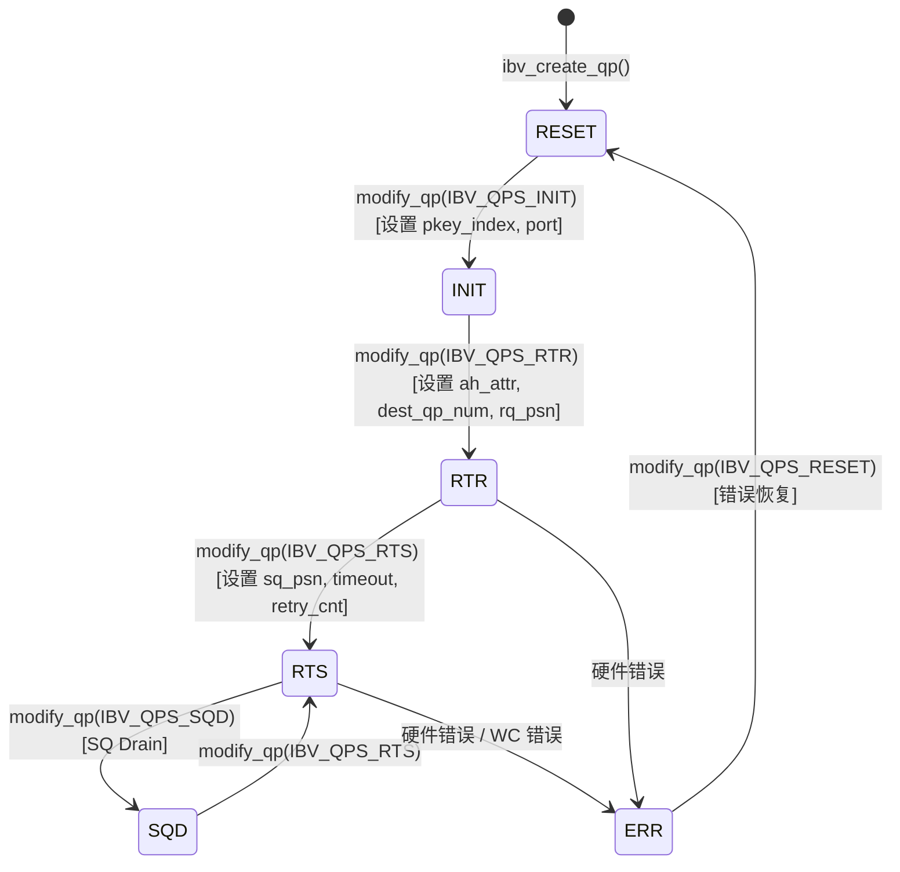

# Kapitel 13: InfiniBand-Netzwerktransport: Wie net_ib verbs und GPUDirect RDMA kapselt

Im vorherigen Kapitel haben wir gesehen, wie der proxy-Thread Netzwerk-I/O aus dem GPU-Kernel herauslöst und Berechnung und Kommunikation wirklich parallelisiert. Aber der proxy ist nur ein „Treiber“ – er ruft die abstrakten Schnittstellen ncclNet->isend/irecv auf, weiß aber nicht, ob darunter TCP, InfiniBand oder etwas anderes liegt. In diesem Kapitel lüften wir diese Abstraktion und gehen in src/transport/net_ib und src/misc/ibvwrap.cc, um zu sehen, wie NCCL die C-Bibliothek libibverbs in eine austauschbare Symboltabelle kapselt, wie Queue Pairs (QP) aufgebaut werden und wie GPUDirect RDMA es der Netzwerkkarte ermöglicht, den Host-Speicher zu umgehen und direkt auf den GPU-Speicher zu lesen und zu schreiben.

# 13.1 Warum NCCL libibverbs nicht direkt aufruft

## Intuitives Modell: Die Symboltabelle ist wie eine „austauschbare Steckdose“

Stellen Sie sich vor, Sie kaufen ein importiertes Elektrogerät, dessen Stecker nicht zu Ihrer Steckdose passt. Sie haben zwei Möglichkeiten: Entweder Sie zerlegen das Gerät und ändern die Verkabelung (direkt`#include <infiniband/verbs.h>`und linken`-libverbs`), oder Sie kaufen einen Universaladapter (Symbole zur Laufzeit dynamisch laden). NCCL wählt Letzteres.

> **[Design Inference & Architectural Trade-offs]**
> Die zentrale Motivation dieser Wahl ist**Bereitstellungsflexibilität**: NCCL wird als Bibliothek von übergeordneten Frameworks wie PyTorch und TensorFlow geladen und kann nicht davon ausgehen, dass die Laufzeitumgebung`libibverbs.so`installiert hat. Bei einer harten Verlinkung zur Kompilierungszeit könnte die gesamte NCCL-Bibliothek auf Maschinen ohne InfiniBand-Treiber nicht geladen werden – selbst wenn Sie nur NVLink für die Kommunikation auf einem einzelnen Rechner verwenden möchten. Durch`dlopen`zur Laufzeit plus Symbolauflösung kann NCCL auf Maschinen ohne IB elegant degradieren.

Wenn diese Kapselungsschicht fehlen würde, wäre die Katastrophe für das System:**Eine reine NVLink-Einzelrechner-Trainingsaufgabe würde direkt abstürzen, weil auf der Maschine kein IB-Treiber installiert ist**. Dies ist in Cloud-Umgebungen und auf Entwicklungsrechnern äußerst häufig.

## Datenstruktur und Speicherlayout: Der Symboltabellen-Container

Die zentrale Datenstruktur ist`ncclIbvSymbols`, definiert in`ibvsymbols.h`(diese Datei ist im Material dieses Kapitels nicht enthalten, aber ihre Struktur lässt sich aus der Verwendung ableiten). Sie ist ein reiner Funktionszeiger-Container, bei dem jedes Feld einer libibverbs-Funktion entspricht:

```c
struct ncclIbvSymbols {
  int (*ibv_internal_fork_init)(void);
  struct ibv_device** (*ibv_internal_get_device_list)(int* num_devices);
  int (*ibv_internal_modify_qp)(struct ibv_qp*, struct ibv_qp_attr*, int);
  // ... 数十个函数指针
};
```

Es gibt global nur eine Instanz, zusammen mit`std::once_flag`wird eine threadsichere Initialisierung gewährleistet:

[FACT:src/misc/ibvwrap.cc:26-29]

```c
static std::once_flag initOnceFlag;
static ncclResult_t initResult;
struct ncclIbvSymbols ibvSymbols;
```

Das Design ist hier sehr zurückhaltend:`initOnceFlag`ist`std::once_flag`，`initResult`Cache-Initialisierungsergebnisse,`ibvSymbols`ist die globale Symboltabelle. Alle drei haben statische Speicherdauer, ihre Lebensdauer erstreckt sich über den gesamten Prozess.

> **[Design Inference & Architectural Trade-offs]**
> Warum`std::once_flag`anstelle von`pthread_once`? Weil der C++-Code von NCCL bereits von`<mutex>`und`<thread>`abhängt, ist die Verwendung der Standardbibliothek konsistenter.`call_once`Die Semantik von  ist: Egal wie viele Threads gleichzeitig`wrap_ibv_symbols()`aufrufen, das Lambda wird nur einmal ausgeführt, die übrigen Threads blockieren und warten, und dann erhalten alle dasselbe`initResult`. Dies ist wesentlich sicherer als handgeschriebenes Double-Checked Locking (DCLP) – DCLP hat unter dem C++-Speichermodell eine berüchtigte Reordering-Falle.

## Step-by-Step: Der vollständige Ablauf der Symbolauflösung

Wenn NCCL zum ersten Mal IB-Transport benötigt, wird`wrap_ibv_symbols()`：

[FACT:src/misc/ibvwrap.cc:26-29]

```c
ncclResult_t wrap_ibv_symbols(void) {
  std::call_once(initOnceFlag, []() { initResult = buildIbvSymbols(&ibvSymbols); });
  return initResult;
}
```

`buildIbvSymbols`definiert in`ibvsymbols.cc`(in diesem Kapitel nicht enthalten), seine Aufgabe ist es, mit`dlopen("libibverbs.so")`die Bibliothek zu öffnen und dann für jeden Funktionsnamen`dlsym`aufzurufen, um den Zeiger zu füllen. Wenn ein Symbol nicht gefunden wird, bleibt das entsprechende Feld NULL.

Dieses "NULL erlaubt"-Design zieht sich durch die gesamte Kapselungsschicht. Betrachten Sie das`CHECK_NOT_NULL`Makro:

[FACT:src/misc/ibvwrap.cc:26-29]

```c
#define CHECK_NOT_NULL(container, internal_name) \
  if (container.internal_name == NULL) { \
    WARN("lib wrapper not initialized."); \
    return ncclInternalError; \
  }
```

Jede Wrapper-Funktion prüft vor dem Aufruf, ob das entsprechende Symbol nicht null ist. Das bedeutet:**Wenn eine ältere Version von libibverbs eine bestimmte neue Funktion nicht enthält, stürzt NCCL nicht beim Laden ab, sondern meldet den Fehler erst, wenn die Funktion tatsächlich verwendet wird**. Dies ist der Schlüssel zur schrittweisen Degradierung.

## Designüberlegung: Die dreifache Verantwortung der Makro-Kapselung

`ibvwrap.cc`In  sind 7 Makros definiert, sie sind nicht einfacher syntaktischer Zucker, sondern tragen eine dreifache Verantwortung:

1. **Nullzeiger-Schutz**：`CHECK_NOT_NULL`fängt nicht initialisierte

2. **Fehlercode-Normalisierung**: Übersetzt die verschiedenen Fehlerkonventionen von libibverbs (Rückgabe von -1, Rückgabe von errno, Rückgabe eines NULL-Zeigers) einheitlich in`ncclResult_t`

3. **Logging-Instrumentierung**: Bei Fehlern gibt`WARN`den Funktionsnamen und errno aus

Betrachten Sie`IBV_PTR_CHECK_ERRNO`dieses komplexeste Makro:

[FACT:src/misc/ibvwrap.cc:38-45]

```c
#define IBV_PTR_CHECK_ERRNO(container, internal_name, call, retval, error_retval, name) \
  CHECK_NOT_NULL(container, internal_name); \
  retval = container.call; \
  if (retval == error_retval) { \
    WARN("Call to " name " failed with error %s", strerror(errno)); \
    return ncclSystemError; \
  } \
  return ncclSuccess;
```

Es führt nach der Expansion vier Dinge aus: Prüfen, ob das Symbol nicht null ist, den Aufruf ausführen, den Rückgabewert in`retval`schreiben (normalerweise über Zeigerparameter zurückgegeben wie`ibv_pd*`usw.), und prüfen, ob er gleich dem Fehlerwert ist. Beachten Sie`strerror(errno)`– die Zeiger-Rückgabe-Funktionen von libibverbs (wie`ibv_alloc_pd`) geben bei Fehlern NULL zurück und setzen`errno`, daher ist das Lesen von`errno`hier korrekt.

Während`IBV_INT_CHECK`für Funktionen verwendet wird, die int zurückgeben:

[FACT:src/misc/ibvwrap.cc:84-91]

```c
#define IBV_INT_CHECK(container, internal_name, call, error_retval, name) \
  CHECK_NOT_NULL(container, internal_name); \
  int ret = container.call; \
  if (ret == error_retval) { \
    WARN("Call to " name " failed"); \
    return ncclSystemError; \
  } \
  return ncclSuccess;
```

Hier wird`errno`nicht gelesen, weil solche Funktionen (wie`ibv_fork_init`) direkt -1 zurückgeben, um einen Fehler anzuzeigen, und die Fehlerinformationen bereits verloren sind.

> **[Design Inference & Architectural Trade-offs]**
> Diese Vorgehensweise, "für jede Funktion ein anderes Makro zu verwenden", erscheint umständlich, ist aber notwendig: Die API-Fehlerkonventionen von libibverbs sind extrem uneinheitlich, einige geben 0/-1 zurück, einige geben errno-Werte zurück, einige geben Zeiger zurück. Wenn man sie gewaltsam vereinheitlicht, gehen stattdessen Fehlerinformationen verloren. NCCL entscheidet sich für "wörtliche Übersetzung", lässt die Komplexität in der Kapselungsschicht und ermöglicht der oberen Ebene`net_ib.cc`, nur`ncclSuccess`。

# 13.2 ibvcore.h: ABI-Vertrag ohne Header-Abhängigkeit

## Intuitives Modell: Ein Übersetzer mit eigenem Wörterbuch

`ibvcore.h`ist eine seltsame Datei – sie definiert die Kernstrukturen, Enumerationen und Konstanten von libibverbs**neu**. Warum? Weil NCCL diese Typen verwenden muss, ohne`#include <infiniband/verbs.h>`vorauszusetzen.

> **[Design Inference & Architectural Trade-offs]**
> Dies löst ein reales Engineering-Problem:`infiniband/verbs.h`hat unterschiedliche Inhalte in verschiedenen Distributionen und Treiberversionen. Wenn NCCL es direkt einbindet, ist es zur Kompilierungszeit an eine bestimmte Version gebunden. Durch die eigene Definition einer "minimal notwendigen Teilmenge" kann NCCL zur Kompilierungszeit ohne IB-Header auskommen und zur Laufzeit über`dlopen`eine beliebige Version der Bibliothek laden.

Wenn diese Schicht fehlt, ist die Katastrophe:**Auf Maschinen ohne installiertes`libibverbs-dev`kann NCCL nicht kompiliert werden**. Während zur Laufzeit möglicherweise über`rdma-core`die Bibliotheksdateien bereitgestellt werden.

## Speicherlayout der Schlüsselstrukturen

Wir picken einige der für das Verständnis von RDMA entscheidendsten Strukturen heraus und analysieren sie.

**`ibv_gid`: Globaler Bezeichner**

[FACT:src/include/ibvcore.h:58-64]

```c
union ibv_gid {
	uint8_t			raw[16];
	struct {
		uint64_t	subnet_prefix;
		uint64_t	interface_id;
	} global;
};
```

GID ist die "IP-Adresse" von InfiniBand, 16 Bytes. Sie kann sowohl als 16-Byte-Array als auch als zwei 64-Bit-Ganzzahlen zugegriffen werden. Im RoCE-Szenario (RDMA over Converged Ethernet) ist die GID tatsächlich eine IPv6-Adresse – das ist auch der Grund, warum`ibvGetGidStr`mit`inet_ntop(AF_INET6, ...)`formatiert wird:

[FACT:src/include/ibvwrap.h:102-108]

```c
static inline const char* ibvGetGidStr(union ibv_gid* gid, char* gidStr, size_t strLen) {
  static_assert(sizeof(union ibv_gid) == sizeof(struct in6_addr),
                "the sizeof struct ibv_gid must be the size of struct in6_addr");
  return inet_ntop(AF_INET6, gid->raw, gidStr, strLen);
}
```

`static_assert`stellt zur Kompilierungszeit sicher, dass`ibv_gid`und`in6_addr`die gleiche Größe haben, damit`inet_ntop`diese 16 Bytes korrekt interpretieren kann.

**`ibv_mr`: Speicherregistrierungs-Handle**

[FACT:src/include/ibvcore.h:402-410]

```c
struct ibv_mr {
	struct ibv_context     *context;
	struct ibv_pd	       *pd;
	void		       *addr;
	size_t			length;
	uint32_t		handle;
	uint32_t		lkey;
	uint32_t		rkey;
};
```

Dies ist der Kern von GPUDirect RDMA.`addr`ist die Startadresse des registrierten Speichers (kann Host-Speicher sein oder in Host gemappter GPU-Speicher),`length`ist die Länge.`lkey`(local key) und`rkey`(remote key) sind die "Schlüssel", mit denen die Netzwerkkarte die Zugriffsberechtigung überprüft – der Sender führt`lkey`im WQE mit, der Empfänger validiert mit`rkey`.

> **[Design Inference & Architectural Trade-offs]**
> Warum ist eine Registrierung erforderlich? Weil die Netzwerkkarte bei DMA physische Adressen verwendet, während`addr`eine virtuelle Adresse ist. Der Registrierungsprozess lässt den Treiber die Seitentabelle dieser virtuellen Adresse "festnageln" (pin), eine IOMMU-Zuordnung erstellen und`lkey/rkey`als Handle für spätere Referenzen zurückgeben. Die Registrierung ist teuer (beinhaltet Seitentabellendurchlauf und IOMMU-Programmierung), daher cached NCCL die MR, um eine Registrierung bei jeder Übertragung zu vermeiden.

**`ibv_send_wr`: Sende-Work-Request**

[FACT:src/include/ibvcore.h:704-738]

```c
struct ibv_send_wr {
	uint64_t		wr_id;
	struct ibv_send_wr     *next;
	struct ibv_sge	       *sg_list;
	int			num_sge;
	enum ibv_wr_opcode	opcode;
	int			send_flags;
	uint32_t		imm_data;
	union {
		struct {
			uint64_t	remote_addr;
			uint32_t	rkey;
		} rdma;
		// ...
	} wr;
};
```

Dies ist die Beschreibung von "Was soll die Netzwerkkarte tun".`wr_id`ist ein benutzerdefiniertes Label (wird bei Abschluss unverändert zurückgegeben),`sg_list`ist die Scatter-Gather-Liste,`opcode`bestimmt den Operationstyp (RDMA_WRITE, SEND usw.),`wr.rdma.remote_addr`und`wr.rdma.rkey`Geben Sie die Zieladresse und den Zugriffsschlüssel des Gegenübers an.

`ibv_sge`Beschreibt einen lokalen Speicherbereich:

[FACT:src/include/ibvcore.h:698-702]

```c
struct ibv_sge {
	uint64_t		addr;
	uint32_t		length;
	uint32_t		lkey;
};
```

Beachten Sie`addr`ist`uint64_t`und kein Zeiger – da die WQE von der Netzwerkkarten-Hardware gelesen wird, muss sie ein festes 64-Bit-Format haben.

## Inline-Funktionen: Der schnelle Pfad unter Umgehung der Symboltabelle

Einige Funktionen implementiert NCCL inline, anstatt über die Symboltabelle zu gehen. Zum Beispiel`ibv_post_send`：

[FACT:src/include/ibvcore.h:1099-1101]

```c
static inline int ibv_post_send(struct ibv_qp *qp, struct ibv_send_wr *wr, struct ibv_send_wr **bad_wr) {
  return qp->context->ops.post_send(qp, wr, bad_wr);
}
```

Es wird direkt über den`qp->context->ops.post_send`Funktionszeiger aufgerufen. Dies ist das klassische Design von libibverbs:`ibv_context`enthält eine`ops`Struktur, die alle Operationsfunktionszeiger enthält und vom jeweiligen Treiber gefüllt wird.

> **[Design Inference & Architectural Trade-offs]**
> Warum geht`post_send`über`ops`und nicht über die Symboltabelle? Weil`post_send`eine**Datenpfad**-Hot-Funktion ist, die bei jedem Senden aufgerufen wird. Wenn sie über die`dlsym`aufgelöste globale Symboltabelle gehen würde, gäbe es eine zusätzliche Indirektion. Durch`qp->context->ops`kann der Compiler bessere Optimierungen vornehmen, und dieser Zeiger ist bei der QP-Erstellung bereits festgelegt. Im Vergleich dazu ist`ibv_modify_qp`eine Kontrollpfad-Funktion mit geringer Aufrufhäufigkeit, bei der die Symboltabelle keine Rolle spielt.

NCCLs Wrapper`wrap_ibv_post_send`ist ebenfalls inline:

[FACT:src/include/ibvwrap.h:77-85]

```c
static inline ncclResult_t wrap_ibv_post_send(struct ibv_qp* qp, struct ibv_send_wr* wr, struct ibv_send_wr** bad_wr) {
  int ret = qp->context->ops.post_send(
    qp, wr, bad_wr);
  if (ret != IBV_SUCCESS) {
    WARN("ibv_post_send() failed with error %s, Bad WR %p, First WR %p", strerror(ret), wr, *bad_wr);
    return ncclSystemError;
  }
  return ncclSuccess;
}
```

Beachten Sie, dass`IBV_SUCCESS`als 0 definiert ist:

[FACT:src/include/ibvwrap.h:23-25]

```c
typedef enum ibv_return_enum {
  IBV_SUCCESS = 0,
} ibv_return_t;
```

## Design-Überlegung: ABI-Kompatibilitäts-"Versionserkennung"

`ibvcore.h`enthält einen raffinierten ABI-Versionserkennungscode:

[FACT:src/include/ibvcore.h:81]

```c
static void *__VERBS_ABI_IS_EXTENDED = ((uint8_t *)NULL) - 1;
```

Dies ist ein "magischer Zeiger" – mit dem Wert`(uint8_t*)0 - 1`, also`0xFFFFFFFFFFFFFFFF`. Er wird als Markierungswert für das`ibv_context.abi_compat`Feld verwendet:

[FACT:src/include/ibvcore.h:1072-1081]

```c
static inline struct verbs_context *verbs_get_ctx(struct ibv_context *ctx)
{
	if (ctx->abi_compat != __VERBS_ABI_IS_EXTENDED)
		return NULL;
	return (struct verbs_context *)(((uintptr_t)ctx) -
					offsetof(struct verbs_context,
						 context));
}
```

Wenn`abi_compat`gleich diesem magischen Wert ist, bedeutet dies, dass die zugrunde liegende Bibliothek die erweiterte ABI unterstützt. In diesem Fall kann durch den`container_of`Trick aus`ibv_context`rückgeschlossen werden, dass das letzte Feld der äußeren`verbs_context`。`verbs_context`ist`ibv_context`：

[FACT:src/include/ibvcore.h:1068-1069]

```c
	size_t   sz;			/* Must be immediately before struct ibv_context */
	struct ibv_context context;	/* Must be last field in the struct */
```

> **[Design Inference & Architectural Trade-offs]**
> Dies ist die klassische Methode zur Implementierung von "Vererbung" in der Sprache C:`verbs_context`"erbt" von`ibv_context`, und durch Platzieren der Basisklasse am Ende kann mit`container_of`vom Basisklassenzeiger auf den abgeleiteten Klassenzeiger zurückgeschlossen werden.`sz`Das`sz`Feld zeichnet die Strukturgröße auf und dient der Versionskompatibilität – neuere Bibliotheksversionen können die Struktur erweitern, und älterer Code kann durch Prüfen von

`verbs_get_ctx_op`feststellen, ob ein bestimmtes Feld existiert.

[FACT:src/include/ibvcore.h:1083-1086]

```c
#define verbs_get_ctx_op(ctx, op) ({ \
	struct verbs_context *__vctx = verbs_get_ctx(ctx); \
	(!__vctx || (__vctx->sz op) ? NULL : __vctx; })
```

Makro kapselt diese Prüfung weiter:`ibv_query_port_ex`Kopieren

[FACT:src/include/ibvcore.h:1121-1132]

```c
static inline int ibv_query_port_ex(struct ibv_context *context,
				    uint8_t port_num,
				    struct ibv_port_attr *port_attr)
{
	struct verbs_context *vctx = verbs_get_ctx_op(context, query_port);
        if (vctx) {
          return vctx->query_port(context, port_num, port_attr, sizeof(*port_attr));
        }
        return -1;
}
```

sicher aufgerufen werden kann:`query_port`Kopieren`wrap_ibv_query_port`Wenn die zugrunde liegende Bibliothek die erweiterte

[FACT:src/misc/ibvwrap.cc:156-171]

```c
ncclResult_t wrap_ibv_query_port(struct ibv_context* context, uint8_t port_num, struct ibv_port_attr* port_attr) {
#ifndef NCCL_BUILD_RDMA_CORE
  // First try and query the extended port attributes (e.g. active_speed_ex)
  if (ibv_query_port_ex(context, port_num, port_attr) != 0) {
    // Fall back to the original attribute API call, but zero all members first
    memset(port_attr, 0, sizeof(*port_attr));
    IBV_INT_CHECK_RET_ERRNO(ibvSymbols, ibv_internal_query_port, ibv_internal_query_port(context, port_num, port_attr),
                            0, "ibv_query_port");
  }
#else
  IBV_INT_CHECK_RET_ERRNO(ibvSymbols, ibv_internal_query_port, ibv_internal_query_port(context, port_num, port_attr), 0,
                          "ibv_query_port");
#endif
  return ncclSuccess;
}
```

fällt auf die alte API zurück:`memset(port_attr, 0, sizeof(*port_attr))`Kopieren`active_speed_ex`Beachten Sie

# – vor dem Rückfall wird zuerst auf null gesetzt, da die alte API

## und andere neue Felder nicht füllt. Wenn nicht auf null gesetzt wird, werden Müllwerte vom Stack gelesen.

13.3 QP-Zustandsmaschine und die Wiederholungskunst von modify_qp

Intuitives Modell: QP ist der vollständige Ablauf eines "Telefonanrufs"**Queue Pair (QP) ist die grundlegende Einheit der RDMA-Kommunikation und enthält die Send Queue (SQ) und die Receive Queue (RQ). Eine QP aufzubauen ist wie ein Telefonanruf: zuerst wählen (RESET→INIT), auf das Abheben des Gegenübers warten (INIT→RTR), bestätigen, dass beide sich hören können (RTR→RTS), und dann kann gesprochen werden.**Wenn die QP-Zustandsmaschine fehlschlägt, ist die Katastrophe:`ibv_modify_qp`Die Netzwerkkarte kann keine Verbindung herstellen, alle maschinenübergreifenden Kommunikationen schlagen fehl, der Trainingsjob hängt oder stürzt ab

## . Und QP-Zustandsübergänge sind genau der fehleranfälligste Bereich – Netzwerk-Jitter, GID-Änderungen und rail-übergreifende Verbindungsfehler führen alle zu

[FACT:src/include/ibvcore.h:636-645]

```c
enum ibv_qp_state {
	IBV_QPS_RESET,
	IBV_QPS_INIT,
	IBV_QPS_RTR,
	IBV_QPS_RTS,
	IBV_QPS_SQD,
	IBV_QPS_SQE,
	IBV_QPS_ERR,
	IBV_QPS_UNKNOWN
};
```

Zustands-Enumeration und Übergänge`ibvQpStateName`Kopieren

[FACT:src/misc/ibvwrap.cc:263-293]

```c
static void ibvQpStateName(enum ibv_qp_state state, char* msg, const size_t len) {
  switch (state) {
  case (IBV_QPS_RESET):
    snprintf(msg, len, "RESET");
    break;
  case (IBV_QPS_INIT):
    snprintf(msg, len, "INIT");
    break;
  // ...
  }
}
```

übersetzt die Enumeration in lesbare Zeichenketten für die Protokollierung:



> **[Design Inference & Architectural Trade-offs]**
> Kopieren`IBV_QPS_SQD`〔Design-Schlussfolgerung und Architektur-Abwägung〕`IBV_QPS_SQE`Beachten Sie die beiden Zustände

## (SQ Drained) und

`wrap_ibv_modify_qp`(SQ Error). SQD dient dem ordnungsgemäßen Herunterfahren – die Send Queue wird geleert und dann der Übergang vollzogen. SQE bedeutet, dass die Send Queue einen Fehler aufweist. NCCL geht im normalen Pfad nicht aktiv in diese beiden Zustände über, aber bei der Fehlerbehandlung müssen sie erkannt werden.

[FACT:src/misc/ibvwrap.cc:360-385]

```c
ncclResult_t wrap_ibv_modify_qp(struct ibv_qp* qp, struct ibv_qp_attr* attr, int attr_mask) {
  char qpMsg[1024];
  int ret = 0, attempts = 0;
  int maxCnt = (int)ncclParamIbMQpRetryCnt() + 1; // number of attempts = number of retry + 1
  int timeOut = (int)ncclParamIbMQpRetryTimeout();
  CHECK_NOT_NULL(ibvSymbols, ibv_internal_modify_qp);
  do {
    if (attempts > 0) {
      unsigned int sleepTime = timeOut * attempts;
      ibvModifyQpLog(qp, attr->qp_state, attr, attr_mask, qpMsg, sizeof(qpMsg));
      INFO(NCCL_NET, "Call to ibv_modify_qp failed with %d %s, %s, retrying %d/%d after %u msec of sleep", ret,
           strerror(ret), qpMsg, attempts, maxCnt, sleepTime);
      // sleep before retrying
      std::this_thread::sleep_for(std::chrono::milliseconds(sleepTime));
    }
    ret = ibvSymbols.ibv_internal_modify_qp(qp, attr, attr_mask);
    attempts++;
  } while (IBV_MQP_RETRY_ERRNO_ALL(ret) && attempts qp_state, attr, attr_mask, qpMsg, sizeof(qpMsg));
    WARN("Call to ibv_modify_qp failed with %d %s, %s", ret, strerror(ret), qpMsg);
    printIbModifyQpHint(ret);
    return ncclSystemError;
  }
  return ncclSuccess;
}
```

ist die komplexeste Funktion in diesem Kapitel und implementiert einen vollständigen Wiederholungsmechanismus:

**Kopieren**。`maxCnt = IbMQpRetryCnt() + 1`Schrittweise Zerlegung:`timeOut`Erster Schritt: Parameter lesen

**, standardmäßig 34 Wiederholungen, also maximal 35 Versuche.**standardmäßig 100 Millisekunden.`attempts == 0`Zweiter Schritt: Eintritt in die Wiederholungsschleife`sleepTime = timeOut * attempts`. Beim ersten**wird nicht geschlafen, sondern direkt aufgerufen. Danach bei jedem Fehlschlag**– dies ist

**lineares Backoff**。`IBV_MQP_RETRY_ERRNO_ALL(ret)`, die 1. Wiederholung wartet 100ms, die 2. wartet 200ms, die 34. wartet 3400ms.

[FACT:src/misc/ibvwrap.cc:107-109]

```c
#define IBV_ERR_EQ(e, code) (e == code || e == (-code))
#define IBV_MQP_RETRY_ERRNO(e) (IBV_ERR_EQ(e, ETIMEDOUT))
#define IBV_MQP_RETRY_ERRNO_ALL(e) (ncclParamIbMQpRetryAll() ? (e != 0) : IBV_MQP_RETRY_ERRNO(e))
```

entscheidet, ob fortgefahren wird:`ETIMEDOUT`Kopieren`IBV_ERR_EQ`Standardmäßig wird nur bei`ETIMEDOUT`wiederholt.`-ETIMEDOUT`stimmt sowohl mit positiven als auch negativen Werten überein, da verschiedene Treiber`NCCL_IB_MQP_RETRY_ALL=1`oder

**zurückgeben können. Wenn**。`ibvModifyQpLog`gesetzt ist, wird bei jedem Nicht-Null-Fehler wiederholt.

[FACT:src/misc/ibvwrap.cc:297-339]

```c
static void ibvModifyQpLog(struct ibv_qp* qp, enum ibv_qp_state qpState, struct ibv_qp_attr* userAttr, int userFlag,
                           char* msg, size_t msgLen) {
  // ...
  char nextState[32], currState[32];
  ibvQpStateName(qp->state, currState, sizeof(currState));
  ibvQpStateName(qpState, nextState, sizeof(nextState));
  char devName[IBV_SYSFS_NAME_MAX] = "";
  snprintf(devName, sizeof(devName), "%s",
           (qp->pd->context) ? wrap_ibv_get_device_name(qp->pd->context->device) : "N/A");
  // ...
}
```

sammelt Gerätename, Portnummer, aktuellen Zustand, Zielzustand, lokale/remote GID:`QP_ATTR`Kopieren

[FACT:src/misc/ibvwrap.cc:295]

```c
#define QP_ATTR(attr, userAttr, userFlag, mask) ((userFlag & mask) ? (userAttr) : (attr))
```

Makros:`attr_mask`Kopieren`query_qp`Es bevorzugt die vom Benutzer übergebenen Attribute (wenn das entsprechende Bit in`query_qp`gesetzt ist), andernfalls fällt es auf die von

**ermittelten aktuellen Attribute zurück. So können selbst bei einem Fehlschlag von**。`printIbModifyQpHint`teilweise Informationen aus den Benutzerparametern abgerufen werden.

[FACT:src/misc/ibvwrap.cc:341-358]

```c
static void printIbModifyQpHint(int status) {
  switch (status) {
  case ETIMEDOUT:
    INFO(NCCL_NET, "HINT: In many cases this error indicates that the NICs are not cross-rail connected.");
    INFO(NCCL_NET, "HINT: To confirm, set NCCL_CROSS_NIC=0 to disable cross-rail communication ...");
    return;
  case EINVAL:
    INFO(NCCL_NET, "HINT: In many cases this error indicates that an incorrect GID index is forced by "
                   "NCCL_IB_GID_INDEX, or that a NIC's GID changed mid-run.");
    // ...
  }
}
```

> **[Design Inference & Architectural Trade-offs]**
> Kopieren`ETIMEDOUT`〔Design-Schlussfolgerung und Architektur-Abwägung〕`EINVAL`Dieser Hinweis ist die Essenz von Produktionserfahrung.

## Nebenläufigkeitskontrolle und Hardware-Interaktion

`wrap_ibv_modify_qp`selbst ist nicht gesperrt – es wird davon ausgegangen, dass der Aufrufer sicherstellt, dass derselbe QP nicht gleichzeitig von mehreren Threads modifiziert wird. Dies gilt in NCCL: Die QP-Erstellung erfolgt in der Initialisierungsphase durch einen einzelnen Thread.

> **[Design Inference & Architectural Trade-offs]**
> Aber in der Wiederholungsschleife ist`std::this_thread::sleep_for`bemerkenswert. Es gibt die CPU ab, gibt aber keine Sperre frei (da ohnehin keine gehalten wird). Wenn diese Funktion im Proxy-Thread aufgerufen wird, blockiert das sleep den Fortschritt des Proxys – wenn die QP-Erstellung hängt, stockt die gesamte Kommunikation. Deshalb beträgt die Standard-Wiederholungsanzahl 34 und die Gesamtzeit etwa 60 Sekunden – genug, um kurzes Netzwerkflackern abzudecken, aber kein unbegrenztes Warten.

# 13.4 Speicherregistrierung: Der Einstiegspunkt für GPUDirect RDMA

## Intuitives Modell: Der Netzwerkkarte einen „Zugangsausweis" ausstellen

Damit die Netzwerkkarte direkt auf den Speicher zugreifen kann, muss sie diesen Speicher zunächst „kennen". Die Speicherregistrierung (`ibv_reg_mr`) stellt der Netzwerkkarte einen Zugangsausweis aus – teilt ihr den physischen Adressbereich dieses Speichers mit und gibt einen`lkey`(lokaler Schlüssel) und`rkey`(entfernter Schlüssel) zurück. Danach greift die Netzwerkkarte bei DMA-Operationen mit diesem Schlüssel zu.

Wenn die Speicherregistrierung fehlt, ist die Katastrophe:**Die Netzwerkkarte kann auf keinen Speicher zugreifen, RDMA funktioniert überhaupt nicht**. Das subtilere Problem: Wenn Host-Speicher registriert wird, aber auf GPU-Speicher zugegriffen werden soll, liest die Netzwerkkarte falsche Daten oder löst einen Schutzfehler aus.

## Drei Registrierungspfade

NCCL kapselt drei Speicherregistrierungsfunktionen für verschiedene Anwendungsszenarien:

**Pfad eins: Normale Registrierung**

[FACT:src/misc/ibvwrap.cc:198-201]

```c
ncclResult_t wrap_ibv_reg_mr(struct ibv_mr** ret, struct ibv_pd* pd, void* addr, size_t length, int access) {
  IBV_PTR_CHECK_ERRNO(ibvSymbols, ibv_internal_reg_mr, ibv_internal_reg_mr(pd, addr, length, access), *ret, NULL,
                      "ibv_reg_mr");
}
```

Dies ist der Standardpfad,`addr`ist die virtuelle Adresse,`access`sind die Zugriffsberechtigungsflags (`IBV_ACCESS_LOCAL_WRITE | IBV_ACCESS_REMOTE_WRITE`usw.).

**Pfad zwei: Registrierung mit angegebener IOVA**

[FACT:src/misc/ibvwrap.cc:211-219]

```c
ncclResult_t wrap_ibv_reg_mr_iova2(struct ibv_mr** ret, struct ibv_pd* pd, void* addr, size_t length, uint64_t iova,
                                   int access) {
  if (ibvSymbols.ibv_internal_reg_mr_iova2 == NULL) {
    return ncclInternalError;
  }
  if (ret == NULL) return ncclSuccess; // Assume dummy call
  IBV_PTR_CHECK_ERRNO(ibvSymbols, ibv_internal_reg_mr_iova2, ibv_internal_reg_mr_iova2(pd, addr, length, iova, access),
                      *ret, NULL, "ibv_reg_mr_iova2");
}
```

`iova`(I/O Virtual Address) ermöglicht die Angabe der Adresse, die die Netzwerkkarte sieht. Dies ist nützlich in Szenarien, die eine feste Adresszuordnung erfordern. Beachten Sie: Bei`ret == NULL`wird direkt Erfolg zurückgegeben – dies ist ein „Erkennungsaufruf", der nur prüft, ob die Funktion existiert, ohne tatsächlich zu registrieren.

**Pfad drei: DMA-BUF-Registrierung (der Schlüssel zu GPUDirect RDMA)**

[FACT:src/misc/ibvwrap.cc:222-227]

```c
ncclResult_t wrap_ibv_reg_dmabuf_mr(struct ibv_mr** ret, struct ibv_pd* pd, uint64_t offset, size_t length,
                                    uint64_t iova, int fd, int access) {
  IBV_PTR_CHECK_ERRNO(ibvSymbols, ibv_internal_reg_dmabuf_mr,
                      ibv_internal_reg_dmabuf_mr(pd, offset, length, iova, fd, access), *ret, NULL,
                      "ibv_reg_dmabuf_mr");
}
```

Dies ist der Kern von GPUDirect RDMA.`fd`ist ein DMA-BUF-Dateideskriptor – er repräsentiert einen GPU-Speicherbereich. NCCL erhält diesen fd über CUDA-APIs wie`cuMemGetHandleForAddressRange`und übergibt ihn an`ibv_reg_dmabuf_mr`. Der Netzwerkkartentreiber mappt den GPU-Speicher direkt über den DMA-BUF-Mechanismus, ohne Kopie über den Host-Speicher.

> **[Design Inference & Architectural Trade-offs]**
> DMA-BUF ist das Puffer-Sharing-Framework des Linux-Kernels. GPU-Treiber (wie NVIDIAs nvidia.ko) exportieren den Grafikspeicher als DMA-BUF, Netzwerkkartentreiber (wie mlx5) importieren ihn und erstellen die IOMMU-Zuordnung. Der gesamte Prozess findet im Kernel statt, der Userspace übergibt nur einen fd. Dies ist der zugrundeliegende Mechanismus für „direkten Lese-/Schreibzugriff der Netzwerkkarte auf GPU-Speicher".

## Direkte Registrierung vs. gekapselte Registrierung

Beachten Sie, dass es zwei „direct"-Versionen gibt:

[FACT:src/misc/ibvwrap.cc:203-209]

```c
struct ibv_mr* wrap_direct_ibv_reg_mr(struct ibv_pd* pd, void* addr, size_t length, int access) {
  if (ibvSymbols.ibv_internal_reg_mr == NULL) {
    WARN("lib wrapper not initialized.");
    return NULL;
  }
  return ibvSymbols.ibv_internal_reg_mr(pd, addr, length, access);
}
```

[FACT:src/misc/ibvwrap.cc:229-236]

```c
struct ibv_mr* wrap_direct_ibv_reg_dmabuf_mr(struct ibv_pd* pd, uint64_t offset, size_t length, uint64_t iova, int fd,
                                             int access) {
  if (ibvSymbols.ibv_internal_reg_dmabuf_mr == NULL) {
    errno = EOPNOTSUPP; // ncclIbDmaBufSupport() requires this errno being set
    return NULL;
  }
  return ibvSymbols.ibv_internal_reg_dmabuf_mr(pd, offset, length, iova, fd, access);
}
```

Sie geben direkt`ibv_mr*`statt`ncclResult_t`zurück und protokollieren keine WARN-Meldungen. Warum?

> **[Design Inference & Architectural Trade-offs]**
> Weil diese beiden Funktionen für**Fähigkeitserkennung**。`ncclIbDmaBufSupport()`verwendet werden.  ruft`wrap_direct_ibv_reg_dmabuf_mr`auf, um zu testen, ob die Netzwerkkarte DMA-BUF unterstützt. Bei Fehlschlag wird erwartet,`errno == EOPNOTSUPP`zu erhalten, um „nicht unterstützt" statt „Fehler" zu erkennen. Wenn hier WARN protokolliert würde, würde dies auf Maschinen ohne DMA-BUF-Unterstützung den Bildschirm fluten. Daher übergibt die direct-Version die Fehlerbehandlungsverantwortung an den Aufrufer.

## Zugriffsberechtigungsflags

[FACT:src/include/ibvcore.h:365-372]

```c
enum ibv_access_flags {
	IBV_ACCESS_LOCAL_WRITE		= 1,
	IBV_ACCESS_REMOTE_WRITE		= (1(device ptr)"]
    end
    subgraph Host["Host 进程"]
        dmabuf["DMA-BUF fd(cuMemGetHandleForAddressRange)"]
        mr["ibv_mr{addr, lkey, rkey}"]
        wr["ibv_send_wr{opcode=RDMA_WRITE,sg_list, wr.rdma.remote_addr, rkey}"]
    end
    subgraph NIC["网卡 mlx5"]
        qp["ibv_qp(SQ + RQ)"]
        wqe["WQE(硬件工作队列元素)"]
    end
    buf -->|导出| dmabuf
    dmabuf -->|ibv_reg_dmabuf_mr| mr
    mr -->|填充 sge.lkey| wr
    wr -->|ibv_post_send| qp
    qp -->|DMA 读取| wqe
    wqe -->|PCIe P2P| buf
    wqe -->|网络| remote["对端 GPU 显存(remote_addr + rkey)"]
```

Jeder Knoten in der Abbildung entspricht einem realen Typ im Quellcode:`ibv_mr`stammt aus[FACT:src/include/ibvcore.h:402-410]，`ibv_send_wr`stammt aus[FACT:src/include/ibvcore.h:704-738]，`ibv_qp`stammt aus[FACT:src/include/ibvcore.h:787-802]。

# 13.5 Arbeitsabschluss und Fehlerdiagnose

## Intuitives Modell: Der Zustellschein

RDMA ist asynchron – nach`post_send`wissen Sie nicht sofort das Ergebnis. Nach Abschluss der Operation legt die Netzwerkkarte eine Work Completion (WC) in die Completion Queue (CQ), so wie der Bote den Zustellschein in Ihren Briefkasten legt. Sie müssen aktiv`poll_cq`abholen.

Wenn die WC-Diagnose fehlt, ist die Katastrophe:**Bei Kommunikationsfehlern wissen Sie nur „es ist fehlgeschlagen", aber nicht „warum es fehlgeschlagen ist"**. RDMA hat über 20 Fehlercodes, jeder entspricht einer anderen Grundursache.

## WC-Struktur

[FACT:src/include/ibvcore.h:349-363]

```c
struct ibv_wc {
	uint64_t		wr_id;
	enum ibv_wc_status	status;
	enum ibv_wc_opcode	opcode;
	uint32_t		vendor_err;
	uint32_t		byte_len;
	uint32_t		imm_data;	/* in network byte order */
	uint32_t		qp_num;
	uint32_t		src_qp;
	int			wc_flags;
	uint16_t		pkey_index;
	uint16_t		slid;
	uint8_t			sl;
	uint8_t			dlid_path_bits;
};
```

`wr_id`ist das Label, das Sie beim Posten angegeben haben,`status`ist der Abschlussstatus,`opcode`ist der Operationstyp,`byte_len`ist die tatsächlich übertragene Byte-Anzahl.`qp_num`und`src_qp`dienen zur Identifikation, welcher QP in Multi-QP-Szenarien abgeschlossen wurde.

## Statuscode-Übersetzung

`ibvWcStatusStr`übersetzt die Status-Enumeration in Zeichenketten:

[FACT:src/misc/ibvwrap.cc:415-464]

```c
const char* ibvWcStatusStr(enum ibv_wc_status status) {
  switch (status) {
  case IBV_WC_SUCCESS:
    return "IBV_WC_SUCCESS";
  case IBV_WC_LOC_LEN_ERR:
    return "IBV_WC_LOC_LEN_ERR";
  // ... 20 多个 case
  default:
    return "UNKNOWN_STATUS";
  }
}
```

Die Bedeutung dieser Statuscodes:

| Statuscode | Bedeutung | Häufige Grundursache |
| --- | --- | --- |
| `IBV_WC_SUCCESS` | Erfolg | — |
| `IBV_WC_LOC_LEN_ERR` | Lokaler Längenfehler | SGE-Länge überschreitet MR-Bereich |
| `IBV_WC_LOC_ACCESS_ERR` | Lokaler Zugriffsfehler | lkey ungültig oder unzureichende Berechtigung |
| `IBV_WC_REM_ACCESS_ERR` | Entfernter Zugriffsfehler | rkey ungültig oder Peer-MR abgemeldet |
| `IBV_WC_RETRY_EXC_ERR` | Wiederholungen erschöpft | Netzwerk nicht erreichbar oder Peer-QP nicht bereit |
| `IBV_WC_RNR_RETRY_EXC_ERR` | RNR-Wiederholungen erschöpft | Gegenstelle hat kein post recv |
| `IBV_WC_RESP_TIMEOUT_ERR` | Antwort-Timeout | Gegenstelle antwortet nicht |

> **[Design Inference & Architectural Trade-offs]**
> `IBV_WC_RNR_RETRY_EXC_ERR`（Receiver Not Ready）ist eines der häufigsten Probleme in Produktionsumgebungen. Es bedeutet, dass der Sender Daten gesendet hat, aber der Empfänger nicht im Voraus genügend recv buffer gepostet hat. In NCCL tritt dies normalerweise in der Verbindungsaufbauphase auf – die QP-Zustände beider Seiten sind nicht synchronisiert, eine Seite hat bereits mit dem Senden begonnen, die andere ist noch nicht bereit zum Empfangen.

## opcode-Übersetzung

`ibvWcOpcodeStr`und`ibvWrOpcodeStr`übersetzen jeweils den Completion-opcode und den Request-opcode:

[FACT:src/misc/ibvwrap.cc:467-488]

```c
const char* ibvWcOpcodeStr(enum ibv_wc_opcode opcode) {
  switch (opcode) {
  case IBV_WC_SEND:
    return "IBV_WC_SEND";
  case IBV_WC_RDMA_WRITE:
    return "IBV_WC_RDMA_WRITE";
  case IBV_WC_RDMA_READ:
    return "IBV_WC_RDMA_READ";
  // ...
  }
}
```

Beachten Sie`IBV_WC_RECV`hat den Wert`1 << 7`：

[FACT:src/include/ibvcore.h:329-342]

```c
enum ibv_wc_opcode {
	IBV_WC_SEND,
	IBV_WC_RDMA_WRITE,
	IBV_WC_RDMA_READ,
	IBV_WC_COMP_SWAP,
	IBV_WC_FETCH_ADD,
	IBV_WC_BIND_MW,
	IBV_WC_RECV			= 1  **[Design Inference & Architectural Trade-offs]**
> Warum ist`IBV_WC_RECV`gleich`1 << 7`und nicht ein sequenzieller Wert? Weil Empfangsabschluss und Sendeabschluss zwei verschiedene Arten von Operationen sind. Durch die Unterscheidung im höheren Bit kann der Code mit`opcode & IBV_WC_RECV`schnell feststellen, „ob dies ein Empfangsabschluss ist". Dies ist eine API-Designkonvention von libibverbs.

## CQ abfragen

`wrap_ibv_poll_cq`ist inline:

[FACT:src/include/ibvwrap.h:60-69]

```c
static inline ncclResult_t wrap_ibv_poll_cq(struct ibv_cq* cq, int num_entries, struct ibv_wc* wc, int* num_done) {
  int done = cq->context->ops.poll_cq(cq, num_entries,
                                      wc);
  if (done  **[Design Inference & Architectural Trade-offs]**
> `poll_cq`ist**Busy-Polling**– es blockiert nicht, sondern kehrt sofort zurück. Der proxy-Thread von NCCL ruft es in einer Schleife wiederholt auf, bis ein Completion-Event empfangen wird. Dies ist der Schlüssel für niedrige Latenz: Im Vergleich zu interruptgesteuertem Betrieb vermeidet Busy-Polling den Overhead von Interrupt-Kontextwechseln. Der Preis ist eine hohe CPU-Auslastung, aber in HPC-Szenarien ist dies akzeptabel.

# 13.6 Leitfaden zur Vermeidung von Fallstricken in der Produktion

## Fallstrick 1: Cross-Rail-Verbindungs-Timeout

**Symptom**：`ibv_modify_qp`gibt`ETIMEDOUT`zurück, schlägt nach 34 Wiederholungsversuchen fehl.

**Grundursache**: In einem Multi-Rail-Netzwerk ist jede GPU normalerweise an eine bestimmte NIC gebunden. Wenn GPU 0 von Rank A an NIC 0 gebunden ist, GPU 0 von Rank B an NIC 1 gebunden ist und NIC 0 und NIC 1 nicht auf derselben Rail liegen (d. h. sie sind mit unterschiedlichen Switches verbunden), dann läuft der QP-Aufbau in einen Timeout.

**Fehlersuche**: Der Quellcode gibt bereits einen Hinweis:

[FACT:src/misc/ibvwrap.cc:343-347]

```c
  case ETIMEDOUT:
    INFO(NCCL_NET, "HINT: In many cases this error indicates that the NICs are not cross-rail connected.");
    INFO(NCCL_NET, "HINT: To confirm, set NCCL_CROSS_NIC=0 to disable cross-rail communication ...");
    return;
```

Durch Setzen von`NCCL_CROSS_NIC=0`kann die Kommunikation auf derselben Rail erzwungen werden. Wenn dies das Problem löst, handelt es sich tatsächlich um ein Cross-Rail-Problem.

**Wiederherstellungskette**: Der Wiederholungsmechanismus von NCCL (34 Versuche, lineares Backoff) gibt dem Netzwerk genügend Zeit zur Wiederherstellung. Wenn die Grundursache jedoch eine fehlerhafte Topologiekonfiguration ist, sind Wiederholungsversuche nutzlos, und die`NCCL_IB_HCA`oder`NCCL_CROSS_NIC`Konfiguration muss korrigiert werden.

## Fallstrick 2: Falscher GID-Index

**Symptom**：`ibv_modify_qp`gibt`EINVAL`。

**zurück**：`NCCL_IB_GID_INDEX`Grundursache

**Es wurde ein nicht existierender GID-Index erzwungen, oder die GID der NIC hat sich während des Betriebs geändert (z. B. hat die RoCE-NIC eine neue IP erhalten).**：

[FACT:src/misc/ibvwrap.cc:341-358]

```c
  case EINVAL:
    INFO(NCCL_NET, "HINT: In many cases this error indicates an incorrect GID index is forced by "
                   "NCCL_IB_GID_INDEX, or that a NIC's GID changed mid-run.");
    INFO(NCCL_NET, "HINT: To confirm, set NCCL_IB_GID_INDEX=-1 to enable automatic detection and check "
                   "'dmesg | grep -i gid' for GID changes ...");
    return;
```

Kopieren`NCCL_IB_GID_INDEX=-1`Setzen Sie`dmesg`um die automatische Erkennung zu aktivieren. Prüfen Sie gleichzeitig, ob in

## GID-Änderungsereignisse vorliegen.

**Fallstrick 3: DMA-BUF nicht unterstützt, Rückfall auf Host-Kopie**Symptom

**: GPUDirect RDMA ist nicht wirksam, die Leistung liegt unter den Erwartungen.**Grundursache`wrap_direct_ibv_reg_dmabuf_mr`: Der NIC-Treiber oder der Kernel unterstützt DMA-BUF nicht,`errno = EOPNOTSUPP`：

[FACT:src/misc/ibvwrap.cc:229-236]

```c
struct ibv_mr* wrap_direct_ibv_reg_dmabuf_mr(struct ibv_pd* pd, uint64_t offset, size_t length, uint64_t iova, int fd,
                                             int access) {
  if (ibvSymbols.ibv_internal_reg_dmabuf_mr == NULL) {
    errno = EOPNOTSUPP; // ncclIbDmaBufSupport() requires this errno being set
    return NULL;
  }
  return ibvSymbols.ibv_internal_reg_dmabuf_mr(pd, offset, length, iova, fd, access);
}
```

Kopieren`ncclIbDmaBufSupport()`Beachten Sie den Kommentar:`errno`hängt von diesem`EOPNOTSUPP`ab, um die Unterstützung zu bestimmen. Wenn hier

**nicht gesetzt wird, interpretiert die obere Ebene dies fälschlicherweise als „Fehler" statt als „nicht unterstützt".**Fehlersuche`nvidia-peermem`: Prüfen Sie die Kernel-Version (erfordert 5.12+), die NIC-Treiberversion und ob das

## Modul geladen ist. Wenn es tatsächlich nicht unterstützt wird, fällt NCCL auf Host-Speicher-Zwischenpufferung zurück, die Leistung sinkt, aber die Funktionalität bleibt erhalten.

> **[Design Inference & Architectural Trade-offs]**
> 〔Designableitung und Architekturabwägung〕`ibv_mr`Speicherregistrierung ist eine teure Operation (erfordert IOMMU-Programmierung), NCCL cached

`wrap_ibv_dereg_mr`. Bei unsachgemäßer Cache-Strategie können jedoch zwei Probleme auftreten: Erstens Speicherlecks (MR wird nie deregistriert), zweitens Cache-Invalidierung (Speicher wird freigegeben, aber MR zeigt noch auf die alte Adresse).

[FACT:src/misc/ibvwrap.cc:238-241]

```c
ncclResult_t wrap_ibv_dereg_mr(
  struct ibv_mr* mr) {
  IBV_INT_CHECK_RET_ERRNO(ibvSymbols, ibv_internal_dereg_mr, ibv_internal_dereg_mr(mr), 0, "ibv_dereg_mr");
}
```

> **[Design Inference & Architectural Trade-offs]**
> 〔Designableitung und Architekturabwägung〕`ibv_reg_mr`In Produktionsumgebungen, wenn Trainingsaufgaben häufig Kommunikationsdomänen erstellen/zerstören und MR nicht ordnungsgemäß deregistriert wird, bläht sich die IOMMU-Zuordnungstabelle auf und führt schließlich zu`ENOMEM`Fehler (gibt`/sys/kernel/debug/iommu`zurück). Die Fehlersuche erfolgt durch Überwachung der Anzahl der Zuordnungen unter

# Designüberlegung: Warum ist die Kapselungsschicht so „dick"

Rückblick auf dieses Kapitel,`ibvwrap.cc`hat 509 Zeilen,`ibvcore.h`hat 1134 Zeilen. Für eine Kapselungsschicht, die „nur libibverbs aufruft", ist dies ein beträchtlicher Umfang. Warum?

> **[Design Inference & Architectural Trade-offs]**
> Drei Gründe:

**Erstens, die Komplexität der Fehlerbehandlung**. Die API-Fehlerkonventionen von libibverbs sind extrem uneinheitlich, NCCL muss für jede Konvention ein Makro schreiben und es in jeder Funktion korrekt verwenden. Dies ist kein Overengineering, sondern die notwendigen Kosten einer „getreuen Übersetzung".

**Zweitens, die Last der ABI-Kompatibilität**。`ibvcore.h`definiert alle Strukturen neu und muss auch die`verbs_context`Versionserkennung handhaben. Dies dient dazu, zur Kompilierzeit nicht von IB-Header-Dateien abhängig zu sein und zur Laufzeit mit beliebigen Versionen kompatibel zu sein.

**Drittens, der Wert der Diagnoseinformationen**。`ibvModifyQpLog`、`printIbModifyQpHint`、`ibvWcStatusStr`Diese Funktionen werden im normalen Pfad nicht aufgerufen, sind aber bei der Fehlersuche von großem Wert. NCCL entscheidet sich, Diagnoseinformationen „vorab einzubetten" in die Kapselungsschicht, anstatt sie erst bei einem Fehler spontan zu sammeln.

Der Preis dieser „dicken Kapselung" ist eine große Codebasis und hohe Wartungskosten. Der Nutzen ist jedoch: Die obere Ebene`net_ib.cc`kann mit einer einheitlichen`ncclResult_t`Schnittstelle geschrieben werden, ohne sich um die verschiedenen Eigenheiten von libibverbs kümmern zu müssen. Dies ist ein typisches „Komplexitätsisolierungs"-Design.

# Zusammenfassung dieses Kapitels

In diesem Kapitel haben wir die InfiniBand-Transportschicht von NCCL eingehend untersucht. Die Kernpunkte:

1. **Symboltabellen-Kapselung**：`ncclIbvSymbols`Durch`dlopen` + `dlsym`wird libibverbs zur Laufzeit geladen, in Verbindung mit`std::once_flag`wird eine threadsichere Initialisierung gewährleistet. Dadurch kann NCCL auch auf Maschinen ohne IB-Treiber geladen werden.

2. **ABI-Vertrag**：`ibvcore.h`Die Kerntypen von libibverbs wurden neu definiert, wobei durch`__VERBS_ABI_IS_EXTENDED`Magic-Pointer und`verbs_context`die`container_of`Technik zur Versionserkennung implementiert wird.

3. **QP-Zustandsmaschine**：`wrap_ibv_modify_qp`Es wurden 34 lineare Backoff-Wiederholungsversuche implementiert, mit Diagnosehinweisen für`ETIMEDOUT`und`EINVAL`.

4. **GPUDirect RDMA**：`wrap_ibv_reg_dmabuf_mr`Durch den DMA-BUF-Mechanismus kann die Netzwerkkarte den GPU-Speicher direkt abbilden,`wrap_direct_ibv_reg_dmabuf_mr`wird zur Fähigkeitserkennung verwendet.

5. **Fehlerdiagnose**：`ibvWcStatusStr`、`ibvWcOpcodeStr`、`ibvWrOpcodeStr`Die Übersetzung von Hardware-Fehlercodes in lesbare Zeichenketten ist ein entscheidendes Werkzeug für die Fehlersuche im Produktivbetrieb.

# Fragen und Selbsttests zu diesem Kapitel

F1: Wenn man`wrap_ibv_symbols`in`std::call_once`durch eine gewöhnliche`if (initResult == ncclSuccess) return initResult;`Double-Checked-Locking ersetzt, in welchen Nebenläufigkeitsszenarien treten Probleme auf?

**Referenzanalyse**: Siehe[FACT:src/misc/ibvwrap.cc:26-29]：

```c
ncclResult_t wrap_ibv_symbols(void) {
  std::call_once(initOnceFlag, []() { initResult = buildIbvSymbols(&ibvSymbols); });
  return initResult;
}
```

Wenn man es durch naives Double-Checked-Locking ersetzt, liegt das Problem in der**Speicherumordnung**。`buildIbvSymbols`füllt die einzelnen Felder von`ibvSymbols`und schreibt dann`initResult`. Ohne Speicherbarriere können CPU oder Compiler`initResult = ncclSuccess`vor `

Damit haben wir gesehen, wie NCCL libibverbs über net_ib als austauschbare Transportschicht kapselt und mittels GPUDirect RDMA den direkten Zugriff der Netzwerkkarte auf den GPU-Speicher ermöglicht. Dieser Mechanismus löst die Latenz- und Bandbreitenengpässe bei der Kommunikation zwischen Maschinen. Doch die Kommunikation innerhalb einer Maschine ist ebenso entscheidend – im nächsten Kapitel werden wir in symmetrischen Speicher und NVLS eintauchen und sehen, wie NCCL die NVLink-Multicast-Fähigkeit für hardwarebeschleunigte kollektive Kommunikation nutzt. Dann werden Sie feststellen, dass der RDMA-Mechanismus dieses Kapitels und NVLS komplementär sind: Ersterer ist für die Kommunikation zwischen Maschinen zuständig, Letzterer für die innerhalb einer Maschine.
