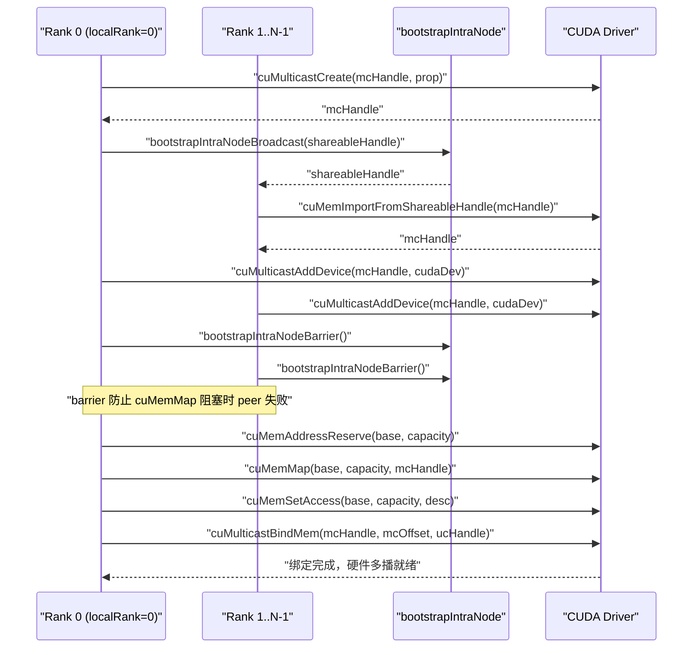
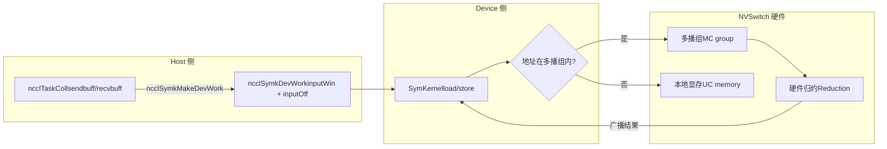

# Kapitel 14: Symmetrischer Speicher und NVLS: Multicast-Beschleunigung und direkte LSA-Geräteadressierung

Im vorherigen Kapitel sind wir einem maschinenübergreifenden AllReduce gefolgt und haben gesehen, wie Daten vom GPU-Speicher über die Netzwerkkarte zum gegenüberliegenden GPU gelangen. Dieser Pfad löst die Kommunikation zwischen Maschinen. Doch in modernen KI-Clustern ist das Kommunikationsvolumen zwischen GPUs innerhalb derselben Maschine oder sogar derselben NVLink-Domäne ebenfalls enorm – die Gradientensynchronisation beim datenparallelen Training und der Aktivierungswertaustausch beim Tensor-Parallelismus finden größtenteils innerhalb einer Maschine statt. Wenn die Kommunikation innerhalb einer Maschine weiterhin den maschinenübergreifenden Ablauf GPU→Speicher→Netzwerkkarte→gegenüberliegende Netzwerkkarte→Speicher→GPU durchlaufen würde, wäre das so, als würde man ein Paket innerhalb derselben Stadt per Luftfracht verschicken – die Latenz wäre reine Verschwendung. In diesem Kapitel werden genau die beiden Werkzeuge von NCCL für die Kommunikation innerhalb einer Maschine analysiert: symmetrischer Speicher und NVLS. Ersterer ermöglicht jedem Rank, mit demselben Satz virtueller Adressen auf die Puffer aller Ranks zuzugreifen, Letzterer nutzt die Multicast-Fähigkeit der NVSwitch-Hardware für die Reduktion. Beide zusammen können die Latenz der kollektiven Kommunikation bei kleinen Nachrichten nahe an die Hardwaregrenze drücken.

# 14.1 Symmetrischer Speicher: „Reihe 3, Platz 5" bezeichnet bei jedem dieselbe Position

## Intuitives Modell

Stellen Sie sich eine Klasse vor, die Hausaufgabenhefte austauschen möchte. Traditionell nummeriert jeder seine eigenen Hefte und ruft dann: „Zhang San, mein 5. Heft gehört dir; Li Si, mein 8. Heft gehört dir" – jeder muss sich merken, „wessen Heft wo liegt und das wievielte es ist". Das ist gewöhnliche Kommunikation: Adressen sind**relativ und privat**. Um auf die Daten der Gegenseite zuzugreifen, muss man zuerst die Adresszuordnung der Gegenseite kennen.

Symmetrischer Speicher verfolgt einen anderen Ansatz: Die ganze Klasse vereinbart, dass die Koordinate „Reihe 3, Platz 5" bei jedem auf dieselbe physische Position zeigt. Wenn Zhang San also das 5. Heft von Li Si haben möchte, sagt er einfach „Li Si, Reihe 3, Platz 5" – ohne jegliche Adressübersetzung. Das ist der Kern des symmetrischen Speichers:**Die Puffer jedes Ranks werden im Adressraum aller Ranks auf dieselbe virtuelle Adresse abgebildet**。

> **[Design Inference & Architectural Trade-offs]**
> Welche Katastrophe würde die kollektive Kommunikation innerhalb einer Maschine ohne symmetrischen Speicher erleiden? Jedes Mal, wenn ein Rank auf den Puffer der Gegenseite zugreift, müsste eine „Adressübersetzung" durchgeführt werden – Tabellensuche, Offset-Berechnung und möglicherweise prozessübergreifende Kommunikation zur Bestätigung der Zuordnung. Bei kleinen Nachrichten (einige KB) könnte der Aufwand dieser Übersetzung größer sein als die eigentliche Datenübertragung. Symmetrischer Speicher eliminiert diesen Aufwand vollständig, und genau das ist der grundlegende Grund, warum er „die Latenz bei kleinen Nachrichten erheblich reduziert".

## Datenstrukturen und Speicherlayout

Der Registrierungstyp des symmetrischen Speichers wird durch`ncclSymRegType_t`beschrieben,`ncclGetSymRegType`unterteilt den Registrierungszustand je nachdem, ob das send/recv-Fenster das`NCCL_WIN_COLL_SYMMETRIC`Flag trägt, in vier Kategorien.

[FACT:src/sym_kernels.cc:395-412]

```c
ncclResult_t ncclGetSymRegType(struct ncclDevrWindow* sendWin, struct ncclDevrWindow* recvWin,
                               ncclSymRegType_t* winRegType) {
  bool isSendSymmReg = false;
  bool isRecvSymmReg = false;
  if (sendWin && (sendWin->winFlags & NCCL_WIN_COLL_SYMMETRIC)) isSendSymmReg = true;
  if (recvWin && (recvWin->winFlags & NCCL_WIN_COLL_SYMMETRIC)) isRecvSymmReg = true;
  // determine the registration type
  if (!isSendSymmReg && !isRecvSymmReg) {
    *winRegType = ncclSymSendNonregRecvNonreg;
  } else if (isSendSymmReg && !isRecvSymmReg) {
    *winRegType = ncclSymSendRegRecvNonreg;
  } else if (!isSendSymmReg && isRecvSymmReg) {
    *winRegType = ncclSymSendNonregRecvReg;
  } else if (isSendSymmReg && is isRecvSymmReg) {
    *winRegType = ncclSymSendRegRecvReg;
  }
  return ncclSuccess;
}
```

Diese vier Zustände bestimmen, welchen Pfad der nachfolgende Kernel nimmt: vollständig symmetrisch registriert (`SendRegRecvReg`) nimmt den schnellsten LSA-Pfad, vollständig nicht registriert (`SendNonregRecvNonreg`) nimmt den gewöhnlichen Pfad, und gemischte Zustände erfordern eine Sonderbehandlung.`winFlags`Das`NCCL_WIN_COLL_SYMMETRIC`Bit in

ist die Markierung dafür, „ob dieses Fenster bereits symmetrisch registriert wurde".`ncclSymkInitOnce`Der Einstiegspunkt für die Initialisierung des symmetrischen Speichers ist`hasLsaMultimem`）。

[FACT:src/sym_kernels.cc:185-196]

```c
ncclResult_t ncclSymkInitOnce(struct ncclComm* comm) {
  // ncclTeamLsa() below calls this internally but drops the error code so we do it here.
  NCCLCHECK(ncclDevrInitOnce(comm));

  struct ncclSymkState* symk = &comm->symkState;
  if (!symk->initialized) {
    symk->initialized = true;
    struct ncclDevCommRequirements reqs = NCCL_DEV_COMM_REQUIREMENTS_INITIALIZER;
    // Disable LSA multicast for cross-clique since NVLS isn't available across cliques
    symk->hasLsaMultimem =
      ncclNvlsSymmetricMultimemEnabled(comm) && ncclTeamLsa(comm).nRanks > 2 && !comm->p2pCrossClique;
    reqs.lsaMultimem = symk->hasLsaMultimem;
```

`hasLsaMultimem`Die drei Bedingungen sind alle unerlässlich: NVLS-symmetrisches Multicast ist aktiviert, die LSA-Team-Rangzahl ist größer als 2 (zwei Ranks kommunizieren direkt Punkt-zu-Punkt schneller, Multicast ist nicht nötig), und es findet kein Clique-Übergang statt (bei Clique-Übergang ist NVSwitch-Multicast nicht verfügbar). Diese Entscheidung bestimmt direkt, ob`reqs.lsaMultimem`gesetzt wird, was wiederum die Ressourcenzuweisung des geräteseitigen Kommunikators beeinflusst.

## Szenariogesteuerter Step-by-Step-Walkthrough

Angenommen, wir starten ein AllReduce mit einer Nachrichtengröße von 4 KB und 8 Ranks innerhalb derselben NVLink-Domäne.`ncclSymkMask`entscheidet, welche Kernel verfügbar sind.

[FACT:src/sym_kernels.cc:304-352]

```c
uint32_t ncclSymkMask(struct ncclComm* comm, ncclFunc_t coll, int /*ncclDevRedOp_t*/ red, ncclDataType_t ty,
                      size_t nElts, bool symAligned16B) {
  uint32_t kmask = kernelMask_coll(coll);

  bool hasSTMC = comm->symkState.hasLsaMultimem;
  bool hasLDMC = false;
  if (comm->symkState.hasLsaMultimem) {
    switch (ty) {
    case ncclInt32:
    ...
      hasLDMC = red == ncclDevSum || red == ncclDevMinMax || red == ncclDevSumPostDiv;
      break;
    ...
    }
  }
  if (!hasSTMC) kmask &= ~kernelMask_STMC;
  if (!hasLDMC) kmask &= ~kernelMask_LDMC;
```

Erster Schritt:`kernelMask_coll`Entsprechend dem Kollektivtyp (AllReduce) wird die Kandidaten-Kernel-Menge entnommen`kernelMask_AR`. Zweiter Schritt: Prüfen von`hasLsaMultimem`. Falls Multicast unterstützt wird, wird weiter geprüft, ob der Datentyp und die Reduktionsoperation LDMC (Load-Multicast) unterstützen. Dritter Schritt: Nicht unterstützte Features werden mit einer Bitmaske entfernt –`kmask &= ~kernelMask_STMC`alle Kernel, die STMC nicht unterstützen, werden ausgeschlossen.

Als Nächstes folgen die Größenbeschränkungen:

[FACT:src/sym_kernels.cc:336-342]

```c
  size_t nBytes = alignUp(nElts * ncclTypeSize(ty), NCCL_SYM_KERNEL_CELL_SIZE);
  size_t nBusBytes = (coll == ncclFuncAllReduce ? 1 : comm->nRanks) * nBytes;
  // LL kernels use 32-bit ints to track element counts and indices.
  if (nBusBytes >= (size_t(2) = 32 * (size_t(2) nRanks;
  kmask &= needGin ? kernelMask_Gin : ~kernelMask_Gin;
  return kmask;
```

TMA erfordert, dass die SMEM-Kapazität den Anforderungen entspricht (`ncclSymkTmaAvailable`prüft`maxSharedMemOptin`) und 16-Byte-Ausrichtung. GIN wird nur benötigt, wenn „die LSA-Team-Rangzahl kleiner als die Gesamt-Rangzahl ist“ – das heißt, GIN ist nur sinnvoll, wenn die Kommunikationsdomäne die LSA-Grenze überschreitet (Netzwerk erforderlich). Wenn die gesamte Kommunikationsdomäne innerhalb der LSA liegt, werden GIN-Kernel ausgeschlossen.

## Nebenläufigkeitssteuerung und Hardware-Interaktion

Die Adressauflösung des symmetrischen Speichers erfolgt letztendlich auf der Geräteseite.`ncclSymkMakeDevWork`übersetzt die hostseitige Aufgabenbeschreibung in geräteseitig lesbare Arbeitselemente.

[FACT:src/sym_kernels.cc:380-393]

```c
ncclResult_t ncclSymkMakeDevWork(struct ncclComm* comm, struct ncclTaskColl* task, struct ncclSymkDevWork* outDevWork) {
  outDevWork->rootRank = task->root;
  outDevWork->redOpArg = task->opDev.scalarArg;
  outDevWork->nElts = task->count;
  outDevWork->inputWin = task->sendWin ? task->sendWin->vidmem : nullptr;
  outDevWork->inputOff =
    task->sendWin ? (uint8_t*)task->sendbuff - (uint8_t*)task->sendWin->userPtr : (size_t)task->sendbuff;
  outDevWork->outputWin = task->recvWin ? task->recvWin->vidmem : nullptr;
  outDevWork->outputOff =
    task->recvWin ? (uint8_t*)task->recvbuff - (uint8_t*)task->recvWin->userPtr : (size_t)task->recvbuff;
  outDevWork->sChannelId = 0xffff;
  outDevWork->nChannels = 0;
  return ncclSuccess;
}
```

Beachten Sie die Berechnung von`inputOff`: Wenn sendWin existiert (symmetrisches Registrierungsfenster), ist der Offset`sendbuff - sendWin->userPtr`– dies ist der**Offset innerhalb des Fensters**. Die Geräteseite erhält`inputWin`(Fensterbasisadresse) plus`inputOff`, um die tatsächliche Adresse zu berechnen. Wenn sendWin nicht existiert, ist der Offset direkt die absolute Adresse von`sendbuff`. Dieses Design ermöglicht es dem geräteseitigen Kernel, registrierte und nicht registrierte Puffer mit derselben Logik zu behandeln.

`ncclSymkInitOnce`initialisiert außerdem die GIN-bezogenen Ressourcenanforderungen, einschließlich Inbox, Outbox, Accumulation Buffer und Rail Signal.

[FACT:src/sym_kernels.cc:208-251]

```c
    struct ncclDevResourceRequirements ginInboxRailReq = {};
    struct ncclDevResourceRequirements ginOutboxReq = {};
    struct ncclDevResourceRequirements rsGinAccumReq = {};
    struct ncclDevResourceRequirements railSignalReq = {};
    if (ncclParamSymGinKernelsEnable() && ncclTeamLsa(comm).nRanks nRanks) {
      int maxBlocks;
      size_t bufSize;
      getRequirements_gin(comm, &maxBlocks, &bufSize);

      maxBlocks = std::max(maxBlocks, comm->config.minCTAs);
      maxBlocks = std::min(maxBlocks, comm->config.maxCTAs);
      if (ncclParamSymCTAs() >= 1) maxBlocks = ncclParamSymCTAs();
      maxBlocks = std::min(maxBlocks, ncclSymkMaxBlocks);
      symk->maxGinInboxBlocks = maxBlocks;
      symk->kcomm.rsGinAccumBytesPerBlock = ncclSymkRsGinAccumBytesPerBlock();

      rsGinAccumReq.bufferSize = (size_t)maxBlocks * symk->kcomm.rsGinAccumBytesPerBlock;
      rsGinAccumReq.bufferAlign = 128;
      rsGinAccumReq.outBufferHandle = &symk->kcomm.rsGinAccumBuf;
      ...
      uint32_t railSignalCount = ncclTeamRail(comm).nRanks * ncclSymkMaxBlocks;
      ...
      reqs.barrierCount = ncclSymkMaxBlocks;
      reqs.ginConnectionType = NCCL_GIN_CONNECTION_RAIL;
      reqs.ginStrongSignalsRequired = true;
      reqs.ginVaSignalsRequired = true;
    }
```

`getRequirements_gin`berechnet mit dem Tuning-Modell die benötigte Blockanzahl und Puffergröße und wird dann auf das Intervall`[minCTAs, maxCTAs]`begrenzt.`rsGinAccumBytesPerBlock`ist die Akkumulationspuffergröße pro Block, ausgerichtet auf 128 Byte – dies ist die Cache-Line-Größe, um False Sharing zu vermeiden.

```mermaid
flowchart TD
    start["ncclSymkMask(comm, coll, red, ty, nElts)"] --> coll{"集合类型?"}
    coll -->|AllGather| mask_ag["kmask = kernelMask_AG"]
    coll -->|AllReduce| mask_ar["kmask = kernelMask_AR"]
    coll -->|ReduceScatter| mask_rs["kmask = kernelMask_RS"]
    mask_ag --> check_stmc{"hasLsaMultimem?"}
    mask_ar --> check_stmc
    mask_rs --> check_stmc
    check_stmc -->|否| clear_stmc["kmask &= ~kernelMask_STMC"]
    check_stmc -->|是| check_ldmc{"数据类型+归约支持LDMC?"}
    clear_stmc --> size_check
    check_ldmc -->|否| clear_ldmc["kmask &= ~kernelMask_LDMC"]
    check_ldmc -->|是| size_check
    clear_ldmc --> size_check
    size_check{"nBusBytes >= 2GB?"} -->|是| clear_ll["kmask &= ~kernelMask_LL"]
    size_check -->|否| tma_check
    clear_ll --> tma_check{"TMA可用且16B对齐?"}
    tma_check -->|否| clear_tma["kmask &= ~kernelMask_Tma"]
    tma_check -->|是| gin_check
    clear_tma --> gin_check{"需要GIN? LSA rank |否| clear_gin["kmask &= ~kernelMask_Gin"]
    gin_check -->|是| done
    clear_gin --> done["返回 kmask"]
```

Diese Abbildung beschreibt vollständig die Entscheidungskette von`ncclSymkMask`: Ausgehend vom Kollektivtyp durchläuft sie nacheinander fünf Filter – Multicast-Unterstützung, Datentyp, Größenbeschränkung, TMA-Verfügbarkeit und GIN-Bedarf – und gibt schließlich eine Bitmaske zurück. Jeder Filter kann eine Gruppe von Kernels ausschließen, was genau die NCCL-Philosophie „den optimalen Kernel je nach Szenario auswählen“ widerspiegelt.

## Produktions-Fallstricke

**Falle 1: Multicast fällt bei Clique-Übergang still aus.** `hasLsaMultimem`Die dritte Bedingung von`!comm->p2pCrossClique`ist`ncclNvlsSymmetricMultimemEnabled`. Wenn Ihr Cluster MNNVL (Multi-Node NVLink) konfiguriert hat, aber einige Ranks eine Clique überschreiten, wird Multicast deaktiviert und die Leistung degradiert still auf den normalen Pfad. Zur Fehlersuche prüfen Sie die Log-Ausgabe von

**Falle 2: Die implizite Anforderung der 16-Byte-Ausrichtung.** `ncclSymkMask`In`if (!symAligned16B) kmask &= ~kernelMask_Tma;`– wenn der Benutzerpuffer nicht 16-Byte-ausgerichtet ist, wird der TMA-Kernel ausgeschlossen. TMA ist die schnellste Kopier-Engine auf Hopper/Blackwell; ihr Verlust bedeutet Leistungseinbußen. In Produktionsumgebungen stammen die vom Benutzer übergebenen Puffer oft von`cudaMalloc`und sind natürlich ausgerichtet; wenn sie jedoch von einem benutzerdefinierten Allocator oder Slice stammen, kann man in die Falle tappen.

**Falle 3: Die 2-GB-Grenze.**LL-Kernel verwenden 32-Bit-Indizes; bei mehr als 2 GB Bus-Byte-Anzahl werden sie ausgeschlossen. Beim Training großer Modelle kann ein einzelnes AllReduce-Gradient diesen Wert überschreiten; in diesem Fall wechselt NCCL automatisch zum STMC- oder Simple-Protokoll. Das ist kein Bug, aber wenn Sie das LL-Protokoll manuell angegeben haben, erhalten Sie`ncclInvalidArgument`。

---

# 14.2 NVLS: Lassen Sie die NVSwitch-Hardware die Reduktion für Sie übernehmen

## Intuitives Modell

Traditionelles AllReduce ist „Software-Reduktion“: Jede GPU sendet Daten an Nachbarn, Nachbarn addieren und leiten weiter – Daten werden zwischen GPUs hin- und hergeschoben, die Addition erfolgt auf den SMs. Das ist wie wenn 8 Personen Zettel weiterreichen, um eine Summe zu berechnen: Jeder muss einmal lesen, einmal addieren und wieder weitergeben.

NVLS verfolgt einen anderen Ansatz: Der NVSwitch-Chip hat integrierte**Multicast- und Reduktionsfähigkeiten**. Man schreibt die Daten in die Multicast-Adresse, NVSwitch broadcastet sie automatisch an alle Mitglieder und führt die Addition in der Hardware durch. Das ist, als würden 8 Personen Zahlen auf dasselbe Whiteboard schreiben, und das Whiteboard zeigt automatisch die Summe an – die GPU schreibt einmal, liest einmal, und das Verschieben und Addieren dazwischen wird vollständig von der Switch-Hardware erledigt.

Ohne NVLS wird die Bandbreite von AllReduce innerhalb des Knotens durch die Punkt-zu-Punkt-Verbindungen zwischen den GPUs begrenzt, und die SMs müssen viele Zyklen für die Addition aufwenden. NVLS verlagert beides in die Hardware, sodass die SMs andere Berechnungen durchführen können.

## Datenstrukturen und Speicherlayout

Der Kern von NVLS ist**Multicast-Gruppe (MC group)**。`ncclMcGroup`Die Struktur beschreibt den gesamten Zustand einer Multicast-Gruppe.

[FACT:src/transport/multicast.cc:72-77]

```c
struct ncclMcGroup {
  CUmemGenericAllocationHandle handle;  // the MC object
  char* base;                          // mapped MC VA base
  size_t capacity;                      // total mapped VA size
  int dev;                           // local device, for unbind
};
```

Vier Felder:`handle`ist das Handle des CUDA-Multicast-Objekts,`base`ist die Basisadresse der Multicast-Virtualadresse,`capacity`ist die gesamte Mapping-Größe,`dev`ist die lokale Gerätenummer (zum Unbinding). Beachten Sie, dass es hier keinen Lock gibt – die Erstellung und Zerstörung von Multicast-Gruppen erfolgt in der Initialisierungs-/Zerstörungsphase, nicht im Hot Path.

Die Multicast-Gruppe wird in mehrere**Partitionen (partition)**unterteilt, wobei jede Partition ein unveränderlicher Slice ist.`ncclMcPartition`beschreibt eine Partition.

[FACT:src/transport/multicast.cc:162-170]

```c
  // A partition is self-sufficient for binds: it carries the group's handle, device and
  // bind granularity alongside its own extent.
  for (int i = 0; i base + outPartitions[i].offset;
    outPartitions[i].mcHandle = mcHandle;
    outPartitions[i].minGranularity = minGran;
    outPartitions[i].dev = comm->cudaDev;
  }
```

Jede Partition trägt ihre eigene`offset`、`size`、`ptr`sowie die`mcHandle`、`minGranularity`、`dev`der zugehörigen Gruppe. Dieses „selbstversorgende" Design ermöglicht es, Partitionen unabhängig an Bindungsfunktionen zu übergeben, ohne die Gruppeninformationen erneut nachschlagen zu müssen.

## Szenariobasierter Step-by-Step-Walkthrough

Angenommen, 8 Ranks möchten eine NVLS-Domäne einrichten.`ncclMcGroupBuildPartitions`ist für die Erstellung der Multicast-Gruppe und die Aufteilung der Partitionen verantwortlich.

[FACT:src/transport/multicast.cc:79-121]

```c
ncclResult_t ncclMcGroupBuildPartitions(struct ncclComm* comm, const struct ncclMcRequest* requests, int nRequests,
                                        struct ncclMcGroup** outGroup, struct ncclMcPartition* outPartitions) {
  ...
  mcprop.numDevices = comm->localRanks;
  mcprop.handleTypes = ncclCuMemHandleType;
  mcprop.flags = 0;
  mcprop.size = 0;
  for (int i = 0; i  recGran ? requests[i].alignment : recGran;
    ALIGN_SIZE(capacity, align);
    size_t slice = requests[i].size;
    ALIGN_SIZE(slice, recGran);
    outPartitions[i].offset = capacity;
    outPartitions[i].size = slice;
    capacity += slice;
  }
```

Erster Schritt: Alle angeforderten Größen werden summiert, um die Gesamtgröße der Multicast-Gruppe zu erhalten. Zweiter Schritt: Die von CUDA empfohlene Granularität und die minimale Granularität werden abgefragt – dies sind Hardware-Einschränkungen, die Adresse und Größe des Multicast-Objekts müssen ganzzahlige Vielfache der Granularität sein. Dritter Schritt: Bump-Allokation – für jede Anfrage wird ein Stück zugewiesen, wobei Offset und Größe an die empfohlene Granularität ausgerichtet werden.`ALIGN_SIZE(capacity, align)`stellt sicher, dass der Startoffset jedes Slices ein gültiger Bindungs-Offset ist.

Als Nächstes folgt die Erstellung und der Import über Ranks hinweg:

[FACT:src/transport/multicast.cc:125-146]

```c
  if (comm->localRank == 0) {
    NCCLCHECKGOTO(ncclMcCreate(comm, &mcprop, comm->localRank, comm->localRanks, &mcHandle, shareableHandle), ret,
                  fail);
    mcCreated = 1;
    NCCLCHECKGOTO(bootstrapIntraNodeBroadcast(comm->bootstrap, comm->localRankToRank, comm->localRank, comm->localRanks,
                                              0, shareableHandle, NVLS_HANDLE_SIZE),
                  ret, fail);
  } else {
    NCCLCHECKGOTO(bootstrapIntraNodeBroadcast(comm->bootstrap, comm->localRankToRank, comm->localRank, comm->localRanks,
                                              0, shareableHandle, NVLS_HANDLE_SIZE),
                  ret, fail);
    NCCLCHECKGOTO(ncclMcImport(comm, shareableHandle, comm->localRankToRank[0], &mcHandle), ret, fail);
    mcCreated = 1;
  }
  CUCHECKGOTO(cuMulticastAddDevice(mcHandle, comm->cudaDev), ret, fail);

  // cuMemMap of an MC object blocks until every device has been added. This
  // abort-aware barrier makes a peer failing before cuMulticastAddDevice trip the
  // abort flag here instead of stranding survivors in the blocking cuMemMap.
  NCCLCHECKGOTO(bootstrapIntraNodeBarrier(comm->bootstrap, comm->localRankToRank, comm->localRank, comm->localRanks,
                                          comm->localRankToRank[0]),
                ret, fail);
```

localRank 0 erstellt das Multicast-Objekt und broadcastet dann das shareable Handle über Bootstrap; die anderen Ranks empfangen das Handle und importieren es.`cuMulticastAddDevice`fügt das lokale Gerät zur Multicast-Gruppe hinzu. Beachten Sie die Barriere – der Kommentar sagt es klar:`cuMemMap`blockiert, bis alle Geräte beigetreten sind. Wenn ein Peer vor`cuMulticastAddDevice`fehlschlägt, bleiben die Überlebenden in`cuMemMap`hängen. Diese Barriere sorgt dafür, dass Fehler durch das Abort-Flag abgefangen werden, bevor sie blockieren.

Schließlich das Mapping und die Zugriffsberechtigungseinstellungen:

[FACT:src/transport/multicast.cc:148-155]

```c
  // Reserve and map the whole MC VA once; each consumer slice is a view into it.
  CUCHECKGOTO(cuMemAddressReserve(&base, capacity, recGran, 0U, 0), ret, fail);
  CUCHECKGOTO(cuMemMap(base, capacity, 0, mcHandle, 0), ret, fail);
  mapped = 1;
  desc.flags = CU_MEM_ACCESS_FLAGS_PROT_READWRITE;
  desc.location.type = CU_MEM_LOCATION_TYPE_DEVICE;
  desc.location.id = comm->cudaDev;
  CUCHECKGOTO(cuMemSetAccess(base, capacity, &desc, 1), ret, fail);
```

Die gesamte Multicast-VA wird nur einmal reserviert und gemappt, und jeder Consumer-Slice ist eine Ansicht dieser VA. Dies ist das Design „einmal mappen, mehrfach slicen" – ressourcenschonender als für jeden Consumer ein separates Multicast-Objekt zu erstellen.

## Nebenläufigkeitskontrolle und Hardware-Interaktion

Das Binding ist die kritischste Operation von NVLS.`ncclMcPartitionBindMem`bindet ein UC-(Unicast-)Speicher-Handle an einen bestimmten Offset der Multicast-Gruppe.

[FACT:src/transport/multicast.cc:200-225]

```c
ncclResult_t ncclMcPartitionBindMem(const struct ncclMcPartition* partition, size_t offsetInPartition,
                                    CUmemGenericAllocationHandle mem, size_t memOffset, size_t bindSize) {
  // A bind overrunning its partition would corrupt the next consumer's partition; fail
  // cleanly instead (possible when UC rounding exceeds the MC-rounded partition).
  if (offsetInPartition + bindSize > partition->size) {
    WARN("NVLS MC bind of size %zu at slice offset %zu exceeds slice size %zu (UC/MC granularity mismatch)", bindSize,
         offsetInPartition, partition->size);
    return ncclInternalError;
  }
  size_t mcOffset = partition->offset + offsetInPartition;
  ...
  CUresult err = CUPFN(cuMulticastBindMem(partition->mcHandle, mcOffset, mem, memOffset, bindSize, 0 /*flags*/));
  if (err != CUDA_SUCCESS) {
    ...
    WARN("Failed to bind NVLink SHARP (NVLS) Multicast memory of size %zu at MC group %llx offset %zu : CUDA error %d "
         "'%s'.\nThis is usually caused by a system or configuration error in the Fabric Manager or NVSwitches.\n"
         "Disable NVLS (NCCL_NVLS_ENABLE=0) if you wish to avoid this error in the future.",
         bindSize, partition->mcHandle, mcOffset, err, errStr);
    return ncclUnhandledCudaError;
  }
  return ncclSuccess;
}
```

Die erste Verteidigungslinie ist die Grenzprüfung:`offsetInPartition + bindSize > partition->size`wird ein Fehler gemeldet. Der Kommentar erklärt den Grund – die Granularität des UC-Speichers kann größer sein als die der MC-Partition. Wenn die UC-Ausrichtung die Grenzen der MC-Partition überschreitet, wird die Partition des nächsten Consumers überschrieben. Dies ist eine typische „Granularitäts-Mismatch"-Falle.

`cuMulticastBindMem`ist ein Hardware-Aufruf, und der Kommentar besagt, dass er „blocks until all ranks have been added to the group" – dies ist die fehleranfälligste Stelle von NVLS. Wenn Fabric Manager falsch konfiguriert ist oder die NVSwitch-Firmware Probleme hat, hängt es hier oder gibt einen Fehler zurück. Die Fehlermeldung empfiehlt dem Benutzer direkt`NCCL_NVLS_ENABLE=0`, dies ist die Standard-Eskalationsoption in Produktionsumgebungen.

Es gibt auch eine „Try-Bind"-Variante für die Registrierung von Benutzerpuffern:

[FACT:src/transport/multicast.cc:237-268]

```c
ncclResult_t ncclMcPartitionTryBindAddr(const struct ncclMcPartition* partition, size_t offsetInPartition,
                                        CUdeviceptr address, size_t bindSize, enum ncclMcBindStatus* outStatus) {
  const char* errStr = NULL;

  *outStatus = ncclMcBindStatusTransient;
  if (offsetInPartition + bindSize > partition->size) {
    ...
    return ncclInternalError;
  }
  size_t mcOffset = partition->offset + offsetInPartition;
  CUresult err = CUPFN(cuMulticastBindAddr(partition->mcHandle, mcOffset, address, bindSize, 0 /*flags*/));
  if (err == CUDA_SUCCESS) {
    *outStatus = ncclMcBindStatusOk;
    return ncclSuccess;
  }

  (void)pfn_cuGetErrorString(err, &errStr);
  // Only an outright rejection of the input is a property of the buffer. Anything else,
  // notably OUT_OF_MEMORY, may succeed later, so it must not be reported as permanent.
  if (err == CUDA_ERROR_INVALID_VALUE || err == CUDA_ERROR_NOT_SUPPORTED || err == CUDA_ERROR_NOT_PERMITTED) {
    *outStatus = ncclMcBindStatusNoSupport;
    ...
  } else {
    WARN("NVLS Multicast bind of size %zu at MC group %llx offset %zu dev %d failed transiently: CUDA error %d '%s'.\n"
         "The buffer is left unregistered for this operation and will be retried; repeated occurrences indicate "
         "sustained resource pressure.",
         bindSize, partition->mcHandle, mcOffset, partition->dev, err, errStr);
  }
  return ncclSuccess;
}
```

Hier gibt es eine raffinierte Fehlerklassifizierung:`CUDA_ERROR_INVALID_VALUE`、`NOT_SUPPORTED`、`NOT_PERMITTED`wird als`ncclMcBindStatusNoSupport`eingestuft – dies ist ein**permanenter Fehler**, der anzeigt, dass dieser Puffer selbst kein Multicast-Binding unterstützt. Andere Fehler (insbesondere`OUT_OF_MEMORY`) werden als`ncclMcBindStatusTransient`eingestuft – dies ist ein**temporärer Fehler**, der wiederholt werden kann. Diese Unterscheidung ist entscheidend: Wenn OOM als permanenter Fehler behandelt wird, wird eine Registrierung fälschlicherweise aufgegeben, die eigentlich erfolgreich sein könnte; wenn ein Parameterfehler als temporärer Fehler behandelt wird, wird unendlich oft wiederholt.

## Produktions-Fallstricke vermeiden

**Falle 1: Fabric-Manager-Fehlkonfiguration führt zu`cuMulticastBindMem`Hängen.**Dies ist der klassischste Produktionsfehler von NVLS. Die Fehlermeldung weist explizit auf Fabric Manager oder NVSwitch hin. Fehlerbehebungsschritte: Zuerst`NCCL_NVLS_ENABLE=0`bestätigen, dass das Problem verschwunden ist, dann die Fabric-Manager-Logs und die NVSwitch-Firmware-Version überprüfen.

**Falle 2: UC/MC-Granularitäts-Mismatch.** `ncclMcPartitionBindMem`Die Grenzprüfung von

**Falle 3: Ressourcenleck nach fehlgeschlagener Erstellung der Multicast-Gruppe.** `ncclMcGroupBuildPartitions`Der Fail-Pfad von`CUCALL`verwendet`CUCHECK`：

[FACT:src/transport/multicast.cc:179-184]

```c
fail:
  // Best-effort (CUCALL) so a failing cleanup op cannot skip releasing the MC handle.
  if (mapped) CUCALL(cuMemUnmap(base, capacity));
  if (base) CUCALL(cuMemAddressFree(base, capacity));
  if (mcCreated) CUCALL(cuMemRelease(mcHandle));
  return ret;
```

Der Kommentar erklärt den Grund: Wenn die cleanup-Operation selbst fehlschlägt, darf das Freigeben des MC-Handles nicht deshalb übersprungen werden – MC-Slots sind eine knappe Ressource, und ein Leck führt dazu, dass spätere Erstellungen fehlschlagen. Dies ist ein typisches Design für „Der Bereinigungspfad muss sein Bestes geben".



Dieses Sequenzdiagramm beschreibt den vollständigen Ablauf einer Multicast-Gruppe von der Erstellung bis zur Bindung. Der entscheidende Punkt ist die Barriere – sie entkoppelt „Peer-Fehler" von „cuMemMap-Blockierung" und verhindert, dass Überlebende hängen bleiben.

---

# 14.3 Die Kombination von symmetrischem Speicher und NVLS: Wie LSA-Zeiger auf der Geräteseite aufgelöst werden

## Intuitives Modell

Symmetrischer Speicher löst das Problem der „Adresskonsistenz", NVLS löst das Problem der „Hardware-Reduktion". Damit beide wirklich zusammenarbeiten können, ist jedoch noch ein entscheidender Mechanismus erforderlich:**Woher weiß die Geräteseite, dass eine bestimmte Adresse symmetrisch ist und den Multicast-Pfad nehmen kann?**

Die Antwort liegt im LSA-Zeiger (Load-Store Accessible). LSA ist die Abkürzung für „Load-Store Accessible", was bedeutet, dass der Speicher, auf den dieser Zeiger zeigt, von der GPU direkt mit gewöhnlichen load/store-Befehlen angesprochen werden kann – unabhängig davon, ob er physisch lokal oder remote liegt. Wenn die Adresse innerhalb einer Multicast-Gruppe liegt, werden load/store von der NVSwitch-Hardware abgefangen und gebroadcastet.

## Datenstrukturen und Speicherlayout

`ncclSymkDevWork`ist der arbeitsseitige Deskriptor auf der Geräteseite, der die entscheidenden Informationen des symmetrischen Speichers trägt.

[FACT:src/sym_kernels.cc:380-393]

```c
ncclResult_t ncclSymkMakeDevWork(struct ncclComm* comm, struct ncclTaskColl* task, struct ncclSymkDevWork* outDevWork) {
  outDevWork->rootRank = task->root;
  outDevWork->redOpArg = task->opDev.scalarArg;
  outDevWork->nElts = task->count;
  outDevWork->inputWin = task->sendWin ? task->sendWin->vidmem : nullptr;
  outDevWork->inputOff =
    task->sendWin ? (uint8_t*)task->sendbuff - (uint8_t*)task->sendWin->userPtr : (size_t)task->sendbuff;
  outDevWork->outputWin = task->recvWin ? task->recvWin->vidmem : nullptr;
  outDevWork->outputOff =
    task->recvWin ? (uint8_t*)task->recvbuff - (uint8_t*)task->recvWin->userPtr : (size_t)task->recvbuff;
  outDevWork->sChannelId = 0xffff;
  outDevWork->nChannels = 0;
  return ncclSuccess;
}
```

`inputWin`ist die virtuelle Adresse der Fensters auf der Geräteseite (`vidmem`），`inputOff`ist der Offset des Puffers innerhalb des Fensters. Nachdem der Kernel auf der Geräteseite diese beiden Werte erhalten hat, berechnet er`inputWin + inputOff`und erhält die tatsächliche Adresse. Wenn diese Adresse innerhalb der Multicast-Gruppe liegt, verarbeitet die Hardware das Broadcasting automatisch.

`ncclSymkInitOnce`setzt außerdem LSA-Barrier und LLA2A-Ressourcen (Low-Latency All-to-All).

[FACT:src/sym_kernels.cc:197-206]

```c
    reqs.lsaBarrierCount = ncclSymkMaxBlocks;
    reqs.ginStrongSignalsRequired = false;
    reqs.ginVaSignalsRequired = false;

    struct ncclDevResourceRequirements lla2aReq;
    ncclLLA2ACreateRequirement(ncclSymkMaxBlocks,
                               ncclLLA2ACalcSlots(ncclTeamLsa(comm).nRanks * ncclSymkMaxThreads, ncclSymkLLMaxEltSize),
                               &symk->kcomm.lsaLLA2A, &lla2aReq);
    lla2aReq.next = reqs.resourceRequirementsList;
    reqs.resourceRequirementsList = &lla2aReq;
```

`lsaBarrierCount`wird auf`ncclSymkMaxBlocks`gesetzt – ein Barrier-Slot pro Block. LLA2A ist die Abkürzung für Low-Latency All-to-All und wird für schnellen Datenaustausch innerhalb der LSA-Domäne verwendet.`ncclLLA2ACalcSlots`berechnet die benötigte Anzahl an Slots anhand der Rank-Anzahl, Thread-Anzahl und maximalen Elementgröße.

## Szenariobasierter Step-by-Step-Walkthrough

Angenommen, ein AllReduce verwendet`AllReduce_AGxLLMC_R`Kernel (AllGather + LL + MC + Reduce). Der Arbeitsablauf dieses Kernels ist:

1. **AllGather-Phase**: Jeder Rank schreibt seine eigenen Daten in die Multicast-Gruppe, und die NVSwitch-Hardware broadcastet sie an alle Ranks.

2. **Reduce-Phase**: Jeder Rank liest die Daten aller Ranks aus der Multicast-Gruppe und führt lokal eine Reduktion durch.

`ncclSymkMask`prüft, ob dieser Kernel verfügbar ist.`kernelMask_LL`enthält`AllReduce_AGxLLMC_R`, aber nur unter der Voraussetzung, dass`hasLsaMultimem`wahr ist (andernfalls wird`kernelMask_STMC`gelöscht, und`AllReduce_AGxLLMC_R`gehört zur STMC-Menge).

Moment, hier gibt es ein Detail:`kernelMask_STMC`enthält`AllReduce_AGxLLMC_R`? Schauen wir in den Quellcode:

[FACT:src/sym_kernels.cc:17-21]

```c
constexpr uint32_t kernelMask_STMC =
  1 nvlsChannels;
    size_t creditSize = nChannels * 2 * memSize * nHeads;
    int nvlsStepSize = comm->nvlsChunkSize;

    NCCLCHECKGOTO(ncclCalloc(&comm->nvlsResources, 1), res, fail);
    comm->nvlsResources->inited = false;
    comm->nvlsResources->refCount = 1;
    comm->nvlsResources->nChannels = nChannels;
    comm->nvlsResources->nHeads = nHeads;
    comm->nvlsResources->chunkSize = comm->nvlsChunkSize;
    comm->nvlsResources->treeMaxChunkSize = comm->nvlsTreeMaxChunkSize;
    resources = comm->nvlsResources;

    for (int c = 0; c accessDesc, 0, sizeof(resources->accessDesc));
    resources->accessDesc.flags = CU_MEM_ACCESS_FLAGS_PROT_READWRITE;
    resources->accessDesc.location.type = CU_MEM_LOCATION_TYPE_DEVICE;
    resources->accessDesc.location.id = comm->cudaDev;
    resources->dev = comm->cudaDev;

    // Build the single shared MC group for this NVLS domain. The data slice is
    // reserved here but bound later by ncclNvlsBufferSetup.
    {
      size_t buffSize = nvlsStepSize * NCCL_STEPS;
      size_t dataSize = nChannels * 2 * buffSize * nHeads;
      size_t ubSize = ncclNvlsUbSize(comm);
      struct ncclMcRequest requests[3] = {{creditSize, 0}, {dataSize, 0}, {ubSize, 0}};
      struct ncclMcPartition partitions[3];
      NCCLCHECKGOTO(ncclMcGroupBuildPartitions(comm, requests, 3, &resources->mcGroup, partitions), res, fail);
      resources->creditPartition = partitions[0];
      resources->dataPartition = partitions[1];
      if (ubSize) {
        resources->ubPartition = partitions[2];
        NCCLCHECKGOTO(ncclMcArenaInit(comm, &resources->ubArena, &resources->ubPartition), res, fail);
        resources->ubEnabled = true;
      }
      NCCLCHECKGOTO(nvlsAllocBindUc(comm, &resources->creditPartition, creditSize, &resources->creditUc), res, fail);
    }
```

Die Multicast-Gruppe wird in drei Partitionen aufgeteilt:`creditPartition`(Credit),`dataPartition`(Daten),`ubPartition`(Benutzerpuffer). Die Credit-Partition dient der Synchronisation – jeder Channel hat unabhängige head/tail-Zeiger, die über die Multicast-Gruppe geteilt werden.

Die Initialisierung des Credits erfolgt in der späteren Schleife:

[FACT:src/transport/nvls.cc:456-491]

```c
    for (int h = 0; h nRanks + 1 + h;
      for (int c = 0; c channels + c;
        char* mem = NULL;
        struct ncclChannelPeer* peer = channel->peers[nvlsPeer];

        // Reduce UC -> MC
        mem = (char*)resources->creditUc.ptr + (h * 2 * nChannels + c) * memSize;
        peer->send[1].transportComm = &nvlsTransport.send;
        peer->send[1].conn.buffs[NCCL_PROTO_SIMPLE] = NULL;
        peer->send[1].conn.head = (uint64_t*)mem;
        peer->send[1].conn.tail = (uint64_t*)(mem + memSize / 2);
        peer->send[1].conn.stepSize = nvlsStepSize;
        mem = (char*)resources->creditPartition.ptr + (h * 2 * nChannels + c) * memSize;
        peer->recv[0].transportComm = &nvlsTransport.recv;
        peer->recv[0].conn.buffs[NCCL_PROTO_SIMPLE] = NULL;
        peer->recv[0].conn.head = (uint64_t*)mem;
        peer->recv[0].conn.tail = (uint64_t*)(mem + memSize / 2);
        peer->recv[0].conn.stepSize = nvlsStepSize;
        peer->recv[0].conn.flags |= NCCL_NVLS_MIN_POLL;
```

Jede Kombination aus head und Channel hat einen unabhängigen Credit-Bereich.`head`und`tail`sind 64-Bit-Zeiger,`memSize`ist 64 Byte (`size_t memSize = 64;`), daher belegen head und tail jeweils 32 Byte – genau eine halbe Cache-Linie.`NCCL_NVLS_MIN_POLL`Das  -Flag ermöglicht dem Empfänger den Minimal-Polling-Modus, um den CPU-Overhead zu reduzieren.

## Produktions-Fallstricke

**Fallstrick 1: head/tail-Konkurrenz in der Credit-Partition.**Mehrere Channels teilen sich dieselbe Multicast-Gruppe, aber jeder Channel hat einen unabhängigen Credit-Bereich. Wenn die Anzahl der Channels falsch konfiguriert ist (z. B.`nvlsCTAs`zu groß eingestellt), bläht sich der Credit-Bereich auf und belegt wertvollen Multicast-Adressraum.`ncclNvlsChannels`passt die Anzahl der Channels automatisch an die GPU-Architektur und die Knotenanzahl an:

[FACT:src/transport/nvls.cc:100-133]

```c
  if (comm->config.nvlsCTAs != NCCL_CONFIG_UNDEF_INT) {
    channels = comm->config.nvlsCTAs;
  } else if (channels == 0 && comm->compCap >= 100) {
    // Use a reduced number of channels for single node/MNNVL domain on Blackwell and above.
    // comm->nNodes is not yet initialized at this point so we need to use local information.
    bool multiNode = false;
    if (comm->MNNVL) {
      multiNode = (comm->clique.size nRanks);
    } else {
      int i;
      for (i = 1; i nRanks; i++) {
        if (comm->peerInfo[i].hostHash != comm->peerInfo[0].hostHash) break;
      }
      multiNode = (i nRanks);
    }
    if (multiNode) {
      channels = RUBIN_AND_LATER(comm->compCap) ? /*RUBIN=*/64 : /*SM100=*/32;
    } else {
      channels = RUBIN_AND_LATER(comm->compCap) ? /*RUBIN=*/48 : /*SM100=*/24;
    }
  } else if (channels == 0) {
    channels = /*SM90=*/16;
  }
```

Beachten Sie, dass`comm->nNodes`zu diesem Zeitpunkt noch nicht initialisiert ist, daher verwendet der Code`peerInfo[i].hostHash`, um manuell zu prüfen, ob es sich um einen Multi-Node-Fall handelt. Dies ist eine klassische Falle der Initialisierungsreihenfolge – man kann sich nicht auf Felder verlassen, die noch nicht berechnet wurden.

**Fallstrick 2: MNNVL unterstützt keine NVLS-Buffer-Registrierung.** [FACT:src/transport/nvls.cc:516-517]

```c
  // MNNVL does not support NVLS buffer registration
  if (!comm->MNNVL && comm->nvlsResources->nvlsShmemHandle == NULL) {
```

In der MNNVL-Umgebung (Multi-Node NVLink) wird die Registrierung des Benutzerpuffers übersprungen. Wenn Ihr Cluster MNNVL verwendet und Sie sich auf die UB-Registrierung zur Leistungssteigerung verlassen, werden Sie feststellen, dass die Registrierung nicht wirksam wird. Dies ist eine Hardware-Einschränkung, kein Bug.

**Fallstrick 3: Referenzzählung gemeinsam genutzter Ressourcen.** `ncclNvlsSetup`Unterstützung von NVLS-Ressourcen-Sharing zwischen Eltern- und Kind-Kommunikationsdomänen:

[FACT:src/transport/nvls.cc:380-392]

```c
  if (nvlsShare) {
    /* reuse NVLS resources */
    comm->nvlsChannels = std::min(comm->nvlsChannels, parent->nvlsResources->nChannels);
    /* Inherit chunk sizes from the shared resource since we're reusing the parent's
     * NVLS buffers, which were allocated and laid out based on these values. */
    comm->nvlsChunkSize = parent->nvlsResources->chunkSize;
    comm->nvlsTreeMaxChunkSize = parent->nvlsResources->treeMaxChunkSize;
    for (int c = 0; c nvlsChannels; c++) {
      NCCLCHECKGOTO(initNvlsChannel(comm, c, parent, true), res, fail);
    }

    comm->nvlsResources = parent->nvlsResources;
    ncclAtomicRefCountIncrement(&parent->nvlsResources->refCount);
  }
```

Die Kind-Kommunikationsdomäne verwendet die Ressourcen der Eltern-Kommunikationsdomäne wieder, der Referenzzähler wird um eins erhöht.`ncclNvlsFree`Erst wenn der Referenzzähler auf null sinkt, wird tatsächlich freigegeben. Wenn die Referenzzählung fehlerhaft verwaltet wird, führt dies zu vorzeitiger Freigabe oder Leckage. Beachten Sie`nvlsChunkSize`und`nvlsTreeMaxChunkSize`müssen die Werte der Eltern-Kommunikationsdomäne erben – da der Puffer gemäß diesen Werten angeordnet ist, würde eine Änderung zu fehlerhafter Adressberechnung führen.



Dieses Datenflussdiagramm zeigt die vollständige Kette von hostseitigen Aufgaben bis zur geräteseitigen Ausführung. Der entscheidende Zweig ist`lsa{"地址在多播组内?"}`– falls ja, NVSwitch-Hardware-Multicast und -Reduktion; falls nein, lokaler Gerätespeicher. Diese Entscheidung wird von der Hardware automatisch anhand des Adressbereichs getroffen, ohne Softwareeingriff.

---

# 14.4 Designüberlegung: Warum symmetrischer Speicher die Latenz kleiner Nachrichten reduziert

Zurück zur Kernfrage vom Anfang dieses Kapitels: Warum reduziert symmetrischer Speicher die Latenz kleiner Nachrichten erheblich?

**Erstens: Eliminierung des Adressübersetzungsaufwands.**In der traditionellen Kommunikation muss jeder Rank beim Zugriff auf den Puffer des Gegenübers eine Tabelle durchsuchen und den Offset berechnen. Symmetrischer Speicher ermöglicht allen Ranks die Verwendung desselben Adresssatzes, der geräteseitige Kernel berechnet direkt`base + offset`. Bei kleinen Nachrichten ist der Anteil dieses Übersetzungsaufwands sehr hoch.

**Zweitens: Eliminierung des Kontrollnachrichten-Roundtrips.**Traditionelle Kommunikation erfordert den Austausch von Steuerinformationen wie „in welchen deiner Puffer soll ich schreiben". Bei symmetrischem Speicher sind die Adressen im Voraus vereinbart, keine Laufzeitverhandlung erforderlich.

**Drittens: Ermöglichung von Hardware-Multicast.**Nur wenn die Adressen symmetrisch sind, kann NVSwitch mit demselben Adresssatz Multicast durchführen. Wenn die Adressen jedes Ranks unterschiedlich sind, kann die Hardware nicht wissen, wohin gebroadcastet werden soll.

**Viertens: Reduzierung der SM-Reduktionslast.**NVLS verlagert die Addition auf den NVSwitch, die SM muss nur einen Schreibvorgang und einen Lesevorgang initiieren. Bei kleinen Nachrichten ist der Instruktionsaufwand der SM die Hauptlatenzquelle.

Diese vier Faktoren zusammen reduzieren die Latenz kleiner Nachrichten von „Mikrosekunden" auf „Submikrosekunden".

> **[Design Inference & Architectural Trade-offs]**
> Aus ingenieurtechnischer Sicht verkörpert das Design des symmetrischen Speichers eine Kernphilosophie von NCCL:**Komplexität in die Initialisierungsphase verlagern, den Hot Path so einfach wie möglich halten**. Adressaushandlung, Multicast-Gruppenerstellung und Credit-Zuweisung erfolgen alle bei der Initialisierung, der Laufzeit-Kernel muss nur einfachste Adressberechnung und Load/Store durchführen. Dieses Design „schwere Initialisierung, leichte Laufzeit" ist ein universelles Muster für Hochleistungs-Kommunikationsbibliotheken.

---

# Kapitelzusammenfassung

Dieses Kapitel hat die beiden Säulen der NCCL-Intra-Node-Kommunikation analysiert:

1. **Symmetrischer Speicher**: Durch`ncclSymkInitOnce`und`ncclSymkMask`werden Puffer mit konsistenten Adressen erstellt, sodass jeder Rank mit demselben Adresssatz auf die Daten aller Ranks zugreift.`ncclSymkMakeDevWork`übersetzt hostseitige Aufgaben in geräteseitige Arbeitselemente,`inputWin + inputOff`ist die Kernformel der Adressauflösung.

2. **NVLS-Multicast**: Durch`ncclMcGroupBuildPartitions`wird eine Multicast-Gruppe erstellt,`ncclMcPartitionBindMem`bindet UC-Speicher an die Multicast-Gruppe,`cuMulticastBindMem`ist der Hardware-Aufruf. Die Multicast-Gruppe wird in die drei Partitionen Credit, Data und UB aufgeteilt, die jeweils für Synchronisation, Datenübertragung und Benutzerpuffer-Registrierung verwendet werden.

3. **LSA-Zeigerauflösung**: Die Geräteseite bestimmt automatisch anhand des Adressbereichs, ob der Multicast-Pfad verwendet wird, ohne Softwareübersetzung.`NCCL_NVLS_MIN_POLL`Das Flag optimiert den Polling-Aufwand.

4. **Fehlerbehandlung**：`ncclMcPartitionTryBindAddr`Unterscheidung zwischen permanenten und temporären Fehlern,`ncclMcGroupBuildPartitions`der Fail-Pfad verwendet`CUCALL`um Ressourcenfreigabe sicherzustellen.

# Kapitelüberlegungen und Selbsttest

Q1: Wenn man in`ncclMcPartitionBindMem`die Grenzprüfung`if (offsetInPartition + bindSize > partition->size)`entfernt, in welchen Szenarien würde ein Speicherüberlauf ausgelöst? Warum kann diese Prüfung nicht durch „UC und MC haben dieselbe Granularität" ersetzt werden?

**Referenzanalyse**: Siehe[FACT:src/transport/multicast.cc:200-208]：
