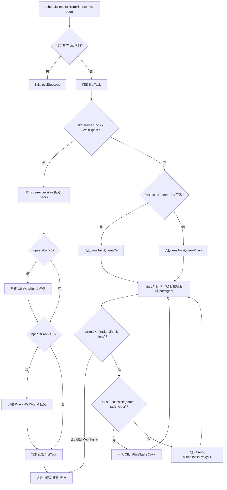
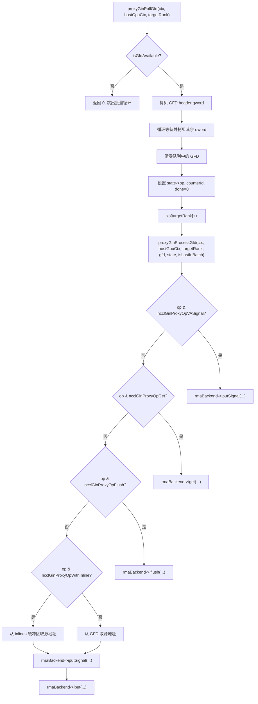

# Kapitel 15: RMA und GIN: Entwicklung von entferntem Speicherzugriff und GPU-Direktkommunikation

Im vorherigen Kapitel haben wir gesehen, dass symmetrischer Speicher jedem Rank ermöglicht, mit demselben Adresssatz auf die Puffer aller Ranks zuzugreifen, während NVLS durch die Multicast-Fähigkeit von NVSwitch die hardwarebeschleunigte Reduktion auf die Spitze treibt. Doch kollektive Kommunikation ist nicht alles – wenn Anwendungen punkt-zu-punkt entfernte Speicheroperationen benötigen oder GPU-Kernel direkt Netzwerkanfragen initiieren sollen, kommen RMA und GIN ins Spiel. RMA bietet entfernten Speicherzugriff mit put/get-Semantik, GIN ermöglicht der GPU, den Host-Proxy-Thread zu umgehen und direkt mit dem Netzwerk zu interagieren. Dieses Kapitel analysiert in der Reihenfolge „zuerst RMA, dann GIN" schrittweise die Datenstrukturen, Scheduling-Logik, Nebenläufigkeitskontrolle und Produktionsfallstricke dieser beiden Mechanismen.

# Das Dual-Kanal-Modell von RMA: Arbeitsteilung zwischen CE und Proxy

## Intuitives Modell

Stellen Sie sich ein internationales Kuriersystem vor: Innerstädtische Lieferungen (LSA-erreichbare Ranks) können direkt von lokalen Lieferfahrzeugen zugestellt werden, während interstädtische Lieferungen (nicht LSA-erreichbare Ranks) an Luftfrachtagenten übergeben werden müssen. NCCLs RMA ist genau dieses Modell – dieselbe put-Operation wird je nachdem, ob der Ziel-Rank zum LSA-Team (Load-Store Accessible) gehört, auf zwei völlig unterschiedliche Ausführungspfade geleitet: den CE-Pfad (Copy Engine, Kopierengine) und den Proxy-Pfad (Proxy-Thread).

Ohne diesen Aufteilungsmechanismus würden alle RMA-Operationen über den Proxy-Thread laufen, sodass auch lokale put-Operationen den Umweg über den Host-Thread nehmen müssten, was unnötig eine zusätzliche Host-Device-Roundtrip-Latenz hinzufügt. Umgekehrt könnten bei ausschließlicher Nutzung des CE-Pfads netzwerkübergreifende Operationen die asynchronen Fähigkeiten des Netzwerk-Plugins nicht nutzen.

## Datenstrukturen und Speicherlayout

Die zentrale Scheduling-Struktur für RMA ist`ncclRmaArgs`, die das Aufteilungsergebnis der RMA-Aufgaben in einem Plan aufzeichnet. Die wichtigsten Felder sind:

| Feld | Bedeutung |
| --- | --- |
| `func` | Operationstyp (PutSignal / Signal / WaitSignal) |
| `nRmaTasks` | Gesamtanzahl der Aufgaben |
| `nRmaTasksProxy` | Anzahl der Aufgaben auf dem Proxy-Pfad |
| `nRmaTasksCe` | Anzahl der Aufgaben auf dem CE-Pfad |

Jeder Plan verwaltet intern zwei intrusive Warteschlangen:`rmaTaskQueueCe`und`rmaTaskQueueProxy`, die jeweils die Aufgaben der beiden Pfade enthalten.[FACT:src/rma/rma.cc:166-171]

Die Logik zur Bestimmung, ob ein Rank LSA-erreichbar ist, ist unkompliziert – es wird eine lineare Suche im`lsaRankList`-Array durchgeführt.[FACT:src/rma/rma.cc:34-41]Diese Suche wird beim Task-Scheduling für jeden Peer einmal ausgeführt, mit einer Komplexität von O(lsaSize), was für typische kleine LSA-Teams (üblicherweise 2-8 Ranks) vernachlässigbar ist.

## Schritt-für-Schritt-Scheduling-Ablauf

Wenn die Anwendung eine RMA-put-Operation aufruft, gelangt die Aufgabe in`planner->rmaTaskQueues[ctx]`。`scheduleRmaTasksToPlan`, die dafür verantwortlich ist, die Aufgaben aus der Warteschlange den Plänen zuzuweisen.[FACT:src/rma/rma.cc:141-296]

Erster Schritt: Finde die erste nicht-leere Context-Warteschlange. NCCL unterstützt mehrere RMA-Contexts (konfiguriert durch`numRmaCtx`), wobei jeder Context eine unabhängige Warteschlange hat.[FACT:src/rma/rma.cc:148-155]

Zweiter Schritt: Entnehme die erste Aufgabe und bestimme den Operationstyp. Bei WaitSignal wird eine spezielle Aufteilungslogik angewendet; bei Put/Signal wird eine Batch-Zusammenführungslogik verwendet.[FACT:src/rma/rma.cc:163-168]

Für WaitSignal-Aufgaben muss der Scheduler die Peer-Liste basierend auf der LSA-Erreichbarkeit in zwei Gruppen aufteilen: die CE-Gruppe und die Proxy-Gruppe.[FACT:src/rma/rma.cc:187-204]Nach der Aufteilung werden zwei neue`ncclTaskRma`-Strukturen erstellt, die jeweils das Peer-Array der entsprechenden Gruppe enthalten.[FACT:src/rma/rma.cc:207-246]Die ursprüngliche Aufgabe wird freigegeben.[FACT:src/rma/rma.cc:251]

Für Put/Signal-Aufgaben ist die Logik komplexer – der Scheduler durchläuft die Warteschlangen aller Contexts und zieht alle aufeinanderfolgenden put/signal-Aufgaben in denselben Plan, bis ein WaitSignal auftritt.[FACT:src/rma/rma.cc:279-295]Der Zweck dieses Designs ist in den Kommentaren klar dokumentiert: Ein einzelner Kernel-Launch soll alle put/signal-Operationen aller Contexts abdecken, der Proxy kann alle asynchronen Anfragen vor jeder blockierenden Operation auf einmal starten, und der CE-Pfad kann die Kopien und Signale aller Contexts gebündelt übermitteln.[FACT:src/rma/rma.cc:270-278]

## Parallele Ausführung und Stream-Synchronisation

Nach Abschluss des Schedulings wird`ncclLaunchRma`basierend auf dem`func`-Feld an`ncclRmaPut`oder`ncclRmaWaitSignal`。[FACT:src/rma/rma.cc:109-131]

verteilt. Am Beispiel von`ncclRmaPut`: Wenn im Plan sowohl Proxy- als auch CE-Aufgaben existieren, müssen beide Pfade parallel ausgeführt werden. NCCLs Ansatz: Ein Event wird im Input-Stream aufgezeichnet, der CE-Stream wartet auf dieses Event, dann werden die Operationen gleichzeitig in beiden Streams gestartet, und schließlich wird ein weiteres Event im CE-Stream aufgezeichnet, auf das der Input-Stream wartet.[FACT:src/rma/rma.cc:80-96]Diese Event-Kette stellt sicher: CE-Operationen beginnen nicht, bevor die Abhängigkeiten des Input-Streams bereit sind, und nachfolgende Operationen des Input-Streams beginnen nicht, bevor CE abgeschlossen ist.

Wenn nur Proxy-Aufgaben oder nur CE-Aufgaben vorhanden sind, wird die entsprechende Operation direkt im Input-Stream gestartet, ohne zusätzliche Stream-Synchronisation.[FACT:src/rma/rma.cc:97-101]

## Designüberlegungen und Produktionsfallen

**Falle eins: Die Statik der LSA-Erreichbarkeitsbestimmung.** `isLsaAccessible`Zur Scheduling-Zeit wird`comm->devrState.lsaRankList`abgefragt; diese Liste ändert sich nach der Initialisierung der Kommunikationsdomäne nicht mehr. Wenn sich die Topologie während des Betriebs ändert (z. B. NVLink-Ausfall mit Degradierung), wird die LSA-Liste nicht automatisch aktualisiert, was dazu führen kann, dass Operationen, die eigentlich über den Proxy laufen sollten, weiterhin den CE-Pfad nutzen und nicht behebbare Fehler auslösen.

**Falle zwei: FIFO-Garantie bei der Batch-Zusammenführung.**Die Batch-Zusammenführungslogik zieht nur aufeinanderfolgende put/signal-Aufgaben und stoppt bei WaitSignal.[FACT:src/rma/rma.cc:283]Dies garantiert die FIFO-Reihenfolge innerhalb jedes Contexts, aber Aufgaben aus verschiedenen Contexts können in denselben Plan zusammengeführt werden. Wenn die Anwendung auf die operationsübergreifende Reihenfolge zwischen Contexts angewiesen ist, muss explizit WaitSignal verwendet werden, um eine Barriere zu errichten.

**Falle drei: Speicherleck-Pfad.**Im WaitSignal-Zweig werden, wenn`npeersProxy == 0`, die drei Arrays`peersProxy`、`nsignalsProxy`、`signalIdxsProxy`freigegeben.[FACT:src/rma/rma.cc:239-244]Wenn jedoch`npeersCe == 0`und`npeersProxy > 0`，`peersCe`die Arrays wie`ncclMemoryStackAlloc`über[FACT:src/rma/rma.cc:176-178]Diese Asymmetrie kann Leser verwirren, ist aber tatsächlich korrekt – der auf dem Stack allokierte Speicher wird von`comm->memScoped`einheitlich verwaltet.

# RMA-Proxy-Kontext: Signale, Warteschlangen und lockere Ringpuffer

## Intuitives Modell

Der Proxy-Kontext ist wie ein „Postverteilzentrum": Die GPU legt die zu versendenden Pakete (put-Anfragen) in den Posteingang (Ringpuffer), der Proxy-Thread entnimmt die Pakete aus dem Posteingang und übergibt sie an das Kurierunternehmen (Netzwerk-Plugin), und das Kurierunternehmen stempelt nach der Zustellung den Beleg (Signal) ab. Während des gesamten Prozesses kommunizieren GPU und Proxy-Thread über lockere Datenstrukturen, um teure Lock-Konkurrenz zu vermeiden.

## Datenstrukturen und Speicherlayout

`ncclRmaProxyCtx`ist die Host-Struktur des Proxy-Kontexts, deren Kernfelder umfassen:

**Signalbereich (signalsDev)**: Ein auf der GPU allokierter Speicherbereich mit der Größe`nRanks * numRmaSig * sizeof(uint64_t)`。[FACT:src/rma/rma_proxy.cc:120-123]Jeder Rank hat`numRmaSig`Signal-Slots, um Signale von diesem Rank zu empfangen. Dieser Speicher wird beim Registrieren beim Netzwerk-Plugin mit`NCCL_NET_MR_FLAG_FORCE_SO`(erzwungene starke Ordnung) und`NCCL_NET_MR_FLAG_SIGNAL_NEVER_RESET`(Signal wird niemals zurückgesetzt) Flags versehen.[FACT:src/rma/rma_proxy.cc:125-127]Das Flag für starke Ordnung stellt die Reihenfolgebeziehung zwischen put und signal sicher – wenn put vor signal gesendet wird, muss das Netzwerk garantieren, dass signal erst nach Ankunft der put-Daten geschrieben wird.

**Sequenznummernbereich (opSeqs/readySeqs/doneSeqs)**: Eine Gruppe pro Rank, allokiert durch`allocMemCPUAccessible`, möglicherweise GDR-Speicher (GPU Direct RDMA) oder normaler Host-Speicher.[FACT:src/rma/rma_proxy.cc:132-137]Diese drei Sequenznummern verfolgen jeweils: die Sequenznummer der übermittelten Operation, die Sequenznummer der bereitstehenden Operation, die Sequenznummer der abgeschlossenen Operation.

**Lockere Ringpuffer (circularBuffers)**: Ein Zeigerarray der Größe`nRanks * queueSize`, wobei jeder Rank eine unabhängige Ringwarteschlange hat.[FACT:src/rma/rma_proxy.cc:163-164]Die zugehörigen`pis`(Producer Index) und`cis`(Consumer Index) Arrays mit jeweils`nRanks`Elementen.[FACT:src/rma/rma_proxy.cc:165-166]Die Warteschlangengröße muss eine Zweierpotenz sein, damit der Index-Umlauf durch bitweises UND`& (queueSize - 1)`anstelle der Modulo-Operation erfolgen kann.[FACT:src/rma/rma_proxy.cc:156-160]

**InProgress-Warteschlange**: Eine intrusive verkettete Liste pro Peer, die Deskriptoren speichert, die bereits an das Netzwerk-Plugin übergeben, aber noch nicht abgeschlossen wurden.[FACT:src/rma/rma_proxy.cc:170-175]Dies ist eine Single-Consumer-Warteschlange, auf die nur der Proxy-Thread zugreift, sodass keine atomaren Operationen erforderlich sind.

## Schritt für Schritt: Von der Kontexterstellung bis zum Fortschritt

**Kontexterstellung**：`ncclRmaProxyCreateContext`Zunächst wird über das RMA-Plugin ein Netzwerkkontext erstellt.[FACT:src/rma/rma_proxy.cc:229]Dann wird`ncclRmaProxyCtxAlloc`aufgerufen, um Ressourcen wie Signale, Sequenznummern und Ringpuffer zu allokieren.[FACT:src/rma/rma_proxy.cc:231]Anschließend wird`ncclRmaProxyCtxAllocGraph`aufgerufen, um die für den Graph-Capture-Modus erforderlichen Ressourcen zu allokieren – CPU-zugängliche Signale, Flush-Puffer, persistente Warteschlangen.[FACT:src/rma/rma_proxy.cc:232]

Der Graph-Capture-Modus existiert, weil CUDA Graph erfordert, dass alle Operationen wiedergabefähig sind. Im normalen Modus befinden sich die Signale im GPU-Speicher und der Proxy liest sie über GDR; im Graph-Capture-Modus befinden sich die Signale im CPU-zugänglichen Speicher und der Proxy kann direkt lesen und schreiben, wodurch die Unbestimmtheit von GDR vermieden wird.[FACT:src/rma/rma_proxy.cc:184-190]

**Fortschritts-Thread**：`ncclRmaProxyProgressThread`ist die Hauptschleife des Proxys.[FACT:src/rma/rma_proxy.cc:354-389]Sie entscheidet ihr Verhalten anhand des`rmaProgress`Statusworts:

- `rmaProgress == 1`: Normaler Fortschrittsmodus, durchläuft alle Proxy-Kontexte und ruft`ncclRmaProxyProgress`。[FACT:src/rma/rma_proxy.cc:361-372]
- `rmaProgress == 2`: Pausierungsmodus, verwendet für Ressourcenrückgewinnung. Der Thread bestätigt die Pausierung und wartet auf die Bedingungsvariable.[FACT:src/rma/rma_proxy.cc:373-378]
- `rmaProgress == -1`: Beendigungssignal, der Thread kehrt zurück.[FACT:src/rma/rma_proxy.cc:379-380]
- `rmaProgress == 0`: Leerlauf-Warten.[FACT:src/rma/rma_proxy.cc:381-382]

Wenn`ncclRmaProxyProgress`einen Fehler zurückgibt, schreibt der Thread den Fehlercode in`asyncResult`, setzt`rmaProgress = -2`und beendet sich dann.[FACT:src/rma/rma_proxy.cc:365-369]Dieser Fehlercode wird vom Haupt-Thread bei nachfolgenden`ncclCommGetAsyncError`Aufrufen gelesen.

## Nebenläufigkeitskontrolle und Speicherordnung

Das Nebenläufigkeitsmodell des RMA-Proxys ist „Single-Producer-Single-Consumer": Der GPU-Kernel ist der Produzent, der Proxy-Thread ist der Konsument. Der PI des Ringpuffers wird von der GPU aktualisiert, der CI vom Proxy. Da es sich um Single-Producer-Single-Consumer handelt, sind keine CAS-Operationen erforderlich, nur die korrekte Speicherordnung.

Das Flag für starke Ordnung im Signalbereich`NCCL_NET_MR_FLAG_FORCE_SO`ist entscheidend.[FACT:src/rma/rma_proxy.cc:127]Ohne dieses Flag könnte das Netzwerk-Plugin die Reihenfolge von put und signal umordnen, sodass der Empfänger das Signal sieht, bevor die Daten ankommen, und veraltete Daten liest.

`NCCL_NET_MR_FLAG_SIGNAL_NEVER_RESET`Das Flag teilt dem Netzwerk-Plugin mit: Sobald das Signal geschrieben wurde, wird es nicht zurückgesetzt.[FACT:src/rma/rma_proxy.cc:127]Dies ermöglicht dem Plugin, den Schreibpfad des Signals zu optimieren – es muss nicht vor jedem Schreiben zurückgesetzt werden.

## Produktionsfallen

**Falle eins: Die Warteschlangengröße ist keine Zweierpotenz.**Wenn der Benutzer über`NCCL_RMA_PROXY_QUEUE_SIZE`einen Wert einstellt, der keine Zweierpotenz ist, fällt der Code auf den Standardwert zurück und gibt ein INFO-Log aus.[FACT:src/rma/rma_proxy.cc:156-159]Dieser Rückfall ist still (nur INFO-Level) und wird in Produktionsumgebungen leicht übersehen. Wenn der Benutzer eine größere Warteschlange erwartet, um Burst-Verkehr aufzunehmen, aber tatsächlich der Standardwert verwendet wird, kann dies zu Backpressure führen.

**Falle zwei: Rückfallkette bei fehlgeschlagener DMA-BUF-Registrierung.** `ncclRmaProxyRegMrSym`Für die Registrierung von CUDA-Speicher gibt es drei Rückfallstufen: Zuerst wird DMA-BUF im DataDirect-Modus versucht, nach Fehlschlag wird DMA-BUF ohne DataDirect versucht, und erst nach erneutem Fehlschlag wird auf normales`regMrSym`。[FACT:src/rma/rma_proxy.cc:76-108]zurückgefallen. In den Kommentaren wird ausdrücklich gewarnt: Wenn ein MR in den Nicht-DataDirect-Pfad gelangt, müssen alle anderen MRs ebenfalls diesen Weg gehen, da eine gemischte Verwendung die Ordnungsgarantie von GIN verletzt.[FACT:src/gin/gin_host_proxy.cc:429-430]Diese Einschränkung wird im RMA-Pfad nicht explizit geprüft und ist ein potenzielles Risiko.

**Falle drei: Verzögerte Fehlerpropagierung des Fortschritts-Threads.**Wenn`ncclRmaProxyProgress`einen Fehler zurückgibt, setzt der Thread`asyncResult`und beendet sich.[FACT:src/rma/rma_proxy.cc:366-369]Aber der Hauptthread führt möglicherweise einen lang laufenden Kernel aus und prüft nicht sofort`asyncResult`. Während dieser Zeit werden nachfolgende RMA-Operationen weiter in die Warteschlange eingereiht, aber nicht verarbeitet, bis der Hauptthread den Fehler entdeckt. Dies ist die inhärente Verzögerung bei der asynchronen Fehlerausbreitung; die Anwendung muss regelmäßig`ncclCommGetAsyncError`aufrufen, um dieses Zeitfenster zu verkürzen.

# GIN-Architektur: GPU initiiert Netzwerkanfragen direkt

## Intuitives Modell

Im traditionellen Modus muss die GPU, um Netzwerkdaten zu senden, den Pfad „GPU → Host-Speicher → Proxy-Thread → Netzwerkkarte" durchlaufen. Das Ziel von GIN (GPU-Initiated Networking) ist es, die GPU direkt in die Sendewarteschlange der Netzwerkkarte schreiben zu lassen, so wie die CPU direkt in die MMIO-Register der Netzwerkkarte schreibt. Dies erfordert, dass die Netzwerkkarte Doorbell-Schreibvorgänge unterstützt, die von der GPU initiiert werden, sowie ein Kommunikationsprotokoll zwischen GPU und Proxy-Thread.

## Datenstrukturen und Speicherlayout

Die zentrale Datenstruktur von GIN ist`ginProxyHostGpuCtx`, die einen GPU-Host-Kommunikationskontext repräsentiert:

| Feld | Typ | Bedeutung |
| --- | --- | --- |
| `queues` | `ncclGinProxyGfd_t*` | GFD-Warteschlange, Größe`nRanks * queueSize` |
| `pis` | `uint32_t*` | Produzentenindex (GPU schreibt) |
| `cis` | `uint32_t*` | Konsumentenindex (Proxy schreibt) |
| `cisShadow` | `uint32_t*` | Schattenkopie des CI (Proxy-lokal) |
| `sis` | `uint32_t*` | Gesehener Index (Proxy-lokal) |
| `states` | `ginProxyGfdState*` | Status jedes GFD-Slots |
| `inlines` | `uint64_t*` | Inline-Datenpuffer |

GFD (GIN Forwarding Descriptor) ist der Anfragedeskriptor, den die GPU an den Proxy schreibt. Jede GFD besteht aus mehreren qwords und enthält Operationstyp, Quelladresse, Zieladresse, Größe, Signalinformationen usw.[FACT:src/gin/gin_host_proxy.cc:158-163]

`queues`Die Speicherzuweisung des`allocMemCPUAccessible`-Arrays hat ein entscheidendes Detail: Sie erfolgt über`forceHost=true`, aber es wird der Parameter[FACT:src/gin/gin_host_proxy.cc:564]übergeben. Das bedeutet, dass sich die Warteschlange selbst im Host-Speicher befindet und die GPU über PCIe schreibt. Das`cis`-Array hingegen wird im GPU-zugänglichen Speicher allokiert (möglicherweise GDR), da der Proxy es häufig aktualisieren muss.[FACT:src/gin/gin_host_proxy.cc:565-566]

`cisShadow`und`sis`sind lokale Kopien des Proxy-Threads, um zu vermeiden, dass jedes Mal`cis`。[FACT:src/gin/gin_host_proxy.cc:44-47]gelesen werden muss, das sich möglicherweise im GPU-Speicher befindet. Nur wenn`cisShadow`voranschreitet, wird`cis`。

## batchweise aktualisiert. Schritt für Schritt: Polling und Verarbeitung von GFD

`ncclGinProxyProgress`ist die Hauptschleife des GIN-Proxys.[FACT:src/gin/gin_host_proxy.cc:648-669]

Erster Schritt: Für jeden Kontext wird zuerst`proxyGinPollCompletions`aufgerufen, um den Abschlussstatus bereits übermittelter Anfragen zu prüfen.[FACT:src/gin/gin_host_proxy.cc:653]

Zweiter Schritt: Für jeden Ziel-Rang wird GFD batchweise abgefragt.`pollBatch`steuert, wie viele GFDs pro Durchlauf maximal verarbeitet werden.[FACT:src/gin/gin_host_proxy.cc:654-655]

Dritter Schritt:`proxyGinPollGfd`prüft, ob am Kopf der Warteschlange eine neue GFD vorhanden ist. Das Kriterium ist, ob das Flag-Bit im GFD-Kopf ungleich null ist.[FACT:src/gin/gin_host_proxy.cc:176-182]Falls ja, wird zuerst das erste qword (der Kopf) kopiert und dann gewartet, bis die übrigen qwords bereit sind.[FACT:src/gin/gin_host_proxy.cc:194-202]Nach Abschluss der Kopie wird die GFD in der Warteschlange auf null gesetzt, um eine doppelte Verarbeitung zu verhindern.[FACT:src/gin/gin_host_proxy.cc:206-208]

Vierter Schritt:`proxyGinProcessGfd`verteilt je nach Operationstyp auf verschiedene Verarbeitungspfade.[FACT:src/gin/gin_host_proxy.cc:246-340]

## Abschluss von Polling und Zähleraktualisierung

`proxyGinPollCompletions`ist für die Prüfung des Abschlussstatus bereits übermittelter Anfragen zuständig.[FACT:src/gin/gin_host_proxy.cc:113-156]

Für jeden Ziel-Rang wird von`cisShadow`bis`sis`über alle gesehenen, aber noch nicht konsumierten GFD-Zustände iteriert.[FACT:src/gin/gin_host_proxy.cc:117]Wenn der Status nicht abgeschlossen ist, wird`rmaBackend->test`zur Prüfung aufgerufen.[FACT:src/gin/gin_host_proxy.cc:122]Wenn er abgeschlossen ist und die Operation ein Zählerflag trägt, wird der Zählerwert aktualisiert.[FACT:src/gin/gin_host_proxy.cc:132-141]

Die Zähleraktualisierung verwendet atomares Laden und atomares Speichern, aber der Kommentar erklärt, warum keine atomare Addition erforderlich ist: Der GPU-Kernel erlaubt kein Zurücksetzen des Zählers, solange unvollständige Operationen vorhanden sind, daher gibt es keine Race-Condition.[FACT:src/gin/gin_host_proxy.cc:133-135]

Die CI-Aktualisierung hat einen Mechanismus, der „Lücken erlaubt": CI wird nur vorgerückt, wenn`state->done && i == cisShadow[targetRank]`. Dies stellt sicher, dass CI monoton steigt, und selbst wenn einige GFDs früher abgeschlossen werden, werden unvollständige GFDs nicht übersprungen.[FACT:src/gin/gin_host_proxy.cc:145-151]Nebenläufigkeitskontrolle und Speicherbarrieren

## Das Nebenläufigkeitsmodell des GIN-Proxys ist komplexer als das des RMA-Proxys, da mehrere Proxy-Threads existieren (gesteuert durch

).`GIN_PROXY_NTHREADS`In[FACT:src/gin/gin_host.cc:90]

`ncclGinProgress`ist jeder Thread für eine Gruppe von Verbindungen zuständig: Thread t verarbeitet die Verbindungen t, t+proxyNthreads, t+2*proxyNthreads, ....[FACT:src/gin/gin_host.cc:72]Diese Zuweisungsmethode stellt sicher, dass jede Verbindung nur von einem Thread verarbeitet wird, wodurch Wettbewerbe auf Verbindungsebene vermieden werden.

Änderungen an der devComms-Liste erfordern Schutz durch ein Schreibschloss.`ginProgressWriteLock`Zuerst wird das`writePending`-Flag gesetzt, dann wird das Schreibschloss erworben.[FACT:src/gin/gin_host.cc:43-47]Der Fortschritts-Thread prüft zu Beginn jeder Schleifeniteration`writePending`und gibt die CPU ab, wenn es wahr ist.[FACT:src/gin/gin_host.cc:63-66]Dieses Design verhindert, dass der Fortschritts-Thread blockiert wird, während er ein Leseschloss hält, wenn ein Schreibschloss angefordert wird.

`writePending`verwendet`std::atomic<bool>`, aber der Kommentar weist darauf hin, dass diese Logik annimmt, dass es nur einen Schreiber gibt.[FACT:src/gin/gin_host.cc:43-47]Im Nutzungsszenario von NCCL modifiziert nur der Hauptthread die devComms-Liste, daher gilt diese Annahme.

## Produktionsfallstricke

**Fallstrick eins: Die Speicherposition der GFD-Warteschlange.** `queues`wird zwangsweise im Host-Speicher allokiert (`forceHost=true`），[FACT:src/gin/gin_host_proxy.cc:564]Das bedeutet, dass GPU-Schreibvorgänge in GFD über den PCIe-Bus erfolgen müssen. Wenn die GFD-Schreibfrequenz sehr hoch ist (Szenario mit kleinen Nachrichten), kann die PCIe-Bandbreite zum Engpass werden. Im Vergleich dazu wird`cis`im GPU-zugänglichen Speicher allokiert, da der Proxy es häufig aktualisieren muss.[FACT:src/gin/gin_host_proxy.cc:565-566]

**Fallstrick zwei: Die Rekonstruktion von Inline-Daten.**Wenn eine GFD Inline-Daten enthält, muss der Proxy den Inline-Wert aus mehreren qwords rekonstruieren.[FACT:src/gin/gin_host_proxy.cc:298-305]Die Rekonstruktionslogik entscheidet anhand von size, welche qwords gelesen werden: size ≤ 4 liest nur die unteren 32 Bit, size > 4 liest die unteren 64 Bit, size > 6 liest zusätzlich die oberen 16 Bit. Diese Segmentierungslogik muss strikt mit der Schreiblogik auf der GPU-Seite übereinstimmen; jede Inkonsistenz führt zu Datenkorruption.

**Falle drei: Multithreading-Fortschritt und Verbindungszuweisung.**Wenn verschiedene Ranks unterschiedliche`GIN_PROXY_NTHREADS`festlegen, haben nach AllGather zur Ermittlung des Minimalwerts einige Threads möglicherweise keine Verbindung zugewiesen bekommen.[FACT:src/gin/gin_host.cc:181-183]Der Kommentar weist darauf hin, dass diese Threads in der stride-Schleife leerlaufen, was keine Korrektheitsprobleme verursacht, aber CPU-Ressourcen verschwendet.

# GIN-Backend-Auswahl und Versionskompatibilität

## Intuitives Modell

GIN unterstützt mehrere Backends: Proxy (softwarebasierte Simulation über das RMA-Plugin), GDAKI (GPU Direct Async Kernel Initiated), GPI (GPU-Initiated), EFA GDA (GPU Direct Async von AWS EFA). Das ist wie bei einer API mit mehreren Implementierungen – die Software-Simulationsversion bietet die beste Kompatibilität, aber durchschnittliche Leistung; die Hardware-Offload-Version bietet die beste Leistung, erfordert aber Unterstützung durch bestimmte Netzwerkkarten.

## Backend-Versionsmatrix

Jedes Backend hat ein Versionskompatibilitätsarray, dessen Index die Backend-Versionsnummer ist und dessen Wert die für diese Version erforderliche Mindest-NCCL-Version angibt.[FACT:src/gin/gin_host.cc:27-33]

| Backend | Version 0 | Version 1 | Version 2 | Version 3 |
| --- | --- | --- | --- | --- |
| Proxy | 0 | 2.30.3 | 2.30.5 | 2.32.0 |
| GDAKI | 0 | 2.30.3 | 2.30.5 | - |
| GPI | 0 | 2.30.5 | - | - |
| EFA GDA | 0 | 2.31.0 | 2.32.0 | - |

Versionsauswahllogik: Das Versionsarray wird durchlaufen, um den ersten Eintrag zu finden, dessen erforderliche Version höher als die aktuelle Gerätecodeversion ist; die vorherige Version ist dann die verfügbare Version.[FACT:src/gin/gin_host.cc:300-304]

## Backend-Auswahlprozess

`ncclGinDevCommSetup`Alle aktiven Backends werden durchlaufen und es wird versucht, mit jedem Backend eine DevComm zu erstellen.[FACT:src/gin/gin_host.cc:427-442]Die Auswahlbedingungen umfassen: Der angeforderte GIN-Typ stimmt überein (oder wurde nicht angegeben), die Signal-Fähigkeiten erfüllen die Anforderungen.[FACT:src/gin/gin_host.cc:430-435]

`ncclGinValidateSignalRequest`Zwei Fähigkeiten werden geprüft: starkes Signal (`supportsStrongSignals`) und VA-Signal (`supportsVASignals`）。[FACT:src/gin/gin_host.cc:230-243]Wenn die Anforderung ein starkes Signal verlangt, das Backend dies aber nicht unterstützt, wird dieses Backend übersprungen.

## Verbindungsaufbau und stride-Berechnung

`ncclGinConnectOnce`GIN-Verbindung wird aufgebaut.[FACT:src/gin/gin_host.cc:92-228]

Der Verbindungstyp bestimmt den stride: Im FULL-Modus ist stride 1 (Verbindung zu allen Ranks), im RAIL-Modus ist stride`contiguousRanksPerHost`(nur Verbindung zu Ranks derselben Rail).[FACT:src/gin/gin_host.cc:139-145]

In`ginDevCommSetupWithBackend`ist die stride-Validierungslogik sehr streng:

- Der angeforderte stride darf nicht 0 sein.[FACT:src/gin/gin_host.cc:318-323]
- Der angeforderte stride darf nicht größer als der stride des Rail-Teams sein.[FACT:src/gin/gin_host.cc:324-330]
- Der angeforderte stride muss ein Vielfaches des verbundenen stride sein.[FACT:src/gin/gin_host.cc:331-337]

Die Motivation für diese Einschränkungen ist: Hierarchische Barrieren setzen voraus, dass GIN mindestens RAIL-verbunden ist.[FACT:src/gin/gin_host.cc:325]Wenn der stride diese Bedingungen nicht erfüllt, existiert möglicherweise kein Kommunikationspfad zwischen bestimmten Ranks.

## Produktionsfallen

**Falle eins: Backend-Versionsinkompatibilität.**Wenn die Gerätecodeversion niedriger als die vom Backend geforderte Mindestversion ist,`backendVersion`bleibt auf einem niedrigeren Wert stehen.[FACT:src/gin/gin_host.cc:301-303]Dies kann dazu führen, dass bestimmte neue Funktionen nicht verfügbar sind (z. B. Signale werden nie zurückgesetzt), verursacht aber keine Fehler. Wenn jedoch die Gerätecodeversion höher als alle bekannten Versionen ist,`backendVersion`wird der Maximalwert genommen, was undefiniertes Verhalten auslösen kann.

**Falle zwei: Grenzfälle der stride-Validierung.**Wenn`requestedStride % connectedStride != 0`, schlägt die Erstellung fehl.[FACT:src/gin/gin_host.cc:331-337]Diese Prüfung setzt voraus, dass connectedStride eine Zweierpotenz ist (1 im FULL-Modus,`contiguousRanksPerHost`im RAIL-Modus). Wenn`contiguousRanksPerHost`keine Zweierpotenz ist (z. B. 3), kann die Vielfachheitsprüfung legitime strides ablehnen.

# Gedanken und Selbsttests zu diesem Kapitel

Q1: Im`scheduleRmaTasksToPlan`WaitSignal-Zweig, wenn man die Zeile`plan->rmaArgs->nRmaTasks = (npeersCe > 0 ? 1 : 0) + (npeersProxy > 0 ? 1 : 0)`entfernt und stattdessen direkt auf 1 setzt, in welchen Szenarien führt dies zu Problemen?

**Referenzanalyse**: Siehe[FACT:src/rma/rma.cc:248]。`nRmaTasks`zeichnet die tatsächlich eingereihten Aufgabenanzahl auf. Wenn alle Peers LSA-erreichbar sind (`npeersProxy == 0`), wird tatsächlich nur 1 CE-Aufgabe eingereiht,`nRmaTasks`sollte 1 sein. Wenn alle Peers nicht erreichbar sind (`npeersCe == 0`), wird tatsächlich nur 1 Proxy-Aufgabe eingereiht,`nRmaTasks`sollte ebenfalls 1 sein. Wenn die Peers jedoch gemischt verteilt sind, werden beide Aufgaben eingereiht,`nRmaTasks`sollte 2 sein.

Wenn man diese Zeile in`plan->rmaArgs->nRmaTasks = 1`ändert, wird im Szenario gemischter Verteilung`nRmaTasks`die tatsächliche Aufgabenanzahl unterschätzt. Die nachfolgende Prüfung`ncclRmaWaitSignal`in`plan->rmaArgs->nRmaTasksProxy > 0 && plan->rmaArgs->nRmaTasksCe > 0`funktioniert weiterhin korrekt (da`nRmaTasksProxy`und`nRmaTasksCe`），[FACT:src/rma/rma.cc:47]verwendet werden), aber jeder Code, der`nRmaTasks`zur Ressourcenschätzung oder Protokollstatistik verwendet, erhält falsche Ergebnisse. Noch schwerwiegender ist: Wenn nachfolgender Code`nRmaTasks`zur Array-Zuweisung oder zur Berechnung von Schleifenanzahlen verwendet, kann dies zu Pufferüberläufen oder ausgelassenen Aufgaben führen.

Q2: In`proxyGinPollGfd`, wenn man`hostGpuCtx->sis[targetRank]++`hinter den Aufruf`proxyGinProcessGfd`verschiebt, in welchen nebenläufigen Szenarien führt dies zur doppelten Verarbeitung von GFDs?

**Referenzanalyse**: Siehe[FACT:src/gin/gin_host_proxy.cc:228]。`sis`ist der „gesehene Index", der angibt, wie viele GFDs der Proxy bereits gesehen und mit der Verarbeitung begonnen hat.`proxyGinPollGfd`wird nach dem Kopieren des GFD sofort inkrementiert`sis`und gibt dann 1 zurück, um Erfolg anzuzeigen. Der Aufrufer`ncclGinProxyProgress`ruft in einer Schleife`proxyGinPollGfd`auf; wenn 1 zurückgegeben wird, wird mit dem nächsten GFD fortgefahren.[FACT:src/gin/gin_host_proxy.cc:648-669]

Wenn man`sis++`hinter`proxyGinProcessGfd`verschiebt, zeigt während der Ausführung von`proxyGinProcessGfd`(die asynchrone Aufrufe des Netzwerk-Plugins beinhalten kann)`sis`weiterhin auf das aktuelle GFD. Wenn die GPU zu diesem Zeitpunkt ein neues GFD in denselben Slot schreibt (da die Warteschlange ringförmig ist, ist`pis`möglicherweise bereits umgelaufen),`proxyGinPollGfd`sieht dieser Slot erneut, aber`sis`ist nicht vorangeschritten, was zur doppelten Verarbeitung desselben Slots führt.

Noch gefährlicher ist,`proxyGinPollGfd`Nach dem Kopieren der GFD wird die GFD in der Warteschlange auf null gesetzt.[FACT:src/gin/gin_host_proxy.cc:206-208]Wenn`sis`nicht voranschreitet, sieht die nächste Abfrage die auf null gesetzte GFD (flag ist 0),`isGfdAvailable`gibt false zurück, was zum Verlust der GFD führt. Dies verursacht, dass die GPU-Seite auf eine Anfrage wartet, die niemals verarbeitet wird, was letztendlich zu einem Deadlock führt.

Q3: In`ncclRmaProxyProgressThread`, wenn`rmaProgress == 2`im Zweig vergessen wird,`rmaProxyState->cond.notify_one()`aufzurufen, in welchem Szenario führt dies zu einer dauerhaften Blockierung des Hauptthreads?

**Referenzanalyse**: Siehe[FACT:src/rma/rma_proxy.cc:373-378]。`rmaProgress == 2`ist der Status „Pause angefordert", der für die Ressourcenrückgewinnung verwendet wird. Nachdem der Hauptthread`rmaProgress = 2`gesetzt hat, wartet er darauf, dass der Fortschritts-Thread die Pause bestätigt. Der Fortschritts-Thread wartet in`cond.wait(lock)`, und der Hauptthread muss`cond.notify_one()`aufrufen, um ihn aufzuwecken.[FACT:src/rma/rma_proxy.cc:377]

Wenn der Fortschritts-Thread nach dem Setzen von`rmaProgress = 0`vergisst,`notify_one()`aufzurufen, wartet der Hauptthread weiterhin auf die Bedingungsvariable. Noch kritischer ist jedoch, dass der Hauptthread, während der Fortschritts-Thread in`cond.wait(lock)`wartet, zuerst die Sperre erwerben muss, um`rmaProgress = 2`zu setzen. Wenn der Fortschritts-Thread die Sperre nicht vor`wait`freigibt, kann der Hauptthread die Sperre nicht erwerben, was zu einem Deadlock führt.

Die korrekte Reihenfolge ist: Der Fortschritts-Thread setzt`rmaProgress = 0`, ruft`notify_one()`auf, um den Hauptthread aufzuwecken, und ruft dann`cond.wait(lock)`auf, um die Sperre freizugeben und zu warten. Nachdem der Hauptthread aufgeweckt wurde, erwirbt er die Sperre, setzt`rmaProgress = 2`, ruft`notify_one()`auf, um den Fortschritts-Thread aufzuwecken, und wartet dann auf die Bestätigung des Fortschritts-Threads. Nachdem der Fortschritts-Thread aufgeweckt wurde, setzt er`rmaProgress = 0`, ruft erneut`notify_one()`auf und dann`wait`. Das Fehlen von`notify_one()`in irgendeinem Schritt dieses Handshake-Protokolls führt zu einer dauerhaften Blockierung.

Von der put/get-Semantik von RMA bis zur GPU-initiierten Netzwerkkommunikation von GIN haben wir den entscheidenden Schritt der Evolution von NCCL zu einer universellen Remote-Speicherzugriffs-Engine abgeschlossen. Doch so ausgefeilt die Mechanismen auch sein mögen, letztendlich müssen sie über das Plugin-System mit externen Netzwerk-Backends, Tuning-Strategien und Performance-Collectors verbunden werden. Das nächste Kapitel betritt die Plugin-Welt und zeigt, wie NCCL ohne Änderung des Kerncodes dynamisch Erweiterungen wie net, tuner, profiler, env lädt und anhand von google-fastsocket und google-CoMMA die Implementierungspunkte der Ökosystem-Erweiterbarkeit aufzeigt.
