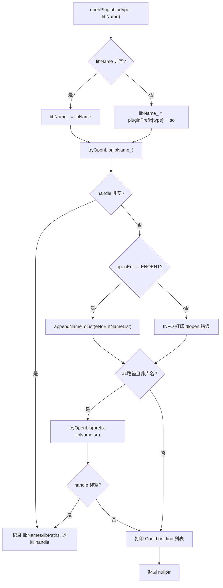
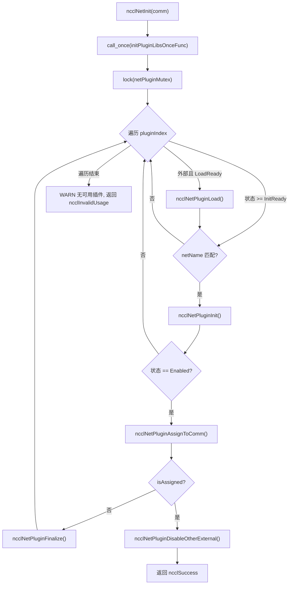
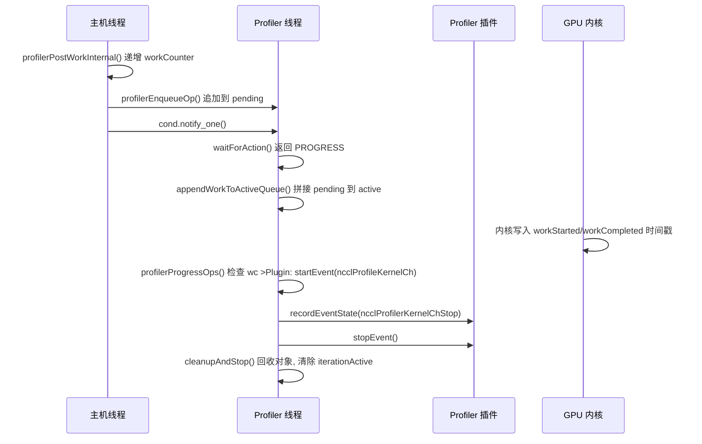

# Kapitel 16: Plugin-Ökosystem und Umgebungsvariablen: Wie net, tuner, profiler, env das NCCL-Verhalten erweitern

Im vorherigen Kapitel haben wir gesehen, wie NCCL durch RMA und GIN die Kommunikationsfähigkeiten von kollektiven Operationen auf punktuellen Remote-Zugriff erweitert und sogar GPUs direkt Netzwerkanfragen initiieren lässt. Diese Evolution hin zu neuer Hardware und Szenarien mit niedriger Latenz stellt höhere Anforderungen an die Flexibilität der Kommunikations-Engine: Wenn für jede Anpassung an ein neues Netzwerk, eine neue Tuning-Strategie oder ein neues Erfassungstool der Kerncode neu kompiliert werden müsste, könnte NCCL mit den Ökosystemveränderungen nicht Schritt halten. Dieses Kapitel zerlegt die Verzeichnisse src/plugin und plugins und beantwortet eine Kernfrage: Wie kann NCCL Netzwerk-Backends, Tuning-Strategien, Performance-Collectors und Konfigurationsquellen ersetzen, ohne den Kerncode neu zu kompilieren.

# 16.1 Plugin-Loader: Wie plugin_open.cc eine .so in ein nutzbares Backend verwandelt

## Intuitives Modell

Stellen Sie sich`plugin_open.cc`als den „Personalvermittler" von NCCL vor: Er hat eine Stellenliste (NET, GIN, RMA, TUNER, PROFILER, ENV), wobei jede Stelle einem Kandidatenbibliotheksnamen entspricht. Wenn NCCL eine Person für eine Stelle benötigt, sucht der Vermittler in fester Reihenfolge auf dem Arbeitsmarkt (dem dynamischen Linker) nach jemandem, schließt bei Erfolg einen Vertrag (`dlopen`), und wenn nicht, notiert er „diese Person existiert nicht" und gibt schließlich ein Handle zurück. Ohne diese Vermittlungsschicht könnte NCCL das Netzwerk-Backend nur fest in die Binärdatei einprogrammieren, und jeder Netzwerkkartenhersteller, der sich integrieren möchte, müsste den NCCL-Quellcode ändern – genau diese Katastrophe soll das Plugin-System beseitigen.

## Datenstrukturen und Speicherlayout

Der gesamte Zustand des Loaders besteht aus sechs parallelen Arrays, wobei der Index die Plugin-Typ-Enumeration ist:

```
static char* libNames[NUM_LIBS];              // 已加载库的名字
char* ncclPluginLibPaths[NUM_LIBS];           // 库的绝对路径
static void* libHandles[NUM_LIBS];            // dlopen 返回的句柄
static const char* pluginNames[NUM_LIBS];     // 日志用的人类可读名
static const char* pluginPrefix[NUM_LIBS];    // 库名前缀
static const char* pluginFallback[NUM_LIBS];  // 找不到时的提示
static unsigned long subsys[NUM_LIBS];        // 日志子系统位掩码
```

Die Indizes dieser sieben Arrays müssen strikt ausgerichtet sein,`pluginNames[type]`、`pluginPrefix[type]`、`subsys[type]`beschreibt denselben Plugin-Typ.[FACT:src/plugin/plugin_open.cc:18-29]definiert`NUM_LIBS = 6`, die Typreihenfolge ist`{"NET", "GIN", "RMA", "TUNER", "PROFILER", "ENV"}`, das Präfix ist`{"libnccl-net", "libnccl-gin", "libnccl-rma", "libnccl-tuner", "libnccl-profiler", "libnccl-env"}`。

> **[Design Inference & Architectural Trade-offs]**
> Hier werden parallele Arrays anstelle eines Struct-Arrays verwendet, damit die einzelne Funktion`openPluginLib`gleichzeitig sechs Plugin-Typen bedienen kann – der Typ dient nur als Index, die Logik wird vollständig wiederverwendet. Der Preis dafür ist, dass beim Hinzufügen eines neuen Plugin-Typs sechs Arrays synchron geändert werden müssen, und der Compiler kann nicht prüfen, ob eine Änderung vergessen wurde.

`subsys`Das Array bestimmt die Log-Zuordnung: NET/GIN/RMA hängen alle an`NCCL_INIT | NCCL_NET`, TUNER hängt an`NCCL_INIT | NCCL_TUNING`, PROFILER hängt nur an`NCCL_INIT`, ENV hängt an`NCCL_INIT | NCCL_ENV`。[FACT:src/plugin/plugin_open.cc:26-29]So sieht man bei`NCCL_DEBUG_SUBSYS=NET`nur die Logs der Netzwerk-Plugins und wird nicht in Tuning-Logs ertränkt.

## Step-by-Step Walkthrough: Die vollständige Reise eines`ncclOpenNetPluginLib("mlx5")`

Angenommen, der Benutzer setzt`NCCL_NET_PLUGIN=mlx5`, ruft NCCL bei der Initialisierung`ncclOpenNetPluginLib("mlx5")`auf, was direkt an`openPluginLib(ncclPluginTypeNet, "mlx5")`。[FACT:src/plugin/plugin_open.cc:132-134]

**weiterleitet.**Erster Schritt: Konstruktion des Kandidatenbibliotheksnamens.`libName`Da ein nicht-leerer`snprintf(libName_, MAX_STR_LEN, "%s", libName)`übergeben wurde, wird der`libName_`-Zweig genommen,`"mlx5"`。[FACT:src/plugin/plugin_open.cc:85-89]wird zu`.so`Beachten Sie, dass dies zu diesem Zeitpunkt noch kein gültiger Bibliotheksdateiname ist – es fehlt sowohl das Präfix als auch das

**-Suffix.** `tryOpenLib("mlx5", ...)`Zweiter Schritt: Erster Öffnungsversuch.[FACT:src/plugin/plugin_open.cc:91]wird aufgerufen.`tryOpenLib`Nach dem Eintritt in`name`wird zuerst geprüft, ob`STATIC_PLUGIN`leer oder die Länge null ist, dann gibt es einen speziellen Zweig: Wenn der Name mit`name`beginnt, wird`nullptr`。[FACT:src/plugin/plugin_open.cc:37-39]Dies ist der Sentinel für Plugins, die statisch in NCCL gelinkt werden –`dlopen(nullptr)`unter Linux wird das Handle des Hauptprogramms zurückgegeben, wodurch`dlsym`die Plugin-Symbole in der Symboltabelle des Hauptprogramms gefunden werden können.

Danach wird`ncclOsDlopen(name)`。[FACT:src/plugin/plugin_open.cc:41]aufgerufen, weil`"mlx5"`weder ein Pfad noch ein gültiger Bibliotheksname ist,`dlopen`wird fehlschlagen. Nach dem Fehlschlag nimmt der Code den`ncclOsDlerror()`Fehlerstring und führt eine feine Unterscheidung durch: Wenn der Fehlerstring sowohl`name`als auch`"No such file or directory"`enthält, wird`*err`auf`ENOENT`。[FACT:src/plugin/plugin_open.cc:42-55]gesetzt. Der Sinn dieser Unterscheidung liegt darin, „Datei existiert überhaupt nicht" von „Datei existiert, aber Laden fehlgeschlagen" zu trennen – Ersteres bedeutet nur, dass der Kandidatenname falsch ist, und der nächste Kandidatenname sollte stillschweigend versucht werden; Letzteres ist ein echter Fehler und sollte protokolliert werden.

**Dritter Schritt: Behandlung nach dem ersten Fehlschlag.**Zurück zu`openPluginLib`，`libHandles[type]`ist leer, und`openErr == ENOENT`, also wird`"mlx5"`angehängt an`eNoEntNameList`。[FACT:src/plugin/plugin_open.cc:97-101]Diese Liste wird schließlich zu einer Logzeile „Could not find: mlx5 libnccl-net-mlx5.so" zusammengesetzt.

**Vierter Schritt: Zweiter Versuch – Präfix hinzufügen.**Der Code prüft,`libName`ob es weder ein Pfad ist (enthält kein`/`) noch ein Bibliotheksname (beginnt nicht mit`lib`, endet nicht mit`.so`).[FACT:src/plugin/plugin_open.cc:105-107] `"mlx5"`Die Bedingung ist erfüllt, also wird`"libnccl-net-mlx5.so"`zusammengesetzt und erneut versucht.[FACT:src/plugin/plugin_open.cc:108]Diesmal`dlopen`erfolgreich,`libHandles[type]`wird zugewiesen,`libNames[type]`zeichnet den Bibliotheksnamen auf,`ncclPluginLibPaths[type]`erhält über`getLibPath`den absoluten Pfad, und die Funktion gibt das Handle zurück.[FACT:src/plugin/plugin_open.cc:110-115]

**Fünfter Schritt: Absoluten Pfad erhalten.** `getLibPath`Unter Linux wird mit`dlinfo(handle, RTLD_DI_LINKMAP, &lm)`abgerufen`link_map`, dann`strdup(lm->l_name)`。[FACT:src/plugin/plugin_open.cc:65-69]Dieser Pfad erscheint in allen nachfolgenden Logs und lässt den Benutzer auf einen Blick erkennen, welche Datei tatsächlich geladen wurde – bei der Fehlersuche in der Produktionsumgebung, „warum das falsche Plugin geladen wurde", ist diese Logzeile der erste Tatort.

Der gesamte Entscheidungsfluss ist wie folgt:



## Designüberlegungen und Produktions-Fallstricke

> **[Design Inference & Architectural Trade-offs]**
> **Die Reihenfolge der Kandidatennamen ist die Priorität.**Zuerst wird der vom Benutzer angegebene reine Name versucht, dann der Name mit Präfix. Das bedeutet, wenn das aktuelle Verzeichnis zufällig eine Datei namens`mlx5`enthält, wird diese bevorzugt geladen – dies ist eine potenzielle Sicherheitsfläche; in Produktionsumgebungen sollte vermieden werden, ausführbare Dateien mit demselben Namen wie das Plugin in`LD_LIBRARY_PATH`abzulegen.

**`STATIC_PLUGIN`Die Semantik von**Wenn`NCCL_NET_PLUGIN=STATIC_PLUGIN`, setzt`tryOpenLib`den Namen auf leer,`dlopen(nullptr)`öffnet das Hauptprogramm,`dlsym`sucht Symbole wie`ncclNet_v12`aus der Symboltabelle des Hauptprogramms.[FACT:src/plugin/plugin_open.cc:37-39]Dies erlaubt, das Plugin statisch in die NCCL-Binary zu linken, wodurch der Aufwand entfällt,`.so`zu deployen, auf Kosten des Verlusts der Laufzeitaustauschfähigkeit.

**Referenzzählung und Entladen.** `ncclClosePluginLib`Nur wenn`libHandles[type] == handle`, wird tatsächlich`dlclose`, und Pfad und Name werden geleert.[FACT:src/plugin/plugin_open.cc:176-186]Dieser Gleichheitsvergleich verhindert, dass versehentlich ein bereits ersetztes Handle geschlossen wird. GIN- und RMA-Plugins verwenden über`ncclGetGinPluginLib`/`ncclGetNetPluginLib`das Handle der NET-Bibliothek wieder, indem sie erneut`dlopen`denselben Bibliotheksnamen aufrufen, um die Referenzzählung zu erhöhen.[FACT:src/plugin/plugin_open.cc:156-164]Dies ist die Referenzzählungssemantik von`dlopen`– dieselbe Bibliothek wird zweimal geöffnet, und es braucht`dlclose`zweimal, um sie tatsächlich zu entladen.

# 16.2 net.cc: Zustandsmaschine und Lebenszyklus des Netzwerk-Plugins

## Intuitives Modell

`net.cc`ist das „Dispatch-Zentrum" des Netzwerk-Plugins. Es verwaltet ein Array von Plugin-Bibliotheken, jede mit eigenem Zustand (nicht geladen, Laden fehlgeschlagen, zu laden, zu initialisieren, aktiviert). Wenn eine neue Kommunikationsdomäne (Communicator) entsteht, durchläuft das Dispatch-Zentrum alle Kandidaten-Plugins, versucht sie nacheinander zu initialisieren, und das erste erfolgreiche wird dieser Kommunikationsdomäne „zugewiesen", alle anderen externen Plugins werden deaktiviert. Ohne diese Zustandsmaschine könnte NCCL diese realen Probleme nicht bewältigen: „Plugin geladen, aber Gerät nicht verfügbar", „welches wird gewählt, wenn mehrere Plugins koexistieren", „wie wird beim Zerstören der Kommunikationsdomäne sicher entladen".

## Datenstrukturen und Speicherlayout

Die Kernstruktur ist`netPluginLib_t`：

| Feld | Typ | Bedeutung |
| --- | --- | --- |
| `name` | `char[255]` | Plugin-Bibliotheksname |
| `dlHandle` | `void*` | dlopen-Handle |
| `ncclNet` | `ncclNet_t*` | Netzwerkfunktionstabelle |
| `ncclNetVer` | `int` | Netzwerk-API-Versionsnummer |
| `ncclCollNet` | `ncclCollNet_t*` | Kollektivkommunikations-Offload-Funktionstabelle |
| `ncclNetPluginState` | Enum | Netzwerk-Plugin-Zustand |
| `ncclCollNetPluginState` | Enum | CollNet-Plugin-Zustand |
| `ncclNetPluginRefCount` | `int` | Referenzzählung |
| `netPhysDevs`/`netVirtDevs` | `int` | Anzahl physischer/virtueller Geräte |
| `collNetPhysDevs`/`collNetVirtDevs` | `int` | Anzahl der CollNet-Geräte |

[FACT:src/plugin/net.cc:63-76]definiert diese Felder. Beachten Sie, dass`ncclNet`und`ncclCollNet`zwei getrennte Funktionstabellen sind, und die Zustände ebenfalls zwei getrennte Enums – ein Plugin kann Netzwerkfunktionalität bereitstellen, aber kein CollNet-Offload.

Das Zustands-Enum hat fünf Werte:`Disabled = -2`(Initialisierung fehlgeschlagen),`LoadFailed = -1`(Laden fehlgeschlagen),`LoadReady = 0`(zu laden),`InitReady = 1`(geladen, zu initialisieren),`Enabled = 2`(aktiviert).[FACT:src/plugin/net.cc:54-60]verwendet negative Zahlen für Fehlerzustände, sodass ein Vergleich wie „Zustand >= InitReady" natürlich „mindestens geladen" ausdrücken kann.

Der globale Zustand besteht aus drei Variablen:`pluginCount`zeichnet die Gesamtzahl der Plugins auf,`netPluginLibs[NCCL_NET_MAX_PLUGINS]`ist das Plugin-Array,`netPluginMutex`schützt den konkurrierenden Zugriff,`initPluginLibsOnceFlag`stellt sicher, dass die Initialisierung nur einmal erfolgt.[FACT:src/plugin/net.cc:78-81]

## Step-by-Step Walkthrough: Die vollständige Reise eines`ncclNetInit(comm)`

**Erster Schritt: Einmalige Initialisierung.** `std::call_once(initPluginLibsOnceFlag, initPluginLibsOnceFunc)`stellt sicher, dass die Plugin-Liste nur einmal aufgebaut wird.[FACT:src/plugin/net.cc:360] `initPluginLibsOnceFunc`liest die`NCCL_NET_PLUGIN`Umgebungsvariable; wenn nicht gesetzt, wird standardmäßig`"libnccl-net.so"`hinzugefügt, dann werden zwei eingebaute Plugins registriert`ncclNetIb`und`ncclNetSocket`。[FACT:src/plugin/net.cc:288-340]

Die Umgebungsvariablen-Analyse verwendet`strtok_r`und teilt nach Kommas auf, unterstützt mehrere Plugin-Namen.[FACT:src/plugin/net.cc:303-324]hat eine Kapazitätsprüfung: Die Anzahl externer Plugins darf`NCCL_NET_MAX_PLUGINS - NCCL_NET_NUM_INTERNAL_PLUGINS`nicht überschreiten, der Überschuss wird ignoriert und protokolliert.[FACT:src/plugin/net.cc:307-311]Eingebaute Plugins sind fest 2 (IB und Socket), also maximal`NCCL_NET_MAX_PLUGINS - 2`externe Plugins.

**Zweiter Schritt: Gesperrtes Durchlaufen.** `std::lock_guard<std::mutex> lock(netPluginMutex)`schützt den gesamten Durchlaufprozess.[FACT:src/plugin/net.cc:361]Für jeden Plugin-Index wird zuerst geprüft, ob es ein externes Plugin ist und sich im Zustand`LoadReady`befindet; wenn ja, wird`ncclNetPluginLoad`。[FACT:src/plugin/net.cc:364-367]

**aufgerufen. Dritter Schritt: Plugin laden.** `ncclNetPluginLoad`ruft`ncclOpenNetPluginLib`auf, um das Handle zu erhalten, dann werden von hoher zu niedriger Version nacheinander`getNcclNet_v12`bis`getNcclNet_v6`versucht; die erste Version, die etwas zurückgibt, wird übernommen.[FACT:src/plugin/net.cc:103-112]Das Versions-Array`ncclNetVersion`und das Funktionszeiger-Array`getNcclNet`sind in absteigender Reihenfolge angeordnet, um bevorzugt die neueste API zu verwenden.[FACT:src/plugin/net.cc:41-43]

Wenn keine Version`ncclNet`erhalten kann, ist diese Bibliothek kein gültiges Netzwerk-Plugin. Nun wird geprüft, ob`NCCL_NET_PLUGIN`explizit gesetzt ist: Wenn ja, wird mit`ATTN`-Level gewarnt (der Benutzer hat es ausdrücklich verlangt, aber es ist fehlgeschlagen); wenn nicht, wird mit`INFO`Ebene (nur Standardversuch schlägt fehl).[FACT:src/plugin/net.cc:115-125]Diese Unterscheidung ist wichtig – wenn die explizite Konfiguration des Benutzers fehlschlägt, muss er es sehen.

**Vierter Schritt: Plugin initialisieren.**Zurück zu`ncclNetInit`, für den Status`>= InitReady`und Namensübereinstimmung`comm->config.netName`das Plugin aufrufen`ncclNetPluginInit`。[FACT:src/plugin/net.cc:369-372] `ncclNetPluginInit`zwei Dinge tun: die`init`-Funktion des Plugins aufrufen, um den Kommunikationsdomänen-Kontext aufzubauen, und bei der ersten Initialisierung`devices`aufrufen, um die Geräteanzahl zu ermitteln.[FACT:src/plugin/net.cc:186-236]

Beachten Sie die Aufrufbedingung von`init`:`pluginLib->ncclNetPluginState >= ncclNetPluginStateInitReady`。[FACT:src/plugin/net.cc:190]Der Kommentar stellt klar: „Jede neue Kommunikationsdomäne muss init aufrufen, um den korrekten Kontext zu setzen."[FACT:src/plugin/net.cc:189]Aber die Geräteerkennung erfolgt nur bei`== InitReady`einmal.[FACT:src/plugin/net.cc:201]Diese Unterscheidung – „init wird jedes Mal aufgerufen, devices nur einmal" – ist eine Leistungsoptimierung: Die Geräteerkennung kann sehr langsam sein, aber der Kontext muss für jede Kommunikationsdomäne unabhängig sein.

**Fünfter Schritt: Zuweisung und Deaktivierung.**Nach erfolgreicher Initialisierung`ncclNetPluginAssignToComm`aufrufen, was das`ncclNet`des Plugins`comm->ncclNet`zuweist, den Referenzzähler erhöht und`comm->netPluginIndex`。[FACT:src/plugin/net.cc:238-255]setzt. Nach erfolgreicher Zuweisung sofort`ncclNetPluginDisableOtherExternal`aufrufen, um alle anderen externen Plugins zu deaktivieren.[FACT:src/plugin/net.cc:377-380]

> **[Design Inference & Architectural Trade-offs]**
> Die Deaktivierungslogik hat eine entscheidende Bedingung: Nur wenn das zugewiesene Plugin ein externes Plugin ist (`pluginIndex >= pluginCount - NCCL_NET_NUM_INTERNAL_PLUGINS`), werden andere externe Plugins deaktiviert.[FACT:src/plugin/net.cc:257-259]Wenn ein integriertes IB-Plugin zugewiesen wird, bleiben externe Plugins unverändert – dies lässt Auswahlmöglichkeiten für nachfolgende Kommunikationsdomänen.



## Nebenläufigkeitskontrolle und Hardware-Interaktion

`netPluginMutex`schützt alle Lese- und Schreibzugriffe auf`netPluginLibs`.`ncclNetInit`、`ncclNetFinalize`werden alle gesperrt.[FACT:src/plugin/net.cc:361][FACT:src/plugin/net.cc:411-416]Aber`ncclNetGetDevCount`und andere Funktionskommentare besagen: „Keine Sperre erforderlich, da der Aufrufer bereits innerhalb der Sperre von`ncclTopoGetSystem`ist."[FACT:src/plugin/net.cc:418-429]Dies ist eine Konvention, bei der „die Sperre vom oberen Layer gehalten wird", was den Overhead verschachtelter Sperren reduziert, aber auf Kosten der Einhaltung der Konvention durch den Aufrufer.

`ncclGpuGdrSupport`zeigt die direkte Interaktion zwischen Plugin und Hardware: Es weist einen 2MB GPU-Puffer zu, baut über das`listen`/`connect`/`accept`des Plugins eine Loopback-Verbindung auf und versucht dann,`regMr`zu registrieren, um GPU-Speicher zu registrieren.[FACT:src/plugin/net.cc:464-535]Wenn die Registrierung erfolgreich ist, unterstützt die Netzwerkkarte GPUDirect RDMA. Dieses Erkennungsergebnis wird in`gdrSupportMatrix[32]`zwischengespeichert, indiziert nach CUDA-Gerätenummer.[FACT:src/plugin/net.cc:478-480]

> **[Design Inference & Architectural Trade-offs]**
> Beachten Sie, dass`gdrSupportMatrix`von`static`ist und kommunikationsdomänenübergreifend geteilt wird.[FACT:src/plugin/net.cc:478]Dies bedeutet, dass mehrere Kommunikationsdomänen innerhalb desselben Prozesses das Erkennungsergebnis wiederverwenden, um wiederholte teure Erkennungen zu vermeiden. Aber die Array-Größe ist auf 32 fest codiert – Maschinen mit mehr als 32 GPUs führen zu einem Überlauf. Dies ist eine implizite Obergrenzen-Annahme.

## Produktions-Fallstricke vermeiden

**Falle eins: Plugin lädt erfolgreich, aber Geräteanzahl ist null.** `ncclNetPluginInit`Prüfen Sie`devices(&ndev) != ncclSuccess || ndev <= 0`, dann wird zum Fehlerzweig gesprungen.[FACT:src/plugin/net.cc:202]Nach dem Fehler`finalize`aufrufen, um den aufgebauten Kontext zu bereinigen, die Geräteanzahl auf`NCCL_UNDEF_DEV_COUNT`zurücksetzen und den Status auf`Disabled`。[FACT:src/plugin/net.cc:229-234]setzen. Wenn diese Bereinigung nicht durchgeführt wird, sehen nachfolgende Kommunikationsdomänen ein Plugin, das „initialisiert, aber ohne Geräte" ist, was zu schwer diagnostizierbaren Fehlern führt.

> **[Design Inference & Architectural Trade-offs]**
> **Falle zwei:`init`erfolgreich, aber`devices`schlägt fehl.**Der Code verwendet das`initCompleted`-Flag, um zu verfolgen, ob`init`erfolgreich war.[FACT:src/plugin/net.cc:178-184][FACT:src/plugin/net.cc:198]Im Fehlerzweig wird nur dann`initCompleted`aufgerufen, wenn`finalize`。[FACT:src/plugin/net.cc:230]wahr ist. Dies verhindert den Aufruf von`finalize`auf einem nicht initialisierten Kontext – viele Plugins`finalize`prüfen keine Nullzeiger, und ein fehlerhafter Aufruf führt zum Absturz.

**Falle drei: Referenzzählung beim Zerstören der Kommunikationsdomäne.** `ncclNetPluginFinalize`Zuerst das`finalize`des Plugins aufrufen, dann den Referenzzähler dekrementieren, und schließlich die Bibliothek entladen, wenn der Referenzzähler null erreicht und es ein externes Plugin ist.[FACT:src/plugin/net.cc:342-355] `ncclNetPluginUnload`Prüfen Sie, ob`dlHandle`nicht null ist und der Referenzzähler null ist, erst dann wirklich`dlclose`。[FACT:src/plugin/net.cc:84-101]. Nach dem Entladen Felder zurücksetzen, aber`name`beibehalten, um es beim erneuten Laden wiederzuverwenden.[FACT:src/plugin/net.cc:84-101]

# 16.3 tuner.cc und profiler.cc: Unterschiedliche Verträge für Strategie-Plugins und Beobachtungs-Plugins

## Intuitives Modell

Tuner-Plugins sind wie „Routenpräferenzeinstellungen in einer Navigationssoftware" – sie ändern nicht, wie das Auto fährt, sondern nur, welche Route gewählt wird. Profiler-Plugins sind wie „Dashcams" – sie greifen nicht ins Fahren ein, sondern zeichnen auf, was passiert ist. Gemeinsam ist beiden, dass sie über Funktionstabellen eingebunden werden. Der Unterschied besteht darin, dass Tuner ein leichtgewichtiges Strategieobjekt ist – „eine Instanz pro Kommunikationsdomäne" – während Profiler einen separaten Thread benötigt, um die von der GPU erzeugten Ereignisse asynchron zu konsumieren.

## tuner.cc: Minimalistisches globales Singleton

Der Zustand des Tuners ist extrem einfach: ein Mutex, ein Referenzzähler, ein Bibliothekshandle, ein Symbolzeiger, eine Statusvariable.[FACT:src/plugin/tuner.cc:24-37]Kein Plugin-Array, keine Koexistenz mehrerer Plugins – global gibt es nur einen Tuner.

`ncclTunerPluginLoad`Die Logik ist „beim ersten Mal laden, danach wiederverwenden": Wenn der Status`LoadSuccess`ist, direkt das Symbol`comm->tuner`zuweisen und den Referenzzähler erhöhen.[FACT:src/plugin/tuner.cc:53-57]Andernfalls die Umgebungsvariable`NCCL_TUNER_PLUGIN`lesen; wenn sie`"none"`ist, direkt fehlschlagen.[FACT:src/plugin/tuner.cc:59-63]

> **[Design Inference & Architectural Trade-offs]**
> Versionsaushandlung von v6 auf v2 herunter, einzeln versuchen.[FACT:src/plugin/tuner.cc:75-87]Beachten Sie, dass es hier kein v1 gibt – die tuner-API hat erst ab v2 eine stabile Funktionstabellenstruktur.

> **[Design Inference & Architectural Trade-offs]**
> Ein interessantes Detail: Wenn`ncclOpenTunerPluginLib`leer zurückgibt, versucht der Code`ncclGetNetPluginLib(ncclPluginTypeTuner)`。[FACT:src/plugin/tuner.cc:65-70]. Dies bedeutet, dass der Tuner in der net-Plugin-Bibliothek verpackt sein kann – dies reduziert die Bereitstellungskomplexität, eine`.so`bietet gleichzeitig Netzwerk- und Tuning-Funktionen.

## profiler.cc: Asynchroner Ereignis-Konsumthread

Profiler ist das komplexeste Plugin in diesem Kapitel, da es die von der GPU asynchron erzeugten Ereignisse verarbeiten muss. Die Kernstruktur ist`ncclProfilerThread`：

| Feld | Typ | Zweck |
| --- | --- | --- |
| `thread` | `std::thread` | Konsumthread |
| `mutex` | `std::mutex` | schützt die Warteschlange |
| `cond` | `condition_variable` | weckt bei neuer Arbeit |
| `condIterationInactive` | `condition_variable` | wartet auf das Ende der Iteration |
| `stop` | `int` | Stopp-Flag |
| `refCount` | `int` | Referenzzähler der Kommunikationsdomäne |
| `cudaDev` | `int` | gebundenes CUDA-Gerät |
| `abortFlag` | `volatile uint32_t*` | Abbruch-Flag |
| `iterationActive` | `bool` | ob gerade iteriert wird |
| `pending`/`pendingTail` | verkettete Liste | ausstehende Arbeit |
| `active`/`activeTail` | verkettete Liste | in Bearbeitung befindliche Arbeit |
| `opStack`/`opPool` | Speicherpool | Arbeitsobjekt-Zuweisung |
| `inflight`/`maxInflightSeen`/`maxInflight` | `size_t` | Backpressure-Beobachtung |
| `droppedOps` | `uint64_t` | Zähler für fehlgeschlagene Zuweisungen |

[FACT:src/plugin/profiler.cc:38-69]definiert diese Struktur. Beachten Sie, dass`pending`und`active`zwei unabhängige verkettete Listen sind: Der Produzent hängt an`pending`an, der Konsumthread fügt innerhalb der Sperre`pending`an`active`an und durchläuft dann außerhalb der Sperre`active`。[FACT:src/plugin/profiler.cc:56-59]

`iterationActive`. Das Flag ist entscheidend für die Nebenläufigkeitskorrektheit: Der Konsumthread setzt es innerhalb der Sperre auf`true`, gibt dann die Sperre frei, um den Plugin-Callback aufzurufen. Der Zerstörungsthread muss warten, bis dieses Flag wieder zu`false`um den Kommunikationsdomänenstatus abzubauen.[FACT:src/plugin/profiler.cc:52-55]

## Schritt-für-Schritt-Durchlauf: Erzeugung und Verbrauch eines KernelCh-Ereignisses

**Erster Schritt: Einreihung auf Host-Seite.**Wenn der Kernel-Plan übermittelt wird,`ncclProfilerPostPlanWork`werden die im Plan enthaltenen Sammelaufgaben durchlaufen, und für jede aktivierte`ncclProfileKernelCh`Aufgabe wird entsprechend des Kanalbereichs`profilerPostWorkInternal`。[FACT:src/plugin/profiler.cc:1315-1331]

`profilerPostWorkInternal`aufgerufen, wobei zuerst`comm->profiler.workCounter[channelId]`inkrementiert und dann`profilerEnqueueOp`。[FACT:src/plugin/profiler.cc:1259-1266]aufgerufen wird. Der Kommentar betont, dass diese Inkrementierung „bei jedem Aufruf genau einmal erfolgen muss, selbst wenn die Zuweisung fehlschlägt“, um die Synchronisation mit dem Gerätekernel aufrechtzuerhalten.[FACT:src/plugin/profiler.cc:1259-1266]

**Zweiter Schritt: Arbeitsplatzobjekt zuweisen.** `profilerEnqueueOp`Innerhalb der Sperre wird aus dem Speicherpool`ncclProfilerWorkOp`zugewiesen und mit Kanalnummer, Arbeitszähler, Aktivierungsmaske, Aufgabenereignis-Handle, Kommunikationsdomänenkontext usw. befüllt.[FACT:src/plugin/profiler.cc:1199-1223]Bei fehlgeschlagener Zuweisung wird`droppedOps`inkrementiert und protokolliert, aber**nicht**zurückgesetzt`workCounter`– dies ist entscheidend für die Synchronisation mit dem Gerät.[FACT:src/plugin/profiler.cc:1202-1207]

Nach erfolgreicher Zuweisung wird das Objekt an das Ende der`pending`verlinkten Liste angehängt,`inflight`inkrementiert,`maxInflightSeen`aktualisiert und der Verbraucherthread aufgeweckt.[FACT:src/plugin/profiler.cc:1225-1239]

**Dritter Schritt: Verbraucherthread wartet.** `ncclProfilerThreadFunc`In einer Schleife wird`waitForAction`。[FACT:src/plugin/profiler.cc:1074-1077] `waitForAction`aufgerufen, um innerhalb der Sperre auf die Bedingungsvariable zu warten, bis`pending`oder`active`nicht leer ist oder ein Stopp-/Abbruchsignal empfangen wird.[FACT:src/plugin/profiler.cc:1017-1031]

Nach dem Aufwecken wird`appendWorkToActiveQueue`aufgerufen, um`pending`an das Ende von`active`anzuhängen,`iterationActive = true`zu setzen und`NCCL_PROFILER_THREAD_PROGRESS`。[FACT:src/plugin/profiler.cc:1017-1031]

**zurückzugeben. Vierter Schritt: Arbeit verarbeiten.** `profilerProgressOps`Außerhalb**der Sperre**wird die`active`verlinkte Liste durchlaufen.[FACT:src/plugin/profiler.cc:958-999]Für jedes Arbeitsplatzobjekt wird geprüft, ob das Gerät bereits den Startzeitstempel geschrieben hat:`wc <= op->workStarted[ch].data[slot].counter`。[FACT:src/plugin/profiler.cc:972]Beachten Sie, dass`<=`statt`==`verwendet wird, da das Gerät`MAX_PROFILER_EVENTS_PER_CHANNEL`Slots umlaufen kann und das Gerät den Slot möglicherweise bereits überschrieben hat, wenn der Host zurückliegt.[FACT:src/plugin/profiler.cc:969-971]

Wenn die Startbedingung erfüllt ist, wird`ncclProfilerStartKernelChEvent`aufgerufen, um das Plugin zu benachrichtigen.[FACT:src/plugin/profiler.cc:973]Dann wird die Abschlussbedingung geprüft; wenn sie erfüllt ist, wird zuerst das Phasenereignis ausgelöst und dann`ncclProfilerStopKernelChEvent`。[FACT:src/plugin/profiler.cc:978-985]

aufgerufen. Abgeschlossene Arbeitsplatzobjekte werden aus der verlinkten Liste entfernt und in die`recycled`Liste gesammelt.[FACT:src/plugin/profiler.cc:987-991]

**Fünfter Schritt: Rückgewinnung und Veröffentlichung.** `cleanupAndStop`Innerhalb der Sperre wird die`recycled`Liste zurückgewonnen, ein neues`activeTail`veröffentlicht,`iterationActive`gelöscht und Wartende benachrichtigt.[FACT:src/plugin/profiler.cc:1036-1050]



## Nebenläufigkeitskontrolle und Backpressure

`NCCL_PROFILER_DEFAULT_MAX_INFLIGHT`ist definiert als`MAXCHANNELS * MAX_PROFILER_EVENTS_PER_CHANNEL * 4`。[FACT:src/plugin/profiler.cc:32-32]Dies ist eine „weiche Obergrenze“ – wird sie überschritten, wird die Einreihung nicht verhindert, sondern nur protokolliert.[FACT:src/plugin/profiler.cc:1233-1238]Der Kommentar erklärt, dass die Einreihung beibehalten wird, damit KernelCh-Ereignisse mit ihren übergeordneten Aufgabenereignissen gepaart werden können.[FACT:src/plugin/profiler.cc:32-32]

Die Protokollierung wird durch Zweierpotenzen ausgelöst:`(pt->inflight & (pt->inflight - 1)) == 0`。[FACT:src/plugin/profiler.cc:1233]Dies stellt sicher, dass nur protokolliert wird, wenn inflight 1, 2, 4, 8... beträgt, um Bildschirmflut zu vermeiden.

Die Backoff-Strategie des Verbraucherthreads befindet sich in`updateProgressInterval`: Bei Fortschritt wird sofort erneut versucht, bei fehlendem Fortschritt wird von 1 Mikrosekunde an verdoppelt, mit einer Obergrenze von 10 Mikrosekunden.[FACT:src/plugin/profiler.cc:1054-1057]Dieses Design balanciert Latenz und CPU-Auslastung.

## Leitfaden zur Vermeidung von Fallstricken in der Produktion

**Fallstrick eins: Arbeitslecks beim Zerstören.** `ncclProfilerThreadDestroy`Zuerst wird gewartet, bis`iterationActive`falsch wird, dann wird`profilerPurgeByContext`aufgerufen, um alle ausstehenden Arbeiten zu löschen, die auf diesen Kommunikationsdomänenkontext verweisen.[FACT:src/plugin/profiler.cc:1162-1169]Wenn diese Bereinigung nicht durchgeführt wird, erhält der Plugin-Callback einen Zeiger auf den zerstörten Kontext, was zu einem Use-after-free führt.

**Fallstrick zwei: Entleerung beim Stoppen.**Wenn ein Stoppsignal empfangen wird, aber`active`nicht leer ist, wird`NCCL_PROFILER_THREAD_CLEANUP_AND_STOP`，`cleanupAndStop`zurückgegeben, wobei der`drainStuck`Parameter wahr ist, und alle verbleibenden Arbeiten direkt zurückgewonnen.[FACT:src/plugin/profiler.cc:1029][FACT:src/plugin/profiler.cc:1036-1050]Der Kommentar besagt, dass die Kernel dieser Arbeiten niemals ausgeführt werden, daher werden sie direkt verworfen.[FACT:src/plugin/profiler.cc:1034-1035]

**Fallstrick drei: CUDA-Gerätebindung.**Beim Start des Verbraucherthreads wird`cudaSetDevice(pt->cudaDev)`。[FACT:src/plugin/profiler.cc:1054-1057]aufgerufen. Der Kommentar erklärt: Der Thread selbst liest nur host-fixierten Speicher, aber Plugins könnten kontextabhängige Treiberaufrufe durchführen, daher defensive Bindung.[FACT:src/plugin/profiler.cc:1054-1057]Bei fehlgeschlagener Bindung wird nur protokolliert, nicht abgebrochen, da der Thread selbst nicht von CUDA abhängt.[FACT:src/plugin/profiler.cc:1065-1070]

# 16.4 Offizielle Beispiele: Implementierungsschwerpunkte von google-fastsocket und google-CoMMA

## Intuitives Modell

Die offiziellen Beispiele sind „Referenzimplementierungen“ der Plugin-API.`google-fastsocket`Zeigt, wie der Kernel-TCP durch einen User-Space-Netzwerkstack ersetzt wird;`google-CoMMA`Zeigt, wie ein Profiler-Plugin implementiert wird, um Kommunikationsleistung zu erfassen. Ihre Existenz beweist, dass die Plugin-API ausreichend ausdrucksstark ist, um reale Anforderungen abzubilden.

## google-fastsocket: Ersetzen des Netzwerk-Backends

> **[Design Inference & Architectural Trade-offs]**
> FastSocket ist ein von Google open-sourced User-Space-Netzwerkstack, der den Kernel-TCP/IP-Stack über die`AF_FABRIC`Adressfamilie umgeht. Als NCCL-Netzwerk-Plugin muss es alle Funktionen von`ncclNet_t`implementieren:`init`、`devices`、`getProperties`、`listen`、`connect`、`accept`、`regMr`、`isend`、`irecv`、`test`、`closeSend`usw.

Der entscheidende Implementierungspunkt liegt in dem von`getProperties`zurückgegebenen`ptrSupport`: Wenn FastSocket GPUDirect RDMA unterstützt, sollte es auf`NCCL_PTR_HOST|NCCL_PTR_CUDA`gesetzt werden; andernfalls kann es nur auf`NCCL_PTR_HOST`gesetzt werden, und NCCL kopiert die GPU-Daten vor dem Senden in den Host-Speicher.[FACT:plugins/net/README.md:245-245]

`connect`Der „nicht-blockierende“ Vertrag von`accept`und`sendComm`/`recvComm`ist die zentrale Herausforderung der Plugin-Implementierung: Sie müssen sofort zurückkehren,`NULL`auf[FACT:plugins/net/README.md:299-311]setzen und NCCL wiederholt aufrufen lassen, bis es erfolgreich ist.

## Dies erfordert, dass das Plugin intern eine Verbindungszustandsmaschine pflegt und den zeitaufwändigen Handshake im Hintergrund durchführt.

> **[Design Inference & Architectural Trade-offs]**
> 〔Designableitung und Architekturabwägungen〕`ncclProfiler_t`CoMMA (Collective Memory Monitoring Agent) ist ein Kommunikationsleistungs-Collector von Google. Als Profiler-Plugin implementiert es die`init`、`finalize`、`startEvent`、`stopEvent`、`recordEventState`。

`init`Funktionstabelle:`ncclProfilerEventMask`Empfängt den[FACT:src/plugin/profiler.cc:341]Zeiger; das Plugin wählt durch Schreiben in diese Maske aus, welche Ereignisse abonniert werden.[FACT:src/plugin/profiler.cc:285-307]

`startEvent`Die von NCCL unterstützten Ereignistypen umfassen Group, Coll, P2p, ProxyOp, ProxyStep, ProxyCtrl, KernelCh, KernelPhase, NetPlugin usw.`stopEvent`Gibt ein Ereignis-Handle zurück; nachfolgende`recordEventState`und[FACT:src/plugin/profiler.cc:392][FACT:src/plugin/profiler.cc:400-407]verwenden dieses Handle, um Ereignisse zu verknüpfen.

## Das Plugin kann das Handle verwenden, um seinen eigenen Zustand zu speichern und Ereignispaarung sowie Zeitmessung zu implementieren.

**Designüberlegungen**Weil die net-API geräteseitigen Code betrifft (`ncclNetDeviceHandle`), führt eine Versionsinkompatibilität zu einem Kernel-Absturz; tuner/profiler hingegen sind rein hostseitig, eine Versionsinkompatibilität führt höchstens zu fehlender Funktionalität.[FACT:src/plugin/net.cc:153-176]zeigt,`ncclNetCheckDeviceVersion`wie man Gerätetyp und -version prüft und bei Nichtübereinstimmung`ncclInternalError`。

**Warum benötigt der profiler einen eigenen Thread?**Weil profiler-Callbacks blockieren können (z. B. Dateien schreiben, Netzwerkanfragen senden), was den Kommunikationsablauf verlangsamt, wenn sie im Host-Thread aufgerufen werden.[FACT:src/plugin/profiler.cc:950-952]Der Kommentar sagt ausdrücklich: „Plugin-Callbacks können blockieren, daher dürfen sie nicht unter gehaltenem Lock aufgerufen werden."

# 16.5 Produktions-Fallstricke und Fehlerwiederherstellungskette

## Fallstrick 1: Plugin-Versionsinkompatibilität führt zum Kernel-Absturz

`ncclNetCheckDeviceVersion`Prüft`props.netDeviceType`und`props.netDeviceVersion`。[FACT:src/plugin/net.cc:153-176]Wenn die vom Plugin gemeldete`NCCL_NET_DEVICE_UNPACK`-Version nicht mit der beim Kompilieren von NCCL verwendeten`NCCL_NET_DEVICE_UNPACK_VERSION`übereinstimmt, wird`ncclInternalError`zurückgegeben und eine Warnung ausgegeben.[FACT:src/plugin/net.cc:153-176]Diese Prüfung wird in`ncclNetPluginAssignToComm`aufgerufen; bei Fehlschlag wird das Plugin keiner Kommunikationsdomäne zugewiesen.[FACT:src/plugin/net.cc:241]

**Wiederherstellungskette**: Versionsinkompatibilität →`ncclNetCheckDeviceVersion`gibt Fehler zurück →`ncclNetPluginAssignToComm`gibt`isAssigned = false` → `ncclNetInit`zurück, versucht das nächste Plugin → möglicherweise Rückfall auf das eingebaute Socket-Plugin.

## Fallstrick 2: profiler-Thread kann nicht beendet werden

Wenn das profiler-Plugin in`stopEvent`blockiert, hängt der Konsum-Thread in`profilerProgressOps`fest,`iterationActive`ist immer wahr,`ncclProfilerThreadDestroy`wartet ewig.[FACT:src/plugin/profiler.cc:1166]Dies ist ein reales Deadlock-Risiko.

> **[Design Inference & Architectural Trade-offs]**
> **Wiederherstellungskette**：`comm->abortFlag`wird gesetzt →`waitForAction`erkennt Abbruch → gibt`CLEANUP_AND_STOP` → `cleanupAndStop`zurück, leert die Warteschlange.[FACT:src/plugin/profiler.cc:1017-1031]Wenn der Thread jedoch bereits im Plugin-Callback feststeckt, kann das Abbruch-Flag ihn nicht unterbrechen — dies liegt in der Verantwortung des Plugin-Implementierers; der Callback muss ein Timeout haben.

## Fallstrick 3: Referenzzählungs-Leck beim tuner-Plugin

`ncclTunerPluginLoad`Bei Erfolg wird`tunerPluginRefCount`。[FACT:src/plugin/tuner.cc:98] `ncclTunerPluginUnload`inkrementiert; wenn`comm->tunerPluginLoaded`wahr ist, wird dekrementiert.[FACT:src/plugin/tuner.cc:111-123]Wenn eine Kommunikationsdomäne einen tuner geladen hat, aber bei der Zerstörung`tunerPluginLoaded`versehentlich auf null gesetzt wird, erreicht die Referenzzählung nie null und die Plugin-Bibliothek wird nie entladen.

# Gedanken und Selbsttest dieses Kapitels

F1: Wenn man in`ncclNetPluginLoad`die Schleife „von hoher zu niedriger Version versuchen" in „nur die höchste Version versuchen" ändert, in welchem Szenario würde dann ein ursprünglich nutzbares Plugin nicht mehr geladen werden können?

**Referenzanalyse**: Siehe[FACT:src/plugin/net.cc:108-112]. Die Schleife durchläuft`NCCL_NET_VERSION_COUNT`Versionen, von v12 absteigend bis v6; die erste, die etwas zurückgibt, wird übernommen. Wenn man nur v12 versucht, würde ein altes Plugin, das nur v11 implementiert, nicht geladen werden können.

> **[Design Inference & Architectural Trade-offs]**
> Dieses Design dient der Abwärtskompatibilität: Nachdem der NCCL-Kern auf Unterstützung für v12 aktualisiert wurde, kann er weiterhin Plugins laden, die nur v11 bereitstellen. Plugin-Autoren werden ermutigt, Symbole für mehrere Versionen bereitzustellen (siehe[FACT:plugins/net/README.md:35-37]), sodass dasselbe`.so`mehrere NCCL-Versionen bedienen kann.

Wenn man den Degradationsversuch entfernt, wären alte Plugins nach einem NCCL-Upgrade plötzlich nicht mehr verfügbar, und man könnte nur auf das eingebaute Socket-Plugin zurückfallen, was die Leistung stark verschlechtert. Genau das ist der Sinn der Versionsaushandlung.

F2: In`profilerProgressOps`, wenn man`wc <= op->workStarted[ch].data[slot].counter`in`wc == op->workStarted[ch].data[slot].counter`ändert, in welchem Szenario mit hoher Nebenläufigkeit würde das Ereignis dann nie ausgelöst werden?

**Referenzanalyse**: Siehe[FACT:src/plugin/profiler.cc:969-972]. Der Kommentar erklärt ausdrücklich, dass das Gerät`MAX_PROFILER_EVENTS_PER_CHANNEL`Slots umlaufend verwendet. Wenn der Host langsamer konsumiert als das Gerät produziert, kann das Gerät bereits mit Zähler`wc + N`den Slot`wc % MAX_PROFILER_EVENTS_PER_CHANNEL`。

überschrieben haben. Zu diesem Zeitpunkt ist der Wert von`op->workStarted[ch].data[slot].counter``wc + N`, während`op->workCounter``wc`ist. Mit`==`würde die Prüfung fehlschlagen, das Ereignis würde nie ausgelöst, das Arbeitsobjekt bliebe für immer in der`active`-Liste,`inflight`würde nur wachsen und nie schrumpfen, bis schließlich der Speicherpool erschöpft ist.

Mit`<=`hingegen lässt sich dieser Fall korrekt behandeln: Solange der vom Gerät geschriebene Zähler nicht kleiner als der erwartete Wert ist, gilt das Ereignis als bereit. Dies ist eine typische Korrektheitsbedingung für einen „Producer-Consumer-Ringpuffer".

F3: Wenn man in`ncclProfilerThreadDestroy`die Schleife entfernt, die darauf wartet, dass`iterationActive`falsch wird, in welcher zeitlichen Abfolge würde dann das profiler-Plugin auf einen bereits freigegebenen Kommunikationsdomänen-Kontext zugreifen?

**Referenzanalyse**: Siehe[FACT:src/plugin/profiler.cc:1162-1166]. Der Kommentar erklärt, dass`ncclProfilerPluginFinalize`unmittelbar nach der Rückkehr von`ncclProfilerThreadDestroy`den`profilerContext`。

der Kommunikationsdomäne zerstört. Wenn der Konsum-Thread in`profilerProgressOps`den Plugin-Callback aufruft, übergibt er`op->profilerContext`。[FACT:src/plugin/profiler.cc:938]. Wenn der Zerstörungs-Thread nicht darauf wartet, dass`iterationActive`falsch wird, sondern zurückkehrt,`ncclProfilerPluginFinalize`wird der Kontext freigegeben, während der Konsum-Thread möglicherweise gerade mit diesem Kontext das Plugin aufruft — use-after-free.

`iterationActive`Das Handshake-Protokoll von`true`lautet: Der Konsum-Thread setzt unter dem Lock`false`。[FACT:src/plugin/profiler.cc:1028][FACT:src/plugin/profiler.cc:1054-1057]und gibt dann das Lock frei, um das Plugin aufzurufen; der Zerstörungs-Thread wartet unter dem Lock darauf, dass es wieder

wird. Dieses Protokoll stellt sicher, dass der Kontext während des Plugin-Callbacks stets gültig bleibt.

Nach Entfernen des Wartens könnte der Zerstörungs-Thread zurückkehren, sobald der Konsum-Thread gerade in den Plugin-Callback eintritt, sodass das Plugin einen hängenden Zeiger erhält. Dies ist ein typisches Rennen zwischen „Lebensdauer und nebenläufigem Zugriff".

Das Plugin-System hat NCCL von geschlossen zu offen gemacht: Netzwerk-Backends, Tuning-Strategien, Performance-Collector und Konfigurationsquellen lassen sich ersetzen, ohne den Kerncode zu ändern. Aber Plugins führen auch neue Fehlerflächen ein — Versionsinkompatibilität, Lebensdauer-Rennen, Referenzzählungs-Leck. Im nächsten Kapitel betreten wir das RAS- und Diagnose-Subsystem und sehen, wie NCCL Fehler erkennt, den Fortschritt überwacht und bei lang laufenden Trainingsaufgaben Selbstheilung erreicht.
