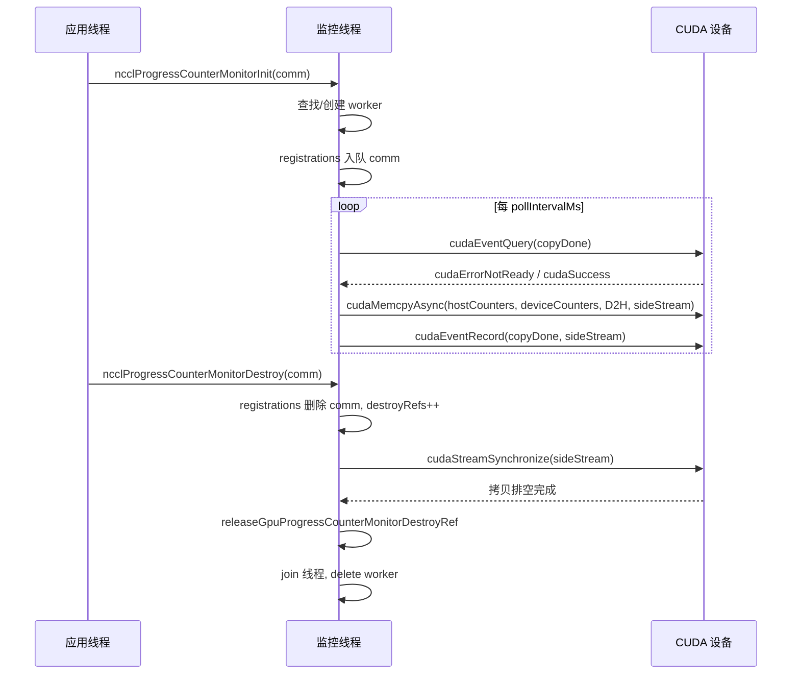
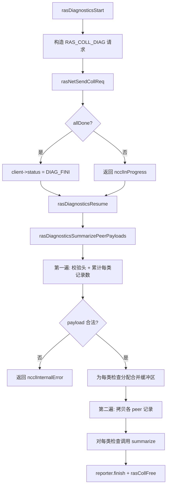

# Kapitel 17: RAS-Mechanismen und Fehlertoleranz: Link-Fehlererkennung, Heartbeat und graceful Degradation

Im vorherigen Kapitel haben wir gesehen, wie das Plugin-System den Kernkommunikationspfad klar von austauschbaren Komponenten abgrenzt, sodass Netzwerk-Backends, Optimierungsstrategien und Performance-Collector ersetzt werden können, ohne den Kerncode zu ändern. Doch Erweiterbarkeit ist nur eine Dimension der Produktionstauglichkeit. Eine ebenso anspruchsvolle Frage ist: Wenn ein AllReduce bereits 72 Stunden läuft und die Netzwerkkarte einer Maschine still und leise ausfällt, wie kann NCCL das erkennen, isolieren und fortfahren? Das RAS-Subsystem ist genau die Wasserscheide, an der NCCL von „läuft durch“ zu „produktionstauglich“ wird. Dieses Kapitel zerlegt das Design hinter Fehlererkennung, Fortschrittsüberwachung und Selbstheilungsmechanismen.

# 17.1 RAS-Gesamtsteuerung: Ein globaler Koordinator mit einem RAS-Thread pro Prozess

## Intuitives Modell

Stellen Sie sich RAS als den „Wachraum“ des gesamten Jobs vor. Jeder NCCL-Prozess (jeder Rank) eröffnet bei der Initialisierung einen Wachraum, in dem ein dedizierter Thread sitzt. Die Erstellung, Zerstörung und Diagnoseanfragen aller Kommunikationsdomänen (Communicator) müssen zuerst beim Wachraum registriert werden; die Wachräume wiederum melden sich gegenseitig über ein separates RAS-Netzwerk, „wer noch lebt und wer bereits tot ist“.

Ohne diesen Wachraum könnte NCCL Fehler nur über Timeouts des Kommunikationspfads selbst erkennen – doch Timeouts auf dem Kommunikationspfad sind sowohl langsam als auch anfällig für Fehlurteile (ein einzelnes Netzwerkzittern könnte als Knotenausfall gewertet werden). RAS trennt die „Fehlerwahrnehmung“ von der Datenebene in die Steuerungsebene ab und verwendet unabhängige, leichte Heartbeats und Diagnosekanäle, um den Gesundheitszustand zu bestimmen.

## Datenstrukturen und Speicherlayout

Der Kernzustand von RAS ist über die globalen Variablen von`ras.cc`verstreut; wir zerlegen sie einzeln:

| Variable | Typ | Zweck |
| --- | --- | --- |
| `rasInitMutex` | `std::mutex` | Schützt die Initialisierung des RAS-Singletons |
| `rasInitialized` | `bool` | Ob bereits initialisiert |
| `rasInitRefCount` | `int` | Referenzzähler, entspricht der Anzahl aktiver Communicatoren |
| `rasNetListeningSocket` | `struct ncclSocket` | RAS-Netzwerk-Listening-Socket |
| `rasNotificationPipe[2]` | `ncclSocketPairDescriptor` | Benachrichtigungspipe vom lokalen Thread → RAS-Thread |
| `rasPfds` | `struct pollfd*` | Poll-Array der Haupt-Ereignisschleife |
| `ncclComms` | `struct ncclComm**` | Array aller Communicator-Zeiger |

[FACT:src/ras/ras.cc:49-61]definiert diese globalen Zustände. Beachten Sie:`rasInitRefCount`verwendet`ncclAtomicRefCountIncrement`zum Erhöhen/Verringern von[FACT:src/ras/ras.cc:129], während`rasInitialized`ein normales bool mit Double-Checked Locking zum Schutz von[FACT:src/ras/ras.cc:103-105]verwendet – dies ist das typische „einmal initialisieren, danach nur lesen“-Muster.

`ncclComms`Die Allokationsstrategie des`RAS_INCREMENT * 8`-Arrays ist bemerkenswert: Es wächst nicht bei Bedarf, sondern bei jeder Erweiterung um[FACT:src/ras/ras.cc:139-140](d. h. 32 Slots)`nullptr`. Im Array sind[FACT:src/ras/ras.cc:135-137]。

## -Lücken erlaubt (beim Zerstören eines Communicators wird der Eintrag geleert); ein neuer Communicator verwendet die erste Lücke wieder

**Szenariogetriebener Walkthrough: Von der Communicator-Initialisierung bis zum Start des RAS-Threads`ncclRasCommInit`Erster Schritt:**wird aufgerufen.[FACT:src/ras/ras.cc:101]Dies ist die erste RAS-Funktion, die bei jeder Communicator-Initialisierung aufgerufen wird`rasInitialized`. Sie prüft zuerst

, und falls nicht initialisiert, tritt sie in den kritischen Abschnitt ein:`rasNetListeningSocket`1. Initialisiere[FACT:src/ras/ras.cc:108-109]

mit der Adresse der Bootstrap-Netzwerkschnittstelle, Port auf 0 gesetzt, damit der Kernel zufällig zuweist[FACT:src/ras/ras.cc:113]

2. Lausche auf diesem Socket[FACT:src/ras/ras.cc:118]

3. Erstelle die lokale Benachrichtigungspipe[FACT:src/ras/ras.cc:120]

4. Initialisiere das Diagnose-Subsystem`rasThreadMain`5. Starte den[FACT:src/ras/ras.cc:121]

-Thread`atexit(rasTerminate)`6. Registriere[FACT:src/ras/ras.cc:126]

**, um beim Prozessende aufzuräumen**Zweiter Schritt: Communicator registrieren.`comm`Unabhängig davon, ob erstmalig initialisiert wird, wird der`ncclComms`-Zeiger in das[FACT:src/ras/ras.cc:142]-Array geschrieben`ncclCommsSorted`, und[FACT:src/ras/ras.cc:143]wird auf false gesetzt

**– da sich die Array-Reihenfolge geändert hat, ist die vorherige Sortierung ungültig.**Dritter Schritt: Port zurückschreiben.`rasNetListeningSocket.addr`Die Funktion kopiert am Ende`myRank->addr` [FACT:src/ras/ras.cc:146](einschließlich des vom Kernel zugewiesenen Ports) zurück nach

## , sodass der Aufrufer weiß, auf welchem Port das RAS-Netzwerk lauscht.

`rasThreadMain`Haupt-Ereignisschleife: poll-getriebenes Multiplexing[FACT:src/ras/ras.cc:633]ist das Herz des RAS-Threads[FACT:src/ras/ras.cc:641-652]. Zuerst werden drei feste fds registriert: die Benachrichtigungspipe, der RAS-Netzwerk-Listening-Socket und der Client-Listening-Socket

```
for (int64_t nextWakeup = 0;;) {
  // 计算超时
  timeoutMs = min(..., 1000);
  nEvents = poll(rasPfds, nRasPfds, timeoutMs);
  // 处理事件
  for (pollIdx...) { ... }
  // 处理各类超时
  rasSocksHandleTimeouts(now, &nextWakeup);
  rasConnsHandleTimeouts(now, &nextWakeup);
  rasNetHandleTimeouts(now, &nextWakeup);
  rasCollsHandleTimeouts(now, &nextWakeup);
}
```

[FACT:src/ras/ras.cc:655-728]Kopieren`timeoutMs`zeigt diese Schleife. Beachten Sie:[FACT:src/ras/ras.cc:664]ist hart auf 1000 ms begrenzt`nextWakeup`– selbst wenn

weit entfernt ist, muss jede Sekunde aufgewacht werden, um die Rechtzeitigkeit der Timeout-Prüfung zu gewährleisten.[FACT:src/ras/ras.cc:684-715]Die Ereignisverteilungslogik verwendet den fd-Wert zum Routing`rasLocalHandle`: Handelt es sich um die Benachrichtigungspipe, wird`rasSocketsHead`aufgerufen; handelt es sich um einen Listening-Socket, wird accept ausgeführt; andernfalls werden die`rasClientsHead`- und

## -Listen durchlaufen, um den entsprechenden Socket zu finden und zu verarbeiten.

Lokaler Benachrichtigungsmechanismus: Pipe + feste Struktur`rasNotification`Der lokale NCCL-Thread und der RAS-Thread kommunizieren über ein Socketpair. Die Benachrichtigungsstruktur[FACT:src/ras/ras.cc:35-46]hat eine feste Länge von`static_assert`und verwendet`PIPE_BUF` [FACT:src/ras/ras.cc:47], um sicherzustellen, dass

nicht überschritten wird – dies dient der Gewährleistung der Atomarität von Schreibvorgängen (POSIX garantiert, dass Schreibvorgänge kleiner als PIPE_BUF atomar sind).`rasLocalNotify`Die Sendeseite`rasNotificationMutex`verwendet[FACT:src/ras/ras.cc:224-237], um die Schreibvorgänge mehrerer Benutzerthreads zu serialisieren[FACT:src/ras/ras.cc:224-237], und schreibt dann in einer Schleife, bis alles geschrieben ist`rasLocalHandle`. Die Empfangsseite[FACT:src/ras/ras.cc:247-256]liest ebenfalls in einer Schleife die gesamte Struktur`ncclSystemError` [FACT:src/ras/ras.cc:251-253]。

und gibt bei EOF`RAS_ADD_RANKS`zurück`RAS_RUN_DIAG`Drei Benachrichtigungstypen:`RAS_TERMINATE`(neuer Rank tritt bei),[FACT:src/ras/ras.cc:28-32]。

## (Diagnose ausführen),

(Beenden)[FACT:src/ras/ras_internal.h:110-117]Nachrichtenversand und -empfang: Längenpräfix + inkrementeller Fortschritt`rasConnSendMsg`Das Wire-Format der RAS-Nachrichten ist „4 Byte Länge + Nachrichtenkörper“[FACT:src/ras/ras.cc:362-390]. Beim Senden wird zuerst die Länge und dann der Nachrichtenkörper gesendet`meta->offset`, wobei`rasMsgRecv`den Fortschritt aufzeichnet und teilweises Senden mit Fortsetzung beim nächsten Mal unterstützt. Beim Empfangen wird zuerst die Länge empfangen, dann ein Puffer gemäß der Länge allokiert und schließlich der Nachrichtenkörper empfangen[FACT:src/ras/ras.cc:393-412]。

Hier gibt es ein Detail:`rasMsgAlloc`allokiert die`rasMsgMeta`-Struktur,`msg`das Feld befindet sich am Ende der Struktur und wird über`offsetof`zur Offset-Berechnung ermittelt[FACT:src/ras/ras.cc:313-319]. Beim Freigeben wird umgekehrt berechnet[FACT:src/ras/ras.cc:323-328]. Dieses „Metadaten-vorangestellt"-Layout ermöglicht es Nachrichten, lokale Informationen wie Sendefortschritt und Einreihungszeit mitzuführen, ohne das Wire-Format zu belegen.

## Designüberlegungen

> **[Design Inference & Architectural Trade-offs]**
> **Warum poll statt epoll?**Die O(n)-Komplexität von poll ist im RAS-Szenario akzeptabel – die Anzahl der RAS-Verbindungen ist weit geringer als die der Datenebenen-Verbindungen, und der RAS-Thread selbst ist kein leistungskritischer Pfad. poll bietet zudem bessere Plattformübergreifende Kompatibilität (Windows-Kompatibilität).

> **[Design Inference & Architectural Trade-offs]**
> **Warum Benachrichtigung über eine Pipe statt einer Condition Variable?**Eine Pipe lässt sich nahtlos in die poll-Schleife integrieren, sodass der RAS-Thread einheitlich`poll`auf alle Ereignisquellen warten kann. Bei einer Condition Variable bräuchte man einen zusätzlichen Mechanismus, um poll aufzuwecken.

```mermaid
flowchart TD
    start["rasThreadMain 启动"] --> reg_pipe["注册通知管道 fd"]
    reg_pipe --> reg_net["注册 RAS 网络监听 fd"]
    reg_net --> reg_client["注册客户端监听 fd"]
    reg_client --> poll["poll(rasPfds, timeout check{"nEvents == -1?"}
    check -->|"是且非 EINTR"| log_err["记录 poll 错误并继续"]
    check -->|"否"| dispatch["遍历 revents 分发事件"]
    log_err --> dispatch
    dispatch --> is_pipe{"fd == 通知管道?"}
    is_pipe -->|"是"| local_handle["rasLocalHandle()"]
    is_pipe -->|"否"| is_net{"fd == RAS 监听?"}
    is_net -->|"是"| accept_net["rasNetAcceptNewSocket()"]
    is_net -->|"否"| is_client{"fd == 客户端监听?"}
    is_client -->|"是"| accept_client["rasClientAcceptNewSocket()"]
    is_client -->|"否"| find_sock["遍历 rasSocketsHead 找匹配 socket"]
    find_sock --> sock_loop["rasSockEventLoop(sock, pollIdx)"]
    local_handle --> terminate{"terminate?"}
    terminate -->|"是"| cleanup["rasThreadCleanup() 并退出"]
    terminate -->|"否"| timeouts
    sock_loop --> timeouts["rasSocksHandleTimeouts / rasConnsHandleTimeouts / rasNetHandleTimeouts / rasCollsHandleTimeouts"]
    accept_net --> timeouts
    accept_client --> timeouts
    timeouts --> poll
```

# 17.2 Fortschrittsüberwachung: GPU-Zähler per DMA auf den Host übertragen

## Intuitives Modell

Die Fortschrittsüberwachung gleicht einem „Drehzahlmesser" auf dem Armaturenbrett eines Autos. Sie greift nicht ins Fahren ein (beteiligt sich nicht an der Kommunikation), kopiert aber kontinuierlich die internen Fortschrittszähler der GPU in den Host-Speicher, damit der Host beurteilen kann, ob eine Kommunikationsdomäne hängt. Ohne sie sieht man bei einem hängenden AllReduce nur, dass „das Programm nicht zurückkehrt", weiß aber nicht, ob die GPU rechnet, auf das Netzwerk wartet oder völlig verklemmt ist.

## Datenstrukturen und Speicherlayout

Jedes CUDA-Gerät entspricht einem`ncclGpuProgressCounterMonitor`Arbeitsthread[FACT:src/ras/progress_monitor.cc:35-52]：

| Feld | Typ | Zweck |
| --- | --- | --- |
| `cudaDev` | `int` | Zugewiesene CUDA-Gerätenummer |
| `thread` | `std::thread` | Arbeitsthread |
| `mutex` / `cv` | `std::mutex` / `condition_variable` | Schützt veränderlichen Zustand und weckt auf |
| `running` / `shouldStop` | `bool` | Thread-Lebenszyklus-Flag |
| `copyInFlight` | `bool` | Ob eine DMA-Kopie unterwegs ist |
| `copyStallWarned` | `bool` | Ob für diese Stockung bereits gewarnt wurde |
| `copyStartNs` | `uint64_t` | Startzeit dieser Kopie |
| `sideStream` | `cudaStream_t` | Dedizierter nicht-blockierender Stream |
| `copyDone` | `cudaEvent_t` | Kopierabschluss-Ereignis |
| `warningMutex` | `std::mutex` | Schützt Warnungszeitstempel |
| `lastStaleWarnNs` / `lastErrorWarnNs` | `uint64_t` | Drosselungszeitstempel |
| `destroyRefs` | `int` | Referenzzähler für Zerstörung |
| `registrations` | Intrusive Warteschlange | Liste der bei diesem Gerät registrierten comms |

[FACT:src/ras/progress_monitor.cc:59-62]legt die Sperrreihenfolge fest:`gpuProgressCounterMonitorsMu`vor`ncclGpuProgressCounterMonitor::mutex`. Dies ist eine entscheidende Konvention zur Vermeidung von Deadlocks.

Globales Array`gpuProgressCounterMonitors[kRasMaxCudaDevices]`indiziert nach Gerätenummer[FACT:src/ras/progress_monitor.cc:59-62]。

## Szenariogesteuerter Walkthrough: Eine Zählerkopie

**Erster Schritt: Registrierung.** `ncclProgressCounterMonitorInit`wird aufgerufen[FACT:src/ras/progress_monitor.cc:319]. Falls`deviceCountersBlock`leer ist, direkt zurückkehren (diese comm nimmt nicht an der Überwachung teil)[FACT:src/ras/progress_monitor.cc:323]. Andernfalls innerhalb der globalen Sperre den Worker für dieses Gerät suchen oder erstellen[FACT:src/ras/progress_monitor.cc:328-335], dann die comm in die Warteschlange von`registrations` [FACT:src/ras/progress_monitor.cc:339]。

**einreihen** `createGpuProgressCounterMonitor`Zweiter Schritt: Start des Arbeitsthreads.`cudaSetDevice`erstellt den Worker, setzt`sideStream`（`cudaStreamNonBlocking`, erstellt`copyDone`) und[FACT:src/ras/progress_monitor.cc:280-282]-Ereignis`running`, startet den Thread und wartet bis zu 2000 ms, um zu bestätigen, dass[FACT:src/ras/progress_monitor.cc:287-303]。

**true wird** `progressCounterMonitorLoop`Dritter Schritt: Schleifenkopie.[FACT:src/ras/progress_monitor.cc:97-121]Zuerst Gerät binden, relaxed Stream-Capture-Modus setzen (um die Graph-Capture der Anwendung nicht zu stören)

, dann in die Hauptschleife eintreten:`pollIntervalMs`1. Warten auf[FACT:src/ras/progress_monitor.cc:132-136]

(Standard 1000 ms)`cudaEventQuery`2. Falls die letzte Kopie noch unterwegs ist, mit[FACT:src/ras/progress_monitor.cc:140]prüfen`cudaErrorNotReady`. Falls[FACT:src/ras/progress_monitor.cc:141-154]

und der stale-Schwellenwert (Standard 5000 ms) überschritten ist, eine gedrosselte Warnung ausgeben`cudaMemcpyAsync`3. Über alle registrierten comms iterieren und für jede`deviceCountersBlock`aufrufen, um`hostCountersBlock` [FACT:src/ras/progress_monitor.cc:170-185]

nach`copyDone`zu kopieren`copyInFlight` [FACT:src/ras/progress_monitor.cc:194-202]

## 4. Falls irgendeine Kopie erfolgreich war,

-Ereignis aufzeichnen und`progressCounterMonitorShouldWarn`setzen[FACT:src/ras/progress_monitor.cc:78-87]Nebenläufigkeitskontrolle und Drosselung`warningMutex`Die Warnungsdrosselung wird durch`warnIntervalNs`implementiert`staleWarnSec`: Unter dem Schutz von[FACT:src/ras/progress_monitor.cc:27]prüfen, ob seit der letzten Warnung mehr als

vergangen ist; nur dann aktualisieren und true zurückgeben. Standardmäßig ist[FACT:src/ras/progress_monitor.cc:29]600 Sekunden[FACT:src/ras/progress_monitor.cc:30], d. h. dieselbe Warnungsklasse höchstens einmal alle 10 Minuten.

## Parameter haben untere Grenzwerte: poll-Intervall mindestens 50 ms

`ncclProgressCounterMonitorDestroy`, stale-Schwellenwert mindestens 1000 ms[FACT:src/ras/progress_monitor.cc:352-354]：

. Dies verhindert, dass eine zu aggressive Benutzerkonfiguration die CPU leerlaufen lässt.`registrations`Zerstörung: Referenzzählung + Stream-Synchronisation[FACT:src/ras/progress_monitor.cc:368]

Die Zerstörungslogik von`destroyRefs++`ist eines der raffiniertesten Nebenläufigkeitsdesigns dieses Kapitels`haveDestroyRef` [FACT:src/ras/progress_monitor.cc:371-372]

1. Unter globaler Sperre + Worker-Sperre comm aus`shouldStop` [FACT:src/ras/progress_monitor.cc:373-376]

entfernen`cudaStreamSynchronize(g->sideStream)`2. Falls das Entfernen erfolgreich war,[FACT:src/ras/progress_monitor.cc:393]

und`releaseGpuProgressCounterMonitorDestroyRef`setzen[FACT:src/ras/progress_monitor.cc:219-246]

> **[Design Inference & Architectural Trade-offs]**
> **setzen`destroyRefs`？**4. Nach Freigabe der Sperren`cudaStreamSynchronize`mögliche Kopien ausleeren, die noch auf den comm-Puffer verweisen



## den Referenzzähler dekrementieren; bei Null und leerer Warteschlange den Thread joinen und löschen

**〔Designschlussfolgerungen und Architekturabwägungen〕`cudaSetDevice`Warum wird**benötigt`cudaSetDevice`Weil`shouldStop`außerhalb der Sperre ausgeführt wird und währenddessen ein anderer Thread denselben Worker zerstören könnte. Die Referenzzählung stellt sicher, dass nur der letzte Zerstörer tatsächlich joint und löscht.[FACT:src/ras/progress_monitor.cc:97-107]Kopieren`NCCL_RAS`Produktions-Fallstricke

**Falle 1:**-Fehler führt zum stillen Ausfall der Überwachung.`cudaThreadExchangeStreamCaptureMode(cudaStreamCaptureModeRelaxed)`Falls beim Thread-Start[FACT:src/ras/progress_monitor.cc:110-111]fehlschlägt, setzt der Worker

# und beendet

## , aber die registrierende comm geht weiterhin davon aus, dass die Überwachung läuft. In diesem Fall bleibt der Zählerspiegel dauerhaft veraltet, bis der Init-Phase den Fehler aufdeckt. Bei der Fehlersuche ist im

-Log nach „progress-counter mirrors will remain stale" zu suchen.`nvidia-smi`Falle 2: Graph-Capture-Konflikt.

## Wenn der Überwachungsthread CUDA-APIs aufruft, während die Anwendung Stream-Capture durchführt, wird das Capture-Graph verunreinigt. Der Code umgeht dies mit

, was eine unverzichtbare Schutzmaßnahme ist.`rasDiagnosticsChecks` [FACT:src/ras/diagnostics.cc:63-77]17.3 Diagnose-Framework: Tabellengesteuerte Prüfungsverteilung`collectLocal`(lokale Erfassung) und`summarize`(Zusammenfassung). Insgesamt 11 Prüfungen: GPU-Modell, CUDA-Treiberversion, ECC, NVLink, NCCL-Umgebung, RDMA-Topologie, IOMMU-Modus, ATS, XID/SXID, NVIDIA-Treiberversion, Pfad.

`rasDiagnosticsGetCheck`Führt eine dreifache Validierung durch: ID-Bereich, Tabelleneintrag-ID-Abgleich, Callback nicht null[FACT:src/ras/diagnostics.cc:104-128]. Dies ist defensive Programmierung – um zu verhindern, dass Tabelleneinträge fehlerhaft modifiziert werden und zu Nullzeiger-Aufrufen führen.

## Szenariogetriebener Walkthrough: Der vollständige Lebenszyklus einer Diagnose

**Erster Schritt: Lokales Payload erstellen.** `rasDiagnosticsCollectLocalPeerPayload`Zuerst den Peer-Header schreiben[FACT:src/ras/diagnostics.cc:226-227], dann die Dispatch-Tabelle durchlaufen und für jeden Eintrag`rasDiagnosticsAppendCheckPayload` [FACT:src/ras/diagnostics.cc:229-231]。

`rasDiagnosticsAppendCheckPayload`aufrufen.`collectLocal`aufrufen, um`rasDiagnosticsLocalData`zu erhalten, mit`ncclUniquePtr`die Eigentümerschaft der Records übernehmen[FACT:src/ras/diagnostics.cc:191-192], Metadaten validieren[FACT:src/ras/diagnostics.cc:193], wenn die Anzahl der Datensätze 0 ist, überspringen[FACT:src/ras/diagnostics.cc:194], andernfalls Prüfungs-Header + Datensatzdaten schreiben[FACT:src/ras/diagnostics.cc:196-201]。

**Zweiter Schritt: Kollektivkommunikation initiieren.** `rasDiagnosticsStart`Konstruieren`RAS_COLL_DIAG`Anfrage[FACT:src/ras/diagnostics.cc:532-537], über`rasNetSendCollReq`senden[FACT:src/ras/diagnostics.cc:539], Client-Status auf`RAS_CLIENT_DIAG_FINI` [FACT:src/ras/diagnostics.cc:541]。

**setzen. Dritter Schritt: Antworten zusammenführen.** `rasCollDiagMerge`Die Payloads der einzelnen Peers an den Kollektivpuffer anhängen[FACT:src/ras/diagnostics.cc:310-337]. Beachten Sie, dass umfangreiche Überlaufprüfungen durchgeführt werden: Obergrenze der Peer-Anzahl[FACT:src/ras/diagnostics.cc:320-324], Obergrenze der Gesamtgröße[FACT:src/ras/diagnostics.cc:325-328]。

**. Vierter Schritt: Zusammenfassung.** `rasDiagnosticsSummarizePeerPayloads`Es handelt sich um einen zweifachen Durchlauf[FACT:src/ras/diagnostics.cc:399]：

- . Erster Durchlauf: Jeden Peer-Header und Prüfungs-Header validieren, die Anzahl der Datensätze und Bytes pro Prüfungstyp akkumulieren[FACT:src/ras/diagnostics.cc:418-470]
- , den Zusammenführungspuffer für jeden Prüfungstyp zuweisen[FACT:src/ras/diagnostics.cc:472-476]
- . Zweiter Durchlauf: Die Datensätze der einzelnen Peers in den entsprechenden Puffer kopieren[FACT:src/ras/diagnostics.cc:479-497]
- . Abschließend für jeden Prüfungstyp`summarize` [FACT:src/ras/diagnostics.cc:499-506]

## aufrufen. Client-Status und Abbruch

Der Diagnose-Status befindet sich in`rasDiagnosticsClientState`[FACT:src/ras/diagnostics.cc:242-245], angehängt an`rasClient->diagnostics`.`rasDiagnosticsCancelTarget`Wenn der Client-Socket geschlossen wird, wird der Reporter durch noop ersetzt[FACT:src/ras/diagnostics.cc:286-293], um zu verhindern, dass nach Abschluss der asynchronen Diagnose in einen bereits geschlossenen Socket geschrieben wird[FACT:src/ras/diagnostics.cc:48-52]。

## Designüberlegungen

> **[Design Inference & Architectural Trade-offs]**
> **Warum zwei Durchläufe?**Weil das Payload variabel lang ist und erst im ersten Durchlauf berechnet werden kann, wie groß der Puffer für jeden Prüfungstyp sein muss. Ein einzelner Durchlauf würde entweder dynamisches Wachstum erfordern (mehrfaches realloc) oder eine übermäßig große Vorabzuweisung. Zwei Durchläufe tauschen eine präzise Zuweisung gegen Determinismus.

**Warum der Prüfungs-Header`recordStride`？** [FACT:src/ras/diagnostics.cc:197]enthält: Weil die Datensatzstrukturgrößen verschiedener Prüfungen unterschiedlich sind und bei der Zusammenfassung die Schrittweite bekannt sein muss, um korrekt kopieren und validieren zu können.`rasDiagnosticsAccountCheckRecords`Erzwingt, dass der stride derselben Prüfung konsistent ist[FACT:src/ras/diagnostics.cc:381-385]。



# 17.4 Peer-Verwaltung: Sortiertes Array + Hash-Synchronisation

## Intuitives Modell

`peers.cc`Verwaltet die „Klassenliste". Jeder RAS-Thread speichert eine identische Liste, die die Adresse, PID und verwalteten GPUs jedes NCCL-Prozesses aufzeichnet. Wenn ein neuer Teilnehmer beitritt oder jemand „den Kontakt verliert", werden die Änderungen über das RAS-Netzwerk broadcastet. Die Liste verwendet einen Hash-Wert als Versionsnummer, um eine vollständige Synchronisation bei jedem Mal zu vermeiden.

## Datenstruktur und Speicherlayout

Zwei Kern-Arrays:

- `rasPeers`: Alle bekannten Peers, nach Adresse sortiert[FACT:src/ras/peers.cc:18-19]. Enthält tote Peers.
- `rasDeadPeers`: Adressen toter Peers, separat gespeichert[FACT:src/ras/peers.cc:37-38]。

**Warum werden tote Peers separat gespeichert?** [FACT:src/ras/peers.cc:25-28]Die Kommentare in`rasPeers`erklären es klar:`rasDeadPeers`ist in großem Maßstab im Wesentlichen statisch und sehr groß, während`rasPeers`dynamisch und viel kleiner ist. Die separate Speicherung vermeidet die Übertragung des riesigen

`rasPeerInfo`-Arrays bei jeder Synchronisation.[FACT:src/ras/ras_internal.h:110-117]：

| Struktur | Feld | Typ |
| --- | --- | --- |
| `addr` | `ncclSocketAddress` | Beschreibung |
| `pid` | `ncclPid_t` | Netzwerkadresse (Sortierschlüssel) |
| `cudaDevs` | `uint64_t` | Prozess-ID |
| `nvmlDevs` | `uint64_t` | CUDA-Geräte-Bitmaske (beeinflusst von CUDA_VISIBLE_DEVICES) |
| `hostHash` / `pidHash` | `uint64_t` | NVML-Geräte-Bitmaske (nicht beeinflusst) |

Aus comm extrahiert, commHash subtrahiert, um es kommunikationsdomänenunabhängig zu machen`rasPeersHash`Zwei Hashes`rasDeadPeersHash`und[FACT:src/ras/peers.cc:21][FACT:src/ras/peers.cc:37-38]。

## sind der Kern der Synchronisation

**Szenariogetriebener Walkthrough: Neue Rank tritt bei** `rasRanksConvertToPeers`Erster Schritt: Konvertierung.`rasRankInit`Das`rasPeerInfo` [FACT:src/ras/peers.cc:104]-Array in[FACT:src/ras/peers.cc:114]umwandeln. Zuerst nach Adresse + cudaDev sortieren[FACT:src/ras/peers.cc:127-130], leere Adressen überspringen[FACT:src/ras/peers.cc:134-139]。

**, Prozesse mit mehreren GPUs an derselben Adresse zusammenführen (Bitmasken-OR)** `rasPeersUpdate`Zweiter Schritt: Lokales Array aktualisieren.[FACT:src/ras/peers.cc:197]Ist der komplexeste Merge-Algorithmus in diesem Kapitel[FACT:src/ras/peers.cc:202-229]. Er berechnet zunächst die neue Array-Größe[FACT:src/ras/peers.cc:244-361], dann werden zwei sortierte Arrays zusammengeführt`rankPeers`. Kernpunkt: Während des Merges wird[FACT:src/ras/peers.cc:301-308]in ein „Diff" umgewandelt – nur die tatsächlich neu hinzugefügten GPU-Bits bleiben erhalten[FACT:src/ras/peers.cc:393-402], und schließlich werden Einträge ohne Beitrag entfernt

**. Dadurch wird die zu broadcastende Datenmenge minimiert.** `rasNetUpdatePeers`Dritter Schritt: Verbreitung.`rasNextLink`Entlang`rasPrevLink`und[FACT:src/ras/peers.cc:430-450]in zwei Richtungen propagieren[FACT:src/ras/peers.cc:443-444]。

**, dann Verbindungen neu aufbauen** `rasConnSendPeersUpdate`Vierter Schritt: Update senden.[FACT:src/ras/peers.cc:500-508]Zuerst den Hash prüfen`peersHash`: Wenn der Peer den aktuellen Hash bereits kennt, überspringen. Die Nachricht enthält`deadPeersHash` [FACT:src/ras/peers.cc:521-524]und[FACT:src/ras/peers.cc:608-653]。

## . Wenn nach dem Merge beim Empfänger der Hash immer noch nicht übereinstimmt, wird

`rasPeerDeclareDead`zurückgesendet. Deklaration und Verbreitung toter Peers`rasDeadPeers`Die Adresse zu[FACT:src/ras/peers.cc:793-812]。`rasMsgHandleBCDeadPeer`hinzufügen, nach dem Sortieren den Hash neu berechnen[FACT:src/ras/ras.cc:578-591]. Verarbeitet broadcastete Tote-Peer-Nachrichten`*pDone = true`: Wenn lokal unbekannt, Verbindung trennen und als tot deklarieren, andernfalls markieren

`rasDeadPeersUpdate`. Erneutes Broadcasten stoppen.[FACT:src/ras/peers.cc:838-893]Verwendet Mergesort, um alte und neue Tote-Peer-Listen zusammenzuführen`memmove`. Beachten Sie, dass`memcpy` [FACT:src/ras/peers.cc:855]anstelle von

## verwendet wird, da Quelle und Ziel überlappen können.

`rasLinkReinitConns`Verbindungsneuaufbau: Vermeidung von Doppelverbindungs-Races[FACT:src/ras/peers.cc:680]Nach dem Peer-Update werden die Link-Verbindungen neu aufgebaut[FACT:src/ras/peers.cc:706-711]. Kernstrategie: Die Verbindung von der Seite mit der kleineren Adresse initiieren

`rasLinkCalculatePeer`, um zu vermeiden, dass beide Seiten gleichzeitig initiieren und Duplikate entstehen.[FACT:src/ras/peers.cc:743-785]Den nächsten Peer-Index berechnen, tote Peers überspringen[FACT:src/ras/peers.cc:743-785]. Für Fallback gibt es eine zusätzliche Optimierung: Peers überspringen, die sich im selben Knoten wie der vorherige Fallback befinden

## , um bei einem vollständigen Knotenausfall nicht einzeln warten zu müssen.

**Produktions-Fallstricke** `ncclSocketsCompare`Falle 1: Byte-Reihenfolge-Falle beim Adressvergleich.[FACT:src/ras/peers.cc:960-990]Sortierung nach Adressfamilie → Adresse → Port`memcmp`. Die Kommentare weisen darauf hin, dass nicht einfach[FACT:src/ras/peers.cc:957-959]die gesamte Struktur verglichen werden kann, da die Speicherlayout-Reihenfolge von der erwarteten Sortierreihenfolge abweicht

**Fallstrick 2:`myPeerIdx`ungültig.**Wenn das Array wächst, wird`myPeerIdx`geändert[FACT:src/ras/peers.cc:22-23]。`rasPeersUpdate`während des Zusammenführungsprozesses synchron aktualisiert[FACT:src/ras/peers.cc:312][FACT:src/ras/peers.cc:358], und bei fehlgeschlagenem Update wird auf die binäre Suche zurückgegriffen[FACT:src/ras/peers.cc:374-388]。

> **[Design Inference & Architectural Trade-offs]**
> **Fallstrick 3: Hash-Kollisionen führen zu Synchronisierungsauslassungen.**Der Hash wird nur für die Entscheidung „ob synchronisiert werden muss" verwendet, nicht für die Korrektheit . Selbst wenn eine Hash-Kollision dazu führt, dass die Synchronisierung übersprungen wird, wird der nachfolgende keep-alive-Austausch den Hash dennoch mitführen und letztendlich konvergieren.

```mermaid
flowchart LR
    subgraph 输入
        ranks["rasRankInit[]"]
    end
    subgraph 转换
        convert["rasRanksConvertToPeers: 排序+合并同地址"]
        rankPeers["rasPeerInfo[] (rankPeers)"]
    end
    subgraph 合并
        update["rasPeersUpdate: 归并到 rasPeers"]
        diff["rankPeers 改造为差异"]
        hash["重算 rasPeersHash"]
    end
    subgraph 传播
        send["rasConnSendPeersUpdate: 带哈希"]
        recv["rasMsgHandlePeersUpdate: 合并+回发"]
        reinit["rasLinkReinitConns: 重建连接"]
    end
    ranks --> convert --> rankPeers --> update
    update --> diff --> hash
    hash --> send --> recv --> reinit
```



# 17.5 Designüberlegungen: Die Grenze zwischen RAS und dem Hauptkommunikationspfad

Die zentralste Designentscheidung des RAS-Subsystems ist**die vollständige Entkopplung von der Datenebene**. RAS-Threads sind an keiner Datenübertragung der kollektiven Kommunikation beteiligt; sie erledigen nur drei Dinge: die Peer-Liste pflegen, die Verbindungsgesundheit überwachen und Diagnosen ausführen. Diese Entkopplung bringt mehrere Vorteile:

1. **Fehlerisolierung**: Ein Absturz des RAS-Threads führt nicht direkt zu einem Kommunikationsausfall (obwohl die Fähigkeit zur Fehlererkennung verloren geht)

2. **Keine Leistungseinbußen**: Der Heartbeat- und Synchronisierungsverkehr von RAS läuft über ein separates Netzwerk und belegt keine Bandbreite der Datenebene

3. **Beobachtbarkeit**: Diagnosen und Monitoring können parallel zur laufenden Kommunikation ausgeführt werden

Der Preis ist**die Zustandskonsistenz**als Herausforderung: Der von RAS gesehene comm-Zustand kann hinter der Datenebene zurückliegen.`ncclRasCommInit`und`ncclRasCommFini`schützen über`ncclCommsMutex`den[FACT:src/ras/ras.cc:77-77], aber RAS-Threads lesen nur einen Snapshot und bieten keine starke Konsistenzgarantie.

Eine weitere zentrale Designentscheidung ist**die Timeout-Schichtung**。`ras_internal.h`definiert einen vollständigen Satz von Timeout-Konstanten[FACT:src/ras/ras_internal.h:214-249]: keep-alive-Intervall 1 Sekunde, Warnschwelle 5 Sekunden, Fehlerschwelle 20 Sekunden, Peer-Todes-Schwelle 60 Sekunden. Diese Schichtung ermöglicht es dem System, bei unterschiedlichen Schweregraden unterschiedliche Maßnahmen zu ergreifen – zuerst warnen, dann eine Ausweichverbindung versuchen und erst zuletzt den Tod erklären.

# 17.6 Zusammenfassung dieses Kapitels

Dieses Kapitel hat die vier Kernmodule des NCCL-RAS-Subsystems analysiert:

- **`ras.cc`**: Singleton-RAS-Thread + poll-Ereignisschleife, empfängt lokale Benachrichtigungen über eine Pipe und tauscht Nachrichten über ein separates Netzwerk mit anderen Ranks aus
- **`progress_monitor.cc`**: Ein Worker-Thread pro Gerät, der GPU-Fortschrittszähler per DMA auf den Host überträgt, mit Drosselungswarnungen und Referenzzählungs-Zerstörung
- **`diagnostics.cc`**: Tabellengesteuertes Prüfungs-Dispatch-Framework, das in zwei Durchläufen die Diagnose-Payloads der einzelnen Ranks zusammenfasst
- **`peers.cc`**: Peer-Listen-Verwaltung mit sortiertem Array + Hash-Synchronisierung; tote Peers werden separat gespeichert, um Bandbreite zu sparen

# Denkanstöße und Selbsttests zu diesem Kapitel

Q1：`rasLocalNotify`serialisiert Schreibvorgänge mit`rasNotificationMutex`, aber`rasLocalHandle`liest ohne entsprechende Sperre. Warum ist das sicher? Wenn man`static_assert(sizeof(struct rasNotification) <= PIPE_BUF)`entfernt, in welchen Szenarien würde es Probleme geben?

**Referenzanalyse**: Die Sicherheit stammt aus der Garantie von POSIX für die Atomarität von Pipe-Schreibvorgängen – Schreibvorgänge kleiner als`PIPE_BUF`sind atomar[FACT:src/ras/ras.cc:47]。`rasLocalNotify`die Schleife schreibt[FACT:src/ras/ras.cc:224-237]wenn ein einzelner Schreibvorgang abgeschlossen werden kann, wird er nicht mit anderen Schreibvorgängen verschränkt.`rasLocalHandle`die Schleife liest[FACT:src/ras/ras.cc:247-256]möglicherweise Teildaten, aber da Schreibvorgänge atomar sind, ist das Gelesene notwendigerweise ein Präfix der vollständigen Nachricht; der nächste Lesevorgang ergänzt den Rest.

Nach dem Entfernen von`static_assert`, wenn`rasNotification`größer als`PIPE_BUF`wird, kann der Schreibvorgang in mehrere nicht-atomare Schreibvorgänge aufgeteilt werden. Wenn zwei Threads gleichzeitig schreiben, können ihre Bytes verschränkt werden, sodass der RAS-Thread fehlerhafte Daten liest, die aus zwei zusammengefügten Benachrichtigungen bestehen.`msg.type`kann von Thread A stammen und`msg.addRanks.ranks`von Thread B, was den Unknown-Type-Zweig von`rasLocalHandle`auslöst[FACT:src/ras/ras.cc:267-269]oder schlimmer, eine Wild-Pointer-Dereferenzierung.

Q2：`ncclProgressCounterMonitorDestroy`wird erst nach dem Freigeben der Sperre ausgeführt`cudaStreamSynchronize` [FACT:src/ras/progress_monitor.cc:381-400]. Was passiert, wenn während der Synchronisierung ein anderer Thread ebenfalls Destroy aufruft, um dieselbe comm zu zerstören?`destroyRefs`Wie lässt sich das Problem verhindern?

**Referenzanalyse**：`destroyRefs`ist eine Referenzzählung, die verhindert, dass der Worker zu früh gelöscht wird. Nachdem der erste Thread die comm gelöscht hat,`destroyRefs++` [FACT:src/ras/progress_monitor.cc:371], zu diesem Zeitpunkt`haveDestroyRef = true`. Wenn der zweite Thread versucht, dieselbe comm zu löschen,`ncclIntruQueueDelete`gibt nullptr zurück (bereits gelöscht),`haveDestroyRef`bleibt false[FACT:src/ras/progress_monitor.cc:368], und Synchronisierung sowie Freigabe werden direkt übersprungen.

Nachdem der erste Thread`cudaStreamSynchronize`abgeschlossen hat, ruft er`releaseGpuProgressCounterMonitorDestroyRef` [FACT:src/ras/progress_monitor.cc:402]auf, dekrementiert`destroyRefs`auf 0, und erst wenn die Registrierungswarteschlange leer ist, wird der Thread tatsächlich gejoint und[FACT:src/ras/progress_monitor.cc:225]。

gelöscht. Wenn es kein`destroyRefs`gäbe, könnte der erste Thread während der Synchronisierung durch`delete g`des zweiten Threads den Worker freigeben, was zu einem Use-after-free führen würde. Beachten Sie, dass`releaseGpuProgressCounterMonitorDestroyRef`unter der globalen Sperre + Worker-Sperre dekrementiert wird[FACT:src/ras/progress_monitor.cc:222-225], um die Atomarität der Prüfung, ob`registrations`leer ist, und von`destroyRefs == 0`zu gewährleisten.

Q3：`rasDiagnosticsSummarizePeerPayloads`validiert beim ersten Durchlauf`checkHeader->payloadBytes != checkHeader->nRecords * checkHeader->recordStride` [FACT:src/ras/diagnostics.cc:451-454]. Wenn ein bösartiger oder beschädigter Peer`recordStride = 0`sendet und`nRecords = 0`, würde diese Validierung durchgehen? Was würde danach passieren?

**Referenzanalyse**：`recordStride <= 0`wird durch die erste Bedingung abgefangen[FACT:src/ras/diagnostics.cc:451], gibt`ncclInternalError`zurück. Daher wird`recordStride = 0`nicht durchgehen.

Aber wenn`recordStride > 0`und`nRecords = 0`, dann`payloadBytes = 0`, und die Validierung geht durch.`rasDiagnosticsAccountCheckRecords`gibt für`nRecords == 0`direkt Erfolg zurück[FACT:src/ras/diagnostics.cc:378], ohne`combined`zu aktualisieren. Bei der späteren Zuweisung wird`recordsBytes == 0`nicht zugewiesen[FACT:src/ras/diagnostics.cc:473], beim Kopieren wird`payloadBytes > 0`als falsch ausgewertet und übersprungen[FACT:src/ras/diagnostics.cc:490]. Letztendlich empfängt`summarize``records = nullptr, recordsBytes = 0`, und die summarize-Implementierungen der einzelnen Prüfungen müssen leere Eingaben verarbeiten.

Das eigentliche Risiko liegt in der Prüfung von`nRecords > INT_MAX / recordStride`[FACT:src/ras/diagnostics.cc:453]– diese verhindert, dass ein Integer-Überlauf die Gleichheitsprüfung umgeht. Ohne diese Prüfung könnte ein Angreifer`nRecords * recordStride`konstruieren, das Produkt läuft auf 0 über, ist gleich`nRecords = 2^31, recordStride = 2`, und nach bestandener Validierung würde`payloadBytes = 0`einen riesigen`rasDiagnosticsAccountCheckRecords`akkumulieren, was bei nachfolgenden Zuweisungen oder Kopiervorgängen zu einem Out-of-Bounds-Zugriff führt.`nRecords`RAS verleiht NCCL während langem Training die Fähigkeit zur Fehlererkennung und Selbstheilung, aber es stützt sich auf ein vom Datenpfad unabhängiges Steuernetzwerk. Im nächsten Kapitel wenden wir uns dem Speicherverwaltungs-Subsystem zu und schauen, wie NCCL durch Allocator, Registrierungs-Cache und Benutzerpuffer-Registrierung die Speicherzuweisung und den RDMA-Registrierungsaufwand optimiert – dies ist die dritte Säule neben Leistung und Zuverlässigkeit.

RAS 让 NCCL 在长时间训练中具备了故障感知与自愈能力，但它依赖的是一套独立于数据面的控制网络。下一章我们将进入内存管理子系统，看 NCCL 如何通过 allocator、注册缓存和用户缓冲区注册来优化显存分配与 RDMA 注册开销——这是性能与可靠性之外的第三个支柱。

Das durchgängige Designprinzip dieses Kapitels lautet: Trennung von Control Plane und Data Plane, Versionierung des Zustands per Hash, geschichtete Timeout-Behandlung und Schutz des Lebenszyklus durch Referenzzählung bei Nebenläufigkeit. Diese Prinzipien ermöglichen es RAS, Fehlererkennung und Selbstheilung zu realisieren, ohne die Kommunikationsleistung zu beeinträchtigen. Ein weiterer entscheidender Stützpfeiler der Kommunikationsleistung – die Speicherverwaltung – erfordert ebenfalls sorgfältige technische Abwägungen: Warum muss Speicher vor der NCCL-Kommunikation registriert werden? Wie beeinflusst der Registrierungs-Cache die Leistung? Im nächsten Kapitel tauchen wir tief in Allocator, Registrierungs-Cache und Benutzerpuffer-Registrierung ein und lüften diese Fragen.
