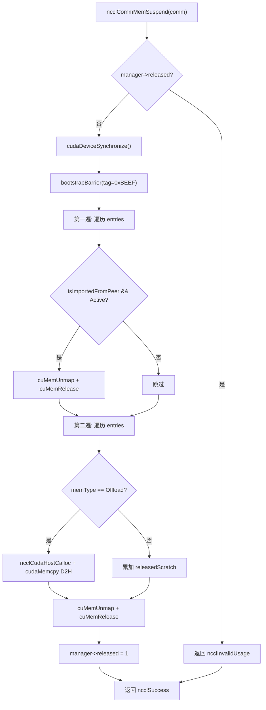
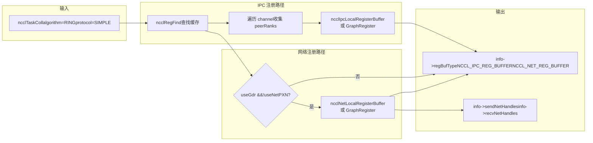
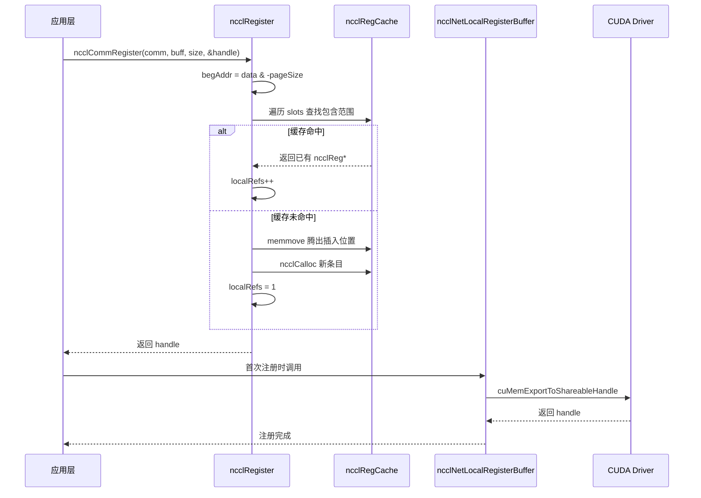

# Kapitel 18: Speicherallokation und VRAM-Verwaltung: Allocator, Registrierungs-Cache und Optimierung der Benutzerregistrierungsspeicher

Im vorherigen Kapitel haben wir gesehen, wie das RAS-Subsystem unabhängig von der Data Plane auf der Control Plane arbeitet, Hashes zur Versionierung verwendet und den Lebenszyklus durch Referenzzählung schützt. Dieses Kapitel betritt die dritte Säule von NCCL – die Speicherverwaltung. Die Obergrenze der Kommunikationsleistung hängt oft nicht vom Algorithmus selbst ab, sondern davon, ob die Daten direkt von der Netzwerkkarte gelesen und geschrieben werden können. NCCL hat hierfür drei Schichten von Mechanismen aufgebaut: Die unterste Schicht verwendet`ncclSpace`und`ncclShadowPool`zur Verwaltung des Adressraums und der Shadow-Objekte, die mittlere Schicht verwendet`ncclMemManager`zur Verfolgung von Import/Export und Suspend/Resume des dynamischen Speichers, und die oberste Schicht verwendet`ncclCommRegister`zur Registrierung von Benutzerpuffern im Cache, um zu vermeiden, dass bei jeder Kommunikation Speicher erneut gepinnt wird. Dieses Kapitel zerlegt diese drei Mechanismen Schicht für Schicht und beantwortet die Fragen „Warum muss Speicher vor der NCCL-Kommunikation registriert werden?“ und „Wie beeinflusst der Registrierungs-Cache die Leistung?“.

# 18.1 ncclSpace: Den Adressraum in abwechselnd volle/leere Segmente aufteilen

## Intuitives Modell

Stellen Sie sich eine unendlich lange Nummerierungslinie für Parkplätze vor, die bei 0 beginnt und sich nach rechts erstreckt. Einige Parkplätze sind belegt (zugewiesen), andere sind frei (nicht zugewiesen).`ncclSpace`ist das „Aufzeichnungsbuch für den Parkplatzstatus“ dieser Nummerierungslinie – es zeichnet nicht jeden Parkplatz auf, sondern nur die „Grenzpunkte, an denen der Status umschlägt“. Ohne dieses Buch müsste NCCL bei der Verwaltung des virtuellen Adressbereichs des symmetrischen Speichers für jedes Byte ein Markierungsbit pflegen, was einen Speicheraufwand proportional zum Adressraum bedeuten würde – völlig inakzeptabel.

## Datenstruktur und Speicherlayout

`ncclSpace`ist extrem minimalistisch definiert[FACT:src/include/allocator.h:20-24]：

```c
struct ncclSpace {
  int count;        // cuts[] 中有效元素个数
  int capacity;     // cuts[] 已分配容量
  int64_t* cuts;    // 升序排列的边界点数组
};
```

Die zentrale Erkenntnis ist in den Quellcode-Kommentaren klar formuliert[FACT:src/allocator.cc:151-153]：`cuts[]`unterteilt die Achse der nicht-negativen ganzen Zahlen in abwechselnd „volle“ und „leere“ Segmente, wobei die Schnittpunkte in aufsteigender Reihenfolge angeordnet sind und das Segment nach dem letzten Schnittpunkt notwendigerweise leer ist (die nicht zugewiesene Front). Daraus lässt sich die Formel ableiten, um zu bestimmen, ob das`i`-te Segment voll ist:

```
isFull(i) = (i%2 != ncuts%2)
```

Die Bedeutung dieser Formel ist: Der Voll-/Leer-Status eines Segments wird gemeinsam durch die „Parität des Segmentindex“ und die „Parität der Gesamtzahl der Schnittpunkte“ bestimmt. Wenn`ncuts`gerade ist, ist das 0-te Segment (vor`cuts[0]`) leer; wenn`ncuts`ungerade ist, ist das 0-te Segment voll. Diese Invariante zieht sich durch das gesamte Modul.

## Schritt-für-Schritt-Durchlauf: Wie eine Allokation cuts[] verändert

Szenario: Initial ist`ncclSpace`leer (`count=0`), Aufruf von`ncclSpaceTryAlloc(a, limit=1000, size=100, align=1, &outOffset)`。

**Erster Schritt: Das erste leere Segment lokalisieren** [FACT:src/allocator.cc:209]。`i = a->count % 2`, zu diesem Zeitpunkt ist`count=0`, also`i=0`, und die Suche beginnt beim 0-ten Segment.

**Zweiter Schritt: Segmentgrenzen berechnen** [FACT:src/allocator.cc:212-213]。`i==0`wenn`lo=0`；`i==a->count`wenn`hi=limit=1000`. Das leere Segment ist also`[0, 1000)`。

**Dritter Schritt: Ausrichten und Kapazität prüfen** [FACT:src/allocator.cc:214-215]。`off = alignUp(0, 1) = 0`，`0 + 100 <= 1000`gilt, Allokation erfolgreich.

**Vierter Schritt: Schnittpunkte einfügen** [FACT:src/allocator.cc:217-223]. Da`i==0`(Einfügung am Kopf), wird der langsame Pfad`insertSegment(a, 0, 0, 100)`。`insertSegment`genommen, an der Stelle`index=0`werden zwei Schnittpunkte eingefügt`lo=0, hi=100` [FACT:src/allocator.cc:172-174], dann wird die „Filterung benachbarter Duplikate“ ausgeführt[FACT:src/allocator.cc:185-203]. Die Filterlogik ist äußerst raffiniert: Sie verwendet einen Lese- und einen Schreibzeiger, und wenn ein Duplikat gefunden wird, wird der Schreibzeiger zurückgesetzt, um das Duplikatpaar zu löschen – denn ein Duplikatpaar bedeutet, dass ein leeres Segment zwischen zwei vollen Segmenten eingeklemmt ist und zusammengeführt werden kann. Führende Nullen sind jedoch ein Sonderfall und können separat gelöscht werden[FACT:src/allocator.cc:182-184]。

Nach der Allokation`cuts = [0, 100]`，`count=2`. Zu diesem Zeitpunkt ist`isFull(0) = (0%2 != 2%2) = false`, das 0-te Segment (`[0,0)`, leer) ist leer; das 1-te Segment (`[0,100)`) ist voll. Korrekt.

**Fünfter Schritt: Freigabe** [FACT:src/allocator.cc:239-267]. Aufruf von`ncclSpaceFree(a, 0, 100)`. Zuerst wird geprüft, ob`cuts[count-1] <= offset`gilt[FACT:src/allocator.cc:231-237], d.h.`100 <= 0`ist falsch, weiter. Das erste volle Segment lokalisieren`i = 1 - count%2 = 1 - 0 = 1` [FACT:src/allocator.cc:246]，`cuts[1]=100 > 0`, also`i=1`。`lo = cuts[0] = 0`，`hi = cuts[1] = 100`. Prüfen:`offset < lo || hi < offset+size` [FACT:src/allocator.cc:252]，`0<0`falsch,`100<100`falsch, bestanden. Da`lo==offset`und`offset+size==hi`, sind beide schnellen Pfade nicht erfüllt (der erste erfordert`offset+size != hi`, der zweite erfordert`lo != offset`), also wird der langsame Pfad`insertSegment(a, 1, 0, 100)` [FACT:src/allocator.cc:264]genommen. Nach dem Einfügen`cuts = [0, 0, 100, 100]`, nach der Filterung wird daraus`[]`，`count=0`. Zurück zum Ausgangszustand.

Dieses Design „Einfügen und dann Filtern“ vermeidet komplexe Segmentzusammenführungslogik bei Allokation/Freigabe und konzentriert die Komplexität an einer Stelle`insertSegment`.

## Designüberlegungen und Fallstricke im Produktivbetrieb

**Warum int64_t statt size_t?**Weil`ncclSpace`„Offsets“ und nicht „Zeiger“ verwaltet, Offsets negativ sein können (obwohl dies in der Praxis nicht vorkommt) und mit der Breite von CUDAs`CUdeviceptr`übereinstimmen müssen. Ein vorzeichenbehafteter Typ erleichtert das Erkennen von Bereichsüberschreitungen beim Debuggen.

**Leistungsfalle**：`ncclSpaceFree`Der Kommentar sagt unverblümt: „This could be binary search, but since allocate is linear there's no point“[FACT:src/allocator.cc:245]. Das bedeutet, dass sowohl Allokation als auch Freigabe O(n)-Scans sind. Wenn eine Kommunikationsdomäne häufig viele kleine Segmente allokiert und freigibt,`cuts[]`wächst an, und jede Operation wird langsamer. In Produktionsumgebungen sollten bereits registrierte Puffer nach Möglichkeit wiederverwendet werden, anstatt wiederholt zu registrieren/deregistrieren.

**Risiko der Ausrichtungsüberschreitung**：`alignUp(lo, align)`kann bei`lo`nahe`INT64_MAX`und großem`align`überlaufen. Der Quellcode prüft dies nicht explizit, da`limit`vom Aufrufer in einem vernünftigen Bereich gehalten werden muss.

# 18.2 ncclShadowPool: Paarverwaltung von Geräteobjekten und Host-Schatten

## Intuitives Modell

GPU-Kernel laufen auf dem Gerät und können nicht direkt auf C++-Objekte im Host-Speicher zugreifen (z. B.`ncclDevComm`Metadaten in).`ncclShadowPool`Es fungiert wie ein „Übersetzer": Für jedes geräteseitige Objekt wird ein Speicherbereich im Gerätespeicher zugewiesen, gleichzeitig wird ein entsprechender „Schatten"-Speicher auf der Host-Seite zugewiesen, und eine Zuordnungstabelle „Geräteadresse → Host-Adresse" wird gepflegt. Wenn der Host die Konfiguration eines Geräteobjekts ändern muss, wird zuerst der Host-Schatten geändert und dann auf das Gerät kopiert. Ohne diese Komponente müsste jeder Kernel zum Lesen von Metadaten über`cudaMemcpy`vom Host abrufen, was zu inakzeptabel hoher Latenz führen würde.

## Datenstruktur und Speicherlayout

Zwei Kernstrukturen[FACT:src/allocator.cc:272-277]：

```c
struct ncclShadowPage {   // 最多 64 个对象的连续块
  struct ncclShadowPage* next;
  int objSize;
  uint64_t freeMask;      // 位图，1=空闲，0=已占用
  void* devObjs;
};
struct ncclShadowObject {
  struct ncclShadowObject* next;
  void* devObj;
  void* hostObj;
  struct ncclShadowPage* page;  // null 表示直接分配在 CUDA mempool
};
```

`ncclShadowPool`selbst[FACT:src/include/allocator.h:42-47]：

```c
struct ncclShadowPool {
  int count, hbits;                       // 对象数、哈希位数
  struct ncclShadowObject** table;        // 哈希桶数组
  cudaMemPool_t memPool;                  // 可选的 CUDA 内存池
  struct ncclShadowPage* pages;           // 页链表
};
```

**Zentrale Designpunkte:`freeMask`ist uint64_t**, daher maximal 64 Objekte pro Seite. Dies ist keine willkürliche Wahl – 64 Bit entsprechen genau der Breite einer Cache-Zeile,`popFirstOneBit`kann mit einem einzigen`__builtin_ctzll`Befehl den ersten freien Slot finden, ohne Schleife.

**Hash-Tabellen-Wachstumsstrategie**: Quellcode-Kommentar „Maintain 2:1 object:bucket ratio"[FACT:src/allocator.cc:368], d. h. Erweiterung, wenn die Objektanzahl das Doppelte der Bucket-Anzahl überschreitet. Initial`hbits=4`(16 Buckets)[FACT:src/allocator.cc:363], jeweils Verdopplung.

## Step-by-Step Walkthrough: Wie eine Allokation Seite oder Direktverbindung wählt

Szenario:`ncclShadowPoolAlloc(pool, size=1024, &devObj, &hostObj, stream)`。

**Erster Schritt: Lazy-Initialisierung** [FACT:src/allocator.cc:347-366]. Falls`hbits==0`, zuerst prüfen, ob das Gerät Memory-Pool unterstützt[FACT:src/allocator.cc:352], bei Unterstützung`cudaMemPool_t`erstellen, Parameter`maxSize`setzen auf`SHADOW_MEMPOOL_MAX_SIZE`(Standard 1GB)[FACT:src/allocator.cc:359]. Dann Hash-Tabelle mit 16 Buckets allokieren.

**Zweiter Schritt: Prüfen, ob Erweiterung nötig ist** [FACT:src/allocator.cc:369-386]. Falls`count+1 > 2<<hbits`, doppelt so großes Bucket-Array allokieren, alte Tabelle durchlaufen und neu einfügen (`hashInsert`mit`ncclHashPointer`Bucket-Index berechnen[FACT:src/allocator.cc:333-337]), alte Tabelle freigeben.

**Dritter Schritt: Entscheiden, ob Seiten-Pfad oder Direkt-Pfad** [FACT:src/allocator.cc:390]. Bedingung`(64<<10)/size >= 3`, d. h. bei`size <= 21845`wird der Seiten-Pfad gewählt. Für`size=1024`，`65536/1024=64 >= 3`wird der Seiten-Pfad gewählt.

**Vierter Schritt: Objektgröße innerhalb der Seite berechnen** [FACT:src/allocator.cc:391-392]。`shift = max(0, log2Down(1024)+1-4) = max(0, 10+1-4) = 7`。`pageObjSize = ((1024 + 127) >> 7) << 7 = 1024`. D. h. die Objektgröße innerhalb der Seite wird auf Zweierpotenzen auf ein Vielfaches von 128 Byte ausgerichtet.

**Fünfter Schritt: Seite suchen oder erstellen** [FACT:src/allocator.cc:393-415]. Durchlaufen der`pool->pages`-Liste, Suche nach Seite mit`objSize == pageObjSize`. Falls nicht vorhanden, neue Seite erstellen:`pageSize = min(65536, 64*1024) = 65536`，`freeMask = uint64_t(-1) >> (64 - 65536/1024) = uint64_t(-1) >> 0 = 全 1`(alle 64 Slots leer)[FACT:src/allocator.cc:400]. Mit`cudaMallocFromPoolAsync`oder`cudaMalloc`Gerätespeicher allokieren[FACT:src/allocator.cc:403-404], und`cudaMemsetAsync`auf Null setzen[FACT:src/allocator.cc:405]。

**Sechster Schritt: Slot aus Seite entnehmen** [FACT:src/allocator.cc:408-412]。`popFirstOneBit(&page->freeMask)`findet das erste freie Bit,`devObj = page->devObjs + slot * pageObjSize`. Falls`freeMask`zu 0 wird (Seite voll), Seite aus der Freiliste entfernen[FACT:src/allocator.cc:411]。

**Siebter Schritt: Host-Schattenobjekt allokieren** [FACT:src/allocator.cc:423-428]。`malloc(sizeof(ncclShadowObject) + alignof(max_align_t)-1 + size)`, beachten Sie, dass hier zusätzlich`alignof(max_align_t)-1`Byte für Ausrichtungs-Padding allokiert werden.`hostObj = alignUp((char*)(obj+1), alignof(max_align_t))`, d. h. nach dem Objektkopf auf die maximale Ausrichtungsgrenze ausrichten. Dann`memset(hostObj, 0, size)`auf Null setzen.

**Achter Schritt: In Hash-Tabelle einfügen und Zähler aktualisieren** [FACT:src/allocator.cc:429-430]。

## Nebenläufigkeitskontrolle und Hardware-Interaktion

`ncclShadowPool`selbst**hat keine Sperre**. Das bedeutet, es kann nur in einem Single-Thread-Kontext verwendet werden, oder der Aufrufer muss gegenseitigen Ausschluss gewährleisten. Aus der tatsächlichen Nutzung von NCCL geht hervor, dass es hauptsächlich während der Initialisierungsphase der Kommunikationsdomäne aufgerufen wird, wo es Single-Threaded ist.

`cudaMallocFromPoolAsync`und`cudaFreeAsync`sind asynchrone Operationen, abhängig von`stream`Parameter zur Sicherstellung der Reihenfolge[FACT:src/allocator.cc:403,459]。`ncclShadowPoolDestruct`wird nach Freigabe aller Ressourcen aufgerufen`cudaStreamSynchronize(stream)` [FACT:src/allocator.cc:333-337], um sicherzustellen, dass alle asynchronen Freigaben abgeschlossen sind, bevor der Memory-Pool zerstört wird.

## Produktions-Fallstricke

**Falle 1: Speicherverschwendung durch Ausrichtung der Objektgröße innerhalb der Seite**。`pageObjSize`wird auf Zweierpotenzen ausgerichtet, falls`size=1000`，`shift = log2Down(1000)+1-4 = 9+1-4 = 6`，`pageObjSize = ((1000+63)>>6)<<6 = 1024`. Jedes Objekt verschwendet 24 Byte, bei 64 Objekten pro Seite werden 1536 Byte verschwendet. Bei vielen kleinen Objekten ist dieser Overhead nicht vernachlässigbar.

**Falle 2:`ncclShadowPoolFree`Verhalten, wenn Objekt nicht gefunden wird** [FACT:src/allocator.cc:442-445]. Es gibt`ncclInternalError`zurück und gibt eine Warnung aus, aber**gibt keine Ressourcen frei**. Wenn der Aufrufer den Rückgabewert ignoriert, führt dies zu einem Speicherleck. Produktionscode muss den Rückgabewert prüfen.

**Falle 3:`ncclShadowPoolDestruct`in`freeMask==0`Seiten werden zurückgewonnen** [FACT:src/allocator.cc:301-306]. Beachten Sie, dass hier`freeMask`auf 1 gesetzt wird (nicht alle 1), was bedeutet, dass nur der erste Slot als leer markiert wird. Dies dient dazu, die „volle Seite" wieder in die`pool->pages`-Liste einzufügen, aber andere Slots innerhalb der Seite bleiben belegt – tatsächlich werden diese Objekte bald freigegeben, daher ist diese Operation sicher. Wenn jedoch während des Destruktionsprozesses nebenläufige Zugriffe erfolgen, kann ein inkonsistenter Zustand gelesen werden.

# 18.3 ncclMemManager: Referenzzählung und Suspend/Resume für dynamischen Speicher

## Intuitives Modell

Trainingsaufgaben können tagelang laufen, während denen die GPU von anderen Aufgaben verdrängt werden kann oder Checkpoints erstellt werden müssen.`ncclMemManager`fungiert wie ein „Speicherverwalter": Es zeichnet alle dynamisch allokierten Speicher (Scratch/Offload) auf, „suspendiert" bei Bedarf den GPU-Speicher (unmap physischer Seiten, Beibehaltung virtueller Adressen), sichert die Daten auf die CPU und weist bei der Wiederaufnahme physische Seiten neu zu, mappt sie neu und stellt die Daten wieder her. Ohne diese Komponente müsste die Aufgabe nach Verdrängung von vorne beginnen, was Stunden an Trainingsfortschritt verschwendet.

## Datenstruktur und Speicherlayout

`ncclMemManager`Kernfelder von (abgeleitet aus Initialisierungscode)[FACT:src/mem_manager.cc:32-60]：

| Feld | Typ | Bedeutung |
| --- | --- | --- |
| `entries` | `ncclDynMemEntry*` | Kopf der Liste dynamischer Speichereinträge |
| `numEntries` | `int` | Listenlänge |
| `released` | `int` | 0=aktiv, 1=suspendiert |
| `refCount` | `int` | Referenzzählung (mehrere comms können teilen) |
| `totalPersist` | `size_t` | Gesamtmenge persistenter Speicher (atomar) |
| `totalScratch` | `size_t` | Gesamtmenge Scratch-Speicher (atomar) |
| `totalOffload` | `size_t` | Gesamtmenge Offload-Speicher (atomar) |
| `cpuBackupUsage` | `size_t` | Gesamtmenge CPU-Backup-Speicher |
| `lock` | `std::mutex` | Schützt die entries-Liste |
| `initialized` | `int` | Atomares Flag, verhindert Zugriff auf bereits zerstörten Mutex |

**Zentrale Designpunkte des Speicherlayouts**：`lock`ist ein`std::mutex`, aber`ncclMemManager`wird mit`ncclCalloc`allokiert (C-Stil), daher muss placement new verwendet werden, um[FACT:src/mem_manager.cc:39]explizit zu konstruieren, und beim Destruieren muss`~mutex()` [FACT:src/mem_manager.cc:120]explizit aufgerufen werden. Dies ist eine klassische Falle der C/C++-Mischprogrammierung.

**Arbeitsteilung zwischen atomaren Variablen und Sperren**: Statistikfelder (`totalPersist`usw.) werden mit atomaren Operationen aktualisiert, benötigen keine Sperre;`entries`Die Liste wird mit`lock`geschützt. So können Statistikabfragen (`ncclCommMemStats`) ohne Sperre[FACT:src/mem_manager.cc:1117-1130]lesen, während Listenoperationen die Sperre halten müssen.

## Schritt-für-Schritt-Durchlauf: Vollständiger Ablauf von Suspendieren und Wiederaufnehmen

**Suspendierungsablauf** `ncclCommMemSuspend` [FACT:src/mem_manager.cc:418-540]：

**Erster Schritt: Vorabprüfung** [FACT:src/mem_manager.cc:419-430]. Prüfen, ob der Speichermanager deaktiviert ist, ob comm leer ist, ob bereits suspendiert wurde.

**Zweiter Schritt: Gerätesynchronisation und Barrier** [FACT:src/mem_manager.cc:440-441]。`cudaDeviceSynchronize()`Sicherstellen, dass alle GPU-Operationen abgeschlossen sind, dann`bootstrapBarrier`Sicherstellen, dass alle Ranks synchronisiert sind. Barrier-Tag ist`0xBEEF`。

**Dritter Schritt: Erster Durchlauf – Unmap aller von Peers importierten Puffer** [FACT:src/mem_manager.cc:444-465]. Für jeden`isImportedFromPeer && state==Active`Eintrag`cuMemUnmap`aufrufen, um[FACT:src/mem_manager.cc:451]zu unmappen, Handle[FACT:src/mem_manager.cc:456]freigeben, Status auf`Released`。

**Vierter Schritt: Zweiter Durchlauf – Offload des lokalen Speichers** [FACT:src/mem_manager.cc:468-526]. Peer-importierte und bereits freigegebene Einträge überspringen. Für`ncclMemOffload`Typ zuerst CPU-Backup allozieren[FACT:src/mem_manager.cc:484], dann`cudaMemcpy`von GPU nach CPU kopieren[FACT:src/mem_manager.cc:492]. Für`ncclMemScratch`Typ nur Statistiken akkumulieren. Dann shareable FD schließen[FACT:src/mem_manager.cc:508-513]，`cuMemUnmap` [FACT:src/mem_manager.cc:516]，`cuMemRelease` [FACT:src/mem_manager.cc:519], Status auf`Released`。

**Fünfter Schritt: Als suspendiert markieren** [FACT:src/mem_manager.cc:528]。

**Wiederaufnahmeablauf** `ncclCommMemResume` [FACT:src/mem_manager.cc:550-942]：

**Erster Schritt: Lokalen Speicher wiederherstellen** [FACT:src/mem_manager.cc:577-668]. Für jeden`!isImportedFromPeer && state==Released`Eintrag erneut`cuMemCreate` [FACT:src/mem_manager.cc:599]，`ncclCuMemMapAndSetAccess`auf dieselbe virtuelle Adresse mappen[FACT:src/mem_manager.cc:602], Peer-Zugriffsrechte wiederherstellen[FACT:src/mem_manager.cc:610-626], für Offload-Typ Daten aus CPU-Backup wiederherstellen[FACT:src/mem_manager.cc:632-643], FABRIC-Handle erneut exportieren[FACT:src/mem_manager.cc:646-658]。

**Zweiter Schritt: Barrier-Synchronisation** [FACT:src/mem_manager.cc:671-679]. Tag ist weiterhin`0xBEEF`。

**Dritter Schritt: Neue Handle-Informationen austauschen** [FACT:src/mem_manager.cc:688-816]. Zählen, wie viele lokale Puffer jeder Rank broadcasten muss[FACT:src/mem_manager.cc:689-696], mit`bootstrapAllGather`Zähler austauschen[FACT:src/mem_manager.cc:710], Offsets berechnen[FACT:src/mem_manager.cc:724-728], dann zuerst`bootstrapSend`dann`bootstrapRecv`(Kommentar besagt explizit „send first, then receive to avoid deadlock“[FACT:src/mem_manager.cc:783]）。

**Vierter Schritt: Peer-Puffer erneut importieren** [FACT:src/mem_manager.cc:822-911]. Für jeden`isImportedFromPeer && state==Released`Eintrag im Austauschergebnis passende Handle-Informationen suchen[FACT:src/mem_manager.cc:829-835]. POSIX-FD-Typ muss prüfen, ob hostHash identisch ist[FACT:src/mem_manager.cc:853-859], dann FD über Proxy beziehen[FACT:src/mem_manager.cc:866]，`cuMemImportFromShareableHandle`importieren[FACT:src/mem_manager.cc:873]. FABRIC-Typ direkt importieren[FACT:src/mem_manager.cc:878]. Dann`ncclCuMemMapAndSetAccess`erneut mappen[FACT:src/mem_manager.cc:893]。

**Fünfter Schritt: Abschließende Barrier** [FACT:src/mem_manager.cc:916-928]. Tag ist`0xCAFE`, unterscheidet sich von vorherigem`0xBEEF`.

## Nebenläufigkeitskontrolle und Hardware-Interaktion

**Referenzzählung schützt den Lebenszyklus**：`ncclMemManagerDestroy`Zuerst`refCount` [FACT:src/mem_manager.cc:76]dekrementieren, falls noch größer als 0, nur den Zeiger der aktuellen comm löschen[FACT:src/mem_manager.cc:81], Ressourcen nicht freigeben. Dies ermöglicht mehreren comms, denselben Speichermanager zu teilen (z. B. split_share-Szenario).

**Atomares initialized-Flag**: Vor allen Operationen`COMPILER_ATOMIC_LOAD(&manager->initialized, memory_order_acquire)` [FACT:src/mem_manager.cc:136,242,338,358]prüfen, um Zugriff auf bereits zerstörte Mutex zu verhindern. Bei Zerstörung mit`memory_order_release`0 speichern[FACT:src/mem_manager.cc:87], um sicherzustellen, dass vorherige Schreiboperationen für andere Threads sichtbar sind.

**Verwendung der CUDA VMM API**：`cuMemCreate`/`cuMemMap`/`cuMemUnmap`/`cuMemRelease`ist die CUDA Virtual Memory Management API, die physischen Speicher und virtuelle Adresse trennt. Dies ist die Grundlage für Suspendieren/Wiederaufnehmen – beim Suspendieren physische Seiten unmappen, aber virtuelle Adresse beibehalten, beim Wiederaufnehmen auf dieselbe virtuelle Adresse erneut mappen, sodass alle bereits etablierten Zeigerbeziehungen nicht geändert werden müssen.

## Produktions-Fallstricke

**Falle 1: split_share-Kommunikationsdomäne unterstützt kein Suspendieren** [FACT:src/mem_manager.cc:1014-1018]. Falls`refCount > 1`, direkt`ncclInvalidUsage`zurückgeben. Da mehrere comms denselben Speichermanager teilen, beeinflusst das Suspendieren einer comm den Speicher anderer comms.

**Falle 2: POSIX FD über Knoten hinweg ungültig** [FACT:src/mem_manager.cc:853-859]. POSIX-Dateideskriptoren sind nur innerhalb desselben Knotens gültig, bei knotenübergreifender Wiederaufnahme muss übersprungen werden. Der Quellcode verwendet`hostHash`Vergleich, um festzustellen, ob derselbe Knoten.

**Falle 3: Bei fehlgeschlagener Offload-Datenwiederherstellung Backup beibehalten** [FACT:src/mem_manager.cc:635]. Falls`cudaMemcpy`Wiederherstellung von CPU nach GPU fehlschlägt, gibt der Quellcode eine Warnung aus und behält`cpuBackup`bei, ohne Freigabe. Dies soll dem Aufrufer eine Wiederholungsmöglichkeit geben, aber ohne Wiederholung wird CPU-Speicher geleakt.

**Falle 4:`ncclMemUntrackDynamic`Use-after-free-Risiko in**. Der Quellcode findet den Eintrag unter Sperre, speichert notwendige Informationen, gibt den Eintrag frei[FACT:src/mem_manager.cc:302], aktualisiert dann Statistiken außerhalb der Sperre[FACT:src/mem_manager.cc:311-327]. Diese Reihenfolge ist korrekt, aber falls`info`Zeiger auf Stack-Speicher des Aufrufers zeigt und der Aufrufer außerhalb der Sperre liest, muss sichergestellt werden, dass`info`Lebenszyklus die gesamte Funktion abdeckt.



Die obige Abbildung zeigt den Kontrollfluss des Suspendierungsablaufs. Beachten Sie zwei kritische Verzweigungen: Der erste Durchlauf verarbeitet nur peer-importierte Puffer, der zweite Durchlauf nur lokale Puffer, die Reihenfolge darf nicht vertauscht werden – zuerst müssen Referenzen auf Peer-Speicher aufgehoben werden, dann lokaler Speicher freigegeben werden.

# 18.4 Registrierungscache: Wie ncclRegister doppeltes Pinning vermeidet

## Intuitives Modell

Die Netzwerkkarte muss direkt GPU-Speicher lesen/schreiben (GPUDirect RDMA), dazu muss dieser Speicher zuerst „registriert“ werden – der Netzwerkkarte mitteilen „auf diese Adresse kannst du direkt zugreifen“. Der Registrierungsprozess umfasst Pinning von Seiten, Aufbau von IOMMU-Mappings und ist sehr aufwendig (Millisekundenbereich). Wenn bei jedem AllReduce neu registriert würde, würde die Latenz der Kleinnachrichtenkommunikation vollständig von den Registrierungskosten überdeckt.`ncclRegister`ist ein „Registrierungscache“: Er zeichnet bereits registrierte Adressbereiche in einem sortierten Array auf, bei der nächsten Begegnung mit demselben oder einem enthaltenen Puffer wird direkt wiederverwendet, ohne erneute Registrierung.

## Datenstruktur und Speicherlayout

`ncclRegCache`Kern ist ein sortiertes Array`slots`, jedes Element ist`ncclReg*`。`ncclReg`Schlüsselfelder (aus der Verwendung abgeleitet):

| Feld | Typ | Bedeutung |
| --- | --- | --- |
| `begAddr` | `uintptr_t` | Seitenausgerichtete Startadresse |
| `endAddr` | `uintptr_t` | Seitenausgerichtete Endadresse |
| `localRefs` | `int` | Lokaler Referenzzähler |
| `graphRefs` | `int` | Graph-Referenzzähler |
| `state` | `int` | Registrierungsstatus-Bits (NET/NVLS/COLLNET/IPC) |
| `netHandleHead` | `ncclRegNetHandles*` | Netzwerk-Handle-verlinkte Liste |
| `ipcInfos` | `ncclIpcInfo**` | IPC-Informationsarray |

**Seitenausrichtung**：`begAddr = (uintptr_t)data & -pageSize` [FACT:src/register/register.cc:31]，`endAddr = ((uintptr_t)data + size + pageSize - 1) & -pageSize` [FACT:src/register/register.cc:32]。`-pageSize`ist`pageSize`das Zweierkomplement von, äquivalent zu „nach unten auf ein Vielfaches von pageSize ausrichten“. Der Grund dafür ist: Die kleinste Registrierungseinheit ist eine Seite; selbst wenn nur 1 Byte registriert wird, muss die gesamte Seite registriert werden.

## Schritt-für-Schritt-Durchlauf: Wie eine Registrierung den Cache trifft

Szenario einsetzen:`ncclCommRegister(comm, buff=0x7f0000001000, size=4096, &handle)`。

**Erster Schritt: Parameterprüfung und Seitenausrichtung** [FACT:src/register/register.cc:18-24]。`CommCheck`validiert die Gültigkeit von comm. Angenommen`pageSize=4096`，`begAddr = 0x7f0000001000 & -4096 = 0x7f0000001000`，`endAddr = (0x7f0000001000 + 4096 + 4095) & -4096 = 0x7f0000002000`。

**Zweiter Schritt: Systemspeicherprüfung** [FACT:src/register/register.cc:36-64]. Falls`ncclCuMemEnable()`, Adressbereich und Speichertyp abfragen. Falls`memType == CU_MEMORYTYPE_HOST`, handelt es sich um CPU-Speicher, Registrierung überspringen[FACT:src/register/register.cc:58-61]. Andernfalls prüfen, ob ein Sysmem-Segment vorhanden ist[FACT:src/register/register.cc:50-55]。

**Dritter Schritt: Cache durchlaufen, um Einfügeposition zu finden** [FACT:src/register/register.cc:66-89]. Schleife`slot`beginnt bei 0:

- Falls`slot == population`(Ende erreicht) oder`begAddr < slots[slot]->begAddr`(aktuelle Adresse liegt vor dem Cache-Eintrag), muss ein neuer Eintrag erstellt werden[FACT:src/register/register.cc:67]。
- Falls`slots[slot]->begAddr <= begAddr && slots[slot]->endAddr >= endAddr`, ist der aktuelle Puffer vollständig von einem vorhandenen Eintrag enthalten, Referenzzähler direkt erhöhen[FACT:src/register/register.cc:83-87]。

**Vierter Schritt: Neuen Eintrag erstellen** [FACT:src/register/register.cc:68-82]. Falls der Cache voll ist, erweitern (initial 32, danach Verdopplung)[FACT:src/register/register.cc:70]. Mit`memmove`an Position`slot`Platz schaffen[FACT:src/register/register.cc:73]，`ncclCalloc`neuen Eintrag zuweisen[FACT:src/register/register.cc:74],`begAddr`/`endAddr`setzen, gemäß`isGraph``graphRefs`oder`localRefs`auf 1 setzen[FACT:src/register/register.cc:78-79]，`population++`, handle zurückgeben.

**Fünfter Schritt: Deregistrierung** [FACT:src/register/register.cc:172-195]。`commDeregister`Zuerst den zum handle gehörenden Slot finden[FACT:src/register/register.cc:180], Referenzzähler dekrementieren[FACT:src/register/register.cc:185-186]. Falls noch Referenzen vorhanden sind, direkt zurückgeben[FACT:src/register/register.cc:187]. Andernfalls`regCleanup`aufrufen, um alle zugrunde liegenden Registrierungen zu bereinigen[FACT:src/register/register.cc:188], Eintrag freigeben, mit`memmove`die Lücke füllen[FACT:src/register/register.cc:190]，`population--`。

## Designüberlegungen und Produktions-Fallstricke

**Warum ein sortiertes Array statt einer Hashtabelle?**Weil die Registrierungsabfrage eine „Bereichsenthaltungs“-Abfrage ist, kein exakter Treffer. Ein sortiertes Array unterstützt binäre Suche (obwohl der Quellcode lineares Scannen verwendet) und hat gute Speicherlokalität. Eine Hashtabelle kann Abfragen wie „ist diese Adresse von einem größeren Bereich enthalten“ nicht effizient verarbeiten.

**`regCleanup`Das Design der Statusbits** [FACT:src/register/register.cc:95-134]。`state`ist eine Bitmaske, wobei jedes Bit einem Registrierungstyp entspricht (NET/NVLS/COLLNET/IPC). Bei der Bereinigung wird Bit für Bit geprüft und nur abgeschlossene Registrierungen bereinigt. Dieses Design ermöglicht teilweise erfolgreiche und teilweise fehlgeschlagene Registrierungen – z. B. wenn die Netzwerkregistrierung erfolgreich ist, aber die IPC-Registrierung fehlschlägt, wird bei der Bereinigung nur der Netzwerkteil bereinigt.

**Produktionsfalle: Der Registrierungscache erkennt Speicherfreigabe nicht**. Wenn ein Benutzer einen Puffer registriert und ihn dann ohne Deregistrierung`cudaFree`, bleibt der Eintrag im Cache erhalten. Die nächste Zuweisung könnte dieselbe Adresse wiederverwenden, was zu einem Cache-Treffer führt, obwohl der Speicher tatsächlich ungültig ist. Die NCCL-Konvention lautet: Registrierung und Deregistrierung müssen paarweise erfolgen; der Benutzer ist dafür verantwortlich, sicherzustellen, dass der Speicher während der Registrierung nicht freigegeben wird.

**`ncclCommRegister`Die Überspringbedingung von** [FACT:src/register/register.cc:150-159]. Falls`LocalRegister=0`oder`P2pUsesMemcpy=1`, direkt`NULL`handle zurückgeben. Das bedeutet, dass in bestimmten Konfigurationen (z. B. P2P über memcpy statt RDMA) die Registrierung vollständig übersprungen wird. Der Aufrufer muss prüfen, ob handle NULL ist.

# 18.5 Kollektivkommunikations-Registrierung: Wie coll_reg die Registrierungsstrategie für verschiedene Algorithmen auswählt

## Intuitives Modell

Verschiedene kollektive Kommunikationsalgorithmen nutzen verschiedene Übertragungspfade: NVLS nutzt NVLink SHARP, Ring nutzt P2P oder Netzwerk, Tree nutzt eine Baumtopologie. Jeder Pfad erfordert eine andere Registrierungsart: NVLS muss bei der NVLS-Hardware registriert werden, Netzwerk bei der Netzwerkkarte, IPC beim Peer-GPU.`coll_reg.cc`ist der „Registrierungsstrategie-Router“: Er entscheidet basierend auf Algorithmus, Protokoll und Puffertyp, welche Registrierungsfunktionen aufgerufen werden. Ohne ihn müsste jeder Algorithmus seine eigene Registrierungslogik implementieren, was zu Code-Duplikation und Fehleranfälligkeit führt.

## Schritt-für-Schritt-Durchlauf: Registrierungsentscheidung für den Ring-Algorithmus

Szenario einsetzen:`ncclRegisterCollBuffers(comm, info, outRegBufSend, outRegBufRecv, cleanupQueue, regNeedConnect)`, wobei`info->algorithm == NCCL_ALGO_RING`，`info->protocol == NCCL_PROTO_SIMPLE`。

**Erster Schritt: Vorabprüfung** [FACT:src/register/coll_reg.cc:155-157].`regBufType = NCCL_REGULAR_BUFFER`，`regNeedConnect = true`setzen. Falls`LocalRegister=0`und keine persistente Graph-Registrierung, direkt beenden.

**Zweiter Schritt: In den Ring-Zweig eintreten** [FACT:src/register/coll_reg.cc:338].`recvRegRecord`/`sendRegRecord`auf NULL initialisieren,`sendNetConns`/`sendNetHandles`/`recvNetConns`/`recvNetHandles`/`srecvNetHandles`Array zuweisen[FACT:src/register/coll_reg.cc:356-360]。

**Dritter Schritt: Vorhandenen Registrierungseintrag suchen** [FACT:src/register/coll_reg.cc:351-355]。`ncclRegFind`Im Cache nach recv/send-Puffern suchen. Falls recv nicht gefunden und keine persistente Graph-Registrierung, beenden[FACT:src/register/coll_reg.cc:352]. Falls knotenübergreifend und send nicht gefunden und keine persistente Graph-Registrierung, beenden[FACT:src/register/coll_reg.cc:354]。

**Vierter Schritt: Alle Channels durchlaufen, um Peers zu sammeln** [FACT:src/register/coll_reg.cc:362-393]. Für jeden Channel`ring.prev`und`ring.next`prüfen. Falls das Verbindungsflag`NCCL_DIRECT_NIC`enthält, in`recvNetConns`/`sendNetConns` [FACT:src/register/coll_reg.cc:370-379]aufzeichnen. Falls`NCCL_P2P_READ | NCCL_P2P_WRITE`enthalten ist, Peer zum`peerRanks`Array hinzufügen[FACT:src/register/coll_reg.cc:382-391]。

**Fünfter Schritt: IPC-Registrierung** [FACT:src/register/coll_reg.cc:394-407]. Falls`nPeers > 0 && comm->isAllDirectP2p`, zuerst Graph-Registrierung versuchen[FACT:src/register/coll_reg.cc:395-399], bei Fehler lokale Registrierung versuchen[FACT:src/register/coll_reg.cc:400-403]. Falls erfolgreich,`regBufType = NCCL_IPC_REG_BUFFER` [FACT:src/register/coll_reg.cc:406]。

**setzen** [FACT:src/register/coll_reg.cc:409-457]Sechster Schritt: Netzwerkregistrierung`!comm->useNetPXN && comm->useGdr && netDeviceType != UNPACK`. Prüfen[FACT:src/register/coll_reg.cc:415-418]und nicht AllReduce mit PreMulSum/SumPostDiv[FACT:src/register/coll_reg.cc:419-430]. Zuerst Graph-Registrierung versuchen[FACT:src/register/coll_reg.cc:431-442], bei Fehler lokale Registrierung`regBufType |= NCCL_NET_REG_BUFFER`. Falls erfolgreich,[FACT:src/register/coll_reg.cc:445-452]。

**setzen, handle-Array speichern** [FACT:src/register/coll_reg.cc:551-554]Siebter Schritt: Kanalanzahl anpassen

## . Falls nur IPC-Registrierung und Single-Node und Kanalanzahl zwischen 17-24, auf 16 reduzieren. Dies dient dazu, die Bandbreiteneigenschaften nach der IPC-Registrierung anzupassen.

**Designüberlegungen und Produktions-Fallstricke**Warum ist die Registrierungsreihenfolge von NVLS und Ring umgekehrt?[FACT:src/register/coll_reg.cc:86-94]Der NVLS-Zweig versucht zuerst die Graph-Registrierung, dann die lokale[FACT:src/register/coll_reg.cc:395-403], während der Ring-Zweig zuerst lokal, dann Graph

**`isMloPartBufRdmaCapable`Globale Entscheidung von** [FACT:src/register/coll_reg.cc:14-37]. Der Kommentar betont „Registration decision must be global, using communicator-wide guarantees“[FACT:src/register/coll_reg.cc:20]. Das bedeutet, dass selbst wenn der Puffer eines Ranks RDMA unterstützt, die gesamte Kommunikationsdomäne nicht registriert wird, sobald ein Rank innerhalb der Kommunikationsdomäne dies nicht unterstützt. Dies dient der Vermeidung von Inkonsistenzen, die durch teilweise registrierte und teilweise nicht registrierte Ranks entstehen würden.

**Produktionsfalle: Stille Degradierung bei fehlgeschlagener Registrierung**。`ncclRegisterCollBuffers`Bei fehlgeschlagener Registrierung wird kein Fehler gemeldet, sondern lediglich das entsprechende Bit von`regBufType`nicht gesetzt. Das bedeutet, dass die Kommunikation weiterhin funktioniert, jedoch mit verringerter Leistung. Wenn in der Produktionsumgebung die Leistung nicht den Erwartungen entspricht, sollte das`NCCL_REG`-Log überprüft werden, um zu bestätigen, ob die Registrierung erfolgreich war.



Die obige Abbildung zeigt zwei parallele Registrierungspfade unter dem Ring-Algorithmus: Der IPC-Pfad behandelt P2P-Verbindungen innerhalb desselben Knotens, der Netzwerkpfad behandelt knotenübergreifende RDMA-Verbindungen. Beide Pfade werden unabhängig voneinander ausgeführt und laufen schließlich beide in`info->regBufType`。

# 18.6 Produktions-Fallstricke und Fehlerwiederherstellungskette

## Falle 1: Interaktion zwischen Registrierungs-Cache und Speicherpool

Bei Verwendung von`ncclMemAlloc`zur Speicherzuweisung wird darunter die CUDA VMM API[FACT:src/allocator.cc:38-94]verwendet. Der durch diese Zuweisungsmethode erstellte physische Speicher trägt das`gpuDirectRDMACapable`-Flag[FACT:src/allocator.cc:54], was bedeutet, dass er von Natur aus RDMA unterstützt. Wenn jedoch`ncclMemFree`freigegeben wird und der Speichermanager bereits zerstört wurde, wird der`cudaFree`-Fallback-Pfad[FACT:src/allocator.cc:130-132]verwendet. Dies kann dazu führen, dass der von VMM zugewiesene Speicher fälschlicherweise mit`cudaFree`freigegeben wird. In der Produktionsumgebung muss sichergestellt werden, dass`ncclMemAlloc`/`ncclMemFree`paarweise verwendet werden und keine Freigabe nach der Zerstörung des Speichermanagers erfolgt.

## Falle 2: Kommunikationsanfragen während der Suspendierung

`ncclCommMemSuspend`Was passiert, wenn während der Ausführung von neue Kommunikationsanfragen eintreffen? Der Quellcode ruft vor der Suspendierung`cudaDeviceSynchronize()` [FACT:src/mem_manager.cc:440]auf, um sicherzustellen, dass alle in die Warteschlange eingereihten GPU-Operationen abgeschlossen sind. Wenn jedoch hostseitige Kommunikationsanfragen gerade eingereiht werden, gibt es keinen expliziten Schutz. In der Produktionsumgebung sollten alle Kommunikationsthreads vor der Suspendierung gestoppt werden, oder es sollte eine Gruppen-Semantik verwendet werden, um sicherzustellen, dass die Suspendierungsoperation mit anderen Operationen serialisiert wird.

## Falle 3: Kompatibilität von FABRIC-Handles

`ncclMemAlloc`Auf CUDA 12.3+ wird versucht, FABRIC-Handles zu verwenden[FACT:src/allocator.cc:60-71]. Wenn`cuMemCreate`den Wert`CUDA_ERROR_NOT_PERMITTED`oder`CUDA_ERROR_NOT_SUPPORTED`zurückgibt, wird auf POSIX FD zurückgefallen[FACT:src/allocator.cc:63-65]. Bei der Wiederherstellung jedoch, wenn der Handle-Typ FABRIC ist, aber der Export fehlschlägt, wird direkt ein Fehler gemeldet und unmap[FACT:src/mem_manager.cc:649-655]durchgeführt. Das bedeutet, dass in gemischten Umgebungen (bei denen einige GPUs FABRIC unterstützen und andere nicht) die Suspendierung/Wiederherstellung fehlschlagen kann.

## Falle 4: Referenzzählungs-Leck

`ncclRegister`Jeder Cache-Treffer erhöht den Referenzzähler[FACT:src/register/register.cc:84-85]. Wenn der Aufrufer N-mal registriert, aber nur M-mal deregistriert (M < N), wird der Referenzzähler niemals auf null zurückgesetzt,`regCleanup`wird niemals aufgerufen, und die zugrunde liegende Registrierungsressource leckt. Produktionscode muss strikt paarweise`ncclCommRegister`/`ncclCommDeregister`。



# Kapitelreflexion und Selbsttest

F1: Wenn in`ncclSpaceFree`die`if (a->count == 0 || a->cuts[a->count - 1] <= offset)`-Prüfung[FACT:src/allocator.cc:231-237]entfernt würde, in welchen Szenarien würde ein Out-of-Bounds-Zugriff ausgelöst?

**Referenzanalyse**: Diese Prüfung hat zwei Funktionen. Erstens,`a->count == 0`verhindert sie den Zugriff auf ein leeres Array`cuts[-1]`. Zweitens,`a->cuts[a->count-1] <= offset`verhindert sie, dass`offset`den zugewiesenen Bereich überschreitet. Wenn sie entfernt würde, würde bei`count == 0``a->cuts[a->count - 1]`gelesen werden`cuts[-1]`, was undefiniertes Verhalten ist und möglicherweise Heap-Metadaten liest oder einen Segmentation Fault auslöst. Noch subtiler ist, dass selbst wenn`count > 0`, wenn`offset`größer als der letzte Schnittpunkt ist, die nachfolgende`while (a->cuts[i] <= offset) i += 2`-Schleife[FACT:src/allocator.cc:247]kontinuierlich`i`inkrementiert`cuts[]`, bis sie außerhalb des Bereichs liegt, da in`offset`kein Element größer als`ncclSpace`existiert. Das Auslöseszenario in der Produktion ist: Der Aufrufer übergibt einen Offset, der niemals zugewiesen wurde (z. B. wenn der Puffer nach einer externen Freigabe erneut mit free aufgerufen wird), oder`offset`wird nebenläufig geändert, was zu einem inkonsistenten Zustand führt. Die Behebung besteht darin, diese Prüfung beizubehalten und bei der Rückgabe eines Fehlers`count`und

Q2: `ncclMemManagerDestroy`auszugeben, um die Fehlersuche zu erleichtern. In`refCount`, wenn[FACT:src/mem_manager.cc:78-83]nach der Dekrementierung immer noch größer als 0 ist, wird nur der Zeiger des aktuellen comm gelöscht, ohne die Ressourcen freizugeben`ncclMemTrack`. Was passiert, wenn zu diesem Zeitpunkt ein anderer comm

**aufruft?**：`ncclMemTrack`Referenzanalyse`manager->initialized` [FACT:src/mem_manager.cc:136]Zunächst wird`refCount > 0`geprüft. Da bei`initialized = 0``manager->lock`nicht gesetzt wird, besteht die Prüfung. Dann wird`entries`abgerufen und die[FACT:src/mem_manager.cc:188-192]-verkettete Liste`refCount > 0`geändert. Dies ist sicher, da`ncclMemManagerDestroy`bedeutet, dass mindestens noch ein comm eine Referenz hält und der Speichermanager nicht zerstört wird. Das eigentliche Risiko besteht darin: Wenn der letzte comm`refCount`aufruft und`initialized = 0` [FACT:src/mem_manager.cc:87]auf 0 dekrementiert wird, setzt er`ncclMemTrack`und gibt alle Ressourcen frei. Wenn zu diesem Zeitpunkt ein anderer Thread in`initialized`bereits die`manager->lock`-Prüfung bestanden hat, aber noch keine Sperre erworben hat, greift er auf den bereits freigegebenen`memory_order_acquire`/`release`zu, was zu einem Use-after-free führt. Der Quellcode mildert dieses Problem durch

-Paarung, aber streng genommen besteht immer noch ein Race-Fenster. In der Produktionsumgebung sollte sichergestellt werden, dass alle Kommunikationsthreads gestoppt sind, bevor der Speichermanager zerstört wird.`ncclCommMemResume`F3: In[FACT:src/mem_manager.cc:853-859]werden Peer-Puffer vom Typ POSIX FD bei knotenübergreifender Kommunikation übersprungen`restoredPeerCount`. Wenn alle Peer-Puffer übersprungen werden,`manager->released`ist 0, aber[FACT:src/mem_manager.cc:913]wird immer noch auf 0 gesetzt

**. Welche Konsequenzen hat das?**：`manager->released = 0`Referenzanalyse`state`bedeutet, dass der Speichermanager davon ausgeht, dass die Wiederherstellung abgeschlossen ist. Wenn jedoch Peer-Puffer übersprungen wurden, sind deren`ncclDynMemStateReleased`，`handle`immer noch`ncclCommMemStats`immer noch 0. Wenn nachfolgende Kommunikation auf diese Puffer zugreift, wird ein CUDA-Fehler ausgelöst (Zugriff auf eine nicht gemappte virtuelle Adresse). Noch schwerwiegender ist, dass`ncclStatGpuMemSuspended`die Abfrage von[FACT:src/mem_manager.cc:1130]0 (aktiv) zurückgibt`entries`In diesem Fall ist die korrekte Vorgehensweise, den knotenübergreifenden POSIX-FD-Eintrag beim Suspendieren als nicht wiederherstellbar zu markieren oder bei der Wiederaufnahme einen Fehler zurückzugeben, anstatt ihn stillschweigend zu überspringen. In Produktionsumgebungen sollte bei knotenübergreifender Nutzung von POSIX FD stattdessen ein FABRIC-Handle verwendet werden, oder es sollte sichergestellt werden, dass Suspend/Resume nur innerhalb eines einzelnen Knotens erfolgt.

Speicherverwaltung ist die unsichtbare Säule der NCCL-Leistung:`ncclSpace`Verwaltung des Adressraums mit einem minimalistischen Array von Schnittpunkten,`ncclShadowPool`Verwaltung der Geräte-/Host-Objektpaarung mit 64-Bit-Bitmaps und Hash-Tabellen,`ncclMemManager`Implementierung von Suspend/Resume mit Referenzzählung und der CUDA VMM API,`ncclRegister`Zwischenspeicherung von Registrierungsergebnissen in einem sortierten Array, um wiederholtes Pinning zu vermeiden. Diese vier Mechanismen stützen gemeinsam die entscheidende Leistungsgarantie, dass „Speicher vor der Kommunikation nicht erneut registriert werden muss“. Im nächsten Kapitel wenden wir uns dem geräteseitigen Kommunikator und der ABI-Kompatibilität zu und sehen,`devcomm`wie diese hostseitigen Speicherlayouts auf Strukturen abgebildet werden, auf die GPU-Kernel zugreifen können.

Die obige Abbildung zeigt den zeitlichen Ablauf der Registrierung: Bei einem Cache-Treffer wird nur der Referenzzähler erhöht, ohne die zugrunde liegende Registrierung aufzurufen; bei einem Cache-Fehler wird erst ein neuer Eintrag erstellt und die zugrunde liegende Registrierung ausgelöst. Damit ist der hostseitige Speicherverwaltungsmechanismus klar. Doch die Kommunikation findet letztlich auf der GPU statt, und der Kernel muss direkt auf die Adressen und Verbindungszustände der Peer-Ranks zugreifen. Im nächsten Kapitel wenden wir uns dem geräteseitigen Kommunikator und der ABI-Kompatibilität zu und sehen, wie devcomm die Metadaten des hostseitigen ncclComm auf geräteseitig zugängliche Strukturen abbildet und wie eine versionierte ABI die Kompatibilität zwischen alten und neuen Kernels und der Bibliothek gewährleistet.
