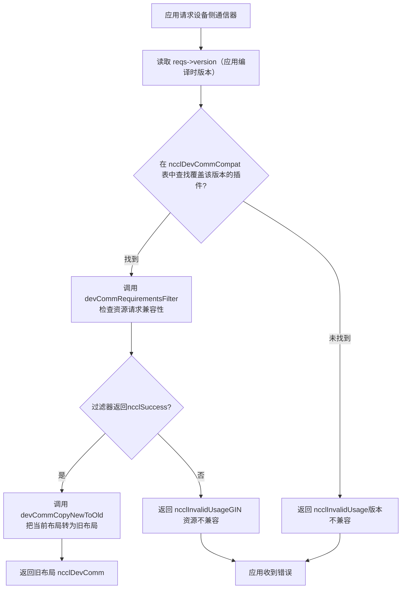
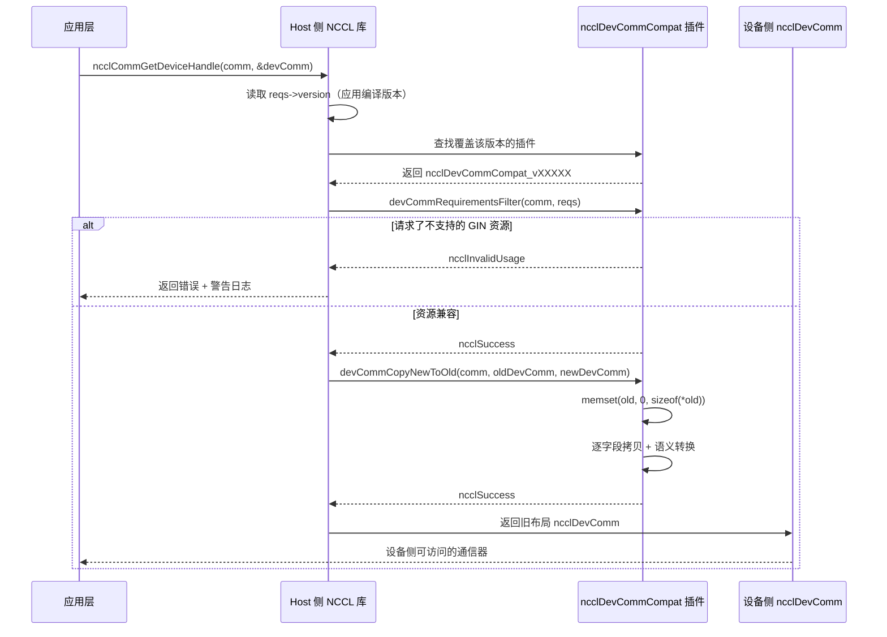

# Kapitel 19: Geräteseitige Kommunikationsdomäne und ABI-Kompatibilität: der Kommunikationsvertrag zwischen devcomm und Kernel

Im vorherigen Kapitel haben wir gesehen, dass der hostseitige ncclMemManager mit Referenzzählung und der CUDA VMM API den Lebenszyklus der Kommunikationspuffer verwaltet. Doch die Kommunikation findet tatsächlich im GPU-Kernel statt – die Threads im Kernel müssen wissen: Welcher Rank bin ich? An welcher virtuellen Adresse liegt der Puffer des Peer-Ranks? Ist die Verbindung bereit? Diese Informationen befinden sich in der hostseitigen ncclComm-Struktur, aber der Kernel kann Host-Zeiger nicht direkt dereferenzieren. Wenn NCCL den Kernel diese Metadaten jedes Mal über Parameterübergabe oder globale Speicherabfragen beschaffen ließe, würde jede Kommunikation zusätzliche Latenz- und Bandbreitenkosten verursachen. Schlimmer noch: Sobald der Kernel-Code kompiliert ist, sind die Feldversätze, auf die er zugreift, festgelegt – wenn sich das Layout von ncclComm nach einem Bibliotheks-Upgrade ändert, liest der alte Kernel falsche Daten. Das ist das Kernproblem, das devcomm lösen soll: die wesentlichen Metadaten der hostseitigen Kommunikationsdomäne in einem stabilen, versionierten Speicherlayout auf geräteseitig zugängliche Strukturen abzubilden. Die Dateien devcomm_v22902.cc, devcomm_v22907.cc, devcomm_v23000.cc und devcomm_v23100.cc im Verzeichnis src/devcomm sind die konkreten Implementierungen dieser versionierten ABI. Jede Datei entspricht einem NCCL-Versionsbereich und definiert das exakte Speicherlayout von ncclDevComm innerhalb dieses Bereichs sowie die Feldkopierlogik zwischen alten und neuen Versionen. Dieses Kapitel zerlegt der Reihe nach: Wie die zentrale Datenstruktur des geräteseitigen Kommunikators aussieht, wie der Registrierungs- und Abgleichmechanismus der versionierten ABI funktioniert, wie die feldweise Konvertierung zwischen alten und neuen Versionen erfolgt und welche Grenzen und Fallstricke dieser Mechanismus in Produktionsumgebungen hat.

# I. Die zentrale Struktur des geräteseitigen Kommunikators: das Speicherlayout von ncclDevComm

## Intuitives Modell

Stellen Sie sich`ncclDevComm`als eine „Arbeitsplatzkarte“ vor: Jeder GPU-Kernel erhält beim Start eine Karte, auf der steht: „Du bist Rank 3, insgesamt gibt es 8 Ranks, in deiner LSA-Gruppe sind 4 Ranks, die Basisadresse des Peer-Puffers liegt bei 0x7f...“. Diese Karte muss klein genug sein (um in die Kernel-Parameter zu passen) und dennoch alle wesentlichen Informationen enthalten. Gäbe es diese Karte nicht, könnte sich der Kernel nur auf wiederholte Parameterübergabe von der Host-Seite verlassen und müsste bei jeder Kommunikation neu zusammengesetzt werden – hohe Latenz, fehleranfällig.

## Datenstruktur und Speicherlayout

Nehmen wir`ncclDevComm_v23000`als Beispiel; seine vollständige Definition befindet sich in[FACT:src/devcomm/devcomm_v23000.cc:25-62]：

```c
struct ncclDevComm_v23000 {
  unsigned int magic;          // 偏移 0，魔数校验
  unsigned int version;        // 偏移 4，版本号

  int rank, nRanks;            // 偏移 8, 12
  uint32_t nRanks_rcp32;       // 偏移 16，nRanks 的倒数（定点数）
  int lsaRank, lsaSize;        // 偏移 20, 24
  uint32_t lsaSize_rcp32;      // 偏移 28

  ncclDevCommWindowTable_t windowTable;  // 偏移 32
  ncclWindow_t resourceWindow;           // 偏移 40
  ncclResourceWindow_vidmem_v23000_t resourceWindow_inlined;  // 偏移 48
  ncclGinBarrierHandle_t hybridWorldGinBarrier;  // 偏移 112
  ...
};
```

[FACT:src/devcomm/devcomm_v23000.cc:64-93]Eine Reihe von`static_assert`legt die Versätze jedes Feldes fest. Das ist keine Verzierung – es ist ein Compile-Zeit-Vertrag für die ABI-Kompatibilität. Wenn sich der Versatz eines Feldes aufgrund einer Änderung der Compiler-Ausrichtungsstrategie verschiebt, schlägt die Kompilierung fehl, anstatt zur Laufzeit eine schwer zu debuggende Speicherverschiebung zu erzeugen.

Die Designmotive einiger Schlüsselfelder:

> **[Design Inference & Architectural Trade-offs]**
> **`nRanks_rcp32`und`lsaSize_rcp32`**: Dies ist`nRanks`und`lsaSize`Der Kehrwert von , dargestellt als 32-Bit-Festkommazahl. Wenn im Kernel die Division von rank zum buffer-Offset durchgeführt wird, ist die Ganzzahldivision auf der GPU sehr langsam; die Methode, mit dem Kehrwert zu multiplizieren und dann zu verschieben, kann dies erheblich beschleunigen. Dies ist ein typischer Fall von „Speicher gegen Zeit tauschen“ – 4 zusätzliche Bytes speichern, um Dutzende Taktzyklen pro Division einzusparen.

**`resourceWindow_inlined`**: Dies ist ein Inline-Fensterdeskriptor vom Typ`ncclResourceWindow_vidmem_v23000_t`. Beachten Sie[FACT:src/devcomm/devcomm_v23000.cc:11-18]dessen Definition in :

```c
typedef struct ncclResourceWindow_vidmem_v23000 {
  char reserved1[8];
  char* lsaFlatBase;
  char reserved2[8];
  uint32_t stride4G;
  uint32_t mcOffset4K;
  char reserved3[32];  // NOTE: shrunk from 40 in 2.30u1 to reclaim 8 bytes
} ncclResourceWindow_vidmem_v23000_t;
```

Hier ist`reserved1`、`reserved2`、`reserved3`ein**Füllfeld**, das als Platzhalter dient. Warum wird Füllung benötigt? Weil`ncclDevComm_v23000`das Layout mit einer „Basisversion“ offset-konsistent bleiben muss; selbst wenn einige Felder in der aktuellen Version nicht mehr verwendet werden, müssen sie als Platzhalter beibehalten werden, um die Offsets nachfolgender Felder unverändert zu lassen.[FACT:src/devcomm/devcomm_v23000.cc:11-18]Der Kommentar von stellt ausdrücklich fest: 2.30u1 verkleinert`reserved3`von 40 Bytes auf 32 Bytes und schafft 8 Bytes für`hybridWorldGinBarrier`. Dies ist eine**Layout-Neuanordnung**– durch Verkleinern des Füllbereichs werden neue Felder eingefügt, ohne die Gesamtgröße zu ändern.

[FACT:src/devcomm/devcomm_v23000.cc:11-18]Die`static_assert`von bestätigt dies weiter:`lsaFlatBase`、`stride4G`、`mcOffset4K`Die Offsets der drei Felder müssen mit dem`ncclWindow_vidmem`der „aktuellen Version“ übereinstimmen, und die Gesamtgröße der Struktur beträgt 64 Bytes. Das bedeutet,`resourceWindow_inlined`ist zwischen v23000 und der aktuellen Version**binärkompatibel**– kann direkt per memcpy kopiert werden.

## Die Familie versionierter Strukturen

Beim Vergleich von`ncclDevComm_v22902` [FACT:src/devcomm/devcomm_v22902.cc:38-62]und`ncclDevComm_v22907` [FACT:src/devcomm/devcomm_v22907.cc:13-41]ist die Entwicklung der Felder zu erkennen:

| Feld | v22902 | v22907 | v23000 |
| --- | --- | --- | --- |
| `magic`/`version` | Keine | Keine | Vorhanden (Offset 0/4) |
| `ginContextCount` | uint8_t | uint32_t | uint32_t |
| `ginNetDeviceTypes` | `[4]` | `[NCCL_GIN_MAX_CONNECTIONS]` | `[NCCL_GIN_MAX_CONNECTIONS]` |
| `ginIsRailed` | Keine | bool | Aufgeteilt in`ginConnectionsRailed` + `ginContextsRailed` |
| `hybridWorldGinBarrier` | Keine | Keine | Vorhanden (Offset 112) |
| Strukturgröße | 200 | 224 | 240 |

> **[Design Inference & Architectural Trade-offs]**
> Dieser Entwicklungspfad offenbart die Versionsstrategie von NCCL:**Felder nur bei Bedarf hinzufügen und möglichst den Füllbereich nutzen**. Von v22902 bis v22907 wurden`ginSignalBase`、`ginCounterBase`、`ginContextBase`、`ginIsRailed`und andere GIN-bezogene Felder hinzugefügt; von v22907 bis v23000 wurden`magic`/`version`das Prüffeld und`hybridWorldGinBarrier`hinzugefügt, während`ginIsRailed`in zwei präzisere Flags aufgeteilt wurde.

---

# Zwei, Registrierung und Abgleich der versionierten ABI: die Struktur ncclDevCommCompat

## Intuitives Modell

Stellen Sie sich die versionierte ABI als eine Reihe von „Übersetzungs-Plugins“ vor: Wenn eine Anwendung mit NCCL 2.29.2 kompiliert, aber zur Laufzeit gegen die Bibliothek 2.31.0 gelinkt wird, muss die Bibliothek wissen, „welches`ncclDevComm`-Layout der Kernel von 2.29.2 erwartet“, und dann das`ncclDevComm`der aktuellen Version in das alte Layout übersetzen. Jeder Versionsbereich entspricht einem Übersetzungs-Plugin, das in einer globalen Tabelle registriert ist.

## Kernstruktur: ncclDevCommCompat

Am Ende jeder`devcomm_vXXXXX.cc`-Datei ist eine`ncclDevCommCompat`-Struktur definiert. Nehmen wir v23000 als Beispiel[FACT:src/devcomm/devcomm_v23000.cc:192-199]：

```c
struct ncclDevCommCompat ncclDevCommCompat_v23000 = {
  NCCL_VERSION(2, 30, 0),               // minVersion
  NCCL_VERSION(2, 30, 7),               // maxVersion
  nullptr,                              // commPropertiesFilter
  ncclDevCommRequirementsFilter_v23000, // devCommRequirementsFilter
  ncclDevCommCopyNewToOld_v23000,       // devCommCopyNewToOld
  ncclDevCommCopyOldToNew_v23000,       // devCommCopyOldToNew
};
```

Bedeutung der sechs Felder:

1. **`minVersion` / `maxVersion`**: Der von diesem Plugin abgedeckte Versionsbereich. v23000 deckt 2.30.0 bis 2.30.7 ab.

2. **`commPropertiesFilter`**: Optionaler Filter, der verwendet wird, um die in`ncclCommProperties`für ältere Versionen sichtbaren Fähigkeitsflags anzupassen. v23000 setzt`nullptr`, was bedeutet, dass keine Filterung erforderlich ist.

3. **`devCommRequirementsFilter`**: Prüft, ob die von der Anwendung angeforderten geräteseitigen Ressourcen mit der alten Version kompatibel sind. Die Implementierung von v23000[FACT:src/devcomm/devcomm_v23000.cc:95-98]kopiert lediglich`ginType`von`comm->sharedRes`nach`reqs`。

4. **`devCommCopyNewToOld`**: Kopiert das`ncclDevComm`der aktuellen Version in das alte Layout.

5. **`devCommCopyOldToNew`**: Kopiert das alte Layout zurück in die aktuelle Version.

## Aufteilung der Versionsbereiche

Versionsbereiche der vier Dateien:

| Datei | minVersion | maxVersion | Anmerkung |
| --- | --- | --- | --- |
| `devcomm_v22902.cc` | 2.29.2 | 2.29.3 | Früheste versionierte Implementierung |
| `devcomm_v22907.cc` | 2.29.5 | 2.29.7 | Fügt GIN-Felder hinzu, bietet jedoch keine GIN-Rückwärtskompatibilität |
| `devcomm_v23000.cc` | 2.30.0 | 2.30.7 | Fügt magic/version-Prüfung hinzu |
| `devcomm_v23100.cc` | 2.31.0 | Aktuelle Version | Alle Filter sind nullptr, was vollständige Kompatibilität bedeutet |

[FACT:src/devcomm/devcomm_v23100.cc:10-17]Alle Rückrufe des v23100-Plugins von sind`nullptr`, was bedeutet, dass ab 2.31.0 das Layout von`ncclDevComm`stabil ist und keine Konvertierung erforderlich ist.

> **[Design Inference & Architectural Trade-offs]**
> Beachten Sie, dass zwischen v22902 und v22907 eine „Lücke“ im Versionsbereich besteht (2.29.4 und 2.29.6 haben keine entsprechenden Plugins). Dies könnte daran liegen, dass diese Versionen nicht veröffentlicht wurden oder ihr Layout vollständig mit benachbarten Versionen übereinstimmt und wiederverwendet werden kann.

## Abgleichprozess

Wenn eine Anwendung`ncclCommGetDeviceHandle`oder eine ähnliche API aufruft, muss NCCL:

1. Die in die Anwendung eingebettete NCCL-Versionsnummer lesen (über`reqs->version`）。

2. In der globalen`ncclDevCommCompat`-Tabelle nach einem Plugin suchen, das diese Version abdeckt.

3. Falls gefunden, den`devCommCopyNewToOld`des Plugins aufrufen, um das aktuelle Layout in das alte Layout umzuwandeln.

4. Falls nicht gefunden, einen Fehler zurückgeben oder das Standardverhalten verwenden.

Das folgende Flussdiagramm zeigt diesen Abgleich- und Konvertierungsprozess:



---

# Drei, Feldweise Konvertierung: Wie neues und altes Layout ineinander umgewandelt werden

## Intuitives Modell

Versionskonvertierung ist wie „Übersetzen“: Das`ncclDevComm`der neuen Version ist ein moderner chinesischer Text, das Layout der alten Version ist ein klassischer chinesischer Text. Der Übersetzer muss Feld für Feld entsprechen – einige Felder entsprechen direkt (`rank`zu`rank`), einige Felder müssen „sinngemäß übersetzt“ werden (`ginConnectionStride > 1`übersetzt zu`ginConnectionsRailed = true`), einige Felder existieren in der alten Version nicht (werden direkt verworfen).

## NewToOld-Konvertierung: Von der aktuellen Version zur alten Version

Nehmen wir`ncclDevCommCopyNewToOld_v23000`als Beispiel[FACT:src/devcomm/devcomm_v23000.cc:114-152]：

```c
static ncclResult_t ncclDevCommCopyNewToOld_v23000(ncclComm_t comm, void* oldDevComm,
                                                   struct ncclDevComm const* newDevComm) {
  struct ncclDevComm_v23000* old = (struct ncclDevComm_v23000*)oldDevComm;

  memset(old, '\0', sizeof(*old));  // 先清零，防止未初始化字段泄露
  old->magic = newDevComm->magic;
  old->version = newDevComm->version;
  old->rank = newDevComm->rank;
  ...
  old->ginConnectionsRailed = (newDevComm->ginConnectionStride > 1);
  old->ginStrongLegacySignals = newDevComm->ginStrongLegacySignals;
  old->ginContextsRailed = (newDevComm->ginContextStride > 1);
  ...
}
```

Schlüsselschritte:

1. **`memset`Nullsetzen von** [FACT:src/devcomm/devcomm_v23000.cc:118]: Dies ist eine Sicherheitsmaßnahme – die alte Struktur könnte Felder enthalten, die in der neuen Version nicht existieren; das Nullsetzen verhindert, dass nicht initialisierter Speicher auf die Geräteseite gelangt.

2. **Direkte Feldkopie**：`rank`、`nRanks`、`lsaRank`usw. werden direkt zugewiesen.

3. **Inline-Fensterkonvertierung**: Ruft`ncclDevCommCopyResourceWindowNewToOld_v23000` [FACT:src/devcomm/devcomm_v23000.cc:100-105]auf, kopiert Feld für Feld`lsaFlatBase`、`stride4G`、`mcOffset4K`。

4. **Semantische Konvertierung**：`ginConnectionsRailed = (newDevComm->ginConnectionStride > 1)` [FACT:src/devcomm/devcomm_v23000.cc:142]. Die neue Version verwendet`ginConnectionStride`(eine ganzzahlige Schrittweite), um anzugeben, ob railed vorliegt; die alte Version verwendet einen booleschen Wert. Wenn die Schrittweite größer als 1 ist, bedeutet dies, dass die Verbindung railed ist.

5. **Array-Kopie**：`memcpy`kopiert die Arrays`ginNetDeviceTypes`und`ginHandles`[FACT:src/devcomm/devcomm_v23000.cc:135-136]。

## OldToNew-Konvertierung: Von der alten Version zur aktuellen Version

Die Rückkonvertierung erfolgt in[FACT:src/devcomm/devcomm_v23000.cc:154-190]：

```c
static ncclResult_t ncclDevCommCopyOldToNew_v23000(ncclComm_t comm, struct ncclDevComm* newDevComm,
                                                   void const* oldDevComm) {
  struct ncclDevComm_v23000 const* old = (struct ncclDevComm_v23000 const*)oldDevComm;

  newDevComm->magic = old->magic;
  ...
  newDevComm->ginConnectionStride = old->ginConnectionsRailed ? old->lsaSize : 1;
  newDevComm->ginContextStride = old->ginContextsRailed ? old->lsaSize : 1;
  ...
}
```

> **[Design Inference & Architectural Trade-offs]**
> Beachten Sie die semantische Konvertierung von[FACT:src/devcomm/devcomm_v23000.cc:180-181]: Wenn in der alten Version`ginConnectionsRailed`wahr ist, wird in der neuen Version`ginConnectionStride`auf gesetzt`lsaSize`；andernfalls auf 1 setzen. Hier wird`lsaSize`als Schrittweite verwendet, weil im railed-Modus die Ranks innerhalb jeder LSA-Gruppe eine GIN-Verbindung teilen und die Schrittweite der Größe der LSA-Gruppe entspricht.

## Spezielle Behandlung von v22902

`ncclDevCommCopyOldToNew_v22902` [FACT:src/devcomm/devcomm_v22902.cc:149-167]Es gibt einen wichtigen Kommentar:

```c
// Note: this callback will be used with v22907 as well because, prior to 2.30.0, ncclDevComm was unversioned,
// so v22902 and v22907 variants are indistinguishable.
```

> **[Design Inference & Architectural Trade-offs]**
> Das bedeutet, dass vor 2.30.0`ncclDevComm`kein`magic`/`version`Feld vorhanden ist, sodass die Bibliothek nicht unterscheiden kann, ob eine alte Struktur v22902 oder v22907 ist. Daher wird bei v22907`devCommCopyOldToNew`auf`nullptr` [FACT:src/devcomm/devcomm_v22907.cc:128]gesetzt und tatsächlich die Version von v22902 verwendet. Da beide keine GIN-Rückwärtskompatibilität unterstützen, wirken sich die Unterschiede in den GIN-bezogenen Feldern nicht auf die Korrektheit aus.

## Versionierung des Ressourcenfensters

`ncclWindow_vidmem_v22902`Die Definition befindet sich in`devcomm_v22902.h`(der Inhalt dieser Datei wird in diesem Kapitel nicht bereitgestellt), aber aus[FACT:src/devcomm/devcomm_v22902.cc:141]und[FACT:src/devcomm/devcomm_v22902.cc:164]ist ersichtlich, dass v22902`ncclDevCommCopyResourceWindow_v22902`für die Fensterkonvertierung verwendet. Diese Funktion ist in`devcomm_v22902.h`deklariert; die konkrete Implementierung wird im Quellcode dieses Kapitels nicht gezeigt.

[FACT:src/devcomm/devcomm_v23000.cc:11-18]Das`static_assert`von validiert, dass das Fensterlayout von v23000 mit der aktuellen Version übereinstimmt, sodass die Konvertierungsfunktion von v23000 direkt Feld für Feld kopiert werden kann.

---

# Vier. Fähigkeitsfilterung und Ressourcenprüfung: Verhindern, dass alte Kernel auf nicht unterstützte Funktionen zugreifen

## Intuitives Modell

Versionskonvertierung ist nicht nur „Felder verschieben“ – es muss auch geprüft werden, ob die alte Version die von der Anwendung angeforderten Funktionen unterstützt. Beispielsweise fordert ein mit 2.29.2 kompilierter Kernel GIN-Ressourcen an, aber im`ncclDevComm`Layout von 2.29.2 sind die GIN-Felder unvollständig, und eine direkte Konvertierung würde dazu führen, dass der Kernel Müll-Daten liest. Daher wird ein „Filter“ benötigt, der solche Anfragen vor der Konvertierung abfängt.

## commPropertiesFilter: Filterung von Fähigkeitsflags

`ncclCommPropertiesFilter_v22907` [FACT:src/devcomm/devcomm_v22907.cc:69-77]：

```c
static ncclResult_t ncclCommPropertiesFilter_v22907(ncclComm_t comm, struct ncclCommProperties* props) {
  // We don't provide backwards compatibility for GIN with 2.29.7.  If a communicator needs it, we indicate that
  // the Device API is not available.
  props->deviceApiSupport = (props->deviceApiSupport && ncclTeamLsa(comm).nRanks == comm->nRanks);
  props->ginType = NCCL_GIN_TYPE_NONE;
  props->railedGinType = NCCL_GIN_TYPE_NONE;
  return ncclSuccess;
}
```

Drei Operationen:

1. **`deviceApiSupport`Herabstufung**: Wenn die Anzahl der Ranks in der LSA-Gruppe nicht gleich der Gesamtzahl der Ranks ist (d. h. es gibt knotenübergreifende Kommunikation), wird die Geräte-API deaktiviert. Der Grund ist, dass GIN in 2.29.7 keine knotenübergreifende Kommunikation unterstützt.

2. **`ginType`auf NONE setzen**: Der Anwendung explizit mitteilen, dass „diese Version GIN nicht unterstützt“.

3. **`railedGinType`auf NONE setzen**: Wie oben.

`ncclCommPropertiesFilter_v22902` [FACT:src/devcomm/devcomm_v22902.cc:86-96]Ähnlich, aber mit einem zusätzlichen Detail:

```c
// v22902 ncclCommProperties is _almost_ compatible with newer ones, with the exception of ginType, which in that
// version was based on uint_8, not an int.
((struct ncclCommProperties_v22902*)props)->ginType = NCCL_GIN_TYPE_NONE_v22902;
```

[FACT:src/devcomm/devcomm_v22902.cc:13-17]Definiert die GIN-Typ-Enumeration von v22902:

```c
typedef enum : uint8_t {
  NCCL_GIN_TYPE_NONE_v22902 = 0,
  NCCL_GIN_TYPE_PROXY_v22902 = 2,
  NCCL_GIN_TYPE_GDAKI_v22902 = 3,
} ncclGinType_t_v22902;
```

Beachten Sie, dass dies der Typ`uint8_t`ist, während in der neuen Version`ginType`vom Typ`int`ist. Daher muss der Filter von v22902`props`nach`ncclCommProperties_v22902*`umwandeln und dann in das`uint8_t`des Typs`ginType`。[FACT:src/devcomm/devcomm_v22902.cc:35-36]schreiben. Das`static_assert`von validiert, dass`ginType`bei Offset 34 liegt und die Strukturgröße 40 Bytes beträgt.

## devCommRequirementsFilter: Prüfung von Ressourcenanfragen

`ncclDevCommRequirementsFilter_v22907` [FACT:src/devcomm/devcomm_v22907.cc:79-98]Prüft, ob die Anwendung GIN-Ressourcen angefordert hat:

```c
static ncclResult_t ncclDevCommRequirementsFilter_v22907(ncclComm_t comm, ncclDevCommRequirements_t* reqs) {
  bool requestedGinResources =
    reqs->ginSignalCount > 0 || reqs->ginCounterCount > 0 || reqs->barrierCount > 0 || reqs->railGinBarrierCount > 0;
  struct ncclDevResourceRequirements* node = reqs->resourceRequirementsList;
  while (!requestedGinResources && node != nullptr) {
    requestedGinResources = node->ginSignalCount > 0 || node->ginCounterCount > 0;
    node = node->next;
  }
  if (requestedGinResources && (reqs->ginConnectionType != NCCL_GIN_CONNECTION_NONE || reqs->ginForceEnable)) {
    // 打印警告并返回错误
    return ncclInvalidUsage;
  }
  return ncclSuccess;
}
```

Die Logik erfolgt in zwei Schritten:

1. **Prüfung der Anfrage auf oberster Ebene**：`reqs->ginSignalCount`、`ginCounterCount`、`barrierCount`、`railGinBarrierCount`Wenn eines davon größer als 0 ist, bedeutet dies, dass GIN-Ressourcen angefordert wurden.

2. **Durchlaufen der Ressourcenanforderungsliste**: Wenn auf oberster Ebene nichts angefordert wurde, weiter die`resourceRequirementsList`Liste durchlaufen und für jeden Knoten`ginSignalCount`und prüfen.`ginCounterCount`。

Wenn tatsächlich GIN-Ressourcen angefordert wurden und`ginConnectionType`nicht`NONE`ist oder`ginForceEnable`wahr ist, wird`ncclInvalidUsage`zurückgegeben und eine Warnung ausgegeben, die darauf hinweist, dass die Anwendung neu kompiliert werden muss.

`ncclDevCommRequirementsFilter_v22902` [FACT:src/devcomm/devcomm_v22902.cc:98-126]ist komplexer und behandelt neben der GIN-Prüfung auch die Semantikänderung von`barrierCount`:

```c
// Prior to 2.29.4, a non-zero barrierCount did not imply GIN, but it does since.
if (reqs->barrierCount) {
  reqs->lsaBarrierCount = std::max(reqs->lsaBarrierCount, reqs->barrierCount);
  reqs->barrierCount = 0;
}
// Strangely, neither did railGinBarrierCount.
reqs->railGinBarrierCount = 0;
```

> **[Design Inference & Architectural Trade-offs]**
> Vor 2.29.4`barrierCount`nur eine LSA-Barriere an, ohne GIN-Bedarf zu implizieren. Ab 2.29.4 impliziert`barrierCount`einen GIN-Bedarf. Zur Kompatibilität mit alten Versionen wandelt der Filter`barrierCount`in`lsaBarrierCount`um und setzt`barrierCount`und`railGinBarrierCount`。

auf null. Das folgende Sequenzdiagramm zeigt die vollständige Interaktion von der Anwendungsanfrage bis zur Versionskonvertierung:



---

# Fünf. Leitfaden zur Vermeidung von Fallstricken in der Produktion und Kette zur Fehlerwiederherstellung

## Fallstrick eins: Konflikt zwischen GIN-Ressourcenanfragen und alten Kernel-Versionen

**Szenario**: Die Anwendung wurde mit NCCL 2.29.2 kompiliert, linkt aber zur Laufzeit gegen die Bibliothek 2.31.0. Die Anwendung ruft im Kernel geräte-seitige GIN-bezogene APIs auf (wie`ncclGinPut`）。

**Was passiert**：`ncclDevCommRequirementsFilter_v22902` [FACT:src/devcomm/devcomm_v22902.cc:98-126]erkennt`ginForceEnable`oder`ginSignalCount > 0`, gibt`ncclInvalidUsage`zurück und gibt eine Warnung aus:

```
The application was compiled with too old version of NCCL. It was compiled with NCCL version 2.29.2, but is
running with NCCL library version 2.31.0. Because of its use of GIN device kernels, it needs to be recompiled,
preferably with the same NCCL version that it will be running with.
```

**Grundursache**: Im`ncclDevComm_v22902`Layout von 2.29.2 sind die GIN-Felder (`ginContextCount`、`ginNetDeviceTypes`、`ginHandles`usw.) nicht mit dem Layout von 2.31.0 kompatibel. Bei einer erzwungenen Konvertierung würde der Kernel falsche Offsets lesen, was zu undefiniertem Verhalten führt.

**Richtige Vorgehensweise**: Die Anwendung muss mit derselben (oder einer kompatiblen) NCCL-Version wie die Laufzeitbibliothek neu kompiliert werden. Wenn eine Neukompilierung nicht möglich ist, sollte die Verwendung der GIN-API im Kernel vermieden werden.

## Fallstrick zwei: Geräte-API wird bei knotenübergreifender Kommunikation stillschweigend deaktiviert

**Szenario**: Die Anwendung wurde mit 2.29.7 kompiliert, und die Kommunikationsdomäne enthält knotenübergreifende Ranks (`ncclTeamLsa(comm).nRanks != comm->nRanks`）。

**Was passiert**：`ncclCommPropertiesFilter_v22907` [FACT:src/devcomm/devcomm_v22907.cc:69-77]setzt`props->deviceApiSupport`auf`false`. Wenn die Anwendung dieses Flag prüft, weiß sie, dass die Geräte-API nicht verfügbar ist; wenn sie es jedoch nicht prüft und direkt die geräte-seitige API aufruft, führt dies zu undefiniertem Verhalten.

**Grundursache**: GIN in 2.29.7 unterstützt keine knotenübergreifende Kommunikation. Nur Ranks innerhalb einer LSA(Local SHARP Aggregation)-Gruppe können die geräte-seitige API verwenden.

**Richtige Vorgehensweise**: Die Anwendung sollte nach der Initialisierung`ncclCommProperties.deviceApiSupport`prüfen und, falls`false`, auf die host-seitige API zurückfallen.

## Fallstrick drei: memset-Nullsetzung und Leck nicht initialisierter Felder

**Szenario**：`ncclDevCommCopyNewToOld_v23000` [FACT:src/devcomm/devcomm_v23000.cc:118]führt vor dem Kopieren`memset(old, '\0', sizeof(*old))`。

**aus. Warum ist das nötig**: In alten Strukturen können Felder vorhanden sein, die in der neuen Version nicht existieren (wie`ginSignalBase`、`ginCounterBase`in v22902). Wenn diese nicht auf null gesetzt werden, behalten sie Müll-Werte vom Stack, die vom Kernel fälschlich als gültige Daten interpretiert werden könnten.

**Stolperfallen**: Wenn Entwickler die Versionskonvertierung manuell implementieren und vergessen, sie auf null zu setzen, kann der Kernel zufällige Werte lesen, was sich als intermittierende Fehler äußert – schwer zu reproduzieren und zu debuggen.

**Richtige Vorgehensweise**: Setzen Sie immer die gesamte Zielstruktur vor der Konvertierung auf null. Alle`CopyNewToOld`Implementierungen von NCCL folgen diesem Muster[FACT:src/devcomm/devcomm_v22902.cc:132] [FACT:src/devcomm/devcomm_v22907.cc:104] [FACT:src/devcomm/devcomm_v23000.cc:118]。

## Falle vier: Übereinstimmungsfehler aufgrund von Lücken im Versionsbereich

**Szenario**: Die Anwendung wird mit NCCL 2.29.4 kompiliert. Betrachten Sie die Versionsbereichstabelle:

| Datei | minVersion | maxVersion |
| --- | --- | --- |
| v22902 | 2.29.2 | 2.29.3 |
| v22907 | 2.29.5 | 2.29.7 |

2.29.4 hat kein entsprechendes Plugin.

> **[Design Inference & Architectural Trade-offs]**
> **Was passiert**: Wenn die Übereinstimmungslogik streng nach Versionsbereichen sucht, schlägt die Übereinstimmung für 2.29.4 fehl und gibt einen Fehler zurück. In der tatsächlichen Implementierung könnte es jedoch eine „Nächste-Übereinstimmung“-Strategie geben – 2.29.4 könnte auf das Plugin von v22902 oder v22907 weitergeleitet werden.

**Richtige Vorgehensweise**: Die Anwendung sollte nach Möglichkeit dieselbe Hauptversionsnummer wie die Laufzeitbibliothek verwenden. Wenn ein Versionsübergreifend erforderlich ist, sollte getestet werden, ob es ein kompatibles Plugin für den Zielversionsbereich gibt.

## Fehlerwiederherstellungskette

Wenn die Versionskonvertierung fehlschlägt, lautet die Fehlerwiederherstellungskette von NCCL:

1. **Der Filter gibt einen Fehler zurück**：`devCommRequirementsFilter`gibt zurück`ncclInvalidUsage`。

2. **Die übergeordnete API fängt den Fehler ab**：`ncclCommGetDeviceHandle`überprüft den Rückgabewert, wenn nicht`ncclSuccess`, wird`devComm`Struktur nicht gefüllt.

3. **Anwendungsverarbeitung**: Die Anwendung sollte den Rückgabewert überprüfen und bei Fehlschlag auf die hostseitige API zurückfallen oder die Kommunikation beenden.

4. **Protokollierung**: NCCL gibt`WARN`-Level-Protokolle aus, die die Kompilierungsversion und die Laufzeitversion enthalten, um die Fehlersuche zu erleichtern.

> **[Design Inference & Architectural Trade-offs]**
> Derzeit bietet NCCL keinen „automatischen Downgrade“-Mechanismus – wenn die Versionskonvertierung fehlschlägt, wird nicht automatisch auf die hostseitige API zurückgefallen. Die Anwendung muss die Rückfalllogik selbst implementieren.

---

# Design-Überlegung

**Warum versionierte Strukturen anstelle einer „stabilen ABI“ verwenden?**

> **[Design Inference & Architectural Trade-offs]**
> Eine Alternative wäre, ein „unveränderliches“`ncclDevComm`Layout zu entwerfen, bei dem alle neuen Felder über indirekte Zeiger zugegriffen werden. Dies bringt jedoch zwei Probleme mit sich: Erstens erhöht der indirekte Zugriff die Latenz (der Kernel benötigt eine zusätzliche Dereferenzierung), zweitens kann die Füllregion nicht zur Layout-Optimierung genutzt werden. NCCL entscheidet sich für versionierte Strukturen als Abwägung zwischen „Leistung“ und „Kompatibilität“ – der Kernel innerhalb jedes Versionsbereichs erhält das optimale Layout, und bei versionsübergreifender Nutzung wird die Kompatibilität durch eine Konvertierungsschicht gewährleistet.

**Warum wird`devCommCopyOldToNew`von v22907 auf nullptr gesetzt?**

[FACT:src/devcomm/devcomm_v22902.cc:153-155]Die Kommentare in`ncclDevComm`erklären den Grund: Vor 2.30.0 hatte

**kein Versionsfeld, daher sind die alten Layouts von v22902 und v22907 nicht unterscheidbar. Da beide keine GIN-Rückwärtskompatibilität unterstützen, beeinflussen die Unterschiede in den GIN-Feldern die Korrektheit nicht, daher wird die Konvertierungsfunktion von v22902 wiederverwendet.`nRanks_rcp32`Warum verwendet**

> **[Design Inference & Architectural Trade-offs]**
> 〔Design-Inferenz und Architektur-Abwägung〕`1/nRanks`Die Gleitkommadivisionsgenauigkeit der GPU ist möglicherweise nicht ausreichend, um`nRanks`präzise darzustellen, insbesondere wenn

---

# keine Zweierpotenz ist. Festkommazahlen (Dezimalzahlen, die als 32-Bit-Ganzzahlen dargestellt werden) können ausreichende Genauigkeit bieten, und Ganzzahlmultiplikation ist schneller als Gleitkommamultiplikation.

Zusammenfassung dieses Kapitels`src/devcomm`Dieses Kapitel analysiert die versionierte ABI-Implementierung im Verzeichnis

1. **`ncclDevComm`:**Speicherlayout von`static_assert`: Jede Version hat präzise Feldverschiebungen, die zur Kompilierungszeit mit`rank`、`nRanks`、`nRanks_rcp32`、`lsaRank`、`lsaSize`、`windowTable`、`resourceWindow`überprüft werden. Zu den Schlüsselfeldern gehören

2. **usw.**Registrierung der versionierten ABI`ncclDevCommCompat`: Jeder Versionsbereich entspricht einer`minVersion`、`maxVersion`-Struktur, die

3. **, Filterfunktionen und Konvertierungsfunktionen enthält.**：`CopyNewToOld`Feldweise Konvertierung`CopyOldToNew`und`ginConnectionStride > 1`kopieren Feld für Feld und behandeln semantische Änderungen (z. B.`ginConnectionsRailed = true`）。

4. **Konvertierung zu**：`commPropertiesFilter`Fähigkeitsfilterung`devCommRequirementsFilter`passt die für ältere Versionen freigegebenen Fähigkeitsflags an,

5. **überprüft, ob Ressourcenanfragen mit älteren Versionen kompatibel sind.**Produktionsfallen

: Konflikte zwischen GIN-Ressourcenanfragen und älteren Kernel-Versionen, Deaktivierung der Geräte-API bei knotenübergreifender Kommunikation, Notwendigkeit des memset-Nullsetzens, Übereinstimmungsfehler aufgrund von Lücken im Versionsbereich.`nccl_device`Im nächsten Kapitel werden wir in die geräteseitige API und Kernel-Fusion eintauchen und sehen, wie

# Header-Dateien geräteseitige Funktionen organisieren und wie Kernel-Fusion mehrere kollektive Kommunikationsoperationen in einem einzigen Kernel zusammenführt.

Denkanstöße und Selbsttests zu diesem Kapitel`ncclDevCommCopyNewToOld_v23000`F1: Wenn`memset(old, '\0', sizeof(*old))`in

**entfernt wird, in welchem Szenario würde der Kernel fehlerhafte Daten lesen? Bitte analysieren Sie dies unter Berücksichtigung der Feldunterschiede zwischen v22902 und v23000.**：

`ncclDevComm_v22902`Referenzanalyse[FACT:src/devcomm/devcomm_v22902.cc:84]Die Strukturgröße von`ncclDevComm_v23000`beträgt 200 Bytes[FACT:src/devcomm/devcomm_v23000.cc:95-98], während`ginSignalBase`240 Bytes`ginCounterBase`beträgt. In v22902 gibt es`ginContextBase`(Offset 176),

(Offset 184),`memset`(Offset 204) und andere Felder, die in v23000 nicht existieren oder eine andere Semantik haben.`old`Wenn`ginSignalBase`、`ginCounterBase`entfernt wird, bleiben bei der Konvertierung von v23000 nach v22902 die Felder in der

- -Struktur, die in v23000 nicht existieren (wie
- ), mit Müllwerten auf dem Stack. Wenn der Kernel zufällig diese Felder liest (z. B. im GIN-Codepfad des alten Kernels), erhält er zufällige Werte, was zu Folgendem führt:
- Falsche Signalbasisadresse, GIN-Operationen schreiben an falsche Speicherorte.

`memset`Falsche Zählerbasisadresse, was zu Zählerüberlauf oder -unterlauf führt.`CopyNewToOld`In extremen Fällen kann ein illegaler Speicherzugriff ausgelöst werden, der zum Absturz des Kernels führt.[FACT:src/devcomm/devcomm_v22902.cc:132] [FACT:src/devcomm/devcomm_v22907.cc:104] [FACT:src/devcomm/devcomm_v23000.cc:118]。

Das Nullsetzen von`ncclDevCommCompat`Plugin. Bitte analysieren Sie, wie NCCL diese Situation möglicherweise behandelt und wie Anwendungen dies umgehen sollten.

**Referenzanalyse**：

Versionsbereichstabelle:

- v22902：2.29.2 - 2.29.3
- v22907：2.29.5 - 2.29.7
- v23000：2.30.0 - 2.30.7
- v23100: 2.31.0 - Aktuell

2.29.4 fällt in die Lücke zwischen v22902 und v22907. Mögliche Behandlungsweisen:

1. **Nächste Übereinstimmung**: NCCL könnte den größten Bereich kleiner oder gleich der angeforderten Version wählen, also v22902. Aber v22902's`maxVersion`ist 2.29.3, was streng genommen 2.29.4 nicht abdeckt.

2. **Fehler zurückgeben**: Wenn die Übereinstimmungslogik streng nach Bereichen arbeitet, schlägt die Übereinstimmung für 2.29.4 fehl und gibt`ncclInvalidUsage`。

3. **Aufwärtsübereinstimmung**: Den kleinsten Bereich größer oder gleich der angeforderten Version wählen, also v22907. Aber v22907's`minVersion`ist 2.29.5, was ebenfalls 2.29.4 nicht abdeckt.

> **[Design Inference & Architectural Trade-offs]**
> In der tatsächlichen Implementierung könnte NCCL eine „Fehlertoleranz"-Strategie haben – wenn keine exakte Übereinstimmung gefunden wird, wird versucht, das Plugin eines benachbarten Bereichs zu verwenden. Aber dies ist keine zuverlässige Garantie.

Umgehungsmethoden für Anwendungen:

- Dieselbe Hauptversionsnummer wie die Laufzeitbibliothek verwenden (z. B. 2.31.x).
- Wenn Versionsübergreifung erforderlich ist, testen, ob der Zielversionsbereich ein entsprechendes kompatibles Plugin hat.
- Nach der Initialisierung prüfen`ncclCommProperties.deviceApiSupport`, wenn`false`, auf die host-seitige API zurückfallen.

Q3: `ncclDevCommRequirementsFilter_v22902`Es gibt eine Logik in:`if (reqs->barrierCount) { reqs->lsaBarrierCount = std::max(reqs->lsaBarrierCount, reqs->barrierCount); reqs->barrierCount = 0; }`. Bitte erklären Sie, warum diese Konvertierung erforderlich ist und was passiert, wenn nicht konvertiert wird.

**Referenzanalyse**：

[FACT:src/devcomm/devcomm_v22902.cc:117-121]Der Kommentar erklärt: „Prior to 2.29.4, a non-zero barrierCount did not imply GIN, but it does since."

Vor 2.29.4`barrierCount`bezeichnete nur die Anzahl der LSA-Barrieren und implizierte keinen GIN-Bedarf. Seit 2.29.4`barrierCount`impliziert es GIN-Bedarf (d. h. das Anfordern einer Barriere bedeutet, dass GIN-Ressourcen benötigt werden).

Wenn eine Anwendung mit 2.29.2 kompiliert wurde, hat sie möglicherweise`barrierCount > 0`gesetzt, um den LSA-Barrier-Bedarf auszudrücken, wusste aber nicht, dass dies GIN-Bedarf impliziert. Wenn die NCCL-Bibliothek (2.31.0) direkt nach der neuen Semantik verarbeitet, würde sie annehmen, dass die Anwendung GIN-Ressourcen angefordert hat, und dann`ncclDevCommRequirementsFilter_v22902`würde die GIN-Anforderung erkennen und`ncclInvalidUsage`zurückgeben – ein Fehlalarm.

Die Konvertierungslogik wandelt`barrierCount`um in`lsaBarrierCount`(Maximum der beiden nehmen) und setzt`barrierCount`auf null. Dadurch:

- `lsaBarrierCount`bleibt der Barrier-Bedarf der Anwendung erhalten.
- `barrierCount = 0`wird ein Fehlalarm für GIN-Bedarf vermieden.
- `railGinBarrierCount = 0`Ebenso, weil es in älteren Versionen auch keinen GIN-Bedarf impliziert.

Ohne Konvertierung würde eine Anwendung, die mit 2.29.2 kompiliert wurde und`barrierCount > 0`gesetzt hat, fälschlicherweise abgelehnt und könnte die Geräte-API nicht verwenden.

Bis hierhin haben wir gesehen, wie devcomm durch versionierte ABI die Schlüsselmetadaten der host-seitigen Kommunikationsdomäne sicher auf die Geräteseite abbildet, sodass der Kernel ohne Host-Zeiger auf rank, Adressen und Verbindungsstatus zugreifen kann. Dieser Mechanismus löst das grundlegende Problem des Kernel-Zugriffs auf die Kommunikationsdomäne, aber die geräteseitigen Fähigkeiten gehen weit darüber hinaus. Wenn Benutzer Kommunikationsprimitive direkt in ihrem eigenen Kernel aufrufen oder sogar Kommunikation und Berechnung in denselben Kernel fusionieren möchten, sind übergeordnete geräteseitige APIs und Kernel-Fusionstechniken erforderlich. Das nächste Kapitel wird tief in das nccl_device-Verzeichnis und verwandte Beispiele eintauchen und erkunden, wie geräteseitige APIs wie ncclBarrier, ncclLsaBarrier, ncclGinBarrier es Benutzer-Kernels ermöglichen, an der Kommunikation teilzunehmen, und wie Kernel-Fusion den Startaufwand reduzieren kann, um NCCL von einer Bibliothek zu einem Programmiermodell zu entwickeln.
