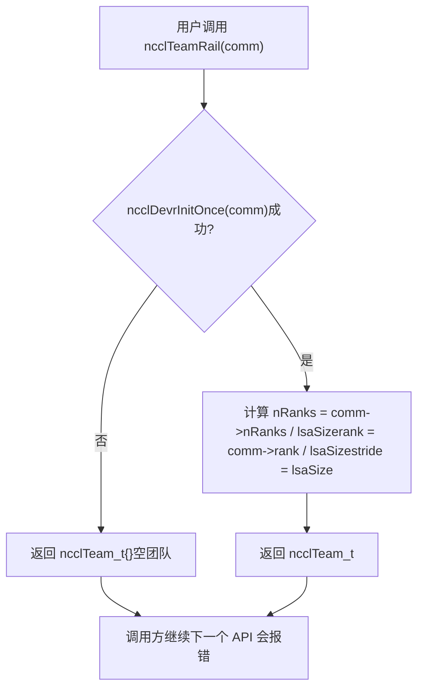
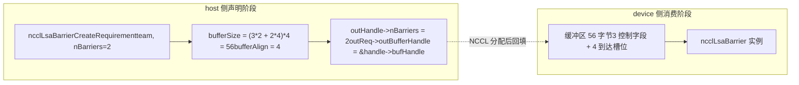
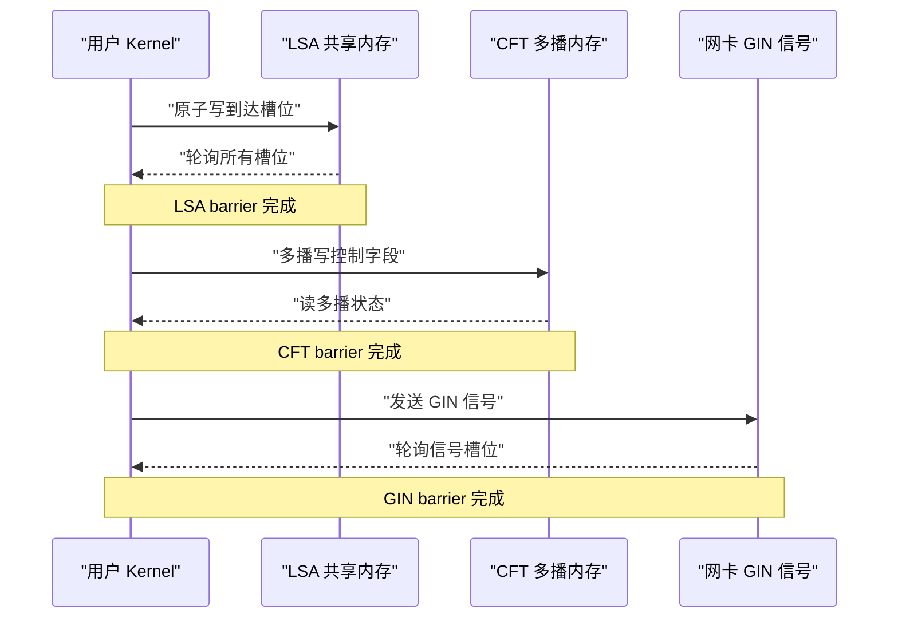
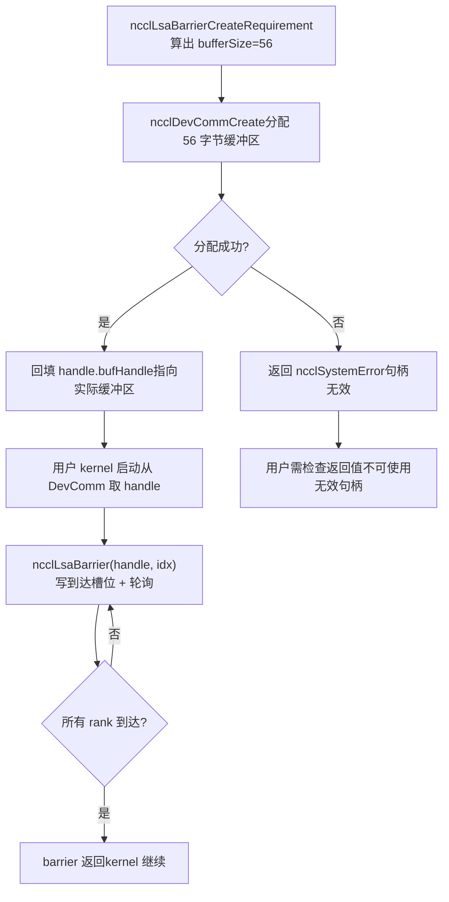
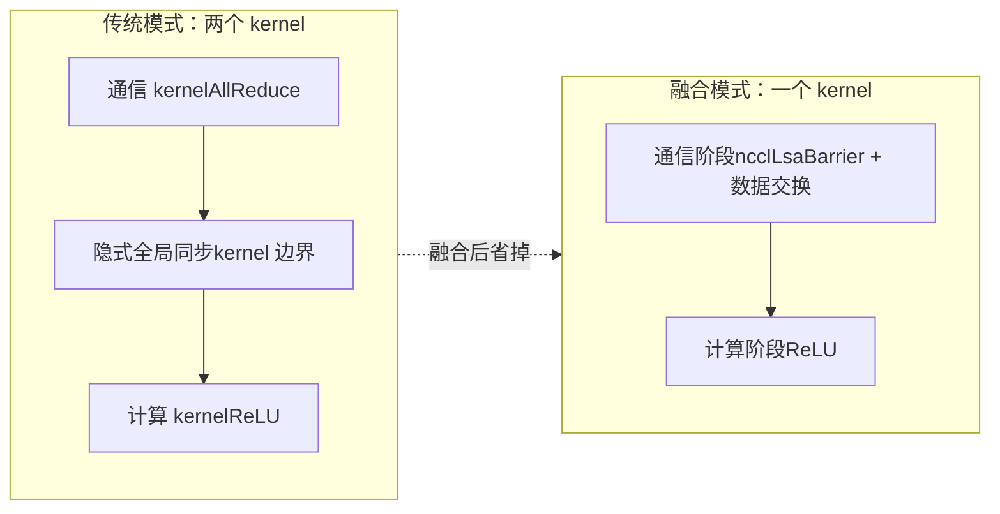

# Kapitel 20: Geräteseitige native APIs und Operator-Fusion: nccl_device und Kernel-Fusion-Praxis

Im vorherigen Kapitel haben wir gesehen, wie devcomm die Metadaten der hostseitigen ncclComm versioniert auf die Geräteseite abbildet, sodass der Kernel rank, Adressen und Verbindungsstatus lesen kann. Aber „Metadaten lesen können“ und „Kommunikation initiieren können“ sind zwei verschiedene Dinge. Wenn nur Metadaten vorhanden sind, kann der Benutzer-Kernel bestenfalls selbst Adressen berechnen und selbst Flags schreiben. Sobald es um Synchronisation über Ranks hinweg oder Signalübertragung über Maschinen hinweg geht, muss man immer noch hostseitig kollektive APIs wie ncclAllReduce aufrufen – und jeder solche Aufruf bedeutet einen Kernel-Start und einen Host-Device-Roundtrip. Das in diesem Kapitel zu analysierende Verzeichnis src/nccl_device ist genau der Schlüssel dafür, dass NCCL sich von „einer aufgerufenen Bibliothek“ zu „einem programmierbaren Modell“ entwickelt. Es bietet keine neuen kollektiven Kommunikationsalgorithmen, sondern eine Reihe geräteseitiger Primitive: Benutzer können in ihrem eigenen Kernel Synchronisationsoperationen wie ncclBarrier, ncclLsaBarrier und ncclGinBarrier aufrufen, wodurch „Kommunikation“ und „Berechnung“ in denselben Kernel gepackt und der dazwischenliegende Startaufwand eingespart werden. Das Quellmaterial dieses Kapitels konzentriert sich auf die hostseitige Bedarfsdeklaration (CreateRequirement) und die Team-Abstraktion dieser Primitive, die genau der Einstiegspunkt der geräteseitigen API sind. Eine wichtige Voraussetzung zum Verständnis dieses Kapitels: Die Designphilosophie der geräteseitigen API lautet „Hostseitig werden Ressourcenbedarfe deklariert, geräteseitig werden Ressourcen konsumiert“. Die Hostseite erstellt nicht direkt Barrieren, sondern teilt NCCL mit: „Ich brauche nBarriers Barrieren, das Team hat team.nRanks Mitglieder“. NCCL berechnet darauf basierend, wie viele Puffer und wie viele GIN-Signale benötigt werden, und instanziiert diese Ressourcen dann auf der Geräteseite. Diese Trennung von „Deklaration und Konsum“ ist der grundlegende Grund dafür, dass geräteseitiger Code ohne Host-Zeiger funktionieren kann.

# 1. Die Team-Abstraktion: Das Koordinatensystem der geräteseitigen API

## Intuitives Modell

Stellen Sie sich die Organisationsstruktur eines multinationalen Unternehmens vor. Um eine E-Mail zu senden, müssen Sie zunächst wissen, „an wen“ – an das gesamte Unternehmen (World), an Kollegen im selben Büro (LSA) oder an ein standortübergreifendes Team derselben Geschäftslinie (Rail).`ncclTeam_t`ist der Deskriptor für diesen „Empfängerbereich“. Ohne die Team-Abstraktion müsste jede geräteseitige API selbst neu berechnen, „an welcher Stelle ich in dieser Kommunikationsdomäne stehe und wie viele es insgesamt gibt“, was zu wiederholtem und sehr fehleranfälligem Code führen würde.

## Datenstruktur und Speicherlayout

`ncclTeam_t`ist das Koordinatensystem der geräteseitigen API; seine drei Felder definieren eine**arithmetische Folge**：

| Feld | Bedeutung | Analogie |
| --- | --- | --- |
| `nRanks` | Gesamtzahl der Mitglieder im Team | Wie viele Personen sind in der Gruppe |
| `rank` | Nummer des aktuellen Ranks innerhalb des Teams | Meine laufende Nummer in der Gruppe |
| `stride` | Schrittweite benachbarter Mitglieder im Team in der World | Wie groß ist der Unterschied der Studierendenausweisnummern zweier benachbarter Personen in der Gruppe |

`stride`ist das am leichtesten zu übersehende, aber entscheidendste Feld. Im World-Team gilt`stride = 1`, weil alle Ranks fortlaufend angeordnet sind; im Rail-Team gilt jedoch`stride = lsaSize`, weil Ranks auf demselben Rail in der World nur alle`lsaSize`Positionen auftreten.

[FACT:src/nccl_device/core.cc:13-19]zeigt die Konstruktion des World-Teams: direkt`comm->nRanks`und`comm->rank`，`stride`werden auf 1 festgelegt. Dies ist das einzige Team, das kein`ncclDevrInitOnce`benötigt, weil seine Informationen vollständig im hostseitigen`comm`liegen.

[FACT:src/nccl_device/core.cc:22-33]ist das LSA-Team. Beachten Sie`ncclDevrInitOnce(comm)`in L26 – dies ist der idempotente Einstiegspunkt für die geräteseitige Ressourceninitialisierung. Die Kommentare in L23-25 sind sehr wichtig:**Fehler werden hier absichtlich ignoriert**, denn wenn die Initialisierung fehlschlägt, ist das zurückgegebene Team ein „Müllwert“, aber der nächste API-Aufruf, der tatsächlich Ressourcen benötigt, löst erneut`ncclDevrInitOnce`aus und meldet den Fehler. Dies ist eine Strategie der „verzögerten Fehlermeldung“, um zu vermeiden, bei einer leichten Operation wie einer Team-Abfrage schwere Fehler zu werfen.

## Szenariogesteuerter Walkthrough: Koordinatentransformation von World zu Rail

Angenommen, eine Maschine mit 8 Karten,`lsaSize = 4`(alle 4 Karten bilden eine LSA-Domäne),`nRanks = 8`. Betrachten wir, wie`ncclTeamRail`konstruiert wird:

[FACT:src/nccl_device/core.cc:70-79]In`nRanks = 8 / 4 = 2`，`rank = comm->rank / 4`，`stride = 4`. Wenn der aktuelle Rank 5 ist, dann ist sein`rank = 5 / 4 = 1`，`stride = 4`im Rail-Team, was bedeutet, dass die Mitglieder des Rail-Teams die Ranks 1 und 5 in der World sind.

Betrachten wir nun die Umrechnungsformel von`ncclTeamRankToWorld`:

[FACT:src/nccl_device/core.cc:82-84]Das`comm->rank + (rank - team.rank) * team.stride`von**ist eine**relative Verschiebung`(rank - team.rank)`Berechnung: Zuerst wird die Verschiebung`stride`des Ziel-Ranks relativ zum aktuellen Rank innerhalb des Teams berechnet, dann mit der Schrittweite`stride`multipliziert und die World-Nummer des aktuellen Ranks addiert. Diese Formel ist für alle Teams universell, weil

`ncclTeamRankToLsa`bereits die Anordnungsregel des Teams kodiert.

[FACT:src/nccl_device/core.cc:87-92]ist anders:`comm->devrState.lsaSelf + (rank - team.rank) * team.stride`verwendet`lsaSelf`. Beachten Sie, dass hier`comm->rank`statt

Kopieren`ncclLsaBarrierCreateRequirement`Diese Abbildung zeigt den Ausführungspfad der Strategie der „verzögerten Fehlermeldung“: Bei fehlgeschlagener Initialisierung wird ein leeres Team zurückgegeben, aber der Aufrufer nicht unterbrochen; der Fehler wird erst bei der nächsten API, die tatsächlich Ressourcen benötigt (wie

## ), sichtbar.

**Designüberlegungen und Fallstricke`ncclTeamWorld`Warum`ncclDevrInitOnce`？**nicht`comm`, ohne dass geräteseitige Ressourcen benötigt werden. Ein erzwungener Aufruf würde eine reine Host-Abfrageoperation von der geräteseitigen Initialisierung abhängig machen und unnötige Fehlerquellen hinzufügen.

**Stolperfallen**：`ncclTeamRankToLsa`gibt bei Initialisierungsfehler`-1`（[FACT:src/nccl_device/core.cc:87-92]) zurück, während`ncclTeamRankToWorld`niemals fehlschlägt. Wenn der Aufrufer diese beiden Funktionen mischt und Rückgabewerte nicht prüft, kann er bei fehlgeschlagener LSA-Initialisierung`-1`als gültigen Rank verwenden, was zu Out-of-Bounds-Zugriffen führt. In Produktionscode sollte der Rückgabewert von`ncclTeamRankToLsa`als potenziell fehlschlagende Operation behandelt werden.

---

# Zwei, Barrier-Bedarfsdeklaration: Wie die Host-Seite Geräteressourcen „reserviert“

## Intuitives Modell

Die Ressourcenzuweisung der geräteseitigen API ist wie**einen Besprechungsraum reservieren**: Man kann nicht einfach in den Besprechungsraum stürmen, sondern muss zuerst am Empfang (Host-Seite`CreateRequirement`) einen Antrag einreichen – „Ich möchte 3 Meetings abhalten, an jedem nehmen 8 Personen teil“. Der Empfang berechnet daraufhin, wie groß der Raum sein muss (`bufferSize`), wie viele Stühle benötigt werden (`ginSignalCount`) und gibt einem dann die Raumnummer (`outBufferHandle`). Ohne dieses Reservierungssystem wüsste der geräteseitige Kernel nicht, wo sein Barrier-Puffer liegt und wie groß er ist, und könnte nicht sicher lesen und schreiben.

## Datenstruktur und Speicherlayout

Die`CreateRequirement`-Funktionen der drei Barrieren teilen dasselbe Muster:**Bedarfsstruktur auf Null setzen → Puffergröße/Ausrichtung füllen → Ausgabe-Handle-Zeiger füllen**. Ihre Ressourcentypen unterscheiden sich jedoch:

| Barrier-Typ | Ressourcentyp | Größenformel | Ausrichtung |
| --- | --- | --- | --- |
| LSA Barrier | Puffer | `(3*n + n*team.nRanks) * sizeof(uint32_t)` | `alignof(uint32_t)` |
| CFT Barrier | Puffer | `(3*n + n*team.nRanks) * NCCL_CFT_BARRIER_GRAN` | `NCCL_CFT_BARRIER_ALIGN` |
| GIN Barrier | GIN-Signal | `n * team.nRanks`Signale | Kein Puffer beteiligt |

Betrachten wir zunächst die Größenformel der LSA-Barrier:

[FACT:src/nccl_device/lsa_barrier.cc:14-22]Die`(3 * nBarriers + nBarriers * team.nRanks) * sizeof(uint32_t)`von

- `3 * nBarriers`lässt sich in zwei Teile zerlegen:`uint32_t`: Jede Barrier benötigt 3
- `nBarriers * team.nRanks`Steuerfelder ([INFERENCE] üblicherweise „Ankunftszähler“, „Runde“, „Statusflag“).`uint32_t`: Jede Barrier muss für jedes Teammitglied einen

Ankunfts-Slot reservieren.`3 + team.nRanks`Die Gesamtgröße einer einzelnen Barrier beträgt also`uint32_t`Stück`NCCL_CFT_BARRIER_GRAN`. Diese Formel ist in LSA und CFT völlig identisch, nur verwendet CFT

als Granularitätseinheit (möglicherweise zur Ausrichtung an größere Grenzen).

[FACT:src/nccl_device/gin_barrier.cc:14-20]Die GIN-Barrier ist dagegen völlig anders:`ginSignalCount = nBarriers * team.nRanks`weist keinen Puffer zu, sondern setzt`outGinSignalStart`und richtet`signal0`auf

## im Handle. Der Grund: Die GIN-Barrier nutzt den Netzwerksignalpfad und benötigt keinen Shared-Memory-Puffer, sondern Signal-Slots, die die Netzwerkkarte erkennen kann.

Szenario-getriebener Walkthrough: Eine vollständige Reservierung einer LSA-Barrier

1. **Angenommen, der Benutzer möchte auf einem 4-Karten-LSA-Team 2 Barrieren erstellen:** `ncclLsaBarrierCreateRequirement(team, 2, &handle, &req)`。

2. **Aufruf von**：`memset(outReq, 0, sizeof(*outReq))`（[FACT:src/nccl_device/lsa_barrier.cc:14-22]Auf Null setzen

3. **) – stellt sicher, dass nicht gesetzte Felder deterministische Werte haben und der Aufrufer keinen Müll vom Stack liest.**：`outHandle->nBarriers = 2`（[FACT:src/nccl_device/lsa_barrier.cc:14-22]）。

4. **Barrier-Anzahl erfassen**：`(3*2 + 2*4) * 4 = (6 + 8) * 4 = 56`Puffergröße berechnen[FACT:src/nccl_device/lsa_barrier.cc:14-22]）。

5. **Bytes (**：`alignof(uint32_t) = 4`（[FACT:src/nccl_device/lsa_barrier.cc:14-22]）。

6. **Ausrichtung setzen**：`outReq->outBufferHandle = &outHandle->bufHandle`（[FACT:src/nccl_device/lsa_barrier.cc:14-22]Handle-Zeiger zurückschreiben

Kopieren von

## Dieses Datenflussdiagramm zeigt die Trennung von „Deklaration“ und „Konsum“: Die Host-Seite berechnet nur Größe und Zeiger, die eigentliche Pufferzuweisung und Instanziierung erfolgt innerhalb von NCCL, und der geräteseitige Kernel erhält das bereits gefüllte Handle.

**Designüberlegungen und Stolperfallen`memset`Warum`outReq`？**zum Nullsetzen des gesamten`ncclDevResourceRequirements_t`verwendet wird: Weil`ginSignalCount`eine Mehrfeld-Struktur ist und verschiedene Barrier-Typen nur einen Teil der Felder füllen. Das Nullsetzen stellt sicher, dass ungenutzte Felder (wie

**, das die LSA-Barrier nicht verwendet) 0 sind, und NCCL intern daraus schließt, dass „diese Ressource nicht benötigt wird“. Ohne Nullsetzen könnten zufällige Werte auf dem Stack fälschlich als „GIN-Ressource benötigt“ interpretiert werden, was das im vorigen Kapitel erwähnte Fehlalarmproblem auslöst.**：`outReq->outBufferHandle = &outHandle->bufHandle`Stolperfalle`outHandle`übergibt die Adresse eines Feldes innerhalb des Handles an NCCL. Das bedeutet, dass`outHandle`gültig bleiben muss, bis NCCL die Pufferzuweisung abgeschlossen hat (nicht vom Stack zurückgeholt oder verschoben werden darf). Wenn der Benutzer

> **[Design Inference & Architectural Trade-offs]**
> **〔Design-Inferenz und Architekturabwägung〕**：[FACT:src/nccl_device/cft_barrier.cc:13-21]Granularitätsunterschiede der CFT-Barrier`NCCL_CFT_BARRIER_GRAN`verwendet`NCCL_CFT_BARRIER_ALIGN`und`sizeof(uint32_t)`anstelle von`alignof(uint32_t)`und

---

# der LSA. Das deutet darauf hin, dass die Barrier von CFT (möglicherweise Cross-Fabric Team oder ein ähnliches domänenübergreifendes Team) eine größere Ausrichtungsgranularität benötigt, möglicherweise weil sie multicast-Speicherbereiche überspannt und die Hardware strengere Anforderungen an die Adressausrichtung stellt.

## Drei, Semantische Aufgabenteilung der drei Barrier-Typen: Wofür LSA, CFT und GIN jeweils zuständig sind

Intuitives Modell

- **LSA Barrier**Die drei Barrier-Typen sind wie drei „Sammelpfiffe“ mit unterschiedlicher Reichweite:
- **CFT Barrier**: Kollegen im selben Büro sammeln sich, über Shared Memory, am schnellsten.
- **GIN Barrier**: Sammlung über Büros hinweg, aber innerhalb desselben Gebäudes, über Multicast-Speicher, mittlere Geschwindigkeit.

: Sammlung über Städte oder sogar Länder hinweg, über Netzwerksignale, am langsamsten, aber mit der größten Reichweite.

## Die falsche Barrier-Typ-Wahl führt nicht zu Fehlern, aber zu enormen Leistungseinbußen – eine GIN-Barrier für die Synchronisation im selben Büro zu verwenden, ist wie das Versenden einer Datei an den Nachbarschreibtisch per internationalem Kurier.

Vergleich der Datenstrukturen und Speicherlayouts

| Aus Sicht der hostseitigen Bedarfsdeklaration sind die Ressourcenanforderungen der drei völlig unterschiedlich: | LSA Barrier | CFT Barrier | GIN Barrier |
| --- | --- | --- | --- |
| Dimension`comm`Benötigt | Parameter | Nein | Nein |
| Ja | Puffer | Vorhanden | Vorhanden |
| Nicht vorhanden | GIN-Signal | Keines | Keines |
| Vorhanden | `uint32_t` | `NCCL_CFT_BARRIER_GRAN` | Größeneinheit |
| Signalanzahl | `bufHandle` | `bufHandle` | `signal0` |

Ausgabe-Handle-Feld`comm`Beachten Sie, dass die GIN-Barrier die einzige ist, die den

[FACT:src/nccl_device/gin_barrier.cc:14-20]-Parameter benötigt:`ncclComm_t comm`Die Funktionssignatur von`ncclTeam_t team`. Dies liegt daran, dass GIN-Signale an konkrete Netzwerkverbindungen gebunden werden müssen, und die Netzwerkverbindungsinformationen in`comm`liegen.

## Szenario-getriebener Walkthrough: Signalzuweisung für GIN Barrier

[FACT:src/nccl_device/gin_barrier.cc:14-20]Die Logik ist einfacher als bei LSA, aber die Semantik ist subtiler:

1. **Zurücksetzen**：`memset(outReq, 0, sizeof(*outReq))`（L16）。

2. **Signalanzahl festlegen**：`outReq->ginSignalCount = nBarriers * team.nRanks`(L17) — jede Barrier muss für jedes Teammitglied einen Signal-Slot zuweisen.

3. **Signal-Startzeiger zurückschreiben**：`outReq->outGinSignalStart = &outHandle->signal0`(L18) — beachten Sie, dass hier`bufferSize`nicht gesetzt wird, da GIN Barrier keinen Shared-Memory-Puffer verwendet.

> **[Design Inference & Architectural Trade-offs]**
> `signal0`Dieser Name deutet darauf hin, dass das Handle eine Gruppe aufeinanderfolgender Signalfelder enthält (`signal0`, `signal1`, ...），`outGinSignalStart`zeigt auf das erste, NCCL weiß dadurch, wo mit der Zuweisung von`nBarriers * team.nRanks`Signalen begonnen werden soll.

## Nebenläufigkeitskontrolle und Hardware-Interaktion

Die Nebenläufigkeitskontrollmechanismen der drei Barrier-Typen sind völlig unterschiedlich:

- **LSA Barrier**: Auf Shared-Memory basierende atomare Operationen.`3 + team.nRanks`von`uint32_t`wird die Ankunft am Slot durch atomares Addieren oder atomares Schreiben markiert („Ich bin angekommen"), und das Kontrollfeld wird durch atomares Lesen geprüft („Sind alle angekommen?"). Dies ist eine reine GPU-interne Synchronisation ohne Netzwerkbeteiligung.
- **CFT Barrier**: Basierend auf Multicast-Speicher (multimem). [INFERENCE] Multicast-Speicher ermöglicht es, mit einem Schreibvorgang gleichzeitig die Ansichten mehrerer Ranks zu aktualisieren, daher kann CFT Barrier möglicherweise mit weniger Kontrollfeldern eine breitere Synchronisation erreichen.
- **GIN Barrier**: Basierend auf Netzwerksignalen.`ginSignalCount`Signale werden über die Netzwerkkarte gesendet, und der Empfänger pollt die Signal-Slots. Dies ist die einzige Barrier, die maschinenübergreifende Hardware einbezieht.

Dieses Sequenzdiagramm zeigt die Hardware-Interaktionsebenen der drei Barrier-Typen: von reiner GPU-interner Synchronisation über Multicast-Speicher bis hin zu Netzwerkkartensignalen — die Latenz nimmt sukzessive zu, und der Abdeckungsbereich erweitert sich ebenfalls sukzessive.

## Design-Überlegungen und Stolperfallen

**Warum benötigen LSA und CFT den`comm`-Parameter nicht?**Weil ihre Ressourcen (Shared Memory, Multicast-Speicher) bereits in der`ncclDevrInitOnce`-Phase an das Team gebunden wurden und`team`selbst bereits die Ressourcenpositionsinformationen impliziert. GIN-Signale hingegen erfordern eine dynamische Zuweisung von Netzwerkressourcen und müssen über`comm`auf den Netzwerkverbindungsstatus zugreifen.

**Stolperfallen**: Das`ginSignalCount`von GIN Barrier ist`nBarriers * team.nRanks`. Wenn das Team sehr groß ist (z. B. 1024 Ranks) und es viele Barriers gibt (z. B. 100), erreicht die Gesamtzahl der Signale 102400. Die Signal-Slots der Netzwerkkarte sind eine begrenzte Ressource, und eine übermäßige Anforderung kann zu`ncclDevrInitOnce`-Fehlern führen. Produktionscode sollte die minimal tatsächlich benötigte Anzahl von Barriers anfordern, anstatt auf einmal eine große Menge als Reserve anzufordern.

---

# IV. Von der Bedarfsdeklaration bis zur geräteseitigen Nutzung: Der vollständige Lebenszyklus

## Intuitives Modell

`CreateRequirement`ist nur die „Bestellung"; die eigentliche „Auslieferung" und „Entgegennahme" finden innerhalb von NCCL und im geräteseitigen Kernel statt. Der gesamte Lebenszyklus ähnelt**Online-Shopping**: Sie bestellen (CreateRequirement) → der Händler bereitet die Ware vor (NCCL weist Ressourcen zu) → der Kurier liefert (Ressourcen werden an DevComm gebunden) → Sie quittieren und nutzen (der geräteseitige Kernel ruft die Barrier auf).

## Datenstruktur und Speicherlayout: Feldevolution des Handles

Am Beispiel von`ncclLsaBarrierHandle_t`durchläuft es im Lebenszyklus drei Phasen:

| Phase | `nBarriers` | `bufHandle` | Andere Felder |
| --- | --- | --- | --- |
| Nach CreateRequirement | Gesetzt | Adresse wurde zurückgeschrieben, aber Inhalt nicht zugewiesen | Nicht gesetzt |
| Nach NCCL-Zuweisung | Gesetzt | Zeigt auf den tatsächlichen Puffer | Gesetzt |
| Geräteseitige Nutzung | Nur Lesen | Nur Lesen | Nur Lesen |

[FACT:src/nccl_device/lsa_barrier.cc:14-22]Setzt`nBarriers`，[FACT:src/nccl_device/lsa_barrier.cc:14-22]Schreibt die Adresse von`bufHandle`zurück. Zwischen diesen beiden Operationen führt NCCL intern die tatsächliche Pufferzuweisung durch.

## Szenario-getriebener Walkthrough: Eine vollständige Barrier-Nutzung

1. **Host-seitige Deklaration**: Der Benutzer ruft`ncclLsaBarrierCreateRequirement(team, 2, &handle, &req)`auf und erhält`req.bufferSize = 56`。

2. **Host-seitige Übermittlung**: Der Benutzer übergibt`req`an`ncclDevCommCreate`(Inhalt des vorherigen Kapitels), NCCL weist einen 56-Byte-Puffer zu und schreibt die Adresse in`handle.bufHandle`。

3. **Geräteseitige Initialisierung**: Beim Start des Benutzer-Kernels wird`handle`aus dem DevComm entnommen und mit`bufHandle`der Puffer lokalisiert.

4. **Geräteseitige Synchronisation**: Der Kernel ruft`ncclLsaBarrier(handle, barrierIndex)`auf, schreibt die Ankunftsmarkierung in den entsprechenden Slot des Puffers und pollt die anderen Slots.

5. **Geräteseitiger Abschluss**: Nachdem alle Ranks angekommen sind, kehrt die Barrier zurück, und der Kernel setzt die Ausführung fort.

Dieses Entscheidungsdiagramm zeigt den vollständigen Pfad von der Deklaration bis zur Nutzung sowie den Fehlerzweig bei fehlgeschlagener Zuweisung. Beachten Sie, dass`ncclLsaBarrierCreateRequirement`selbst immer`ncclSuccess`（[FACT:src/nccl_device/lsa_barrier.cc:14-22]zurückgibt; der tatsächliche Fehler tritt in der nachfolgenden Ressourcenzuweisungsphase auf.

## Nebenläufigkeitskontrolle und Hardware-Interaktion

Der Kern der Nebenläufigkeitskontrolle geräteseitiger Barriers ist**atomare Operationen + Speicherbarrieren**. Am Beispiel von LSA Barrier:

- **Ankunftsphase**: Jeder Rank aktualisiert seinen Ankunfts-Slot mit einem atomaren Schreiben (oder atomaren Addieren). Dieser Schritt muss die Release-Semantik verwenden, um sicherzustellen, dass alle Speicheroperationen vor der Barrier für andere Ranks sichtbar sind.
- **Polling-Phase**: Jeder Rank prüft alle Slots mit atomarem Lesen (oder volatilem Lesen). Dieser Schritt muss die Acquire-Semantik verwenden, um sicherzustellen, dass nach dem Erkennen von „alle sind angekommen" die von anderen vor ihrer Barrier geschriebenen Daten gelesen werden können.
- **Rücksetzphase**: Nach Abschluss der Barrier müssen die Slots für die nächste Nutzung zurückgesetzt werden. Die Nebenläufigkeitskontrolle in diesem Schritt ist am subtilsten — wenn zu schnell zurückgesetzt wird, könnten Markierungen von Ranks überschrieben werden, die sie noch nicht gelesen haben.

> **[Design Inference & Architectural Trade-offs]**
> `3 * nBarriers`Diese drei Kontrollfelder dienen höchstwahrscheinlich der Behandlung solcher „Runden"-Probleme: Ein Feld zeichnet die aktuelle Runde auf, ein Feld zeichnet den Ankunftszähler auf, und ein Feld dient als Reset-Flag. So können mehrere Barrieren dieselbe Gruppe von Slots wiederverwenden, ohne die Runden zu verwechseln.

## Leitfaden zur Vermeidung von Fallstricken in der Produktion

**Fallstrick 1: Lebenszyklusverwaltung von Handles**。`outReq->outBufferHandle = &outHandle->bufHandle`Die Adresse der internen Felder des Handles wurde an NCCL übergeben. Wenn der Benutzer`ncclDevCommCreate`vor der Rückgabe von`outHandle`zerstört, schreibt NCCL beim Zurückschreiben in bereits freigegebenen Speicher. Die korrekte Vorgehensweise besteht darin, den Lebenszyklus von`outHandle`an DevComm zu binden, nicht an den Funktionsbereich, in dem es erstellt wurde.

**Fallstrick 2: Das Produkt aus Barrierenanzahl und Teamgröße**。`bufferSize = (3*n + n*team.nRanks) * sizeof(uint32_t)`In`n*team.nRanks`dominiert der Term bei großen Teams die Größe. 1024 Ranks und 100 Barrieren benötigen`100*1024*4 = 409600`Bytes, etwa 400 KB. Wenn jeder Rank so viel anfordert, ist der Speicherdruck nicht vernachlässigbar. Es sollte die Anzahl der tatsächlich gleichzeitig verwendeten Barrieren angefordert werden, nicht die Gesamtzahl der Barrieren.

**Fallstrick 3: Signalerschöpfung bei GIN-Barrieren**. GIN-Signale sind Netzwerkkartenressourcen und zahlenmäßig begrenzt. Wenn mehrere DevComms gleichzeitig eine große Anzahl von GIN-Signalen anfordern, können die Netzwerkkarten-Slots erschöpft werden. Produktionscode sollte bei fehlgeschlagener DevComm-Erstellung prüfen, ob GIN-Signale unzureichend sind, und erwägen,`nBarriers`zu reduzieren oder auf LSA-Barrieren umzusteigen.

**Fallstrick 4: Verzögerte Offenlegung von Initialisierungsfehlern**。`ncclTeamLsa`Funktionen wie`ncclDevrInitOnce`geben bei[FACT:src/nccl_device/core.cc:22-33]-Fehler ein leeres Team zurück (`team.nRanks > 0`）。

---

# ), ohne einen Fehler zu melden. Wenn der Benutzercode die Rückgabewerte nachfolgender APIs nicht prüft, könnte er auf einem leeren Team weiterarbeiten, was zu schwer lokalisierbaren Fehlern führt. Es wird empfohlen, bei der ersten Verwendung einer geräteseitigen API explizit die Gültigkeit des Teams zu prüfen (z. B.

## Fünf, Kernel-Fusion: Warum Kommunikation und Berechnung in einen Kernel packen

Intuitives Modell**Im traditionellen Modell benötigt ein „AllReduce + Aktivierungsfunktion" zwei Kernel: einen für die Kommunikation und einen für die Berechnung. Zwischen den beiden Kernels gibt es eine implizite globale Synchronisation – der Kommunikations-Kernel muss vollständig beendet sein, bevor der Berechnungs-Kernel starten kann. Das ist wie**Staffellauf**: Der erste Läufer muss den Stab an den zweiten übergeben, und im Moment der Übergabe warten beide. Kernel-Fusion lässt denselben Kernel sowohl Kommunikation als auch Berechnung ausführen, wie**jemand, der beim Laufen die Schuhe wechselt

## , wodurch die Wartezeit bei der Übergabe entfällt.

Datenstruktur und Speicherlayout

- **Der Schlüssel zur Kernel-Fusion liegt darin, dass Kommunikationsprimitive (wie Barrieren) und Berechnungslogik dieselben Register und denselben Shared Memory desselben Kernels teilen. Das bedeutet:**Registerdruck
- **: Atomare Operationen und Polling-Schleifen der Kommunikationsprimitive belegen Register und schmälern das Registerbudget der Berechnungslogik.**Shared-Memory-Konkurrenz
- **: Wenn der Puffer der LSA-Barriere im Shared Memory liegt, konkurriert er mit dem Shared-Memory-Bedarf der Berechnungslogik.**Occupancy-Auswirkung

> **[Design Inference & Architectural Trade-offs]**
> 〔Designableitung und Architekturabwägung〕

## Das Design der geräteseitigen API (host-seitige Deklaration von Ressourcen, geräteseitige Nutzung) dient genau dazu, diesen Druck zu mildern: Ressourcen werden host-seitig vorab zugewiesen, der geräteseitige Kernel muss nur lesen und schreiben, keine dynamische Anforderung, was den Registerverbrauch reduziert.

Szenariogesteuerter Walkthrough: Der Ausführungsfluss eines fusionierten Kernels

1. **Angenommen, der Benutzer möchte einen fusionierten Kernel für „AllReduce + ReLU" schreiben:**Host-seitige Vorbereitung`ncclLsaBarrierCreateRequirement`: Aufruf von`ncclDevCommCreate`zur Anforderung einer Barriere, Aufruf von

2. **zur Zuweisung von Ressourcen.**Kernel-Start

3. **: Der Benutzer-Kernel erhält DevComm und das Barriere-Handle als Parameter.**Kommunikationsphase`ncclLsaBarrier`: Innerhalb des Kernels wird

4. **aufgerufen, um alle Ranks zu synchronisieren, dann tauschen die Ranks Daten aus (direktes Lesen/Schreiben über symmetrischen Speicher).**Berechnungsphase

5. **: Nach Abschluss der Synchronisation führt der Kernel direkt ReLU auf den lokalen Daten aus, ohne einen zusätzlichen Kernel-Start.**Abschluss

Kopieren

## Diese Vergleichsgrafik zeigt den Kernvorteil der Fusion: Die implizite globale Synchronisation an der Kernel-Grenze entfällt. Im traditionellen Modell kostet diese Synchronisation die Latenz zweier Kernel-Starts plus das Leeren der GPU-Pipeline.

**Designüberlegungen und Fallstricke**Warum bietet die geräteseitige API nicht direkt ein „fusioniertes AllReduce" an?**Weil die konkrete Form der Fusion von der Berechnungslogik des Benutzers abhängt. NCCL bietet**Primitive**(Barrieren, Signale, symmetrischer Speicherzugriff), nicht**Fertigprodukte

**(fusioniertes AllReduce+ReLU). Der Benutzer muss diese Primitive selbst kombinieren, um einen fusionierten Kernel zu implementieren, der seinen Anforderungen entspricht. Das ist der wesentliche Unterschied zwischen einem „Programmiermodell" und einer „Bibliothek".**：Die Fehlersuche bei fusionierten Kernels ist deutlich schwieriger als bei getrennten Kernels. Wenn die Barrier-Logik einen Bug enthält, kann dies zu einem Hängenbleiben des Kernels (Deadlock) führen, und ein hängender GPU-Kernel lässt sich nicht so einfach diagnostizieren wie ein hängender Host-Prozess. Es wird empfohlen, in fusionierte Kernels einen Timeout-Mechanismus einzubauen oder die Barrier-Logik zunächst mit einem kleinen Team zu validieren.

**Stolperfallen**：Ein Rückgang der Occupancy bei fusionierten Kernels kann dazu führen, dass der Verlust an Rechenleistung die durch die Kommunikation eingesparten Gewinne übersteigt. Bevor man sich für eine Fusion entscheidet, sollte man die End-to-End-Zeit vor und nach der Fusion messen und nicht nur die Reduzierung der Kommunikationslatenz betrachten.

# Gedanken und Selbsttests zu diesem Kapitel

F1: Wenn man in`ncclTeamLsa`in L26 den`ncclDevrInitOnce`-Aufruf entfernt und direkt`comm->devrState.lsaSize`und`lsaSelf`zurückgibt, in welchen Szenarien würde dann der geräteseitige Kernel falsche Team-Informationen lesen?

**Referenzanalyse**：`ncclDevrInitOnce`ist der idempotente Einstiegspunkt für die geräteseitige Ressourceninitialisierung. Wenn man ihn entfernt, könnten`comm->devrState.lsaSize`und`lsaSelf`noch ihre Anfangswerte haben (normalerweise 0 oder undefiniert). Im Szenario der erstmaligen Nutzung der geräteseitigen API würde der Benutzer beim Aufruf von`ncclTeamLsa`ein leeres Team von`nRanks = 0`erhalten. Wenn der Benutzer anschließend die Gültigkeit des Teams nicht prüft und mit diesem Team direkt`ncclLsaBarrierCreateRequirement`aufruft, würde`bufferSize = (3*n + n*0) * 4 = 12n`Bytes berechnet – weniger als tatsächlich benötigt, weil der`n*team.nRanks`-Eintrag zu 0 geworden ist. Dies führt zu einem Pufferüberlauf: Die Barrier-Laufzeit versucht,`team.nRanks`Ankunfts-Slots zu beschreiben, aber der Puffer wurde nur mit Platz für`3n``uint32_t`allokiert. Noch subtiler: Wenn`lsaSelf`ebenfalls 0 ist, gibt`ncclTeamRankToLsa`eine falsche Rank-Nummer zurück, wodurch die Ankunfts-Slots der Barrier an die falsche Position geschrieben werden, sodass möglicherweise niemals alle Ranks ankommen und der Kernel hängen bleibt. Genau das soll die in den Kommentaren zu L23-25 beschriebene Strategie „garbage value zurückgeben, nächste API meldet Fehler" verhindern – aber nur, wenn die nächste API tatsächlich einen Fehler meldet und nicht stillschweigend die falsche Größe verwendet.

Q2：`ncclLsaBarrierCreateRequirement`Die Größenformel für`(3*nBarriers + nBarriers*team.nRanks) * sizeof(uint32_t)`lautet`++`. Wenn das Team 8 Ranks hat und der Benutzer 1 Barrier anfordert, beträgt der Puffer 44 Bytes. Angenommen, die „3 Kontrollfelder" in der Barrier-Implementierung sind „Ankunftszähler", „Runde" und „Reset-Flag", leiten Sie ab: Was passiert, wenn 8 Ranks gleichzeitig ankommen und der „Ankunftszähler" eine nicht-atomare

**-Operation verwendet?**Referenzanalyse`++`: Nicht-atomares`count++`ist auf der GPU ein dreistufiger „Read-Modify-Write"-Vorgang, keine atomare Operation. Wenn 8 Ranks gleichzeitig`count`ausführen, kann es vorkommen, dass mehrere Ranks denselben alten Wert lesen (z. B. alle 0 lesen) und dann alle 1 zurückschreiben. Letztendlich erhöht sich`atomicAdd`nur um 1 statt um 8, sodass die Barrier fälschlicherweise annimmt, dass „noch nicht alle angekommen sind", und alle Ranks in der Polling-Phase in eine Endlosschleife geraten. Deshalb müssen die Ankunfts-Slots einer LSA-Barrier atomare Operationen verwenden (wie`nBarriers * team.nRanks`) oder jeder Rank schreibt in seinen eigenen unabhängigen Slot (der`nBarriers * team.nRanks`-Eintrag ist genau dafür da, jedem Rank einen unabhängigen Slot zu reservieren). Wenn man das Schema „jeder Rank schreibt in seinen eigenen Slot" verwendet, benötigt man keine atomare Addition, sondern nur atomares Schreiben + Speicherbarrieren, da jeder Slot nur einen Schreiber hat. Das erklärt auch, warum die Größenformel den

Q3：`ncclGinBarrierCreateRequirement`-Eintrag enthält – er tauscht Platz gegen Atomarität, um Konkurrenz durch mehrere Schreiber zu vermeiden.`comm`benötigt den`ncclLsaBarrierCreateRequirement`-Parameter, während`comm`ihn nicht benötigt. Wenn man der LSA-Barrier gewaltsam auch den`comm`-Parameter hinzufügen würde (angenommen, um die Schnittstelle zu vereinheitlichen), welche Designprobleme würde das mit sich bringen? Umgekehrt: Wenn man bei der GIN-Barrier den

**-Parameter entfernen würde, in welchen Szenarien würde sie fehlschlagen?**Referenzanalyse`comm`: Das Problem beim Hinzufügen des`ncclDevrInitOnce`-Parameters zur LSA-Barrier ist die Einführung einer unnötigen Abhängigkeit. Die Ressourcen der LSA-Barrier (Shared Memory) sind bereits in der`team`-Phase an das Team gebunden,`comm`impliziert bereits die Ressourcenposition. Das Hinzufügen von`comm`würde eine reine Team-Operation von einem Kommunikationsdomänen-Zustand abhängig machen, die Anzahl der Fehlerpunkte erhöhen (z. B. kann die LSA-Barrier nicht erstellt werden, wenn`comm`ungültig ist) und gegen das Prinzip der „minimalen Berechtigung" verstoßen. Umgekehrt würde das Entfernen des`ncclGinBarrierCreateRequirement`-Parameters bei der GIN-Barrier fehlschlagen, weil GIN-Signale an eine konkrete Netzwerkverbindung gebunden werden müssen.`ginSignalCount`muss wissen, an welche Netzwerkkarte und welches QP (Queue Pair) das Signal gesendet werden soll; diese Informationen befinden sich im Zustand der Netzwerktransportschicht von`comm`. Ohne`comm`kann NCCL nicht bestimmen, welchem Netzwerkkarten-Slot das Signal zugewiesen werden soll, und auch nicht garantieren, dass das Signal korrekt zum Ziel-Rank geroutet wird. Dies spiegelt ein Designprinzip der geräteseitigen API wider:**Ressourcenbedarfsdeklarationen hängen nur von dem Kontext ab, den sie wirklich benötigen**– LSA benötigt nur die Team-Topologie, GIN benötigt die Netzwerkverbindung.

---

Die geräteseitige API und Kernel-Fusion verwandeln NCCL von „einer Bibliothek, die man aufruft" in „ein Programmiermodell, mit dem man arbeitet".`ncclTeam_t`liefert das Koordinatensystem,`CreateRequirement`liefert den Ressourcenreservierungsmechanismus, und die drei Barrier-Typen decken den gesamten Synchronisationsbereich von Shared Memory bis zu Netzwerksignalen ab. Aber Ressourcen zu deklarieren und einen fusionierten Kernel zu schreiben bedeutet nicht automatisch gute Performance – die Anzahl der Barriers, die Team-Größe und die Fusionsgranularität, jede Entscheidung beeinflusst die End-to-End-Performance. Im nächsten Kapitel gehen wir in die Praxis des Performance-Tunings und schauen, wie Tuning-Parameter die Algorithmusauswahl beeinflussen und wie man mit echten Benchmarks die Tuning-Ergebnisse validiert.

Damit haben wir den gesamten Prozess von der devcomm-Metadatenzuordnung bis zu den geräteseitigen nccl_device-Primitiven durchlaufen und gesehen, wie NCCL durch das Modell „Host deklariert, Device konsumiert“ es ermöglicht, dass Benutzer-Kernels direkt barrier-artige Synchronisationsoperationen aufrufen und Kommunikation und Berechnung in denselben Kernel integrieren. Doch nachdem wir diese Mechanismen beherrschen, drängt sich eine praktischere Frage auf: Wenn die Leistung einer echten Trainingsaufgabe nicht den Anforderungen entspricht, wie können wir feststellen, ob eine ungeeignete Algorithmuswahl, ein nicht passendes Protokoll oder eine unvernünftige Kanalanzahl die Ursache ist? Das nächste Kapitel wird die Mechanismen der ersten 20 Kapitel zu einer umsetzbaren Tuning-Methodik verknüpfen und anhand von Leistungsberichten, Kostenmodellen und Umgebungsvariablen einen Diagnosepfad von der Symptomatik zur Grundursache aufzeigen.
