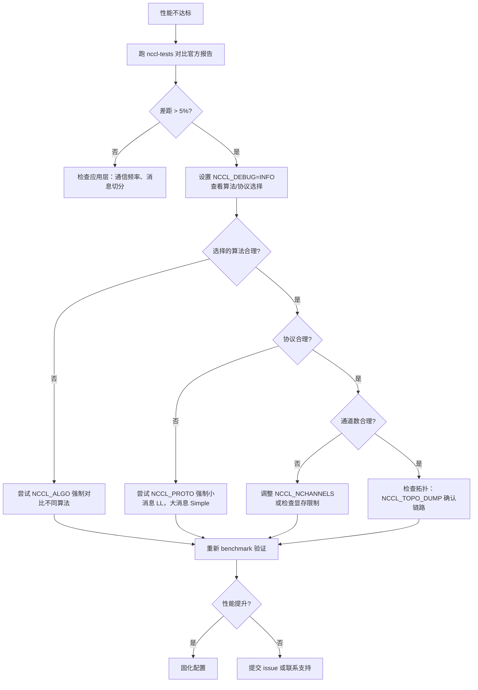

# Kapitel 21: Performance-Tuning in der Praxis: Tuning-Praxis, Benchmark-Tools und Tuning-Methodik

Im vorherigen Kapitel haben wir gesehen, wie benutzerdefinierte Kernels über die geräteseitige API mit den NCCL-Kommunikationsprimitiven zusammenarbeiten und sogar Kommunikation und Berechnung in denselben Kernel integrieren können. Dies eröffnet die Möglichkeit, NCCL als Programmiermodell zu nutzen, bringt aber auch ein praktisches Problem mit sich: Wo soll man ansetzen, wenn die Kommunikationsleistung nicht den Erwartungen entspricht? NCCL stellt Hunderte von NCCL_PARAM-Parametern bereit, aber was wirklich bestimmt, welchen Weg eine kollektive Kommunikation nimmt, sind eigentlich nur drei Stellschrauben: Algorithmus (Algo), Protokoll (Proto) und Kanalanzahl (nChannels). Dieses Kapitel verknüpft die Mechanismen der ersten 20 Kapitel zu einem umsetzbaren Diagnosepfad – zuerst den Leistungsbericht betrachten, um das Phänomen zu lokalisieren, dann das Kostenmodell lesen, um zu verstehen, wie NCCL selbst auswählt, und schließlich mit Umgebungsvariablen und Benchmarks die eigene Hypothese überprüfen.

# 21.1 Leistungsbericht: Zuerst eine „normale“ Baseline erstellen

Der erste Schritt beim Tuning ist nicht das Ändern von Parametern, sondern zu wissen, wie „normal“ aussieht. Wenn man nicht einmal weiß, wie hoch die Spitzenbandbreite des aktuellen Systems ist, ist jede Parameteranpassung reines Raten.

NCCL veröffentlicht offiziell unter`docs/perf`Referenzleistungsdaten. Deren Zweck ist eindeutig – keine produktionsrelevante Garantie, sondern ein Referenzpunkt zur Erwartungsabstimmung.

[FACT:docs/perf/README.md:3-14]

```
NCCL publishes reference performance data to:

1. Provide reference points that help users align performance expectations.
2. Help users validate their system setup.
3. Reduce repeated requests to the NCCL team for basic performance numbers.

These results are references, and NOT product-level guarantees that the same
performance is achievable on every system. Performance depends on a complex
combination of software versions, system configuration, hardware, and operating
conditions, including factors outside NCCL's control. A difference within 5% is
generally considered acceptable variance due to differences in the underlying
systems.
```

Hier gibt es zwei wichtige Informationen, die Anfänger leicht übersehen:

Erstens,**Abweichungen innerhalb von 5 % gelten als normale Schwankung**. Das bedeutet, wenn man 3 % unter dem offiziellen Wert misst, sollte man nicht sofort die Parameter anpassen – sondern zuerst prüfen, ob es sich um Messrauschen, GPU-Takt-Schwankungen oder Störungen durch benachbarte Aufgaben handelt.

Zweitens,**offiziell wird nur die Spitzenbandbreite veröffentlicht, nicht die Latenz**。

[FACT:docs/perf/README.md:24-24]

```
We publish peak bandwidth for a selection of commonly used platforms. We do not
currently publish latency because it is typically more sensitive to factors
outside NCCL's control.
```

> **[Design Inference & Architectural Trade-offs]**
> Warum wird die Latenz nicht veröffentlicht? Weil die Latenz extrem empfindlich auf den Systemzustand reagiert – CPU-Frequenz, PCIe-Link-Status, Firmware-Version der Netzwerkkarte und sogar die Energieverwaltungsstrategie des BIOS beeinflussen sie. Die Bandbreite sättigt bei großen Nachrichten und ist relativ stabil; die Latenz setzt sich bei kleinen Nachrichten aus unzähligen winzigen Teilen zusammen, und jede Schwankung eines Glieds wird verstärkt. Daher gilt beim Tuning:**Bei großen Nachrichten auf die Bandbreite achten, bei kleinen Nachrichten auf die Latenz**, das sind zwei unterschiedliche Diagnosepfade.

[FACT:docs/perf/README.md:24-24]

```
If your workload differs significantly from the published results, open an
issue in the [NCCL repository](https://github.com/NVIDIA/nccl/issues) or contact
NVIDIA Support. We will try our best to help.
```

**Erste Regel der Fehlersuche**: Zuerst einen Standard-Benchmark ausführen (z. B.`nccl-tests`aus`all_reduce_perf`) und das Ergebnis mit dem offiziellen Bericht vergleichen. Wenn die Abweichung innerhalb von 5 % liegt, ist die Systemkonfiguration in Ordnung und der Leistungsengpass liegt in Ihrer Anwendungsschicht (z. B. Kommunikationsfrequenz, Nachrichtenaufteilung); erst bei signifikanter Abweichung geht man zum NCCL-Parameter-Tuning über.

# 21.2 Kostenmodell: Wie NCCL selbst Algorithmus und Protokoll auswählt

Um Parameter anzupassen, muss man zuerst verstehen, wie NCCL standardmäßig auswählt. Intern gibt es ein „Kostenmodell“ (cost model), im Wesentlichen eine Nachschlagetabelle plus Formelberechnung: Bei gegebener Nachrichtengröße, Topologietyp und Rank-Anzahl wird die Laufzeit jeder „Algorithmus × Protokoll“-Kombination geschätzt und die kleinste ausgewählt.

## Intuitives Modell

Stellen Sie sich das Kostenmodell wie eine Navigationssoftware vor. Sie geben Start und Ziel ein (Nachrichtengröße, Topologie), intern wird für jede Route (Algorithmus-/Protokollkombination) die Zeit geschätzt und dann die schnellste empfohlen. Die Schätzung der Navigation basiert auf historischen Daten und Straßenkategorien, die Schätzung von NCCL auf einer fest codierten Tabelle mit Latenz-/Bandbreiteparametern.

Ohne dieses Modell könnte NCCL nur für alle Szenarien denselben festen Algorithmus verwenden – kleine Nachrichten würden durch zu hohen Startaufwand langsamer, große Nachrichten durch unzureichende Bandbreitennutzung, und das System würde in beiden Extremen schlecht abschneiden.

## Datenstruktur: Modelltabelle und Tuning-Kontext

Der Kern des Kostenmodells ist das Array`modelMap`, wobei jedes Element einer Kombination aus „Algorithmus/Protokoll/symmetrischem Kernel“ entspricht.

[FACT:src/tuning/cost_model.cc:230-277]

```
static struct ncclTuningModelEntry_t modelMap[] = {
    /*
Initialize default, static models here
{mod_init, mod_sim, mod_final, enabled}
Enable order: Broadcast, Reduce, AllGather, ReduceScatter, AllReduce
*/
  {ncclTuningTreeModelInit, ncclTuningTreeModelSim, nullptr, {0, 0, 0, 0, 1}},       // Tree/LL
  {ncclTuningTreeModelInit, ncclTuningTreeModelSim, nullptr, {0, 0, 0, 0, 1}},       // Tree/LL128
  {ncclTuningTreeModelInit, ncclTuningTreeModelSim, nullptr, {0, 0, 0, 0, 1}},       // Tree/Simple
  {ncclTuningRingModelInit, ncclTuningRingModelSim, nullptr, {1, 1, 1, 1, 1}},       // Ring/LL
  ...
```

Jeder Eintrag hat vier Felder:`mod_init`(Initialisierungsfunktion),`mod_sim`(Simulationsfunktion),`mod_final`(Bereinigungsfunktion),`enabled`(Aktivierungsflags für die 5 Funktionen).`enabled`Die Reihenfolge des Arrays`{Broadcast, Reduce, AllGather, ReduceScatter, AllReduce}`ist

> **[Design Inference & Architectural Trade-offs]**
> Wichtige Beobachtung:**Tree ist nur bei AllReduce aktiviert**（`{0,0,0,0,1}`), während Ring bei allen Funktionen aktiviert ist (`{1,1,1,1,1}`). Das liegt daran, dass der Vorteil des Tree-Algorithmus darin besteht, dass die Reduktionsphase von AllReduce parallelisiert werden kann, aber für Operationen wie AllGather/ReduceScatter, die im Wesentlichen ringförmige Pipeline-Operationen sind, ist Ring natürlicher.

Die konkreten Parameter des Modells befinden sich in`ncclTunerConstants_t`, einschließlich der Basis-Latenz und Bandbreite für jede Topologie.

[FACT:src/tuning/cost_model.cc:142-152]

```
static const ncclTunerConstants_t ncclTunerConstantsDefaults = {
    // baseLatencies
  {
    {6.8, 14.0, 8.4},  // Tree
    {6.6, 14.0, 8.4},  // Ring
    {0, 0, 0},         // Collnet Direct
    {0, 0, 0},         // Collnet Chain
    {0, 0, 0},         // NVLS
    {0, 0, 0},         // NVLS Tree
    {8.0, 8.0, 8.0}    // PAT
  },
```

Jeder Algorithmus hat drei Basis-Latenzwerte, entsprechend den drei Protokollen LL / LL128 / Simple. Zum Beispiel Ring's`{6.6, 14.0, 8.4}`bedeutet: LL-Protokoll Basis-Latenz 6,6 Mikrosekunden, LL128 ist 14,0, Simple ist 8,4. Diese Zahlen sind empirische Werte, die NVIDIA auf realer Hardware gemessen hat.

Die Hardware-Latenz wird je nach Topologietyp (NVLink / PCI / NET) separat angegeben.

[FACT:src/tuning/cost_model.cc:153-184]

```
    // hwLatencies
  {
    /* NVLINK */
    {
      {0.6, 1.25, 4.0}, // Tree (LL/LL128/Simple)
      {0.6, 1.9, 3.4},  // Ring (LL/LL128/Simple)
      ...
    },
    /* PCI */
    {
      {1.0, 1.9, 4.0}, // Tree (LL/LL128/Simple)
      {1.0, 2.5, 5.7}, // Ring (LL/LL128/Simple)
      ...
    },
    /* NET */
    {
      {5.0, 8.5, 14},   // Tree (LL/LL128/Simple)
      {2.7, 4.0, 14.0}, // Ring (LL/LL128/Simple)
      ...
    },
  },
```

Ein Vergleich zeigt die Topologieunterschiede: Auf NVLink beträgt die Latenz pro Hop für Ring/Simple 3,4 Mikrosekunden, auf PCI 5,7, auf NET 14,0. Das ist der Grund, warum Kommunikation über Maschinen hinweg langsam ist – jeder Hop kostet zusätzliche 10 Mikrosekunden.

Die Bandbreiteparameter werden nach GPU-Architektur-Generationen angegeben.

[FACT:src/tuning/cost_model.cc:183-183]

```
    // llMaxBws
  {
    {39.0, 39.0, 20.4}, /* Volta-N1/Intel-N2/Intel-N4) */
    {87.7, 22.5 /*avg of ring & tree*/, 19.0}, /* Ampere-N1/AMD-N2/AMD-N4) */
    {141.0, 45.0 /*avg of ring & tree*/, 35.0}, /* Hopper-N1/AMD-N2/AMD-N4) */
    {2 * 141.2, 2 * 45.0 /*avg of ring & tree*/, 2 * 35.0}, /* Blackwell-N1/AMD-N2/AMD-N4) */
  },
```

Jede Zeile entspricht einer Architektur-Generation, die drei Werte sind die maximale Bandbreite des LL-Protokolls für Single-Node (N1), Dual-Node (N2) und Quad-Node (N4) Szenarien. Hopper Single-Node 141 GB/s, Blackwell verdoppelt auf 282 GB/s – das erklärt, warum derselbe Algorithmus auf neuen Karten viel besser abschneidet.

## Tuning-Kontext: Zustand pro Comm

Jede Kommunikationsdomäne (Communicator) hält eine`ncclTuningContext_t`, die den Tuning-Zustand dieser Comm speichert.

[FACT:src/include/tuning.h:81-95]

```
struct ncclTuningContext_t {
  // Persistant tuning parameters tied to a communicator.
  ncclTunerConstants_t tuningConstants;
  // State of the tuning models
  // Forced function is set via env var
  int forced[NCCL_NUM_FUNCTIONS];
  // Disabled tuning models are not execute and excluded from implemetation selection.
  int enabled[NCCL_TUNING_COUNT][NCCL_NUM_FUNCTIONS];
  // Store of model contexts per communicator.
  float generalLatencies[NCCL_NUM_FUNCTIONS][NCCL_NUM_ALGORITHMS][NCCL_NUM_PROTOCOLS];
  float generalBandwidths[NCCL_NUM_FUNCTIONS][NCCL_NUM_ALGORITHMS][NCCL_NUM_PROTOCOLS];

  ssize_t threadThresholds[NCCL_NUM_ALGORITHMS][NCCL_NUM_PROTOCOLS];
  int maxThreads[NCCL_NUM_ALGORITHMS][NCCL_NUM_PROTOCOLS];
};
```

Vier Schlüsselfelder:

- `forced[NCCL_NUM_FUNCTIONS]`: Markiert, welche Funktionen durch Umgebungsvariablen gezwungen wurden, einen bestimmten Algorithmus/Protokoll zu verwenden. Dies ist der Punkt, an dem`NCCL_ALGO`/`NCCL_PROTO`wirksam wird.
- `enabled[NCCL_TUNING_COUNT][NCCL_NUM_FUNCTIONS]`: Zweidimensionale Boolesche Tabelle, die markiert, ob ein bestimmtes Modell für eine bestimmte Funktion aktiviert ist. Deaktivierte Modelle nehmen nicht an der Auswahl teil.
- `generalLatencies` / `generalBandwidths`: Dreidimensionales Array, das geschätzte Latenz und Bandbreite nach „Funktion × Algorithmus × Protokoll" speichert. Dies ist die Quelle, aus der`ncclTuningInit`die große Tabelle ausgibt.
- `threadThresholds` / `maxThreads`: Schwellenwerte in Bezug auf die Thread-Anzahl, die bestimmen, wie viele Threads pro Block verwendet werden.

## Szenario-getriebener Walkthrough: Algorithmusauswahl für ein AllReduce

Angenommen, Sie rufen`ncclAllReduce`auf, Nachrichtengröße 1MB, 8 Karten Single-Node NVLink. NCCL erstellt intern eine`ncclTuningInput_t`und ruft dann`ncclTuningCompute`。

[FACT:src/tuning/tuning.cc:180-202]

```
ncclResult_t ncclTuningCompute(struct ncclTuningInput_t* const input, struct ncclTuningResult_t* const result) {
  ncclResult_t ret = ncclSuccess;
  TRACE(NCCL_TUNING, ...);
  struct ncclTuningResultList_t tunings;
  tunings.head = nullptr;
  struct ncclTuningResult_t bestTuning = NCCL_TUNING_RESULT_INIT;
  // Set tuning to Ring/Simple for single rank case
  if (input->comm->nRanks tuningMask & (1ULL forced = input->comm->tuningContext.forced[input->func];
  NCCLCHECKGOTO(getModelEntry(id, &model), ret, not_valid);
  if (model == nullptr) {
    ret = ncclInternalError;
    goto not_valid;
  }
  if (input->comm->tuningContext.enabled[id][input->func] == 0) {
    goto not_valid;
  }
  if (model->model != nullptr) {
    NCCLCHECKGOTO(model->model(input, result), ret, not_valid);
    if (result->timeUs timeUs = NCCL_TUNING_IGNORE;
  result->valid = 0;
  goto exit;
}
```

Beachten Sie die Behandlung des`not_valid`-Tags: Wenn ein Schritt fehlschlägt (Modell existiert nicht, ist deaktiviert, Simulation gibt nicht-positive Zeit zurück), wird`timeUs`auf`NCCL_TUNING_IGNORE`、`valid`gesetzt und auf 0 gesetzt. Dieser Kandidat wird von der nachfolgenden Auswahl ausgeschlossen.

Vierter Schritt: Aus allen gültigen Kandidaten den mit der geringsten Zeitdauer auswählen.

[FACT:src/tuning/tuning.cc:155-173]

```
static ncclResult_t ncclTuningSelectBestTuning(struct ncclTuningResultList_t* tunings,
                                               struct ncclTuningResult_t* const bestTuning) {
  bestTuning->timeUs = FLT_MAX;
  float bestSelectionTimeUs = FLT_MAX;
  struct ncclTuningResultListNode* node = tunings->head;
  while (node != nullptr) {
    const struct ncclTuningResult_t& tuning = node->result;
    float selectionTimeUs = tuning.selectionTimeUs > 0.0f ? tuning.selectionTimeUs : tuning.timeUs;
    TRACE(NCCL_TUNING, "A/P/S %s/%s/%s, time: %f, selection time: %f", ...);
    if (selectionTimeUs next;
  }
  return ncclSuccess;
}
```

Hier gibt es ein Detail: Für die Auswahl wird`selectionTimeUs`verwendet. Wenn es größer als 0 ist, wird es verwendet, andernfalls wird auf`timeUs`。`selectionTimeUs`zurückgegriffen. Es ist die „Auswahlzeit", die möglicherweise zusätzliche Strafen enthält (z. B. zusätzlicher Overhead für bestimmte Algorithmen in bestimmten Szenarien). Dies gibt dem Kostenmodell die Fähigkeit, „geschätzte Zeit" und „Auswahlzeit" zu trennen.

## Flussdiagramm

```mermaid
flowchart TD
    start["ncclTuningCompute(input, result)"] --> check_ranks{"comm->nRanks |是| single["bestTuning = Ring/SimplenChannels = 0"]
    check_ranks -->|否| all["ncclTuningComputeAllTunings()"]
    all --> loop{"遍历 i in NCCL_TUNING_COUNT"}
    loop -->|mask 未命中| skip["tuning.valid = 0continue"]
    loop -->|mask 命中| expand["ncclTuningExpandId(i, ...)"]
    expand --> sim["ncclTuningComputeTuning()→ ncclTuningCostModelSimModel()"]
    sim --> sim_check{"enabled[id][func] != 0且 model->model != nullptr?"}
    sim_check -->|否| invalid["timeUs = NCCL_TUNING_IGNOREvalid = 0"]
    sim_check -->|是| push["ncclTuningResultListPushFront()"]
    skip --> loop
    invalid --> loop
    push --> loop
    loop -->|遍历结束| tuner_check{"comm->tuner != NULL?"}
    tuner_check -->|是| plugin["tuner->getCollInfo()覆盖 generalTable"]
    tuner_check -->|否| select["ncclTuningSelectBestTuning()"]
    plugin --> select
    select --> channels["ncclTuningGetChannels()"]
    channels --> eff{"CTAPolicy & EFFICIENCY且 NCCL_ALGO/NCCL_PROTO 未设置?"}
    eff -->|是| nvls["尝试 NVLS 覆盖ncclNvlsRegResourcesQuery()"]
    eff -->|否| done["*result = bestTuning"]
    nvls --> done
    single --> done
```

Dieses Diagramm zeichnet vollständig den Entscheidungspfad vom Einstieg bis zum Endergebnis, einschließlich Single-Rank-Shortcut, Maskenfilterung, Modell-Deaktivierung, Tuner-Plugin-Eingriff, CTAPolicy-Überschreibung und aller anderen Verzweigungen.

# 21.3 Umgebungsvariablen: Die drei Knöpfe, die wirklich die Leistung beeinflussen

Wenn man das Kostenmodell versteht, weiß man, wie Umgebungsvariablen eingreifen.`NCCL_ALGO`、`NCCL_PROTO`、`NCCL_SYM_KERNEL`Diese drei Variablen werden durch`parseList`geparst und ändern direkt die`enabled`-Tabelle, um alle Kandidaten zu deaktivieren, die nicht den Benutzerabsichten entsprechen.

## Parsing-Syntax

`parseList`Die unterstützte Syntax ist komplexer, als die meisten denken.

[FACT:src/tuning/cost_model.cc:14-32]

```
// Parse a map of prefixes to a list of elements. The first prefix is
// optional and, if not present, the list of elements will be applied
// to all prefixes. Only the first list of elements can lack a
// prefix. Prefixes (if present) are followed by a colon. Lists of
// elements are comma delimited. Mappings of prefix to the lists of
// elements are semi-colon delimited.
//
// For example:
//
//     NCCL_ALGO="ring,collnetdirect;allreduce:tree,collnetdirect;broadcast:ring"
// Enable ring and collnetdirect for all functions, then select tree
// and collnetdirect for allreduce and ring for broadcast.
//
//     NCCL_PROTO="LL,Simple;allreduce:^LL"
// Enable LL and Simple for all functions, but everything except LL
// for allreduce.
//
//     NCCL_PROTO="^LL128;allreduce:LL128"
// Enable everything but LL128, but only LL128 for allreduce.
```

Drei Verwendungsweisen:

1. **Globale Liste**：`NCCL_ALGO="ring,tree"`– Alle Funktionen verwenden nur ring und tree.

2. **Nach Funktionspräfix**：`NCCL_ALGO="ring;allreduce:tree"`– Standardmäßig ring, aber allreduce verwendet tree.

3. **Ausschlusssyntax**：`NCCL_PROTO="^LL128"`– Alles außer LL128 aktivieren.

`^`Das Präfix

[FACT:src/tuning/cost_model.cc:59-67]

```
    int unset, set;
    if (elemList[0] == '^') {
      unset = 1;
      set = 0;
      elemList++;
    } else {
      unset = 0;
      set = 1;
    }
```

Beim Parsen von`^`wird`unset=1`、`set=0`. Anschließend wird für das passende Präfix die gesamte Liste zuerst mit`unset`gefüllt (alles ausschließen) und dann die aufgelisteten Elemente auf`set`。

[FACT:src/tuning/cost_model.cc:69-96]

```
    bool foundPrefix = false;
    for (int p = 0; p minCompCap, comm->maxCompCap, comm->graphs[algo].typeInter,
                          comm->graphs[algo].typeIntra, comm->nRanks, f, algo, comm->minDriverVersion)) {
        comm->tuningContext.enabled[i][f] = 0;
      }
      //  Check the user env vars only for functions that have a forced configuration and not already disabled.
      if (comm->tuningContext.forced[f] == 0 || comm->tuningContext.enabled[i][f] == 0) continue;
      comm->tuningContext.enabled[i][f] = 0;
      TRACE(NCCL_TUNING, "a/p/s %s/%s/%s enabled %d/%d/%d", ...);
      if (((algo != NCCL_ALGO_UNDEF && algoEnable[f * NCCL_NUM_ALGORITHMS + algo] != 0) &&
           (proto != NCCL_PROTO_UNDEF && protoEnable[f * NCCL_NUM_PROTOCOLS + proto] != 0)) ||
          (symKernelId != ncclSymkKernelId_Count && symKernelIdEnable[f * ncclSymkKernelId_Count + symKernelId] != 0)) {
        comm->tuningContext.enabled[i][f] = 1;
      }
    }
```

Kopieren

1. **Die Reihenfolge dieser Logik ist wichtig:**Zuerst LL128-Plattformfähigkeit behandeln`isLL128Enabled`: Wenn die Plattform LL128 nicht unterstützt (`protoEnable == 2`gibt 0 zurück) und der Benutzer es nicht explizit angefordert hat (

2. **), direkt deaktivieren.**Dann Benutzererzwingung behandeln`forced[f] != 0`: Wenn diese Funktion erzwungen wurde (`enabled[i][f] = 0`), und dann prüfen, ob der Benutzer diese Kombination erlaubt – wenn ja, wieder aktivieren.

`protoEnable`hat drei Werte: 0 (vom Benutzer ausgeschlossen), 1 (vom Benutzer aktiviert), 2 (vom Benutzer nicht erwähnt, standardmäßig aktiviert). Dieses dreistufige Design ermöglicht es, „explizite Benutzeranforderung" und „Plattformstandard" zu unterscheiden.

## Caching-Mechanismus für das Lesen von Umgebungsvariablen

Alle`NCCL_PARAM`Makros laufen letztendlich über`ncclLoadParam`。

[FACT:src/misc/param.cc:78-108]

```
int64_t ncclLoadParam(char const* env, int64_t deftVal, int64_t uninitialized, int64_t* cache, int8_t* noCache) {
  static std::mutex mutex;
  std::lock_guard lock(mutex);

  // noCache is only load/stored within the mutex, no need for atomic
  if (*noCache == /*uninitialized*/ -1) ncclGetCachePolicy(env, noCache);

  if (COMPILER_ATOMIC_LOAD(cache, std::memory_order_relaxed) != uninitialized) {
    return COMPILER_ATOMIC_LOAD(cache, std::memory_order_relaxed);
  }

  // Read the environment variable
  const char* str = ncclGetEnv(env);
  int64_t value = deftVal;

  if (str && strlen(str) > 0) {
    errno = 0;
    char* end = nullptr;
    value = strtoll(str, &end, 0);
    // Preserve numeric-prefix parsing while rejecting non-numeric values.
    if (errno || end == str) {
      value = deftVal;
      ATTN("Invalid value %s for %s, using default %lld.", str, env, (long long)deftVal);
    } else {
      INFO(NCCL_ENV, "%s set by environment to %lld.", env, (long long)value);
    }
  }

  if (*noCache == /*cache*/ 0) COMPILER_ATOMIC_STORE(cache, value, std::memory_order_relaxed);
  return value;
}
```

Dieser Code enthält mehrere bemerkenswerte Designentscheidungen:

**Globaler Mutex**：`static std::mutex mutex`schützt den gesamten Lesevorgang. Das bedeutet, dass das erstmalige Lesen aller Parameter serialisiert erfolgt. Warum eine Sperre statt Lock-Free? Weil das Lesen von Parametern nur während der Initialisierungsphase stattfindet, nicht auf dem Hot Path, sind die Kosten der Sperre vernachlässigbar, während Korrektheit wichtiger ist.

**Doppelte Prüfung**: Zuerst atomar lesen`cache`, wenn bereits initialisiert, direkt zurückgeben. Dies vermeidet, dass bei jedem Parameterlesen eine Sperre betreten werden muss – obwohl die Sperre selbst nach der Initialisierung kaum umkämpft ist, ist atomares Lesen schneller.

**Cache-Strategie**：`noCache`Das Flag entscheidet, ob der gelesene Wert zurückgeschrieben wird nach`cache`. Bestimmte Parameter (wie solche, die dynamisch reagieren müssen) können das Caching deaktivieren und jedes Mal die Umgebungsvariable neu lesen.

**Fehlerbehandlung**：`strtoll`Bei Parse-Fehler wird der Standardwert verwendet und`ATTN`Warnung ausgegeben. Beachten Sie die`end == str`Prüfung – wenn die Zeichenkette nicht mit einer Ziffer beginnt,`end`wird gleich`str`, was bedeutet, dass überhaupt keine Zahl geparst wurde.

## Konfigurationsdatei-Unterstützung

Umgebungsvariablen müssen nicht unbedingt von der Shell gesetzt werden, NCCL unterstützt das Lesen aus Konfigurationsdateien.

[FACT:src/misc/param.cc:52-67]

```
static void initEnvFunc() {
  char confFilePath[1024];
  const char* userFile = std::getenv("NCCL_CONF_FILE");
  if (userFile && strlen(userFile) > 0) {
    snprintf(confFilePath, sizeof(confFilePath), "%s", userFile);
    setEnvFile(confFilePath);
  } else {
    const char* userDir = userHomeDir();
    if (userDir) {
      snprintf(confFilePath, sizeof(confFilePath), "%s/.nccl.conf", userDir);
      setEnvFile(confFilePath);
    }
  }
  snprintf(confFilePath, sizeof(confFilePath), "/etc/nccl.conf");
  setEnvFile(confFilePath);
}
```

Ladereihenfolge:`NCCL_CONF_FILE`Die angegebene Datei (falls gesetzt) →`~/.nccl.conf` → `/etc/nccl.conf`. Später geladene überschreiben früher geladene (weil`setEnvFile`aufruft`ncclOsSetEnv`）。

[FACT:src/misc/param.cc:69-72]

```
void initEnv() {
  static std::once_flag once;
  std::call_once(once, initEnvFunc);
}
```

`std::call_once`stellt sicher, dass die Konfigurationsdatei nur einmal geladen wird, selbst wenn mehrere Threads gleichzeitig zum ersten Mal aufrufen`ncclGetEnv`。

# 21.4 Kanalanzahl: Der unterschätzte Performance-Regler

Algorithmus und Protokoll bestimmen „wie gegangen wird", die Kanalanzahl bestimmt „wie viele Wege geöffnet werden". Viele konzentrieren sich beim Tuning nur auf die ersten beiden und ignorieren die Kanalanzahl – aber bei großen Nachrichten ist die Kanalanzahl oft der Schlüssel zur Bestimmung der Bandbreitennutzung.

## Woher kommt die Kanalanzahl

`ncclTuningCompute`Nach der Auswahl des besten Algorithmus/Protokolls wird`ncclTuningGetChannels`aufgerufen, um die Kanalanzahl zu berechnen.

[FACT:src/tuning/tuning.cc:233-235]

```
  if (bestTuning.algo != NCCL_ALGO_UNDEF && bestTuning.proto != NCCL_PROTO_UNDEF) {
    NCCLCHECKGOTO(ncclTuningGetChannels(input, &bestTuning), ret, exit);
  }
```

Die Berechnungslogik der Kanalanzahl befindet sich nicht im Quellmaterial dieses Kapitels, aber aus den`ncclTuningResult_t`Feldern lässt sich ihre Funktion erkennen.

[FACT:src/include/tuning.h:42-55]

```
struct ncclTuningResult_t {
  int id;
  int valid;
  float timeUs;
  float selectionTimeUs;
  int algo;
  int proto;
  int symKernelId;
  int ceMethodId;
  int nChannels;
  int maxChannels;
  int nWarps;
  int forced;
};
```

`nChannels`ist die letztendlich verwendete Kanalanzahl,`maxChannels`ist die Obergrenze.`nWarps`ist die Anzahl der Warps pro Block.

## CTAPolicy-Überschreibung der Kanalanzahl

Es gibt einen speziellen Logikabschnitt zur Behandlung der`NCCL_CTA_POLICY_EFFICIENCY`Strategie.

[FACT:src/tuning/tuning.cc:236-257]

```
  // NCCL_CTA_POLICY_EFFICIENCY requires user (non-symmetric) buffer registration (currently unsupported with MNNVL).
  // Run after GetChannels so bestTuning.nChannels is valid. Skip when a tuner plugin owns selection
  // (same as pre-rearch). The NVLS-bit guard keeps this bias inside the candidate set: a per-call
  // algSelection may have narrowed tuningMask, so EFFICIENCY must not resurrect NVLS when excluded.
  if (input->comm->tuner == NULL && (input->CTAPolicy & NCCL_CTA_POLICY_EFFICIENCY) &&
      ncclGetEnv("NCCL_ALGO") == NULL && ncclGetEnv("NCCL_PROTO") == NULL && !input->comm->MNNVL &&
      (input->tuningMask & (1ull regBuff && (input->func == ncclFuncAllGather || input->func == ncclFuncReduceScatter)) {
      if ((input->comm->nNodes > 1 && input->collNetSupport && input->nvlsSupport) ||
          (input->comm->nNodes == 1 && input->nvlsSupport)) {
        int recChannels;
        NCCLCHECKGOTO(ncclNvlsRegResourcesQuery(input->comm, input->func, &recChannels), ret, exit);
        if (recChannels comm->tuningContext.maxThreads[bestTuning.algo][bestTuning.proto] / WARP_SIZE;
        }
      }
    }
  }
```

Die Guard-Bedingungen dieses Codes sind sehr dicht, es lohnt sich, sie einzeln zu interpretieren:

1. `input->comm->tuner == NULL`: Dieser Abschnitt wird nur durchlaufen, wenn kein Tuner-Plugin vorhanden ist. Wenn das Plugin die Auswahl hat, greift NCCL nicht ein.

2. `input->CTAPolicy & NCCL_CTA_POLICY_EFFICIENCY`: Der Benutzer hat die Effizienz-Prioritätsstrategie gesetzt.

3. `ncclGetEnv("NCCL_ALGO") == NULL && ncclGetEnv("NCCL_PROTO") == NULL`: Der Benutzer hat keinen Algorithmus/Protokoll erzwungen. Wenn erzwungen, wird die Benutzerwahl respektiert.

4. `!input->comm->MNNVL`: MNNVL-Szenario wird nicht unterstützt.

5. `input->tuningMask & (1ull << (NCCL_ALGO_NVLS * NCCL_NUM_PROTOCOLS + NCCL_PROTO_SIMPLE))`: NVLS/Simple ist in der Kandidatenmenge. Dieser Guard verhindert die „Wiederbelebung" ausgeschlossener Optionen.

Wenn die Bedingungen erfüllt sind, wird abgefragt, wie viele Kanäle die NVLS-registrierten Ressourcen unterstützen können, und wenn dies die aktuelle Auswahl nicht überschreitet, wird zum NVLS-Algorithmus gewechselt.

> **[Design Inference & Architectural Trade-offs]**
> Warum tendiert die EFFICIENCY-Strategie zu NVLS? Weil NVLS (NVLink SHARP) die Switch-Hardware für Reduktion nutzt, was den Berechnungs- und Kommunikationsaufwand der GPU reduziert und bei Operationen wie AllGather/ReduceScatter effizienter ist. Aber seine Kanalanzahl ist durch Hardware-Ressourcen begrenzt, daher muss`ncclNvlsRegResourcesQuery`die tatsächlich verfügbare Menge abfragen.

## Fallback-Logik für symmetrische Kernel

Symmetrische Kernel sind eine neuere Funktion, und wenn sie nicht verfügbar sind, muss auf generische Kernel zurückgegriffen werden.

[FACT:src/tuning/tuning.cc:258-298]

```
  if ((bestTuning.symKernelId != ncclSymkKernelId_Count ||
       (input->tuningMask & NCCL_TUNING_MASK_SYM_KERNELS && bestTuning.symKernelId == ncclSymkKernelId_Count)) &&
      bestTuning.algo == NCCL_ALGO_UNDEF && bestTuning.proto == NCCL_PROTO_UNDEF) {
    bool isLLKernel = (1 comm->intraRanks > 1 && !ncclParamSingleProcMemRegEnable();
    bool needFallback = bestTuning.symKernelId != ncclSymkKernelId_Count ? false : true;

    // General kernel tuning structs if fallback is needed
    struct ncclTuningResult_t generalTuning = NCCL_TUNING_RESULT_INIT;
    struct ncclTuningInput_t generalInput = *input;
    generalInput.tuningMask = NCCL_TUNING_MASK_GENERAL_KERNELS;

    // Fallback logic for symmetric LL kernels:
    // - If both src and dst are registered, we don't fall back if a symmetric kernel is available.
    // - Otherwise, we have to fall back to generl kernel if running the selected symmetric LL kernel is
    //   not possible (if the buffers are not registered and we manage multiple GPUs).
    // - If the user forced a symmetric kernel via NCCL_SYM_KERNEL or requested preference for using
    //   symmetric kernels even without symmetric buffers via NCCL_SYM_NOWIN_ENABLE, we respect that.
    // - Otherwise, we query the general cost model and if it selects a non-LL proto, we pick that.
    if (bestTuning.symKernelId != ncclSymkKernelId_Count) {
      if (input->winRegType == ncclSymSendRegRecvReg) {
        needFallback = false;
      } else if (isLLKernel) {
        needFallback = isOneThreadMultiGpus && input->winRegType == ncclSymSendNonregRecvNonreg;
        if (!needFallback && !result->forced) {
          needFallback = !ncclParamSymNoWinEnable() && input->winRegType == ncclSymSendNonregRecvNonreg;
          if (!needFallback) {
            NOWARN(ncclTuningCompute(&generalInput, &generalTuning), NCCL_TUNING);
            needFallback = (generalTuning.proto != NCCL_PROTO_LL);
          }
        }
      }
    }
```

Fallback-Entscheidungsbaum:

- Wenn sowohl Sende- als auch Empfangspuffer registriert sind (`ncclSymSendRegRecvReg`), kein Fallback.
- Wenn es ein LL-Kernel ist und ein einzelner Thread mehrere GPUs verwaltet und die Puffer nicht registriert sind, Fallback.
- Wenn der Benutzer nicht`NCCL_SYM_NOWIN_ENABLE`gesetzt hat und die Puffer nicht registriert sind, Fallback.
- Andernfalls das generische Kostenmodell abfragen, und wenn es ein Nicht-LL-Protokoll wählt, Fallback.

> **[Design Inference & Architectural Trade-offs]**
> Der Kern dieser Logik ist: Symmetrische LL-Kernel benötigen Pufferregistrierung, um ihre Vorteile auszuspielen. Ohne Registrierung könnten die Vorteile des LL-Kernels (niedrige Latenz) durch zusätzlichen Adressübersetzungsaufwand aufgewogen werden, daher ist der Fallback auf generische Kernel rentabler.

## Fehlerbehandlung bei keiner verfügbaren Kombination

Wenn alle Kandidaten ausgeschlossen sind, meldet NCCL einen Fehler und gibt Diagnoseinformationen aus.

[FACT:src/tuning/tuning.cc:308-329]

```
  if ((bestTuning.algo == NCCL_ALGO_UNDEF || bestTuning.proto == NCCL_PROTO_UNDEF) &&
      bestTuning.symKernelId == ncclSymkKernelId_Count && bestTuning.ceMethodId == ncclCeMethodId_Count) {
    char ncclAlgoEnvStr[1024] = "";
    char ncclProtoEnvStr[1024] = "";
    char ncclSymKernelIdEnvStr[1024] = "";
    const char* symKernelIdEnv = ncclGetEnv("NCCL_SYM_KERNEL");
    if (symKernelIdEnv) {
      snprintf(ncclSymKernelIdEnvStr, 1023, " NCCL_SYM_KERNEL was set to %s.", symKernelIdEnv);
    }
    const char* algoEnv = ncclGetEnv("NCCL_ALGO");
    if (algoEnv) {
      snprintf(ncclAlgoEnvStr, 1023, " NCCL_ALGO was set to %s.", algoEnv);
    }
    const char* protoEnv = ncclGetEnv("NCCL_PROTO");
    if (protoEnv) {
      snprintf(ncclProtoEnvStr, 1023, " NCCL_PROTO was set to %s.", protoEnv);
    }
    WARN("No algorithm/protocol nor symKernelId available for function %s with datatype %s.%s%s%s",
         ncclFuncToString(input->func), ncclDatatypeToString(input->datatype), ncclAlgoEnvStr, ncclProtoEnvStr,
         ncclSymKernelIdEnvStr);
    ret = (algoEnv || protoEnv || symKernelIdEnv) ? ncclInvalidUsage : ncclInternalError;
  }
```

Die Wahl des Fehlercodes hat ihre Tücken: Wenn der Benutzer eine Umgebungsvariable gesetzt hat (`algoEnv || protoEnv || symKernelIdEnv`), wird`ncclInvalidUsage`zurückgegeben – dies ist ein Problem der Benutzerkonfiguration; andernfalls wird`ncclInternalError`zurückgegeben – dies ist ein internes NCCL-Problem (alle Kandidaten wurden unerwartet ausgeschlossen).

# 21.5 Produktions-Fallstricke

## Fallstrick 1: Umgebungsvariablen-Tippfehler führen zu stillem Fallback

`parseList`Bei nicht erkennbaren Tokens wird`ncclInvalidUsage`zurückgegeben, aber wenn Sie`NCCL_ALGO=RING`(Großbuchstaben) schreiben, wird`strcasecmp`korrekt übereinstimmen. Wirklich gefährlich sind Tippfehler, wie`NCCL_ALGO=rnig`。

[FACT:src/tuning/cost_model.cc:87-91]

```
        if (e == nelems) {
          WARN("Unrecognized element token \"%s\" when parsing \"%s\"", elem, str);
          ret = ncclInvalidUsage;
          goto fail;
        }
```

Hier wird eine WARN ausgegeben und ein Fehler zurückgegeben. Aber wenn Sie`NCCL_DEBUG=WARN`nicht aktiviert haben, sehen Sie diese Warnung möglicherweise nicht.**Empfehlung**: Setzen Sie beim Tuning immer`NCCL_DEBUG=WARN`oder`NCCL_DEBUG=INFO`, um sicherzustellen, dass Sie die Ergebnisse der Konfigurationsanalyse sehen können.

## Fallstrick 2: Interaktion zwischen NCCL_ALGO und NCCL_PROTO

Wenn Sie`NCCL_ALGO=tree`setzen, aber`NCCL_PROTO`nicht setzen, wählt NCCL das optimale Protokoll unter dem Tree-Algorithmus. Aber wenn Sie gleichzeitig`NCCL_ALGO=tree`und`NCCL_PROTO=LL`setzen und die Tree/LL-Kombination bei bestimmten Funktionen deaktiviert ist (z. B. Tree nur bei AllReduce aktiviert), wird der Fehler „keine verfügbare Kombination" ausgelöst.

[FACT:src/tuning/cost_model.cc:379-383]

```
      if (((algo != NCCL_ALGO_UNDEF && algoEnable[f * NCCL_NUM_ALGORITHMS + algo] != 0) &&
           (proto != NCCL_PROTO_UNDEF && protoEnable[f * NCCL_NUM_PROTOCOLS + proto] != 0)) ||
          (symKernelId != ncclSymkKernelId_Count && symKernelIdEnable[f * ncclSymkKernelId_Count + symKernelId] != 0)) {
        comm->tuningContext.enabled[i][f] = 1;
      }
```

Nur wenn Algorithmus und Protokoll**gleichzeitig**erlaubt sind, wird die Kombination aktiviert. Dies ist AND-Logik, nicht OR.

## Fallstrick 3: LL128-Plattformbeschränkungen

LL128 wird nicht auf allen Plattformen unterstützt.`isLL128Enabled`Rechenleistung, Treiberversion und Verbindungstyp wurden überprüft.

[FACT:src/tuning/cost_model.cc:119-139]

```
static int isLL128Enabled(int minCompCap, int maxCompCap, int interType, int intraType, int nRanks, int func, int algo,
                          int minDriverVersion) {
  int ret = 1;
  if (ncclParamLl128C2c() && minCompCap >= 90 && (!RUBIN_AND_LATER(minCompCap) || minDriverVersion >= 13030)) {
    // Rubin, Blackwell, and Hopper: Enable LL128 for all P2C and PXN if CUDA supports it.
    ret &= (interType = 90)
      INFO(
        NCCL_GRAPH | NCCL_TUNING,
        "Disabling LL128 over all PxN connections (PXB and C2C). This ensures that no C2C link will be used by LL128.");
  }
  ret &= (intraType = 90);
  ret &= !(minCompCap comm, input->func, &recChannels), ret, exit);
        if (recChannels comm->tuningContext.maxThreads[bestTuning.algo][bestTuning.proto] / WARP_SIZE;
        }
```

Die Kanalanzahl von NVLS wird durch`ncclNvlsRegResourcesQuery`Abfrage der Hardwareressourcen bestimmt, nicht willkürlich festgelegt. Bei unzureichenden Hardwareressourcen wird die Kanalanzahl begrenzt.

# 21.6 Entscheidungsprozess für die Optimierung

Fassen wir die vorherigen Inhalte zusammen, um einen umsetzbaren Fehlerbehebungsprozess zu erhalten.



Der Kerngedanke dieses Prozesses ist:**Erst lokalisieren, dann Parameter anpassen, schließlich verifizieren**. Setzen Sie nicht sofort wahllos Umgebungsvariablen.

# Zusammenfassung dieses Kapitels

Dieses Kapitel unterteilt den NCCL-Optimierungspfad in vier Ebenen:

1. **Basislinie**: Erwartungen anhand offizieller Leistungsberichte festlegen; innerhalb von 5 % ist normale Schwankung; bei großen Nachrichten auf Bandbreite, bei kleinen Nachrichten auf Latenz achten.

2. **Kostenmodell**: NCCL verwendet intern`modelMap`-Tabellen + Latenz-/Bandbreitenparameter, um die Laufzeit jeder Kombination zu schätzen und die kleinste auszuwählen. Das Verständnis dieses Modells ist die Voraussetzung für die Parameteranpassung.

3. **Umgebungsvariablen**：`NCCL_ALGO`、`NCCL_PROTO`、`NCCL_SYM_KERNEL`werden durch`parseList`analysiert und dann die`enabled`-Tabelle geändert, um bestimmte Kombinationen zu erzwingen oder auszuschließen. Die Syntax unterstützt drei Modi: global, pro Funktion und Ausschluss.

4. **Kanalanzahl**: Wird durch`ncclTuningGetChannels`berechnet und von Hardwareressourcen und CTAPolicy beeinflusst.

# Denkanstöße und Selbsttests zu diesem Kapitel

Q1: Was passiert, wenn man die Single-Rank-Kurzschlusslogik (`ncclTuningCompute`-Zweig) in`input->comm->nRanks <= 1`entfernt? In welchen Szenarien würde dies zu Problemen führen?

**Referenzanalyse**：

Der Single-Rank-Kurzschluss in[FACT:src/tuning/tuning.cc:191-200]：

```cpp
  // Set tuning to Ring/Simple for single rank case
  if (input->comm->nRanks 
Q2: `parseList`zurückgegeben. Dieser Kurzschluss ist also nicht nur eine Optimierung, sondern eine Korrektheitsgarantie – das Single-Rank-Szenario muss einen bestimmten Standardwert haben.`forced[p] = 1`Was ist der Zweck der Codezeile[FACT:src/tuning/cost_model.cc:83]in`NCCL_ALGO=ring`? Wenn man sie entfernt, wie würde sich das Verhalten von

**ändern?**：

`forced[p] = 1`Referenzanalyse[FACT:src/tuning/cost_model.cc:80-85]：

```cpp
        for (e = 0; e
