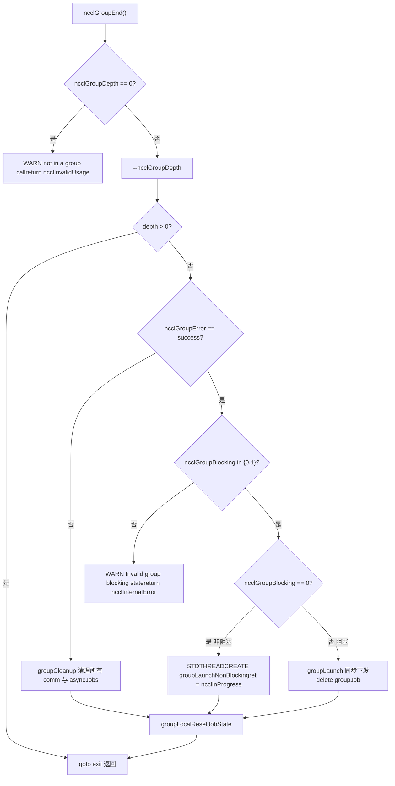

# Nächstes Kapitel: Kapitel 22 →

# Fortschritt des Gesamtbuchs: Kapitel 22 / 25

Kapitel 22: Produktions-Fehlerbehebung und Fallstricke: Häufige Deadlocks, Timeouts, Versionsinkompatibilitäten und Lösungsansätze

# Im vorherigen Kapitel haben wir die Fehlerbehebungsreihenfolge und die entscheidenden Stellschrauben der Leistungsoptimierung dargestellt. In Produktionsumgebungen sind NCCL-Ausfälle jedoch oft keine unzureichende Leistung, sondern Programme, die direkt hängen bleiben oder abstürzen. Die Ursachen dieser Ausfälle sind meist nicht falsch geschriebene Funktionen, sondern verletzte Aufrufreihenfolgen, Lebenszyklen oder Versionsverträge. Dieses Kapitel konzentriert sich auf vier der typischsten Fallstricke: Deadlocks durch Missbrauch der Group-Semantik, stille Fehler durch fehlende Parameterprüfung, ABI-Versionsinkompatibilität sowie die Grenzen von Timeout und Wiederholung. Wir folgen den vier Spuren src/group.cc, src/misc/argcheck.cc, src/include/checks.h und contrib/nccl_ep/nccl_ep.cc, um zu sehen, wie NCCL intern Fehler abfängt, bevor sie auftreten.

## Missbrauch der Group-Semantik: Warum ein fehlendes "GroupEnd" zum Hängen führt

Intuitives Modell: Group ist ein "Einkaufswagen", kein "Beschleunigungsschalter"`ncclGroupStart()` / `ncclGroupEnd()`Stellen Sie sich`ncclGroupEnd`wie einen Online-Einkaufswagen vor: Sie legen mehrere Artikel (mehrere Kommunikationsaufrufe) in den Warenkorb und bezahlen am Ende alles auf einmal (`ncclGroupDepth`). Wenn Sie nur einlegen und nicht bezahlen, bleibt der Warenkorb für immer in der Schwebe – der intern von NCCL verwaltete

> **[Design Inference & Architectural Trade-offs]**
> Dies ist die häufigste Deadlock-Form in der Produktion: Der Code befindet sich in einem Ausnahmezweig`return`, überspringt`ncclGroupEnd`, und`ncclGroupDepth`ist`thread_local`, wird nicht automatisch durch die Rückkehr der Funktion bereinigt.

## Datenstruktur: thread_localer group-Zustand

NCCL legt den gesamten group-Zustand im Thread-lokalen Speicher ab. Dies ist der Schlüssel zum Verständnis des Deadlocks.

[FACT:src/group.cc:34-34]

```cpp
thread_local int ncclGroupDepth = 0; // depth of ncclGroupStart nesting
thread_local ncclResult_t ncclGroupError = ncclSuccess;
thread_local struct ncclComm* ncclGroupCommHead[ncclGroupTaskTypeNum] = {nullptr};
thread_local struct ncclComm* ncclGroupCommPreconnectHead = nullptr;
thread_local struct ncclIntruQueue ncclAsyncJobs;
thread_local int ncclGroupBlocking = -1; /* default mode */
```

Feldweise Erläuterung:

- `ncclGroupDepth`: Verschachtelungstiefe.`ncclGroupStart`wird inkrementiert,`ncclGroupEnd`wird dekrementiert. Nur wenn auf 0 dekrementiert wird, wird tatsächlich die Übermittlung ausgelöst. Verschachtelung zu unterstützen ist eine Design-Erleichterung, bedeutet aber auch, dass ein „vergessenes End" die Tiefe für immer bei 1 stehen lässt.
- `ncclGroupError`: Der in diesem Thread akkumulierte group-Fehler. Sobald ein Aufruf fehlschlägt, nehmen nachfolgende`ncclGroupEnd`direkt den Fehlerpfad.
- `ncclGroupCommHead[]`: Die Kopfzeiger der Kommunikationsdomänen-Listen, gruppiert nach Aufgabentyp (collective / rawTask / mgmtTask / symRegister).
- `ncclAsyncJobs`: Die Warteschlange der auszuführenden asynchronen Aufgaben (z. B. preconnect, symmetric register).
- `ncclGroupBlocking`：`-1`bedeutet „noch keine Kommunikationsdomäne angetroffen",`0`bedeutet nicht-blockierend,`1`bedeutet blockierend. Dieses Feld ist der Kern der späteren Erkennung von „gemischter blockierender und nicht-blockierender Nutzung".

> **[Design Inference & Architectural Trade-offs]**
> Die Verwendung von`thread_local`statt globaler Variablen hat ein direktes Motiv: NCCL erlaubt es mehreren Threads, jeweils unabhängige group-Kontexte zu halten, ohne sich gegenseitig zu stören. Der Preis ist – diese Zustände werden beim Thread-Ende nicht automatisch bereinigt. Wenn ein Thread mitten in einer group beendet wird, gehen die Zustände verloren.

## Schritt für Schritt: Die vollständige Validierungskette eines GroupEnd

Szenario: Die Anwendung ruft`ncclGroupEnd()`auf, wobei`ncclGroupDepth`gleich 1 ist.

Erster Schritt: Prüfen, ob man sich tatsächlich in einer group befindet:

[FACT:src/group.cc:1048-1052]

```cpp
  if (ncclGroupDepth == 0) {
    WARN("ncclGroupEnd: not in a group call.");
    ret = ncclInvalidUsage;
    goto exit;
  }
```

Wenn der Benutzer`ncclGroupStart`nicht aufgerufen hat und direkt`ncclGroupEnd`aufruft, wird hier „not in a group call" ausgegeben und`ncclInvalidUsage`zurückgegeben. Dies ist der benutzerfreundlichste Fehler – sofortige Fehlermeldung, kein Hängen.

Zweiter Schritt: Tiefe dekrementieren, prüfen ob es die äußerste Ebene ist:

[FACT:src/group.cc:1061-1063]

```cpp
  if ((--ncclGroupDepth) > 0) goto exit;

  if ((ret = ncclGroupError) != ncclSuccess) goto fail;
```

Wenn mehrfach verschachtelt, dekrementiert das innere`End`nur die Tiefe und kehrt zurück, ohne die Übermittlung auszulösen. Nur die äußerste Ebene fährt fort. Gleichzeitig werden akkumulierte Fehler geprüft.

Dritter Schritt: Konsistenz des Blockiermodus validieren. Dies ist der Erkennungspunkt für „gemischte blockierende und nicht-blockierende Nutzung":

[FACT:src/group.cc:1095-1101]

```cpp
  if (hasCommHead || !ncclIntruQueueEmpty(&groupJob->asyncJobs) || ncclGroupCommPreconnectHead != nullptr) {
    /* make sure ncclGroupBlocking has been set. */
    if (ncclGroupBlocking != 0 && ncclGroupBlocking != 1) {
      WARN("Invalid group blocking state %d", ncclGroupBlocking);
      ret = ncclInternalError;
      goto fail;
    }
```

`ncclGroupBlocking`muss zwischen`{0, 1}`liegen. Wenn es noch`-1`ist, bedeutet dies, dass die group weder eine Kommunikationsdomäne noch asynchrone Aufgaben enthält und die Logik hier nicht hinkommen sollte.

Vierter Schritt: Verzweigung je nach Blockiermodus. Nicht-blockierend geht an die asynchrone Thread-Übermittlung, blockierend an die synchrone Übermittlung:

[FACT:src/group.cc:1102-1134]

```cpp
    if (ncclGroupBlocking == 0) {
      /* nonblocking group */
      if (!ncclIntruQueueEmpty(&groupJob->asyncJobs)) {
        ncclAsyncJob* job = ncclIntruQueueHead(&groupJob->asyncJobs);
        do {
          NCCLCHECKGOTO(ncclCommSetAsyncError(job->comm, ncclInProgress), ret, fail);
          if (job->comm->groupJob == NULL) {
            job->comm->groupJob = groupJob;
            groupJob->groupRefCount++;
          }
          job = job->next;
        } while (job);
      }
      ...
      groupJob->base.func = groupLaunchNonBlocking;
      STDTHREADCREATE_GOTO(groupJob->base.thread, ncclAsyncJobMain, ret, fail, &groupJob->base);
      groupJob->nonBlockingInit = true;
      ret = ncclInProgress;
    }
```

Beachten Sie`groupRefCount++`und`ret = ncclInProgress`: Im nicht-blockierenden Modus kehrt`ncclGroupEnd`sofort mit`ncclInProgress`zurück, die eigentliche Übermittlung läuft im Hintergrund-Thread. Der Aufrufer muss anschließend mit`ncclCommGetAsyncError`pollen oder mit`ncclGroupJobComplete`warten.

## Gemischte blockierende und nicht-blockierende Nutzung: Warum sie verboten ist

Zurück zu`ncclAsyncLaunch`, betrachten Sie die Mischungserkennung:

[FACT:src/group.cc:55-64]

```cpp
    /* check if there are blocking and nonblocking comms at the same time in group. */
    if (comm->destroyFlag) {
      ncclGroupBlocking = 1;
    } else if (ncclGroupBlocking == -1) {
      /* first met communicator */
      ncclGroupBlocking = comm->config.blocking;
    } else if (ncclGroupBlocking != comm->config.blocking) {
      WARN("Blocking and nonblocking communicators are not allowed in the same group.");
      ret = ncclInvalidArgument;
    }
```

> **[Design Inference & Architectural Trade-offs]**
> Warum ist die gemischte Nutzung verboten? Weil die Übermittlungssemantik einer blockierenden Kommunikationsdomäne „bei Rückkehr des Aufrufs ist der Kernel bereits übermittelt" lautet, während nicht-blockierend „bei Rückkehr des Aufrufs ist die Aufgabe eingereiht, aber nicht übermittelt" bedeutet. Wenn sich beide in derselben group befinden, kann`ncclGroupEnd`keine einheitliche Rückgabesemantik liefern – warten oder nicht warten? NCCL entscheidet sich für direkte Ablehnung und legt das Problem an die API-Grenze.

## Produktions-Fallstricke: Drei reale Szenarien

**Szenario eins: Ausnahmezweig verpasst GroupEnd.**Der Code wirft zwischen`ncclGroupStart`und`ncclGroupEnd`eine Ausnahme oder kehrt vorzeitig zurück.`return`，`ncclGroupDepth`bleibt bei 1 stehen. Alle nachfolgenden Kommunikationsaufrufe gehen in den „Sammel"-Zustand und werden nie übermittelt. Diagnosemethode: Vor`ncclGroupEnd`den Wert von`ncclGroupDepth`ausgeben oder mit`gdb`die thread_locale Variable beobachten.

**Szenario zwei: Verwendung derselben comm über Threads hinweg.**Da der group-Zustand`thread_local`ist, tritt Thread B nach dem Aufruf von`ncclGroupStart`durch Thread A nicht in die group von A ein, wenn Thread B`ncclAllReduce`aufruft. Wenn A und B dieselbe comm bedienen, entsteht ein Durcheinander, bei dem „einige Aufrufe innerhalb der group, einige außerhalb" liegen. NCCL erkennt dies nicht, da es annimmt, dass eine comm zu jedem Zeitpunkt nur von einem Thread bedient wird.

**Szenario drei: Interaktion zwischen CUDA graph capture und group.**Betrachten Sie die Erkennung in`doLaunches`:

[FACT:src/group.cc:448-455]

```cpp
    if (capturingYes && capturingNo) {
      // We have entered barriers but are aborting without leaving them. Thus
      // these comms are permanently trashed. We need a good mechanism for
      // tracking and reporting that.
      WARN("Either none or all communicators in a ncclGroup() can be CUDA graph captured.");
      result = ncclInvalidUsage;
      goto failure;
    }
```

Der Kommentar ist eindeutig: Sobald man in die Barriere eintritt und dann mittendrin aufgibt, sind diese comms „dauerhaft beschädigt". Die Regel lautet also – alle Kommunikationsdomänen in einer group müssen sich entweder alle im capture befinden oder alle nicht. Gemischte Nutzung führt zu inkonsistenten comm-Zuständen, und NCCL hat derzeit keinen guten Wiederherstellungsmechanismus.



# Parameterprüfung und stille Fehler: Wie ArgCheck „scheinbar normale" Aufrufe abfängt

## Intuitives Modell: ArgCheck ist die „Flughafensicherheitskontrolle"

Parameterprüfung ist wie die Flughafensicherheitskontrolle: Sie sorgt nicht dafür, dass Sie schneller fliegen, aber sie fängt Dinge ab, die „wie Gepäck aussehen, aber tatsächlich Gefahrgut sind". Ohne sie würde ein Zeiger auf das falsche Gerät dazu führen, dass der GPU-Kernel Müll liest, oder schlimmer – still den Speicher anderer beschädigt.

## Datenstruktur: Prüfmodi und globale Prüfwarteschlange

NCCLs Parameterprüfung prüft nicht „jedes Mal alles", sondern arbeitet mit Modi. Der Kern ist`comm->checkMode`：

[FACT:src/misc/argcheck.cc:227-251]

```cpp
  if (info->comm->checkMode != ncclCheckModeDefault) {
    if ((info->coll == ncclFuncSend || info->coll == ncclFuncRecv)) {
      if (info->count > 0) NCCLCHECK(CudaPtrCheck(info->recvbuff, info->comm, "buff", info->opName));
    } else if (info->coll == ncclFuncPutSignal || info->coll == ncclFuncSignal || info->coll == ncclFuncWaitSignal) {
      // One-sided RMA ops specify the remote destination via peerWin, not sendbuff/recvbuff,
      // so the standard CUDA pointer checks do not apply here.
      INFO(NCCL_COLL, "%s : skipping sendbuff/recvbuff pointer check (one-sided RMA uses peerWin)", info->opName);
    } else {
      // Check CUDA device pointers
      if (info->coll != ncclFuncBroadcast || info->comm->rank == info->root) {
        NCCLCHECK(CudaPtrCheck(info->sendbuff, info->comm, "sendbuff", info->opName));
      }
      if (info->coll != ncclFuncReduce || info->comm->rank == info->root) {
        NCCLCHECK(CudaPtrCheck(info->recvbuff, info->comm, "recvbuff", info->opName));
      }
    }

    if (info->comm->checkMode == ncclCheckModeDebugGlobal) {
      struct ncclArgsInfo* argsInfo;
      NCCLCHECK(ncclCalloc(&argsInfo, 1));
      argsInfo->info = *info;
      argsInfo->next = NULL;
      ncclIntruQueueEnqueue(&info->comm->argsInfoQueue, argsInfo);
    }
  }
```

Drei Modi:

- `ncclCheckModeDefault`: Nur die günstigsten Prüfungen (root-Bereich, Datentyp-Bereich, op-Bereich), ohne CUDA-API zu berühren.
- Nicht-Standardmodus: Ruft`CudaPtrCheck`auf, was tatsächlich`cudaPointerGetAttributes`aufruft und Performance-Overhead verursacht.
- `ncclCheckModeDebugGlobal`: Neben lokalen Prüfungen wird auch`ncclInfo`in die Warteschlange eingereiht`argsInfoQueue`, und wenn die Gruppe endet, eine globale Konsistenzprüfung über alle Ranks durchführen.

> **[Design Inference & Architectural Trade-offs]**
> Dieses Design ist eine Abwägung zwischen Leistung und Korrektheit:`cudaPointerGetAttributes`Es ist ein synchroner CUDA-Aufruf, und wenn er bei jeder Kommunikation im Hot Path aufgerufen wird, verlangsamt er kleine Nachrichten erheblich. Daher führt der Standardmodus nur eine "Nullkosten"-Prüfung durch und überlässt die teure Zeigerüberprüfung dem Debug-Modus.

## Schritt für Schritt: Die dreistufige Verteidigungslinie von CudaPtrCheck

Szenario: Der Benutzer übergibt einen`sendbuff`, und NCCL validiert ihn im Debug-Modus.

Erste Ebene: Ist der Zeiger gültig?

[FACT:src/misc/argcheck.cc:12-18]

```cpp
ncclResult_t CudaPtrCheck(const void* pointer, struct ncclComm* comm, const char* ptrname, const char* opname) {
  cudaPointerAttributes attr;
  cudaError_t err = cudaPointerGetAttributes(&attr, pointer);
  if (err != cudaSuccess || attr.devicePointer == NULL) {
    WARN("%s : %s %p is not a valid pointer", opname, ptrname, pointer);
    return ncclInvalidArgument;
  }
```

`cudaPointerGetAttributes`Bei ungültigen Zeigern wird ein Fehler zurückgegeben, oder`devicePointer`ist NULL. Dies fängt Fälle ab, in denen "eine Host-Stack-Adresse übergeben" oder "ein bereits freigegebener Zeiger übergeben" wurde.

Zweite Ebene: Stimmt das Gerät überein?

[FACT:src/misc/argcheck.cc:19-26]

```cpp
#if CUDART_VERSION >= 10000
  if (attr.type == cudaMemoryTypeDevice && attr.device != comm->cudaDev) {
#else
  if (attr.memoryType == cudaMemoryTypeDevice && attr.device != comm->cudaDev) {
#endif
    WARN("%s : %s allocated on device %d mismatchs with NCCL device %d", opname, ptrname, attr.device, comm->cudaDev);
    return ncclInvalidArgument;
  }
```

Dies ist die versteckteste Falle: Der Zeiger ist ein gültiger GPU-Zeiger, gehört aber zu einer anderen GPU. Auf Multi-GPU-Maschinen, wenn der Benutzer vergisst,`cudaSetDevice`, ist eine falsche Übergabe sehr leicht möglich. NCCL lehnt dies hier explizit ab.

Dritte Ebene: Integrität des Kommunikationsdomänen-Objekts:

[FACT:src/misc/argcheck.cc:38-45]

```cpp
ncclResult_t CommCheck(struct ncclComm* comm, const char* opname, const char* ptrname) {
  NCCLCHECK(PtrCheck(comm, opname, ptrname));
  if (comm->startMagic != NCCL_MAGIC || comm->endMagic != NCCL_MAGIC) {
    WARN("Error: corrupted comm object detected");
    return ncclInvalidArgument;
  }
  return ncclSuccess;
}
```

`startMagic` / `endMagic`ist ein Sentinel-Wert, der am Anfang und Ende der`ncclComm`-Struktur platziert wird. Wenn der Benutzer einen Wildzeiger übergibt oder comm bereits freigegeben wurde, stimmt die magic nicht überein. Dies ist die klassische Methode zur "Speicherbeschädigungserkennung" – die Struktur wird von zwei Sentinels eingeschlossen, und jeder Out-of-Bounds-Schreibvorgang kann einen davon beschädigen.

## Globale Konsistenzprüfung: Die rank-übergreifende Validierung von registrationCheck

Dies ist die "schwerste" Validierung in NCCL und wird nur unter`ncclCheckModeDebugGlobal`ausgelöst. Sie prüft, ob der symmetrische Speicherregistrierungsstatus aller Ranks konsistent ist.

[FACT:src/misc/argcheck.cc:95-111]

```cpp
  NCCLCHECKGOTO(bootstrapAllGather(comm->bootstrap, bufInfo, sizeof(struct symBufInfo) * 2), ret, fail);

  cmpBufInfo[0] = bufInfo[0];
  cmpBufInfo[1] = bufInfo[1];
  for (int r = 1; r nRanks; r++) {
    int infoIdx = r * 2;
    if (cmpBufInfo[0].isSymRegistered != bufInfo[infoIdx].isSymRegistered ||
        cmpBufInfo[1].isSymRegistered != bufInfo[infoIdx + 1].isSymRegistered) {
      if (comm->rank == 0) {
        WARN("Coll %s size %ld symmetric registration check failed on rank %d: sendReg %d recvReg %d mismatch with "
             "rank 0 sendReg %d recvReg %d",
             info->opName, size, r, bufInfo[infoIdx].isSymRegistered, bufInfo[infoIdx + 1].isSymRegistered,
             cmpBufInfo[0].isSymRegistered, cmpBufInfo[1].isSymRegistered);
      }
      ret = ncclInvalidArgument;
      goto fail;
    }
```

Sie sammelt über den Bootstrap-`allGather`die`(isSymRegistered, bigOffset, userOffset)`jedes Ranks und vergleicht sie Rank für Rank. Wenn der Send-Buffer von Rank 0 symmetrischen Speicher registriert hat, Rank 3 aber nicht, wird hier ein Fehler gemeldet.

> **[Design Inference & Architectural Trade-offs]**
> Warum ist diese Prüfung wichtig? Symmetrischer Speicher (symmetric memory) erfordert, dass alle Ranks denselben Satz virtueller Adressen für den Zugriff auf Puffer verwenden. Wenn der Puffer eines Ranks nicht registriert ist, ist die im Kernel berechnete Adresse falsch, und es wird Müll gelesen oder ein Out-of-Bounds-Zugriff erfolgt. Solche Fehler äußern sich zur Laufzeit als "Ergebnisse sind gelegentlich falsch" und sind extrem schwer zu diagnostizieren. NCCL entscheidet sich, dies an der API-Grenze mit den Kosten eines allGather abzufangen.

## Produktions-Fallstricke

**Falle 1: Im Standardmodus werden Zeigerfehler nicht gemeldet.**Wenn der Benutzer den Debug-Modus nicht aktiviert hat und einen Zeiger auf ein falsches Gerät übergibt, meldet NCCL keinen Fehler in der`ArgsCheck`-Phase, sondern erst bei der Kernel-Ausführung – zu diesem Zeitpunkt wurde möglicherweise bereits der Speicher eines anderen Ranks beschädigt. Es wird empfohlen, während der Entwicklung`NCCL_DEBUG=WARN`plus`checkMode`zum Debuggen zu verwenden.

**Falle 2:`ncclCheckModeDebugGlobal`Der allGather-Overhead von**Bei jeder Kommunikation wird ein Bootstrap-allGather durchgeführt, was in Szenarien mit kleinen Nachrichten und hoher Frequenz zum Engpass wird. Dieser Modus eignet sich nur zum Debuggen und nicht für die Produktion.

**Falle 3: Die Lebensdauer von userRedOp.**Betrachten Sie diesen Abschnitt:

[FACT:src/misc/argcheck.cc:220-225]

```cpp
  int opIx = int(ncclUserRedOpMangle(info->comm, info->op)) - int(ncclNumOps);
  if (ncclNumOps op &&
      (info->comm->userRedOpCapacity comm->userRedOps[opIx].freeNext != -1)) {
    WARN("%s : reduction operation %d unknown to this communicator", info->opName, info->op);
    return ncclInvalidArgument;
  }
```

Benutzerdefinierte Reduction-Ops werden auf der comm registriert. Wenn der Benutzer eine Op übergibt, die "einmal registriert, aber bereits freigegeben wurde",`freeNext != -1`wird erkannt, dass sie bereits zurückgewonnen wurde. Dies ist eine Prüfung zur Verhinderung von "dangling op handles".

# Fehlerpropagierungsmakros: Wie die NCCLCHECK-Familie sicherstellt, dass "Fehler nicht verloren gehen"

## Intuitives Modell: Fehlerpropagierungsmakros sind ein "Staffelstab"

Die Fehlerbehandlung von NCCL beruht auf einer Gruppe von Makros, die wie ein Staffellauf funktionieren: Die untere Funktion gibt`ncclResult_t`zurück, die obere Ebene prüft mit`NCCLCHECK`und kehrt bei Nicht-Erfolg sofort zurück. Das ist wie ein Staffellauf – der Stab (Fehlercode) muss bis zum Ende weitergegeben werden, und wenn eine Übergabe fehlschlägt, bricht die gesamte Kette ab.

## Datenstruktur: Überblick über die Makro-Familie

[FACT:src/include/checks.h:148-166]

```cpp
#define NCCLCHECK(call) \
  do { \
    ncclResult_t RES = call; \
    if (RES != ncclSuccess && RES != ncclInProgress) { \
      /* Print the back trace*/ \
      if (ncclDebugNoWarn == 0) INFO_LOC(NCCL_ALL, "-> %d", RES); \
      return RES; \
    } \
  } while (0)

#define NCCLCHECKGOTO(call, RES, label) \
  do { \
    RES = call; \
    if (RES != ncclSuccess && RES != ncclInProgress) { \
      /* Print the back trace*/ \
      if (ncclDebugNoWarn == 0) INFO_LOC(NCCL_ALL, "-> %d", RES); \
      goto label; \
    } \
  } while (0)
```

Wichtige Details:`ncclInProgress`wird als "kein Fehler" betrachtet. Dies ist der Kern der nicht-blockierenden Kommunikation –`ncclGroupEnd`gibt`ncclInProgress`zurück, was bedeutet "Aufgabe wurde eingereicht, aber noch nicht abgeschlossen", und der Aufrufer sollte weiter pollen, anstatt es als Fehler zu behandeln.

`NCCLCHECK`springt direkt zu`return`，`NCCLCHECKGOTO`. Letzteres wird für Szenarien verwendet, die eine Ressourcenbereinigung erfordern.`label`Bereinigungspfad: NCCLCHECKIGNORE behält den ersten Fehler

## Kopieren

[FACT:src/include/checks.h:168-177]

```cpp
// Report failure but continue - useful for cleanup paths where we want to
// attempt all cleanup steps. Preserves the first error in RES.
#define NCCLCHECKIGNORE(call, RES) \
  do { \
    ncclResult_t TMPRES = call; \
    if (TMPRES != ncclSuccess && TMPRES != ncclInProgress) { \
      if (ncclDebugNoWarn == 0) INFO_LOC(NCCL_ALL, "-> %d", TMPRES); \
      if (RES == ncclSuccess) RES = TMPRES; \
    } \
  } while (0)
```

Warten und Abbruch: Die abortFlag-Prüfung von NCCLWAIT

## Kopieren

[FACT:src/include/checks.h:196-205]

```cpp
#define NCCLWAIT(call, cond, abortFlagPtr) \
  do { \
    uint32_t* tmpAbortFlag = (abortFlagPtr); \
    ncclResult_t RES = call; \
    if (RES != ncclSuccess && RES != ncclInProgress) { \
      if (ncclDebugNoWarn == 0) INFO_LOC(NCCL_ALL, "-> %d", RES); \
      return ncclInternalError; \
    } \
    if (COMPILER_ATOMIC_LOAD(tmpAbortFlag, std::memory_order_acquire)) NEQCHECK(*tmpAbortFlag, 0); \
  } while (!(cond))
```

aufgerufen (Fortschritt vorantreiben), geprüft, ob`call`(ob erfüllt), und gleichzeitig geprüft, ob`cond`(ob abgebrochen).`abortFlag`verwendet`abortFlag`-Laden, um sicherzustellen, dass das von anderen Threads geschriebene Abbruchsignal gesehen wird.`memory_order_acquire`〔Designableitung und Architekturabwägung〕

> **[Design Inference & Architectural Trade-offs]**
> ist der Mechanismus zur rank-übergreifenden Verbreitung des Abbruchsignals – sobald es gesetzt ist, werden alle Warteschleifen beendet.`abortFlag`Sicherheitsmakros für Thread-Erstellung und Speicherzuweisung

## Kopieren

[FACT:src/include/checks.h:237-256]

```cpp
#define STDTHREADCREATE_IMPL(var, func, error_action, ...) \
  do { \
    try { \
      (var) = std::thread(func, __VA_ARGS__); \
    } catch (const std::exception& e) { \
      WARN("Thread creation failed: %s", e.what()); \
      error_action; \
    } \
  } while (0)

#define STDTHREADCREATE(var, func, ...) STDTHREADCREATE_IMPL(var, func, return ncclSystemError, __VA_ARGS__)

#define STDTHREADCREATE_GOTO(var, func, RES, label, ...) \
  STDTHREADCREATE_IMPL( \
    var, func, \
    do { \
      RES = ncclSystemError; \
      goto label; \
    } while (0), \
    __VA_ARGS__)
```

`std::thread`um, um zu verhindern, dass die Ausnahme die C-API-Grenze durchdringt.`ncclSystemError`Kopieren

[FACT:src/include/checks.h:258-275]

```cpp
#define NEW_NOTHROW(var, x) \
  do { \
    (var) = new (std::nothrow) x{}; \
    if (!(var)) { \
      WARN("Allocation failed"); \
      return ncclSystemError; \
    } \
  } while (0)
```

`new (std::nothrow)`Produktions-Fallstricke

## Falle 1:

**wird fälschlicherweise als Erfolg behandelt.`ncclInProgress`Einige Benutzercodes schreiben**, um Erfolg zu prüfen, aber im nicht-blockierenden Modus wird`if (ret == ncclSuccess)`zurückgegeben. Die korrekte Vorgehensweise ist`ncclInProgress`oder die Verwendung von`if (ret == ncclSuccess || ret == ncclInProgress)`zur Abfrage.`ncclCommGetAsyncError`Falle 2:

**坑二：`NCCLCHECK`Im Destruktor verwenden.**Wenn im Destruktor`NCCLCHECK`verwendet wird, wird der Fehler direkt`return`, und die nachfolgende Bereinigung wird übersprungen. Stattdessen sollte`NCCLCHECKIGNORE`。

# ABI-Versionsinkompatibilität: das size-basierte Design von nccl_ep

## Intuitives Modell: ABI ist der „Steckdosenstandard“

ABI (Application Binary Interface) ist wie ein Steckdosenstandard: Wenn die Bibliothek und der Aufrufer unterschiedliche Vorstellungen davon haben, „wie die Struktur aussieht“, ist das wie ein US-Stecker in einer EU-Steckdose – im besten Fall funktioniert es nicht, im schlimmsten Fall brennt es durch.`contrib/nccl_ep`verwendet ein cleveres Design: Jede grenzüberschreitende Struktur beginnt mit einem`size`-Feld.

## Datenstruktur: size + magic Doppelprüfung

[FACT:contrib/nccl_ep/nccl_ep.cc:70-76]

```cpp
// Size-based ABI versioning: every cross-boundary struct starts with a `size`
// field set by the caller to sizeof(struct). The library checks that against
// its own known size; any mismatch means caller and library are from different
// releases. Strict equality for now — see nccl_ep.h for the planned future
// relaxation (all-zero-trailing-bytes escape hatch).
// Immediately after `size` there is a `magic` field pre-filled by NCCL_EP_*_INIT
// to catch unininitialized structures.
```

Designpunkte:

- `size`Das`sizeof(struct)`-Feld wird vom Aufrufer gefüllt, und die Bibliothek prüft, ob es der von ihr erwarteten size entspricht.
- `magic`Das`NCCL_EP_*_INIT`-Feld wird durch das
- -Makro vorab gefüllt, um „nicht initialisierte“ Strukturen zu erkennen.

## Derzeit gilt strikte Gleichheit; zukünftig ist ein lockerer Modus geplant, bei dem „ein kleinerer size erlaubt ist, wenn der Rest vollständig null ist“.

[FACT:contrib/nccl_ep/nccl_ep.cc:77-80]

```cpp
#define EP_REQUIRE_STRUCT(ptr) \
    do { \
        assert( \
            (ptr) != nullptr && (ptr)->size == sizeof(*(ptr)) && \
```

Kopieren`ncclEpDispatch`、`ncclEpCombine`Dieses Makro wird an Einstiegspunkten wie

[FACT:contrib/nccl_ep/nccl_ep.cc:2827-2830]

```cpp
    EP_REQUIRE_STRUCT(inputs);
    EP_REQUIRE_STRUCT(outputs);
    EP_OPTIONAL_LAYOUT_INFO(layout_info);
    EP_OPTIONAL_STRUCT(config);
```

`inputs`Kopieren`outputs`und`EP_REQUIRE_STRUCT`；`layout_info`sind erforderliche Parameter, mit`config`und`EP_OPTIONAL_*`。

## sind optionale Parameter, mit

Versionssichere Feldlesung: layoutInfoRecvTopkIdxKind

[FACT:contrib/nccl_ep/nccl_ep.cc:139-144]

```cpp
// Safe field reader for ncclEpLayoutInfo_t::recv_topk_idx_kind. Returns AUTO
// when the caller's struct (size) does not cover the field, preserving the
// pre-flag default.
static inline ncclEpExpertIdKind_t layoutInfoRecvTopkIdxKind(const ncclEpLayoutInfo_t* lip) {
    if (lip == nullptr) return NCCL_EP_EXPERT_ID_AUTO;
    constexpr size_t field_end = offsetof(ncclEpLayoutInfo_t, recv_topk_idx_kind) + sizeof(ncclEpExpertIdKind_t);
    if (lip->size recv_topk_idx_kind;
}
```

Kopieren`size`Die Logik ist: Wenn der`AUTO`des Aufrufers kleiner ist als „der Offset, an dem dieses Feld endet“, bedeutet das, dass der Aufrufer eine ältere Version der Struktur verwendet, dieses Feld nicht existiert und der Standardwert

> **[Design Inference & Architectural Trade-offs]**
> 〔Designableitung und Architekturabwägungen〕`size`Dies ist die Standardmethode für ABI-Kompatibilität: Neue Felder dürfen nur am Ende der Struktur hinzugefügt werden, und beim Lesen wird mit

## geprüft, ob das Feld existiert. So können alte Aufrufer die alte Struktur verwenden, und die neue Bibliothek kann sie trotzdem korrekt verarbeiten.

[FACT:contrib/nccl_ep/nccl_ep.cc:1393-1400]

```cpp
    if (in_config->version != NCCL_EP_API_VERSION) {
        fprintf(
            stderr,
            "NCCL EP WARN: ncclEpGroupConfig_t.version=%u, library API_VERSION=%u; "
            "behavior may differ across versions.\n",
            in_config->version,
            (unsigned)NCCL_EP_API_VERSION);
    }
```

Kopieren`WARN`Beachten Sie, dass hier`return error`statt`size`steht. Eine Nichtübereinstimmung der Versionsnummer ist nur eine Warnung, da die

## -Prüfung bereits die Speicherlayoutsicherheit gewährleistet. Die Versionsnummer ist eher ein Hinweis darauf, dass „das Verhalten abweichen kann“.

**Produktionsfallen**Falle eins: Vergessen, mit dem INIT-Makro zu initialisieren.`memset`Wenn der Benutzer die Struktur manuell`magic`auf 0 setzt,`EP_REQUIRE_STRUCT`ist`NCCL_EP_*_INIT`0,

**und**schlägt fehl. Das`libnccl_ep.so`-Makro muss verwendet werden.`sizeof(struct)`Falle zwei: dynamische Bibliotheken über Versionen hinweg gemischt verwenden.`EP_REQUIRE_STRUCT`Wenn die Anwendung gegen eine neue Version von

**gelinkt ist, aber die Header-Datei von einer alten Version stammt,`EP_OPTIONAL_LAYOUT_INFO`ist**inkonsistent,

[FACT:contrib/nccl_ep/nccl_ep.cc:114-123]

```cpp
            if ((ptr)->size size > sizeof(*(ptr))) { \
                fprintf( \
                    stderr, \
                    "NCCL EP: ncclEpLayoutInfo_t size out of supported range: " \
                    "got %u, expected [%zu, %zu]\n", \
                    (ptr)->size, \
                    kNcclEpLayoutInfoMinSize, \
                    sizeof(*(ptr))); \
                return ncclInvalidArgument; \
            } \
```

`layout_info`meldet sofort einen Fehler. Das ist beabsichtigt – schnelles Scheitern ist besser als stiller Fehler.`[min, sizeof]`Falle drei:`EP_REQUIRE_STRUCT`Bereichsprüfung.`layout_info`Sehen Sie sich diesen Abschnitt an:

```mermaid
flowchart TD
    entry["ncclEpDispatch(inputs, outputs, layout_info, config)"] --> req_inputs{"EP_REQUIRE_STRUCT(inputs)size == sizeof?"}
    req_inputs -->|否| err_size["assert 失败 / 返回错误"]
    req_inputs -->|是| req_outputs{"EP_REQUIRE_STRUCT(outputs)"}
    req_outputs -->|否| err_size
    req_outputs -->|是| opt_layout{"layout_info != nullptr?"}
    opt_layout -->|否| skip_layout["跳过 layout 校验"]
    opt_layout -->|是| range_check{"size in [min, sizeof]?"}
    range_check -->|否| err_range["fprintf size out of rangereturn ncclInvalidArgument"]
    range_check -->|是| magic_check{"magic == NCCL_EP_MAGIC?"}
    magic_check -->|否| err_magic["fprintf magic mismatchreturn ncclInvalidArgument"]
    magic_check -->|是| read_field["layoutInfoRecvTopkIdxKindsize  read_field
    read_field --> proceed["继续执行 dispatch 逻辑"]
```

# erlaubt size im Bereich

## , was lockerer ist als die strikte Gleichheit von

. Der Grund ist, dass

## ein optionaler Parameter ist und sich die Felder historisch geändert haben.

Kopieren`abortFlag`Timeout, Wiederholung und Abbruch: von NCCLWAIT zu timeout_cycles in nccl_ep`ncclAsyncLaunch`Intuitives Modell: Timeout ist eine „Sicherung“

[FACT:src/group.cc:49-52]

```cpp
    job->abortFlag = comm->abortFlag;
    job->abortFlagDev = comm->abortFlagDev;
    job->childAbortFlag = comm->childAbortFlag;
    job->childAbortFlagDev = comm->childAbortFlagDev;
```

Datenstruktur: abortFlag und timeout_cycles

[FACT:src/group.cc:118-126]

```cpp
        if (!job->destroyFlag &&
            (COMPILER_ATOMIC_LOAD(groupAbortFlag, std::memory_order_acquire) || errorJobAbortFlag == true)) {
          COMPILER_ATOMIC_STORE(job->abortFlag, uint32_t(1), std::memory_order_release);
          COMPILER_ATOMIC_STORE(job->abortFlagDev, uint32_t(1), std::memory_order_release);
          if (job->childAbortFlag) {
            COMPILER_ATOMIC_STORE(job->childAbortFlag, uint32_t(1), std::memory_order_release);
            COMPILER_ATOMIC_STORE(job->childAbortFlagDev, uint32_t(1), std::memory_order_release);
          }
        }
```

, um das Abbruchsignal zu verbreiten. Sehen Sie sich die Weitergabe in`groupAbortFlag`an:`errorJobAbortFlag`Kopieren`memory_order_release`Jeder Job hält einen Zeiger auf das abortFlag der comm. Wenn die Gruppe einen Fehler erkennt:

## Kopieren

`nccl_ep`Sobald

[FACT:contrib/nccl_ep/nccl_ep.cc:1558-1591]

```cpp
    // Resolve timeout_cycles: env var > config field > compile-time default
    {
        int dev;
        int clock_khz_int;
        CUDA_CHECK(cudaGetDevice(&dev));
        CUDA_CHECK(cudaDeviceGetAttribute(&clock_khz_int, cudaDevAttrClockRate, dev));
        uint64_t clock_khz = static_cast(clock_khz_int);

        uint64_t resolved = NUM_TIMEOUT_CYCLES;
        const char* source = "compile-time default";
        const uint64_t env_ms = static_cast(ep_group->env.timeout_ms.value.ul);
        // Only a positive timeout overrides the default.
        const bool have_env_ms = ep_group->env.timeout_ms.is_set && env_ms > 0;

        if (have_env_ms) {
            resolved = clock_khz * 1000ULL * env_ms / 1000ULL;
            source = "NCCL_EP_TIMEOUT_MS env var";
            ...
        } else if (ep_group->config.timeout_ns != 0) {
            resolved = clock_khz * 1000ULL * (ep_group->config.timeout_ns / 1000000ULL) / 1000ULL;
            source = "config.timeout_ns";
        }

        ep_group->timeout_cycles = resolved;
```

wahr ist, werden die abortFlags aller Jobs auf 1 gesetzt.`NCCL_EP_TIMEOUT_MS`stellt sicher, dass vorherige Schreibvorgänge für andere Threads sichtbar sind.`timeout_ns`Das Timeout-Design von nccl_ep: GPU-Taktzyklen`clock_khz * 1000 * ms / 1000`verwendet ein feineres Timeout – in Einheiten von GPU-Taktzyklen.

> **[Design Inference & Architectural Trade-offs]**
> Die Priorität ist: Umgebungsvariable`clock64()`> Konfigurationsfeld

## > Compile-Zeit-Standardwert. Die Umrechnungsformel lautet

[FACT:contrib/nccl_ep/nccl_ep.cc:1767-1778]

```cpp
    // Allocate mask buffer and async error flag for active-mask support
    if (ep_group->config.enable_mask && ep_group->config.algorithm == NCCL_EP_ALGO_LOW_LATENCY) {
        size_t mask_bytes = ep_group->nRanks * sizeof(int);
        CUDA_CHECK(cudaMalloc(reinterpret_cast(&ep_group->mask_buffer), mask_bytes));
        // Initialize all ranks as active (1 = active, 0 = masked/failed)
        std::vector all_active(ep_group->nRanks, 1);
        CUDA_CHECK(
            cudaMemcpyAsync(ep_group->mask_buffer, all_active.data(), mask_bytes, cudaMemcpyHostToDevice, stream));
        CUDA_CHECK(
            cudaHostAlloc(reinterpret_cast(&ep_group->async_error_flag), sizeof(int), cudaHostAllocMapped));
        *ep_group->async_error_flag = 0;
    }
```

`async_error_flag`〔Designableitung und Architekturabwägungen〕`cudaHostAllocMapped`Warum Taktzyklen statt Millisekunden? Weil die Warteschleife im GPU-Kernel keine Systemzeit-API aufrufen kann und nur das

## -Register lesen kann. Mit Taktzyklen als Timeout-Kriterium kann der Kernel direkt vergleichen, ohne dass der Host eingreifen muss.

[FACT:contrib/nccl_ep/nccl_ep.cc:4312-4321]

```cpp
ncclResult_t ncclEpGetAsyncError(ncclEpGroup_t ep_group, int* error_out) {
    EP_HOST_ASSERT(ep_group != nullptr);
    if (!ep_group->config.enable_mask) {
        return ncclInvalidUsage;
    }
    EP_HOST_ASSERT(ep_group->async_error_flag != nullptr && "ncclEpGetAsyncError: enable_mask must be true");
    EP_HOST_ASSERT(error_out != nullptr);
    *error_out = __atomic_load_n(ep_group->async_error_flag, __ATOMIC_ACQUIRE);
    return ncclSuccess;
}
```

Kopieren`__atomic_load_n`wird mit`__ATOMIC_ACQUIRE`allokiert; dies ist host-pinned Speicher, der in den Geräteadressraum gemappt ist. Der GPU-Kernel kann ihn schreiben, der Host kann ihn lesen, ohne explizites Kopieren.

## Asynchrone Fehler lesen: atomares Laden

**Kopieren**Mit`NCCL_EP_TIMEOUT_MS`plus

**wird sichergestellt, dass der neueste von der GPU geschriebene Wert gelesen wird und nicht ein veralteter Wert aus dem Cache.**Produktionsfallen`ncclCommAbort`Falle eins: zu kurz eingestellter Timeout führt zu Fehlalarmen.

**Wenn`ncclEpMaskClean`zu klein eingestellt ist, wird normales Netzwerk-Jitter fälschlich als Timeout gewertet. Es wird empfohlen, ihn anhand der tatsächlichen Netzwerk-RTT festzulegen, in der Regel nicht unter 10 Sekunden.**Falle zwei: abortFlag wird nach dem Setzen nicht zurückgesetzt.

[FACT:contrib/nccl_ep/nccl_ep.cc:4262-4266]

```cpp
    EP_HOST_ASSERT(ep_group->config.algorithm == NCCL_EP_ALGO_LOW_LATENCY);
    EP_HOST_ASSERT(
        ep_group->rdma_buffer != nullptr &&
        "ncclEpMaskClean: rdma_buffer not yet allocated; create at least one LL handle first");
    EP_HOST_ASSERT(ep_group->sync_buffer != nullptr && ep_group->sync_window != nullptr);
```

`ncclEpMaskClean`erledigt diese Bereinigung.`rdma_buffer`Falle drei:`rdma_buffer`Vorbedingung.

# Sehen Sie sich diesen Abschnitt an:

Kopieren

1. **erfordert, dass**：`ncclGroupDepth`bereits allokiert ist. Wenn der Benutzer eine Gruppe erstellt, aber noch kein LL-Handle erstellt hat,`ncclGroupEnd`führt zu dauerhaftem Hängen; blockierende und nicht-blockierende Kommunikationsdomänen dürfen nicht gemischt werden; CUDA graph capture muss alles-oder-nichts sein.

2. **Parameterprüfung**：`ArgsCheck`Modusabhängige Prüfung, der Standardmodus führt nur kostenlose Prüfungen durch;`CudaPtrCheck`Drei Verteidigungslinien blockieren ungültige Zeiger, falsche Geräte, beschädigte comm;`registrationCheck`Führt eine rank-übergreifende symmetrische Speicherkonsistenzprüfung durch.

3. **Fehlerpropagierung**：`NCCLCHECK`Die Familie garantiert, dass Fehler nicht verloren gehen;`ncclInProgress`ist kein Fehler;`NCCLCHECKIGNORE`Für den Bereinigungspfad wird der erste Fehler beibehalten;`NCCLWAIT`In der Polling-Schleife wird abortFlag geprüft.

4. **ABI-Version**：`nccl_ep`Verwendet ein size-basiertes Design, jede grenzüberschreitende Struktur beginnt mit`size`, zusammen mit`magic`zur Erfassung von Nicht-Initialisierung; neue Felder dürfen nur am Ende hinzugefügt werden, beim Lesen wird`size`verwendet, um die Existenz zu bestimmen.

5. **Timeout und Abbruch**: Der Kern verwendet`abortFlag`zur Propagierung des Abbruchs;`nccl_ep`Verwendet GPU-Taktzyklen für Timeouts,`async_error_flag`Verwendet host-pinned Speicher für GPU→host asynchrone Benachrichtigung.

# Gedanken und Selbsttest dieses Kapitels

Q1: Wenn man in`ncclGroupEndInternal``if ((--ncclGroupDepth) > 0) goto exit;`（[FACT:src/group.cc:1061]) zu`if (ncclGroupDepth > 0) goto exit;`(ohne Dekrementierung) ändert, was passiert? Welche Konsequenzen hat das in verschachtelten group-Szenarien?

**Referenzanalyse**：

Der ursprüngliche Code`--ncclGroupDepth`dekrementiert zuerst und prüft dann. Wenn man zu keiner Dekrementierung ändert:

```cpp
if (ncclGroupDepth > 0) goto exit;  // 错误版本
```

Dann wird bei jedem`ncclGroupEnd`die Tiefe nicht verringert. Angenommen, der Benutzer schreibt:

```cpp
ncclGroupStart();  // depth = 1
ncclGroupStart();  // depth = 2
ncclAllReduce(...);
ncclGroupEnd();    // 原版: depth = 1, 返回; 错误版: depth = 2, 返回
ncclGroupEnd();    // 原版: depth = 0, 触发下发; 错误版: depth = 2, 返回
```

In der fehlerhaften Version ist beim zweiten`ncclGroupEnd`das`ncclGroupDepth`immer noch 2,`> 0`gilt, direkt`goto exit`, und es wird nie die Auslösung ausgelöst. Alle Kommunikationsaufrufe bleiben im "Sammelbestellungs"-Zustand, der Prozess hängt.

Noch subtiler ist:`ncclGroupDepth`ist thread_local und wird nicht durch die Rückkehr der Funktion zurückgesetzt. Selbst wenn der nachfolgende Code die group-API nicht mehr aufruft, wird die gesamte Kommunikation auf diesem Thread ungültig.

Diese Änderung würde auch die Paarungssemantik von`ncclGroupStart`zerstören —`ncclGroupStart`inkrementiert,`ncclGroupEnd`dekrementiert nicht, die Tiefe wächst nur und nimmt nie ab, und läuft schließlich über (obwohl ein int-Überlauf 2 Milliarden Aufrufe erfordern würde, ist ein logisches Hängen in der Praxis wahrscheinlicher).

Q2: `CudaPtrCheck`In`attr.type == cudaMemoryTypeDevice && attr.device != comm->cudaDev`（[FACT:src/misc/argcheck.cc:20]) diese Prüfung, wenn man die Bedingung`attr.type == cudaMemoryTypeDevice`entfernt, welche Probleme entstehen? In welchen Szenarien kommt es zu Fehlalarmen?

**Referenzantwort**：

`cudaPointerAttributes.type`hat drei mögliche Werte:`cudaMemoryTypeDevice`(Gerätespeicher),`cudaMemoryTypeHost`(Host-Speicher),`cudaMemoryTypeManaged`(Unified Memory).

Wenn man die Bedingung`attr.type == cudaMemoryTypeDevice`entfernt, wird daraus:

```cpp
if (attr.device != comm->cudaDev) {  // 错误版本
```

Dann kann für Host-Speicher oder Managed-Speicher`attr.device`-1 oder 0 sein, was nicht mit`comm->cudaDev`übereinstimmt, und es kommt zu einem Fehlalarm "Gerät stimmt nicht überein".

Konkretes Szenario: Der Benutzer übergibt einen von`cudaMallocManaged`zugewiesenen Zeiger. Der`attr.device`von Managed-Speicher ist normalerweise das Gerät zum Zeitpunkt der Zuweisung, aber wenn der Speicher auf ein anderes Gerät migriert wird, kann`attr.device`sich ändern. Häufiger ist Host-Speicher (z. B. mit`cudaHostAlloc`zugewiesener pinned Speicher),`attr.device`ist -1 und stimmt mit keinem`cudaDev`überein, was zu einem Fehlalarm führt.

NCCL erlaubt Host-Speicher als Kommunikationspuffer (über`cudaMemcpy`Weiterleitung), daher muss zwischen "Gerätespeicher, aber falsches Gerät" und "Nicht-Gerätespeicher" unterschieden werden. Ersteres ist ein Fehler, Letzteres ist legal.

Q3: `layoutInfoRecvTopkIdxKind`（[FACT:contrib/nccl_ep/nccl_ep.cc:139-144]) verwendet`lip->size < field_end`zur Bestimmung, ob ein Feld existiert. Wenn eine neue Version ein Feld in der Mitte der Struktur einfügt (statt am Ende), wie versagt diese Bestimmung? Warum schreibt das ABI-Design vor, dass neue Felder nur am Ende hinzugefügt werden dürfen?

**Referenzanalyse**：

Angenommen, die ursprüngliche Struktur ist:

```c
struct ncclEpLayoutInfo_t {
    unsigned int size;
    unsigned int magic;
    ncclEpExpertIdKind_t recv_topk_idx_kind;  // offset = 8
};
```

`field_end = offsetof(recv_topk_idx_kind) + sizeof(...) = 8 + 4 = 12`。

Wenn die neue Version zwischen`magic`und`recv_topk_idx_kind`ein Feld einfügt:

```c
struct ncclEpLayoutInfo_t {
    unsigned int size;
    unsigned int magic;
    unsigned int new_field;                    // 新插入
    ncclEpExpertIdKind_t recv_topk_idx_kind;  // offset 变成 12
};
```

Zu diesem Zeitpunkt ist`field_end = 12 + 4 = 16`. Der`size`des alten Aufrufers ist 12 (alte Strukturgröße),`12 < 16`gilt, die Funktion gibt`AUTO`zurück — aber der alte Aufrufer hat tatsächlich das Feld`recv_topk_idx_kind`, nur mit anderem Offset. Dies führt dazu, dass das vom alten Aufrufer gesetzte`recv_topk_idx_kind`ignoriert wird.

Schlimmer noch: Wenn der alte Aufrufer gemäß dem alten Offset (8)`recv_topk_idx_kind`schreibt, liest die neue Bibliothek gemäß dem neuen Offset (12) und liest den Wert von`new_field`, völlig verfälscht.

Daher lautet die eiserne Regel des ABI-Designs:**Neue Felder dürfen nur am Ende der Struktur hinzugefügt werden**. Auf diese Weise ist der`size`des alten Aufrufers kleiner als der`field_end`des neuen Feldes, die Funktion gibt korrekt den Standardwert zurück; der`size`des neuen Aufrufers deckt das neue Feld ab, und das Lesen funktioniert normal. Das Einfügen von Feldern in der Mitte zerstört alle auf`offsetof`basierenden Versionsbestimmungen.

Dieses Kapitel analysiert vier typische Fallstricke in Produktionsumgebungen und ihre internen Verteidigungsmechanismen. Diese Randbedingungen erinnern uns daran, dass der stabile Betrieb von NCCL nicht nur von der Kernimplementierung abhängt, sondern auch von der Anpassung und Erweiterung des umgebenden Ökosystems. Im nächsten Kapitel wenden wir uns dem Ökosystem und den Erweiterungen zu und schauen, wie umliegende Projekte wie nccl4py, nccl4rust, nccl_ep, nccl_ubx die Fähigkeiten von NCCL einem breiteren Benutzerkreis zugänglich machen.
