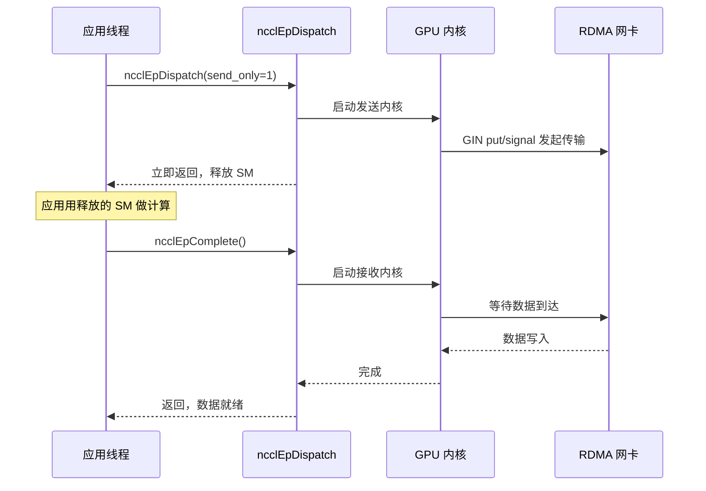
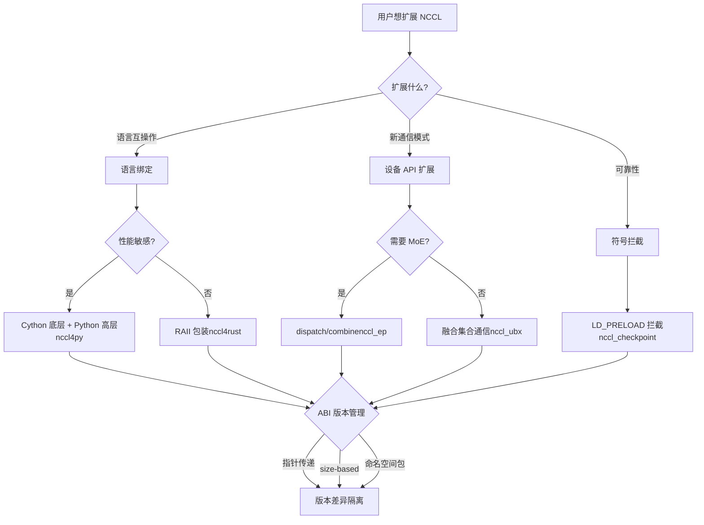

# Kapitel 23: Ökosystemerweiterung: nccl4py, nccl4rust, nccl_ep, nccl_ubx und andere umliegende Projekte

Im vorherigen Kapitel haben wir typische NCCL-Ausfälle in Produktionsumgebungen untersucht – Missbrauch der group-Semantik, nicht übereinstimmende rank-Anzahlen, Stream-Interaktionen, ABI-Versionskonflikte und Netzwerk-Timeouts. Diese Probleme treten meist bei der direkten Nutzung der C ABI auf, während moderne Trainingsframeworks für große Modelle die C ABI oft nicht direkt aufrufen, sondern die Fähigkeiten von NCCL über Sprachbindings wie Python oder Rust oder über Erweiterungsprojekte für Szenarien wie MoE und Ultra-Bandbreiten-Kommunikation wiederverwenden. Diese umgebenden Projekte liegen in den Verzeichnissen bindings/ und contrib/ und sind als experimentell und community-gepflegt positioniert; sie erben nicht die Release-Qualitätsgarantie der Kernbibliothek. Dieses Kapitel analysiert nacheinander nccl4py, nccl4rust, nccl_ep, nccl_ubx und nccl_checkpoint und zeigt, wie sie über drei Wege – Sprachbindings, Geräte-API-Erweiterungen und Symbol-Interception – außerhalb des Kerns ein reichhaltiges Ökosystem aufbauen.

# nccl4py: Cython-Bindings und Namespace-Paket-Design

## Intuitives Modell: Die C ABI in eine für Python verständliche Sprache übersetzen

Stellen Sie sich vor, der NCCL-Kern ist ein Diplomat, der nur C spricht, und das Python-Trainingsskript ist ein Praktikant, der nur Python spricht. nccl4py ist dieser Übersetzer – er ändert nicht, was der Diplomat sagt (das Verhalten von NCCL), sondern übersetzt nur „`ncclAllReduce(sendbuff, recvbuff, count, ...)`“ in „`nccl.all_reduce(tensor)`“. Ohne diese Übersetzungsschicht müsste jedes Python-Framework selbst ctypes-Bindings schreiben, was Doppelarbeit und Fehleranfälligkeit bedeutet.

## Schichtenstruktur: Cython-Unterbau + Python-Oberschicht

Das Design von nccl4py ist zweischichtig: Der Unterbau sind Cython-Bindings (`nccl/bindings/cynccl.pxd`), die Oberschicht ist die Python-API (`nccl.core`). Das README nennt diese Schichtung ausdrücklich.[FACT:bindings/nccl4py/README.md:4-4]：

> `nccl4py provides low-level Cython bindings and a high-level Python API`

Die Cython-Bindings werden als`.pxd`-Dateien mit dem Wheel verteilt, damit andere Cython-Erweiterungen direkt`cimport` [FACT:bindings/nccl4py/README.md:39-43]：

```cython
from nccl.bindings cimport cynccl
```

> **[Design Inference & Architectural Trade-offs]**
> Warum die Cython-Schicht und nicht nur die Python-Schicht offenlegen? Weil bei einigen Frameworks (z. B. DeepSpeed, Megatron) die Kernschleife in Cython liegt und der Overhead des Python-Interpreters bei jedem Aufruf zu groß wäre. Direkt`cimport cynccl`ermöglicht Cython-Erweiterungen, NCCL-Funktionen mit nahezu C-nahem Zero-Overhead aufzurufen. Dies ist ein typisches Design der „geschichteten Offenlegung“ – die Oberschicht für normale Nutzer, der Unterbau für performancekritische Szenarien.

## Namespace-Paket: Mehrere Distributionen teilen sich das Präfix`nccl`

Dies ist das raffinierteste Design von nccl4py.`nccl`ist ein implizites PEP-420-Namespace-Paket[FACT:bindings/nccl4py/README.md:50-51]：

> `nccl` is a PEP 420 implicit namespace package. nccl4py provides `nccl.bindings` and `nccl.core`; other NCCL extension distributions can provide additional `nccl.*` subpackages.

> **[Design Inference & Architectural Trade-offs]**
> In traditionellen Python-Paketen würde`nccl/__init__.py`den gesamten Namespace`nccl`„besitzen“. Wenn die Python-Bindings von nccl4py und nccl_ep beide`nccl.xxx`bereitstellen wollten, gäbe es einen Konflikt – wer zuerst installiert, gewinnt. PEP-420-Namespace-Pakete lösen dieses Problem: Ohne`__init__.py`können mehrere Distributionen jeweils Unterpakete in das Verzeichnis`nccl/`legen, und das Python-Importsystem führt sie zusammen. Daher stellt nccl4py`nccl.bindings`und`nccl.core`bereit, nccl_ep stellt`nccl.ep`bereit, und beide können koexistieren[FACT:contrib/nccl_ep/README.md:80-82]。

Dieses Design ist entscheidend für die Ökosystem-Erweiterung: Jeder Dritte, der künftig`nccl.monitoring`、`nccl.profiling`hinzufügen möchte, muss den Code von nccl4py nicht ändern.

## CUDA-Versionsauswahl: Der extra-Mechanismus

Bei der Installation verwendet man`nccl4py[cu12]`oder`nccl4py[cu13]`zur Auswahl der CUDA-Hauptversion[FACT:bindings/nccl4py/README.md:13-17]. Das README erklärt den Grund: Extras installieren die entsprechenden NCCL-Runtime- und CUDA-Python-Abhängigkeiten[FACT:bindings/nccl4py/README.md:19]. Veröffentlichte Wheels benötigen weder`CUDA_HOME`noch ein lokales CUDA Toolkit, aber die Kompilierung aus dem Quellcode benötigt[FACT:bindings/nccl4py/README.md:20-21]。

> **[Design Inference & Architectural Trade-offs]**
> Dies ist die Standardmethode des Python-Ökosystems zum Umgang mit der Fragmentierung von CUDA-Versionen. Die ABIs von CUDA 12 und 13 sind inkompatibel; ein einziges Wheel kann nicht beides abdecken. Durch Extras wählt pip die korrekten binären Abhängigkeiten entsprechend der Benutzerumgebung aus und vermeidet, dass eine Versionsinkompatibilität erst zur Laufzeit entdeckt wird.

## Produktions-Fallstricke

**Falle eins: Namespace-Paket-Konflikt mit`__init__.py`.**Wenn ein Drittanbieterpaket unter`nccl/`ein`__init__.py`ablegt, wird der PEP-420-Namespace-Paketmechanismus zerstört, was zum Fehlschlagen des Imports von`nccl.core`führt. Diagnosemethode:`python -c "import nccl; print(nccl.__path__)"`, wenn`AttributeError`gemeldet wird, bedeutet dies, dass`nccl`kein Namespace-Paket ist.

**Falle zwei: Cython-ABI-Versionsdrift.** `cynccl.pxd`ist eine experimentelle API[FACT:bindings/nccl4py/README.md:32-32], bei einem NCCL-Upgrade kann sich`.pxd`ändern. Cython-Erweiterungen, die von`cimport cynccl`abhängen, müssen strikt zur nccl4py-Version passen, sonst schlägt die Symbolauflösung zur Kompilierzeit fehl.

# nccl4rust: RAII-Eigentum und geräteseitige Grenzen

## Intuitives Modell: Den Compiler den Lebenszyklus verwalten lassen

In C erhält man mit`ncclCommInitRank`einen Communicator und muss ihn nach Gebrauch`ncclCommDestroy`. Vergisst man die Zerstörung, entsteht ein Leck; zerstört man zu früh, stürzt es ab. Rusts RAII-Mechanismus (Resource Acquisition Is Initialization) lässt den Compiler beim Verlassen des Gültigkeitsbereichs automatisch den Destruktor aufrufen – wie eine Hotelzimmerkarte: Beim Check-out rechnet das System automatisch ab, ohne dass man manuell zur Rezeption gehen muss.

Der Kernwert von nccl4rust besteht darin, diese Ownership-Semantik auf die C-ABI von NCCL anzuwenden.

## Schichtenstruktur: Fünf Crates mit jeweils eigener Zuständigkeit

Die Layout-Tabelle im README listet fünf Crates auf[FACT:contrib/nccl4rust/README.md:20-28]：

| Path | Purpose |
| --- | --- |
| `crates/nccl-sys` | Von bindgen generierte rohe Host-ABI |
| `crates/nccl` | Rust-artiger Host-Wrapper + RAII-Ownership |
| `crates/nccl-device-sys` | `no_std`CUDA-Oxide-Gerätedeklaration |
| `crates/nccl-device` | Typisierte`DevComm`、`Team`、`Window`Wrapper |
| `shim/` | Reiner C-ABI-Shim, verwendet nur öffentliche Header |

> **[Design Inference & Architectural Trade-offs]**
> Diese Aufteilung ist bewusst gewählt. Das README erklärt die Motivation[FACT:contrib/nccl4rust/README.md:30-32]: Host-Anwendungen können nur`nccl`verwenden, ohne einen Rust-GPU-Compiler zu benötigen; CUDA-Oxide-Kernel verwenden`nccl-device`; Konsumenten, die die rohe ABI benötigen, können`-sys`-Crate wählen. Diese „bedarfsgerechte Schichtung" ermöglicht es verschiedenen Nutzern, nur die Kompilierungskosten zu tragen, die sie benötigen.

## Zentrale Designentscheidung: Gerätekommunikatoren per Zeiger statt per Wert übergeben

Dies ist die lernenswerteste Designentscheidung von nccl4rust. Der Abschnitt „Host/device ownership boundary" im README[FACT:contrib/nccl4rust/README.md:211-219]：

> `ncclDevCommCreate` produces a versioned public structure in host memory. The host `DeviceCommunicator` wrapper owns that structure and destroys it before its parent communicator. CUDA-Oxide remains responsible for allocating device memory, copying those bytes, and keeping the copy alive while kernels execute. Kernels construct `nccl_device::DevComm` from a pointer to that device copy. Using a pointer rather than a by-value Rust mirror keeps the versioned C struct layout out of the kernel argument ABI.

> **[Design Inference & Architectural Trade-offs]**
> Warum keine Rust-Structs als Spiegel der C-Structs? Weil`ncclDevComm_t`versioniert ist – verschiedene NCCL-Versionen können unterschiedliche Felder haben. Wenn Kernel-Parameter Rust-Spiegel per Wert übergeben, dann bindet die Kernel-ABI das Struct-Layout einer bestimmten NCCL-Version. Sobald NCCL das Struct aktualisiert, müssen alle kompilierten Kernel neu kompiliert werden. Bei Übergabe per Zeiger wird nur eine Adresse übergeben, der Kernel greift über den Zeiger zu, und Layout-Änderungen beeinflussen die ABI nicht. Dies ist derselbe Ansatz wie die im vorherigen Kapitel beschriebene`ncclEpLayoutInfo_t`size-based ABI –**Versionsunterschiede hinter Zeigern isolieren**。

## Sicherheitsgrenze: Was ist unsafe

Der Abschnitt „Current API contracts" im README listet sechs Verträge auf[FACT:contrib/nccl4rust/README.md:230-249], darunter die wichtigsten:

- Rohe`-sys`-Crate spiegelt nur die C-ABI, ohne Ownership- oder Lifetime-Validierung[FACT:contrib/nccl4rust/README.md:232-233]
- Aktuelle kollektive Kommunikations- und Punkt-zu-Punkt-Wrapper akzeptieren rohe Gerätezeiger, deklariert als`unsafe` [FACT:contrib/nccl4rust/README.md:42-45]
- Zeigertranslationsmethoden geben rohe Gerätezeiger zurück, können Offset-Grenzen, Ausrichtung, Peer-Mitgliedschaft, Aliasing oder Fenster-Lebensdauer nicht validieren[FACT:contrib/nccl4rust/README.md:242-244]

> **[Design Inference & Architectural Trade-offs]**
> Dies ist die grundlegende Schwierigkeit bei Rust-Bindings für NCCL: Viele API-Verträge von NCCL besagen „Der Puffer muss gültig bleiben, bis der CUDA-Stream abgeschlossen ist", aber das Rust-Typsystem kann das asynchrone Ereignis „Stream-Abschluss" nicht ausdrücken. Daher können diese Methoden nur`unsafe`sein, wobei die Verantwortung an den Aufrufer zurückgegeben wird. Das README weist auch auf Verbesserungsrichtungen hin[FACT:contrib/nccl4rust/README.md:44-45]: Eine stream-aware Puffer-Abstraktion könnte diese Anforderungen in eine sichere API kodieren. Dies ist zukünftige Arbeit.

## Geräteseite: CUDA-Oxide und LTOIR-Shim

Die zentrale Herausforderung auf der Geräteseite: Die Geräte-API von NCCL ist ein C++-Template, während Rust-Gerätecode (CUDA-Oxide) eine C-ABI benötigt. Die Lösung ist ein C++-Shim[FACT:contrib/nccl4rust/README.md:26]：

> `shim/` — CUDA C++ C-ABI shim built exclusively from public `nccl.h` and `nccl_device.h`

Der Shim wird zu LTOIR (LLVM Intermediate Representation) kompiliert und zusammen mit Rust PTX zu cubin gelinkt[FACT:contrib/nccl4rust/README.md:165-167]. Das README beschreibt den Build-Prozess[FACT:contrib/nccl4rust/README.md:158-163]：

```bash
make device \
  NCCL_INCLUDE_DIR="$NCCL_INCLUDE_DIR" \
  CUDA_HOME="$CUDA_HOME" \
  ARCH=90
```

> **[Design Inference & Architectural Trade-offs]**
> LTOIR ist NVIDIAs Zwischenformat für Link-Time-Optimierung. LTOIR statt direkter Kompilierung zu cubin wird verwendet, um dem Shim und Rust-Kerneln sprachübergreifende Optimierungen zur Link-Zeit zu ermöglichen – beispielsweise das Inlining von Shim-Funktionen in Rust-Kernel. Dies ist die Schlüsseltechnologie für die gemischte Programmierung von „C++-Templates + Rust-Kerneln".

## Produktions-Fallstricke

**Fallstrick eins: NCCL-Version muss exakt übereinstimmen.**Das README fordert ausdrücklich`Matching NCCL 2.31 headers and runtime` [FACT:contrib/nccl4rust/README.md:80-81], weil der Prototyp direkt Felder initialisiert, die in frühen Versionen der NCCL-Geräte-API anders waren. Header-Dateien und`libnccl.so`Versionsinkonsistenz führt zu Fehlausrichtung der Gerätekommunikator-Felder.

**Fallstrick zwei: CUDA graph und Gerätekommunikator.**Der Gerätekommunikator ist ein versioniertes Struct im Host-Speicher; nach dem Kopieren auf das Gerät greift der Kernel über Zeiger darauf zu. Wenn beim CUDA-graph-Capturing Gerätezeiger in Kernel-Parameter eingebacken werden, führt eine spätere Neuerstellung des Kommunikators dazu, dass die Zeiger im graph ungültig werden. Dies ist dasselbe Problem wie die RDMA-Buffer-Neuzuweisung bei nccl_ep.

**Fallstrick drei: Sichere Initialisierung darf nicht mit roher group gemischt werden.**Das README warnt[FACT:contrib/nccl4rust/README.md:238-239]: Sichere Initialisierung und verwaltete Aufrufe, die Ausgaben erzeugen, dürfen nicht mit rohem`nccl-sys`group-Zustand gemischt werden, da die Wrapper-Schicht den rohen group-Zustand nicht beobachten kann. Eine Vermischung führt zu Konflikten zwischen der Polling-Logik der Wrapper-Schicht und der Semantik der rohen group.

# nccl_ep: Dispatch/Combine-Primitive für Expert Parallelism

## Intuitives Modell: Das „Sortierzentrum" von MoE

In MoE-Modellen (Mixture of Experts) muss jedes Token auf top-k Experten geroutet werden. Die Experten sind über verschiedene GPUs verteilt, daher müssen Tokens zwischen GPUs übertragen werden – das ist Dispatch. Nach der Berechnung durch die Experten müssen die Ergebnisse zurück an die GPU des ursprünglichen Tokens gesendet werden – das ist Combine. nccl_ep ist die Kommunikations-Engine dieses „Sortierzentrums“.

Ohne sie müsste jedes MoE-Framework die Dispatch/Combine-Kommunikationslogik selbst implementieren, was repetitiv und schwer zu optimieren wäre. nccl_ep macht sie zu einem Standard-Primitiv im NCCL-Ökosystem.

## Zwei Algorithmen: LL und HT

Das README beschreibt zwei Algorithmen[FACT:contrib/nccl_ep/README.md:36-40]：

- **Low-Latency (LL)**: Kleine Batches, latenzempfindlich (LLM-Inferenz). Verwendet direkte Punkt-zu-Punkt-all-to-all-Kommunikation.
- **High-Throughput (HT)**: Große Batches für Training und Inferenz-Prefill. Verwendet hierarchische Kommunikation – NVLink-Aggregation innerhalb eines Knotens, RDMA zwischen Knoten. Nutzt Hoppers warp-specialized Pipeline und TMA.

> **[Design Inference & Architectural Trade-offs]**
> Die Trennung dieser beiden Algorithmen spiegelt die unterschiedlichen Engpässe von MoE-Inferenz und -Training wider. Bei der Inferenz ist der Batch klein und die Latenz der Hauptwiderspruch, daher verwendet LL direktes Punkt-zu-Punkt, um Aggregations-Overhead zu vermeiden. Beim Training ist der Batch groß und die Bandbreite der Hauptwiderspruch, daher verwendet HT hierarchische Aggregation, um knotenübergreifenden Verkehr zu reduzieren. Dies ist ein typisches „Algorithmus nach Workload-Charakteristik wählen“-Design.

## Kern-Datenstruktur: ncclEpGroupConfig_t

Dies ist die Konfigurationsstruktur für EP mit vielen Feldern[FACT:contrib/nccl_ep/README.md:339-362]. Schlüsselfelder:

- `size`und`version`: ABI-Versionsprüfung, gleicher Ursprung wie die im vorherigen Kapitel besprochene size-based ABI[FACT:contrib/nccl_ep/README.md:340-341]
- `algorithm`: HT oder LL[FACT:contrib/nccl_ep/README.md:342]
- `max_dispatch_tokens_per_rank`: Maximale Anzahl von Tokens, die ein einzelner Rank dispatchen kann[FACT:contrib/nccl_ep/README.md:344]
- `rdma_buffer_size`: RDMA-Puffergröße im LL-Modus[FACT:contrib/nccl_ep/README.md:356-356]
- `alloc`: Benutzerdefinierter Device-Speicher-Allokator[FACT:contrib/nccl_ep/README.md:359]

> **[Design Inference & Architectural Trade-offs]**
> `rdma_buffer_size`Die`NCCL_EP_AUTO`-Semantik ist es wert, genauer untersucht zu werden. Das README erklärt[FACT:contrib/nccl_ep/README.md:396-406]: Im AUTO-Modus wird der Puffer nicht zur`ncclEpCreateGroup`-Zeit allokiert, sondern beim ersten`ncclEpInitHandle`basierend auf dem tatsächlichen`(layout, num_topk)`. Wenn nachfolgende Handles einen größeren Puffer benötigen, wird kollektiv neu allokiert. Dieses „lazy allocation“-Design vermeidet, dass Benutzer die Puffergröße raten müssen, führt aber drei Einschränkungen ein[FACT:contrib/nccl_ep/README.md:396-406]：

1. Alle Ranks müssen dasselbe`(layout, num_topk)`synchron aufrufen`ncclEpInitHandle`

2. Neuallokation verwirft den Inhalt des alten Puffers,`send_only`temporär gespeicherte Daten gehen verloren

3. CUDA-Graph-Capture backt den RDMA-Basiszeiger ein, nach Neuallokation muss neu captured werden

**Dies ist eine der wichtigsten Produktionsfallen in diesem Kapitel.**Lazy Allocation erkauft Benutzerfreundlichkeit, verlagert aber die Komplexität von „wann neu allokiert wird“ auf den Benutzer.

## Tensor-Deskriptoren: Statische und dynamische Form

`ncclEpTensor_t`ist ein leichter Werttyp[FACT:contrib/nccl_ep/README.md:310-332]. Das README zeigt zwei Verwendungsweisen:

**Statischer Deskriptor**(auf dem Stack,`NCCL_EP_TENSOR_INIT_INLINE`）[FACT:contrib/nccl_ep/README.md:806-809]：

```c
ncclEpTensor_t expert_counters = { NCCL_EP_TENSOR_INIT_INLINE,
                                   .ndim = 1, .datatype = ncclInt32,
                                   .data = expert_counters_data,
                                   .sizes = expert_counters_dims };
```

**Dynamischer Deskriptor**(auf dem Heap,`ncclEpTensorAlloc`）[FACT:contrib/nccl_ep/README.md:793-798]：

```c
ncclEpTensor_t* topk_idx = nullptr;
{
    size_t dims[2] = { num_tokens, top_k };
    ncclEpTensorAlloc(&topk_idx, 2, ncclInt64, dims, /*config=*/NULL);
    cudaMalloc(&topk_idx->data, num_tokens * top_k * sizeof(int64_t));
}
```

> **[Design Inference & Architectural Trade-offs]**
> Der Unterschied zwischen den beiden Formen liegt in der Eigentümerschaft des`sizes`-Arrays. Der`sizes`des statischen Deskriptors ist ein Stack-Array im Besitz des Aufrufers, das länger leben muss als der Deskriptor[FACT:contrib/nccl_ep/README.md:325-326]. Der`sizes`des dynamischen Deskriptors ist eine Heap-Kopie im Besitz der Bibliothek, die von`ncclEpTensorDestroy`freigegeben wird[FACT:contrib/nccl_ep/README.md:514-514]. Die öffentliche Struktur hält den`ncclEpTensor_t*`-Zeiger, daher können beide Formen im selben Aufruf gemischt werden[FACT:contrib/nccl_ep/README.md:514-514]. Dieses Design ermöglicht null Heap-Allokationen für einfache Szenarien und Bibliotheksverwaltungskomfort für komplexe Szenarien.

## Ausführungsmodi: Synchron und gestaffelt

Der Abschnitt Execution Modes im README[FACT:contrib/nccl_ep/README.md:701-741]beschreibt zwei Modi:

**Synchroner Modus**(Standard): Belegt GPU-Ressourcen während der gesamten Operation, einschließlich der Wartezeit auf Datenempfang[FACT:contrib/nccl_ep/README.md:705-709]。

**Gestaffelter Modus**(nur LL): Die Operation wird in zwei Phasen aufgeteilt, send und receive[FACT:contrib/nccl_ep/README.md:718-726]. Wird mit`send_only = 1`initiiert, nach Start der Datenübertragung werden GPU-Ressourcen freigegeben, die Anwendung kann diese Ressourcen für Berechnungen nutzen, und schließlich mit`ncclEpComplete`abgeschlossen[FACT:contrib/nccl_ep/README.md:728-741]。



Dieses Sequenzdiagramm zeigt den Kernwert des gestaffelten Modus:`send_only`kehrt nach Initiierung sofort zurück, SM-Ressourcen werden für Berechnungen freigegeben, und nachdem die Anwendung andere Arbeit erledigt hat, wird`ncclEpComplete`aufgerufen, um den Empfang abzuschließen. Dies ist das klassische Muster der „Compute-Communication-Überlappung“.

## Produktions-Fallstricke

**Falle eins:`ncclEpInitHandle`die bedingte Kollektivität.**Im AUTO-Modus ist`ncclEpInitHandle`ein bedingter kollektiver Aufruf[FACT:contrib/nccl_ep/README.md:396-406]. Wenn ein Rank aufgrund unterschiedlichen Layouts eine Neuallokation auslöst, müssen andere Ranks synchron teilnehmen. Nichtsynchronisation führt zu Deadlock oder Datenkorruption.

**Falle zwei: Verbot von`ncclEpInitHandle`。**während CUDA-Graph-Capture[FACT:contrib/nccl_ep/README.md:396-406]Das README warnt ausdrücklich`cudaStreamBeginCapture`: Im AUTO-Modus darf`cudaStreamEndCapture`nicht zwischen`ncclEpInitHandle`und

**aufgerufen werden. Denn Neuallokation ändert die RDMA-Basisadresse, und der Graph-Capture hat bereits die alten Zeiger eingebacken.**Falle drei: Guard-Overhead.[FACT:contrib/nccl_ep/README.md:299-303]Das README erwähnt`NCCL_EP_DISABLE_GUARD=1`: EP fügt internen Kommunikationspuffern standardmäßig einen Guard hinzu, um zu verhindern, dass benachbarte dispatch/combine-Aufrufe gegenseitig Daten zerstören. Fortgeschrittene Benutzer, die bereits sichergestellt haben, dass aufeinanderfolgende Operationen nicht konkurrieren, können

# deaktivieren, um Overhead zurückzugewinnen. Aber falsches Deaktivieren führt zu stiller Datenkorruption.

## nccl_ubx: Fusionierte kollektive Kommunikation und symmetrischer Allokator

Normale kollektive Kommunikation ist nur für das Verschieben von Daten zuständig. In tatsächlichen Modellen muss jedoch vor AllReduce oft eine Residual-Addition und danach eine RMSNorm durchgeführt werden. Wenn diese Operationen getrennt ausgeführt werden, müssen die Daten mehrere zusätzliche Wege im VRAM zurücklegen. Der Ansatz von nccl_ubx ist: Residual-Addition, RMSNorm und mxfp8-Quantisierung in den kollektiven Kommunikationskernel zu fusionieren[FACT:contrib/nccl_ubx/README.md:6-9]. Wie ein Umzugsunternehmen, das nicht nur Kisten transportiert, sondern auch beim Ein- und Auspacken hilft – alles in einem Durchgang.

## Hardware-Voraussetzung: NVLink-Multicast ist erforderlich

Die README verlangt ausdrücklich SM 9.0+ (Hopper/Blackwell), und der MC-Kernel-Pfad benötigt NVLink-Multicast-Hardware[FACT:contrib/nccl_ubx/README.md:24-24]. SM 8.0 (A100) wird nicht unterstützt, da Ampere keine NVLink-Multicast-Hardware besitzt,`multimem.*`und Inline-PTX nicht für arch 8.0 assembliert werden kann[FACT:contrib/nccl_ubx/README.md:24-24]。

> **[Design Inference & Architectural Trade-offs]**
> Dies erklärt, warum ubx „experimentell" ist – es hängt von der NVLink-Multicast-Fähigkeit ab, die erst mit Hopper eingeführt wurde.`multimem.*`Die Anweisung ermöglicht es einer GPU, mit einer einzigen Instruktion Daten an symmetrische Adressen mehrerer GPUs zu schreiben. Dies ist die hardwarebeschleunigte Grundlage kollektiver Kommunikation. Ohne diese Hardware ist die Kernoptimierung von ubx nicht realisierbar.

## Symmetrischer Allokator: PyTorch-Tensoren in NCCL-Fenster verwandeln

Der Kern von ubx ist ein benutzerdefinierter symmetrischer Allokator[FACT:contrib/nccl_ubx/README.md:11-14]：

> A central piece of the design is a custom symmetric allocator that provides zero-copy collective input/output buffers while remaining easy to plug into existing PyTorch code: tensors are ordinary `torch.Tensor` instances backed by an NCCL-managed symmetric window.

> **[Design Inference & Architectural Trade-offs]**
> Dies ist der genialste Aspekt von ubx. Der symmetrische Speicher von NCCL erfordert, dass alle Ranks denselben Satz virtueller Adressen für den Zugriff auf Puffer verwenden (in Kapitel 14 erläutert). PyTorch-Nutzer sind jedoch daran gewöhnt,`torch.Tensor`. ubx lässt`torch.Tensor`den zugrunde liegenden Speicher direkt ein NCCL-symmetrisches Fenster sein. So muss der Nutzercode nicht geändert werden, aber die kollektive Kommunikation kann zero-copy erfolgen – die Ein- und Ausgabepuffer sind der symmetrische Speicher selbst, es ist keine zusätzliche Kopie erforderlich.

## Varianten kollektiver Kommunikation und automatische Auswahl

Die Tabelle „Available collectives" in der README[FACT:contrib/nccl_ubx/README.md:90-90]：

| Op | Variants | Auto-select |
| --- | --- | --- |
| AllReduce | `mc`, `uc`, `lamport`, `auto` | Lamport ≤ 0.25 MB, else MC |
| AllToAll | `uc`, `lamport`, `auto` | Lamport ≤ 0.25 MB, else UC |
| AllGather | `mc` | — |

> **[Design Inference & Architectural Trade-offs]**
> Die Unterschiede der drei Varianten:`mc`verwendet NVLink-Multicast-Hardware,`uc`verwendet normales Unicast,`lamport`ist ein Niedriglatenz-Algorithmus. Die automatische Auswahl erfolgt nach der Grenze von 0,25 MB – kleine Nachrichten verwenden Lamport-Niedriglatenz, große Nachrichten verwenden MC/UC-Hochbandbreite. Dieser Schwellenwert ähnelt der Tuning-Logik des NCCL-Kerns, aber ubx vereinfacht ihn zu einem festen Schwellenwert.

## Fusionierte Operationen: residual + RMSNorm

Die README erwähnt[FACT:contrib/nccl_ubx/README.md:103-103]：

> `SymmAllocator.allreduce_mc()` and `allreduce_lamport()` accept optional `gamma`/`residual_in` parameters to fuse residual addition + RMSNorm into the same kernel.

> **[Design Inference & Architectural Trade-offs]**
> Dies ist das Kernverkaufsargument von ubx. Der traditionelle Ablauf ist: AllReduce → Residual-Addition → RMSNorm, drei VRAM-Lese-/Schreibvorgänge. Nach der Fusion erledigt ein einziger Kernel dies, was 2/3 der VRAM-Bandbreite einspart. Für bandbreitenbegrenztes Training großer Modelle ist dies eine echte Beschleunigung.

## MoE-Token-Dispatch + mxfp8-Quantisierung

Die README beschreibt`a2av_token_bf16_mxfp8` [FACT:contrib/nccl_ubx/README.md:103-103]：

> a single GPU kernel that routes bf16 tokens to remote ranks while quantizing them to mxfp8 (E8M0 scale per 32 elements) on the fly.

> **[Design Inference & Architectural Trade-offs]**
> Dieser Kernel fusioniert „Routing + Quantisierung". bf16 ist 16 Bit, mxfp8 ist 8 Bit. Nach der Quantisierung halbiert sich die Datenmenge, und der Bandbreitenbedarf für die knotenübergreifende Übertragung halbiert sich ebenfalls. Die Quantisierung vor der Übertragung ist besser als danach – eingespart wird Netzwerkbandbreite, nicht VRAM-Bandbreite. Dies ist die entscheidende Optimierung für MoE-Inferenz.

## Fallstricke im Produktivbetrieb

**Fallstrick eins:`TORCH_CUDA_ARCH_LIST`muss mit dem`a`Suffix versehen sein.**Die README betont[FACT:contrib/nccl_ubx/README.md:47-56]: Verwenden Sie das`a`Suffix, um den vollständigen Zugriff auf`multimem.*`den Befehlssatz sicherzustellen. Einige beschleunigungsspezifische Varianten sind auf normalem`9.0`/`10.0`nicht verfügbar. Zukünftige Kernel, die diese Varianten verwenden, werden stillschweigend an Leistung verlieren oder die Assemblierung wird fehlschlagen.

**Fallstrick zwei:`UBX_BUILD_TIMEOUT`der Laufzeit-Overhead.**Die README erläutert[FACT:contrib/nccl_ubx/README.md:47-56]: Auf 1 gesetzt, wird kernel-seitig ein Spinloop-Timeout einkompiliert, was den Laufzeit-Overhead erhöht (zusätzliche`clock64()`Prüfungen und`printf`bei Timeout). Nur zur Fehlersuche bei Hängern aktivieren.

**Fallstrick drei:`NCCL_NVLS_ENABLE=0`die Degradierung.**Die README listet diese Umgebungsvariable auf[FACT:contrib/nccl_ubx/README.md:202]: Auf 0 gesetzt, kann ohne NVLink-Multicast gearbeitet werden. Aber der MC-Kernel-Pfad fällt weg, es bleiben nur UC/Lamport-Varianten übrig, die Leistung sinkt drastisch.

# nccl_checkpoint: LD_PRELOAD-Abfangen und Zustands-Wiedergabe

## Intuitives Modell: Ein Schnappschuss der Kommunikationsdomäne

Ein Trainingsjob läuft mehrere Stunden, plötzlich muss er auf eine andere Maschine migriert werden, oder der Zustand soll für die Wiederherstellung gespeichert werden. Normale Checkpoints speichern nur Modellgewichte und Optimierer-Zustand, aber der Zustand der NCCL-Kommunikationsdomäne (Rank-Nummern, Verbindungen, Puffer) lässt sich nicht direkt serialisieren. Der Ansatz von nccl_checkpoint ist: Alle NCCL-Aufrufe abfangen, die Initialisierungsschritte aufzeichnen und bei der Wiederherstellung diese Schritte wiedergeben[FACT:contrib/nccl_checkpoint/README.md:3-7]。

Wie wenn man jeden Schritt beim Möbelaufbau aufzeichnet und nach dem Umzug anhand der Aufnahme wieder aufbaut, anstatt zu versuchen, die aufgebauten Möbel als Ganzes zu transportieren.

## Kernmechanismus: LD_PRELOAD-Symbolabfangen

Der Abschnitt „Design" in der README[FACT:contrib/nccl_checkpoint/README.md:17-20]：

> The application is launched with `LD_PRELOAD=/path/to/libnccl-checkpoint-shim.so` in the environment. This allows the library to intercept all calls to NCCL functions to capture all resource initialization steps.

> **[Design Inference & Architectural Trade-offs]**
> `LD_PRELOAD`ist ein Mechanismus des Linux-Dynamic-Linkers: Vor dem normalen Laden der Shared Library durch die Anwendung wird die angegebene`.so`geladen. Wenn diese`.so`Symbole mit demselben Namen wie NCCL definiert (zum Beispiel`ncclCommInitRank`), verwendet der Dynamic-Linker bevorzugt die Version aus`.so`. So kann der Shim alle NCCL-Aufrufe abfangen, Parameter aufzeichnen und bei der Wiederherstellung wiedergeben.

## Checkpoint-Ablauf

Das Python-Beispiel in der README[FACT:contrib/nccl_checkpoint/README.md:44-58]zeigt den vollständigen Ablauf:

```python
nccl_checkpoint.checkpoint_prepare()
drv.cuCheckpointProcessLock(os.getpid(), None)
drv.cuCheckpointProcessCheckpoint(os.getpid(), None)
# CRIU dump happens here.
drv.cuCheckpointProcessRestore(os.getpid(), None)
drv.cuCheckpointProcessUnlock(os.getpid(), None)
nccl_checkpoint.checkpoint_restore()
```

> **[Design Inference & Architectural Trade-offs]**
> Der Ablauf besteht aus vier Schritten:

1. `checkpoint_prepare()`: Alle Communicators zerstören, damit CUDA Checkpoint und CRIU den Prozesszustand sicher dumpen können[FACT:contrib/nccl_checkpoint/README.md:25-27]

2. `cuCheckpointProcessLock/Checkpoint`: Der CUDA-Treiber sperrt den Prozess und erstellt einen Checkpoint

3. CRIU dump: Ein externes Tool schreibt den Prozessspeicher und die Dateideskriptoren auf die Festplatte

4. `cuCheckpointProcessRestore/Unlock` + `checkpoint_restore()`: Prozess wiederherstellen, NCCL-Konfiguration erneut abspielen[FACT:contrib/nccl_checkpoint/README.md:29-31]

## Redis KVS: Maschinenübergreifendes Rendezvous

Die README erklärt, warum Redis benötigt wird[FACT:contrib/nccl_checkpoint/README.md:33-38]：

> Because it is useful to restore on different hardware, IP addresses may have changed. There is no convenient way to directly inform the NCCL Checkpoint library of all peer addresses during the restore process, so the library depends on a temporary Redis Key-Value store to be made available.

> **[Design Inference & Architectural Trade-offs]**
> Bei der Wiederherstellung kann die Maschine gewechselt werden, die IP ändert sich. Der Neuaufbau der NCCL-Kommunikationsdomäne erfordert die Kenntnis der neuen Adressen aller Peers. Der Shim kann diese Adressen jedoch nicht direkt kennen, daher wird ein Redis KVS als Rendezvous verwendet – alle Prozesse schreiben ihre neuen Adressen in das KVS und lesen die Adressen der anderen Prozesse aus dem KVS. Das ist wie nach einem Umzug, wenn alle vereinbaren, ihre neuen Adressen über ein öffentliches Schwarzes Brett auszutauschen.

Die README erläutert, dass Redis nur in der Wiederherstellungs-Bootstrapping-Phase benötigt wird[FACT:contrib/nccl_checkpoint/README.md:221-221]，`checkpoint_restore()`Nach der Rückkehr kann es gestoppt werden.

## Einschränkungen: Drei nicht unterstützte Funktionen

Der Abschnitt Limitations in der README[FACT:contrib/nccl_checkpoint/README.md:119-129]listet drei Einschränkungen auf:

1. `ncclWinGetUserPtr()`Der zurückgegebene Zeiger ist nach der Wiederherstellung ungültig[FACT:contrib/nccl_checkpoint/README.md:125-126]

2. CUDA-Graph-Capture wird nicht unterstützt[FACT:contrib/nccl_checkpoint/README.md:136-136]

3. Device-API wird nicht unterstützt –`ncclDevComm`Objekte und gerätesichtbare`ncclWindow_t`Werte können nicht wiederhergestellt werden[FACT:contrib/nccl_checkpoint/README.md:136-136]

> **[Design Inference & Architectural Trade-offs]**
> Die dritte Einschränkung ist die schwerwiegendste. Die Device-API ist eine neue Richtung von NCCL (DevComm, behandelt in Kapitel 19), aber Checkpoint unterstützt sie nicht. Das bedeutet, dass Anwendungen, die die Device-API verwenden (z. B. nccl_ep, nccl_ubx), nicht mit Checkpoint wiederhergestellt werden können. Dies ist ein Ausdruck der Ökosystem-Fragmentierung – neue Funktionen entwickeln sich schnell, aber Zuverlässigkeitswerkzeuge können nicht Schritt halten.

## Produktions-Fallstricke

**Fallstrick eins:`NCCL_CHECKPOINT_KVS_PATH`wird vor dem Checkpoint gesetzt und kann bei der Wiederherstellung nicht geändert werden.**Die README warnt[FACT:contrib/nccl_checkpoint/README.md:221-221]: Diese Umgebungsvariable wird in der Checkpoint-Vorbereitungsphase nicht verwendet, aber in den Checkpoint aufgenommen und kann bei der Wiederherstellung nicht ohne Weiteres geändert werden. Sie muss also vor dem Checkpoint gesetzt werden, und die Redis-Adresse in der Wiederherstellungsumgebung muss übereinstimmen.

**Fallstrick zwei:`NCCL_CHECKPOINT_KVS_TIMEOUT`deckt nur das Redis-Rendezvous des Shims ab.**Die README erläutert[FACT:contrib/nccl_checkpoint/README.md:221-221]: Standardmäßig 300 Sekunden. Sobald das Communicator-Replay in die NCCL-Transportaufbauphase eintritt, verwenden die zugrunde liegenden NCCL-Transportaufrufe ihr eigenes Verhalten und benötigen möglicherweise transportspezifische Diagnosen. Das heißt, das Timeout schützt nur die Redis-Phase; ein Hänger in der Transportaufbauphase muss mit`NCCL_DEBUG`diagnostiziert werden.

**Fallstrick drei: Die NCCL-Version muss übereinstimmen.**Die README verlangt NCCL 2.31.0 oder neuer[FACT:contrib/nccl_checkpoint/README.md:158]und empfiehlt`NCCL_SRC`, dass die NCCL-Version im Pfad exakt mit der NCCL-Laufzeitbibliotheksversion übereinstimmt[FACT:contrib/nccl_checkpoint/README.md:156-158]. Eine Versionsinkongruenz führt beim Replay zu einer Fehlausrichtung des Struct-Layouts.

# Designüberlegungen: Drei Muster der Ökosystem-Erweiterung

Bei der Betrachtung dieser fünf Projekte lassen sich drei Muster der NCCL-Ökosystem-Erweiterung zusammenfassen:

**Muster eins: Sprachbindungen (nccl4py, nccl4rust).**Die zentrale Herausforderung sind Eigentum und Lebenszyklus. Das C-ABI hat keine Eigentumssemantik, die die Bindungsschicht selbst ergänzen muss. nccl4py verwendet Cython-Schichtung, nccl4rust verwendet RAII +`unsafe`-Grenzen. Gemeinsam ist:**Versionsunterschiede hinter Zeigern isolieren**– nccl4rust übergibt DevComm per Zeiger, nccl4py isoliert Versionen durch Namespace-Pakete.

**Muster zwei: Device-API-Erweiterungen (nccl_ep, nccl_ubx).**Die zentrale Herausforderung sind ABI-Versionsverwaltung und Ressourcenlebenszyklus. nccl_ep verwendet size-based ABI (im vorigen Kapitel ausführlich beschrieben), nccl_ubx verwendet einen symmetrischen Allocator. Gemeinsam ist:**Lazy Allocation + kollektive Neuzuweisung**– sowohl der RDMA-Puffer von nccl_ep als auch der symmetrische Pool von nccl_ubx werden bei Bedarf zugewiesen, aber eine Neuzuweisung erfordert die Synchronisation aller Ranks.

**Muster drei: Symbol-Interception (nccl_checkpoint).**Die zentrale Herausforderung sind Zustandserfassung und Replay. Verwendet`LD_PRELOAD`, um alle NCCL-Aufrufe abzufangen, zeichnet Initialisierungsschritte auf und spielt sie bei der Wiederherstellung erneut ab. Dieses Muster ändert den NCCL-Kern nicht, kann aber bestehenden Anwendungen transparent Checkpoint-Fähigkeiten hinzufügen.

> **[Design Inference & Architectural Trade-offs]**
> Die gemeinsame Einschränkung der drei Muster ist**NCCL-Versionskompatibilität**. Alle Projekte erfordern eine exakt übereinstimmende NCCL-Version, da sich das NCCL-ABI weiterentwickelt. Dies spiegelt eine grundlegende Spannung im NCCL-Ökosystem wider: Der Kern iteriert schnell, aber die umliegenden Projekte benötigen Stabilität. Size-based ABI, Zeigerübergabe und Namespace-Pakete sind technische Mittel, um diese Spannung zu mildern.



Dieses Entscheidungsdiagramm zeigt den Auswahlpfad für die Erweiterung von NCCL. Welchen Weg man auch wählt, letztendlich steht man vor dem Kernproblem der ABI-Versionsverwaltung, und die drei technischen Mittel (Zeigerübergabe, size-based ABI, Namespace-Pakete) isolieren Versionsunterschiede hinter stabilen Schnittstellen.

# Zusammenfassung dieses Kapitels

Dieses Kapitel analysiert fünf umliegende Projekte des NCCL-Ökosystems:

- **nccl4py**Mit Cython-Schichtung + PEP 420 Namespace-Paketen ermöglichen, dass das Python-Ökosystem konfliktfrei erweitert werden kann`nccl.*`Unterpakete.
- **nccl4rust**Mit RAII-Eigentum + Zeigerübergabe des Geräte-Kommunikators wird das versionierte C-Struct-Layout außerhalb der Kernel-ABI isoliert.
- **nccl_ep**Mit LL/HT-Dual-Algorithmus + lazy RDMA-Pufferallokation werden dispatch/combine-Primitive für MoE bereitgestellt, aber es werden bedingte kollektive Aufrufe und CUDA-Graph-Invalidierung als Einschränkungen eingeführt.
- **nccl_ubx**Mit symmetrischem Allokator + Kernel-Fusion werden Residual-Addition, RMSNorm und mxfp8-Quantisierung in den kollektiven Kommunikationskernel eingefaltet, aber es wird die NVLink-Multicast-Hardware von Hopper+ vorausgesetzt.
- **nccl_checkpoint**Mit`LD_PRELOAD`Symbol-Interception + Redis-Rendezvous wird ein Checkpoint der maschinenübergreifenden Kommunikationsdomäne implementiert, aber Geräte-API und CUDA-Graph werden nicht unterstützt.

# Gedanken und Selbsttest dieses Kapitels

Q1: Im`rdma_buffer_size = NCCL_EP_AUTO`-Modus von nccl_ep, wenn rank 0 zuerst`ncclEpInitHandle`aufruft und eine Puffer-Neuzuweisung auslöst, während rank 1 aufgrund eines anderen Layouts keine Neuzuweisung auslöst, was passiert dann? Bitte analysieren Sie dies unter Berücksichtigung der[FACT:contrib/nccl_ep/README.md:396-406]-Einschränkungen.

**Referenzanalyse**: Die README stellt ausdrücklich klar, dass[FACT:contrib/nccl_ep/README.md:396-406]：`All ranks must call ncclEpInitHandle in lockstep with the same (layout, num_topk)`. Im AUTO-Modus ist`ncclEpInitHandle`ein bedingter kollektiver Aufruf – ob eine Neuzuweisung ausgelöst wird, hängt davon ab, ob`(layout, num_topk)`dieses Handles mehr Speicher benötigt als der aktuelle Puffer.

Wenn das Layout von rank 0 einen größeren Puffer benötigt und eine Neuzuweisung auslöst, während das Layout von rank 1 dies nicht erfordert, dann führt rank 0 die kollektive Operation „deregister window → free → ncclMemAlloc → register“ aus[FACT:contrib/nccl_ep/README.md:396-406], während rank 1 dies nicht tut. Dies führt zu zwei Problemen:

1. **Nicht übereinstimmende kollektive Operationen**: Das window deregister/register von NCCL ist eine kollektive Operation, an der alle Ranks teilnehmen müssen. Wenn rank 0 sie einseitig ausführt, verweist rank 1 in der nachfolgenden Kommunikation auf das alte Window-Handle, während rank 0 bereits ein neues Window verwendet – die Kommunikation schlägt fehl oder die Daten werden verfälscht.

2. **Inkonsistente Basisadresse**: Nach der Neuzuweisung hat sich die RDMA-Basisadresse von rank 0 geändert, die von rank 1 nicht. Obwohl die README sagt: „recorded layout offsets on every live handle are pure offsets relative to the group's rdma_buffer and resolve correctly against the new base“[FACT:contrib/nccl_ep/README.md:396-406], gilt dies nur unter der Voraussetzung, dass alle Ranks neu zuweisen. Die Basisadresse von rank 1 bleibt unverändert, die von rank 0 ändert sich – die rank-übergreifende Adressauflösung wird fehlschlagen.

Die korrekte Vorgehensweise ist: Alle Ranks verwenden dasselbe`(layout, num_topk)`und rufen`ncclEpInitHandle`synchron auf, um eine konsistente Neuzuweisungsentscheidung sicherzustellen. Wenn dies nicht garantiert werden kann, sollte der explizite`rdma_buffer_size > 0`-Modus verwendet werden, um bei`ncclEpCreateGroup`einmalig einen ausreichend großen Puffer zu allokieren und eine Neuzuweisung zur Laufzeit zu vermeiden[FACT:contrib/nccl_ep/README.md:396-406]。

Q2: Warum übergibt nccl4rust`ncclDevComm_t`per Zeiger statt per Wert an den Geräte-Kernel? Was passiert, wenn auf Wertübergabe umgestellt wird, nachdem NCCL das Struct-Layout aktualisiert hat? Bitte analysieren Sie dies unter Berücksichtigung von[FACT:contrib/nccl4rust/README.md:211-219].

**Referenzanalyse**: Die README stellt ausdrücklich klar, dass[FACT:contrib/nccl4rust/README.md:217-219]：`Kernels construct nccl_device::DevComm from a pointer to that device copy. Using a pointer rather than a by-value Rust mirror keeps the versioned C struct layout out of the kernel argument ABI.`

`ncclDevComm_t`ein versioniertes öffentliches Struct ist und die Felder je nach NCCL-Version unterschiedlich sein können. Bei Wertübergabe:

1. **Die Kernel-ABI bindet das Struct-Layout**: Bei Wertübergabe von Kernel-Parametern backt der Compiler das Byte-Layout des gesamten Structs in die Aufrufkonvention des Kernels ein. Nach einer NCCL-Struct-Aktualisierung (Hinzufügen von Feldern, Ändern der Feldreihenfolge, Ändern der Ausrichtung) interpretiert der bereits kompilierte Kernel die Parameter weiterhin nach dem alten Layout, was zu Feldverschiebungen führt.

2. **Alle Kernel müssen neu kompiliert werden**: Bei jedem NCCL-Upgrade müssen alle Kernel neu kompiliert werden, die den Geräte-Kommunikator verwenden. Für Trainingsaufgaben, die auf vielen Maschinen bereitgestellt werden, ist dies ein enormer Betriebsaufwand.

3. **Inkompatibilität zwischen Versionen**: Wenn hostseitig mit neuem NCCL ein Kommunikator erstellt wird und der geräteseitige Kernel mit altem NCCL kompiliert wurde, führt die Wertübergabe dazu, dass der Kernel falsche Felder liest.

Bei Zeigerübergabe wird nur eine 8-Byte-Adresse übergeben, und der Kernel greift über den Zeiger auf das Struct zu. Wenn NCCL das Struct-Layout aktualisiert, greift der Kernel über den Zeiger auf das neue Layout zu, solange hostseitig der Kommunikator mit der neuen Version erstellt und auf das Gerät kopiert wird. Der Kernel selbst muss nicht neu kompiliert werden, da sein Parameter nur eine Adresse ist. Dies isoliert die Versionsunterschiede hinter dem Zeiger –**Der Zeiger ist stabil, der Inhalt, auf den der Zeiger zeigt, kann sich ändern**。

Dies ist dieselbe Designphilosophie wie die size-based ABI von nccl_ep: Eine Indirektionsebene isoliert die veränderlichen Versionsdetails hinter einer stabilen Schnittstelle.

Q3: nccl_checkpoint verwendet`LD_PRELOAD`zur Interception von NCCL-Aufrufen. Wenn die Anwendung jedoch sowohl nccl4py als auch nccl_checkpoint linkt und die Cython-Bindung von nccl4py direkt das Symbol von`libnccl.so`aufruft, kann`LD_PRELOAD`dies dann abfangen? Bitte analysieren Sie die Symbolauflösungsreihenfolge.

**Referenzanalyse**: Dies hängt von der Symbolauflösungsreihenfolge ab.`LD_PRELOAD`ist der Mechanismus: Der dynamische Linker lädt vor dem Laden der Shared Libraries, von denen die Anwendung normalerweise abhängt, zuerst die durch`LD_PRELOAD`angegebene`.so`. Wenn die Anwendung (oder eine Bibliothek, von der sie abhängt) auf ein Symbol verweist, sucht der dynamische Linker in der Reihenfolge „zuerst geladen, zuerst aufgelöst“ –`LD_PRELOAD`von`.so`hat Vorrang vor`libnccl.so`。

. Theoretisch gilt also: Wenn die Cython-Bindung von nccl4py`ncclCommInitRank`aufruft, findet der dynamische Linker zuerst das gleichnamige Symbol in`libnccl-checkpoint-shim.so`, und die Interception ist erfolgreich.

Es gibt jedoch einige Randfälle:

1. **Direktes`dlopen` + `dlsym`**: Wenn nccl4py`dlopen("libnccl.so")`verwendet und dann`dlsym`einen Funktionszeiger erhält,`LD_PRELOAD`kann nicht abgefangen werden, weil`dlsym`Symbole direkt im angegebenen`.so`sucht und nicht die globale Symboltabelle durchläuft. Das README erwähnt, dass C-Anwendungen`dlsym`verwenden, um`ncclCheckpointPrepare` [FACT:contrib/nccl_checkpoint/README.md:109-109]aufzulösen, aber das löst die Symbole des Checkpoints selbst auf, nicht die NCCL-Symbole.

2. **Zeitpunkt der Symbolbindung**: Wenn nccl4py NCCL-Symbole bindet, bevor`LD_PRELOAD`wirksam wird (zum Beispiel in`__attribute__((constructor))`), kann die Interception fehlschlagen. Normalerweise wird`LD_PRELOAD`jedoch beim Prozessstart wirksam, früher als jeder Benutzercode.

3. **`RTLD_DEEPBIND`**: Wenn nccl4py bei der Verwendung von`dlopen``RTLD_DEEPBIND`angibt, wird die Symbolsuche bevorzugt innerhalb von`libnccl.so`aufgelöst und umgeht`LD_PRELOAD`. Dies ist eine häufige Falle.

4. **Statisches Linken**: Wenn nccl4py NCCL statisch linkt, ist`LD_PRELOAD`völlig unwirksam, weil die Symbole bereits zur Kompilierungszeit aufgelöst wurden.

Die Schlussfolgerung lautet also:**In normalen dynamischen Link-Szenarien kann`LD_PRELOAD`Aufrufe von nccl4py abfangen**, aber wenn nccl4py`dlopen` + `RTLD_DEEPBIND`oder statisches Linken verwendet, schlägt die Interception fehl. In der Produktion sollte man`LD_DEBUG=bindings`verwenden, um die Symbolbindung zu überprüfen und zu bestätigen, dass NCCL-Aufrufe vom Shim abgefangen werden.

Im nächsten Kapitel wenden wir uns der Architekturentwicklung und zukünftigen Richtungen zu und schauen, wie sich NCCL von einer kollektiven Kommunikationsbibliothek zu einer programmierbaren Kommunikations-Engine entwickelt.

Diese umliegenden Projekte zeigen durch Sprachbindungen, Geräte-API-Erweiterungen und Symbol-Interception, wie die Kernfähigkeiten von NCCL in verschiedenen Szenarien wiederverwendet werden können. Die durch alle Projekte hindurch zentrale Einschränkung ist die NCCL-ABI-Versionskompatibilität – size-based ABI, Zeigerübergabe und Namespace-Pakete sind technische Mittel, um Versionsunterschiede hinter einer stabilen Schnittstelle zu isolieren. Diese Mittel zu verstehen, ist die Voraussetzung für die sichere Nutzung dieser umliegenden Projekte. Während diese Erweiterungsprojekte kontinuierlich die Grenzen des Kerns ausloten, entwickelt sich NCCL selbst still weiter: von festen kollektiven Operationen hin zu einer programmierbaren Kommunikations-Engine, von Host-Proxy hin zu direktem GPU-Versand, von registrierten Puffern hin zu symmetrischem Speicher. Im nächsten Kapitel werden wir anhand der im Quellcode sichtbaren Entwicklungsspuren untersuchen, wie diese Veränderungen die Kommunikationsweise der oberen Frameworks neu prägen werden.
