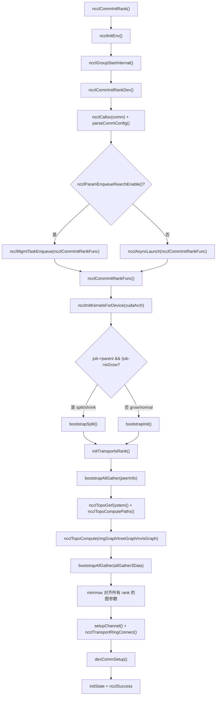
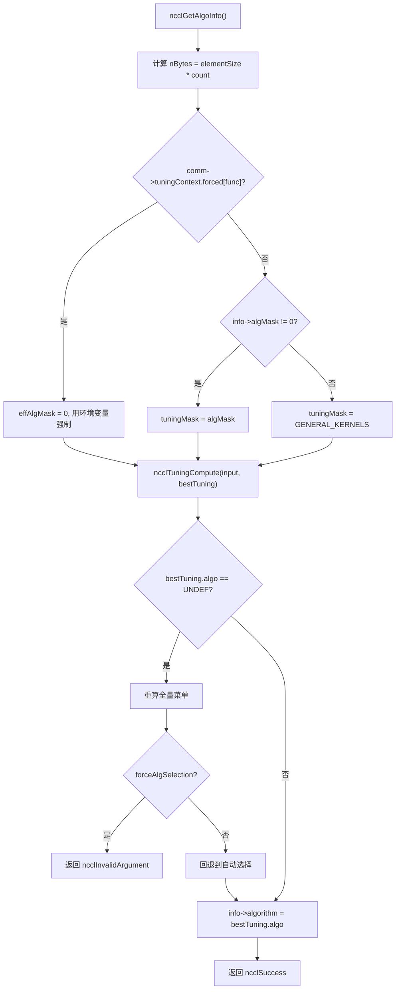
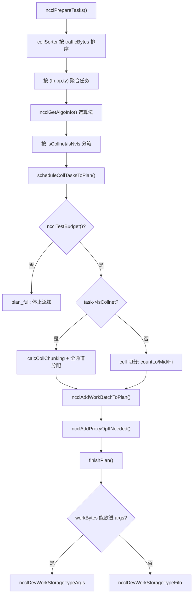

# Kapitel 25: Panoramarückblick und Reflexion: Die ultimative Reise eines AllReduce und die Essenz des Designs

Im vorherigen Kapitel haben wir anhand der Entwicklungs Spuren im Quellcode die Architekturtrends von NCCL skizziert: von festen Kollektivoperationen hin zu programmierbaren, von Host-Proxy hin zu GPU-direkter Übertragung, von registrierten Puffern hin zu symmetrischem Speicher. Jetzt ist es an der Zeit, diese Trends in einen konkreten Ausführungsfluss zurückzuversetzen und zu überprüfen. Dieses Kapitel führt keinen neuen Code ein, sondern verbindet die End-to-End-Kette von Kapitel 3 bis Kapitel 10 erneut – beginnend mit der einen Zeile ncclAllReduce bis hin zum Zurückschreiben der Ergebnisse in den Grafikspeicher. Nach der Lektüre solltest du klar beantworten können: Durch welche Funktionen läuft ein AllReduce genau? In welcher Datei und in welcher Zeile befindet sich jede Funktion? In welchem Kapitel solltest du bei Problemen nachschlagen?

# I. Initialisierung: Wie die Kommunikationsdomäne „heranwächst“

## Intuitives Modell

Stelle dir die Kommunikationsdomäne wie eine „Gruppenchat“ vor. Du rufst`ncclCommInitRank`auf, was „Beitritt zum Gruppenchat beantragen“ bedeutet. NCCL muss zu diesem Zeitpunkt die Mitgliederliste (peerInfo), wer mit wem über welche Leitung kommuniziert (Topologiegraph) und wie viele Pipelines pro Leitung geöffnet werden (channel) vollständig festlegen.**Wenn dieser Schritt falsch ist, ist die gesamte nachfolgende Kommunikation falsch**– so als wäre jemand nicht in den Gruppenchat aufgenommen worden, und deine Nachrichten erreichen niemals alle Empfänger.

## Datenstrukturen und Speicherlayout

Die Kernstruktur der Kommunikationsdomäne ist`ncclComm`, und ihre Initialisierung erfolgt in zwei Phasen:`commAlloc`ist für die „Zuweisung des Skeletts“ zuständig,`initTransportsRank`ist für die „Befüllung mit Fleisch und Blut“ zuständig.

`commAlloc`Am bemerkenswertesten in**ist das Design der**Referenzzählung gemeinsam genutzter Ressourcen`ncclSharedResources`. Wenn eine untergeordnete Kommunikationsdomäne (entstanden durch split/shrink) Ressourcen der übergeordneten Kommunikationsdomäne wiederverwendet, wird nicht eine Kopie erstellt, sondern dieselbe

[FACT:src/init.cc:533-555]

```cpp
if (parent == NULL || !parent->shareResources) {
    struct ncclSharedResources* sharedRes;
    NEW_NOTHROW(sharedRes, ncclSharedResources);
    sharedRes->owner = comm;
    ...
    comm->sharedRes = sharedRes;
    sharedRes->refCount = 1;
    NCCLCHECK(ncclNetInit(comm));
    NCCLCHECK(ncclRmaInit(comm));
    NCCLCHECK(ncclGinInit(comm));
} else {
    comm->sharedRes = parent->sharedRes;
    ncclAtomicRefCountIncrement(&parent->sharedRes->refCount);
    NCCLCHECK(ncclNetInitFromParent(comm, parent));
    NCCLCHECK(ncclRmaInitFromParent(comm, parent));
}
```

Kopieren`refCount`Die Absicht dieses Codes ist klar: Schwergewichtige Ressourcen wie Netzwerk-Plugins, RMA und GIN werden nur einmal initialisiert, und untergeordnete Kommunikationsdomänen leihen sie sich direkt aus.

wird mit atomaren Operationen inkrementiert, um sicherzustellen, dass bei Multithreading keine doppelte Freigabe erfolgt.`commAlloc`Ein weiterer wichtiger Punkt ist**die Initialisierung der**Kanäle`id = -1`. Alle Kanäle werden zunächst als „nicht initialisiert“ markiert (`setupChannel`), und erst später füllt

[FACT:src/init.cc:607-608]

```cpp
// Mark channels as non initialized.
for (int c = 0; c channels[c].id = -1;
```

Kopieren`-1`Dieses`id == -1`ist ein Sentinel-Wert. Wenn irgendein Code einen nicht initialisierten Kanal fälschlicherweise verwendet,

## wird das Problem sofort aufgedeckt, anstatt eine Menge zufälligen Speichers zu lesen.

Schritt für Schritt: Von ncclCommInitRank bis initTransportsRank`ncclCommInitRank`Nachdem der Benutzer

1. `ncclCommInitRank`aufgerufen hat, sieht der tatsächliche Ausführungsfluss so aus:`ncclInitEnv`ruft zuerst`ncclGroupStartInternal`auf, um das Umgebungs-Plugin zu laden, und dann

, um in die group-Semantik einzutreten (dies dient dazu, „die Initialisierung mehrerer Kommunikationsdomänen in einer group“ zu unterstützen).`ncclCommInitRankDev`2. Danach wird`comm`aufgerufen, was Parameterprüfung, Zuweisung der**-Struktur, Parsen der config durchführt und dann**：

[FACT:src/init.cc:2923-2929]

```cpp
if (ncclParamEnqueueRearchEnable()) {
    NCCLCHECKGOTO(ncclMgmtTaskEnqueue((struct ncclAsyncJob*)job, ncclCommInitRankFunc, ncclCommInitJobFree, comm), res, fail);
} else {
    NCCLCHECKGOTO(ncclAsyncLaunch((struct ncclAsyncJob*)job, ncclCommInitRankFunc, NULL, ncclCommInitJobFree, comm), res, fail);
}
```

Kopieren`ncclParamEnqueueRearchEnable()`Beachte den`ncclAsyncLaunch`-Zweig hier – dies ist eine Spur der laufenden „enqueue-Refaktorierung“ von NCCL. Standardmäßig wird`ncclMgmtTaskEnqueue`verwendet, nach Aktivierung der Refaktorierung`ncclCommInitRankFunc`。

3. `ncclCommInitRankFunc`. Beide Pfade rufen schließlich

[FACT:src/init.cc:2119-2127]

```cpp
timers[TIMER_INIT_TOTAL] = clockNano();
CUDACHECKGOTO(cudaSetDevice(cudaDev), res, fail);
CUDACHECKGOTO(cudaDeviceGetAttribute(&maxSharedMem, cudaDevAttrMaxSharedMemoryPerBlockOptin, cudaDev), res, fail);
CUDACHECKGOTO(cudaDeviceGetAttribute(&archMajor, cudaDevAttrComputeCapabilityMajor, cudaDev), res, fail);
CUDACHECKGOTO(cudaDeviceGetAttribute(&archMinor, cudaDevAttrComputeCapabilityMinor, cudaDev), res, fail);
cudaArch = 100 * archMajor + 10 * archMinor;

timers[TIMER_INIT_KERNELS] = clockNano();
NCCLCHECKGOTO(ncclInitKernelsForDevice(cudaArch, maxSharedMem, &maxLocalSizeBytes), res, fail);
```

`cudaArch = 100 * archMajor + 10 * archMinor`ist die Hauptfunktion der Initialisierung. Sie setzt zuerst das Gerät, fragt GPU-Eigenschaften ab und initialisiert den Kernel:

4. Dann, je nachdem ob es sich um eine normale Initialisierung oder split/shrink/grow handelt, wird ein unterschiedlicher Bootstrap-Pfad eingeschlagen:

[FACT:src/init.cc:2136-2191]

```cpp
if (job->parent && !job->isGrow) {
    // SPLIT/SHRINK: use bootstrapSplit
    ...
    NCCLCHECKGOTO(bootstrapSplit(comm->commHash, comm, job->parent, job->color, job->key, parentRanks), res, fail);
} else {
    // GROW or NORMAL INIT: use bootstrapInit
    ...
    NCCLCHECKGOTO(bootstrapInit(job->nId, (struct ncclBootstrapHandle*)job->commId, comm, job->parent), res, fail);
}
```

5. Schließlich wird`initTransportsRank`aufgerufen, dies ist die schwerste Funktion in der gesamten Initialisierung (ca. 800 Zeilen). Intern führt sie zweimal AllGather aus:

- **AllGather1**: Austausch von`ncclPeerInfo`(Geräteinformationen jedes Ranks, Host-Hash, PID-Hash, GPU-UUID usw.):

[FACT:src/init.cc:1236-1239]

```cpp
NCCLCHECKGOTO(ncclCalloc(&comm->peerInfo, nranks + 1), ret, fail); // Extra rank to represent CollNet root
NCCLCHECKGOTO(fillInfo(comm, comm->peerInfo + rank, comm->commHash), ret, fail);
NCCLCHECKGOTO(bootstrapAllGather(comm->bootstrap, comm->peerInfo, sizeof(struct ncclPeerInfo)), ret, fail);
COMPILER_ATOMIC_STORE(&comm->peerInfoValid, true, std::memory_order_release);
```

Beachten Sie die`nranks + 1`-Allokation – die zusätzliche Position ist für den CollNet-Root reserviert.`peerInfoValid`Wird mit Release-Semantik gespeichert, um sicherzustellen, dass andere Threads, wenn sie dieses Flag sehen, den Inhalt von peerInfo bereits sichtbar haben.

- **AllGather3**: Austausch der Topologie-Berechnungsergebnisse (von jedem Rank berechnete Ring-/Tree-Struktur, Bandbreite, Kanalanzahl usw.), dann wird von allen Ranks das**Minimum**genommen zur Angleichung:

[FACT:src/init.cc:1687-1703]

```cpp
for (int i = 0; i nChannels = std::min(allGather3Data[i].graphInfo[a].nChannels, graphs[a]->nChannels);
        graphs[a]->sameChannels = std::min(allGather3Data[i].graphInfo[a].sameChannels, graphs[a]->sameChannels);
        graphs[a]->bwIntra = std::min(allGather3Data[i].graphInfo[a].bwIntra, graphs[a]->bwIntra);
        graphs[a]->bwInter = std::min(allGather3Data[i].graphInfo[a].bwInter, graphs[a]->bwInter);
        graphs[a]->typeIntra = std::max(allGather3Data[i].graphInfo[a].typeIntra, graphs[a]->typeIntra);
        graphs[a]->typeInter = std::max(allGather3Data[i].graphInfo[a].typeInter, graphs[a]->typeInter);
        graphs[a]->crossNic = std::max(allGather3Data[i].graphInfo[a].crossNic, graphs[a]->crossNic);
    }
    ...
}
```

Bandbreite nimmt min, Typ nimmt max – das ist das „Fass-Prinzip": Die Leistung der gesamten Kommunikationsdomäne wird durch den langsamsten Rank bestimmt. Ohne Angleichung könnten verschiedene Ranks unterschiedliche Algorithmusauswahlen berechnen, was zu Kommunikations-Deadlock führt.

## Initialisierungs-Flussdiagramm



## Designüberlegungen und Fallstricke

**Warum muss die Initialisierung asynchron sein?**Weil die Multi-Rank-Initialisierung prozessübergreifende Synchronisation (Bootstrap) erfordert und eine synchrone Ausführung den aufrufenden Thread blockieren würde. Nach der Asynchronisierung kann der Benutzer mehrere Kommunikationsdomänen gleichzeitig in einer Gruppe initialisieren und parallel vorantreiben.

**Fallstricke**：`initTransportsRank`Am Ende gibt es eine Intra-Node-Barriere:

[FACT:src/init.cc:1968-1971]

```cpp
/* Local intra-node barrier */
NCCLCHECKGOTO(bootstrapIntraNodeBarrier(comm->bootstrap, comm->localRankToRank, comm->localRank, comm->localRanks, comm->localRankToRank[0]), ret, fail);
```

Diese Barriere stellt sicher, dass alle Ranks auf derselben Maschine die Ressourcenzuweisung abgeschlossen haben, bevor es weitergeht. Wenn ein Rank in`devCommSetup`hängen bleibt (z. B. wegen unzureichendem GPU-Speicher), warten die anderen Ranks hier vergeblich. Wenn in der Produktionsumgebung „Initialisierung hängt" auftritt, ist das Erste, was man prüfen sollte, ob`devCommSetup`eines Ranks fehlgeschlagen ist.

# Zwei: Task-Einreihung: Vom API-Aufruf zum internen Task-Objekt

## Intuitives Modell

Der Benutzer ruft`ncclAllReduce`auf, wie beim Bestellen im Restaurant.`ncclEnqueueCheck`ist der Kellner, der Ihre Bestellung in einen für die Küche verständlichen „Arbeitsauftrag" (`ncclTaskColl`) übersetzt und in den`comm->planner`„Bestellpool" legt.**Ohne diese Schicht könnte NCCL mehrere Aufrufe nicht zu einem einzigen Kernel-Start zusammenfassen**– jedes Mal separat kochen, äußerst ineffizient.

## Datenstruktur und Speicherlayout

Der Kern der Task-Einreihung ist`ncclKernelPlanner`, das an`comm->planner`hängt. Die wichtigsten Felder umfassen:

- `collSorter`: Nach Verkehrsgröße sortierte Warteschlange für kollektive Kommunikationsaufgaben
- `collTaskQueue`: Die schließlich sortierte Aufgabenwarteschlange
- `peers[]`: Sende-/Empfangswarteschlange pro Peer (für P2P)
- `wipPlan`: Der gerade aufgebaute Kernel-Plan

Die wichtigsten Felder des Task-Objekts`ncclTaskColl`werden in`collTaskAppend`befüllt:

[FACT:src/enqueue/enqueue.cc:2800-2847]

```cpp
struct ncclTaskColl* t = ncclMemoryPoolAlloc(&comm->memPool_ncclTaskColl, &comm->memPermanent);
t->func = info->coll;
t->sendbuff = info->sendbuff;
t->recvbuff = info->recvbuff;
t->count = info->count;
t->root = info->root;
t->datatype = info->datatype;
size_t elementSize = ncclTypeSize(t->datatype);
if (t->func == ncclFuncAllGather || t->func == ncclFuncBroadcast) {
    t->count *= elementSize;
    t->datatype = ncclInt8;
    elementSize = 1;
}
t->trafficBytes = t->count * elementSize * ncclFuncTrafficPerByte(t->func, comm->nRanks);
...
t->aggIsolate = ncclCollConfigNeedAggIsolate(&info->collConfig) || info->collConfig.CTAPolicy != comm->config.CTAPolicy;
NCCL_CONFIG_SET(t, minCTAs, ncclParamMinCTAs(), info->collConfig.minCTAs, comm->config.minCTAs, 1, MAXCHANNELS);
NCCL_CONFIG_SET(t, maxCTAs, ncclParamMaxCTAs(), (std::min(info->collConfig.maxCTAs, comm->config.maxCTAs)), comm->config.maxCTAs, 1, MAXCHANNELS);
...
planner->nTasksColl += 1;
ncclTaskCollSorterInsert(&planner->collSorter, t, t->trafficBytes);
```

Beachten Sie einige Details:

1. **Spezielle Behandlung von AllGather/Broadcast**: count wird mit der Elementgröße multipliziert, datatype wird zu`ncclInt8`geändert. Der Grund ist, dass die Semantik dieser beiden Operationen „Bytes verschieben" ist und der ursprüngliche Typ nicht relevant ist.

2. **`trafficBytes`Berechnung von**：`ncclFuncTrafficPerByte`gibt zurück, wie oft jedes Byte übertragen werden muss. AllReduce gibt 2 zurück (Reduce + Broadcast), AllGather gibt nRanks zurück:

[FACT:src/enqueue/enqueue.cc:123-134]

```cpp
static inline int ncclFuncTrafficPerByte(ncclFunc_t func, int nRanks) {
  switch (func) {
  case ncclFuncAllReduce:
    return 2;
  case ncclFuncAllGather:
    return nRanks;
  case ncclFuncReduceScatter:
    return nRanks;
  default:
    return 1;
  }
}
```

3. **`NCCL_CONFIG_SET`Makro**: Dies ist die dreistufige Konfigurationsauflösung „env > per-call > comm". Umgebungsvariablen haben die höchste Priorität, gefolgt von der Config des einzelnen Aufrufs, und zuletzt der Standardwert auf Kommunikationsdomänen-Ebene.

## Step-by-Step: Der Einreihungspfad von ncclAllReduce

1. `ncclEnqueueCheck`Zuerst werden Kommunikationsdomänen-Validierung und Group-Eintritt durchgeführt:

[FACT:src/enqueue/enqueue.cc:3478-3495]

```cpp
ncclResult_t ncclEnqueueCheck(struct ncclInfo* info) {
  ncclResult_t ret = CommCheck(info->comm, info->opName, "comm");
  if (ret != ncclSuccess) return ncclGroupErrCheck(ret);
  if (info->comm->revokedFlag) {
    WARN("%s: communicator was revoked", info->opName);
    return ncclGroupErrCheck(ncclInvalidUsage);
  }
  ...
  NCCLCHECK(ncclGroupStartInternal());
  ret = ncclSuccess;
  int devOld = -1;
  NCCLCHECKGOTO(ncclCommEnsureReady(info->comm), ret, fail);
```

2. Dann wird`taskAppend`aufgerufen, das je nach Operationstyp verteilt:

[FACT:src/enqueue/enqueue.cc:3337-3348]

```cpp
static ncclResult_t taskAppend(struct ncclComm* comm, struct ncclInfo* info) {
  ncclFunc_t collAPI = info->coll;
  bool hasLaunchCompletionEvent = ncclInfoHasLaunchCompletionEvent(info);

  if (ncclParamEnqueueRearchEnable()) {
    NCCLCHECK(rawTaskAppend(comm, info));
  } else if (info->coll == ncclFuncSend || info->coll == ncclFuncRecv) {
    NCCLCHECK(p2pTaskAppend(comm, info, info->coll, collAPI, (void*)info->recvbuff, info->count, info->datatype, info->root, true));
  } else if (info->coll == ncclFuncPutSignal || info->coll == ncclFuncSignal || info->coll == ncclFuncWaitSignal) {
    NCCLCHECK(rmaTaskAppend(comm, info));
  } else {
    ...
  }
}
```

Für AllReduce wird der letzte`else`-Zweig genommen, schließlich wird`collTaskAppend`。

3. `collTaskAppend`aufgerufen, um die Aufgabe in`collSorter`einzufügen, sortiert nach`trafficBytes`. Der Zweck der Sortierung ist, dass der Scheduler große Aufgaben bevorzugt behandelt und eine Fragmentierung der Kanalressourcen durch kleine Aufgaben vermieden wird.

## Datenfluss der Task-Einreihung

```mermaid
flowchart LR
    api["ncclAllReduce()"] --> info["ncclInfo 填充"]
    info --> enq["ncclEnqueueCheck()"]
    enq --> check["CommCheck + ncclCommEnsureReady()"]
    check --> append["taskAppend()"]
    append --> coll["collTaskAppend()"]
    coll --> task["ncclTaskColl 分配"]
    task --> sorter["ncclTaskCollSorterInsert(collSorter)"]
    sorter --> prepare["ncclPrepareTasks()"]
    prepare --> algo["ncclGetAlgoInfo() 选算法"]
    algo --> schedule["scheduleCollTasksToPlan()"]
    schedule --> plan["ncclKernelPlan"]
```



## Designüberlegungen und Fallstricke

**Warum`ncclMemoryPoolAlloc`statt`malloc`？**verwendet wird: Weil Task-Objekte eine kurze Lebensdauer haben und häufig allokiert werden. Der Speicherpool vermeidet den Systemaufruf-Overhead bei jedem`malloc/free`. Beachten Sie, dass der zweite Parameter von`ncclMemoryPoolAlloc`gleich`&comm->memPermanent`ist – das bedeutet, dass Task-Objekte erst bei der Zerstörung der Kommunikationsdomäne einheitlich freigegeben werden, nicht einzeln pro Task.

**Fallstricke**：`ncclPrepareTasks`In

[FACT:src/enqueue/enqueue.cc:506-512]

```cpp
// We aggregate operations that are within 4X size of each other.
while (aggEnd != nullptr && aggEnd->trafficBytes trafficBytes && !aggBeg->aggIsolate && !aggEnd->aggIsolate) {
    agg.count += aggEnd->count;
    agg.trafficBytes += aggEnd->trafficBytes;
    aggEnd = aggEnd->next;
}
```

Kopieren`aggIsolate`Diese Aggregation dient dazu, die Algorithmusauswahl stabiler zu machen – wenn jede kleine Aufgabe einzeln einen Algorithmus wählt, könnten viele verschiedene Algorithmen gewählt werden, was zu Kernel-Fragmentierung führt. Aber das

# -Flag verhindert die Aggregation und wird für Aufgaben verwendet, die „unbedingt separat geplant werden müssen" (z. B. mit per-call config).

## Drei: Algorithmusauswahl: Wie das Kostenmodell die optimale Lösung findet

Intuitives Modell**Die Algorithmusauswahl ist wie die Routenwahl in einer Navigations-App. Das „Kostenmodell" von NCCL (Tuning-Modul) schätzt die Laufzeit jeder Algorithmus-/Protokoll-Kombination bei gegebener Nachrichtengröße und Topologie und wählt dann die schnellste aus.**。

## Ohne Kostenmodell könnte NCCL nur einen festen Algorithmus fest verdrahten, was bei kleinen Nachrichten Bandbreite und bei großen Nachrichten Latenz verschwendet.

Datenstruktur und Speicherlayout`ncclGetAlgoInfo`：

[FACT:src/enqueue/enqueue.cc:2159-2185]

```cpp
ncclResult_t ncclGetAlgoInfo(struct ncclComm* comm, struct ncclTaskColl* info, int collNetSupport, int nvlsSupport,
                             int numPipeOps, ncclSimInfo_t* simInfo) {
  size_t elementSize = ncclTypeSize(info->datatype);
  size_t nBytes = elementSize * ncclFuncMaxSendRecvCount(info->func, comm->nRanks, info->count);
  info->algorithm = NCCL_ALGO_UNDEF;
  info->protocol = NCCL_PROTO_UNDEF;
  struct ncclTuningInput_t input;
  input.comm = comm;
  input.tuningMask = NCCL_TUNING_MASK_GENERAL_KERNELS;
  uint64_t effAlgMask = comm->tuningContext.forced[info->func] ? 0 : info->algMask;
  if (effAlgMask != 0) {
    input.tuningMask = effAlgMask & NCCL_TUNING_MASK_GENERAL_KERNELS;
  }
  input.CTAPolicy = info->CTAPolicy;
  input.func = info->func;
  input.redOp = info->opHost;
  input.devRedOp = info->opDev.op;
  input.datatype = info->datatype;
  input.nBytes = nBytes;
  input.numPipeOps = numPipeOps;
  input.collNetSupport = collNetSupport;
  input.nvlsSupport = nvlsSupport;
  input.count = info->count;
  NCCLCHECK(ncclGetRegBuff(comm, info, &input.regBuff));
  ...
}
```

Kopieren`effAlgMask`Beachten Sie die Logik von`comm->tuningContext.forced[info->func]`: Wenn die Umgebungsvariable einen Algorithmus erzwingt (`algMask`ungleich null), wird das Benutzer-

ignoriert und die Umgebungsvariable verwendet. Dies ist die Umsetzung der Priorität „env > per-call".`ncclTuningCompute`Dann wird

[FACT:src/enqueue/enqueue.cc:2213-2224]

```cpp
} else {
    NCCLCHECK(ncclTuningCompute(&input, &bestTuning));
}
INFO(NCCL_TUNING, "Best tuning, algorithm, %s, protocol, %s", ncclAlgoToString(bestTuning.algo), ncclProtoToString(bestTuning.proto));
info->algorithm = bestTuning.algo;
info->protocol = bestTuning.proto;
info->nWarps = bestTuning.nWarps;
if (simInfo) simInfo->estimatedTime = bestTuning.timeUs;
TRACE(NCCL_COLL, "%ld Bytes -> Algo %d proto %d time %f", nBytes, info->algorithm, info->protocol, bestTuning.timeUs);
info->nMaxChannels = bestTuning.maxChannels == 0 ? info->nMaxChannels : bestTuning.maxChannels;
```

## Step-by-Step: Algorithmusauswahl für ein AllReduce

Angenommen 8 GPUs auf einem Knoten, Nachrichtengröße 1MB, AllReduce:

1. `nBytes = 1MB`，`numPipeOps`ist die Anzahl der bereits im aktuellen Plan vorhandenen Aufgaben.

2. `collNetSupport`und`nvlsSupport`werden durch`ncclGetCollNetSupport`und`ncclNvlsTransportEnabled`bestimmt.

3. `ncclTuningCompute`Durchläuft alle verfügbaren (algo, proto)-Kombinationen und schätzt die Zeit mit dem Kostenmodell.

4. Für das 1MB-Single-Node-Szenario gewinnt normalerweise NVLS oder Tree+LL128.

5. Ergebnis zurückschreiben nach`info->algorithm`、`info->protocol`、`info->nWarps`。

## Entscheidungsdiagramm für die Algorithmusauswahl



## Designüberlegungen und Stolperfallen

**Warum muss die Algorithmusauswahl „über Ranks hinweg ausgerichtet" sein?**Weil der Kommunikationsmodus nicht übereinstimmt, wenn verschiedene Ranks unterschiedliche Algorithmen wählen, was zu einem Deadlock führt. Deshalb werden in`initTransportsRank`alle Graph-Parameter mit min/max ausgerichtet, um sicherzustellen, dass die Eingaben des Kostenmodells für jeden Rank identisch sind.

**Stolperfallen**：`ncclGetAlgoInfo`Es gibt eine „Neuberechnungs"-Logik – wenn der Benutzer`algMask`angegeben hat, aber kein Algorithmus übereinstimmt, wird zuerst stillschweigend das vollständige Menü neu berechnet und dann entschieden, ob es sich um einen harten Fehler oder einen sanften Rückfall handelt:

[FACT:src/enqueue/enqueue.cc:2192-2208]

```cpp
NOWARN(ncclTuningCompute(&input, &bestTuning), NCCL_TUNING);
if (bestTuning.algo == NCCL_ALGO_UNDEF) {
    input.tuningMask = NCCL_TUNING_MASK_GENERAL_KERNELS;
    bestTuning = NCCL_TUNING_RESULT_INIT;
    bestTuning.maxChannels = 0;
    NCCLCHECK(ncclTuningCompute(&input, &bestTuning));
    if (info->forceAlgSelection) {
        WARN("algSelection: no algorithm in the selected set is available for %s", ncclFuncToString(info->func));
        return ncclInvalidArgument;
    }
    INFO(NCCL_TUNING, "algSelection: selected set unavailable for %s; falling back to automatic selection", ncclFuncToString(info->func));
}
```

`NOWARN`Das Makro unterdrückt vorübergehend Warnungen, da „kein Algorithmus übereinstimmt" ein normaler Fall sein kann (die vom Benutzer gewählte Menge ist tatsächlich nicht verfügbar). Nur wenn`forceAlgSelection`wahr ist, wird ein Fehler gemeldet.

# Vier. Aufgabenplanung und Kernel-Plan-Erstellung

## Intuitives Modell

Aufgabenplanung ist wie die Verteilung einer Menge von Aufträgen auf mehrere Fließbänder.`scheduleCollTasksToPlan`Bestimmt, wie viele Kanäle jede Aufgabe verwendet und wie viele Daten jeder Kanal verarbeitet, und erzeugt schließlich einen`ncclKernelPlan`– das ist der „Arbeitsauftrag", der an die GPU übergeben wird.

## Datenstrukturen und Speicherlayout

`ncclKernelPlan`Die Kernfelder von :

- `channelMask`: Welche Kanäle dieser Plan verwendet (Bitmap)
- `workBytes`: Die Gesamtbytezahl aller work-Strukturen
- `nWorkBatches`: Anzahl der work-Batches
- `kernelArgs`: Kernel-Startparameter
- `workStorageType`: Wo die work-Daten gespeichert werden (args/fifo/persistent)

`finishPlan`Bestimmt den Speicherort der work-Daten:

[FACT:src/enqueue/enqueue.cc:244-255]

```cpp
// If we can fit everything into the kernel args we do so.
if (sizeof(ncclDevKernelArgs) + batchBytes + workBytes workArgsBytes) {
    plan->workStorageType = ncclDevWorkStorageTypeArgs;
}
plan->kernelArgsSize = sizeof(struct ncclDevKernelArgs) + batchBytes;
plan->kernelArgsSize += (plan->workStorageType == ncclDevWorkStorageTypeArgs) ? workBytes : 0;
plan->kernelArgsSize = alignUp(plan->kernelArgsSize, 16);
plan->kernelArgs = (struct ncclDevKernelArgs*)ncclMemoryStackAlloc(&comm->memScoped, plan->kernelArgsSize, /*align=*/16);
plan->kernelArgs->comm = comm->devComm;
plan->kernelArgs->channelMask = plan->channelMask;
plan->kernelArgs->workStorageType = plan->workStorageType;
```

Abwägung der drei Speichertypen:

- **Args**: Am schnellsten, aber die Kernel-Parametergröße ist begrenzt (normalerweise 4KB)
- **Fifo**: Ringpuffer, geeignet für mittlere Größen
- **Persistent**: Separate Speicherzuweisung, geeignet für CUDA-Graph-Szenarien

## Step-by-Step: Kanalzuweisung von scheduleCollTasksToPlan

1. Zuerst schätzen, wie viele Aufgaben dieser Plan aufnehmen kann:

[FACT:src/enqueue/enqueue.cc:654-687]

```cpp
do {
    size_t workBytes = 0;
    struct ncclTaskColl* task = ncclIntruQueueHead(&planner->collTaskQueue);
    struct ncclWorkList* workNode = ncclIntruQueueHead(&planner->collWorkQueue);
    while (task != nullptr) {
        int nBatches = divUp(nPlanColls, 4); // Rough guess: 4 colls per batch.
        if (!ncclTestBudget(budget, nBatches, workBytes + workNode->size)) goto plan_full;
        bool taskAggIsolate = task->aggIsolate;
        if (taskAggIsolate && nPlanColls > 0) goto plan_full;
        nPlanColls += 1;
        workBytes += workNode->size;
        int kind = 2 * task->isCollnet + task->isNvls;
        trafficBytes[kind] += std::max(MinTrafficPerChannel, task->trafficBytes);
        ...
    }
plan_full:;
} while (0);
```

2. Dann werden die Kanäle nach Verkehrsaufkommen den Aufgaben zugewiesen. Für Nicht-CollNet-Aufgaben wird in „cell"-Einheiten aufgeteilt:

[FACT:src/enqueue/enqueue.cc:742-759]

```cpp
int trafficPerByte = ncclFuncTrafficPerByte(task->func, comm->nRanks);
if (task->protocol == NCCL_PROTO_LL) trafficPerByte *= 4;
size_t cellSize = divUp(divUp(MinTrafficPerChannel, (size_t)trafficPerByte), 16) * 16;
int elementsPerCell = cellSize / elementSize;
size_t cells = divUp(task->count * elementSize, cellSize);
size_t trafficPerElement = elementSize * trafficPerByte;
size_t trafficPerCell = cellSize * trafficPerByte;
size_t cellsPerChannel = std::min(cells, divUp(trafficPerChannel, trafficPerCell));
size_t cellsLo;
if (channelId + 1 == nMaxChannels[kind]) {
    cellsLo = cells;
} else {
    cellsLo = std::min(cells, divUp((trafficPerChannel - currentTraffic), trafficPerCell));
}
int nMidChannels = (cells - cellsLo) / cellsPerChannel;
size_t cellsHi = (cells - cellsLo) % cellsPerChannel;
int nChannels = (cellsLo != 0 ? 1 : 0) + nMidChannels + (cellsHi != 0 ? 1 : 0);
```

Dieser Code teilt die Daten in drei Segmente „niedrig/mittel/hoch" auf:`countLo`、`countMid`、`countHi`. Das niedrige und das hohe Segment sind Randkanäle, das mittlere Segment ist der mittlere Kanal. Diese Aufteilung dient dazu, die Datenmenge, die jeder Kanal verarbeitet, möglichst gleichmäßig zu machen.

3. Schließlich wird`calcCollChunking`aufgerufen, um die Chunk-Größe jedes Kanals zu berechnen:

[FACT:src/enqueue/enqueue.cc:2228-2275]

```cpp
static ncclResult_t calcCollChunking(struct ncclComm* comm, struct ncclTaskColl* info, int nChannels, size_t nBytes,
                                     uint32_t* outChunkSize, uint32_t* outDirectFlags, struct ncclProxyOp* proxyOp) {
  ncclPattern_t pattern;
  size_t grainSize = ncclProtoGrainSize(info->protocol);
  switch (info->func) {
  case ncclFuncAllReduce:
    pattern = info->algorithm == NCCL_ALGO_NVLS           ? ncclPatternNvls :
              info->algorithm == NCCL_ALGO_NVLS_TREE      ? ncclPatternNvlsTree :
              info->algorithm == NCCL_ALGO_COLLNET_DIRECT ? ncclPatternCollnetDirect :
              info->algorithm == NCCL_ALGO_COLLNET_CHAIN  ? ncclPatternCollnetChain :
              info->algorithm == NCCL_ALGO_TREE           ? ncclPatternTreeUpDown :
                                                            ncclPatternRingTwice;
    break;
  ...
  }
  int stepSize = comm->buffSizes[info->protocol] / NCCL_STEPS;
  int chunkSteps = (info->protocol == NCCL_PROTO_SIMPLE && info->algorithm == NCCL_ALGO_RING) ? info->chunkSteps : 1;
  int sliceSteps = (info->protocol == NCCL_PROTO_SIMPLE && info->algorithm == NCCL_ALGO_RING) ? info->sliceSteps : 1;
  int chunkSize = stepSize * chunkSteps;
  if (info->protocol == NCCL_PROTO_LL) chunkSize /= 2;
  if (info->protocol == NCCL_PROTO_LL128) chunkSize = (chunkSize / NCCL_LL128_LINEELEMS) * NCCL_LL128_DATAELEMS;
  ...
}
```

## Ablaufdiagramm der Planung



## Designüberlegungen und Stolperfallen

**Warum werden CollNet-Aufgaben separat behandelt?**Weil CollNet Netzwerk-Switches für die Reduktion verwendet und die Kanalzuweisungslogik völlig anders ist als bei normalem ring/tree. CollNet-Aufgaben belegen direkt alle verfügbaren Kanäle, während normale Aufgaben nach Verkehrsaufkommen aufgeteilt werden müssen.

**Stolperfallen**：`ncclTestBudget`Die Schätzung von verwendet eine grobe Formel`nBatches = divUp(nPlanColls, 4)`– es wird angenommen, dass alle 4 Sammeloperationen ein Batch erzeugen. Diese Schätzung ist möglicherweise ungenau, daher folgt später eine genaue Überprüfung:

[FACT:src/enqueue/enqueue.cc:711-714]

```cpp
// Ensure room for worst case of one new batch per channel
if (!ncclTestBudget(budget, plan->nWorkBatches + nChannels, plan->workBytes + workNode->size)) {
    return ncclSuccess;
}
```

Wenn die genaue Überprüfung fehlschlägt, wird direkt zurückgegeben (ohne Fehler), und die obere Ebene erstellt einen neuen Plan.

# Fünf. Kernel-Start und geräteseitige Ausführung

## Intuitives Modell

Der Kernel-Start ist wie die Übergabe des Arbeitsauftrags an die Fabrik.`ncclLaunchKernel`Übersetzt`ncclKernelPlan`in CUDA-Kernel-Startparameter und ruft dann`cuLaunchKernelEx`auf. Der geräteseitige Kernel empfängt den Arbeitsauftrag und führt die Datenübertragung gemäß dem Algorithmus aus.

## Datenstrukturen und Speicherlayout

`ncclLaunchKernel`Die wichtigsten Schritte von :

[FACT:src/enqueue/enqueue.cc:1886-1909]

```cpp
ncclResult_t ncclLaunchKernel(struct ncclComm* comm, struct ncclKernelPlan* plan) {
  ncclResult_t ret = ncclSuccess;
  struct ncclKernelPlanner* planner = &comm->planner;
  int nChannels = countOneBits(plan->channelMask);
  void* sym = plan->kernelFn;
  dim3 grid = {(unsigned)nChannels, 1, 1};
  dim3 block = {(unsigned)plan->threadPerBlock, 1, 1};
  int smem = plan->isSymColl ? plan->kernelDynSmem : ncclShmemDynamicSize(comm->cudaArch);
  cudaStream_t launchStream = planner->streams->stream;
  ...
  void* extra[] = {CU_LAUNCH_PARAM_BUFFER_POINTER, plan->kernelArgs, CU_LAUNCH_PARAM_BUFFER_SIZE, &plan->kernelArgsSize, CU_LAUNCH_PARAM_END};
  ...
  CUfunction fn;
  CUDACHECKGOTO(cudaGetFuncBySymbol(&fn, sym), ret, do_return);
```

Beachten Sie`grid.x = nChannels`– ein Block pro Kanal.`block.x = plan->threadPerBlock`– Die Anzahl der Threads pro Block wird durch die Aufgabe bestimmt.

## Step-by-Step: Vom Plan zum Kernel-Start

1. Zuerst`uploadWork`aufrufen, um die work-Daten an die Zielposition zu schreiben (args/fifo/persistent):

[FACT:src/enqueue/enqueue.cc:1365-1407]

```cpp
static ncclResult_t uploadWork(struct ncclComm* comm, struct ncclKernelPlan* plan) {
  if (plan->isSymColl || plan->isCeColl || plan->isRma) return ncclSuccess;
  size_t workBytes = plan->workBytes;
  size_t batchBytes = plan->nWorkBatches * sizeof(struct ncclDevWorkBatch);
  void* fifoBufHost;
  uint32_t fifoCursor, fifoMask;
  switch (plan->workStorageType) {
  case ncclDevWorkStorageTypeArgs:
    plan->kernelArgs->workBuf = nullptr;
    fifoBufHost = (void*)plan->kernelArgs;
    fifoCursor = sizeof(ncclDevKernelArgs) + batchBytes;
    fifoMask = ~0u;
    break;
  case ncclDevWorkStorageTypeFifo:
    fifoBufHost = comm->workFifoBuf;
    fifoCursor = comm->workFifoProduced;
    fifoMask = comm->workFifoBytes - 1;
    NCCLCHECK(waitWorkFifoAvailable(comm, fifoCursor + workBytes));
    plan->kernelArgs->workBuf = comm->workFifoBufDev;
    break;
  ...
  }
}
```

2. Dann die CUDA-Launch-Attribute konstruieren. Für sm90+ werden die Cluster-Dimensionen gesetzt:

[FACT:src/enqueue/enqueue.cc:1929-1936]

```cpp
if (clusterSize) {
    // Grid dimension must be divisible by clusterSize
    if (grid.x % clusterSize) clusterSize = 1;
    launchAttrs[attrs].id = CU_LAUNCH_ATTRIBUTE_CLUSTER_DIMENSION;
    launchAttrs[attrs++].value.clusterDim = {clusterSize, 1, 1};
    launchAttrs[attrs].id = CU_LAUNCH_ATTRIBUTE_CLUSTER_SCHEDULING_POLICY_PREFERENCE;
    launchAttrs[attrs++].value.clusterSchedulingPolicyPreference = CU_CLUSTER_SCHEDULING_POLICY_SPREAD;
}
```

3. Schließlich`cuLaunchKernelEx`：

[FACT:src/enqueue/enqueue.cc:1992]

```cpp
CUCHECKGOTO(cuLaunchKernelEx(&launchConfig, fn, nullptr, extra), ret, do_return);
```

## Geräteseite: Ausführung von runRing

Nachdem der geräteseitige Kernel den Arbeitsauftrag erhalten hat, ruft er je nach Algorithmus die entsprechende`RunWorkColl`Spezialisierung auf. Am Beispiel von Ring AllReduce:

[FACT:src/device/all_reduce.h:14-83]

```cpp
template 
__device__ __forceinline__ void runRing(int tid, int nthreads, struct ncclDevWorkColl* work) {
  ncclRing* ring = &ncclShmem.channel.ring;
  int ringIx = ring->index;
  const int nranks = ncclShmem.comm.nRanks;
  ssize_t gridOffset;
  ssize_t channelCount;
  ssize_t chunkCount;
  ncclCollCbdPart(work, ncclShmem.channelId, Proto::Id, sizeof(T), (ssize_t*)nullptr, &gridOffset, &channelCount, &chunkCount);
  const ssize_t loopCount = nranks * chunkCount;
  ...
  Primitives, 1, Proto, 0> prims(tid, nthreads, &ring->prev, &ring->next, work->sendbuff, work->recvbuff, work->redOpArg, 0, 0, 0, work);

  for (ssize_t elemOffset = 0; elemOffset  int { return r - (r >= nranks ? nranks : 0); };

    // step 0: push data to next GPU
    chunk = modRanks(ringIx + nranks - 1);
    chunkOffset = chunk * chunkCount;
    offset = gridOffset + elemOffset + chunkOffset;
    nelem = (int)min(chunkCount, remCount - chunkOffset);
    prims.directSend(offset, offset, nelem);

    // k-2 steps: reduce and copy to next GPU
    for (int j = 2; j >Plan: ncclLaunchPrepare()
    Plan->>Plan: scheduleCollTasksToPlan()
    Plan->>Plan: finishPlan() 分配 kernelArgs
    Host->>Plan: ncclLaunchKernelBefore_NoUncapturedCuda()
    Plan->>Plan: uploadWork() 写 work 数据
    Host->>CUDA: cuLaunchKernelEx(fn, grid, block, smem)
    CUDA->>Kernel: 启动 nChannels 个 block
    Kernel->>Kernel: runRing() 执行 Ring AllReduce
    Host->>Plan: ncclLaunchKernelAfter_NoCuda()
    Plan->>Proxy: hostStreamPlanTask() + uploadProxyOps()
    Proxy->>Proxy: ncclProxyStart() 推进网络 I/O
    Kernel-->>Host: kernel 完成
    Host->>Plan: ncclLaunchFinish()
    Plan->>Plan: reclaimPlan() 释放资源
```

## Designüberlegungen und Stolperfallen

**Warum`cuLaunchKernelEx`anstelle von`cudaLaunchKernel`？**verwendet wird: Weil Launch-Attribute gesetzt werden müssen (Cluster-Dimensionen, mem sync domain, launch completion event). Diese Attribute werden erst ab CUDA 12.0 unterstützt.

**Stolperfallen**：`uploadWork`Die Behandlung des persistent-Modus ist hier sehr komplex – er muss GPU-Speicher allozieren, Daten kopieren, Events aufzeichnen und dabei im CUDA-Graph-Capture-Modus korrekt funktionieren:

[FACT:src/enqueue/enqueue.cc:1445-1478]

```cpp
CUDACHECKGOTO(cudaThreadExchangeStreamCaptureMode(&mode), result, fail);
NCCLCHECKGOTO(ncclStrongStreamAcquire(ncclCudaGraphNone(comm->config.graphUsageMode), &comm->sharedRes->deviceStream, /*concurrent=*/false, &deviceStream), result, fail);
if (comm->memPool) {
    CUDACHECKGOTO(cudaMallocAsync(&fifoBufDev, workBytes, comm->memPool, deviceStream), result, fail);
} else {
    CUDACHECKGOTO(cudaMalloc(&fifoBufDev, workBytes), result, fail);
}
plan->workBufPersistent = fifoBufDev;
plan->kernelArgs->workBuf = fifoBufDev;
CUDACHECKGOTO(cudaMemcpyAsync(fifoBufDev, fifoBufHost, workBytes, cudaMemcpyDefault, deviceStream), result, fail);
cudaEvent_t memcpyDone;
CUDACHECKGOTO(cudaEventCreateWithFlags(&memcpyDone, cudaEventDisableTiming), result, fail);
CUDACHECKGOTO(cudaEventRecord(memcpyDone, deviceStream), result, fail);
```

`cudaThreadExchangeStreamCaptureMode`dient dazu, im Capture-Modus vorübergehend in den relaxed-Modus zu wechseln, um GPU-Speicher allozieren zu können. Nach Abschluss der Kopie wird ein Event aufgezeichnet, das später über`ncclCommPollEventCallbacks`zurückgewonnen wird.

# Sechs. Leitfaden zur Vermeidung von Fallstricken im Produktivbetrieb

## Fallstrick 1: Initialisierung hängt

**Symptom**：`ncclCommInitRank`bleibt hängen und kehrt nicht zurück.

**Fehlersuche**: Sieh dir die`NCCL_DEBUG=INFO`-Logs an und finde den zuletzt ausgegebenen Rank. Wenn alle Ranks "Init START" ausgegeben haben, aber kein "Init COMPLETE", dann hängt es in`initTransportsRank`fest.

**Häufige Ursachen**：

- Bei einem Rank ist`devCommSetup`fehlgeschlagen (ungenügend GPU-Speicher, CUDA-Fehler)
- Bootstrap-Netzwerk nicht erreichbar (Firewall, belegter Port)
- Unterschiedliche NCCL-Versionen auf verschiedenen Ranks

**Quellcode-Beleg**：`initTransportsRank`Die intra-node barrier am Ende von

[FACT:src/init.cc:1968-1971]

```cpp
/* Local intra-node barrier */
NCCLCHECKGOTO(bootstrapIntraNodeBarrier(comm->bootstrap, comm->localRankToRank, comm->localRank, comm->localRanks, comm->localRankToRank[0]), ret, fail);
```

## Kopieren

**Fallstrick 2: Work-FIFO-Überlauf**Symptom: Nach dem Kernel-Start hängt es, oder es wird`ncclInternalError`。

**gemeldet. Ursache**：`waitWorkFifoAvailable`wartet auf FIFO-Speicherplatz, aber die Konsumentenseite (Kernel) kommt nicht voran.

[FACT:src/enqueue/enqueue.cc:1333-1349]

```cpp
static ncclResult_t waitWorkFifoAvailable(struct ncclComm* comm, uint32_t desiredProduced) {
  bool hasRoom = (desiredProduced - comm->workFifoConsumed) workFifoBytes;
  if (!hasRoom) {
    while (true) {
      // Check abort flag to break deadlock when abort is signaled
      if (COMPILER_ATOMIC_LOAD(comm->abortFlag, std::memory_order_acquire)) {
        return ncclInternalError;
      }
      NCCLCHECK(ncclCommPollEventCallbacks(comm, /*waitSome=*/true));
      hasRoom = (desiredProduced - comm->workFifoConsumed) workFifoBytes;
      if (hasRoom) break;
      std::this_thread::yield();
    }
  }
  return ncclSuccess;
}
```

Achte auf die abort-flag-Prüfung – das ist der einzige Ausweg. Wenn abort ebenfalls nicht gesetzt ist, entsteht eine Endlosschleife.

**Vermeidung**: Vergrößere`NCCL_WORK_FIFO_BYTES`, oder reduziere die Anzahl der Operationen in einer einzelnen Gruppe.

## Fallstrick 3: CUDA-Graph-Capture schlägt fehl

**Symptom: Während des CUDA-Graph-Captures wird NCCL aufgerufen und meldet "operation not permitted".**Ursache: Im Capture-Modus können bestimmte CUDA-Operationen nicht ausgeführt werden (wie

**). NCCL verwendet**, um den Modus vorübergehend zu wechseln, aber nicht alle Operationen lassen sich umgehen.`cudaMalloc`Quellcode-Beleg`cudaThreadExchangeStreamCaptureMode`Der persistent-Zweig von

**:**：`uploadWork`Kopieren

[FACT:src/enqueue/enqueue.cc:1445]

```cpp
CUDACHECKGOTO(cudaThreadExchangeStreamCaptureMode(&mode), result, fail);
```

**: Verwende**, um den Graph-Mixed-Modus zu aktivieren, oder alloziere den Work-Buffer vorab.`NCCL_GRAPH_MIXING_SUPPORT=1`Zusammenfassung dieses Kapitels

# In diesem Kapitel haben wir die vollständige Kette eines AllReduce noch einmal durchlaufen:

Initialisierung

1. **, Aufbau der Kommunikationsdomäne, Topologie-Suche, Abgleich der Graph-Parameter.**：`ncclCommInitRank` → `ncclCommInitRankFunc` → `initTransportsRank`Task-Einreihung

2. **, Übersetzung des API-Aufrufs in**：`ncclEnqueueCheck` → `taskAppend` → `collTaskAppend`Algorithmus-Auswahl`ncclTaskColl`。

3. **, Auswahl des optimalen (algo, proto) mithilfe des Kostenmodells.**：`ncclGetAlgoInfo` → `ncclTuningCompute`Task-Scheduling

4. **, Zuweisung der Tasks zu Kanälen, Generierung von**：`ncclPrepareTasks` → `scheduleCollTasksToPlan` → `finishPlan`Kernel-Start`ncclKernelPlan`。

5. **, Übersetzung des Plans in CUDA-Startparameter.**：`ncclLaunchKernel` → `cuLaunchKernelEx`Ausführung auf der Geräteseite

6. **, Ausführung des Datentransfers gemäß dem Algorithmus.**：`runRing` / `runTreeUpDown` / `runNvls`Denkanstöße und Selbsttests zu diesem Kapitel

# Q1: Wenn man in

die min/max-Abgleichslogik nach AllGather3 (L1690-L1698) entfernt, in welchen Szenarien würde dies zu einem Kommunikations-Deadlock führen? Warum?`initTransportsRank`Referenzanalyse

**: Dieser Logikabschnitt stellt sicher, dass alle Ranks sich über Parameter wie**für jeden Algorithmus einig sind. Wenn man ihn entfernt, würde jeder Rank die Berechnung mit seiner lokalen Topologie durchführen. Betrachten wir einen heterogenen Cluster: Rank 0 auf einer 8-GPU-NVLink-Maschine, Rank 8 auf einer 4-GPU-PCIe-Maschine. Rank 0 berechnet 8 Kanäle für den Ring, Rank 8 berechnet 4. Wenn sie Ring AllReduce ausführen, wartet Rank 0 darauf, dass Rank 8 Daten über 8 Kanäle sendet, aber Rank`nChannels`、`bwIntra`、`bwInter`Damit haben wir die Überprüfung der vollständigen Kette eines AllReduce abgeschlossen. Von der Initialisierung, Topologie-Suche, Algorithmus-Auswahl, Task-Einreihung, Kernel-Start bis zur Ausführung auf der Geräteseite und Netzwerkübertragung – jeder Schritt entspricht der eingehenden Analyse in den vorherigen Kapiteln. Diese Kettenübersicht ist nicht nur das Gerüst zum Verständnis von NCCL, sondern auch ein Index zur Fehlersuche: Bei Initialisierungsfehlern siehe Kapitel 3 und 4, bei falscher Algorithmus-Auswahl siehe Kapitel 5, bei Fehlern in der Task-Einreihung siehe Kapitel 6 und 7, bei Kernel-Startfehlern siehe Kapitel 8, bei Hängern auf der Geräteseite siehe Kapitel 9 und 10, bei Netzwerkproblemen siehe Kapitel 12 und 13. Während NCCL sich in Richtung programmierbare Kommunikation, GPU-Direct und symmetrischer Speicher weiterentwickelt, wird sich diese Kette weiter verlängern – und du beherrschst bereits die Methode, sie zu verfolgen.

← Vorheriges Kapitel: Kapitel 24
