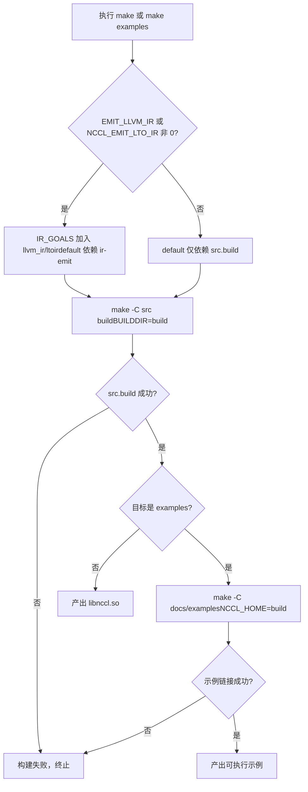
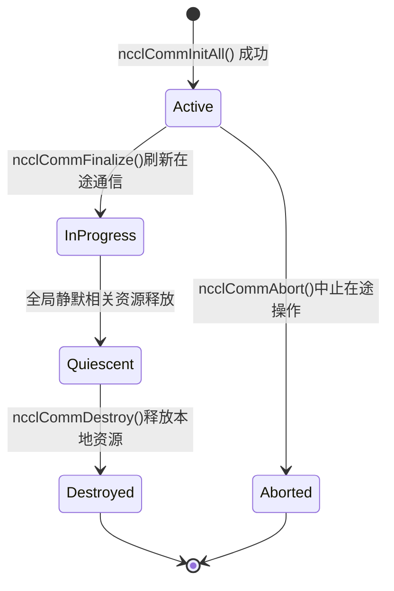

# Chapter 1: Running and Phenomena: Observing External Behavior Starting from One AllReduce

Before diving into any kernel code, let's first get NCCL running and observe its externally exposed behavior. This chapter does not read the kernel; it does only one thing: establish a verifiable reference frame—any subsequent internal mechanism analysis must ultimately be able to explain the external behavior seen here.

# 1.1 Understanding NCCL's Engineering Structure from the Build Entry Point

## Intuitive Model

The build system is like the construction blueprint of a building: it does not determine who lives in the building, but it determines what rooms exist and which way the doors open. If the build entry point is chaotic, you cannot even take the first step of "getting it running." NCCL provides two build entry points, Makefile and CMake. Understanding their differences is the first step to understanding this project's engineering organization.

## Structure of the Two Build Entry Points

Top-level`Makefile`is an extremely thin scheduling layer. It does not compile any source files itself, but forwards work to the Makefile in each subdirectory.

[FACT:Makefile:44-45]defines`src.%`pattern rules, forwarding targets such as`src.build`、`src.install`to`src/Makefile`：

```
src.%:
	${MAKE} -C src $* BUILDDIR=${ABSBUILDDIR}
```

[FACT:Makefile:47-48]defines`examples`target, which depends on`src.build`and then enters`docs/examples`directory to build examples:

```
examples: src.build
	${MAKE} -C docs/examples NCCL_HOME=${ABSBUILDDIR}
```

Note the dependency relationship here: the build of the examples depends on`src.build`completing first, because the examples need to link against the NCCL library, and the`NCCL_HOME`environment variable passes the build output directory to the examples' Makefile. This is the build order constraint of "library first, examples second."

[FACT:Makefile:29]Lists all the target sets that can be cleaned:

```
TARGETS := src pkg nccl4py ir
```

[FACT:Makefile:30]Using GNU Make's substitution reference syntax`${TARGETS:%=%.clean}`to expand`src pkg nccl4py ir`into`src.clean pkg.clean nccl4py.clean ir.clean`, defining all cleanup targets at once. This is a common "data-driven rules" technique in Makefiles—adding a new module only requires adding one word to`TARGETS`.

## CMake entry point: where the version number comes from

The CMake entry point is much more complex than the Makefile, because it has to handle cross-platform support, CUDA version detection, architecture selection, and more. We only focus on the parts directly related to "getting it running."

[FACT:CMakeLists.txt:5-11]shows the source of the version number—it is not hardcoded in CMakeLists.txt, but read from`makefiles/version.mk`and then extracted with a regex:

```cmake
file(READ ${CMAKE_SOURCE_DIR}/makefiles/version.mk VERSION_CONTENT)
string(REGEX REPLACE ".*NCCL_MAJOR[ ]*:=[ ]*([0-9]+).*" "\\1" NCCL_MAJOR "${VERSION_CONTENT}")
...
math(EXPR NCCL_VERSION_CODE "(${NCCL_MAJOR} * 10000) + (${NCCL_MINOR} * 100) + ${NCCL_PATCH}")
```

> **[Design Inference & Architectural Trade-offs]**
> Centralizing the version number in`version.mk`allows both build systems, Makefile and CMake, to share the same version source, avoiding the classic engineering pitfall of "inconsistent version numbers across two build systems."`NCCL_VERSION_CODE`The calculation formula for`MAJOR*10000 + MINOR*100 + PATCH`is consistent with the`NCCL_VERSION`macro in the header file.

[FACT:CMakeLists.txt:14-20]Inject these version numbers into all C++ source files via`add_compile_definitions`:

```cmake
add_compile_definitions(
    NCCL_USE_CMAKE
    NCCL_MAJOR=${NCCL_MAJOR}
    NCCL_MINOR=${NCCL_MINOR}
    NCCL_PATCH=${NCCL_PATCH}
    NCCL_VERSION_CODE=${NCCL_VERSION_CODE}
)
```

[FACT:CMakeLists.txt:24-25]declares the project languages as CUDA, CXX, and C:

```cmake
project(NCCL VERSION ${NCCL_MAJOR}.${NCCL_MINOR}.${NCCL_PATCH}
        LANGUAGES CUDA CXX C)
```

## CUDA architecture selection: why the default value is so complex

[FACT:CMakeLists.txt:140-171]is a large block of logic that determines`CMAKE_CUDA_ARCHITECTURES`based on the CUDA version. Take CUDA 12.8 and above as an example:

```cmake
elseif(${CUDA_MAJOR} EQUAL 12)
    if(${CUDA_MINOR} LESS 8)
        set(CMAKE_CUDA_ARCHITECTURES "50;60;61;70;80;90")
    else()
        set(CMAKE_CUDA_ARCHITECTURES "50;60;61;70;80;90;100;120")
    endif()
```

> **[Design Inference & Architectural Trade-offs]**
> The design motivation behind this logic is that the PTX of new architectures (such as 100 and 120) is only recognized by newer CUDA toolchains. If new architectures are forcibly specified for older CUDA versions, compilation will fail outright. Therefore, the default architecture list must be adjusted dynamically with the CUDA version. For readers, this means:**If you do not explicitly set`CMAKE_CUDA_ARCHITECTURES`, the compiled artifact will contain a fatbin with a long list of architectures, and compilation time will increase significantly**. Production environments usually specify the target architecture explicitly to speed up builds.

## Build process decision diagram

The diagram below shows the complete decision path from executing`make`to producing a runnable example:



The key branch in this diagram is whether`IR_GOALS`is non-empty—it determines whether the default build additionally triggers LLVM IR generation. For readers who just want to "get it running," keeping`EMIT_LLVM_IR=0`is enough to take the shortest path.

# 1.2 Prerequisites for a minimal runnable program

## Intuitive model

Writing an NCCL program is like organizing a multi-party conference call. You first need to confirm: how many people are participating (number of devices), who each person is (rank), and what line is used for the call (stream). If any one of these is missing, the meeting cannot start. In this section, through the`01_communicators`example, we will see clearly what these three prerequisites look like in code.

## Data structures: three arrays carry all the state

[FACT:docs/examples/01_communicators/01_multiple_devices_single_process/c/main.cc:88-92]defines the core variables of the example:

```c
int num_gpus;                 // Number of available CUDA devices
ncclComm_t *comms = NULL;     // Array of NCCL communicators (one per GPU)
cudaStream_t *streams = NULL; // Array of CUDA streams (one per GPU)
int *devices = NULL;          // Array of device IDs to use
```

This reflects the core of NCCL's single-process multi-GPU programming model:**one communication domain, one stream, and one device ID per GPU**. The length of all three arrays is`num_gpus`, and the index`i`corresponds to the`i`th GPU.

`ncclComm_t`is defined in the header file as an opaque pointer.[FACT:src/nccl.h.in:36]gives its real type:

```c
typedef struct ncclComm* ncclComm_t;
```

> **[Design Inference & Architectural Trade-offs]**
> "Opaque pointer" is a classic technique in C for achieving information hiding: the header file only exposes`struct ncclComm*`as a pointer type, user code cannot access the internal fields of the struct, and all operations must be performed through API functions. In this way, NCCL can freely modify the internal layout of`ncclComm`without breaking the ABI. For beginner readers, this can be understood as "what you get is a black-box handle, and you can only operate it through the official interface."

## Step-by-Step: from device detection to communication domain creation

**Step 1: Detect the number of devices.** [FACT:docs/examples/01_communicators/01_multiple_devices_single_process/c/main.cc:96-104]calls`cudaGetDeviceCount`and checks whether it is 0:

```c
CUDACHECK(cudaGetDeviceCount(&num_gpus));

if (num_gpus == 0) {
    fprintf(stderr, "ERROR: No CUDA devices found on this system\n");
    ...
    return 1;
}
```

What this step is doing: asking the CUDA runtime, "How many GPUs are on this machine?" If it returns 0, it means there are no available devices, and the program exits directly—this is the earliest guard condition.

**Step 2: Allocate host memory and fill in the device list.** [FACT:docs/examples/01_communicators/01_multiple_devices_single_process/c/main.cc:114-121]allocates three arrays and checks whether allocation succeeded:

```c
devices = (int *)malloc(num_gpus * sizeof(int));
comms = (ncclComm_t *)malloc(num_gpus * sizeof(ncclComm_t));
streams = (cudaStream_t *)malloc(num_gpus * sizeof(cudaStream_t));

if (!devices || !comms || !streams) {
    fprintf(stderr, "ERROR: Failed to allocate memory for device arrays\n");
    return 1;
}
```

[FACT:docs/examples/01_communicators/01_multiple_devices_single_process/c/main.cc:126-136]fills`devices[i] = i`with a loop and prints the properties of each device:

```c
for (int i = 0; i >CUDA: cudaGetDeviceCount(&num_gpus)
    CUDA-->>App: num_gpus = N
    loop i in 0..N-1
        App->>CUDA: cudaSetDevice(devices[i])
        App->>CUDA: cudaStreamCreate(&streams[i])
        CUDA-->>App: streams[i]
    end
    App->>NCCL: ncclCommInitAll(comms, N, devices)
    Note over NCCL: 内部为每个设备建立通信域分配 rank 0..N-1
    NCCL-->>App: comms[0..N-1]
    loop i in 0..N-1
        App->>NCCL: ncclCommUserRank(comms[i], &rank)
        NCCL-->>App: rank = i
        App->>NCCL: ncclCommCount(comms[i], &size)
        NCCL-->>App: size = N
    end
```

This sequence diagram reveals the key point:`ncclCommInitAll`is a**synchronous blocking call**, which internally completes coordination among all devices, and when it returns, all communication domains are ready.

## Design thinking: Why is ncclCommInitAll needed

> **[Design Inference & Architectural Trade-offs]**
> In multi-process scenarios, each process manages only one GPU, so using`ncclCommInitRank`to initialize each separately is sufficient. But in single-process multi-GPU scenarios, if the user is asked to manually call`ncclCommInitRank`for each GPU, they must handle "synchronization among multiple ranks"—yet in a single process there is only one thread, which cannot advance the initialization of multiple ranks simultaneously, causing deadlock.`ncclCommInitAll`encapsulates this coordination inside the library, using internal mechanisms (usually multithreading or a state machine) to complete synchronized initialization of all ranks, exposing it to the user as a simple synchronous call. This is the fundamental reason the "convenience function" exists.

# 1.3 The complete external behavior of one AllReduce

## Intuitive model

AllReduce is the most commonly used operation in collective communication: each participant contributes a piece of data, and everyone gets the sum of all data. It is like calculating the total score for a group assignment—everyone reports their own score, and in the end everyone has a copy of the class total. In this section we trace the`03_collectives/01_allreduce`example to see the complete external behavior of one AllReduce from call to result verification.

## Data structures: data buffers and initialization

[FACT:docs/examples/03_collectives/01_allreduce/c/main.cc:59-63]defines the core variables:

```c
int num_gpus = 0;
ncclComm_t *comms;
cudaStream_t *streams;
float **sendbuff;
float **recvbuff;
```

Note that`sendbuff`and`recvbuff`are`float**`—pointers to arrays of pointers. Each`sendbuff[i]`is the device memory address on the`i`th GPU.

[FACT:docs/examples/03_collectives/01_allreduce/c/main.cc:99]defines the data size:

```c
const size_t size = 32 * 1024 * 1024; // 32M floats for demonstration
```

32M floats, 4 bytes each, that is, a 128 MB send buffer and a 128 MB receive buffer, one copy per GPU.

[FACT:docs/examples/03_collectives/01_allreduce/c/main.cc:101-120]is the initialization loop for each device:

```c
for (int i = 0; i  **[Design Inference & Architectural Trade-offs]**
> The core contradiction is: collective communication requires all ranks to participate at the same time, but in a single thread you can only call`ncclAllReduce`one by one. If the first`ncclAllReduce`call blocks waiting for other ranks while the calls for the other ranks have not yet been issued, deadlock occurs. The role of the Group mechanism is:`ncclGroupStart`all calls after`ncclGroupEnd`only "register" and do not actually start;

**only when** [FACT:docs/examples/03_collectives/01_allreduce/c/main.cc:139-142]：

```c
for (int i = 0; i 首元素=0"]
        r0["recvbuff[0]"]
    end
    subgraph dev1["GPU 1 (rank 1)"]
        s1["sendbuff[1]首元素=1"]
        r1["recvbuff[1]"]
    end
    subgraph dev2["GPU 2 (rank 2)"]
        s2["sendbuff[2]首元素=2"]
        r2["recvbuff[2]"]
    end
    s0 -->|ncclAllReducencclFloat ncclSum| reduce["归约求和0+1+2=3"]
    s1 -->|ncclAllReducencclFloat ncclSum| reduce
    s2 -->|ncclAllReducencclFloat ncclSum| reduce
    reduce -->|广播结果| r0
    reduce -->|广播结果| r1
    reduce -->|广播结果| r2
```

AllReduce data flow diagram`recvbuff`Copy

## This diagram shows the two phases of AllReduce: first reduce, then broadcast. The

> **[Design Inference & Architectural Trade-offs]**
> Design thinking: Why use Group instead of calling one by one`ncclGroupStart`/`ncclGroupEnd`[Design inference and architectural trade-offs]

```c
for (int i = 0; i  **[Design Inference & Architectural Trade-offs]**
> Copy`ncclCommFinalize`[Design inference and architectural trade-offs]**Why should destruction be split into two steps?**is a`ncclCommDestroy`global operation**—it requires all ranks to participate, ensuring there is no in-flight communication.**is a`ncclCommDestroy`local operation

## —it only releases the resources of this process and does not block. This design decouples "waiting for all ranks to become quiet" from "releasing local resources": the former may take a long time (waiting for network peers), while the latter is a purely local operation. If there were only one

[FACT:docs/examples/01_communicators/01_multiple_devices_single_process/c/main.cc:221-249], it would have to assume both responsibilities at once, either blocking too long or failing to guarantee global quiescence.[FACT:docs/examples/01_communicators/01_multiple_devices_single_process/c/main.cc:218-219]The complete chain of the destruction order

```c
// IMPORTANT: Proper cleanup is critical for NCCL applications
// Resources must be cleaned up in the correct order to avoid issues
```

emphasizes:

Copy[FACT:docs/examples/01_communicators/01_multiple_devices_single_process/c/main.cc:224-227]）

2. Finalize + Destroy communication domain ([FACT:docs/examples/01_communicators/01_multiple_devices_single_process/c/main.cc:233-240]）

3. Destroy CUDA stream ([FACT:docs/examples/01_communicators/01_multiple_devices_single_process/c/main.cc:246-249]）

4. Free host memory ([FACT:docs/examples/01_communicators/01_multiple_devices_single_process/c/main.cc:253-255]）

## Communication domain state machine

`ncclCommFinalize`The documentation explicitly mentions state transitions, which meets the admission criteria for a state machine:



The key transition of this state machine is`InProgress -> Quiescent`: it is triggered by the "global quiescence" event, rather than directly triggered by a function call. This means that after`ncclCommFinalize`returns, the communication domain may still be in the`InProgress`state, and you need to poll`ncclCommGetAsyncError`to know when it enters`Quiescent`。

## Design consideration: why the destruction order cannot be reversed

> **[Design Inference & Architectural Trade-offs]**
> If the CUDA stream is destroyed before the communication domain, what problems would occur? The communication domain may internally hold a reference to the stream (for example, for completion notification of asynchronous operations). If the stream is destroyed first, the communication domain accessing the already-destroyed stream during Finalize will cause undefined behavior. Similarly, if the host memory (`comms`array) is freed before the communication domain is destroyed,`ncclCommDestroy`then a dangling pointer is obtained. This is why the order must be "synchronize first, then destroy the communication domain, then destroy the stream, and finally free host memory" —**the dependency relationship determines that the destruction order must be the reverse of the creation order**。

# 1.5 Production pitfall avoidance guide

## Pitfall 1: Forgetting Group causes deadlock

This is the pitfall that beginners most often encounter. In a single-process multi-GPU scenario, if you directly call`ncclAllReduce`in a loop without adding Group, the program will deadlock on the first call. The symptom is: the program hangs and does not move, CPU usage is close to 0, and there is no output.

Troubleshooting method: use`gdb`to attach to the process and see whether the stack is stuck in NCCL's internal waiting logic. If so, check whether`ncclGroupStart`/`ncclGroupEnd`。

## was omitted.

[FACT:src/nccl.h.in:854-856]Pitfall 2: Reading results without synchronizing the stream`ncclGroupEnd`explicitly states that[FACT:docs/examples/03_collectives/01_allreduce/c/main.cc:139-142]only guarantees enqueueing, not completion. If you omit`recvbuff`stream synchronization and directly read

, you will read incomplete data.`cudaMemcpy`The symptom is: results are sometimes correct and sometimes wrong, or all zeros are read. This is because**is synchronous by default, but what it synchronizes is**the current stream`cudaStreamSynchronize`, while AllReduce may execute on another stream. Troubleshooting method: add

## before reading the result. If the problem disappears, this is the pitfall.

Pitfall 3: Incorrect destruction order causes segmentation fault`ncclCommDestroy`If`cudaFree`is done before`sendbuff`/`recvbuff`, the communication domain may still be accessing these buffers during Finalize, causing a segmentation fault or data corruption.

The symptom is: the program crashes during the exit phase, or occasionally reads garbage data. Troubleshooting method: check the order of the cleanup code and ensure that the communication domain is destroyed before all CUDA resources are released.

## Pitfall 4: Confusing device number with rank

[FACT:docs/examples/01_communicators/01_multiple_devices_single_process/c/main.cc:198-200]There is a validation:

```c
if (device != devices[i]) {
    printf(" [WARNING: Expected device %d]", devices[i]);
}
```

> **[Design Inference & Architectural Trade-offs]**
> rank and device are two different concepts. rank is the logical number within the communication domain (0 to nRanks-1), and device is the physical GPU number. In`ncclCommInitAll`'s default usage,`devices[i] = i`, so rank and device happen to be equal. But if a custom`devlist`is passed in (for example,`{2, 0, 1}`), rank 0 corresponds to device 2. Confusing these two concepts will cause data to be sent to the wrong GPU.

# Chapter summary

In this chapter we completed three things:

1. **Build entry point**: understood the Makefile forwarding mechanism, the source of the CMake version number, and the CUDA architecture selection logic. The key conclusion is that`make examples`will build the library first and then build the examples,`NCCL_HOME`and passes the build artifact directory to the examples.

2. **The three elements of a minimal runnable program**: number of devices (`cudaGetDeviceCount`), rank (automatically assigned by`ncclCommInitAll`), stream (one per GPU).`ncclCommInitAll`is a convenient entry point for single-process multi-GPU, encapsulating multi-rank synchronous initialization inside the library.

3. **The complete external behavior of one AllReduce**: from`ncclGroupStart`wrapping multiple`ncclAllReduce`calls, to`ncclGroupEnd`submission, to`cudaStreamSynchronize`waiting for completion, and finally verifying the result. The Group mechanism is the key to avoiding deadlock in single-threaded multi-GPU scenarios.

4. **Communication domain lifecycle**：`ncclCommFinalize`(global quiescence) +`ncclCommDestroy`(local release) two-phase destruction, and the ordering constraint of "synchronize first, then destroy the communication domain, then destroy the stream, and finally free host memory."

# Chapter reflection and self-test

Q1: If the ncclGroupStart/ncclGroupEnd of[FACT:docs/examples/03_collectives/01_allreduce/c/main.cc:130-136]are removed and changed to directly calling ncclAllReduce in a loop, what will happen in a single-process multi-GPU scenario? Why?

**Reference analysis**: Deadlock will occur. The header file[FACT:src/nccl.h.in:844-864]explains the reason: collective communication calls may perform inter-CPU synchronization and require all ranks to participate at the same time. In a single thread, when the first loop iteration calls`ncclAllReduce(comms[0], ...)`, NCCL needs to wait for other ranks to also initiate AllReduce before it can proceed. But the calls for other ranks have not yet been reached in the loop (because the current thread is blocked on the first call), so the first call will never wait for the other ranks, resulting in deadlock.

The role of the Group mechanism is to separate "initiation" and "execution":`ncclGroupStart`after`ncclGroupEnd`, all calls only register,

and only at`gdb`When you attach and look at the stack, it will be stuck in NCCL's internal wait logic, with CPU usage close to 0.

Q2: [FACT:docs/examples/03_collectives/01_allreduce/c/main.cc:139-142]Can the cudaStreamSynchronize be replaced with cudaDeviceSynchronize? What is the semantic difference between the two? In what scenarios would this replacement cause problems?

**Reference analysis**: It can be replaced with`cudaDeviceSynchronize`, but the semantics differ.`cudaStreamSynchronize(streams[i])`only waits for operations on the specified stream to complete;`cudaDeviceSynchronize`waits for operations on**all**streams on the current device to complete.

In a single-process multi-GPU scenario,`cudaDeviceSynchronize`only synchronizes the current device (determined by`cudaSetDevice`), so it needs to be used in conjunction with a`cudaSetDevice(i)`loop. If`cudaSetDevice`，`cudaDeviceSynchronize`is omitted, only the default device (usually device 0) will be synchronized, and the AllReduce on other devices may not have completed yet.

The header file[FACT:src/nccl.h.in:854-856]emphasizes that`ncclGroupEnd`only guarantees enqueueing, not completion, so synchronization is necessary. Using`cudaStreamSynchronize`is more precise, because it only waits for the relevant stream and will not mistakenly wait for unrelated operations. The problem with using`cudaDeviceSynchronize`is that if there are other unrelated long-running kernels on the device, they will be mistakenly waited on, reducing performance.

Q3: [FACT:docs/examples/01_communicators/01_multiple_devices_single_process/c/main.cc:233-240]The destruction order of is "first Finalize all communication domains, then Destroy all communication domains." If it were changed to "for each communication domain, first Finalize then Destroy" (that is, completing both operations in one loop), what problems would arise?

**Reference analysis**: It would break the Group semantics. The current form is:

```c
ncclGroupStart();
for (i) ncclCommFinalize(comms[i]);
ncclGroupEnd();
for (i) ncclCommDestroy(comms[i]);
```

`ncclCommFinalize`is wrapped by Group, meaning that the Finalize of all communication domains will be submitted together and can progress concurrently. If it were changed to:

```c
for (i) {
    ncclCommFinalize(comms[i]);
    ncclCommDestroy(comms[i]);
}
```

The first iteration's`ncclCommFinalize(comms[0])`will block waiting for all ranks to become silent, but the Finalize of other communication domains has not yet been initiated, causing a deadlock - this is the same type of problem as the deadlock in Q1.

In addition, the header file[FACT:src/nccl.h.in:309-309]states that`ncclCommFinalize`when returns, the communication domain may still be in the`ncclInProgress`state, and it needs to wait for global silence before entering`ncclSuccess`. If`ncclCommDestroy`is called immediately afterward, local resources may be released before the communication domain has fully become silent, leading to undefined behavior. The correct approach is to poll`ncclCommGetAsyncError`after Finalize to confirm the state, and then Destroy.

These external behaviors form the reference frame for all subsequent source code analysis. In Chapter 2, we will establish the core mental model: the five-piece set of communication domain, channel, algorithm, protocol, and transport layer, and see how NCCL internally organizes these concepts.
