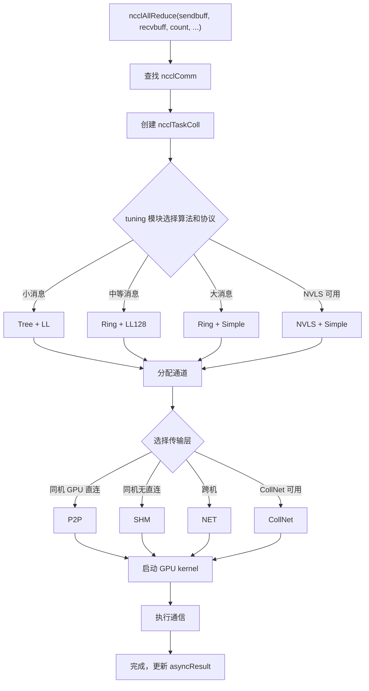

# Chapter 2: Core Abstract Model: Communication Operators, Topology, Algorithms, Protocols, and Transport Layer

In the previous chapter, we got NCCL running and observed the external behavior of three APIs: ncclCommInitRank, ncclAllReduce, and ncclCommDestroy. But external behavior is only the tip of the iceberg - when ncclAllReduce returns, what exactly happened on the GPU? Which path did the data take? Why does the same AllReduce show huge performance differences on different machines? To answer these questions, we must first establish NCCL's common vocabulary. This chapter will break down five core abstractions one by one: communication domain (ncclComm), channel, algorithm, protocol, and transport layer. These five concepts run through the entire book, and every subsequent chapter's analysis will use them. Once you understand the relationships among them, you understand NCCL's skeleton.

# 2.1 Communication Domain ncclComm: A Process's Communication Context

## Intuitive model

Think of`ncclComm`as a "group chat": after each process joins the group chat, it gets a group ID, and afterward all messages are sent in this group. How many people are in the group (`nRanks`), who I am (`rank`), which route to take (`channels`), and which rules to use (`config`) are all recorded in this group chat object.

Without`ncclComm`, NCCL would not know "who communicates with whom" or "where the data is sent" - every API call would have to renegotiate the rank list and rebuild connections, and the overhead would be unbearable.

## Data structure and memory layout

`ncclComm`is the most core struct in all of NCCL, defined in`src/include/comm.h`. It is extremely large (nearly 300 lines), so let us look at the key fields grouped by function.

**Identity markers and lifecycle sentinels**

[FACT:src/include/comm.h:576-580]defines`startMagic`，[FACT:src/include/comm.h:879-881]defines`endMagic`. These two fields are not security keys, but memory out-of-bounds detection sentinels. At[FACT:src/include/comm.h:883-885]there are two`static_assert`：

```c
static_assert(offsetof(struct ncclComm, startMagic) == 0, "startMagic must be the first field of ncclComm");
static_assert(offsetof(struct ncclComm, endMagic) == sizeof(struct ncclComm) - sizeof(uint64_t),
              "endMagic must be the last field of ncclComm");
```

> **[Design Inference & Architectural Trade-offs]**
> These two assertions enforce at compile time that`startMagic`is located at the first address of the struct and`endMagic`is located at the end. At runtime, by checking whether these two magic numbers have been tampered with, one can quickly determine whether the`ncclComm`pointer is valid - this is very useful when troubleshooting bugs such as "wild pointer accessing a destroyed communication domain" in a multithreaded environment.

**Rank and topology information**

[FACT:src/include/comm.h:628-629]defines`rank`and`nRanks`- my number in the communication domain and the total number of participants.[FACT:src/include/comm.h:644-652]defines node-related fields:`node`(the node number where I am located),`nNodes`(total number of nodes),`localRank`(number within the node),`localRanks`(number of GPUs within the node), and three mapping tables`rankToNode`、`rankToLocalRank`、`localRankToRank`。

> **[Design Inference & Architectural Trade-offs]**
> These three mapping tables are the foundation of topology-aware algorithms. For example, the Ring algorithm needs to know "whether my next rank is within the same node" to decide whether to use NVLink or the network. Without these mapping tables, every algorithm selection would require re-querying the topology graph, resulting in enormous overhead.

**Channels and Buffers**

[FACT:src/include/comm.h:593-593]defines`channels[MAXCHANNELS]`—this is the array of all channels within the communicator.[FACT:src/include/comm.h:674-676]defines the number of channels:`nChannels`(number of connection channels),`collChannels`(number of collective communication enqueue channels),`nvlsChannels`(number of NVLS channels).

[FACT:src/include/comm.h:691-693]defines buffer sizes:`buffSizes[NCCL_NUM_PROTOCOLS]`(buffer size for each protocol),`p2pChunkSize`(P2P chunk size),`nvlsChunkSize`(NVLS chunk size).

> **[Design Inference & Architectural Trade-offs]**
> `buffSizes`The index of the array is the protocol enum value (LL/LL128/Simple), which means each protocol has its own independent buffer size configuration. The LL protocol needs small buffers to reduce latency, while the Simple protocol needs large buffers to improve bandwidth—this array allows both requirements to coexist.

**Work Queue and FIFO**

[FACT:src/include/comm.h:719-728]defines work FIFO related fields:`workFifoBytes`(FIFO size, power of 2),`workFifoBuf`(host-side FIFO buffer),`workFifoBufDev`(device-side FIFO buffer),`workFifoProduced`(bytes produced),`workFifoConsumed`(bytes consumed).

> **[Design Inference & Architectural Trade-offs]**
> This is a typical producer-consumer ring buffer. The host side (producer) writes work descriptors into the FIFO, and the GPU kernel (consumer) reads and executes them.`workFifoBytes`must be a power of 2, so that bitmasking can replace modulo operations, accelerating index computation.

**Intra-process Synchronization Barrier**

[FACT:src/include/comm.h:731-731]defines the intra-process multi-communicator synchronization mechanism:

```c
struct ncclComm* intraComm0; // leader of intra-process comms (self possible)
struct ncclComm* intraNext; // next of intra-process comms, intraComm0 is head
int intraRank;
int intraRanks;
uint32_t intraBarrierPhase;
char intraPad1[64 - sizeof(uint64_t)];
uint64_t intraBarrierCounter; // only used if this is intraComm0
char intraPad2[64 - sizeof(uint64_t)];
uint64_t intraBarrierGate; // only used if this is intraComm0
```

Note`intraPad1`and`intraPad2`have a size of`64 - sizeof(uint64_t)`, which is 56 bytes. Adding the preceding`uint64_t`field, each field group occupies exactly 64 bytes—this is one cache line.

> **[Design Inference & Architectural Trade-offs]**
> This is a typical**cache line padding**technique.`intraBarrierCounter`and`intraBarrierGate`are frequently read and written by multiple threads. If they share the same cache line, it causes**false sharing**: one thread modifying`intraBarrierCounter`invalidates another thread's`intraBarrierGate`cache, causing a sharp performance degradation. Using 56 bytes of padding to separate them into different cache lines is a standard technique in high-performance concurrent programming.

**Asynchronous Error State**

[FACT:src/include/comm.h:705-705]defines`asyncResult`—this field records the asynchronous operation state of the communicator. In the previous chapter, we mentioned that when`ncclCommFinalize`returns, the communicator may still be in the`ncclInProgress`state, which is tracked through this field.

## Scenario-Driven Walkthrough: From ncclCommInitRank to Struct Population

When the user calls`ncclCommInitRank(&comm, nranks, commId, rank)`, NCCL internally allocates a`ncclComm`struct and populates it field by field. Let us follow this process to see how key fields are set:

**Step 1: Allocation and Zeroing**

NCCL uses`ncclCalloc`to allocate`ncclComm`, ensuring all fields are initialized to 0. At this point,`startMagic`and`endMagic`are set to`NCCL_MAGIC`（[FACT:src/include/comm.h:563-569]defined as`0x0280028002800280`, with the comment saying "Nickel atomic number is 28").

**Step 2: Populating Identity Information**

`rank`、`nRanks`、`cudaDev`obtained from parameters and CUDA APIs.`commHash`is derived by hashing`ncclCommId`, used for consistency verification in subsequent network communication.

**Step 3: Building the Topology Graph**

NCCL calls the topology detection module to enumerate all GPUs, NICs, and PCI switches, building the`topo`field ([FACT:src/include/comm.h:595-595]). This topology graph determines subsequent algorithm selection and path planning.

**Step 4: Initializing Channels**

`channels[MAXCHANNELS]`The`id`array is initialized one by one. Each channel's`peers`is set to the array index,`devPeers`and

**pointers are allocated.**

Step 5: Establishing Transport Connections`setup`Based on the topology graph, NCCL selects the transport layer (P2P/SHM/NET) for each pair of ranks, calling the corresponding`connect`and`channels[i].peers[j]`callbacks. Connection information is stored in

**.**

Step 6: Setting the Magic Number`endMagic`Finally,`NCCL_MAGIC`is set to

## , marking the struct initialization as complete.

**Design Reflections and Production Pitfalls`ncclComm`Why is**

> **[Design Inference & Architectural Trade-offs]**
> `ncclComm`[Design Inference and Architectural Trade-offs]

**contains nearly 300 fields because it carries the entire state of a communicator. NCCL's design philosophy is "initialize once, reuse many times"—during initialization, all potentially useful information is computed and stored, and at runtime, tables are looked up directly to avoid redundant computation. The cost is higher memory usage (a few KB per communicator), but compared to GPU memory and network bandwidth, this memory is negligible.**

> **[Design Inference & Architectural Trade-offs]**
> `ncclComm`[Design Inference and Architectural Trade-offs]`ncclComm`is not thread-safe. If two threads simultaneously call`ncclAllReduce`，`workFifoProduced`on the same

**, fields such as**

`ncclCommDestroy`will race, causing data corruption. The correct approach is for each thread to use an independent communicator, or to serialize calls with an external lock.`startMagic`Pitfall Scenario 2: Access After Destruction`endMagic`After

**frees the struct memory, if a thread still holds a pointer and accesses it, it will read freed memory.**

and`intraBarrierCounter`can help detect this situation—if the magic number does not match, the pointer is invalid.`intraBarrierGate`Pitfall Scenario 3: Cache Line False Sharing

# In multi-process scenarios (one rank per process),

## and

padding is particularly important. If padding is omitted, barrier operations across multiple processes will interfere with each other, causing synchronization latency to rise from nanoseconds to microseconds.`channel`It is NCCL's "conveyor belt" — splitting the data of a single collective communication into multiple parts, with each channel independently carrying one part, advancing in parallel to improve bandwidth utilization.

Without channels, all data can only travel along a single path, and the multiple physical links between GPUs (multiple NICs, multiple NVLink groups) cannot be utilized simultaneously, causing bandwidth utilization to drop significantly.

## Data Structures and Memory Layout

`ncclChannel`Defined in[FACT:src/include/comm.h:169-191]：

```c
struct ncclChannel {
  struct ncclChannelPeer** peers;
  struct ncclDevChannelPeer** devPeers;
  /* devPeer pointer array used for host side access */
  struct ncclDevChannelPeer** devPeersHostPtr;
  struct ncclRing ring;
  int* devRingUserRanks;
  struct ncclTree tree;

  struct ncclTree collnetChain;
  struct ncclDirect collnetDirect;

  struct ncclNvls nvls;

  int id; // index of this channel
  uint32_t workFifoProduced; // +1 successor of last used work fifo byte

  /* comm split sharable resources */
  struct ncclChannelPeer* collnetPeers;
  struct ncclDevChannelPeer* collnetDevPeers;
  struct ncclChannelPeer* nvlsPeers;
  struct ncclDevChannelPeer* nvlsDevPeers;
};
```

**Key Field Analysis**

- `peers` / `devPeers`: Points to the connection information of all ranks within that channel.`peers`is the host-side view,`devPeers`is the device-side view (directly accessed by GPU kernel).
- `ring`: Topology description for the Ring algorithm — the predecessor and successor of each rank.
- `tree`: Topology description for the Tree algorithm — parent node and child node list.
- `collnetChain` / `collnetDirect`: Two variant topologies for the CollNet algorithm.
- `nvls`: Topology description for NVLink SHARP.
- `id`: Channel index, from 0 to`nChannels-1`。
- `workFifoProduced`: The work FIFO production pointer for that channel.

> **[Design Inference & Architectural Trade-offs]**
> Note that`ring`、`tree`、`collnetChain`、`collnetDirect`、`nvls`these five fields are**parallel**— the same channel can simultaneously hold topology descriptions for multiple algorithms. At runtime, the algorithm selection determines which field to use. This design allows algorithm switching without rebuilding channels — only the field being read needs to be switched.

**Channel Count Calculation**

The channel count is defined in`ncclComm`(in[FACT:src/include/comm.h:674-676]）：

```c
int nChannels; // connection nChannels
int collChannels; // enqueue nChannels
int nvlsChannels; // enqueue nChannels
```

> **[Design Inference & Architectural Trade-offs]**
> `nChannels`is the actual number of connections established,`collChannels`is the number of channels used when enqueuing collective communication,`nvlsChannels`is the number of NVLS-dedicated channels. These three may differ — for example, some channels are used only for P2P and not for collective communication.

**P2P Channel Scheduling**

[FACT:src/include/channel.h:21-33]defines the`ncclP2pChannelBaseForRound`function, used to calculate the channel base address used by each round in P2P communication:

```c
inline uint8_t ncclP2pChannelBaseForRound(struct ncclComm* comm, int p2pRound) {
  int base;
  if (comm->nNodes > 1) {
    int localSize = comm->p2pSchedGroupSize;
    int groupDelta = p2pRound / localSize;
    int localDelta = p2pRound % localSize;
    base = groupDelta * divUp(localSize, NCCL_MAX_DEV_WORK_P2P_PER_BATCH);
    base += localDelta / NCCL_MAX_DEV_WORK_P2P_PER_BATCH;
  } else {
    base = p2pRound;
  }
  return reverseBits(base, log2Up(comm->p2pnChannels));
}
```

> **[Design Inference & Architectural Trade-offs]**
> The logic of this function is: in multi-node scenarios, P2P communication is scheduled by "groups," with ranks within each group using adjacent channels; in single-node scenarios, each round maps directly to one channel.`reverseBits`is a bit-reversal operation, used to scatter channel assignments and avoid hotspot concentration.

## Scenario-Driven Walkthrough: How an AllReduce Allocates Channels

Assume 8 ranks and 4 channels, executing one AllReduce. The data is split into 4 parts, each handled by one channel.

**Step 1: Algorithm Selection**

NCCL's tuning module selects the algorithm (e.g., Ring) and protocol (e.g., Simple) based on message size and topology.

**Step 2: Channel Allocation**

`ncclTaskColl`The struct ([FACT:src/include/comm.h:212-273]) is created, where the`nChannels`field is set to 4 ([FACT:src/include/comm.h:254-254]）。`channelLo`and`channelHi`fields ([FACT:src/include/comm.h:256-257]) mark the channel range used by that task.

**Step 3: Data Splitting**

Each channel is responsible for`count / nChannels`elements. Channel 0 handles elements 0 to count/4-1, channel 1 handles elements count/4 to count/2-1, and so on.

**Step 4: Parallel Execution**

The GPU kernels of the 4 channels are launched simultaneously, each executing Ring AllReduce on its own data slice. Since there is no data dependency between channels, they can run fully in parallel.

**Step 5: Result Merging**

After all channels complete, the recv buffer of each rank contains the complete AllReduce result.

## Concurrency Control and Hardware Interaction

**Mapping of Channels to GPU Resources**

> **[Design Inference & Architectural Trade-offs]**
> Each channel is typically bound to an independent CUDA stream or GPU hardware queue. This allows kernels of different channels to execute concurrently on the GPU, fully utilizing SM (Streaming Multiprocessor) resources.

**Mapping of Channels to Network Devices**

In multi-NIC scenarios, different channels can be bound to different NICs. For example, with 4 channels and 2 NICs, channels 0 and 1 go through NIC A, and channels 2 and 3 go through NIC B. This way, the bandwidth of both NICs can be utilized.

**Choosing the Number of Channels**

> **[Design Inference & Architectural Trade-offs]**
> More channels is not always better. Increasing the number of channels brings:

- More kernel launch overhead
- More connection establishment overhead
- More complex synchronization

NCCL's tuning module automatically selects the optimal number of channels based on message size. Small messages use few channels (reducing overhead), while large messages use multiple channels (improving bandwidth).

## Production Pitfall Guide

**Pitfall Scenario 1: Improper Channel Count Configuration**

> **[Design Inference & Architectural Trade-offs]**
> If manually setting`NCCL_NCHANNELS`too large, the kernel launch overhead in small message scenarios will exceed the benefit, causing performance to degrade instead. It is recommended to let NCCL choose automatically, unless there is a clear tuning requirement.

**Pitfall Scenario 2: Channel-Topology Mismatch**

> **[Design Inference & Architectural Trade-offs]**
> If the number of channels exceeds the number of physical links, some channels will share links and cannot achieve true parallelism. For example, with 2 NICs and 8 channels, only 2 channels can actually transmit simultaneously, while the other 6 are queued.

**Pitfall Scenario 3: P2P Channel Conflict**

`ncclP2pChannelBaseForRound`If the`reverseBits`operation is implemented incorrectly, multiple rounds may map to the same channel, causing serialization.[FACT:src/include/channel.h:32-32]The`reverseBits(base, log2Up(comm->p2pnChannels))`ensures even channel distribution.

# 2.3 Algorithm: Topology Organization of Tree/Ring/CollNet/NVLS/PAT

## Intuitive Model

From Beijing to Shanghai, you can take the high-speed rail, fly, or drive yourself, and each mode suits different distances and group sizes. NCCL's algorithms are these "travel modes"—Ring is suited for stable bandwidth with large messages, Tree is suited for low latency with small messages, CollNet leverages NIC offloading, NVLS leverages NVLink SHARP hardware acceleration, and PAT is a parallelized variant of NVLS.

Without algorithm selection, NCCL could only communicate in one fixed mode, unable to adapt to different message sizes and topologies, and performance would suffer greatly.

## Data Structures and Memory Layout

**Ring Algorithm**

The core of the Ring algorithm is the`ncclRing`struct (in`src/include/comm.h`referenced via`channels[i].ring`).[FACT:src/include/collectives.h:81-116]defines the`RingAlgorithm`base class:

```c
class RingAlgorithm {
protected:
  int refCount;
  int nRanks;
  int nStepsPerLoop;
  int chunkSteps;
  int sliceSteps;
  ssize_t sliceSize;
  ssize_t loopSize;
  ssize_t channelSize;
  uint8_t* sendbuff;
  uint8_t* recvbuff;
  void* sendMhandle;
  void* recvMhandle;
  void* srecvMhandle;

public:
  virtual void getNextSendAddr(int curStep, uint8_t** sendbuffOut, size_t* sizeOut, void** mhandleOut) = 0;
  virtual void getNextRecvAddr(int curStep, uint8_t** recvbuffOut, size_t* sizeOut, void** mhandleOut) = 0;
  int incRefCount() {
    return (int)COMPILER_ATOMIC_ADD_FETCH(&refCount, 1, std::memory_order_relaxed);
  }
  int decRefCount() {
    return (int)COMPILER_ATOMIC_SUB_FETCH(&refCount, 1, std::memory_order_release);
  }
  RingAlgorithm() {
    refCount = 0;
  }
  virtual ~RingAlgorithm() {};
};
```

**Key Field Analysis**

- `refCount`: reference count, used for sharing algorithm objects between proxy threads and GPU kernels.
- `nRanks`: number of nodes in the ring.
- `nStepsPerLoop`: number of steps per loop iteration. AllReduce is`2*(nRanks-1)*chunkSteps`（[FACT:src/include/collectives.h:218-218]）。
- `chunkSteps` / `sliceSteps`: chunk steps and slice steps, controlling pipeline granularity.
- `sliceSize` / `loopSize` / `channelSize`: slice size, loop size, channel size.
- `sendbuff` / `recvbuff`: send and receive buffer pointers.
- `sendMhandle` / `recvMhandle` / `srecvMhandle`: memory handle, used for network registration.

**Atomic Operations for Reference Counting**

[FACT:src/include/collectives.h:106-108]demonstrates`incRefCount`and`decRefCount`：

```c
int incRefCount() {
  return (int)COMPILER_ATOMIC_ADD_FETCH(&refCount, 1, std::memory_order_relaxed);
}
int decRefCount() {
  return (int)COMPILER_ATOMIC_SUB_FETCH(&refCount, 1, std::memory_order_release);
}
```

> **[Design Inference & Architectural Trade-offs]**
> `incRefCount`uses`memory_order_relaxed`—incrementing the reference count does not require synchronization, only atomicity needs to be guaranteed.`decRefCount`uses`memory_order_release`—when decrementing the reference count, it is necessary to ensure that prior writes are visible to other threads (because it may trigger object destruction).

**RingARAlgorithm: Ring Implementation of AllReduce**

[FACT:src/include/collectives.h:118-234]defines`RingARAlgorithm`, inheriting from`RingAlgorithm`. The core methods are`getNextSendAddr`and`getNextRecvAddr`。

[FACT:src/include/collectives.h:126-167]'s`getNextSendAddr`logic:

```c
void getNextSendAddr(int curStep, uint8_t** sendbuffOut, size_t* sizeOut, void** mhandleOut) {
  int curLoop = curStep / nStepsPerLoop;
  int curLoopStage = (curStep % nStepsPerLoop) / chunkSteps;
  int chunkStage = curLoopStage % nRanks;
  int sliceStage = (curStep % chunkSteps) / sliceSteps;
  ssize_t elemOffset = curLoop * loopSize;
  ssize_t remSize = channelSize - elemOffset;
  // ... 计算 chunkOffset, sliceOffset, curSliceSize ...
  if (remSize  **[Design Inference & Architectural Trade-offs]**
> The core of this code is**address calculation**: given the current step`curStep`, calculate which slice of which data chunk should be sent.`chunkId`'s calculation`(ringIndex + nRanks - 1 - chunkStage) % nRanks`implements backpropagation along the ring—each rank receives data from its predecessor, processes it, and sends it to its successor.

**PAT Algorithm**

PAT (Parallel Aggregated Tree) is a parallelized variant of NVLS.[FACT:src/include/collectives.h:416-423]defines`ncclPatStep`：

```c
struct ncclPatStep {
  int recvDim, sendDim, recvOffset, sendOffset, stepOffset, postRecv, postSend, nelem, last, flags;
  // PAT algo computation thread step number; -1 while the slot is free.
  int step;
  // This PAT group's offset within the shared NVLS slot.
  int nvlsOffset;
  size_t inpIx, outIx;
};
```

[FACT:src/include/collectives.h:425-435]defines`ncclPatPeer`：

```c
struct ncclPatPeer {
  uint64_t step;
  struct ncclConnInfo* conn;
  struct ncclConnFifo* connFifo;
  void* buff;
  uint64_t* headPtr;
  uint64_t* tailPtr;
  uint64_t stepCache;
  long long int accSize;
  int connStepSize;
};
```

> **[Design Inference & Architectural Trade-offs]**
> The core idea of the PAT algorithm is to**aggregate multiple small steps into one large step**, reducing synchronization overhead.`ncclPatStep`describes the send/receive dimensions, offsets, element counts, and other information of an aggregation step.`ncclPatPeer`describes the connection state and buffer pointers of a peer node.

## Scenario-Driven Walkthrough: Step Evolution of Ring AllReduce

Assume 4 ranks (0, 1, 2, 3), each with 4 elements, executing Ring AllReduce.

**Reduce-Scatter Phase**

- Step 0: rank 0 sends element 0 to rank 1, rank 1 sends element 1 to rank 2, rank 2 sends element 2 to rank 3, rank 3 sends element 3 to rank 0.
- Step 1: each rank adds the received element to the corresponding local element, then sends it to the next rank.
- Step 2: continue accumulating and passing.
- Step 3: at this point each rank has a complete reduction result (rank 0 has the result for element 3, rank 1 has the result for element 0, etc.).

**AllGather Phase**

- Steps 4-6: each rank propagates the reduction result it holds along the ring, and finally all ranks have the complete result.

[FACT:src/include/collectives.h:218-218]'s`nStepsPerLoop = 2 * (nRanks - 1) * chunkSteps`exactly corresponds to this flow: Reduce-Scatter requires`(nRanks-1)*chunkSteps`steps, AllGather also requires`(nRanks-1)*chunkSteps`steps, for a total of`2*(nRanks-1)*chunkSteps`steps.

## Design Reflections and Production Pitfalls

**Why do Ring and Tree coexist?**

> **[Design Inference & Architectural Trade-offs]**
> The Ring algorithm has high bandwidth utilization (every link is transmitting), but latency grows linearly with the number of ranks. The Tree algorithm has logarithmic latency, but low bandwidth utilization (only some links are working). NCCL automatically selects based on message size: small messages use Tree (latency-sensitive), large messages use Ring (bandwidth-sensitive).

**Pitfall Scenario 1: Wrong Algorithm Selection**

> **[Design Inference & Architectural Trade-offs]**
> If Ring is manually forced for small messages, latency will increase significantly. It is recommended to let the tuning module select automatically, unless there is clear profiling data supporting manual intervention.

**Pitfall Scenario 2: NVLS Hardware Not Supported**

NVLS requires specific hardware support (NVLink SHARP). If the hardware does not support it but the code forces NVLS, it will fall back to Ring or Tree, but may be accompanied by performance jitter.[FACT:src/include/comm.h:755-755]'s`nvlsSupport`field marks whether the hardware supports NVLS.

**Pitfall Scenario 3: Aggregation Factor Configuration of the PAT Algorithm**

The PAT algorithm's`aggFactor`determines how many steps to aggregate.[FACT:src/include/collectives.h:537-560]demonstrates`aggFactor`'s calculation logic:

```c
aggFactor = 1;
size_t channelSize = end - offset;
while (stepSize / (channelSize * sizeof(T) * aggFactor) >= 2 && aggFactor  1 && aggFactor  **[Design Inference & Architectural Trade-offs]**
> `aggFactor`If too small, synchronization overhead will be large; if too large, it will cause pipeline bubbles. NCCL automatically calculates the optimal value based on`stepSize`、`channelSize`、`nranks`.

# 2.4 Protocol: LL/LL128/Simple Three Data Movement Strategies

## Intuitive Model

Sending a package can be done via "same-city instant delivery," "next-day delivery," or "standard courier," each with different speed and cost. NCCL's protocols are these "shipping methods" — LL (Low Latency) is suited for low-latency transmission of small messages, LL128 is suited for 128-byte aligned transmission of medium messages, and Simple is suited for high-bandwidth transmission of large messages.

Without protocol selection, NCCL could only use a single fixed strategy to move data, unable to balance between latency and bandwidth.

## Data Structures and Memory Layout

**Protocol Enum**

[FACT:src/include/comm.h:55-57]Defines protocol-related thread thresholds:

```c
#define NCCL_LL_THREAD_THRESHOLD 8
#define NCCL_LL128_THREAD_THRESHOLD 8
#define NCCL_SIMPLE_THREAD_THRESHOLD 64
```

> **[Design Inference & Architectural Trade-offs]**
> These thresholds determine how many threads each protocol uses. LL and LL128 use 8 threads (low latency, few threads suffice), while Simple uses 64 threads (high bandwidth, requiring more threads for parallel data movement).

**Protocol Buffers**

[FACT:src/include/comm.h:691-691]Defines`buffSizes[NCCL_NUM_PROTOCOLS]`— each protocol has independent buffer sizes.

**Protocol-related FIFO Structures**

[FACT:src/include/comm.h:59-83]Defines`ncclSendMem`and`ncclRecvMem`：

```c
struct ncclSendMem {
  union {
    struct {
      uint64_t head;
      char pad1[CACHE_LINE_SIZE - sizeof(uint64_t)];
      void* ptrExchange;
      uint64_t redOpArgExchange[2];
      char pad2[CACHE_LINE_SIZE - sizeof(void*) - 2 * sizeof(uint64_t)];
      int offsFifo[NCCL_STEPS];
    };
    char pad3[MEM_ALIGN];
  };
};

struct ncclRecvMem {
  union {
    struct {
      uint64_t tail;
      char pad1[CACHE_LINE_SIZE - sizeof(uint64_t)];
      struct ncclConnFifo connFifo[NCCL_STEPS];
      int flush; // For GDRCopy-based flush
    };
    char pad4[MEM_ALIGN];
  };
};
```

> **[Design Inference & Architectural Trade-offs]**
> `ncclSendMem`and`ncclRecvMem`are shared memory structures for sending and receiving.`head`and`tail`are the read and write pointers of the ring buffer,`pad1`ensuring they are on different cache lines.`connFifo`The array stores connection information for each step (mode, offset, size, pointer), defined in[FACT:src/include/collectives.h:72-77]：

```c
struct ncclConnFifo {
  int mode;
  ssize_t offset;
  ssize_t size;
  void* ptr;
};
```

**Protocol Selection Logic**

> **[Design Inference & Architectural Trade-offs]**
> Protocol selection is handled by the tuning module, considering factors including:

- Message size: small messages use LL, medium use LL128, large use Simple.
- Topology: NVLink connections suit LL128, network connections suit Simple.
- Hardware capabilities: certain GPU architectures have optimizations for specific protocols.

## Scenario-Driven Walkthrough: LL Protocol Data Movement

Assume using the LL protocol to transmit 1KB of data.

**Step 1: Data written to send buffer**

The host side writes data to`sendbuff`, then updates the`ncclSendMem.head`pointer, notifying the GPU kernel of new data.

**Step 2: GPU kernel reads data**

The GPU kernel polls the`head`pointer, and upon detecting new data, reads from`sendbuff`.

**Step 3: Data transmission**

The GPU kernel sends data to the target rank via NVLink or network.

**Step 4: Target rank receives data**

The target rank's GPU kernel writes data to`recvbuff`, then updates the`ncclRecvMem.tail`pointer.

**Step 5: Host side reads data**

The host side polls the`tail`pointer, and upon detecting new data, reads from`recvbuff`.

## Concurrency Control and Hardware Interaction

**LL Protocol's Low-Latency Mechanism**

> **[Design Inference & Architectural Trade-offs]**
> The LL protocol uses**Polling**rather than interrupts to detect data arrival. The GPU kernel continuously reads the`head`pointer and processes immediately upon detecting a change. This has lower latency than interrupts but occupies GPU compute resources.

**LL128 Protocol's 128-Byte Alignment**

> **[Design Inference & Architectural Trade-offs]**
> The LL128 protocol requires data to be 128-byte aligned, so each transmission exactly fills one cache line. The benefits of alignment are:

- Reduces partial cache line writes
- Improves memory bandwidth utilization
- Simplifies hardware processing logic

**Simple Protocol's Batch Transmission**

> **[Design Inference & Architectural Trade-offs]**
> The Simple protocol uses**Batch transmission**mode: accumulating a certain amount of data before sending at once, reducing synchronization frequency. This suits large message scenarios because synchronization overhead is amortized over large amounts of data.

## Production Pitfall Guide

**Pitfall Scenario 1: Protocol and Message Size Mismatch**

> **[Design Inference & Architectural Trade-offs]**
> If the LL protocol is forced to transmit large messages, performance drops sharply. This is because the LL protocol's design goal is low latency, not high bandwidth. Large messages should use the Simple protocol.

**Pitfall Scenario 2: LL128 Alignment Issues**

> **[Design Inference & Architectural Trade-offs]**
> If data is not 128-byte aligned, the LL128 protocol falls back to LL or Simple, causing unstable performance. It is recommended to ensure both send and receive buffers are 128-byte aligned.

**Pitfall Scenario 3: Protocol Switching Overhead**

> **[Design Inference & Architectural Trade-offs]**
> Dynamically switching protocols at runtime incurs additional overhead. NCCL determines the protocol at initialization and does not switch at runtime. If switching is needed, the communication domain must be reinitialized.

# 2.5 Transport Layer: P2P/SHM/NET/CollNet Underlying Data Movement Channels

## Intuitive Model

Getting from point A to point B can be done by walking, cycling, taking the subway, or taking a taxi. NCCL's transport layer is these different "travel methods." The upper layers don't care how it gets there, only whether it can be delivered. P2P is "walking" (same-machine GPU direct connection), SHM is "cycling" (shared memory), NET is "taking the subway" (network), and CollNet is "taking a taxi" (NIC offload).

Without transport layer abstraction, upper-layer algorithms would need to write different code for each physical link, unable to reuse.

## Data Structures and Memory Layout

**Transport Layer Enum**

[FACT:src/include/transport.h:18-23]Defines transport layer types:

```c
#define NTRANSPORTS 4
#define TRANSPORT_UNDEFINED -1
#define TRANSPORT_P2P 0
#define TRANSPORT_SHM 1
#define TRANSPORT_NET 2
#define TRANSPORT_COLLNET 3
```

**Transport Layer Interface**

[FACT:src/include/transport.h:129-146]Defines`ncclTransportComm`— the transport layer's communication interface:

```c
struct ncclTransportComm {
  ncclResult_t (*setup)(struct ncclComm* comm, struct ncclTopoGraph* graph, struct ncclPeerInfo*, struct ncclPeerInfo*,
                        struct ncclConnect*, struct ncclConnector*, int channelId, int connIndex);
  ncclResult_t (*connect)(struct ncclComm* comm, struct ncclConnect*, int nranks, int rank, struct ncclConnector*);
  ncclResult_t (*free)(struct ncclComm* comm, struct ncclConnector*);
  ncclResult_t (*proxySharedInit)(struct ncclProxyConnection* connection, struct ncclProxyState* proxyState,
                                  int nChannels);
  ncclResult_t (*proxySetup)(struct ncclProxyConnection* connection, struct ncclProxyState* proxyState, void* reqBuff,
                             int reqSize, void* respBuff, int respSize, int* done);
  ncclResult_t (*proxyConnect)(struct ncclProxyConnection* connection, struct ncclProxyState* proxyState, void* reqBuff,
                               int reqSize, void* respBuff, int respSize, int* done);
  ncclResult_t (*proxyFree)(struct ncclProxyConnection* connection, struct ncclProxyState* proxyState);
  ncclResult_t (*proxyProgress)(struct ncclProxyState* proxyState, struct ncclProxyArgs*);
  ncclResult_t (*proxyRegister)(struct ncclProxyConnection* connection, struct ncclProxyState* proxyState,
                                void* reqBuff, int reqSize, void* respBuff, int respSize, int* done);
  ncclResult_t (*proxyDeregister)(struct ncclProxyConnection* connection, struct ncclProxyState* proxyState,
                                  void* reqBuff, int reqSize, int* done);
};
```

**Key Callback Analysis**

- `setup`: Preparation work before establishing a connection, exchanging connection parameters.
- `connect`: Actually establishing the connection.
- `free`: Releasing connection resources.
- `proxySharedInit`: Initialize proxy thread shared resources.
- `proxySetup` / `proxyConnect`: Connection establishment on the proxy thread side.
- `proxyProgress`: Proxy thread advances data transfer.
- `proxyRegister` / `proxyDeregister`: Memory registration and deregistration.

**Transport layer struct**

[FACT:src/include/transport.h:148-154]defines`ncclTransport`：

```c
struct ncclTransport {
  const char name[8];
  ncclResult_t (*canConnect)(int*, struct ncclComm* comm, struct ncclTopoGraph* graph, struct ncclPeerInfo*,
                             struct ncclPeerInfo*);
  struct ncclTransportComm send;
  struct ncclTransportComm recv;
};
```

> **[Design Inference & Architectural Trade-offs]**
> `name`is the transport layer name (e.g., "P2P", "SHM", "NET"),`canConnect`determines whether this transport layer can be used between two ranks,`send`and`recv`are the communication interfaces for send and receive directions respectively.

**Transport layer instances**

[FACT:src/include/transport.h:36-36]declares four transport layer instances:

```c
extern struct ncclTransport p2pTransport;
extern struct ncclTransport shmTransport;
extern struct ncclTransport netTransport;
extern struct ncclTransport collNetTransport;
```

[FACT:src/include/transport.h:36-36]defines the transport layer array:

```c
extern struct ncclTransport* ncclTransports[];
```

**Peer node information**

[FACT:src/include/transport.h:46-74]defines`ncclPeerInfo`— metadata exchanged between ranks:

```c
struct ncclPeerInfo {
  int rank;
  int cudaDev;
  int nvmlDev;
  int gdrSupport;
  uint64_t hostHash;
  uint64_t pidHash;
  dev_t shmDev;
  int64_t busId;
  cudaUUID_t gpuUuid;
  struct ncclComm* comm;
  int cudaCompCap;
  int gpuCftSupport;
  size_t totalGlobalMem;
  // MNNVL support
  nvmlGpuFabricInfoV_t fabricInfo;
  int fabricHandleSupport;
  int cuMemSupport;
  int version;
  uint64_t supportedGinTypeBitMask;
  bool crossNicSupport;
  bool rmaPluginAvailable;
  bool cuMemGdrSupport;
  int mloPart; // MLOPart partition index, or -1 if not an MLOPart GPU
  int cudaDriverVersion;
  bool gpuCftMulticastSupport;
  bool gpuCftCountedSupport;
  uint32_t gitVersionHash;
};
```

> **[Design Inference & Architectural Trade-offs]**
> These fields are used to determine which transport layer can be used between two ranks:

- `hostHash`Same → same host → P2P or SHM available
- `hostHash`Different → different hosts → must use NET
- `gdrSupport`→ whether GPUDirect RDMA is supported
- `cudaCompCap`→ GPU compute capability, affects protocol selection

## Scenario-Driven Walkthrough: Establishing a P2P Connection

Assume two ranks are on the same host, and NCCL selects the P2P transport layer.

**Step 1: Exchange PeerInfo**

The two ranks exchange`ncclPeerInfo`through the bootstrap channel, confirming they are on the same host and the GPUs support P2P.

**Step 2: Call canConnect**

[FACT:src/include/transport.h:148-154]'s`canConnect`callback is invoked, checking the topology graph to confirm there is an NVLink or PCIe connection between the two GPUs.

**Step 3: Call setup**

`p2pTransport.send.setup`and`p2pTransport.recv.setup`are invoked, preparing connection parameters (such as IPC handles).

**Step 4: Call connect**

`p2pTransport.send.connect`and`p2pTransport.recv.connect`are invoked, actually establishing the connection.

**Step 5: Register memory**

If RDMA is needed, call`proxyRegister`to register send and receive buffers.

## Concurrency Control and Hardware Interaction

**P2P Transport Layer**

> **[Design Inference & Architectural Trade-offs]**
> P2P uses the CUDA IPC (Inter-Process Communication) mechanism, allowing one GPU to directly access another GPU's memory. This requires:

- Both GPUs in the same PCIe domain or NVLink domain
- OS support for CUDA IPC
- Sufficient permissions

**SHM Transport Layer**

> **[Design Inference & Architectural Trade-offs]**
> SHM uses host shared memory as an intermediary. When there is no direct connection between two GPUs, data is first copied to host memory, then copied to the target GPU. This is slower than P2P but has better compatibility.

**NET Transport Layer**

> **[Design Inference & Architectural Trade-offs]**
> NET uses network devices (InfiniBand or RoCE) to transfer data. This requires:

- Network devices support GPUDirect RDMA (optional, but recommended)
- Correct network configuration (IP address, subnet mask, etc.)
- Sufficient network bandwidth

**CollNet Transport Layer**

> **[Design Inference & Architectural Trade-offs]**
> CollNet leverages the collective communication offload capability of network cards (such as NVIDIA SHARP). The network card directly performs reduction operations, reducing the GPU's computational burden. This requires:

- Network cards that support SHARP
- Correct SHARP configuration

## Production Pitfall Guide

**Pitfall Scenario 1: P2P Unavailable**

> **[Design Inference & Architectural Trade-offs]**
> If there is no NVLink between two GPUs and the PCIe topology does not support P2P, NCCL falls back to SHM. This causes performance degradation. You can use`NCCL_P2P_DISABLE=1`to force-disable P2P and observe performance changes.

**Pitfall Scenario 2: Network Configuration Error**

> **[Design Inference & Architectural Trade-offs]**
> If the network device's IP address is misconfigured, the NET transport layer cannot establish a connection. Common errors include: wrong subnet mask, missing routing table entries, firewall blocking. It is recommended to use`ibstat`and`ibping`to check the InfiniBand connection.

**Pitfall Scenario 3: GPUDirect RDMA Not Enabled**

> **[Design Inference & Architectural Trade-offs]**
> If`gdrSupport`is 0, the NET transport layer falls back to the "copy to host memory first, then send" mode, significantly increasing latency. Check whether the`nvidia-peermem`module is loaded, and whether the network card driver supports GPUDirect.

# 2.6 How the Five Components Combine: The Complete Lifecycle of a Single Communication

## Combination Relationship Diagram



## Complete Lifecycle

**Phase 1: API Call**

The user calls`ncclAllReduce`, passing in the send buffer, receive buffer, element count, data type, reduction operation, communication domain, and CUDA stream.

**Phase 2: Task Creation**

NCCL creates the`ncclTaskColl`struct ([FACT:src/include/comm.h:212-273]), filling in fields such as`func`（AllReduce）、`sendbuff`、`recvbuff`、`count`、`datatype`、`opHost`.

**Phase 3: Algorithm and Protocol Selection**

The Tuning module selects the algorithm (Ring/Tree/NVLS) and protocol (LL/LL128/Simple) based on message size, topology, and hardware capabilities. The selection results are written into`ncclTaskColl`'s`algorithm`and`protocol`fields ([FACT:src/include/comm.h:227-227]）。

**Phase 4: Channel Allocation**

Based on the algorithm and protocol, determine the number of channels and channel range to use.`nChannels`、`channelLo`、`channelHi`The field is set ([FACT:src/include/comm.h:254-257]）。

**Phase 5: Transport Layer Selection**

Based on the topology graph, select the transport layer (P2P/SHM/NET/CollNet) for each pair of ranks. Connection information is stored in`channels[i].peers[j]`.

**Phase 6: Kernel Launch**

NCCL builds`ncclKernelPlan`（[FACT:src/include/comm.h:357-410]), containing work queues, cleanup queues, task queues, etc. Then launches the GPU kernel.

**Phase 7: Execute Communication**

The GPU kernel reads the work FIFO and performs data transfer and reduction operations. Proxy threads asynchronously advance network I/O.

**Phase 8: Completion**

After all channels complete,`asyncResult`is set to`ncclSuccess`. Users can query the status via`ncclCommGetAsyncError`.

## Design Reflections

**Why are the five components needed?**

> **[Design Inference & Architectural Trade-offs]**
> These five abstractions each address problems in different dimensions:

- `ncclComm`: Solves the "who communicates with whom" problem.
- `channel`: Solves the "how to parallelize" problem.
- `algorithm`: Solves the "what topology to use" problem.
- `protocol`: Solves the "what strategy to use" problem.
- `transport`: Solves the "what physical link to use" problem.

They combine orthogonally, allowing NCCL to adapt to various hardware configurations and message sizes without writing specialized code for each combination.

**Flexibility of Combination**

> **[Design Inference & Architectural Trade-offs]**
> The number of combinations for the five components is:

- Algorithms: 5 types (Tree/Ring/CollNet/NVLS/PAT)
- Protocols: 3 types (LL/LL128/Simple)
- Transport layers: 4 types (P2P/SHM/NET/CollNet)

# Chapter Reflections and Self-Assessment

Q1: If the[FACT:src/include/comm.h:731-731]in`intraPad1[64 - sizeof(uint64_t)]`is changed to`intraPad1[0]`(i.e., removing the cache line padding), what performance issues would arise in multi-process scenarios? Why?

**Reference Analysis**：

After removing the padding,`intraBarrierPhase`、`intraBarrierCounter`、`intraBarrierGate`the three fields would be tightly packed in memory, likely sharing the same cache line (typically 64 bytes).

In multi-process scenarios, each process has its own copy of`ncclComm`, but the`intraComm0`and`intraBarrierCounter`of the leader communicator pointed to by`intraBarrierGate`are read and written by all processes. When process A calls`ncclCommIntraBarrierIn`to update`intraBarrierCounter`（[FACT:src/include/comm.h:943-959]), it causes process B's`intraBarrierGate`cache line to be invalidated. When process B polls`ncclCommIntraBarrierOut`in`intraBarrierGate`（[FACT:src/include/comm.h:962-977]), each cache invalidation requires reloading from memory, with latency rising from nanoseconds to microseconds.

This is the**False Sharing**problem. Padding 56 bytes ensures each field occupies its own cache line, eliminating false sharing.

Q2: If the[FACT:src/include/collectives.h:106-108]of`incRefCount`is changed from`memory_order_relaxed`to`memory_order_seq_cst`, what impact would it have? Why did the author choose`relaxed`？

**Reference Analysis**：

`memory_order_seq_cst`would enforce global sequential consistency, requiring a memory barrier to be inserted on every reference count increment, causing performance degradation.

`incRefCount`only needs to guarantee atomicity, without synchronizing other memory operations. Because incrementing the reference count does not trigger object destruction, nor does it depend on other threads' write operations.`memory_order_relaxed`exactly satisfies this requirement—guaranteeing only atomicity without inserting barriers.

In contrast,`decRefCount`（[FACT:src/include/collectives.h:109-111]) uses`memory_order_release`, because decrementing the reference count may trigger object destruction, requiring that prior write operations be visible to other threads.

This is a classic application of the C++ memory model: choosing the weakest memory order based on operation semantics, maximizing performance while ensuring correctness.

Q3: If the[FACT:src/include/channel.h:32-32]of`reverseBits(base, log2Up(comm->p2pnChannels))`is changed to directly return`base % comm->p2pnChannels`, in what scenarios would performance degrade? Why?

**Reference Analysis**：

`reverseBits`is a bit-reversal operation used to scatter channel assignments. Direct modulo would cause channel assignments to exhibit regularity: round 0 uses channel 0, round 1 uses channel 1, ..., round N uses channel N%p2pnChannels.

In multi-node scenarios, if multiple ranks' P2P communications occur simultaneously, regular channel assignments would cause hotspot concentration—certain channels used by multiple ranks simultaneously while others are idle. This causes link congestion and reduces overall bandwidth utilization.

`reverseBits`scatters channel assignments, making different rounds use seemingly random channels and distributing load evenly. This is a classic technique for**load balancing**.

Additionally,`reverseBits`is a pure bit operation, faster than modulo (modulo requires a division instruction, while bit operations need only a few instructions).

---

In the next chapter, we will dive deep into the internal implementation of`ncclCommInitRank`, seeing how NCCL starts from an empty`ncclComm`struct, progressively builds the topology graph, initializes channels, establishes transport connections, and ultimately constructs a usable communicator. The mental model of the five components established in this chapter will be put into practice one by one in the next chapter.

These five abstractions do not exist in isolation: the communicator is the container, channels are the units of parallel execution, algorithms determine how data is reduced, protocols specify how data is encoded, and transport layers handle how data moves. Their combination—5 dimensions, each with 3 to 4 choices—constitutes the search space for NCCL performance tuning. So, how exactly is this communicator object built from scratch? In the next chapter, we will dive into the ncclCommInitRank call chain, examining how NCCL completes device probing, topology discovery, and channel allocation during initialization, and revealing the assignment timing of key fields such as comm->rank, comm->nRanks, and comm->channels.
