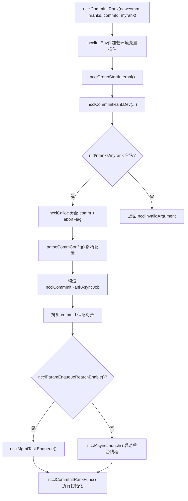
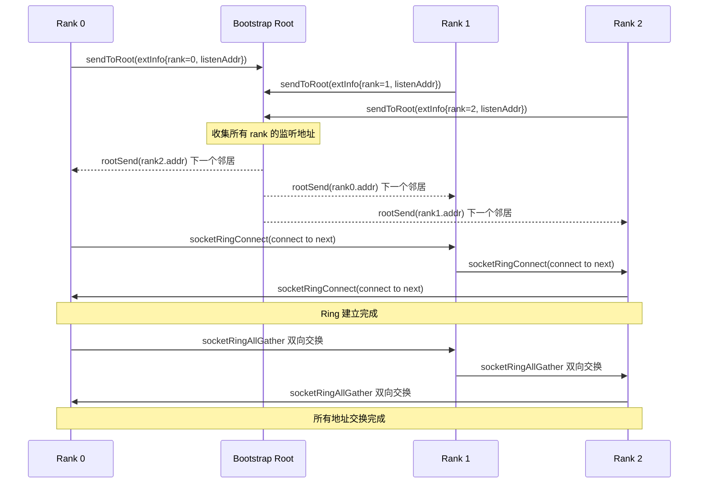
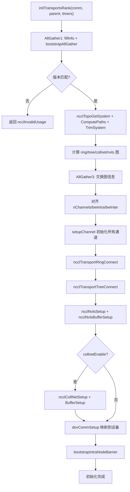

# Chapter 03: Initialization: How ncclCommInitRank Forms a Communicator Domain


上一章我们建立了贯穿全书的五个核心抽象：ncclComm、channel、algorithm、protocol 和 transport，它们共同构成了「一次通信 = 若干 channel × 一个 algorithm × 一个 protocol × 若干 transport」的公共词汇表。现在，我们要回答一个更根本的问题：这个 ncclComm 对象究竟是如何从无到有构建出来的？当你调用 ncclCommInitRank 时，NCCL 需要在几百毫秒内完成一系列复杂操作：确认所有 rank 到齐、交换设备信息、探测机器拓扑、计算数据路径、分配 GPU 显存与主机内存，最终将这一切打包成一个 ncclComm 对象。本章将沿着这条调用链，从 API 入口一路下钻到 initTransportsRank 的最后一根毛细血管。

## 3.1 API 入口：ncclCommInitRank 的同步外壳与异步内核

### Intuitive Architectural Model

`ncclCommInitRank` 表面上是"建一个通信域"，实际上它做的是"发起一个后台任务，然后（默认情况下）等它完成"。这就像你去餐厅点餐：点餐这个动作（API 调用）瞬间返回，但厨房做菜（真正的初始化）是在后台进行的。默认的"阻塞模式"只是让你在柜台前等到菜做好，而"非阻塞模式"则给你一个取餐号，你可以先去干别的。

如果没有这层异步设计，NCCL 在初始化期间就无法与 CUDA Graph 捕获、多通信域并行初始化等场景配合——所有初始化都会变成串行的、无法与用户代码重叠的阻塞操作。

### Data Structures & Memory Layout

先看 API 入口本身。`ncclCommInitRank` 是一个极薄的同步外壳：

[FACT:src/init.cc:2946-2970]

它做了四件事：调用 `ncclInitEnv()` 加载环境变量插件、打开 NVTX 性能标记、读取当前 CUDA 设备号、然后调用 `ncclGroupStartInternal()` 进入 group 语义，最后把实际工作委托给 `ncclCommInitRankDev`。

注意 `ncclGroupStartInternal()` / `ncclGroupEndInternal()` 这一对调用——即使你只初始化一个通信域，NCCL 也把它包在 group 语义里。这是为了统一处理"用户在一个 group 里初始化多个通信域"的场景，避免为单通信域和多通信域写两套代码路径。

真正的参数校验和对象分配在 `ncclCommInitRankDev` 里：

[FACT:src/init.cc:2851-2943]

这个函数是整条链路的"总调度台"。它先做参数校验（`nId` 范围、`nranks`/`myrank` 合法性），然后分配 `ncclComm` 结构体本身，以及三个与中止机制相关的字段：`abortFlag`（主机侧原子标志）、`abortFlagDev`（设备侧可见的固定内存副本）、`abortFlagRefCount`（引用计数，因为 split 出来的子通信域可能共享父通信域的 abortFlag）。

这里有一个值得注意的细节——`comm->startMagic = comm->endMagic = NCCL_MAGIC`：

[FACT:src/init.cc:2886-2886]

这对 magic 值像"封条"一样夹在 `ncclComm` 结构体的首尾。任何越界写入或结构体损坏都会破坏这对 magic，后续操作可以通过校验它们来检测内存踩踏。这是一种廉价但有效的内存完整性防护。

### Step-by-Step Walkthrough

当 `ncclCommInitRankDev` 走到最后，它构造一个 `ncclCommInitRankAsyncJob` 并启动异步任务：

[FACT:src/init.cc:2896-2929]

`job` 结构体承载了所有初始化所需的参数。注意 `job->commId` 是**拷贝**出来的，而不是直接引用用户传入的 `commId`：

[FACT:src/init.cc:2903-2910]

为什么要拷贝？源码注释给出了答案：`ncclUniqueId` 和 `ncclBootstrapHandle` 的对齐要求不同，用户传入的数组可能没有正确对齐到 `ncclBootstrapHandle` 所需的边界。拷贝到新分配的内存可以保证对齐。这是一个典型的"ABI 兼容性陷阱"——用户看到的是 `ncclUniqueId`，内部要当 `ncclBootstrapHandle` 用，两者大小相同但对齐不同。

最后，根据 `ncclParamEnqueueRearchEnable()` 的值，任务要么进入管理队列，要么直接通过 `ncclAsyncLaunch` 启动：

[FACT:src/init.cc:2922-2929]

`ncclAsyncLaunch` 会创建一个新线程执行 `ncclCommInitRankFunc`。如果是阻塞模式（默认），调用方会在 `ncclGroupEndInternal()` 里等待这个线程完成；如果是非阻塞模式，调用方立即返回，用户后续通过 `ncclCommGetAsyncError` 轮询状态。

### 设计思考

这里的设计核心是"同步 API + 异步实现"。为什么不让 `ncclCommInitRank` 直接同步执行所有初始化？因为 NCCL 需要支持 `ncclCommInitRankConfig` 的非阻塞模式，而非阻塞模式要求初始化在后台线程运行。如果同步路径和异步路径是两套代码，维护成本会翻倍。统一走异步、同步路径只是"启动后立即等待"，代码只有一份。



## 3.2 Bootstrap：rank 之间的第一条控制通道

### Intuitive Architectural Model

Bootstrap 是 NCCL 的"会前微信群"。在正式通信开始之前，所有 rank 需要先建立一条控制通道，用来交换"我是谁、我在哪台机器、我的 GPU 是什么型号、我的网卡地址是什么"这些元数据。没有 bootstrap，rank 之间就是一群互不相识的陌生人，无法协调任何通信。

如果 bootstrap 失败或超时，整个通信域初始化就会卡死——这是生产环境中最常见的 NCCL 挂起原因之一。

### Data Structures & Memory Layout

Bootstrap 的核心状态保存在 `bootstrapState` 结构体中：

[FACT:src/bootstrap.cc:527-546]

这个结构体有几个关键字段值得展开：

- `ring`：一个联合体，要么是网络设备句柄（`net.sendComm`/`net.recvComm`），要么是一对 socket（`socket.send`/`socket.recv`）。这对应两种 bootstrap 模式：基于 socket 的默认模式和基于网络设备的 `NCCL_OOB_NET_ENABLE` 模式。
- `listen`：监听端信息，同样有网络和 socket 两种形态。
- `peerP2pAddresses` / `peerProxyAddresses`：所有 rank 的 P2P 地址和 proxy 地址数组，通过 ring allgather 填充。
- `unexpectedConnections`：一个链表，缓存"收到了但还没被匹配"的连接。这是 bootstrap 协议的一个关键设计——因为接收方无法预知谁会先连过来，所以必须先把不匹配的连接存起来。
- `asyncSendQueue` + `asyncSendLock` + `asyncSendCond`：异步发送队列及其同步原语，用于 TLS 加密模式下的并发发送。

`bootstrapState` 的分配发生在 `bootstrapInit` 开头：

[FACT:src/bootstrap.cc:769-776]

注意 `comm->bootstrap = state` 这一行——bootstrap 状态被挂到通信域上，后续所有 bootstrap 操作都通过 `comm->bootstrap` 访问。

### Step-by-Step Walkthrough

`bootstrapInit` 是 bootstrap 的主干函数。让我们按执行顺序拆解：

**第一步：确定 magic 值。** magic 是 bootstrap 通信的"暗号"，只有持有相同 magic 的 rank 才能互相连接。

[FACT:src/bootstrap.cc:778-788]

如果是正常初始化（`handles != NULL`），magic 来自第一个 handle；如果是 split/grow（`parent != NULL`），magic 通过 `hashCombine(parent->magic, parent->childCount)` 派生。这保证了每个子通信域有唯一的 magic。

**第二步：创建监听 socket。** 每个 rank 需要两个监听端点：一个用于 ring 邻居连接（`STATE_LISTEN(state, socket)`），一个用于 root 连接（`listenSockRoot`）：

[FACT:src/bootstrap.cc:797-831]

这里有一个关键的分工：ring 监听 socket 使用 `comm->magic`，而 root 监听 socket 使用 `BOOTSTRAP_HANDLE(handles, curr_root)->magic`。为什么？因为 root 是全局协调者，所有 rank 都要连它，所以它用统一的 magic；而 ring 邻居是点对点的，用通信域自己的 magic 就够了。

**第三步：错峰连接。** 当 rank 数量很大时，所有 rank 同时连 root 会造成连接风暴。NCCL 用 `NCCL_UID_STAGGER_RATE` 和 `NCCL_UID_STAGGER_THRESHOLD` 来控制错峰：

[FACT:src/bootstrap.cc:833-843]

当某个 root 负责的 rank 数超过阈值（默认 256）时，每个 rank 根据自己在 root 下的局部 ID 计算延迟微秒数，然后 sleep。这是一个简单但有效的"令牌桶"式限流。

**第四步：向 root 发送自己的连接信息。** 每个 rank 把自己的监听地址发给 root：

[FACT:src/bootstrap.cc:845-867]

root 收到所有 rank 的信息后，会做一次"环形配对"——把 rank i 的地址发给 rank i-1，把 rank i+1 的地址发给 rank i。这样每个 rank 就知道了自己 ring 上的前后邻居。

**第五步：建立 ring 连接。** 每个 rank 连接自己的"下一个"邻居，同时接受"上一个"邻居的连接：

[FACT:src/bootstrap.cc:885-894]

这里 `socketRingConnect` 内部使用了 `bootstrapConcurrent`——在 TLS 加密模式下，connect 和 accept 必须并发执行，否则会死锁（因为 TLS 握手需要双方同时参与）。非加密模式下则串行执行 connect 再 accept。

**第六步：AllGather 所有地址。** ring 建立后，通过 `ringAllInfo` 把所有 rank 的 P2P 地址、proxy 地址、UDS 地址做一次 allgather：

[FACT:src/bootstrap.cc:934-938]

`ringAllInfo` 内部调用 `bootstrapAllGather`，后者在 socket 模式下使用 `socketRingAllGather`——一个双向 ring allgather 算法，N 个 rank 只需要 N/2 步：

[FACT:src/bootstrap.cc:1363-1412]

这个双向算法是 bootstrap 性能的关键优化。传统的单向 ring allgather 需要 N-1 步，双向版本把步数减半。每一步同时向两个方向发送和接收数据，用 `socketDoubleSendRecv` 把 4 个操作（2 发 2 收）打包成一次系统调用。

### 并发控制与底层交互

Bootstrap 的并发控制有几个层次：

**第一层：abort 检查。** 所有阻塞循环都定期检查 abortFlag：

[FACT:src/bootstrap.cc:150-159]

`BOOTSTRAP_N_CHECK_ABORT` 设为 10000，意味着每 10000 次循环检查一次 abort 标志。这个数字是性能与响应性的折中——检查太频繁会影响性能，检查太少会导致 abort 响应延迟。

**第二层：异步发送队列。** 在 TLS 加密模式下，`bootstrapSend` 不能同步执行（因为 TLS 握手需要接收方也参与），所以 NCCL 把发送操作放到独立线程：

[FACT:src/bootstrap.cc:1161-1217]

这里有一个精妙的顺序保证机制。`bootstrapAsyncSendMain` 在发送前会检查队列中是否有"更早的、发往同一 (peer, tag) 的发送"：

[FACT:src/bootstrap.cc:1124-1152]

为什么要保证同一 (peer, tag) 的发送顺序？源码注释解释得很清楚：接收方按 (peer, tag) 匹配连接，如果两个发往同一 (peer, tag) 的消息到达顺序颠倒，接收方会把它们匹配错。NVLS 初始化期间会多次向同一 peer 用同一 tag 广播，所以这个顺序保证是必须的。

**第三层：意外连接队列。** 接收方无法预知谁会先连过来，所以 `socketAccept` 会把不匹配的连接存入 `unexpectedConnections` 链表：

[FACT:src/bootstrap.cc:1276-1300]

这个设计解决了一个经典的分布式问题：多个 rank 可能同时向你发起连接，但你的 `bootstrapRecv` 调用顺序是固定的。如果不匹配的连接被直接丢弃，发送方会超时；如果阻塞等待，又可能死锁。存入队列是最安全的做法。

### 生产避坑指南

**坑一：bootstrap 超时导致初始化挂起。** 如果某个 rank 因为网络问题无法连接到 root，其他所有 rank 都会在 `ncclSocketAccept` 或 `ncclSocketRecv` 上无限等待。NCCL 没有内置的 bootstrap 超时机制，唯一的逃生通道是 abortFlag。生产环境中建议设置 `NCCL_UID_STAGGER_RATE` 来缓解大规模集群的连接风暴。

**坑二：`NCCL_COMM_ID` 与多 handle 冲突。** 当用户设置 `NCCL_COMM_ID` 环境变量时，NCCL 会强制把 `nId` 降为 1：

[FACT:src/init.cc:2912-2921]

这意味着 `ncclCommInitRankScalable` 的多 handle 特性会被静默禁用。如果你在用 scalable 初始化又设了 `NCCL_COMM_ID`，行为会和你预期的不一样。

**坑三：TLS 模式下的死锁。** 在 TLS 加密模式下，如果 connect 和 accept 不并发执行，双方都会卡在 TLS 握手。`bootstrapConcurrent` 就是为了解决这个问题：

[FACT:src/bootstrap.cc:648-669]

非加密模式下串行执行（先 send 后 recv），加密模式下启动一个线程处理 send，主线程处理 recv。



## 3.3 commAlloc：通信域对象的内存骨架

### Intuitive Architectural Model

`commAlloc` 是通信域的"毛坯房交付"——它分配结构体内存、初始化所有字段到安全默认值、创建必要的 CUDA 对象和同步原语，但还没有填充拓扑信息、通道配置、传输连接这些"精装修"内容。如果把 `ncclComm` 比作一栋大楼，`commAlloc` 就是打地基和浇筑框架，`initTransportsRank` 才是内部装修。

如果没有 `commAlloc` 的初始化，后续代码访问未初始化的字段会导致不可预测的行为——比如 `comm->channels[c].id` 如果是随机值，通道初始化逻辑就会误判通道状态。

### Data Structures & Memory Layout

`commAlloc` 的签名和开头校验：

[FACT:src/init.cc:512-526]

它首先校验 `ndev` 和 `rank` 的合法性，然后构造两个内存栈（`memPermanent` 和 `memScoped`），设置 `rank` 和 `nRanks`。这两个内存栈是 NCCL 的内存管理基础设施——`memPermanent` 用于生命周期与通信域相同的分配，`memScoped` 用于临时分配。

接下来是 CUDA 设备探测：

[FACT:src/init.cc:528-531]

`cudaGetDevice` 获取当前设备号，`ncclCudaCompCap` 获取计算能力。源码注释说得很直白："Try to create a CUDA object right away. If there is something wrong with the device we're on, better know it early."——尽早暴露设备问题，避免在初始化后期才发现。

然后是共享资源的分配或继承：

[FACT:src/init.cc:533-555]

这里有一个重要的分支：如果 `parent == NULL || !parent->shareResources`，就创建新的 `ncclSharedResources`；否则继承父通信域的共享资源并增加引用计数。`ncclSharedResources` 包含设备流、主机流、启动事件、scratch 事件等——这些资源在 split 场景下可以被子通信域复用，避免重复创建。

注意 `sharedRes->refCount = 1` 这一行——初始引用计数为 1，每次 split 共享时递增，最后一个引用释放时才真正销毁。

接下来是网络、RMA、GIN 的初始化：

[FACT:src/init.cc:547-549]

这三个子系统分别负责网络传输、远程内存访问、GPU 发起的网络通信。它们的初始化顺序有讲究——`ncclNetInit` 必须先于 `ncclRmaInit`，因为 RMA 依赖网络插件。

内存管理器的初始化：

[FACT:src/init.cc:567-576]

同样有共享/新建两种路径。`ncclMemManager` 负责管理 CUDA 内存池和注册缓存。

通道初始化标记：

[FACT:src/init.cc:607-608]

这一行把所有通道的 `id` 设为 -1，表示"未初始化"。后续 `setupChannel` 会检查这个值来决定是否需要初始化。

中断队列的构造：

[FACT:src/init.cc:619-632]

NCCL 使用侵入式队列（intrusive queue）来管理各种任务。这些队列在 `commAlloc` 阶段全部构造为空，后续任务入队时直接使用。

CUDA 内存池的创建：

[FACT:src/init.cc:636-652]

如果设备支持内存池（`cudaDevAttrMemoryPoolsSupported`），就创建一个 pinned 类型的内存池，并把释放阈值设为最大值（`~uint64_t(0)`），意思是"永远不自动释放"。这是为了避免 CUDA 运行时在 NCCL 不知情的情况下回收内存。

### Step-by-Step Walkthrough

让我们跟踪一个具体的初始化场景：单机 8 卡，每个进程一个 rank，正常初始化。

1. `commAlloc(comm, NULL, 8, rank)` 被调用，`parent == NULL`。
2. 校验通过，`comm->rank = rank`，`comm->nRanks = 8`。
3. `cudaGetDevice` 返回当前设备号，`comm->compCap` 被设置。
4. 创建新的 `ncclSharedResources`，引用计数为 1。
5. `ncclNetInit` 初始化网络插件（可能是 Socket 或 IB）。
6. `ncclMemManagerInit` 创建内存管理器。
7. `getBusId` 获取 PCI 总线 ID，`ncclNvmlDeviceGetHandleByPciBusId` 获取 NVML 句柄。
8. `dmaBufSupported` 检测 DMA-BUF 支持。
9. 分配 `connectSend` / `connectRecv` 位图数组。
10. 所有通道 `id` 设为 -1。
11. 构造所有中断队列。
12. 创建 CUDA 内存池。

### 设计思考

`commAlloc` 中最值得玩味的设计是"尽早失败"原则。它在函数开头就调用 `cudaGetDevice`，而不是等到后面需要设备信息时再调用。这样做的好处是：如果设备有问题（比如被其他进程独占），错误会在初始化早期就暴露，而不是在分配了大量内存之后才发现。

另一个设计是 `preconnectNext` 的初始化：

[FACT:src/init.cc:598-598]

`reinterpret_cast<struct ncclComm*>(0x1)` 是一个哨兵值，用于标记"下一个预连接"的状态。这种用非法指针值作为状态标记的手法在系统编程中很常见——它比额外的布尔字段更省内存，但需要小心不要解引用。

## 3.4 initTransportsRank：拓扑发现与通道分配

### Intuitive Architectural Model

`initTransportsRank` 是初始化的"心脏"。它做三件大事：通过两次 AllGather 交换所有 rank 的设备信息和拓扑信息；根据这些信息计算 ring/tree/collnet/nvls 等算法的图结构；最后建立所有传输连接。如果把通信域比作一个城市的交通系统，`initTransportsRank` 就是规划所有道路、立交桥和公交线路的过程。

如果没有这一步，NCCL 就不知道数据该走哪条路——它可能让数据绕远路，或者根本找不到可达的路径。

### Data Structures & Memory Layout

`initTransportsRank` 的局部变量非常多，我们挑关键的看：

[FACT:src/init.cc:1163-1179]

这里把 `comm->graphs` 数组中的各个图结构取出来，建立别名。`graphs` 数组按算法索引，注意 `nvlsGraph` 被用了两次（NVLS 和 NVLSTree 共享同一个图结构）。

两个关键的临时结构体：

[FACT:src/init.cc:1181-1206]

`graphInfo` 保存单个 rank 对某个算法的图信息（通道数、带宽、类型等），`allGatherInfo` 是 AllGather 的数据单元，包含所有算法的图信息加上拓扑 rank 信息。

### Step-by-Step Walkthrough

**阶段一：AllGather1——交换设备信息。**

[FACT:src/init.cc:1234-1239]

每个 rank 调用 `fillInfo` 填充自己的 `ncclPeerInfo`，然后通过 `bootstrapAllGather` 交换。`fillInfo` 填充的信息包括：rank 号、CUDA 设备号、NVML 设备号、NCCL 版本、git hash、主机 hash、进程 hash、GPU UUID、总线 ID、显存大小、驱动版本等。

[FACT:src/init.cc:888-982]

注意 `info->hostHash = getHostHash() + commHash` 和 `info->pidHash = getPidHash() + commHash`——host hash 和 pid hash 都加上了 commHash。这是为了区分同一台机器上的不同通信域。

AllGather 完成后，每个 rank 遍历所有 peer 的信息，计算全局属性：

[FACT:src/init.cc:1250-1303]

这个循环做了很多事：检测版本不匹配、统计节点数、计算 `cuMemSupport` 的交集、检测是否有多个 rank 使用同一个 GPU、计算 GIN 类型掩码的交集等。注意 `nNodes` 的统计方式——每当遇到不同 hostHash 就递增，这假设 rank 是按节点连续排列的。

**阶段二：拓扑发现。**

[FACT:src/init.cc:1390-1403]

这六步是拓扑发现的核心流程：`ncclTopoGetSystem` 枚举系统设备构建拓扑图，`ncclTopoComputePaths` 计算 GPU 到 NIC 的路径，`ncclTopoTrimSystem` 移除不可达设备，再次计算路径，`ncclTopoSearchInit` 初始化搜索状态，最后打印拓扑。

**阶段三：图计算。**

[FACT:src/init.cc:1421-1468]

依次计算 ring、tree、collnet chain、collnet direct、nvls 五种图。每种图有不同的 pattern 和通道数约束。注意 `treeGraph->minChannels = ringGraph->nChannels`——tree 的通道数被约束为与 ring 相同，这是为了保证不同算法之间的通道对齐。

**阶段四：AllGather3——交换图信息。**

[FACT:src/init.cc:1490-1533]

每个 rank 把自己的图信息填入 `allGather3Data[rank]`，然后再次 `bootstrapAllGather`。这次交换的信息包括：每种算法的 pattern/nChannels/bwIntra/bwInter/typeIntra/typeInter/crossNic、CPU 架构、P2P 通道数、网络设备数、CollNet 设备数等。

AllGather3 完成后，每个 rank 遍历所有 peer 的图信息，取最小值/最大值来对齐：

[FACT:src/init.cc:1687-1703]

注意这里的对齐策略：`nChannels`、`sameChannels`、`bwIntra`、`bwInter` 取最小值，`typeIntra`、`typeInter`、`crossNic` 取最大值。为什么？因为通道数和带宽受限于最弱的链路，而类型和 crossNic 需要取并集以确保兼容性。

**阶段五：建立传输连接。**

[FACT:src/init.cc:1811-1892]

这里有两个分支：`runtimeConn` 为真时只做通道 setup 不做连接（延迟到运行时连接），否则立即建立所有连接。连接顺序是：ring → tree → NVLS → PAT → NVLS tree → CollNet。

### 并发控制与硬件交互

`initTransportsRank` 中有几个值得注意的并发/硬件交互点：

**CPU 亲和性设置：**

[FACT:src/init.cc:1406-1412]

NCCL 把当前线程绑定到 GPU 附近的 CPU 核心，确保主机内存分配是本地 NUMA 节点的。这减少了跨 NUMA 访问的延迟。

**NVLS 初始化：**

[FACT:src/init.cc:1419-1419]

`ncclNvlsInit` 检测 NVLink SHARP 支持。NVLS 允许交换机直接执行 reduce 操作，大幅降低 AllReduce 延迟。

**Proxy 线程创建：**

[FACT:src/init.cc:1780-1786]

Proxy 线程负责异步推进网络 I/O。它在 `initTransportsRank` 中被创建，之后所有网络操作都通过 proxy 进行。

### 生产避坑指南

**坑一：网络设备数不匹配。** 如果不同 rank 的本地网卡数量不同，NCCL 会报错：

[FACT:src/init.cc:1576-1596]

除非设置 `NCCL_IGNORE_NET_MISMATCH=1`。这在异构集群中很常见——有些节点有 8 张网卡，有些只有 4 张。忽略不匹配可能导致性能下降，因为通道数会被最弱的节点限制。

**坑二：多 rank 共用同一 GPU。** 如果两个 rank 的 GPU UUID 相同，NCCL 会拒绝初始化：

[FACT:src/init.cc:1291-1296]

除非设置 `NCCL_MULTI_RANK_GPU_ENABLE=1`。这个检查防止了用户误配置导致的性能问题。

**坑三：CollNet 节点数不足。** CollNet 需要至少 `NCCL_COLLNET_NODE_THRESHOLD` 个节点才能启用：

[FACT:src/init.cc:1720-1728]

默认阈值是 2。单节点环境下 CollNet 会被自动禁用。



## 3.5 NCCL_PARAM：环境变量体系的编译期魔法

### Intuitive Architectural Model

`NCCL_PARAM` 是 NCCL 的"配置开关工厂"。它用宏在编译期生成一个函数，运行时第一次调用时读取环境变量并缓存结果。这就像家里的电灯开关——你拨一下（调用函数），灯就亮了（返回配置值），之后开关状态被记住，不需要每次都重新拨。

如果没有这套机制，NCCL 就需要在每个使用配置的地方手动调用 `getenv` 并解析字符串，代码会变得极其冗长且容易出错。

### Data Structures & Memory Layout

`NCCL_PARAM` 宏的定义：

[FACT:src/include/param.h:22-31]

这个宏展开后生成一个函数 `ncclParam##name()`，内部有三个静态变量：

- `uninitialized = INT64_MIN`：哨兵值，表示"尚未初始化"。
- `noCache`：三态标志，-1 表示未初始化，0 表示缓存，1 表示不缓存。
- `cache`：缓存的值，初始为 `uninitialized`。

函数逻辑是：如果 `cache` 还是 `uninitialized`，调用 `ncclLoadParam` 加载；否则直接返回 `cache`。`COMPILER_EXPECT(..., false)` 告诉编译器这个分支很少走，优化热路径。

`ncclLoadParam` 的实现：

[FACT:src/misc/param.cc:78-108]

它用互斥锁保护整个加载过程，先检查 `noCache` 策略，再检查缓存是否有效，然后读取环境变量并解析。解析失败时使用默认值并打印警告。

### Step-by-Step Walkthrough

以 `NCCL_PARAM(BuffSize, "BUFFSIZE", -2)` 为例：

[FACT:src/init.cc:1007-1007]

宏展开后生成：

```cpp
int64_t ncclParamBuffSize() {
  constexpr int64_t uninitialized = INT64_MIN;
  static int8_t noCache = -1;
  static_assert(-2 != uninitialized, "...");
  static int64_t cache = uninitialized;
  if (COMPILER_EXPECT(COMPILER_ATOMIC_LOAD(&cache, std::memory_order_relaxed) == uninitialized, false)) {
    return ncclLoadParam("NCCL_BUFFSIZE", -2, uninitialized, &cache, &noCache);
  }
  return cache;
}
```

第一次调用时，`cache == uninitialized`，进入 `ncclLoadParam`。它读取 `NCCL_BUFFSIZE` 环境变量，如果没设置就返回默认值 -2。然后根据 `noCache` 策略决定是否缓存。

`noCache` 策略由 `ncclParamIsCacheDisabled` 决定：

[FACT:src/misc/param.cc:74-76]

如果环境变量名匹配某个模式（比如以 `_` 结尾），就不缓存，每次都重新读取。这允许用户在运行时动态修改某些配置。

### 设计思考

这套设计的精妙之处在于"零成本抽象"：热路径上只有一次原子加载和比较，没有锁、没有字符串解析。冷路径（首次加载）才付出完整代价。`COMPILER_EXPECT` 提示编译器把热路径放在指令缓存的前面，进一步提高性能。

另一个设计是 `noCache` 的三态设计。-1 表示"还没决定"，0 表示"缓存"，1 表示"不缓存"。这个决定只在首次加载时做一次，之后不再改变。

### 生产避坑指南

**坑一：环境变量拼写错误。** 如果用户写了 `NCCL_BUFSIZE` 而不是 `NCCL_BUFFSIZE`，NCCL 不会报错，只会使用默认值。建议用 `NCCL_DEBUG=ENV` 查看所有被识别的环境变量。

**坑二：`NCCL_CONF_FILE` 的加载顺序。** NCCL 会依次加载 `$NCCL_CONF_FILE`（或 `~/.nccl.conf`）和 `/etc/nccl.conf`：

[FACT:src/misc/param.cc:52-67]

后加载的文件会覆盖先加载的。如果两个文件都设置了同一个变量，`/etc/nccl.conf` 的值会生效。

**坑三：`noCache` 变量的线程安全。** 源码注释说 "noCache is only load/stored within the mutex, no need for atomic"：

[FACT:src/misc/param.cc:74-76]

这意味着 `noCache` 的读写都在互斥锁保护下，不需要原子操作。但 `cache` 的读取是无锁的（热路径），所以用原子加载。

## 3.6 devCommSetup：把通信域映射到设备

### Intuitive Architectural Model

`devCommSetup` 是通信域的"设备侧投影"。GPU kernel 运行在设备上，无法直接访问主机内存中的 `ncclComm` 结构体。所以 NCCL 需要把通信域的关键字段拷贝到设备可访问的内存中，形成 `ncclDevComm`。这就像把公司的通讯录复印一份放到每个员工的工位上——员工不用每次都跑去找前台问同事电话。

如果没有 `devCommSetup`，GPU kernel 就无法知道自己的 rank、通道配置、缓冲区大小等信息，集合通信 kernel 根本无法启动。

### Data Structures & Memory Layout

`devCommSetup` 使用一个临时结构体 `ncclKernelCommAndChannels` 来打包要拷贝到设备的数据：

[FACT:src/init.cc:712-746]

这个结构体包含 `ncclDevComm`（设备侧通信域）和通道数组。函数先把主机侧的数据填入临时结构体，然后一次性 `cudaMemcpyAsync` 到设备。

关键字段的填充：

[FACT:src/init.cc:734-746]

注意 `comm->devComm = &devCommAndChans->comm`——主机侧的 `comm->devComm` 指向设备内存中的 `ncclDevComm`。后续 kernel 启动时会把 `comm->devComm` 作为参数传入。

通道信息的填充：

[FACT:src/init.cc:829-843]

每个通道的 peers、ring、tree、collnetChain、collnetDirect、nvls 指针都被拷贝到设备侧。注意 `ring.userRanks` 需要额外的一次 `cudaMemcpyAsync`，因为它是一个数组。

### Step-by-Step Walkthrough

1. 获取设备流：`ncclStrongStreamAcquire` 获取一个强流（strong stream），确保后续的异步拷贝有序执行。
2. 分配设备内存：`ncclCudaCallocAsync` 分配 `devCommAndChans`。
3. 填充主机侧临时结构体：设置 rank、nRanks、node、nNodes、abortFlag、buffSizes 等。
4. 分配并拷贝 `rankToLocalRank` 数组。
5. 计算 `workFifoBytes`：根据 CC（Confidential Computing）状态决定。
6. 分配 workFifo 缓冲区：GDR 模式用 `ncclGdrCudaCalloc`，否则用 `ncclCudaHostCalloc`。
7. 分配 profiler 计数器。
8. 分配进度计数器（如果启用）。
9. 填充通道信息。
10. 一次性拷贝到设备：`ncclCudaMemcpyAsync(devCommAndChans, &tmpCommAndChans, 1, deviceStream)`。
11. 释放强流并同步。

### 设计思考

`devCommSetup` 中最值得注意的设计是"批量拷贝"。NCCL 没有为每个字段单独调用 `cudaMemcpy`，而是把所有字段打包到一个临时结构体，用一次 `cudaMemcpyAsync` 完成。这大幅减少了 CUDA API 调用次数和同步开销。

另一个设计是 `workFifoBytes` 的 CC 处理：

[FACT:src/init.cc:750-763]

在 CC（Confidential Computing）模式下，`workFifoBytes` 被设为 0，因为 GDR 拷贝在 CC 模式下不可用。这是一个硬件限制的优雅降级。

### 生产避坑指南

**坑一：`devCommSetup` 必须在 barrier 之前调用。** 源码注释解释了原因：

[FACT:src/init.cc:1950-1952]

如果在 barrier 之后调用，可能有线程已经开始启动 NCCL kernel，而此时设备内存还没分配完，会导致死锁。

**坑二：`workFifoBytes` 必须是 2 的幂。** 如果不是，NCCL 会警告并使用默认值：

[FACT:src/init.cc:757-762]

## 本章思考与自测

<details><summary>Q1: 如果将 [FACT:src/init.cc:1291-1296] 中检测"多个 rank 使用同一 GPU"的逻辑去掉，在什么场景下会导致问题？为什么 NCCL 默认拒绝这种配置？</summary>

**参考解析**：

这段代码检测同一主机上两个 rank 的 GPU UUID 是否相同。如果相同且 `NCCL_MULTI_RANK_GPU_ENABLE=0`（默认），就返回 `ncclInvalidUsage`。

去掉这个检查后，多个 rank 会共享同一个 GPU。这会导致：

1. **P2P 传输冲突**：NCCL 的 P2P 传输假设每个 rank 独占一个 GPU。如果两个 rank 共享 GPU，它们会同时向同一个 GPU 的同一块缓冲区写入数据，导致数据竞争和结果错误。

2. **通道分配冲突**：`comm->channels` 中的通道资源（缓冲区、FIFO）是按 rank 分配的。共享 GPU 的 rank 会争抢同一份资源。

3. **性能灾难**：即使没有正确性问题，两个 rank 共享一个 GPU 的算力和显存带宽，性能会急剧下降。

NCCL 默认拒绝这种配置是为了"快速失败"——与其让用户在一个错误配置上浪费数小时调试，不如在初始化时就明确报错。`NCCL_MULTI_RANK_GPU_ENABLE=1` 是给那些明确知道自己在做什么的用户（比如 MPS 场景）准备的逃生通道。

</details>

<details><summary>Q2: 如果将 [FACT:src/bootstrap.cc:1129-1134] 中等待"同一 (peer, tag) 的更早发送"的逻辑去掉，在什么场景下会导致接收方匹配错误？</summary>

**参考解析**：

这段代码在异步发送线程中等待，直到队列中没有更早的、发往同一 (peer, tag) 的发送。

去掉这个等待后，两个发往同一 (peer, tag) 的发送可能并发执行，到达接收方的顺序不确定。接收方的 `socketAccept` 按 (peer, tag) 匹配连接：

[FACT:src/bootstrap.cc:1291-1292]

如果发送方 A 先调用 `bootstrapSend` 但后到达，发送方 B 后调用但先到达，接收方会把 B 的消息当作 A 的响应。这会导致数据错位——接收方以为收到的是第一个请求的响应，实际上是第二个请求的。

源码注释明确指出了这个场景："NVLS setup broadcasts to the same peers with the same tag several times during init"。NVLS 初始化期间会多次向同一 peer 用同一 tag 广播，如果顺序颠倒，NVLS 配置会完全错乱。

这个顺序保证的代价是：同一 (peer, tag) 的发送被串行化。但不同 (peer, tag) 的发送仍然并发，所以整体吞吐量不受影响。

</details>

<details><summary>Q3: 如果将 [FACT:src/init.cc:1691-1697] 中对齐策略从"nChannels 取 min、typeIntra 取 max"改为"全部取 min"或"全部取 max"，会分别导致什么问题？</summary>

**参考解析**：

当前策略是：`nChannels`、`sameChannels`、`bwIntra`、`bwInter` 取 min，`typeIntra`、`typeInter`、`crossNic` 取 max。

**如果全部取 min**：`typeIntra` 和 `typeInter` 取 min 会导致某些 rank 的传输类型被降级。比如 rank A 支持 P2P（typeIntra=P2P），rank B 只支持 SHM（typeIntra=SHM），取 min 后所有 rank 都用 SHM。但 SHM 的枚举值可能比 P2P 小，取 min 会选到错误的类型。实际上 `typeIntra` 是一个位掩码或枚举，取 max 是为了选择"能力最强"的类型。

**如果全部取 max**：`nChannels` 取 max 会导致某些 rank 被分配超过其能力的通道数。比如 rank A 只能支持 4 个通道，rank B 支持 8 个，取 max 后所有 rank 都尝试用 8 个通道，rank A 会失败或性能下降。`bwIntra` 取 max 会导致带宽估计过于乐观，tuning 模块可能选择不适合的算法。

这个对齐策略的本质是：**资源约束取交集（min），能力枚举取并集（max）**。通道数和带宽是"上限"约束，必须取最保守的值；传输类型是"能力"枚举，取最大值确保所有 rank 都能找到兼容的传输方式。

</details>

下一章我们将深入Topology Discovery & Physical Graph Search，看 NCCL 如何枚举机器里的 GPU、网卡、PCI 交换机，构建出一张完整的拓扑图，并在这张图上搜索最优的 ring 和 tree 结构。本章建立的 bootstrap 通信、commAlloc 内存骨架、initTransportsRank 主干流程，将在下一章中逐一展开其拓扑细节。

至此，我们已经完整走过了 ncclCommInitRank 的调用链，看清了 ncclComm 对象从零构建的全过程。但初始化过程中有一个关键环节我们只是匆匆掠过：NCCL 是如何探测机器内部的 GPU 和网卡，并据此决定数据该走哪条路的？这正是下一章要深入的主题——Topology Discovery & Physical Graph Search。我们将拆解 src/graph/topo.cc 如何枚举 PCI/NVLink/网卡设备并构建拓扑图，src/graph/search.cc 如何在该图上搜索最优路径，以及 src/graph/rings.cc 与 trees.cc 如何将搜索结果具体化为 Ring 与 Tree 算法拓扑。理解了这套机制，你就能明白为什么 NCCL 能在不同机器上自动选到合适的算法。