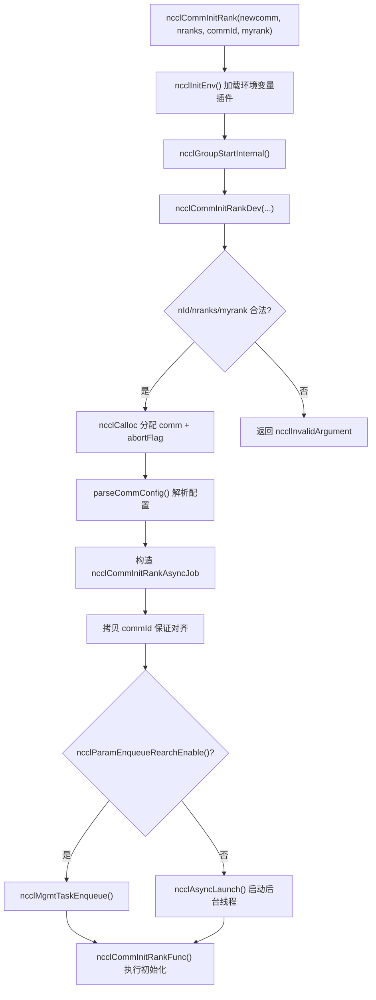
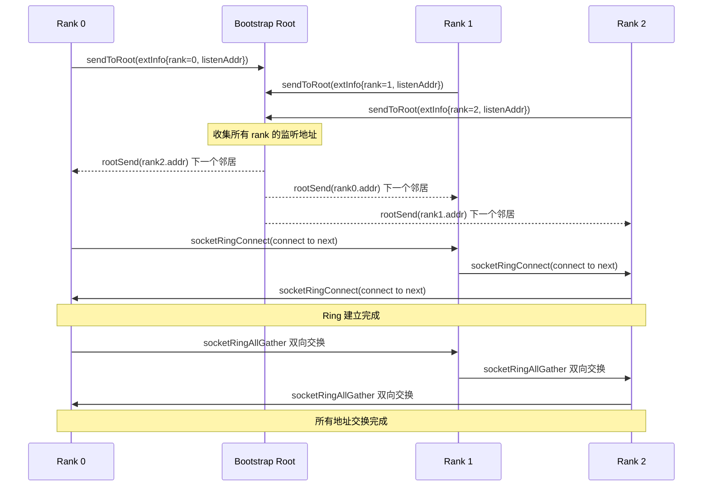
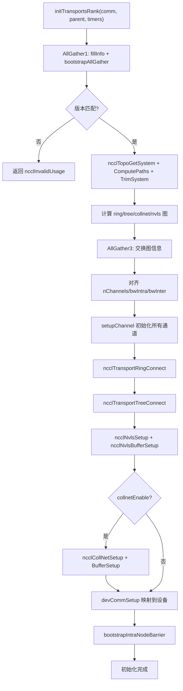

# Chapter 3: Initialization: How ncclCommInitRank Builds a Group of Isolated Processes into a Communicator

In the previous chapter, we established five core abstractions that run through the entire book: ncclComm, channel, algorithm, protocol, and transport. Together they form the common vocabulary of "one communication = several channels × one algorithm × one protocol × several transports." Now we need to answer a more fundamental question: how exactly is this ncclComm object constructed from nothing? When you call ncclCommInitRank, NCCL needs to complete a series of complex operations within a few hundred milliseconds: confirm that all ranks have arrived, exchange device information, probe machine topology, compute data paths, allocate GPU memory and host memory, and finally package all of this into an ncclComm object. This chapter will follow this call chain, drilling down from the API entry point all the way to the last capillary of initTransportsRank.

# 3.1 API Entry: The Synchronous Shell and Asynchronous Core of ncclCommInitRank

## Intuitive Model

`ncclCommInitRank`On the surface, it is "creating a communication domain," but in reality what it does is "launch a background task, then (by default) wait for it to complete." This is like ordering food at a restaurant: the act of ordering (the API call) returns instantly, but the kitchen preparing the food (the actual initialization) happens in the background. The default "blocking mode" simply makes you wait at the counter until the food is ready, while "non-blocking mode" gives you a pickup number so you can go do something else first.

Without this asynchronous design layer, NCCL would not be able to cooperate with scenarios such as CUDA Graph capture and parallel initialization of multiple communication domains during initialization—all initialization would become serialized blocking operations that cannot overlap with user code.

## Data Structures and Memory Layout

Let us first look at the API entry point itself.`ncclCommInitRank`It is an extremely thin synchronous shell:

[FACT:src/init.cc:2946-2970]

It does four things: call`ncclInitEnv()`load the environment variable plugin, turn on NVTX performance markers, read the current CUDA device number, and then call`ncclGroupStartInternal()`enter group semantics, and finally delegate the actual work to`ncclCommInitRankDev`。

Note`ncclGroupStartInternal()` / `ncclGroupEndInternal()`This pair of calls—even if you are initializing only one communication domain, NCCL still wraps it in group semantics. This is to uniformly handle the scenario where "the user initializes multiple communication domains within one group," avoiding the need to write two code paths for single-domain and multi-domain cases.

The real parameter validation and object allocation happen in`ncclCommInitRankDev`inside:

[FACT:src/init.cc:2851-2943]

This function is the "central dispatch desk" of the entire chain. It first performs parameter validation (`nId`range,`nranks`/`myrank`validity), then allocates`ncclComm`the structure itself, as well as three fields related to the abort mechanism:`abortFlag`(host-side atomic flag),`abortFlagDev`(device-visible pinned memory copy),`abortFlagRefCount`(reference count, because child communication domains created by split may share the parent communication domain's abortFlag).

There is a detail worth noting here—`comm->startMagic = comm->endMagic = NCCL_MAGIC`：

[FACT:src/init.cc:2886-2886]

This pair of magic values acts like a "seal" clamped at the beginning and end of the`ncclComm`structure. Any out-of-bounds write or structure corruption will destroy this pair of magic values, and subsequent operations can detect memory trampling by validating them. This is a cheap but effective memory integrity protection.

## Step-by-Step Walkthrough

When`ncclCommInitRankDev`reaches the end, it constructs a`ncclCommInitRankAsyncJob`and starts an asynchronous task:

[FACT:src/init.cc:2896-2929]

`job`The structure carries all the parameters needed for initialization. Note that`job->commId`is**copied**out, rather than directly referencing the user-passed`commId`：

[FACT:src/init.cc:2903-2910]

Why copy? The source code comments give the answer:`ncclUniqueId`and`ncclBootstrapHandle`have different alignment requirements, and the array passed in by the user may not be correctly aligned to the boundary required by`ncclBootstrapHandle`Copying to newly allocated memory can guarantee alignment. This is a typical "ABI compatibility trap"—what the user sees is`ncclUniqueId`but internally it must be used as`ncclBootstrapHandle`The two have the same size but different alignment.

Finally, according to the value of`ncclParamEnqueueRearchEnable()`the task either enters the management queue or is started directly through`ncclAsyncLaunch`:

[FACT:src/init.cc:2922-2929]

`ncclAsyncLaunch`creates a new thread to execute`ncclCommInitRankFunc`If it is blocking mode (the default), the caller waits in`ncclGroupEndInternal()`for this thread to complete; if it is non-blocking mode, the caller returns immediately, and the user later polls the status through`ncclCommGetAsyncError`.

## Design Considerations

The core of the design here is "synchronous API + asynchronous implementation." Why not let`ncclCommInitRank`directly execute all initialization synchronously? Because NCCL needs to support`ncclCommInitRankConfig`non-blocking mode, and non-blocking mode requires initialization to run in a background thread. If the synchronous path and the asynchronous path were two separate pieces of code, the maintenance cost would double. By uniformly going through the asynchronous path, the synchronous path is just "start and immediately wait," and there is only one copy of the code.



# 3.2 Bootstrap: The First Control Channel Between Ranks

## Intuitive Model

Bootstrap is NCCL's "pre-meeting WeChat group." Before formal communication begins, all ranks need to first establish a control channel to exchange metadata such as "who I am, which machine I am on, what model my GPU is, and what my NIC address is." Without bootstrap, the ranks are just a group of strangers who do not know each other and cannot coordinate any communication.

If bootstrap fails or times out, the entire communication domain initialization will hang—this is one of the most common causes of NCCL hangs in production environments.

## Data Structures and Memory Layout

The core state of Bootstrap is stored in the`bootstrapState`structure:

[FACT:src/bootstrap.cc:527-546]

Several key fields in this struct are worth elaborating on:

- `ring`: a union, either a network device handle (`net.sendComm`/`net.recvComm`), or a pair of sockets (`socket.send`/`socket.recv`). This corresponds to two bootstrap modes: the default socket-based mode and the network-device-based`NCCL_OOB_NET_ENABLE`mode.
- `listen`: listener-side information, which likewise has two forms: network and socket.
- `peerP2pAddresses` / `peerProxyAddresses`: arrays of P2P addresses and proxy addresses for all ranks, populated via ring allgather.
- `unexpectedConnections`: a linked list that caches connections that have been "received but not yet matched." This is a key design of the bootstrap protocol—because the receiver cannot predict who will connect first, unmatched connections must be stored first.
- `asyncSendQueue` + `asyncSendLock` + `asyncSendCond`: the asynchronous send queue and its synchronization primitives, used for concurrent sends in TLS encryption mode.

`bootstrapState`The allocation of`bootstrapInit`occurs at the beginning of

[FACT:src/bootstrap.cc:769-776]

Note the`comm->bootstrap = state`line—the bootstrap state is attached to the communicator, and all subsequent bootstrap operations access it through`comm->bootstrap`.

## Step-by-Step Walkthrough

`bootstrapInit`is the main function of bootstrap. Let's break it down in execution order:

**Step 1: Determine the magic value.**magic is the "secret code" for bootstrap communication; only ranks holding the same magic can connect to each other.

[FACT:src/bootstrap.cc:778-788]

If it is normal initialization (`handles != NULL`), magic comes from the first handle; if it is split/grow (`parent != NULL`), magic is derived via`hashCombine(parent->magic, parent->childCount)`. This ensures each sub-communicator has a unique magic.

**Step 2: Create listening sockets.**Each rank needs two listening endpoints: one for ring neighbor connections (`STATE_LISTEN(state, socket)`), and one for root connections (`listenSockRoot`）：

[FACT:src/bootstrap.cc:797-831]

There is a key division of labor here: the ring listening socket uses`comm->magic`, while the root listening socket uses`BOOTSTRAP_HANDLE(handles, curr_root)->magic`. Why? Because root is the global coordinator, and all ranks need to connect to it, so it uses a unified magic; whereas ring neighbors are point-to-point, so the communicator's own magic is sufficient.

**Step 3: Staggered connections.**When the number of ranks is very large, all ranks connecting to root simultaneously causes a connection storm. NCCL uses`NCCL_UID_STAGGER_RATE`and`NCCL_UID_STAGGER_THRESHOLD`to control staggering:

[FACT:src/bootstrap.cc:833-843]

When the number of ranks handled by a root exceeds a threshold (default 256), each rank calculates a delay in microseconds based on its local ID under that root, and then sleeps. This is a simple but effective "token bucket"-style rate limiting.

**Step 4: Send your own connection information to root.**Each rank sends its listening address to root:

[FACT:src/bootstrap.cc:845-867]

After root receives the information of all ranks, it performs a "ring pairing"—sending rank i's address to rank i-1, and rank i+1's address to rank i. In this way, each rank learns its predecessor and successor neighbors on the ring.

**Step 5: Establish ring connections.**Each rank connects to its "next" neighbor while accepting the connection from its "previous" neighbor:

[FACT:src/bootstrap.cc:885-894]

Here`socketRingConnect`internally uses`bootstrapConcurrent`—in TLS encryption mode, connect and accept must be executed concurrently, otherwise it will deadlock (because the TLS handshake requires both parties to participate simultaneously). In non-encrypted mode, connect is executed serially followed by accept.

**Step 6: AllGather all addresses.**After the ring is established, perform an allgather of all ranks' P2P addresses, proxy addresses, and UDS addresses via`ringAllInfo`:

[FACT:src/bootstrap.cc:934-938]

`ringAllInfo`internally calls`bootstrapAllGather`, which in socket mode uses`socketRingAllGather`—a bidirectional ring allgather algorithm, requiring only N/2 steps for N ranks:

[FACT:src/bootstrap.cc:1363-1412]

This bidirectional algorithm is a key optimization for bootstrap performance. The traditional unidirectional ring allgather requires N-1 steps, while the bidirectional version halves the number of steps. Each step simultaneously sends and receives data in both directions, using`socketDoubleSendRecv`to package 4 operations (2 sends and 2 receives) into a single system call.

## Concurrency control and low-level interaction

Bootstrap's concurrency control has several layers:

**Layer 1: abort checking.**All blocking loops periodically check abortFlag:

[FACT:src/bootstrap.cc:150-159]

`BOOTSTRAP_N_CHECK_ABORT`Set to 10000, meaning the abort flag is checked once every 10000 loop iterations. This number is a tradeoff between performance and responsiveness—checking too frequently hurts performance, while checking too infrequently delays abort response.

**Layer 2: asynchronous send queue.**In TLS encryption mode,`bootstrapSend`cannot be executed synchronously (because the TLS handshake requires the receiver to participate as well), so NCCL places send operations on a separate thread:

[FACT:src/bootstrap.cc:1161-1217]

There is an ingenious ordering guarantee mechanism here.`bootstrapAsyncSendMain`Before sending, it checks whether there is an "earlier send to the same (peer, tag)" in the queue:

[FACT:src/bootstrap.cc:1124-1152]

Why must the send order for the same (peer, tag) be guaranteed? The source code comments explain this clearly: the receiver matches connections by (peer, tag). If two messages destined for the same (peer, tag) arrive out of order, the receiver will match them incorrectly. During NVLS initialization, broadcasts are sent multiple times to the same peer with the same tag, so this ordering guarantee is essential.

**Third layer: the unexpected connection queue.**The receiver cannot predict who will connect first, so`socketAccept`it stores unmatched connections in a`unexpectedConnections`linked list:

[FACT:src/bootstrap.cc:1276-1300]

This design solves a classic distributed problem: multiple ranks may initiate connections to you simultaneously, but your`bootstrapRecv`call order is fixed. If unmatched connections were simply dropped, the sender would time out; if it blocked and waited, it could deadlock. Storing them in a queue is the safest approach.

## Production Pitfall Guide

**Pitfall 1: bootstrap timeout causing initialization to hang.**If a rank cannot connect to the root due to network issues, all other ranks will wait indefinitely on`ncclSocketAccept`or`ncclSocketRecv`. NCCL has no built-in bootstrap timeout mechanism; the only escape route is abortFlag. In production environments, it is recommended to set`NCCL_UID_STAGGER_RATE`to mitigate connection storms in large-scale clusters.

**Pitfall 2:`NCCL_COMM_ID`conflicts with multiple handles.**When the user sets the`NCCL_COMM_ID`environment variable, NCCL forcibly downgrades`nId`to 1:

[FACT:src/init.cc:2912-2921]

This means that`ncclCommInitRankScalable`'s multi-handle feature is silently disabled. If you are using scalable initialization and also set`NCCL_COMM_ID`, the behavior will differ from what you expect.

**Pitfall 3: deadlock in TLS mode.**In TLS encryption mode, if connect and accept are not executed concurrently, both sides will get stuck in the TLS handshake.`bootstrapConcurrent`This is precisely to solve this problem:

[FACT:src/bootstrap.cc:648-669]

In non-encrypted mode, execution is serial (send first, then recv); in encrypted mode, a thread is started to handle send, while the main thread handles recv.



# 3.3 commAlloc: the memory skeleton of the communicator object

## Intuitive model

`commAlloc`is the "roughcast delivery" of a communicator—it allocates the struct memory, initializes all fields to safe defaults, and creates the necessary CUDA objects and synchronization primitives, but has not yet filled in the "fine decoration" content such as topology information, channel configuration, and transport connections. If`ncclComm`is compared to a building,`commAlloc`is laying the foundation and pouring the frame,`initTransportsRank`is the interior decoration.

Without the initialization performed by`commAlloc`, subsequent code accessing uninitialized fields will lead to unpredictable behavior—for example, if`comm->channels[c].id`is a random value, the channel initialization logic will misjudge the channel state.

## Data structures and memory layout

`commAlloc`The signature and initial validation of

[FACT:src/init.cc:512-526]

It first validates the legality of`ndev`and`rank`, then constructs two memory stacks (`memPermanent`and`memScoped`), and sets`rank`and`nRanks`. These two memory stacks are NCCL's memory management infrastructure—`memPermanent`is used for allocations whose lifetime is the same as the communicator,`memScoped`is used for temporary allocations.

Next is CUDA device probing:

[FACT:src/init.cc:528-531]

`cudaGetDevice`obtains the current device number,`ncclCudaCompCap`obtains the compute capability. The source code comment says it plainly: "Try to create a CUDA object right away. If there is something wrong with the device we're on, better know it early."—expose device problems as early as possible to avoid discovering them late in initialization.

Then comes the allocation or inheritance of shared resources:

[FACT:src/init.cc:533-555]

There is an important branch here: if`parent == NULL || !parent->shareResources`, create a new`ncclSharedResources`; otherwise inherit the parent communicator's shared resources and increment the reference count.`ncclSharedResources`contains device streams, host streams, launch events, scratch events, etc.—these resources can be reused by sub-communicators in split scenarios, avoiding repeated creation.

Note the`sharedRes->refCount = 1`line—the initial reference count is 1, incremented each time it is shared by split, and only truly destroyed when the last reference is released.

Next is the initialization of network, RMA, and GIN:

[FACT:src/init.cc:547-549]

These three subsystems are respectively responsible for network transport, remote memory access, and GPU-initiated network communication. Their initialization order matters—`ncclNetInit`must precede`ncclRmaInit`, because RMA depends on the network plugin.

Initialization of the memory manager:

[FACT:src/init.cc:567-576]

There are likewise two paths: shared/new.`ncclMemManager`is responsible for managing the CUDA memory pool and registration cache.

Channel initialization marker:

[FACT:src/init.cc:607-608]

This line sets all channels'`id`to -1, indicating "uninitialized". Later,`setupChannel`will check this value to decide whether initialization is needed.

Construction of interrupt queues:

[FACT:src/init.cc:619-632]

NCCL uses intrusive queues to manage various tasks. These queues are all constructed as empty during the`commAlloc`phase, and are used directly when subsequent tasks are enqueued.

Creation of the CUDA memory pool:

[FACT:src/init.cc:636-652]

If the device supports memory pools (`cudaDevAttrMemoryPoolsSupported`), create a pinned-type memory pool and set the release threshold to the maximum value (`~uint64_t(0)`), meaning "never automatically release". This is to prevent the CUDA runtime from reclaiming memory without NCCL's knowledge.

## Step-by-Step Walkthrough

Let us trace a specific initialization scenario: a single machine with 8 GPUs, one rank per process, normal initialization.

1. `commAlloc(comm, NULL, 8, rank)`is called,`parent == NULL`。

2. Validation passes,`comm->rank = rank`，`comm->nRanks = 8`。

3. `cudaGetDevice`returns the current device number,`comm->compCap`is set.

4. Create a new`ncclSharedResources`, with a reference count of 1.

5. `ncclNetInit`Initialize the network plugin (possibly Socket or IB).

6. `ncclMemManagerInit`Create the memory manager.

7. `getBusId`Get the PCI bus ID,`ncclNvmlDeviceGetHandleByPciBusId`Get the NVML handle.

8. `dmaBufSupported`Detect DMA-BUF support.

9. Allocate`connectSend` / `connectRecv`bitmap array.

10. All channels`id`set to -1.

11. Construct all interrupt queues.

12. Create CUDA memory pool.

## Design considerations

`commAlloc`The most intriguing design is the "fail fast" principle. It calls`cudaGetDevice`at the beginning of the function, rather than waiting until device information is needed later. The benefit is that if there's a problem with the device (e.g., it's exclusively held by another process), the error is exposed early in initialization, rather than after allocating a large amount of memory.

Another design is the initialization of`preconnectNext`:

[FACT:src/init.cc:598-598]

`reinterpret_cast<struct ncclComm*>(0x1)`is a sentinel value used to mark the state of "the next pre-connection." This technique of using an invalid pointer value as a state marker is common in systems programming—it saves memory compared to an extra boolean field, but care must be taken not to dereference it.

# 3.4 initTransportsRank: Topology Discovery and Channel Allocation

## Intuitive model

`initTransportsRank`is the "heart" of initialization. It does three major things: exchange device information and topology information of all ranks through two AllGathers; compute the graph structures for algorithms such as ring/tree/collnet/nvls based on this information; and finally establish all transport connections. If the communication domain is likened to a city's transportation system,`initTransportsRank`is the process of planning all roads, overpasses, and bus routes.

Without this step, NCCL wouldn't know which path data should take—it might route data on a detour, or fail to find any reachable path at all.

## Data structures and memory layout

`initTransportsRank`has a large number of local variables; let's look at the key ones:

[FACT:src/init.cc:1163-1179]

Here, the various graph structures in the`comm->graphs`array are extracted and aliases are created.`graphs`The array is indexed by algorithm; note that`nvlsGraph`is used twice (NVLS and NVLSTree share the same graph structure).

Two key temporary structures:

[FACT:src/init.cc:1181-1206]

`graphInfo`holds the graph information of a single rank for a certain algorithm (number of channels, bandwidth, type, etc.),`allGatherInfo`is the data unit for AllGather, containing graph information for all algorithms plus topology rank information.

## Step-by-Step Walkthrough

**Phase one: AllGather1—exchange device information.**

[FACT:src/init.cc:1234-1239]

Each rank calls`fillInfo`to fill its own`ncclPeerInfo`, then exchanges via`bootstrapAllGather`.`fillInfo`The information filled in includes: rank number, CUDA device number, NVML device number, NCCL version, git hash, host hash, process hash, GPU UUID, bus ID, memory size, driver version, etc.

[FACT:src/init.cc:888-982]

Note`info->hostHash = getHostHash() + commHash`and`info->pidHash = getPidHash() + commHash`—both host hash and pid hash have commHash added. This is to distinguish different communication domains on the same machine.

After AllGather completes, each rank iterates through all peers' information and computes global attributes:

[FACT:src/init.cc:1250-1303]

This loop does many things: detects version mismatches, counts the number of nodes, computes the intersection of`cuMemSupport`, detects whether multiple ranks use the same GPU, computes the intersection of GIN type masks, etc. Note the counting method for`nNodes`—it increments each time a different hostHash is encountered, which assumes ranks are arranged contiguously by node.

**Phase two: Topology discovery.**

[FACT:src/init.cc:1390-1403]

These six steps are the core process of topology discovery:`ncclTopoGetSystem`enumerates system devices to build the topology graph,`ncclTopoComputePaths`computes GPU-to-NIC paths,`ncclTopoTrimSystem`removes unreachable devices and computes paths again,`ncclTopoSearchInit`initializes search state, and finally prints the topology.

**Phase three: Graph computation.**

[FACT:src/init.cc:1421-1468]

Sequentially compute five graphs: ring, tree, collnet chain, collnet direct, and nvls. Each graph has different pattern and channel count constraints. Note`treeGraph->minChannels = ringGraph->nChannels`—the tree's channel count is constrained to be the same as ring's, to ensure channel alignment between different algorithms.

**Phase four: AllGather3—exchange graph information.**

[FACT:src/init.cc:1490-1533]

Each rank fills its graph information into`allGather3Data[rank]`, then`bootstrapAllGather`again. The information exchanged this time includes: pattern/nChannels/bwIntra/bwInter/typeIntra/typeInter/crossNic for each algorithm, CPU architecture, P2P channel count, number of network devices, number of CollNet devices, etc.

After AllGather3 completes, each rank iterates through all peers' graph information and takes the minimum/maximum values to align:

[FACT:src/init.cc:1687-1703]

Note the alignment strategy here:`nChannels`、`sameChannels`、`bwIntra`、`bwInter`takes the minimum,`typeIntra`、`typeInter`、`crossNic`takes the maximum. Why? Because channel count and bandwidth are limited by the weakest link, while type and crossNic need to take the union to ensure compatibility.

**Phase five: Establish transport connections.**

[FACT:src/init.cc:1811-1892]

There are two branches here:`runtimeConn`When true, only channel setup is done without connections (deferred to runtime), otherwise all connections are established immediately. The connection order is: ring → tree → NVLS → PAT → NVLS tree → CollNet.

## Concurrency control and hardware interaction

`initTransportsRank`There are several noteworthy concurrency/hardware interaction points in

**CPU affinity setting:**

[FACT:src/init.cc:1406-1412]

NCCL binds the current thread to a CPU core near the GPU, ensuring that host memory allocations are on the local NUMA node. This reduces the latency of cross-NUMA accesses.

**NVLS initialization:**

[FACT:src/init.cc:1419-1419]

`ncclNvlsInit`Detect NVLink SHARP support. NVLS allows the switch to directly perform reduce operations, greatly reducing AllReduce latency.

**Proxy thread creation:**

[FACT:src/init.cc:1780-1786]

The proxy thread is responsible for asynchronously driving network I/O. It is created in`initTransportsRank`, and all subsequent network operations go through the proxy.

## Production Pitfall Guide

**Pitfall 1: Mismatched number of network devices.**If different ranks have different numbers of local NICs, NCCL will report an error:

[FACT:src/init.cc:1576-1596]

Unless`NCCL_IGNORE_NET_MISMATCH=1`is set. This is common in heterogeneous clusters—some nodes have 8 NICs, others only 4. Ignoring the mismatch can lead to performance degradation, because the number of channels will be limited by the weakest node.

**Pitfall 2: Multiple ranks sharing the same GPU.**If two ranks have the same GPU UUID, NCCL will refuse to initialize:

[FACT:src/init.cc:1291-1296]

Unless`NCCL_MULTI_RANK_GPU_ENABLE=1`is set. This check prevents performance issues caused by user misconfiguration.

**Pitfall 3: Insufficient number of CollNet nodes.**CollNet requires at least`NCCL_COLLNET_NODE_THRESHOLD`nodes to be enabled:

[FACT:src/init.cc:1720-1728]

The default threshold is 2. In a single-node environment, CollNet is automatically disabled.



# 3.5 NCCL_PARAM: The compile-time magic of the environment variable system

## Intuitive model

`NCCL_PARAM`It is NCCL's "configuration switch factory." It uses a macro to generate a function at compile time, and on the first runtime call it reads the environment variable and caches the result. This is like a light switch at home—you flip it (call the function), the light turns on (returns the configuration value), and afterward the switch state is remembered, so you don't need to flip it again every time.

Without this mechanism, NCCL would need to manually call`getenv`and parse strings everywhere configuration is used, making the code extremely verbose and error-prone.

## Data structures and memory layout

`NCCL_PARAM`The definition of the macro:

[FACT:src/include/param.h:22-31]

This macro expands to generate a function`ncclParam##name()`, with three static variables inside:

- `uninitialized = INT64_MIN`: sentinel value, indicating "not yet initialized."
- `noCache`: tri-state flag, -1 means uninitialized, 0 means cache, 1 means do not cache.
- `cache`: the cached value, initially`uninitialized`。

The function logic is: if`cache`is still`uninitialized`, call`ncclLoadParam`to load; otherwise directly return`cache`。`COMPILER_EXPECT(..., false)`tells the compiler that this branch is rarely taken, optimizing the hot path.

`ncclLoadParam`The implementation of:

[FACT:src/misc/param.cc:78-108]

It uses a mutex to protect the entire loading process, first checking the`noCache`policy, then checking whether the cache is valid, and then reading and parsing the environment variable. On parse failure, it uses the default value and prints a warning.

## Step-by-Step Walkthrough

Taking`NCCL_PARAM(BuffSize, "BUFFSIZE", -2)`as an example:

[FACT:src/init.cc:1007-1007]

After macro expansion it generates:

```cpp
int64_t ncclParamBuffSize() {
  constexpr int64_t uninitialized = INT64_MIN;
  static int8_t noCache = -1;
  static_assert(-2 != uninitialized, "...");
  static int64_t cache = uninitialized;
  if (COMPILER_EXPECT(COMPILER_ATOMIC_LOAD(&cache, std::memory_order_relaxed) == uninitialized, false)) {
    return ncclLoadParam("NCCL_BUFFSIZE", -2, uninitialized, &cache, &noCache);
  }
  return cache;
}
```

On the first call,`cache == uninitialized`, enters`ncclLoadParam`. It reads the`NCCL_BUFFSIZE`environment variable, and if it is not set, returns the default value -2. Then, based on the`noCache`policy, it decides whether to cache.

`noCache`The policy is determined by`ncclParamIsCacheDisabled`:

[FACT:src/misc/param.cc:74-76]

If the environment variable name matches a certain pattern (for example, ends with`_`), it is not cached and is re-read every time. This allows users to dynamically modify certain configurations at runtime.

## Design considerations

The brilliance of this design lies in "zero-cost abstraction": on the hot path there is only one atomic load and comparison, with no locks and no string parsing. Only the cold path (first load) pays the full cost.`COMPILER_EXPECT`It hints to the compiler to place the hot path earlier in the instruction cache, further improving performance.

Another design is the tri-state design of`noCache`. -1 means "not yet decided," 0 means "cache," and 1 means "do not cache." This decision is made only once on the first load and does not change afterward.

## Production Pitfall Guide

**Pitfall 1: Misspelled environment variable.**If the user writes`NCCL_BUFSIZE`instead of`NCCL_BUFFSIZE`, NCCL will not report an error and will only use the default value. It is recommended to use`NCCL_DEBUG=ENV`to view all recognized environment variables.

**Pitfall 2: The loading order of`NCCL_CONF_FILE`.**NCCL loads`$NCCL_CONF_FILE`(or`~/.nccl.conf`) and`/etc/nccl.conf`：

[FACT:src/misc/param.cc:52-67]

in sequence. Files loaded later override those loaded earlier. If both files set the same variable,`/etc/nccl.conf`'s value takes effect.

**Pitfall 3: Thread safety of the`noCache`variable.**The source comment says "noCache is only load/stored within the mutex, no need for atomic":

[FACT:src/misc/param.cc:74-76]

This means that reads and writes of`noCache`are both protected by the mutex and do not require atomic operations. But reads of`cache`are lock-free (hot path), so atomic loads are used.

# 3.6 devCommSetup: Mapping the communication domain to the device

## Intuitive model

`devCommSetup`It is the "device-side projection" of the communication domain. GPU kernels run on the device and cannot directly access the`ncclComm`structure in host memory. Therefore, NCCL needs to copy the key fields of the communication domain into device-accessible memory, forming`ncclDevComm`. This is like making a copy of the company directory and placing it at every employee's workstation—employees don't have to run to the front desk every time to ask for a colleague's phone number.

Without`devCommSetup`, the GPU kernel cannot know its own rank, channel configuration, buffer size, and other information, and the collective communication kernel cannot start at all.

## Data structures and memory layout

`devCommSetup`It uses a temporary structure`ncclKernelCommAndChannels`to package the data to be copied to the device:

[FACT:src/init.cc:712-746]

This structure contains`ncclDevComm`(the device-side communication domain) and the channel array. The function first fills the host-side data into the temporary structure, then performs a single`cudaMemcpyAsync`to the device.

Filling of key fields:

[FACT:src/init.cc:734-746]

Note`comm->devComm = &devCommAndChans->comm`—the host-side`comm->devComm`points to the`ncclDevComm`in device memory. When the kernel is subsequently launched,`comm->devComm`will be passed in as a parameter.

Filling of channel information:

[FACT:src/init.cc:829-843]

The peers, ring, tree, collnetChain, collnetDirect, and nvls pointers of each channel are copied to the device side. Note that`ring.userRanks`requires an additional`cudaMemcpyAsync`because it is an array.

## Step-by-Step Walkthrough

1. Get the device stream:`ncclStrongStreamAcquire`Get a strong stream to ensure that subsequent asynchronous copies execute in order.

2. Allocate device memory:`ncclCudaCallocAsync`Allocate`devCommAndChans`。

3. Fill the host-side temporary struct: set rank, nRanks, node, nNodes, abortFlag, buffSizes, etc.

4. Allocate and copy the`rankToLocalRank`array.

5. Compute`workFifoBytes`: determined based on the CC (Confidential Computing) state.

6. Allocate the workFifo buffer: use`ncclGdrCudaCalloc`in GDR mode, otherwise use`ncclCudaHostCalloc`。

7. Allocate profiler counters.

8. Allocate progress counters (if enabled).

9. Fill channel information.

10. Copy to the device in one go:`ncclCudaMemcpyAsync(devCommAndChans, &tmpCommAndChans, 1, deviceStream)`。

11. Release the strong stream and synchronize.

## Design considerations

`devCommSetup`The most noteworthy design in this is "batch copy". NCCL does not call`cudaMemcpy`separately for each field; instead, it packs all fields into a temporary struct and uses a single`cudaMemcpyAsync`to complete it. This greatly reduces the number of CUDA API calls and synchronization overhead.

Another design is`workFifoBytes`'s CC handling:

[FACT:src/init.cc:750-763]

In CC (Confidential Computing) mode,`workFifoBytes`is set to 0 because GDR copy is unavailable in CC mode. This is an elegant degradation due to a hardware limitation.

## Production pitfall guide

**Pitfall 1:`devCommSetup`must be called before the barrier.**The source code comments explain the reason:

[FACT:src/init.cc:1950-1952]

If it is called after the barrier, some threads may have already started launching the NCCL kernel, while device memory has not yet been fully allocated, which can cause a deadlock.

**Pitfall 2:`workFifoBytes`must be a power of 2.**If it is not, NCCL will warn and use the default value:

[FACT:src/init.cc:757-762]

# Chapter review and self-test

Q1: If the logic in[FACT:src/init.cc:1291-1296]that detects "multiple ranks using the same GPU" is removed, in what scenarios would it cause problems? Why does NCCL reject this configuration by default?

**Reference analysis**：

This code checks whether the GPU UUIDs of two ranks on the same host are the same. If they are the same and`NCCL_MULTI_RANK_GPU_ENABLE=0`(default), it returns`ncclInvalidUsage`。

After removing this check, multiple ranks will share the same GPU. This will cause:

1. **P2P transfer conflicts**: NCCL's P2P transfer assumes that each rank exclusively occupies one GPU. If two ranks share a GPU, they will simultaneously write data to the same buffer of the same GPU, causing data races and incorrect results.

2. **Channel allocation conflicts**：`comm->channels`The channel resources (buffers, FIFO) in are allocated per rank. Ranks sharing a GPU will contend for the same resources.

3. **Performance disaster**: Even if there are no correctness issues, two ranks sharing one GPU's compute power and memory bandwidth will cause performance to drop sharply.

NCCL rejects this configuration by default in order to "fail fast" - rather than letting users waste hours debugging a misconfiguration, it is better to report an error clearly during initialization.`NCCL_MULTI_RANK_GPU_ENABLE=1`is an escape hatch prepared for users who clearly know what they are doing (such as in MPS scenarios).

Q2: If the logic in[FACT:src/bootstrap.cc:1129-1134]that waits for "an earlier send to the same (peer, tag)" is removed, in what scenarios would it cause the receiver to match incorrectly?

**Reference analysis**：

This code waits in the asynchronous send thread until there is no earlier send to the same (peer, tag) in the queue.

After removing this wait, two sends to the same (peer, tag) may execute concurrently, and the order in which they arrive at the receiver is uncertain. The receiver's`socketAccept`matches connections by (peer, tag):

[FACT:src/bootstrap.cc:1291-1292]

If sender A calls`bootstrapSend`first but arrives later, and sender B calls later but arrives first, the receiver will treat B's message as A's response. This causes data misalignment - the receiver thinks it received the response to the first request, but it is actually the response to the second request.

The source code comments explicitly point out this scenario: "NVLS setup broadcasts to the same peers with the same tag several times during init". During NVLS initialization, broadcasts are sent multiple times to the same peer with the same tag. If the order is reversed, the NVLS configuration will be completely disrupted.

The cost of this ordering guarantee is that sends to the same (peer, tag) are serialized. However, sends to different (peer, tag) are still concurrent, so overall throughput is not affected.

Q3: If the alignment strategy in[FACT:src/init.cc:1691-1697]is changed from "take min for nChannels and max for typeIntra" to "take min for all" or "take max for all", what problems would each cause?

**Reference analysis**：

The current strategy is:`nChannels`、`sameChannels`、`bwIntra`、`bwInter`take min,`typeIntra`、`typeInter`、`crossNic`take max.

**If all take min**：`typeIntra`and`typeInter`Taking min would cause the transport type of some ranks to be downgraded. For example, if rank A supports P2P (typeIntra=P2P) and rank B only supports SHM (typeIntra=SHM), taking min would make all ranks use SHM. But the enum value of SHM may be smaller than that of P2P, so taking min would select the wrong type. In reality`typeIntra`is a bitmask or enum, and taking max is to select the "most capable" type.

**If max is taken for everything**：`nChannels`Taking max would cause some ranks to be allocated more channels than they can support. For example, if rank A can only support 4 channels and rank B supports 8, taking max would make all ranks try to use 8 channels, and rank A would fail or suffer performance degradation.`bwIntra`Taking max would make the bandwidth estimate overly optimistic, and the tuning module might select an unsuitable algorithm.

The essence of this alignment strategy is:**Resource constraints take the intersection (min), capability enums take the union (max)**. Channel count and bandwidth are "upper bound" constraints and must take the most conservative value; transport type is a "capability" enum, and taking the maximum ensures that all ranks can find a compatible transport method.

In the next chapter, we will dive into topology discovery and graph search, and see how NCCL enumerates the GPUs, NICs, and PCI switches in a machine, builds a complete topology graph, and searches this graph for the optimal ring and tree structures. The bootstrap communication, commAlloc memory skeleton, and initTransportsRank main flow established in this chapter will have their topology details unfolded one by one in the next chapter.

At this point, we have fully walked through the call chain of ncclCommInitRank and seen the entire process of building the ncclComm object from scratch. But there is one key step in the initialization process that we only briefly skimmed over: how does NCCL detect the GPUs and NICs inside a machine and use that to decide which path the data should take? This is exactly the topic to be explored in depth in the next chapter—topology discovery and graph search. We will break down how src/graph/topo.cc enumerates PCI/NVLink/NIC devices and builds the topology graph, how src/graph/search.cc searches for the optimal path on that graph, and how src/graph/rings.cc and trees.cc materialize the search results into Ring and Tree algorithm topologies. Once you understand this mechanism, you will understand why NCCL can automatically select suitable algorithms on different machines.
