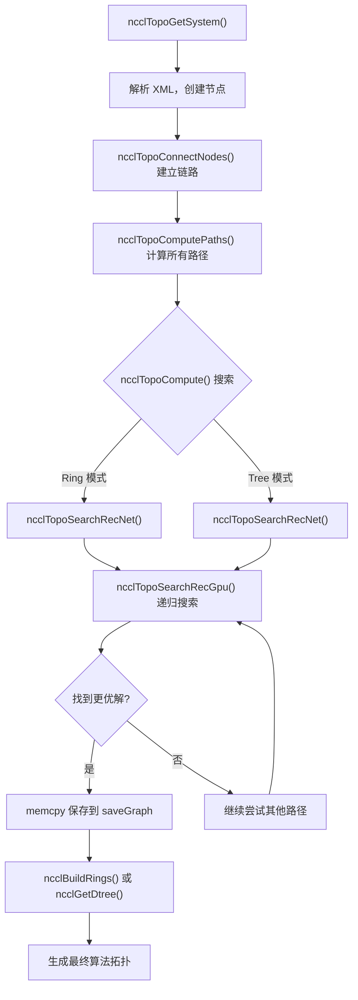
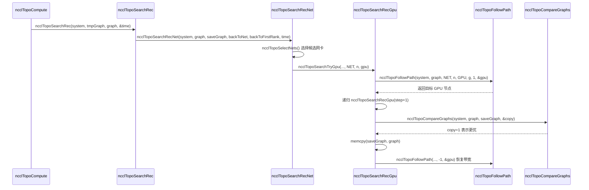

# Chapter 04: Topology Discovery & Graph Search: Mapping Multi-GPU Interconnects


上一章我们沿 ncclCommInitRank 的调用链逐层下钻，看到了 comm->topo 字段被填充的时机，但并未展开它内部的结构。那么，NCCL 究竟是如何“看见”机器里的 GPU 和网卡，并将它们组织成可用的拓扑信息的？本章将拆解这一过程的三个关键环节：topo.cc 负责将物理设备枚举成一张图，search.cc 在这张图上搜索最优路径，rings.cc 和 trees.cc 则把搜索结果具体化为 Ring 与 Tree 两种算法拓扑。理解这三者的配合，才能明白 NCCL 为何能在不同机器上自动选到合适的算法。

## 拓扑图：把机器画成一张"地铁线路图"

### Intuitive Architectural Model

想象你是一个刚到陌生城市的快递员。你要把包裹从 A 点送到 B 点，但你不知道哪条路最快。你需要一张地图——上面标着所有站点（GPU、网卡、CPU、PCI 交换机）以及站点之间的连接（NVLink、PCIe、网络）。NCCL 的拓扑图就是这张地图。

如果没有这张图，NCCL 只能盲目地假设"所有 GPU 之间带宽相同"，在 8 卡 NVLink 全互联的机器上或许还能凑合，但一旦遇到跨 NUMA、跨 PCI 交换机、混合 NVLink + PCIe 的复杂拓扑，就会选错路径，把本该走 NVLink 的数据塞进慢速 PCIe，性能直接腰斩。

### Data Structures & Memory Layout

拓扑图的核心是 `ncclTopoSystem`，它按节点类型分组存储所有设备。节点类型定义在 `topoNodeTypeStr` 数组里：

[FACT:src/graph/topo.cc:33-35](https://github.com/NVIDIA/nccl/blob/12df1a11afad322be5a204a2db890161cbf8131d/src/graph/topo.cc#L33-L35)

```c
const char* topoNodeTypeStr[] = {"GPU", "PCI", "NVS", "CPU", "NIC", "NET", "GIN", "RMA", "DEV", "CXB"};
const char* topoLinkTypeStr[] = {"LOC", "NVL", "", "C2C", "PCI", "", "", "", "", "SYS", "NET"};
const char* topoPathTypeStr[] = {"LOC", "NVL", "NVB", "C2C", "PIX", "PXB", "P2C", "PXN", "PHB", "SYS", "NET", "DIS"};
```

这三个数组分别定义了节点类型、链路类型和路径类型的字符串表示。注意 `topoPathTypeStr` 的顺序——它同时充当了路径质量的排序：索引越小，路径越快。`LOC`（本地）最快，`DIS`（断开）最慢。这个顺序在后续搜索中会被反复用来比较路径优劣。

每个节点由 `ncclTopoNode` 表示，创建时根据类型初始化不同的字段。以 GPU 节点为例：

[FACT:src/graph/topo.cc:105-141](https://github.com/NVIDIA/nccl/blob/12df1a11afad322be5a204a2db890161cbf8131d/src/graph/topo.cc#L105-L141)

```c
ncclResult_t ncclTopoCreateNode(struct ncclTopoSystem* system, struct ncclTopoNode** node, int type, uint64_t id) {
  if (system->nodes[type].count == NCCL_TOPO_MAX_NODES) {
    WARN("Error : tried to create too many nodes of type %d", type);
    return ncclInternalError;
  }
  struct ncclTopoNode* n = system->nodes[type].nodes + system->nodes[type].count;
  system->nodes[type].count++;
  n->type = type;
  n->id = id;
  if (type == GPU) {
    n->gpu.dev = NCCL_TOPO_UNDEF;
    n->gpu.rank = NCCL_TOPO_UNDEF;
    n->gpu.cudaCompCap = NCCL_TOPO_UNDEF;
    n->gpu.mloPart = NCCL_TOPO_UNDEF;
  } else if (type == CPU) {
    ...
```

这里有几个关键设计点。第一，节点存储在一个预分配的数组中（`system->nodes[type].nodes`），而不是链表。这意味着节点在内存中是连续排列的，遍历时缓存友好。第二，`NCCL_TOPO_MAX_NODES` 是一个硬上限，超过就报错——这是为了防止拓扑异常时无限增长。第三，每个节点有一个 `id` 字段，它是一个 64 位整数，高 32 位是 systemId（标识哪台主机），低 32 位是 localId（主机内的设备编号）。

节点之间的连接由 `ncclTopoLink` 表示。`ncclTopoConnectNodes` 负责建立双向连接：

[FACT:src/graph/topo.cc:179-204](https://github.com/NVIDIA/nccl/blob/12df1a11afad322be5a204a2db890161cbf8131d/src/graph/topo.cc#L179-L204)

```c
ncclResult_t ncclTopoConnectNodes(struct ncclTopoNode* node, struct ncclTopoNode* remNode, int type, float bw) {
  // Aggregate links into higher bw for NVLink
  struct ncclTopoLink* link;
  for (link = node->links; link - node->links != NCCL_TOPO_MAX_LINKS && link->remNode; link++) {
    if (link->remNode == remNode && link->type == type) break;
  }
  if (link - node->links == NCCL_TOPO_MAX_LINKS) {
    WARN("Error : too many Topo links (max %d)", NCCL_TOPO_MAX_LINKS);
    return ncclInternalError;
  }
  if (link->remNode == NULL) node->nlinks++;
  link->type = type;
  link->remNode = remNode;
  link->bw += bw;

  // Sort links in BW descending order
  struct ncclTopoLink linkSave;
  memcpy(&linkSave, link, sizeof(struct ncclTopoLink));
  while (link != node->links) {
    if ((link - 1)->bw >= linkSave.bw) break;
    memcpy(link, link - 1, sizeof(struct ncclTopoLink));
    link--;
  }
  memcpy(link, &linkSave, sizeof(struct ncclTopoLink));
  return ncclSuccess;
}
```

这个函数做了三件事。第一，查找是否已存在到同一目标、同一类型的链路——如果存在，就把带宽累加（`link->bw += bw`）。这处理的是多条 NVLink 连到同一个 GPU 的情况：4 条 NVLink 各 25 GB/s，聚合后就是 100 GB/s。第二，如果没找到，就新增一条链路。第三，插入后按带宽降序排列，这样后续遍历时优先看到高带宽链路。

[INFERENCE] 带宽降序排列的设计动机是让搜索算法尽早发现高带宽路径，从而更快收敛到较优解。搜索有超时限制（后面会看到 `NCCL_SEARCH_TIMEOUT`），排序能让有限的时间预算花在更有希望的路径上。

### 场景驱动的 Step-by-Step Walkthrough

现在代入一个具体场景：一台 8 卡 A100 服务器，每张卡通过 NVLink 全互联，另有 4 张 Mellanox ConnectX-6 网卡插在 PCIe 插槽上。NCCL 初始化时，`ncclTopoGetSystem` 被调用，它从 XML 文件（由 `nvidia-topologyd` 或 NCCL 自己生成）读取设备信息，然后构建拓扑图。

第一步，解析 CPU 节点。`ncclTopoAddCpu` 从 XML 中读取 CPU 的架构、厂商、型号，并创建 CPU 节点：

[FACT:src/graph/topo.cc:806-875](https://github.com/NVIDIA/nccl/blob/12df1a11afad322be5a204a2db890161cbf8131d/src/graph/topo.cc#L806-L875)

```c
ncclResult_t ncclTopoAddCpu(struct ncclXmlNode* xmlCpu, struct ncclTopoSystem* system) {
  int numaId;
  NCCLCHECK(xmlGetAttrInt(xmlCpu, "numaid", &numaId));
  int systemId;
  NCCLCHECK(ncclGetSystemId(system, xmlCpu, &systemId));
  struct ncclTopoNode* cpu;
  NCCLCHECK(ncclTopoCreateNode(system, &cpu, CPU, NCCL_TOPO_ID(systemId, numaId)));
  ...
  for (int s = 0; s < xmlCpu->nSubs; s++) {
    struct ncclXmlNode* node = xmlCpu->subs[s];
    if (strcmp(node->name, "pci") == 0) NCCLCHECK(ncclTopoAddPci(node, system, cpu, systemId, numaId));
    if (strcmp(node->name, "nic") == 0) {
      ...
    }
  }
  return ncclSuccess;
}
```

CPU 节点是拓扑树的根。每个 CPU 下面挂着 PCI 子树和 NIC 节点。`ncclTopoAddPci` 递归处理 PCI 树，遇到 GPU 就创建 GPU 节点，遇到 NIC 就创建 NIC 节点。

第二步，添加 NVLink 连接。注意 `ncclTopoAddGpu` 只读取 GPU 的基本属性，注释明确说 "Do not go any further, nvlinks will be added in a second pass"：

[FACT:src/graph/topo.cc:590-598](https://github.com/NVIDIA/nccl/blob/12df1a11afad322be5a204a2db890161cbf8131d/src/graph/topo.cc#L590-L598)

```c
ncclResult_t ncclTopoAddGpu(struct ncclXmlNode* xmlGpu, struct ncclTopoSystem* system, struct ncclTopoNode* gpu) {
  NCCLCHECK(xmlGetAttrInt(xmlGpu, "rank", &gpu->gpu.rank));
  NCCLCHECK(xmlGetAttrInt(xmlGpu, "sm", &gpu->gpu.cudaCompCap));
  NCCLCHECK(xmlGetAttrInt(xmlGpu, "dev", &gpu->gpu.dev));
  NCCLCHECK(xmlGetAttrInt(xmlGpu, "gdr", &gpu->gpu.gdrSupport));
  NCCLCHECK(xmlGetAttrIntDefault(xmlGpu, "mlopart", &gpu->gpu.mlopart, NCCL_TOPO_UNDEF));
  // Do not go any further, nvlinks will be added in a second pass
  return ncclSuccess;
}
```

为什么要分两遍？因为 NVLink 是 GPU 之间的连接，需要两端 GPU 节点都已存在才能建立链路。第一遍创建所有节点，第二遍 `ncclTopoAddNvLinks` 再连接它们。

第三步，处理网络设备。`ncclTopoAddNic` 遍历 NIC 下的 net/gin/rma 子节点，分别调用对应的添加函数。以 `ncclTopoAddNet` 为例：

[FACT:src/graph/topo.cc:461-503](https://github.com/NVIDIA/nccl/blob/12df1a11afad322be5a204a2db890161cbf8131d/src/graph/topo.cc#L461-L503)

```c
static ncclResult_t ncclTopoAddNet(struct ncclXmlNode* xmlNet, struct ncclXmlNode* parent,
                                   struct ncclTopoSystem* system, struct ncclTopoNode* nic, int systemId) {
  int dev;
  NCCLCHECK(xmlGetAttrInt(xmlNet, "dev", &dev));
  int64_t netId = NCCL_TOPO_ID(systemId, dev);
  struct ncclTopoNode* net;
  NCCLCHECK(ncclTopoCreateNode(system, &net, NET, netId));
  net->net.dev = dev;
  int mbps;
  NCCLCHECKNOWARN(xmlGetAttrIntDefault(xmlNet, "speed", &mbps, 0), NCCL_GRAPH);
  if (mbps <= 0) mbps = 10000; // Some NICs define speed = -1
  net->net.bw = mbps / 8000.0;
  ...
  NCCLCHECK(ncclTopoConnectNodes(nic, net, LINK_NET, net->net.bw));
  NCCLCHECK(ncclTopoConnectNodes(net, nic, LINK_NET, net->net.bw));
  return ncclSuccess;
}
```

注意 `mbps / 8000.0` 这个转换：mbps 是兆比特每秒，除以 8000 得到 GB/s（因为 1 GB/s = 8000 Mbps）。如果网卡报告 speed = -1（某些虚拟网卡会这样），就默认 10000 Mbps = 1.25 GB/s。

第四步，收尾处理。`ncclTopoGetSystemFromXml` 在完成所有节点和链路添加后，还会做几件清理工作：

[FACT:src/graph/topo.cc:1080-1088](https://github.com/NVIDIA/nccl/blob/12df1a11afad322be5a204a2db890161cbf8131d/src/graph/topo.cc#L1080-L1088)

```c
  NCCLCHECK(ncclTopoAddNvLinks(topNode, *topoSystem, NULL, 0));
  NCCLCHECK(ncclTopoAddC2c(topNode, *topoSystem, NULL, 0));
  NCCLCHECK(ncclTopoAddPciLinks(topNode, *topoSystem, NULL, 0));

  NCCLCHECK(ncclTopoFlattenBcmSwitches(*topoSystem));
  NCCLCHECK(ncclTopoConnectCpus(*topoSystem));
  NCCLCHECK(ncclTopoSortSystem(*topoSystem));
```

`ncclTopoFlattenBcmSwitches` 处理 Broadcom Gen4 PCIe 交换机的特殊情况——它们把自己呈现为两层交换机，但实际是全带宽的，需要"压平"以避免搜索算法被误导。`ncclTopoConnectCpus` 把所有 CPU 节点互相连接（跨 NUMA 访问走 SYS 链路）。`ncclTopoSortSystem` 对链路排序，让 PCI 下行链路排在前面，方便遍历。

### 设计思考与生产踩坑

**为什么用 XML 作为中间格式？** [INFERENCE] 因为拓扑发现需要跨进程共享——每个 rank 只探测自己管理的 GPU，然后通过 bootstrap 交换 XML，最后融合成完整拓扑。XML 是自描述的文本格式，便于调试（可以 dump 出来看）和版本兼容。

**坑点一：`ncclTopoGetNode` 找不到节点时不报错。** 看这个函数：

[FACT:src/graph/topo.cc:95-103](https://github.com/NVIDIA/nccl/blob/12df1a11afad322be5a204a2db890161cbf8131d/src/graph/topo.cc#L95-L103)

```c
ncclResult_t ncclTopoGetNode(struct ncclTopoSystem* system, struct ncclTopoNode** node, int type, uint64_t id) {
  for (int i = 0; i < system->nodes[type].count; i++) {
    if (system->nodes[type].nodes[i].id == id) {
      *node = system->nodes[type].nodes + i;
      return ncclSuccess;
    }
  }
  return ncclSuccess;
}
```

如果没找到，它返回 `ncclSuccess` 但 `*node` 保持不变（调用者通常初始化为 NULL）。调用者必须自己检查 `*node == NULL`。这种设计容易漏检——如果调用者忘了检查，后续解引用就会崩溃。

**坑点二：`ncclTopoConnectNodes` 的带宽累加可能导致溢出。** 如果同一对节点之间有大量链路（比如 NVSwitch 场景），`link->bw += bw` 可能累加到很大。虽然 float 的精度足够，但如果链路数量异常多，排序逻辑可能出问题。

**坑点三：`ncclTopoRemoveNode` 的指针修正。** 删除节点时，所有指向被删节点的链路都要移除，且指向被删节点之后节点的指针要前移：

[FACT:src/graph/topo.cc:143-177](https://github.com/NVIDIA/nccl/blob/12df1a11afad322be5a204a2db890161cbf8131d/src/graph/topo.cc#L143-L177)

```c
ncclResult_t ncclTopoRemoveNode(struct ncclTopoSystem* system, int type, int index) {
  struct ncclTopoNode* delNode = system->nodes[type].nodes + index;
  for (int t = 0; t < NCCL_TOPO_NODE_TYPES; t++) {
    if (delNode->paths[t] != nullptr) {
      WARN("Cannot remove topology node %d/%lx while paths are computed", type, delNode->id);
      return ncclInternalError;
    }
    for (int n = 0; n < system->nodes[t].count; n++) {
      struct ncclTopoNode* node = system->nodes[t].nodes + n;
      if (node == delNode) continue;
      for (int l = 0; l < node->nlinks; l++) {
        while (l < node->nlinks && node->links[l].remNode == delNode) {
          memmove(node->links + l, node->links + l + 1, (node->nlinks - l - 1) * sizeof(struct ncclTopoLink));
          node->nlinks--;
        }
        if (l < node->nlinks && node->links[l].remNode->type == type && node->links[l].remNode >= delNode) {
          node->links[l].remNode--;
        }
      }
    }
  }
  ...
```

这里有个微妙之处：`node->links[l].remNode--` 是在修正指针。因为节点存储在连续数组中，删除一个节点后，后面的节点地址都会前移一个 `sizeof(struct ncclTopoNode)`。所以所有指向被删节点之后节点的指针都要减一。这个操作在 `memmove` 之前执行，顺序很关键。

## 路径搜索：在图上找"最优路线"

### Intuitive Architectural Model

有了地图还不够，你还需要一个导航算法。NCCL 的路径搜索分两层：第一层是预处理，计算所有节点对之间的最短路径（BFS）；第二层是图搜索，在预处理结果上尝试不同的 Ring/Tree 结构，找到带宽最高的那个。

如果没有路径搜索，NCCL 只能硬编码"GPU 0 连 GPU 1 连 GPU 2..."这种固定顺序，在非均匀拓扑上会选到慢速路径。

### Data Structures & Memory Layout

路径搜索的核心数据结构是 `ncclTopoLinkList`，它存储从某个源节点到某个目标节点的完整路径：

```c
struct ncclTopoLinkList {
  struct ncclTopoLink* list[NCCL_TOPO_MAX_HOPS];  // 路径上的链路
  int count;      // 跳数
  float bw;       // 瓶颈带宽
  int type;       // 路径类型（PATH_LOC, PATH_NVL, ...）
  int capacity;   // list 数组的容量
};
```

每个节点有一个 `paths[type]` 数组，存储到所有该类型节点的路径。比如 GPU 节点的 `paths[NET]` 存储到所有网卡的路径。

路径计算由 `ncclTopoSetPaths` 完成，它是一个 BFS：

[FACT:src/graph/paths.cc:52-147](https://github.com/NVIDIA/nccl/blob/12df1a11afad322be5a204a2db890161cbf8131d/src/graph/paths.cc#L52-L147)

```c
static ncclResult_t ncclTopoSetPaths(struct ncclTopoNode* baseNode, struct ncclTopoSystem* system) {
  if (baseNode->paths[baseNode->type] == NULL) {
    NCCLCHECK(ncclCalloc(baseNode->paths + baseNode->type, system->nodes[baseNode->type].count));
    for (int i = 0; i < system->nodes[baseNode->type].count; i++) baseNode->paths[baseNode->type][i].type = PATH_DIS;
  }

  // breadth-first search to set all paths to that node in the system
  struct ncclTopoNodeList nodeList;
  struct ncclTopoNodeList nextNodeList = {{0}, 0};
  nodeList.count = 1;
  nodeList.list[0] = baseNode;
  ...
  while (nodeList.count) {
    nextNodeList.count = 0;
    for (int n = 0; n < nodeList.count; n++) {
      struct ncclTopoNode* node = nodeList.list[n];
      struct ncclTopoLinkList* path;
      NCCLCHECK(getPath(system, node, baseNode->type, baseNode->id, &path));
      for (int l = 0; l < node->nlinks; l++) {
        struct ncclTopoLink* link = node->links + l;
        struct ncclTopoNode* remNode = link->remNode;
        ...
        float bw = std::min(path->bw, link->bw);
        ...
        // Update if better path type, OR same type with higher bw, OR same type/bw with strickly fewer hops.
        if (newType < remPath->type || (newType == remPath->type && remPath->bw < bw) ||
            (newType == remPath->type && remPath->bw == bw && remPath->count > (path->count + 1))) {
          ...
          remPath->bw = bw;
          remPath->type = newType;
          ...
        }
      }
    }
    memcpy(&nodeList, &nextNodeList, sizeof(nodeList));
  }
  return ncclSuccess;
}
```

BFS 从 `baseNode` 出发，逐层扩展。每到达一个新节点，就计算路径的瓶颈带宽（`std::min(path->bw, link->bw)`）和路径类型。路径类型的计算有几个特殊规则：

- 如果经过两个 PCI 交换机，类型升级为 `PATH_PXB`
- 如果经过 CPU，类型升级为 `PATH_PHB`
- 如果经过 DEV 节点且是 NVLink，类型升级为 `PATH_NVB`

更新条件是"更优路径"：类型更好，或类型相同但带宽更高，或类型带宽相同但跳数更少。

### 场景驱动的 Step-by-Step Walkthrough

现在看第二层搜索。`ncclTopoCompute` 是入口，它尝试不同的参数组合，调用 `ncclTopoSearchRec` 进行搜索。

搜索的核心是递归函数 `ncclTopoSearchRecGpu`。它从某个 GPU 出发，尝试走到下一个 GPU，直到走完所有 GPU 形成一条路径：

[FACT:src/graph/search.cc:639-756](https://github.com/NVIDIA/nccl/blob/12df1a11afad322be5a204a2db890161cbf8131d/src/graph/search.cc#L639-L756)

```c
ncclResult_t ncclTopoSearchRecGpu(struct ncclTopoSystem* system, struct ncclTopoGraph* graph,
                                  struct ncclTopoGraph* saveGraph, struct ncclTopoNode* gpu, int step, int backToNet,
                                  int backToFirstRank, int forcedOrder, int* time) {
  if ((*time) <= 0) return ncclSuccess;
  (*time)--;
  ...
  if (step == ngpus) {
    // Determine whether we found a better solution or not
    int copy = 0;
    graph->nChannels++;
    NCCLCHECKGOTO(ncclTopoCompareGraphs(system, graph, saveGraph, &copy), ret, exit);
    if (copy) {
      memcpy(saveGraph, graph, sizeof(struct ncclTopoGraph));
      if (graph->nChannels == graph->maxChannels) *time = -1;
    }
    if (graph->nChannels < graph->maxChannels) {
      NCCLCHECKGOTO(ncclTopoSearchRec(system, graph, saveGraph, time), ret, exit);
    }
    graph->nChannels--;
    ret = ncclSuccess;
    goto exit;
  }
  graph->intra[graph->nChannels * ngpus + step] = gpu->gpu.rank;
  g = gpu - system->nodes[GPU].nodes;
  if (step == backToNet) {
    // first get back to NIC
    ...
  } else if (graph->pattern == NCCL_TOPO_PATTERN_NVLS) {
    ...
  } else if (step < system->nodes[GPU].count - 1) {
    // Go to next GPU
    ...
  } else if (step == backToFirstRank) {
    // Find first GPU and loop back to it
    ...
  } else {
    // Next path
    NCCLCHECKGOTO(ncclTopoSearchRecGpu(system, graph, saveGraph, gpu, ngpus, -1, -1, forcedOrder, time), ret, exit);
  }
  ...
}
```

这个函数有几个关键分支：

1. **`step == ngpus`**：已经走完所有 GPU，形成了一条完整路径。此时递增 `nChannels`，比较当前图和保存的最优图，如果更好就保存。然后递归调用 `ncclTopoSearchRec` 尝试搜索下一个 channel。

2. **`step == backToNet`**：需要回到网卡。这发生在 Ring 模式（最后一个 GPU 要连回起始网卡）或 Tree 模式（第一个 GPU 要连到网卡）。

3. **`step < ngpus - 1`**：继续走下一个 GPU。这里会调用 `ncclTopoSearchNextGpuSort` 对候选 GPU 排序。

4. **`step == backToFirstRank`**：Ring 模式下，最后一个 GPU 要连回第一个 GPU。

5. **`else`**：路径结束，进入下一轮。

`ncclTopoSearchNextGpuSort` 决定尝试下一个 GPU 的顺序：

[FACT:src/graph/search.cc:254-327](https://github.com/NVIDIA/nccl/blob/12df1a11afad322be5a204a2db890161cbf8131d/src/graph/search.cc#L254-L327)

```c
ncclResult_t ncclTopoSearchNextGpuSort(struct ncclTopoSystem* system, struct ncclTopoGraph* graph,
                                       struct ncclTopoNode* gpu, int* next, int* countPtr, int sortNet) {
  const uint64_t flag = 1ULL << (graph->nChannels);
  int ngpus = system->nodes[GPU].count;
  struct ncclTopoLinkList* paths = gpu->paths[GPU];
  ...
  for (int i = 1; i < ngpus; i++) {
    int g = (start + i) % ngpus;
    if (paths[g].count == 0) continue; // There is no path to that GPU
    if (system->nodes[GPU].nodes[g].used & flag) continue;
    scores[count].g = g;
    scores[count].startIndex = i;
    scores[count].intraNhops = paths[g].count;
    scores[count].intraBw = paths[g].bw;
    if (netPaths) {
      scores[count].interNhops = netPaths[g].count;
      scores[count].interPciBw = gpuPciBw(system->nodes[GPU].nodes + g);
      scores[count].interBw = netPaths[g].bw;
    }
    count++;
  }

  // Sort GPUs
  qsort(scores, count, sizeof(struct ncclGpuScore), cmpScore);
  ...
}
```

它给每个候选 GPU 打分，排序规则是：先比 interBw（到网卡的带宽），再比 interPciBw，再比 interNhops，再比 intraBw，最后比 intraNhops。这个优先级反映了 NCCL 的优化目标：跨机通信是瓶颈，所以优先选到网卡带宽高的 GPU。

### 设计思考与生产踩坑

**为什么搜索有超时？** 看这些常量：

[FACT:src/graph/search.cc:329-330](https://github.com/NVIDIA/nccl/blob/12df1a11afad322be5a204a2db890161cbf8131d/src/graph/search.cc#L329-L330)

```c
#define NCCL_SEARCH_GLOBAL_TIMEOUT (1ULL << 19)
#define NCCL_SEARCH_TIMEOUT (1 << 14)
#define NCCL_SEARCH_TIMEOUT_TREE (1 << 14)
#define NCCL_SEARCH_TIMEOUT_SAMECHANNELS (1 << 8)
```

搜索空间是指数级的——每个 channel 有 O(ngpus!) 种排列。8 卡机器就是 40320 种，16 卡就是 2 万亿种。必须限制搜索时间。`NCCL_SEARCH_TIMEOUT` 是 16384 次迭代，`NCCL_SEARCH_GLOBAL_TIMEOUT` 是 524288 次。超时后返回当前最优解。

**坑点一：`ncclTopoFollowPath` 的带宽扣减是全局副作用。** 看这个函数：

[FACT:src/graph/search.cc:127-173](https://github.com/NVIDIA/nccl/blob/12df1a11afad322be5a204a2db890161cbf8131d/src/graph/search.cc#L127-L173)

```c
static ncclResult_t ncclTopoFollowPath(struct ncclTopoSystem* system, struct ncclTopoGraph* graph, int type1,
                                       int index1, int type2, int index2, float mult, struct ncclTopoNode** node) {
  ...
  bw *= mult;
  // Check there is enough bandwidth on paths.
  int step = 0;
  NCCLCHECK(followPath(path, node1, path->count, bw, &step));
  if (step < path->count) goto rewind;
  // Enough bandwidth : return destination node.
  graph->nHops += mult * path->count;
  *node = system->nodes[type2].nodes + index2;
  return ncclSuccess;
rewind:
  // Not enough bandwidth : rewind and exit.
  NCCLCHECK(followPath(path, node1, step, -bw, &step));
  return ncclSuccess;
}
```

`followPath` 会修改路径上每条链路的 `bw`（扣减已用带宽）。如果搜索失败，必须调用 `followPath` 用 `-bw` 恢复。这个"扣减-恢复"模式在递归搜索中很容易出错——如果某个分支忘记恢复，后续搜索就会看到错误的带宽。

**坑点二：`ncclTopoCompareGraphs` 的比较逻辑很微妙。** 它优先比较 `nChannels * bwIntra`，但还有一堆特殊情况：

[FACT:src/graph/search.cc:446-477](https://github.com/NVIDIA/nccl/blob/12df1a11afad322be5a204a2db890161cbf8131d/src/graph/search.cc#L446-L477)

```c
ncclResult_t ncclTopoCompareGraphs(struct ncclTopoSystem* system, struct ncclTopoGraph* graph,
                                   struct ncclTopoGraph* refGraph, int* copy) {
  // 1. Try to get the same nChannels between Rings and Trees
  if (graph->nChannels < graph->minChannels) return ncclSuccess;
  const bool evenReference = refGraph->nChannels > 0 && !(refGraph->nChannels & 1);
  const bool evenReferenceIsBetter = refGraph->nChannels * refGraph->bwIntra >= graph->nChannels * graph->bwIntra;
  // Favor an even number of channels when aggregate bandwidth is equal or better.
  if (graph->pattern != NCCL_TOPO_PATTERN_NVLS && evenReference && (graph->nChannels & 1) &&
      graph->nChannels < system->nodes[NET].count && evenReferenceIsBetter)
    return ncclSuccess;
  ...
```

为什么要偏好偶数 channel？[INFERENCE] 因为 Ring 算法在偶数 channel 时能更好地配对——每个 channel 可以分成两半，一半顺时针一半逆时针，减少网络拥塞。

## Ring 与 Tree：把搜索结果变成算法拓扑

### Intuitive Architectural Model

搜索算法找到的是一组路径，但算法需要的是明确的"谁发给谁"的顺序。Ring 把所有 rank 串成一个环，每个 rank 从上一个收、发给下一个。Tree 则是一棵树，数据从根往下流或从叶子往上汇聚。

如果没有这两个模块，搜索算法就只是找到了一堆路径，无法告诉 GPU kernel 具体怎么发数据。

### Data Structures & Memory Layout

Ring 的构建由 `ncclBuildRings` 完成：

[FACT:src/graph/rings.cc:29-74](https://github.com/NVIDIA/nccl/blob/12df1a11afad322be5a204a2db890161cbf8131d/src/graph/rings.cc#L29-L74)

```c
ncclResult_t ncclBuildRings(int nrings, int* rings, int rank, int nranks, int* prev, int* next) {
  ncclResult_t ret = ncclSuccess;
  uint64_t* rankFound;
  int rankFoundSize = DIVUP(nranks, 64);
  NCCLCHECK(ncclCalloc(&rankFound, rankFoundSize));

  for (int r = 0; r < nrings; r++) {
    int current = rank;
    for (int i = 0; i < nranks; i++) {
      rankFound[current / 64] |= (1ULL << (current % 64));
      rings[r * nranks + i] = current;
      current = next[r * nranks + current];
    }
    ...
    if (current != rank) {
      WARN("Error : ring %d does not loop back to start (%d != %d)", r, current, rank);
      ret = ncclInternalError;
      goto end;
    }
    // Check that all ranks are there
    for (int i = 0; i < nranks; i++) {
      uint64_t bits = rankFound[i / 64], mask = 1ULL << (i % 64);
      // Fast check 64 ranks at a time
      if (mask == 1 && bits == 0xffffffffffffffff) {
        i += 63;
        continue;
      }
      if ((bits & mask) == 0) {
        WARN("Error : ring %d does not contain rank %d", r, i);
        ret = ncclInternalError;
        goto end;
      }
    }
    memset(rankFound, 0, rankFoundSize * sizeof(uint64_t));
  }
end:
  free(rankFound);
  return ret;
}
```

输入是 `prev` 和 `next` 数组（每个 rank 的前驱和后继），输出是 `rings` 数组（每个 channel 的完整 rank 顺序）。它从当前 rank 出发，沿着 `next` 指针走一圈，验证是否回到起点，并检查所有 rank 都被访问到。

Tree 的构建由 `ncclGetBtree` 完成：

[FACT:src/graph/trees.cc:32-67](https://github.com/NVIDIA/nccl/blob/12df1a11afad322be5a204a2db890161cbf8131d/src/graph/trees.cc#L32-L67)

```c
ncclResult_t ncclGetBtree(int nranks, int rank, int* u, int* d0, int* d1, int* parentChildType) {
  int up, down0, down1;
  int bit;
  for (bit = 1; bit < nranks; bit <<= 1) {
    if (bit & rank) break;
  }

  if (rank == 0) {
    *u = -1;
    *d0 = -1;
    // Child rank is > 0 so it has to be our child 1, not 0.
    *d1 = nranks > 1 ? bit >> 1 : -1;
    return ncclSuccess;
  }

  up = (rank ^ bit) | (bit << 1);
  // if smaller than the parent, we are his first child, otherwise we're his second
  if (up >= nranks) up = (rank ^ bit);
  *parentChildType = (rank < up) ? 0 : 1;
  *u = up;

  int lowbit = bit >> 1;
  // down0 is always within bounds
  down0 = lowbit == 0 ? -1 : rank - lowbit;

  down1 = lowbit == 0 ? -1 : rank + lowbit;
  // Make sure down1 is within bounds
  while (down1 >= nranks) {
    down1 = lowbit == 0 ? -1 : rank + lowbit;
    lowbit >>= 1;
  }
  *d0 = down0;
  *d1 = down1;

  return ncclSuccess;
}
```

这个函数用位运算构建二叉树。核心思想是：找到 rank 的最低非零位 `bit`，父节点是 `(rank ^ bit) | (bit << 1)`，左子是 `rank - (bit >> 1)`，右子是 `rank + (bit >> 1)`。注释里的 ASCII 图很清楚地展示了这个结构。

### 场景驱动的 Step-by-Step Walkthrough

以 8 卡 Ring 为例。假设搜索结果给出了每个 rank 的 `next` 指针：

```
rank 0 -> rank 1
rank 1 -> rank 2
...
rank 7 -> rank 0
```

`ncclBuildRings` 从 rank 0 出发，依次访问 1, 2, ..., 7，最后回到 0。生成的 `rings[0..7] = {0, 1, 2, 3, 4, 5, 6, 7}`。

对于 Tree，`ncclGetBtree` 为每个 rank 计算父节点和子节点。以 rank 1 为例：

- `bit` = 1（最低非零位是第 0 位）
- `up = (1 ^ 1) | (1 << 1) = 0 | 2 = 2`
- `up >= nranks`? 2 < 8，所以 `up = 2`
- `parentChildType = (1 < 2) ? 0 : 1 = 0`（是父节点的第一个孩子）
- `lowbit = 0`，所以 `down0 = -1`
- `down1 = -1`

所以 rank 1 的父节点是 rank 2，没有子节点。这符合注释里的树结构：rank 1 是叶子。

### 设计思考与生产踩坑

**为什么 Tree 用位运算而不是显式建树？** [INFERENCE] 因为每个 rank 只需要知道自己的父节点和子节点，不需要全局树结构。位运算可以在 O(1) 时间内计算出这些信息，避免了存储和同步整棵树的开销。

**坑点一：`ncclBuildRings` 的验证可能被跳过。** 如果 `next` 数组有环（比如 rank 0 -> rank 1 -> rank 0），循环会在 `nranks` 次迭代后退出，但 `current != rank` 检查会捕获这个问题。但如果环的长度恰好是 `nranks` 的因子，且不包含所有 rank，`rankFound` 检查会捕获。

**坑点二：`ncclGetDtree` 的奇数 rank 处理。** 对于奇数个 rank，第二棵树是"移位"而不是"镜像"：

[FACT:src/graph/trees.cc:90-112](https://github.com/NVIDIA/nccl/blob/12df1a11afad322be5a204a2db890161cbf8131d/src/graph/trees.cc#L90-L112)

```c
ncclResult_t ncclGetDtree(int nranks, int rank, int* s0, int* d0_0, int* d0_1, int* parentChildType0, int* s1,
                          int* d1_0, int* d1_1, int* parentChildType1) {
  // First tree ... use a btree
  ncclGetBtree(nranks, rank, s0, d0_0, d0_1, parentChildType0);
  // Second tree ... mirror or shift
  if (nranks % 2 == 1) {
    // shift
    int shiftrank = (rank - 1 + nranks) % nranks;
    ...
  } else {
    // mirror
    int u, d0, d1;
    ncclGetBtree(nranks, nranks - 1 - rank, &u, &d0, &d1, parentChildType1);
    *s1 = u == -1 ? -1 : nranks - 1 - u;
    ...
  }
  return ncclSuccess;
}
```

双二叉树（Double Tree）是 NCCL 的 Tree 算法实现——两棵树同时工作，一棵负责前半段数据，一棵负责后半段，提高带宽利用率。奇数 rank 时镜像会导致 rank 映射不完整，所以改用移位。

## 三者的配合：从拓扑到算法

现在把三个模块串起来。整个流程可以用一张图表示：



这张图展示了从拓扑发现到算法生成的完整流程。注意 `ncclTopoSearchRecGpu` 是一个递归函数，它会不断尝试不同的 GPU 顺序，直到超时或找到最优解。

再看一个更细粒度的时序图，展示搜索过程中各模块的交互：



这个时序图展示了搜索的核心循环：选择网卡 -> 尝试 GPU -> 递归搜索 -> 比较结果 -> 恢复带宽。

## 本章Summary

本章拆解了 NCCL 拓扑感知的三个环节：

1. **拓扑发现**（`topo.cc`）：从 XML 读取设备信息，创建 GPU/CPU/PCI/NIC 节点，建立 NVLink/PCIe/网络链路，形成一张完整的拓扑图。

2. **路径搜索**（`search.cc` + `paths.cc`）：先用 BFS 预计算所有节点对之间的最短路径，再用递归搜索尝试不同的 Ring/Tree 结构，找到带宽最高的方案。

3. **算法拓扑生成**（`rings.cc` + `trees.cc`）：把搜索结果转换成具体的 rank 顺序，Ring 用 `ncclBuildRings` 生成环，Tree 用 `ncclGetBtree` 生成二叉树。

## 本章思考与自测

<details><summary>Q1: 如果把 `ncclTopoConnectNodes` 中的带宽累加 `link->bw += bw` 改成 `link->bw = std::max(link->bw, bw)`，在什么场景下会导致性能下降？为什么？</summary>

**参考解析**：带宽累加处理的是多条并行链路的情况。以 4 条 NVLink 各 25 GB/s 为例，累加后是 100 GB/s，取 max 后只有 25 GB/s。在 `ncclTopoSetPaths` 中，路径带宽是 `std::min(path->bw, link->bw)`，如果链路带宽被低估，整条路径的带宽都会被低估。这会导致 `ncclTopoCompareGraphs` 选择错误的图——可能选了一个 channel 数更多但每个 channel 带宽更低的方案，实际性能反而更差。具体场景：8 卡 A100 全 NVLink 互联，每对 GPU 之间有 4 条 NVLink。累加得到 100 GB/s，取 max 得到 25 GB/s。搜索算法会认为 NVLink 和 PCIe Gen4 x16（约 25 GB/s）带宽相同，可能选择走 PCIe 的路径。

</details>

<details><summary>Q2: `ncclTopoSearchRecGpu` 中 `(*time)--` 在函数入口处执行。如果搜索超时（`*time <= 0`），函数直接返回。这个设计在什么情况下会导致搜索陷入死循环？如何修复？</summary>

**参考解析**：`(*time)--` 在入口处递减，如果 `*time` 初始值为 0 或负数，函数直接返回，不会递减。但如果 `*time` 是一个很大的正数，每次递归都会递减，最终会到 0。问题在于：如果某个分支的递归深度很大，但每次递减后 `*time` 仍然大于 0，搜索会继续。真正的风险是 `ncclTopoSearchRec` 中的 `goto search` 循环——如果 `time` 在循环中没有被正确重置，可能无限循环。看 `ncclTopoCompute` 中的 `globalTimeout` 逻辑：`globalTimeout -= time` 在每次 `search` 标签处执行，如果 `globalTimeout` 变成负数，会 `goto done`。但如果 `time` 被重置为 `NCCL_SEARCH_TIMEOUT`，`globalTimeout` 可能永远不会变成负数。修复方法是确保 `globalTimeout` 在每次搜索后都递减，且有一个硬上限。

</details>

<details><summary>Q3: `ncclTopoFollowPath` 在搜索失败时会调用 `followPath(path, node1, step, -bw, &step)` 恢复带宽。如果某个递归分支在恢复之前就返回了（比如 `NCCLCHECKGOTO` 跳转到 `exit`），会发生什么？如何检测这种问题？</summary>

**参考解析**：如果恢复被跳过，路径上的链路带宽会保持被扣减的状态。后续搜索会看到错误的带宽，可能错过最优解。检测方法：在 `ncclTopoCompute` 结束后，遍历所有链路，检查带宽是否与初始值一致。如果发现不一致，说明有恢复遗漏。修复方法：使用 RAII 风格的守卫对象，在析构时自动恢复带宽。或者，在每次搜索前保存所有链路的带宽快照，搜索后恢复。NCCL 当前的做法是在每个 `ncclTopoFollowPath` 调用点手动配对正向和反向调用，这容易出错。一个更健壮的设计是把带宽扣减和恢复封装成一个函数，确保成对出现。

</details>

下一章我们将深入 tuning 模块，看 NCCL 如何根据拓扑搜索结果和消息大小，在 Ring、Tree、CollNet 等算法之间做出最终选择。本章建立的拓扑图、路径搜索结果和算法模板，将成为 tuning 模块的输入。

通过 topo.cc 的图构建、search.cc 的路径搜索以及 rings.cc 和 trees.cc 的拓扑生成，NCCL 实现了用通用图结构描述任意拓扑、用可配置搜索算法找到最优解、用简单模板生成最终算法的设计哲学。这套机制让 NCCL 能在从 2 卡工作站到 10000 卡集群的各种机器上自动选到合适的算法。然而，拓扑图只是提供了算法的候选路径，具体到一次通信该走哪条路、用哪种协议，还需要更精细的决策。下一章我们将聚焦 src/tuning 目录，看看 tuning 模块如何结合代价模型与算法估计，在 Ring/Tree/NVLS/PAT 以及 LL/LL128/Simple 之间做出最终选择。