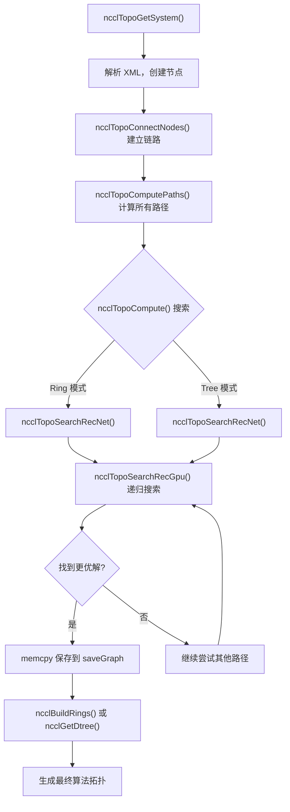
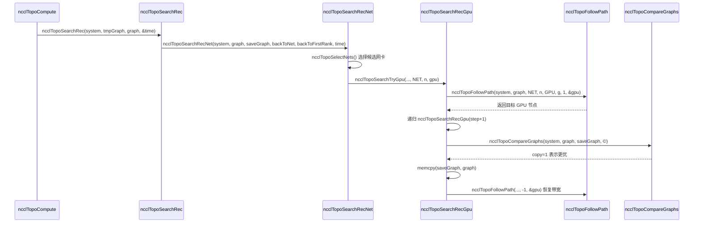

# Chapter 4: Topology Discovery and Graph Search: How NCCL "Sees" the Physical Interconnect of a Multi-GPU System

In the previous chapter, we drilled down layer by layer along the call chain of ncclCommInitRank and saw when the comm->topo field is populated, but we did not expand its internal structure. So how exactly does NCCL "see" the GPUs and NICs in a machine and organize them into usable topology information? This chapter will break down the three key steps of this process: topo.cc is responsible for enumerating physical devices into a graph, search.cc searches for the optimal path on this graph, and rings.cc and trees.cc materialize the search results into the two algorithm topologies, Ring and Tree. Only by understanding how these three work together can you understand why NCCL can automatically select suitable algorithms on different machines.

# Topology Graph: Drawing a Machine as a "Subway Map"

## Intuitive Model

Imagine you are a courier who has just arrived in an unfamiliar city. You need to deliver a package from point A to point B, but you do not know which route is fastest. You need a map—one marked with all stations (GPUs, NICs, CPUs, PCI switches) and the connections between stations (NVLink, PCIe, network). NCCL's topology graph is this map.

Without this map, NCCL can only blindly assume that "all GPUs have the same bandwidth." On a machine with 8 GPUs fully interconnected by NVLink, this might still barely work, but once it encounters a complex topology with cross-NUMA, cross-PCI-switch, and mixed NVLink + PCIe, it will choose the wrong path, stuffing data that should go over NVLink into slow PCIe, and performance will be cut in half.

## Data Structures and Memory Layout

The core of the topology graph is`ncclTopoSystem`, which stores all devices grouped by node type. The node types are defined in the`topoNodeTypeStr`array:

[FACT:src/graph/topo.cc:33-35]

```c
const char* topoNodeTypeStr[] = {"GPU", "PCI", "NVS", "CPU", "NIC", "NET", "GIN", "RMA", "DEV", "CXB"};
const char* topoLinkTypeStr[] = {"LOC", "NVL", "", "C2C", "PCI", "", "", "", "", "SYS", "NET"};
const char* topoPathTypeStr[] = {"LOC", "NVL", "NVB", "C2C", "PIX", "PXB", "P2C", "PXN", "PHB", "SYS", "NET", "DIS"};
```

These three arrays define the string representations of node types, link types, and path types, respectively. Note the`topoPathTypeStr`order—it also serves as the ranking of path quality: the smaller the index, the faster the path.`LOC`(local) is the fastest,`DIS`(disconnected) is the slowest. This order will be used repeatedly in subsequent searches to compare the quality of paths.

Each node is represented by`ncclTopoNode`and different fields are initialized according to the type at creation time. Taking a GPU node as an example:

[FACT:src/graph/topo.cc:105-141]

```c
ncclResult_t ncclTopoCreateNode(struct ncclTopoSystem* system, struct ncclTopoNode** node, int type, uint64_t id) {
  if (system->nodes[type].count == NCCL_TOPO_MAX_NODES) {
    WARN("Error : tried to create too many nodes of type %d", type);
    return ncclInternalError;
  }
  struct ncclTopoNode* n = system->nodes[type].nodes + system->nodes[type].count;
  system->nodes[type].count++;
  n->type = type;
  n->id = id;
  if (type == GPU) {
    n->gpu.dev = NCCL_TOPO_UNDEF;
    n->gpu.rank = NCCL_TOPO_UNDEF;
    n->gpu.cudaCompCap = NCCL_TOPO_UNDEF;
    n->gpu.mloPart = NCCL_TOPO_UNDEF;
  } else if (type == CPU) {
    ...
```

There are several key design points here. First, nodes are stored in a preallocated array (`system->nodes[type].nodes`), rather than a linked list. This means that nodes are arranged contiguously in memory, making traversal cache-friendly. Second,`NCCL_TOPO_MAX_NODES`is a hard upper limit, and exceeding it raises an error—this is to prevent unbounded growth when the topology is abnormal. Third, each node has a`id`field, which is a 64-bit integer. The upper 32 bits are systemId (identifying which host), and the lower 32 bits are localId (the device number within the host).

The connections between nodes are represented by`ncclTopoLink`.`ncclTopoConnectNodes`is responsible for establishing bidirectional connections:

[FACT:src/graph/topo.cc:179-204]

```c
ncclResult_t ncclTopoConnectNodes(struct ncclTopoNode* node, struct ncclTopoNode* remNode, int type, float bw) {
  // Aggregate links into higher bw for NVLink
  struct ncclTopoLink* link;
  for (link = node->links; link - node->links != NCCL_TOPO_MAX_LINKS && link->remNode; link++) {
    if (link->remNode == remNode && link->type == type) break;
  }
  if (link - node->links == NCCL_TOPO_MAX_LINKS) {
    WARN("Error : too many Topo links (max %d)", NCCL_TOPO_MAX_LINKS);
    return ncclInternalError;
  }
  if (link->remNode == NULL) node->nlinks++;
  link->type = type;
  link->remNode = remNode;
  link->bw += bw;

  // Sort links in BW descending order
  struct ncclTopoLink linkSave;
  memcpy(&linkSave, link, sizeof(struct ncclTopoLink));
  while (link != node->links) {
    if ((link - 1)->bw >= linkSave.bw) break;
    memcpy(link, link - 1, sizeof(struct ncclTopoLink));
    link--;
  }
  memcpy(link, &linkSave, sizeof(struct ncclTopoLink));
  return ncclSuccess;
}
```

This function does three things. First, it checks whether a link to the same target and of the same type already exists—if so, it accumulates the bandwidth (`link->bw += bw`). This handles the case where multiple NVLinks connect to the same GPU: 4 NVLinks at 25 GB/s each aggregate to 100 GB/s. Second, if none is found, it adds a new link. Third, after insertion, it sorts in descending order by bandwidth, so that subsequent traversals see high-bandwidth links first.

> **[Design Inference & Architectural Trade-offs]**
> The design motivation for sorting in descending order by bandwidth is to let the search algorithm discover high-bandwidth paths as early as possible, thereby converging faster to a better solution. The search has a timeout limit (as will be seen later in`NCCL_SEARCH_TIMEOUT`), and sorting allows the limited time budget to be spent on more promising paths.

## Scenario-Driven Step-by-Step Walkthrough

Now let us plug in a concrete scenario: an 8-GPU A100 server, where each GPU is fully interconnected via NVLink, and there are also 4 Mellanox ConnectX-6 NICs plugged into PCIe slots. During NCCL initialization,`ncclTopoGetSystem`is called. It reads device information from an XML file (generated by`nvidia-topologyd`or by NCCL itself), and then builds the topology graph.

Step 1: Parse the CPU node.`ncclTopoAddCpu`reads the CPU architecture, vendor, and model from the XML, and creates the CPU node:

[FACT:src/graph/topo.cc:806-875]

```c
ncclResult_t ncclTopoAddCpu(struct ncclXmlNode* xmlCpu, struct ncclTopoSystem* system) {
  int numaId;
  NCCLCHECK(xmlGetAttrInt(xmlCpu, "numaid", &numaId));
  int systemId;
  NCCLCHECK(ncclGetSystemId(system, xmlCpu, &systemId));
  struct ncclTopoNode* cpu;
  NCCLCHECK(ncclTopoCreateNode(system, &cpu, CPU, NCCL_TOPO_ID(systemId, numaId)));
  ...
  for (int s = 0; s nSubs; s++) {
    struct ncclXmlNode* node = xmlCpu->subs[s];
    if (strcmp(node->name, "pci") == 0) NCCLCHECK(ncclTopoAddPci(node, system, cpu, systemId, numaId));
    if (strcmp(node->name, "nic") == 0) {
      ...
    }
  }
  return ncclSuccess;
}
```

The CPU node is the root of the topology tree. Under each CPU hang the PCI subtree and NIC nodes.`ncclTopoAddPci`recursively processes the PCI tree, creating a GPU node when it encounters a GPU and a NIC node when it encounters a NIC.

Step 2: Add NVLink connections. Note that`ncclTopoAddGpu`only reads the basic attributes of the GPU, and the comment explicitly says "Do not go any further, nvlinks will be added in a second pass":

[FACT:src/graph/topo.cc:590-598]

```c
ncclResult_t ncclTopoAddGpu(struct ncclXmlNode* xmlGpu, struct ncclTopoSystem* system, struct ncclTopoNode* gpu) {
  NCCLCHECK(xmlGetAttrInt(xmlGpu, "rank", &gpu->gpu.rank));
  NCCLCHECK(xmlGetAttrInt(xmlGpu, "sm", &gpu->gpu.cudaCompCap));
  NCCLCHECK(xmlGetAttrInt(xmlGpu, "dev", &gpu->gpu.dev));
  NCCLCHECK(xmlGetAttrInt(xmlGpu, "gdr", &gpu->gpu.gdrSupport));
  NCCLCHECK(xmlGetAttrIntDefault(xmlGpu, "mlopart", &gpu->gpu.mlopart, NCCL_TOPO_UNDEF));
  // Do not go any further, nvlinks will be added in a second pass
  return ncclSuccess;
}
```

Why split it into two passes? Because NVLink is a connection between GPUs, and links can only be established after the GPU nodes at both ends already exist. The first pass creates all nodes, and the second pass`ncclTopoAddNvLinks`then connects them.

Step 3: Handle network devices.`ncclTopoAddNic`traverses the net/gin/rma child nodes under the NIC and calls the corresponding add functions respectively. Taking`ncclTopoAddNet`as an example:

[FACT:src/graph/topo.cc:461-503]

```c
static ncclResult_t ncclTopoAddNet(struct ncclXmlNode* xmlNet, struct ncclXmlNode* parent,
                                   struct ncclTopoSystem* system, struct ncclTopoNode* nic, int systemId) {
  int dev;
  NCCLCHECK(xmlGetAttrInt(xmlNet, "dev", &dev));
  int64_t netId = NCCL_TOPO_ID(systemId, dev);
  struct ncclTopoNode* net;
  NCCLCHECK(ncclTopoCreateNode(system, &net, NET, netId));
  net->net.dev = dev;
  int mbps;
  NCCLCHECKNOWARN(xmlGetAttrIntDefault(xmlNet, "speed", &mbps, 0), NCCL_GRAPH);
  if (mbps net.bw = mbps / 8000.0;
  ...
  NCCLCHECK(ncclTopoConnectNodes(nic, net, LINK_NET, net->net.bw));
  NCCLCHECK(ncclTopoConnectNodes(net, nic, LINK_NET, net->net.bw));
  return ncclSuccess;
}
```

Note the conversion in`mbps / 8000.0`: mbps is megabits per second, and dividing by 8000 gives GB/s (because 1 GB/s = 8000 Mbps). If the NIC reports speed = -1 (as some virtual NICs do), it defaults to 10000 Mbps = 1.25 GB/s.

Step 4: Finalization.`ncclTopoGetSystemFromXml`After all nodes and links have been added,

[FACT:src/graph/topo.cc:1080-1088]

```c
  NCCLCHECK(ncclTopoAddNvLinks(topNode, *topoSystem, NULL, 0));
  NCCLCHECK(ncclTopoAddC2c(topNode, *topoSystem, NULL, 0));
  NCCLCHECK(ncclTopoAddPciLinks(topNode, *topoSystem, NULL, 0));

  NCCLCHECK(ncclTopoFlattenBcmSwitches(*topoSystem));
  NCCLCHECK(ncclTopoConnectCpus(*topoSystem));
  NCCLCHECK(ncclTopoSortSystem(*topoSystem));
```

`ncclTopoFlattenBcmSwitches`Copy`ncclTopoConnectCpus`handles the special case of Broadcom Gen4 PCIe switches—they present themselves as two-layer switches, but are actually full-bandwidth, and need to be "flattened" to avoid misleading the search algorithm.`ncclTopoSortSystem`connects all CPU nodes to one another (cross-NUMA access goes over SYS links).

## sorts the links so that PCI downstream links come first, making traversal easier.

> **[Design Inference & Architectural Trade-offs]**
> **[Design Inference and Architectural Trade-offs]**Why use XML as the intermediate format?

**Because topology discovery needs to be shared across processes—each rank only probes the GPUs it manages, then exchanges XML through bootstrap, and finally merges it into the complete topology. XML is a self-describing text format, which is convenient for debugging (it can be dumped and inspected) and version compatibility.`ncclTopoGetNode`Pitfall 1:**does not report an error when it cannot find a node.

[FACT:src/graph/topo.cc:95-103]

```c
ncclResult_t ncclTopoGetNode(struct ncclTopoSystem* system, struct ncclTopoNode** node, int type, uint64_t id) {
  for (int i = 0; i nodes[type].count; i++) {
    if (system->nodes[type].nodes[i].id == id) {
      *node = system->nodes[type].nodes + i;
      return ncclSuccess;
    }
  }
  return ncclSuccess;
}
```

Copy`ncclSuccess`If it is not found, it returns`*node`but`*node == NULL`remains unchanged (callers usually initialize it to NULL). The caller must check

**itself. This design is prone to missed checks—if the caller forgets to check, a later dereference will crash.`ncclTopoConnectNodes`Pitfall 2:**bandwidth accumulation may cause overflow.`link->bw += bw`If there are a large number of links between the same pair of nodes (such as in an NVSwitch scenario),

**may accumulate to a very large value. Although float precision is sufficient, if the number of links is abnormally large, the sorting logic may go wrong.`ncclTopoRemoveNode`Pitfall 3:**pointer fixup.

[FACT:src/graph/topo.cc:143-177]

```c
ncclResult_t ncclTopoRemoveNode(struct ncclTopoSystem* system, int type, int index) {
  struct ncclTopoNode* delNode = system->nodes[type].nodes + index;
  for (int t = 0; t paths[t] != nullptr) {
      WARN("Cannot remove topology node %d/%lx while paths are computed", type, delNode->id);
      return ncclInternalError;
    }
    for (int n = 0; n nodes[t].count; n++) {
      struct ncclTopoNode* node = system->nodes[t].nodes + n;
      if (node == delNode) continue;
      for (int l = 0; l nlinks; l++) {
        while (l nlinks && node->links[l].remNode == delNode) {
          memmove(node->links + l, node->links + l + 1, (node->nlinks - l - 1) * sizeof(struct ncclTopoLink));
          node->nlinks--;
        }
        if (l nlinks && node->links[l].remNode->type == type && node->links[l].remNode >= delNode) {
          node->links[l].remNode--;
        }
      }
    }
  }
  ...
```

Copy`node->links[l].remNode--`There is a subtle point here:`sizeof(struct ncclTopoNode)`is fixing pointers. Because nodes are stored in a contiguous array, after deleting one node, the addresses of all subsequent nodes shift forward by one`memmove`Executed before, order is critical.

# Path search: finding the "optimal route" on the graph

## Intuitive model

Having a map isn't enough—you also need a navigation algorithm. NCCL's path search has two layers: the first layer is preprocessing, computing the shortest path between all pairs of nodes (BFS); the second layer is graph search, trying different Ring/Tree structures on the preprocessing results to find the one with the highest bandwidth.

Without path search, NCCL could only hardcode fixed orders like "GPU 0 connects to GPU 1 connects to GPU 2...", which would select slow paths on non-uniform topologies.

## Data structures and memory layout

The core data structure of path search is`ncclTopoLinkList`, which stores the complete path from a source node to a target node:

```c
struct ncclTopoLinkList {
  struct ncclTopoLink* list[NCCL_TOPO_MAX_HOPS];  // 路径上的链路
  int count;      // 跳数
  float bw;       // 瓶颈带宽
  int type;       // 路径类型（PATH_LOC, PATH_NVL, ...）
  int capacity;   // list 数组的容量
};
```

Each node has a`paths[type]`array, storing paths to all nodes of that type. For example, a GPU node's`paths[NET]`stores paths to all NICs.

Path computation is done by`ncclTopoSetPaths`, which is a BFS:

[FACT:src/graph/paths.cc:52-147]

```c
static ncclResult_t ncclTopoSetPaths(struct ncclTopoNode* baseNode, struct ncclTopoSystem* system) {
  if (baseNode->paths[baseNode->type] == NULL) {
    NCCLCHECK(ncclCalloc(baseNode->paths + baseNode->type, system->nodes[baseNode->type].count));
    for (int i = 0; i nodes[baseNode->type].count; i++) baseNode->paths[baseNode->type][i].type = PATH_DIS;
  }

  // breadth-first search to set all paths to that node in the system
  struct ncclTopoNodeList nodeList;
  struct ncclTopoNodeList nextNodeList = {{0}, 0};
  nodeList.count = 1;
  nodeList.list[0] = baseNode;
  ...
  while (nodeList.count) {
    nextNodeList.count = 0;
    for (int n = 0; n type, baseNode->id, &path));
      for (int l = 0; l nlinks; l++) {
        struct ncclTopoLink* link = node->links + l;
        struct ncclTopoNode* remNode = link->remNode;
        ...
        float bw = std::min(path->bw, link->bw);
        ...
        // Update if better path type, OR same type with higher bw, OR same type/bw with strickly fewer hops.
        if (newType type || (newType == remPath->type && remPath->bw type && remPath->bw == bw && remPath->count > (path->count + 1))) {
          ...
          remPath->bw = bw;
          remPath->type = newType;
          ...
        }
      }
    }
    memcpy(&nodeList, &nextNodeList, sizeof(nodeList));
  }
  return ncclSuccess;
}
```

BFS starts from`baseNode`and expands layer by layer. Each time a new node is reached, the path's bottleneck bandwidth (`std::min(path->bw, link->bw)`) and path type are computed. There are several special rules for computing path type:

- If it passes through two PCI switches, the type is upgraded to`PATH_PXB`
- If it passes through the CPU, the type is upgraded to`PATH_PHB`
- If it passes through a DEV node and is NVLink, the type is upgraded to`PATH_NVB`

The update condition is "better path": better type, or same type but higher bandwidth, or same type and bandwidth but fewer hops.

## Scenario-driven Step-by-Step Walkthrough

Now let's look at the second layer of search.`ncclTopoCompute`is the entry point, which tries different parameter combinations and calls`ncclTopoSearchRec`to perform the search.

The core of the search is the recursive function`ncclTopoSearchRecGpu`. It starts from a certain GPU and tries to reach the next GPU until all GPUs are traversed, forming a path:

[FACT:src/graph/search.cc:639-756]

```c
ncclResult_t ncclTopoSearchRecGpu(struct ncclTopoSystem* system, struct ncclTopoGraph* graph,
                                  struct ncclTopoGraph* saveGraph, struct ncclTopoNode* gpu, int step, int backToNet,
                                  int backToFirstRank, int forcedOrder, int* time) {
  if ((*time) nChannels++;
    NCCLCHECKGOTO(ncclTopoCompareGraphs(system, graph, saveGraph, ©), ret, exit);
    if (copy) {
      memcpy(saveGraph, graph, sizeof(struct ncclTopoGraph));
      if (graph->nChannels == graph->maxChannels) *time = -1;
    }
    if (graph->nChannels maxChannels) {
      NCCLCHECKGOTO(ncclTopoSearchRec(system, graph, saveGraph, time), ret, exit);
    }
    graph->nChannels--;
    ret = ncclSuccess;
    goto exit;
  }
  graph->intra[graph->nChannels * ngpus + step] = gpu->gpu.rank;
  g = gpu - system->nodes[GPU].nodes;
  if (step == backToNet) {
    // first get back to NIC
    ...
  } else if (graph->pattern == NCCL_TOPO_PATTERN_NVLS) {
    ...
  } else if (step nodes[GPU].count - 1) {
    // Go to next GPU
    ...
  } else if (step == backToFirstRank) {
    // Find first GPU and loop back to it
    ...
  } else {
    // Next path
    NCCLCHECKGOTO(ncclTopoSearchRecGpu(system, graph, saveGraph, gpu, ngpus, -1, -1, forcedOrder, time), ret, exit);
  }
  ...
}
```

This function has several key branches:

1. **`step == ngpus`**: all GPUs have been traversed, forming a complete path. At this point increment`nChannels`, compare the current graph with the saved optimal graph, and save if better. Then recursively call`ncclTopoSearchRec`to try searching for the next channel.

2. **`step == backToNet`**: need to return to the NIC. This happens in Ring mode (the last GPU must connect back to the starting NIC) or Tree mode (the first GPU must connect to the NIC).

3. **`step < ngpus - 1`**: continue to the next GPU. Here`ncclTopoSearchNextGpuSort`is called to sort candidate GPUs.

4. **`step == backToFirstRank`**: in Ring mode, the last GPU must connect back to the first GPU.

5. **`else`**: the path ends, proceed to the next round.

`ncclTopoSearchNextGpuSort`determines the order in which the next GPU is tried:

[FACT:src/graph/search.cc:254-327]

```c
ncclResult_t ncclTopoSearchNextGpuSort(struct ncclTopoSystem* system, struct ncclTopoGraph* graph,
                                       struct ncclTopoNode* gpu, int* next, int* countPtr, int sortNet) {
  const uint64_t flag = 1ULL nChannels);
  int ngpus = system->nodes[GPU].count;
  struct ncclTopoLinkList* paths = gpu->paths[GPU];
  ...
  for (int i = 1; i nodes[GPU].nodes[g].used & flag) continue;
    scores[count].g = g;
    scores[count].startIndex = i;
    scores[count].intraNhops = paths[g].count;
    scores[count].intraBw = paths[g].bw;
    if (netPaths) {
      scores[count].interNhops = netPaths[g].count;
      scores[count].interPciBw = gpuPciBw(system->nodes[GPU].nodes + g);
      scores[count].interBw = netPaths[g].bw;
    }
    count++;
  }

  // Sort GPUs
  qsort(scores, count, sizeof(struct ncclGpuScore), cmpScore);
  ...
}
```

It scores each candidate GPU, with sorting rules: first compare interBw (bandwidth to NIC), then interPciBw, then interNhops, then intraBw, and finally intraNhops. This priority reflects NCCL's optimization goal: cross-machine communication is the bottleneck, so GPUs with high NIC bandwidth are preferred.

## Design considerations and production pitfalls

**Why does the search have a timeout?**Look at these constants:

[FACT:src/graph/search.cc:329-330]

```c
#define NCCL_SEARCH_GLOBAL_TIMEOUT (1ULL count, bw, &step));
  if (step count) goto rewind;
  // Enough bandwidth : return destination node.
  graph->nHops += mult * path->count;
  *node = system->nodes[type2].nodes + index2;
  return ncclSuccess;
rewind:
  // Not enough bandwidth : rewind and exit.
  NCCLCHECK(followPath(path, node1, step, -bw, &step));
  return ncclSuccess;
}
```

`followPath`modifies each link's`bw`on the path (deducting used bandwidth). If the search fails,`followPath`must be called to restore using`-bw`. This "deduct-restore" pattern is error-prone in recursive search—if a branch forgets to restore, subsequent searches will see incorrect bandwidth.

**Pitfall two:`ncclTopoCompareGraphs`'s comparison logic is very subtle.**It prioritizes comparing`nChannels * bwIntra`, but there are also a bunch of special cases:

[FACT:src/graph/search.cc:446-477]

```c
ncclResult_t ncclTopoCompareGraphs(struct ncclTopoSystem* system, struct ncclTopoGraph* graph,
                                   struct ncclTopoGraph* refGraph, int* copy) {
  // 1. Try to get the same nChannels between Rings and Trees
  if (graph->nChannels minChannels) return ncclSuccess;
  const bool evenReference = refGraph->nChannels > 0 && !(refGraph->nChannels & 1);
  const bool evenReferenceIsBetter = refGraph->nChannels * refGraph->bwIntra >= graph->nChannels * graph->bwIntra;
  // Favor an even number of channels when aggregate bandwidth is equal or better.
  if (graph->pattern != NCCL_TOPO_PATTERN_NVLS && evenReference && (graph->nChannels & 1) &&
      graph->nChannels nodes[NET].count && evenReferenceIsBetter)
    return ncclSuccess;
  ...
```

> **[Design Inference & Architectural Trade-offs]**
> Why prefer even channels? Because the Ring algorithm can pair better with even channels—each channel can be split into two halves, one clockwise and one counterclockwise, reducing network congestion.

# Ring and Tree: turning search results into algorithm topology

## Intuitive model

The search algorithm finds a set of paths, but the algorithm needs an explicit "who sends to whom" order. Ring strings all ranks into a loop, where each rank receives from the previous and sends to the next. Tree is a tree, where data flows down from the root or converges up from the leaves.

Without these two modules, the search algorithm would just find a bunch of paths and couldn't tell the GPU kernel exactly how to send data.

## Data structures and memory layout

Ring construction is done by`ncclBuildRings`:

[FACT:src/graph/rings.cc:29-74]

```c
ncclResult_t ncclBuildRings(int nrings, int* rings, int rank, int nranks, int* prev, int* next) {
  ncclResult_t ret = ncclSuccess;
  uint64_t* rankFound;
  int rankFoundSize = DIVUP(nranks, 64);
  NCCLCHECK(ncclCalloc(&rankFound, rankFoundSize));

  for (int r = 0; r  0 so it has to be our child 1, not 0.
    *d1 = nranks > 1 ? bit >> 1 : -1;
    return ncclSuccess;
  }

  up = (rank ^ bit) | (bit = nranks) up = (rank ^ bit);
  *parentChildType = (rank > 1;
  // down0 is always within bounds
  down0 = lowbit == 0 ? -1 : rank - lowbit;

  down1 = lowbit == 0 ? -1 : rank + lowbit;
  // Make sure down1 is within bounds
  while (down1 >= nranks) {
    down1 = lowbit == 0 ? -1 : rank + lowbit;
    lowbit >>= 1;
  }
  *d0 = down0;
  *d1 = down1;

  return ncclSuccess;
}
```

This function uses bit operations to build a binary tree. The core idea is: find the rank's lowest non-zero bit`bit`, the parent is`(rank ^ bit) | (bit << 1)`, the left child is`rank - (bit >> 1)`, and the right child is`rank + (bit >> 1)`. The ASCII diagram in the comments clearly shows this structure.

## Scenario-driven Step-by-Step Walkthrough

Take 8-GPU Ring as an example. Assume the search results give each rank's`next`pointer:

```
rank 0 -> rank 1
rank 1 -> rank 2
...
rank 7 -> rank 0
```

`ncclBuildRings`Starting from rank 0, visit 1, 2, ..., 7 in sequence, and finally return to 0. The generated`rings[0..7] = {0, 1, 2, 3, 4, 5, 6, 7}`。

For Tree,`ncclGetBtree`compute the parent node and child nodes for each rank. Taking rank 1 as an example:

- `bit`= 1 (the lowest non-zero bit is bit 0)
- `up = (1 ^ 1) | (1 << 1) = 0 | 2 = 2`
- `up >= nranks`? 2 < 8, so`up = 2`
- `parentChildType = (1 < 2) ? 0 : 1 = 0`(is the first child of the parent node)
- `lowbit = 0`, so`down0 = -1`
- `down1 = -1`

Therefore, rank 1's parent node is rank 2, and it has no child nodes. This matches the tree structure in the comment: rank 1 is a leaf.

## Design considerations and production pitfalls

> **[Design Inference & Architectural Trade-offs]**
> **Why does Tree use bit operations instead of explicitly building a tree?**Because each rank only needs to know its own parent node and child nodes, and does not need the global tree structure. Bit operations can compute this information in O(1) time, avoiding the overhead of storing and synchronizing the entire tree.

**Pitfall one:`ncclBuildRings`validation may be skipped.**If the`next`array has a cycle (for example, rank 0 -> rank 1 -> rank 0), the loop will exit after`nranks`iterations, but the`current != rank`check will catch this problem. However, if the cycle length happens to be`nranks`a factor of and does not include all ranks,`rankFound`the check will catch it.

**Pitfall two:`ncclGetDtree`handling of odd ranks.**For an odd number of ranks, the second tree is "shifted" rather than "mirrored":

[FACT:src/graph/trees.cc:90-112]

```c
ncclResult_t ncclGetDtree(int nranks, int rank, int* s0, int* d0_0, int* d0_1, int* parentChildType0, int* s1,
                          int* d1_0, int* d1_1, int* parentChildType1) {
  // First tree ... use a btree
  ncclGetBtree(nranks, rank, s0, d0_0, d0_1, parentChildType0);
  // Second tree ... mirror or shift
  if (nranks % 2 == 1) {
    // shift
    int shiftrank = (rank - 1 + nranks) % nranks;
    ...
  } else {
    // mirror
    int u, d0, d1;
    ncclGetBtree(nranks, nranks - 1 - rank, &u, &d0, &d1, parentChildType1);
    *s1 = u == -1 ? -1 : nranks - 1 - u;
    ...
  }
  return ncclSuccess;
}
```

Double Tree is NCCL's Tree algorithm implementation - two trees work simultaneously, one responsible for the first half of the data and one for the second half, improving bandwidth utilization. With an odd number of ranks, mirroring would cause an incomplete rank mapping, so shifting is used instead.

# The coordination of the three: from topology to algorithm

Now connect the three modules together. The entire process can be represented by a diagram:



This diagram shows the complete process from topology discovery to algorithm generation. Note that`ncclTopoSearchRecGpu`is a recursive function that continuously tries different GPU orders until it times out or finds the optimal solution.

Now look at a more fine-grained sequence diagram, showing the interaction of the modules during the search process:



This sequence diagram shows the core loop of the search: select NIC -> try GPU -> recursive search -> compare results -> restore bandwidth.

# Chapter summary

This chapter breaks down the three stages of NCCL topology awareness:

1. **Topology discovery**（`topo.cc`): read device information from XML, create GPU/CPU/PCI/NIC nodes, establish NVLink/PCIe/network links, and form a complete topology graph.

2. **Path search**（`search.cc` + `paths.cc`): first use BFS to precompute the shortest paths between all node pairs, then use recursive search to try different Ring/Tree structures and find the solution with the highest bandwidth.

3. **Algorithm topology generation**（`rings.cc` + `trees.cc`): convert the search results into a specific rank order. Ring uses`ncclBuildRings`to generate the ring, and Tree uses`ncclGetBtree`to generate the binary tree.

# Chapter review questions

Q1: If the bandwidth accumulation in`ncclTopoConnectNodes``link->bw += bw`is changed to`link->bw = std::max(link->bw, bw)`, in what scenarios would this cause performance degradation? Why?

**Reference analysis**: Bandwidth accumulation handles the case of multiple parallel links. Taking 4 NVLinks at 25 GB/s each as an example, the accumulated value is 100 GB/s, while the max value is only 25 GB/s. In`ncclTopoSetPaths`, the path bandwidth is`std::min(path->bw, link->bw)`. If the link bandwidth is underestimated, the bandwidth of the entire path will be underestimated. This will cause`ncclTopoCompareGraphs`to choose the wrong graph - it may choose a solution with more channels but lower bandwidth per channel, resulting in worse actual performance. Specific scenario: 8-GPU A100 fully interconnected with NVLink, with 4 NVLinks between each pair of GPUs. Accumulation gives 100 GB/s, while max gives 25 GB/s. The search algorithm will consider NVLink and PCIe Gen4 x16 (about 25 GB/s) to have the same bandwidth, and may choose a path through PCIe.

Q2: `ncclTopoSearchRecGpu`In`(*time)--`is executed at the function entry. If the search times out (`*time <= 0`), the function returns directly. Under what circumstances would this design cause the search to fall into an infinite loop? How to fix it?

**Reference analysis**：`(*time)--`decrements at the entry. If`*time`the initial value is 0 or negative, the function returns directly and will not decrement. But if`*time`is a very large positive number, each recursion will decrement it, and it will eventually reach 0. The problem is: if a branch has a very large recursion depth, but after each decrement`*time`is still greater than 0, the search will continue. The real risk is`ncclTopoSearchRec`the`goto search`loop in - if`time`is not correctly reset in the loop, it may loop infinitely. Look at`ncclTopoCompute`the`globalTimeout`logic in:`globalTimeout -= time`is executed at each`search`label. If`globalTimeout`becomes negative, it will`goto done`. But if`time`is reset to`NCCL_SEARCH_TIMEOUT`，`globalTimeout`it may never become negative. The fix is to ensure that`globalTimeout`is decremented after each search and has a hard upper limit.

Q3: `ncclTopoFollowPath`When the search fails,`followPath(path, node1, step, -bw, &step)`is called to restore bandwidth. If a recursive branch returns before restoration (for example,`NCCLCHECKGOTO`jumps to`exit`), what happens? How to detect this problem?

**Reference analysis**: If restoration is skipped, the link bandwidths along the path will remain in the deducted state. Subsequent searches will see incorrect bandwidth and may miss the optimal solution. Detection method: in`ncclTopoCompute`After completion, traverse all links and check whether the bandwidth matches the initial value. If a mismatch is found, it indicates a recovery omission. Fix: use an RAII-style guard object to automatically restore bandwidth during destruction. Alternatively, save a bandwidth snapshot of all links before each search and restore it after the search. NCCL's current approach is to manually pair forward and reverse calls at each`ncclTopoFollowPath`call site, which is error-prone. A more robust design is to encapsulate bandwidth deduction and restoration into a function, ensuring they occur in pairs.

In the next chapter, we will dive into the tuning module to see how NCCL makes the final choice among Ring, Tree, CollNet, and other algorithms based on topology search results and message size. The topology graph, path search results, and algorithm templates established in this chapter will become the input to the tuning module.

Through graph construction in topo.cc, path search in search.cc, and topology generation in rings.cc and trees.cc, NCCL realizes the design philosophy of describing arbitrary topologies with a general graph structure, finding the optimal solution with configurable search algorithms, and generating the final algorithm with simple templates. This mechanism allows NCCL to automatically select suitable algorithms on machines ranging from 2-GPU workstations to 10,000-GPU clusters. However, the topology graph only provides candidate paths for algorithms. Deciding which path to take and which protocol to use for a specific communication still requires more fine-grained decisions. In the next chapter, we will focus on the src/tuning directory to see how the tuning module combines cost models and algorithm estimates to make the final choice among Ring/Tree/NVLS/PAT and LL/LL128/Simple.
