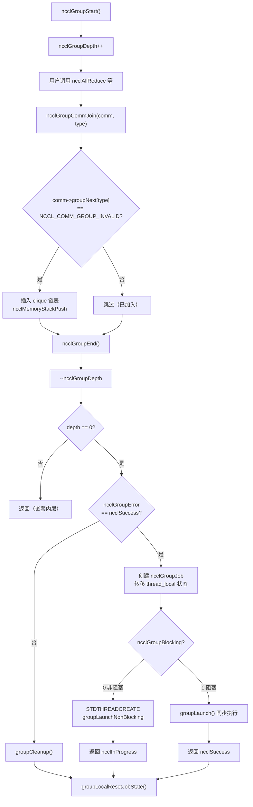
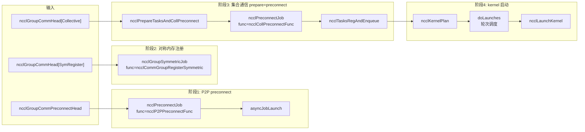

# Chapter 07: Task Scheduler: Multi-Channel & Kernel Execution Orchestration


上一章我们把 ncclAllReduce 一路追到了 ncclTaskColl——任务描述对象已经躺在 comm->planner 里了。但任务描述只是「工单」，还没变成 GPU 上真正跑的 kernel。这一章要回答三个问题：多次 API 调用怎么被攒起来一起提交？攒起来的任务怎么被切到多个 channel 上？多个 kernel 之间的顺序和依赖靠什么保证？先给一个整体心智模型。把 NCCL 想象成一家餐厅：ncclGroupStart/ncclGroupEnd 是「购物车」，用户把好几道菜（多次集合通信调用）丢进购物车；ncclGroupEnd 是「下单」，厨房才开始按订单做菜。而 doLaunches 是「传菜调度员」，它决定哪几道菜先上、哪几道菜可以并行做。没有 group 语义，每道菜单独下单，厨房每做一道就要重新点火（启动 kernel），开销巨大；没有 doLaunches 的轮次调度，多 channel 的 kernel 会乱序启动，导致数据依赖被破坏。

## 一、Group 语义的全局状态：thread_local 变量与「购物车」模型

### Intuitive Architectural Model

`ncclGroupStart` 和 `ncclGroupEnd` 之间的所有通信调用，不会立即启动 kernel，而是被「攒」起来。攒在哪里？攒在**线程局部（thread_local）**的全局变量里。为什么是 thread_local？因为 NCCL 假设同一个线程内的 group 调用是串行的，不同线程各自有独立的购物车，互不干扰。如果这些状态是全局变量而非 thread_local，两个线程同时调用 `ncclGroupStart` 就会互相踩踏，导致一个线程的任务被另一个线程的 `ncclGroupEnd` 提交——这是灾难性的。

### Data Structures & Memory Layout

先看 group 的全局状态定义。

[FACT:src/group.cc:34-34](https://github.com/NVIDIA/nccl/blob/12df1a11afad322be5a204a2db890161cbf8131d/src/group.cc#L34-L34)

```cpp
thread_local int ncclGroupDepth = 0; // depth of ncclGroupStart nesting
thread_local ncclResult_t ncclGroupError = ncclSuccess;
thread_local struct ncclComm* ncclGroupCommHead[ncclGroupTaskTypeNum] = {nullptr};
thread_local struct ncclComm* ncclGroupCommPreconnectHead = nullptr;
thread_local struct ncclIntruQueue<struct ncclAsyncJob, &ncclAsyncJob::next> ncclAsyncJobs;
thread_local int ncclGroupBlocking = -1; /* default mode */
```

逐个字段拆解：

- **`ncclGroupDepth`**：嵌套深度。`ncclGroupStart` 可以嵌套调用（虽然不常见），每次 `ncclGroupStart` 加一，`ncclGroupEnd` 减一。只有减到 0 时才真正提交。这就像购物车可以嵌套——你在一个购物车里又开了一个子购物车，只有最外层结算时才真正下单。
- **`ncclGroupError`**：group 内任意一次调用出错，错误被记录在这里，`ncclGroupEnd` 时统一处理。这避免了「一次调用失败后，后续调用还在往购物车里加东西」的不一致状态。
- **`ncclGroupCommHead[ncclGroupTaskTypeNum]`**：按任务类型分组的通信域链表头。`ncclGroupTaskTypeNum` 是任务类型数量（集合通信、原始任务、管理任务、对称注册等）。每个类型一条链表，链表节点是 `ncclComm`，通过 `comm->groupNext[type]` 串联。为什么按类型分？因为不同类型的任务提交时机和依赖关系不同——集合通信任务需要先 preconnect，管理任务（如 destroy）需要最后执行。
- **`ncclGroupCommPreconnectHead`**：需要预连接的通信域链表。预连接是「提前把网络连接建好」，避免在 kernel 启动时才建连接导致延迟。
- **`ncclAsyncJobs`**：异步任务队列。有些任务（如 `ncclCommInitRank`）是异步的，它们被放进这个队列，在 `ncclGroupEnd` 时统一启动。
- **`ncclGroupBlocking`**：阻塞模式标志。`-1` 表示还没确定，`0` 表示非阻塞，`1` 表示阻塞。同一个 group 内不允许混用阻塞和非阻塞通信域，否则报错。

这里有个关键设计：`ncclGroupCommHead` 是**数组**，每个元素是一条链表。链表节点通过 `comm->groupNext[type]` 串联，而不是用独立的链表节点结构。这意味着 `ncclComm` 结构体里必须预留 `groupNext` 数组字段。这种「侵入式链表」的设计避免了额外的内存分配，但代价是 `ncclComm` 结构体变大。

### 场景驱动的 Step-by-Step Walkthrough

**场景**：用户调用 `ncclGroupStart()`，然后连续调用两次 `ncclAllReduce`（分别针对两个不同的通信域 commA 和 commB），最后调用 `ncclGroupEnd()`。

**第一步：`ncclGroupStart` 做了什么？**

[FACT:src/include/group.h:63-66](https://github.com/NVIDIA/nccl/blob/12df1a11afad322be5a204a2db890161cbf8131d/src/include/group.h#L63-L66)

```cpp
inline ncclResult_t ncclGroupStartInternal() {
  ncclGroupDepth++;
  return ncclSuccess;
}
```

极其简单：深度加一。没有内存分配，没有锁，没有系统调用。这就是为什么 `ncclGroupStart` 几乎零开销。

**第二步：`ncclAllReduce` 在 group 内被调用时发生了什么？**

`ncclAllReduce` 内部会调用 `ncclGroupCommJoin(comm, ncclGroupTaskTypeCollective)`，把通信域加入 group 链表。

[FACT:src/include/group.h:80-116](https://github.com/NVIDIA/nccl/blob/12df1a11afad322be5a204a2db890161cbf8131d/src/include/group.h#L80-L116)

```cpp
inline void ncclGroupCommJoin(struct ncclComm* comm, int type) {
  if (comm->groupNext[type] == reinterpret_cast<struct ncclComm*>(NCCL_COMM_GROUP_INVALID)) {
    // Insert comm into ncclGroupCommHead adjacent to sibling comms. This preserves
    // the users program order yet insures siblings occur consecutively. This
    // is required by doLaunches() in "group.cc".
    struct ncclComm** pp = &ncclGroupCommHead[type];
    while (*pp != nullptr && comm->intraComm0 != (*pp)->intraComm0) pp = &(*pp)->groupNext[type];

    // didn't find its clique, we need to insert it with ascending order based on commHash
    if (*pp == nullptr) {
      pp = &ncclGroupCommHead[type];
      while (*pp != nullptr && (*pp)->commHash < comm->commHash) pp = &(*pp)->groupNext[type];
    }
    comm->groupNext[type] = *pp;
    *pp = comm;
    // Comms gets a new memory stack scope upon joining. Each task batched for
    // this comm is allocated there.
    if (type == ncclGroupTaskTypeCollective || type == ncclGroupTaskTypeRawTask) {
      // Initialize planner
      ncclMemoryStackPush(&comm->memScoped);
      ncclKernelPlanner::Peer* tmp = comm->planner.peers;
      ncclIntruQueue<ncclTaskRma, &ncclTaskRma::next>* tmpRmaQueues = comm->planner.rmaTaskQueues;
      int numRmaCtx = comm->config.numRmaCtx;
      memset(&comm->planner, 0, sizeof(comm->planner));
      comm->planner.peers = tmp;
      comm->planner.bcast_info.minBcastPeer = INT_MAX;
      comm->planner.bcast_info.maxBcastPeer = INT_MIN;
      comm->planner.rmaTaskQueues = tmpRmaQueues;
      if (comm->planner.rmaTaskQueues != NULL) {
        for (int i = 0; i < numRmaCtx; i++) {
          ncclIntruQueueConstruct(&comm->planner.rmaTaskQueues[i]);
        }
      }
    }
  }
  ncclGroupBlocking = comm->config.blocking;
}
```

这段代码有几个精妙之处：

1. **幂等性检查**：`if (comm->groupNext[type] == NCCL_COMM_GROUP_INVALID)` 确保同一个通信域在同一个 group 内只被加入一次。如果用户对同一个 comm 调用了两次 `ncclAllReduce`，第二次不会重复加入链表，但任务会被追加到 `comm->planner` 里。

2. **clique 排序**：`intraComm0` 是「全局实体」的标识。多个通信域如果属于同一个全局实体（比如通过 `ncclCommSplit` 分裂出来的），它们的 `intraComm0` 相同，被称为一个 clique。代码先按 `intraComm0` 找到 clique，把 comm 插入到同 clique 的兄弟节点旁边。如果没找到 clique，就按 `commHash` 升序插入。这个排序是为了 `doLaunches` 能正确处理 clique 内的 barrier 同步。

3. **内存栈作用域**：`ncclMemoryStackPush(&comm->memScoped)` 为这个 comm 在 group 内分配一个新的内存栈作用域。所有为这个 comm 分配的任务（`ncclTaskColl` 等）都从这个栈上分配。`ncclGroupCommLeave` 时会 `ncclMemoryStackPop` 一次性释放所有任务内存——这是「批量分配、批量释放」的经典优化，避免了每个任务单独 `malloc/free` 的开销。

4. **planner 重置**：`memset(&comm->planner, 0, sizeof(comm->planner))` 清空 planner，但保留了 `peers` 和 `rmaTaskQueues` 指针（先存到临时变量，memset 后再恢复）。为什么要保留？因为这两个是预分配的数组，不需要每次重新分配。`bcast_info` 的 min/max 被重置为 `INT_MAX/INT_MIN`，用于后续 broadcast 任务的合并优化。

**第三步：`ncclGroupEnd` 做了什么？**

[FACT:src/group.cc:1039-1164](https://github.com/NVIDIA/nccl/blob/12df1a11afad322be5a204a2db890161cbf8131d/src/group.cc#L1039-L1164)

`ncclGroupEndInternal` 是核心。逐段解析：

[FACT:src/group.cc:1048-1061](https://github.com/NVIDIA/nccl/blob/12df1a11afad322be5a204a2db890161cbf8131d/src/group.cc#L1048-L1061)

```cpp
if (ncclGroupDepth == 0) {
  WARN("ncclGroupEnd: not in a group call.");
  ret = ncclInvalidUsage;
  goto exit;
}
// ...
if ((--ncclGroupDepth) > 0) goto exit;
```

先检查深度，然后减一。如果减一后还大于 0，说明还在嵌套的内层 group 里，直接返回，不提交。只有减到 0 才继续。

[FACT:src/group.cc:1063](https://github.com/NVIDIA/nccl/blob/12df1a11afad322be5a204a2db890161cbf8131d/src/group.cc#L1063)

```cpp
if ((ret = ncclGroupError) != ncclSuccess) goto fail;
```

如果 group 内任何一次调用出过错，直接跳到 fail 清理。

[FACT:src/group.cc:1084-1093](https://github.com/NVIDIA/nccl/blob/12df1a11afad322be5a204a2db890161cbf8131d/src/group.cc#L1084-L1093)

```cpp
NEW_NOTHROW_GOTO(groupJob, ncclGroupJob, ret, fail);
ncclIntruQueueConstruct(&groupJob->asyncJobs);
groupJob->groupRefCount = 0;
groupJob->nonBlockingInit = false;
memcpy(groupJob->groupCommHead, ncclGroupCommHead, sizeof(ncclGroupCommHead));
groupJob->groupCommPreconnectHead = ncclGroupCommPreconnectHead;
groupJob->groupError = ncclSuccess;
groupJob->abortFlag = false;
groupJob->joined = false;
ncclIntruQueueTransfer(&groupJob->asyncJobs, &ncclAsyncJobs);
```

创建一个 `ncclGroupJob`，把 thread_local 的 group 状态「转移」到 job 对象里。`ncclIntruQueueTransfer` 把 `ncclAsyncJobs` 队列整体转移到 `groupJob->asyncJobs`。这一步很关键：thread_local 状态是「临时」的，job 对象是「持久」的，可以被异步线程持有。

[FACT:src/group.cc:1095-1147](https://github.com/NVIDIA/nccl/blob/12df1a11afad322be5a204a2db890161cbf8131d/src/group.cc#L1095-L1147)

```cpp
if (hasCommHead || !ncclIntruQueueEmpty(&groupJob->asyncJobs) || ncclGroupCommPreconnectHead != nullptr) {
  /* make sure ncclGroupBlocking has been set. */
  if (ncclGroupBlocking != 0 && ncclGroupBlocking != 1) {
    WARN("Invalid group blocking state %d", ncclGroupBlocking);
    ret = ncclInternalError;
    goto fail;
  }
  if (ncclGroupBlocking == 0) {
    /* nonblocking group */
    // ... 设置 async error 为 ncclInProgress，创建线程执行 groupLaunchNonBlocking
    groupJob->base.func = groupLaunchNonBlocking;
    STDTHREADCREATE_GOTO(groupJob->base.thread, ncclAsyncJobMain, ret, fail, &groupJob->base);
    groupJob->nonBlockingInit = true;
    ret = ncclInProgress;
  } else {
    /* blocking group */
    int savedDev;
    CUDACHECKGOTO(cudaGetDevice(&savedDev), ret, fail);
    NCCLCHECKGOTO(groupLaunch(&groupJob->base, internalSimInfoPtr), ret, fail);
    CUDACHECKGOTO(cudaSetDevice(savedDev), ret, fail);
    if (simInfo) memcpy((void*)simInfo, (void*)internalSimInfoPtr, realSize);
    delete groupJob;
  }
} else {
  // Free when not needed (single rank case)
  delete groupJob;
}
```

阻塞模式：直接在当前线程调用 `groupLaunch`，同步完成。非阻塞模式：创建一个线程执行 `groupLaunchNonBlocking`，立即返回 `ncclInProgress`。用户后续通过 `ncclCommGetAsyncError` 查询进度。

注意 `cudaGetDevice`/`cudaSetDevice` 的保存和恢复：`groupLaunch` 内部会切换 CUDA 设备（因为不同 comm 可能在不同 GPU 上），执行完后恢复用户原来的设备。这是防止「NCCL 内部切换设备后没切回来」导致用户后续 CUDA 调用跑错设备。

### 设计思考与生产踩坑

**坑 1：阻塞和非阻塞通信域混用**。`ncclAsyncLaunch` 里有检查：

[FACT:src/group.cc:55-64](https://github.com/NVIDIA/nccl/blob/12df1a11afad322be5a204a2db890161cbf8131d/src/group.cc#L55-L64)

```cpp
/* check if there are blocking and nonblocking comms at the same time in group. */
if (comm->destroyFlag) {
  ncclGroupBlocking = 1;
} else if (ncclGroupBlocking == -1) {
  /* first met communicator */
  ncclGroupBlocking = comm->config.blocking;
} else if (ncclGroupBlocking != comm->config.blocking) {
  WARN("Blocking and nonblocking communicators are not allowed in the same group.");
  ret = ncclInvalidArgument;
}
```

为什么不允许混用？因为阻塞 group 在当前线程同步执行，非阻塞 group 在独立线程异步执行。如果混用，无法确定 `ncclGroupEnd` 应该同步返回还是返回 `ncclInProgress`。生产环境中，如果用户不小心把阻塞和非阻塞 comm 放进同一个 group，会收到 `ncclInvalidArgument`，但此时 group 状态已经被污染，必须重新 `ncclGroupStart`。

**坑 2：`ncclGroupError` 的传播**。如果 group 内某次调用失败，`ncclGroupError` 被设置，`ncclGroupEnd` 会跳到 fail 分支执行 `groupCleanup`。`groupCleanup` 会遍历所有 comm，释放 planner 里的 plan 内存、重置 planner、清理 rawTaskQueue。如果这一步没做干净，下次 `ncclGroupStart` 时 planner 里残留旧数据，会导致任务重复提交或内存泄漏。

[FACT:src/group.cc:514-607](https://github.com/NVIDIA/nccl/blob/12df1a11afad322be5a204a2db890161cbf8131d/src/group.cc#L514-L607)

```cpp
static void groupCleanup(struct ncclComm** groupCommHeadPtr,
                         struct ncclIntruQueue<struct ncclAsyncJob, &ncclAsyncJob::next>* asyncJobsPtr,
                         ncclResult_t error) {
  struct ncclComm* comm;
  for (int type = 0; type < ncclGroupTaskTypeNum; ++type) {
    comm = groupCommHeadPtr[type];
    groupCommHeadPtr[type] = nullptr;
    while (comm != nullptr) {
      struct ncclComm* next = comm->groupNext[type];
      (void)ncclGroupCommLeave(comm, type);
      // We don't know if preconnect succeeded or happened at all, so clear
      // the flags that let `taskAppend()` skip over checking if preconnect
      // is needed.
      if (type == ncclGroupTaskTypeCollective || type == ncclGroupTaskTypeRawTask) {
        comm->preconnectNext = reinterpret_cast<struct ncclComm*>(0x1);
        for (int i = 0; i < comm->nRanks; i++) {
          comm->connectSend[i] = 0UL;
          comm->connectRecv[i] = 0UL;
        }
        // Reclaim abandoned kernel plan memory.
        while (!ncclIntruQueueEmpty(&comm->planner.planQueue)) {
          struct ncclKernelPlan* plan = ncclIntruQueueDequeue(&comm->planner.planQueue);
          if (!plan->persistent) {
            while (!ncclIntruQueueEmpty(&plan->proxyOpQueue)) {
              struct ncclProxyOp* pxop = ncclIntruQueueDequeue(&plan->proxyOpQueue);
              ncclMemoryPoolFree(&comm->memPool_ncclProxyOp, pxop);
            }
            ncclMemoryPoolFree(&comm->memPool_ncclKernelPlan, plan);
          }
        }
        // Reset comm->planner to empty.
        // ...
      }
      // ...
    }
  }
  // ...
}
```

注意 `comm->preconnectNext = reinterpret_cast<struct ncclComm*>(0x1)` 这一行。这是一个「哨兵值」，表示「这个 comm 需要重新 preconnect」。为什么？因为 cleanup 时不知道 preconnect 是否成功，所以强制下次重新检查。`0x1` 这个值很巧妙——它不是一个合法的指针，但可以用来做「未初始化」标记。`ncclGroupCommPreconnect` 里检查 `if (comm->preconnectNext == reinterpret_cast<struct ncclComm*>(0x1))` 来判断是否需要加入 preconnect 链表。

---

## 二、任务准备：`ncclPrepareTasks` 如何把任务描述变成可调度单元

### Intuitive Architectural Model

`ncclPrepareTasks` 是「备菜」环节。购物车里的菜（任务描述）还是生的，需要先洗切配（确定算法、协议、channel 切分），才能下锅（启动 kernel）。如果跳过这一步直接启动 kernel，kernel 不知道数据怎么切、走哪条路，会直接崩溃。

### 场景驱动的 Step-by-Step Walkthrough

`ncclPrepareTasks` 在 `groupLaunchLegacy` 里被调用：

[FACT:src/group.cc:705-746](https://github.com/NVIDIA/nccl/blob/12df1a11afad322be5a204a2db890161cbf8131d/src/group.cc#L705-L746)

```cpp
static ncclResult_t ncclPrepareTasksAndCollPreconnect(
  struct ncclComm* comm, ncclSimInfo_t* simInfo,
  struct ncclIntruQueue<struct ncclAsyncJob, &ncclAsyncJob::next>* asyncCollJobs) {
  if (ncclParamSingleProcMemRegEnable()) {
    // 单进程内存注册模式：把 prepare 和 preconnect 合并成一个异步 job
    struct ncclPrepareTasksAndCollPreconnectJob* job;
    NEW_NOTHROW(job, ncclPrepareTasksAndCollPreconnectJob);
    job->base.func = ncclPrepareTasksAndCollPreconnectFunc;
    // ...
    ncclIntruQueueEnqueue(asyncCollJobs, &job->base);
  } else {
    bool needConnect = false;
    bool algoNeedConnect[NCCL_NUM_ALGORITHMS];
    memset(algoNeedConnect, 0, sizeof(bool) * NCCL_NUM_ALGORITHMS);

    CUDACHECK(cudaSetDevice(comm->cudaDev));
    NCCLCHECK(ncclPrepareTasks(comm, algoNeedConnect, &needConnect, simInfo));

    if (comm->cuMemSupport && needConnect) {
      // 创建 preconnect job
      struct ncclPreconnectJob* job;
      NEW_NOTHROW(job, ncclPreconnectJob);
      job->base.func = ncclCollPreconnectFunc;
      // ...
      ncclIntruQueueEnqueue(asyncCollJobs, &job->base);
    }
  }
  return ncclSuccess;
}
```

`ncclPrepareTasks` 的输出是两个东西：`algoNeedConnect` 数组（哪些算法需要建立连接）和 `needConnect` 标志（是否需要连接）。如果 `needConnect` 为真且支持 cuMem，就创建一个 preconnect job 异步执行。

`ncclPrepareTasks` 内部做了什么？它遍历 `comm->planner` 里的任务，对每个任务确定算法和协议，然后调用 `taskAppend` 把任务追加到 planner 的 plan 里。这部分逻辑在上一章已经展开，这里不再重复。

关键点：`ncclPrepareTasks` 是**按 comm 逐个调用**的，但 preconnect 是**按 clique 批量执行**的。为什么？看 `groupLaunchLegacy` 里的注释：

[FACT:src/group.cc:818-834](https://github.com/NVIDIA/nccl/blob/12df1a11afad322be5a204a2db890161cbf8131d/src/group.cc#L818-L834)

```cpp
do {
  // We need to preconnect connections for collectives clique by clique to avoid
  // race condition for split shared comms which can connect the same connections
  // at the same time.
  comm = cliqueHead;
  do {
    NCCLCHECKGOTO(ncclPrepareTasksAndCollPreconnect(comm, simInfo, &asyncCollJobs), ret, fail);
    comm = comm->groupNext[ncclGroupTaskTypeCollective];
  } while (comm != nullptr && comm->intraComm0 == cliqueHead->intraComm0);
  // connect
  NCCLCHECKGOTO(asyncJobLaunch(&asyncCollJobs, groupAbortFlag), ret, fail);
  // ...
  cliqueHead = comm;
} while (cliqueHead != nullptr);
```

注释说得很清楚：**按 clique 逐个 preconnect，避免 split shared comms 同时连接同一组连接导致竞态**。如果两个 comm 是从同一个父 comm split 出来的，它们可能共享一些连接。如果并行 preconnect，两个线程可能同时尝试建立同一个连接，导致重复连接或连接状态不一致。按 clique 串行执行，保证同一时刻只有一个 clique 在建立连接。

### 并发控制与底层交互

`asyncJobLaunch` 是异步任务启动的核心：

[FACT:src/group.cc:609-678](https://github.com/NVIDIA/nccl/blob/12df1a11afad322be5a204a2db890161cbf8131d/src/group.cc#L609-L678)

```cpp
static ncclResult_t asyncJobLaunch(struct ncclIntruQueue<struct ncclAsyncJob, &ncclAsyncJob::next>* asyncJobsMain,
                                   volatile bool* groupAbortFlag) {
  ncclResult_t ret = ncclSuccess;
  bool jobsDone = false;
  bool errorJobAbortFlag = false;

  if (!ncclIntruQueueEmpty(asyncJobsMain)) {
    struct ncclAsyncJob* job = ncclIntruQueueHead(asyncJobsMain);
    if (job->next == nullptr) {
      // 只有一个 job，直接在当前线程执行，避免线程创建开销
      job->isThreadMain = true;
      ncclAsyncJobMain(job);
      job->state = ncclGroupJobJoined;
      return job->result;
    }
    // 多个 job，每个创建一个线程
    do {
      STDTHREADCREATE(job->thread, ncclAsyncJobMain, job);
      job = job->next;
    } while (job != nullptr);

    do {
      jobsDone = true;
      job = ncclIntruQueueHead(asyncJobsMain);
      do {
        ncclGroupJobState_t state = COMPILER_ATOMIC_LOAD(&job->state, std::memory_order_acquire);
        if (state == ncclGroupJobRunning) {
          jobsDone = false;
        } else if (state == ncclGroupJobDone) {
          int err;
          if ((err = ncclThreadJoin(job->thread)) != ncclSuccess) {
            WARN("asyncJobLaunch: failed to join thread for job");
            ret = ncclSystemError;
          }
          job->state = ncclGroupJobJoined;
          if (job->result != ncclSuccess && ret == ncclSuccess) {
            ret = job->result;
            errorJobAbortFlag = true;
          }
        } else {
          // safety check
          if (state != ncclGroupJobJoined) {
            WARN("Async job state is %d, expected %d", state, ncclGroupJobJoined);
            if (ret == ncclSuccess) ret = ncclInternalError;
            errorJobAbortFlag = true;
          }
        }

        if (!job->destroyFlag &&
            (COMPILER_ATOMIC_LOAD(groupAbortFlag, std::memory_order_acquire) || errorJobAbortFlag == true)) {
          COMPILER_ATOMIC_STORE(job->abortFlag, uint32_t(1), std::memory_order_release);
          COMPILER_ATOMIC_STORE(job->abortFlagDev, uint32_t(1), std::memory_order_release);
          if (job->childAbortFlag) {
            COMPILER_ATOMIC_STORE(job->childAbortFlag, uint32_t(1), std::memory_order_release);
            COMPILER_ATOMIC_STORE(job->childAbortFlagDev, uint32_t(1), std::memory_order_release);
          }
        }

        job = job->next;
      } while (job != nullptr);
      // Let preconnect threads progress.
      if (jobsDone == false) std::this_thread::sleep_for(std::chrono::microseconds(1));
    } while (jobsDone == false);

    if (ret != ncclSuccess) goto fail;
  }

exit:
  return ret;
fail:
  goto exit;
}
```

这段代码有几个关键设计：

1. **单 job 优化**：如果队列里只有一个 job，不创建线程，直接在当前线程执行。这避免了线程创建和 join 的开销。对于单 comm 的 group，这是常见情况。

2. **原子状态机**：`job->state` 是一个原子变量，有三个状态：`ncclGroupJobRunning`、`ncclGroupJobDone`、`ncclGroupJobJoined`。工作线程执行完后用 `COMPILER_ATOMIC_STORE(..., std::memory_order_release)` 设置为 `Done`；主线程用 `COMPILER_ATOMIC_LOAD(..., std::memory_order_acquire)` 读取。release/acquire 配对保证了工作线程的所有内存写入对主线程可见。

3. **忙等待 + 微睡眠**：主线程轮询所有 job 的状态，如果还有 job 在跑，`sleep_for(1us)` 后继续轮询。为什么用 1 微秒而不是条件变量？因为 preconnect 是短任务（通常几十微秒到几毫秒），条件变量的唤醒开销可能比忙等待还大。1 微秒的睡眠避免了纯自旋导致的 CPU 浪费。

4. **错误传播与 abort**：如果任何一个 job 失败，`errorJobAbortFlag` 被设置，后续所有 job 的 `abortFlag` 被原子设置为 1。工作线程在执行过程中会检查 `abortFlag`，如果发现被 abort，提前退出。这是「快速失败」机制，避免一个 job 失败后其他 job 还在傻跑。

### Mermaid 图：group 提交的控制流



---

## 三、`doLaunches`：多 channel 多 kernel 的轮次调度

### Intuitive Architectural Model

`doLaunches` 是「传菜调度员」。厨房（GPU）有多个灶台（channel），每道菜（kernel plan）需要按顺序上。但不同 comm 的菜可能可以并行上，同一个 comm 的菜必须按顺序上。调度员要保证：同一个 clique 内的 comm 同步推进（用 barrier），不同 clique 之间可以独立推进。

### Data Structures & Memory Layout

`doLaunches` 的核心数据结构是 `ncclKernelPlan` 和 `comm->planner.unlaunchedPlansHead`。

[FACT:src/group.cc:427-503](https://github.com/NVIDIA/nccl/blob/12df1a11afad322be5a204a2db890161cbf8131d/src/group.cc#L427-L503)

```cpp
ncclResult_t doLaunches(struct ncclComm* head, int taskType) {
  ncclResult_t result = ncclSuccess;
  struct ncclComm* cliqueHead = head;
  struct ncclComm* cliqueNextHead;
  bool useBarrier = ncclParamLaunchMode == ncclLaunchModeGroup;
  // This outer loop iterates over cliques of comms which are siblings of the
  // same global entity. We calculate a clique as all comms which have the same
  // `intraComm0` value.
  do {
    struct ncclComm* comm = cliqueHead;
    bool capturingYes = false, capturingNo = false;
    do {
      (ncclCudaGraphValid(comm->planner.capturingGraph) ? capturingYes : capturingNo) = true;
      CUDACHECKGOTO(cudaSetDevice(comm->cudaDev), result, failure);
      NCCLCHECKGOTO(ncclLaunchPrepare(comm), result, failure);
      if (useBarrier) ncclCommIntraBarrierIn(comm, 1);
      comm = comm->groupNext[taskType];
    } while (comm != nullptr && comm != reinterpret_cast<struct ncclComm*>(NCCL_COMM_GROUP_INVALID) &&
             comm->intraComm0 == cliqueHead->intraComm0);
    cliqueNextHead = comm;

    if (capturingYes && capturingNo) {
      // We have entered barriers but are aborting without leaving them. Thus
      // these comms are permanently trashed. We need a good mechanism for
      // tracking and reporting that.
      WARN("Either none or all communicators in a ncclGroup() can be CUDA graph captured.");
      result = ncclInvalidUsage;
      goto failure;
    }

    while (true) {
      // Iterate rounds of launches for clique.
      bool moreRounds = false;
      comm = cliqueHead;
      do {
        // Iterate clique members.
        struct ncclComm* next = comm->groupNext[taskType];
        if (useBarrier) {
          // Barrier reduction result tells us if this was the final round.
          moreRounds = 0 != ncclCommIntraBarrierOut(comm);
        } else {
          moreRounds |= comm->planner.unlaunchedPlansHead != nullptr;
        }
        if (moreRounds) {
          // Pop next unlaunched kernel
          struct ncclKernelPlan* plan = comm->planner.unlaunchedPlansHead;
          if (plan != nullptr) {
            comm->planner.unlaunchedPlansHead = plan->next;
            CUDACHECKGOTO(cudaSetDevice(comm->cudaDev), result, failure);
            NCCLCHECKGOTO(ncclLaunchKernelBefore_NoUncapturedCuda(comm, plan), result, failure);
            if (plan->isCeColl) {
              NCCLCHECKGOTO(ncclLaunchCeColl(comm, plan), result, failure);
            } else if (plan->isRma) {
              NCCLCHECKGOTO(ncclLaunchRma(comm, plan), result, failure);
            } else {
              NCCLCHECKGOTO(ncclLaunchKernel(comm, plan), result, failure);
            }
          }
          // Barrier reduction input indicates if we require further rounds.
          if (useBarrier) ncclCommIntraBarrierIn(comm, comm->planner.unlaunchedPlansHead != nullptr ? 1 : 0);
          if (plan != nullptr) {
            NCCLCHECKGOTO(ncclLaunchKernelAfter_NoCuda(comm, plan), result, failure);
          }
        } else {
          // Final round.
          CUDACHECKGOTO(cudaSetDevice(comm->cudaDev), result, failure);
          NCCLCHECKGOTO(ncclLaunchFinish(comm), result, failure);
        }
        comm = next;
      } while (comm != reinterpret_cast<struct ncclComm*>(NCCL_COMM_GROUP_INVALID) && comm != cliqueNextHead);
      if (!moreRounds) break;
    }
    cliqueHead = cliqueNextHead;
  } while (cliqueHead != nullptr && cliqueHead != reinterpret_cast<struct ncclComm*>(NCCL_COMM_GROUP_INVALID));
failure:
  return result;
}
```

### 场景驱动的 Step-by-Step Walkthrough

**场景**：两个 comm（commA 和 commB）属于同一个 clique（`intraComm0` 相同），每个 comm 有 3 个 kernel plan 待启动。

**第一层循环：遍历 clique**

外层 `do-while` 遍历所有 clique。`cliqueHead` 是当前 clique 的第一个 comm。内层 `do-while` 遍历 clique 内的所有 comm（`comm->intraComm0 == cliqueHead->intraComm0`）。

对每个 comm：
- `cudaSetDevice(comm->cudaDev)`：切换到该 comm 对应的 GPU。
- `ncclLaunchPrepare(comm)`：准备启动，包括设置 CUDA 流、检查资源等。
- `ncclCommIntraBarrierIn(comm, 1)`：进入 barrier，初始值为 1。

**第二层循环：轮次调度**

`while (true)` 循环执行「轮次」。每一轮，clique 内每个 comm 启动一个 kernel plan。

关键在 `moreRounds` 的计算：

- **有 barrier 模式**（`useBarrier == true`）：`moreRounds = 0 != ncclCommIntraBarrierOut(comm)`。`ncclCommIntraBarrierOut` 是一个**跨 comm 的 barrier 归约操作**。它等待 clique 内所有 comm 都调用了 `ncclCommIntraBarrierIn`，然后返回所有输入值的归约结果（这里是逻辑或）。如果任何一个 comm 还有未启动的 plan，归约结果为 1，`moreRounds` 为 true，继续下一轮。如果所有 comm 都没有未启动的 plan，归约结果为 0，`moreRounds` 为 false，进入 final round。
- **无 barrier 模式**：`moreRounds |= comm->planner.unlaunchedPlansHead != nullptr`。直接检查每个 comm 是否还有未启动的 plan。注意这里用的是 `|=`，只要有一个 comm 还有 plan，`moreRounds` 就为 true。

为什么需要 barrier？因为 clique 内的 comm 是「兄弟」，它们可能共享 GPU 资源或网络连接。如果一个 comm 启动了 3 个 kernel，另一个只启动了 1 个，先启动完的 comm 会进入 `ncclLaunchFinish`，释放资源，而另一个 comm 还在用这些资源，导致 use-after-free。barrier 保证 clique 内所有 comm 同步推进：要么都启动第 N 轮，要么都进入 final round。

**kernel 启动分支**

[FACT:src/group.cc:477-483](https://github.com/NVIDIA/nccl/blob/12df1a11afad322be5a204a2db890161cbf8131d/src/group.cc#L477-L483)

```cpp
if (plan->isCeColl) {
  NCCLCHECKGOTO(ncclLaunchCeColl(comm, plan), result, failure);
} else if (plan->isRma) {
  NCCLCHECKGOTO(ncclLaunchRma(comm, plan), result, failure);
} else {
  NCCLCHECKGOTO(ncclLaunchKernel(comm, plan), result, failure);
}
```

三种 plan 类型：
- `isCeColl`：CollNet 集合通信（用网卡卸载做集合通信）。
- `isRma`：RMA（Remote Memory Access）任务。
- 默认：普通 GPU kernel。

每种类型的启动函数不同，但都遵循「Before -> Launch -> After」的模式：
- `ncclLaunchKernelBefore_NoUncapturedCuda`：启动前准备（设置 kernel 参数、上传到设备等）。
- `ncclLaunchKernel`：实际启动 kernel（`cudaLaunchKernel`）。
- `ncclLaunchKernelAfter_NoCuda`：启动后清理（更新状态、释放临时资源）。

**Final round**

当 `moreRounds` 为 false 时，执行 `ncclLaunchFinish(comm)`。这一步做最终的清理：释放 plan 内存、更新 comm 状态、通知 proxy 线程等。

### 并发控制与硬件交互

`ncclCommIntraBarrierIn/Out` 是 clique 内 comm 的同步原语。它的实现涉及原子操作和自旋等待。`In` 把值写入共享内存，`Out` 等待所有 comm 都写入后读取归约结果。这个 barrier 是**跨进程**的（如果 comm 在不同进程），底层可能用共享内存或网络。

为什么用 barrier 而不是简单的「检查所有 comm 是否还有 plan」？因为「检查」是非原子的：commA 检查时 commB 还有 plan，commA 决定继续；但 commB 在 commA 检查后立即启动完最后一个 plan，进入 final round。commA 还在启动 kernel，commB 已经释放了共享资源。barrier 把「检查」和「决定」变成一个原子操作，消除了这个竞态。

### 生产避坑指南

**坑 1：CUDA graph capture 混用**。

[FACT:src/group.cc:448-455](https://github.com/NVIDIA/nccl/blob/12df1a11afad322be5a204a2db890161cbf8131d/src/group.cc#L448-L455)

```cpp
if (capturingYes && capturingNo) {
  // We have entered barriers but are aborting without leaving them. Thus
  // these comms are permanently trashed. We need a good mechanism for
  // tracking and reporting that.
  WARN("Either none or all communicators in a ncclGroup() can be CUDA graph captured.");
  result = ncclInvalidUsage;
  goto failure;
}
```

如果 clique 内一部分 comm 在 CUDA graph capture 模式下，另一部分不在，直接报错。注释说「these comms are permanently trashed」——因为已经进入了 barrier 但没有退出，这些 comm 的 barrier 状态永远不一致，后续无法再使用。这是一个**不可恢复错误**，用户必须重建通信域。生产环境中，如果用户混用 graph capture 和非 capture 的 comm，会收到 `ncclInvalidUsage`，但更严重的是 comm 已经损坏。

**坑 2：`useBarrier` 的配置依赖**。`useBarrier = ncclParamLaunchMode == ncclLaunchModeGroup`。如果用户设置了 `NCCL_LAUNCH_MODE=GROUP`，走 barrier 路径；否则走非 barrier 路径。非 barrier 路径下，`moreRounds` 用 `|=` 累积，但每个 comm 独立判断。如果 commA 还有 plan 而 commB 没有，commB 会进入 final round 执行 `ncclLaunchFinish`，而 commA 还在启动 kernel。这在某些场景下是安全的（comm 之间没有共享资源），但如果共享了 proxy 线程或网络连接，可能导致问题。所以默认推荐用 barrier 模式。

---

## 四、`groupLaunchLegacy` 的完整执行链

### 场景驱动的 Step-by-Step Walkthrough

`groupLaunchLegacy` 是阻塞模式下的完整提交流程。按顺序执行：

**阶段 1：P2P preconnect**

[FACT:src/group.cc:756-774](https://github.com/NVIDIA/nccl/blob/12df1a11afad322be5a204a2db890161cbf8131d/src/group.cc#L756-L774)

```cpp
if (!simInfo && groupCommPreconnectHeadMain != nullptr) {
  struct ncclComm* comm = groupCommPreconnectHeadMain;
  do {
    struct ncclPreconnectJob* job;
    NEW_NOTHROW_GOTO(job, ncclPreconnectJob, ret, fail);
    job->base.func = ncclP2PPreconnectFunc;
    // ...
    ncclIntruQueueEnqueue(asyncJobsMain, (struct ncclAsyncJob*)job);
    struct ncclComm* next = comm->preconnectNext;
    comm->preconnectNext = reinterpret_cast<struct ncclComm*>(0x1);
    comm = next;
  } while (comm != nullptr);
}
NCCLCHECKGOTO(asyncJobLaunch(asyncJobsMain, groupAbortFlag), ret, fail);
```

对每个需要 preconnect 的 comm 创建一个 `ncclP2PPreconnectFunc` job，然后批量启动。`ncclP2PPreconnectFunc` 内部调用 `ncclTransportP2pSetup` 建立 P2P 连接。

**阶段 2：对称内存注册**

[FACT:src/group.cc:778-808](https://github.com/NVIDIA/nccl/blob/12df1a11afad322be5a204a2db890161cbf8131d/src/group.cc#L778-L808)

```cpp
// only loop through sym alloc and register tasks
for (int type = ncclGroupTaskTypeSymRegister; type <= ncclGroupTaskTypeSymRegister; ++type) {
  if (groupCommHeadMain[type]) {
    // 按 clique 批量执行 ncclCommGroupRegisterSymmetric
  }
}
```

对称内存注册（`ncclCommWindowRegister` 等）按 clique 批量执行。

**阶段 3：集合通信 preconnect**

[FACT:src/group.cc:810-870](https://github.com/NVIDIA/nccl/blob/12df1a11afad322be5a204a2db890161cbf8131d/src/group.cc#L810-L870)

```cpp
if (groupCommHeadMain[ncclGroupTaskTypeCollective] != nullptr) {
  // 按 clique 逐个 prepare + preconnect
  // 然后 ncclTasksRegAndEnqueue
  // 然后 debug check
}
```

这是核心阶段。按 clique 逐个调用 `ncclPrepareTasksAndCollPreconnect`，然后 `asyncJobLaunch` 执行 preconnect。preconnect 完成后，调用 `ncclTasksRegAndEnqueue` 把任务注册到 plan 并生成 kernel 启动参数。

**阶段 4：`doLaunches`**

[FACT:src/group.cc:872-874](https://github.com/NVIDIA/nccl/blob/12df1a11afad322be5a204a2db890161cbf8131d/src/group.cc#L872-L874)

```cpp
if ((!simInfo) && (groupCommHeadMain[ncclGroupTaskTypeCollective] != nullptr)) {
  NCCLCHECKGOTO(doLaunches(groupCommHeadMain[ncclGroupTaskTypeCollective], ncclGroupTaskTypeCollective), ret, fail);
}
```

启动所有 kernel plan。

**阶段 5：清理**

[FACT:src/group.cc:876-903](https://github.com/NVIDIA/nccl/blob/12df1a11afad322be5a204a2db890161cbf8131d/src/group.cc#L876-L903)

```cpp
while (!ncclIntruQueueEmpty(asyncJobsMain)) {
  struct ncclAsyncJob* job = ncclIntruQueueDequeue(asyncJobsMain);
  if (!job->destroyFlag && job->comm && !job->comm->config.blocking &&
      groupCommHeadMain[ncclGroupTaskTypeCollective] == nullptr) {
    (void)ncclCommSetAsyncError(job->comm, ret);
  }
  if (job->destructor) job->destructor((void*)job);
}

for (int type = 0; type < ncclGroupTaskTypeNum; ++type) {
  while (groupCommHeadMain[type] != nullptr) {
    struct ncclComm* comm = groupCommHeadMain[type];
    struct ncclComm* next = comm->groupNext[type];
    // Poll for callbacks sent to us from other threads.
    if (comm->reclaimSteps == GROUP_MAX_RECLAIM_STEPS) {
      NCCLCHECKGOTO(ncclCommPollCallbacks(comm, /*waitSome=*/false), ret, fail);
      comm->reclaimSteps = 0;
    } else {
      comm->reclaimSteps++;
    }
    (void)ncclGroupCommLeave(comm, type);
    if (!comm->config.blocking) {
      (void)ncclCommSetAsyncError(comm, ret);
    }
    groupCommHeadMain[type] = next;
  }
}
```

清理异步 job，然后遍历所有 comm 调用 `ncclGroupCommLeave`。注意 `reclaimSteps` 的计数：每 `GROUP_MAX_RECLAIM_STEPS`（10）次 group 调用，轮询一次 callbacks。这是为了避免每次 group 都轮询 callbacks 的开销，同时保证 callbacks 不会无限堆积。

### Mermaid 图：`groupLaunchLegacy` 的数据流



---

## 五、`groupLaunchEnqueueRearch`：新架构的调度器

### Intuitive Architectural Model

`groupLaunchEnqueueRearch` 是 NCCL 正在开发的新调度架构。它把任务准备、调度、启动分成更细的阶段，用异步 job 队列管理。目前调度器和启动器模块「尚未实现」，回退到 legacy 的 `doLaunches`。

[FACT:src/group.cc:991-996](https://github.com/NVIDIA/nccl/blob/12df1a11afad322be5a204a2db890161cbf8131d/src/group.cc#L991-L996)

```cpp
// Schedule and launch tasks. Scheduler and launcher module of the enqueue framework
// is not yet implemented and falls back to the legacy launcher: a single phased
// doLaunches over the clique, run here on the user's thread.
if (!simInfo && groupCommHeadMain[ncclGroupTaskTypeRawTask] != nullptr) {
  NCCLCHECKGOTO(doLaunches(groupCommHeadMain[ncclGroupTaskTypeRawTask], ncclGroupTaskTypeRawTask), ret, fail);
}
```

新架构的执行流程：

1. **管理任务**：`ncclMgmtTaskJobFunc` 处理 `mgmtTaskQueue` 里的任务（如 destroy）。
2. **任务准备**：`ncclTaskPrepareJobFunc` 调用 `ncclTaskPrepare`。
3. **调度和启动**：回退到 `doLaunches`。

新架构用 `ncclGroupJobLaunch` 替代 `asyncJobLaunch`，增加了更严格的状态检查：

[FACT:src/group.cc:113-116](https://github.com/NVIDIA/nccl/blob/12df1a11afad322be5a204a2db890161cbf8131d/src/group.cc#L113-L116)

```cpp
} else {
  /* safety check */
  assert(state == ncclGroupJobJoined);
}
```

legacy 版本用 `WARN` 而不是 `assert`，新架构用 `assert`。这说明新架构对状态机的正确性要求更高。

### 设计思考

新架构的动机是**解耦**：legacy 的 `groupLaunchLegacy` 把所有阶段揉在一个函数里，难以维护和扩展。新架构把每个阶段拆成独立的 job 类型，通过队列串联。但目前调度器和启动器还没实现，所以只是「框架先行」。

`ncclParamEnqueueRearchEnable()` 控制走新架构还是 legacy：

[FACT:src/group.cc:1031-1033](https://github.com/NVIDIA/nccl/blob/12df1a11afad322be5a204a2db890161cbf8131d/src/group.cc#L1031-L1033)

```cpp
static ncclResult_t groupLaunch(struct ncclAsyncJob* job_, ncclSimInfo_t* simInfo = NULL) {
  return ncclParamEnqueueRearchEnable() ? groupLaunchEnqueueRearch(job_, simInfo) : groupLaunchLegacy(job_, simInfo);
}
```

用户可以通过环境变量 `NCCL_ENQUEUE_REARCH_ENABLE` 切换。生产环境建议保持默认（legacy），因为新架构还在开发中。

---

## 六、非阻塞 group 与异步错误处理

### 场景驱动的 Step-by-Step Walkthrough

非阻塞 group 的核心是 `ncclGroupJobComplete` 和 `ncclGroupJobAbort`：

[FACT:src/group.cc:1166-1190](https://github.com/NVIDIA/nccl/blob/12df1a11afad322be5a204a2db890161cbf8131d/src/group.cc#L1166-L1190)

```cpp
ncclResult_t ncclGroupJobComplete(struct ncclGroupJob* groupJob) {
  ncclResult_t ret = ncclSuccess;
  if (groupJob && groupJob->nonBlockingInit) {
    if (!COMPILER_ATOMIC_EXCHANGE(&groupJob->joined, true, std::memory_order_acq_rel)) {
      ret = ncclAsyncJobComplete(&groupJob->base);
    }
    if (ncclAtomicRefCountDecrement(&groupJob->groupRefCount) == 0) {
      delete groupJob;
    }
  }
  return ret;
}

ncclResult_t ncclGroupJobAbort(struct ncclGroupJob* groupJob) {
  if (groupJob && groupJob->nonBlockingInit) {
    if (!COMPILER_ATOMIC_EXCHANGE(&groupJob->joined, true, std::memory_order_acq_rel)) {
      COMPILER_ATOMIC_STORE(&groupJob->abortFlag, true, std::memory_order_relaxed);
      ncclAsyncJobComplete(&groupJob->base);
    }
    if (ncclAtomicRefCountDecrement(&groupJob->groupRefCount) == 0) {
      delete groupJob;
    }
  }
  return ncclSuccess;
}
```

关键设计：

1. **`joined` 原子标志**：用 `COMPILER_ATOMIC_EXCHANGE` 保证只有一个线程能执行 join 逻辑。如果两个线程同时调用 `ncclGroupJobComplete`，只有一个会真正 join，另一个直接跳过。这防止了 double-join。

2. **引用计数**：`groupRefCount` 记录有多少个 comm 关联到这个 group job。每个 comm 在 `ncclGroupEndInternal` 里增加引用计数：

[FACT:src/group.cc:1108-1111](https://github.com/NVIDIA/nccl/blob/12df1a11afad322be5a204a2db890161cbf8131d/src/group.cc#L1108-L1111)

```cpp
if (job->comm->groupJob == NULL) {
  job->comm->groupJob = groupJob;
  groupJob->groupRefCount++;
}
```

只有当所有 comm 都调用了 `ncclGroupJobComplete` 或 `ncclGroupJobAbort`，引用计数减到 0，才删除 group job。这保证了 group job 的生命周期覆盖所有关联的 comm。

3. **abort 语义**：`ncclGroupJobAbort` 先设置 `abortFlag`，然后 join。工作线程在执行过程中检查 `abortFlag`，如果发现被 abort，提前退出。这是「协作式取消」——不是强制杀死线程，而是让线程自己检查标志后退出。

### 生产避坑指南

**坑 3：非阻塞 group 的错误查询**。非阻塞 group 返回 `ncclInProgress`，用户需要通过 `ncclCommGetAsyncError` 查询进度。如果用户忘记查询，直接调用下一次通信，可能遇到 `ncclInProgress` 错误。更严重的是，如果 group job 还在运行，用户调用了 `ncclCommDestroy`，会导致 use-after-free。NCCL 通过 `comm->groupJob` 指针和引用计数来防止这种情况：`ncclCommDestroy` 会先检查 `comm->groupJob`，如果有未完成的 group job，会等待或报错。

**坑 4：`ncclGroupJobComplete` 的返回值**。如果 group job 执行失败，`ncclAsyncJobComplete` 返回错误码。但 `ncclGroupJobComplete` 只在第一次调用时返回这个错误码，后续调用返回 `ncclSuccess`（因为 `joined` 已经是 true）。用户必须在第一次调用时检查返回值，否则会丢失错误信息。

---

## 本章Summary

这一章我们拆解了 NCCL 从「任务描述」到「kernel 启动」的完整调度链：

1. **Group 语义**：`ncclGroupStart/ncclGroupEnd` 通过 thread_local 变量攒任务，`ncclGroupEnd` 时统一提交。阻塞模式同步执行，非阻塞模式创建线程异步执行。
2. **任务准备**：`ncclPrepareTasks` 确定算法/协议，`ncclPrepareTasksAndCollPreconnect` 按 clique 逐个 preconnect，避免 split comms 的竞态。
3. **轮次调度**：`doLaunches` 按 clique 分组，用 barrier 同步 clique 内 comm，每轮启动一个 kernel plan，直到所有 plan 启动完毕。
4. **异步任务**：`asyncJobLaunch` 用原子状态机和忙等待管理异步 job，支持快速失败和 abort。
5. **新架构**：`groupLaunchEnqueueRearch` 是正在开发的新调度框架，目前回退到 legacy 的 `doLaunches`。

下一章将进入 kernel 启动的最后一公里：`ncclLaunchKernel` 如何把 `ncclKernelPlan` 变成 GPU 上真正执行的 kernel，以及设备侧如何读取 `DevComm` 元数据。

## 本章思考与自测

<details><summary>Q1: 如果把 `ncclGroupCommJoin` 中的 `ncclMemoryStackPush(&comm->memScoped)` 去掉，会发生什么？在什么场景下会导致内存泄漏或数据损坏？</summary>

**参考解析**：`ncclMemoryStackPush` 为 comm 在 group

至此，任务描述已经变成了可执行的启动计划：group 语义把多次 API 调用合并成一次提交，channel 切分把任务分配到多个执行流，doLaunches 的轮次调度则保证了 kernel 之间的顺序与依赖。但计划终究只是计划，host 侧的任务描述如何变成 GPU 上的一个 grid？下一章我们将深入 ncclLaunchKernel，看参数准备、kernel 变体选择与 cudaLaunchKernel 调用，完成从 host 到 device 的最后一跃。