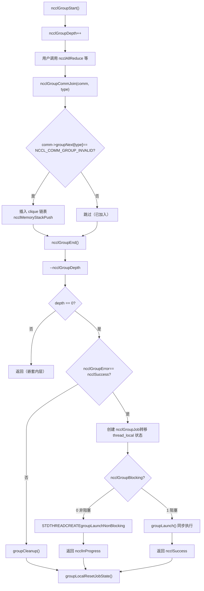
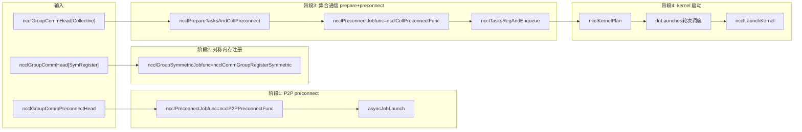

# Chapter 7: Task Scheduler: How task_sched orchestrates multi-channel and kernel execution order

In the previous chapter, we traced ncclAllReduce all the way to ncclTaskColl—the task description object is already sitting in comm->planner. But a task description is only a "work order"; it has not yet become a kernel actually running on the GPU. This chapter answers three questions: How are multiple API calls accumulated and submitted together? How are the accumulated tasks split across multiple channels? What guarantees the order and dependencies among multiple kernels? First, here is an overall mental model. Think of NCCL as a restaurant: ncclGroupStart/ncclGroupEnd is the "shopping cart," where the user puts several dishes (multiple collective communication calls) into the cart; ncclGroupEnd is "placing the order," and only then does the kitchen start cooking according to the order. And doLaunches is the "dish dispatch coordinator," deciding which dishes go out first and which can be prepared in parallel. Without group semantics, each dish is ordered separately, and the kitchen has to relight the fire (launch a kernel) for every dish, which is extremely expensive; without doLaunches' round-based scheduling, multi-channel kernels would launch out of order, breaking data dependencies.

# 1. Global state of group semantics: thread_local variables and the "shopping cart" model

## Intuitive model

`ncclGroupStart`and`ncclGroupEnd`All communication calls between them do not immediately launch kernels, but are "accumulated." Where are they accumulated? They are accumulated in**thread-local (thread_local)**global variables. Why thread_local? Because NCCL assumes that group calls within the same thread are serial, and different threads each have independent shopping carts that do not interfere with each other. If these states were global variables rather than thread_local, two threads calling`ncclGroupStart`at the same time would step on each other, causing one thread's tasks to be submitted by another thread's`ncclGroupEnd`—this would be catastrophic.

## Data structures and memory layout

First look at the global state definition of group.

[FACT:src/group.cc:34-34]

```cpp
thread_local int ncclGroupDepth = 0; // depth of ncclGroupStart nesting
thread_local ncclResult_t ncclGroupError = ncclSuccess;
thread_local struct ncclComm* ncclGroupCommHead[ncclGroupTaskTypeNum] = {nullptr};
thread_local struct ncclComm* ncclGroupCommPreconnectHead = nullptr;
thread_local struct ncclIntruQueue ncclAsyncJobs;
thread_local int ncclGroupBlocking = -1; /* default mode */
```

Breaking down each field one by one:

- **`ncclGroupDepth`**: nesting depth.`ncclGroupStart`can be nested (though uncommon); each time`ncclGroupStart`increments by one,`ncclGroupEnd`decrements by one. Only when it reaches 0 is the submission actually performed. This is like a shopping cart being nestable—you open a sub-cart inside a cart, and only the outermost checkout actually places the order.
- **`ncclGroupError`**: if any call within the group errors, the error is recorded here,`ncclGroupEnd`and handled uniformly at that time. This avoids the inconsistent state where "after one call fails, subsequent calls are still adding things to the shopping cart."
- **`ncclGroupCommHead[ncclGroupTaskTypeNum]`**: head of the communication domain linked list grouped by task type.`ncclGroupTaskTypeNum`is the number of task types (collective communication, raw tasks, management tasks, symmetric registration, etc.). Each type has a linked list, and the list nodes are`ncclComm`, connected through`comm->groupNext[type]`. Why group by type? Because different types of tasks have different submission timing and dependency relationships—collective communication tasks need preconnect first, and management tasks (such as destroy) need to execute last.
- **`ncclGroupCommPreconnectHead`**: linked list of communication domains that need preconnection. Preconnection means "establishing network connections in advance" to avoid latency caused by establishing connections only at kernel launch time.
- **`ncclAsyncJobs`**: asynchronous task queue. Some tasks (such as`ncclCommInitRank`) are asynchronous; they are placed into this queue and uniformly started at`ncclGroupEnd`.
- **`ncclGroupBlocking`**: blocking mode flag.`-1`means not yet determined,`0`means non-blocking,`1`indicates blocking. Mixing blocking and non-blocking communication domains within the same group is not allowed; otherwise, an error will be reported.

There is a key design here:`ncclGroupCommHead`is**array**, and each element is a linked list. The linked list nodes are connected through`comm->groupNext[type]`instead of using a separate linked list node structure. This means that`ncclComm`the struct must reserve`groupNext`an array field. This "intrusive linked list" design avoids additional memory allocation, but the cost is that`ncclComm`the struct becomes larger.

## Scenario-driven Step-by-Step Walkthrough

**Scenario**: The user calls`ncclGroupStart()`, then calls it twice in succession`ncclAllReduce`(for two different communication domains commA and commB respectively), and finally calls`ncclGroupEnd()`。

**Step 1:`ncclGroupStart`What was done?**

[FACT:src/include/group.h:63-66]

```cpp
inline ncclResult_t ncclGroupStartInternal() {
  ncclGroupDepth++;
  return ncclSuccess;
}
```

Extremely simple: increment the depth by one. No memory allocation, no locks, no system calls. This is why`ncclGroupStart`has almost zero overhead.

**Step 2:`ncclAllReduce`What happens when it is called within a group?**

`ncclAllReduce`Internally it will call`ncclGroupCommJoin(comm, ncclGroupTaskTypeCollective)`, adding the communication domain to the group linked list.

[FACT:src/include/group.h:80-116]

```cpp
inline void ncclGroupCommJoin(struct ncclComm* comm, int type) {
  if (comm->groupNext[type] == reinterpret_cast(NCCL_COMM_GROUP_INVALID)) {
    // Insert comm into ncclGroupCommHead adjacent to sibling comms. This preserves
    // the users program order yet insures siblings occur consecutively. This
    // is required by doLaunches() in "group.cc".
    struct ncclComm** pp = &ncclGroupCommHead[type];
    while (*pp != nullptr && comm->intraComm0 != (*pp)->intraComm0) pp = &(*pp)->groupNext[type];

    // didn't find its clique, we need to insert it with ascending order based on commHash
    if (*pp == nullptr) {
      pp = &ncclGroupCommHead[type];
      while (*pp != nullptr && (*pp)->commHash commHash) pp = &(*pp)->groupNext[type];
    }
    comm->groupNext[type] = *pp;
    *pp = comm;
    // Comms gets a new memory stack scope upon joining. Each task batched for
    // this comm is allocated there.
    if (type == ncclGroupTaskTypeCollective || type == ncclGroupTaskTypeRawTask) {
      // Initialize planner
      ncclMemoryStackPush(&comm->memScoped);
      ncclKernelPlanner::Peer* tmp = comm->planner.peers;
      ncclIntruQueue* tmpRmaQueues = comm->planner.rmaTaskQueues;
      int numRmaCtx = comm->config.numRmaCtx;
      memset(&comm->planner, 0, sizeof(comm->planner));
      comm->planner.peers = tmp;
      comm->planner.bcast_info.minBcastPeer = INT_MAX;
      comm->planner.bcast_info.maxBcastPeer = INT_MIN;
      comm->planner.rmaTaskQueues = tmpRmaQueues;
      if (comm->planner.rmaTaskQueues != NULL) {
        for (int i = 0; i planner.rmaTaskQueues[i]);
        }
      }
    }
  }
  ncclGroupBlocking = comm->config.blocking;
}
```

This code has several ingenious aspects:

1. **Idempotency check**：`if (comm->groupNext[type] == NCCL_COMM_GROUP_INVALID)`ensures that the same communication domain is added only once within the same group. If the user calls it twice for the same comm`ncclAllReduce`, the second time it will not be added to the linked list again, but the task will be appended to`comm->planner`.

2. **Clique ordering**：`intraComm0`is the identifier of a "global entity." If multiple communication domains belong to the same global entity (for example, split through`ncclCommSplit`), their`intraComm0`are the same, and they are called a clique. The code first finds the clique by`intraComm0`, and inserts the comm next to its sibling nodes in the same clique. If no clique is found, it inserts in ascending order by`commHash`. This ordering is so that`doLaunches`can correctly handle barrier synchronization within the clique.

3. **Memory stack scope**：`ncclMemoryStackPush(&comm->memScoped)`allocates a new memory stack scope for this comm within the group. All tasks allocated for this comm (`ncclTaskColl`, etc.) are allocated from this stack.`ncclGroupCommLeave`will`ncclMemoryStackPop`release all task memory at once - this is the classic optimization of "batch allocation, batch release," avoiding the overhead of separate`malloc/free`for each task.

4. **Planner reset**：`memset(&comm->planner, 0, sizeof(comm->planner))`clears the planner, but retains the`peers`and`rmaTaskQueues`pointers (first stored in temporary variables, then restored after memset). Why retain them? Because these two are preallocated arrays and do not need to be reallocated each time.`bcast_info`The min/max of are reset to`INT_MAX/INT_MIN`, used for the merge optimization of subsequent broadcast tasks.

**Step 3:`ncclGroupEnd`What was done?**

[FACT:src/group.cc:1039-1164]

`ncclGroupEndInternal`is the core. Parse it section by section:

[FACT:src/group.cc:1048-1061]

```cpp
if (ncclGroupDepth == 0) {
  WARN("ncclGroupEnd: not in a group call.");
  ret = ncclInvalidUsage;
  goto exit;
}
// ...
if ((--ncclGroupDepth) > 0) goto exit;
```

First check the depth, then decrement by one. If after decrementing it is still greater than 0, it means it is still inside a nested inner group, so return directly without submitting. Only when it reaches 0 does it continue.

[FACT:src/group.cc:1063]

```cpp
if ((ret = ncclGroupError) != ncclSuccess) goto fail;
```

If any call within the group has errored, jump directly to fail cleanup.

[FACT:src/group.cc:1084-1093]

```cpp
NEW_NOTHROW_GOTO(groupJob, ncclGroupJob, ret, fail);
ncclIntruQueueConstruct(&groupJob->asyncJobs);
groupJob->groupRefCount = 0;
groupJob->nonBlockingInit = false;
memcpy(groupJob->groupCommHead, ncclGroupCommHead, sizeof(ncclGroupCommHead));
groupJob->groupCommPreconnectHead = ncclGroupCommPreconnectHead;
groupJob->groupError = ncclSuccess;
groupJob->abortFlag = false;
groupJob->joined = false;
ncclIntruQueueTransfer(&groupJob->asyncJobs, &ncclAsyncJobs);
```

Create a`ncclGroupJob`, and "transfer" the thread_local group state into the job object.`ncclIntruQueueTransfer`transfers the entire`ncclAsyncJobs`queue to`groupJob->asyncJobs`. This step is crucial: the thread_local state is "temporary," while the job object is "persistent" and can be held by an asynchronous thread.

[FACT:src/group.cc:1095-1147]

```cpp
if (hasCommHead || !ncclIntruQueueEmpty(&groupJob->asyncJobs) || ncclGroupCommPreconnectHead != nullptr) {
  /* make sure ncclGroupBlocking has been set. */
  if (ncclGroupBlocking != 0 && ncclGroupBlocking != 1) {
    WARN("Invalid group blocking state %d", ncclGroupBlocking);
    ret = ncclInternalError;
    goto fail;
  }
  if (ncclGroupBlocking == 0) {
    /* nonblocking group */
    // ... 设置 async error 为 ncclInProgress，创建线程执行 groupLaunchNonBlocking
    groupJob->base.func = groupLaunchNonBlocking;
    STDTHREADCREATE_GOTO(groupJob->base.thread, ncclAsyncJobMain, ret, fail, &groupJob->base);
    groupJob->nonBlockingInit = true;
    ret = ncclInProgress;
  } else {
    /* blocking group */
    int savedDev;
    CUDACHECKGOTO(cudaGetDevice(&savedDev), ret, fail);
    NCCLCHECKGOTO(groupLaunch(&groupJob->base, internalSimInfoPtr), ret, fail);
    CUDACHECKGOTO(cudaSetDevice(savedDev), ret, fail);
    if (simInfo) memcpy((void*)simInfo, (void*)internalSimInfoPtr, realSize);
    delete groupJob;
  }
} else {
  // Free when not needed (single rank case)
  delete groupJob;
}
```

Blocking mode: directly call`groupLaunch`on the current thread and complete synchronously. Non-blocking mode: create a thread to execute`groupLaunchNonBlocking`, and immediately return`ncclInProgress`. The user subsequently queries progress through`ncclCommGetAsyncError`.

Note the saving and restoring of`cudaGetDevice`/`cudaSetDevice`:`groupLaunch`Internally it will switch the CUDA device (because different comms may be on different GPUs), and after execution restores the user's original device. This is to prevent "NCCL internally switching devices and not switching back" from causing the user's subsequent CUDA calls to run on the wrong device.

## Design Thinking and Production Pitfalls

**Pitfall 1: Mixing blocking and non-blocking communication domains**。`ncclAsyncLaunch`There is a check in:

[FACT:src/group.cc:55-64]

```cpp
/* check if there are blocking and nonblocking comms at the same time in group. */
if (comm->destroyFlag) {
  ncclGroupBlocking = 1;
} else if (ncclGroupBlocking == -1) {
  /* first met communicator */
  ncclGroupBlocking = comm->config.blocking;
} else if (ncclGroupBlocking != comm->config.blocking) {
  WARN("Blocking and nonblocking communicators are not allowed in the same group.");
  ret = ncclInvalidArgument;
}
```

Why is mixing not allowed? Because a blocking group executes synchronously on the current thread, while a non-blocking group executes asynchronously on a separate thread. If mixed, it is impossible to determine whether`ncclGroupEnd`should return synchronously or return`ncclInProgress`. In a production environment, if the user accidentally puts blocking and non-blocking comms into the same group, they will receive`ncclInvalidArgument`, but at this point the group state has already been polluted, and it must be re-`ncclGroupStart`。

**Pitfall 2:`ncclGroupError`propagation.**. If a call within the group fails,`ncclGroupError`is set,`ncclGroupEnd`will jump to the fail branch to execute`groupCleanup`。`groupCleanup`will traverse all comms, release the plan memory in the planner, reset the planner, and clean up rawTaskQueue. If this step is not done cleanly, the next time`ncclGroupStart`the planner will still contain old data, causing duplicate task submission or memory leaks.

[FACT:src/group.cc:514-607]

```cpp
static void groupCleanup(struct ncclComm** groupCommHeadPtr,
                         struct ncclIntruQueue* asyncJobsPtr,
                         ncclResult_t error) {
  struct ncclComm* comm;
  for (int type = 0; type groupNext[type];
      (void)ncclGroupCommLeave(comm, type);
      // We don't know if preconnect succeeded or happened at all, so clear
      // the flags that let `taskAppend()` skip over checking if preconnect
      // is needed.
      if (type == ncclGroupTaskTypeCollective || type == ncclGroupTaskTypeRawTask) {
        comm->preconnectNext = reinterpret_cast(0x1);
        for (int i = 0; i nRanks; i++) {
          comm->connectSend[i] = 0UL;
          comm->connectRecv[i] = 0UL;
        }
        // Reclaim abandoned kernel plan memory.
        while (!ncclIntruQueueEmpty(&comm->planner.planQueue)) {
          struct ncclKernelPlan* plan = ncclIntruQueueDequeue(&comm->planner.planQueue);
          if (!plan->persistent) {
            while (!ncclIntruQueueEmpty(&plan->proxyOpQueue)) {
              struct ncclProxyOp* pxop = ncclIntruQueueDequeue(&plan->proxyOpQueue);
              ncclMemoryPoolFree(&comm->memPool_ncclProxyOp, pxop);
            }
            ncclMemoryPoolFree(&comm->memPool_ncclKernelPlan, plan);
          }
        }
        // Reset comm->planner to empty.
        // ...
      }
      // ...
    }
  }
  // ...
}
```

Note`comm->preconnectNext = reinterpret_cast<struct ncclComm*>(0x1)`this line. This is a "sentinel value," indicating "this comm needs to be preconnected again." Why? Because during cleanup it is unknown whether preconnect succeeded, so the next check is forced to be repeated.`0x1`This value is very clever - it is not a valid pointer, but it can be used as an "uninitialized" marker.`ncclGroupCommPreconnect`Check inside`if (comm->preconnectNext == reinterpret_cast<struct ncclComm*>(0x1))`to determine whether it needs to be added to the preconnect linked list.

---

# 2. Task Preparation:`ncclPrepareTasks`How to Turn Task Descriptions into Schedulable Units

## Intuitive Model

`ncclPrepareTasks`This is the "prep work" phase. The ingredients in the shopping cart (task descriptions) are still raw and need to be washed, cut, and prepared (determining algorithms, protocols, channel partitioning) before they can go into the pot (launching kernels). If you skip this step and launch kernels directly, the kernel won't know how to partition the data or which path to take, and will crash immediately.

## Scenario-Driven Step-by-Step Walkthrough

`ncclPrepareTasks`In`groupLaunchLegacy`is called:

[FACT:src/group.cc:705-746]

```cpp
static ncclResult_t ncclPrepareTasksAndCollPreconnect(
  struct ncclComm* comm, ncclSimInfo_t* simInfo,
  struct ncclIntruQueue* asyncCollJobs) {
  if (ncclParamSingleProcMemRegEnable()) {
    // 单进程内存注册模式：把 prepare 和 preconnect 合并成一个异步 job
    struct ncclPrepareTasksAndCollPreconnectJob* job;
    NEW_NOTHROW(job, ncclPrepareTasksAndCollPreconnectJob);
    job->base.func = ncclPrepareTasksAndCollPreconnectFunc;
    // ...
    ncclIntruQueueEnqueue(asyncCollJobs, &job->base);
  } else {
    bool needConnect = false;
    bool algoNeedConnect[NCCL_NUM_ALGORITHMS];
    memset(algoNeedConnect, 0, sizeof(bool) * NCCL_NUM_ALGORITHMS);

    CUDACHECK(cudaSetDevice(comm->cudaDev));
    NCCLCHECK(ncclPrepareTasks(comm, algoNeedConnect, &needConnect, simInfo));

    if (comm->cuMemSupport && needConnect) {
      // 创建 preconnect job
      struct ncclPreconnectJob* job;
      NEW_NOTHROW(job, ncclPreconnectJob);
      job->base.func = ncclCollPreconnectFunc;
      // ...
      ncclIntruQueueEnqueue(asyncCollJobs, &job->base);
    }
  }
  return ncclSuccess;
}
```

`ncclPrepareTasks`The output is two things:`algoNeedConnect`array (which algorithms need to establish connections) and`needConnect`flag (whether a connection is needed). If`needConnect`is true and cuMem is supported, a preconnect job is created and executed asynchronously.

`ncclPrepareTasks`What does it do internally? It iterates over`comm->planner`tasks, determines the algorithm and protocol for each task, then calls`taskAppend`to append the task to the planner's plan. This logic was covered in the previous chapter and won't be repeated here.

Key points:`ncclPrepareTasks`is**called per comm individually**but preconnect is**executed in batches per clique**Why? See the comments in`groupLaunchLegacy`:

[FACT:src/group.cc:818-834]

```cpp
do {
  // We need to preconnect connections for collectives clique by clique to avoid
  // race condition for split shared comms which can connect the same connections
  // at the same time.
  comm = cliqueHead;
  do {
    NCCLCHECKGOTO(ncclPrepareTasksAndCollPreconnect(comm, simInfo, &asyncCollJobs), ret, fail);
    comm = comm->groupNext[ncclGroupTaskTypeCollective];
  } while (comm != nullptr && comm->intraComm0 == cliqueHead->intraComm0);
  // connect
  NCCLCHECKGOTO(asyncJobLaunch(&asyncCollJobs, groupAbortFlag), ret, fail);
  // ...
  cliqueHead = comm;
} while (cliqueHead != nullptr);
```

The comment explains it clearly:**Preconnect per clique one at a time to avoid split shared comms simultaneously connecting the same set of connections causing races**. If two comms are split from the same parent comm, they may share some connections. If preconnected in parallel, two threads might simultaneously try to establish the same connection, causing duplicate connections or inconsistent connection state. Executing serially per clique ensures only one clique is establishing connections at any given time.

## Concurrency Control and Low-Level Interaction

`asyncJobLaunch`is the core of asynchronous task launching:

[FACT:src/group.cc:609-678]

```cpp
static ncclResult_t asyncJobLaunch(struct ncclIntruQueue* asyncJobsMain,
                                   volatile bool* groupAbortFlag) {
  ncclResult_t ret = ncclSuccess;
  bool jobsDone = false;
  bool errorJobAbortFlag = false;

  if (!ncclIntruQueueEmpty(asyncJobsMain)) {
    struct ncclAsyncJob* job = ncclIntruQueueHead(asyncJobsMain);
    if (job->next == nullptr) {
      // 只有一个 job，直接在当前线程执行，避免线程创建开销
      job->isThreadMain = true;
      ncclAsyncJobMain(job);
      job->state = ncclGroupJobJoined;
      return job->result;
    }
    // 多个 job，每个创建一个线程
    do {
      STDTHREADCREATE(job->thread, ncclAsyncJobMain, job);
      job = job->next;
    } while (job != nullptr);

    do {
      jobsDone = true;
      job = ncclIntruQueueHead(asyncJobsMain);
      do {
        ncclGroupJobState_t state = COMPILER_ATOMIC_LOAD(&job->state, std::memory_order_acquire);
        if (state == ncclGroupJobRunning) {
          jobsDone = false;
        } else if (state == ncclGroupJobDone) {
          int err;
          if ((err = ncclThreadJoin(job->thread)) != ncclSuccess) {
            WARN("asyncJobLaunch: failed to join thread for job");
            ret = ncclSystemError;
          }
          job->state = ncclGroupJobJoined;
          if (job->result != ncclSuccess && ret == ncclSuccess) {
            ret = job->result;
            errorJobAbortFlag = true;
          }
        } else {
          // safety check
          if (state != ncclGroupJobJoined) {
            WARN("Async job state is %d, expected %d", state, ncclGroupJobJoined);
            if (ret == ncclSuccess) ret = ncclInternalError;
            errorJobAbortFlag = true;
          }
        }

        if (!job->destroyFlag &&
            (COMPILER_ATOMIC_LOAD(groupAbortFlag, std::memory_order_acquire) || errorJobAbortFlag == true)) {
          COMPILER_ATOMIC_STORE(job->abortFlag, uint32_t(1), std::memory_order_release);
          COMPILER_ATOMIC_STORE(job->abortFlagDev, uint32_t(1), std::memory_order_release);
          if (job->childAbortFlag) {
            COMPILER_ATOMIC_STORE(job->childAbortFlag, uint32_t(1), std::memory_order_release);
            COMPILER_ATOMIC_STORE(job->childAbortFlagDev, uint32_t(1), std::memory_order_release);
          }
        }

        job = job->next;
      } while (job != nullptr);
      // Let preconnect threads progress.
      if (jobsDone == false) std::this_thread::sleep_for(std::chrono::microseconds(1));
    } while (jobsDone == false);

    if (ret != ncclSuccess) goto fail;
  }

exit:
  return ret;
fail:
  goto exit;
}
```

This code has several key design points:

1. **Single job optimization**: If there's only one job in the queue, no thread is created and it executes directly on the current thread. This avoids the overhead of thread creation and join. For single-comm groups, this is the common case.

2. **Atomic state machine**：`job->state`is an atomic variable with three states:`ncclGroupJobRunning`、`ncclGroupJobDone`、`ncclGroupJobJoined`. After the worker thread finishes execution, it uses`COMPILER_ATOMIC_STORE(..., std::memory_order_release)`to set it to`Done`; the main thread uses`COMPILER_ATOMIC_LOAD(..., std::memory_order_acquire)`to read. The release/acquire pairing guarantees that all memory writes by the worker thread are visible to the main thread.

3. **Busy-wait + micro-sleep**: The main thread polls the status of all jobs. If any job is still running,`sleep_for(1us)`then continues polling. Why use 1 microsecond instead of a condition variable? Because preconnect is a short task (typically tens of microseconds to a few milliseconds), and the wake-up overhead of a condition variable may be greater than busy-waiting. A 1-microsecond sleep avoids CPU waste from pure spinning.

4. **Error propagation and abort**: If any job fails,`errorJobAbortFlag`is set, and all subsequent jobs'`abortFlag`are atomically set to 1. The worker thread checks`abortFlag`during execution, and if aborted, exits early. This is a "fail-fast" mechanism, preventing other jobs from continuing to run foolishly after one job fails.

## Mermaid diagram: control flow of group submission



---

# Three,`doLaunches`: round scheduling for multi-channel multi-kernel

## Intuitive model

`doLaunches`is the "dish delivery dispatcher." The kitchen (GPU) has multiple stoves (channels), and each dish (kernel plan) needs to be served in order. But dishes from different comms may be served in parallel, while dishes from the same comm must be served in order. The dispatcher must ensure: comms within the same clique advance synchronously (using a barrier), while different cliques can advance independently.

## Data structures and memory layout

`doLaunches`The core data structures of`ncclKernelPlan`are`comm->planner.unlaunchedPlansHead`。

[FACT:src/group.cc:427-503]

```cpp
ncclResult_t doLaunches(struct ncclComm* head, int taskType) {
  ncclResult_t result = ncclSuccess;
  struct ncclComm* cliqueHead = head;
  struct ncclComm* cliqueNextHead;
  bool useBarrier = ncclParamLaunchMode == ncclLaunchModeGroup;
  // This outer loop iterates over cliques of comms which are siblings of the
  // same global entity. We calculate a clique as all comms which have the same
  // `intraComm0` value.
  do {
    struct ncclComm* comm = cliqueHead;
    bool capturingYes = false, capturingNo = false;
    do {
      (ncclCudaGraphValid(comm->planner.capturingGraph) ? capturingYes : capturingNo) = true;
      CUDACHECKGOTO(cudaSetDevice(comm->cudaDev), result, failure);
      NCCLCHECKGOTO(ncclLaunchPrepare(comm), result, failure);
      if (useBarrier) ncclCommIntraBarrierIn(comm, 1);
      comm = comm->groupNext[taskType];
    } while (comm != nullptr && comm != reinterpret_cast(NCCL_COMM_GROUP_INVALID) &&
             comm->intraComm0 == cliqueHead->intraComm0);
    cliqueNextHead = comm;

    if (capturingYes && capturingNo) {
      // We have entered barriers but are aborting without leaving them. Thus
      // these comms are permanently trashed. We need a good mechanism for
      // tracking and reporting that.
      WARN("Either none or all communicators in a ncclGroup() can be CUDA graph captured.");
      result = ncclInvalidUsage;
      goto failure;
    }

    while (true) {
      // Iterate rounds of launches for clique.
      bool moreRounds = false;
      comm = cliqueHead;
      do {
        // Iterate clique members.
        struct ncclComm* next = comm->groupNext[taskType];
        if (useBarrier) {
          // Barrier reduction result tells us if this was the final round.
          moreRounds = 0 != ncclCommIntraBarrierOut(comm);
        } else {
          moreRounds |= comm->planner.unlaunchedPlansHead != nullptr;
        }
        if (moreRounds) {
          // Pop next unlaunched kernel
          struct ncclKernelPlan* plan = comm->planner.unlaunchedPlansHead;
          if (plan != nullptr) {
            comm->planner.unlaunchedPlansHead = plan->next;
            CUDACHECKGOTO(cudaSetDevice(comm->cudaDev), result, failure);
            NCCLCHECKGOTO(ncclLaunchKernelBefore_NoUncapturedCuda(comm, plan), result, failure);
            if (plan->isCeColl) {
              NCCLCHECKGOTO(ncclLaunchCeColl(comm, plan), result, failure);
            } else if (plan->isRma) {
              NCCLCHECKGOTO(ncclLaunchRma(comm, plan), result, failure);
            } else {
              NCCLCHECKGOTO(ncclLaunchKernel(comm, plan), result, failure);
            }
          }
          // Barrier reduction input indicates if we require further rounds.
          if (useBarrier) ncclCommIntraBarrierIn(comm, comm->planner.unlaunchedPlansHead != nullptr ? 1 : 0);
          if (plan != nullptr) {
            NCCLCHECKGOTO(ncclLaunchKernelAfter_NoCuda(comm, plan), result, failure);
          }
        } else {
          // Final round.
          CUDACHECKGOTO(cudaSetDevice(comm->cudaDev), result, failure);
          NCCLCHECKGOTO(ncclLaunchFinish(comm), result, failure);
        }
        comm = next;
      } while (comm != reinterpret_cast(NCCL_COMM_GROUP_INVALID) && comm != cliqueNextHead);
      if (!moreRounds) break;
    }
    cliqueHead = cliqueNextHead;
  } while (cliqueHead != nullptr && cliqueHead != reinterpret_cast(NCCL_COMM_GROUP_INVALID));
failure:
  return result;
}
```

## Copy

**Scenario-Driven Step-by-Step Walkthrough**Scenario`intraComm0`: Two comms (commA and commB) belong to the same clique (

**are the same), and each comm has 3 kernel plans pending launch.**

First-level loop: iterate over cliques`do-while`The outer`cliqueHead`iterates over all cliques.`do-while`is the first comm of the current clique. The inner`comm->intraComm0 == cliqueHead->intraComm0`）。

iterates over all comms in the clique (

- `cudaSetDevice(comm->cudaDev)`For each comm:
- `ncclLaunchPrepare(comm)`: Switch to the GPU corresponding to that comm.
- `ncclCommIntraBarrierIn(comm, 1)`: Prepare for launch, including setting up the CUDA stream, checking resources, etc.

**: Enter the barrier, with an initial value of 1.**

`while (true)`Second-level loop: round scheduling

The loop executes "rounds." In each round, each comm in the clique launches one kernel plan.`moreRounds`The key is in the computation of

- **:**（`useBarrier == true`）：`moreRounds = 0 != ncclCommIntraBarrierOut(comm)`。`ncclCommIntraBarrierOut`With barrier mode**is a**cross-comm barrier reduction operation`ncclCommIntraBarrierIn`. It waits for all comms in the clique to call`moreRounds`, then returns the reduction result of all input values (here, logical OR). If any comm still has unlaunched plans, the reduction result is 1,`moreRounds`is true, and the next round continues. If all comms have no unlaunched plans, the reduction result is 0,
- **is false, and it enters the final round.**：`moreRounds |= comm->planner.unlaunchedPlansHead != nullptr`. Directly check whether each comm still has an unstarted plan. Note that here it uses`|=`, as long as one comm still has a plan,`moreRounds`is true.

Why is a barrier needed? Because the comms within a clique are "siblings"; they may share GPU resources or network connections. If one comm launches 3 kernels and another launches only 1, the comm that finishes launching first will enter`ncclLaunchFinish`, release resources, while the other comm is still using these resources, causing a use-after-free. The barrier ensures that all comms within the clique advance synchronously: either they all launch round N, or they all enter the final round.

**Kernel launch branch**

[FACT:src/group.cc:477-483]

```cpp
if (plan->isCeColl) {
  NCCLCHECKGOTO(ncclLaunchCeColl(comm, plan), result, failure);
} else if (plan->isRma) {
  NCCLCHECKGOTO(ncclLaunchRma(comm, plan), result, failure);
} else {
  NCCLCHECKGOTO(ncclLaunchKernel(comm, plan), result, failure);
}
```

Three plan types:

- `isCeColl`: CollNet collective communication (using NIC offload for collective communication).
- `isRma`: RMA (Remote Memory Access) tasks.
- Default: normal GPU kernel.

Each type has a different launch function, but all follow the "Before -> Launch -> After" pattern:

- `ncclLaunchKernelBefore_NoUncapturedCuda`: preparation before launch (setting kernel parameters, uploading to device, etc.).
- `ncclLaunchKernel`: actually launch the kernel (`cudaLaunchKernel`）。
- `ncclLaunchKernelAfter_NoCuda`: cleanup after launch (updating state, releasing temporary resources).

**Final round**

When`moreRounds`is false, execute`ncclLaunchFinish(comm)`. This step performs final cleanup: freeing plan memory, updating comm state, notifying the proxy thread, etc.

## Concurrency control and hardware interaction

`ncclCommIntraBarrierIn/Out`is the synchronization primitive for comms within a clique. Its implementation involves atomic operations and spin-waiting.`In`writes the value to shared memory,`Out`waits for all comms to write before reading the reduction result. This barrier is**cross-process**(if the comms are in different processes), and the underlying implementation may use shared memory or the network.

Why use a barrier instead of simply "checking whether all comms still have plans"? Because "checking" is non-atomic: when commA checks, commB still has a plan, so commA decides to continue; but commB immediately finishes launching its last plan after commA's check and enters the final round. commA is still launching kernels, while commB has already released shared resources. The barrier turns "checking" and "deciding" into a single atomic operation, eliminating this race.

## Production Pitfall Guide

**Pitfall 1: Mixing CUDA graph capture**。

[FACT:src/group.cc:448-455]

```cpp
if (capturingYes && capturingNo) {
  // We have entered barriers but are aborting without leaving them. Thus
  // these comms are permanently trashed. We need a good mechanism for
  // tracking and reporting that.
  WARN("Either none or all communicators in a ncclGroup() can be CUDA graph captured.");
  result = ncclInvalidUsage;
  goto failure;
}
```

If some comms within a clique are in CUDA graph capture mode and others are not, it directly errors out. The comment says "these comms are permanently trashed" — because they have entered the barrier but not exited, the barrier states of these comms will forever be inconsistent, and they can no longer be used afterward. This is an**unrecoverable error**, and the user must rebuild the communication domain. In production, if a user mixes graph-capture and non-capture comms, they will receive`ncclInvalidUsage`, but more seriously, the comm is already corrupted.

**Pitfall 2:`useBarrier`configuration dependency**。`useBarrier = ncclParamLaunchMode == ncclLaunchModeGroup`. If the user sets`NCCL_LAUNCH_MODE=GROUP`, the barrier path is taken; otherwise, the non-barrier path is taken. Under the non-barrier path,`moreRounds`uses`|=`to accumulate, but each comm decides independently. If commA still has a plan while commB does not, commB will enter the final round and execute`ncclLaunchFinish`, while commA is still launching kernels. This is safe in some scenarios (there are no shared resources between comms), but if proxy threads or network connections are shared, it may cause problems. Therefore, barrier mode is recommended by default.

---

# IV.`groupLaunchLegacy`'s complete execution chain

## Scenario-driven Step-by-Step Walkthrough

`groupLaunchLegacy`is the complete submission process in blocking mode. Execute in order:

**Phase 1: P2P preconnect**

[FACT:src/group.cc:756-774]

```cpp
if (!simInfo && groupCommPreconnectHeadMain != nullptr) {
  struct ncclComm* comm = groupCommPreconnectHeadMain;
  do {
    struct ncclPreconnectJob* job;
    NEW_NOTHROW_GOTO(job, ncclPreconnectJob, ret, fail);
    job->base.func = ncclP2PPreconnectFunc;
    // ...
    ncclIntruQueueEnqueue(asyncJobsMain, (struct ncclAsyncJob*)job);
    struct ncclComm* next = comm->preconnectNext;
    comm->preconnectNext = reinterpret_cast(0x1);
    comm = next;
  } while (comm != nullptr);
}
NCCLCHECKGOTO(asyncJobLaunch(asyncJobsMain, groupAbortFlag), ret, fail);
```

For each comm that needs preconnect, create a`ncclP2PPreconnectFunc`job, then launch them in batches.`ncclP2PPreconnectFunc`internally calls`ncclTransportP2pSetup`to establish the P2P connection.

**Phase 2: Symmetric memory registration**

[FACT:src/group.cc:778-808]

```cpp
// only loop through sym alloc and register tasks
for (int type = ncclGroupTaskTypeSymRegister; type destroyFlag && job->comm && !job->comm->config.blocking &&
      groupCommHeadMain[ncclGroupTaskTypeCollective] == nullptr) {
    (void)ncclCommSetAsyncError(job->comm, ret);
  }
  if (job->destructor) job->destructor((void*)job);
}

for (int type = 0; type groupNext[type];
    // Poll for callbacks sent to us from other threads.
    if (comm->reclaimSteps == GROUP_MAX_RECLAIM_STEPS) {
      NCCLCHECKGOTO(ncclCommPollCallbacks(comm, /*waitSome=*/false), ret, fail);
      comm->reclaimSteps = 0;
    } else {
      comm->reclaimSteps++;
    }
    (void)ncclGroupCommLeave(comm, type);
    if (!comm->config.blocking) {
      (void)ncclCommSetAsyncError(comm, ret);
    }
    groupCommHeadMain[type] = next;
  }
}
```

Clean up asynchronous jobs, then iterate over all comms and call`ncclGroupCommLeave`. Note the count of`reclaimSteps`: every`GROUP_MAX_RECLAIM_STEPS`(10) group calls, poll callbacks once. This is to avoid the overhead of polling callbacks on every group, while ensuring callbacks do not accumulate indefinitely.

## Mermaid diagram:`groupLaunchLegacy`data flow of



---

# V.`groupLaunchEnqueueRearch`: The new architecture scheduler

## Intuitive model

`groupLaunchEnqueueRearch`is the new scheduling architecture being developed by NCCL. It divides task preparation, scheduling, and launch into finer stages, managed with an asynchronous job queue. Currently, the scheduler and launcher modules are "not yet implemented," falling back to legacy`doLaunches`。

[FACT:src/group.cc:991-996]

```cpp
// Schedule and launch tasks. Scheduler and launcher module of the enqueue framework
// is not yet implemented and falls back to the legacy launcher: a single phased
// doLaunches over the clique, run here on the user's thread.
if (!simInfo && groupCommHeadMain[ncclGroupTaskTypeRawTask] != nullptr) {
  NCCLCHECKGOTO(doLaunches(groupCommHeadMain[ncclGroupTaskTypeRawTask], ncclGroupTaskTypeRawTask), ret, fail);
}
```

Execution flow of the new architecture:

1. **Manage tasks**：`ncclMgmtTaskJobFunc`Handle`mgmtTaskQueue`tasks in (such as destroy).

2. **Task preparation**：`ncclTaskPrepareJobFunc`Call`ncclTaskPrepare`。

3. **Scheduling and launch**: Fall back to`doLaunches`。

The new architecture uses`ncclGroupJobLaunch`instead of`asyncJobLaunch`, adding stricter state checks:

[FACT:src/group.cc:113-116]

```cpp
} else {
  /* safety check */
  assert(state == ncclGroupJobJoined);
}
```

The legacy version uses`WARN`instead of`assert`, while the new architecture uses`assert`. This indicates that the new architecture has higher requirements for state machine correctness.

## Design considerations

The motivation for the new architecture is**decoupling**: The legacy`groupLaunchLegacy`crams all stages into one function, making it difficult to maintain and extend. The new architecture splits each stage into independent job types, connected through a queue. However, the scheduler and launcher are not yet implemented, so it is currently "framework first."

`ncclParamEnqueueRearchEnable()`controls whether to use the new architecture or legacy:

[FACT:src/group.cc:1031-1033]

```cpp
static ncclResult_t groupLaunch(struct ncclAsyncJob* job_, ncclSimInfo_t* simInfo = NULL) {
  return ncclParamEnqueueRearchEnable() ? groupLaunchEnqueueRearch(job_, simInfo) : groupLaunchLegacy(job_, simInfo);
}
```

Users can switch via the environment variable`NCCL_ENQUEUE_REARCH_ENABLE`. For production environments, it is recommended to keep the default (legacy), because the new architecture is still under development.

---

# VI. Non-blocking group and asynchronous error handling

## Scenario-driven Step-by-Step Walkthrough

The core of non-blocking group is`ncclGroupJobComplete`and`ncclGroupJobAbort`：

[FACT:src/group.cc:1166-1190]

```cpp
ncclResult_t ncclGroupJobComplete(struct ncclGroupJob* groupJob) {
  ncclResult_t ret = ncclSuccess;
  if (groupJob && groupJob->nonBlockingInit) {
    if (!COMPILER_ATOMIC_EXCHANGE(&groupJob->joined, true, std::memory_order_acq_rel)) {
      ret = ncclAsyncJobComplete(&groupJob->base);
    }
    if (ncclAtomicRefCountDecrement(&groupJob->groupRefCount) == 0) {
      delete groupJob;
    }
  }
  return ret;
}

ncclResult_t ncclGroupJobAbort(struct ncclGroupJob* groupJob) {
  if (groupJob && groupJob->nonBlockingInit) {
    if (!COMPILER_ATOMIC_EXCHANGE(&groupJob->joined, true, std::memory_order_acq_rel)) {
      COMPILER_ATOMIC_STORE(&groupJob->abortFlag, true, std::memory_order_relaxed);
      ncclAsyncJobComplete(&groupJob->base);
    }
    if (ncclAtomicRefCountDecrement(&groupJob->groupRefCount) == 0) {
      delete groupJob;
    }
  }
  return ncclSuccess;
}
```

Key design:

1. **`joined`Atomic flag**: Use`COMPILER_ATOMIC_EXCHANGE`to ensure only one thread can execute the join logic. If two threads call`ncclGroupJobComplete`at the same time, only one will actually join, and the other will skip directly. This prevents double-join.

2. **Reference counting**：`groupRefCount`records how many comms are associated with this group job. Each comm increments the reference count in`ncclGroupEndInternal`:

[FACT:src/group.cc:1108-1111]

```cpp
if (job->comm->groupJob == NULL) {
  job->comm->groupJob = groupJob;
  groupJob->groupRefCount++;
}
```

Only when all comms have called`ncclGroupJobComplete`or`ncclGroupJobAbort`, and the reference count drops to 0, is the group job deleted. This ensures that the group job's lifetime covers all associated comms.

3. **abort semantics**：`ncclGroupJobAbort`first sets`abortFlag`, then joins. The worker thread checks`abortFlag`during execution, and if it finds it has been aborted, exits early. This is "cooperative cancellation" — not forcibly killing the thread, but letting the thread check the flag and exit on its own.

## Production Pitfall Guide

**Pitfall 3: Error querying for non-blocking group**. Non-blocking group returns`ncclInProgress`, and the user needs to query progress through`ncclCommGetAsyncError`. If the user forgets to query and directly calls the next communication, they may encounter`ncclInProgress`errors. More seriously, if the group job is still running and the user calls`ncclCommDestroy`, it will cause use-after-free. NCCL prevents this through`comm->groupJob`pointers and reference counting:`ncclCommDestroy`will first check`comm->groupJob`, and if there is an unfinished group job, it will wait or report an error.

**Pitfall 4:`ncclGroupJobComplete`return value of**. If the group job execution fails,`ncclAsyncJobComplete`returns an error code. But`ncclGroupJobComplete`only returns this error code on the first call, and subsequent calls return`ncclSuccess`(because`joined`is already true). The user must check the return value on the first call, otherwise the error information will be lost.

---

# Chapter Summary

In this chapter, we broke down NCCL's complete scheduling chain from "task description" to "kernel launch":

1. **Group semantics**：`ncclGroupStart/ncclGroupEnd`accumulate tasks through thread_local variables,`ncclGroupEnd`and submit them uniformly at . Blocking mode executes synchronously, while non-blocking mode creates a thread for asynchronous execution.

2. **Task preparation**：`ncclPrepareTasks`determines the algorithm/protocol,`ncclPrepareTasksAndCollPreconnect`and preconnects one by one by clique to avoid races in split comms.

3. **Round scheduling**：`doLaunches`groups by clique, uses a barrier to synchronize comms within the clique, and launches one kernel plan per round until all plans have been launched.

4. **Asynchronous tasks**：`asyncJobLaunch`use an atomic state machine and busy waiting to manage asynchronous jobs, supporting fast failure and abort.

5. **New architecture**：`groupLaunchEnqueueRearch`is a new scheduling framework under development, currently falling back to legacy`doLaunches`。

The next chapter will enter the last mile of kernel launch:`ncclLaunchKernel`how to turn`ncclKernelPlan`into a kernel actually executed on the GPU, and how the device side reads`DevComm`metadata.

# Chapter Reflection and Self-Test

Q1: If`ncclGroupCommJoin`in`ncclMemoryStackPush(&comm->memScoped)`is removed, what will happen? In what scenarios will it cause memory leaks or data corruption?

**Reference analysis**：`ncclMemoryStackPush`for comm in group

At this point, the task description has become an executable launch plan: group semantics merge multiple API calls into a single submission, channel partitioning distributes tasks across multiple execution streams, and doLaunches' round scheduling ensures ordering and dependencies between kernels. But a plan is still just a plan—how does the host-side task description become a grid on the GPU? In the next chapter, we will dive into ncclLaunchKernel to see parameter preparation, kernel variant selection, and the cudaLaunchKernel call, completing the final leap from host to device.
