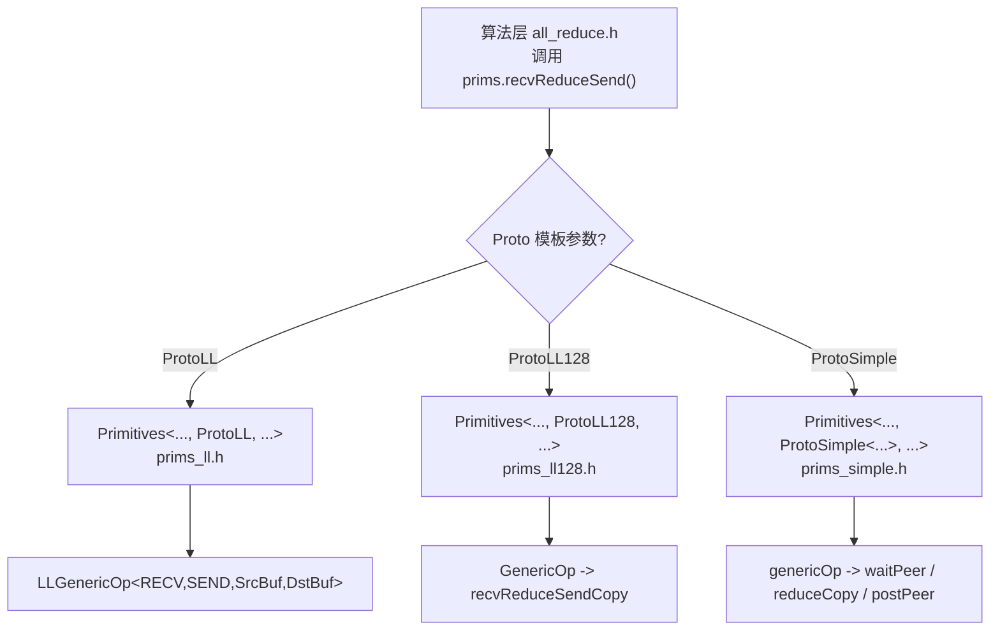
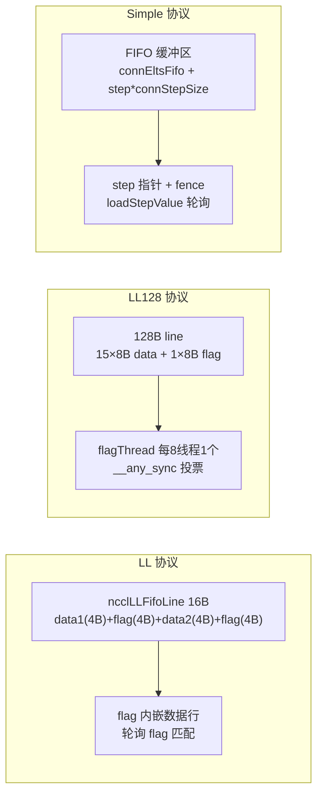

# Chapter 09: Device Primitives: Data Transport in LL, LL128 & Simple Protocols


上一章我们追踪了 host 侧如何将一次 AllReduce 翻译成 __global__ kernel，并看到设备侧入口 ncclKernelMain 根据算法与协议完成分发。但分发只是选定了工具，真正决定性能的是这些工具如何执行数据搬运。本章深入 src/device 下的三套搬运原语：LL、LL128 和 Simple，逐一剖析它们的数据搬运实现，理解不同协议在延迟与带宽之间的取舍。

## 为什么同一份 AllReduce 需要三套搬运原语

先建立一个Intuitive Architectural Model。想象一条流水线工厂：原料（用户数据）从一端进，成品从另一端出，中间有若干工位（rank）要互相交换半成品。搬运半成品的方式有三种：

- **LL（Low Latency）**：像两个人面对面递纸条，递过去的同时对方就知道「这是给你的」，几乎零握手开销。但纸条很小，一次只能递 8 字节有效数据。适合小消息。
- **LL128**：把纸条换成 128 字节的便签纸，一次递 120 字节有效数据，但要求便签纸必须 16 字节对齐摆放，否则要先在共享内存里「重新排版」。适合中等消息。
- **Simple**：像快递柜，先把包裹放进柜子（FIFO 缓冲区），再发一条「第 N 号柜有货」的通知。握手开销大，但一次能搬很多。适合大消息。

[INFERENCE] 如果只有一套原语会怎样？只用 LL，大消息会因为「每条消息都要等对方确认 flag」而把带宽压死；只用 Simple，小消息会因为「写 FIFO + 发通知 + 等通知」的固定开销而延迟爆炸。NCCL 的性能曲线之所以在 8KB、128KB 附近有明显的拐点，根源就在这里。

三套原语共享同一个模板骨架 `Primitives<T, RedOp, Fan, Direct, Proto, P2p, isNetOffload>`，通过 `Proto` 这个模板参数特化出三个版本 [FACT:src/device/primitives.h:117-117]。`ProtoLL`、`ProtoLL128`、`ProtoSimple` 三个结构体各自携带协议相关的常量与计算方法 [FACT:src/device/primitives.h:25-75]，算法代码只调用 `prims.send()`、`prims.recvReduceSend()` 这类统一接口，不关心底层是哪种协议。



这张图说明了「同一份 AllReduce 逻辑为什么需要三套搬运原语」：算法层是协议无关的，协议差异被封装在 `Primitives` 的三个特化里。

## LL：用 flag 内嵌在数据行里的零握手搬运

### Intuitive Architectural Model

LL 的核心思想是：**把「数据」和「数据是否就绪」的标记塞进同一个 16 字节的读写单元**。接收方不需要额外的「通知消息」，只要轮询数据行里的 flag 字段，flag 匹配就说明数据到了。这就像寄信时把「收件人签名」直接印在信封上，邮递员一看签名就知道该不该投递，不需要另发一张签收单。

如果没有这个设计，接收方就得先等一个「数据已写入」的通知，再回头读数据，两次内存往返，延迟翻倍。

### Data Structures & Memory Layout

LL 的搬运单元是 `union ncclLLFifoLine`，从 `storeLL` 的汇编可以看出它的布局 [FACT:src/device/prims_ll.h:154-158]：

```
st.volatile.global.v4.u32 [%0], {%1,%2,%3,%4};
// 写入 4 个 u32：data1, flag, data2, flag
```

一个 `ncclLLFifoLine` 是 16 字节，排布为 `[data1(4B) | flag(4B) | data2(4B) | flag(4B)]`。有效数据只有 8 字节（data1 + data2），另外 8 字节全是 flag。这就是 `ProtoLL::calcBytePerGrain()` 返回 `sizeof(uint64_t)` 的原因——「One 16-byte line has 8-bytes of data」[FACT:src/device/primitives.h:55-57]。

关键字段（`Primitives` 的 LL 特化）[FACT:src/device/prims_ll.h:20-42]：

| 字段 | 类型 | 作用 |
|------|------|------|
| `recvStep[i]` / `sendStep[i]` | `uint64_t[MaxRecv/MaxSend]` | 每个 peer 的步进计数，决定缓冲区偏移和 flag 值 |
| `recvBuff[i]` / `sendBuff[i]` | `ncclLLFifoLine*` | 指向每个 peer 的 FIFO 缓冲区基址 |
| `recvConnHeadPtr` | `volatile uint64_t*` | 接收侧「已消费到第几步」的全局指针 |
| `sendConnHeadPtr` | `volatile uint64_t*` | 发送侧「对端已消费到第几步」的全局指针 |
| `sendConnHeadCache` | `uint64_t` | 缓存上次读到的 head 值，避免每次都读全局内存 |

缓冲区偏移由 `recvOffset(i) = (recvStep[i] % NCCL_STEPS) * stepLines` 计算 [FACT:src/device/prims_ll.h:44-46]，`NCCL_STEPS` 是环形缓冲区的槽位数，`stepLines` 是每槽的行数。flag 值由 `recvFlag(i) = NCCL_LL_FLAG(recvStep[i] + 1)` 计算 [FACT:src/device/prims_ll.h:56-58]，注意 `+1`——因为 flag 初值是 0，第一步的 flag 必须是 1 才能和「未写入」区分开。

### 场景驱动 Walkthrough：一次 recvReduceSend

假设 rank 0 在 Ring AllReduce 中执行 `recvReduceSend`：从上一个 rank 收数据、和本地数据做 reduce、再发给下一个 rank。调用链是 `recvReduceSend(inpIx, eltN)` → `LLGenericOp<1, 1, Input, -1>(inpIx, -1, eltN, false)` [FACT:src/device/prims_ll.h:403-405]。

**第一步：等待发送缓冲区可用。** `waitSend` 检查 `sendConnHeadCache + NCCL_STEPS < sendConnHead + 1` [FACT:src/device/prims_ll.h:73-89]。含义是：如果对端消费进度（head）落后我太多，说明环形缓冲区快满了，必须等。`NCCL_STEPS` 是缓冲区总槽数，`sendConnHead + 1` 是我即将占用的槽位。等待时轮询 `*sendConnHeadPtr` 更新缓存，并周期性调用 `checkAbort` 检查是否被 abort [FACT:src/device/prims_ll.h:73-89]。

**第二步：加载本地数据。** `DataLoader::loadBegin` 处理对齐问题 [FACT:src/device/prims_ll.h:200-216]。当 `sizeof(T) <= 2`（比如 half 或 int8），源地址可能不是 4 字节对齐，所以先按 4 字节对齐读入 `u4[0..2]`，记录 `misalign`，然后在 `loadFinish` 里用 `__funnelshift_r` 做字节级移位拼出正确的 64 位值 [FACT:src/device/prims_ll.h:218-225]。这是一个典型的「对齐读 + 移位重组」技巧，避免了非对齐访问的性能惩罚。

**第三步：读对端数据并等 flag。** `readLL` 是核心 [FACT:src/device/prims_ll.h:108-122]：

```cpp
do {
  asm volatile("ld.volatile.global.v4.u32 {%0,%1,%2,%3}, [%4];" ...);
  if (checkAbort(abort, 1, spins)) break;
} while ((flag1 != flag) || (flag2 != flag));
```

它用 `ld.volatile.global.v4.u32` 一次性读 16 字节（4 个 u32），然后检查两个 flag 字段是否都等于期望值。`volatile` 关键字确保编译器不会把这个读优化掉或缓存到寄存器——因为对端可能随时写入新数据。两个 flag 都要匹配，是因为写入方 `storeLL` 一次写 4 个 u32，理论上可能被拆成两次 8 字节写，两个 flag 都匹配才能保证 16 字节完整。

**第四步：reduce 并发送。** 收到 peerData 后，`applyReduce(redOp, peerData, data)` 做归约 [FACT:src/device/prims_ll.h:279]。然后 `storeLL(sendPtr(i) + offset, data, sendFlag(i))` 把结果写入发送缓冲区 [FACT:src/device/prims_ll.h:295-296]。注意发送顺序：先发 `i=1..MaxSend`（通常是网络 peer），最后发 `i=0`（通常是本地 peer）[FACT:src/device/prims_ll.h:291-297]。注释写得很清楚：「Send : inter-node, then intra-node, then local」——先发慢的（网络），让它在后台飞，再发快的（本地），这样本地 peer 不会等网络。

**第五步：推进 step 并 post。** `incRecv(i)` 递增接收步进 [FACT:src/device/prims_ll.h:91-93]，`postRecv()` 把 `recvConnHead` 写回全局指针 [FACT:src/device/prims_ll.h:94-97]，通知对端「我已经消费了这一步」。发送侧 `incSend` 有个特殊逻辑 [FACT:src/device/prims_ll.h:99-106]：

```cpp
if ((sendStep[i] & NCCL_LL_CLEAN_MASK) == NCCL_LL_CLEAN_MASK) {
  for (int o = offset; o < stepLines; o += nthreads) storeLL(sendPtr(i) + o, 0, sendFlag(i));
}
```

当 step 到达 `NCCL_LL_CLEAN_MASK` 边界时，要把整个 slice 的所有行都用当前 flag 写一遍（数据填 0）。为什么？因为 flag 是循环复用的，如果某一行上次的 flag 恰好等于这次的期望值，接收方会误以为数据已就绪。这个「cleanup」操作把所有行的 flag 统一刷成新值，消除歧义。

### 并发控制与硬件交互

LL 的同步完全靠 `volatile` 读写 + flag 轮询，没有锁。`barrier()` 用 `__syncwarp()`（单 warp 时）或 `barrier_sync(15 - group, nthreads)`（多 warp 时）[FACT:src/device/prims_ll.h:63-69]。`15 - group` 是 barrier 编号，NCCL 用不同的 barrier 编号隔离不同的 group，避免相互干扰。

`checkAbort` 是防死循环的关键 [FACT:src/device/primitives.h:154-164]：每 `NCCL_SPINS_BEFORE_CHECK_ABORT`（10000）次自旋才读一次 `abortFlag`，避免频繁读全局内存拖慢热路径。一旦发现 abort，设置 `ncclShmem.aborted` 并缓存，后续所有等待循环都会快速退出。

### 生产踩坑

**坑 1：flag 回绕导致的假就绪。** 如果 `NCCL_LL_CLEAN_MASK` 的 cleanup 逻辑被去掉，在长时间运行（step 超过 mask 周期）后，接收方可能读到上一轮残留的 flag，误判数据就绪，读到脏数据。这类 bug 极难复现，因为它依赖 step 恰好回绕到特定值。

**坑 2：`MaxRecv == 0` 的编译陷阱。** 代码里 `MaxRecv = Fan::MaxRecv > 1 ? Fan::MaxRecv : 1` [FACT:src/device/prims_ll.h:13]，因为即使只发不收，也会分配一个长度为 MaxRecv 的接收缓冲区，如果 MaxRecv 是 0 会导致零长度数组编译失败。Windows 上 `MaxSend` 也有同样处理 [FACT:src/device/prims_ll.h:14-19]。

## LL128：用 128 字节对齐换取更高有效载荷

### Intuitive Architectural Model

LL 的痛点是有效载荷只有 50%（16 字节里 8 字节是 flag）。LL128 的思路是：**把 flag 集中到每 128 字节的最后 8 字节，前面 120 字节全是数据**。这样有效载荷从 50% 提升到 93.75%。代价是必须保证 128 字节对齐，否则要做「共享内存重排版」。

### Data Structures & Memory Layout

LL128 的搬运单元是 `uint64_t`（8 字节），但组织成 128 字节的「line」。`NCCL_LL128_LINEELEMS` 是每 line 的 64 位元素数（16 个），`NCCL_LL128_DATAELEMS` 是其中数据元素数（15 个），最后一个元素放 flag。

关键常量 [FACT:src/device/prims_ll128.h:292-294]：

```cpp
static constexpr int WireWordPerSlice = WARP_SIZE * NCCL_LL128_SHMEM_ELEMS_PER_THREAD;
static constexpr int DataEltPerSlice =
  (WireWordPerSlice - WireWordPerSlice / NCCL_LL128_LINEELEMS) * (sizeof(uint64_t) / sizeof(T));
```

`WireWordPerSlice` 是一个 warp 一次搬运的 64 位字数，`DataEltPerSlice` 是其中有效数据元素数（减去每 line 一个 flag 元素）。

LL128 的 flag 机制和 LL 不同：**只有每 8 个线程中的第 7 个（`flagThread`）负责检查 flag** [FACT:src/device/prims_ll128.h:373]。`flagThread = ((tid % 8) == 7)`。为什么？因为 flag 是每 128 字节一个，而一个 warp 有 32 个线程，每 8 个线程处理 128 字节（8 线程 × 16 字节 = 128 字节），所以每 8 个线程里只有 1 个需要读 flag。

### 场景驱动 Walkthrough：一次 recvReduceSendCopy

调用链：`recvReduceSend(inpIx, eltN)` → `GenericOp<1, 1, Input, -1>` → `recvReduceSendCopy<NCCL_LL128_SHMEM_ELEMS_PER_THREAD, RECV, SEND, SrcBuf, DstBuf>` [FACT:src/device/prims_ll128.h:422-423, 296-333]。

**第一步：加载本地数据到寄存器。** `loadRegsBegin` 分两种情况 [FACT:src/device/prims_ll128.h:99-142]：

- **16 字节对齐**：直接 `load128` 到寄存器，无共享内存中转。注意 `flagThread` 只加载一半数据（`g % 2 == 0`），因为它的另一半寄存器要留给 flag [FACT:src/device/prims_ll128.h:109-114]。
- **非对齐**：先把对齐区域加载到共享内存 `ncclScratchForWarp(warpInBlock)`，`__syncwarp()` 后从共享内存按正确偏移读回寄存器 [FACT:src/device/prims_ll128.h:115-141]。

**第二步：等待并读取对端数据。** `recvReduceSendCopy` 里的等待循环 [FACT:src/device/prims_ll128.h:190-207]：

```cpp
do {
  needReload = false;
  for (int u = 0; u < ELEMS_PER_THREAD; u += 2) {
    load128(ptr + u * WARP_SIZE, vr[u], vr[u + 1]);
    needReload |= flagThread && (vr[u + 1] != flag);
  }
  needReload &= (0 == checkAbort(abort, 1, spins));
} while (__any_sync(WARP_MASK, needReload));
```

关键点：只有 `flagThread` 检查 flag，然后用 `__any_sync` 做 warp 级投票——只要有一个 flagThread 发现 flag 不匹配，整个 warp 继续自旋。这比每个线程都检查 flag 更省指令。

**第三步：寄存器重排。** `loadRegsFinish` 把 flagThread 的 flag 寄存器移到空闲寄存器 [FACT:src/device/prims_ll128.h:145-151]。注释解释了这个设计：「By deferring register shuffle here we've overlapped spinning on first peer's data with memory loads of src data」——把寄存器重排推迟到等待之后，让等待时间和本地数据加载重叠。

**第四步：reduce 并发送。** 收到数据后做 `applyReduce` [FACT:src/device/prims_ll128.h:227-230]，然后 `store128` 写入发送缓冲区 [FACT:src/device/prims_ll128.h:274-287]。注意发送时 `flagThread ? flag : v[u+1]`——flagThread 写 flag，其他线程写数据。

**第五步：推进 step。** 和 LL 不同，LL128 的 step 推进在 `GenericOp` 末尾统一做 [FACT:src/device/prims_ll128.h:324-332]，而不是在 `recvReduceSendCopy` 里。而且 `postSend` 用了 `__threadfence_system()`（SM90+）或 `__threadfence()` [FACT:src/device/prims_ll128.h:87-96]，确保数据对其他 GPU/网卡可见后才更新 tail 指针。

### 并发控制与硬件交互

LL128 的 `barrier()` 总是用 `barrier_sync(15 - group, nthreads)` [FACT:src/device/prims_ll128.h:64-66]，不像 LL 有单 warp 优化。因为 LL128 的数据搬运是 warp 级的，需要跨 warp 同步。

`loadRegsBegin` 里的共享内存重排版用 `__syncwarp()` 同步 [FACT:src/device/prims_ll128.h:129]，确保所有线程写完共享内存后再读。

### 生产踩坑

**坑 1：非对齐访问的性能悬崖。** 如果用户缓冲区不是 16 字节对齐，每次搬运都要走共享内存中转，性能可能下降 30% 以上。生产环境应确保输入输出缓冲区按 16 字节对齐分配。

**坑 2：`flagThread` 的寄存器压力。** flagThread 只加载一半数据，意味着它的寄存器利用率和其他线程不同。如果编译器没有正确分配寄存器，可能导致寄存器溢出到本地内存，性能骤降。

## Simple：用 FIFO + 通知实现大消息高吞吐

### Intuitive Architectural Model

Simple 协议像快递柜：发送方把数据放进 FIFO 缓冲区（柜子），然后更新一个「已放入第 N 号柜」的 step 指针（发通知）；接收方轮询 step 指针，看到新值就去对应柜子取货。握手开销大（要写指针 + 读指针），但一次能搬很多数据，适合大消息。

### Data Structures & Memory Layout

Simple 的字段比 LL/LL128 复杂得多 [FACT:src/device/prims_simple.h:28-46]：

| 字段 | 类型 | 作用 |
|------|------|------|
| `flags` | `int` | 位标志，编码角色（WaitRecv/WaitSend/PostRecv/PostSend）、Direct 模式、NetReg 等 |
| `step` | `uint64_t` | 当前步进 |
| `connStepPtr` | `uint64_t*` | 指向连接的对端 step 指针 |
| `connStepCache` | `uint64_t` | 缓存上次读到的 step 值 |
| `connEltsFifo` | `T*` | FIFO 缓冲区基址 |
| `connStepSize` | `int` | 每步的字节数 |
| `directBuff` | `T*` | Direct 模式下的直接缓冲区指针 |

`flags` 的位定义 [FACT:src/device/prims_simple.h:23-27]：

```cpp
RoleInput = 0x01, RoleOutput = 0x02, RoleWaitRecv = 0x04, RoleWaitSend = 0x08,
RolePostSend = 0x10, RolePostRecv = 0x20, Aborted = 0x40, NetRegMode = 0x80,
ConnFifoEnabled = 0x100, DirectWrite = 0x200, DirectRead = 0x400, PatMode = 0x800,
NvlsMinPolling = 0x1000, NetDeviceUnpack = 0x2000, AnyNetDeviceUnpack = 0x4000,
RoleWaitPatNvls = 0x8000, RolePostPatNvls = 0x10000;
```

这是一个典型的「用位运算代替多个 bool 字段」的设计，节省寄存器。每个线程根据自己的 `tid` 被分配一个角色 [FACT:src/device/prims_simple.h:651-666]：前 `nrecv` 个线程是 WaitRecv，接下来 `nsend` 个是 WaitSend，最后 `nrecv` 个是 PostRecv，倒数 `nsend` 个是 PostSend。

### 场景驱动 Walkthrough：一次 recvReduceSend

调用链：`recvReduceSend(inpIx, eltN)` → `genericOp<0, 0, 1, 1, Input, -1>` [FACT:src/device/prims_simple.h:994-996]。

**第一步：计算 slice 大小。** `sliceSize = max(divUp(nelem, 16 * SlicePerChunk) * 16, sliceSize / 32)` [FACT:src/device/prims_simple.h:185-186]。这个公式保证 slice 至少是 16 字节对齐，且不会太小。

**第二步：worker 循环。** 只有 `tid < nworkers` 的线程进入主循环 [FACT:src/device/prims_simple.h:190]。`nworkers = nthreads - (MaxSend > 0 && nthreads >= NCCL_SIMPLE_EXTRA_GROUP_IF_NTHREADS_GE ? WARP_SIZE : 0)` [FACT:src/device/prims_simple.h:626]——预留一个 warp 做 threadfence 和 copy 的重叠。

**第三步：等待对端。** `waitPeer` 是核心 [FACT:src/device/prims_simple.h:103-164]：

```cpp
while (connStepCache + (isSendNotRecv ? NCCL_STEPS : 0) < step + StepPerSlice) {
  connStepCache = loadStepValue(connStepPtr);
  if (checkAbort(flags, Aborted, spins)) break;
}
```

`isSendNotRecv` 区分发送和接收：发送时等的是「对端已消费」（head），接收时等的是「对端已生产」（tail）。`NCCL_STEPS` 是缓冲区槽数，`StepPerSlice` 是每 slice 的步进数。

等待完成后，根据 Direct 模式设置 `ptrs[index]` [FACT:src/device/prims_simple.h:123-158]。Direct 模式允许直接读写对端缓冲区，绕过 FIFO，减少一次拷贝。

**第四步：reduceCopy。** 根据 Direct 组合选择不同的 `reduceCopy` 调用 [FACT:src/device/prims_simple.h:241-277]。最复杂的分支是 `srcs[0] && dsts[0]` 都存在时 [FACT:src/device/prims_simple.h:258-271]，调用 `reduceCopy<Unroll, RedOp, T, MultimemSrcs, Recv+Src, Recv*MaxRecv+Src, MultimemDsts, Send+Dst, Send*MaxSend+Dst, PreOpSrcs>`，参数含义是：从 `Recv*MaxRecv+Src` 个源读，归约后写到 `Send*MaxSend+Dst` 个目的地。

**第五步：postPeer。** `postPeer` 更新 step 指针 [FACT:src/device/prims_simple.h:167-175]：

```cpp
if (Send && (flags & RolePostSend) && (dataStored || (flags & ConnFifoEnabled))) {
  fence_acq_rel_sys();
}
st_relaxed_sys_global(connStepPtr, step);
```

发送侧在更新 step 前要 `fence_acq_rel_sys()`，确保数据写入对其他 GPU/网卡可见。接收侧不需要 fence，因为接收方只是通知「我已消费」，不涉及数据可见性。

### 并发控制与硬件交互

Simple 的同步用 `st_relaxed_sys_global` 写 step 指针 [FACT:src/device/prims_simple.h:167-175]，用 `loadStepValue` 读 [FACT:src/device/prims_simple.h:86-100]。`loadStepValue` 在 SM90+ 且启用 `NvlsMinPolling` 时用 `multimem.ld_reduce.acquire.sys.global.min.u64` 指令 [FACT:src/device/prims_simple.h:86-100]，这是 NVLink SHARP 的硬件加速轮询。

`barrier()` 和 `subBarrier()` 的区别 [FACT:src/device/prims_simple.h:49-55]：`barrier()` 同步所有 `nthreads` 个线程，`subBarrier()` 只同步 `nworkers` 个 worker 线程。`subBarrier` 的 barrier 编号是 `15 - group - (nworkers != nthreads ? 1 : 0)`，当 worker 数不等于总线程数时用不同的 barrier，避免和 `barrier()` 冲突。

### 生产踩坑

**坑 1：NetRegMode 下的析构等待。** 析构函数里有一段特殊逻辑 [FACT:src/device/prims_simple.h:794-804]：

```cpp
if ((flags & NetRegMode) && (flags & RoleWaitSend)) {
  uint64_t prevStep = step - StepPerSlice;
  volatile ssize_t* ptr = &(connFifo[prevStep % NCCL_STEPS].size);
  while (*ptr != -1) { ... }
}
```

在 NetRegMode 下，发送缓冲区被网卡直接访问，必须等 proxy 线程确认已发送（size 被设为 -1）才能返回，否则下一个 kernel 可能覆盖正在被网卡读取的数据。

**坑 2：DirectRead 的 sendrecv 死锁。** 析构函数里还有一段 [FACT:src/device/prims_simple.h:814-824]：

```cpp
if ((flags & DirectRead) && (flags & RoleWaitSend) && P2p) {
  while (*tail > *head) { ... }
}
```

在 sendrecv 的 DirectRead 模式下，发送方必须等接收方读完数据才能返回。如果接收方因为某种原因没有推进 tail，发送方会死锁。这个等待必须在 `barrier()` 之后做，否则可能和 post 线程竞争。

**坑 3：`roundUp` 导致的 step 跳跃。** `loadRecvConn` 和 `loadSendConn` 里都有 `step = roundUp(step, SlicePerChunk * StepPerSlice)` [FACT:src/device/prims_simple.h:486, 533]。这会把 step 对齐到 slice 边界，但如果上一步的 step 不是对齐的，会导致跳过的槽位没有被正确初始化。代码在 `loadRecvConn` 里补了一句 `*connStepPtr = step` 来归还 credit [FACT:src/device/prims_simple.h:489]。

## 三套原语的对比与选型



| 维度 | LL | LL128 | Simple |
|------|-----|-------|--------|
| 有效载荷率 | 50% | 93.75% | ~100% |
| 同步方式 | flag 内嵌，轮询 | flagThread + warp 投票 | step 指针 + fence |
| 对齐要求 | 无（有移位重组） | 16 字节 | 无 |
| 适用消息大小 | 小（< 8KB） | 中（8KB ~ 128KB） | 大（> 128KB） |
| 缓冲区布局 | `ncclLLFifoLine[]` | `uint64_t[]` 按 128B line | `T[]` FIFO |
| Direct 支持 | 无（`PrimitivesWithoutDirect` 降级） | 无（同左） | 完整支持 |

LL 和 LL128 都继承 `PrimitivesWithoutDirect` [FACT:src/device/prims_ll.h:9-10, src/device/prims_ll128.h:13-14]，因为它们的缓冲区布局不支持直接读写对端内存。Simple 则完整实现了 Direct 模式，支持 P2P 直连和 NVLS。

## 设计思考

**为什么 LL 的 flag 要重复两次？** [INFERENCE] 因为 GPU 的全局内存写入不保证原子性。`storeLL` 写 16 字节，硬件可能拆成两次 8 字节写。如果只放一个 flag，接收方可能在数据只写了一半时就认为就绪。两个 flag 分别位于 16 字节的前半和后半，只有两次写都完成，两个 flag 才会都匹配。

**为什么 Simple 要预留一个 warp？** [FACT:src/device/prims_simple.h:625-626] 注释说「For send operations, we need an extra warp to overlap the threadfence and the copy」。`fence_acq_rel_sys()` 是一个昂贵的操作，如果所有线程都等 fence 完成再继续，会浪费大量时间。预留一个 warp 专门做 fence，其他 warp 可以继续搬运下一批数据。

**为什么 LL128 的 step 推进在 GenericOp 末尾而不是 recvReduceSendCopy 里？** [INFERENCE] 因为 LL128 的搬运是 warp 级的，多个 warp 可能并行处理不同的 slice。如果在 `recvReduceSendCopy` 里推进 step，每个 warp 都会推进一次，导致 step 被推进多次。放在 `GenericOp` 末尾统一推进，确保每个 slice 只推进一次。

## 本章Summary

本章深入了三套搬运原语的实现：

1. **LL**：用 16 字节的 `ncclLLFifoLine` 把 flag 内嵌在数据行里，接收方轮询 flag 匹配即可确认数据就绪。有效载荷 50%，适合小消息。核心是 `readLL` 的 `ld.volatile.global.v4.u32` 和 `storeLL` 的 `st.volatile.global.v4.u32`。

2. **LL128**：把 flag 集中到每 128 字节的最后 8 字节，有效载荷提升到 93.75%。用 `flagThread`（每 8 线程 1 个）检查 flag，`__any_sync` 做 warp 投票。非对齐时走共享内存重排版。

3. **Simple**：用 FIFO 缓冲区 + step 指针通知实现大消息高吞吐。`flags` 位标志编码角色，`waitPeer` 轮询 step，`postPeer` 更新 step 并 fence。完整支持 Direct 模式。

三套原语共享同一个模板骨架，通过 `Proto` 模板参数特化。算法层只调用统一接口，不关心底层协议。这就是「同一份 AllReduce 逻辑为什么需要三套搬运原语」的答案：不同消息大小需要不同的同步策略和缓冲区布局，三套原语分别针对小、中、大消息优化。

## 本章思考与自测

<details><summary>Q1: 如果把 `incSend` 里的 cleanup 逻辑（[FACT:src/device/prims_ll.h:99-106]）去掉，在什么场景下会触发数据损坏？为什么？</summary>

**参考解析**：cleanup 逻辑在 `sendStep[i] & NCCL_LL_CLEAN_MASK == NCCL_LL_CLEAN_MASK` 时，把整个 slice 的所有行都用当前 flag 写一遍（数据填 0）。如果去掉，当 step 回绕到 `NCCL_LL_CLEAN_MASK` 边界时，某些行的 flag 可能还是上一轮的值。如果上一轮的 flag 恰好等于这一轮接收方期望的 flag，接收方会误以为数据已就绪，读到上一轮的残留数据。这是一个典型的 ABA 问题。触发条件是长时间运行（step 超过 `NCCL_LL_CLEAN_MASK` 周期）且 flag 恰好回绕到相同值。这类 bug 极难复现，因为需要精确的 step 对齐。

</details>

<details><summary>Q2: Simple 协议的析构函数里，NetRegMode 下的等待（[FACT:src/device/prims_simple.h:794-804]）和 DirectRead 下的等待（[FACT:src/device/prims_simple.h:814-824]）分别在防什么？如果去掉其中一个，在高并发场景下会发生什么？</summary>

**参考解析**：NetRegMode 等待的是 proxy 线程把 `connFifo[prevStep].size` 设为 -1，表示网卡已完成发送。如果去掉，下一个 kernel 可能覆盖正在被网卡 DMA 读取的发送缓冲区，导致网卡读到脏数据。DirectRead 等待的是接收方推进 tail（`*tail > *head`），表示接收方已读完直接缓冲区。如果去掉，发送方可能在接收方还没读完时就覆盖了缓冲区，导致接收方读到新数据而非旧数据。在高并发场景下，这两个等待都是必须的，去掉任何一个都会导致数据竞争。区别是 NetRegMode 防的是「网卡读」，DirectRead 防的是「对端 GPU 读」。

</details>

<details><summary>Q3: LL128 的 `loadRegsBegin` 在非对齐时走共享内存重排版（[FACT:src/device/prims_ll128.h:115-141]），这个路径比对齐路径慢多少？为什么 NCCL 不直接要求用户缓冲区必须 16 字节对齐？</summary>

**参考解析**：非对齐路径多了三步：写共享内存、`__syncwarp()`、从共享内存读。共享内存的带宽虽然高，但 `__syncwarp()` 是一个同步点，会阻塞 warp 直到所有线程完成写入。粗略估计，非对齐路径比对齐路径慢 20-40%，具体取决于共享内存 bank 冲突情况。NCCL 不强制要求对齐，是因为用户可能传入任意偏移的缓冲区（比如 tensor 切片），强制对齐会限制 API 的灵活性。NCCL 的策略是「对齐时走快路径，非对齐时走慢路径但保证正确性」。生产环境建议用户尽量按 16 字节对齐分配缓冲区，以走快路径。

</details>

至此，我们已经掌握了 LL、LL128、Simple 三种原语的数据搬运机制，它们为上层算法提供了灵活的性能调节手段。下一章将深入集合通信算法内核，看 AllReduce、AllGather、ReduceScatter 等如何调用这些原语，以及 Ring、Tree、CollNet 等算法如何组织数据流，最终完成端到端的集合通信。