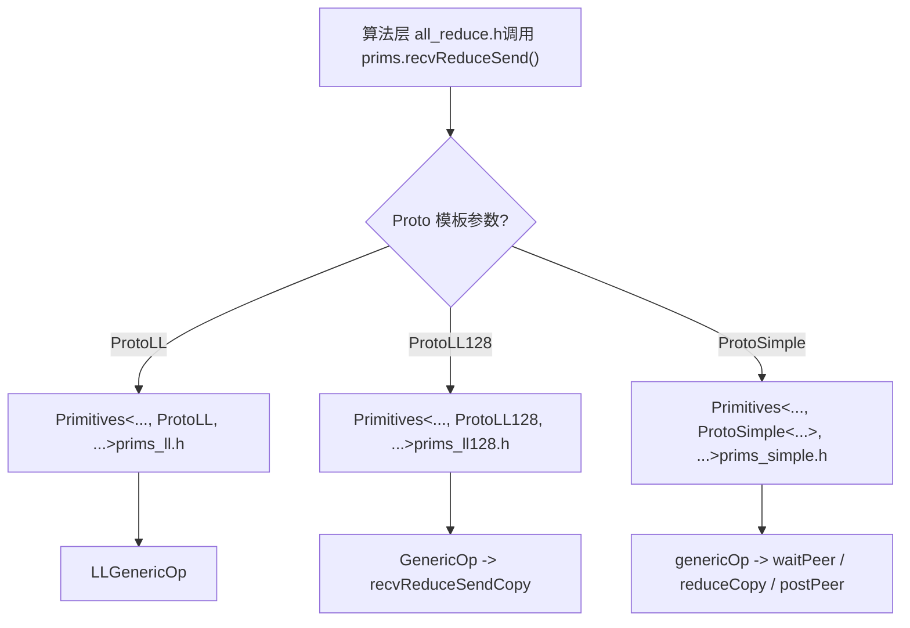
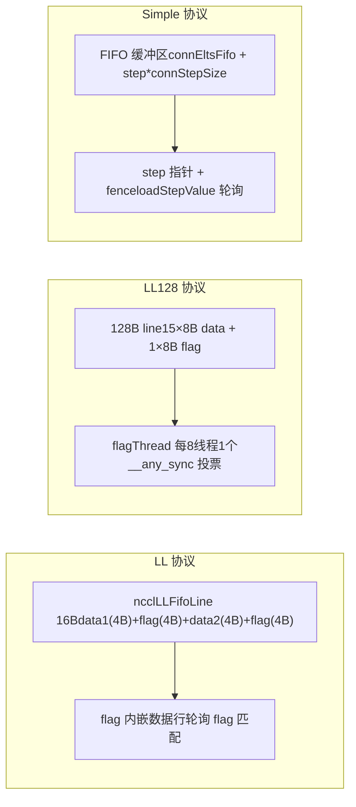

# Chapter 9: Device-Side Communication Primitives: Data Transport Implementation of the Three Protocols LL, LL128, and Simple

In the previous chapter, we traced how the host side translates an AllReduce into a __global__ kernel, and saw that the device-side entry point ncclKernelMain dispatches based on algorithm and protocol. But dispatch only selects the tool; what truly determines performance is how these tools execute data movement. This chapter dives deep into the three sets of data movement primitives under src/device: LL, LL128, and Simple, dissecting their data movement implementations one by one to understand the trade-offs different protocols make between latency and bandwidth.

# Why the same AllReduce needs three sets of data movement primitives

Let's first build an intuitive model. Imagine a pipeline factory: raw materials (user data) enter from one end, finished products exit from the other, and in between there are several workstations (ranks) that need to exchange semi-finished products with each other. There are three ways to move semi-finished products:

- **LL（Low Latency）**: Like two people passing a note face-to-face; the moment it's handed over, the other person knows "this is for you," with almost zero handshake overhead. But the note is very small—only 8 bytes of effective data can be passed at a time. Suitable for small messages.
- **LL128**: Replace the note with a 128-byte sticky note, passing 120 bytes of effective data at a time, but the sticky note must be placed 16-byte aligned, otherwise it must first be "re-laid out" in shared memory. Suitable for medium messages.
- **Simple**: Like a parcel locker—first put the package into the locker (FIFO buffer), then send a notification "locker number N has goods." Handshake overhead is high, but a lot can be moved at once. Suitable for large messages.

> **[Design Inference & Architectural Trade-offs]**
> What if there were only one set of primitives? With only LL, large messages would crush bandwidth because "every message must wait for the other side to confirm the flag"; with only Simple, small messages would explode in latency due to the fixed overhead of "write FIFO + send notification + wait for notification." This is the root cause of why NCCL's performance curve has obvious inflection points around 8KB and 128KB.

The three sets of primitives share the same template skeleton`Primitives<T, RedOp, Fan, Direct, Proto, P2p, isNetOffload>`, and through`Proto`this template parameter, three versions are specialized[FACT:src/device/primitives.h:117-117]。`ProtoLL`、`ProtoLL128`、`ProtoSimple`The three structs each carry protocol-related constants and computation methods[FACT:src/device/primitives.h:25-75], and the algorithm code only calls`prims.send()`、`prims.recvReduceSend()`unified interfaces like these, without caring which protocol underlies them.



This diagram explains "why the same AllReduce logic needs three sets of data movement primitives": the algorithm layer is protocol-agnostic, and protocol differences are encapsulated in`Primitives`the three specializations.

# LL: zero-handshake data movement with flags embedded in data lines

## Intuitive model

The core idea of LL is:**pack "data" and the marker for "whether the data is ready" into the same 16-byte read/write unit**. The receiver does not need an extra "notification message"; it only needs to poll the flag field in the data line, and a flag match means the data has arrived. This is like printing the "recipient signature" directly on the envelope when sending a letter—the mail carrier can tell at a glance whether it should be delivered, without sending a separate receipt.

Without this design, the receiver would have to first wait for a "data has been written" notification, then go back and read the data—two memory round trips, doubling latency.

## Data structures and memory layout

LL's data movement unit is`union ncclLLFifoLine`, and from`storeLL`'s assembly we can see its layout[FACT:src/device/prims_ll.h:154-158]：

```
st.volatile.global.v4.u32 [%0], {%1,%2,%3,%4};
// 写入 4 个 u32：data1, flag, data2, flag
```

One`ncclLLFifoLine`is 16 bytes, arranged as`[data1(4B) | flag(4B) | data2(4B) | flag(4B)]`. Only 8 bytes are effective data (data1 + data2); the other 8 bytes are all flag. This is why`ProtoLL::calcBytePerGrain()`returns`sizeof(uint64_t)`—"One 16-byte line has 8-bytes of data"[FACT:src/device/primitives.h:55-57]。

Key fields (`Primitives`'s LL specialization)[FACT:src/device/prims_ll.h:20-42]：

| Field | Type | Purpose |
| --- | --- | --- |
| `recvStep[i]` / `sendStep[i]` | `uint64_t[MaxRecv/MaxSend]` | Per-peer step counter, determining buffer offset and flag value |
| `recvBuff[i]` / `sendBuff[i]` | `ncclLLFifoLine*` | Points to each peer's FIFO buffer base address |
| `recvConnHeadPtr` | `volatile uint64_t*` | Global pointer on the receive side for "how many steps have been consumed" |
| `sendConnHeadPtr` | `volatile uint64_t*` | Global pointer on the send side for "how many steps the peer has consumed" |
| `sendConnHeadCache` | `uint64_t` | Caches the last read head value to avoid reading global memory every time |

The buffer offset is computed by`recvOffset(i) = (recvStep[i] % NCCL_STEPS) * stepLines`is the number of slots in the ring buffer,[FACT:src/device/prims_ll.h:44-46]，`NCCL_STEPS`is the number of lines per slot. The flag value is computed by`stepLines`, note`recvFlag(i) = NCCL_LL_FLAG(recvStep[i] + 1)`—because the initial flag value is 0, the first step's flag must be 1 to distinguish it from "not written."[FACT:src/device/prims_ll.h:56-58]Scenario-driven Walkthrough: a recvReduceSend`+1`Suppose rank 0 executes

## in Ring AllReduce: receive data from the previous rank, reduce it with local data, then send it to the next rank. The call chain is

Step 1: Wait for the send buffer to become available.`recvReduceSend`checks`recvReduceSend(inpIx, eltN)` → `LLGenericOp<1, 1, Input, -1>(inpIx, -1, eltN, false)` [FACT:src/device/prims_ll.h:403-405]。

**. The meaning is: if the peer's consumption progress (head) lags too far behind me, the ring buffer is almost full, and I must wait.** `waitSend`is the total number of buffer slots,`sendConnHeadCache + NCCL_STEPS < sendConnHead + 1` [FACT:src/device/prims_ll.h:73-89]is the slot I am about to occupy. While waiting, poll`NCCL_STEPS`to update the cache, and periodically call`sendConnHead + 1`to check whether it has been aborted`*sendConnHeadPtr`Step 2: Load local data.`checkAbort`handles the alignment problem[FACT:src/device/prims_ll.h:73-89]。

**. When** `DataLoader::loadBegin`(such as half or int8), the source address may not be 4-byte aligned, so first read it into[FACT:src/device/prims_ll.h:200-216]with 4-byte alignment, record`sizeof(T) <= 2`, and then in`u4[0..2]`use`misalign`to perform byte-level shifts and assemble the correct 64-bit value`loadFinish`. This is a typical "aligned read + shift reassembly" technique, avoiding the performance penalty of unaligned access.`__funnelshift_r`Step 3: Read peer data and wait for the flag.[FACT:src/device/prims_ll.h:218-225]is the core

**Copy** `readLL`It uses[FACT:src/device/prims_ll.h:108-122]：

```cpp
do {
  asm volatile("ld.volatile.global.v4.u32 {%0,%1,%2,%3}, [%4];" ...);
  if (checkAbort(abort, 1, spins)) break;
} while ((flag1 != flag) || (flag2 != flag));
```

它用 `ld.volatile.global.v4.u32`Read 16 bytes at once (4 u32s), then check whether both flag fields equal the expected values.`volatile`The keyword ensures the compiler will not optimize away this read or cache it in a register—because the peer may write new data at any time. Both flags must match because the writer`storeLL`writes 4 u32s at once, which in theory may be split into two 8-byte writes. Only when both flags match can the 16 bytes be guaranteed complete.

**Step 4: reduce and send.**After receiving peerData,`applyReduce(redOp, peerData, data)`perform the reduction[FACT:src/device/prims_ll.h:279]. Then`storeLL(sendPtr(i) + offset, data, sendFlag(i))`write the result to the send buffer[FACT:src/device/prims_ll.h:295-296]. Note the send order: first send`i=1..MaxSend`(usually the network peer), and finally send`i=0`(usually the local peer)[FACT:src/device/prims_ll.h:291-297]. The comment is very clear: "Send : inter-node, then intra-node, then local"—send the slow one (network) first so it can fly in the background, then send the fast one (local), so the local peer does not wait for the network.

**Step 5: advance step and post.** `incRecv(i)`Increment the receive step[FACT:src/device/prims_ll.h:91-93]，`postRecv()`and write`recvConnHead`back to the global pointer[FACT:src/device/prims_ll.h:94-97], notifying the peer "I have consumed this step." On the send side,`incSend`there is special logic[FACT:src/device/prims_ll.h:99-106]：

```cpp
if ((sendStep[i] & NCCL_LL_CLEAN_MASK) == NCCL_LL_CLEAN_MASK) {
  for (int o = offset; o  *head) { ... }
}
```

In DirectRead mode of sendrecv, the sender must wait for the receiver to finish reading the data before returning. If the receiver does not advance tail for some reason, the sender will deadlock. This wait must be done after`barrier()`otherwise it may race with the post thread.

**Pitfall 3:`roundUp`The resulting step jump.** `loadRecvConn`and`loadSendConn`both contain`step = roundUp(step, SlicePerChunk * StepPerSlice)` [FACT:src/device/prims_simple.h:486, 533]. This aligns step to the slice boundary, but if the previous step is not aligned, it causes skipped slots to not be initialized correctly. The code adds a line in`loadRecvConn`to return credit`*connStepPtr = step`Comparison and selection of the three primitive sets[FACT:src/device/prims_simple.h:489]。

# Copy



| Effective payload rate | LL | LL128 | Simple |
| --- | --- | --- | --- |
| Synchronization method | 50% | 93.75% | ~100% |
| flag embedded, polling | flagThread + warp vote | step pointer + fence | Alignment requirement |
| None (with shift and reassembly) | 16 bytes | None | Applicable message size |
| Small (< 8KB) | Medium (8KB ~ 128KB) | Large (> 128KB) | Buffer layout |
| By 128B line | `ncclLLFifoLine[]` | `uint64_t[]`Direct support | `T[]` FIFO |
| None ( | downgrade)`PrimitivesWithoutDirect`None (same as left) | Fully supported | Both LL and LL128 inherit |

because their buffer layouts do not support directly reading and writing peer memory. Simple fully implements Direct mode, supporting P2P direct connections and NVLS.`PrimitivesWithoutDirect` [FACT:src/device/prims_ll.h:9-10, src/device/prims_ll128.h:13-14]Design considerations

# [Design inference and architectural tradeoffs]

> **[Design Inference & Architectural Trade-offs]**
> **Because GPU global memory writes are not guaranteed to be atomic.**For a 16-byte write, the hardware may split it into two 8-byte writes. If only one flag is placed, the receiver may consider the data ready when only half of it has been written. The two flags are located in the first half and second half of the 16 bytes respectively, so only when both writes are complete will both flags match.`storeLL`Why does Simple reserve one warp?

**The comment says, "For send operations, we need an extra warp to overlap the threadfence and the copy."** [FACT:src/device/prims_simple.h:625-626]It is an expensive operation. If all threads wait for the fence to complete before continuing, a large amount of time will be wasted. Reserving one warp specifically for the fence allows the other warps to continue moving the next batch of data.`fence_acq_rel_sys()`[Design inference and architectural tradeoffs]

> **[Design Inference & Architectural Trade-offs]**
> **Because LL128's transfer is warp-level, and multiple warps may process different slices in parallel. If step is advanced in**each warp will advance it once, causing step to be advanced multiple times. Placing the unified advancement at the end of`recvReduceSendCopy`ensures that each slice advances only once.`GenericOp`Chapter summary

# This chapter took a deep dive into the implementation of the three transfer primitive sets:

: uses 16-byte

1. **LL**to embed the flag in the data row, and the receiver only needs to poll for a flag match to confirm that the data is ready. Payload is 50%, suitable for small messages. The core is`ncclLLFifoLine`'s`readLL`and`ld.volatile.global.v4.u32`'s`storeLL`: concentrates the flag into the last 8 bytes of every 128 bytes, increasing the payload to 93.75%. Uses`st.volatile.global.v4.u32`。

2. **LL128**(1 per 8 threads) to check the flag,`flagThread`and performs a warp vote. When unaligned, it goes through shared memory repacking.`__any_sync`: uses a FIFO buffer + step pointer notification to achieve high throughput for large messages.

3. **Simple**bit flags encode the role,`flags`polls step,`waitPeer`updates step and fences. Fully supports Direct mode.`postPeer`The three primitive sets share the same template skeleton, specialized through

template parameters. The algorithm layer only calls the unified interface and does not care about the underlying protocol. This is the answer to "why the same AllReduce logic needs three transfer primitive sets": different message sizes require different synchronization strategies and buffer layouts, and the three primitive sets are optimized for small, medium, and large messages respectively.`Proto`Chapter review questions

# Q1: If the cleanup logic in

(`incSend`) is removed, in what scenario will data corruption be triggered? Why?[FACT:src/device/prims_ll.h:99-106]Reference analysis

**: The cleanup logic writes all rows of the entire slice once with the current flag (data filled with 0) when**. If removed, when step wraps around to the`sendStep[i] & NCCL_LL_CLEAN_MASK == NCCL_LL_CLEAN_MASK`boundary, the flags of some rows may still be the values from the previous round. If the previous round's flag happens to equal the flag expected by the receiver in this round, the receiver will mistakenly believe the data is ready and read the residual data from the previous round. This is a typical ABA problem. The trigger condition is long-running operation (step exceeds`NCCL_LL_CLEAN_MASK`cycles) and the flag happens to wrap around to the same value. This kind of bug is extremely difficult to reproduce because it requires precise step alignment.`NCCL_LL_CLEAN_MASK` 周期）且 flag 恰好回绕到相同值。这类 bug 极难复现，因为需要精确的 step 对齐。

Q2: In the destructor of the Simple protocol, what do the wait under NetRegMode ([FACT:src/device/prims_simple.h:794-804]) and the wait under DirectRead ([FACT:src/device/prims_simple.h:814-824]) each prevent? If one of them is removed, what happens in a high-concurrency scenario?

**Reference analysis**: NetRegMode waits for the proxy thread to set`connFifo[prevStep].size`to -1, indicating that the NIC has finished sending. If this is removed, the next kernel may overwrite the send buffer that is currently being read by the NIC via DMA, causing the NIC to read dirty data. DirectRead waits for the receiver to advance the tail (`*tail > *head`), indicating that the receiver has finished reading the direct buffer. If this is removed, the sender may overwrite the buffer before the receiver has finished reading, causing the receiver to read new data instead of old data. In high-concurrency scenarios, both waits are necessary; removing either one will cause a data race. The difference is that NetRegMode prevents "NIC reads," while DirectRead prevents "peer GPU reads."

Q3: LL128's`loadRegsBegin`takes the shared memory repacking path ([FACT:src/device/prims_ll128.h:115-141]) when unaligned. How much slower is this path than the aligned path? Why doesn't NCCL directly require user buffers to be 16-byte aligned?

**Reference analysis**: The unaligned path has three extra steps: write to shared memory,`__syncwarp()`, read from shared memory. Although shared memory bandwidth is high,`__syncwarp()`is a synchronization point that blocks the warp until all threads finish writing. A rough estimate is that the unaligned path is 20-40% slower than the aligned path, depending on shared memory bank conflicts. NCCL does not enforce alignment because users may pass buffers with arbitrary offsets (such as tensor slices), and enforcing alignment would limit API flexibility. NCCL's strategy is "use the fast path when aligned, and use the slow path when unaligned while guaranteeing correctness." In production environments, users are advised to allocate buffers aligned to 16 bytes as much as possible in order to use the fast path.

At this point, we have mastered the data movement mechanisms of the three primitives LL, LL128, and Simple, which provide flexible performance tuning means for upper-layer algorithms. The next chapter will go deep into the collective communication algorithm kernels to see how AllReduce, AllGather, ReduceScatter, etc. call these primitives, and how algorithms such as Ring, Tree, and CollNet organize data flow, ultimately completing end-to-end collective communication.
