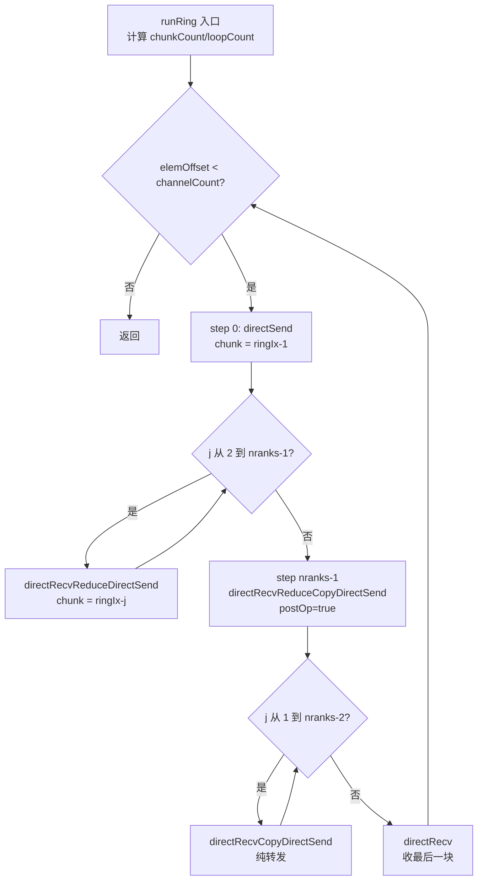
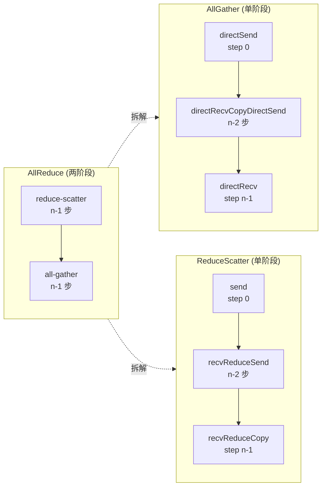
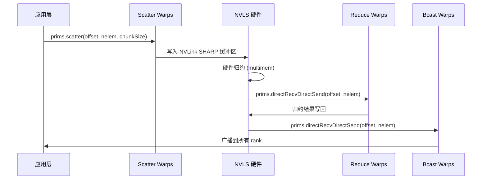

# Chapter 10: Collective Kernels: Device Implementations of AllReduce & AllGather


上一章拆解了 LL、LL128、Simple 三种协议原语，它们是数据搬运的「发动机」，但发动机本身不知道要搬什么、往哪搬、按什么顺序搬。本章要看的 src/device 下这一组算法内核文件，就是「变速箱」——它们把 AllReduce、AllGather、ReduceScatter 这些集合通信语义，翻译成一连串 prims.directSend、prims.directRecvReduceDirectSend 这样的原语调用。一句话概括本章的核心矛盾：同一个 AllReduce，为什么需要 Ring、Tree、CollNet、NVLS 四套完全不同的设备侧实现？答案藏在「数据流拓扑」与「硬件能力」的匹配里。Ring 用最少的网络带宽做两阶段流水，Tree 用树形归约把延迟压到 log(n)，CollNet/NVLS 则把归约卸载到网卡或 NVLink 交换机上。本章逐个拆开看。

## 10.1 Ring AllReduce：两阶段流水如何在 kernel 内落地

### Intuitive Architectural Model：环形流水线上的「接力赛」

想象 n 个工人站成一圈，每人手里有一箱原料。AllReduce 的目标是让每个人最终都拿到「所有原料混合后的成品」。Ring 算法的做法分两阶段：第一阶段（reduce-scatter）每人把箱子沿环传递，每传一站就混入自己的原料，转 n-1 站后每个人手里恰好有一份「完整混合」的成品，但只有 1/n 的份额；第二阶段（all-gather）这些成品份额再沿环传一圈，每人补齐所有份额。

若没有 Ring，最朴素的做法是每个 rank 把数据发给 root，root 归约后再广播——root 的网络带宽成为瓶颈，n 越大越慢。Ring 的精妙在于：**每个 rank 的发送量和接收量都是 2(n-1)/n 倍数据量，与 n 无关地摊平到所有链路**。

### Data Structures & Memory Layout

Ring 算法的核心状态在 `ncclRing` 结构里（定义在 device.h，本章不展开），`runRing` 只取其中两个字段：

- `ring->index`：本 rank 在环中的逻辑位置，用于计算「第 j 步该处理哪个 chunk」。
- `ring->prev` / `ring->next`：前驱和后继 rank 编号，作为 `Primitives` 构造函数的 recv/send peer 参数。

关键的分块参数由 `ncclCollCbdPart` 计算（[FACT:src/device/all_reduce.h:21-22](https://github.com/NVIDIA/nccl/blob/12df1a11afad322be5a204a2db890161cbf8131d/src/device/all_reduce.h#L21-L22)）：

```
ncclCollCbdPart(work, ncclShmem.channelId, Proto::Id, sizeof(T), (ssize_t*)nullptr, &gridOffset, &channelCount, &chunkCount);
```

这个函数把整个通信域的数据按 channel 切分，输出三个值：`gridOffset`（本 channel 负责的数据在整个 buffer 中的起始偏移）、`channelCount`（本 channel 负责的元素总数）、`chunkCount`（每个 rank 分到的 chunk 元素数）。`chunkCount` 是 Ring 算法的粒度——每一步搬运一个 chunk。

`loopCount = nranks * chunkCount`（[FACT:src/device/all_reduce.h:23](https://github.com/NVIDIA/nccl/blob/12df1a11afad322be5a204a2db890161cbf8131d/src/device/all_reduce.h#L23)）表示「转一整圈」处理的数据量。外层循环 `for (elemOffset = 0; elemOffset < channelCount; elemOffset += loopCount)`（[FACT:src/device/all_reduce.h:34](https://github.com/NVIDIA/nccl/blob/12df1a11afad322be5a204a2db890161cbf8131d/src/device/all_reduce.h#L34)）意味着：如果 channel 数据量超过一圈能处理的量，就分多圈跑。

### Step-by-Step Walkthrough：一次 Ring AllReduce 的完整调用流

代入场景：4 个 rank（nranks=4），本 rank 的 `ringIx=0`，`chunkCount=100`，`channelCount=400`（正好一圈）。

**第 0 步：把「自己的 chunk」推给下一个 GPU**（[FACT:src/device/all_reduce.h:42-47](https://github.com/NVIDIA/nccl/blob/12df1a11afad322be5a204a2db890161cbf8131d/src/device/all_reduce.h#L42-L47)）

```
chunk = modRanks(ringIx + nranks - 1);   // = 3
chunkOffset = chunk * chunkCount;         // = 300
offset = gridOffset + elemOffset + chunkOffset;
nelem = min(chunkCount, remCount - chunkOffset);
prims.directSend(offset, offset, nelem);
```

`modRanks` 是个 lambda，做模 nranks 的减法（[FACT:src/device/all_reduce.h:40](https://github.com/NVIDIA/nccl/blob/12df1a11afad322be5a204a2db890161cbf8131d/src/device/all_reduce.h#L40)）。`ringIx + nranks - 1` 表示「本 rank 的前一个 chunk 编号」。为什么第 0 步发的是 chunk 3？因为 Ring 的 reduce-scatter 阶段，每个 rank 先把自己「不该保留」的那份数据（即前驱 rank 的 chunk）发出去。`directSend` 只发不接，因为此时还没收到任何数据。

**第 1 到 nranks-2 步：边收边归约边转发**（[FACT:src/device/all_reduce.h:50-56](https://github.com/NVIDIA/nccl/blob/12df1a11afad322be5a204a2db890161cbf8131d/src/device/all_reduce.h#L50-L56)）

```
for (int j = 2; j < nranks; ++j) {
  chunk = modRanks(ringIx + nranks - j);
  ...
  prims.directRecvReduceDirectSend(offset, offset, nelem);
}
```

`directRecvReduceDirectSend` 是 Ring 的核心原语：从 `prev` 收一个 chunk，与本地数据做归约（比如加法），再把结果发给 `next`。注意 `offset` 和 `nelem` 在每次迭代都重新计算——因为每步处理的 chunk 不同。j 从 2 到 nranks-1，共 nranks-2 步。

**第 nranks-1 步：收下最后一个 chunk 并归约，产生最终结果**（[FACT:src/device/all_reduce.h:58-64](https://github.com/NVIDIA/nccl/blob/12df1a11afad322be5a204a2db890161cbf8131d/src/device/all_reduce.h#L58-L64)）

```
chunk = ringIx + 0;
...
prims.directRecvReduceCopyDirectSend(offset, offset, nelem, /*postOp=*/true);
```

这一步的 `postOp=true` 是关键：归约完成后要执行后置操作（比如求平均时的除法）。`directRecvReduceCopyDirectSend` 比上一步多了个 `Copy`——把归约结果同时写入本地 recvbuff 和发往 next。至此 reduce-scatter 阶段结束，每个 rank 手里有一个「完整归约」的 chunk。

**all-gather 阶段：nranks-2 步纯转发**（[FACT:src/device/all_reduce.h:66-73](https://github.com/NVIDIA/nccl/blob/12df1a11afad322be5a204a2db890161cbf8131d/src/device/all_reduce.h#L66-L73)）

```
for (int j = 1; j < nranks - 1; ++j) {
  chunk = modRanks(ringIx + nranks - j);
  ...
  prims.directRecvCopyDirectSend(offset, offset, nelem);
}
```

注意这里用的是 `directRecvCopyDirectSend`，没有 `Reduce`——因为数据已经归约完了，只需复制转发。

**最后一步：收下最后一个 chunk**（[FACT:src/device/all_reduce.h:75-81](https://github.com/NVIDIA/nccl/blob/12df1a11afad322be5a204a2db890161cbf8131d/src/device/all_reduce.h#L75-L81)）

```
chunk = modRanks(ringIx + 1);
...
prims.directRecv(offset, nelem);
```

只收不发，补齐最后一块。

整个流程可以用下面的控制流图概括：



### 设计思考：为什么 Ring 的 chunk 顺序是「倒着走」的

注意 chunk 编号的规律：第 0 步发 `ringIx-1`，第 j 步处理 `ringIx-j`，最后一步处理 `ringIx+0`。这是**逆时针**推进。为什么？因为 Ring 的每个 rank 只保留「自己负责归约的那个 chunk」（即 `ringIx+0`），其余 chunk 都是路过。逆时针推进保证：当某个 chunk 转完一圈回到起点时，恰好完成了 nranks 次归约，产生最终结果。如果顺时针推进，chunk 会在错误的 rank 上完成归约。

### 生产踩坑：`remCount < loopCount` 时的对齐陷阱

[FACT:src/device/all_reduce.h:38](https://github.com/NVIDIA/nccl/blob/12df1a11afad322be5a204a2db890161cbf8131d/src/device/all_reduce.h#L38) 有一行容易被忽略的代码：

```
if (remCount < loopCount) chunkCount = alignUp(divUp(remCount, nranks), 16 / sizeof(T));
```

当剩余数据不足一圈时，chunkCount 要重新计算，并且 `alignUp(..., 16/sizeof(T))` 强制按 16 字节对齐。为什么？因为 LL128 协议要求 128 字节对齐，Simple 协议也有向量化访问的对齐需求。如果去掉这个对齐，非对齐的 chunk 会走慢路径，性能下降 20-40%。生产环境中如果发现 Ring AllReduce 在小消息尾部性能抖动，往往就是这个对齐没生效——检查 `channelCount` 是否是 `nranks * 16/sizeof(T)` 的整数倍。

## 10.2 Tree AllReduce：用树形归约把延迟压到 log(n)

### Intuitive Architectural Model：公司里的「逐级汇报」

Ring 的延迟是 O(n)——数据要转一圈。当 n 很大（比如 1024 个 GPU）时，即使带宽摊平了，延迟也受不了。Tree 算法换了个思路：像公司组织架构一样，每个 rank 只跟「父节点」和「子节点」通信。归约阶段，叶子节点把数据往上汇报，父节点合并子节点的数据；广播阶段反过来，根节点把结果往下发。延迟从 O(n) 降到 O(log n)。

若没有 Tree，大规模集群的 AllReduce 延迟会随 rank 数线性增长，训练迭代时间被通信拖垮。

### Data Structures & Memory Layout

Tree 的状态在 `ncclTree` 里：

- `tree->up`：父节点 rank（-1 表示本 rank 是根）。
- `tree->down[]`：子节点数组，最多 `NCCL_MAX_TREE_ARITY` 个（典型是 3，即二叉+本地）。

`runTreeUpDown` 和 `runTreeSplit` 是两个变体。前者用「先全部归约再全部广播」的两阶段模式，后者把线程拆成两半，一半做归约一半做广播，实现流水重叠。

### Step-by-Step Walkthrough：runTreeUpDown 的三分支

`runTreeUpDown` 的第一个代码块是归约阶段（[FACT:src/device/all_reduce.h:96-118](https://github.com/NVIDIA/nccl/blob/12df1a11afad322be5a204a2db890161cbf8131d/src/device/all_reduce.h#L96-L118)），根据本 rank 在树中的位置分三种情况：

**情况 A：本 rank 是根（`tree->up == -1`）**（[FACT:src/device/all_reduce.h:99-104](https://github.com/NVIDIA/nccl/blob/12df1a11afad322be5a204a2db890161cbf8131d/src/device/all_reduce.h#L99-L104)）

```
prims.directRecvReduceCopy(offset, offset, nelem, /*postOp=*/true);
```

根节点只收不发，从所有子节点收数据、归约、写入 recvbuff。`postOp=true` 执行后置操作。

**情况 B：本 rank 是叶子（`tree->down[0] == -1`）**（[FACT:src/device/all_reduce.h:105-110](https://github.com/NVIDIA/nccl/blob/12df1a11afad322be5a204a2db890161cbf8131d/src/device/all_reduce.h#L105-L110)）

```
prims.directSend(offset, offset, nelem);
```

叶子节点只发不收，把自己的数据发给父节点。

**情况 C：中间节点**（[FACT:src/device/all_reduce.h:111-117](https://github.com/NVIDIA/nccl/blob/12df1a11afad322be5a204a2db890161cbf8131d/src/device/all_reduce.h#L111-L117)）

```
prims.directRecvReduceDirectSend(offset, offset, nelem);
```

从子节点收、归约、发给父节点。

广播阶段（[FACT:src/device/all_reduce.h:120-142](https://github.com/NVIDIA/nccl/blob/12df1a11afad322be5a204a2db890161cbf8131d/src/device/all_reduce.h#L120-L142)）逻辑对称：根节点 `directSendFromOutput`（从 recvbuff 发），叶子节点 `directRecv`，中间节点 `directRecvCopyDirectSend`。

### runTreeSplit：用线程拆分实现归约-广播流水

`runTreeUpDown` 的问题是：归约阶段和广播阶段串行，中间有个全局同步点。`runTreeSplit` 把线程分成两组（[FACT:src/device/all_reduce.h:155-164](https://github.com/NVIDIA/nccl/blob/12df1a11afad322be5a204a2db890161cbf8131d/src/device/all_reduce.h#L155-L164)）：

```
if (Proto::Id == NCCL_PROTO_SIMPLE) {
  nthreadsSplit = nthreads / 2;
  if (nthreadsSplit >= 256) nthreadsSplit += 64;
} else {
  nthreadsSplit = (nthreads * 7 / (10 * WARP_SIZE)) * WARP_SIZE;
}
```

Simple 协议对半分；LL/LL128 协议按 7:3 分，因为「从 3 个源收数据做归约」比「发给 3 个目标」计算密集，所以归约组多分线程。

然后 `tid < nthreadsSplit` 的线程做归约上推（[FACT:src/device/all_reduce.h:175-202](https://github.com/NVIDIA/nccl/blob/12df1a11afad322be5a204a2db890161cbf8131d/src/device/all_reduce.h#L175-L202)），其余线程做广播下推（[FACT:src/device/all_reduce.h:203-224](https://github.com/NVIDIA/nccl/blob/12df1a11afad322be5a204a2db890161cbf8131d/src/device/all_reduce.h#L203-L224)）。两组通过 `Proto::MaxGroupWidth` 偏移量区分各自的通信组（[FACT:src/device/all_reduce.h:189](https://github.com/NVIDIA/nccl/blob/12df1a11afad322be5a204a2db890161cbf8131d/src/device/all_reduce.h#L189) 的 `0 * Proto::MaxGroupWidth` 和 [FACT:src/device/all_reduce.h:210](https://github.com/NVIDIA/nccl/blob/12df1a11afad322be5a204a2db890161cbf8131d/src/device/all_reduce.h#L210) 的 `1 * Proto::MaxGroupWidth`）。

### 设计思考：为什么 Tree 的根节点要特殊处理

树形归约的根节点是「汇聚点」，它的接收量是子节点数倍，发送量为零（归约阶段）。如果根节点也走通用的 `directRecvReduceDirectSend`，会尝试往 `tree->up`（-1）发送，导致越界。所以必须用 `if (tree->up == -1)` 分支单独处理。同理叶子节点的 `tree->down[0] == -1` 判断。

### 生产踩坑：Tree 算法的「热点根」问题

Tree 的根节点承担了所有归约流量，如果根节点所在 GPU 恰好是慢节点（比如 PCIe 带宽受限），整个 AllReduce 会被拖慢。NCCL 的应对是：**每个 channel 选不同的根**，把根节点的负载分散到多个 rank。这就是为什么 `runTreeSplit` 里根节点分支用 `FanSymmetric<NCCL_MAX_TREE_ARITY_TOP>`（[FACT:src/device/all_reduce.h:168](https://github.com/NVIDIA/nccl/blob/12df1a11afad322be5a204a2db890161cbf8131d/src/device/all_reduce.h#L168)）——它要同时处理多个子节点的归约。生产环境如果发现 Tree AllReduce 性能不均，检查 channel 的根节点分布是否均匀。

## 10.3 AllGather 与 ReduceScatter：Ring 的「半程」变体

### Intuitive Architectural Model：AllReduce 拆成两半

AllGather 和 ReduceScatter 本质上是 AllReduce 的两个阶段各自独立成 API。AllGather 只做「收集」——每个 rank 贡献一份数据，最终所有人拿到全部数据。ReduceScatter 只做「归约+分散」——所有人贡献数据，归约后每人拿到一份。

若没有这两个独立 API，用户做「先归约再收集」或「先收集再归约」时只能调 AllReduce 再手动切片，浪费一半带宽。

### AllGather 的 Ring 实现

`all_gather.h` 的 `runRing`（[FACT:src/device/all_gather.h:14-88](https://github.com/NVIDIA/nccl/blob/12df1a11afad322be5a204a2db890161cbf8131d/src/device/all_gather.h#L14-L88)）比 AllReduce 简单：没有归约，只有复制转发。

**第 0 步：把自己的数据推给下一个 GPU**（[FACT:src/device/all_gather.h:51-60](https://github.com/NVIDIA/nccl/blob/12df1a11afad322be5a204a2db890161cbf8131d/src/device/all_gather.h#L51-L60)）

```
rankDest = ringRanks[0];
offset = dataOffset + rankDest * count;
if ((inputBuf + dataOffset == outputBuf + offset) || isNetOffload) {
  prims.directSend(dataOffset, offset, nelem);
} else {
  prims.directCopySend(dataOffset, offset, nelem);
}
```

这里有个 in-place 判断：如果 `inputBuf + dataOffset == outputBuf + offset`，说明输入输出是同一块内存（in-place AllGather），直接 `directSend`；否则要 `directCopySend`（先拷贝到输出再发）。

**中间 nranks-2 步：纯转发**（[FACT:src/device/all_gather.h:62-67](https://github.com/NVIDIA/nccl/blob/12df1a11afad322be5a204a2db890161cbf8131d/src/device/all_gather.h#L62-L67)）

```
prims.directRecvCopyDirectSend(offset, offset, nelem);
```

**最后一步：收下最后一块**（[FACT:src/device/all_gather.h:69-74](https://github.com/NVIDIA/nccl/blob/12df1a11afad322be5a204a2db890161cbf8131d/src/device/all_gather.h#L69-L74)）

```
prims.directRecv(offset, nelem);
```

### isNetOffload：单 warp 驱动网络 + 多 warp 并行拷贝

[FACT:src/device/all_gather.h:28-36](https://github.com/NVIDIA/nccl/blob/12df1a11afad322be5a204a2db890161cbf8131d/src/device/all_gather.h#L28-L36) 有个特殊分支：

```
if (isNetOffload) {
  workNthreads = WARP_SIZE;
  chunkCount = NCCL_MAX_NET_SIZE;
} else {
  workNthreads = nthreads;
}
```

当 `isNetOffload=true`（单 RPN + 网络注册模式）时，只用 1 个 warp 驱动 Ring 通信，其余 warp 并行做「源数据拷贝到目标 buffer」（[FACT:src/device/all_gather.h:76-82](https://github.com/NVIDIA/nccl/blob/12df1a11afad322be5a204a2db890161cbf8131d/src/device/all_gather.h#L76-L82)）。这是为了在非 in-place AllGather 时，把拷贝开销和通信开销重叠。

最后有个 `barrier_sync(14, nthreads)`（[FACT:src/device/all_gather.h:87](https://github.com/NVIDIA/nccl/blob/12df1a11afad322be5a204a2db890161cbf8131d/src/device/all_gather.h#L87)），注释解释得很清楚：必须等所有 warp 完成，否则下一个 work 可能复用 outputBuf 导致竞争。用 barrier 14 是为了避开 prims 自己的 barrier 和 `__syncthreads()`。

### ReduceScatter 的 Ring 实现

`reduce_scatter.h` 的 `runRing`（[FACT:src/device/reduce_scatter.h:14-56](https://github.com/NVIDIA/nccl/blob/12df1a11afad322be5a204a2db890161cbf8131d/src/device/reduce_scatter.h#L14-L56)）是 AllReduce 的 reduce-scatter 阶段单独抽出：

**第 0 步：把自己的数据推给下一个 GPU**（[FACT:src/device/reduce_scatter.h:39-42](https://github.com/NVIDIA/nccl/blob/12df1a11afad322be5a204a2db890161cbf8131d/src/device/reduce_scatter.h#L39-L42)）

```
rankDest = ringRanks[nranks - 1];
offset = dataOffset + rankDest * count;
prims.send(offset, nelem);
```

**中间 nranks-2 步：边收边归约边转发**（[FACT:src/device/reduce_scatter.h:44-49](https://github.com/NVIDIA/nccl/blob/12df1a11afad322be5a204a2db890161cbf8131d/src/device/reduce_scatter.h#L44-L49)）

```
prims.recvReduceSend(offset, nelem);
```

**最后一步：收下并归约，产生最终结果**（[FACT:src/device/reduce_scatter.h:61-64](https://github.com/NVIDIA/nccl/blob/12df1a11afad322be5a204a2db890161cbf8131d/src/device/reduce_scatter.h#L61-L64)）

```
prims.recvReduceCopy(offset, dataOffset, nelem, /*postOp=*/true);
```

注意最后一步的 `recvReduceCopy` 有两个 offset：`offset`（接收源）和 `dataOffset`（本地输入），归约结果写入 `dataOffset`。

### 数据流对比图



### 生产踩坑：in-place 判断的边界

[FACT:src/device/all_gather.h:55](https://github.com/NVIDIA/nccl/blob/12df1a11afad322be5a204a2db890161cbf8131d/src/device/all_gather.h#L55) 的 in-place 判断 `inputBuf + dataOffset == outputBuf + offset` 依赖指针精确相等。如果用户传入的 sendbuff 和 recvbuff 有偏移但逻辑上是同一块内存，这个判断会失效，导致走 `directCopySend` 路径——虽然正确但多一次拷贝。生产环境建议 in-place AllGather 时确保 sendbuff 和 recvbuff 完全一致。

## 10.4 CollNet 与 NVLS：把归约卸载到硬件

### Intuitive Architectural Model：让「交换机」帮忙算

Ring 和 Tree 都是「GPU 自己算归约」。CollNet 和 NVLS 换了个思路：把归约操作卸载到网卡（CollNet）或 NVLink 交换机（NVLS）上。GPU 只负责把数据发出去，硬件完成归约后再广播回来。这就像从「每个工人自己混合原料」变成「把原料送到中央搅拌机，搅拌机混好再分发」。

若没有硬件卸载，归约操作会占用 GPU 的 SM 资源，且归约延迟无法隐藏。

### CollNet Direct 的线程分工

`RunWorkColl<ncclFuncAllReduce, ..., NCCL_ALGO_COLLNET_DIRECT, ...>` 的 `run`（[FACT:src/device/all_reduce.h:249-386](https://github.com/NVIDIA/nccl/blob/12df1a11afad322be5a204a2db890161cbf8131d/src/device/all_reduce.h#L249-L386)）把线程分成四组：

```
const int nThreadsScatter = WARP_SIZE + ((hasUp && hasDn) ? COLLNET_COPY_THREADS : ...);
const int nThreadsGather = ((hasUp && hasDn) ? COLLNET_COPY_THREADS : ...);
const int nThreadsBcast = WARP_SIZE + ((hasUp && hasDn) ? COLLNET_COPY_THREADS : ...);
const int nThreadsReduce = work->nWarps * WARP_SIZE - nThreadsScatter - nThreadsGather - nThreadsBcast;
```

四组线程分别负责：Scatter（把数据分散到各 rail）、Reduce（归约后发给网络）、Gather（从各 rail 收集）、Bcast（从网络收到后广播）。`COLLNET_COPY_THREADS = 96`（[FACT:src/device/all_reduce.h:250](https://github.com/NVIDIA/nccl/blob/12df1a11afad322be5a204a2db890161cbf8131d/src/device/all_reduce.h#L250)）是固定的拷贝线程数。

### netRegUsed：网络注册模式下的缓冲区布局

[FACT:src/device/all_reduce.h:280-288](https://github.com/NVIDIA/nccl/blob/12df1a11afad322be5a204a2db890161cbf8131d/src/device/all_reduce.h#L280-L288) 有个关键分支：

```
if (work->netRegUsed) {
  offsetBase = bid * chunkSize;
  maxNelems = size;
  peerOffset = nChannels * chunkSize;
} else {
  offsetBase = bid * direct->nHeads * chunkSize;
  maxNelems = direct->nHeads * chunkSize;
  peerOffset = chunkSize;
}
```

`netRegUsed` 模式下，缓冲区按 channel 连续排列（`bid * chunkSize`），peer 偏移是 `nChannels * chunkSize`；非注册模式下，按 head 排列（`bid * nHeads * chunkSize`），peer 偏移是 `chunkSize`。这个差异源于网络注册模式要求缓冲区连续，以便网卡 DMA。

### NVLS 的 warp 分配

`RunWorkColl<ncclFuncAllReduce, ..., NCCL_ALGO_NVLS, ...>` 的 `run`（[FACT:src/device/all_reduce.h:391-523](https://github.com/NVIDIA/nccl/blob/12df1a11afad322be5a204a2db890161cbf8131d/src/device/all_reduce.h#L391-L523)）用更精细的 warp 分配：

```
const int bcastWarps = hasOut ? (work->regUsed ? ((totalWarps - 2) >> 1) - 1 : 2) : 0;
const int reduceWarps = work->regUsed ? (totalWarps - bcastWarps - 2) : (hasOut ? 3 : nranks <= 6 ? 7 : 5);
const int scatterWarps = work->regUsed ? 1 : (totalWarps - reduceWarps - bcastWarps + 1) >> 1;
const int gatherWarps = work->regUsed ? 1 : (totalWarps - reduceWarps - bcastWarps) >> 1;
```

`regUsed` 模式下，scatter/gather 各只占 1 warp（因为 NVLS 硬件直接操作注册内存），reduce 占大头；非注册模式下，scatter/gather 各占约一半，reduce 根据 rank 数调整（≤6 用 7 warp，否则 5 warp）。

### 时序交互图



### 生产踩坑：CollNet 的 `direct->out == -1` 陷阱

[FACT:src/device/reduce_scatter.h:521](https://github.com/NVIDIA/nccl/blob/12df1a11afad322be5a204a2db890161cbf8131d/src/device/reduce_scatter.h#L521) 有一行：

```
if (direct->out == -1) __trap();
```

如果 CollNet 的 out 连接未建立（-1），直接 `__trap()` 让 kernel 崩溃。这是防御性编程——CollNet 依赖网卡，如果网卡初始化失败，out 会是 -1，此时继续执行会导致未定义行为。生产环境如果看到 kernel trap，检查 CollNet 网卡是否正常初始化。

## 10.5 Broadcast 与 Reduce：最简单的两个集合操作

### Broadcast：从 root 扇出

`broadcast.h` 的 `runRing`（[FACT:src/device/broadcast.h:14-64](https://github.com/NVIDIA/nccl/blob/12df1a11afad322be5a204a2db890161cbf8131d/src/device/broadcast.h#L14-L64)）逻辑很直接：root 节点发数据，其他节点转发，最后一个节点只收。

```
if (rank == root) {
  if (inputBuf == outputBuf || isNetOffload) {
    prims.directSend(offset, offset, nelem);
  } else {
    prims.directCopySend(offset, offset, nelem);
  }
} else if (nextRank == root) {
  prims.directRecv(offset, nelem);
} else {
  prims.directRecvCopyDirectSend(offset, offset, nelem);
}
```

三个分支：root 发、root 的前驱收、中间节点转发。注意 `nextRank == root` 判断的是「本节点的下一个是 root」，即本节点是环上最后一个——它只收不发。

### Reduce：向 root 汇聚

`reduce.h` 的 `runRing`（[FACT:src/device/reduce.h:14-53](https://github.com/NVIDIA/nccl/blob/12df1a11afad322be5a204a2db890161cbf8131d/src/device/reduce.h#L14-L53)）是 Broadcast 的逆操作：

```
if (prevRank == root) {
  prims.send(offset, nelem);
} else if (rank == root) {
  prims.recvReduceCopy(offset, offset, nelem, /*postOp=*/true);
} else {
  prims.recvReduceSend(offset, nelem);
}
```

`prevRank == root` 的节点只发（它是 root 的前驱），root 只收并归约，中间节点边收边归约边转发。

### 设计思考：为什么 Broadcast/Reduce 也用 Ring

Broadcast 和 Reduce 理论上可以用 Tree 实现更低延迟，但 NCCL 选择 Ring 是因为：**这两个操作的数据量通常较小，Ring 的实现更简单，且能复用 AllReduce 的 Ring 代码路径**。Tree 的复杂度（根节点选择、线程拆分）在小消息场景下收益不明显。

### 生产踩坑：Broadcast 的 root 节点带宽瓶颈

Broadcast 的 root 节点要发送全部数据，如果 root 是慢节点，整个 Broadcast 被拖慢。NCCL 的应对是：**Broadcast 也支持多 channel，每个 channel 的 root 可以不同**。但注意 `work->root` 是全局的，所有 channel 共享同一个 root——这是 Broadcast 的语义决定的（只有一个源）。生产环境如果 Broadcast 慢，检查 root 节点的网络带宽。

## 10.6 算法选择矩阵：RunWorkColl 模板特化

所有算法内核通过 `RunWorkColl` 模板特化注册（[FACT:src/device/all_reduce.h:228-788](https://github.com/NVIDIA/nccl/blob/12df1a11afad322be5a204a2db890161cbf8131d/src/device/all_reduce.h#L228-L788)）。每个特化对应「函数 × 算法 × 协议」的组合：

| 函数 | 算法 | 协议 | 特化位置 |
|------|------|------|----------|
| AllReduce | RING | SIMPLE | [FACT:src/device/all_reduce.h:230-233](https://github.com/NVIDIA/nccl/blob/12df1a11afad322be5a204a2db890161cbf8131d/src/device/all_reduce.h#L230-L233) |
| AllReduce | TREE | SIMPLE | [FACT:src/device/all_reduce.h:238-244](https://github.com/NVIDIA/nccl/blob/12df1a11afad322be5a204a2db890161cbf8131d/src/device/all_reduce.h#L238-L244) |
| AllReduce | COLLNET_DIRECT | SIMPLE | [FACT:src/device/all_reduce.h:249-386](https://github.com/NVIDIA/nccl/blob/12df1a11afad322be5a204a2db890161cbf8131d/src/device/all_reduce.h#L249-L386) |
| AllReduce | NVLS | SIMPLE | [FACT:src/device/all_reduce.h:391-523](https://github.com/NVIDIA/nccl/blob/12df1a11afad322be5a204a2db890161cbf8131d/src/device/all_reduce.h#L391-L523) |
| AllReduce | NVLS_TREE | SIMPLE | [FACT:src/device/all_reduce.h:528-634](https://github.com/NVIDIA/nccl/blob/12df1a11afad322be5a204a2db890161cbf8131d/src/device/all_reduce.h#L528-L634) |
| AllReduce | COLLNET_CHAIN | SIMPLE | [FACT:src/device/all_reduce.h:639-759](https://github.com/NVIDIA/nccl/blob/12df1a11afad322be5a204a2db890161cbf8131d/src/device/all_reduce.h#L639-L759) |
| AllReduce | RING | LL | [FACT:src/device/all_reduce.h:764-766](https://github.com/NVIDIA/nccl/blob/12df1a11afad322be5a204a2db890161cbf8131d/src/device/all_reduce.h#L764-L766) |
| AllReduce | TREE | LL | [FACT:src/device/all_reduce.h:771-773](https://github.com/NVIDIA/nccl/blob/12df1a11afad322be5a204a2db890161cbf8131d/src/device/all_reduce.h#L771-L773) |
| AllReduce | RING | LL128 | [FACT:src/device/all_reduce.h:778-780](https://github.com/NVIDIA/nccl/blob/12df1a11afad322be5a204a2db890161cbf8131d/src/device/all_reduce.h#L778-L780) |
| AllReduce | TREE | LL128 | [FACT:src/device/all_reduce.h:785-787](https://github.com/NVIDIA/nccl/blob/12df1a11afad322be5a204a2db890161cbf8131d/src/device/all_reduce.h#L785-L787) |

注意：**CollNet 和 NVLS 只支持 SIMPLE 协议**。因为这两种算法依赖硬件卸载，而 LL/LL128 的低延迟同步机制与硬件卸载不兼容——硬件归约的延迟远大于 LL 的 flag 轮询，用 LL 反而增加开销。

### 协议选择的内在逻辑

- **LL**：小消息（< 8KB），低延迟优先。Ring 和 Tree 都支持。
- **LL128**：中等消息（8KB - 1MB），128 字节对齐。Ring 和 Tree 都支持。
- **SIMPLE**：大消息（> 1MB），带宽优先。所有算法都支持。

### 生产踩坑：协议与算法的组合限制

如果用户强制指定 `NCCL_PROTO=LL` 但算法是 CollNet，NCCL 会在 tuning 阶段回退到 SIMPLE。生产环境如果发现协议设置不生效，检查算法是否支持该协议。

## 设计思考：为什么同一份 AllReduce 逻辑需要这么多实现

回顾本章，AllReduce 有 Ring、Tree、CollNet Direct、CollNet Chain、NVLS、NVLS Tree 六种算法实现。这不是冗余，而是**针对不同硬件拓扑和消息大小的最优解**：

- **Ring**：通用，适合大消息，带宽利用率最高。
- **Tree**：适合大规模集群，延迟 O(log n)。
- **CollNet**：适合有支持归约的网卡的集群，卸载 GPU 计算。
- **NVLS**：适合单节点 NVLink 全连接，硬件多播归约。

NCCL 的 tuning 模块（第 5 章）会根据消息大小、rank 数、拓扑自动选择。设备侧的实现只需要保证「每种组合都正确」，选择逻辑在 host 侧。

## 本章Summary

本章拆解了 `src/device` 下的六个算法内核文件：

1. **Ring AllReduce**（[FACT:src/device/all_reduce.h:14-83](https://github.com/NVIDIA/nccl/blob/12df1a11afad322be5a204a2db890161cbf8131d/src/device/all_reduce.h#L14-L83)）：两阶段流水，reduce-scatter + all-gather，每阶段 n-1 步。
2. **Tree AllReduce**（[FACT:src/device/all_reduce.h:86-225](https://github.com/NVIDIA/nccl/blob/12df1a11afad322be5a204a2db890161cbf8131d/src/device/all_reduce.h#L86-L225)）：树形归约，延迟 O(log n)，`runTreeSplit` 用线程拆分实现归约-广播流水。
3. **AllGather**（[FACT:src/device/all_gather.h:14-88](https://github.com/NVIDIA/nccl/blob/12df1a11afad322be5a204a2db890161cbf8131d/src/device/all_gather.h#L14-L88)）：Ring 单阶段，支持 in-place 和 netOffload。
4. **ReduceScatter**（[FACT:src/device/reduce_scatter.h:14-56](https://github.com/NVIDIA/nccl/blob/12df1a11afad322be5a204a2db890161cbf8131d/src/device/reduce_scatter.h#L14-L56)）：Ring 单阶段，是 AllReduce 的 reduce-scatter 阶段。
5. **Broadcast/Reduce**（[FACT:src/device/broadcast.h:14-64](https://github.com/NVIDIA/nccl/blob/12df1a11afad322be5a204a2db890161cbf8131d/src/device/broadcast.h#L14-L64)、[FACT:src/device/reduce.h:14-53](https://github.com/NVIDIA/nccl/blob/12df1a11afad322be5a204a2db890161cbf8131d/src/device/reduce.h#L14-L53)）：最简单的 Ring 变体。
6. **CollNet/NVLS**（[FACT:src/device/all_reduce.h:247-635](https://github.com/NVIDIA/nccl/blob/12df1a11afad322be5a204a2db890161cbf8131d/src/device/all_reduce.h#L247-L635)）：硬件卸载，只支持 SIMPLE 协议。

## 本章思考与自测

<details><summary>Q1: 在 Ring AllReduce 的 reduce-scatter 阶段，第 0 步用 `directSend`，中间步用 `directRecvReduceDirectSend`，最后一步用 `directRecvReduceCopyDirectSend`。如果去掉最后一步的 `postOp=true`，在什么场景下会产生错误结果？</summary>

**参考解析**：`postOp=true` 触发后置操作（如求平均时的除法）。以 `ncclAvg` 为例，归约是求和，postOp 是除以 nranks。如果去掉 `postOp`，最后一步只做归约不做除法，recvbuff 里存的是「和」而非「平均」。在 reduce-scatter 阶段，每个 rank 只保留一个 chunk 的最终结果，这个 chunk 恰好是 `ringIx+0`（[FACT:src/device/all_reduce.h:60](https://github.com/NVIDIA/nccl/blob/12df1a11afad322be5a204a2db890161cbf8131d/src/device/all_reduce.h#L60)）。如果 postOp 缺失，这个 chunk 的和没有除以 nranks，后续 all-gather 阶段会把这个错误的「和」传播给所有 rank。注意：只有最后一步需要 postOp，因为只有这一步产生「完整归约」的结果；中间步的归约是部分和，不需要 postOp。生产环境如果发现 AllReduce 结果偏大 nranks 倍，检查 postOp 是否正确传递。

</details>

<details><summary>Q2: `runTreeSplit` 在 LL/LL128 协议下把线程按 7:3 拆分（[FACT:src/device/all_reduce.h:163](https://github.com/NVIDIA/nccl/blob/12df1a11afad322be5a204a2db890161cbf8131d/src/device/all_reduce.h#L163)），而 Simple 协议下按 1:1 拆分（[FACT:src/device/all_reduce.h:157](https://github.com/NVIDIA/nccl/blob/12df1a11afad322be5a204a2db890161cbf8131d/src/device/all_reduce.h#L157)）。如果强行把 LL 协议也改成 1:1，会发生什么？</summary>

**参考解析**：LL/LL128 的归约组要从最多 3 个子节点收数据并做归约（[FACT:src/device/all_reduce.h:187](https://github.com/NVIDIA/nccl/blob/12df1a11afad322be5a204a2db890161cbf8131d/src/device/all_reduce.h#L187) 的 `FanAsymmetric<NCCL_MAX_TREE_ARITY, 1>`），计算密集；广播组只做复制转发（[FACT:src/device/all_reduce.h:208](https://github.com/NVIDIA/nccl/blob/12df1a11afad322be5a204a2db890161cbf8131d/src/device/all_reduce.h#L208) 的 `FanAsymmetric<1, NCCL_MAX_TREE_ARITY>`），计算轻。7:3 拆分让归约组有足够线程处理 3 路归约，广播组线程少但够用。如果改成 1:1，归约组线程不足，归约成为瓶颈；广播组线程过剩，浪费。更严重的是，LL 协议的 flag 轮询是忙等待，线程多了会增加 flag 竞争。生产环境如果发现 Tree AllReduce 在 LL 协议下性能异常，检查 `nthreadsSplit` 的计算是否被修改。

</details>

<details><summary>Q3: AllGather 的 `isNetOffload` 模式下，只用 1 个 warp 驱动 Ring 通信（[FACT:src/device/all_gather.h:32](https://github.com/NVIDIA/nccl/blob/12df1a11afad322be5a204a2db890161cbf8131d/src/device/all_gather.h#L32)），其余 warp 并行拷贝（[FACT:src/device/all_gather.h:76-82](https://github.com/NVIDIA/nccl/blob/12df1a11afad322be5a204a2db890161cbf8131d/src/device/all_gather.h#L76-L82)）。如果去掉最后的 `barrier_sync(14, nthreads)`（[FACT:src/device/all_gather.h:87](https://github.com/NVIDIA/nccl/blob/12df1a11afad322be5a204a2db890161cbf8131d/src/device/all_gather.h#L87)），在什么场景下会导致数据竞争？</summary>

**参考解析**：`barrier_sync` 保证所有 warp（包括通信 warp 和拷贝 warp）都完成本 work 后才进入下一个 work。如果去掉，通信 warp 可能在拷贝 warp 还没写完 outputBuf 时就开始下一个 work 的通信，而下一个 work 可能复用同一块 outputBuf。具体场景：连续两次 AllGather，第一次的拷贝 warp 还在写 outputBuf 的尾部，第二次的通信 warp 已经开始往 outputBuf 写新数据，导致第一次的数据被覆盖。注释里说得很清楚：「otherwise, we can have contention if next work will use the outputBuf in this work」。用 barrier 14 而非默认 barrier，是为了避开 prims 内部的 barrier 和 `__syncthreads()`，防止死锁。生产环境如果发现 AllGather 结果偶发错误，检查 `isNetOffload` 路径的 barrier 是否被优化掉。

</details>

至此，我们已经看完了设备侧算法内核如何组织数据流。每种算法都通过 `Primitives` 调用上一章的原语，算法层只关心「谁发给谁、发哪个 chunk、归约还是复制」。下一章将深入Unified Transport Layer (P2P, SHM, NET, NVLS)，看 P2P、SHM、NET、NVLS 如何统一成一套接口，以及 host 侧的 proxy 线程如何与设备侧 kernel 协作完成跨机通信。

核心规律：所有算法都通过 Primitives 模板类调用原语，算法只负责「数据流拓扑」，原语负责「数据搬运」。这种分层让新增算法只需实现拓扑逻辑，无需关心底层同步。但无论拓扑如何变化，数据最终都要通过物理链路传输。下一章将深入 src/transport 目录，看 NCCL 如何用统一的 transport 接口屏蔽 P2P、SHM、NET、NVLS 的差异，以及每种 transport 的 setup/connect/send/recv 语义。这是理解跨机通信的基础。