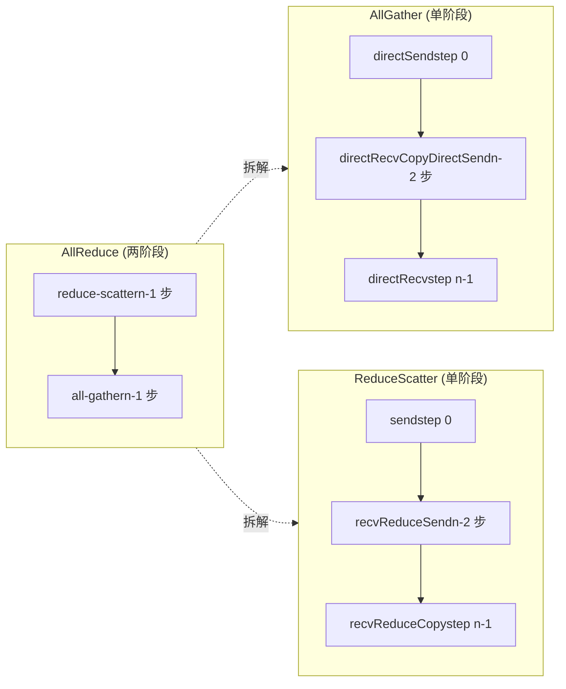
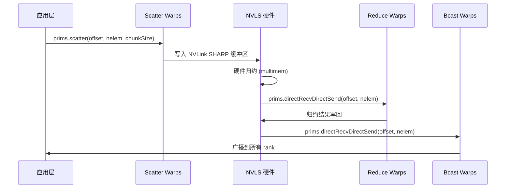

# Chapter 10: Collective Communication Algorithm Kernels: Device-Side Implementation of AllReduce, AllGather, ReduceScatter

The previous chapter broke down the three protocol primitives LL, LL128, and Simple. They are the "engines" of data movement, but the engines themselves do not know what to move, where to move it, or in what order. The set of algorithm kernel files under src/device that this chapter examines is the "gearbox" - they translate collective communication semantics such as AllReduce, AllGather, and ReduceScatter into a series of primitive calls such as prims.directSend and prims.directRecvReduceDirectSend. To summarize the core contradiction of this chapter in one sentence: for the same AllReduce, why are four completely different device-side implementations needed: Ring, Tree, CollNet, and NVLS? The answer lies in matching "data flow topology" with "hardware capabilities." Ring uses the least network bandwidth to perform two-stage pipelining, Tree uses tree-shaped reduction to reduce latency to log(n), and CollNet/NVLS offload reduction to the NIC or NVLink switch. This chapter examines them one by one.

# 10.1 Ring AllReduce: How two-stage pipelining is implemented inside the kernel

## Intuitive model: a "relay race" on a ring-shaped pipeline

Imagine n workers standing in a circle, each holding a box of raw materials. The goal of AllReduce is for everyone to ultimately receive the "finished product after all raw materials are mixed." The Ring algorithm works in two stages: in the first stage (reduce-scatter), each person passes the box along the ring, and at each stop mixes in their own raw materials. After n-1 stops, each person has exactly one "fully mixed" finished product, but only a 1/n share; in the second stage (all-gather), these finished-product shares are passed around the ring again, and each person completes all shares.

Without Ring, the most naive approach is for each rank to send data to the root, and after the root reduces it, broadcast it - the root's network bandwidth becomes the bottleneck, and the larger n is, the slower it gets. The brilliance of Ring is:**Each rank's send and receive volume is 2(n-1)/n times the data volume, flattened across all links regardless of n**。

## Data Structures and Memory Layout

The core state of the Ring algorithm is in the`ncclRing`structure (defined in device.h, not covered in this chapter),`runRing`only two fields are taken from it:

- `ring->index`: this rank's logical position in the ring, used to compute "which chunk to process at step j".
- `ring->prev` / `ring->next`: the predecessor and successor rank numbers, used as the`Primitives`constructor's recv/send peer parameters.

The key chunking parameters are computed by`ncclCollCbdPart`([FACT:src/device/all_reduce.h:21-22]）：

```
ncclCollCbdPart(work, ncclShmem.channelId, Proto::Id, sizeof(T), (ssize_t*)nullptr, &gridOffset, &channelCount, &chunkCount);
```

This function splits the entire communication domain's data by channel and outputs three values:`gridOffset`(the starting offset of the data this channel is responsible for within the entire buffer),`channelCount`(the total number of elements this channel is responsible for),`chunkCount`(the number of chunk elements each rank gets).`chunkCount`is the granularity of the Ring algorithm—one chunk is moved per step.

`loopCount = nranks * chunkCount`（[FACT:src/device/all_reduce.h:23]) represents the amount of data processed in "one full lap". The outer loop`for (elemOffset = 0; elemOffset < channelCount; elemOffset += loopCount)`（[FACT:src/device/all_reduce.h:34]) means: if the channel's data volume exceeds what one lap can process, it runs in multiple laps.

## Step-by-Step Walkthrough: The Complete Call Flow of a Ring AllReduce

Scenario: 4 ranks (nranks=4), this rank's`ringIx=0`，`chunkCount=100`，`channelCount=400`(exactly one lap).

**Step 0: Push "your own chunk" to the next GPU**（[FACT:src/device/all_reduce.h:42-47]）

```
chunk = modRanks(ringIx + nranks - 1);   // = 3
chunkOffset = chunk * chunkCount;         // = 300
offset = gridOffset + elemOffset + chunkOffset;
nelem = min(chunkCount, remCount - chunkOffset);
prims.directSend(offset, offset, nelem);
```

`modRanks`is a lambda that performs modulo-nranks subtraction ([FACT:src/device/all_reduce.h:40]）。`ringIx + nranks - 1`represents "this rank's previous chunk number". Why is chunk 3 sent at step 0? Because in the Ring's reduce-scatter phase, each rank first sends out the portion of data it "should not keep" (i.e., the predecessor rank's chunk).`directSend`only sends without receiving, because no data has been received yet at this point.

**Steps 1 to nranks-2: Receive, reduce, and forward simultaneously**（[FACT:src/device/all_reduce.h:50-56]）

```
for (int j = 2; j 计算 chunkCount/loopCount"] --> loop{"elemOffset |否| done["返回"]
    loop -->|是| s0["step 0: directSendchunk = ringIx-1"]
    s0 --> mid{"j 从 2 到 nranks-1?"}
    mid -->|是| s1["directRecvReduceDirectSendchunk = ringIx-j"]
    s1 --> mid
    mid -->|否| s2["step nranks-1directRecvReduceCopyDirectSendpostOp=true"]
    s2 --> ag{"j 从 1 到 nranks-2?"}
    ag -->|是| s3["directRecvCopyDirectSend纯转发"]
    s3 --> ag
    ag -->|否| s4["directRecv收最后一块"]
    s4 --> loop
```

## Design Thinking: Why Ring's chunk order goes "backwards"

Note the pattern of chunk numbering: step 0 sends`ringIx-1`, step j processes`ringIx-j`, the final step processes`ringIx+0`. This is**counterclockwise**progression. Why? Because each rank in Ring only keeps "the chunk it is responsible for reducing" (i.e.,`ringIx+0`), and all other chunks just pass through. Counterclockwise progression guarantees: when a chunk completes a full lap back to its starting point, it has exactly completed nranks reductions, producing the final result. If it progressed clockwise, the chunk would complete its reduction on the wrong rank.

## Production Pitfall:`remCount < loopCount`alignment trap when

[FACT:src/device/all_reduce.h:38]There is a line of code that is easy to overlook:

```
if (remCount = 256) nthreadsSplit += 64;
} else {
  nthreadsSplit = (nthreads * 7 / (10 * WARP_SIZE)) * WARP_SIZE;
}
```

Copy

The Simple protocol splits them evenly; the LL/LL128 protocols split them 7:3, because "receiving data from 3 sources for reduction" is more compute-intensive than "sending to 3 targets," so the reduction group gets more threads.`tid < nthreadsSplit`Then[FACT:src/device/all_reduce.h:175-202]threads perform reduction push-up ([FACT:src/device/all_reduce.h:203-224]), and the remaining threads perform broadcast push-down (`Proto::MaxGroupWidth`). The two groups distinguish their respective communication groups via the[FACT:src/device/all_reduce.h:189]offset (`0 * Proto::MaxGroupWidth`'s[FACT:src/device/all_reduce.h:210]and`1 * Proto::MaxGroupWidth`）。

## 's

Design Thinking: Why Tree's Root Node Needs Special Handling`directRecvReduceDirectSend`The root node of tree reduction is the "convergence point"; its receive volume is a multiple of the number of child nodes, and its send volume is zero (during the reduction phase). If the root node also went through the generic`tree->up`, it would try to send to`if (tree->up == -1)`(-1), causing an out-of-bounds error. Therefore, it must be handled separately with the`tree->down[0] == -1`branch. Similarly, the leaf node's

## check.

Production Pitfall: The "Hot Root" Problem of the Tree Algorithm**Tree's root node bears all reduction traffic. If the GPU where the root node resides happens to be a slow node (e.g., limited PCIe bandwidth), the entire AllReduce will be slowed down. NCCL's response is:**Each channel selects a different root`runTreeSplit`, distributing the root node's load across multiple ranks. This is why`FanSymmetric<NCCL_MAX_TREE_ARITY_TOP>`（[FACT:src/device/all_reduce.h:168]the root node branch uses

# )—it must handle reduction from multiple child nodes simultaneously. In production, if Tree AllReduce performance is uneven, check whether the channel's root node distribution is balanced.

## 10.3 AllGather and ReduceScatter: Ring's "Half-Journey" Variants

Intuitive Model: AllReduce Split into Two Halves

AllGather and ReduceScatter are essentially the two phases of AllReduce made into independent APIs. AllGather only does "gather"—each rank contributes a piece of data, and ultimately everyone gets all the data. ReduceScatter only does "reduce + scatter"—everyone contributes data, and after reduction each person gets one piece.

## Without these two independent APIs, when users want to do "reduce first, then gather" or "gather first, then reduce," they can only call AllReduce and then manually slice, wasting half the bandwidth.

`all_gather.h`AllGather's Ring Implementation`runRing`（[FACT:src/device/all_gather.h:14-88]'s

**) is simpler than AllReduce: no reduction, only copy-and-forward.**（[FACT:src/device/all_gather.h:51-60]）

```
rankDest = ringRanks[0];
offset = dataOffset + rankDest * count;
if ((inputBuf + dataOffset == outputBuf + offset) || isNetOffload) {
  prims.directSend(dataOffset, offset, nelem);
} else {
  prims.directCopySend(dataOffset, offset, nelem);
}
```

Copy`inputBuf + dataOffset == outputBuf + offset`There is an in-place check here: if`directSend`, it means input and output are the same memory block (in-place AllGather), directly`directCopySend`; otherwise

**(copy to output first, then send).**（[FACT:src/device/all_gather.h:62-67]）

```
prims.directRecvCopyDirectSend(offset, offset, nelem);
```

**Copy**（[FACT:src/device/all_gather.h:69-74]）

```
prims.directRecv(offset, nelem);
```

## Copy

[FACT:src/device/all_gather.h:28-36]isNetOffload: Single Warp Drives Network + Multiple Warps Copy in Parallel

```
if (isNetOffload) {
  workNthreads = WARP_SIZE;
  chunkCount = NCCL_MAX_NET_SIZE;
} else {
  workNthreads = nthreads;
}
```

Copy`isNetOffload=true`When[FACT:src/device/all_gather.h:76-82](single RPN + network registration mode), only 1 warp drives Ring communication, and the remaining warps perform "copy source data to target buffer" in parallel (

). This is to overlap copy overhead with communication overhead during non-in-place AllGather.`barrier_sync(14, nthreads)`（[FACT:src/device/all_gather.h:87]Finally there is a`__syncthreads()`。

## ), and the comment explains it clearly: must wait for all warps to complete, otherwise the next work may reuse outputBuf and cause a race. Barrier 14 is used to avoid prims' own barrier and

`reduce_scatter.h`ReduceScatter's Ring Implementation`runRing`（[FACT:src/device/reduce_scatter.h:14-56]'s

**) is the reduce-scatter phase of AllReduce extracted separately:**（[FACT:src/device/reduce_scatter.h:39-42]）

```
rankDest = ringRanks[nranks - 1];
offset = dataOffset + rankDest * count;
prims.send(offset, nelem);
```

**Copy**（[FACT:src/device/reduce_scatter.h:44-49]）

```
prims.recvReduceSend(offset, nelem);
```

**Copy**（[FACT:src/device/reduce_scatter.h:61-64]）

```
prims.recvReduceCopy(offset, dataOffset, nelem, /*postOp=*/true);
```

Note the last step's`recvReduceCopy`has two offsets:`offset`(receive source) and`dataOffset`(local input), the reduction result is written to`dataOffset`。

## Data flow comparison diagram



## Production pitfall: the boundary of in-place detection

[FACT:src/device/all_gather.h:55]'s in-place detection`inputBuf + dataOffset == outputBuf + offset`relies on exact pointer equality. If the sendbuff and recvbuff passed by the user have an offset but are logically the same memory block, this check will fail, causing it to take the`directCopySend`path—correct but with an extra copy. In production, when doing in-place AllGather, ensure sendbuff and recvbuff are exactly identical.

# 10.4 CollNet and NVLS: Offloading reduction to hardware

## Intuitive model: let the "switch" help with the computation

Ring and Tree both have "the GPU compute the reduction itself." CollNet and NVLS take a different approach: offload the reduction operation to the NIC (CollNet) or the NVLink switch (NVLS). The GPU is only responsible for sending data out, and the hardware completes the reduction and then broadcasts it back. This is like changing from "each worker mixing the ingredients themselves" to "sending the ingredients to a central blender, which mixes them and then distributes them."

Without hardware offload, the reduction operation occupies the GPU's SM resources, and the reduction latency cannot be hidden.

## Thread division of labor in CollNet Direct

`RunWorkColl<ncclFuncAllReduce, ..., NCCL_ALGO_COLLNET_DIRECT, ...>`'s`run`（[FACT:src/device/all_reduce.h:249-386]) divides threads into four groups:

```
const int nThreadsScatter = WARP_SIZE + ((hasUp && hasDn) ? COLLNET_COPY_THREADS : ...);
const int nThreadsGather = ((hasUp && hasDn) ? COLLNET_COPY_THREADS : ...);
const int nThreadsBcast = WARP_SIZE + ((hasUp && hasDn) ? COLLNET_COPY_THREADS : ...);
const int nThreadsReduce = work->nWarps * WARP_SIZE - nThreadsScatter - nThreadsGather - nThreadsBcast;
```

The four thread groups are respectively responsible for: Scatter (scattering data to each rail), Reduce (sending to the network after reduction), Gather (collecting from each rail), Bcast (broadcasting after receiving from the network).`COLLNET_COPY_THREADS = 96`（[FACT:src/device/all_reduce.h:250]) is the fixed number of copy threads.

## netRegUsed: buffer layout in network registration mode

[FACT:src/device/all_reduce.h:280-288]has a key branch:

```
if (work->netRegUsed) {
  offsetBase = bid * chunkSize;
  maxNelems = size;
  peerOffset = nChannels * chunkSize;
} else {
  offsetBase = bid * direct->nHeads * chunkSize;
  maxNelems = direct->nHeads * chunkSize;
  peerOffset = chunkSize;
}
```

`netRegUsed`In mode, buffers are arranged contiguously by channel (`bid * chunkSize`), and the peer offset is`nChannels * chunkSize`; in non-registered mode, they are arranged by head (`bid * nHeads * chunkSize`), and the peer offset is`chunkSize`. This difference stems from the fact that network registration mode requires buffers to be contiguous so that the NIC can perform DMA.

## NVLS warp allocation

`RunWorkColl<ncclFuncAllReduce, ..., NCCL_ALGO_NVLS, ...>`'s`run`（[FACT:src/device/all_reduce.h:391-523]) uses finer warp allocation:

```
const int bcastWarps = hasOut ? (work->regUsed ? ((totalWarps - 2) >> 1) - 1 : 2) : 0;
const int reduceWarps = work->regUsed ? (totalWarps - bcastWarps - 2) : (hasOut ? 3 : nranks regUsed ? 1 : (totalWarps - reduceWarps - bcastWarps + 1) >> 1;
const int gatherWarps = work->regUsed ? 1 : (totalWarps - reduceWarps - bcastWarps) >> 1;
```

`regUsed`In mode, scatter/gather each occupy only 1 warp (because NVLS hardware directly operates on registered memory), and reduce takes the majority; in non-registered mode, scatter/gather each take about half, and reduce is adjusted according to the number of ranks (≤6 uses 7 warps, otherwise 5 warps).

## Timing interaction diagram



## Production pitfall: CollNet's`direct->out == -1`trap

[FACT:src/device/reduce_scatter.h:521]has a line:

```
if (direct->out == -1) __trap();
```

If CollNet's out connection is not established (-1), directly`__trap()`causes the kernel to crash. This is defensive programming—CollNet depends on the NIC. If NIC initialization fails, out will be -1, and continuing execution at this point will lead to undefined behavior. In production, if you see a kernel trap, check whether the CollNet NIC is initialized properly.

# 10.5 Broadcast and Reduce: the two simplest collective operations

## Broadcast: fan-out from root

`broadcast.h`'s`runRing`（[FACT:src/device/broadcast.h:14-64]) logic is straightforward: the root node sends data, other nodes forward it, and the last node only receives.

```
if (rank == root) {
  if (inputBuf == outputBuf || isNetOffload) {
    prims.directSend(offset, offset, nelem);
  } else {
    prims.directCopySend(offset, offset, nelem);
  }
} else if (nextRank == root) {
  prims.directRecv(offset, nelem);
} else {
  prims.directRecvCopyDirectSend(offset, offset, nelem);
}
```

Three branches: root sends, root's predecessor receives, intermediate nodes forward. Note that`nextRank == root`checks whether "this node's next is root," that is, this node is the last on the ring—it only receives and does not send.

## Reduce: converge toward root

`reduce.h`'s`runRing`（[FACT:src/device/reduce.h:14-53]) is the inverse operation of Broadcast:

```
if (prevRank == root) {
  prims.send(offset, nelem);
} else if (rank == root) {
  prims.recvReduceCopy(offset, offset, nelem, /*postOp=*/true);
} else {
  prims.recvReduceSend(offset, nelem);
}
```

`prevRank == root`The node at

## Design consideration: why Broadcast/Reduce also use Ring

Broadcast and Reduce could theoretically use Tree to achieve lower latency, but NCCL chooses Ring because:**the data volume of these two operations is usually small, Ring's implementation is simpler, and it can reuse AllReduce's Ring code path**. Tree's complexity (root selection, thread splitting) does not bring obvious benefits in small-message scenarios.

## Production pitfall: Broadcast's root node bandwidth bottleneck

Broadcast's root node must send all data. If root is a slow node, the entire Broadcast is slowed down. NCCL's response is:**Broadcast also supports multiple channels, and each channel's root can be different**. But note that`work->root`is global, and all channels share the same root—this is determined by Broadcast's semantics (there is only one source). In production, if Broadcast is slow, check the root node's network bandwidth.

# 10.6 Algorithm selection matrix: RunWorkColl template specialization

All algorithm kernels are registered through`RunWorkColl`template specialization ([FACT:src/device/all_reduce.h:228-788]). Each specialization corresponds to a combination of "function × algorithm × protocol":

| Function | Algorithm | Protocol | Specialization location |
| --- | --- | --- | --- |
| AllReduce | RING | SIMPLE | [FACT:src/device/all_reduce.h:230-233] |
| AllReduce | TREE | SIMPLE | [FACT:src/device/all_reduce.h:238-244] |
| AllReduce | COLLNET_DIRECT | SIMPLE | [FACT:src/device/all_reduce.h:249-386] |
| AllReduce | NVLS | SIMPLE | [FACT:src/device/all_reduce.h:391-523] |
| AllReduce | NVLS_TREE | SIMPLE | [FACT:src/device/all_reduce.h:528-634] |
| AllReduce | COLLNET_CHAIN | SIMPLE | [FACT:src/device/all_reduce.h:639-759] |
| AllReduce | RING | LL | [FACT:src/device/all_reduce.h:764-766] |
| AllReduce | TREE | LL | [FACT:src/device/all_reduce.h:771-773] |
| AllReduce | RING | LL128 | [FACT:src/device/all_reduce.h:778-780] |
| AllReduce | TREE | LL128 | [FACT:src/device/all_reduce.h:785-787] |

Note:**CollNet and NVLS only support the SIMPLE protocol**. This is because these two algorithms rely on hardware offload, and the low-latency synchronization mechanisms of LL/LL128 are incompatible with hardware offload—the latency of hardware reduction is far greater than LL's flag polling, so using LL instead increases overhead.

## The inherent logic of protocol selection

- **LL**: Small messages (< 8KB), low latency prioritized. Both Ring and Tree support it.
- **LL128**: Medium messages (8KB - 1MB), 128-byte aligned. Both Ring and Tree support it.
- **SIMPLE**: Large messages (> 1MB), bandwidth prioritized. All algorithms support it.

## Production pitfalls: Combination constraints of protocols and algorithms

If the user forcibly specifies`NCCL_PROTO=LL`but the algorithm is CollNet, NCCL will fall back to SIMPLE during the tuning phase. In production, if you find that the protocol setting is not taking effect, check whether the algorithm supports that protocol.

# Design reflection: Why the same AllReduce logic needs so many implementations

Reviewing this chapter, AllReduce has six algorithm implementations: Ring, Tree, CollNet Direct, CollNet Chain, NVLS, and NVLS Tree. This is not redundancy, but rather**optimal solutions targeting different hardware topologies and message sizes**：

- **Ring**: General-purpose, suitable for large messages, highest bandwidth utilization.
- **Tree**: Suitable for large-scale clusters, latency O(log n).
- **CollNet**: Suitable for clusters with NICs that support reduction, offloading GPU computation.
- **NVLS**: Suitable for single-node NVLink full connectivity, hardware multicast reduction.

NCCL's tuning module (Chapter 5) automatically selects based on message size, number of ranks, and topology. The device-side implementation only needs to ensure "every combination is correct"; the selection logic is on the host side.

# Chapter Summary

This chapter dissected`src/device`six algorithm kernel files under

1. **Ring AllReduce**（[FACT:src/device/all_reduce.h:14-83]): Two-phase pipeline, reduce-scatter + all-gather, n-1 steps per phase.

2. **Tree AllReduce**（[FACT:src/device/all_reduce.h:86-225]): Tree reduction, latency O(log n),`runTreeSplit`uses thread splitting to implement reduction-broadcast pipeline.

3. **AllGather**（[FACT:src/device/all_gather.h:14-88]): Ring single-phase, supports in-place and netOffload.

4. **ReduceScatter**（[FACT:src/device/reduce_scatter.h:14-56]): Ring single-phase, is the reduce-scatter phase of AllReduce.

5. **Broadcast/Reduce**（[FACT:src/device/broadcast.h:14-64]、[FACT:src/device/reduce.h:14-53]): The simplest Ring variant.

6. **CollNet/NVLS**（[FACT:src/device/all_reduce.h:247-635]): Hardware offload, only supports SIMPLE protocol.

# Chapter Reflection and Self-Test

Q1: In the reduce-scatter phase of Ring AllReduce, step 0 uses`directSend`, intermediate steps use`directRecvReduceDirectSend`, and the last step uses`directRecvReduceCopyDirectSend`. If the last step's`postOp=true`is removed, in what scenarios would incorrect results occur?

**Reference Analysis**：`postOp=true`triggers post-operations (such as division when computing the average). Taking`ncclAvg`as an example, the reduction is summation, and postOp is division by nranks. If`postOp`is removed, the last step only performs reduction without division, and recvbuff stores the "sum" rather than the "average". In the reduce-scatter phase, each rank only retains the final result of one chunk, and this chunk happens to be`ringIx+0`（[FACT:src/device/all_reduce.h:60]). If postOp is missing, this chunk's sum is not divided by nranks, and the subsequent all-gather phase will propagate this incorrect "sum" to all ranks. Note: Only the last step needs postOp, because only this step produces a "complete reduction" result; intermediate steps' reductions are partial sums and do not need postOp. In production, if you find that AllReduce results are larger by a factor of nranks, check whether postOp is correctly passed.

Q2: `runTreeSplit`Under the LL/LL128 protocol, threads are split 7:3 ([FACT:src/device/all_reduce.h:163]), while under the Simple protocol they are split 1:1 ([FACT:src/device/all_reduce.h:157]). If the LL protocol is forcibly changed to 1:1 as well, what would happen?

**Reference Analysis**: The reduction group of LL/LL128 needs to receive data from up to 3 child nodes and perform reduction ([FACT:src/device/all_reduce.h:187]'s`FanAsymmetric<NCCL_MAX_TREE_ARITY, 1>`), which is computation-intensive; the broadcast group only performs copy-and-forward ([FACT:src/device/all_reduce.h:208]'s`FanAsymmetric<1, NCCL_MAX_TREE_ARITY>`), which is computation-light. The 7:3 split gives the reduction group enough threads to handle 3-way reduction, while the broadcast group has fewer threads but sufficient. If changed to 1:1, the reduction group would have insufficient threads, making reduction the bottleneck; the broadcast group would have excess threads, wasting resources. More seriously, LL protocol's flag polling is busy-waiting, and more threads increase flag contention. In production, if you find that Tree AllReduce performs abnormally under the LL protocol, check whether`nthreadsSplit`'s computation has been modified.

Q3: In AllGather's`isNetOffload`mode, only 1 warp drives Ring communication ([FACT:src/device/all_gather.h:32]), while the remaining warps copy in parallel ([FACT:src/device/all_gather.h:76-82]). If the final`barrier_sync(14, nthreads)`（[FACT:src/device/all_gather.h:87]) is removed, in what scenarios would data races occur?

**Reference Analysis**：`barrier_sync`Ensure all warps (including communication warps and copy warps) complete this work before proceeding to the next work. If removed, the communication warp might start the next work's communication while the copy warp hasn't finished writing outputBuf, and the next work might reuse the same outputBuf. Specific scenario: two consecutive AllGathers — the first copy warp is still writing the tail of outputBuf while the second communication warp has already started writing new data to outputBuf, causing the first data to be overwritten. The comment states it clearly: "otherwise, we can have contention if next work will use the outputBuf in this work". Using barrier 14 instead of the default barrier is to avoid the barrier inside prims and`__syncthreads()`, preventing deadlock. In production, if AllGather results show intermittent errors, check whether the barrier in the`isNetOffload`path has been optimized away.

At this point, we have seen how the device-side algorithm kernels organize data flow. Each algorithm calls the primitives from the previous chapter through`Primitives`, and the algorithm layer only cares about "who sends to whom, which chunk to send, reduce or copy". The next chapter will dive into the transport layer abstraction, examining how P2P, SHM, NET, and NVLS are unified into a single interface, and how host-side proxy threads cooperate with device-side kernels to accomplish cross-machine communication.

Core pattern: all algorithms call primitives through the Primitives template class; algorithms are only responsible for "data flow topology", while primitives handle "data movement". This layering allows new algorithms to implement only topology logic without worrying about low-level synchronization. But regardless of how the topology changes, data must ultimately be transmitted over physical links. The next chapter will dive into the src/transport directory to see how NCCL uses a unified transport interface to mask the differences between P2P, SHM, NET, and NVLS, and the setup/connect/send/recv semantics of each transport. This is the foundation for understanding cross-machine communication.
