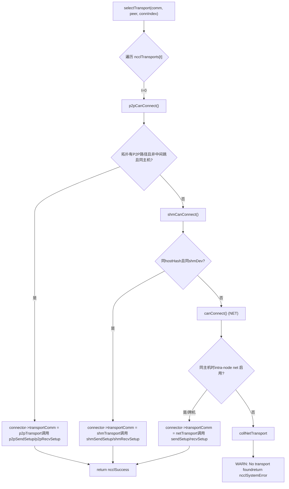
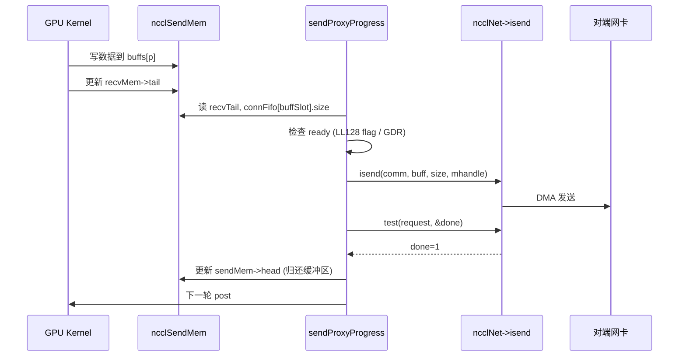

# Chapter 11: Transport Layer Abstraction: How P2P, SHM, NET, and NVLS Are Unified Under a Single Interface

In the previous chapter, we delved into the algorithm kernels and saw how Ring AllReduce splits data and performs two-phase reduction, and how Tree AllReduce leverages a tree structure to lower latency — but these algorithms only define the logical view of "who sends to whom, which chunk to send". Data must ultimately traverse real physical links: NVLink, PCIe, shared memory, or network cards. This chapter dissects the src/transport directory to see how NCCL uses a unified ncclTransport interface to mask the four physical channels — P2P, SHM, NET, and NVLS — behind a single facade, completing the last mile from algorithm topology to physical transmission.

# I. Unified Interface: How ncclTransport Masks Four Physical Channels

## Intuitive Model

Imagine a logistics company: whether a customer is sending a same-city express (P2P), intra-building delivery (SHM), cross-province transport (NET), or dedicated line direct delivery (NVLS), the front desk only fills out one "waybill". This waybill is the`ncclTransport`struct — it specifies the fixed actions each transport method must provide, such as`canConnect`、`setup`、`connect`、`free`. Without this layer of abstraction, upper-layer algorithms would have to write four sets of`if-else`to determine which link to use, and adding a new hardware type would require modifying all algorithms.

## Data Structures and Memory Layout

NCCL uses a global array to register all transports, with order determining priority:

[FACT:src/transport.cc:15-20]

```c
struct ncclTransport* ncclTransports[NTRANSPORTS] = {
  &p2pTransport,
  &shmTransport,
  &netTransport,
  &collNetTransport,
};
```

The array order determines selection order: P2P first, then SHM, then NET, and finally CollNet. Each transport is described by a`ncclTransport`struct, which contains a`canConnect`function pointer and two`ncclTransportComm`(one each for send/recv). Taking P2P as an example:

[FACT:src/transport/p2p.cc:1493-1498]

```c
struct ncclTransport p2pTransport = {"P2P",
                                     p2pCanConnect,
                                     {p2pSendSetup, p2pSendConnect, p2pSendFree, NULL, p2pSendProxySetup, NULL,
                                      p2pSendProxyFree, NULL, p2pProxyRegister, p2pProxyDeregister},
                                     {p2pRecvSetup, p2pRecvConnect, p2pRecvFree, NULL, p2pRecvProxySetup, NULL,
                                      p2pRecvProxyFree, NULL, p2pProxyRegister, p2pProxyDeregister}};
```

`ncclTransportComm`The field order of`setup`is a fixed "lifecycle slot" sequence:`connect`(prepare resources),`free`(exchange connection info),`proxySharedInit`(release),`proxySetup`、`proxyConnect`、`proxyFree`、`proxyProgress`、`proxyRegister`、`proxyDeregister`(proxy shared initialization),`proxyProgress`. Note that P2P's`NULL`slot is`proxyProgress`— because P2P uses the GPU to directly read/write the peer's memory, without needing host proxy threads to move data; while NET's`sendProxyProgress`/`recvProxyProgress`is

## , because network card I/O must be driven by host threads.

Scenario-Driven Walkthrough: How a Connection Selects a Transport`selectTransport`：

[FACT:src/transport.cc:23-44]

```c
template 
static ncclResult_t selectTransport(struct ncclComm* comm, struct ncclTopoGraph* graph, struct ncclConnect* connect,
                                    int channelId, int peer, int connIndex, int* transportType) {
  struct ncclPeerInfo* myInfo = comm->peerInfo + comm->rank;
  struct ncclPeerInfo* peerInfo = comm->peerInfo + peer;
  struct ncclConnector* connector = (type == 1) ? comm->channels[channelId].peers[peer]->send + connIndex :
                                                  comm->channels[channelId].peers[peer]->recv + connIndex;
  for (int t = 0; t send : &transport->recv;
    int ret = 0;
    NCCLCHECK(transport->canConnect(&ret, comm, graph, myInfo, peerInfo));
    if (ret) {
      connector->transportComm = transportComm;
      NCCLCHECK(transportComm->setup(comm, graph, myInfo, peerInfo, connect, connector, channelId, connIndex));
      if (transportType) *transportType = t;
      return ncclSuccess;
    }
  }
  WARN("No transport found for rank %d[%lx] -> rank %d[%lx]", myInfo->rank, myInfo->busId, peerInfo->rank,
       peerInfo->busId);
  return ncclSystemError;
}
```

`type==1`indicates the send direction,`type==0`indicates the recv direction. The loop queries each transport's`canConnect`in turn: returning`ret=1`means "I can do this job", immediately pointing`connector->transportComm`to the corresponding direction of that transport, and calling its`setup`. If all transports return 0, print a warning and return`ncclSystemError`。

`canConnect`'s decision logic embodies each transport's "territory boundaries". Taking P2P as an example:

[FACT:src/transport/p2p.cc:129-157]

```c
ncclResult_t p2pCanConnect(int* ret, struct ncclComm* comm, struct ncclTopoGraph* graph, struct ncclPeerInfo* info1,
                           struct ncclPeerInfo* info2) {
  initCeOperation();
  int intermediateRank;
  int isCrossClique;
  NCCLCHECK(ncclTopoCheckP2p(comm, comm->topo, info1->rank, info2->rank, ret, NULL, &intermediateRank, NULL,
                             &isCrossClique));
  if (*ret == 0) return ncclSuccess;
  if (intermediateRank != -1) {
    if (useMemcpy) *ret = 0;
    return ncclSuccess;
  }
  if (!isCrossClique) {
    int useNet = 0;
    NCCLCHECK(ncclTopoCheckNet(comm->topo, info1->rank, info2->rank, &useNet));
    if (useNet) {
      *ret = 0;
      return ncclSuccess;
    }
  }
  if (info1->hostHash != comm->peerInfo[comm->rank].hostHash || info1->hostHash != info2->hostHash) {
    return ncclSuccess;
  }
  ...
```

P2P's decision chain: first ask the topology "is there a P2P path between the two ranks"; if there are intermediate hops (`intermediateRank != -1`) and CE memcpy is enabled, give up P2P and yield to SHM/NET; if the topology suggests going over the network (`useNet`), also give up; finally check whether they are on the same host. SHM's decision is simpler:

[FACT:src/transport/shm.cc:61-83]

```c
static ncclResult_t shmCanConnect(int* ret, struct ncclComm* comm, struct ncclTopoGraph* graph,
                                  struct ncclPeerInfo* info1, struct ncclPeerInfo* info2) {
  *ret = 0;
  initShmLocality();
  if (ncclParamShmDisable() == 1) return ncclSuccess;
  int useNet = 0;
  NCCLCHECK(ncclTopoCheckNet(comm->topo, info1->rank, info2->rank, &useNet));
  if (useNet) return ncclSuccess;
  if (info1->hostHash != info2->hostHash) return ncclSuccess;
  if (info1->shmDev != info2->shmDev) return ncclSuccess;
  *ret = 1;
  return ncclSuccess;
}
```

SHM requires the same host (`hostHash`identical) and sharing the same`/dev/shm`（`shmDev`identical, used for inter-container communication). NET almost always returns 1, only checking whether intra-node net is disabled when on the same host:

[FACT:src/transport/net.cc:160-168]

```c
static ncclResult_t canConnect(int* ret, struct ncclComm* comm, struct ncclTopoGraph* graph, struct ncclPeerInfo* info1,
                               struct ncclPeerInfo* info2) {
  *ret = 1;
  if (info1->hostHash == info2->hostHash) {
    NCCLCHECK(ncclTopoCheckNet(comm->topo, info1->rank, info2->rank, ret));
  }
  return ncclSuccess;
}
```

NET is the "fallback" — as long as no one ahead takes it, it takes it. NVLS's`canConnect`directly returns 0:

[FACT:src/transport/nvls.cc:21-26]

```c
ncclResult_t nvlsCanConnect(int* ret, struct ncclComm* comm, struct ncclTopoGraph* graph, struct ncclPeerInfo* info1,
                            struct ncclPeerInfo* info2) {
  // This transport cannot be used for p2p
  *ret = 0;
  return ncclSuccess;
}
```

NVLS does not go through the regular peer-to-peer connection path; it establishes multicast groups separately via`ncclNvlsSetup`, so`canConnect`always returns 0.



## Design Thinking

> **[Design Inference & Architectural Trade-offs]**
> Why use "array order + canConnect voting" instead of an explicit routing table? Because the topology is dynamic: the same machine may have P2P unavailable due to factors such as`NCCL_P2P_DISABLE`, container isolation, CUDA IPC availability, etc., in which case it automatically degrades to SHM or NET. The voting mechanism lets each transport judge for itself "can I do this", and adding a new transport only requires adding an entry to the array, without changing the selection logic. This is precisely the embodiment of the open-closed principle in systems programming.

# II. P2P: Four Forms of Same-Machine GPU Direct Connection

## Intuitive Model

P2P is "handing things directly between neighbors" — GPU 0 directly reads and writes GPU 1's memory, without going through the CPU or NIC. Without P2P, same-machine multi-GPU communication would have to detour through host memory, doubling latency and halving bandwidth.

## Data Structures and Memory Layout

P2P has four internal forms, distinguished by`enum p2pType`:

[FACT:src/transport/p2p.cc:19-24]

```c
enum p2pType {
  P2P_DIRECT,
  P2P_INTERMEDIATE,
  P2P_IPC,
  P2P_CUMEM
};
```

- `P2P_DIRECT`: different GPUs within the same process, accessed directly via pointers (fastest).
- `P2P_INTERMEDIATE`: no direct connection between the two GPUs, requiring forwarding through an intermediate GPU.
- `P2P_IPC`: cross-process, using the traditional`cudaIpcOpenMemHandle`to import the peer's memory.
- `P2P_CUMEM`: cross-process, using the cuMem API (`cuMemExportToShareableHandle`) to import, supporting finer-grained memory management.

Core resource struct:

[FACT:src/transport/p2p.cc:79-94]

```c
struct p2pResources {
  enum p2pType type;
  union {
    struct ncclSendMem* sendDevMem;
    struct ncclRecvMem* recvDevMem;
  };
  void* sendMemIpc;
  int sendMemSameProc;
  void* recvMemIpc;
  int recvMemSameProc;
  // CE memcpy support
  struct p2pShmProxyInfo proxyInfo;
  struct p2pShm* shm;
  struct p2pShm* devShm;
  ncclShmIpcDesc_t desc;
};
```

`sendDevMem`/`recvDevMem`is a union — the sender only cares about`sendDevMem`, the receiver only cares about`recvDevMem`, sharing one block of memory.`sendMemIpc`/`recvMemIpc`stores the imported peer memory handle,`sendMemSameProc`/`recvMemSameProc`marks whether it is the same process (determining whether to use`ncclCuMemFreeAddr`or`cudaIpcCloseMemHandle`）。

when releasing).`p2pConnectInfo`The connection info struct

[FACT:src/transport/p2p.cc:38-44]

```c
struct p2pConnectInfo {
  int rank;
  int read;
  struct ncclP2pBuff p2pBuff;
  // Used by CE memcpy
  ncclShmIpcDesc_t desc;
};
static_assert(sizeof(struct p2pConnectInfo) transportResources = resources;
  int useRead, intermediateRank;
  NCCLCHECK(p2pGetInfo(comm, myInfo, peerInfo, &useRead, &intermediateRank));
  if (useMemcpy) useRead = 0;
  ...
  int sendSize = sizeof(struct ncclSendMem);
  if (info->read) sendSize += comm->buffSizes[NCCL_PROTO_SIMPLE];
  ALIGN_SIZE(sendSize, CUDA_IPC_MIN);
  ...
```

Copy`sendSize`Key points:`ncclSendMem`In P2P Read mode, the SIMPLE protocol buffer size must be added extra — because in read mode the sender's SIMPLE buffer is directly read by the receiver, it must be allocated together with`ALIGN_SIZE(sendSize, CUDA_IPC_MIN)`in the same shareable memory block.

ensures the size is aligned to the CUDA IPC minimum granularity.`intermediateRank`Then, based on

[FACT:src/transport/p2p.cc:416-437]

```c
  if (intermediateRank == -1) {
    info->rank = myInfo->rank;
    if (P2P_SAME_PID(myInfo, peerInfo) && ncclParamP2pDirectDisable() == 0 && useMemcpy == 0) {
      resources->type = P2P_DIRECT;
      ...
    } else {
      if (ncclCuMemEnable()) {
        resources->type = P2P_CUMEM;
        ...
      } else {
        resources->type = P2P_IPC;
        ...
      }
    }
    send->conn.flags |= info->read ? NCCL_P2P_READ : NCCL_P2P_WRITE;
  } else {
    resources->type = P2P_INTERMEDIATE;
    info->rank = intermediateRank;
    ...
  }
```

`P2P_SAME_PID`Copy

[FACT:src/transport/p2p.cc:334-335]

```c
#define P2P_SAME_PID(MYINFO, PEERINFO) \
  ((MYINFO->hostHash == PEERINFO->hostHash) && (MYINFO->pidHash == PEERINFO->pidHash))
```

Copy`P2P_DIRECT`Same process and direct not disabled and memcpy not enabled means the fastest

— directly taking the peer pointer. Otherwise go through IPC/CUMEM.

[FACT:src/transport/p2p.cc:457-468]

```c
  NCCLCHECK(ncclProxyConnect(comm, TRANSPORT_P2P, 1, info->rank, &send->proxyConn));
  if (useMemcpy) {
    NCCLCHECK(ncclProxyCallBlocking(comm, &send->proxyConn, ncclProxyMsgSetup, NULL, 0, &resources->proxyInfo,
                                    sizeof(struct p2pShmProxyInfo)));
    memcpy(&info->desc, &resources->proxyInfo.desc, sizeof(ncclShmIpcDesc_t));
  } else {
    NCCLCHECK(ncclProxyCallBlocking(comm, &send->proxyConn, ncclProxyMsgSetup, &req, sizeof(struct ncclP2pRequest),
                                    &info->p2pBuff, sizeof(struct ncclP2pBuff)));
    NCCLCHECK(p2pMap(comm, &send->proxyConn, myInfo, comm->peerInfo + info->rank, &info->p2pBuff,
                     (void**)&resources->sendDevMem, &resources->sendMemIpc));
    resources->sendMemSameProc = P2P_SAME_PID(myInfo, (comm->peerInfo + info->rank));
  }
```

`ncclProxyCallBlocking`Copy`p2pSendProxySetup`is a synchronous RPC: the host thread sends a message to the proxy thread, the proxy thread calls`ncclP2pBuff`to allocate a shareable buffer, and sends back`p2pMap`(including the IPC handle). Then

`p2pMap`maps the peer buffer into the local address space.

[FACT:src/transport/p2p.cc:349-390]

```c
static ncclResult_t p2pMap(struct ncclComm* comm, struct ncclProxyConnector* proxyConn, struct ncclPeerInfo* myInfo,
                           struct ncclPeerInfo* peerInfo, struct ncclP2pBuff* p2pBuff, void** devMem, void** ipcPtr) {
  if (P2P_SAME_PID(myInfo, peerInfo)) {
    if (peerInfo->cudaDev != myInfo->cudaDev) {
      cudaError_t err = cudaDeviceEnablePeerAccess(peerInfo->cudaDev, 0);
      ...
      if (ncclCuMemEnable()) {
        NCCLCHECK(ncclCuMemAllocAddr(devMem, &p2pBuff->ipcDesc.memHandle, p2pBuff->size));
        CUCHECK(cuMemRelease(p2pBuff->ipcDesc.memHandle));
        *ipcPtr = *devMem;
        ...
      } else {
        *devMem = p2pBuff->directPtr;
        *ipcPtr = NULL;
      }
    } else {
      *devMem = p2pBuff->directPtr;
      *ipcPtr = NULL;
    }
  } else {
    NCCLCHECK(ncclP2pImportShareableBuffer(comm, peerInfo->rank, p2pBuff->size, &p2pBuff->ipcDesc, devMem,
                                           p2pBuff->directPtr, ncclMemOffload));
    *ipcPtr = *devMem;
  }
  return ncclSuccess;
}
```

Copy`cudaDeviceEnablePeerAccess`Same process, different GPUs: first`directPtr`opens the P2P channel, then directly uses`ncclP2pImportShareableBuffer`(because the same process shares the address space). Cross-process: calls

## to import the peer memory handle.

Concurrency Control and Hardware Interaction`ncclSendMem`/`ncclRecvMem`P2P synchronization relies on the`head`/`tail`pointer in`head`. The sender writes`tail`to tell the receiver "how far I've written", and the receiver writes

[FACT:src/transport/p2p.cc:571-576]

```c
  } else {
    send->conn.tail = &remDevMem->tail;
    send->conn.head = &resources->sendDevMem->head;
    send->conn.ptrExchange = &resources->sendDevMem->ptrExchange;
    send->conn.redOpArgExchange = resources->sendDevMem->redOpArgExchange;
  }
```

`head`Copy`sendDevMem`，`tail`points to the local`remDevMem`points to the peer

## . The GPU kernel achieves cross-GPU synchronization by reading and writing these two pointers, without CPU intervention.

**Production Pitfall Guide**Pitfall 1: P2P Read and memcpy are mutually exclusive.`p2pSendConnect`：

[FACT:src/transport/p2p.cc:551-559]

```c
  for (int p = 0; p read && p == NCCL_PROTO_SIMPLE) {
      /* For P2P Read the SIMPLE buffer is local (ncclSendMem) */
      if (resources->sendDevMem == NULL) return ncclInternalError; // We should not use read + memcpy
      send->conn.buffs[p] = (char*)(resources->sendDevMem + 1);
    } else {
      send->conn.buffs[p] = buff;
      buff += comm->buffSizes[p];
    }
  }
```

Copy`read=1`If`sendDevMem==NULL`but`ncclInternalError`, directly return`NCCL_P2P_READ_ENABLE=1`. If you see this error in production, check whether both`NCCL_P2P_USE_CUDA_MEMCPY=1`and

**are set — these two have conflicting semantics.** `p2pSendFree`Pitfall 2: Cross-process release order.`sendMemSameProc`Determines the release method based on

[FACT:src/transport/p2p.cc:624-651]

```c
ncclResult_t p2pSendFree(struct ncclComm* comm, struct ncclConnector* send) {
  struct p2pResources* resources = (struct p2pResources*)send->transportResources;
  if (resources) {
    if (ncclCuMemEnable()) {
      if (resources->sendMemIpc) {
        if (resources->sendMemSameProc) {
          NCCLCHECK(ncclCuMemFreeAddr(resources->sendMemIpc, comm->memManager));
        } else {
          NCCLCHECK(ncclCudaFree(resources->sendMemIpc, comm->memManager));
        }
      }
      ...
```

Copy`ncclCuMemFreeAddr`Same process uses`ncclCudaFree`(release physical memory). Getting this backwards causes memory leaks or use-after-free.

# 3. SHM: The "Who Hosts the Memory" Debate in Shared Memory

## Intuitive Model

SHM is "two processes sharing a whiteboard"—the sender writes, the receiver reads. But whose house is the whiteboard in? At the sender's house (sender-side), with the receiver coming over to read? Or at the receiver's house (receiver-side), with the sender going over to write? This is the problem that the`NCCL_SHM_LOCALITY`parameter is meant to solve.

## Data Structures and Memory Layout

[FACT:src/transport/shm.cc:28-34]

```c
struct shmSendResources {
  struct ncclRecvMem* remHostMem;
  struct ncclRecvMem* devRemHostMem;
  ncclShmIpcDesc_t remDesc;
  struct ncclSendMem* hostMem;
  struct ncclSendMem* devHostMem;
};

struct shmRecvResources {
  struct ncclSendMem* remHostMem;
  struct ncclSendMem* devRemHostMem;
  ncclShmIpcDesc_t remDesc;
  struct ncclRecvMem* hostMem;
  struct ncclRecvMem* devHostMem;
};
```

Note that`hostMem`and`devHostMem`appear in pairs:`hostMem`is the host-side pointer,`devHostMem`is the device-side pointer (mapped via UVA or cuMem).`remHostMem`/`devRemHostMem`is the local mapping of the peer's shared memory.

## Scenario-Driven Walkthrough: SHM's locality Selection

`shmSendSetup`determines how much memory to allocate based on locality:

[FACT:src/transport/shm.cc:88-119]

```c
static ncclResult_t shmSendSetup(struct ncclComm* comm, struct ncclTopoGraph* graph, struct ncclPeerInfo* myInfo,
                                 struct ncclPeerInfo* peerInfo, struct ncclConnect* connectInfo,
                                 struct ncclConnector* send, int channelId, int connIndex) {
  struct shmSendResources* resources;
  struct shmConnectInfo* info = (struct shmConnectInfo*)connectInfo;
  size_t shmSize = sizeof(struct ncclSendMem);
  struct shmRequest req;

  NCCLCHECK(ncclCalloc(&resources, 1));
  send->transportResources = resources;

  if (shmLocality == SHM_SEND_SIDE) {
    for (int p = 0; p buffSizes[p];
  }
  req.size = shmSize;
  if (myInfo->hostHash == peerInfo->hostHash && myInfo->pidHash == peerInfo->pidHash) req.legacy = true;
  else req.legacy = false;

  NCCLCHECK(ncclProxyConnect(comm, TRANSPORT_SHM, 1, myInfo->rank, &send->proxyConn));
  NCCLCHECK(ncclProxyCallBlocking(comm, &send->proxyConn, ncclProxyMsgSetup, (void*)&req, sizeof(struct shmRequest),
                                  (void*)info, sizeof(struct shmConnectInfo)));

  info->rank = comm->rank;
  resources->hostMem = (struct ncclSendMem*)info->buf.hptr;
  resources->devHostMem = (struct ncclSendMem*)info->buf.dptr;
  ...
```

`shmLocality == SHM_SEND_SIDE`When , the sender allocates the data buffer (`shmSize`plus all protocol buffers); otherwise it only allocates the`ncclSendMem`control structure.`req.legacy`marks whether it's the same process—same process can use traditional`mmap`, cross-process requires cuMem or`/dev/shm`files.

`shmSendConnect`determines based on locality whether`buffs`points to local or peer:

[FACT:src/transport/shm.cc:153-176]

```c
static ncclResult_t shmSendConnect(struct ncclComm* comm, struct ncclConnect* connectInfo, int nranks, int rank,
                                   struct ncclConnector* send) {
  struct shmConnectInfo* info = (struct shmConnectInfo*)connectInfo;
  struct shmSendResources* resources = (struct shmSendResources*)send->transportResources;
  char* buff;

  NCCLCHECK(ncclShmImportShareableBuffer(comm, info->rank, &info->desc, (void**)&resources->remHostMem,
                                         (void**)&resources->devRemHostMem, &resources->remDesc));

  buff = shmLocality == SHM_SEND_SIDE ? (char*)(resources->devHostMem + 1) : (char*)(resources->devRemHostMem + 1);
  for (int p = 0; p conn.buffs[p] = buff;
    buff += comm->buffSizes[p];
  }
  send->conn.tail = &resources->devRemHostMem->tail;
  send->conn.head = &resources->devHostMem->head;
  send->conn.stepSize = comm->buffSizes[NCCL_PROTO_SIMPLE] / NCCL_STEPS;
  ...
```

`SHM_SEND_SIDE`：`buffs`points to local`devHostMem`(the sender writes its own memory);`SHM_RECV_SIDE`：`buffs`points to peer`devRemHostMem`(the sender writes the receiver's memory).`head`always points to local,`tail`always points to peer—because the sender updates`head`, and the receiver updates`tail`。

## Design Considerations

> **[Design Inference & Architectural Trade-offs]**
> Why default to`SHM_RECV_SIDE`? Because the receiver typically needs to copy data from shared memory to its own GPU memory. If the shared memory is local to the receiver, the copy path is shorter (local memory → local GPU), avoiding cross-NUMA access. Although the sender writing to remote memory incurs an extra cross-node write, the sender is usually a compute-intensive GPU, and write operations can proceed asynchronously.

## Production Pitfall Guide

**Pitfall: Between containers,`/dev/shm`is not shared.** `shmCanConnect`Check`info1->shmDev != info2->shmDev`：

[FACT:src/transport/shm.cc:76-78]

```c
  TRACE(NCCL_INIT | NCCL_SHM, "peer1 shmDev %lx peer2 shmDev %lx", info1->shmDev, info2->shmDev);
  if (info1->shmDev != info2->shmDev) return ncclSuccess;
```

If two containers mount different`/dev/shm`，`shmDev`differ, SHM automatically degrades to NET. In production, if you find same-host communication going over the network, check whether the containers'`/dev/shm`mounts are consistent.

# 4. NET: Network Transport's Mapping Table and Proxy Progress

## Intuitive Model

NET is "intercity express delivery"—data is packaged and handed to the NIC, which sends it to the peer over fiber. But the NIC doesn't understand GPU memory addresses; it needs an "address mapping table" to translate GPU virtual addresses into physical addresses the NIC can understand. This table is`connectMap`。

## Data Structures and Memory Layout

[FACT:src/transport/net.cc:73-86]

```c
struct connectMapMem {
  char* gpuPtr;
  char* cpuPtr;
  ssize_t size;
  ncclIpcDesc ipcDesc;
  ncclShmIpcDesc_t attachDesc;
  ncclShmIpcDesc_t createDesc;
};

struct connectMap {
  int sameProcess;
  int shared;
  int cudaDev;
  // First 3 bits of offsets determine the mem bank. 001 is host mem, 011 is dev mem, 101 is shared host mem and 111
  // is shared dev mem.
  struct connectMapMem mems[NCCL_NET_MAP_MEMS];
  // Offsets. 3 MSBs indicate mem bank, 111 indicates NULL.
  struct {
    uint32_t sendMem;
    uint32_t recvMem;
    uint32_t buffs[NCCL_NUM_PROTOCOLS];
  } offsets;
};
```

`connectMap`is a "memory bank" system:`mems`The array has 5 slots (`NCCL_NET_MAP_MEMS=5`), corresponding to host mem, dev mem, shared host mem, shared dev mem, and GDC mem.`offsets`Each field in is a 32-bit integer; the upper 3 bits encode "which bank," and the lower 29 bits encode "offset within the bank."

Decoding macro:

[FACT:src/transport/net.cc:36-46]

```c
#define NCCL_NET_MAP_OFFSET_BANK(mapStruct, offsetName) ((mapStruct)->offsets.offsetName >> 30)

#define NCCL_NET_MAP_OFFSET_NULL(mapStruct, offsetName) (((mapStruct)->offsets.offsetName >> 29) == 0)

#define NCCL_NET_MAP_GET_POINTER(mapStruct, cpuOrGpu, offsetName) \
  (NCCL_NET_MAP_OFFSET_NULL(mapStruct, offsetName) ? \
     NULL : \
     (mapStruct)->mems[NCCL_NET_MAP_OFFSET_BANK(mapStruct, offsetName)].cpuOrGpu##Ptr + \
       ((mapStruct)->offsets.offsetName & NCCL_NET_MAP_MASK_OFFSET))

#define NCCL_NET_MAP_DEV_MEM(mapStruct, offsetName) (((mapStruct)->offsets.offsetName & NCCL_NET_MAP_MASK_DEVMEM) != 0)
```

`NCCL_NET_MAP_GET_POINTER(map, gpu, sendMem)`After expansion: take`offsets.sendMem`'s upper 2 bits as the bank index, add the lower 29-bit offset to`mems[bank].gpuPtr`, to get the actual pointer. This encoding compresses "which memory region + offset within the region" into a single 32-bit integer, saving`connectMap`'s transmission size.

## Scenario-Driven Walkthrough: Mapping Establishment in sendProxyConnect

`sendProxyConnect`is NET's most complex function, responsible for establishing the NIC connection, allocating buffers, and registering memory:

[FACT:src/transport/net.cc:858-1041]

```c
static ncclResult_t sendProxyConnect(struct ncclProxyConnection* connection, struct ncclProxyState* proxyState,
                                     void* reqBuff, int reqSize, void* respBuff, int respSize, int* done) {
  struct sendNetResources* resources = (struct sendNetResources*)(connection->transportResources);
  ...
  if (resources->shared) {
    // Shared buffers
    ...
    if (resources->maxRecvs > 1 && ncclParamNetSharedComms()) {
      // Connect or reuse connection for a netdev/remote rank.
      ...
      if (comms->sendComm[resources->channelId] == NULL &&
          comms->activeConnect[resources->channelId] == (resources->tpLocalRank + 1)) {
        ret = proxyState->ncclNet->connect(proxyState->netContext, resources->netDev, req->handle,
                                           comms->sendComm + resources->channelId, &resources->netDeviceHandle);
      }
      ...
```

`maxRecvs > 1`When , "shared connection" is enabled: multiple channels reuse the same NIC connection, reducing the connection count.`activeConnect`The array ensures only one local rank initiates the connection, avoiding duplication.

Next, allocate buffers and register:

[FACT:src/transport/net.cc:933-956]

```c
  if (resources->shared == 0) {
    // Only allocate dedicated buffers for ring/tree, not for p2p
    for (int p = 0; p useGdr ? 1 : 0, proxyState->buffSizes[p],
                               buffs[p]);
      resources->buffSizes[p] = proxyState->buffSizes[p];
    }
  } else {
    // Get shared buffers
    int bank = resources->useGdr ? NCCL_NET_MAP_SHARED_DEVMEM : NCCL_NET_MAP_SHARED_HOSTMEM;
    struct connectMapMem* mapMem = map->mems + bank;
    NCCLCHECK(sharedNetBuffersInit(proxyState, resources->useGdr, resources->tpLocalRank, 0, map->sameProcess,
                                   proxyState->p2pnChannels, &mapMem->gpuPtr, &mapMem->cpuPtr, &mapMem->size,
                                   &mapMem->ipcDesc));
    resources->buffSizes[NCCL_PROTO_SIMPLE] = mapMem->size;
    ...
```

`NCCL_NET_MAP_ADD_POINTER`The macro registers the buffer to`connectMap`：

[FACT:src/transport/net.cc:48-62]

```c
#define NCCL_NET_MAP_ADD_POINTER(mapStruct, shared, dev, memSize, offsetName) \
  do { \
    int bank = NCCL_NET_MAP_MASK_USED + (dev) * NCCL_NET_MAP_MASK_DEVMEM + (shared) * NCCL_NET_MAP_MASK_SHARED; \
    if ((shared) == 0) { \
      if (dev) { \
        (mapStruct)->offsets.offsetName = bank + (mapStruct)->mems[NCCL_NET_MAP_DEVMEM].size; \
        (mapStruct)->mems[NCCL_NET_MAP_DEVMEM].size += memSize; \
      } else { \
        (mapStruct)->offsets.offsetName = bank + (mapStruct)->mems[NCCL_NET_MAP_HOSTMEM].size; \
        (mapStruct)->mems[NCCL_NET_MAP_HOSTMEM].size += memSize; \
      } \
    } else { \
      (mapStruct)->offsets.offsetName = bank; \
    } \
  } while (0);
```

Non-shared buffer: write the current bank's`size`as the offset into`offsets`, then`size += memSize`—this is a bump allocator. Shared buffer: directly write the bank number with offset 0 (because the entire shared buffer is one bank).

Finally, register the memory with the NIC:

[FACT:src/transport/net.cc:1004-1035]

```c
  for (int p = 0; p buffers[p] = NCCL_NET_MAP_GET_POINTER(map, cpu, buffs[p]);
    if (resources->buffers[p]) {
#if CUDA_VERSION >= 11070
      int type = NCCL_NET_MAP_DEV_MEM(map, buffs[p]) ? NCCL_PTR_CUDA : NCCL_PTR_HOST;
      if (type == NCCL_PTR_CUDA && resources->useDmaBuf) {
        int dmabuf_fd;
        size_t dmaBufSize = resources->buffSizes[p];
        ALIGN_SIZE(dmaBufSize, ncclOsGetPageSize());
        CUCHECK(cuMemGetHandleForAddressRange((void*)&dmabuf_fd, (CUdeviceptr)resources->buffers[p], dmaBufSize,
                                              CU_MEM_RANGE_HANDLE_TYPE_DMA_BUF_FD,
                                              getHandleForAddressRangeFlags(resources->useGdr)));
        NCCLCHECK(proxyState->ncclNet->regMrDmaBuf(resources->netSendComm, resources->buffers[p],
                                                   resources->buffSizes[p], type, 0ULL, dmabuf_fd,
                                                   &resources->mhandles[p]));
        (void)close(dmabuf_fd);
      } else
#endif
      {
        NCCLCHECK(proxyState->ncclNet->regMr(resources->netSendComm, resources->buffers[p], resources->buffSizes[p],
                                             NCCL_NET_MAP_DEV_MEM(map, buffs[p]) ? NCCL_PTR_CUDA : NCCL_PTR_HOST,
                                             &resources->mhandles[p]));
      }
      ...
```

Prefer the DMA-BUF path (`cuMemGetHandleForAddressRange`obtains the fd and passes it to the NIC plugin); on failure, fall back to`regMr`(traditional nv_peermem GDR).

## Concurrency Control and Hardware Interaction: sendProxyProgress's Three-Stage Pipeline

`sendProxyProgress`is NET's data movement engine, using a "post → transmit → done" three-stage approach:

[FACT:src/transport/net.cc:1324-1491]

```c
static ncclResult_t sendProxyProgress(struct ncclProxyState* proxyState, struct ncclProxyArgs* args) {
  ...
  if (args->state == ncclProxyOpProgress) {
    int p = args->protocol;
    int maxDepth = std::min(NCCL_STEPS, NCCL_SHARED_STEPS / args->nsubs);
    for (int s = 0; s nsubs; s++) {
      struct ncclProxySubArgs* sub = args->subs + s;
      ...
      // Post buffers to the GPU
      if (sub->posted nsteps && sub->posted done + maxDepth) {
        ...
        if (resources->shared) {
          ...
          volatile uint64_t* sendHead = resources->gdcSync ? resources->gdcSync : &resources->sendMem->head;
          sub->posted += args->sliceSteps;
          *sendHead = sub->base + sub->posted - NCCL_STEPS;
          if (resources->gdcSync) wc_store_fence(); // Flush out WC write
        } else {
          sub->posted += args->sliceSteps;
        }
        ...
        continue;
      }
      // Check whether we received data from the GPU and send it to the network
      if (sub->transmitted posted && sub->transmitted done + NCCL_STEPS) {
        ...
        if (connFifo[buffSlot].size != -1 && (*recvTail > tail || p == NCCL_PROTO_LL)) {
          ...
          if (ready) {
            ...
            NCCLCHECK(proxyState->ncclNet->isend(resources->netSendComm, buff, size, resources->tpRank,
                                                 sub->sendMhandle, phandle, sub->requests + buffSlot));
            ...
```

- **post**: The proxy thread updates`sendMem->head`, telling the GPU "the buffer is ready, you can write data."
- **transmit**: Check whether`recvMem->tail`has advanced (GPU has finished writing), check`connFifo[buffSlot].size != -1`(data size has been filled), then call`ncclNet->isend`to initiate an asynchronous send.
- **done**: Call`ncclNet->test`to check whether the send is complete, update`sendMem->head`to return the buffer.

`wc_store_fence()`is a write-combining barrier—in the GDRCopy scenario, after the CPU writes`gdcSync`, the write-combining buffer must be flushed, otherwise the GPU won't see the update.

## Production Pitfall Guide

**Pitfall 1: LL128 protocol's flag validation.**When data is in sysmem (non-GDR), the proxy thread must check the LL128 flag line by line:

[FACT:src/transport/net.cc:1388-1403]

```c
          if (p == NCCL_PROTO_LL128) {
            ready = resources->useGdr;
            if (!ready) {
              uint64_t flag = sub->base + sub->transmitted + 1;
              int nFifoLines = DIVUP(connFifo[buffSlot].size, sizeof(uint64_t) * NCCL_LL128_LINEELEMS);
              volatile uint64_t* lines = (volatile uint64_t*)buff;
              ready = 1;
              for (int i = 0; i  0 && p == NCCL_PROTO_SIMPLE && needFlush) {
            struct recvNetResources* resources = (struct recvNetResources*)(subGroup->connection->transportResources);
            if (resources->gdcFlush) {
#if defined(__x86_64__)
              asm volatile("mfence" ::: "memory");
              asm volatile("mov (%0), %%eax" ::"l"(resources->gdcFlush) : "%eax", "memory");
#else
              std::atomic_thread_fence(std::memory_order_seq_cst);
              uint64_t dummy;
              NCCLCHECK(ncclGdrCudaRead(resources->gdrDesc, &dummy, resources->gdcFlush, sizeof(dummy)));
#endif
            }
```

`mfence`Ensure that the read of the CQE poll is not reordered before the flush read;`mov (%0), %%eax`Force a PCIe read to make the CPU stall until all prior PCIe posted writes (including NIC DMA) are committed. This is the key to preventing "the NIC says the write is done but the data is still in the PCIe buffer" in the GDRCopy scenario. Remove this section, and the receiver may read stale data.



# V. NVLS: Multicast groups and UC/MC memory binding

## Intuitive model

NVLS is a "broadcast station"—one rank writes data to a multicast group, and the hardware automatically replicates it to all subscribers. Traditional AllReduce requires N-1 point-to-point transfers, while NVLS needs only 1 multicast write + 1 multicast read. Without NVLS, the latency of large-scale AllReduce grows linearly with the number of ranks.

## Data structures and memory layout

The core of NVLS is the binding of "UC (unicast) memory" and "MC (multicast) memory."`nvlsAllocBindUc`Allocate UC memory and bind it to an MC group:

[FACT:src/transport/nvls.cc:225-277]

```c
static ncclResult_t nvlsAllocBindUc(struct ncclComm* comm, const struct ncclMcPartition* partition, size_t size,
                                    struct ncclNvlsUcSegment* outUc) {
  CUmemAllocationProp ucprop;
  ...
  ucprop.type = CU_MEM_ALLOCATION_TYPE_PINNED;
  ucprop.location.type = CU_MEM_LOCATION_TYPE_DEVICE;
  ucprop.location.id = comm->cudaDev;
  ucprop.requestedHandleTypes = ncclCuMemHandleType;
  CUCHECKGOTO(cuMemGetAllocationGranularity(&ucgran, &ucprop, CU_MEM_ALLOC_GRANULARITY_RECOMMENDED), ret, fail);
  ALIGN_SIZE(ucsize, ucgran);
  CUCHECKGOTO(cuMemAddressReserve((CUdeviceptr*)&ucptr, ucsize, ucgran, 0U, 0), ret, fail);
  CUCHECKGOTO(cuMemCreate(&ucHandle, ucsize, &ucprop, 0), ret, fail1);
  CUCHECKGOTO(cuMemMap((CUdeviceptr)ucptr, ucsize, 0, ucHandle, 0), ret, fail2);
  CUCHECKGOTO(cuMemSetAccess((CUdeviceptr)ucptr, ucsize, &comm->nvlsResources->accessDesc, 1), ret, fail3);
  CUDACHECKGOTO(cudaMemset(ucptr, 0, ucsize), ret, fail3);
  NCCLCHECKGOTO(ncclMemTrack(comm->memManager, ucptr, ucsize, ucHandle, ncclCuMemHandleType, ncclMemPersist), ret,
                fail3);
  NCCLCHECKGOTO(bootstrapIntraNodeBarrier(comm->bootstrap, comm->localRankToRank, comm->localRank, comm->localRanks,
                                          comm->localRankToRank[0]),
                ret, fail3);
  NCCLCHECKGOTO(ncclMcPartitionBindMem(partition, 0 /*offsetInPartition*/, ucHandle, 0 /*memOffset*/, ucsize), ret,
                fail3);
  ...
```

Flow:`cuMemCreate`Allocate physical memory →`cuMemMap`map to a virtual address →`cuMemSetAccess`set GPU access permissions →`ncclMcPartitionBindMem`bind the UC physical memory to the specified offset of the MC group. After binding, any rank writing to the MC address causes the hardware to copy the data to all bound UC memory.

Note`bootstrapIntraNodeBarrier`before`cuMulticastBindMem`—the comment says this is to "mitigate the possible hang in cuMulticastBindMem during abort." This is a hardware-level defense: if a rank aborts during the binding process, other ranks may hang in`cuMulticastBindMem`.

## Scenario-driven Walkthrough: Buffer layout of ncclNvlsBufferSetup

[FACT:src/transport/nvls.cc:279-368]

```c
ncclResult_t ncclNvlsBufferSetup(struct ncclComm* comm) {
  ...
  nvlsStepSize = comm->nvlsChunkSize;
  buffSize = nvlsStepSize * NCCL_STEPS;
  nvlsPerRankSize = nChannels * 2 * buffSize;
  nvlsTotalSize = nvlsPerRankSize * nHeads;
  ...
  if (resources->dataUc.ptr == NULL) {
    NCCLCHECKGOTO(nvlsAllocBindUc(comm, &resources->dataPartition, nvlsTotalSize, &resources->dataUc), res, fail);
  }
  ...
  for (int h = 0; h nRanks + 1 + h;
    for (int c = 0; c channels + c;
      struct ncclChannelPeer* peer = channel->peers[nvlsPeer];

      // Reduce UC -> MC
      peer->send[1].conn.buffs[NCCL_PROTO_SIMPLE] = (char*)resources->dataUc.ptr + (h * 2 * nChannels + c) * buffSize;
      peer->recv[0].conn.buffs[NCCL_PROTO_SIMPLE] =
        (char*)resources->dataPartition.ptr + (h * 2 * nChannels + c) * buffSize;

      // Broadcast MC -> UC
      peer->recv[1].conn.buffs[NCCL_PROTO_SIMPLE] =
        (char*)resources->dataUc.ptr + ((h * 2 + 1) * nChannels + c) * buffSize;
      peer->send[0].conn.buffs[NCCL_PROTO_SIMPLE] =
        (char*)resources->dataPartition.ptr + ((h * 2 + 1) * nChannels + c) * buffSize;
      ...
```

Buffer layout: each head has`2 * nChannels`buffers (half for reduce, half for broadcast).`send[1]`and`recv[0]`are the reduce direction (UC → MC),`recv[1]`and`send[0]`are the broadcast direction (MC → UC).`dataUc.ptr`is the local UC memory,`dataPartition.ptr`is the MC group mapped address.

## Design considerations

> **[Design Inference & Architectural Trade-offs]**
> Why does NVLS's`canConnect`return 0? Because NVLS is not point-to-point transfer—it is a "one-to-many" multicast model.`selectTransport`The loop in is designed for point-to-point connections; NVLS connection establishment goes through`ncclNvlsSetup`an independent path. Putting NVLS into`ncclTransports`the array is only to unify`free`the interface (`nvlsSendFree`/`nvlsRecvFree`), while the actual connection logic is completely independent.

## Production pitfall avoidance guide

**Pitfall: MNNVL does not support NVLS buffer registration.**See`ncclNvlsSetup`：

At this point, through the ncclTransport abstraction layer, NCCL has successfully unified the four heterogeneous channels P2P, SHM, NET, and NVLS into a consistent interface, and the algorithm kernel does not need to care whether the underlying layer is NVLink or a NIC. But the transport layer only solves "how channels are abstracted"; it has not yet answered "how data is driven asynchronously." In the next chapter, we will focus on src/proxy.cc and src/include/proxy.h to see how the proxy thread asynchronously advances network send/receive on the host side and forms a producer-consumer relationship with the GPU kernel, revealing the key mechanism of NCCL asynchrony.
