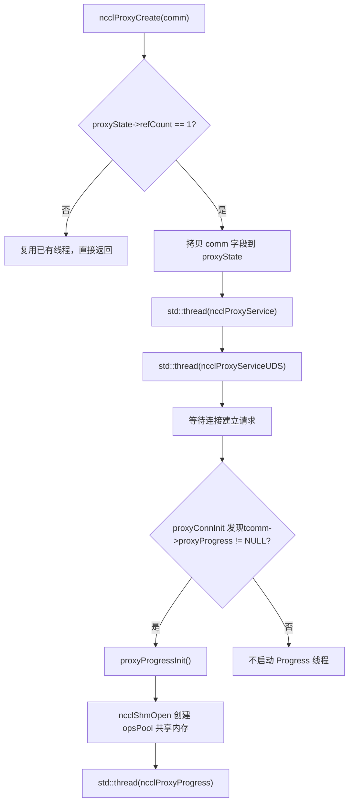
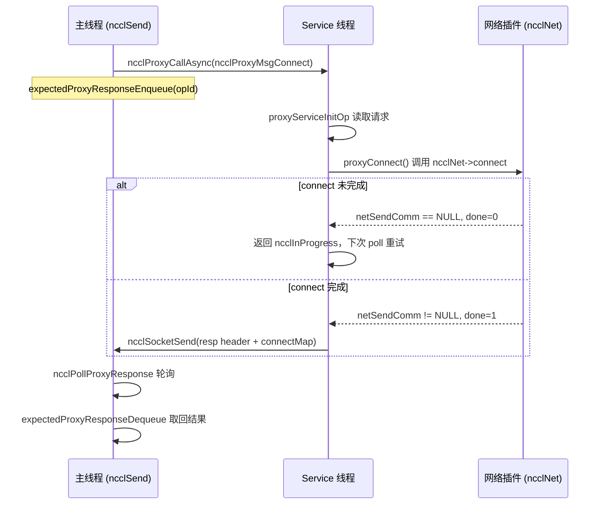
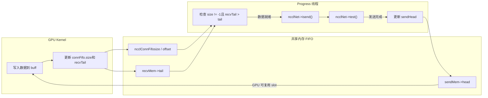

# Chapter 12: Proxy thread asynchronous scheduling: how proxy.cc decouples I/O from kernel execution

The previous chapter broke down the transport abstraction layer and saw how NCCL uses a unified interface to shield the differences among P2P/SHM/NET/NVLS. But the transport layer only answered "which channel the data takes"; it has not yet answered "how the data is driven asynchronously." If the GPU kernel blocks directly on network waits, the compute units will be dragged down by I/O. This chapter focuses on`src/proxy.cc`and`src/include/proxy.h`to see how NCCL uses an independent host thread to peel network I/O away from the kernel execution path and form a producer-consumer relationship with the GPU.

# 12.1 Why proxy threads are needed: starting from "who waits for the network"

## Intuitive model

Imagine a restaurant: the kitchen (GPU kernel) is only responsible for cooking, and the food runner (proxy thread) is responsible for delivering the dishes to the customers (network peers). If the chef were made to deliver the dishes personally, he would have to stop cooking every time he makes a delivery, and the serving speed would plummet. NCCL's proxy is exactly that dedicated food runner—the kernel only writes data into and reads data from the shared buffer, while all the dirty and tiring work of network send/receive is handed off to the proxy thread on the host side.

> **[Design Inference & Architectural Trade-offs]**
> What disaster would the system face without the proxy? The GPU kernel is SIMT massively parallel, and a single warp blocking on network polling would waste the compute power of an entire SM; even more fatally, network send/receive involves socket system calls, verbs polling, and DMA descriptor submission, and these operations simply cannot be executed in device code. Therefore NCCL must move network I/O to the host, letting the kernel and proxy exchange "data ready" signals through a FIFO in shared memory.

## Division of labor between the two types of threads

NCCL starts two types of proxy threads on the host side, with completely different responsibilities:

- **Service thread**（`ncclProxyService`): handles control-plane requests—connection establishment, memory registration, FD queries. It listens on a socket, receives RPC requests from the local rank, and asynchronously advances operations such as setup/connect.
- **Progress thread**（`ncclProxyProgress`): handles the data plane—actually driving network send/receive. It takes proxy ops from the shared memory pool and calls the transport's`proxyProgress`callback to advance data movement.

[FACT:src/include/proxy.h:343-345]shows`ncclProxyState`simultaneously holds`thread`(Service) and`threadUDS`(UDS service), while the Progress thread's handle is hidden in`progressState.thread`inside[FACT:src/include/proxy.h:261-261]。

## Establishment of the producer-consumer relationship

[FACT:src/proxy.cc:2130-2166]'s`ncclProxyCreate`is where the thread is born: when`refCount == 1`(first comm creation), it copies the comm's key fields into`proxyState`, then starts the Service thread and the UDS thread. Note that the Progress thread is not started here—it is lazily started by`proxyProgressInit`only when a connection that needs proxy progress is established for the first time[FACT:src/proxy.cc:1523-1524]。



This diagram anchors the real branch for thread startup: only when`tcomm->proxyProgress`is non-null (that is, the transport needs data-plane progress) is the Progress thread created.

# 12.2 Data structures and memory layout: shared memory pool and op pool

## Overview of core structures

The proxy's concurrency model is built on two blocks of shared memory, and understanding their memory layout is the prerequisite for understanding the entire mechanism.

**First block:`ncclProxyOpsPool`**（[FACT:src/include/proxy.h:218-226]). This is the "task delivery box" between the main thread and the Progress thread, shared across processes through`/dev/shm`.

| Field | Type | Purpose |
| --- | --- | --- |
| `ops[]` | `ncclProxyOp[]` | Preallocated op array, size`MAX_OPS_PER_PEER * NCCL_MAX_LOCAL_RANKS` |
| `nextOps` | `volatile int` | Head index of the pending op linked list, -1 means empty |
| `nextOpsEnd` | `volatile int` | Tail index of the pending op linked list |
| `freeOps[]` | `volatile int[]` | Head of the free op linked list for each local rank |
| `syncObjectsInitialized` | `int` | Marks whether the mutex/cond has been initialized |
| `mutex` / `cond` | `std::mutex` / `std::condition_variable` | Cross-process synchronization primitive |

`MAX_OPS_PER_PEER`definition of[FACT:src/include/proxy.h:218-226]is`2 * MAXCHANNELS * 2 * NCCL_MAX_DEV_WORK_P2P_PER_BATCH`. The comment explains why it is 2x: each p2p work contains one send and one recv proxy op, so it must be multiplied by 2; multiplying by 2 again is to be able to store two full rounds of operations, otherwise it would be impossible to "deliver half and release half."

**Second block:`ncclProxyArgs`**（[FACT:src/include/proxy.h:174-209]). This is the "runtime op description" used internally by the Progress thread, allocated from`ncclProxyPool`, and not shared across processes.

Key fields:

- `subs[NCCL_PROXY_MAX_SUBS]`: sub-operation array,`NCCL_PROXY_MAX_SUBS = MAXCHANNELS` [FACT:src/include/proxy.h:55-55]. Operations of the same type from multiple channels are aggregated into multiple subs of one args.
- `progress`: function pointer, pointing to the transport's`proxyProgress`callback[FACT:src/include/proxy.h:176-176]。
- `next` / `nextPeer` / `proxyAppendPtr`: three linked-list pointers, forming a complex op organization relationship.
- `state`：`ncclProxyOpNone` / `ncclProxyOpReady` / `ncclProxyOpProgress`Three-state[FACT:src/include/proxy.h:48-52]。

## Layered design of the memory pool

`ncclProxyPool` [FACT:src/proxy.cc:50-53]is a batch allocation unit, and each pool contains`PROXYARGS_ALLOCATE_SIZE`(that is,`NCCL_MAX_OPS`) of`ncclProxyArgs`。`allocateArgs` [FACT:src/proxy.cc:207-231]The allocation logic is worth a closer look:

```c
if (state->pool == NULL) {
    struct ncclProxyPool* newPool;
    NCCLCHECK(ncclCalloc(&newPool, 1));
    struct ncclProxyArgs* newElems = newPool->elems;
    for (int i = 0; i pool = newElems;
    newPool->next = state->pools;
    state->pools = newPool;
}
elem = state->pool;
state->pool = state->pool->next;
```

[FACT:src/proxy.cc:207-231]

> **[Design Inference & Architectural Trade-offs]**
> The design motivation here is:`ncclProxyArgs`The structure is very large (containing`subs[MAXCHANNELS]`array, and each sub also has`requests[NCCL_STEPS]`). If each op were malloc'ed separately, it would cause severe memory fragmentation and allocation overhead. Batch allocation + free-list reuse amortizes the allocation cost to almost zero. The comment "Make sure we allocate the memory close to the network thread" suggests that this is for NUMA affinity—the pool is created when the Progress thread first allocates, naturally close to the CPU on which that thread runs.

## False sharing and atomic variables

`ncclProxyOpsPool`in`nextOps`、`nextOpsEnd`、`freeOps[]`are all`volatile int`. They are read and written simultaneously by the main thread and the Progress thread, but NCCL does not use locks to protect all accesses—instead it uses atomic operations + memory ordering to ensure correctness.

Look at`ncclLocalOpAppend`the logic for taking a free op from freeOps[FACT:src/proxy.cc:503-513]：

```c
int freeOp = -1;
while (freeOp == -1) {
  freeOp = COMPILER_ATOMIC_EXCHANGE(&pool->freeOps[tpLocalRank], -1, std::memory_order_acquire);
  if (freeOp == -1) std::this_thread::yield();
}
```

The main thread uses`atomic_exchange`to`freeOps[tpLocalRank]`Set to -1 and retrieve the old value—this is a "preemptive acquisition": whoever succeeds in the exchange first gets the entire free list. When the Progress thread returns an op, it uses a CAS loop[FACT:src/proxy.cc:898-907]：

```c
oldFree = COMPILER_ATOMIC_LOAD(&pool->freeOps[i], std::memory_order_acquire);
do {
  pool->ops[freeOpEnd[i]].next = oldFree;
} while (!COMPILER_ATOMIC_COMPARE_EXCHANGE(&pool->freeOps[i], &oldFree, newFree,
                                           std::memory_order_release,
                                           std::memory_order_acquire));
```

> **[Design Inference & Architectural Trade-offs]**
> Acquire/release is used here instead of seq_cst because it only needs to ensure that "the write to the linked list node's next pointer" is visible to the acquiring side, and does not require global ordering.`freeOps[]`Each element of the array corresponds to a local rank, naturally distributed near different cache lines, reducing false sharing.

# 12.3 Control plane: connection establishment and RPC mechanism

## Intuitive model

> **[Design Inference & Architectural Trade-offs]**
> The Service thread is like a "front desk receptionist": when a local rank wants to establish a network connection, it does not connect directly itself, but sends an RPC request to the Service thread, which performs setup/connect on its behalf. Why do it this way? Because network connection establishment (especially verbs QP creation and memory registration) may block, and certain resources (such as the listen socket) must be held by a single thread. By centralizing the control plane in the Service thread, the main thread can continue doing other things without blocking.

## Encoding of RPC requests

`ncclProxyCallAsync` [FACT:src/proxy.cc:1369-1394]It is the sender side of the RPC. It sends sequentially over the socket: type, connection pointer, reqSize, respSize, reqBuff, opId.

```c
NCCLCHECKGOTO(ncclSocketSend(sock, &type, sizeof(int)), ret, error);
NCCLCHECKGOTO(ncclSocketSend(sock, &proxyConn->connection, sizeof(void*)), ret, error);
NCCLCHECKGOTO(ncclSocketSend(sock, &reqSize, sizeof(int)), ret, error);
NCCLCHECKGOTO(ncclSocketSend(sock, &respSize, sizeof(int)), ret, error);
if (reqSize) NCCLCHECKGOTO(ncclSocketSend(sock, reqBuff, reqSize), ret, error);
NCCLCHECKGOTO(ncclSocketSend(sock, &opId, sizeof(opId)), ret, error);
NCCLCHECK(expectedProxyResponseEnqueue(sharedProxyState, opId, respSize));
```

[FACT:src/proxy.cc:1369-1394]

Note the last step: after sending the request, immediately register the opId with the`expectedResponses`queue. This is the key to asynchronous RPC—the caller does not wait for a reply, but first registers "I expect a response for this opId," and afterward uses`ncclPollProxyResponse`polling.

## Linked-list implementation of the response queue

`expectedProxyResponseEnqueue` [FACT:src/proxy.cc:97-117]It uses a singly linked list to store ops awaiting responses.`expectedProxyResponseStore` [FACT:src/proxy.cc:67-95]When a response is received, it matches by opId, memcpy's the response data into the preallocated`respBuff`, and marks`done = true`。`expectedProxyResponseDequeue` [FACT:src/proxy.cc:119-141]During polling, it looks up completed responses and removes them.

There is a detail here:`expectedProxyResponseStore`Check`respSize`whether it matches[FACT:src/proxy.cc:72-75], and if it does not match, report`ncclInternalError`. This is defensive programming—if the requester and responder have inconsistent understandings of the response size, it means the protocol is corrupted, and it must fail immediately rather than silently continue.

## Main loop of the Service thread

`ncclProxyService` [FACT:src/proxy.cc:1789-2016]The core is a poll loop. It uses`pollfds`an array to manage all connections, including the listen socket and each peer's socket.

```c
while (stop == PROXY_RUNNING || npeers > 0) {
    if (COMPILER_ATOMIC_LOAD(proxyState->abortFlag, std::memory_order_acquire) != 0) stop = PROXY_ABORT;
    int ret = 0;
    const int timeout = asyncOpCount ? 0 : 500;
    ...
    ret = poll(activePollfds, nfds_to_poll, timeout);
```

[FACT:src/proxy.cc:1842-1863]

`timeout`The choice of is very particular: if there is an asynchronous op in progress (`asyncOpCount > 0`), timeout is set to 0 (non-blocking polling), because it needs to call`proxyProgressAsync`frequently to advance them; otherwise it is set to 500ms to avoid spinning and burning CPU. The comment "never let proxy service thread blocks in poll, or it cannot receive abortFlag"[FACT:src/proxy.cc:1847-1847]clarifies why it cannot block indefinitely—it must periodically wake up to check abortFlag.

## Advancement of asynchronous ops

`proxyProgressAsync` [FACT:src/proxy.cc:1626-1700]It is the core of the Service thread advancing asynchronous operations. It dispatches to different transport callbacks according to the op type:

```c
if (op->type == ncclProxyMsgSetup) {
    res = op->connection->tcomm->proxySetup(op->connection, proxyState, op->reqBuff, op->reqSize, op->respBuff,
                                            op->respSize, &done);
} else if (op->type == ncclProxyMsgConnect) {
    res = op->connection->tcomm->proxyConnect(...);
} else if (op->type == ncclProxyMsgInit) {
    res = proxyConnInit(peer, connectionPool, proxyState, ...);
}
```

[FACT:src/proxy.cc:1631-1664]

Each callback carries an`done`output parameter. If`done == 0`, it means the operation is not yet complete (for example, the network connection is still in the three-way handshake), and it returns`ncclInProgress`, and the next loop continues advancing. If`done == 1`, then it sends the response header + response body to the requester[FACT:src/proxy.cc:1681-1689]。



This sequence diagram anchors`sendProxyConnect`in`*done = 0; return ncclInProgress`the real branch[FACT:src/transport/net.cc:913-916]。

# 12.4 Data plane: how the Progress thread drives network send/receive

## Intuitive model

The Progress thread is a "conveyor belt operator": it watches the FIFO in the shared buffer, and as soon as the GPU has written the data (size != -1 in the FIFO), it immediately calls`isend`to send the data out; once the network has finished receiving data, it updates recvTail to notify the GPU that it can read. Throughout the process, the GPU and proxy synchronize through the head/tail pointers in the FIFO, without needing any locks.

## Op submission: from the main thread to the Progress thread

The main thread, in`ncclProxySaveOp` [FACT:src/proxy.cc:591-761], decides which proxy ops are needed according to the pattern, and then uses`SaveProxy` → `ncclLocalOpAppend`to write the op into the shared memory pool.

`ncclLocalOpAppend` [FACT:src/proxy.cc:488-554]The flow of is:

1. From`proxyOps->freeOp`or`pool->freeOps[tpLocalRank]`take a free op slot.

2. `memcpy(op, proxyOp, sizeof(struct ncclProxyOp))`Copy the op contents into shared memory[FACT:src/proxy.cc:515-515]。

3. Attach the op to the tail of the`proxyOps->nextOps`linked list.

4. If the accumulated number of ops reaches`MAX_OPS_PER_PEER`, trigger a batch submission[FACT:src/proxy.cc:525-551]。

The logic of batch submission is very subtle: it cannot simply send all ops out, because "multiple ops with the same opCount must be submitted together, otherwise it will break the sub-aggregation of proxyArgs." So it finds the boundary of the last opCount change and submits only up to there[FACT:src/proxy.cc:529-548]。

Submission is completed through`ncclProxyPost` [FACT:src/proxy.cc:476-486], which locks, updates`pool->nextOps`、`notify_one`and wakes up the Progress thread.

## Main loop of the Progress thread

`ncclProxyProgress` [FACT:src/proxy.cc:951-1011]The structure of is:

```c
do {
    int idle = 1;
    ncclResult_t ret = progressOps(proxyState, state, state->active, &idle);
    ...
    if (idle || !state->active || (++proxyOpAppendCounter == ncclParamProgressAppendOpFreq())) {
      int added = 0;
      proxyOpAppendCounter = 0;
      ret = ncclProxyGetPostedOps(proxyState, &added);
      ...
    }
    lastIdle = idle;
    stopv = state->stop.load(std::memory_order_acquire);
} while ((stopv == 0 || (stopv == 1 && state->active)) &&
         COMPILER_ATOMIC_LOAD(proxyState->abortFlag, std::memory_order_acquire) == 0);
```

[FACT:src/proxy.cc:976-1009]

There is a performance optimization worth noting here:`proxyOpAppendCounter`counter[FACT:src/proxy.cc:974-974]. The comment explains[FACT:src/proxy.cc:969-973]: calling`ncclProxyGetPostedOps`too frequently will cause performance regression in small-message communication, so every time it advances`ProgressAppendOpFreq`(default 8) times before fetching a new op.

## Op aggregation: ProxyAppend

`ProxyAppend` [FACT:src/proxy.cc:437-474]Determines whether an op is "appended to the sub of an existing args" or "creates a new args". The criterion is`connection->shared && args->opCount == op->opCount` [FACT:src/proxy.cc:443-443]— multiple channel operations with the same connection and same opCount are aggregated.

> **[Design Inference & Architectural Trade-offs]**
> Value of aggregation: Similar operations from multiple channels are merged into one args, so the Progress thread can advance all channels in a single loop iteration, reducing function call overhead and cache invalidation.`ncclProxyOpToArgs` [FACT:src/proxy.cc:368-435]When appending a sub, it validates`sliceSteps`、`chunkSteps`、`protocol`、`dtype`、`redOp`、`coll`whether they are consistent[FACT:src/proxy.cc:401-406], and reports an error if not — this is the defense against incorrect aggregation.

## sendProxyProgress: the four-stage state machine on the send side

`sendProxyProgress` [FACT:src/transport/net.cc:1324-1491]It is the core of the send side. It advances sub by sub, and each sub has four counters:`posted`、`transmitted`、`done`。

**Stage 1: Ready initialization** [FACT:src/transport/net.cc:1326-1339]

```c
sub->base = ROUNDUP(resources->step, args->chunkSteps);
resources->step = sub->base + sub->nsteps;
sub->posted = sub->transmitted = sub->done = 0;
```

`base`is the starting number of the step,`ROUNDUP`ensuring alignment to`chunkSteps`。`resources->step`accumulation, reserving space for the next op.

**Stage 2: Post the buffer to the GPU** [FACT:src/transport/net.cc:1355-1376]

```c
if (sub->posted nsteps && sub->posted done + maxDepth) {
    int buffSlot = (sub->base + sub->posted) % NCCL_STEPS;
    if (resources->shared) {
        ...
        *sendHead = sub->base + sub->posted - NCCL_STEPS;
    } else {
        sub->posted += args->sliceSteps;
    }
}
```

`maxDepth`is the pipeline depth[FACT:src/transport/net.cc:1343-1343], limiting the number of simultaneously in-flight steps. In shared mode, the proxy tells the GPU "this slot can be written" by updating`sendHead`.

**Stage 3: Check whether the GPU has finished writing, and initiate isend** [FACT:src/transport/net.cc:1378-1452]

```c
if (sub->transmitted posted && sub->transmitted done + NCCL_STEPS) {
    int buffSlot = (sub->base + sub->transmitted) % NCCL_STEPS;
    volatile uint64_t* recvTail = &resources->recvMem->tail;
    uint64_t tail = sub->base + sub->transmitted;
    if (connFifo[buffSlot].size != -1 && (*recvTail > tail || p == NCCL_PROTO_LL)) {
        int size = connFifo[buffSlot].size;
        ...
        NCCLCHECK(proxyState->ncclNet->isend(resources->netSendComm, buff, size, resources->tpRank,
                                             sub->sendMhandle, phandle, sub->requests + buffSlot));
        if (sub->requests[buffSlot] != NULL) {
            sub->transmitted += args->sliceSteps;
        }
    }
}
```

The key condition here is`connFifo[buffSlot].size != -1 && *recvTail > tail`— after the GPU finishes writing data, it updates the FIFO size and recvTail, and the proxy initiates isend only after seeing both conditions satisfied. For the LL protocol, because it has "zero-copy" semantics, there is no need to wait for recvTail.

**Stage 4: Check whether sending is complete, and update sendHead** [FACT:src/transport/net.cc:1455-1481]

```c
if (sub->done transmitted) {
    int buffSlot = (sub->base + sub->done) % NCCL_STEPS;
    NCCLCHECK(proxyState->ncclNet->test(sub->requests[buffSlot], &done, &size));
    if (done) {
        connFifo[buffSlot].size = -1;
        std::atomic_thread_fence(std::memory_order_seq_cst);
        sub->done += args->sliceSteps;
        if (resources->shared == 0) {
            volatile uint64_t* sendHead = resources->gdcSync ? resources->gdcSync : &resources->sendMem->head;
            *sendHead = sub->base + sub->done;
        }
    }
}
```

`test`After returns done, first reset the FIFO size to -1, insert a seq_cst fence, and then update sendHead to notify the GPU that "this slot can be reused". The purpose of the fence is to prevent reordering of the size reset and the head update — if head is updated first, the GPU may start writing while size is still the old value.

## recvProxyProgress: the four stages on the receive side

`recvProxyProgress` [FACT:src/transport/net.cc:1493-1788]It is more complex because it involves sub grouping (multirecv is used when multiple subs share the same recvComm).

**Stage 1: Group by recvComm during Ready** [FACT:src/transport/net.cc:1495-1538]

```c
for (int s = 0; s nsubs; s++) {
    ...
    if (groupSize == maxRecvs) {
        groupSize = 0;
    } else if (s > 0) {
        int next;
        for (next = s; next nsubs; next++) {
            struct recvNetResources* nextRes = ...;
            if (nextRes->netRecvComm == recvComm) break;
        }
        if (next == args->nsubs) {
            groupSize = 0;
        } else if (s != next) {
            // swap subs
        }
    }
    groupSize++;
    ...
    for (int i = 0; i  **[Design Inference & Architectural Trade-offs]**
> This code groups subs that use the same`recvComm`together and records`groupSize`. Why group? Because`irecv`supports receiving multiple buffers at once (multirecv), and merging requests for the same comm into one call can significantly reduce plugin overhead.

**Stage 2: Initiate irecv** [FACT:src/transport/net.cc:1543-1631]

```c
if (subCount) {
    uint64_t step = subGroup->posted;
    void** requestPtr = subGroup->requests + (step % NCCL_STEPS);
    bool ignoreCompletion = ncclParamNetOptionalRecvCompletion() &&
                            ((args->protocol == NCCL_PROTO_LL128) || (args->protocol == NCCL_PROTO_LL)) &&
                            (subCount == 1);
    if (ignoreCompletion) *requestPtr = (void*)NCCL_NET_OPTIONAL_RECV_COMPLETION;
    NCCLCHECK(proxyState->ncclNet->irecv(resources->netRecvComm, subCount, ptrs, sizes, tags, mhandles, phandles,
                                         requestPtr));
    if (*requestPtr) {
        subGroup->recvRequestsCache[step % NCCL_STEPS] = *requestPtr;
        subGroup->recvRequestsSubCount = subCount;
        for (int i = 0; i groupSize; i++) {
            sub->posted += args->sliceSteps;
        }
    }
}
```

`ignoreCompletion`Optimization[FACT:src/transport/net.cc:1608-1610]: For single-buffer receives in the LL/LL128 protocols, completion notification is optional (because the data itself carries a flag), so the completion check can be skipped.

**Stage 3: Check whether receiving is complete, and update recvTail** [FACT:src/transport/net.cc:1634-1743]

```c
NCCLCHECK(proxyState->ncclNet->test(subGroup->requests[step % NCCL_STEPS], &done, sizes));
if (done) {
    for (int i = 0; i groupSize; i++) {
        struct ncclProxySubArgs* sub = subGroup + i;
        int buffSlot = (sub->base + sub->received) % NCCL_STEPS;
        connFifo[buffSlot].size = -1;
        sub->received += args->sliceSteps;
    }
    ...
}
```

After receiving is complete, reset the FIFO size, then enter the flush stage (the GDRDMA scenario requires flush to ensure data visibility).

**Stage 4: Wait for the GPU to consume, and update done** [FACT:src/transport/net.cc:1745-1779]

```c
if (sub->transmitted > sub->done) {
    volatile uint64_t* sendHead = &resources->sendMem->head;
    uint64_t done = *sendHead;
    while (done > sub->base + sub->done && sub->transmitted > sub->done) {
        if (subGroup->recvRequestsCache[sub->done % NCCL_STEPS]) {
            if (proxyState->ncclNet->irecvConsumed) {
                NCCLCHECK(proxyState->ncclNet->irecvConsumed(resources->netRecvComm, subGroup->recvRequestsSubCount,
                                                             subGroup->recvRequestsCache[sub->done % NCCL_STEPS]));
            }
            subGroup->recvRequestsCache[sub->done % NCCL_STEPS] = NULL;
        }
        sub->done += args->sliceSteps;
    }
}
```

Here it reads`sendHead`to determine whether the GPU has already consumed the data.`irecvConsumed`It is a callback to the plugin, telling it that "the buffer for this receive request has been consumed and can be reused".

## Overview of the data flow



This data flow diagram shows the closed loop formed by the GPU and proxy through the FIFO and the head/tail pointers: GPU writes data → updates tail → proxy detects it and initiates isend → test confirms completion → updates head → GPU reuses the slot.

# 12.5 Concurrency control, memory barriers, and hardware interaction

## Memory ordering of the lock-free FIFO

Synchronization between the proxy and the GPU relies entirely on`ncclConnFifo`and the head/tail pointers, without any locks. This requires extremely careful memory ordering control.

On the send side, after`test`returns done, the proxy[FACT:src/transport/net.cc:1460-1473]：

```c
connFifo[buffSlot].size = -1;
std::atomic_thread_fence(std::memory_order_seq_cst);
...
*sendHead = sub->base + sub->done;
```

The seq_cst fence ensures that only after the size reset is visible to the GPU does the head update become visible. If the order were reversed, the GPU might see the new head but the old size, mistakenly assuming there is data in the slot.

On the receive side, before updating recvTail, the proxy[FACT:src/transport/net.cc:1731-1736]：

```c
if (step nsteps) {
    std::atomic_thread_fence(std::memory_order_seq_cst);
    volatile uint64_t* recvTail = resources->gdcSync ? resources->gdcSync : &resources->recvMem->tail;
    *recvTail = sub->base + sub->transmitted;
}
```

The same principle applies: first fence to ensure the data write is visible, then update tail to notify the GPU that it can read.

## GDRCOPY's flush mechanism

When GDRDMA is used, the NIC writes directly to GPU memory, but the write may still be uncommitted on the PCIe bus. The proxy needs to actively flush to ensure data visibility. See`recvProxyProgress`the flush logic in[FACT:src/transport/net.cc:1664-1709]：

```c
if (totalSize > 0 && p == NCCL_PROTO_SIMPLE && needFlush) {
    if (resources->gdcFlush) {
#if defined(__x86_64__)
        asm volatile("mfence" ::: "memory");
        asm volatile("mov (%0), %%eax" ::"l"(resources->gdcFlush) : "%eax", "memory");
#else
        std::atomic_thread_fence(std::memory_order_seq_cst);
        uint64_t dummy;
        NCCLCHECK(ncclGdrCudaRead(resources->gdrDesc, &dummy, resources->gdcFlush, sizeof(dummy)));
#endif
    } else {
        // iflush 路径
        NCCLCHECK(proxyState->ncclNet->iflush(resources->netRecvComm, subCount, ptrs, sizes, mhandles,
                                              subGroup->requests + (step % NCCL_STEPS)));
    }
}
```

The comments on the x86 path are excellent.[FACT:src/transport/net.cc:1668-1674]：`mfence`Prevent the CQE-poll load from being reordered before the flush load;`mov (%0), %%eax`Force a PCIe read, making the CPU stall until all prior PCIe posted writes (including NIC DMA) are committed to the endpoint. This is hardware-level memory ordering control, more hardcore than any software fence.

## Coordination between atomic variables and stop/abort

Exit conditions of the Progress thread[FACT:src/proxy.cc:1007-1009]：

```c
stopv = state->stop.load(std::memory_order_acquire);
} while ((stopv == 0 || (stopv == 1 && state->active)) &&
         COMPILER_ATOMIC_LOAD(proxyState->abortFlag, std::memory_order_acquire) == 0);
```

`stop == 1`But`state->active != NULL`continue running during — this is for "graceful stop": already-posted ops must be fully advanced, otherwise the GPU will wait forever for data. Only`stop == 2`(abort) or`abortFlag != 0`forces exit.

`ncclProxyProgressDestroy` [FACT:src/proxy.cc:1039-1065]The stop procedure of:

```c
std::lock_guard lock(state->opsPool->mutex);
state->stop.store(1, std::memory_order_release);
state->opsPool->cond.notify_one();
state->thread.join();
```

Lock first, then store stop, then notify — this is the standard pattern to prevent lost wakeup. The Progress thread holds the lock during`pool->cond.wait`and checks the predicate[FACT:src/proxy.cc:850-851], ensuring it won't miss the wakeup.

# 12.6 Production Pitfall Guide and Failure Recovery Chain

## Pitfall 1: Connection leak prevents the Service thread from exiting

`ncclProxyService`The main loop condition of is`stop == PROXY_RUNNING || npeers > 0` [FACT:src/proxy.cc:1842-1842]. The comment explains[FACT:src/proxy.cc:1843-1845]: even if the local comm aborts, as long as there are still peer connections, the proxy thread cannot exit, otherwise it may segfault.

**Troubleshooting scenario**: if a rank crashes without notifying the peer, the peer's Service thread will be stuck forever in the loop of`npeers > 0`. In this case, you need to rely on`abortFlag`or a timeout mechanism. In production, if you see a process hanging at`ncclProxyService`, first check whether a peer rank exited abnormally.

## Pitfall 2: Response queue mismatch causes memory leak

`expectedProxyResponseStore`returns when opId doesn't match`ncclInternalError` [FACT:src/proxy.cc:93-94]. But if the requester has already given up by the time the response arrives (e.g., timeout), this response will remain in the queue forever,`respBuff`leak.

**Defensive measures**：`expectedProxyResponseFree` [FACT:src/proxy.cc:55-65]cleans up the entire queue at`ncclProxyDestroy`. But this is the last resort; under normal operation there should be no residue.[FACT:src/proxy.cc:2226-2226]Pitfall 3: head initialized to a negative value in shared mode

## In

`sendProxyConnect`Copy[FACT:src/transport/net.cc:999-1000]：

```c
// Don't give credits yet in shared mode.
(resources->gdcSync ? *resources->gdcSync : resources->sendMem->head) = (map->shared ? -NCCL_STEPS : 0);
```

, meaning the GPU initially has no credit to write. The proxy needs to gradually increase head during the post phase to "grant credit." If this initialization is forgotten, the GPU will mistakenly think it has credit and write to slots that aren't ready, causing data corruption.`-NCCL_STEPS`Pitfall 4: flag validation in the LL128 protocol

## In

`sendProxyProgress`Copy[FACT:src/transport/net.cc:1388-1403]：

```c
if (p == NCCL_PROTO_LL128) {
    ready = resources->useGdr;
    if (!ready) {
        uint64_t flag = sub->base + sub->transmitted + 1;
        int nFifoLines = DIVUP(connFifo[buffSlot].size, sizeof(uint64_t) * NCCL_LL128_LINEELEMS);
        volatile uint64_t* lines = (volatile uint64_t*)buff;
        ready = 1;
        for (int i = 0; i that updates`sendProxyProgress`when`sub->done == sub->nsteps`(i.e., not notifying the GPU that the slot has been released), in what scenario would a deadlock be triggered? Why?`sendHead`Reference analysis

**is the sole basis for the GPU to determine "which slots can be reused." See**：`sendHead`Copy[FACT:src/transport/net.cc:1469-1473]：

```c
if (resources->shared == 0) {
    volatile uint64_t* sendHead = resources->gdcSync ? resources->gdcSync : &resources->sendMem->head;
    *sendHead = sub->base + sub->done;
}
```

in shared mode, 0 in non-shared mode). The GPU kernel checks`-NCCL_STEPS`at`waitSend`before considering there is credit to write. If head doesn't advance, the GPU will block forever waiting for credit after filling`head + NCCL_STEPS > step`slots, while the proxy is waiting for the GPU to write new data before it can isend — a classic producer-consumer deadlock. It's even worse in shared mode, because the initial head is negative, so the GPU has no credit from the start.`NCCL_STEPS` 个 slot 后就永远阻塞在等待 credit 上，而 proxy 又在等 GPU 写新数据才能 isend——经典的生产者-消费者死锁。在 shared 模式下更严重，因为初始 head 是负值，GPU 一开始就没有 credit。

Q2: `ncclLocalOpAppend`When the cumulative op reaches`MAX_OPS_PER_PEER`it triggers batch delivery, but the code deliberately "does not deliver all ops of the last opCount". If it were changed to simply deliver all ops, what mechanism would be broken?

**Reference analysis**: Look at[FACT:src/proxy.cc:525-548]'s comments and logic:

```c
// Do not post last operations as we could have more coming with the same opCount, and posting
// them in different batches would break proxyArgs aggregation with subs.
uint64_t lastOpCount = pool->ops[proxyOps->nextOpsEnd].opCount;
int lastOp = -1;
...
for (int op = proxyOps->nextOps; op != proxyOps->nextOpsEnd; op = pool->ops[op].next) {
    ops++;
    if (pool->ops[op].opCount != lastOpCount) {
        lastOp = op;
        toSend = ops;
    }
}
```

`ProxyAppend`'s aggregation logic[FACT:src/proxy.cc:443-443]depends on`args->opCount == op->opCount`to determine whether to append a sub. If multiple channel ops of the same opCount are split across two batches for delivery, the first batch creates an args, and when the second batch arrives,`args->opCount`is already not equal to the new op's opCount (because args may have already been advanced), causing subs that should have been aggregated to be split into independent args. This not only reduces performance, but may also break`ncclProxyOpToArgs`'s`nChannels`/`nPeers`min-taking logic[FACT:src/proxy.cc:399-400], leading to incorrect channel count calculation.

Q3: `recvProxyProgress`'s Ready phase will regroup and reorder subs by`recvComm`. If this grouping logic is removed and each sub independently calls`irecv`, what consequences would there be on`maxRecvs > 1`'s NIC?

**Reference analysis**: Look at[FACT:src/transport/net.cc:1495-1538]'s grouping logic and[FACT:src/transport/net.cc:1613-1614]'s multirecv call:

```c
NCCLCHECK(proxyState->ncclNet->irecv(resources->netRecvComm, subCount, ptrs, sizes, tags, mhandles, phandles,
                                     requestPtr));
```

`maxRecvs`is the "maximum number of buffers a single irecv can receive" declared by the NIC plugin[FACT:src/transport/net.cc:1525-1525]. When`maxRecvs > 1`, plugins such as IB support receiving multiple buffers with one WQE, which can significantly reduce doorbell overhead and CQE processing cost. If grouping is removed and each sub is irecv'd independently,`subCount`is always 1, the plugin degrades to single-buffer mode, and throughput will drop. More critically,`recvRequestsCache`and`irecvConsumed`mechanisms[FACT:src/transport/net.cc:1616-1617]are designed for multirecv—under single-buffer mode these caching logics become ineffective and may cause request leaks.

At this point, we understand how the proxy thread decouples network I/O from kernel execution, allowing GPU computation and communication to truly run in parallel. But the proxy is only the driver; the concrete implementation of the underlying network transport remains to be revealed. In the next chapter we will go deep into`net_ib`to see how NCCL encapsulates the verbs API to implement InfiniBand transport, and how GPUDirect RDMA allows the NIC to directly read and write GPU memory.
