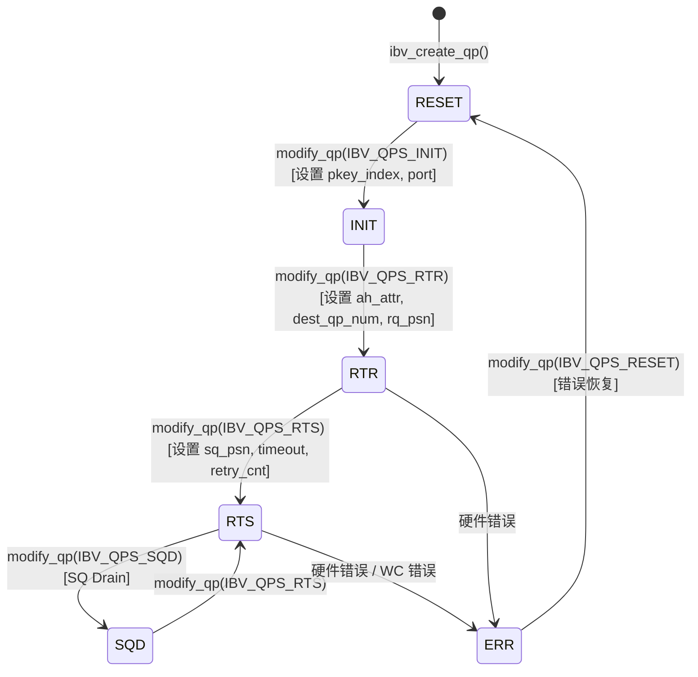

# Chapter 13: InfiniBand Network Transport: How net_ib Encapsulates verbs and GPUDirect RDMA

In the previous chapter we saw how the proxy thread strips network I/O out of the GPU kernel, allowing computation and communication to truly run in parallel. But the proxy is only a "driver"—it calls abstract interfaces such as ncclNet->isend/irecv, yet does not know whether the underlying transport is TCP, InfiniBand, or something else. In this chapter we lift this layer of abstraction and enter src/transport/net_ib and src/misc/ibvwrap.cc to see how NCCL encapsulates the libibverbs C library into a pluggable symbol table, how it establishes a Queue Pair (QP), and how GPUDirect RDMA allows the NIC to bypass host memory and directly read and write GPU memory.

# 13.1 Why NCCL Does Not Directly Call libibverbs

## Intuitive model: the symbol table is a "pluggable power socket"

Imagine you bought an imported appliance, and the plug shape does not match your home socket. You have two choices: either take the appliance apart and rewire it (directly`#include <infiniband/verbs.h>`and link`-libverbs`), or buy a universal adapter plug (dynamically load symbols at runtime). NCCL chose the latter.

> **[Design Inference & Architectural Trade-offs]**
> The core motivation for this choice is**deployment flexibility**: as a library loaded by upper-layer frameworks such as PyTorch and TensorFlow, NCCL cannot assume that the runtime environment definitely has`libibverbs.so`installed. If it were hard-linked at compile time, then on machines without an InfiniBand driver, the entire NCCL library could not be loaded—even if you only wanted to use NVLink for single-machine communication. Through runtime`dlopen`+ symbol resolution, NCCL can gracefully degrade on machines without IB.

If this layer of encapsulation were missing, the disaster the system would face is:**a pure NVLink single-machine training job would crash directly because the machine does not have an IB driver installed**. This is extremely common in cloud environments and on development machines.

## Data structures and memory layout: symbol table container

The core data structure is`ncclIbvSymbols`, defined in`ibvsymbols.h`(this chapter's material does not include that file, but its structure can be inferred from usage). It is a pure function pointer container, with each field corresponding to a libibverbs function:

```c
struct ncclIbvSymbols {
  int (*ibv_internal_fork_init)(void);
  struct ibv_device** (*ibv_internal_get_device_list)(int* num_devices);
  int (*ibv_internal_modify_qp)(struct ibv_qp*, struct ibv_qp_attr*, int);
  // ... 数十个函数指针
};
```

There is only one global instance, together with`std::once_flag`ensuring thread-safe initialization:

[FACT:src/misc/ibvwrap.cc:26-29]

```c
static std::once_flag initOnceFlag;
static ncclResult_t initResult;
struct ncclIbvSymbols ibvSymbols;
```

The design here is very restrained:`initOnceFlag`is`std::once_flag`，`initResult`Cache initialization result,`ibvSymbols`is the global symbol table. All three have static storage duration, with lifetimes spanning the entire process.

> **[Design Inference & Architectural Trade-offs]**
> Why use`std::once_flag`instead of`pthread_once`? Because NCCL's C++ code already depends on`<mutex>`and`<thread>`, using the standard library is more consistent.`call_once`The semantics of are: no matter how many threads call`wrap_ibv_symbols()`simultaneously, the lambda executes only once, the remaining threads block and wait, then all receive the same`initResult`. This is far safer than hand-written double-checked locking (DCLP)—DCLP has a well-known reordering pitfall under the C++ memory model.

## Step-by-Step: The Complete Symbol Resolution Flow

When NCCL first needs IB transport, it calls`wrap_ibv_symbols()`：

[FACT:src/misc/ibvwrap.cc:26-29]

```c
ncclResult_t wrap_ibv_symbols(void) {
  std::call_once(initOnceFlag, []() { initResult = buildIbvSymbols(&ibvSymbols); });
  return initResult;
}
```

`buildIbvSymbols`is defined in`ibvsymbols.cc`(not included in this chapter), its job is to use`dlopen("libibverbs.so")`to open the library, then for each function name call`dlsym`to fill in pointers. If a symbol is not found, the corresponding field remains NULL.

This "allow NULL" design runs through the entire wrapper layer. Look at`CHECK_NOT_NULL`macro:

[FACT:src/misc/ibvwrap.cc:26-29]

```c
#define CHECK_NOT_NULL(container, internal_name) \
  if (container.internal_name == NULL) { \
    WARN("lib wrapper not initialized."); \
    return ncclInternalError; \
  }
```

Each wrapper function checks whether the corresponding symbol is non-null before calling. This means:**If an older version of libibverbs lacks a certain new function, NCCL won't crash at load time, but will report an error only when that function is actually used**. This is the key to graceful degradation.

## Design Thinking: The Triple Responsibility of Macro Wrappers

`ibvwrap.cc`defines 7 macros, which are not simple syntactic sugar but carry three responsibilities:

1. **Null pointer protection**：`CHECK_NOT_NULL`intercepts uninitialized

2. **Error code normalization**: translating libibverbs' various error conventions (returning -1, returning errno, returning NULL pointer) uniformly into`ncclResult_t`

3. **Logging instrumentation**: on failure`WARN`prints the function name and errno

Look at`IBV_PTR_CHECK_ERRNO`this most complex macro:

[FACT:src/misc/ibvwrap.cc:38-45]

```c
#define IBV_PTR_CHECK_ERRNO(container, internal_name, call, retval, error_retval, name) \
  CHECK_NOT_NULL(container, internal_name); \
  retval = container.call; \
  if (retval == error_retval) { \
    WARN("Call to " name " failed with error %s", strerror(errno)); \
    return ncclSystemError; \
  } \
  return ncclSuccess;
```

After expansion it does four things: check symbol is non-null, execute the call, write the return value into`retval`(typically returned via pointer parameter such as`ibv_pd*`etc.), determine whether it equals the error value. Note`strerror(errno)`—libibverbs' pointer-returning functions (such as`ibv_alloc_pd`) return NULL on failure and set`errno`, so reading`errno`here is correct.

While`IBV_INT_CHECK`is used for functions returning int:

[FACT:src/misc/ibvwrap.cc:84-91]

```c
#define IBV_INT_CHECK(container, internal_name, call, error_retval, name) \
  CHECK_NOT_NULL(container, internal_name); \
  int ret = container.call; \
  if (ret == error_retval) { \
    WARN("Call to " name " failed"); \
    return ncclSystemError; \
  } \
  return ncclSuccess;
```

Here does not read`errno`, because such functions (such as`ibv_fork_init`) directly return -1 to indicate failure, and the error information is already lost.

> **[Design Inference & Architectural Trade-offs]**
> This approach of "using a different macro for each function" looks cumbersome, but it is necessary: libibverbs' API error conventions are extremely inconsistent—some return 0/-1, some return errno values, some return pointers. Forcing uniformity would instead lose error information. NCCL chooses to "translate faithfully," keeping complexity in the wrapper layer, so that the upper layer`net_ib.cc`only needs to check`ncclSuccess`。

# 13.2 ibvcore.h: ABI Contract Without Header Dependencies

## Intuitive Model: A Translator with Its Own Dictionary

`ibvcore.h`is a peculiar file—it redefines libibverbs' core structs, enums, and constants**from scratch**. Why? Because NCCL needs to use these types without`#include <infiniband/verbs.h>`.

> **[Design Inference & Architectural Trade-offs]**
> This solves a real engineering problem:`infiniband/verbs.h`has different contents across distributions and driver versions. If NCCL directly included it, it would be bound to a specific version at compile time. By defining its own "minimal necessary subset," NCCL can avoid needing IB headers at compile time and load any version of the library at runtime via`dlopen`.

Without this layer, the disaster would be:**Cannot compile NCCL on machines without`libibverbs-dev`installed**. Yet in reality the library file might be provided at runtime via`rdma-core`.

## Memory Layout of Key Structs

Let's dissect a few structs most critical to understanding RDMA.

**`ibv_gid`: Global Identifier**

[FACT:src/include/ibvcore.h:58-64]

```c
union ibv_gid {
	uint8_t			raw[16];
	struct {
		uint64_t	subnet_prefix;
		uint64_t	interface_id;
	} global;
};
```

GID is InfiniBand's "IP address," 16 bytes. It can be accessed both as a 16-byte array and as two 64-bit integers. In RoCE (RDMA over Converged Ethernet) scenarios, the GID is actually an IPv6 address—which is also why`ibvGetGidStr`uses`inet_ntop(AF_INET6, ...)`to format it:

[FACT:src/include/ibvwrap.h:102-108]

```c
static inline const char* ibvGetGidStr(union ibv_gid* gid, char* gidStr, size_t strLen) {
  static_assert(sizeof(union ibv_gid) == sizeof(struct in6_addr),
                "the sizeof struct ibv_gid must be the size of struct in6_addr");
  return inet_ntop(AF_INET6, gid->raw, gidStr, strLen);
}
```

`static_assert`guarantees at compile time that`ibv_gid`and`in6_addr`have the same size, so that`inet_ntop`can correctly interpret these 16 bytes.

**`ibv_mr`: Memory Registration Handle**

[FACT:src/include/ibvcore.h:402-410]

```c
struct ibv_mr {
	struct ibv_context     *context;
	struct ibv_pd	       *pd;
	void		       *addr;
	size_t			length;
	uint32_t		handle;
	uint32_t		lkey;
	uint32_t		rkey;
};
```

This is the core of GPUDirect RDMA.`addr`is the starting address of the registered memory (can be host memory, or GPU memory mapped to host address),`length`is the length.`lkey`(local key) and`rkey`(remote key) are the "keys" the NIC uses to verify access permissions—the sender includes`lkey`in the WQE, and the receiver uses`rkey`to validate.

> **[Design Inference & Architectural Trade-offs]**
> Why is registration needed? Because the NIC uses physical addresses for DMA, while`addr`is a virtual address. The registration process makes the driver "pin" the page table for this virtual address range, establish IOMMU mappings, and return`lkey/rkey`as a handle for subsequent references. Registration is expensive (involving page table walks and IOMMU programming), so NCCL caches MRs to avoid registering on every transfer.

**`ibv_send_wr`: Send Work Request**

[FACT:src/include/ibvcore.h:704-738]

```c
struct ibv_send_wr {
	uint64_t		wr_id;
	struct ibv_send_wr     *next;
	struct ibv_sge	       *sg_list;
	int			num_sge;
	enum ibv_wr_opcode	opcode;
	int			send_flags;
	uint32_t		imm_data;
	union {
		struct {
			uint64_t	remote_addr;
			uint32_t	rkey;
		} rdma;
		// ...
	} wr;
};
```

This is the description of "what I want the NIC to do."`wr_id`is a user-defined tag (returned as-is upon completion),`sg_list`is the scatter-gather list,`opcode`determines the operation type (RDMA_WRITE, SEND, etc.),`wr.rdma.remote_addr`and`wr.rdma.rkey`Specify the target address and access key of the peer.

`ibv_sge`Describe a segment of local memory:

[FACT:src/include/ibvcore.h:698-702]

```c
struct ibv_sge {
	uint64_t		addr;
	uint32_t		length;
	uint32_t		lkey;
};
```

Note`addr`is`uint64_t`rather than a pointer—because the WQE is read by the NIC hardware, it must be in a fixed 64-bit format.

## Inline functions: the fast path that bypasses the symbol table

Some functions NCCL chooses to implement inline rather than going through the symbol table. For example`ibv_post_send`：

[FACT:src/include/ibvcore.h:1099-1101]

```c
static inline int ibv_post_send(struct ibv_qp *qp, struct ibv_send_wr *wr, struct ibv_send_wr **bad_wr) {
  return qp->context->ops.post_send(qp, wr, bad_wr);
}
```

It directly calls through the`qp->context->ops.post_send`function pointer. This is the classic design of libibverbs:`ibv_context`There is a`ops`struct that contains all operation function pointers, filled in by the specific driver.

> **[Design Inference & Architectural Trade-offs]**
> Why does`post_send`go through`ops`instead of the symbol table? Because`post_send`is a**data path**hot function, called on every send. If it went through the`dlsym`resolved global symbol table, there would be an extra level of indirection. But through`qp->context->ops`, the compiler can perform better optimizations, and this pointer is fixed at QP creation time. In contrast,`ibv_modify_qp`is a control path function, called infrequently, so going through the symbol table doesn't matter.

NCCL's wrapper`wrap_ibv_post_send`is also inline:

[FACT:src/include/ibvwrap.h:77-85]

```c
static inline ncclResult_t wrap_ibv_post_send(struct ibv_qp* qp, struct ibv_send_wr* wr, struct ibv_send_wr** bad_wr) {
  int ret = qp->context->ops.post_send(
    qp, wr, bad_wr);
  if (ret != IBV_SUCCESS) {
    WARN("ibv_post_send() failed with error %s, Bad WR %p, First WR %p", strerror(ret), wr, *bad_wr);
    return ncclSystemError;
  }
  return ncclSuccess;
}
```

Note`IBV_SUCCESS`is defined as 0:

[FACT:src/include/ibvwrap.h:23-25]

```c
typedef enum ibv_return_enum {
  IBV_SUCCESS = 0,
} ibv_return_t;
```

## Design thinking: ABI compatibility "version probing"

`ibvcore.h`There is a clever piece of ABI version probing code in

[FACT:src/include/ibvcore.h:81]

```c
static void *__VERBS_ABI_IS_EXTENDED = ((uint8_t *)NULL) - 1;
```

This is a "magic pointer"—the value is`(uint8_t*)0 - 1`, i.e.`0xFFFFFFFFFFFFFFFF`. It is used as a marker value for the`ibv_context.abi_compat`field:

[FACT:src/include/ibvcore.h:1072-1081]

```c
static inline struct verbs_context *verbs_get_ctx(struct ibv_context *ctx)
{
	if (ctx->abi_compat != __VERBS_ABI_IS_EXTENDED)
		return NULL;
	return (struct verbs_context *)(((uintptr_t)ctx) -
					offsetof(struct verbs_context,
						 context));
}
```

If`abi_compat`equals this magic value, it means the underlying library supports the extended ABI, and at this point you can use the`container_of`trick to derive from`ibv_context`the outer`verbs_context`。`verbs_context`whose last field is`ibv_context`：

[FACT:src/include/ibvcore.h:1068-1069]

```c
	size_t   sz;			/* Must be immediately before struct ibv_context */
	struct ibv_context context;	/* Must be last field in the struct */
```

> **[Design Inference & Architectural Trade-offs]**
> This is the classic technique for implementing "inheritance" in C:`verbs_context`"inherits"`ibv_context`, and by placing the base class at the end, you can use`container_of`to derive the derived class pointer from the base class pointer.`sz`The field records the struct size, used for version compatibility—new versions of the library can extend the struct, and old code can check`sz`to determine whether a certain field exists.

`verbs_get_ctx_op`The macro further encapsulates this check:

[FACT:src/include/ibvcore.h:1083-1086]

```c
#define verbs_get_ctx_op(ctx, op) ({ \
	struct verbs_context *__vctx = verbs_get_ctx(ctx); \
	(!__vctx || (__vctx->sz op) ? NULL : __vctx; })
```

It checks three things: whether it is the extended ABI, whether the struct is large enough to contain the field, and whether the field is non-null. Only if all are satisfied does it return a valid pointer. This is the basis for`ibv_query_port_ex`being able to call safely:

[FACT:src/include/ibvcore.h:1121-1132]

```c
static inline int ibv_query_port_ex(struct ibv_context *context,
				    uint8_t port_num,
				    struct ibv_port_attr *port_attr)
{
	struct verbs_context *vctx = verbs_get_ctx_op(context, query_port);
        if (vctx) {
          return vctx->query_port(context, port_num, port_attr, sizeof(*port_attr));
        }
        return -1;
}
```

If the underlying library does not support extended`query_port`, it returns -1, and the caller`wrap_ibv_query_port`falls back to the old API:

[FACT:src/misc/ibvwrap.cc:156-171]

```c
ncclResult_t wrap_ibv_query_port(struct ibv_context* context, uint8_t port_num, struct ibv_port_attr* port_attr) {
#ifndef NCCL_BUILD_RDMA_CORE
  // First try and query the extended port attributes (e.g. active_speed_ex)
  if (ibv_query_port_ex(context, port_num, port_attr) != 0) {
    // Fall back to the original attribute API call, but zero all members first
    memset(port_attr, 0, sizeof(*port_attr));
    IBV_INT_CHECK_RET_ERRNO(ibvSymbols, ibv_internal_query_port, ibv_internal_query_port(context, port_num, port_attr),
                            0, "ibv_query_port");
  }
#else
  IBV_INT_CHECK_RET_ERRNO(ibvSymbols, ibv_internal_query_port, ibv_internal_query_port(context, port_num, port_attr), 0,
                          "ibv_query_port");
#endif
  return ncclSuccess;
}
```

Note`memset(port_attr, 0, sizeof(*port_attr))`—clear to zero before falling back, because the old API will not fill in`active_speed_ex`and other new fields; if not cleared, it will read garbage values from the stack.

# 13.3 QP state machine and the retry art of modify_qp

## Intuitive model: QP is the complete process of "making a phone call"

Queue Pair (QP) is the basic unit of RDMA communication, containing a send queue (SQ) and a receive queue (RQ). Establishing a QP is like making a phone call: first dial (RESET→INIT), wait for the other party to answer (INIT→RTR), confirm both sides can hear each other (RTR→RTS), and then you can talk.

If the QP state machine goes wrong, the disaster is:**the NIC cannot establish a connection, all cross-machine communication fails, and the training task hangs or crashes**. And QP state transitions are exactly where problems are most likely to occur—network jitter, GID changes, and cross-rail connection errors can all cause`ibv_modify_qp`failures.

## State enum and transitions

[FACT:src/include/ibvcore.h:636-645]

```c
enum ibv_qp_state {
	IBV_QPS_RESET,
	IBV_QPS_INIT,
	IBV_QPS_RTR,
	IBV_QPS_RTS,
	IBV_QPS_SQD,
	IBV_QPS_SQE,
	IBV_QPS_ERR,
	IBV_QPS_UNKNOWN
};
```

This is the standard RDMA QP state machine. NCCL's`ibvQpStateName`translates the enum into readable strings for logging:

[FACT:src/misc/ibvwrap.cc:263-293]

```c
static void ibvQpStateName(enum ibv_qp_state state, char* msg, const size_t len) {
  switch (state) {
  case (IBV_QPS_RESET):
    snprintf(msg, len, "RESET");
    break;
  case (IBV_QPS_INIT):
    snprintf(msg, len, "INIT");
    break;
  // ...
  }
}
```

The state diagram below precisely corresponds to the enum and transition semantics in the source code:



> **[Design Inference & Architectural Trade-offs]**
> Note`IBV_QPS_SQD`(SQ Drained) and`IBV_QPS_SQE`(SQ Error), these two states. SQD is used for graceful shutdown—transition after draining the send queue. SQE indicates a send queue error. NCCL does not actively enter these two states on the normal path, but error handling needs to recognize them.

## Step-by-Step: the retry logic of modify_qp

`wrap_ibv_modify_qp`is the most complex function in this chapter, implementing a complete retry mechanism:

[FACT:src/misc/ibvwrap.cc:360-385]

```c
ncclResult_t wrap_ibv_modify_qp(struct ibv_qp* qp, struct ibv_qp_attr* attr, int attr_mask) {
  char qpMsg[1024];
  int ret = 0, attempts = 0;
  int maxCnt = (int)ncclParamIbMQpRetryCnt() + 1; // number of attempts = number of retry + 1
  int timeOut = (int)ncclParamIbMQpRetryTimeout();
  CHECK_NOT_NULL(ibvSymbols, ibv_internal_modify_qp);
  do {
    if (attempts > 0) {
      unsigned int sleepTime = timeOut * attempts;
      ibvModifyQpLog(qp, attr->qp_state, attr, attr_mask, qpMsg, sizeof(qpMsg));
      INFO(NCCL_NET, "Call to ibv_modify_qp failed with %d %s, %s, retrying %d/%d after %u msec of sleep", ret,
           strerror(ret), qpMsg, attempts, maxCnt, sleepTime);
      // sleep before retrying
      std::this_thread::sleep_for(std::chrono::milliseconds(sleepTime));
    }
    ret = ibvSymbols.ibv_internal_modify_qp(qp, attr, attr_mask);
    attempts++;
  } while (IBV_MQP_RETRY_ERRNO_ALL(ret) && attempts qp_state, attr, attr_mask, qpMsg, sizeof(qpMsg));
    WARN("Call to ibv_modify_qp failed with %d %s, %s", ret, strerror(ret), qpMsg);
    printIbModifyQpHint(ret);
    return ncclSystemError;
  }
  return ncclSuccess;
}
```

Step-by-step breakdown:

**Step 1: Read parameters**。`maxCnt = IbMQpRetryCnt() + 1`, default retry 34 times, so at most 35 attempts.`timeOut`Default 100 milliseconds.

**Step 2: Enter the retry loop**. The first time`attempts == 0`, no sleep, call directly. After that, on each failure,`sleepTime = timeOut * attempts`—this is**linear backoff**, the 1st retry waits 100ms, the 2nd waits 200ms, the 34th waits 3400ms.

**Step 3: Determine whether to retry**。`IBV_MQP_RETRY_ERRNO_ALL(ret)`decides whether to continue:

[FACT:src/misc/ibvwrap.cc:107-109]

```c
#define IBV_ERR_EQ(e, code) (e == code || e == (-code))
#define IBV_MQP_RETRY_ERRNO(e) (IBV_ERR_EQ(e, ETIMEDOUT))
#define IBV_MQP_RETRY_ERRNO_ALL(e) (ncclParamIbMQpRetryAll() ? (e != 0) : IBV_MQP_RETRY_ERRNO(e))
```

By default only retries`ETIMEDOUT`.`IBV_ERR_EQ`matches both positive and negative values, because different drivers may return`ETIMEDOUT`or`-ETIMEDOUT`. If`NCCL_IB_MQP_RETRY_ALL=1`is set, then retry on any non-zero error.

**Step 4: Print diagnostic information on failure**。`ibvModifyQpLog`collects the device name, port number, current state, target state, local/remote GID:

[FACT:src/misc/ibvwrap.cc:297-339]

```c
static void ibvModifyQpLog(struct ibv_qp* qp, enum ibv_qp_state qpState, struct ibv_qp_attr* userAttr, int userFlag,
                           char* msg, size_t msgLen) {
  // ...
  char nextState[32], currState[32];
  ibvQpStateName(qp->state, currState, sizeof(currState));
  ibvQpStateName(qpState, nextState, sizeof(nextState));
  char devName[IBV_SYSFS_NAME_MAX] = "";
  snprintf(devName, sizeof(devName), "%s",
           (qp->pd->context) ? wrap_ibv_get_device_name(qp->pd->context->device) : "N/A");
  // ...
}
```

Note the clever design of the`QP_ATTR`macro:

[FACT:src/misc/ibvwrap.cc:295]

```c
#define QP_ATTR(attr, userAttr, userFlag, mask) ((userFlag & mask) ? (userAttr) : (attr))
```

It prioritizes the attributes passed in by the user (if the corresponding bit is set in`attr_mask`), otherwise falls back to the current attributes found by`query_qp`. This way, even if`query_qp`fails, some information can still be obtained from the user parameters.

**Step 5: Give hints on failure**。`printIbModifyQpHint`provides troubleshooting suggestions for common error codes:

[FACT:src/misc/ibvwrap.cc:341-358]

```c
static void printIbModifyQpHint(int status) {
  switch (status) {
  case ETIMEDOUT:
    INFO(NCCL_NET, "HINT: In many cases this error indicates that the NICs are not cross-rail connected.");
    INFO(NCCL_NET, "HINT: To confirm, set NCCL_CROSS_NIC=0 to disable cross-rail communication ...");
    return;
  case EINVAL:
    INFO(NCCL_NET, "HINT: In many cases this error indicates that an incorrect GID index is forced by "
                   "NCCL_IB_GID_INDEX, or that a NIC's GID changed mid-run.");
    // ...
  }
}
```

> **[Design Inference & Architectural Trade-offs]**
> This hint is the crystallization of production experience.`ETIMEDOUT`The most common cause is cross-rail connection problems—in a multi-rail network, if rank A's NIC 0 tries to connect to rank B's NIC 1, and they are not on the same rail, it will time out.`EINVAL`This is usually a GID index configuration error, or the GID changes during operation (such as a NIC reset).

## Concurrency Control and Hardware Interaction

`wrap_ibv_modify_qp`itself is not locked—it assumes the caller guarantees that the same QP will not be modified by multiple threads simultaneously. This holds in NCCL: QP establishment occurs during the initialization phase and is completed by a single thread.

> **[Design Inference & Architectural Trade-offs]**
> But in the retry loop,`std::this_thread::sleep_for`is worth noting. It yields the CPU but does not release any locks (since no locks are held in the first place). When this function is called in the proxy thread, the sleep will block the proxy's progress—if QP establishment gets stuck, the entire communication will stall. This is why the default retry count is 34 times, with a total time of about 60 seconds—enough to cover brief network jitter, but not to wait indefinitely.

# 13.4 Memory Registration: The Entry Point of GPUDirect RDMA

## Intuitive Model: Issuing an "Access Card" to the NIC

For the NIC to directly read and write memory, it must first "recognize" this memory. Memory registration (`ibv_reg_mr`) is issuing an access card to the NIC—telling it the physical address range of this memory, and returning a`lkey`(local key) and`rkey`(remote key). Afterward, when the NIC performs DMA, it accesses memory using this key.

If memory registration is missing, the disaster is:**The NIC cannot access any memory, and RDMA completely fails to work**. A more insidious problem is: if host memory is registered but you want to access GPU memory, the NIC will read incorrect data or trigger a protection error.

## Three Registration Paths

NCCL encapsulates three memory registration functions, corresponding to different usage scenarios:

**Path One: Regular Registration**

[FACT:src/misc/ibvwrap.cc:198-201]

```c
ncclResult_t wrap_ibv_reg_mr(struct ibv_mr** ret, struct ibv_pd* pd, void* addr, size_t length, int access) {
  IBV_PTR_CHECK_ERRNO(ibvSymbols, ibv_internal_reg_mr, ibv_internal_reg_mr(pd, addr, length, access), *ret, NULL,
                      "ibv_reg_mr");
}
```

This is the standard path,`addr`is the virtual address,`access`is the access permission flag (`IBV_ACCESS_LOCAL_WRITE | IBV_ACCESS_REMOTE_WRITE`etc.).

**Path Two: Registration with Specified IOVA**

[FACT:src/misc/ibvwrap.cc:211-219]

```c
ncclResult_t wrap_ibv_reg_mr_iova2(struct ibv_mr** ret, struct ibv_pd* pd, void* addr, size_t length, uint64_t iova,
                                   int access) {
  if (ibvSymbols.ibv_internal_reg_mr_iova2 == NULL) {
    return ncclInternalError;
  }
  if (ret == NULL) return ncclSuccess; // Assume dummy call
  IBV_PTR_CHECK_ERRNO(ibvSymbols, ibv_internal_reg_mr_iova2, ibv_internal_reg_mr_iova2(pd, addr, length, iova, access),
                      *ret, NULL, "ibv_reg_mr_iova2");
}
```

`iova`(I/O Virtual Address) allows specifying the address as seen by the NIC. This is useful in scenarios requiring fixed address mapping. Note that`ret == NULL`directly returns success—this is a "probe call" that only checks whether the function exists, without actually registering.

**Path Three: DMA-BUF Registration (The Key to GPUDirect RDMA)**

[FACT:src/misc/ibvwrap.cc:222-227]

```c
ncclResult_t wrap_ibv_reg_dmabuf_mr(struct ibv_mr** ret, struct ibv_pd* pd, uint64_t offset, size_t length,
                                    uint64_t iova, int fd, int access) {
  IBV_PTR_CHECK_ERRNO(ibvSymbols, ibv_internal_reg_dmabuf_mr,
                      ibv_internal_reg_dmabuf_mr(pd, offset, length, iova, fd, access), *ret, NULL,
                      "ibv_reg_dmabuf_mr");
}
```

This is the core of GPUDirect RDMA.`fd`is a DMA-BUF file descriptor—it represents a block of GPU memory. NCCL obtains this fd through`cuMemGetHandleForAddressRange`or similar CUDA APIs, then passes it to`ibv_reg_dmabuf_mr`. The NIC driver directly maps GPU memory through the DMA-BUF mechanism, without going through host memory copies.

> **[Design Inference & Architectural Trade-offs]**
> DMA-BUF is the Linux kernel's buffer sharing framework. The GPU driver (such as NVIDIA's nvidia.ko) exports GPU memory as a DMA-BUF, and the NIC driver (such as mlx5) imports it, establishing an IOMMU mapping. The entire process is completed in the kernel, with user space only passing an fd. This is the underlying mechanism for "the NIC directly reading and writing GPU memory."

## Direct Registration vs. Wrapped Registration

Note that there are two "direct" versions:

[FACT:src/misc/ibvwrap.cc:203-209]

```c
struct ibv_mr* wrap_direct_ibv_reg_mr(struct ibv_pd* pd, void* addr, size_t length, int access) {
  if (ibvSymbols.ibv_internal_reg_mr == NULL) {
    WARN("lib wrapper not initialized.");
    return NULL;
  }
  return ibvSymbols.ibv_internal_reg_mr(pd, addr, length, access);
}
```

[FACT:src/misc/ibvwrap.cc:229-236]

```c
struct ibv_mr* wrap_direct_ibv_reg_dmabuf_mr(struct ibv_pd* pd, uint64_t offset, size_t length, uint64_t iova, int fd,
                                             int access) {
  if (ibvSymbols.ibv_internal_reg_dmabuf_mr == NULL) {
    errno = EOPNOTSUPP; // ncclIbDmaBufSupport() requires this errno being set
    return NULL;
  }
  return ibvSymbols.ibv_internal_reg_dmabuf_mr(pd, offset, length, iova, fd, access);
}
```

They directly return`ibv_mr*`rather than`ncclResult_t`, and do not print WARN logs. Why?

> **[Design Inference & Architectural Trade-offs]**
> Because these two functions are used for**capability probing**。`ncclIbDmaBufSupport()`will call`wrap_direct_ibv_reg_dmabuf_mr`to probe whether the NIC supports DMA-BUF. If it fails, it expects to get`errno == EOPNOTSUPP`to determine "not supported" rather than "error." If a WARN were printed here, it would flood the screen on machines that do not support DMA-BUF. So the direct versions delegate error handling responsibility to the caller.

## Access Permission Flags

[FACT:src/include/ibvcore.h:365-372]

```c
enum ibv_access_flags {
	IBV_ACCESS_LOCAL_WRITE		= 1,
	IBV_ACCESS_REMOTE_WRITE		= (1(device ptr)"]
    end
    subgraph Host["Host 进程"]
        dmabuf["DMA-BUF fd(cuMemGetHandleForAddressRange)"]
        mr["ibv_mr{addr, lkey, rkey}"]
        wr["ibv_send_wr{opcode=RDMA_WRITE,sg_list, wr.rdma.remote_addr, rkey}"]
    end
    subgraph NIC["网卡 mlx5"]
        qp["ibv_qp(SQ + RQ)"]
        wqe["WQE(硬件工作队列元素)"]
    end
    buf -->|导出| dmabuf
    dmabuf -->|ibv_reg_dmabuf_mr| mr
    mr -->|填充 sge.lkey| wr
    wr -->|ibv_post_send| qp
    qp -->|DMA 读取| wqe
    wqe -->|PCIe P2P| buf
    wqe -->|网络| remote["对端 GPU 显存(remote_addr + rkey)"]
```

Each node in the diagram corresponds to a real type in the source code:`ibv_mr`from[FACT:src/include/ibvcore.h:402-410]，`ibv_send_wr`from[FACT:src/include/ibvcore.h:704-738]，`ibv_qp`from[FACT:src/include/ibvcore.h:787-802]。

# 13.5 Work Completion and Error Diagnosis

## Intuitive Model: Delivery Receipt

RDMA is asynchronous—after you`post_send`, you will not immediately know the result. After the NIC completes the operation, it places a Work Completion (WC) in the Completion Queue (CQ), just like a courier putting a delivery receipt in your mailbox. You need to actively`poll_cq`to retrieve it.

If WC diagnosis is missing, the disaster is:**When communication fails, you only know "it failed," not "why it failed"**. RDMA has more than 20 error codes, each corresponding to a different root cause.

## WC Struct

[FACT:src/include/ibvcore.h:349-363]

```c
struct ibv_wc {
	uint64_t		wr_id;
	enum ibv_wc_status	status;
	enum ibv_wc_opcode	opcode;
	uint32_t		vendor_err;
	uint32_t		byte_len;
	uint32_t		imm_data;	/* in network byte order */
	uint32_t		qp_num;
	uint32_t		src_qp;
	int			wc_flags;
	uint16_t		pkey_index;
	uint16_t		slid;
	uint8_t			sl;
	uint8_t			dlid_path_bits;
};
```

`wr_id`is the tag you filled in when posting,`status`is the completion status,`opcode`is the operation type,`byte_len`is the actual number of bytes transferred.`qp_num`and`src_qp`are used to identify which QP completed in multi-QP scenarios.

## Status Code Translation

`ibvWcStatusStr`translates the status enum into strings:

[FACT:src/misc/ibvwrap.cc:415-464]

```c
const char* ibvWcStatusStr(enum ibv_wc_status status) {
  switch (status) {
  case IBV_WC_SUCCESS:
    return "IBV_WC_SUCCESS";
  case IBV_WC_LOC_LEN_ERR:
    return "IBV_WC_LOC_LEN_ERR";
  // ... 20 多个 case
  default:
    return "UNKNOWN_STATUS";
  }
}
```

The meanings of these status codes:

| Status Code | Meaning | Common Root Cause |
| --- | --- | --- |
| `IBV_WC_SUCCESS` | Success | — |
| `IBV_WC_LOC_LEN_ERR` | Local length error | SGE length exceeds MR range |
| `IBV_WC_LOC_ACCESS_ERR` | Local access error | Invalid lkey or insufficient permissions |
| `IBV_WC_REM_ACCESS_ERR` | Remote access error | Invalid rkey or the peer's MR has been deregistered |
| `IBV_WC_RETRY_EXC_ERR` | Retry exhausted | Network unreachable or the peer's QP not ready |
| `IBV_WC_RNR_RETRY_EXC_ERR` | RNR retry exhausted | The peer did not post recv |
| `IBV_WC_RESP_TIMEOUT_ERR` | Response timeout | Peer not responding |

> **[Design Inference & Architectural Trade-offs]**
> `IBV_WC_RNR_RETRY_EXC_ERR`(Receiver Not Ready) is one of the most common issues in production environments. It means the sender sent data, but the receiver did not pre-post enough recv buffers. In NCCL, this typically occurs during the connection establishment phase—the QP states on both sides are out of sync, one side has already started sending, while the other side is not yet ready to receive.

## opcode translation

`ibvWcOpcodeStr`and`ibvWrOpcodeStr`respectively translate the completion opcode and request opcode:

[FACT:src/misc/ibvwrap.cc:467-488]

```c
const char* ibvWcOpcodeStr(enum ibv_wc_opcode opcode) {
  switch (opcode) {
  case IBV_WC_SEND:
    return "IBV_WC_SEND";
  case IBV_WC_RDMA_WRITE:
    return "IBV_WC_RDMA_WRITE";
  case IBV_WC_RDMA_READ:
    return "IBV_WC_RDMA_READ";
  // ...
  }
}
```

Note that`IBV_WC_RECV`the value of is`1 << 7`：

[FACT:src/include/ibvcore.h:329-342]

```c
enum ibv_wc_opcode {
	IBV_WC_SEND,
	IBV_WC_RDMA_WRITE,
	IBV_WC_RDMA_READ,
	IBV_WC_COMP_SWAP,
	IBV_WC_FETCH_ADD,
	IBV_WC_BIND_MW,
	IBV_WC_RECV			= 1  **[Design Inference & Architectural Trade-offs]**
> Why is`IBV_WC_RECV``1 << 7`instead of a sequential value? Because receive completion and send completion are two different types of operations, using the high bit to distinguish them allows the code to use`opcode & IBV_WC_RECV`to quickly determine "is this a receive completion." This is the API design convention of libibverbs.

## Poll CQ

`wrap_ibv_poll_cq`is inlined:

[FACT:src/include/ibvwrap.h:60-69]

```c
static inline ncclResult_t wrap_ibv_poll_cq(struct ibv_cq* cq, int num_entries, struct ibv_wc* wc, int* num_done) {
  int done = cq->context->ops.poll_cq(cq, num_entries,
                                      wc);
  if (done  **[Design Inference & Architectural Trade-offs]**
> `poll_cq`is**busy polling**—it does not block and returns immediately. NCCL's proxy thread will repeatedly call it in a loop until it gets a completion event. This is the key to low latency: compared to interrupt-driven, busy polling avoids the overhead of interrupt context switching. The cost is high CPU usage, but in high-performance computing scenarios this is acceptable.

# 13.6 Production Pitfall Guide

## Pitfall One: Cross-rail Connection Timeout

**Symptom**：`ibv_modify_qp`returns`ETIMEDOUT`, fails after 34 retries.

**Root Cause**: In a multi-rail network, each GPU is typically bound to a specific NIC. If rank A's GPU 0 is bound to NIC 0, and rank B's GPU 0 is bound to NIC 1, and NIC 0 and NIC 1 are not on the same rail (i.e., they connect to different switches), then QP establishment will time out.

**Troubleshooting**: The source code already provides a hint:

[FACT:src/misc/ibvwrap.cc:343-347]

```c
  case ETIMEDOUT:
    INFO(NCCL_NET, "HINT: In many cases this error indicates that the NICs are not cross-rail connected.");
    INFO(NCCL_NET, "HINT: To confirm, set NCCL_CROSS_NIC=0 to disable cross-rail communication ...");
    return;
```

Setting`NCCL_CROSS_NIC=0`can force same-rail communication. If this resolves the issue, it confirms it is indeed a cross-rail problem.

**Recovery Chain**: NCCL's retry mechanism (34 times, linear backoff) gives the network enough time to recover. But if the root cause is a topology configuration error, retries are useless, and the`NCCL_IB_HCA`or`NCCL_CROSS_NIC`configuration must be corrected.

## Pitfall Two: GID Index Error

**Symptom**：`ibv_modify_qp`returns`EINVAL`。

**Root Cause**：`NCCL_IB_GID_INDEX`forcibly specified a non-existent GID index, or the NIC's GID changed during runtime (e.g., a RoCE NIC re-acquiring an IP).

**Troubleshooting**：

[FACT:src/misc/ibvwrap.cc:341-358]

```c
  case EINVAL:
    INFO(NCCL_NET, "HINT: In many cases this error indicates an incorrect GID index is forced by "
                   "NCCL_IB_GID_INDEX, or that a NIC's GID changed mid-run.");
    INFO(NCCL_NET, "HINT: To confirm, set NCCL_IB_GID_INDEX=-1 to enable automatic detection and check "
                   "'dmesg | grep -i gid' for GID changes ...");
    return;
```

Setting`NCCL_IB_GID_INDEX=-1`enables automatic detection. Also check`dmesg`for GID change events.

## Pitfall Three: DMA-BUF Not Supported Causing Fallback to Host Copy

**Symptom**: GPUDirect RDMA is not taking effect, performance is lower than expected.

**Root Cause**: The NIC driver or kernel does not support DMA-BUF,`wrap_direct_ibv_reg_dmabuf_mr`returns NULL and sets`errno = EOPNOTSUPP`：

[FACT:src/misc/ibvwrap.cc:229-236]

```c
struct ibv_mr* wrap_direct_ibv_reg_dmabuf_mr(struct ibv_pd* pd, uint64_t offset, size_t length, uint64_t iova, int fd,
                                             int access) {
  if (ibvSymbols.ibv_internal_reg_dmabuf_mr == NULL) {
    errno = EOPNOTSUPP; // ncclIbDmaBufSupport() requires this errno being set
    return NULL;
  }
  return ibvSymbols.ibv_internal_reg_dmabuf_mr(pd, offset, length, iova, fd, access);
}
```

Note the comment:`ncclIbDmaBufSupport()`relies on this`errno`to determine whether it is supported. If`EOPNOTSUPP`is not set here, the upper layer will misinterpret it as "error" rather than "not supported."

**Troubleshooting**: Check the kernel version (requires 5.12+), NIC driver version, and whether the`nvidia-peermem`module is loaded. If it is indeed not supported, NCCL will fall back to host memory staging, performance will decrease but functionality remains normal.

## Pitfall Four: MR Cache and Memory Leak

> **[Design Inference & Architectural Trade-offs]**
> Memory registration is an expensive operation (involving IOMMU programming), NCCL caches`ibv_mr`. But if the caching strategy is improper, it leads to two problems: first, memory leaks (MRs are never deregistered), and second, cache invalidation (memory is freed but the MR still points to the old address).

`wrap_ibv_dereg_mr`is the deregistration entry point:

[FACT:src/misc/ibvwrap.cc:238-241]

```c
ncclResult_t wrap_ibv_dereg_mr(
  struct ibv_mr* mr) {
  IBV_INT_CHECK_RET_ERRNO(ibvSymbols, ibv_internal_dereg_mr, ibv_internal_dereg_mr(mr), 0, "ibv_dereg_mr");
}
```

> **[Design Inference & Architectural Trade-offs]**
> In production environments, if training jobs frequently create/destroy communication domains and MRs are not properly deregistered, it will cause the IOMMU mapping table to bloat, eventually triggering`ibv_reg_mr`failure (returning`ENOMEM`). The troubleshooting method is to monitor the number of mappings under`/sys/kernel/debug/iommu`.

# Design Reflection: Why Is the Wrapper Layer So "Thick"

Reviewing this chapter,`ibvwrap.cc`has 509 lines,`ibvcore.h`has 1134 lines. For a wrapper layer that "just calls libibverbs," this is quite substantial. Why?

> **[Design Inference & Architectural Trade-offs]**
> Three reasons:

**First, the complexity of error handling**. libibverbs' API error conventions are extremely inconsistent, and NCCL needs to write a macro for each convention and use it correctly in every function. This is not over-engineering, but the necessary cost of "faithful translation."

**Second, the burden of ABI compatibility**。`ibvcore.h`redefines all structures and also handles`verbs_context`version detection. This is to avoid depending on IB header files at compile time and be compatible with any version at runtime.

**Third, the value of diagnostic information**。`ibvModifyQpLog`、`printIbModifyQpHint`、`ibvWcStatusStr`These functions are not called on the normal path, but they are invaluable during troubleshooting. NCCL chose to "pre-embed" diagnostic information in the wrapper layer, rather than collecting it on the fly when errors occur.

The cost of this "thick wrapper" is a large codebase and high maintenance cost. But the benefit is: the upper layer`net_ib.cc`can be written using a unified`ncclResult_t`interface, without needing to care about the various quirks of libibverbs. This is a typical "complexity isolation" design.

# Chapter Summary

In this chapter, we took a deep dive into NCCL's InfiniBand transport wrapper layer. The core points are:

1. **Symbol table wrapper**：`ncclIbvSymbols`Through`dlopen` + `dlsym`runtime loading of libibverbs, combined with`std::once_flag`ensuring thread-safe initialization. This allows NCCL to load even on machines without an IB driver.

2. **ABI contract**：`ibvcore.h`Redefines the core types of libibverbs, using`__VERBS_ABI_IS_EXTENDED`magic pointers and`verbs_context`the`container_of`technique for version detection.

3. **QP state machine**：`wrap_ibv_modify_qp`Implements 34 linear backoff retries, providing diagnostic hints for`ETIMEDOUT`and`EINVAL`.

4. **GPUDirect RDMA**：`wrap_ibv_reg_dmabuf_mr`Through the DMA-BUF mechanism, the NIC can directly map GPU memory,`wrap_direct_ibv_reg_dmabuf_mr`used for capability probing.

5. **Error diagnostics**：`ibvWcStatusStr`、`ibvWcOpcodeStr`、`ibvWrOpcodeStr`Translating hardware error codes into readable strings is a key tool for production troubleshooting.

# Chapter Review and Self-Test

Q1: If`wrap_ibv_symbols`in`std::call_once`is replaced with a regular`if (initResult == ncclSuccess) return initResult;`double-checked lock, in what concurrency scenarios would problems arise?

**Reference Analysis**: See[FACT:src/misc/ibvwrap.cc:26-29]：

```c
ncclResult_t wrap_ibv_symbols(void) {
  std::call_once(initOnceFlag, []() { initResult = buildIbvSymbols(&ibvSymbols); });
  return initResult;
}
```

If replaced with a naive double-checked lock, the problem lies in**memory reordering**。`buildIbvSymbols`will fill in`ibvSymbols`the various fields of, and then write`initResult`. Without a memory barrier, the CPU or compiler may reorder`initResult = ncclSuccess`to `

At this point, we have seen clearly how NCCL wraps libibverbs into a pluggable transport layer through net_ib, and uses GPUDirect RDMA to enable direct NIC access to GPU memory. This mechanism addresses the latency and bandwidth bottlenecks of inter-node communication. But intra-node communication is equally critical—in the next chapter, we will enter symmetric memory and NVLS to see how NCCL leverages NVLink multicast for hardware-accelerated collective communication. You will then find that the RDMA mechanism in this chapter complements NVLS: the former handles inter-node, while the latter handles intra-node.
