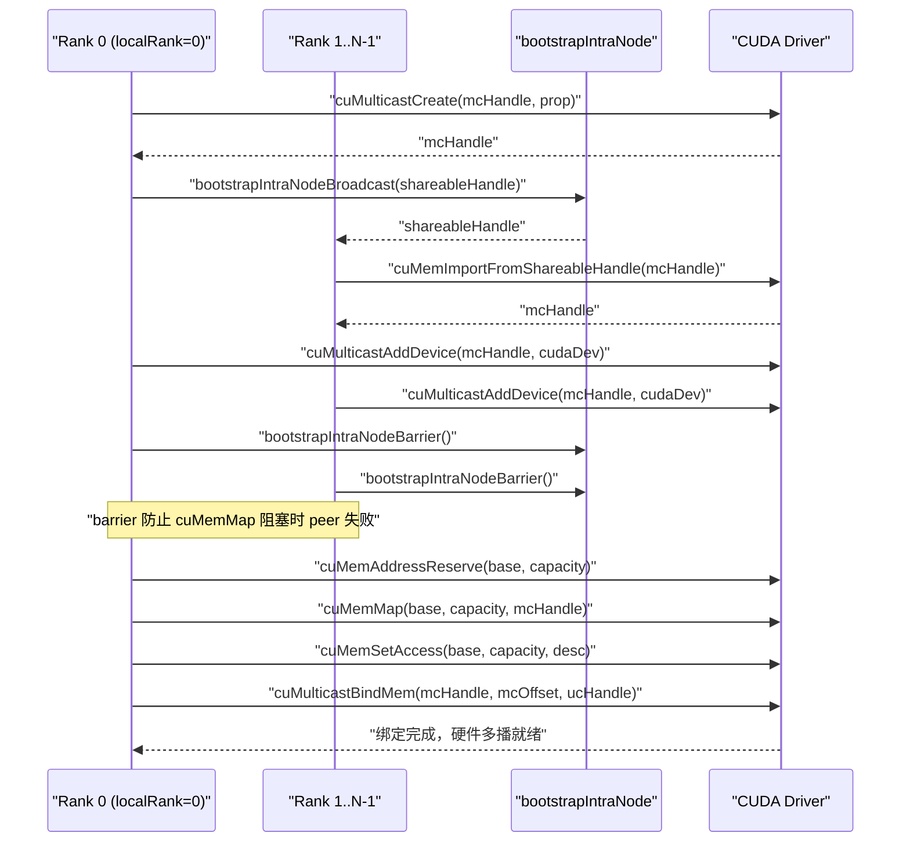
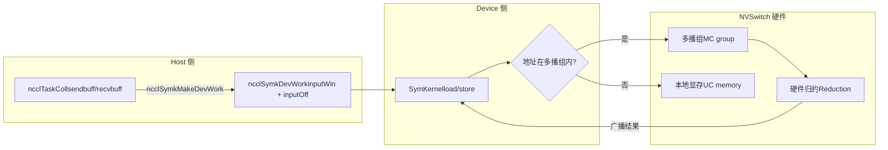

# Chapter 14: Symmetric Memory and NVLS: Multicast Acceleration and LSA Device-Side Direct Addressing

In the previous chapter, we followed an inter-node AllReduce and saw how data travels from GPU memory through the NIC to the peer GPU. That path solves communication between machines. But in modern AI clusters, the communication volume between GPUs within the same machine or even within the same NVLink domain is equally enormous—gradient synchronization in data parallel training and activation exchange in tensor parallelism mostly occur within a node. If intra-node communication still goes through the inter-node flow of GPU→memory→NIC→peer NIC→memory→GPU, it is like sending a local package by air freight, wasting latency for no reason. This chapter will dissect exactly the two powerful tools NCCL prepares for intra-node communication: symmetric memory and NVLS. The former lets each rank use the same set of virtual addresses to access all ranks' buffers, while the latter uses the multicast capability of NVSwitch hardware for reduction. Combined, they can push the latency of small-message collective communication close to the hardware limit.

# 14.1 Symmetric Memory: Making "Row 3, Seat 5" Point to the Same Location in Everyone's Home

## Intuitive Model

Imagine a class exchanging homework notebooks. The traditional approach is: everyone numbers their own notebooks, then shouts, "Zhang San, my 5th notebook is for you; Li Si, my 8th notebook is for you"—everyone has to remember "whose notebook is where, and which number it is." This is ordinary communication: addresses are**relative and private**, and to access peer data, you must first know the peer's address mapping.

Symmetric memory takes a different approach: the whole class agrees that the coordinate "Row 3, Seat 5" points to the same physical location in everyone's home. So if Zhang San wants Li Si's 5th notebook, he can just say "Li Si's home, Row 3, Seat 5," without any address translation. This is the core of symmetric memory:**each rank's buffer is mapped to the same virtual address in all ranks' address spaces**。

> **[Design Inference & Architectural Trade-offs]**
> Without symmetric memory, what disaster would intra-node collective communication face? Each rank accessing a peer buffer would have to go through an "address translation"—looking up tables, calculating offsets, and possibly even cross-process communication to confirm the mapping relationship. For small messages (a few KB), the overhead of this translation may be greater than the data transmission itself. Symmetric memory eliminates this overhead entirely, which is precisely the fundamental reason it "significantly reduces small-message latency."

## Data Structures and Memory Layout

The registration type of symmetric memory is described by`ncclSymRegType_t`,`ncclGetSymRegType`which divides registration states into four categories based on whether the send/recv windows carry the`NCCL_WIN_COLL_SYMMETRIC`flag.

[FACT:src/sym_kernels.cc:395-412]

```c
ncclResult_t ncclGetSymRegType(struct ncclDevrWindow* sendWin, struct ncclDevrWindow* recvWin,
                               ncclSymRegType_t* winRegType) {
  bool isSendSymmReg = false;
  bool isRecvSymmReg = false;
  if (sendWin && (sendWin->winFlags & NCCL_WIN_COLL_SYMMETRIC)) isSendSymmReg = true;
  if (recvWin && (recvWin->winFlags & NCCL_WIN_COLL_SYMMETRIC)) isRecvSymmReg = true;
  // determine the registration type
  if (!isSendSymmReg && !isRecvSymmReg) {
    *winRegType = ncclSymSendNonregRecvNonreg;
  } else if (isSendSymmReg && !isRecvSymmReg) {
    *winRegType = ncclSymSendRegRecvNonreg;
  } else if (!isSendSymmReg && isRecvSymmReg) {
    *winRegType = ncclSymSendNonregRecvReg;
  } else if (isSendSymmReg && is isRecvSymmReg) {
    *winRegType = ncclSymSendRegRecvReg;
  }
  return ncclSuccess;
}
```

These four states determine which path subsequent kernels take: fully symmetric registration (`SendRegRecvReg`) takes the fastest LSA path, fully non-registered (`SendNonregRecvNonreg`) takes the ordinary path, and mixed states require special handling.`winFlags`The`NCCL_WIN_COLL_SYMMETRIC`bit in

is the marker for "whether this window has undergone symmetric registration."`ncclSymkInitOnce`The initialization entry point for symmetric memory is`hasLsaMultimem`）。

[FACT:src/sym_kernels.cc:185-196]

```c
ncclResult_t ncclSymkInitOnce(struct ncclComm* comm) {
  // ncclTeamLsa() below calls this internally but drops the error code so we do it here.
  NCCLCHECK(ncclDevrInitOnce(comm));

  struct ncclSymkState* symk = &comm->symkState;
  if (!symk->initialized) {
    symk->initialized = true;
    struct ncclDevCommRequirements reqs = NCCL_DEV_COMM_REQUIREMENTS_INITIALIZER;
    // Disable LSA multicast for cross-clique since NVLS isn't available across cliques
    symk->hasLsaMultimem =
      ncclNvlsSymmetricMultimemEnabled(comm) && ncclTeamLsa(comm).nRanks > 2 && !comm->p2pCrossClique;
    reqs.lsaMultimem = symk->hasLsaMultimem;
```

`hasLsaMultimem`All three conditions are indispensable: NVLS symmetric multicast is enabled, the LSA team rank count is greater than 2 (two ranks are faster with direct point-to-point, no multicast needed), and it does not cross cliques (NVSwitch multicast is unavailable when crossing cliques). This determination directly decides whether`reqs.lsaMultimem`is set, which in turn affects the resource allocation of the device-side communicator.

## Scenario-Driven Step-by-Step Walkthrough

Suppose we initiate an AllReduce with a message size of 4KB, and 8 ranks are within the same NVLink domain.`ncclSymkMask`will determine which kernels are available.

[FACT:src/sym_kernels.cc:304-352]

```c
uint32_t ncclSymkMask(struct ncclComm* comm, ncclFunc_t coll, int /*ncclDevRedOp_t*/ red, ncclDataType_t ty,
                      size_t nElts, bool symAligned16B) {
  uint32_t kmask = kernelMask_coll(coll);

  bool hasSTMC = comm->symkState.hasLsaMultimem;
  bool hasLDMC = false;
  if (comm->symkState.hasLsaMultimem) {
    switch (ty) {
    case ncclInt32:
    ...
      hasLDMC = red == ncclDevSum || red == ncclDevMinMax || red == ncclDevSumPostDiv;
      break;
    ...
    }
  }
  if (!hasSTMC) kmask &= ~kernelMask_STMC;
  if (!hasLDMC) kmask &= ~kernelMask_LDMC;
```

Step one:`kernelMask_coll`Based on the collective type (AllReduce), retrieve the candidate kernel set`kernelMask_AR`. Step two: check`hasLsaMultimem`. If multicast is supported, further determine whether the data type and reduction operation support LDMC (Load-Multicast). Step three: use a bitmask to clear unsupported features—`kmask &= ~kernelMask_STMC`remove all kernels that do not support STMC.

Next is the size limit:

[FACT:src/sym_kernels.cc:336-342]

```c
  size_t nBytes = alignUp(nElts * ncclTypeSize(ty), NCCL_SYM_KERNEL_CELL_SIZE);
  size_t nBusBytes = (coll == ncclFuncAllReduce ? 1 : comm->nRanks) * nBytes;
  // LL kernels use 32-bit ints to track element counts and indices.
  if (nBusBytes >= (size_t(2) = 32 * (size_t(2) nRanks;
  kmask &= needGin ? kernelMask_Gin : ~kernelMask_Gin;
  return kmask;
```

TMA requires SMEM capacity to meet the threshold (`ncclSymkTmaAvailable`check`maxSharedMemOptin`) and 16-byte alignment. GIN is only needed when "the LSA team rank count is less than the total rank count"—that is, GIN only makes sense when the communication domain crosses the LSA boundary (requiring network traversal). If the entire communication domain is within the LSA, GIN kernels are removed.

## Concurrency Control and Hardware Interaction

Address resolution for symmetric memory ultimately lands on the device side.`ncclSymkMakeDevWork`translates the host-side task description into device-readable work items.

[FACT:src/sym_kernels.cc:380-393]

```c
ncclResult_t ncclSymkMakeDevWork(struct ncclComm* comm, struct ncclTaskColl* task, struct ncclSymkDevWork* outDevWork) {
  outDevWork->rootRank = task->root;
  outDevWork->redOpArg = task->opDev.scalarArg;
  outDevWork->nElts = task->count;
  outDevWork->inputWin = task->sendWin ? task->sendWin->vidmem : nullptr;
  outDevWork->inputOff =
    task->sendWin ? (uint8_t*)task->sendbuff - (uint8_t*)task->sendWin->userPtr : (size_t)task->sendbuff;
  outDevWork->outputWin = task->recvWin ? task->recvWin->vidmem : nullptr;
  outDevWork->outputOff =
    task->recvWin ? (uint8_t*)task->recvbuff - (uint8_t*)task->recvWin->userPtr : (size_t)task->recvbuff;
  outDevWork->sChannelId = 0xffff;
  outDevWork->nChannels = 0;
  return ncclSuccess;
}
```

Note the computation of`inputOff`: if sendWin exists (a symmetrically registered window), the offset is`sendbuff - sendWin->userPtr`—this is the**offset within the window**, and the device side can compute the actual address by taking`inputWin`(the window base address) plus`inputOff`. If sendWin does not exist, the offset is directly the absolute address of`sendbuff`. This design lets device-side kernels handle both registered and unregistered buffers with the same logic.

`ncclSymkInitOnce`also initializes GIN-related resource requirements, including inbox, outbox, accumulation buffer, and rail signal.

[FACT:src/sym_kernels.cc:208-251]

```c
    struct ncclDevResourceRequirements ginInboxRailReq = {};
    struct ncclDevResourceRequirements ginOutboxReq = {};
    struct ncclDevResourceRequirements rsGinAccumReq = {};
    struct ncclDevResourceRequirements railSignalReq = {};
    if (ncclParamSymGinKernelsEnable() && ncclTeamLsa(comm).nRanks nRanks) {
      int maxBlocks;
      size_t bufSize;
      getRequirements_gin(comm, &maxBlocks, &bufSize);

      maxBlocks = std::max(maxBlocks, comm->config.minCTAs);
      maxBlocks = std::min(maxBlocks, comm->config.maxCTAs);
      if (ncclParamSymCTAs() >= 1) maxBlocks = ncclParamSymCTAs();
      maxBlocks = std::min(maxBlocks, ncclSymkMaxBlocks);
      symk->maxGinInboxBlocks = maxBlocks;
      symk->kcomm.rsGinAccumBytesPerBlock = ncclSymkRsGinAccumBytesPerBlock();

      rsGinAccumReq.bufferSize = (size_t)maxBlocks * symk->kcomm.rsGinAccumBytesPerBlock;
      rsGinAccumReq.bufferAlign = 128;
      rsGinAccumReq.outBufferHandle = &symk->kcomm.rsGinAccumBuf;
      ...
      uint32_t railSignalCount = ncclTeamRail(comm).nRanks * ncclSymkMaxBlocks;
      ...
      reqs.barrierCount = ncclSymkMaxBlocks;
      reqs.ginConnectionType = NCCL_GIN_CONNECTION_RAIL;
      reqs.ginStrongSignalsRequired = true;
      reqs.ginVaSignalsRequired = true;
    }
```

`getRequirements_gin`uses the tuning model to compute the required number of blocks and buffer size, which are then clamped to the`[minCTAs, maxCTAs]`range.`rsGinAccumBytesPerBlock`is the accumulation buffer size per block, aligned to 128 bytes—the cache line size, to avoid false sharing.

```mermaid
flowchart TD
    start["ncclSymkMask(comm, coll, red, ty, nElts)"] --> coll{"集合类型?"}
    coll -->|AllGather| mask_ag["kmask = kernelMask_AG"]
    coll -->|AllReduce| mask_ar["kmask = kernelMask_AR"]
    coll -->|ReduceScatter| mask_rs["kmask = kernelMask_RS"]
    mask_ag --> check_stmc{"hasLsaMultimem?"}
    mask_ar --> check_stmc
    mask_rs --> check_stmc
    check_stmc -->|否| clear_stmc["kmask &= ~kernelMask_STMC"]
    check_stmc -->|是| check_ldmc{"数据类型+归约支持LDMC?"}
    clear_stmc --> size_check
    check_ldmc -->|否| clear_ldmc["kmask &= ~kernelMask_LDMC"]
    check_ldmc -->|是| size_check
    clear_ldmc --> size_check
    size_check{"nBusBytes >= 2GB?"} -->|是| clear_ll["kmask &= ~kernelMask_LL"]
    size_check -->|否| tma_check
    clear_ll --> tma_check{"TMA可用且16B对齐?"}
    tma_check -->|否| clear_tma["kmask &= ~kernelMask_Tma"]
    tma_check -->|是| gin_check
    clear_tma --> gin_check{"需要GIN? LSA rank |否| clear_gin["kmask &= ~kernelMask_Gin"]
    gin_check -->|是| done
    clear_gin --> done["返回 kmask"]
```

This diagram fully depicts the decision chain of`ncclSymkMask`: starting from the collective type, it passes through five filters in sequence—multicast support, data type, size boundary, TMA availability, and GIN requirement—and finally returns a bitmask. Each filter may eliminate a batch of kernels, which is exactly the embodiment of NCCL's "select the optimal kernel by scenario."

## Production Pitfall Guide

**Pitfall 1: Multicast silently fails when crossing cliques.** `hasLsaMultimem`The third condition of`!comm->p2pCrossClique`is`ncclNvlsSymmetricMultimemEnabled`. If your cluster is configured with MNNVL (Multi-Node NVLink) but some ranks cross cliques, multicast will be disabled, and performance will silently degrade to the normal path. When troubleshooting, check the log output of

**Pitfall 2: The implicit requirement of 16-byte alignment.** `ncclSymkMask`In`if (!symAligned16B) kmask &= ~kernelMask_Tma;`—if the user buffer is not 16-byte aligned, TMA kernels are removed. TMA is the fastest copy engine on Hopper/Blackwell, and losing it means a performance drop. In production environments, user-passed buffers often come from`cudaMalloc`, which are naturally aligned; but if they come from a custom allocator or a slice, you may hit this pitfall.

**Pitfall 3: The 2GB boundary.**LL kernels use 32-bit indices, and are removed once the total bus bytes exceed 2GB. For large model training, the gradients of a single AllReduce may exceed this value, in which case NCCL automatically switches to the STMC or Simple protocol. This is not a bug, but if you manually specify the LL protocol, you will get`ncclInvalidArgument`。

---

# 14.2 NVLS: Let NVSwitch Hardware Do the Reduction for You

## Intuitive Model

Traditional AllReduce is "software reduction": each GPU sends data to its neighbor, the neighbor performs addition, and then forwards it—data is shuttled back and forth between GPUs, and the addition is executed on the SM. This is like 8 people passing notes to compute a sum, where each person has to read it, add it, and pass it on.

NVLS takes a different approach: the NVSwitch chip has built-in**multicast and reduction capabilities**You write the data to the multicast address, and NVSwitch automatically broadcasts it to all members and performs the addition in hardware. It's like 8 people writing numbers on the same whiteboard, and the whiteboard automatically displays the sum—the GPU only writes once and reads once, while all the intermediate movement and addition are handled entirely by the switch hardware.

Without NVLS, the bandwidth of intra-node AllReduce would be limited by the point-to-point links between GPUs, and the SM would have to spend a large number of cycles doing additions. NVLS offloads both of these to hardware, freeing the SM to do other computations.

## Data Structures and Memory Layout

The core of NVLS is the**multicast group (MC group)**。`ncclMcGroup`The struct describes the entire state of a multicast group.

[FACT:src/transport/multicast.cc:72-77]

```c
struct ncclMcGroup {
  CUmemGenericAllocationHandle handle;  // the MC object
  char* base;                          // mapped MC VA base
  size_t capacity;                      // total mapped VA size
  int dev;                           // local device, for unbind
};
```

Four fields:`handle`is the handle of the CUDA multicast object,`base`is the base address of the multicast virtual address,`capacity`is the total mapping size,`dev`is the local device number (used for unbinding). Note that there is no lock here—the creation and destruction of multicast groups happen during the initialization/destruction phase, not on the hot path.

The multicast group is divided into multiple**partitions**, and each partition is an immutable slice.`ncclMcPartition`describes a partition.

[FACT:src/transport/multicast.cc:162-170]

```c
  // A partition is self-sufficient for binds: it carries the group's handle, device and
  // bind granularity alongside its own extent.
  for (int i = 0; i base + outPartitions[i].offset;
    outPartitions[i].mcHandle = mcHandle;
    outPartitions[i].minGranularity = minGran;
    outPartitions[i].dev = comm->cudaDev;
  }
```

Each partition carries its own`offset`、`size`、`ptr`, as well as the owning group's`mcHandle`、`minGranularity`、`dev`. This "self-contained" design allows partitions to be passed independently to the bind function without needing to look up group information again.

## Scenario-Driven Step-by-Step Walkthrough

Suppose 8 ranks want to establish an NVLS domain.`ncclMcGroupBuildPartitions`is responsible for creating the multicast group and splitting partitions.

[FACT:src/transport/multicast.cc:79-121]

```c
ncclResult_t ncclMcGroupBuildPartitions(struct ncclComm* comm, const struct ncclMcRequest* requests, int nRequests,
                                        struct ncclMcGroup** outGroup, struct ncclMcPartition* outPartitions) {
  ...
  mcprop.numDevices = comm->localRanks;
  mcprop.handleTypes = ncclCuMemHandleType;
  mcprop.flags = 0;
  mcprop.size = 0;
  for (int i = 0; i  recGran ? requests[i].alignment : recGran;
    ALIGN_SIZE(capacity, align);
    size_t slice = requests[i].size;
    ALIGN_SIZE(slice, recGran);
    outPartitions[i].offset = capacity;
    outPartitions[i].size = slice;
    capacity += slice;
  }
```

Step 1: Accumulate the sizes of all requests to get the total multicast group size. Step 2: Query CUDA's recommended granularity and minimum granularity—these are hardware constraints, and the address and size of the multicast object must be integer multiples of the granularity. Step 3: Bump allocation—carve out a block for each request, with offsets and sizes aligned to the recommended granularity.`ALIGN_SIZE(capacity, align)`ensures that the starting offset of each slice is a valid bind offset.

Next is cross-rank creation and import:

[FACT:src/transport/multicast.cc:125-146]

```c
  if (comm->localRank == 0) {
    NCCLCHECKGOTO(ncclMcCreate(comm, &mcprop, comm->localRank, comm->localRanks, &mcHandle, shareableHandle), ret,
                  fail);
    mcCreated = 1;
    NCCLCHECKGOTO(bootstrapIntraNodeBroadcast(comm->bootstrap, comm->localRankToRank, comm->localRank, comm->localRanks,
                                              0, shareableHandle, NVLS_HANDLE_SIZE),
                  ret, fail);
  } else {
    NCCLCHECKGOTO(bootstrapIntraNodeBroadcast(comm->bootstrap, comm->localRankToRank, comm->localRank, comm->localRanks,
                                              0, shareableHandle, NVLS_HANDLE_SIZE),
                  ret, fail);
    NCCLCHECKGOTO(ncclMcImport(comm, shareableHandle, comm->localRankToRank[0], &mcHandle), ret, fail);
    mcCreated = 1;
  }
  CUCHECKGOTO(cuMulticastAddDevice(mcHandle, comm->cudaDev), ret, fail);

  // cuMemMap of an MC object blocks until every device has been added. This
  // abort-aware barrier makes a peer failing before cuMulticastAddDevice trip the
  // abort flag here instead of stranding survivors in the blocking cuMemMap.
  NCCLCHECKGOTO(bootstrapIntraNodeBarrier(comm->bootstrap, comm->localRankToRank, comm->localRank, comm->localRanks,
                                          comm->localRankToRank[0]),
                ret, fail);
```

localRank 0 creates the multicast object, then broadcasts the shareable handle via bootstrap; other ranks receive the handle and import it.`cuMulticastAddDevice`adds the local device to the multicast group. Note that barrier—the comment makes it very clear:`cuMemMap`blocks until all devices have joined, and if some peer fails before`cuMulticastAddDevice`, the survivors will hang in`cuMemMap`. This barrier allows failures to be captured by the abort flag before blocking.

Finally, mapping and access permission setup:

[FACT:src/transport/multicast.cc:148-155]

```c
  // Reserve and map the whole MC VA once; each consumer slice is a view into it.
  CUCHECKGOTO(cuMemAddressReserve(&base, capacity, recGran, 0U, 0), ret, fail);
  CUCHECKGOTO(cuMemMap(base, capacity, 0, mcHandle, 0), ret, fail);
  mapped = 1;
  desc.flags = CU_MEM_ACCESS_FLAGS_PROT_READWRITE;
  desc.location.type = CU_MEM_LOCATION_TYPE_DEVICE;
  desc.location.id = comm->cudaDev;
  CUCHECKGOTO(cuMemSetAccess(base, capacity, &desc, 1), ret, fail);
```

The entire multicast VA is reserved and mapped only once, and each consumer slice is a view of this VA. This is the "map once, slice many times" design—more resource-efficient than creating a separate multicast object for each consumer.

## Concurrency Control and Hardware Interaction

Binding is the most critical operation in NVLS.`ncclMcPartitionBindMem`binds a UC (unicast) memory handle to a certain offset in the multicast group.

[FACT:src/transport/multicast.cc:200-225]

```c
ncclResult_t ncclMcPartitionBindMem(const struct ncclMcPartition* partition, size_t offsetInPartition,
                                    CUmemGenericAllocationHandle mem, size_t memOffset, size_t bindSize) {
  // A bind overrunning its partition would corrupt the next consumer's partition; fail
  // cleanly instead (possible when UC rounding exceeds the MC-rounded partition).
  if (offsetInPartition + bindSize > partition->size) {
    WARN("NVLS MC bind of size %zu at slice offset %zu exceeds slice size %zu (UC/MC granularity mismatch)", bindSize,
         offsetInPartition, partition->size);
    return ncclInternalError;
  }
  size_t mcOffset = partition->offset + offsetInPartition;
  ...
  CUresult err = CUPFN(cuMulticastBindMem(partition->mcHandle, mcOffset, mem, memOffset, bindSize, 0 /*flags*/));
  if (err != CUDA_SUCCESS) {
    ...
    WARN("Failed to bind NVLink SHARP (NVLS) Multicast memory of size %zu at MC group %llx offset %zu : CUDA error %d "
         "'%s'.\nThis is usually caused by a system or configuration error in the Fabric Manager or NVSwitches.\n"
         "Disable NVLS (NCCL_NVLS_ENABLE=0) if you wish to avoid this error in the future.",
         bindSize, partition->mcHandle, mcOffset, err, errStr);
    return ncclUnhandledCudaError;
  }
  return ncclSuccess;
}
```

The first line of defense is bounds checking:`offsetInPartition + bindSize > partition->size`and it errors out. The comment explains why—the granularity of UC memory may be larger than the MC partition, and if the UC alignment exceeds the boundary of the MC partition, it will step on the next consumer's partition. This is a typical "two granularities mismatch" trap.

`cuMulticastBindMem`is a hardware call, and the comment says it "blocks until all ranks have been added to the group"—this is where NVLS is most prone to problems. If Fabric Manager is misconfigured or there is an issue with the NVSwitch firmware, it will hang or return an error here. The error message directly suggests that the user`NCCL_NVLS_ENABLE=0`, which is the standard escape hatch in production environments.

There is also a "try bind" variant, used for user buffer registration:

[FACT:src/transport/multicast.cc:237-268]

```c
ncclResult_t ncclMcPartitionTryBindAddr(const struct ncclMcPartition* partition, size_t offsetInPartition,
                                        CUdeviceptr address, size_t bindSize, enum ncclMcBindStatus* outStatus) {
  const char* errStr = NULL;

  *outStatus = ncclMcBindStatusTransient;
  if (offsetInPartition + bindSize > partition->size) {
    ...
    return ncclInternalError;
  }
  size_t mcOffset = partition->offset + offsetInPartition;
  CUresult err = CUPFN(cuMulticastBindAddr(partition->mcHandle, mcOffset, address, bindSize, 0 /*flags*/));
  if (err == CUDA_SUCCESS) {
    *outStatus = ncclMcBindStatusOk;
    return ncclSuccess;
  }

  (void)pfn_cuGetErrorString(err, &errStr);
  // Only an outright rejection of the input is a property of the buffer. Anything else,
  // notably OUT_OF_MEMORY, may succeed later, so it must not be reported as permanent.
  if (err == CUDA_ERROR_INVALID_VALUE || err == CUDA_ERROR_NOT_SUPPORTED || err == CUDA_ERROR_NOT_PERMITTED) {
    *outStatus = ncclMcBindStatusNoSupport;
    ...
  } else {
    WARN("NVLS Multicast bind of size %zu at MC group %llx offset %zu dev %d failed transiently: CUDA error %d '%s'.\n"
         "The buffer is left unregistered for this operation and will be retried; repeated occurrences indicate "
         "sustained resource pressure.",
         bindSize, partition->mcHandle, mcOffset, partition->dev, err, errStr);
  }
  return ncclSuccess;
}
```

Here there is a subtle error classification:`CUDA_ERROR_INVALID_VALUE`、`NOT_SUPPORTED`、`NOT_PERMITTED`is classified as`ncclMcBindStatusNoSupport`—this is a**permanent failure**, indicating that this buffer itself does not support multicast binding. Other errors (especially`OUT_OF_MEMORY`) are classified as`ncclMcBindStatusTransient`—this is a**temporary failure**, and can be retried. This distinction is crucial: if OOM is treated as a permanent failure, a registration that could have succeeded will be mistakenly abandoned; if a parameter error is treated as a temporary failure, it will be retried indefinitely.

## Production Pitfall Avoidance Guide

**Pitfall 1: Fabric Manager misconfiguration causes`cuMulticastBindMem`to hang.**This is the most classic production failure of NVLS. The error message explicitly points to Fabric Manager or NVSwitch. Troubleshooting steps: first`NCCL_NVLS_ENABLE=0`to confirm the problem disappears, then check the Fabric Manager logs and NVSwitch firmware version.

**Pitfall 2: UC/MC granularity mismatch.** `ncclMcPartitionBindMem`The bounds check in

**will catch this problem, but if you see the "UC/MC granularity mismatch" warning, it means that the UC size of some request exceeds the MC partition after alignment. This usually happens when the request size is close to the granularity boundary.** `ncclMcGroupBuildPartitions`Pitfall 3: Resource leak after multicast group creation failure.`CUCALL`The fail path of`CUCHECK`：

[FACT:src/transport/multicast.cc:179-184]

```c
fail:
  // Best-effort (CUCALL) so a failing cleanup op cannot skip releasing the MC handle.
  if (mapped) CUCALL(cuMemUnmap(base, capacity));
  if (base) CUCALL(cuMemAddressFree(base, capacity));
  if (mcCreated) CUCALL(cuMemRelease(mcHandle));
  return ret;
```

The comment explains the reason: if the cleanup operation itself fails, releasing the MC handle must not be skipped because of it—MC slots are a scarce resource, and a leak will cause subsequent creations to fail. This is a typical design of "the cleanup path must do its best."



This sequence diagram depicts the complete flow of a multicast group from creation to binding. The key point is that barrier—it decouples "peer failure" from "cuMemMap blocking," preventing survivors from getting stuck.

---

# 14.3 The Combination of Symmetric Memory and NVLS: How LSA Pointers Are Resolved on the Device Side

## Intuitive Model

Symmetric memory solves the "address consistency" problem, and NVLS solves the "hardware reduction" problem. But for the two to truly work together, a key mechanism is still needed:**How does the device side know that a certain address is symmetric and can take the multicast path?**

The answer lies in the LSA (Load-Store Accessible) pointer. LSA is short for "Load-Store Accessible," meaning that the memory this pointer points to can be directly accessed by the GPU using ordinary load/store instructions—regardless of whether it is physically local or remote. If the address falls within a multicast group, the load/store will be intercepted and broadcast by the NVSwitch hardware.

## Data Structures and Memory Layout

`ncclSymkDevWork`It is the device-side work descriptor, and it carries the key information of symmetric memory.

[FACT:src/sym_kernels.cc:380-393]

```c
ncclResult_t ncclSymkMakeDevWork(struct ncclComm* comm, struct ncclTaskColl* task, struct ncclSymkDevWork* outDevWork) {
  outDevWork->rootRank = task->root;
  outDevWork->redOpArg = task->opDev.scalarArg;
  outDevWork->nElts = task->count;
  outDevWork->inputWin = task->sendWin ? task->sendWin->vidmem : nullptr;
  outDevWork->inputOff =
    task->sendWin ? (uint8_t*)task->sendbuff - (uint8_t*)task->sendWin->userPtr : (size_t)task->sendbuff;
  outDevWork->outputWin = task->recvWin ? task->recvWin->vidmem : nullptr;
  outDevWork->outputOff =
    task->recvWin ? (uint8_t*)task->recvbuff - (uint8_t*)task->recvWin->userPtr : (size_t)task->recvbuff;
  outDevWork->sChannelId = 0xffff;
  outDevWork->nChannels = 0;
  return ncclSuccess;
}
```

`inputWin`It is the device-side virtual address of the window (`vidmem`），`inputOff`It is the offset of the buffer within the window. After the device-side kernel obtains these two values, it computes`inputWin + inputOff`to get the actual address. If this address falls within the multicast group, the hardware will automatically handle the broadcast.

`ncclSymkInitOnce`It also sets up the LSA barrier and LLA2A (Low-Latency All-to-All) resources.

[FACT:src/sym_kernels.cc:197-206]

```c
    reqs.lsaBarrierCount = ncclSymkMaxBlocks;
    reqs.ginStrongSignalsRequired = false;
    reqs.ginVaSignalsRequired = false;

    struct ncclDevResourceRequirements lla2aReq;
    ncclLLA2ACreateRequirement(ncclSymkMaxBlocks,
                               ncclLLA2ACalcSlots(ncclTeamLsa(comm).nRanks * ncclSymkMaxThreads, ncclSymkLLMaxEltSize),
                               &symk->kcomm.lsaLLA2A, &lla2aReq);
    lla2aReq.next = reqs.resourceRequirementsList;
    reqs.resourceRequirementsList = &lla2aReq;
```

`lsaBarrierCount`Set to`ncclSymkMaxBlocks`—one barrier slot per block. LLA2A is short for low-latency all-to-all, used for fast data exchange within the LSA domain.`ncclLLA2ACalcSlots`The required number of slots is calculated based on the number of ranks, the number of threads, and the maximum element size.

## Scenario-Driven Step-by-Step Walkthrough

Suppose an AllReduce uses`AllReduce_AGxLLMC_R`kernel (AllGather + LL + MC + Reduce). The workflow of this kernel is:

1. **AllGather Phase**: Each rank writes its own data into the multicast group, and the NVSwitch hardware broadcasts it to all ranks.

2. **Reduce Phase**: Each rank reads the data of all ranks from the multicast group and performs the reduction locally.

`ncclSymkMask`It will check whether this kernel is available.`kernelMask_LL`It includes`AllReduce_AGxLLMC_R`, but only if`hasLsaMultimem`is true (otherwise`kernelMask_STMC`is cleared, and`AllReduce_AGxLLMC_R`belongs to the STMC set).

Wait, there is a detail here:`kernelMask_STMC`Does it include`AllReduce_AGxLLMC_R`? Look at the source code:

[FACT:src/sym_kernels.cc:17-21]

```c
constexpr uint32_t kernelMask_STMC =
  1 nvlsChannels;
    size_t creditSize = nChannels * 2 * memSize * nHeads;
    int nvlsStepSize = comm->nvlsChunkSize;

    NCCLCHECKGOTO(ncclCalloc(&comm->nvlsResources, 1), res, fail);
    comm->nvlsResources->inited = false;
    comm->nvlsResources->refCount = 1;
    comm->nvlsResources->nChannels = nChannels;
    comm->nvlsResources->nHeads = nHeads;
    comm->nvlsResources->chunkSize = comm->nvlsChunkSize;
    comm->nvlsResources->treeMaxChunkSize = comm->nvlsTreeMaxChunkSize;
    resources = comm->nvlsResources;

    for (int c = 0; c accessDesc, 0, sizeof(resources->accessDesc));
    resources->accessDesc.flags = CU_MEM_ACCESS_FLAGS_PROT_READWRITE;
    resources->accessDesc.location.type = CU_MEM_LOCATION_TYPE_DEVICE;
    resources->accessDesc.location.id = comm->cudaDev;
    resources->dev = comm->cudaDev;

    // Build the single shared MC group for this NVLS domain. The data slice is
    // reserved here but bound later by ncclNvlsBufferSetup.
    {
      size_t buffSize = nvlsStepSize * NCCL_STEPS;
      size_t dataSize = nChannels * 2 * buffSize * nHeads;
      size_t ubSize = ncclNvlsUbSize(comm);
      struct ncclMcRequest requests[3] = {{creditSize, 0}, {dataSize, 0}, {ubSize, 0}};
      struct ncclMcPartition partitions[3];
      NCCLCHECKGOTO(ncclMcGroupBuildPartitions(comm, requests, 3, &resources->mcGroup, partitions), res, fail);
      resources->creditPartition = partitions[0];
      resources->dataPartition = partitions[1];
      if (ubSize) {
        resources->ubPartition = partitions[2];
        NCCLCHECKGOTO(ncclMcArenaInit(comm, &resources->ubArena, &resources->ubPartition), res, fail);
        resources->ubEnabled = true;
      }
      NCCLCHECKGOTO(nvlsAllocBindUc(comm, &resources->creditPartition, creditSize, &resources->creditUc), res, fail);
    }
```

The multicast group is divided into three partitions:`creditPartition`(credit),`dataPartition`(data),`ubPartition`(user buffer). The credit partition is used for synchronization—each channel has independent head/tail pointers, shared through the multicast group.

The initialization of credit is in the later loop:

[FACT:src/transport/nvls.cc:456-491]

```c
    for (int h = 0; h nRanks + 1 + h;
      for (int c = 0; c channels + c;
        char* mem = NULL;
        struct ncclChannelPeer* peer = channel->peers[nvlsPeer];

        // Reduce UC -> MC
        mem = (char*)resources->creditUc.ptr + (h * 2 * nChannels + c) * memSize;
        peer->send[1].transportComm = &nvlsTransport.send;
        peer->send[1].conn.buffs[NCCL_PROTO_SIMPLE] = NULL;
        peer->send[1].conn.head = (uint64_t*)mem;
        peer->send[1].conn.tail = (uint64_t*)(mem + memSize / 2);
        peer->send[1].conn.stepSize = nvlsStepSize;
        mem = (char*)resources->creditPartition.ptr + (h * 2 * nChannels + c) * memSize;
        peer->recv[0].transportComm = &nvlsTransport.recv;
        peer->recv[0].conn.buffs[NCCL_PROTO_SIMPLE] = NULL;
        peer->recv[0].conn.head = (uint64_t*)mem;
        peer->recv[0].conn.tail = (uint64_t*)(mem + memSize / 2);
        peer->recv[0].conn.stepSize = nvlsStepSize;
        peer->recv[0].conn.flags |= NCCL_NVLS_MIN_POLL;
```

Each combination of head and channel has an independent credit region.`head`and`tail`are 64-bit pointers,`memSize`is 64 bytes (`size_t memSize = 64;`), so head and tail each occupy 32 bytes—exactly half a cache line.`NCCL_NVLS_MIN_POLL`The flag lets the receiver use the minimum polling mode, reducing CPU overhead.

## Production Pitfall Avoidance Guide

**Pitfall 1: head/tail contention in the credit partition.**Multiple channels share the same multicast group, but each channel has an independent credit region. If the number of channels is configured improperly (for example,`nvlsCTAs`is set too large), the credit region will expand and occupy precious multicast address space.`ncclNvlsChannels`The number of channels is automatically adjusted based on the GPU architecture and the number of nodes:

[FACT:src/transport/nvls.cc:100-133]

```c
  if (comm->config.nvlsCTAs != NCCL_CONFIG_UNDEF_INT) {
    channels = comm->config.nvlsCTAs;
  } else if (channels == 0 && comm->compCap >= 100) {
    // Use a reduced number of channels for single node/MNNVL domain on Blackwell and above.
    // comm->nNodes is not yet initialized at this point so we need to use local information.
    bool multiNode = false;
    if (comm->MNNVL) {
      multiNode = (comm->clique.size nRanks);
    } else {
      int i;
      for (i = 1; i nRanks; i++) {
        if (comm->peerInfo[i].hostHash != comm->peerInfo[0].hostHash) break;
      }
      multiNode = (i nRanks);
    }
    if (multiNode) {
      channels = RUBIN_AND_LATER(comm->compCap) ? /*RUBIN=*/64 : /*SM100=*/32;
    } else {
      channels = RUBIN_AND_LATER(comm->compCap) ? /*RUBIN=*/48 : /*SM100=*/24;
    }
  } else if (channels == 0) {
    channels = /*SM90=*/16;
  }
```

Note that`comm->nNodes`has not been initialized at this stage, so the code uses`peerInfo[i].hostHash`to manually determine whether it is multi-node. This is a classic trap in initialization order—you cannot rely on a field that has not yet been computed.

**Pitfall 2: MNNVL does not support NVLS buffer registration.** [FACT:src/transport/nvls.cc:516-517]

```c
  // MNNVL does not support NVLS buffer registration
  if (!comm->MNNVL && comm->nvlsResources->nvlsShmemHandle == NULL) {
```

In an MNNVL (Multi-Node NVLink) environment, user buffer registration is skipped. If your cluster is MNNVL and relies on UB registration to improve performance, you will find that the registration does not take effect. This is a hardware limitation, not a bug.

**Pitfall 3: Reference counting for shared resources.** `ncclNvlsSetup`Supports parent-child communicator sharing of NVLS resources:

[FACT:src/transport/nvls.cc:380-392]

```c
  if (nvlsShare) {
    /* reuse NVLS resources */
    comm->nvlsChannels = std::min(comm->nvlsChannels, parent->nvlsResources->nChannels);
    /* Inherit chunk sizes from the shared resource since we're reusing the parent's
     * NVLS buffers, which were allocated and laid out based on these values. */
    comm->nvlsChunkSize = parent->nvlsResources->chunkSize;
    comm->nvlsTreeMaxChunkSize = parent->nvlsResources->treeMaxChunkSize;
    for (int c = 0; c nvlsChannels; c++) {
      NCCLCHECKGOTO(initNvlsChannel(comm, c, parent, true), res, fail);
    }

    comm->nvlsResources = parent->nvlsResources;
    ncclAtomicRefCountIncrement(&parent->nvlsResources->refCount);
  }
```

The child communicator reuses the parent communicator's resources, incrementing the reference count by one.`ncclNvlsFree`The resource is only truly released when the reference count drops to zero. If reference counting is mismanaged, it can lead to premature resource release or leaks. Note that`nvlsChunkSize`and`nvlsTreeMaxChunkSize`must inherit the parent communicator's values—because buffers are laid out according to these values, and changing them would cause address calculation errors.



This data flow diagram shows the complete chain from host-side tasks to device-side execution. The key branch is`lsa{"地址在多播组内?"}`—if yes, it goes through NVSwitch hardware multicast and reduction; if no, it goes through local memory. This determination is made automatically by the hardware based on the address range, requiring no software intervention.

---

# 14.4 Design Reflection: Why Symmetric Memory Reduces Small Message Latency

Returning to the core question at the beginning of this chapter: why can symmetric memory significantly reduce small message latency?

**First, it eliminates address translation overhead.**In traditional communication, each rank accessing a peer's buffer must look up a table and calculate offsets. Symmetric memory lets all ranks use the same set of addresses, and the device-side kernel can directly compute`base + offset`For small messages, the overhead of this translation is proportionally very high.

**Second, it eliminates control message round trips.**Traditional communication requires exchanging control information such as "which buffer of yours do I want to write to." With symmetric memory, addresses are pre-agreed upon and no runtime negotiation is needed.

**Third, it makes hardware multicast possible.**Only when addresses are symmetric can NVSwitch use the same set of addresses for multicast. If each rank has different addresses, the hardware cannot know where to broadcast.

**Fourth, it reduces the SM's reduction burden.**NVLS offloads addition to NVSwitch, so the SM only needs to issue one write and one read. For small messages, the SM's instruction overhead is the main source of latency.

The combination of these four factors reduces small message latency from "microsecond-level" to "sub-microsecond-level."

> **[Design Inference & Architectural Trade-offs]**
> From an engineering perspective, the design of symmetric memory embodies a core philosophy of NCCL:**Push complexity to the initialization phase, keeping the hot path as simple as possible.**Address negotiation, multicast group creation, and credit allocation are all completed at initialization time, and the runtime kernel only needs to perform the simplest address calculations and load/store operations. This "heavy initialization, light runtime" design is a common pattern in high-performance communication libraries.

---

# Chapter Summary

This chapter dissected the two pillars of NCCL intra-node communication:

1. **Symmetric Memory**: Through`ncclSymkInitOnce`and`ncclSymkMask`establish buffers with consistent addresses, allowing each rank to access all ranks' data using the same set of addresses.`ncclSymkMakeDevWork`translates host-side tasks into device-side work items,`inputWin + inputOff`is the core formula for address resolution.

2. **NVLS Multicast**: Through`ncclMcGroupBuildPartitions`create multicast groups,`ncclMcPartitionBindMem`binds UC memory to multicast groups,`cuMulticastBindMem`is the hardware call. The multicast group is divided into three partitions—credit, data, and ub—used for synchronization, data transfer, and user buffer registration respectively.

3. **LSA Pointer Resolution**: The device side automatically determines whether to use the multicast path based on the address range, requiring no software translation.`NCCL_NVLS_MIN_POLL`The flag optimizes polling overhead.

4. **Error Handling**：`ncclMcPartitionTryBindAddr`distinguishes permanent failures from transient failures,`ncclMcGroupBuildPartitions`the fail path uses`CUCALL`to ensure resource release.

# Chapter Review Questions

Q1: If the boundary check in`ncclMcPartitionBindMem`is removed,`if (offsetInPartition + bindSize > partition->size)`under what scenarios would an out-of-bounds memory access be triggered? Why can't this check be replaced by "UC and MC have the same granularity"?

**Reference Analysis**: See[FACT:src/transport/multicast.cc:200-208]：
