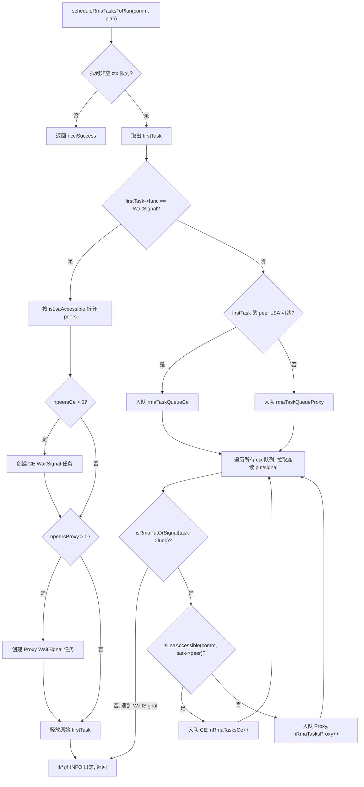
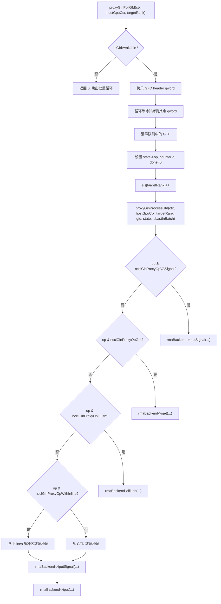

# Chapter 15: RMA and GIN: The Evolution of Remote Memory Access and GPU Direct Communication

In the previous chapter, we saw how symmetric memory allows each rank to access all ranks' buffers using the same set of addresses, and how NVLS leverages NVSwitch's multicast capability to push hardware-accelerated reduction to the extreme. But collective communication is not everything—when applications need point-to-point remote memory operations, or want GPU kernels to directly initiate network requests, RMA and GIN come into play. RMA provides put/get semantics for remote memory access, while GIN allows the GPU to bypass host proxy threads and interact directly with the network. This chapter follows the order of "RMA first, then GIN," dissecting layer by layer the data structures, scheduling logic, concurrency control, and production pitfalls of these two mechanisms.

# RMA's Dual-Channel Model: The Division of Labor Between CE and Proxy

## Intuitive Model

Imagine a cross-border courier system: intra-city deliveries (ranks reachable via LSA) can be delivered directly by local delivery vehicles, while cross-city deliveries (ranks not reachable via LSA) must be handed off to air freight forwarders. NCCL's RMA is exactly this model—the same put operation, depending on whether the target rank is within the LSA (Load-Store Accessible) team, is routed to two completely different execution paths: the CE (Copy Engine) path and the Proxy (proxy thread) path.

Without this splitting mechanism, all RMA operations would go through the proxy thread, so even intra-node puts would have to be relayed through a host thread, needlessly adding a host-device round-trip latency. Conversely, if all operations went through CE, cross-node operations could not leverage the asynchronous capabilities of the network plugin.

## Data Structures and Memory Layout

The core scheduling structure for RMA is`ncclRmaArgs`, which records the splitting result of RMA tasks within a plan. Key fields include:

| Field | Meaning |
| --- | --- |
| `func` | Operation type (PutSignal / Signal / WaitSignal) |
| `nRmaTasks` | Total task count |
| `nRmaTasksProxy` | Number of tasks going through the proxy path |
| `nRmaTasksCe` | Number of tasks going through the CE path |

Each plan internally maintains two intrusive queues:`rmaTaskQueueCe`and`rmaTaskQueueProxy`, which respectively hold the tasks for the two paths.[FACT:src/rma/rma.cc:166-171]

The logic for determining whether a rank is LSA-reachable is straightforward—iterate over the`lsaRankList`array and perform a linear search.[FACT:src/rma/rma.cc:34-41]This lookup is performed once per peer during task scheduling, with complexity O(lsaSize), and for typical small-scale LSA teams (usually 2-8 ranks) the overhead is negligible.

## Step-by-Step Scheduling Flow

When the application calls an RMA put operation, the task enters`planner->rmaTaskQueues[ctx]`。`scheduleRmaTasksToPlan`, which is responsible for distributing tasks from the queue into plans.[FACT:src/rma/rma.cc:141-296]

Step 1: Find the first non-empty context queue. NCCL supports multiple RMA contexts (configured by`numRmaCtx`), each with its own independent queue.[FACT:src/rma/rma.cc:148-155]

Step 2: Take out the first task and determine the operation type. If it is WaitSignal, follow the special splitting logic; if it is Put/Signal, follow the batch merging logic.[FACT:src/rma/rma.cc:163-168]

For WaitSignal tasks, the scheduler needs to split the peers list into two groups based on LSA reachability: the CE group and the Proxy group.[FACT:src/rma/rma.cc:187-204]After splitting, two new`ncclTaskRma`structures are created respectively, each holding the peers array for the corresponding group.[FACT:src/rma/rma.cc:207-246]The original task is released.[FACT:src/rma/rma.cc:251]

For Put/Signal tasks, the logic is more complex—the scheduler iterates over the queues of all contexts, pulling all consecutive put/signal tasks into the same plan until it encounters a WaitSignal, at which point it stops.[FACT:src/rma/rma.cc:279-295]The purpose of this design is clearly stated in the comments: let a single kernel launch cover the put/signal of all contexts, so that the proxy can issue all asynchronous requests at once before any blocking operation, while the CE path submits the copies and signals of all contexts in a batch.[FACT:src/rma/rma.cc:270-278]

## Parallel Execution and Stream Synchronization

After scheduling is complete,`ncclLaunchRma`dispatches to`func`or`ncclRmaPut`based on the`ncclRmaWaitSignal`。[FACT:src/rma/rma.cc:109-131]

field.`ncclRmaPut`Taking[FACT:src/rma/rma.cc:80-96]as an example, when both proxy and CE tasks exist in a plan, the two paths need to execute in parallel. NCCL's approach is: record an event on the input stream, have the CE stream wait on this event, then launch operations on both streams simultaneously, and finally record another event on the CE stream, having the input stream wait on it.

This event chain ensures that: CE operations do not start before the input stream's dependencies are ready, and subsequent operations on the input stream do not start before CE completes.[FACT:src/rma/rma.cc:97-101]

## If there are only proxy tasks or only CE tasks, the corresponding operation is launched directly on the input stream, with no additional stream synchronization needed.

**Design Considerations and Production Pitfalls** `isLsaAccessible`Pitfall 1: The static nature of LSA reachability determination.`comm->devrState.lsaRankList`At scheduling time,

**is queried, and this list no longer changes after the communication domain is initialized. If the topology changes during runtime (for example, NVLink failure degradation), the LSA list will not update automatically, which may cause operations that should go through proxy to still take the CE path, triggering an unrecoverable error.**Pitfall 2: FIFO guarantee of batch merging.[FACT:src/rma/rma.cc:283]The batch merging logic only pulls consecutive put/signal tasks and stops when it encounters a WaitSignal.

**This guarantees FIFO order within each context, but tasks across contexts may be merged into the same plan. If the application relies on operation order across contexts, it needs to explicitly use WaitSignal to establish a barrier.**Pitfall 3: Memory leak paths.`npeersProxy == 0`In the WaitSignal branch, if`peersProxy`、`nsignalsProxy`、`signalIdxsProxy`, the code releases[FACT:src/rma/rma.cc:239-244]three arrays.`npeersCe == 0`But if`npeersProxy > 0`，`peersCe`and`ncclMemoryStackAlloc`and other arrays are allocated via[FACT:src/rma/rma.cc:176-178]This asymmetry can easily confuse readers, but it is actually correct—the stack-allocated memory is managed by`comm->memScoped`in a unified manner.

# RMA Proxy Context: Signals, Queues, and Lock-Free Ring Buffers

## Intuitive Model

The proxy context is like a "post office sorting center": the GPU places packages to be sent (put requests) into the inbox (ring buffer), the proxy thread takes packages out of the inbox and hands them to the courier company (network plugin), and the courier company stamps the receipt (signal) after delivery. Throughout this process, the GPU and the proxy thread communicate through lock-free data structures, avoiding expensive lock contention.

## Data Structures and Memory Layout

`ncclRmaProxyCtx`is the host structure of the proxy context, and its core fields include:

**Signal region (signalsDev)**: a block of memory allocated on the GPU, with size`nRanks * numRmaSig * sizeof(uint64_t)`。[FACT:src/rma/rma_proxy.cc:120-123]Each rank has`numRmaSig`signal slots, used to receive signals from that rank. When this block of memory is registered with the network plugin, it carries`NCCL_NET_MR_FLAG_FORCE_SO`(force strong ordering) and`NCCL_NET_MR_FLAG_SIGNAL_NEVER_RESET`(signals are never reset) flags.[FACT:src/rma/rma_proxy.cc:125-127]The strong ordering flag ensures the ordering relationship between put and signal—if put is issued before signal, the network must guarantee that signal is written only after the put data arrives.

**Sequence number region (opSeqs/readySeqs/doneSeqs)**: one group per rank, allocated through`allocMemCPUAccessible`and may be GDR (GPU Direct RDMA) memory or ordinary host memory.[FACT:src/rma/rma_proxy.cc:132-137]These three sequence numbers respectively track: the sequence number of submitted operations, the sequence number of ready operations, and the sequence number of completed operations.

**Lock-free ring buffers (circularBuffers)**: an array of pointers with size`nRanks * queueSize`with one independent ring queue per rank.[FACT:src/rma/rma_proxy.cc:163-164]The accompanying`pis`(Producer Index) and`cis`(Consumer Index) arrays each have`nRanks`elements.[FACT:src/rma/rma_proxy.cc:165-166]The queue size must be a power of 2, so that index wraparound can use bitwise AND`& (queueSize - 1)`instead of modulo.[FACT:src/rma/rma_proxy.cc:156-160]

**InProgress queue**: one intrusive linked list per peer, storing descriptors that have been submitted to the network plugin but have not yet completed.[FACT:src/rma/rma_proxy.cc:170-175]This is a single-consumer queue, accessed only by the proxy thread, and requires no atomic operations.

## Step-by-Step: From Context Creation to Progress Advancement

**Context Creation**：`ncclRmaProxyCreateContext`First, create the network context through the RMA plugin.[FACT:src/rma/rma_proxy.cc:229]Then call`ncclRmaProxyCtxAlloc`to allocate resources such as signals, sequence numbers, and ring buffers.[FACT:src/rma/rma_proxy.cc:231]Next, call`ncclRmaProxyCtxAllocGraph`to allocate the resources required for graph capture mode—CPU-accessible signals, flush buffers, and persistent queues.[FACT:src/rma/rma_proxy.cc:232]

Graph capture mode exists because CUDA Graph requires all operations to be replayable. In normal mode, signals are in GPU memory and the proxy reads them through GDR; in graph capture mode, signals are in CPU-accessible memory and the proxy can read and write them directly, avoiding the nondeterminism of GDR.[FACT:src/rma/rma_proxy.cc:184-190]

**Progress Thread**：`ncclRmaProxyProgressThread`is the main loop of the proxy.[FACT:src/rma/rma_proxy.cc:354-389]It decides its behavior based on the`rmaProgress`state word:

- `rmaProgress == 1`: normal progress mode, iterating over all proxy contexts and calling`ncclRmaProxyProgress`。[FACT:src/rma/rma_proxy.cc:361-372]
- `rmaProgress == 2`: pause mode, used for resource reclamation. After the thread confirms the pause, it waits on a condition variable.[FACT:src/rma/rma_proxy.cc:373-378]
- `rmaProgress == -1`: exit signal, and the thread returns.[FACT:src/rma/rma_proxy.cc:379-380]
- `rmaProgress == 0`: idle wait.[FACT:src/rma/rma_proxy.cc:381-382]

If`ncclRmaProxyProgress`returns an error, the thread writes the error code into`asyncResult`, sets`rmaProgress = -2`, and then exits.[FACT:src/rma/rma_proxy.cc:365-369]This error code will be read by the main thread in a subsequent`ncclCommGetAsyncError`call.

## Concurrency Control and Memory Ordering

The concurrency model of the RMA proxy is "single-producer-single-consumer": the GPU kernel is the producer, and the proxy thread is the consumer. The PI of the ring buffer is updated by the GPU, and the CI is updated by the proxy. Because it is single-producer-single-consumer, no CAS operation is needed, only correct memory ordering.

The strong ordering flag of the signal region`NCCL_NET_MR_FLAG_FORCE_SO`is key.[FACT:src/rma/rma_proxy.cc:127]Without this flag, the network plugin may reorder put and signal, causing the receiver to see the signal before the data arrives and read stale data.

`NCCL_NET_MR_FLAG_SIGNAL_NEVER_RESET`The flag tells the network plugin: once a signal is written, it will not be reset.[FACT:src/rma/rma_proxy.cc:127]This allows the plugin to optimize the signal write path—there is no need to clear it before each write.

## Production Pitfalls

**Pitfall 1: The queue size is not a power of 2.**If the user sets a value that is not a power of 2 through`NCCL_RMA_PROXY_QUEUE_SIZE`the code falls back to the default value and prints an INFO log.[FACT:src/rma/rma_proxy.cc:156-159]This fallback is silent (only INFO level), and is easily overlooked in production environments. If the user expects a larger queue to absorb burst traffic but the default value is actually used, backpressure may result.

**Pitfall 2: The fallback chain when DMA-BUF registration fails.** `ncclRmaProxyRegMrSym`There are three layers of fallback for registering CUDA memory: first try DMA-BUF in DataDirect mode, then try non-DataDirect DMA-BUF after failure, and only fall back to ordinary`regMrSym`。[FACT:src/rma/rma_proxy.cc:76-108]The comments specifically warn: if one MR enters the non-DataDirect path, all other MRs must do the same; mixing them will break GIN's ordering guarantees.[FACT:src/gin/gin_host_proxy.cc:429-430]This constraint is not explicitly checked in the RMA path, making it a potential hidden risk.

**Pitfall 3: Delayed error propagation in the progress thread.**When`ncclRmaProxyProgress`returns an error, the thread sets`asyncResult`and exits.[FACT:src/rma/rma_proxy.cc:366-369]But the main thread may be executing a long-running kernel and will not immediately check`asyncResult`. During this period, subsequent RMA operations will continue to be enqueued but will not be processed until the main thread discovers the error. This is the inherent delay of asynchronous error propagation, and the application needs to periodically call`ncclCommGetAsyncError`to shorten this window.

# GIN Architecture: GPU Directly Initiates Network Requests

## Intuitive Model

In the traditional model, for the GPU to send network data, it must go through the path "GPU → host memory → proxy thread → NIC." The goal of GIN (GPU-Initiated Networking) is to let the GPU directly write to the NIC's send queue, just as the CPU directly writes to the NIC's MMIO registers. This requires the NIC to support doorbell writes initiated by the GPU, as well as a communication protocol between the GPU and the proxy thread.

## Data Structures and Memory Layout

The core data structure of GIN is`ginProxyHostGpuCtx`, which represents a GPU-host communication context:

| Field | Type | Meaning |
| --- | --- | --- |
| `queues` | `ncclGinProxyGfd_t*` | GFD queue, size`nRanks * queueSize` |
| `pis` | `uint32_t*` | Producer index (written by GPU) |
| `cis` | `uint32_t*` | Consumer index (written by proxy) |
| `cisShadow` | `uint32_t*` | Shadow copy of CI (proxy-local) |
| `sis` | `uint32_t*` | Seen index (proxy-local) |
| `states` | `ginProxyGfdState*` | Status of each GFD slot |
| `inlines` | `uint64_t*` | Inline data buffer |

A GFD (GIN Forwarding Descriptor) is a request descriptor written by the GPU to the proxy. Each GFD consists of multiple qwords, containing the operation type, source address, destination address, size, signal information, and so on.[FACT:src/gin/gin_host_proxy.cc:158-163]

`queues`There is a key detail in the memory allocation of the array: it is allocated via`allocMemCPUAccessible`, but the`forceHost=true`parameter is passed in.[FACT:src/gin/gin_host_proxy.cc:564]This means the queue itself is in host memory, and the GPU writes to it via PCIe. Whereas the`cis`array is allocated in GPU-accessible memory (possibly GDR), because the proxy needs to update it frequently.[FACT:src/gin/gin_host_proxy.cc:565-566]

`cisShadow`and`sis`are local copies of the proxy thread, avoiding the need to read`cis`。[FACT:src/gin/gin_host_proxy.cc:44-47]which may be located in GPU memory every time. Only when`cisShadow`advances are`cis`。

## Step-by-Step: Polling and Processing of GFDs

`ncclGinProxyProgress`is the main loop of the GIN proxy.[FACT:src/gin/gin_host_proxy.cc:648-669]

Step 1: For each context, first call`proxyGinPollCompletions`to check the completion status of submitted requests.[FACT:src/gin/gin_host_proxy.cc:653]

Step 2: For each target rank, poll GFDs in batches.`pollBatch`controls the maximum number of GFDs processed each time.[FACT:src/gin/gin_host_proxy.cc:654-655]

Step 3:`proxyGinPollGfd`Check whether there is a new GFD at the head of the queue. The criterion is whether the flag bit in the GFD header is non-zero.[FACT:src/gin/gin_host_proxy.cc:176-182]If so, first copy the first qword (the header), then wait for the remaining qwords to become ready.[FACT:src/gin/gin_host_proxy.cc:194-202]After copying is complete, zero out the GFD in the queue to prevent duplicate processing.[FACT:src/gin/gin_host_proxy.cc:206-208]

Step 4:`proxyGinProcessGfd`Dispatch to different processing paths according to the operation type.[FACT:src/gin/gin_host_proxy.cc:246-340]

## Complete polling and counter updates

`proxyGinPollCompletions`is responsible for checking the completion status of submitted requests.[FACT:src/gin/gin_host_proxy.cc:113-156]

For each target rank, from`cisShadow`to`sis`iterate over all seen but unconsumed GFD states.[FACT:src/gin/gin_host_proxy.cc:117]If the state is not complete, call`rmaBackend->test`to check.[FACT:src/gin/gin_host_proxy.cc:122]If it is complete and the operation carries a counter flag, update the counter value.[FACT:src/gin/gin_host_proxy.cc:132-141]

Counter updates use atomic loads and atomic stores, but the comment explains why atomic addition is not needed: the GPU kernel does not allow resetting the counter while there are outstanding operations, so there is no race.[FACT:src/gin/gin_host_proxy.cc:133-135]

The update of CI has a mechanism that "allows holes": only when`state->done && i == cisShadow[targetRank]`does CI advance.[FACT:src/gin/gin_host_proxy.cc:145-151]This ensures that CI is monotonically increasing, and even if some GFDs complete first, it will not skip incomplete GFDs.

## Concurrency Control and Memory Barriers

The concurrency model of the GIN proxy is more complex than that of the RMA proxy, because there are multiple proxy threads (controlled by`GIN_PROXY_NTHREADS`).[FACT:src/gin/gin_host.cc:90]

`ncclGinProgress`In , each thread is responsible for a set of connections: thread t handles connections t, t+proxyNthreads, t+2*proxyNthreads, ....[FACT:src/gin/gin_host.cc:72]This allocation method ensures that each connection is handled by only one thread, avoiding connection-level races.

Modifications to the devComms linked list require write-lock protection.`ginProgressWriteLock`First set the`writePending`flag, then acquire the write lock.[FACT:src/gin/gin_host.cc:43-47]The progress thread checks`writePending`at the beginning of each loop, and yields the CPU if it is true.[FACT:src/gin/gin_host.cc:63-66]This design avoids the progress thread being blocked by a write lock while holding a read lock.

`writePending`uses`std::atomic<bool>`, but the comment points out that this logic assumes there is only one writer.[FACT:src/gin/gin_host.cc:43-47]In NCCL's usage scenario, only the main thread modifies the devComms linked list, so this assumption holds.

## Production Pitfalls

**Pitfall 1: The memory location of the GFD queue.** `queues`is forcibly allocated in host memory (`forceHost=true`），[FACT:src/gin/gin_host_proxy.cc:564]This means that GPU writes to GFDs must go through the PCIe bus. If the GFD write frequency is very high (small-message scenarios), PCIe bandwidth may become a bottleneck. In contrast,`cis`is allocated in GPU-accessible memory, because the proxy needs to update it frequently.[FACT:src/gin/gin_host_proxy.cc:565-566]

**Pitfall 2: Reconstruction of inline data.**When a GFD carries inline data, the proxy needs to reconstruct the inline value from multiple qwords.[FACT:src/gin/gin_host_proxy.cc:298-305]The reconstruction logic decides which qwords to read based on size: size ≤ 4 reads only the low 32 bits, size > 4 reads the low 64 bits, and size > 6 additionally reads the high 16 bits. This segmented logic must strictly correspond to the write logic on the GPU side; any inconsistency will cause data corruption.

**Pitfall 3: Multithreaded progress and connection allocation.**If different ranks set different`GIN_PROXY_NTHREADS`, after taking the minimum via AllGather, some threads may not be allocated any connections.[FACT:src/gin/gin_host.cc:181-183]Comments point out that these threads will spin in the stride loop, which will not cause correctness issues but will waste CPU resources.

# GIN backend selection and version compatibility

## Intuitive model

GIN supports multiple backends: Proxy (software emulation based on the RMA plugin), GDAKI (GPU Direct Async Kernel Initiated), GPI (GPU-Initiated), and EFA GDA (AWS EFA's GPU Direct Async). This is like how the same API can have multiple implementations - the software emulation version has the best compatibility but average performance, while the hardware-offload version has the best performance but requires support from specific NICs.

## Backend version matrix

Each backend has a version compatibility array, where the index is the backend version number and the value is the minimum NCCL version required by that version.[FACT:src/gin/gin_host.cc:27-33]

| Backend | Version 0 | Version 1 | Version 2 | Version 3 |
| --- | --- | --- | --- | --- |
| Proxy | 0 | 2.30.3 | 2.30.5 | 2.32.0 |
| GDAKI | 0 | 2.30.3 | 2.30.5 | - |
| GPI | 0 | 2.30.5 | - | - |
| EFA GDA | 0 | 2.31.0 | 2.32.0 | - |

Version selection logic: iterate through the version array and find the first entry whose required version is higher than the current device code version; the previous version is then the available version.[FACT:src/gin/gin_host.cc:300-304]

## Backend selection process

`ncclGinDevCommSetup`Iterate through all active backends and try to create a DevComm with each backend.[FACT:src/gin/gin_host.cc:427-442]Selection conditions include: the requested GIN type matches (or is unspecified), and the signal capability meets the requirements.[FACT:src/gin/gin_host.cc:430-435]

`ncclGinValidateSignalRequest`Check two capabilities: strong signal (`supportsStrongSignals`) and VA signal (`supportsVASignals`）。[FACT:src/gin/gin_host.cc:230-243]If the request requires a strong signal but the backend does not support it, skip that backend.

## Connection establishment and stride calculation

`ncclGinConnectOnce`Establish the GIN connection.[FACT:src/gin/gin_host.cc:92-228]

The connection type determines the stride: in FULL mode the stride is 1 (connect to all ranks), and in RAIL mode the stride is`contiguousRanksPerHost`(only connect to ranks on the same rail).[FACT:src/gin/gin_host.cc:139-145]

In`ginDevCommSetupWithBackend`, the stride validation logic is very strict:

- The requested stride cannot be 0.[FACT:src/gin/gin_host.cc:318-323]
- The requested stride cannot be greater than the stride of the rail team.[FACT:src/gin/gin_host.cc:324-330]
- The requested stride must be a multiple of the connected stride.[FACT:src/gin/gin_host.cc:331-337]

The motivation for these constraints is that the hierarchical barrier assumes GIN is at least RAIL-connected.[FACT:src/gin/gin_host.cc:325]If the stride does not satisfy these conditions, the communication path between some ranks may not exist.

## Production pitfalls

**Pitfall 1: Backend version mismatch.**If the device code version is lower than the minimum version required by the backend,`backendVersion`will remain at a lower value.[FACT:src/gin/gin_host.cc:301-303]This may make some new features unavailable (such as signals never being reset), but it will not cause errors. However, if the device code version is higher than all known versions,`backendVersion`will take the maximum value, which may trigger undefined behavior.

**Pitfall 2: The boundary of stride validation.**If`requestedStride % connectedStride != 0`, creation fails.[FACT:src/gin/gin_host.cc:331-337]This check assumes that connectedStride is a power of 2 (1 in FULL mode, and`contiguousRanksPerHost`in RAIL mode). If`contiguousRanksPerHost`is not a power of 2 (for example, 3), the multiple check may reject a legal stride.

# Chapter review and self-test

Q1: In`scheduleRmaTasksToPlan`'s WaitSignal branch, if you remove`plan->rmaArgs->nRmaTasks = (npeersCe > 0 ? 1 : 0) + (npeersProxy > 0 ? 1 : 0)`this line and change it to directly set 1, in what scenario would it cause a problem?

**Reference analysis**: Look at[FACT:src/rma/rma.cc:248]。`nRmaTasks`records the actual number of tasks enqueued. If all peers are LSA-reachable (`npeersProxy == 0`), only 1 CE task is actually enqueued,`nRmaTasks`should be 1. If all peers are unreachable (`npeersCe == 0`), only 1 Proxy task is actually enqueued,`nRmaTasks`should also be 1. But if the peers are mixed, both tasks are enqueued,`nRmaTasks`should be 2.

If this line is changed to`plan->rmaArgs->nRmaTasks = 1`, then in a mixed distribution scenario,`nRmaTasks`will underestimate the actual number of tasks. The subsequent judgment in`ncclRmaWaitSignal``plan->rmaArgs->nRmaTasksProxy > 0 && plan->rmaArgs->nRmaTasksCe > 0`can still work correctly (because it uses`nRmaTasksProxy`and`nRmaTasksCe`），[FACT:src/rma/rma.cc:47]), but any code that relies on`nRmaTasks`for resource estimation or logging statistics will get incorrect results. More seriously, if subsequent code uses`nRmaTasks`to allocate arrays or calculate loop counts, it may cause buffer overflow or missed tasks.

Q2: In`proxyGinPollGfd`, if`hostGpuCtx->sis[targetRank]++`is moved to after the`proxyGinProcessGfd`call, in what concurrency scenario would GFD be processed repeatedly?

**Reference analysis**: Look at[FACT:src/gin/gin_host_proxy.cc:228]。`sis`is the "seen index", indicating the number of GFDs that the proxy has seen and started processing.`proxyGinPollGfd`Immediately increments after copying the GFD`sis`, and then returns 1 to indicate success. The caller`ncclGinProxyProgress`calls`proxyGinPollGfd`in a loop, and if it returns 1, continues processing the next GFD.[FACT:src/gin/gin_host_proxy.cc:648-669]

If`sis++`is moved to after`proxyGinProcessGfd`, then during the execution of`proxyGinProcessGfd`(which may involve asynchronous calls to the network plugin),`sis`still points to the current GFD. If at this time the GPU writes a new GFD to the same slot (because the queue is circular,`pis`may have already wrapped around),`proxyGinPollGfd`will see this slot again, but`sis`has not advanced, causing the same slot to be processed repeatedly.

Even more dangerous is that,`proxyGinPollGfd`After copying the GFD, the GFD in the queue is cleared.[FACT:src/gin/gin_host_proxy.cc:206-208]If`sis`does not advance, the next poll will see the cleared GFD (flag is 0),`isGfdAvailable`returns false, causing the GFD to be lost. This causes the GPU side to wait for a request that will never be processed, ultimately leading to deadlock.

Q3: In`ncclRmaProxyProgressThread`, if`rmaProgress == 2`the branch forgets to call`rmaProxyState->cond.notify_one()`, in what scenario will it cause the main thread to block permanently?

**Reference analysis**: Look at[FACT:src/rma/rma_proxy.cc:373-378]。`rmaProgress == 2`is the "pause request" state, used for resource reclamation. After the main thread sets`rmaProgress = 2`, it waits for the progress thread to confirm the pause. The progress thread waits in`cond.wait(lock)`, and the main thread needs to call`cond.notify_one()`to wake it up.[FACT:src/rma/rma_proxy.cc:377]

If the progress thread, after setting`rmaProgress = 0`, forgets`notify_one()`, the main thread will wait forever on the condition variable. But more critically, while the progress thread is waiting in`cond.wait(lock)`, the main thread needs to acquire the lock first before it can set`rmaProgress = 2`. If the progress thread does not release the lock before`wait`, the main thread cannot acquire the lock, forming a deadlock.

The correct order is: the progress thread sets`rmaProgress = 0`, calls`notify_one()`to wake the main thread, then calls`cond.wait(lock)`to release the lock and wait. After the main thread is woken up, it acquires the lock, sets`rmaProgress = 2`, calls`notify_one()`to wake the progress thread, and then waits for the progress thread to confirm. After the progress thread is woken up, it sets`rmaProgress = 0`, again`notify_one()`, and then`wait`. In this handshake protocol, the absence of`notify_one()`at any step will cause permanent blocking.

From RMA's put/get semantics to GIN's GPU-initiated network communication, we have completed a key step in NCCL's evolution toward a general-purpose remote memory access engine. But no matter how ingenious the mechanism is, it must ultimately interface with external network backends, tuning strategies, and performance collectors through the plugin system. The next chapter enters the plugin world to see how NCCL dynamically loads extensions such as net, tuner, profiler, and env without modifying the core code, and uses google-fastsocket and google-CoMMA as examples to reveal the key implementation points of ecosystem extensibility.
