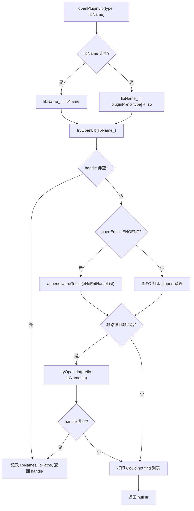
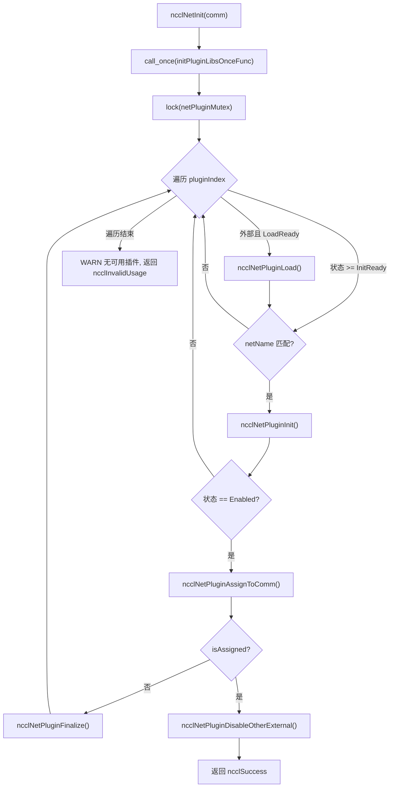
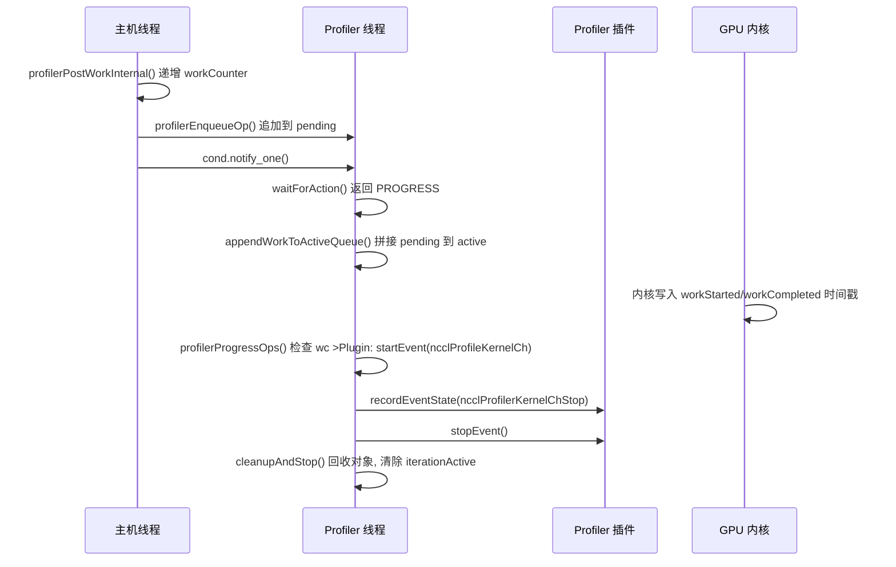

# Chapter 16: Plugin ecosystem and environment variables: how net, tuner, profiler, and env extend NCCL behavior

In the previous chapter, we saw how NCCL extends communication capabilities from collective operations to point-to-point remote access through RMA and GIN, and even lets the GPU directly initiate network requests. This evolution toward new hardware and low-latency scenarios places higher demands on the flexibility of the communication engine: if adapting to a new network, a new tuning strategy, or a new collection tool required recompiling the core code every time, NCCL would struggle to keep up with ecosystem changes. This chapter breaks down the src/plugin and plugins directories to answer a core question: how does NCCL replace network backends, tuning strategies, performance collectors, and configuration sources without recompiling the core code?

# 16.1 Plugin loader: how plugin_open.cc turns a .so into a usable backend

## Intuitive model

Think of`plugin_open.cc`as NCCL's "recruitment agency": it holds a list of positions (NET, GIN, RMA, TUNER, PROFILER, ENV), and each position corresponds to a candidate library name. When NCCL needs someone for a position, the agency goes to the talent market (dynamic linker) in a fixed order to find someone, signs a contract if found (`dlopen`), records "this person does not exist" if not found, and finally returns a handle. Without this intermediary layer, NCCL could only hardcode network backends into the binary, and any NIC vendor wanting to integrate would have to modify the NCCL source code—this is exactly the disaster the plugin system aims to eliminate.

## Data structures and memory layout

The loader's entire state is six parallel arrays, with the index being the plugin type enum:

```
static char* libNames[NUM_LIBS];              // 已加载库的名字
char* ncclPluginLibPaths[NUM_LIBS];           // 库的绝对路径
static void* libHandles[NUM_LIBS];            // dlopen 返回的句柄
static const char* pluginNames[NUM_LIBS];     // 日志用的人类可读名
static const char* pluginPrefix[NUM_LIBS];    // 库名前缀
static const char* pluginFallback[NUM_LIBS];  // 找不到时的提示
static unsigned long subsys[NUM_LIBS];        // 日志子系统位掩码
```

The subscripts of these seven arrays must be strictly aligned,`pluginNames[type]`、`pluginPrefix[type]`、`subsys[type]`describes the same plugin type.[FACT:src/plugin/plugin_open.cc:18-29]defines`NUM_LIBS = 6`, the type order is`{"NET", "GIN", "RMA", "TUNER", "PROFILER", "ENV"}`, and the prefix is`{"libnccl-net", "libnccl-gin", "libnccl-rma", "libnccl-tuner", "libnccl-profiler", "libnccl-env"}`。

> **[Design Inference & Architectural Trade-offs]**
> Parallel arrays are used here instead of an array of structs so that`openPluginLib`this single function can serve six kinds of plugins at the same time—the type is only used as a subscript, and the logic is fully reused. The cost is that when adding a new plugin type, six arrays must be modified in sync, and the compiler cannot help you check for omissions.

`subsys`The array determines log ownership: NET/GIN/RMA all attach to`NCCL_INIT | NCCL_NET`, TUNER attaches to`NCCL_INIT | NCCL_TUNING`, PROFILER attaches only to`NCCL_INIT`, ENV attaches to`NCCL_INIT | NCCL_ENV`。[FACT:src/plugin/plugin_open.cc:26-29]In this way,`NCCL_DEBUG_SUBSYS=NET`only network plugin logs will be seen, without being drowned in tuning logs.

## Step-by-Step Walkthrough: a complete journey of`ncclOpenNetPluginLib("mlx5")`

Suppose the user sets`NCCL_NET_PLUGIN=mlx5`, and during NCCL initialization`ncclOpenNetPluginLib("mlx5")`is called, which directly forwards to`openPluginLib(ncclPluginTypeNet, "mlx5")`。[FACT:src/plugin/plugin_open.cc:132-134]

**Step 1: Construct the candidate library name.**Because a non-empty`libName`is passed in, it goes through the`snprintf(libName_, MAX_STR_LEN, "%s", libName)`branch,`libName_`becomes`"mlx5"`。[FACT:src/plugin/plugin_open.cc:85-89]Note that at this point it is not yet a valid library file name—it has no prefix and no`.so`suffix.

**Step 2: First attempt to open.** `tryOpenLib("mlx5", ...)`is called.[FACT:src/plugin/plugin_open.cc:91]After entering`tryOpenLib`, first check whether`name`is empty or has zero length, then there is a special branch: if the name starts with`STATIC_PLUGIN`, set`name`to`nullptr`。[FACT:src/plugin/plugin_open.cc:37-39]This is the sentinel for plugins statically linked into NCCL—`dlopen(nullptr)`On Linux, it returns the main program handle, thereby allowing`dlsym`to find plugin symbols in the main program's symbol table.

Then it calls`ncclOsDlopen(name)`。[FACT:src/plugin/plugin_open.cc:41]because`"mlx5"`is neither a path nor a valid library name,`dlopen`will fail. After the failure, the code takes`ncclOsDlerror()`'s error string and makes a fine-grained judgment: if the error string contains both`name`and`"No such file or directory"`, then set`*err`to`ENOENT`。[FACT:src/plugin/plugin_open.cc:42-55]The significance of this judgment is to distinguish "the file does not exist at all" from "the file exists but failed to load"—the former just means the candidate name is wrong, and the next candidate name should be silently tried; the latter is a real error and should be logged.

**Step 3: Handling after the first failure.**Return to`openPluginLib`，`libHandles[type]`is empty, and`openErr == ENOENT`, so append`"mlx5"`to`eNoEntNameList`。[FACT:src/plugin/plugin_open.cc:97-101]This list will ultimately be assembled into a log line: "Could not find: mlx5 libnccl-net-mlx5.so".

**Step 4: Second attempt—add the prefix.**The code checks`libName`whether it is neither a path (does not contain`/`) nor a library name (does not start with`lib`, does not end with`.so`).[FACT:src/plugin/plugin_open.cc:105-107] `"mlx5"`The condition is satisfied, so it assembles`"libnccl-net-mlx5.so"`and tries again.[FACT:src/plugin/plugin_open.cc:108]This time`dlopen`succeeds,`libHandles[type]`is assigned,`libNames[type]`records the library name,`ncclPluginLibPaths[type]`obtains the absolute path via`getLibPath`, and the function returns the handle.[FACT:src/plugin/plugin_open.cc:110-115]

**Step 5: Obtain the absolute path.** `getLibPath`On Linux, use`dlinfo(handle, RTLD_DI_LINKMAP, &lm)`to retrieve`link_map`, then`strdup(lm->l_name)`。[FACT:src/plugin/plugin_open.cc:65-69]This path will appear in all subsequent logs, letting users see at a glance exactly which file was loaded—when troubleshooting in production why the wrong plugin was loaded, this log line is the primary scene.

The entire decision flow is as follows:



## Design considerations and production pitfalls

> **[Design Inference & Architectural Trade-offs]**
> **The order of candidate names is the priority.**First try the bare name given by the user, then try the name with the prefix added. This means that if the current directory happens to contain a file named`mlx5`, it will be loaded first—this is a potential security surface, and in production environments you should avoid placing an executable with the same name as the plugin in`LD_LIBRARY_PATH`.

**`STATIC_PLUGIN`The semantics of**When`NCCL_NET_PLUGIN=STATIC_PLUGIN`,`tryOpenLib`sets the name to empty,`dlopen(nullptr)`opens the main program,`dlsym`and looks for symbols such as`ncclNet_v12`from the main program's symbol table.[FACT:src/plugin/plugin_open.cc:37-39]This allows the plugin to be statically linked into the NCCL binary, eliminating the hassle of deploying`.so`, at the cost of losing runtime replaceability.

**Reference counting and unloading.** `ncclClosePluginLib`Only when`libHandles[type] == handle`does it actually`dlclose`, and clears the path and name.[FACT:src/plugin/plugin_open.cc:176-186]This equality check prevents mistakenly closing a handle that has already been replaced. The GIN and RMA plugins reuse the NET library's handle through`ncclGetGinPluginLib`/`ncclGetNetPluginLib`, implemented by calling`dlopen`again with the same library name to increase the reference count.[FACT:src/plugin/plugin_open.cc:156-164]This is`dlopen`'s reference counting semantics—the same library opened twice requires`dlclose`twice to actually unload.

# 16.2 net.cc: The state machine and lifecycle of network plugins

## Intuitive model

`net.cc`is the "dispatch center" for network plugins. It maintains an array of plugin libraries, each with its own state (not loaded, load failed, pending load, pending initialization, enabled). When a new communicator is born, the dispatch center traverses all candidate plugins, trying to initialize them one by one; the first successful one is "assigned" to this communicator, and all other external plugins are disabled. Without this state machine, NCCL would be unable to handle real-world problems such as "the plugin loaded but the device is unavailable," "which one to choose when multiple plugins coexist," and "how to safely unload when the communicator is destroyed."

## Data structures and memory layout

The core structure is`netPluginLib_t`：

| Field | Type | Meaning |
| --- | --- | --- |
| `name` | `char[255]` | Plugin library name |
| `dlHandle` | `void*` | dlopen handle |
| `ncclNet` | `ncclNet_t*` | Network function table |
| `ncclNetVer` | `int` | Network API version number |
| `ncclCollNet` | `ncclCollNet_t*` | Collective communication offload function table |
| `ncclNetPluginState` | Enum | Network plugin state |
| `ncclCollNetPluginState` | Enum | CollNet plugin state |
| `ncclNetPluginRefCount` | `int` | Reference count |
| `netPhysDevs`/`netVirtDevs` | `int` | Number of physical/virtual devices |
| `collNetPhysDevs`/`collNetVirtDevs` | `int` | Number of CollNet devices |

[FACT:src/plugin/net.cc:63-76]defines these fields. Note that`ncclNet`and`ncclCollNet`are two separate function tables, and the states are also two separate enums—a plugin can provide network functionality but not CollNet offload.

The state enum has five values:`Disabled = -2`(initialization failed),`LoadFailed = -1`(load failed),`LoadReady = 0`(pending load),`InitReady = 1`(loaded pending initialization),`Enabled = 2`(enabled).[FACT:src/plugin/net.cc:54-60]uses negative numbers to represent failure states, so that comparisons like "state >= InitReady" can naturally express "at least loaded."

The global state consists of three variables:`pluginCount`records the total number of plugins,`netPluginLibs[NCCL_NET_MAX_PLUGINS]`is the plugin array,`netPluginMutex`protects concurrent access,`initPluginLibsOnceFlag`ensures initialization is done only once.[FACT:src/plugin/net.cc:78-81]

## Step-by-Step Walkthrough: A complete journey of one`ncclNetInit(comm)`

**Step 1: One-time initialization.** `std::call_once(initPluginLibsOnceFlag, initPluginLibsOnceFunc)`ensures the plugin list is built only once.[FACT:src/plugin/net.cc:360] `initPluginLibsOnceFunc`reads the`NCCL_NET_PLUGIN`environment variable; if not set, it adds by default`"libnccl-net.so"`, then registers two built-in plugins`ncclNetIb`and`ncclNetSocket`。[FACT:src/plugin/net.cc:288-340]

Environment variable parsing uses`strtok_r`to split by commas, supporting multiple plugin names.[FACT:src/plugin/net.cc:303-324]has a capacity check: the number of external plugins cannot exceed`NCCL_NET_MAX_PLUGINS - NCCL_NET_NUM_INTERNAL_PLUGINS`; the excess is ignored and logged.[FACT:src/plugin/net.cc:307-311]Built-in plugins are fixed at 2 (IB and Socket), so external plugins are at most`NCCL_NET_MAX_PLUGINS - 2`.

**Step 2: Locked traversal.** `std::lock_guard<std::mutex> lock(netPluginMutex)`protects the entire traversal process.[FACT:src/plugin/net.cc:361]For each plugin index, first determine whether it is an external plugin and in the`LoadReady`state; if so, call`ncclNetPluginLoad`。[FACT:src/plugin/net.cc:364-367]

**Step 3: Load the plugin.** `ncclNetPluginLoad`calls`ncclOpenNetPluginLib`to get the handle, then tries from high version to low version in order`getNcclNet_v12`to`getNcclNet_v6`; the first version that returns non-null is adopted.[FACT:src/plugin/net.cc:103-112]The version array`ncclNetVersion`and function pointer array`getNcclNet`are arranged in descending order, ensuring the latest API is used first.[FACT:src/plugin/net.cc:41-43]

If all versions fail to obtain`ncclNet`, it means this library is not a valid network plugin. At this point, check whether`NCCL_NET_PLUGIN`is explicitly set: if set, warn at`ATTN`level (the user explicitly requested it but it failed); if not set, use`INFO`level (just the default attempt failure).[FACT:src/plugin/net.cc:115-125]This distinction is important—if the user's explicit configuration fails, they must see it.

**Step 4: Initialize the plugin.**Return to`ncclNetInit`, for state`>= InitReady`and name matching`comm->config.netName`plugin call`ncclNetPluginInit`。[FACT:src/plugin/net.cc:369-372] `ncclNetPluginInit`Do two things: call the plugin's`init`function to establish the communication domain context, and on first initialization call`devices`to probe the device count.[FACT:src/plugin/net.cc:186-236]

Note`init`call conditions:`pluginLib->ncclNetPluginState >= ncclNetPluginStateInitReady`。[FACT:src/plugin/net.cc:190]The comment explicitly states "every new communication domain must call init to set the correct context."[FACT:src/plugin/net.cc:189]But device probing is only done once at`== InitReady`.[FACT:src/plugin/net.cc:201]This distinction of "init called every time, devices called only once" is a performance optimization—device probing can be slow, but the context must be independent for each communication domain.

**Step 5: Allocation and disabling.**After successful initialization, call`ncclNetPluginAssignToComm`, which assigns the plugin's`ncclNet`to`comm->ncclNet`, increments the reference count, sets`comm->netPluginIndex`。[FACT:src/plugin/net.cc:238-255]After successful allocation, immediately call`ncclNetPluginDisableOtherExternal`to disable all other external plugins.[FACT:src/plugin/net.cc:377-380]

> **[Design Inference & Architectural Trade-offs]**
> The disable logic has a key judgment: only when the allocated plugin is an external plugin (`pluginIndex >= pluginCount - NCCL_NET_NUM_INTERNAL_PLUGINS`) are other external plugins disabled.[FACT:src/plugin/net.cc:257-259]If a built-in IB plugin is allocated, external plugins remain as-is—this leaves room for choice in subsequent communication domains.



## Concurrency control and hardware interaction

`netPluginMutex`protects all reads and writes to`netPluginLibs`.`ncclNetInit`、`ncclNetFinalize`All are locked.[FACT:src/plugin/net.cc:361][FACT:src/plugin/net.cc:411-416]But`ncclNetGetDevCount`and other function comments say "no lock needed, because the caller is already within`ncclTopoGetSystem`'s lock."[FACT:src/plugin/net.cc:418-429]This is a convention of "the lock is held by the upper layer," reducing the overhead of nested locks, at the cost that callers must follow the convention.

`ncclGpuGdrSupport`demonstrates direct interaction between the plugin and hardware: it allocates a 2MB GPU buffer, establishes a loopback connection through the plugin's`listen`/`connect`/`accept`, and then attempts`regMr`to register GPU memory.[FACT:src/plugin/net.cc:464-535]If registration succeeds, it indicates the NIC supports GPUDirect RDMA. This probe result is cached in`gdrSupportMatrix[32]`, indexed by CUDA device number.[FACT:src/plugin/net.cc:478-480]

> **[Design Inference & Architectural Trade-offs]**
> Note`gdrSupportMatrix`is`static`'s, shared across communication domains.[FACT:src/plugin/net.cc:478]This means multiple communication domains within the same process will reuse the probe result, avoiding repeated expensive probing. But the array size is hardcoded to 32, and machines with more than 32 GPUs will go out of bounds—this is an implicit upper-limit assumption.

## Production pitfall avoidance guide

**Pitfall 1: Plugin loads successfully but device count is zero.** `ncclNetPluginInit`Check`devices(&ndev) != ncclSuccess || ndev <= 0`and jump to the failure branch.[FACT:src/plugin/net.cc:202]After failure, call`finalize`to clean up the established context, reset the device count to`NCCL_UNDEF_DEV_COUNT`, and set the state to`Disabled`。[FACT:src/plugin/net.cc:229-234]If this cleanup is not done, subsequent communication domains will see a plugin that is "initialized but has no devices," causing hard-to-diagnose errors.

> **[Design Inference & Architectural Trade-offs]**
> **Pitfall 2:`init`succeeds but`devices`fails.**The code uses`initCompleted`flag to track`init`whether it succeeded.[FACT:src/plugin/net.cc:178-184][FACT:src/plugin/net.cc:198]In the failure branch, only if`initCompleted`is true is`finalize`。[FACT:src/plugin/net.cc:230]called. This prevents calling`finalize`on an uninitialized context—many plugins'`finalize`do not check for null pointers, and an erroneous call will crash.

**Pitfall 3: Reference counting when destroying a communication domain.** `ncclNetPluginFinalize`First call the plugin's`finalize`, then decrement the reference count, and finally unload the library when the reference count reaches zero and it is an external plugin.[FACT:src/plugin/net.cc:342-355] `ncclNetPluginUnload`Check`dlHandle`is non-null and the reference count is zero before actually`dlclose`。[FACT:src/plugin/net.cc:84-101]After unloading, reset the fields but retain`name`, so it can be reused when reloaded.[FACT:src/plugin/net.cc:84-101]

# 16.3 tuner.cc and profiler.cc: Different contracts for strategy plugins and observation plugins

## Intuitive model

The Tuner plugin is like "route preference settings in navigation software"—it does not change how the car is driven, only which route is chosen. The Profiler plugin is like a "dashcam"—it does not intervene in driving, only records what happened. What they have in common is that both are connected through a function table. The difference is that Tuner is a lightweight strategy object with "one instance per communication domain," while Profiler requires a separate thread to asynchronously consume events generated by the GPU.

## tuner.cc: A minimalist global singleton

Tuner's state is extremely simple: one mutex, one reference count, one library handle, one symbol pointer, and one state variable.[FACT:src/plugin/tuner.cc:24-37]There is no plugin array, no coexistence of multiple plugins—there is only one global tuner.

`ncclTunerPluginLoad`The logic is "load on first use, reuse afterward": if the state is`LoadSuccess`, directly assign the symbol to`comm->tuner`and increment the reference count.[FACT:src/plugin/tuner.cc:53-57]Otherwise read the`NCCL_TUNER_PLUGIN`environment variable; if it is`"none"`, fail directly.[FACT:src/plugin/tuner.cc:59-63]

> **[Design Inference & Architectural Trade-offs]**
> Version negotiation drops from v6 to v2, trying one by one.[FACT:src/plugin/tuner.cc:75-87]Note that there is no v1 here—the tuner API only has a stable function table structure starting from v2.

> **[Design Inference & Architectural Trade-offs]**
> An interesting detail: if`ncclOpenTunerPluginLib`returns empty, the code tries`ncclGetNetPluginLib(ncclPluginTypeTuner)`。[FACT:src/plugin/tuner.cc:65-70]This means the tuner can be packaged in the net plugin library—this reduces deployment complexity, with one`.so`providing both networking and tuning functionality.

## profiler.cc: Asynchronous event consumption thread

Profiler is the most complex plugin in this chapter because it needs to handle events asynchronously generated by the GPU. The core structure is`ncclProfilerThread`：

| Field | Type | Purpose |
| --- | --- | --- |
| `thread` | `std::thread` | Consumption thread |
| `mutex` | `std::mutex` | Protects the queue |
| `cond` | `condition_variable` | Wakes up when there is new work |
| `condIterationInactive` | `condition_variable` | Waits for iteration to end |
| `stop` | `int` | Stop flag |
| `refCount` | `int` | Communication domain reference count |
| `cudaDev` | `int` | Bound CUDA device |
| `abortFlag` | `volatile uint32_t*` | Abort flag |
| `iterationActive` | `bool` | Whether iterating |
| `pending`/`pendingTail` | Linked list | Pending work |
| `active`/`activeTail` | Linked list | Work in progress |
| `opStack`/`opPool` | Memory pool | Work object allocation |
| `inflight`/`maxInflightSeen`/`maxInflight` | `size_t` | Backpressure observation |
| `droppedOps` | `uint64_t` | Allocation failure count |

[FACT:src/plugin/profiler.cc:38-69]defines this structure. Note`pending`and`active`are two independent linked lists: producers append to`pending`, and the consumption thread splices`pending`into`active`within the lock, then traverses`active`。[FACT:src/plugin/profiler.cc:56-59]

`iterationActive`outside the lock. The flag is key to concurrency correctness: the consumption thread sets it to`true`within the lock, then releases the lock to call the plugin callback. The destruction thread must wait for this flag to return to`false`only then can the communicator state be torn down.[FACT:src/plugin/profiler.cc:52-55]

## Step-by-Step Walkthrough: Generation and Consumption of a KernelCh Event

**Step 1: Host-side enqueue.**When the kernel plan is submitted,`ncclProfilerPostPlanWork`iterate over the collective tasks in the plan, and for each task with`ncclProfileKernelCh`enabled, call`profilerPostWorkInternal`。[FACT:src/plugin/profiler.cc:1315-1331]

`profilerPostWorkInternal`by channel range. First increment`comm->profiler.workCounter[channelId]`then call`profilerEnqueueOp`。[FACT:src/plugin/profiler.cc:1259-1266]The comment emphasizes that this increment must be "exactly once per call, even if allocation fails," to stay in sync with the device kernel.[FACT:src/plugin/profiler.cc:1259-1266]

**Step 2: Allocate the work object.** `profilerEnqueueOp`Inside the lock, allocate from the memory pool`ncclProfilerWorkOp`and fill in fields such as channel number, work counter, activation mask, task event handle, and communicator context.[FACT:src/plugin/profiler.cc:1199-1223]On allocation failure, increment`droppedOps`and log it, but**do not**roll back`workCounter`—this is the key to staying in sync with the device.[FACT:src/plugin/profiler.cc:1202-1207]

After successful allocation, append the object to the tail of the`pending`linked list, increment`inflight`update`maxInflightSeen`and wake up the consumer thread.[FACT:src/plugin/profiler.cc:1225-1239]

**Step 3: The consumer thread waits.** `ncclProfilerThreadFunc`It loops calling`waitForAction`。[FACT:src/plugin/profiler.cc:1074-1077] `waitForAction`waiting on the condition variable inside the lock until`pending`or`active`is non-empty, or a stop/abort signal is received.[FACT:src/plugin/profiler.cc:1017-1031]

After being woken up, it calls`appendWorkToActiveQueue`to splice`pending`onto the tail of`active`set`iterationActive = true`and return`NCCL_PROFILER_THREAD_PROGRESS`。[FACT:src/plugin/profiler.cc:1017-1031]

**Step 4: Process the work.** `profilerProgressOps`Outside**the lock**iterate over the`active`linked list.[FACT:src/plugin/profiler.cc:958-999]For each work object, check whether the device has already written the start timestamp:`wc <= op->workStarted[ch].data[slot].counter`。[FACT:src/plugin/profiler.cc:972]Note that`<=`is used rather than`==`because the device wraps around`MAX_PROFILER_EVENTS_PER_CHANNEL`slots, and if the host falls behind, the device may have already overwritten that slot.[FACT:src/plugin/profiler.cc:969-971]

If the start condition is satisfied, call`ncclProfilerStartKernelChEvent`to notify the plugin.[FACT:src/plugin/profiler.cc:973]Then check the completion condition; if satisfied, first trigger the phase event, then call`ncclProfilerStopKernelChEvent`。[FACT:src/plugin/profiler.cc:978-985]

Completed work objects are removed from the linked list and collected into the`recycled`list.[FACT:src/plugin/profiler.cc:987-991]

**Step 5: Reclaim and publish.** `cleanupAndStop`Inside the lock, reclaim the`recycled`list, publish the new`activeTail`clear`iterationActive`and notify waiters.[FACT:src/plugin/profiler.cc:1036-1050]



## Concurrency Control and Backpressure

`NCCL_PROFILER_DEFAULT_MAX_INFLIGHT`is defined as`MAXCHANNELS * MAX_PROFILER_EVENTS_PER_CHANNEL * 4`。[FACT:src/plugin/profiler.cc:32-32]This is a "soft cap"—exceeding it does not prevent enqueueing, it only logs.[FACT:src/plugin/profiler.cc:1233-1238]The comment explains that keeping the enqueue is to pair KernelCh events with their parent task events.[FACT:src/plugin/profiler.cc:32-32]

Logging is triggered at powers of 2:`(pt->inflight & (pt->inflight - 1)) == 0`。[FACT:src/plugin/profiler.cc:1233]This ensures logging only when inflight is 1, 2, 4, 8..., avoiding log spam.

The consumer thread's backoff strategy is in`updateProgressInterval`when there is progress, retry immediately; when there is no progress, start at 1 microsecond and double, up to a maximum of 10 microseconds.[FACT:src/plugin/profiler.cc:1054-1057]This design balances latency and CPU usage.

## Production Pitfall Guide

**Pitfall 1: Work leak during destruction.** `ncclProfilerThreadDestroy`First wait for`iterationActive`to become false, then call`profilerPurgeByContext`to clear all pending work referencing that communicator context.[FACT:src/plugin/profiler.cc:1162-1169]If this clearing is not done, plugin callbacks will receive a pointer to an already-destroyed context, causing a use-after-free.

**Pitfall 2: Draining on stop.**When a stop signal is received but`active`is non-empty, return`NCCL_PROFILER_THREAD_CLEANUP_AND_STOP`，`cleanupAndStop`with the`drainStuck`parameter set to true, directly reclaiming all remaining work.[FACT:src/plugin/profiler.cc:1029][FACT:src/plugin/profiler.cc:1036-1050]The comment says the kernels for this work will never run, so it is simply discarded.[FACT:src/plugin/profiler.cc:1034-1035]

**Pitfall 3: CUDA device binding.**When the consumer thread starts, call`cudaSetDevice(pt->cudaDev)`。[FACT:src/plugin/profiler.cc:1054-1057]The comment explains: the thread itself only reads host pinned memory, but plugins may make context-dependent driver calls, so binding is defensive.[FACT:src/plugin/profiler.cc:1054-1057]Binding failure only logs and does not abort, because the thread itself does not depend on CUDA.[FACT:src/plugin/profiler.cc:1065-1070]

# 16.4 Official Examples: Implementation Highlights of google-fastsocket and google-CoMMA

## Intuitive Model

The official examples are the "reference implementations" of the plugin API.`google-fastsocket`shows how to replace kernel TCP with a userspace network stack;`google-CoMMA`shows how to implement a profiler plugin to collect communication performance. Their existence proves that the plugin API is expressive enough for real requirements.

## google-fastsocket: Replacing the Network Backend

> **[Design Inference & Architectural Trade-offs]**
> FastSocket is Google's open-source userspace network stack that bypasses the kernel TCP/IP stack through the`AF_FABRIC`address family. As an NCCL net plugin, it needs to implement`ncclNet_t`all functions:`init`、`devices`、`getProperties`、`listen`、`connect`、`accept`、`regMr`、`isend`、`irecv`、`test`、`closeSend`etc.

The key implementation point is the`getProperties`returned by`ptrSupport`if FastSocket supports GPUDirect RDMA, it should be set to`NCCL_PTR_HOST|NCCL_PTR_CUDA`otherwise it can only be set to`NCCL_PTR_HOST`and NCCL will copy GPU data to host memory before sending.[FACT:plugins/net/README.md:245-245]

`connect`and`accept`The "non-blocking" contract of`sendComm`/`recvComm`is the core difficulty of plugin implementation: they must return immediately, setting`NULL`to[FACT:plugins/net/README.md:299-311]and letting NCCL call repeatedly until success.

## This requires the plugin to maintain a connection state machine internally, putting the time-consuming handshake in the background.

> **[Design Inference & Architectural Trade-offs]**
> [Design Inference and Architectural Trade-offs]`ncclProfiler_t`CoMMA (Collective Memory Monitoring Agent) is Google's communication performance collector. As a profiler plugin, it implements the`init`、`finalize`、`startEvent`、`stopEvent`、`recordEventState`。

`init`function table:`ncclProfilerEventMask`receives the[FACT:src/plugin/profiler.cc:341]pointer, and the plugin selects which events to subscribe to by writing to this mask.[FACT:src/plugin/profiler.cc:285-307]

`startEvent`The event types supported by NCCL include Group, Coll, P2p, ProxyOp, ProxyStep, ProxyCtrl, KernelCh, KernelPhase, NetPlugin, etc.`stopEvent`returns an event handle, and subsequent`recordEventState`and[FACT:src/plugin/profiler.cc:392][FACT:src/plugin/profiler.cc:400-407]use this handle to associate events.

## The plugin can use the handle to store its own state, implementing event pairing and duration statistics.

**Design Reflections**Because the net API involves device-side code (`ncclNetDeviceHandle`), a version mismatch will cause a kernel crash; whereas tuner/profiler are purely host-side, and a version mismatch at most results in missing functionality.[FACT:src/plugin/net.cc:153-176]shows`ncclNetCheckDeviceVersion`how to check the device type and version, returning when there is a mismatch`ncclInternalError`。

**Why does the profiler need a separate thread?**Because profiler callbacks may block (such as writing files or making network requests), and calling them on the host thread would slow down communication.[FACT:src/plugin/profiler.cc:950-952]The comment explicitly states "plugin callbacks may block, so they must not be called while holding the lock."

# 16.5 Production Pitfall Guide and Failure Recovery Chain

## Pitfall 1: Plugin version mismatch causes kernel crash

`ncclNetCheckDeviceVersion`Check`props.netDeviceType`and`props.netDeviceVersion`。[FACT:src/plugin/net.cc:153-176]If the plugin reports a`NCCL_NET_DEVICE_UNPACK`version that is inconsistent with the`NCCL_NET_DEVICE_UNPACK_VERSION`used when NCCL was compiled, return`ncclInternalError`and raise a warning.[FACT:src/plugin/net.cc:153-176]This check is called in`ncclNetPluginAssignToComm`, and on failure the plugin will not be assigned to a communication domain.[FACT:src/plugin/net.cc:241]

**Recovery chain**: version mismatch →`ncclNetCheckDeviceVersion`returns an error →`ncclNetPluginAssignToComm`returns`isAssigned = false` → `ncclNetInit`continues trying the next plugin → may ultimately fall back to the built-in Socket plugin.

## Pitfall 2: The profiler thread cannot exit

If the profiler plugin blocks in`stopEvent`, the consumer thread will get stuck in`profilerProgressOps`,`iterationActive`is always true,`ncclProfilerThreadDestroy`will wait forever.[FACT:src/plugin/profiler.cc:1166]This is a real deadlock risk.

> **[Design Inference & Architectural Trade-offs]**
> **Recovery chain**：`comm->abortFlag`is set →`waitForAction`detects the abort → returns`CLEANUP_AND_STOP` → `cleanupAndStop`drains the queue.[FACT:src/plugin/profiler.cc:1017-1031]But if the thread is already stuck in a plugin callback, the abort flag cannot interrupt it—this is the responsibility of the plugin implementer; callbacks must have timeouts.

## Pitfall 3: Reference count leak in the tuner plugin

`ncclTunerPluginLoad`Increment on success`tunerPluginRefCount`。[FACT:src/plugin/tuner.cc:98] `ncclTunerPluginUnload`Decrement when`comm->tunerPluginLoaded`is true.[FACT:src/plugin/tuner.cc:111-123]If a communication domain loads a tuner but`tunerPluginLoaded`is accidentally cleared on destruction, the reference count will never return to zero, and the plugin library will never be unloaded.

# Chapter Review and Self-Test

Q1: If the loop in`ncclNetPluginLoad`that "tries from higher versions to lower versions" is changed to "only try the highest version," in what scenario would a previously usable plugin fail to load?

**Reference analysis**: See[FACT:src/plugin/net.cc:108-112]. The loop iterates over`NCCL_NET_VERSION_COUNT`versions, from v12 down to v6, and the first one that returns non-null is adopted. If only v12 is tried, then an old plugin that only implements v11 will fail to load.

> **[Design Inference & Architectural Trade-offs]**
> This design is for backward compatibility: after the NCCL core is upgraded to support v12, it can still load plugins that only provide v11. Plugin authors are encouraged to provide symbols for multiple versions (see[FACT:plugins/net/README.md:35-37]), so that the same`.so`can serve multiple NCCL versions.

If the downgrade attempts were removed, old plugins would suddenly become unavailable after users upgrade NCCL, and they could only fall back to the built-in Socket plugin, causing a significant performance drop. This is exactly the purpose of version negotiation.

Q2: In`profilerProgressOps`, if`wc <= op->workStarted[ch].data[slot].counter`is changed to`wc == op->workStarted[ch].data[slot].counter`, in what high-concurrency scenario would the event never trigger?

**Reference analysis**: See[FACT:src/plugin/profiler.cc:969-972]. The comment explicitly states that the device wraps around`MAX_PROFILER_EVENTS_PER_CHANNEL`slots. If the host consumes more slowly than the device produces, the device may have already overwritten slot`wc + N`with counter`wc % MAX_PROFILER_EVENTS_PER_CHANNEL`。

At this point the value of`op->workStarted[ch].data[slot].counter`is`wc + N`, while`op->workCounter`is`wc`. Using`==`for the check will fail, the event will never trigger, and the work object will remain forever in the`active`linked list,`inflight`only increasing and never decreasing, eventually exhausting the memory pool.

Using`<=`handles this situation correctly: as long as the counter written by the device is not less than the expected value, the event is considered ready. This is a typical correctness condition for a "producer-consumer ring buffer."

Q3: If the loop in`ncclProfilerThreadDestroy`that waits for`iterationActive`to become false is removed, under what timing would the profiler plugin access an already-freed communication domain context?

**Reference analysis**: See[FACT:src/plugin/profiler.cc:1162-1166]. The comment states that`ncclProfilerPluginFinalize`will destroy the communication domain's`ncclProfilerThreadDestroy`immediately after`profilerContext`。

returns. When the consumer thread calls the plugin callback in`profilerProgressOps`, what is passed in is`op->profilerContext`。[FACT:src/plugin/profiler.cc:938]If the destruction thread returns without waiting for`iterationActive`to become false,`ncclProfilerPluginFinalize`will free the context, while the consumer thread may be using this context to call the plugin—use-after-free.

`iterationActive`The handshake protocol is: the consumer thread sets it to`true`inside the lock, then releases the lock to call the plugin, and the destruction thread waits inside the lock for it to return to`false`。[FACT:src/plugin/profiler.cc:1028][FACT:src/plugin/profiler.cc:1054-1057]This protocol guarantees that the context remains valid during the plugin callback.

After removing the wait, the destruction thread may return just as the consumer thread enters the plugin callback, causing the plugin to receive a dangling pointer. This is a typical "lifetime and concurrent access" race.

The plugin system has moved NCCL from closed to open: network backends, tuning strategies, performance collectors, and configuration sources can all be replaced without modifying the core code. But plugins also introduce new failure surfaces—version mismatches, lifetime races, and reference count leaks. In the next chapter we will enter the RAS and diagnostics subsystem to see how NCCL detects failures, monitors progress, and achieves self-healing in long-running training jobs.

The plugin system draws a clear boundary between NCCL's core communication path and replaceable components. The four types of plugins—net, tuner, profiler, and env—each safely intervene in runtime behavior through registration and reference counting mechanisms. But an extensible communication engine must not only be able to flexibly replace components, but also run stably during long training sessions—when a NIC or GPU fails, how does NCCL detect it, monitor it, and trigger recovery? In the next chapter we will enter the RAS and diagnostic mechanisms to see how reliability in production environments is systematically guaranteed.
