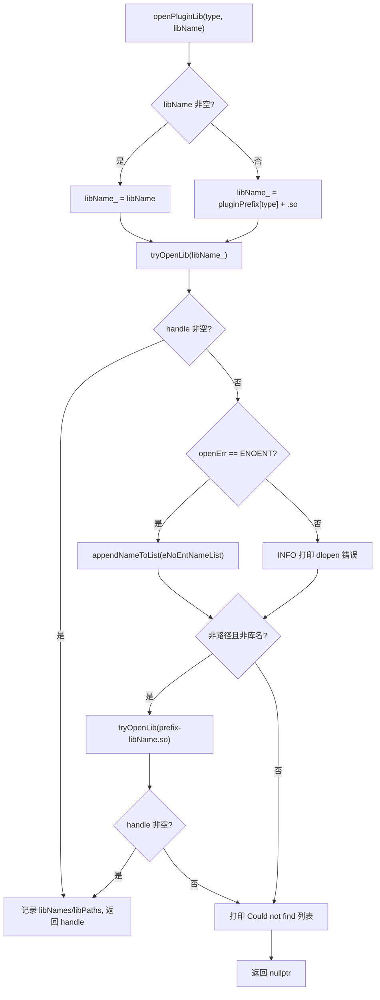
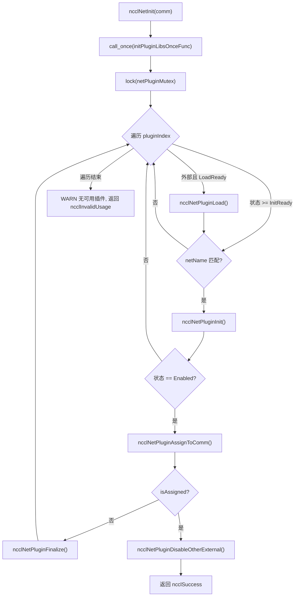
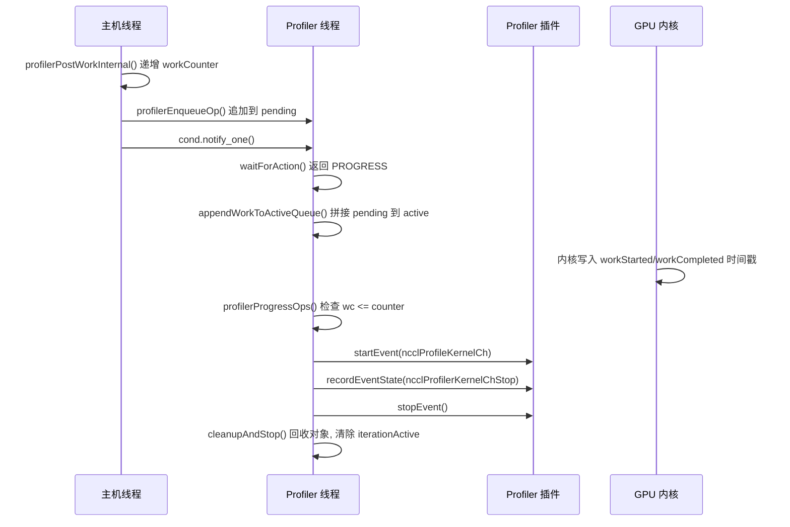

# Chapter 16: Plugin Ecosystem: Tuner Hooks, Profiler Interfaces & Environment Tuning


上一章我们看到 NCCL 如何通过 RMA 与 GIN 将通信能力从集合操作延伸到点对点远程访问，甚至让 GPU 直接发起网络请求。这种向新硬件与低延迟场景的演进，对通信引擎的灵活性提出了更高要求：如果每次适配新网络、新调优策略或新采集工具都要重新编译核心代码，NCCL 将难以跟上生态变化。本章拆解 src/plugin 与 plugins 目录，回答一个核心问题：NCCL 如何在不重新编译核心代码的前提下，替换网络后端、调优策略、性能采集器与配置来源。

## 16.1 插件加载器：plugin_open.cc 如何把 .so 变成可用的后端

### Intuitive Architectural Model

把 `plugin_open.cc` 想象成 NCCL 的"招聘中介"：它手里有一份岗位清单（NET、GIN、RMA、TUNER、PROFILER、ENV），每个岗位对应一个候选库名。当 NCCL 需要某个岗位的人时，中介按固定顺序去人才市场（动态链接器）找人，找到就签合同（`dlopen`），找不到就记录"这个人不存在"，最后交回一个句柄。若没有这层中介，NCCL 就只能把网络后端硬编码进二进制，任何网卡厂商想接入都得改 NCCL 源码——这正是插件体系要消灭的灾难。

### Data Structures & Memory Layout

加载器的全部状态就是六个并行数组，索引即插件类型枚举：

```
static char* libNames[NUM_LIBS];              // 已加载库的名字
char* ncclPluginLibPaths[NUM_LIBS];           // 库的绝对路径
static void* libHandles[NUM_LIBS];            // dlopen 返回的句柄
static const char* pluginNames[NUM_LIBS];     // 日志用的人类可读名
static const char* pluginPrefix[NUM_LIBS];    // 库名前缀
static const char* pluginFallback[NUM_LIBS];  // 找不到时的提示
static unsigned long subsys[NUM_LIBS];        // 日志子系统位掩码
```

这七个数组的下标必须严格对齐，`pluginNames[type]`、`pluginPrefix[type]`、`subsys[type]` 描述的是同一个插件类型。[FACT:src/plugin/plugin_open.cc:18-29](https://github.com/NVIDIA/nccl/blob/12df1a11afad322be5a204a2db890161cbf8131d/src/plugin/plugin_open.cc#L18-L29) 定义了 `NUM_LIBS = 6`，类型顺序为 `{"NET", "GIN", "RMA", "TUNER", "PROFILER", "ENV"}`，前缀为 `{"libnccl-net", "libnccl-gin", "libnccl-rma", "libnccl-tuner", "libnccl-profiler", "libnccl-env"}`。

[INFERENCE] 这里用并行数组而非结构体数组，是为了让 `openPluginLib` 这个单一函数能同时服务六种插件——类型只作为下标，逻辑完全复用。代价是新增插件类型时必须同步修改六个数组，编译器无法帮你检查漏改。

`subsys` 数组决定日志归属：NET/GIN/RMA 都挂 `NCCL_INIT | NCCL_NET`，TUNER 挂 `NCCL_INIT | NCCL_TUNING`，PROFILER 只挂 `NCCL_INIT`，ENV 挂 `NCCL_INIT | NCCL_ENV`。[FACT:src/plugin/plugin_open.cc:26-29](https://github.com/NVIDIA/nccl/blob/12df1a11afad322be5a204a2db890161cbf8131d/src/plugin/plugin_open.cc#L26-L29) 这样 `NCCL_DEBUG_SUBSYS=NET` 时只会看到网络插件的日志，不会淹没在调优日志里。

### Step-by-Step Walkthrough：一次 `ncclOpenNetPluginLib("mlx5")` 的完整旅程

假设用户设置 `NCCL_NET_PLUGIN=mlx5`，NCCL 初始化时调用 `ncclOpenNetPluginLib("mlx5")`，它直接转发到 `openPluginLib(ncclPluginTypeNet, "mlx5")`。[FACT:src/plugin/plugin_open.cc:132-134](https://github.com/NVIDIA/nccl/blob/12df1a11afad322be5a204a2db890161cbf8131d/src/plugin/plugin_open.cc#L132-L134)

**第一步：构造候选库名。** 因为传入了非空 `libName`，走 `snprintf(libName_, MAX_STR_LEN, "%s", libName)` 分支，`libName_` 变成 `"mlx5"`。[FACT:src/plugin/plugin_open.cc:85-89](https://github.com/NVIDIA/nccl/blob/12df1a11afad322be5a204a2db890161cbf8131d/src/plugin/plugin_open.cc#L85-L89) 注意此时它还不是一个合法的库文件名——没有前缀也没有 `.so` 后缀。

**第二步：第一次尝试打开。** `tryOpenLib("mlx5", ...)` 被调用。[FACT:src/plugin/plugin_open.cc:91](https://github.com/NVIDIA/nccl/blob/12df1a11afad322be5a204a2db890161cbf8131d/src/plugin/plugin_open.cc#L91) 进入 `tryOpenLib` 后，先检查 `name` 是否为空或长度为零，然后有一个特殊分支：如果名字以 `STATIC_PLUGIN` 开头，就把 `name` 置为 `nullptr`。[FACT:src/plugin/plugin_open.cc:37-39](https://github.com/NVIDIA/nccl/blob/12df1a11afad322be5a204a2db890161cbf8131d/src/plugin/plugin_open.cc#L37-L39) 这是给静态链接进 NCCL 的插件用的哨兵——`dlopen(nullptr)` 在 Linux 上返回主程序句柄，从而让 `dlsym` 能在主程序符号表里找到插件符号。

接着调用 `ncclOsDlopen(name)`。[FACT:src/plugin/plugin_open.cc:41](https://github.com/NVIDIA/nccl/blob/12df1a11afad322be5a204a2db890161cbf8131d/src/plugin/plugin_open.cc#L41) 因为 `"mlx5"` 既不是路径也不是合法库名，`dlopen` 会失败。失败后代码取 `ncclOsDlerror()` 的错误串，并做一个精细判断：如果错误串里同时包含 `name` 和 `"No such file or directory"`，就把 `*err` 设为 `ENOENT`。[FACT:src/plugin/plugin_open.cc:42-55](https://github.com/NVIDIA/nccl/blob/12df1a11afad322be5a204a2db890161cbf8131d/src/plugin/plugin_open.cc#L42-L55) 这个判断的意义在于区分"文件根本不存在"和"文件存在但加载失败"——前者只是候选名不对，应该静默尝试下一个候选名；后者是真实错误，应该打日志。

**第三步：第一次失败后的处理。** 回到 `openPluginLib`，`libHandles[type]` 为空，且 `openErr == ENOENT`，于是把 `"mlx5"` 追加到 `eNoEntNameList`。[FACT:src/plugin/plugin_open.cc:97-101](https://github.com/NVIDIA/nccl/blob/12df1a11afad322be5a204a2db890161cbf8131d/src/plugin/plugin_open.cc#L97-L101) 这个列表最终会拼成一句"Could not find: mlx5 libnccl-net-mlx5.so"的日志。

**第四步：第二次尝试——加前缀。** 代码检查 `libName` 是否既不是路径（不含 `/`）也不是库名（不以 `lib` 开头、不以 `.so` 结尾）。[FACT:src/plugin/plugin_open.cc:105-107](https://github.com/NVIDIA/nccl/blob/12df1a11afad322be5a204a2db890161cbf8131d/src/plugin/plugin_open.cc#L105-L107) `"mlx5"` 满足条件，于是拼出 `"libnccl-net-mlx5.so"` 再次尝试。[FACT:src/plugin/plugin_open.cc:108](https://github.com/NVIDIA/nccl/blob/12df1a11afad322be5a204a2db890161cbf8131d/src/plugin/plugin_open.cc#L108) 这一次 `dlopen` 成功，`libHandles[type]` 被赋值，`libNames[type]` 记录库名，`ncclPluginLibPaths[type]` 通过 `getLibPath` 拿到绝对路径，函数返回句柄。[FACT:src/plugin/plugin_open.cc:110-115](https://github.com/NVIDIA/nccl/blob/12df1a11afad322be5a204a2db890161cbf8131d/src/plugin/plugin_open.cc#L110-L115)

**第五步：拿到绝对路径。** `getLibPath` 在 Linux 上用 `dlinfo(handle, RTLD_DI_LINKMAP, &lm)` 取出 `link_map`，再 `strdup(lm->l_name)`。[FACT:src/plugin/plugin_open.cc:65-69](https://github.com/NVIDIA/nccl/blob/12df1a11afad322be5a204a2db890161cbf8131d/src/plugin/plugin_open.cc#L65-L69) 这个路径会出现在后续所有日志里，让用户一眼看出到底加载了哪个文件——生产环境排查"为什么加载了错误的插件"时，这行日志是第一现场。

整个决策流如下：



### 设计思考与生产踩坑

**候选名顺序即优先级。** 先试用户给的裸名，再试加前缀的名字。这意味着如果当前目录恰好有一个叫 `mlx5` 的文件，它会被优先加载——[INFERENCE] 这是一个潜在的安全面，生产环境应避免在 `LD_LIBRARY_PATH` 里放入与插件同名的可执行文件。

**`STATIC_PLUGIN` 的语义。** 当 `NCCL_NET_PLUGIN=STATIC_PLUGIN` 时，`tryOpenLib` 把名字置空，`dlopen(nullptr)` 打开主程序，`dlsym` 从主程序符号表找 `ncclNet_v12` 等符号。[FACT:src/plugin/plugin_open.cc:37-39](https://github.com/NVIDIA/nccl/blob/12df1a11afad322be5a204a2db890161cbf8131d/src/plugin/plugin_open.cc#L37-L39) 这允许把插件静态链接进 NCCL 二进制，省去部署 `.so` 的麻烦，代价是失去运行时替换能力。

**引用计数与卸载。** `ncclClosePluginLib` 只在 `libHandles[type] == handle` 时才真正 `dlclose`，并清空路径和名字。[FACT:src/plugin/plugin_open.cc:176-186](https://github.com/NVIDIA/nccl/blob/12df1a11afad322be5a204a2db890161cbf8131d/src/plugin/plugin_open.cc#L176-L186) 这个相等判断防止误关一个已经被替换的句柄。GIN 和 RMA 插件通过 `ncclGetGinPluginLib`/`ncclGetNetPluginLib` 复用 NET 库的句柄，实现方式是再次 `dlopen` 同一个库名来增加引用计数。[FACT:src/plugin/plugin_open.cc:156-164](https://github.com/NVIDIA/nccl/blob/12df1a11afad322be5a204a2db890161cbf8131d/src/plugin/plugin_open.cc#L156-L164) 这是 `dlopen` 的引用计数语义——同一个库被打开两次，需要 `dlclose` 两次才真正卸载。

## 16.2 net.cc：网络插件的状态机与生命周期

### Intuitive Architectural Model

`net.cc` 是网络插件的"调度中心"。它维护一个插件库数组，每个库有自己的状态（未加载、加载失败、待加载、待初始化、已启用）。当一个新的通信域（communicator）诞生时，调度中心遍历所有候选插件，逐个尝试初始化，第一个成功的就被"分配"给这个通信域，其余外部插件全部禁用。若没有这层状态机，NCCL 就无法处理"插件加载了但设备不可用""多个插件共存时选哪个""通信域销毁时如何安全卸载"这些现实问题。

### Data Structures & Memory Layout

核心结构是 `netPluginLib_t`：

| 字段 | 类型 | 含义 |
|---|---|---|
| `name` | `char[255]` | 插件库名 |
| `dlHandle` | `void*` | dlopen 句柄 |
| `ncclNet` | `ncclNet_t*` | 网络函数表 |
| `ncclNetVer` | `int` | 网络 API 版本号 |
| `ncclCollNet` | `ncclCollNet_t*` | 集合通信卸载函数表 |
| `ncclNetPluginState` | 枚举 | 网络插件状态 |
| `ncclCollNetPluginState` | 枚举 | CollNet 插件状态 |
| `ncclNetPluginRefCount` | `int` | 引用计数 |
| `netPhysDevs`/`netVirtDevs` | `int` | 物理/虚拟设备数 |
| `collNetPhysDevs`/`collNetVirtDevs` | `int` | CollNet 设备数 |

[FACT:src/plugin/net.cc:63-76](https://github.com/NVIDIA/nccl/blob/12df1a11afad322be5a204a2db890161cbf8131d/src/plugin/net.cc#L63-L76) 定义了这些字段。注意 `ncclNet` 和 `ncclCollNet` 是分开的两个函数表，状态也是分开的两个枚举——一个插件可以提供网络功能但不提供 CollNet 卸载。

状态枚举有五个值：`Disabled = -2`（初始化失败）、`LoadFailed = -1`（加载失败）、`LoadReady = 0`（待加载）、`InitReady = 1`（已加载待初始化）、`Enabled = 2`（已启用）。[FACT:src/plugin/net.cc:54-60](https://github.com/NVIDIA/nccl/blob/12df1a11afad322be5a204a2db890161cbf8131d/src/plugin/net.cc#L54-L60) 用负数表示失败态，使得"状态 >= InitReady"这样的比较能自然表达"至少已加载"。

全局状态是三个变量：`pluginCount` 记录插件总数，`netPluginLibs[NCCL_NET_MAX_PLUGINS]` 是插件数组，`netPluginMutex` 保护并发访问，`initPluginLibsOnceFlag` 保证初始化只做一次。[FACT:src/plugin/net.cc:78-81](https://github.com/NVIDIA/nccl/blob/12df1a11afad322be5a204a2db890161cbf8131d/src/plugin/net.cc#L78-L81)

### Step-by-Step Walkthrough：一次 `ncclNetInit(comm)` 的完整旅程

**第一步：一次性初始化。** `std::call_once(initPluginLibsOnceFlag, initPluginLibsOnceFunc)` 保证插件列表只构建一次。[FACT:src/plugin/net.cc:360](https://github.com/NVIDIA/nccl/blob/12df1a11afad322be5a204a2db890161cbf8131d/src/plugin/net.cc#L360) `initPluginLibsOnceFunc` 读取 `NCCL_NET_PLUGIN` 环境变量，若未设置则默认加入 `"libnccl-net.so"`，然后注册两个内置插件 `ncclNetIb` 和 `ncclNetSocket`。[FACT:src/plugin/net.cc:288-340](https://github.com/NVIDIA/nccl/blob/12df1a11afad322be5a204a2db890161cbf8131d/src/plugin/net.cc#L288-L340)

环境变量解析用 `strtok_r` 按逗号切分，支持多个插件名。[FACT:src/plugin/net.cc:303-324](https://github.com/NVIDIA/nccl/blob/12df1a11afad322be5a204a2db890161cbf8131d/src/plugin/net.cc#L303-L324) 有一个容量检查：外部插件数量不能超过 `NCCL_NET_MAX_PLUGINS - NCCL_NET_NUM_INTERNAL_PLUGINS`，超出部分被忽略并打日志。[FACT:src/plugin/net.cc:307-311](https://github.com/NVIDIA/nccl/blob/12df1a11afad322be5a204a2db890161cbf8131d/src/plugin/net.cc#L307-L311) 内置插件固定为 2 个（IB 和 Socket），所以外部插件最多 `NCCL_NET_MAX_PLUGINS - 2` 个。

**第二步：加锁遍历。** `std::lock_guard<std::mutex> lock(netPluginMutex)` 保护整个遍历过程。[FACT:src/plugin/net.cc:361](https://github.com/NVIDIA/nccl/blob/12df1a11afad322be5a204a2db890161cbf8131d/src/plugin/net.cc#L361) 对每个插件索引，先判断它是否是外部插件且处于 `LoadReady` 状态，若是则调用 `ncclNetPluginLoad`。[FACT:src/plugin/net.cc:364-367](https://github.com/NVIDIA/nccl/blob/12df1a11afad322be5a204a2db890161cbf8131d/src/plugin/net.cc#L364-L367)

**第三步：加载插件。** `ncclNetPluginLoad` 调用 `ncclOpenNetPluginLib` 拿到句柄，然后从高版本到低版本依次尝试 `getNcclNet_v12` 到 `getNcclNet_v6`，第一个返回非空的版本被采用。[FACT:src/plugin/net.cc:103-112](https://github.com/NVIDIA/nccl/blob/12df1a11afad322be5a204a2db890161cbf8131d/src/plugin/net.cc#L103-L112) 版本数组 `ncclNetVersion` 和函数指针数组 `getNcclNet` 按降序排列，保证优先使用最新 API。[FACT:src/plugin/net.cc:41-43](https://github.com/NVIDIA/nccl/blob/12df1a11afad322be5a204a2db890161cbf8131d/src/plugin/net.cc#L41-L43)

如果所有版本都拿不到 `ncclNet`，说明这个库不是合法的网络插件。此时检查 `NCCL_NET_PLUGIN` 是否被显式设置：若设置了，用 `ATTN` 级别告警（用户明确要求却失败）；若没设置，用 `INFO` 级别（只是默认尝试失败）。[FACT:src/plugin/net.cc:115-125](https://github.com/NVIDIA/nccl/blob/12df1a11afad322be5a204a2db890161cbf8131d/src/plugin/net.cc#L115-L125) 这个区分很重要——用户显式配置失败必须让他看见。

**第四步：初始化插件。** 回到 `ncclNetInit`，对状态 `>= InitReady` 且名字匹配 `comm->config.netName` 的插件调用 `ncclNetPluginInit`。[FACT:src/plugin/net.cc:369-372](https://github.com/NVIDIA/nccl/blob/12df1a11afad322be5a204a2db890161cbf8131d/src/plugin/net.cc#L369-L372) `ncclNetPluginInit` 做两件事：调用插件的 `init` 函数建立通信域上下文，以及首次初始化时调用 `devices` 探测设备数。[FACT:src/plugin/net.cc:186-236](https://github.com/NVIDIA/nccl/blob/12df1a11afad322be5a204a2db890161cbf8131d/src/plugin/net.cc#L186-L236)

注意 `init` 的调用条件：`pluginLib->ncclNetPluginState >= ncclNetPluginStateInitReady`。[FACT:src/plugin/net.cc:190](https://github.com/NVIDIA/nccl/blob/12df1a11afad322be5a204a2db890161cbf8131d/src/plugin/net.cc#L190) 注释明确说明"每个新通信域都必须调用 init 来设置正确的上下文"。[FACT:src/plugin/net.cc:189](https://github.com/NVIDIA/nccl/blob/12df1a11afad322be5a204a2db890161cbf8131d/src/plugin/net.cc#L189) 但设备探测只在 `== InitReady` 时做一次。[FACT:src/plugin/net.cc:201](https://github.com/NVIDIA/nccl/blob/12df1a11afad322be5a204a2db890161cbf8131d/src/plugin/net.cc#L201) 这个"init 每次调用，devices 只调一次"的区分是性能优化——设备探测可能很慢，但上下文必须每个通信域独立。

**第五步：分配与禁用。** 初始化成功后调用 `ncclNetPluginAssignToComm`，它把插件的 `ncclNet` 赋给 `comm->ncclNet`，递增引用计数，设置 `comm->netPluginIndex`。[FACT:src/plugin/net.cc:238-255](https://github.com/NVIDIA/nccl/blob/12df1a11afad322be5a204a2db890161cbf8131d/src/plugin/net.cc#L238-L255) 分配成功后立即调用 `ncclNetPluginDisableOtherExternal` 禁用其他所有外部插件。[FACT:src/plugin/net.cc:377-380](https://github.com/NVIDIA/nccl/blob/12df1a11afad322be5a204a2db890161cbf8131d/src/plugin/net.cc#L377-L380)

禁用逻辑有个关键判断：只有当被分配的插件是外部插件（`pluginIndex >= pluginCount - NCCL_NET_NUM_INTERNAL_PLUGINS`）时才禁用其他外部插件。[FACT:src/plugin/net.cc:257-259](https://github.com/NVIDIA/nccl/blob/12df1a11afad322be5a204a2db890161cbf8131d/src/plugin/net.cc#L257-L259) 如果分配的是内置 IB 插件，外部插件保持原状——[INFERENCE] 这为后续通信域留了选择空间。



### 并发控制与硬件交互

`netPluginMutex` 保护所有对 `netPluginLibs` 的读写。`ncclNetInit`、`ncclNetFinalize` 都加锁。[FACT:src/plugin/net.cc:361](https://github.com/NVIDIA/nccl/blob/12df1a11afad322be5a204a2db890161cbf8131d/src/plugin/net.cc#L361)[FACT:src/plugin/net.cc:411-416](https://github.com/NVIDIA/nccl/blob/12df1a11afad322be5a204a2db890161cbf8131d/src/plugin/net.cc#L411-L416) 但 `ncclNetGetDevCount` 等函数注释说"不需要锁，因为调用者已在 `ncclTopoGetSystem` 的锁内"。[FACT:src/plugin/net.cc:418-429](https://github.com/NVIDIA/nccl/blob/12df1a11afad322be5a204a2db890161cbf8131d/src/plugin/net.cc#L418-L429) 这是一种"锁由上层持有"的约定，减少了嵌套锁的开销，代价是调用者必须遵守约定。

`ncclGpuGdrSupport` 展示了插件与硬件的直接交互：它分配 2MB GPU 缓冲，通过插件的 `listen`/`connect`/`accept` 建立回环连接，然后尝试 `regMr` 注册 GPU 内存。[FACT:src/plugin/net.cc:464-535](https://github.com/NVIDIA/nccl/blob/12df1a11afad322be5a204a2db890161cbf8131d/src/plugin/net.cc#L464-L535) 如果注册成功，说明网卡支持 GPUDirect RDMA。这个探测结果缓存在 `gdrSupportMatrix[32]` 里，按 CUDA 设备号索引。[FACT:src/plugin/net.cc:478-480](https://github.com/NVIDIA/nccl/blob/12df1a11afad322be5a204a2db890161cbf8131d/src/plugin/net.cc#L478-L480)

注意 `gdrSupportMatrix` 是 `static` 的，跨通信域共享。[FACT:src/plugin/net.cc:478](https://github.com/NVIDIA/nccl/blob/12df1a11afad322be5a204a2db890161cbf8131d/src/plugin/net.cc#L478) [INFERENCE] 这意味着同一进程内多个通信域会复用探测结果，避免重复的昂贵探测。但数组大小硬编码为 32，超过 32 个 GPU 的机器会越界——这是一个隐含的上限假设。

### 生产避坑指南

**坑一：插件加载成功但设备数为零。** `ncclNetPluginInit` 检查 `devices(&ndev) != ncclSuccess || ndev <= 0` 就跳转到失败分支。[FACT:src/plugin/net.cc:202](https://github.com/NVIDIA/nccl/blob/12df1a11afad322be5a204a2db890161cbf8131d/src/plugin/net.cc#L202) 失败后调用 `finalize` 清理已建立的上下文，把设备数重置为 `NCCL_UNDEF_DEV_COUNT`，状态设为 `Disabled`。[FACT:src/plugin/net.cc:229-234](https://github.com/NVIDIA/nccl/blob/12df1a11afad322be5a204a2db890161cbf8131d/src/plugin/net.cc#L229-L234) 如果不做这个清理，后续通信域会看到一个"已初始化但无设备"的插件，导致难以诊断的错误。

**坑二：`init` 成功但 `devices` 失败。** 代码用 `initCompleted` 标志跟踪 `init` 是否成功。[FACT:src/plugin/net.cc:178-184](https://github.com/NVIDIA/nccl/blob/12df1a11afad322be5a204a2db890161cbf8131d/src/plugin/net.cc#L178-L184)[FACT:src/plugin/net.cc:198](https://github.com/NVIDIA/nccl/blob/12df1a11afad322be5a204a2db890161cbf8131d/src/plugin/net.cc#L198) 失败分支里只有 `initCompleted` 为真才调用 `finalize`。[FACT:src/plugin/net.cc:230](https://github.com/NVIDIA/nccl/blob/12df1a11afad322be5a204a2db890161cbf8131d/src/plugin/net.cc#L230) 这防止对未初始化的上下文调用 `finalize`——[INFERENCE] 很多插件的 `finalize` 不检查空指针，误调用会崩溃。

**坑三：通信域销毁时的引用计数。** `ncclNetPluginFinalize` 先调用插件的 `finalize`，再递减引用计数，最后在引用计数归零且是外部插件时卸载库。[FACT:src/plugin/net.cc:342-355](https://github.com/NVIDIA/nccl/blob/12df1a11afad322be5a204a2db890161cbf8131d/src/plugin/net.cc#L342-L355) `ncclNetPluginUnload` 检查 `dlHandle` 非空且引用计数为零才真正 `dlclose`。[FACT:src/plugin/net.cc:84-101](https://github.com/NVIDIA/nccl/blob/12df1a11afad322be5a204a2db890161cbf8131d/src/plugin/net.cc#L84-L101) 卸载后重置字段但保留 `name`，以便重新加载时复用。[FACT:src/plugin/net.cc:84-101](https://github.com/NVIDIA/nccl/blob/12df1a11afad322be5a204a2db890161cbf8131d/src/plugin/net.cc#L84-L101)

## 16.3 tuner.cc 与 profiler.cc：策略插件与观测插件的不同契约

### Intuitive Architectural Model

Tuner 插件像"导航软件的路线偏好设置"——它不改变车怎么开，只改变选哪条路。Profiler 插件像"行车记录仪"——它不干预驾驶，只记录发生了什么。两者的共同点是都通过函数表接入，区别在于 Tuner 是"每个通信域一个实例"的轻量策略对象，而 Profiler 需要一个独立线程来异步消费 GPU 产生的事件。

### tuner.cc：极简的全局单例

Tuner 的状态极其简单：一个互斥锁、一个引用计数、一个库句柄、一个符号指针、一个状态变量。[FACT:src/plugin/tuner.cc:24-37](https://github.com/NVIDIA/nccl/blob/12df1a11afad322be5a204a2db890161cbf8131d/src/plugin/tuner.cc#L24-L37) 没有插件数组，没有多插件共存——全局只有一个 tuner。

`ncclTunerPluginLoad` 的逻辑是"首次加载，后续复用"：如果状态是 `LoadSuccess`，直接把符号赋给 `comm->tuner` 并递增引用计数。[FACT:src/plugin/tuner.cc:53-57](https://github.com/NVIDIA/nccl/blob/12df1a11afad322be5a204a2db890161cbf8131d/src/plugin/tuner.cc#L53-L57) 否则读取 `NCCL_TUNER_PLUGIN` 环境变量，若为 `"none"` 则直接失败。[FACT:src/plugin/tuner.cc:59-63](https://github.com/NVIDIA/nccl/blob/12df1a11afad322be5a204a2db890161cbf8131d/src/plugin/tuner.cc#L59-L63)

版本协商从 v6 降到 v2，逐个尝试。[FACT:src/plugin/tuner.cc:75-87](https://github.com/NVIDIA/nccl/blob/12df1a11afad322be5a204a2db890161cbf8131d/src/plugin/tuner.cc#L75-L87) 注意这里没有 v1——[INFERENCE] tuner API 从 v2 开始才有稳定的函数表结构。

一个有趣的细节：如果 `ncclOpenTunerPluginLib` 返回空，代码尝试 `ncclGetNetPluginLib(ncclPluginTypeTuner)`。[FACT:src/plugin/tuner.cc:65-70](https://github.com/NVIDIA/nccl/blob/12df1a11afad322be5a204a2db890161cbf8131d/src/plugin/tuner.cc#L65-L70) 这意味着 tuner 可以打包在 net 插件库里——[INFERENCE] 这降低了部署复杂度，一个 `.so` 同时提供网络和调优功能。

### profiler.cc：异步事件消费线程

Profiler 是本章最复杂的插件，因为它需要处理 GPU 异步产生的事件。核心结构是 `ncclProfilerThread`：

| 字段 | 类型 | 作用 |
|---|---|---|
| `thread` | `std::thread` | 消费线程 |
| `mutex` | `std::mutex` | 保护队列 |
| `cond` | `condition_variable` | 有新工作时唤醒 |
| `condIterationInactive` | `condition_variable` | 等待迭代结束 |
| `stop` | `int` | 停止标志 |
| `refCount` | `int` | 通信域引用计数 |
| `cudaDev` | `int` | 绑定的 CUDA 设备 |
| `abortFlag` | `volatile uint32_t*` | 中止标志 |
| `iterationActive` | `bool` | 是否正在迭代 |
| `pending`/`pendingTail` | 链表 | 待处理工作 |
| `active`/`activeTail` | 链表 | 处理中工作 |
| `opStack`/`opPool` | 内存池 | 工作对象分配 |
| `inflight`/`maxInflightSeen`/`maxInflight` | `size_t` | 背压观测 |
| `droppedOps` | `uint64_t` | 分配失败计数 |

[FACT:src/plugin/profiler.cc:38-69](https://github.com/NVIDIA/nccl/blob/12df1a11afad322be5a204a2db890161cbf8131d/src/plugin/profiler.cc#L38-L69) 定义了这个结构。注意 `pending` 和 `active` 是两个独立链表：生产者往 `pending` 追加，消费线程在锁内把 `pending` 拼接到 `active`，然后在锁外遍历 `active`。[FACT:src/plugin/profiler.cc:56-59](https://github.com/NVIDIA/nccl/blob/12df1a11afad322be5a204a2db890161cbf8131d/src/plugin/profiler.cc#L56-L59)

`iterationActive` 标志是并发正确性的关键：消费线程在锁内置为 `true` 后释放锁去调用插件回调，销毁线程必须等这个标志变回 `false` 才能拆除通信域状态。[FACT:src/plugin/profiler.cc:52-55](https://github.com/NVIDIA/nccl/blob/12df1a11afad322be5a204a2db890161cbf8131d/src/plugin/profiler.cc#L52-L55)

### Step-by-Step Walkthrough：一次 KernelCh 事件的产生与消费

**第一步：主机侧入队。** 当内核计划（kernel plan）被提交时，`ncclProfilerPostPlanWork` 遍历计划里的集合任务，对每个启用了 `ncclProfileKernelCh` 的任务，按通道范围调用 `profilerPostWorkInternal`。[FACT:src/plugin/profiler.cc:1315-1331](https://github.com/NVIDIA/nccl/blob/12df1a11afad322be5a204a2db890161cbf8131d/src/plugin/profiler.cc#L1315-L1331)

`profilerPostWorkInternal` 先递增 `comm->profiler.workCounter[channelId]`，然后调用 `profilerEnqueueOp`。[FACT:src/plugin/profiler.cc:1259-1266](https://github.com/NVIDIA/nccl/blob/12df1a11afad322be5a204a2db890161cbf8131d/src/plugin/profiler.cc#L1259-L1266) 注释强调这个递增必须"每次调用恰好一次，即使分配失败"，以保持与设备内核的同步。[FACT:src/plugin/profiler.cc:1259-1266](https://github.com/NVIDIA/nccl/blob/12df1a11afad322be5a204a2db890161cbf8131d/src/plugin/profiler.cc#L1259-L1266)

**第二步：分配工作对象。** `profilerEnqueueOp` 在锁内从内存池分配 `ncclProfilerWorkOp`，填充通道号、工作计数器、激活掩码、任务事件句柄、通信域上下文等字段。[FACT:src/plugin/profiler.cc:1199-1223](https://github.com/NVIDIA/nccl/blob/12df1a11afad322be5a204a2db890161cbf8131d/src/plugin/profiler.cc#L1199-L1223) 分配失败时递增 `droppedOps` 并记录日志，但**不**回退 `workCounter`——这是保持与设备同步的关键。[FACT:src/plugin/profiler.cc:1202-1207](https://github.com/NVIDIA/nccl/blob/12df1a11afad322be5a204a2db890161cbf8131d/src/plugin/profiler.cc#L1202-L1207)

分配成功后把对象追加到 `pending` 链表尾部，递增 `inflight`，更新 `maxInflightSeen`，唤醒消费线程。[FACT:src/plugin/profiler.cc:1225-1239](https://github.com/NVIDIA/nccl/blob/12df1a11afad322be5a204a2db890161cbf8131d/src/plugin/profiler.cc#L1225-L1239)

**第三步：消费线程等待。** `ncclProfilerThreadFunc` 循环调用 `waitForAction`。[FACT:src/plugin/profiler.cc:1074-1077](https://github.com/NVIDIA/nccl/blob/12df1a11afad322be5a204a2db890161cbf8131d/src/plugin/profiler.cc#L1074-L1077) `waitForAction` 在锁内等待条件变量，直到 `pending` 或 `active` 非空，或收到停止/中止信号。[FACT:src/plugin/profiler.cc:1017-1031](https://github.com/NVIDIA/nccl/blob/12df1a11afad322be5a204a2db890161cbf8131d/src/plugin/profiler.cc#L1017-L1031)

被唤醒后，它调用 `appendWorkToActiveQueue` 把 `pending` 拼接到 `active` 尾部，设置 `iterationActive = true`，返回 `NCCL_PROFILER_THREAD_PROGRESS`。[FACT:src/plugin/profiler.cc:1017-1031](https://github.com/NVIDIA/nccl/blob/12df1a11afad322be5a204a2db890161cbf8131d/src/plugin/profiler.cc#L1017-L1031)

**第四步：处理工作。** `profilerProgressOps` 在**锁外**遍历 `active` 链表。[FACT:src/plugin/profiler.cc:958-999](https://github.com/NVIDIA/nccl/blob/12df1a11afad322be5a204a2db890161cbf8131d/src/plugin/profiler.cc#L958-L999) 对每个工作对象，检查设备是否已经写入了启动时间戳：`wc <= op->workStarted[ch].data[slot].counter`。[FACT:src/plugin/profiler.cc:972](https://github.com/NVIDIA/nccl/blob/12df1a11afad322be5a204a2db890161cbf8131d/src/plugin/profiler.cc#L972) 注意用的是 `<=` 而非 `==`，因为设备会环绕 `MAX_PROFILER_EVENTS_PER_CHANNEL` 个槽位，主机落后时设备可能已经覆盖了该槽位。[FACT:src/plugin/profiler.cc:969-971](https://github.com/NVIDIA/nccl/blob/12df1a11afad322be5a204a2db890161cbf8131d/src/plugin/profiler.cc#L969-L971)

如果启动条件满足，调用 `ncclProfilerStartKernelChEvent` 通知插件。[FACT:src/plugin/profiler.cc:973](https://github.com/NVIDIA/nccl/blob/12df1a11afad322be5a204a2db890161cbf8131d/src/plugin/profiler.cc#L973) 然后检查完成条件，若满足则先触发阶段事件，再调用 `ncclProfilerStopKernelChEvent`。[FACT:src/plugin/profiler.cc:978-985](https://github.com/NVIDIA/nccl/blob/12df1a11afad322be5a204a2db890161cbf8131d/src/plugin/profiler.cc#L978-L985)

完成的工作对象被摘出链表，收集到 `recycled` 列表。[FACT:src/plugin/profiler.cc:987-991](https://github.com/NVIDIA/nccl/blob/12df1a11afad322be5a204a2db890161cbf8131d/src/plugin/profiler.cc#L987-L991)

**第五步：回收与发布。** `cleanupAndStop` 在锁内回收 `recycled` 列表，发布新的 `activeTail`，清除 `iterationActive` 并通知等待者。[FACT:src/plugin/profiler.cc:1036-1050](https://github.com/NVIDIA/nccl/blob/12df1a11afad322be5a204a2db890161cbf8131d/src/plugin/profiler.cc#L1036-L1050)



### 并发控制与背压

`NCCL_PROFILER_DEFAULT_MAX_INFLIGHT` 定义为 `MAXCHANNELS * MAX_PROFILER_EVENTS_PER_CHANNEL * 4`。[FACT:src/plugin/profiler.cc:32-32](https://github.com/NVIDIA/nccl/blob/12df1a11afad322be5a204a2db890161cbf8131d/src/plugin/profiler.cc#L32-L32) 这是一个"软上限"——超过它不会阻止入队，只会打日志。[FACT:src/plugin/profiler.cc:1233-1238](https://github.com/NVIDIA/nccl/blob/12df1a11afad322be5a204a2db890161cbf8131d/src/plugin/profiler.cc#L1233-L1238) 注释说明保持入队是为了让 KernelCh 事件与其父任务事件配对。[FACT:src/plugin/profiler.cc:32-32](https://github.com/NVIDIA/nccl/blob/12df1a11afad322be5a204a2db890161cbf8131d/src/plugin/profiler.cc#L32-L32)

日志用 2 的幂次触发：`(pt->inflight & (pt->inflight - 1)) == 0`。[FACT:src/plugin/profiler.cc:1233](https://github.com/NVIDIA/nccl/blob/12df1a11afad322be5a204a2db890161cbf8131d/src/plugin/profiler.cc#L1233) 这保证只在 inflight 为 1、2、4、8... 时打日志，避免刷屏。

消费线程的退避策略在 `updateProgressInterval` 里：有进展时立即重试，无进展时从 1 微秒开始翻倍，上限 10 微秒。[FACT:src/plugin/profiler.cc:1054-1057](https://github.com/NVIDIA/nccl/blob/12df1a11afad322be5a204a2db890161cbf8131d/src/plugin/profiler.cc#L1054-L1057) 这个设计平衡了延迟和 CPU 占用。

### 生产避坑指南

**坑一：销毁时的工作泄漏。** `ncclProfilerThreadDestroy` 先等待 `iterationActive` 变假，然后调用 `profilerPurgeByContext` 清除所有引用该通信域上下文的待处理工作。[FACT:src/plugin/profiler.cc:1162-1169](https://github.com/NVIDIA/nccl/blob/12df1a11afad322be5a204a2db890161cbf8131d/src/plugin/profiler.cc#L1162-L1169) 如果不做这个清除，插件回调会拿到已销毁的上下文指针，导致 use-after-free。

**坑二：停止时的排空。** 当收到停止信号但 `active` 非空时，返回 `NCCL_PROFILER_THREAD_CLEANUP_AND_STOP`，`cleanupAndStop` 的 `drainStuck` 参数为真，直接回收所有剩余工作。[FACT:src/plugin/profiler.cc:1029](https://github.com/NVIDIA/nccl/blob/12df1a11afad322be5a204a2db890161cbf8131d/src/plugin/profiler.cc#L1029)[FACT:src/plugin/profiler.cc:1036-1050](https://github.com/NVIDIA/nccl/blob/12df1a11afad322be5a204a2db890161cbf8131d/src/plugin/profiler.cc#L1036-L1050) 注释说这些工作的内核永远不会运行，所以直接丢弃。[FACT:src/plugin/profiler.cc:1034-1035](https://github.com/NVIDIA/nccl/blob/12df1a11afad322be5a204a2db890161cbf8131d/src/plugin/profiler.cc#L1034-L1035)

**坑三：CUDA 设备绑定。** 消费线程启动时调用 `cudaSetDevice(pt->cudaDev)`。[FACT:src/plugin/profiler.cc:1054-1057](https://github.com/NVIDIA/nccl/blob/12df1a11afad322be5a204a2db890161cbf8131d/src/plugin/profiler.cc#L1054-L1057) 注释解释：线程本身只读主机固定内存，但插件可能做依赖上下文的驱动调用，所以防御性绑定。[FACT:src/plugin/profiler.cc:1054-1057](https://github.com/NVIDIA/nccl/blob/12df1a11afad322be5a204a2db890161cbf8131d/src/plugin/profiler.cc#L1054-L1057) 绑定失败只打日志不中止，因为线程本身不依赖 CUDA。[FACT:src/plugin/profiler.cc:1065-1070](https://github.com/NVIDIA/nccl/blob/12df1a11afad322be5a204a2db890161cbf8131d/src/plugin/profiler.cc#L1065-L1070)

## 16.4 官方示例：google-fastsocket 与 google-CoMMA 的实现要点

### Intuitive Architectural Model

官方示例是插件 API 的"参考实现"。`google-fastsocket` 展示如何用用户态网络栈替换内核 TCP；`google-CoMMA` 展示如何实现一个 profiler 插件来采集通信性能。它们的存在证明插件 API 足够表达真实需求。

### google-fastsocket：替换网络后端

[INFERENCE] FastSocket 是 Google 开源的用户态网络栈，通过 `AF_FABRIC` 地址族绕过内核 TCP/IP 栈。作为 NCCL net 插件，它需要实现 `ncclNet_t` 的全部函数：`init`、`devices`、`getProperties`、`listen`、`connect`、`accept`、`regMr`、`isend`、`irecv`、`test`、`closeSend` 等。

关键实现点在于 `getProperties` 返回的 `ptrSupport`：如果 FastSocket 支持 GPUDirect RDMA，应设为 `NCCL_PTR_HOST|NCCL_PTR_CUDA`；否则只能设为 `NCCL_PTR_HOST`，NCCL 会在发送前把 GPU 数据拷到主机内存。[FACT:plugins/net/README.md:245-245](https://github.com/NVIDIA/nccl/blob/12df1a11afad322be5a204a2db890161cbf8131d/plugins/net/README.md#L245-L245)

`connect` 和 `accept` 的"非阻塞"契约是插件实现的核心难点：它们必须立即返回，把 `sendComm`/`recvComm` 设为 `NULL`，让 NCCL 反复调用直到成功。[FACT:plugins/net/README.md:299-311](https://github.com/NVIDIA/nccl/blob/12df1a11afad322be5a204a2db890161cbf8131d/plugins/net/README.md#L299-L311) 这要求插件内部维护连接状态机，把耗时的握手放在后台。

### google-CoMMA：实现 profiler 插件

[INFERENCE] CoMMA（Collective Memory Monitoring Agent）是 Google 的通信性能采集器。作为 profiler 插件，它实现 `ncclProfiler_t` 函数表：`init`、`finalize`、`startEvent`、`stopEvent`、`recordEventState`。

`init` 接收 `ncclProfilerEventMask` 指针，插件通过写入这个掩码来选择订阅哪些事件。[FACT:src/plugin/profiler.cc:341](https://github.com/NVIDIA/nccl/blob/12df1a11afad322be5a204a2db890161cbf8131d/src/plugin/profiler.cc#L341) NCCL 支持的事件类型包括 Group、Coll、P2p、ProxyOp、ProxyStep、ProxyCtrl、KernelCh、KernelPhase、NetPlugin 等。[FACT:src/plugin/profiler.cc:285-307](https://github.com/NVIDIA/nccl/blob/12df1a11afad322be5a204a2db890161cbf8131d/src/plugin/profiler.cc#L285-L307)

`startEvent` 返回一个事件句柄，后续 `stopEvent` 和 `recordEventState` 用这个句柄关联事件。[FACT:src/plugin/profiler.cc:392](https://github.com/NVIDIA/nccl/blob/12df1a11afad322be5a204a2db890161cbf8131d/src/plugin/profiler.cc#L392)[FACT:src/plugin/profiler.cc:400-407](https://github.com/NVIDIA/nccl/blob/12df1a11afad322be5a204a2db890161cbf8131d/src/plugin/profiler.cc#L400-L407) 插件可以用句柄存储自己的状态，实现事件配对和耗时统计。

### 设计思考

**为什么 net 插件有版本协商而 tuner/profiler 没有？** 因为 net API 涉及设备侧代码（`ncclNetDeviceHandle`），版本不匹配会导致内核崩溃；而 tuner/profiler 是纯主机侧，版本不匹配最多是功能缺失。[FACT:src/plugin/net.cc:153-176](https://github.com/NVIDIA/nccl/blob/12df1a11afad322be5a204a2db890161cbf8131d/src/plugin/net.cc#L153-L176) 展示了 `ncclNetCheckDeviceVersion` 如何检查设备类型和版本，不匹配时返回 `ncclInternalError`。

**为什么 profiler 需要独立线程？** 因为 profiler 回调可能阻塞（比如写文件、发网络请求），如果在主机线程调用会拖慢通信。[FACT:src/plugin/profiler.cc:950-952](https://github.com/NVIDIA/nccl/blob/12df1a11afad322be5a204a2db890161cbf8131d/src/plugin/profiler.cc#L950-L952) 注释明确说"插件回调可能阻塞，所以不能在持锁时调用"。

## 16.5 生产避坑指南与故障恢复链

### 坑一：插件版本不匹配导致内核崩溃

`ncclNetCheckDeviceVersion` 检查 `props.netDeviceType` 和 `props.netDeviceVersion`。[FACT:src/plugin/net.cc:153-176](https://github.com/NVIDIA/nccl/blob/12df1a11afad322be5a204a2db890161cbf8131d/src/plugin/net.cc#L153-L176) 如果插件报告的 `NCCL_NET_DEVICE_UNPACK` 版本与 NCCL 编译时的 `NCCL_NET_DEVICE_UNPACK_VERSION` 不一致，返回 `ncclInternalError` 并告警。[FACT:src/plugin/net.cc:153-176](https://github.com/NVIDIA/nccl/blob/12df1a11afad322be5a204a2db890161cbf8131d/src/plugin/net.cc#L153-L176) 这个检查在 `ncclNetPluginAssignToComm` 里被调用，失败时插件不会被分配给通信域。[FACT:src/plugin/net.cc:241](https://github.com/NVIDIA/nccl/blob/12df1a11afad322be5a204a2db890161cbf8131d/src/plugin/net.cc#L241)

**恢复链**：版本不匹配 → `ncclNetCheckDeviceVersion` 返回错误 → `ncclNetPluginAssignToComm` 返回 `isAssigned = false` → `ncclNetInit` 继续尝试下一个插件 → 最终可能回退到内置 Socket 插件。

### 坑二：profiler 线程无法退出

如果 profiler 插件在 `stopEvent` 里阻塞，消费线程会卡在 `profilerProgressOps` 里，`iterationActive` 永远为真，`ncclProfilerThreadDestroy` 会永久等待。[FACT:src/plugin/profiler.cc:1166](https://github.com/NVIDIA/nccl/blob/12df1a11afad322be5a204a2db890161cbf8131d/src/plugin/profiler.cc#L1166) 这是一个真实的死锁风险。

**恢复链**：`comm->abortFlag` 被设置 → `waitForAction` 检测到中止 → 返回 `CLEANUP_AND_STOP` → `cleanupAndStop` 排空队列。[FACT:src/plugin/profiler.cc:1017-1031](https://github.com/NVIDIA/nccl/blob/12df1a11afad322be5a204a2db890161cbf8131d/src/plugin/profiler.cc#L1017-L1031) 但如果线程已经卡在插件回调里，中止标志无法打断它——[INFERENCE] 这是插件实现者的责任，回调必须有超时。

### 坑三：tuner 插件的引用计数泄漏

`ncclTunerPluginLoad` 在成功时递增 `tunerPluginRefCount`。[FACT:src/plugin/tuner.cc:98](https://github.com/NVIDIA/nccl/blob/12df1a11afad322be5a204a2db890161cbf8131d/src/plugin/tuner.cc#L98) `ncclTunerPluginUnload` 在 `comm->tunerPluginLoaded` 为真时递减。[FACT:src/plugin/tuner.cc:111-123](https://github.com/NVIDIA/nccl/blob/12df1a11afad322be5a204a2db890161cbf8131d/src/plugin/tuner.cc#L111-L123) 如果某个通信域加载了 tuner 但销毁时 `tunerPluginLoaded` 被意外清零，引用计数永远不会归零，插件库永远不会卸载。

## 本章思考与自测

<details><summary>Q1: 如果把 `ncclNetPluginLoad` 里"从高版本到低版本尝试"的循环改成"只尝试最高版本"，在什么场景下会导致原本可用的插件无法加载？</summary>

**参考解析**：看 [FACT:src/plugin/net.cc:108-112](https://github.com/NVIDIA/nccl/blob/12df1a11afad322be5a204a2db890161cbf8131d/src/plugin/net.cc#L108-L112)。循环遍历 `NCCL_NET_VERSION_COUNT` 个版本，从 v12 降到 v6，第一个返回非空的被采用。如果只尝试 v12，那么一个只实现了 v11 的旧插件会加载失败。

[INFERENCE] 这个设计是为了向后兼容：NCCL 核心升级到支持 v12 后，仍然能加载只提供 v11 的插件。插件作者被鼓励提供多个版本的符号（见 [FACT:plugins/net/README.md:35-37](https://github.com/NVIDIA/nccl/blob/12df1a11afad322be5a204a2db890161cbf8131d/plugins/net/README.md#L35-L37)），这样同一个 `.so` 能服务多个 NCCL 版本。

如果去掉降级尝试，用户升级 NCCL 后旧插件会突然不可用，只能回退到内置 Socket 插件，性能大幅下降。这正是版本协商存在的意义。

</details>

<details><summary>Q2: 在 `profilerProgressOps` 里，如果把 `wc <= op->workStarted[ch].data[slot].counter` 改成 `wc == op->workStarted[ch].data[slot].counter`，在什么高并发场景下会导致事件永远不触发？</summary>

**参考解析**：看 [FACT:src/plugin/profiler.cc:969-972](https://github.com/NVIDIA/nccl/blob/12df1a11afad322be5a204a2db890161cbf8131d/src/plugin/profiler.cc#L969-L972)。注释明确说明设备会环绕 `MAX_PROFILER_EVENTS_PER_CHANNEL` 个槽位。如果主机消费速度落后于设备生产速度，设备可能已经用计数器 `wc + N` 覆盖了槽位 `wc % MAX_PROFILER_EVENTS_PER_CHANNEL`。

此时 `op->workStarted[ch].data[slot].counter` 的值是 `wc + N`，而 `op->workCounter` 是 `wc`。用 `==` 判断会失败，事件永远不会触发，工作对象永远留在 `active` 链表里，`inflight` 只增不减，最终耗尽内存池。

用 `<=` 则能正确处理这种情况：只要设备写入的计数器不小于期望值，就认为事件已就绪。这是一个典型的"生产者-消费者环绕缓冲区"的正确性条件。

</details>

<details><summary>Q3: 如果 `ncclProfilerThreadDestroy` 里去掉等待 `iterationActive` 变假的循环，在什么时序下会导致 profiler 插件访问已释放的通信域上下文？</summary>

**参考解析**：看 [FACT:src/plugin/profiler.cc:1162-1166](https://github.com/NVIDIA/nccl/blob/12df1a11afad322be5a204a2db890161cbf8131d/src/plugin/profiler.cc#L1162-L1166)。注释说明 `ncclProfilerPluginFinalize` 会在 `ncclProfilerThreadDestroy` 返回后立即销毁通信域的 `profilerContext`。

消费线程在 `profilerProgressOps` 里调用插件回调时，传入的是 `op->profilerContext`。[FACT:src/plugin/profiler.cc:938](https://github.com/NVIDIA/nccl/blob/12df1a11afad322be5a204a2db890161cbf8131d/src/plugin/profiler.cc#L938) 如果销毁线程不等待 `iterationActive` 变假就返回，`ncclProfilerPluginFinalize` 会释放上下文，而消费线程可能正在用这个上下文调用插件——use-after-free。

`iterationActive` 的握手协议是：消费线程在锁内置为 `true` 后释放锁去调用插件，销毁线程在锁内等待它变回 `false`。[FACT:src/plugin/profiler.cc:1028](https://github.com/NVIDIA/nccl/blob/12df1a11afad322be5a204a2db890161cbf8131d/src/plugin/profiler.cc#L1028)[FACT:src/plugin/profiler.cc:1054-1057](https://github.com/NVIDIA/nccl/blob/12df1a11afad322be5a204a2db890161cbf8131d/src/plugin/profiler.cc#L1054-L1057) 这个协议保证插件回调期间上下文始终有效。

去掉等待后，销毁线程可能在消费线程刚进入插件回调时就返回，导致插件拿到悬空指针。这是一个典型的"生命周期与并发访问"竞态。

</details>

插件体系让 NCCL 从封闭走向开放：网络后端、调优策略、性能采集器、配置来源都可以在不改核心代码的前提下替换。但插件也引入了新的故障面——版本不匹配、生命周期竞态、引用计数泄漏。下一章我们将进入 RAS 与诊断子系统，看 NCCL 如何检测故障、监控进度并在长时间训练任务中实现自愈。

插件体系让 NCCL 的核心通信路径与可替换组件之间划出了清晰边界，net、tuner、profiler、env 四类插件各自通过注册与引用计数机制安全地介入运行时行为。但一个可扩展的通信引擎不仅要能灵活替换组件，更要在长时间训练中稳定运行——当网卡或 GPU 出现故障时，NCCL 如何检测、监控并触发恢复？下一章我们将进入 RAS 与诊断机制，看生产环境下的可靠性如何被系统性地保障。