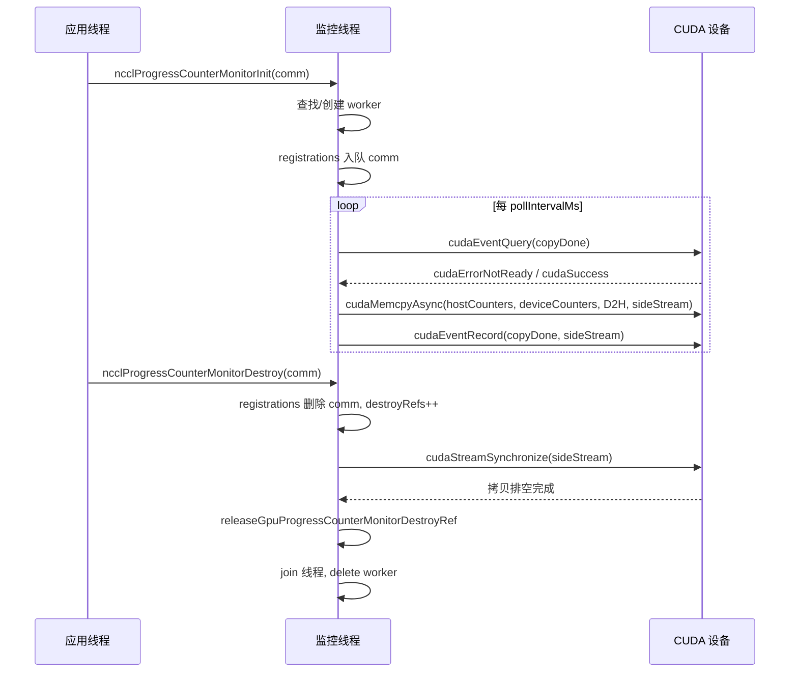
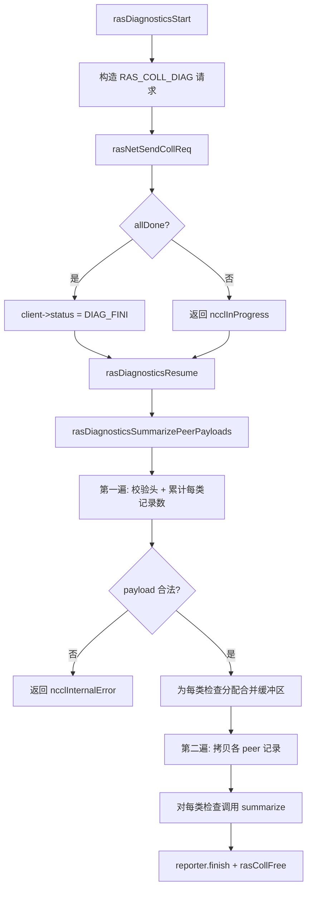

```mermaid
flowchart LR
    subgraph 输入
        ranks["rasRankInit[]"]
    end
    subgraph 转换
        convert["rasRanksConvertToPeers: 排序+合并同地址"]
        rankPeers["rasPeerInfo[] (rankPeers)"]
    end
    subgraph 合并
        update["rasPeersUpdate: 归并到 rasPeers"]
        diff["rankPeers 改造为差异"]
        hash["重算 rasPeersHash"]
    end
    subgraph 传播
        send["rasConnSendPeersUpdate: 带哈希"]
        recv["rasMsgHandlePeersUpdate: 合并+回发"]
        reinit["rasLinkReinitConns: 重建连接"]
    end
    ranks --> convert --> rankPeers --> update
    update --> diff --> hash
    hash --> send --> recv --> reinit
```

# Chapter 17: RAS Mechanisms and Fault Tolerance: Link Failure Detection, Heartbeat, and Graceful Degradation

In the previous chapter, we saw how the plugin system draws a clear boundary between the core communication path and replaceable components, allowing network backends, tuning strategies, and performance collectors to be swapped without modifying core code. But extensibility is only one dimension of production readiness. Another equally hardcore question is: when an AllReduce has been running for 72 hours and a machine's NIC silently fails, how can NCCL detect it, isolate it, and continue? The RAS subsystem is precisely the watershed that takes NCCL from "it runs" to "it's production-ready." This chapter will dissect the design behind fault detection, progress monitoring, and self-healing mechanisms.

# 17.1 RAS Master Control: A Global Coordinator with One RAS Thread per Process

## Intuitive Model

Think of RAS as the "duty room" for the entire job. Each NCCL process (each rank) opens a duty room during initialization, staffed by a dedicated thread. All communicator creation, destruction, and diagnostic requests must first be registered with the duty room; the duty rooms then communicate with each other over an independent RAS network to report "who is still alive and who is dead."

Without this duty room, NCCL could only perceive failures through timeouts on the communication path itself—and timeouts on the communication path are both slow and prone to false positives (a single network jitter could be mistaken for node death). RAS strips "fault perception" out of the data plane and into the control plane, using an independent lightweight heartbeat and diagnostic channel to determine health status.

## Data Structures and Memory Layout

The core state of RAS is scattered across the global variables in`ras.cc`. Let's break them down one by one:

| Variable | Type | Purpose |
| --- | --- | --- |
| `rasInitMutex` | `std::mutex` | Protects RAS singleton initialization |
| `rasInitialized` | `bool` | Whether already initialized |
| `rasInitRefCount` | `int` | Reference count, equal to the number of active comms |
| `rasNetListeningSocket` | `struct ncclSocket` | RAS network listening socket |
| `rasNotificationPipe[2]` | `ncclSocketPairDescriptor` | Notification pipe from local thread → RAS thread |
| `rasPfds` | `struct pollfd*` | Poll array of the main event loop |
| `ncclComms` | `struct ncclComm**` | Array of all communicator pointers |

[FACT:src/ras/ras.cc:49-61]defines these global states. Note that`rasInitRefCount`uses`ncclAtomicRefCountIncrement`to increment/decrement[FACT:src/ras/ras.cc:129], while`rasInitialized`uses a plain bool plus double-checked locking to protect[FACT:src/ras/ras.cc:103-105]—this is the typical "initialize once, read-only thereafter" pattern.

`ncclComms`The allocation strategy for the`RAS_INCREMENT * 8`array is worth noting: it does not grow on demand, but expands by[FACT:src/ras/ras.cc:139-140]each time (i.e., 32 slots)`nullptr`. The array allows[FACT:src/ras/ras.cc:135-137]。

## holes (set to null when a comm is destroyed), and a new comm reuses the first hole

**Scenario-Driven Walkthrough: From Comm Initialization to RAS Thread Startup`ncclRasCommInit`Step 1:**is called.[FACT:src/ras/ras.cc:101]This is the first RAS function called during each comm initialization`rasInitialized`. It first checks

, and if not initialized, enters the critical section:`rasNetListeningSocket`1. Initialize[FACT:src/ras/ras.cc:108-109]

with the bootstrap network interface address, setting the port to 0 to let the kernel assign a random one[FACT:src/ras/ras.cc:113]

2. Listen on that socket[FACT:src/ras/ras.cc:118]

3. Create the local notification pipe[FACT:src/ras/ras.cc:120]

4. Initialize the diagnostic subsystem`rasThreadMain`5. Start the[FACT:src/ras/ras.cc:121]

thread`atexit(rasTerminate)`6. Register[FACT:src/ras/ras.cc:126]

**to ensure cleanup on process exit**Step 2: Register the comm.`comm`Regardless of whether this is the first initialization, it writes the`ncclComms`pointer into the[FACT:src/ras/ras.cc:142]array`ncclCommsSorted`, and sets[FACT:src/ras/ras.cc:143]to false

**—because the array order has changed, the previous sorting is invalidated.**Step 3: Backfill the port.`rasNetListeningSocket.addr`At the end of the function,`myRank->addr` [FACT:src/ras/ras.cc:146](including the kernel-assigned port) is copied back to

## , so the caller can know which port the RAS network is listening on.

`rasThreadMain`Main Event Loop: Poll-Driven Multiplexing[FACT:src/ras/ras.cc:633]is the heart of the RAS thread[FACT:src/ras/ras.cc:641-652]. It first registers three fixed fds: the notification pipe, the RAS network listening socket, and the client listening socket

```
for (int64_t nextWakeup = 0;;) {
  // 计算超时
  timeoutMs = min(..., 1000);
  nEvents = poll(rasPfds, nRasPfds, timeoutMs);
  // 处理事件
  for (pollIdx...) { ... }
  // 处理各类超时
  rasSocksHandleTimeouts(now, &nextWakeup);
  rasConnsHandleTimeouts(now, &nextWakeup);
  rasNetHandleTimeouts(now, &nextWakeup);
  rasCollsHandleTimeouts(now, &nextWakeup);
}
```

[FACT:src/ras/ras.cc:655-728]Copy`timeoutMs`shows this loop. Note that[FACT:src/ras/ras.cc:664]is hard-capped at 1000ms`nextWakeup`—even if

is far away, it must wake up once per second to ensure timely timeout checks.[FACT:src/ras/ras.cc:684-715]Event dispatch logic uses fd values for routing`rasLocalHandle`: if it's the notification pipe, call`rasSocketsHead`; if it's a listening socket, accept; otherwise traverse the`rasClientsHead`and

## linked lists to find the corresponding socket to handle.

Local Notification Mechanism: Pipe + Fixed-Length Structure`rasNotification`The local NCCL thread and the RAS thread communicate through a socketpair. The notification structure[FACT:src/ras/ras.cc:35-46]is fixed-length`static_assert`, and`PIPE_BUF` [FACT:src/ras/ras.cc:47]is used to ensure it does not exceed

—this is to ensure write atomicity (POSIX guarantees that writes smaller than PIPE_BUF are atomic).`rasLocalNotify`The sender`rasNotificationMutex`uses[FACT:src/ras/ras.cc:224-237]to serialize writes from multiple user threads[FACT:src/ras/ras.cc:224-237], then loops until all writes are complete`rasLocalHandle`. The receiver[FACT:src/ras/ras.cc:247-256]similarly loops to read the entire structure`ncclSystemError` [FACT:src/ras/ras.cc:251-253]。

, returning on EOF`RAS_ADD_RANKS`Three notification types:`RAS_RUN_DIAG`(new rank joins),`RAS_TERMINATE`(run diagnostics),[FACT:src/ras/ras.cc:28-32]。

## (terminate)

Message Send/Receive: Length Prefix + Incremental Progress[FACT:src/ras/ras_internal.h:110-117]The wire format of RAS messages is "4-byte length + message body"`rasConnSendMsg`. When sending,[FACT:src/ras/ras.cc:362-390]sends the length first, then the message body`meta->offset`, using`rasMsgRecv`to record progress, supporting continuation after a partial send. When receiving,[FACT:src/ras/ras.cc:393-412]。

first receives the length, allocates a buffer according to the length, then receives the message body`rasMsgAlloc`There is a detail here:`rasMsgMeta`allocates the`msg`structure,`offsetof`field is at the end of the structure, calculated via[FACT:src/ras/ras.cc:313-319]to compute the offset[FACT:src/ras/ras.cc:323-328]. This "metadata-first" layout allows messages to carry local information such as send progress and enqueue time without occupying the wire format.

## Design Considerations

> **[Design Inference & Architectural Trade-offs]**
> **Why use poll instead of epoll?**The O(n) complexity of poll is acceptable in RAS scenarios—the number of RAS connections is far smaller than data-plane connections, and the RAS thread itself is not on the performance-critical path. poll also has better cross-platform support (Windows compatibility).

> **[Design Inference & Architectural Trade-offs]**
> **Why use a pipe instead of a condition variable for notification?**A pipe can be seamlessly integrated into the poll loop, allowing the RAS thread to use a unified`poll`wait for all event sources. If a condition variable were used, an additional mechanism would be needed to wake up poll.

```mermaid
flowchart TD
    start["rasThreadMain 启动"] --> reg_pipe["注册通知管道 fd"]
    reg_pipe --> reg_net["注册 RAS 网络监听 fd"]
    reg_net --> reg_client["注册客户端监听 fd"]
    reg_client --> poll["poll(rasPfds, timeout check{"nEvents == -1?"}
    check -->|"是且非 EINTR"| log_err["记录 poll 错误并继续"]
    check -->|"否"| dispatch["遍历 revents 分发事件"]
    log_err --> dispatch
    dispatch --> is_pipe{"fd == 通知管道?"}
    is_pipe -->|"是"| local_handle["rasLocalHandle()"]
    is_pipe -->|"否"| is_net{"fd == RAS 监听?"}
    is_net -->|"是"| accept_net["rasNetAcceptNewSocket()"]
    is_net -->|"否"| is_client{"fd == 客户端监听?"}
    is_client -->|"是"| accept_client["rasClientAcceptNewSocket()"]
    is_client -->|"否"| find_sock["遍历 rasSocketsHead 找匹配 socket"]
    find_sock --> sock_loop["rasSockEventLoop(sock, pollIdx)"]
    local_handle --> terminate{"terminate?"}
    terminate -->|"是"| cleanup["rasThreadCleanup() 并退出"]
    terminate -->|"否"| timeouts
    sock_loop --> timeouts["rasSocksHandleTimeouts / rasConnsHandleTimeouts / rasNetHandleTimeouts / rasCollsHandleTimeouts"]
    accept_net --> timeouts
    accept_client --> timeouts
    timeouts --> poll
```

# 17.2 Progress Monitoring: Using DMA to Move GPU Counters to the Host

## Intuitive Model

Progress monitoring is like the "tachometer" on a car's dashboard. It doesn't participate in driving (doesn't participate in communication), but continuously copies the GPU's internal progress counters to host memory, allowing the host to determine whether "this communication domain is stuck." Without it, when an AllReduce hangs, you can only see "the program doesn't return," but you can't tell whether the GPU is computing, waiting on the network, or completely deadlocked.

## Data Structures and Memory Layout

Each CUDA device corresponds to one`ncclGpuProgressCounterMonitor`worker thread[FACT:src/ras/progress_monitor.cc:35-52]：

| Field | Type | Purpose |
| --- | --- | --- |
| `cudaDev` | `int` | Bound CUDA device number |
| `thread` | `std::thread` | Worker thread |
| `mutex` / `cv` | `std::mutex` / `condition_variable` | Protects mutable state and wakeups |
| `running` / `shouldStop` | `bool` | Thread lifecycle flag |
| `copyInFlight` | `bool` | Whether a DMA copy is in flight |
| `copyStallWarned` | `bool` | Whether an alert has already been issued for this stall |
| `copyStartNs` | `uint64_t` | Start time of this copy |
| `sideStream` | `cudaStream_t` | Dedicated non-blocking stream |
| `copyDone` | `cudaEvent_t` | Copy completion event |
| `warningMutex` | `std::mutex` | Protects alert timestamps |
| `lastStaleWarnNs` / `lastErrorWarnNs` | `uint64_t` | Rate-limiting timestamp |
| `destroyRefs` | `int` | Destruction reference count |
| `registrations` | Intrusive queue | List of comms registered to this device |

[FACT:src/ras/progress_monitor.cc:59-62]Clarifies the lock order:`gpuProgressCounterMonitorsMu`before`ncclGpuProgressCounterMonitor::mutex`. This is a key convention for avoiding deadlocks.

Global array`gpuProgressCounterMonitors[kRasMaxCudaDevices]`indexed by device number[FACT:src/ras/progress_monitor.cc:59-62]。

## Scenario-Driven Walkthrough: A Single Counter Copy

**Step 1: Registration.** `ncclProgressCounterMonitorInit`is called[FACT:src/ras/progress_monitor.cc:319]. If`deviceCountersBlock`is empty, return directly (this comm does not participate in monitoring)[FACT:src/ras/progress_monitor.cc:323]. Otherwise, within the global lock, find or create the worker for that device[FACT:src/ras/progress_monitor.cc:328-335], then enqueue the comm to`registrations` [FACT:src/ras/progress_monitor.cc:339]。

**Step 2: Worker thread startup.** `createGpuProgressCounterMonitor`creates the worker, sets`cudaSetDevice`, creates`sideStream`（`cudaStreamNonBlocking`) and`copyDone`event[FACT:src/ras/progress_monitor.cc:280-282], and after starting the thread waits up to 2000ms to confirm`running`becomes true[FACT:src/ras/progress_monitor.cc:287-303]。

**Step 3: Loop copy.** `progressCounterMonitorLoop`First bind the device and set relaxed stream capture mode (to avoid interfering with the application's graph capture)[FACT:src/ras/progress_monitor.cc:97-121], then enter the main loop:

1. Wait for`pollIntervalMs`(default 1000ms)[FACT:src/ras/progress_monitor.cc:132-136]

2. If the previous copy is still in flight, use`cudaEventQuery`to check[FACT:src/ras/progress_monitor.cc:140]. If`cudaErrorNotReady`and the stale threshold is exceeded (default 5000ms), issue a rate-limited alert[FACT:src/ras/progress_monitor.cc:141-154]

3. Iterate over all registered comms, and for each call`cudaMemcpyAsync`to copy`deviceCountersBlock`to`hostCountersBlock` [FACT:src/ras/progress_monitor.cc:170-185]

4. If any copy succeeds, record the`copyDone`event and set`copyInFlight` [FACT:src/ras/progress_monitor.cc:194-202]

## Concurrency Control and Rate Limiting

Alert rate limiting is implemented by`progressCounterMonitorShouldWarn`[FACT:src/ras/progress_monitor.cc:78-87]: under the protection of`warningMutex`, check whether more than`warnIntervalNs`has elapsed since the last alert, and only then update and return true. The default`staleWarnSec`is 600 seconds[FACT:src/ras/progress_monitor.cc:27], meaning the same type of alert is emitted at most once every 10 minutes.

Parameters have lower-bound clamping: the minimum poll interval is 50ms[FACT:src/ras/progress_monitor.cc:29], and the minimum stale threshold is 1000ms[FACT:src/ras/progress_monitor.cc:30]. This prevents overly aggressive user configuration from causing CPU spinning.

## Destruction: Reference Counting + Stream Synchronization

`ncclProgressCounterMonitorDestroy`The destruction logic of[FACT:src/ras/progress_monitor.cc:352-354]：

is one of the most elegant concurrency designs in this chapter`registrations`1. Under the global lock + worker lock, remove the comm from[FACT:src/ras/progress_monitor.cc:368]

2. If removal succeeds,`destroyRefs++`and set`haveDestroyRef` [FACT:src/ras/progress_monitor.cc:371-372]

3. If the registration list becomes empty, remove it from the global array and set`shouldStop` [FACT:src/ras/progress_monitor.cc:373-376]

4. After releasing the lock,`cudaStreamSynchronize(g->sideStream)`drain copies that may still reference this comm's buffer[FACT:src/ras/progress_monitor.cc:393]

5. Finally`releaseGpuProgressCounterMonitorDestroyRef`decrement the reference count; when it reaches zero and the queue is empty, join the thread and delete[FACT:src/ras/progress_monitor.cc:219-246]

> **[Design Inference & Architectural Trade-offs]**
> **Why is`destroyRefs`？**needed? Because`cudaStreamSynchronize`executes outside the lock, and during that time another thread may also be destroying the same worker. The reference count ensures that only the last destroyer actually joins and deletes.



## Production Pitfalls

**Pitfall 1:`cudaSetDevice`failure causes monitoring to silently fail.**If`cudaSetDevice`fails when the thread starts, the worker sets`shouldStop`and exits[FACT:src/ras/progress_monitor.cc:97-107], but the comm that registered it still believes monitoring is running. At this point the counter mirror remains stale until the failure is exposed during the Init phase. When troubleshooting, check whether the`NCCL_RAS`logs contain "progress-counter mirrors will remain stale".

**Pitfall 2: graph capture conflict.**If the application is performing stream capture when the monitoring thread calls the CUDA API, it will pollute the capture graph. The code uses`cudaThreadExchangeStreamCaptureMode(cudaStreamCaptureModeRelaxed)`to avoid[FACT:src/ras/progress_monitor.cc:110-111], which is a necessary safeguard.

# 17.3 Diagnostic Framework: Table-Driven Check Dispatch

## Intuitive Model

The diagnostic framework is like a hospital's "health check package." Each check item (GPU model, ECC status, NVLink health, XID errors, etc.) is an independent "check department," and the framework is responsible for collecting the check results from each rank and summarizing them into a report. Without it, operations can only rely on`nvidia-smi`manually troubleshooting machine by machine, which is completely infeasible on a thousand-GPU cluster.

## Data Structure: Check Dispatch Table

At the core is a static dispatch table`rasDiagnosticsChecks` [FACT:src/ras/diagnostics.cc:63-77], where each entry binds a check ID and two callbacks:`collectLocal`(local collection) and`summarize`(aggregation). 11 checks in total: GPU model, CUDA driver version, ECC, NVLink, NCCL environment, RDMA topology, IOMMU mode, ATS, XID/SXID, NVIDIA driver version, path.

`rasDiagnosticsGetCheck`Performs triple validation: ID range, table entry ID match, callback non-null[FACT:src/ras/diagnostics.cc:104-128]. This is defensive programming—preventing table entries from being incorrectly modified, which would lead to calling a null pointer.

## Scenario-driven Walkthrough: The Complete Lifecycle of a Single Diagnosis

**Step 1: Build the local payload.** `rasDiagnosticsCollectLocalPeerPayload`First write the peer header[FACT:src/ras/diagnostics.cc:226-227], then iterate over the dispatch table, calling for each entry`rasDiagnosticsAppendCheckPayload` [FACT:src/ras/diagnostics.cc:229-231]。

`rasDiagnosticsAppendCheckPayload`Call`collectLocal`to get`rasDiagnosticsLocalData`, use`ncclUniquePtr`to take ownership of records[FACT:src/ras/diagnostics.cc:191-192], validate metadata[FACT:src/ras/diagnostics.cc:193], if the record count is 0 then skip[FACT:src/ras/diagnostics.cc:194], otherwise write the check header + record data[FACT:src/ras/diagnostics.cc:196-201]。

**Step 2: Initiate collective communication.** `rasDiagnosticsStart`Construct`RAS_COLL_DIAG`request[FACT:src/ras/diagnostics.cc:532-537], send via`rasNetSendCollReq`[FACT:src/ras/diagnostics.cc:539], set client state to`RAS_CLIENT_DIAG_FINI` [FACT:src/ras/diagnostics.cc:541]。

**Step 3: Merge responses.** `rasCollDiagMerge`Append each peer's payload to the collective buffer[FACT:src/ras/diagnostics.cc:310-337]. Note that it performs extensive overflow checks: peer count upper limit[FACT:src/ras/diagnostics.cc:320-324], total size upper limit[FACT:src/ras/diagnostics.cc:325-328]。

**Step 4: Aggregation.** `rasDiagnosticsSummarizePeerPayloads`is a two-pass scan[FACT:src/ras/diagnostics.cc:399]：

- First pass: validate each peer header and check header, accumulate the record count and byte count for each check type[FACT:src/ras/diagnostics.cc:418-470]
- Allocate the merge buffer for each check type[FACT:src/ras/diagnostics.cc:472-476]
- Second pass: copy each peer's records into the corresponding buffer[FACT:src/ras/diagnostics.cc:479-497]
- Finally call for each check type`summarize` [FACT:src/ras/diagnostics.cc:499-506]

## Client State and Cancellation

Diagnostic state is stored in`rasDiagnosticsClientState`[FACT:src/ras/diagnostics.cc:242-245], attached to`rasClient->diagnostics`.`rasDiagnosticsCancelTarget`When the client socket is closed, replaces the reporter with noop[FACT:src/ras/diagnostics.cc:286-293], preventing writes to an already-closed socket after asynchronous diagnosis completes[FACT:src/ras/diagnostics.cc:48-52]。

## Design Considerations

> **[Design Inference & Architectural Trade-offs]**
> **Why use a two-pass scan?**Because the payload is variable-length; only the first pass can compute how large a buffer each check type needs. A single-pass scan would either require dynamic growth (multiple reallocs) or over-allocation. The two-pass scan trades a single precise allocation for determinism.

**Why include in the check header`recordStride`？** [FACT:src/ras/diagnostics.cc:197]Because different checks have different record structure sizes, and aggregation needs to know the stride to correctly copy and validate.`rasDiagnosticsAccountCheckRecords`Enforces that the stride is consistent for the same check[FACT:src/ras/diagnostics.cc:381-385]。



# 17.4 Peer Management: Sorted Array + Hash Synchronization

## Intuitive Model

`peers.cc`maintains a "class roster." Each RAS thread keeps an identical copy of the roster, recording each NCCL process's address, PID, and managed GPUs. When a new member joins or someone "goes missing," the change is broadcast over the RAS network. The roster uses a hash value as a version number to avoid full synchronization every time.

## Data Structures and Memory Layout

Two core arrays:

- `rasPeers`: all known peers, sorted by address[FACT:src/ras/peers.cc:18-19]. Includes dead peers.
- `rasDeadPeers`: dead peer addresses, stored separately[FACT:src/ras/peers.cc:37-38]。

**Why store dead peers separately?** [FACT:src/ras/peers.cc:25-28]The comments in explain it clearly:`rasPeers`is essentially static and very large at scale, while`rasDeadPeers`is dynamic and much smaller. Storing them separately avoids transmitting the huge`rasPeers`array on every synchronization.

`rasPeerInfo`Structure[FACT:src/ras/ras_internal.h:110-117]：

| Field | Type | Description |
| --- | --- | --- |
| `addr` | `ncclSocketAddress` | Network address (sort key) |
| `pid` | `ncclPid_t` | Process ID |
| `cudaDevs` | `uint64_t` | CUDA device bitmask (affected by CUDA_VISIBLE_DEVICES) |
| `nvmlDevs` | `uint64_t` | NVML device bitmask (not affected) |
| `hostHash` / `pidHash` | `uint64_t` | Extracted from comm, minus commHash to make it independent of the communication domain |

Two hashes`rasPeersHash`and`rasDeadPeersHash`are the core of synchronization[FACT:src/ras/peers.cc:21][FACT:src/ras/peers.cc:37-38]。

## Scenario-driven Walkthrough: A New Rank Joins

**Step 1: Conversion.** `rasRanksConvertToPeers`Converts the`rasRankInit`array into`rasPeerInfo` [FACT:src/ras/peers.cc:104]. First sort by address + cudaDev[FACT:src/ras/peers.cc:114], skip empty addresses[FACT:src/ras/peers.cc:127-130], merge multi-GPU processes at the same address (bitmask OR)[FACT:src/ras/peers.cc:134-139]。

**Step 2: Update the local array.** `rasPeersUpdate`is the most complex merge algorithm in this chapter[FACT:src/ras/peers.cc:197]. It first computes the new array size[FACT:src/ras/peers.cc:202-229], then merges the two sorted arrays[FACT:src/ras/peers.cc:244-361]. Key point: during the merge, it transforms`rankPeers`into a "diff"—keeping only the genuinely new GPU bits[FACT:src/ras/peers.cc:301-308], and finally clears entries with no contribution[FACT:src/ras/peers.cc:393-402]. This minimizes the amount of broadcast data.

**Step 3: Propagation.** `rasNetUpdatePeers`Propagates along`rasNextLink`and`rasPrevLink`in both directions[FACT:src/ras/peers.cc:430-450], then rebuilds connections[FACT:src/ras/peers.cc:443-444]。

**Step 4: Send updates.** `rasConnSendPeersUpdate`First check the hash[FACT:src/ras/peers.cc:500-508]: if the peer already knows the current hash, skip. The message carries`peersHash`and`deadPeersHash` [FACT:src/ras/peers.cc:521-524]; if after merging the receiver's hash still doesn't match, it sends back[FACT:src/ras/peers.cc:608-653]。

## Declaration and Propagation of Dead Peers

`rasPeerDeclareDead`Adds the address to`rasDeadPeers`, re-sorts and recomputes the hash[FACT:src/ras/peers.cc:793-812]。`rasMsgHandleBCDeadPeer`Handles broadcast dead peer messages[FACT:src/ras/ras.cc:578-591]: if locally unknown, disconnect and declare dead; otherwise mark`*pDone = true`Stop re-broadcasting.

`rasDeadPeersUpdate`Uses merge sort to combine the old and new dead peer lists[FACT:src/ras/peers.cc:838-893]. Note that it uses`memmove`instead of`memcpy` [FACT:src/ras/peers.cc:855], because the source and destination may overlap.

## Connection Rebuilding: Avoiding Duplicate Connection Races

`rasLinkReinitConns`Rebuilds link connections after peer updates[FACT:src/ras/peers.cc:680]. Core strategy: initiate the connection from the side with the smaller address[FACT:src/ras/peers.cc:706-711], avoiding both sides initiating simultaneously and causing duplicates.

`rasLinkCalculatePeer`Computes the next peer index, skipping dead peers[FACT:src/ras/peers.cc:743-785]. There is an additional optimization for fallback: skip peers on the same node as the previous fallback[FACT:src/ras/peers.cc:743-785], avoiding waiting one by one when an entire node goes down.

## Production Pitfalls

**Pitfall 1: The byte-order trap in address comparison.** `ncclSocketsCompare`Sorts by address family → address → port[FACT:src/ras/peers.cc:960-990]. The comment points out that you cannot simply`memcmp`the entire structure, because the memory layout order differs from the desired sort order[FACT:src/ras/peers.cc:957-959]. IPv4 addresses and ports can be compared byte by byte under network byte order, but the address family field cannot.

**Pitfall 2:`myPeerIdx`fails.**When the array grows,`myPeerIdx`changes.[FACT:src/ras/peers.cc:22-23]。`rasPeersUpdate`Update it synchronously during the merge process.[FACT:src/ras/peers.cc:312][FACT:src/ras/peers.cc:358]If the update fails, fall back to binary search.[FACT:src/ras/peers.cc:374-388]。

> **[Design Inference & Architectural Trade-offs]**
> **Pitfall 3: Hash collisions cause synchronization omissions.**The hash is only used to determine "whether synchronization is needed," not for correctness. Even if a hash collision causes synchronization to be skipped, subsequent keep-alive exchanges will still carry the hash, and it will eventually converge.



# 17.5 Design Considerations: The Boundary Between RAS and the Main Communication Path

The most core design decision of the RAS subsystem is**complete decoupling from the data plane**. RAS threads do not participate in any data movement for collective communication; they only do three things: maintain the peer list, detect connection health, and perform diagnostics. This decoupling brings several benefits:

1. **Fault isolation**: A crash of the RAS thread will not directly cause communication failure (although it will lose fault-awareness capability).

2. **No performance loss**: RAS heartbeat and synchronization traffic use an independent network and do not consume data plane bandwidth.

3. **Observability**: Diagnostics and monitoring can be performed in parallel while communication is in progress.

The cost is**state consistency**challenges: The comm state seen by RAS may lag behind the data plane.`ncclRasCommInit`and`ncclRasCommFini`through`ncclCommsMutex`protect[FACT:src/ras/ras.cc:77-77], but when the RAS thread reads, it only takes a snapshot and does not provide strong consistency guarantees.

Another key design is**timeout layering**。`ras_internal.h`defines a complete set of timeout constants[FACT:src/ras/ras_internal.h:214-249]: keep-alive interval 1 second, warning threshold 5 seconds, error threshold 20 seconds, peer death threshold 60 seconds. This layering allows the system to take different actions at different severity levels—first warn, then try an alternate connection, and only finally declare death.

# 17.6 Chapter Summary

This chapter broke down the four core modules of the NCCL RAS subsystem:

- **`ras.cc`**: A singleton RAS thread + poll event loop, receiving local notifications through a pipe and exchanging messages with other ranks over an independent network.
- **`progress_monitor.cc`**: One worker thread per device, using DMA to move GPU progress counters to the host, with throttling warnings and reference-counted destruction.
- **`diagnostics.cc`**: A table-driven check dispatch framework, with two-pass scanning to aggregate diagnostic payloads from each rank.
- **`peers.cc`**: Peer list management with a sorted array + hash synchronization, with dead peers stored separately to save bandwidth.

# Chapter Review and Self-Test

Q1：`rasLocalNotify`uses`rasNotificationMutex`serialized writes, but`rasLocalHandle`reads without a corresponding lock. Why is this safe? If`static_assert(sizeof(struct rasNotification) <= PIPE_BUF)`is removed, in what scenarios would problems occur?

**Reference Analysis**: Safety comes from POSIX's guarantee of atomicity for pipe writes—writes smaller than`PIPE_BUF`are atomic.[FACT:src/ras/ras.cc:47]。`rasLocalNotify`'s loop write[FACT:src/ras/ras.cc:224-237]will not interleave with other writes when it can be completed in a single write.`rasLocalHandle`'s loop read[FACT:src/ras/ras.cc:247-256]may read partial data, but because writes are atomic, what is read must be a prefix of a complete message, and the next read can fill in the rest.

Remove`static_assert`, if`rasNotification`exceeds`PIPE_BUF`, the write may be split into multiple non-atomic writes. When two threads write concurrently, their bytes may interleave, causing the RAS thread to read malformed data formed by concatenating two notifications.`msg.type`may come from thread A while`msg.addRanks.ranks`comes from thread B, triggering`rasLocalHandle`'s unknown type branch[FACT:src/ras/ras.cc:267-269]or, worse, a wild pointer dereference.

Q2：`ncclProgressCounterMonitorDestroy`executes`cudaStreamSynchronize` [FACT:src/ras/progress_monitor.cc:381-400]only after releasing the lock. What happens if another thread also calls Destroy to destroy the same comm during synchronization?`destroyRefs`How can the problem be prevented?

**Reference Analysis**：`destroyRefs`is a reference count that prevents the worker from being deleted too early. After the first thread deletes the comm,`destroyRefs++` [FACT:src/ras/progress_monitor.cc:371], at this point`haveDestroyRef = true`. When the second thread tries to delete the same comm,`ncclIntruQueueDelete`returns nullptr (already deleted),`haveDestroyRef`remains false[FACT:src/ras/progress_monitor.cc:368], and synchronization and release are skipped directly.

After the first thread completes`cudaStreamSynchronize`, it calls`releaseGpuProgressCounterMonitorDestroyRef` [FACT:src/ras/progress_monitor.cc:402], decrementing`destroyRefs`to 0, and only when the registration queue is empty does it actually join the thread and delete[FACT:src/ras/progress_monitor.cc:225]。

If there were no`destroyRefs`, the first thread might have its worker released by the second thread's`delete g`during synchronization, causing a use-after-free. Note that`releaseGpuProgressCounterMonitorDestroyRef`decrements under the global lock + worker lock[FACT:src/ras/progress_monitor.cc:222-225], ensuring the atomicity of checking`registrations`is empty and`destroyRefs == 0`.

Q3：`rasDiagnosticsSummarizePeerPayloads`During the first pass scan, validate`checkHeader->payloadBytes != checkHeader->nRecords * checkHeader->recordStride` [FACT:src/ras/diagnostics.cc:451-454]. If some malicious or corrupted peer sends`recordStride = 0`and`nRecords = 0`, will this validation pass? What happens afterward?

**Reference Analysis**：`recordStride <= 0`will be intercepted by the first condition[FACT:src/ras/diagnostics.cc:451], returning`ncclInternalError`. So`recordStride = 0`will not pass.

But if`recordStride > 0`and`nRecords = 0`, then`payloadBytes = 0`, and validation passes.`rasDiagnosticsAccountCheckRecords`For`nRecords == 0`directly returns success[FACT:src/ras/diagnostics.cc:378], without updating`combined`. During subsequent allocation,`recordsBytes == 0`does not allocate[FACT:src/ras/diagnostics.cc:473], and during copy,`payloadBytes > 0`is false and skips[FACT:src/ras/diagnostics.cc:490]. Ultimately`summarize`receives`records = nullptr, recordsBytes = 0`, and the summarize implementation of each check needs to handle empty input.

The real risk is in`nRecords > INT_MAX / recordStride`'s check[FACT:src/ras/diagnostics.cc:453]—this prevents`nRecords * recordStride`integer overflow from bypassing the equality validation. If this check is removed, an attacker can construct`nRecords = 2^31, recordStride = 2`, the product overflows to 0, equal to`payloadBytes = 0`, and after passing validation`rasDiagnosticsAccountCheckRecords`will accumulate a huge`nRecords`, causing out-of-bounds allocation or copying later.

RAS gives NCCL fault awareness and self-healing capability during long training runs, but it relies on a control network independent of the data plane. In the next chapter, we will enter the memory management subsystem and see how NCCL optimizes memory allocation and RDMA registration overhead through allocators, registration caches, and user buffer registration—this is the third pillar beyond performance and reliability.

The design principles running through this chapter are: decoupling the control plane from the data plane, using hashes for state versioning, layered timeout handling, and using reference counting to protect object lifetimes under concurrency. These principles allow RAS to achieve fault detection and self-healing without dragging down communication performance. And another key pillar supporting communication performance—memory management—likewise requires careful engineering trade-offs: Why does NCCL need to register memory before communication? How does the registration cache affect performance? In the next chapter, we will dive into the allocator, the registration cache, and user buffer registration to uncover the answers to these questions.
