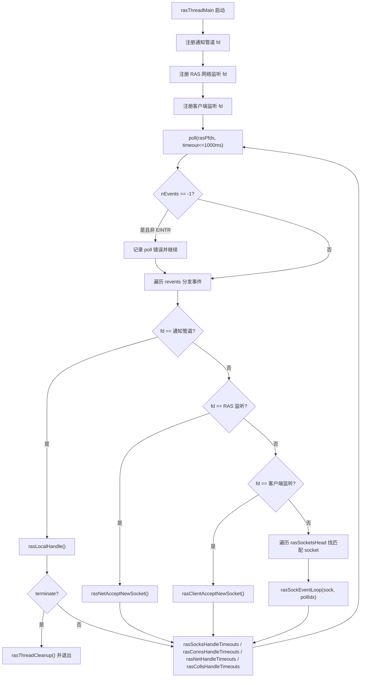
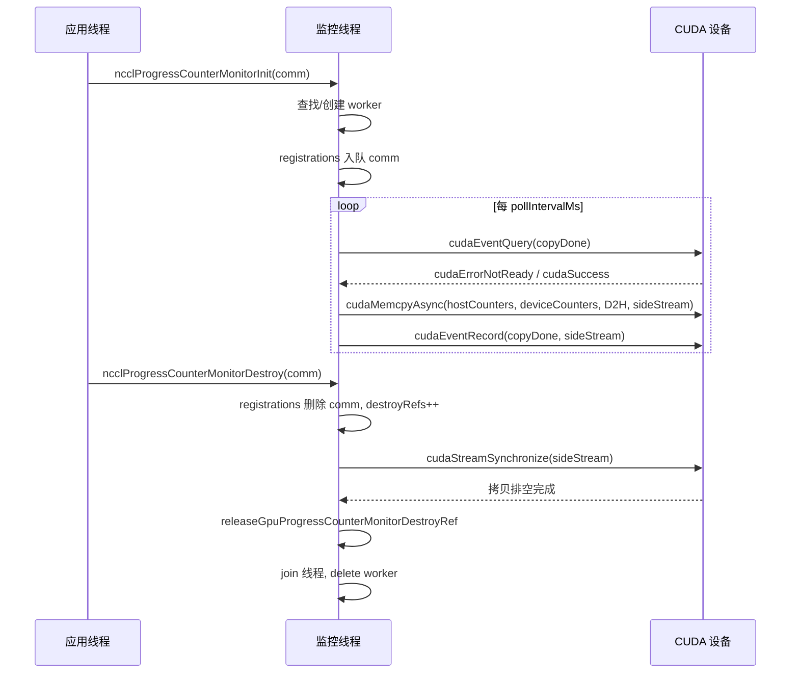
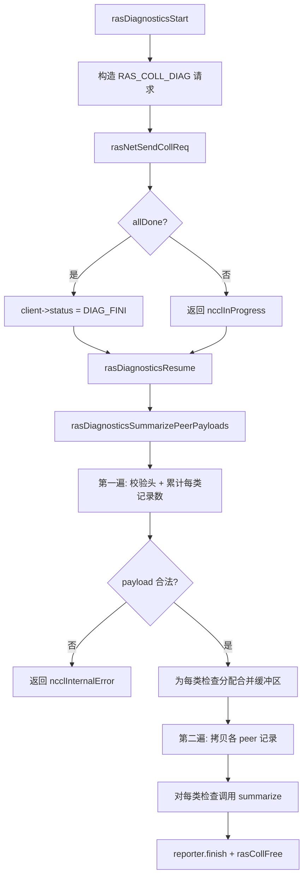

# Chapter 17: RAS & Fault Tolerance: Link Failure Detection & Graceful Degradation


上一章我们看到插件体系如何让核心通信路径与可替换组件划清边界，从而在不修改核心代码的前提下替换网络后端、调优策略和性能采集器。但可扩展性只是生产可用的一个维度，另一个同样硬核的问题是：当一次 AllReduce 已经跑了 72 小时，某台机器的网卡悄悄挂了，NCCL 凭什么能发现、能隔离、能继续？RAS 子系统正是 NCCL 从“能跑通”走向“生产可用”的分水岭，本章将拆解故障检测、进度监控与自愈机制背后的设计。

## 17.1 RAS 总控：一个进程一个 RAS 线程的全局协调者

### Intuitive Architectural Model

把 RAS 想象成整个作业的"值班室"。每个 NCCL 进程（每个 rank）在初始化时都会开一间值班室，里面坐着一个专职线程。所有通信域（communicator）的建立、销毁、诊断请求，都要先向值班室登记；值班室之间再通过一条独立的 RAS 网络互相通报"谁还活着、谁已经死了"。

如果没有这间值班室，NCCL 就只能靠通信路径本身的超时来感知故障——而通信路径上的超时既慢又容易误判（一次网络抖动就可能被当成节点死亡）。RAS 把"故障感知"从数据面剥离到控制面，用独立的轻量心跳和诊断通道来判定健康状态。

### Data Structures & Memory Layout

RAS 的核心状态散落在 `ras.cc` 的全局变量里，我们逐一拆解：

| 变量 | 类型 | 作用 |
|------|------|------|
| `rasInitMutex` | `std::mutex` | 保护 RAS 单例初始化 |
| `rasInitialized` | `bool` | 是否已初始化 |
| `rasInitRefCount` | `int` | 引用计数，等于活跃 comm 数 |
| `rasNetListeningSocket` | `struct ncclSocket` | RAS 网络监听套接字 |
| `rasNotificationPipe[2]` | `ncclSocketPairDescriptor` | 本地线程 → RAS 线程的通知管道 |
| `rasPfds` | `struct pollfd*` | 主事件循环的 poll 数组 |
| `ncclComms` | `struct ncclComm**` | 所有通信域指针数组 |

[FACT:src/ras/ras.cc:49-61](https://github.com/NVIDIA/nccl/blob/12df1a11afad322be5a204a2db890161cbf8131d/src/ras/ras.cc#L49-L61) 定义了这些全局状态。注意 `rasInitRefCount` 用 `ncclAtomicRefCountIncrement` 增减 [FACT:src/ras/ras.cc:129](https://github.com/NVIDIA/nccl/blob/12df1a11afad322be5a204a2db890161cbf8131d/src/ras/ras.cc#L129)，而 `rasInitialized` 用普通 bool 加双重检查锁保护 [FACT:src/ras/ras.cc:103-105](https://github.com/NVIDIA/nccl/blob/12df1a11afad322be5a204a2db890161cbf8131d/src/ras/ras.cc#L103-L105)——这是典型的"初始化一次、之后只读"模式。

`ncclComms` 数组的分配策略值得注意：它不是按需增长，而是每次扩容 `RAS_INCREMENT * 8`（即 32 个槽位）[FACT:src/ras/ras.cc:139-140](https://github.com/NVIDIA/nccl/blob/12df1a11afad322be5a204a2db890161cbf8131d/src/ras/ras.cc#L139-L140)。数组里允许出现 `nullptr` 空洞（comm 销毁时置空），新 comm 会复用第一个空洞 [FACT:src/ras/ras.cc:135-137](https://github.com/NVIDIA/nccl/blob/12df1a11afad322be5a204a2db890161cbf8131d/src/ras/ras.cc#L135-L137)。

### 场景驱动 Walkthrough：从 comm 初始化到 RAS 线程启动

**第一步：`ncclRasCommInit` 被调用。** 这是每个 comm 初始化时第一个调用的 RAS 函数 [FACT:src/ras/ras.cc:101](https://github.com/NVIDIA/nccl/blob/12df1a11afad322be5a204a2db890161cbf8131d/src/ras/ras.cc#L101)。它先检查 `rasInitialized`，若未初始化则进入临界区：

1. 用 bootstrap 网络接口地址初始化 `rasNetListeningSocket`，端口设为 0 让内核随机分配 [FACT:src/ras/ras.cc:108-109](https://github.com/NVIDIA/nccl/blob/12df1a11afad322be5a204a2db890161cbf8131d/src/ras/ras.cc#L108-L109)
2. 监听该套接字 [FACT:src/ras/ras.cc:113](https://github.com/NVIDIA/nccl/blob/12df1a11afad322be5a204a2db890161cbf8131d/src/ras/ras.cc#L113)
3. 创建本地通知管道 [FACT:src/ras/ras.cc:118](https://github.com/NVIDIA/nccl/blob/12df1a11afad322be5a204a2db890161cbf8131d/src/ras/ras.cc#L118)
4. 初始化诊断子系统 [FACT:src/ras/ras.cc:120](https://github.com/NVIDIA/nccl/blob/12df1a11afad322be5a204a2db890161cbf8131d/src/ras/ras.cc#L120)
5. 启动 `rasThreadMain` 线程 [FACT:src/ras/ras.cc:121](https://github.com/NVIDIA/nccl/blob/12df1a11afad322be5a204a2db890161cbf8131d/src/ras/ras.cc#L121)
6. 注册 `atexit(rasTerminate)` 保证进程退出时清理 [FACT:src/ras/ras.cc:126](https://github.com/NVIDIA/nccl/blob/12df1a11afad322be5a204a2db890161cbf8131d/src/ras/ras.cc#L126)

**第二步：登记 comm。** 无论是否首次初始化，都会把 `comm` 指针写入 `ncclComms` 数组 [FACT:src/ras/ras.cc:142](https://github.com/NVIDIA/nccl/blob/12df1a11afad322be5a204a2db890161cbf8131d/src/ras/ras.cc#L142)，并把 `ncclCommsSorted` 置 false [FACT:src/ras/ras.cc:143](https://github.com/NVIDIA/nccl/blob/12df1a11afad322be5a204a2db890161cbf8131d/src/ras/ras.cc#L143)——因为数组顺序变了，之前的排序失效。

**第三步：回填端口。** 函数最后把 `rasNetListeningSocket.addr`（含内核分配的端口）拷回 `myRank->addr` [FACT:src/ras/ras.cc:146](https://github.com/NVIDIA/nccl/blob/12df1a11afad322be5a204a2db890161cbf8131d/src/ras/ras.cc#L146)，这样调用方就能知道 RAS 网络监听在哪个端口。

### 主事件循环：poll 驱动的多路复用

`rasThreadMain` 是 RAS 线程的心脏 [FACT:src/ras/ras.cc:633](https://github.com/NVIDIA/nccl/blob/12df1a11afad322be5a204a2db890161cbf8131d/src/ras/ras.cc#L633)。它先注册三个固定 fd：通知管道、RAS 网络监听套接字、客户端监听套接字 [FACT:src/ras/ras.cc:641-652](https://github.com/NVIDIA/nccl/blob/12df1a11afad322be5a204a2db890161cbf8131d/src/ras/ras.cc#L641-L652)。然后进入无限循环：

```
for (int64_t nextWakeup = 0;;) {
  // 计算超时
  timeoutMs = min(..., 1000);
  nEvents = poll(rasPfds, nRasPfds, timeoutMs);
  // 处理事件
  for (pollIdx...) { ... }
  // 处理各类超时
  rasSocksHandleTimeouts(now, &nextWakeup);
  rasConnsHandleTimeouts(now, &nextWakeup);
  rasNetHandleTimeouts(now, &nextWakeup);
  rasCollsHandleTimeouts(now, &nextWakeup);
}
```

[FACT:src/ras/ras.cc:655-728](https://github.com/NVIDIA/nccl/blob/12df1a11afad322be5a204a2db890161cbf8131d/src/ras/ras.cc#L655-L728) 展示了这个循环。注意 `timeoutMs` 被硬性限制在 1000ms 以内 [FACT:src/ras/ras.cc:664](https://github.com/NVIDIA/nccl/blob/12df1a11afad322be5a204a2db890161cbf8131d/src/ras/ras.cc#L664)——即使 `nextWakeup` 很远，也要每秒醒一次，保证超时检查的及时性。

事件分发逻辑用 fd 值做路由 [FACT:src/ras/ras.cc:684-715](https://github.com/NVIDIA/nccl/blob/12df1a11afad322be5a204a2db890161cbf8131d/src/ras/ras.cc#L684-L715)：如果是通知管道就调 `rasLocalHandle`；如果是监听套接字就 accept；否则遍历 `rasSocketsHead` 和 `rasClientsHead` 链表找到对应的 socket 处理。

### 本地通知机制：管道 + 定长结构

本地 NCCL 线程与 RAS 线程通过一个 socketpair 通信。通知结构 `rasNotification` 是定长的 [FACT:src/ras/ras.cc:35-46](https://github.com/NVIDIA/nccl/blob/12df1a11afad322be5a204a2db890161cbf8131d/src/ras/ras.cc#L35-L46)，并用 `static_assert` 保证不超过 `PIPE_BUF` [FACT:src/ras/ras.cc:47](https://github.com/NVIDIA/nccl/blob/12df1a11afad322be5a204a2db890161cbf8131d/src/ras/ras.cc#L47)——这是为了确保写入的原子性（POSIX 保证小于 PIPE_BUF 的写入是原子的）。

发送端 `rasLocalNotify` 用 `rasNotificationMutex` 串行化多个用户线程的写入 [FACT:src/ras/ras.cc:224-237](https://github.com/NVIDIA/nccl/blob/12df1a11afad322be5a204a2db890161cbf8131d/src/ras/ras.cc#L224-L237)，然后循环写直到全部写完 [FACT:src/ras/ras.cc:224-237](https://github.com/NVIDIA/nccl/blob/12df1a11afad322be5a204a2db890161cbf8131d/src/ras/ras.cc#L224-L237)。接收端 `rasLocalHandle` 同样循环读满整个结构 [FACT:src/ras/ras.cc:247-256](https://github.com/NVIDIA/nccl/blob/12df1a11afad322be5a204a2db890161cbf8131d/src/ras/ras.cc#L247-L256)，读到 EOF 返回 `ncclSystemError` [FACT:src/ras/ras.cc:251-253](https://github.com/NVIDIA/nccl/blob/12df1a11afad322be5a204a2db890161cbf8131d/src/ras/ras.cc#L251-L253)。

三种通知类型：`RAS_ADD_RANKS`（新 rank 加入）、`RAS_RUN_DIAG`（运行诊断）、`RAS_TERMINATE`（终止）[FACT:src/ras/ras.cc:28-32](https://github.com/NVIDIA/nccl/blob/12df1a11afad322be5a204a2db890161cbf8131d/src/ras/ras.cc#L28-L32)。

### 消息收发：长度前缀 + 增量进度

RAS 消息的线格式是"4 字节长度 + 消息体" [FACT:src/ras/ras_internal.h:110-117](https://github.com/NVIDIA/nccl/blob/12df1a11afad322be5a204a2db890161cbf8131d/src/ras/ras_internal.h#L110-L117)。发送时 `rasConnSendMsg` 先发长度再发消息体 [FACT:src/ras/ras.cc:362-390](https://github.com/NVIDIA/nccl/blob/12df1a11afad322be5a204a2db890161cbf8131d/src/ras/ras.cc#L362-L390)，用 `meta->offset` 记录进度，支持部分发送后下次继续。接收时 `rasMsgRecv` 先收长度、按长度分配缓冲区、再收消息体 [FACT:src/ras/ras.cc:393-412](https://github.com/NVIDIA/nccl/blob/12df1a11afad322be5a204a2db890161cbf8131d/src/ras/ras.cc#L393-L412)。

这里有个细节：`rasMsgAlloc` 分配的是 `rasMsgMeta` 结构，`msg` 字段在结构末尾，通过 `offsetof` 计算偏移 [FACT:src/ras/ras.cc:313-319](https://github.com/NVIDIA/nccl/blob/12df1a11afad322be5a204a2db890161cbf8131d/src/ras/ras.cc#L313-L319)。释放时反向计算 [FACT:src/ras/ras.cc:323-328](https://github.com/NVIDIA/nccl/blob/12df1a11afad322be5a204a2db890161cbf8131d/src/ras/ras.cc#L323-L328)。这种"元数据前置"的布局让消息可以携带发送进度、入队时间等本地信息，而不占用线格式。

### 设计思考

**为什么用 poll 而不是 epoll？** [INFERENCE] poll 的 O(n) 复杂度在 RAS 场景下可接受——RAS 连接数远小于数据面连接数，且 RAS 线程本身不是性能关键路径。poll 的跨平台性也更好（Windows 兼容）。

**为什么通知用管道而不是条件变量？** [INFERENCE] 管道可以无缝集成进 poll 循环，让 RAS 线程用统一的 `poll` 等待所有事件源。如果用条件变量，就需要额外的机制来唤醒 poll。



## 17.2 进度监控：用 DMA 把 GPU 计数器搬到主机

### Intuitive Architectural Model

进度监控像汽车仪表盘上的"发动机转速表"。它不参与驾驶（不参与通信），但持续把 GPU 内部的进度计数器抄到主机内存，让主机能判断"这个通信域是不是卡住了"。如果没有它，一次 AllReduce 卡死时你只能看到"程序不返回"，却不知道是 GPU 在算、在等网络、还是彻底死锁。

### Data Structures & Memory Layout

每个 CUDA 设备对应一个 `ncclGpuProgressCounterMonitor` 工作线程 [FACT:src/ras/progress_monitor.cc:35-52](https://github.com/NVIDIA/nccl/blob/12df1a11afad322be5a204a2db890161cbf8131d/src/ras/progress_monitor.cc#L35-L52)：

| 字段 | 类型 | 作用 |
|------|------|------|
| `cudaDev` | `int` | 绑定的 CUDA 设备号 |
| `thread` | `std::thread` | 工作线程 |
| `mutex` / `cv` | `std::mutex` / `condition_variable` | 保护可变状态与唤醒 |
| `running` / `shouldStop` | `bool` | 线程生命周期标志 |
| `copyInFlight` | `bool` | 是否有 DMA 拷贝在途 |
| `copyStallWarned` | `bool` | 是否已对本次卡顿告警 |
| `copyStartNs` | `uint64_t` | 本次拷贝开始时间 |
| `sideStream` | `cudaStream_t` | 专用非阻塞流 |
| `copyDone` | `cudaEvent_t` | 拷贝完成事件 |
| `warningMutex` | `std::mutex` | 保护告警时间戳 |
| `lastStaleWarnNs` / `lastErrorWarnNs` | `uint64_t` | 限流时间戳 |
| `destroyRefs` | `int` | 销毁引用计数 |
| `registrations` | 侵入式队列 | 注册到本设备的 comm 列表 |

[FACT:src/ras/progress_monitor.cc:59-62](https://github.com/NVIDIA/nccl/blob/12df1a11afad322be5a204a2db890161cbf8131d/src/ras/progress_monitor.cc#L59-L62) 明确了锁顺序：`gpuProgressCounterMonitorsMu` 先于 `ncclGpuProgressCounterMonitor::mutex`。这是避免死锁的关键约定。

全局数组 `gpuProgressCounterMonitors[kRasMaxCudaDevices]` 按设备号索引 [FACT:src/ras/progress_monitor.cc:59-62](https://github.com/NVIDIA/nccl/blob/12df1a11afad322be5a204a2db890161cbf8131d/src/ras/progress_monitor.cc#L59-L62)。

### 场景驱动 Walkthrough：一次计数器拷贝

**第一步：注册。** `ncclProgressCounterMonitorInit` 被调用 [FACT:src/ras/progress_monitor.cc:319](https://github.com/NVIDIA/nccl/blob/12df1a11afad322be5a204a2db890161cbf8131d/src/ras/progress_monitor.cc#L319)。若 `deviceCountersBlock` 为空则直接返回（该 comm 不参与监控）[FACT:src/ras/progress_monitor.cc:323](https://github.com/NVIDIA/nccl/blob/12df1a11afad322be5a204a2db890161cbf8131d/src/ras/progress_monitor.cc#L323)。否则在全局锁内查找或创建该设备的 worker [FACT:src/ras/progress_monitor.cc:328-335](https://github.com/NVIDIA/nccl/blob/12df1a11afad322be5a204a2db890161cbf8131d/src/ras/progress_monitor.cc#L328-L335)，然后把 comm 入队到 `registrations` [FACT:src/ras/progress_monitor.cc:339](https://github.com/NVIDIA/nccl/blob/12df1a11afad322be5a204a2db890161cbf8131d/src/ras/progress_monitor.cc#L339)。

**第二步：工作线程启动。** `createGpuProgressCounterMonitor` 创建 worker，设置 `cudaSetDevice`、创建 `sideStream`（`cudaStreamNonBlocking`）和 `copyDone` 事件 [FACT:src/ras/progress_monitor.cc:280-282](https://github.com/NVIDIA/nccl/blob/12df1a11afad322be5a204a2db890161cbf8131d/src/ras/progress_monitor.cc#L280-L282)，启动线程后等待最多 2000ms 确认 `running` 变 true [FACT:src/ras/progress_monitor.cc:287-303](https://github.com/NVIDIA/nccl/blob/12df1a11afad322be5a204a2db890161cbf8131d/src/ras/progress_monitor.cc#L287-L303)。

**第三步：循环拷贝。** `progressCounterMonitorLoop` 先绑定设备、设置 relaxed 流捕获模式（避免干扰应用的 graph capture）[FACT:src/ras/progress_monitor.cc:97-121](https://github.com/NVIDIA/nccl/blob/12df1a11afad322be5a204a2db890161cbf8131d/src/ras/progress_monitor.cc#L97-L121)，然后进入主循环：

1. 等待 `pollIntervalMs`（默认 1000ms）[FACT:src/ras/progress_monitor.cc:132-136](https://github.com/NVIDIA/nccl/blob/12df1a11afad322be5a204a2db890161cbf8131d/src/ras/progress_monitor.cc#L132-L136)
2. 若上次拷贝还在途，用 `cudaEventQuery` 检查 [FACT:src/ras/progress_monitor.cc:140](https://github.com/NVIDIA/nccl/blob/12df1a11afad322be5a204a2db890161cbf8131d/src/ras/progress_monitor.cc#L140)。若 `cudaErrorNotReady` 且超过 stale 阈值（默认 5000ms），发出限流告警 [FACT:src/ras/progress_monitor.cc:141-154](https://github.com/NVIDIA/nccl/blob/12df1a11afad322be5a204a2db890161cbf8131d/src/ras/progress_monitor.cc#L141-L154)
3. 遍历所有注册的 comm，对每个调用 `cudaMemcpyAsync` 把 `deviceCountersBlock` 拷到 `hostCountersBlock` [FACT:src/ras/progress_monitor.cc:170-185](https://github.com/NVIDIA/nccl/blob/12df1a11afad322be5a204a2db890161cbf8131d/src/ras/progress_monitor.cc#L170-L185)
4. 若有任何拷贝成功，记录 `copyDone` 事件并置 `copyInFlight` [FACT:src/ras/progress_monitor.cc:194-202](https://github.com/NVIDIA/nccl/blob/12df1a11afad322be5a204a2db890161cbf8131d/src/ras/progress_monitor.cc#L194-L202)

### 并发控制与限流

告警限流由 `progressCounterMonitorShouldWarn` 实现 [FACT:src/ras/progress_monitor.cc:78-87](https://github.com/NVIDIA/nccl/blob/12df1a11afad322be5a204a2db890161cbf8131d/src/ras/progress_monitor.cc#L78-L87)：在 `warningMutex` 保护下检查距上次告警是否超过 `warnIntervalNs`，超过才更新并返回 true。默认 `staleWarnSec` 是 600 秒 [FACT:src/ras/progress_monitor.cc:27](https://github.com/NVIDIA/nccl/blob/12df1a11afad322be5a204a2db890161cbf8131d/src/ras/progress_monitor.cc#L27)，即同一类告警最多每 10 分钟一条。

参数有下限钳制：poll 间隔最小 50ms [FACT:src/ras/progress_monitor.cc:29](https://github.com/NVIDIA/nccl/blob/12df1a11afad322be5a204a2db890161cbf8131d/src/ras/progress_monitor.cc#L29)，stale 阈值最小 1000ms [FACT:src/ras/progress_monitor.cc:30](https://github.com/NVIDIA/nccl/blob/12df1a11afad322be5a204a2db890161cbf8131d/src/ras/progress_monitor.cc#L30)。这防止用户配置过激导致 CPU 空转。

### 销毁：引用计数 + 流同步

`ncclProgressCounterMonitorDestroy` 的销毁逻辑是本章最精妙的并发设计之一 [FACT:src/ras/progress_monitor.cc:352-354](https://github.com/NVIDIA/nccl/blob/12df1a11afad322be5a204a2db890161cbf8131d/src/ras/progress_monitor.cc#L352-L354)：

1. 在全局锁 + worker 锁内从 `registrations` 删除 comm [FACT:src/ras/progress_monitor.cc:368](https://github.com/NVIDIA/nccl/blob/12df1a11afad322be5a204a2db890161cbf8131d/src/ras/progress_monitor.cc#L368)
2. 若删除成功，`destroyRefs++` 并置 `haveDestroyRef` [FACT:src/ras/progress_monitor.cc:371-372](https://github.com/NVIDIA/nccl/blob/12df1a11afad322be5a204a2db890161cbf8131d/src/ras/progress_monitor.cc#L371-L372)
3. 若注册列表变空，从全局数组摘除并置 `shouldStop` [FACT:src/ras/progress_monitor.cc:373-376](https://github.com/NVIDIA/nccl/blob/12df1a11afad322be5a204a2db890161cbf8131d/src/ras/progress_monitor.cc#L373-L376)
4. 释放锁后，`cudaStreamSynchronize(g->sideStream)` 排空可能仍引用该 comm 缓冲区的拷贝 [FACT:src/ras/progress_monitor.cc:393](https://github.com/NVIDIA/nccl/blob/12df1a11afad322be5a204a2db890161cbf8131d/src/ras/progress_monitor.cc#L393)
5. 最后 `releaseGpuProgressCounterMonitorDestroyRef` 递减引用计数，归零且队列空时 join 线程并删除 [FACT:src/ras/progress_monitor.cc:219-246](https://github.com/NVIDIA/nccl/blob/12df1a11afad322be5a204a2db890161cbf8131d/src/ras/progress_monitor.cc#L219-L246)

**为什么需要 `destroyRefs`？** [INFERENCE] 因为 `cudaStreamSynchronize` 在锁外执行，期间可能有另一个线程也在销毁同一个 worker。引用计数保证只有最后一个销毁者才真正 join 和 delete。



### 生产避坑

**坑 1：`cudaSetDevice` 失败导致监控静默失效。** 若线程启动时 `cudaSetDevice` 失败，worker 会置 `shouldStop` 并退出 [FACT:src/ras/progress_monitor.cc:97-107](https://github.com/NVIDIA/nccl/blob/12df1a11afad322be5a204a2db890161cbf8131d/src/ras/progress_monitor.cc#L97-L107)，但注册它的 comm 仍然认为监控在跑。此时计数器镜像会一直陈旧，直到 Init 阶段暴露失败。排查时要看 `NCCL_RAS` 日志里是否有 "progress-counter mirrors will remain stale"。

**坑 2：graph capture 冲突。** 监控线程调用 CUDA API 时若应用正在做 stream capture，会污染捕获图。代码用 `cudaThreadExchangeStreamCaptureMode(cudaStreamCaptureModeRelaxed)` 规避 [FACT:src/ras/progress_monitor.cc:110-111](https://github.com/NVIDIA/nccl/blob/12df1a11afad322be5a204a2db890161cbf8131d/src/ras/progress_monitor.cc#L110-L111)，这是必须的防护。

## 17.3 诊断框架：表驱动的检查分发

### Intuitive Architectural Model

诊断框架像医院的"体检套餐"。每个检查项（GPU 型号、ECC 状态、NVLink 健康、XID 错误等）是一个独立的"检查科室"，框架负责把各 rank 的检查结果收集起来、汇总成一份报告。没有它，运维只能靠 `nvidia-smi` 逐台机器手工排查，在千卡集群上完全不可行。

### 数据结构：检查分发表

核心是一张静态分发表 `rasDiagnosticsChecks` [FACT:src/ras/diagnostics.cc:63-77](https://github.com/NVIDIA/nccl/blob/12df1a11afad322be5a204a2db890161cbf8131d/src/ras/diagnostics.cc#L63-L77)，每个条目绑定一个检查 ID 和两个回调：`collectLocal`（本地采集）和 `summarize`（汇总）。共 11 项检查：GPU 型号、CUDA 驱动版本、ECC、NVLink、NCCL 环境、RDMA 拓扑、IOMMU 模式、ATS、XID/SXID、NVIDIA 驱动版本、路径。

`rasDiagnosticsGetCheck` 做三重校验：ID 范围、表项 ID 匹配、回调非空 [FACT:src/ras/diagnostics.cc:104-128](https://github.com/NVIDIA/nccl/blob/12df1a11afad322be5a204a2db890161cbf8131d/src/ras/diagnostics.cc#L104-L128)。这是防御性编程——防止表项被错误修改导致调用空指针。

### 场景驱动 Walkthrough：一次诊断的完整生命周期

**第一步：构建本地 payload。** `rasDiagnosticsCollectLocalPeerPayload` 先写入 peer 头 [FACT:src/ras/diagnostics.cc:226-227](https://github.com/NVIDIA/nccl/blob/12df1a11afad322be5a204a2db890161cbf8131d/src/ras/diagnostics.cc#L226-L227)，然后遍历分发表，对每项调用 `rasDiagnosticsAppendCheckPayload` [FACT:src/ras/diagnostics.cc:229-231](https://github.com/NVIDIA/nccl/blob/12df1a11afad322be5a204a2db890161cbf8131d/src/ras/diagnostics.cc#L229-L231)。

`rasDiagnosticsAppendCheckPayload` 调用 `collectLocal` 拿到 `rasDiagnosticsLocalData`，用 `ncclUniquePtr` 接管 records 所有权 [FACT:src/ras/diagnostics.cc:191-192](https://github.com/NVIDIA/nccl/blob/12df1a11afad322be5a204a2db890161cbf8131d/src/ras/diagnostics.cc#L191-L192)，校验元数据 [FACT:src/ras/diagnostics.cc:193](https://github.com/NVIDIA/nccl/blob/12df1a11afad322be5a204a2db890161cbf8131d/src/ras/diagnostics.cc#L193)，若记录数为 0 则跳过 [FACT:src/ras/diagnostics.cc:194](https://github.com/NVIDIA/nccl/blob/12df1a11afad322be5a204a2db890161cbf8131d/src/ras/diagnostics.cc#L194)，否则写入检查头 + 记录数据 [FACT:src/ras/diagnostics.cc:196-201](https://github.com/NVIDIA/nccl/blob/12df1a11afad322be5a204a2db890161cbf8131d/src/ras/diagnostics.cc#L196-L201)。

**第二步：发起集合通信。** `rasDiagnosticsStart` 构造 `RAS_COLL_DIAG` 请求 [FACT:src/ras/diagnostics.cc:532-537](https://github.com/NVIDIA/nccl/blob/12df1a11afad322be5a204a2db890161cbf8131d/src/ras/diagnostics.cc#L532-L537)，通过 `rasNetSendCollReq` 发出 [FACT:src/ras/diagnostics.cc:539](https://github.com/NVIDIA/nccl/blob/12df1a11afad322be5a204a2db890161cbf8131d/src/ras/diagnostics.cc#L539)，客户端状态置为 `RAS_CLIENT_DIAG_FINI` [FACT:src/ras/diagnostics.cc:541](https://github.com/NVIDIA/nccl/blob/12df1a11afad322be5a204a2db890161cbf8131d/src/ras/diagnostics.cc#L541)。

**第三步：合并响应。** `rasCollDiagMerge` 把各 peer 的 payload 追加到集合缓冲区 [FACT:src/ras/diagnostics.cc:310-337](https://github.com/NVIDIA/nccl/blob/12df1a11afad322be5a204a2db890161cbf8131d/src/ras/diagnostics.cc#L310-L337)。注意它做了大量溢出检查：peer 数上限 [FACT:src/ras/diagnostics.cc:320-324](https://github.com/NVIDIA/nccl/blob/12df1a11afad322be5a204a2db890161cbf8131d/src/ras/diagnostics.cc#L320-L324)、总大小上限 [FACT:src/ras/diagnostics.cc:325-328](https://github.com/NVIDIA/nccl/blob/12df1a11afad322be5a204a2db890161cbf8131d/src/ras/diagnostics.cc#L325-L328)。

**第四步：汇总。** `rasDiagnosticsSummarizePeerPayloads` 是两遍扫描 [FACT:src/ras/diagnostics.cc:399](https://github.com/NVIDIA/nccl/blob/12df1a11afad322be5a204a2db890161cbf8131d/src/ras/diagnostics.cc#L399)：

- 第一遍：校验每个 peer 头和检查头，累计每类检查的记录数和字节数 [FACT:src/ras/diagnostics.cc:418-470](https://github.com/NVIDIA/nccl/blob/12df1a11afad322be5a204a2db890161cbf8131d/src/ras/diagnostics.cc#L418-L470)
- 分配每类检查的合并缓冲区 [FACT:src/ras/diagnostics.cc:472-476](https://github.com/NVIDIA/nccl/blob/12df1a11afad322be5a204a2db890161cbf8131d/src/ras/diagnostics.cc#L472-L476)
- 第二遍：把各 peer 的记录拷贝到对应缓冲区 [FACT:src/ras/diagnostics.cc:479-497](https://github.com/NVIDIA/nccl/blob/12df1a11afad322be5a204a2db890161cbf8131d/src/ras/diagnostics.cc#L479-L497)
- 最后对每类检查调用 `summarize` [FACT:src/ras/diagnostics.cc:499-506](https://github.com/NVIDIA/nccl/blob/12df1a11afad322be5a204a2db890161cbf8131d/src/ras/diagnostics.cc#L499-L506)

### 客户端状态与取消

诊断状态存在 `rasDiagnosticsClientState` 里 [FACT:src/ras/diagnostics.cc:242-245](https://github.com/NVIDIA/nccl/blob/12df1a11afad322be5a204a2db890161cbf8131d/src/ras/diagnostics.cc#L242-L245)，挂在 `rasClient->diagnostics` 上。`rasDiagnosticsCancelTarget` 在客户端 socket 关闭时把 reporter 换成 noop [FACT:src/ras/diagnostics.cc:286-293](https://github.com/NVIDIA/nccl/blob/12df1a11afad322be5a204a2db890161cbf8131d/src/ras/diagnostics.cc#L286-L293)，防止异步诊断完成后向已关闭的 socket 写入 [FACT:src/ras/diagnostics.cc:48-52](https://github.com/NVIDIA/nccl/blob/12df1a11afad322be5a204a2db890161cbf8131d/src/ras/diagnostics.cc#L48-L52)。

### 设计思考

**为什么用两遍扫描？** [INFERENCE] 因为 payload 是变长的，第一遍才能算出每类检查需要多大缓冲区。一遍扫描要么动态增长（多次 realloc），要么预分配过大。两遍扫描用一次精确分配换取确定性。

**为什么检查头里带 `recordStride`？** [FACT:src/ras/diagnostics.cc:197](https://github.com/NVIDIA/nccl/blob/12df1a11afad322be5a204a2db890161cbf8131d/src/ras/diagnostics.cc#L197) 因为不同检查的记录结构大小不同，汇总时需要知道步长才能正确拷贝和校验。`rasDiagnosticsAccountCheckRecords` 强制同一检查的 stride 一致 [FACT:src/ras/diagnostics.cc:381-385](https://github.com/NVIDIA/nccl/blob/12df1a11afad322be5a204a2db890161cbf8131d/src/ras/diagnostics.cc#L381-L385)。



## 17.4 对等体管理：排序数组 + 哈希同步

### Intuitive Architectural Model

`peers.cc` 维护的是"全班同学名单"。每个 RAS 线程都保存一份完全相同的名单，记录每个 NCCL 进程的地址、PID、管理的 GPU。当有新同学加入或有人"失联"时，通过 RAS 网络把变更广播出去。名单用哈希值做版本号，避免每次全量同步。

### Data Structures & Memory Layout

两个核心数组：

- `rasPeers`：所有已知 peer，按地址排序 [FACT:src/ras/peers.cc:18-19](https://github.com/NVIDIA/nccl/blob/12df1a11afad322be5a204a2db890161cbf8131d/src/ras/peers.cc#L18-L19)。包含已死 peer。
- `rasDeadPeers`：已死 peer 地址，单独存放 [FACT:src/ras/peers.cc:37-38](https://github.com/NVIDIA/nccl/blob/12df1a11afad322be5a204a2db890161cbf8131d/src/ras/peers.cc#L37-L38)。

**为什么死 peer 单独存？** [FACT:src/ras/peers.cc:25-28](https://github.com/NVIDIA/nccl/blob/12df1a11afad322be5a204a2db890161cbf8131d/src/ras/peers.cc#L25-L28) 的注释解释得很清楚：`rasPeers` 在大规模下基本静态且很大，而 `rasDeadPeers` 动态且小得多。分开存避免每次同步都传输庞大的 `rasPeers` 数组。

`rasPeerInfo` 结构 [FACT:src/ras/ras_internal.h:110-117](https://github.com/NVIDIA/nccl/blob/12df1a11afad322be5a204a2db890161cbf8131d/src/ras/ras_internal.h#L110-L117)：

| 字段 | 类型 | 说明 |
|------|------|------|
| `addr` | `ncclSocketAddress` | 网络地址（排序键） |
| `pid` | `ncclPid_t` | 进程 ID |
| `cudaDevs` | `uint64_t` | CUDA 设备位掩码（受 CUDA_VISIBLE_DEVICES 影响） |
| `nvmlDevs` | `uint64_t` | NVML 设备位掩码（不受影响） |
| `hostHash` / `pidHash` | `uint64_t` | 从 comm 提取，减去 commHash 使其与通信域无关 |

两个哈希 `rasPeersHash` 和 `rasDeadPeersHash` 是同步的核心 [FACT:src/ras/peers.cc:21](https://github.com/NVIDIA/nccl/blob/12df1a11afad322be5a204a2db890161cbf8131d/src/ras/peers.cc#L21)[FACT:src/ras/peers.cc:37-38](https://github.com/NVIDIA/nccl/blob/12df1a11afad322be5a204a2db890161cbf8131d/src/ras/peers.cc#L37-L38)。

### 场景驱动 Walkthrough：新 rank 加入

**第一步：转换。** `rasRanksConvertToPeers` 把 `rasRankInit` 数组转成 `rasPeerInfo` [FACT:src/ras/peers.cc:104](https://github.com/NVIDIA/nccl/blob/12df1a11afad322be5a204a2db890161cbf8131d/src/ras/peers.cc#L104)。先按地址 + cudaDev 排序 [FACT:src/ras/peers.cc:114](https://github.com/NVIDIA/nccl/blob/12df1a11afad322be5a204a2db890161cbf8131d/src/ras/peers.cc#L114)，跳过空地址 [FACT:src/ras/peers.cc:127-130](https://github.com/NVIDIA/nccl/blob/12df1a11afad322be5a204a2db890161cbf8131d/src/ras/peers.cc#L127-L130)，合并同地址的多 GPU 进程（位掩码 OR）[FACT:src/ras/peers.cc:134-139](https://github.com/NVIDIA/nccl/blob/12df1a11afad322be5a204a2db890161cbf8131d/src/ras/peers.cc#L134-L139)。

**第二步：更新本地数组。** `rasPeersUpdate` 是本章最复杂的合并算法 [FACT:src/ras/peers.cc:197](https://github.com/NVIDIA/nccl/blob/12df1a11afad322be5a204a2db890161cbf8131d/src/ras/peers.cc#L197)。它先计算新数组大小 [FACT:src/ras/peers.cc:202-229](https://github.com/NVIDIA/nccl/blob/12df1a11afad322be5a204a2db890161cbf8131d/src/ras/peers.cc#L202-L229)，然后归并两个有序数组 [FACT:src/ras/peers.cc:244-361](https://github.com/NVIDIA/nccl/blob/12df1a11afad322be5a204a2db890161cbf8131d/src/ras/peers.cc#L244-L361)。关键点：合并过程中把 `rankPeers` 改造成"差异"——只保留真正新增的 GPU 位 [FACT:src/ras/peers.cc:301-308](https://github.com/NVIDIA/nccl/blob/12df1a11afad322be5a204a2db890161cbf8131d/src/ras/peers.cc#L301-L308)，最后清除无贡献的条目 [FACT:src/ras/peers.cc:393-402](https://github.com/NVIDIA/nccl/blob/12df1a11afad322be5a204a2db890161cbf8131d/src/ras/peers.cc#L393-L402)。这样广播的数据量最小。

**第三步：传播。** `rasNetUpdatePeers` 沿 `rasNextLink` 和 `rasPrevLink` 两个方向传播 [FACT:src/ras/peers.cc:430-450](https://github.com/NVIDIA/nccl/blob/12df1a11afad322be5a204a2db890161cbf8131d/src/ras/peers.cc#L430-L450)，然后重建连接 [FACT:src/ras/peers.cc:443-444](https://github.com/NVIDIA/nccl/blob/12df1a11afad322be5a204a2db890161cbf8131d/src/ras/peers.cc#L443-L444)。

**第四步：发送更新。** `rasConnSendPeersUpdate` 先检查哈希 [FACT:src/ras/peers.cc:500-508](https://github.com/NVIDIA/nccl/blob/12df1a11afad322be5a204a2db890161cbf8131d/src/ras/peers.cc#L500-L508)：若对端已知当前哈希则跳过。消息里带 `peersHash` 和 `deadPeersHash` [FACT:src/ras/peers.cc:521-524](https://github.com/NVIDIA/nccl/blob/12df1a11afad322be5a204a2db890161cbf8131d/src/ras/peers.cc#L521-L524)，接收方合并后若哈希仍不匹配则回发 [FACT:src/ras/peers.cc:608-653](https://github.com/NVIDIA/nccl/blob/12df1a11afad322be5a204a2db890161cbf8131d/src/ras/peers.cc#L608-L653)。

### 死 peer 的声明与传播

`rasPeerDeclareDead` 把地址加入 `rasDeadPeers`，排序后重算哈希 [FACT:src/ras/peers.cc:793-812](https://github.com/NVIDIA/nccl/blob/12df1a11afad322be5a204a2db890161cbf8131d/src/ras/peers.cc#L793-L812)。`rasMsgHandleBCDeadPeer` 处理广播的死 peer 消息 [FACT:src/ras/ras.cc:578-591](https://github.com/NVIDIA/nccl/blob/12df1a11afad322be5a204a2db890161cbf8131d/src/ras/ras.cc#L578-L591)：若本地未知则断开连接并声明死亡，否则标记 `*pDone = true` 停止重广播。

`rasDeadPeersUpdate` 用归并排序合并新旧死 peer 列表 [FACT:src/ras/peers.cc:838-893](https://github.com/NVIDIA/nccl/blob/12df1a11afad322be5a204a2db890161cbf8131d/src/ras/peers.cc#L838-L893)。注意它用 `memmove` 而非 `memcpy` [FACT:src/ras/peers.cc:855](https://github.com/NVIDIA/nccl/blob/12df1a11afad322be5a204a2db890161cbf8131d/src/ras/peers.cc#L855)，因为源和目标可能重叠。

### 连接重建：避免重复连接竞态

`rasLinkReinitConns` 在 peer 更新后重建链路连接 [FACT:src/ras/peers.cc:680](https://github.com/NVIDIA/nccl/blob/12df1a11afad322be5a204a2db890161cbf8131d/src/ras/peers.cc#L680)。核心策略：从地址较小的一方发起连接 [FACT:src/ras/peers.cc:706-711](https://github.com/NVIDIA/nccl/blob/12df1a11afad322be5a204a2db890161cbf8131d/src/ras/peers.cc#L706-L711)，避免双方同时发起导致重复。

`rasLinkCalculatePeer` 计算下一个 peer 索引，跳过死 peer [FACT:src/ras/peers.cc:743-785](https://github.com/NVIDIA/nccl/blob/12df1a11afad322be5a204a2db890161cbf8131d/src/ras/peers.cc#L743-L785)。对 fallback 还有额外优化：跳过与前一 fallback 同节点的 peer [FACT:src/ras/peers.cc:743-785](https://github.com/NVIDIA/nccl/blob/12df1a11afad322be5a204a2db890161cbf8131d/src/ras/peers.cc#L743-L785)，避免整节点宕机时逐个等待。

### 生产避坑

**坑 1：地址比较的字节序陷阱。** `ncclSocketsCompare` 按地址族 → 地址 → 端口排序 [FACT:src/ras/peers.cc:960-990](https://github.com/NVIDIA/nccl/blob/12df1a11afad322be5a204a2db890161cbf8131d/src/ras/peers.cc#L960-L990)。注释指出不能简单 `memcmp` 整个结构，因为内存布局顺序与期望排序顺序不同 [FACT:src/ras/peers.cc:957-959](https://github.com/NVIDIA/nccl/blob/12df1a11afad322be5a204a2db890161cbf8131d/src/ras/peers.cc#L957-L959)。IPv4 地址和端口在网络字节序下可以逐字节比较，但地址族字段不行。

**坑 2：`myPeerIdx` 失效。** 数组增长时 `myPeerIdx` 会变 [FACT:src/ras/peers.cc:22-23](https://github.com/NVIDIA/nccl/blob/12df1a11afad322be5a204a2db890161cbf8131d/src/ras/peers.cc#L22-L23)。`rasPeersUpdate` 在合并过程中同步更新它 [FACT:src/ras/peers.cc:312](https://github.com/NVIDIA/nccl/blob/12df1a11afad322be5a204a2db890161cbf8131d/src/ras/peers.cc#L312)[FACT:src/ras/peers.cc:358](https://github.com/NVIDIA/nccl/blob/12df1a11afad322be5a204a2db890161cbf8131d/src/ras/peers.cc#L358)，若更新失败则回退到二分查找 [FACT:src/ras/peers.cc:374-388](https://github.com/NVIDIA/nccl/blob/12df1a11afad322be5a204a2db890161cbf8131d/src/ras/peers.cc#L374-L388)。

**坑 3：哈希碰撞导致同步遗漏。** 哈希只用于"是否需要同步"的判断，不用于正确性 [INFERENCE]。即使哈希碰撞导致跳过同步，后续 keep-alive 交换仍会带上哈希，最终收敛。

```mermaid
flowchart LR
    subgraph 输入
        ranks["rasRankInit[]"]
    end
    subgraph 转换
        convert["rasRanksConvertToPeers: 排序+合并同地址"]
        rankPeers["rasPeerInfo[] (rankPeers)"]
    end
    subgraph 合并
        update["rasPeersUpdate: 归并到 rasPeers"]
        diff["rankPeers 改造为差异"]
        hash["重算 rasPeersHash"]
    end
    subgraph 传播
        send["rasConnSendPeersUpdate: 带哈希"]
        recv["rasMsgHandlePeersUpdate: 合并+回发"]
        reinit["rasLinkReinitConns: 重建连接"]
    end
    ranks --> convert --> rankPeers --> update
    update --> diff --> hash
    hash --> send --> recv --> reinit
```



## 17.5 设计思考：RAS 与主通信路径的边界

RAS 子系统最核心的设计决策是**与数据面完全解耦**。RAS 线程不参与任何集合通信的数据搬运，它只做三件事：维护 peer 名单、检测连接健康、执行诊断。这种解耦带来几个好处：

1. **故障隔离**：RAS 线程崩溃不会直接导致通信失败（虽然会失去故障感知能力）
2. **性能无损**：RAS 的心跳和同步流量走独立网络，不占用数据面带宽
3. **可观测性**：诊断和监控可以在通信进行时并行执行

代价是**状态一致性**的挑战：RAS 看到的 comm 状态可能滞后于数据面。`ncclRasCommInit` 和 `ncclRasCommFini` 通过 `ncclCommsMutex` 保护 [FACT:src/ras/ras.cc:77-77](https://github.com/NVIDIA/nccl/blob/12df1a11afad322be5a204a2db890161cbf8131d/src/ras/ras.cc#L77-L77)，但 RAS 线程读取时只做快照，不做强一致保证。

另一个关键设计是**超时分层**。`ras_internal.h` 定义了一整套超时常量 [FACT:src/ras/ras_internal.h:214-249](https://github.com/NVIDIA/nccl/blob/12df1a11afad322be5a204a2db890161cbf8131d/src/ras/ras_internal.h#L214-L249)：keep-alive 间隔 1 秒、警告阈值 5 秒、错误阈值 20 秒、peer 死亡阈值 60 秒。这种分层让系统能在不同严重程度下采取不同动作——先警告、再尝试备用连接、最后才宣告死亡。

## 17.6 本章Summary

本章拆解了 NCCL RAS 子系统的四个核心模块：

- **`ras.cc`**：单例 RAS 线程 + poll 事件循环，通过管道接收本地通知、通过独立网络与其他 rank 交换消息
- **`progress_monitor.cc`**：每设备一个工作线程，用 DMA 把 GPU 进度计数器搬到主机，带限流告警和引用计数销毁
- **`diagnostics.cc`**：表驱动的检查分发框架，两遍扫描汇总各 rank 的诊断 payload
- **`peers.cc`**：排序数组 + 哈希同步的 peer 名单管理，死 peer 单独存放以节省带宽

## 本章思考与自测

<details><summary>Q1：`rasLocalNotify` 用 `rasNotificationMutex` 串行化写入，但 `rasLocalHandle` 读取时没有对应的锁。为什么这样是安全的？如果把 `static_assert(sizeof(struct rasNotification) <= PIPE_BUF)` 去掉，在什么场景下会出问题？</summary>

**参考解析**：安全性来自 POSIX 对管道写入原子性的保证——小于 `PIPE_BUF` 的写入是原子的 [FACT:src/ras/ras.cc:47](https://github.com/NVIDIA/nccl/blob/12df1a11afad322be5a204a2db890161cbf8131d/src/ras/ras.cc#L47)。`rasLocalNotify` 的循环写 [FACT:src/ras/ras.cc:224-237](https://github.com/NVIDIA/nccl/blob/12df1a11afad322be5a204a2db890161cbf8131d/src/ras/ras.cc#L224-L237) 在单次写入就能完成时不会与其他写入交错。`rasLocalHandle` 的循环读 [FACT:src/ras/ras.cc:247-256](https://github.com/NVIDIA/nccl/blob/12df1a11afad322be5a204a2db890161cbf8131d/src/ras/ras.cc#L247-L256) 可能读到部分数据，但由于写入是原子的，读到的必然是完整消息的前缀，下次读补齐即可。

去掉 `static_assert` 后，若 `rasNotification` 超过 `PIPE_BUF`，写入可能被拆成多次非原子写。两个线程并发写时，它们的字节可能交错，导致 RAS 线程读到拼接了两次通知的畸形数据。`msg.type` 可能来自线程 A 而 `msg.addRanks.ranks` 来自线程 B，触发 `rasLocalHandle` 的未知类型分支 [FACT:src/ras/ras.cc:267-269](https://github.com/NVIDIA/nccl/blob/12df1a11afad322be5a204a2db890161cbf8131d/src/ras/ras.cc#L267-L269) 或更糟的野指针解引用。

</details>

<details><summary>Q2：`ncclProgressCounterMonitorDestroy` 在释放锁后才执行 `cudaStreamSynchronize` [FACT:src/ras/progress_monitor.cc:381-400](https://github.com/NVIDIA/nccl/blob/12df1a11afad322be5a204a2db890161cbf8131d/src/ras/progress_monitor.cc#L381-L400)。如果在同步期间另一个线程也调用 Destroy 销毁同一个 comm，会发生什么？`destroyRefs` 如何防止问题？</summary>

**参考解析**：`destroyRefs` 是防止 worker 被过早删除的引用计数。第一个线程删除 comm 后 `destroyRefs++` [FACT:src/ras/progress_monitor.cc:371](https://github.com/NVIDIA/nccl/blob/12df1a11afad322be5a204a2db890161cbf8131d/src/ras/progress_monitor.cc#L371)，此时 `haveDestroyRef = true`。第二个线程尝试删除同一 comm 时，`ncclIntruQueueDelete` 返回 nullptr（已被删），`haveDestroyRef` 保持 false [FACT:src/ras/progress_monitor.cc:368](https://github.com/NVIDIA/nccl/blob/12df1a11afad322be5a204a2db890161cbf8131d/src/ras/progress_monitor.cc#L368)，直接跳过同步和释放。

第一个线程完成 `cudaStreamSynchronize` 后调用 `releaseGpuProgressCounterMonitorDestroyRef` [FACT:src/ras/progress_monitor.cc:402](https://github.com/NVIDIA/nccl/blob/12df1a11afad322be5a204a2db890161cbf8131d/src/ras/progress_monitor.cc#L402)，递减 `destroyRefs` 到 0，且注册队列为空，才真正 join 线程并 delete [FACT:src/ras/progress_monitor.cc:225](https://github.com/NVIDIA/nccl/blob/12df1a11afad322be5a204a2db890161cbf8131d/src/ras/progress_monitor.cc#L225)。

若没有 `destroyRefs`，第一个线程可能在同步期间被第二个线程的 `delete g` 释放 worker，导致 use-after-free。注意 `releaseGpuProgressCounterMonitorDestroyRef` 在全局锁 + worker 锁内递减 [FACT:src/ras/progress_monitor.cc:222-225](https://github.com/NVIDIA/nccl/blob/12df1a11afad322be5a204a2db890161cbf8131d/src/ras/progress_monitor.cc#L222-L225)，保证检查 `registrations` 为空和 `destroyRefs == 0` 的原子性。

</details>

<details><summary>Q3：`rasDiagnosticsSummarizePeerPayloads` 第一遍扫描时校验 `checkHeader->payloadBytes != checkHeader->nRecords * checkHeader->recordStride` [FACT:src/ras/diagnostics.cc:451-454](https://github.com/NVIDIA/nccl/blob/12df1a11afad322be5a204a2db890161cbf8131d/src/ras/diagnostics.cc#L451-L454)。如果某个恶意或损坏的 peer 发送 `recordStride = 0` 且 `nRecords = 0`，这个校验会通过吗？后续会发生什么？</summary>

**参考解析**：`recordStride <= 0` 会被第一个条件拦截 [FACT:src/ras/diagnostics.cc:451](https://github.com/NVIDIA/nccl/blob/12df1a11afad322be5a204a2db890161cbf8131d/src/ras/diagnostics.cc#L451)，返回 `ncclInternalError`。所以 `recordStride = 0` 不会通过。

但若 `recordStride > 0` 且 `nRecords = 0`，则 `payloadBytes = 0`，校验通过。`rasDiagnosticsAccountCheckRecords` 对 `nRecords == 0` 直接返回成功 [FACT:src/ras/diagnostics.cc:378](https://github.com/NVIDIA/nccl/blob/12df1a11afad322be5a204a2db890161cbf8131d/src/ras/diagnostics.cc#L378)，不更新 `combined`。后续分配时 `recordsBytes == 0` 不分配 [FACT:src/ras/diagnostics.cc:473](https://github.com/NVIDIA/nccl/blob/12df1a11afad322be5a204a2db890161cbf8131d/src/ras/diagnostics.cc#L473)，拷贝时 `payloadBytes > 0` 为假跳过 [FACT:src/ras/diagnostics.cc:490](https://github.com/NVIDIA/nccl/blob/12df1a11afad322be5a204a2db890161cbf8131d/src/ras/diagnostics.cc#L490)。最终 `summarize` 收到 `records = nullptr, recordsBytes = 0`，各检查的 summarize 实现需要处理空输入。

真正的风险在 `nRecords > INT_MAX / recordStride` 的检查 [FACT:src/ras/diagnostics.cc:453](https://github.com/NVIDIA/nccl/blob/12df1a11afad322be5a204a2db890161cbf8131d/src/ras/diagnostics.cc#L453)——这防止 `nRecords * recordStride` 整数溢出绕过相等校验。若去掉这个检查，攻击者可以构造 `nRecords = 2^31, recordStride = 2`，乘积溢出为 0，与 `payloadBytes = 0` 相等，通过校验后 `rasDiagnosticsAccountCheckRecords` 会累计一个巨大的 `nRecords`，导致后续分配或拷贝越界。

</details>

RAS 让 NCCL 在长时间训练中具备了故障感知与自愈能力，但它依赖的是一套独立于数据面的控制网络。下一章我们将进入内存管理子系统，看 NCCL 如何通过 allocator、注册缓存和用户缓冲区注册来优化显存分配与 RDMA 注册开销——这是性能与可靠性之外的第三个支柱。

贯穿全章的设计原则是：控制面与数据面解耦、状态用哈希做版本、超时分层处理、并发用引用计数保护生命周期。这些原则让 RAS 能在不拖累通信性能的前提下实现故障发现与自愈。而通信性能的另一个关键支撑点——内存管理，同样需要精细的工程权衡：为什么 NCCL 通信前需要注册内存？注册缓存如何影响性能？下一章我们将深入 allocator、注册缓存与用户缓冲区注册，揭开这些问题的答案。