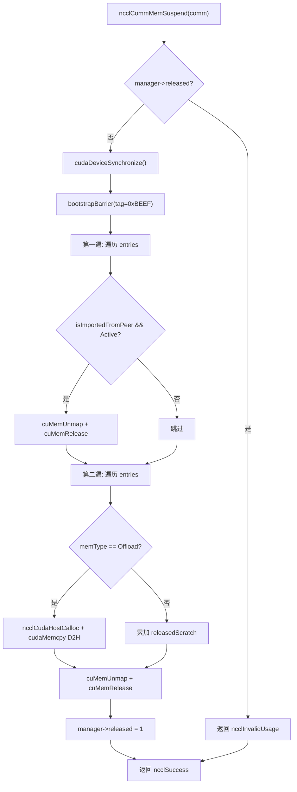
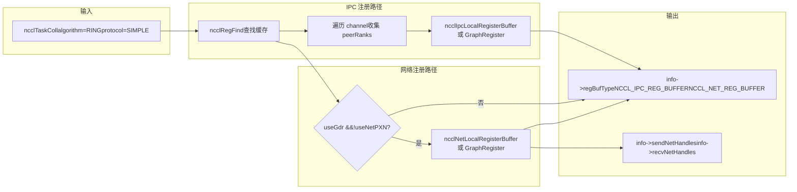
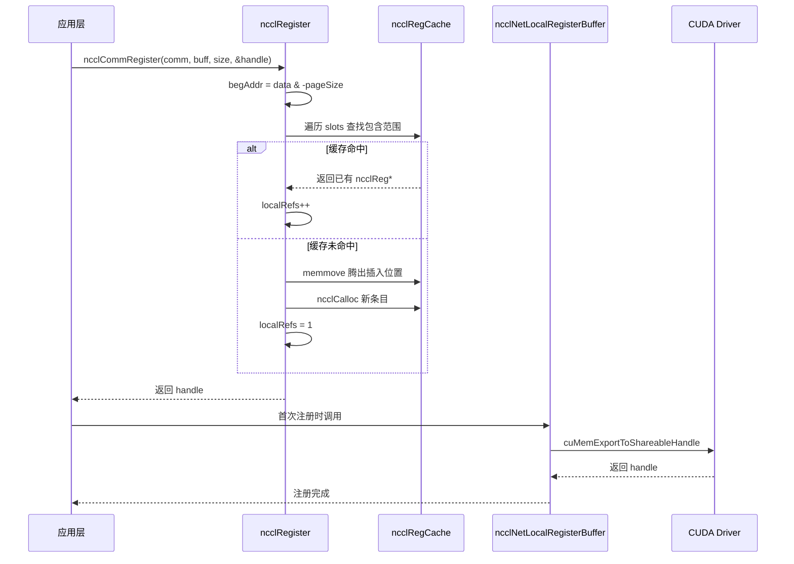

# Chapter 18: Memory Allocation and Device Memory Management: Allocator, Registration Cache, and User-Registered Memory Optimization

In the previous chapter, we saw how the RAS subsystem runs independently of the data plane on the control plane, using hashes for versioning and reference counting to protect object lifetimes. This chapter enters NCCL's third pillar—memory management. The upper bound of communication performance often does not depend on the algorithm itself, but on "whether the data can be directly read and written by the NIC." To this end, NCCL builds a three-layer mechanism: at the bottom layer, it uses`ncclSpace`and`ncclShadowPool`to manage the address space and shadow objects; at the middle layer, it uses`ncclMemManager`to track the import/export and suspend/resume of dynamic memory; at the upper layer, it uses`ncclCommRegister`to register user buffers into the cache, avoiding repeated pinning of memory for every communication. This chapter will dismantle these three mechanisms layer by layer and answer "why NCCL needs to register memory before communication" and "how the registration cache affects performance."

# 18.1 ncclSpace: Slicing the Address Space into Alternating Full/Empty Segments

## Intuitive Model

Imagine an infinitely long line of parking space numbers, starting at 0 and extending to the right. Some spaces have cars parked in them (allocated), while others are empty (unallocated).`ncclSpace`is the "parking space status record book" for this number line—it does not record every space, but only the "boundary points where the status flips." Without it, when managing the virtual address range of symmetric memory, NCCL would have to maintain a flag bit for every byte, making memory overhead proportional to the address space, which is completely unacceptable.

## Data Structure and Memory Layout

`ncclSpace`The definition of  is extremely minimal[FACT:src/include/allocator.h:20-24]：

```c
struct ncclSpace {
  int count;        // cuts[] 中有效元素个数
  int capacity;     // cuts[] 已分配容量
  int64_t* cuts;    // 升序排列的边界点数组
};
```

The core insight is stated very clearly in the source code comments[FACT:src/allocator.cc:151-153]：`cuts[]`splits the non-negative integer axis into alternating "full" and "empty" segments, with cut points arranged in ascending order. The segment after the last cut point must be empty (the unallocated frontier). From this, we can derive the formula for determining whether the`i`th segment is full:

```
isFull(i) = (i%2 != ncuts%2)
```

The meaning of this formula is: the full/empty state of a segment is jointly determined by "the parity of the segment index" and "the parity of the total number of cut points." When`ncuts`is even, segment 0 (before`cuts[0]`) is empty; when`ncuts`is odd, segment 0 is full. This invariant runs through the entire module.

## Step-by-Step Walkthrough: How a Single Allocation Changes cuts[]

Scenario: initially`ncclSpace`is empty (`count=0`), call`ncclSpaceTryAlloc(a, limit=1000, size=100, align=1, &outOffset)`。

**Step 1: Locate the first empty segment** [FACT:src/allocator.cc:209]。`i = a->count % 2`, at this point`count=0`, so`i=0`, and scanning starts from segment 0.

**Step 2: Compute the segment boundaries** [FACT:src/allocator.cc:212-213]。`i==0`when`lo=0`；`i==a->count`when`hi=limit=1000`. So the empty segment is`[0, 1000)`。

**Step 3: Align and check capacity** [FACT:src/allocator.cc:214-215]。`off = alignUp(0, 1) = 0`，`0 + 100 <= 1000`holds, and the allocation succeeds.

**Step 4: Insert cut points** [FACT:src/allocator.cc:217-223]. Because`i==0`(insertion at the head), take the slow path`insertSegment(a, 0, 0, 100)`。`insertSegment`at`index=0`insert two cut points`lo=0, hi=100` [FACT:src/allocator.cc:172-174], then perform "adjacent duplicate value filtering"[FACT:src/allocator.cc:185-203]. The filtering logic is very elegant: it scans with read and write cursors, and when it encounters duplicate values, it moves the write cursor back, deleting duplicate pairs—because a duplicate pair means an empty segment is sandwiched between two full segments and can be merged. But leading zeros are a special case and can be deleted separately[FACT:src/allocator.cc:182-184]。

After allocation`cuts = [0, 100]`，`count=2`. At this point`isFull(0) = (0%2 != 2%2) = false`, segment 0 (`[0,0)`, empty) is empty; segment 1 (`[0,100)`) is full. Correct.

**Step 5: Free** [FACT:src/allocator.cc:239-267]. Call`ncclSpaceFree(a, 0, 100)`. First check whether`cuts[count-1] <= offset`holds[FACT:src/allocator.cc:231-237], that is,`100 <= 0`is false, so continue. Locate the first full segment`i = 1 - count%2 = 1 - 0 = 1` [FACT:src/allocator.cc:246]，`cuts[1]=100 > 0`, so`i=1`。`lo = cuts[0] = 0`，`hi = cuts[1] = 100`. Check`offset < lo || hi < offset+size` [FACT:src/allocator.cc:252]，`0<0`false,`100<100`false, pass. Because`lo==offset`and`offset+size==hi`, neither fast path is satisfied (the first requires`offset+size != hi`, the second requires`lo != offset`), so take the slow path`insertSegment(a, 1, 0, 100)` [FACT:src/allocator.cc:264]. After insertion`cuts = [0, 0, 100, 100]`, and after filtering it becomes`[]`，`count=0`. Back to the initial state.

This "insert then filter" design avoids complex segment merging logic during allocation/free, concentrating the complexity in`insertSegment`in one place.

## Design Considerations and Production Pitfalls

**Why use int64_t instead of size_t?**Because`ncclSpace`manages "offsets" rather than "pointers," offsets may be negative (although this does not happen in actual use), and it needs to match the width of CUDA's`CUdeviceptr`. Using a signed type makes out-of-bounds issues easier to spot during debugging.

**Performance Pitfall**：`ncclSpaceFree`The comment directly states, "This could be binary search, but since allocate is linear there's no point"[FACT:src/allocator.cc:245]. This means both allocation and free are O(n) scans. If a communication domain frequently allocates and frees a large number of small segments,`cuts[]`will grow, and every operation will become slower. In production environments, registered buffers should be reused as much as possible rather than repeatedly registered/unregistered.

**Alignment Overflow Risk**：`alignUp(lo, align)`when`lo`is close to`INT64_MAX`and`align`is large, overflow may occur. The source code does not explicitly check this because`limit`is guaranteed by the caller to be within a reasonable range.

# 18.2 ncclShadowPool: Paired Management of Device Objects and Host Shadows

## Intuitive Model

GPU kernels run on the device and cannot directly access C++ objects in host memory (such as the metadata in`ncclDevComm`).`ncclShadowPool`It acts like a "translator": it allocates a block of device memory for each device-side object, while simultaneously allocating a corresponding "shadow" memory block on the host side, and maintains a "device address → host address" mapping table. When the host needs to modify the configuration of a device object, it first modifies the host shadow, then copies it to the device. Without it, every time a kernel needs to read metadata it would have to pull it from the host via`cudaMemcpy`, resulting in unacceptably high latency.

## Data Structures and Memory Layout

Two core structs[FACT:src/allocator.cc:272-277]：

```c
struct ncclShadowPage {   // 最多 64 个对象的连续块
  struct ncclShadowPage* next;
  int objSize;
  uint64_t freeMask;      // 位图，1=空闲，0=已占用
  void* devObjs;
};
struct ncclShadowObject {
  struct ncclShadowObject* next;
  void* devObj;
  void* hostObj;
  struct ncclShadowPage* page;  // null 表示直接分配在 CUDA mempool
};
```

`ncclShadowPool`itself[FACT:src/include/allocator.h:42-47]：

```c
struct ncclShadowPool {
  int count, hbits;                       // 对象数、哈希位数
  struct ncclShadowObject** table;        // 哈希桶数组
  cudaMemPool_t memPool;                  // 可选的 CUDA 内存池
  struct ncclShadowPage* pages;           // 页链表
};
```

**Key design points:`freeMask`is uint64_t**, so each page holds at most 64 objects. This is not an arbitrary choice—64 bits is exactly the width of a cache line,`popFirstOneBit`and a single`__builtin_ctzll`instruction can be used to find the first free slot without looping.

**Hash Table Growth Strategy**: Source code comment "Maintain 2:1 object:bucket ratio"[FACT:src/allocator.cc:368], meaning it expands when the number of objects exceeds twice the number of buckets. Initial`hbits=4`(16 buckets)[FACT:src/allocator.cc:363], doubling each time.

## Step-by-Step Walkthrough: How a Single Allocation Chooses Between Page or Direct

Scenario:`ncclShadowPoolAlloc(pool, size=1024, &devObj, &hostObj, stream)`。

**Step 1: Lazy initialization** [FACT:src/allocator.cc:347-366]. If`hbits==0`, first query whether the device supports memory pools[FACT:src/allocator.cc:352], and if supported, create`cudaMemPool_t`, set`maxSize`to the parameter`SHADOW_MEMPOOL_MAX_SIZE`(default 1GB)[FACT:src/allocator.cc:359]. Then allocate a hash table with 16 buckets.

**Step 2: Check whether expansion is needed** [FACT:src/allocator.cc:369-386]. If`count+1 > 2<<hbits`, allocate a double-sized bucket array, traverse the old table and reinsert (`hashInsert`using`ncclHashPointer`to compute the bucket index[FACT:src/allocator.cc:333-337]), and free the old table.

**Step 3: Decide whether to take the page path or the direct path** [FACT:src/allocator.cc:390]. The condition is`(64<<10)/size >= 3`, i.e., when`size <= 21845`, take the page path. For`size=1024`，`65536/1024=64 >= 3`, take the page path.

**Step 4: Compute the in-page object size** [FACT:src/allocator.cc:391-392]。`shift = max(0, log2Down(1024)+1-4) = max(0, 10+1-4) = 7`。`pageObjSize = ((1024 + 127) >> 7) << 7 = 1024`. That is, the in-page object size is aligned to a power of 2, rounded up to a multiple of 128 bytes.

**Step 5: Find or create a page** [FACT:src/allocator.cc:393-415]. Traverse the`pool->pages`linked list to find a page with`objSize == pageObjSize`. If none exists, create a new page:`pageSize = min(65536, 64*1024) = 65536`，`freeMask = uint64_t(-1) >> (64 - 65536/1024) = uint64_t(-1) >> 0 = 全 1`(all 64 slots empty)[FACT:src/allocator.cc:400]. Use`cudaMallocFromPoolAsync`or`cudaMalloc`to allocate device memory[FACT:src/allocator.cc:403-404], and`cudaMemsetAsync`zero out[FACT:src/allocator.cc:405]。

**Step 6: Take a slot from the page** [FACT:src/allocator.cc:408-412]。`popFirstOneBit(&page->freeMask)`to find the first free bit,`devObj = page->devObjs + slot * pageObjSize`. If`freeMask`becomes 0 (page full), remove the page from the free list[FACT:src/allocator.cc:411]。

**Step 7: Allocate the host shadow object** [FACT:src/allocator.cc:423-428]。`malloc(sizeof(ncclShadowObject) + alignof(max_align_t)-1 + size)`, note that here extra`alignof(max_align_t)-1`bytes are allocated for alignment padding.`hostObj = alignUp((char*)(obj+1), alignof(max_align_t))`, i.e., after the object header, align to the maximum alignment boundary. Then`memset(hostObj, 0, size)`zero out.

**Step 8: Insert into the hash table and update the count** [FACT:src/allocator.cc:429-430]。

## Concurrency Control and Hardware Interaction

`ncclShadowPool`itself**has no lock**. This means it can only be used in a single-threaded context, or mutual exclusion must be guaranteed by the caller. From NCCL's actual usage, it is mainly called during the communication domain initialization phase, which is single-threaded.

`cudaMallocFromPoolAsync`and`cudaFreeAsync`are asynchronous operations, relying on the`stream`parameter to guarantee ordering[FACT:src/allocator.cc:403,459]。`ncclShadowPoolDestruct`is called after all resources are released`cudaStreamSynchronize(stream)` [FACT:src/allocator.cc:333-337], ensuring that all asynchronous frees complete before destroying the memory pool.

## Production Pitfall Guide

**Pitfall 1: Memory waste caused by in-page object size alignment**。`pageObjSize`is aligned to a power of 2; if`size=1000`，`shift = log2Down(1000)+1-4 = 9+1-4 = 6`，`pageObjSize = ((1000+63)>>6)<<6 = 1024`. Each object wastes 24 bytes, and 64 objects in a page waste 1536 bytes. For a large number of small objects, this overhead cannot be ignored.

**Pitfall 2:`ncclShadowPoolFree`Behavior when an object cannot be found** [FACT:src/allocator.cc:442-445]. It returns`ncclInternalError`and prints a warning, but**does not release any resources**. If the caller ignores the return value, it will cause a memory leak. Production code must check the return value.

**Pitfall 3:`ncclShadowPoolDestruct`In`freeMask==0`, a page with** [FACT:src/allocator.cc:301-306]is reclaimed`freeMask`. Note that here`pool->pages`is set to 1 (rather than all 1s), meaning only the first slot is marked as free. This is to put the "full page" back into the

# linked list, but the other slots in the page are still occupied—in fact, these objects are about to be released, so this operation is safe. However, if there is concurrent access during destruction, an inconsistent state will be read.

## 18.3 ncclMemManager: Reference Counting and Suspend/Resume for Dynamic Memory

Intuitive Model`ncclMemManager`Training tasks may run for days, during which the GPU may be preempted by other tasks, or checkpoints may need to be taken.

## It acts like a "memory steward": it records all dynamically allocated memory (scratch/offload), and when needed "suspends" GPU memory (unmaps physical pages, retains virtual addresses), backs up the data to the CPU, and upon resumption reallocates physical pages, remaps, and restores the data. Without it, after a task is preempted it can only start over from the beginning, wasting hours of training progress.

`ncclMemManager`Data Structures and Memory Layout[FACT:src/mem_manager.cc:32-60]：

| Core fields of | (inferred from the initialization code) | Field |
| --- | --- | --- |
| `entries` | `ncclDynMemEntry*` | Type |
| `numEntries` | `int` | Meaning |
| `released` | `int` | Head of the dynamic memory entry linked list |
| `refCount` | `int` | Linked list length |
| `totalPersist` | `size_t` | 0=active, 1=suspended |
| `totalScratch` | `size_t` | Reference count (multiple comms can share) |
| `totalOffload` | `size_t` | Total persistent memory (atomic) |
| `cpuBackupUsage` | `size_t` | Total scratch memory (atomic) |
| `lock` | `std::mutex` | Total offload memory (atomic) |
| `initialized` | `int` | Total CPU backup memory |

**Protects the entries linked list**：`lock`Atomic flag to prevent accessing a destroyed mutex`std::mutex`Key design of the memory layout`ncclMemManager`is a`ncclCalloc`, but[FACT:src/mem_manager.cc:39]is allocated with`~mutex()` [FACT:src/mem_manager.cc:120](C style), so placement new must be used to explicitly construct

**, and**must be explicitly called during destruction. This is a classic pitfall of mixed C/C++ programming.`totalPersist`Division of labor between atomic variables and locks`entries`: Statistical fields (`lock`, etc.) are updated with atomic operations and do not need locks;`ncclCommMemStats`the linked list is protected by[FACT:src/mem_manager.cc:1117-1130]. In this way, statistical queries (

## Step-by-Step Walkthrough: The Complete Suspend and Resume Flow

**Suspend Flow** `ncclCommMemSuspend` [FACT:src/mem_manager.cc:418-540]：

**Step 1: Pre-checks** [FACT:src/mem_manager.cc:419-430]. Check whether the memory manager is disabled, whether comm is empty, and whether it is already suspended.

**Step 2: Device Synchronization and Barrier** [FACT:src/mem_manager.cc:440-441]。`cudaDeviceSynchronize()`Ensure all GPU operations are complete, then`bootstrapBarrier`Ensure all ranks are synchronized. The barrier tag is`0xBEEF`。

**Step 3: First Pass — Unmap All Peer-Imported Buffers** [FACT:src/mem_manager.cc:444-465]. For each`isImportedFromPeer && state==Active`entry, call`cuMemUnmap`to unmap[FACT:src/mem_manager.cc:451], release the handle[FACT:src/mem_manager.cc:456], and change the state to`Released`。

**Step 4: Second Pass — Offload Local Memory** [FACT:src/mem_manager.cc:468-526]. Skip peer-imported and already-released entries. For`ncclMemOffload`type, first allocate a CPU backup[FACT:src/mem_manager.cc:484], then`cudaMemcpy`copy from GPU to CPU[FACT:src/mem_manager.cc:492]. For`ncclMemScratch`type, only accumulate statistics. Then close the shareable FD[FACT:src/mem_manager.cc:508-513]，`cuMemUnmap` [FACT:src/mem_manager.cc:516]，`cuMemRelease` [FACT:src/mem_manager.cc:519], and change the state to`Released`。

**Step 5: Mark as Suspended** [FACT:src/mem_manager.cc:528]。

**Resume Flow** `ncclCommMemResume` [FACT:src/mem_manager.cc:550-942]：

**Step 1: Restore Local Memory** [FACT:src/mem_manager.cc:577-668]. For each`!isImportedFromPeer && state==Released`entry, re-`cuMemCreate` [FACT:src/mem_manager.cc:599]，`ncclCuMemMapAndSetAccess`map to the same virtual address[FACT:src/mem_manager.cc:602], restore peer access permissions[FACT:src/mem_manager.cc:610-626], restore data from the CPU backup for offload types[FACT:src/mem_manager.cc:632-643], and re-export the FABRIC handle[FACT:src/mem_manager.cc:646-658]。

**Step 2: Barrier Synchronization** [FACT:src/mem_manager.cc:671-679]. The tag is still`0xBEEF`。

**Step 3: Exchange New Handle Information** [FACT:src/mem_manager.cc:688-816]. Count how many local buffers each rank needs to broadcast[FACT:src/mem_manager.cc:689-696], use`bootstrapAllGather`to exchange counts[FACT:src/mem_manager.cc:710], compute offsets[FACT:src/mem_manager.cc:724-728], then first`bootstrapSend`then`bootstrapRecv`(the comment explicitly states "send first, then receive to avoid deadlock"[FACT:src/mem_manager.cc:783]）。

**Step 4: Re-import Peer Buffers** [FACT:src/mem_manager.cc:822-911]. For each`isImportedFromPeer && state==Released`entry, look up the matching handle information in the exchange results[FACT:src/mem_manager.cc:829-835]. For POSIX FD type, check whether hostHash is the same[FACT:src/mem_manager.cc:853-859], then obtain the FD through the proxy[FACT:src/mem_manager.cc:866]，`cuMemImportFromShareableHandle`import[FACT:src/mem_manager.cc:873]. For FABRIC type, import directly[FACT:src/mem_manager.cc:878]. Then`ncclCuMemMapAndSetAccess`remap[FACT:src/mem_manager.cc:893]。

**Step 5: Final Barrier** [FACT:src/mem_manager.cc:916-928]. The tag is`0xCAFE`, distinguished from the earlier`0xBEEF`.

## Concurrency Control and Hardware Interaction

**Reference Counting Protects the Lifecycle**：`ncclMemManagerDestroy`First decrement`refCount` [FACT:src/mem_manager.cc:76], and if it is still greater than 0, only clear the pointer for the current comm[FACT:src/mem_manager.cc:81], without releasing resources. This allows multiple comms to share the same memory manager (such as in the split_share scenario).

**Atomic initialized Flag**: Check before all operations`COMPILER_ATOMIC_LOAD(&manager->initialized, memory_order_acquire)` [FACT:src/mem_manager.cc:136,242,338,358], to prevent accessing a destroyed mutex. During destruction, use`memory_order_release`to store 0[FACT:src/mem_manager.cc:87], ensuring that previous write operations are visible to other threads.

**Use of the CUDA VMM API**：`cuMemCreate`/`cuMemMap`/`cuMemUnmap`/`cuMemRelease`is the CUDA virtual memory management API, which allows physical memory and virtual addresses to be separated. This is the foundation of suspend/resume — during suspend, unmap the physical pages but retain the virtual addresses; during resume, remap to the same virtual addresses, so that all established pointer relationships do not need to be modified.

## Production Pitfall Guide

**Pitfall 1: The split_share communication domain does not support suspend** [FACT:src/mem_manager.cc:1014-1018]. If`refCount > 1`, directly return`ncclInvalidUsage`. Because when multiple comms share a memory manager, suspending one comm will affect the memory of other comms.

**Pitfall 2: POSIX FD becomes invalid across nodes** [FACT:src/mem_manager.cc:853-859]. POSIX file descriptors are only valid within the same node, and must be skipped when resuming across nodes. The source code uses`hostHash`comparison to determine whether they are on the same node.

**Pitfall 3: Keep the backup when offload data restoration fails** [FACT:src/mem_manager.cc:635]. If`cudaMemcpy`restoring from CPU to GPU fails, the source code prints a warning and keeps`cpuBackup`, without releasing it. This is to give the caller a chance to retry, but if no retry occurs, CPU memory will leak.

**Pitfall 4:`ncclMemUntrackDynamic`use-after-free risk in**. The source code finds the entry while holding the lock, saves the necessary information, releases the entry[FACT:src/mem_manager.cc:302], and then updates statistics outside the lock[FACT:src/mem_manager.cc:311-327]. This order is correct, but if the`info`pointer points to the caller's stack memory and the caller reads it outside the lock, you need to ensure that`info`'s lifetime covers the entire function.



The figure above shows the control flow of the suspend process. Note two key branches: the first pass only handles peer-imported buffers, and the second pass only handles local buffers. The order cannot be reversed — you must first release references to peer memory, and then release local memory.

# 18.4 Registration Cache: How ncclRegister Avoids Repeated Pinning

## Intuitive Model

For the NIC to directly read and write GPU memory (GPUDirect RDMA), the memory must first be "registered" — telling the NIC "you can directly access this address." The registration process involves pinning pages and establishing IOMMU mappings, and is very expensive (millisecond-level). If re-registration happens on every AllReduce, the latency of small-message communication will be completely overwhelmed by registration overhead.`ncclRegister`is a "registration cache": it records already-registered address ranges in an ordered array, and the next time it encounters the same or a contained buffer, it directly reuses it without re-registering.

## Data Structure and Memory Layout

`ncclRegCache`The core of`slots`is an ordered array`ncclReg*`。`ncclReg`, where each element is

| 's key fields (inferred from usage): | Field | Type |
| --- | --- | --- |
| `begAddr` | `uintptr_t` | Meaning |
| `endAddr` | `uintptr_t` | Page-aligned start address |
| `localRefs` | `int` | Page-aligned end address |
| `graphRefs` | `int` | Local reference count |
| `state` | `int` | Graph reference count |
| `netHandleHead` | `ncclRegNetHandles*` | Registration state bits (NET/NVLS/COLLNET/IPC) |
| `ipcInfos` | `ncclIpcInfo**` | IPC information array |

**Page alignment**：`begAddr = (uintptr_t)data & -pageSize` [FACT:src/register/register.cc:31]，`endAddr = ((uintptr_t)data + size + pageSize - 1) & -pageSize` [FACT:src/register/register.cc:32]。`-pageSize`is`pageSize`'s two's complement, equivalent to "rounding down to a multiple of pageSize". The reason for this is: the minimum granularity of registration is a page, so even if only 1 byte is registered, the entire page must be registered.

## Step-by-Step Walkthrough: How a single registration hits the cache

Scenario:`ncclCommRegister(comm, buff=0x7f0000001000, size=4096, &handle)`。

**Step 1: Parameter check and page alignment** [FACT:src/register/register.cc:18-24]。`CommCheck`Validate comm validity. Assume`pageSize=4096`，`begAddr = 0x7f0000001000 & -4096 = 0x7f0000001000`，`endAddr = (0x7f0000001000 + 4096 + 4095) & -4096 = 0x7f0000002000`。

**Step 2: System memory check** [FACT:src/register/register.cc:36-64]. If`ncclCuMemEnable()`, query the address range and memory type. If`memType == CU_MEMORYTYPE_HOST`, it indicates CPU memory, skip registration[FACT:src/register/register.cc:58-61]. Otherwise check whether there is a Sysmem segment[FACT:src/register/register.cc:50-55]。

**Step 3: Traverse the cache to find the insertion position** [FACT:src/register/register.cc:66-89]. Loop`slot`starting from 0:

- If`slot == population`(reached the end) or`begAddr < slots[slot]->begAddr`(the current address is before the cache entry), it indicates a new entry needs to be created[FACT:src/register/register.cc:67]。
- If`slots[slot]->begAddr <= begAddr && slots[slot]->endAddr >= endAddr`, it indicates the current buffer is fully contained by an existing entry, directly increment the reference count[FACT:src/register/register.cc:83-87]。

**Step 4: Create a new entry** [FACT:src/register/register.cc:68-82]. If the cache is full, expand it (initially 32, then double)[FACT:src/register/register.cc:70]. Use`memmove`at`slot`position to make room[FACT:src/register/register.cc:73]，`ncclCalloc`allocate a new entry[FACT:src/register/register.cc:74], set`begAddr`/`endAddr`, according to`isGraph`set`graphRefs`or`localRefs`to 1[FACT:src/register/register.cc:78-79]，`population++`, return handle.

**Step 5: Deregistration** [FACT:src/register/register.cc:172-195]。`commDeregister`First find the slot corresponding to the handle[FACT:src/register/register.cc:180], decrement the reference count[FACT:src/register/register.cc:185-186]. If there are still references, return directly[FACT:src/register/register.cc:187]. Otherwise call`regCleanup`to clean up all underlying registrations[FACT:src/register/register.cc:188], free the entry, use`memmove`to fill the hole[FACT:src/register/register.cc:190]，`population--`。

## Design considerations and production pitfalls

**Why use a sorted array instead of a hash table?**Because registration queries are "range containment" queries, not exact matches. A sorted array supports binary search (although the source code uses linear scan), and has good memory locality. A hash table cannot efficiently handle queries like "is this address contained by some larger range".

**`regCleanup`Status bit design of** [FACT:src/register/register.cc:95-134]。`state`is a bitmask, where each bit corresponds to a registration type (NET/NVLS/COLLNET/IPC). During cleanup, check bit by bit and only clean up completed registrations. This design allows partial registration success and partial failure—for example, network registration succeeds but IPC registration fails, and cleanup only cleans up the network part.

**Production pitfall: the registration cache is unaware of memory release**. If the user registers a buffer and then, without deregistering,`cudaFree`it, the cache still retains this entry. The next allocation may reuse the same address, causing a cache hit but the actual memory is already invalid. NCCL's convention is: registration and deregistration must be paired, and the user is responsible for ensuring the memory is not freed during registration.

**`ncclCommRegister`Skip conditions of** [FACT:src/register/register.cc:150-159]. If`LocalRegister=0`or`P2pUsesMemcpy=1`, directly return`NULL`handle. This means that under certain configurations (such as P2P using memcpy instead of RDMA), registration is completely skipped. The caller must check whether the handle is NULL.

# 18.5 Collective communication registration: how coll_reg chooses registration strategies for different algorithms

## Intuitive model

Different collective communication algorithms take different transport paths: NVLS uses NVLink SHARP, Ring uses P2P or the network, and Tree uses a tree topology. Each path requires a different registration method: NVLS needs to be registered with NVLS hardware, the network needs to be registered with the NIC, and IPC needs to be registered with the peer GPU.`coll_reg.cc`is the "registration strategy router": it decides which registration functions to call based on the algorithm, protocol, and buffer type. Without it, each algorithm would have to implement registration logic itself, resulting in duplicated code and being error-prone.

## Step-by-Step Walkthrough: Registration decision for the Ring algorithm

Scenario:`ncclRegisterCollBuffers(comm, info, outRegBufSend, outRegBufRecv, cleanupQueue, regNeedConnect)`, where`info->algorithm == NCCL_ALGO_RING`，`info->protocol == NCCL_PROTO_SIMPLE`。

**Step 1: Pre-checks** [FACT:src/register/coll_reg.cc:155-157]. Set`regBufType = NCCL_REGULAR_BUFFER`，`regNeedConnect = true`. If`LocalRegister=0`and it is not persistent graph registration, exit directly.

**Step 2: Enter the Ring branch** [FACT:src/register/coll_reg.cc:338]. Initialize`recvRegRecord`/`sendRegRecord`to NULL, allocate`sendNetConns`/`sendNetHandles`/`recvNetConns`/`recvNetHandles`/`srecvNetHandles`array[FACT:src/register/coll_reg.cc:356-360]。

**Step 3: Find existing registration records** [FACT:src/register/coll_reg.cc:351-355]。`ncclRegFind`Search the cache for recv/send buffers. If recv is not found and it is not persistent graph registration, exit[FACT:src/register/coll_reg.cc:352]. If cross-node and send is not found and it is not persistent graph registration, exit[FACT:src/register/coll_reg.cc:354]。

**Step 4: Traverse all channels to collect peers** [FACT:src/register/coll_reg.cc:362-393]. For each channel, check`ring.prev`and`ring.next`. If the connection flag contains`NCCL_DIRECT_NIC`, record it to`recvNetConns`/`sendNetConns` [FACT:src/register/coll_reg.cc:370-379]. If it contains`NCCL_P2P_READ | NCCL_P2P_WRITE`, add the peer to`peerRanks`array[FACT:src/register/coll_reg.cc:382-391]。

**Step 5: IPC registration** [FACT:src/register/coll_reg.cc:394-407]. If`nPeers > 0 && comm->isAllDirectP2p`, first try graph registration[FACT:src/register/coll_reg.cc:395-399], and if it fails, try local registration[FACT:src/register/coll_reg.cc:400-403]. If successful, set`regBufType = NCCL_IPC_REG_BUFFER` [FACT:src/register/coll_reg.cc:406]。

**Step 6: Network registration** [FACT:src/register/coll_reg.cc:409-457]. Check`!comm->useNetPXN && comm->useGdr && netDeviceType != UNPACK`and not AllReduce's PreMulSum/SumPostDiv[FACT:src/register/coll_reg.cc:415-418]. First try graph registration[FACT:src/register/coll_reg.cc:419-430], and if it fails, local registration[FACT:src/register/coll_reg.cc:431-442]. If successful, set`regBufType |= NCCL_NET_REG_BUFFER`, save the handle array[FACT:src/register/coll_reg.cc:445-452]。

**Step 7: Adjust the number of channels** [FACT:src/register/coll_reg.cc:551-554]. If only IPC registration exists and it is single-node and the number of channels is between 17-24, reduce it to 16. This is to match the bandwidth characteristics after IPC registration.

## Design considerations and production pitfalls

**Why are the registration orders of NVLS and Ring opposite?**The NVLS branch first tries graph registration and then local registration[FACT:src/register/coll_reg.cc:86-94], while the Ring branch first does local and then graph[FACT:src/register/coll_reg.cc:395-403]. This is because NVLS graph registration is more likely to succeed (NVLS hardware has optimizations for persistent buffers), while Ring local registration is more lightweight.

**`isMloPartBufRdmaCapable`Global decision of** [FACT:src/register/coll_reg.cc:14-37]. The comment emphasizes "Registration decision must be global, using communicator-wide guarantees"[FACT:src/register/coll_reg.cc:20]. This means that even if a certain rank's buffer supports RDMA, as long as one rank within the communication domain does not support it, the entire communication domain will not register. This is to avoid inconsistency caused by some ranks registering and others not registering.

**Production pitfall: Silent degradation when registration fails**。`ncclRegisterCollBuffers`When registration fails, no error is reported; it simply does not set`regBufType`the corresponding bit. This means communication can still work, just with degraded performance. In production environments, if performance does not meet expectations, you should check`NCCL_REG`the logs to confirm whether registration succeeded.



The above diagram shows two parallel registration paths under the Ring algorithm: the IPC path handles same-node P2P connections, and the network path handles cross-node RDMA connections. The two paths execute independently and ultimately both converge to`info->regBufType`。

# 18.6 Production Pitfall Avoidance and Failure Recovery Chain

## Pitfall 1: Interaction between registration cache and memory pool

When using`ncclMemAlloc`to allocate memory, the underlying implementation goes through the CUDA VMM API[FACT:src/allocator.cc:38-94]. The physical memory created by this allocation method carries the`gpuDirectRDMACapable`flag[FACT:src/allocator.cc:54], meaning it natively supports RDMA. But when`ncclMemFree`releases it, if the memory manager has already been destroyed, it will go through the`cudaFree`fallback path[FACT:src/allocator.cc:130-132]. This may cause VMM-allocated memory to be incorrectly freed with`cudaFree`. In production environments, you must ensure that`ncclMemAlloc`/`ncclMemFree`are used in pairs, and do not release after the memory manager has been destroyed.

## Pitfall 2: Communication requests during suspension

`ncclCommMemSuspend`During execution, what happens if new communication requests arrive? The source code calls`cudaDeviceSynchronize()` [FACT:src/mem_manager.cc:440]before suspension to ensure all queued GPU operations complete. However, if host-side communication requests are being enqueued, there is no explicit protection. In production environments, you should stop all communication threads before suspension, or use group semantics to ensure suspension operations are serialized with other operations.

## Pitfall 3: Compatibility of FABRIC handle

`ncclMemAlloc`On CUDA 12.3+, it will attempt to use FABRIC handle[FACT:src/allocator.cc:60-71]. If`cuMemCreate`returns`CUDA_ERROR_NOT_PERMITTED`or`CUDA_ERROR_NOT_SUPPORTED`, it will fall back to POSIX FD[FACT:src/allocator.cc:63-65]. But during recovery, if the handle type is FABRIC but export fails, it will directly report an error and unmap[FACT:src/mem_manager.cc:649-655]. This means that in mixed environments (some GPUs support FABRIC, some do not), suspend/resume may fail.

## Pitfall 4: Reference count leak

`ncclRegister`Each cache hit increments the reference count[FACT:src/register/register.cc:84-85]. If the caller registers N times but only deregisters M times (M < N), the reference count will never reach zero,`regCleanup`will never be called, and the underlying registration resources will leak. Production code must strictly pair`ncclCommRegister`/`ncclCommDeregister`。



# Chapter Review and Self-Test

Q1: If the`ncclSpaceFree`in`if (a->count == 0 || a->cuts[a->count - 1] <= offset)`check[FACT:src/allocator.cc:231-237]is removed, under what scenarios would out-of-bounds access be triggered?

**Reference analysis**: This check has two purposes. First,`a->count == 0`prevents empty array access`cuts[-1]`. Second,`a->cuts[a->count-1] <= offset`prevents`offset`from exceeding the allocated range. If removed, when`count == 0`,`a->cuts[a->count - 1]`will read`cuts[-1]`, which is undefined behavior and may read heap metadata or trigger a segmentation fault. More subtly, even if`count > 0`, if`offset`is greater than the last split point, the subsequent`while (a->cuts[i] <= offset) i += 2`loop[FACT:src/allocator.cc:247]will keep incrementing`i`until out of bounds, because`cuts[]`does not contain any element greater than`offset`. The triggering scenario in production is: the caller passes in an offset that was never allocated (for example, calling free again after the buffer has been externally released), or`ncclSpace`is concurrently modified causing inconsistent state. The fix is to keep this check and print`offset`and`count`when returning an error for easier troubleshooting.

Q2: `ncclMemManagerDestroy`In`refCount`, if[FACT:src/mem_manager.cc:78-83]is still greater than 0 after decrementing, only the current comm's pointer is cleared without releasing resources`ncclMemTrack`. If at this time another comm is calling

**, what will happen?**：`ncclMemTrack`Reference analysis`manager->initialized` [FACT:src/mem_manager.cc:136]First checks`refCount > 0`. Since`initialized = 0`does not set`manager->lock`, the check passes. Then it will acquire`entries`and modify the[FACT:src/mem_manager.cc:188-192]linked list`refCount > 0`. This is safe because`ncclMemManagerDestroy`means at least one comm still holds a reference, and the memory manager will not be destroyed. The real risk is: if the last comm calls`refCount`,`initialized = 0` [FACT:src/mem_manager.cc:87]decrements to 0, it will set`ncclMemTrack`and release all resources. If at this time another thread is in`initialized`and has already passed the`manager->lock`check but has not yet acquired the lock, it will access the already-freed`memory_order_acquire`/`release`, causing use-after-free. The source code mitigates this problem through

pairing, but strictly speaking there is still a race window. In production environments, you should ensure all communication threads have stopped before destroying the memory manager.`ncclCommMemResume`Q3: In[FACT:src/mem_manager.cc:853-859], POSIX FD type peer buffers are skipped when crossing nodes`restoredPeerCount`. If all peer buffers are skipped,`manager->released`is 0, but[FACT:src/mem_manager.cc:913]is still set to 0

**. What consequences will this cause?**：`manager->released = 0`Reference analysis`state`indicates that the memory manager considers recovery complete. But if peer buffers were skipped, their`ncclDynMemStateReleased`，`handle`is still`ncclCommMemStats`is still 0. If subsequent communication accesses these buffers, it will trigger a CUDA error (accessing unmapped virtual addresses). More seriously,`ncclStatGpuMemSuspended`querying[FACT:src/mem_manager.cc:1130]will return 0 (active)`entries`In this case, the correct approach is to mark cross-node POSIX FD entries as unrecoverable at suspend time, or to return an error at resume time rather than silently skipping them. In production, if POSIX FD is used across nodes, FABRIC handles should be used instead, or suspend/resume should be ensured to occur only within a single node.

Memory management is the invisible pillar of NCCL performance:`ncclSpace`It uses a minimalist split-point array to manage the address space,`ncclShadowPool`uses a 64-bit bitmap and hash table to manage device/host object pairing,`ncclMemManager`uses reference counting and the CUDA VMM API to implement suspend/resume,`ncclRegister`and uses a sorted array to cache registration results and avoid repeated pinning. These four layers of mechanisms together support the key performance guarantee that "memory does not need to be re-registered before communication." In the next chapter, we will move on to the device-side communicator and ABI compatibility, and see`devcomm`how these host-side memory layouts are mapped into structures accessible to GPU kernels.

The figure above shows the registration timing: on a cache hit, only the reference count is incremented and the underlying registration is not called; only on a cache miss is a new entry created and the underlying registration triggered. At this point, the host-side memory management mechanism is already clear. But communication ultimately happens on the GPU, and the kernel needs direct access to the peer rank's address and connection state. The next chapter will move on to the device-side communicator and ABI compatibility, to see how devcomm maps the metadata of the host-side ncclComm into structures accessible on the device side, and how the versioned ABI ensures compatibility between old and new kernels and the library.
