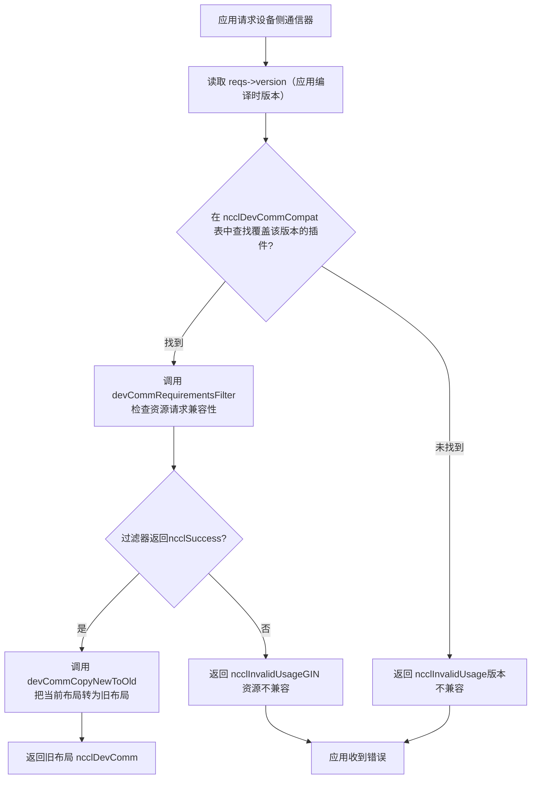
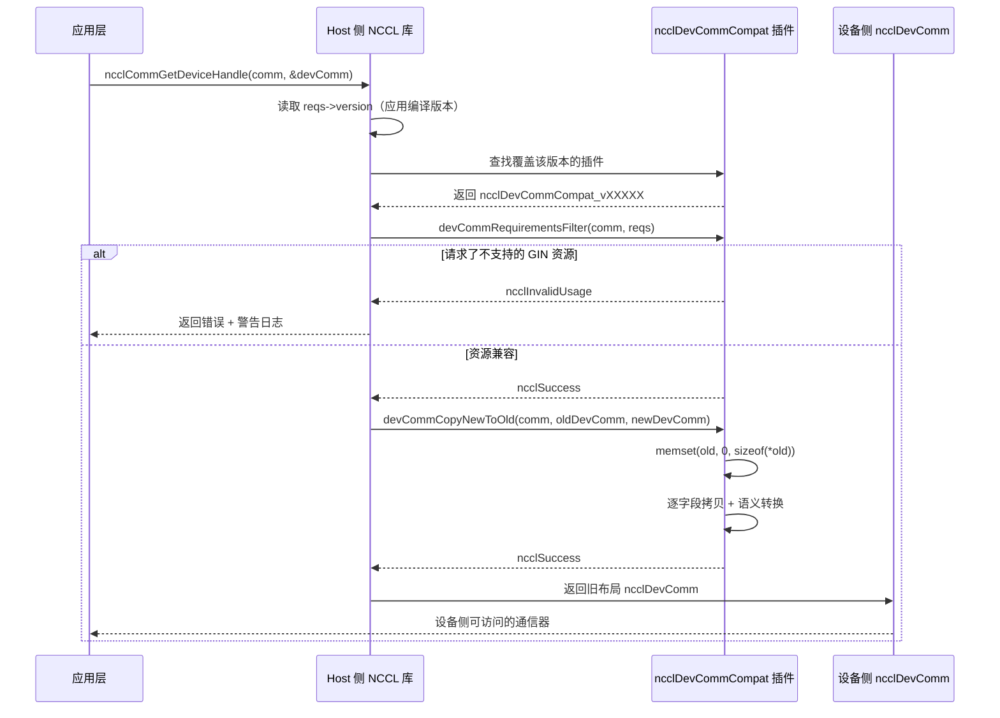

# Chapter 19: Device-side communication domain and ABI compatibility: the communication contract between devcomm and kernel

In the previous chapter, we saw that the host-side ncclMemManager uses reference counting and the CUDA VMM API to manage the lifecycle of communication buffers. But the place where communication actually happens is the GPU kernel—threads in the kernel need to know: which rank am I? At which virtual address is the peer rank's buffer? Is the connection ready? This information is in the host-side ncclComm structure, but the kernel cannot directly dereference host pointers. If NCCL made the kernel obtain this metadata through parameter passing or global memory queries every time, then every communication would incur extra latency and bandwidth overhead. Worse, once kernel code is compiled, the field offsets it accesses are fixed—if the layout of ncclComm changes after a library upgrade, the old kernel will read incorrect data. This is the core problem that devcomm must solve: map the key metadata of the host-side communication domain, with a stable, versioned memory layout, into structures accessible on the device side. The files devcomm_v22902.cc, devcomm_v22907.cc, devcomm_v23000.cc, and devcomm_v23100.cc under the src/devcomm directory are the concrete implementations of this versioned ABI. Each file corresponds to a NCCL version range, defines the exact memory layout of ncclDevComm within that range, and specifies the field-copying logic between old and new versions. This chapter will break down in turn: what the core data structures of the device-side communicator look like, how the registration and matching mechanism of the versioned ABI works, how field-level conversion is performed between old and new versions, and the boundaries and pitfalls of this mechanism in production environments.

# I. Core structure of the device-side communicator: the memory layout of ncclDevComm

## Intuitive model

Think of`ncclDevComm`as a "workstation card": when each GPU kernel starts, it receives a card printed with "you are rank 3, there are 8 ranks in total, there are 4 ranks in your LSA group, and the peer buffer base address is at 0x7f...". This card must be small enough (to fit into kernel parameters), and it must contain all key information. If this card did not exist, the kernel could only rely on repeatedly passing parameters from the host side and reassembling them for every communication—high latency and error-prone.

## Data structures and memory layout

Taking`ncclDevComm_v23000`as an example, its complete definition is in[FACT:src/devcomm/devcomm_v23000.cc:25-62]：

```c
struct ncclDevComm_v23000 {
  unsigned int magic;          // 偏移 0，魔数校验
  unsigned int version;        // 偏移 4，版本号

  int rank, nRanks;            // 偏移 8, 12
  uint32_t nRanks_rcp32;       // 偏移 16，nRanks 的倒数（定点数）
  int lsaRank, lsaSize;        // 偏移 20, 24
  uint32_t lsaSize_rcp32;      // 偏移 28

  ncclDevCommWindowTable_t windowTable;  // 偏移 32
  ncclWindow_t resourceWindow;           // 偏移 40
  ncclResourceWindow_vidmem_v23000_t resourceWindow_inlined;  // 偏移 48
  ncclGinBarrierHandle_t hybridWorldGinBarrier;  // 偏移 112
  ...
};
```

[FACT:src/devcomm/devcomm_v23000.cc:64-93]It uses a series of`static_assert`to pin down the offset of each field. This is not decoration—it is a compile-time contract for ABI compatibility. If the offset of a field moves because of a change in the compiler's alignment strategy, compilation will fail, rather than producing hard-to-debug memory misalignment at runtime.

The design motivations for several key fields:

> **[Design Inference & Architectural Trade-offs]**
> **`nRanks_rcp32`and`lsaSize_rcp32`**: this is`nRanks`and`lsaSize`The reciprocal of , represented as a 32-bit fixed-point number. When the kernel performs the division operation for rank-to-buffer offset, the GPU's integer division is very slow, and using multiplication by the reciprocal followed by a shift can significantly speed it up. This is a classic case of "trading space for time" — storing 4 extra bytes to save dozens of clock cycles per division.

**`resourceWindow_inlined`**: This is an inline window descriptor, of type`ncclResourceWindow_vidmem_v23000_t`. Note[FACT:src/devcomm/devcomm_v23000.cc:11-18]its definition in :

```c
typedef struct ncclResourceWindow_vidmem_v23000 {
  char reserved1[8];
  char* lsaFlatBase;
  char reserved2[8];
  uint32_t stride4G;
  uint32_t mcOffset4K;
  char reserved3[32];  // NOTE: shrunk from 40 in 2.30u1 to reclaim 8 bytes
} ncclResourceWindow_vidmem_v23000_t;
```

Here`reserved1`、`reserved2`、`reserved3`is a**padding field**, used as a placeholder. Why is padding needed? Because`ncclDevComm_v23000`'s layout must maintain consistent offsets with a certain "baseline version." Even if some fields are no longer used in the current version, placeholders must be retained to keep the offsets of subsequent fields unchanged.[FACT:src/devcomm/devcomm_v23000.cc:11-18]'s comment explicitly states: 2.30u1 shrinks`reserved3`from 40 bytes to 32 bytes, freeing up 8 bytes for`hybridWorldGinBarrier`. This is a**layout rearrangement**— by shrinking the padding area, new fields are inserted without changing the overall size.

[FACT:src/devcomm/devcomm_v23000.cc:11-18]'s`static_assert`further verifies:`lsaFlatBase`、`stride4G`、`mcOffset4K`The offsets of the three fields must match the "current version's"`ncclWindow_vidmem`, and the entire struct size is 64 bytes. This means`resourceWindow_inlined`is**binary-compatible**between v23000 and the current version — it can be directly memcpy'd.

## The family of versioned structs

Comparing`ncclDevComm_v22902` [FACT:src/devcomm/devcomm_v22902.cc:38-62]and`ncclDevComm_v22907` [FACT:src/devcomm/devcomm_v22907.cc:13-41], we can see the evolution of fields:

| Field | v22902 | v22907 | v23000 |
| --- | --- | --- | --- |
| `magic`/`version` | None | None | Yes (offset 0/4) |
| `ginContextCount` | uint8_t | uint32_t | uint32_t |
| `ginNetDeviceTypes` | `[4]` | `[NCCL_GIN_MAX_CONNECTIONS]` | `[NCCL_GIN_MAX_CONNECTIONS]` |
| `ginIsRailed` | None | bool | Split into`ginConnectionsRailed` + `ginContextsRailed` |
| `hybridWorldGinBarrier` | None | None | Yes (offset 112) |
| Struct size | 200 | 224 | 240 |

> **[Design Inference & Architectural Trade-offs]**
> This evolution path reveals NCCL's versioning strategy:**only add fields when necessary, and make use of padding areas as much as possible**. From v22902 to v22907,`ginSignalBase`、`ginCounterBase`、`ginContextBase`、`ginIsRailed`and other GIN-related fields were added; from v22907 to v23000,`magic`/`version`validation fields and`hybridWorldGinBarrier`were added, while`ginIsRailed`was split into two more precise flag bits.

---

# II. Registration and matching of versioned ABI: the ncclDevCommCompat struct

## Intuitive model

Think of the versioned ABI as a set of "translation plugins": when an application is compiled with NCCL 2.29.2 but linked at runtime against the 2.31.0 library, the library needs to know "what kind of`ncclDevComm`layout the 2.29.2 kernel expects," and then translate the current version's`ncclDevComm`into the old layout. Each version range corresponds to a translation plugin, registered in a global table.

## Core struct: ncclDevCommCompat

At the end of each`devcomm_vXXXXX.cc`file, a`ncclDevCommCompat`struct is defined. Taking v23000 as an example[FACT:src/devcomm/devcomm_v23000.cc:192-199]：

```c
struct ncclDevCommCompat ncclDevCommCompat_v23000 = {
  NCCL_VERSION(2, 30, 0),               // minVersion
  NCCL_VERSION(2, 30, 7),               // maxVersion
  nullptr,                              // commPropertiesFilter
  ncclDevCommRequirementsFilter_v23000, // devCommRequirementsFilter
  ncclDevCommCopyNewToOld_v23000,       // devCommCopyNewToOld
  ncclDevCommCopyOldToNew_v23000,       // devCommCopyOldToNew
};
```

The meaning of the six fields:

1. **`minVersion` / `maxVersion`**: the version range this plugin is responsible for. v23000 covers 2.30.0 to 2.30.7.

2. **`commPropertiesFilter`**: an optional filter, used to adjust the capability flags exposed to older versions in`ncclCommProperties`. v23000 sets it to`nullptr`, indicating no filtering is needed.

3. **`devCommRequirementsFilter`**: checks whether the device-side resources requested by the application are compatible with the old version. The v23000 implementation[FACT:src/devcomm/devcomm_v23000.cc:95-98]simply copies`ginType`from`comm->sharedRes`to`reqs`。

4. **`devCommCopyNewToOld`**: copies the current version's`ncclDevComm`to the old version layout.

5. **`devCommCopyOldToNew`**: copies the old version layout back to the current version.

## Division of version ranges

The version ranges of the four files:

| File | minVersion | maxVersion | Notes |
| --- | --- | --- | --- |
| `devcomm_v22902.cc` | 2.29.2 | 2.29.3 | The earliest versioned implementation |
| `devcomm_v22907.cc` | 2.29.5 | 2.29.7 | Added GIN fields, but does not provide GIN backward compatibility |
| `devcomm_v23000.cc` | 2.30.0 | 2.30.7 | Added magic/version validation |
| `devcomm_v23100.cc` | 2.31.0 | Current version | All filters are nullptr, indicating full compatibility |

[FACT:src/devcomm/devcomm_v23100.cc:10-17]All callbacks of`nullptr`'s v23100 plugin are`ncclDevComm`, which means that starting from 2.31.0,

> **[Design Inference & Architectural Trade-offs]**
> [Design inference and architectural trade-offs]

## Note that there is a "gap" in the version ranges between v22902 and v22907 (2.29.4 and 2.29.6 have no corresponding plugins). This may be because these versions were not released, or their layouts are completely identical to adjacent versions and can be reused.

Matching process`ncclCommGetDeviceHandle`When an application calls

or a similar API, NCCL needs to:`reqs->version`）。

1. Read the NCCL version number embedded at compile time in the application (via`ncclDevCommCompat`2. Look up the plugin covering that version in the global

table.`devCommCopyNewToOld`3. If found, call the plugin's

to convert the current layout to the old layout.

4. If not found, return an error or use default behavior.



---

# Copy

## III. Field-level conversion: how old and new layouts are converted to each other

Intuitive model`ncclDevComm`Version conversion is like "translation": the new version's`rank`is a modern Chinese article, and the old version's layout is classical Chinese. The translator needs to map field by field — some fields correspond directly (`rank`to`ginConnectionStride > 1`), some fields require "free translation" (`ginConnectionsRailed = true`translated to

## ), and some fields do not exist in the old version (simply discarded).

NewToOld conversion: from the current version to the old version`ncclDevCommCopyNewToOld_v23000`Taking[FACT:src/devcomm/devcomm_v23000.cc:114-152]：

```c
static ncclResult_t ncclDevCommCopyNewToOld_v23000(ncclComm_t comm, void* oldDevComm,
                                                   struct ncclDevComm const* newDevComm) {
  struct ncclDevComm_v23000* old = (struct ncclDevComm_v23000*)oldDevComm;

  memset(old, '\0', sizeof(*old));  // 先清零，防止未初始化字段泄露
  old->magic = newDevComm->magic;
  old->version = newDevComm->version;
  old->rank = newDevComm->rank;
  ...
  old->ginConnectionsRailed = (newDevComm->ginConnectionStride > 1);
  old->ginStrongLegacySignals = newDevComm->ginStrongLegacySignals;
  old->ginContextsRailed = (newDevComm->ginContextStride > 1);
  ...
}
```

Copy

1. **`memset`Key steps:** [FACT:src/devcomm/devcomm_v23000.cc:118]Zeroing

2. **: this is a safety measure — the old struct may contain fields that do not exist in the new version, and zeroing prevents uninitialized memory from leaking to the device side.**：`rank`、`nRanks`、`lsaRank`Direct field copy

3. **and other direct assignments.**Inline window conversion`ncclDevCommCopyResourceWindowNewToOld_v23000` [FACT:src/devcomm/devcomm_v23000.cc:100-105]: call`lsaFlatBase`、`stride4G`、`mcOffset4K`。

4. **, copying field by field**：`ginConnectionsRailed = (newDevComm->ginConnectionStride > 1)` [FACT:src/devcomm/devcomm_v23000.cc:142]Semantic conversion`ginConnectionStride`. The new version uses

5. **(an integer stride) to indicate whether it is railed, while the old version uses a boolean value. When the stride is greater than 1, it indicates that the connection is railed.**：`memcpy`Array copy`ginNetDeviceTypes`copies the`ginHandles`and[FACT:src/devcomm/devcomm_v23000.cc:135-136]。

## arrays

OldToNew conversion: from the old version to the current version[FACT:src/devcomm/devcomm_v23000.cc:154-190]：

```c
static ncclResult_t ncclDevCommCopyOldToNew_v23000(ncclComm_t comm, struct ncclDevComm* newDevComm,
                                                   void const* oldDevComm) {
  struct ncclDevComm_v23000 const* old = (struct ncclDevComm_v23000 const*)oldDevComm;

  newDevComm->magic = old->magic;
  ...
  newDevComm->ginConnectionStride = old->ginConnectionsRailed ? old->lsaSize : 1;
  newDevComm->ginContextStride = old->ginContextsRailed ? old->lsaSize : 1;
  ...
}
```

> **[Design Inference & Architectural Trade-offs]**
> [Design inference and architectural trade-offs][FACT:src/devcomm/devcomm_v23000.cc:180-181]Note`ginConnectionsRailed`'s semantic conversion: if in the old version`ginConnectionStride`is true, then the new version's`lsaSize`; otherwise set to 1. Here we use`lsaSize`as the step size because in railed mode, ranks within each LSA group share a single GIN connection, and the step size equals the size of the LSA group.

## Special handling for v22902

`ncclDevCommCopyOldToNew_v22902` [FACT:src/devcomm/devcomm_v22902.cc:149-167]There is an important comment:

```c
// Note: this callback will be used with v22907 as well because, prior to 2.30.0, ncclDevComm was unversioned,
// so v22902 and v22907 variants are indistinguishable.
```

> **[Design Inference & Architectural Trade-offs]**
> This means that before 2.30.0,`ncclDevComm`does not have the`magic`/`version`field, so the library cannot distinguish whether an old struct is v22902 or v22907. Therefore, v22907's`devCommCopyOldToNew`is set to`nullptr` [FACT:src/devcomm/devcomm_v22907.cc:128], and the v22902 version is actually used. Since neither supports GIN backward compatibility, the differences in GIN-related fields do not affect correctness.

## Versioning of resource windows

`ncclWindow_vidmem_v22902`The definition of`devcomm_v22902.h`is in[FACT:src/devcomm/devcomm_v22902.cc:141](the content of this file is not provided in this chapter), but from[FACT:src/devcomm/devcomm_v22902.cc:164]and`ncclDevCommCopyResourceWindow_v22902`we can see that v22902 uses`devcomm_v22902.h`for window conversion. This function is declared in

[FACT:src/devcomm/devcomm_v23000.cc:11-18], and its specific implementation is not shown in this chapter's source code.`static_assert`'s

---

# verifies that the window layout of v23000 is consistent with the current version, so the conversion function for v23000 can directly copy field by field.

## IV. Capability filtering and resource checking: preventing old kernels from accessing unsupported features

Intuitive model`ncclDevComm`Version conversion is not just "moving fields around"—it also needs to check whether the old version supports the features requested by the application. For example, a kernel compiled with 2.29.2 requests GIN resources, but in 2.29.2's

## layout, the GIN fields are incomplete, and direct conversion would cause the kernel to read garbage data. Therefore, a "filter" is needed to intercept such requests before conversion.

`ncclCommPropertiesFilter_v22907` [FACT:src/devcomm/devcomm_v22907.cc:69-77]：

```c
static ncclResult_t ncclCommPropertiesFilter_v22907(ncclComm_t comm, struct ncclCommProperties* props) {
  // We don't provide backwards compatibility for GIN with 2.29.7.  If a communicator needs it, we indicate that
  // the Device API is not available.
  props->deviceApiSupport = (props->deviceApiSupport && ncclTeamLsa(comm).nRanks == comm->nRanks);
  props->ginType = NCCL_GIN_TYPE_NONE;
  props->railedGinType = NCCL_GIN_TYPE_NONE;
  return ncclSuccess;
}
```

Copy

1. **`deviceApiSupport`Three operations:**Downgrade

2. **`ginType`: if the number of ranks in the LSA group is not equal to the total number of ranks (that is, cross-node communication exists), disable the device API. This is because GIN in 2.29.7 does not support cross-node.**Set to NONE

3. **`railedGinType`: explicitly tell the application that "this version does not support GIN."**Set to NONE

`ncclCommPropertiesFilter_v22902` [FACT:src/devcomm/devcomm_v22902.cc:86-96]: same as above.

```c
// v22902 ncclCommProperties is _almost_ compatible with newer ones, with the exception of ginType, which in that
// version was based on uint_8, not an int.
((struct ncclCommProperties_v22902*)props)->ginType = NCCL_GIN_TYPE_NONE_v22902;
```

[FACT:src/devcomm/devcomm_v22902.cc:13-17]Copy

```c
typedef enum : uint8_t {
  NCCL_GIN_TYPE_NONE_v22902 = 0,
  NCCL_GIN_TYPE_PROXY_v22902 = 2,
  NCCL_GIN_TYPE_GDAKI_v22902 = 3,
} ncclGinType_t_v22902;
```

Copy`uint8_t`Note that this is`ginType`type, whereas in the new version`int`is`props`. Therefore, the filter for v22902 needs to cast`ncclCommProperties_v22902*`to`uint8_t`, and then write it into`ginType`。[FACT:src/devcomm/devcomm_v22902.cc:35-36]type's`static_assert`'s`ginType`verifies that

## is at offset 34, and the struct size is 40 bytes.

`ncclDevCommRequirementsFilter_v22907` [FACT:src/devcomm/devcomm_v22907.cc:79-98]devCommRequirementsFilter: resource request checking

```c
static ncclResult_t ncclDevCommRequirementsFilter_v22907(ncclComm_t comm, ncclDevCommRequirements_t* reqs) {
  bool requestedGinResources =
    reqs->ginSignalCount > 0 || reqs->ginCounterCount > 0 || reqs->barrierCount > 0 || reqs->railGinBarrierCount > 0;
  struct ncclDevResourceRequirements* node = reqs->resourceRequirementsList;
  while (!requestedGinResources && node != nullptr) {
    requestedGinResources = node->ginSignalCount > 0 || node->ginCounterCount > 0;
    node = node->next;
  }
  if (requestedGinResources && (reqs->ginConnectionType != NCCL_GIN_CONNECTION_NONE || reqs->ginForceEnable)) {
    // 打印警告并返回错误
    return ncclInvalidUsage;
  }
  return ncclSuccess;
}
```

Copy

1. **The logic is divided into two steps:**：`reqs->ginSignalCount`、`ginCounterCount`、`barrierCount`、`railGinBarrierCount`Check top-level requests

2. **If any is greater than 0, it indicates that GIN resources have been requested.**Traverse the resource requirement linked list`resourceRequirementsList`: if there is no top-level request, continue traversing the`ginSignalCount`linked list and check each node's`ginCounterCount`。

and`ginConnectionType`If GIN resources are indeed requested, and`NONE`is not`ginForceEnable`or`ncclInvalidUsage`is true, then return

`ncclDevCommRequirementsFilter_v22902` [FACT:src/devcomm/devcomm_v22902.cc:98-126]and print a warning, indicating that the application needs to be recompiled.`barrierCount`is more complex. In addition to the GIN check, it also handles the semantic change of

```c
// Prior to 2.29.4, a non-zero barrierCount did not imply GIN, but it does since.
if (reqs->barrierCount) {
  reqs->lsaBarrierCount = std::max(reqs->lsaBarrierCount, reqs->barrierCount);
  reqs->barrierCount = 0;
}
// Strangely, neither did railGinBarrierCount.
reqs->railGinBarrierCount = 0;
```

> **[Design Inference & Architectural Trade-offs]**
> [Design inference and architectural trade-offs]`barrierCount`Before 2.29.4,`barrierCount`only represented LSA barrier and did not imply a GIN requirement. Starting from 2.29.4,`barrierCount`implies a GIN requirement. To be compatible with older versions, the filter converts`lsaBarrierCount`to`barrierCount`, and clears`railGinBarrierCount`。

and



---

# Copy

## V. Production pitfall guide and failure recovery chain

**Pitfall 1: Conflict between GIN resource requests and old-version kernels**Scenario`ncclGinPut`）。

**: The application is compiled with NCCL 2.29.2, but at runtime links against the 2.31.0 library. The application calls GIN-related device-side APIs in the kernel (such as**：`ncclDevCommRequirementsFilter_v22902` [FACT:src/devcomm/devcomm_v22902.cc:98-126]What happens`ginForceEnable`detects`ginSignalCount > 0`or`ncclInvalidUsage`, returns

```
The application was compiled with too old version of NCCL. It was compiled with NCCL version 2.29.2, but is
running with NCCL library version 2.31.0. Because of its use of GIN device kernels, it needs to be recompiled,
preferably with the same NCCL version that it will be running with.
```

**Copy**Root cause`ncclDevComm_v22902`: In 2.29.2's`ginContextCount`、`ginNetDeviceTypes`、`ginHandles`layout, the GIN fields (

**, etc.) are incompatible with the 2.31.0 layout. If forced conversion is performed, the kernel will read the wrong offsets, resulting in undefined behavior.**Correct approach

## : The application must be recompiled with the same (or compatible) NCCL version as the runtime library. If recompilation is not possible, avoid using GIN APIs in the kernel.

**Pitfall 2: Device API silently disabled during cross-node communication**Scenario`ncclTeamLsa(comm).nRanks != comm->nRanks`）。

**: The application is compiled with 2.29.7, and the communication domain contains cross-node ranks (**：`ncclCommPropertiesFilter_v22907` [FACT:src/devcomm/devcomm_v22907.cc:69-77]What happens`props->deviceApiSupport`sets`false`to

**. If the application checks this flag, it will know that the device API is unavailable; but if it does not check and directly calls the device-side API, undefined behavior will result.**Root cause

**: GIN in 2.29.7 does not support cross-node. Only ranks within an LSA (Local SHARP Aggregation) group can use the device-side API.**Correct approach`ncclCommProperties.deviceApiSupport`: The application should check`false`after initialization, and if it is

## , fall back to the host-side API.

**Pitfall 3: memset zeroing and leakage of uninitialized fields**：`ncclDevCommCopyNewToOld_v23000` [FACT:src/devcomm/devcomm_v23000.cc:118]Scenario`memset(old, '\0', sizeof(*old))`。

**executes**before copying`ginSignalBase`、`ginCounterBase`Why it is needed

**: Old structs may contain fields that do not exist in the new version (such as**: If developers manually implement version conversion and forget to zero it out, the kernel may read random values, manifesting as intermittent errors—difficult to reproduce and debug.

**Correct approach**: Always zero out the entire target struct before conversion. All of NCCL's`CopyNewToOld`implementations follow this pattern[FACT:src/devcomm/devcomm_v22902.cc:132] [FACT:src/devcomm/devcomm_v22907.cc:104] [FACT:src/devcomm/devcomm_v23000.cc:118]。

## Trap Four: Matching failures caused by gaps in version ranges

**Scenario**: The application is compiled with NCCL 2.29.4. Looking at the version range table:

| File | minVersion | maxVersion |
| --- | --- | --- |
| v22902 | 2.29.2 | 2.29.3 |
| v22907 | 2.29.5 | 2.29.7 |

2.29.4 has no corresponding plugin.

> **[Design Inference & Architectural Trade-offs]**
> **What happens**: If the matching logic strictly searches by range, 2.29.4 will fail to match and return an error. But in the actual implementation, there may be a "nearest match" strategy—2.29.4 may be routed to the v22902 or v22907 plugin.

**Correct approach**: Applications should try to use the same major version number as the runtime library. If cross-version use is necessary, test whether the target version range has a corresponding compatible plugin.

## Failure recovery chain

When version conversion fails, NCCL's error recovery chain:

1. **The filter returns an error**：`devCommRequirementsFilter`returns`ncclInvalidUsage`。

2. **The upper-layer API catches the error**：`ncclCommGetDeviceHandle`checks the return value; if it is not`ncclSuccess`, does not populate the`devComm`struct.

3. **Application handling**: The application should check the return value, and if it fails, fall back to the host-side API or terminate communication.

4. **Logging**: NCCL prints`WARN`-level logs, including the compile version and runtime version, to help locate the problem.

> **[Design Inference & Architectural Trade-offs]**
> Currently NCCL does not provide an "automatic downgrade" mechanism—if version conversion fails, it will not automatically fall back to the host-side API. The application needs to implement the fallback logic itself.

---

# Design considerations

**Why use versioned structs instead of a "stable ABI"?**

> **[Design Inference & Architectural Trade-offs]**
> One alternative is to design a`ncclDevComm`layout that "never changes," with all new fields accessed through indirect pointers. But this brings two problems: first, indirect access increases latency (the kernel needs an extra dereference); second, it cannot use padding areas to optimize layout. NCCL chooses versioned structs as a trade-off between "performance" and "compatibility"—kernels within each version range get the optimal layout, and compatibility across versions is ensured through a conversion layer.

**Why is v22907's`devCommCopyOldToNew`set to nullptr?**

[FACT:src/devcomm/devcomm_v22902.cc:153-155]The comments explain the reason: before 2.30.0,`ncclDevComm`had no version field, so the old layouts of v22902 and v22907 cannot be distinguished. Since neither supports GIN backward compatibility, the differences in GIN fields do not affect correctness, so the conversion function of v22902 is reused.

**Why does`nRanks_rcp32`use fixed-point numbers instead of floating-point numbers?**

> **[Design Inference & Architectural Trade-offs]**
> The precision of GPU floating-point division may be insufficient to accurately represent`1/nRanks`, especially when`nRanks`is not a power of 2. Fixed-point numbers (decimals represented by 32-bit integers) can provide sufficient precision, and integer multiplication is faster than floating-point multiplication.

---

# Chapter summary

This chapter dismantled the versioned ABI implementation under the`src/devcomm`directory:

1. **`ncclDevComm`memory layout**: Each version has precise field offsets, verified at compile time with`static_assert`. Key fields include`rank`、`nRanks`、`nRanks_rcp32`、`lsaRank`、`lsaSize`、`windowTable`、`resourceWindow`, etc.

2. **Registration of the versioned ABI**: Each version range corresponds to a`ncclDevCommCompat`struct, containing`minVersion`、`maxVersion`, a filter function, and a conversion function.

3. **Field-level conversion**：`CopyNewToOld`and`CopyOldToNew`copy field by field and handle semantic changes (such as`ginConnectionStride > 1`converted to`ginConnectionsRailed = true`）。

4. **Capability filtering**：`commPropertiesFilter`adjusts the capability flags exposed to older versions,`devCommRequirementsFilter`checks whether resource requests are compatible with older versions.

5. **Production traps**: conflicts between GIN resource requests and older-version kernels, device APIs being disabled during cross-node communication, the necessity of memset zeroing, and matching failures caused by gaps in version ranges.

In the next chapter we will move into device-side APIs and kernel fusion, looking at how the`nccl_device`header file organizes device-side functions, and how kernel fusion combines multiple collective communication operations into a single kernel for execution.

# Chapter review and self-test

Q1: If`ncclDevCommCopyNewToOld_v23000`in`memset(old, '\0', sizeof(*old))`is removed, in what scenarios would the kernel read incorrect data? Please analyze based on the field differences between v22902 and v23000.

**Reference analysis**：

`ncclDevComm_v22902`The struct size of[FACT:src/devcomm/devcomm_v22902.cc:84]is 200 bytes`ncclDevComm_v23000`, while[FACT:src/devcomm/devcomm_v23000.cc:95-98]is 240 bytes`ginSignalBase`. v22902 has`ginCounterBase`(offset 176),`ginContextBase`(offset 184),

(offset 204), and other fields, which do not exist or have different semantics in v23000.`memset`If`old`is removed, when converting from v23000 to v22902,`ginSignalBase`、`ginCounterBase`fields in the struct that do not exist in v23000 (such as

- ) will retain garbage values on the stack. If the kernel happens to read these fields (for example, the GIN code path of an old kernel), it will get random values, causing:
- The signal base address to be wrong, and GIN operations to write to the wrong memory location.
- The counter base address to be wrong, causing counter overflow or underflow.

`memset`In extreme cases, this may trigger illegal memory access and cause the kernel to crash.`CopyNewToOld`Zeroing ensures that all fields not explicitly assigned are 0, which is a safe default value. All of NCCL's[FACT:src/devcomm/devcomm_v22902.cc:132] [FACT:src/devcomm/devcomm_v22907.cc:104] [FACT:src/devcomm/devcomm_v23000.cc:118]。

implementations include this step`ncclDevCommCompat`plugin. Please analyze how NCCL might handle this situation, and how applications should avoid it.

**Reference Analysis**：

Version range table:

- v22902：2.29.2 - 2.29.3
- v22907：2.29.5 - 2.29.7
- v23000：2.30.0 - 2.30.7
- v23100: 2.31.0 - current

2.29.4 falls into the gap between v22902 and v22907. Possible handling approaches:

1. **Nearest match**: NCCL might choose the largest range less than or equal to the requested version, i.e., v22902. But v22902's`maxVersion`is 2.29.3, which strictly speaking does not cover 2.29.4.

2. **Return error**: If the matching logic strictly follows ranges, 2.29.4 will fail to match and return`ncclInvalidUsage`。

3. **Match upward**: Choose the smallest range greater than or equal to the requested version, i.e., v22907. But v22907's`minVersion`is 2.29.5, which also does not cover 2.29.4.

> **[Design Inference & Architectural Trade-offs]**
> In actual implementation, NCCL may have a "fault tolerance" strategy—if no exact match is found, try using a plugin from an adjacent range. But this is not a reliable guarantee.

Application avoidance methods:

- Use the same major version number as the runtime library (e.g., 2.31.x).
- If cross-version is necessary, test whether the target version range has a corresponding compatible plugin.
- After initialization, check`ncclCommProperties.deviceApiSupport`, if it is`false`, fall back to the host-side API.

Q3: `ncclDevCommRequirementsFilter_v22902`There is a piece of logic in:`if (reqs->barrierCount) { reqs->lsaBarrierCount = std::max(reqs->lsaBarrierCount, reqs->barrierCount); reqs->barrierCount = 0; }`. Please explain why this conversion is needed, and what would happen if it were not converted.

**Reference Analysis**：

[FACT:src/devcomm/devcomm_v22902.cc:117-121]The comment in explains: "Prior to 2.29.4, a non-zero barrierCount did not imply GIN, but it does since."

Before 2.29.4,`barrierCount`only indicated the number of LSA barriers and did not imply GIN requirements. Starting from 2.29.4,`barrierCount`implies GIN requirements (i.e., requesting a barrier means requiring GIN resources).

When an application is compiled with 2.29.2, it may set`barrierCount > 0`to indicate LSA barrier requirements, but is unaware that this implies GIN requirements. If the NCCL library (2.31.0) directly processes according to the new semantics, it will consider that the application has requested GIN resources, and then`ncclDevCommRequirementsFilter_v22902`will detect the GIN request and return`ncclInvalidUsage`—this is a false positive.

The conversion logic converts`barrierCount`to`lsaBarrierCount`(taking the maximum of the two), and clears`barrierCount`. This way:

- `lsaBarrierCount`preserves the application's barrier requirements.
- `barrierCount = 0`avoids false GIN requirement reports.
- `railGinBarrierCount = 0`Similarly, because in older versions it also did not imply GIN requirements.

If not converted, when an application is compiled with 2.29.2 and sets`barrierCount > 0`, it will be incorrectly rejected and unable to use the device API.

At this point, we have seen clearly how devcomm safely maps key metadata of the host-side communication domain to the device side through versioned ABI, allowing kernels to obtain rank, addresses, and connection status without host pointers. This mechanism solves the basic problem of kernel access to the communication domain, but device-side capabilities go far beyond this. When users want to directly call communication primitives in their own kernels, or even fuse communication and computation into the same kernel, higher-level device-side APIs and kernel fusion techniques are needed. The next chapter will delve into the nccl_device directory and related examples, exploring how device-side APIs such as ncclBarrier, ncclLsaBarrier, ncclGinBarrier enable user kernels to participate in communication, and how kernel fusion reduces launch overhead, thereby pushing NCCL from a library toward a programming model.
