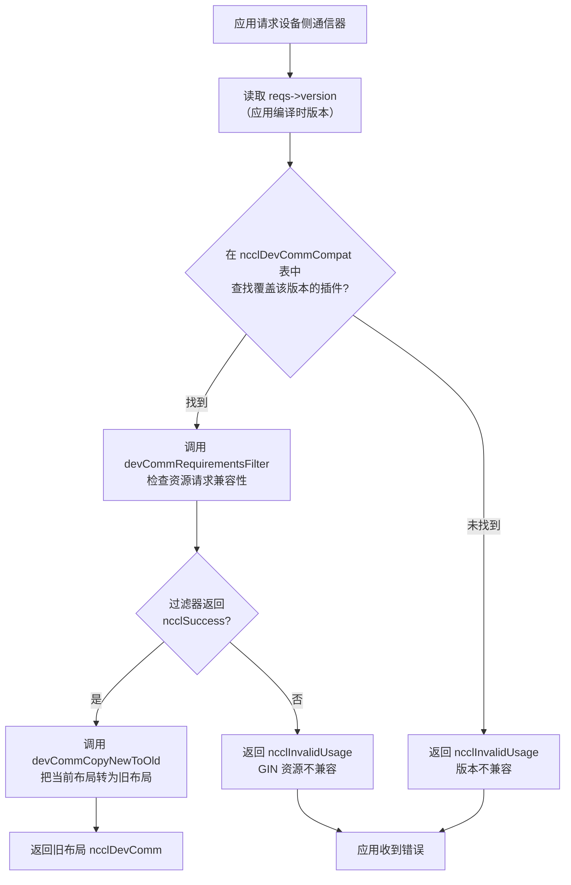
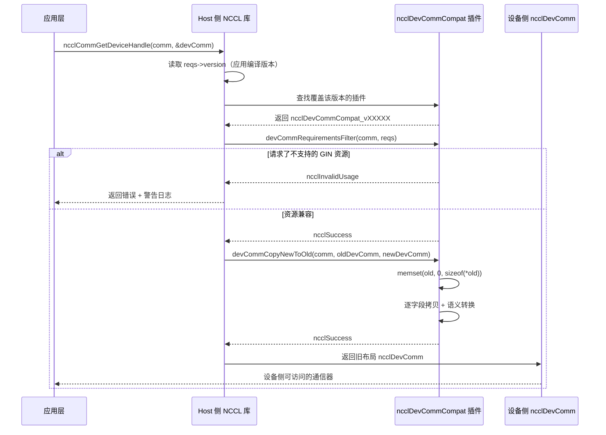

# Chapter 19: Device Communicator & ABI Compatibility: devcomm Structure & Kernel Contracts


上一章我们看到，host 侧的 ncclMemManager 用引用计数和 CUDA VMM API 管理着通信缓冲区的生命周期。但通信真正发生的地方是 GPU kernel——kernel 里的线程需要知道：我是哪个 rank？对端 rank 的缓冲区在哪个虚拟地址？连接是否就绪？这些信息在 host 侧的 ncclComm 结构里，但 kernel 不能直接解引用 host 指针。如果 NCCL 让 kernel 每次都通过参数传递或全局内存查询来获取这些元数据，那么每次通信都要付出额外的延迟和带宽开销。更糟糕的是，kernel 代码一旦编译，其访问的字段偏移就固定了——如果库升级后 ncclComm 的布局变了，旧 kernel 就会读到错误的数据。这就是 devcomm 要解决的核心问题：把 host 侧通信域的关键元数据，以稳定的、版本化的内存布局，映射到设备侧可访问的结构中。src/devcomm 目录下的 devcomm_v22902.cc、devcomm_v22907.cc、devcomm_v23000.cc、devcomm_v23100.cc 就是这套版本化 ABI 的具体实现。每个文件对应一个 NCCL 版本区间，定义了该区间内 ncclDevComm 的精确内存布局，以及新旧版本之间的字段拷贝逻辑。本章将依次拆解：设备侧通信器的核心数据结构长什么样、版本化 ABI 的注册与匹配机制如何工作、新旧版本之间如何做字段级转换、以及这套机制在生产环境中的边界与陷阱。

## 一、设备侧通信器的核心结构：ncclDevComm 的内存布局

### Intuitive Architectural Model

把 `ncclDevComm` 想象成一张「工位卡」：每个 GPU kernel 启动时，都会拿到一张卡片，上面印着「你是 3 号 rank，总共 8 个 rank，你的 LSA 组里有 4 个 rank，对端缓冲区基地址在 0x7f...」。这张卡片必须足够小（能塞进 kernel 参数），又必须包含所有关键信息。如果这张卡片不存在，kernel 就只能靠 host 侧反复传递参数，每次通信都要重新组装——延迟高、易出错。

### Data Structures & Memory Layout

以 `ncclDevComm_v23000` 为例，它的完整定义在 [FACT:src/devcomm/devcomm_v23000.cc:25-62](https://github.com/NVIDIA/nccl/blob/12df1a11afad322be5a204a2db890161cbf8131d/src/devcomm/devcomm_v23000.cc#L25-L62)：

```c
struct ncclDevComm_v23000 {
  unsigned int magic;          // 偏移 0，魔数校验
  unsigned int version;        // 偏移 4，版本号

  int rank, nRanks;            // 偏移 8, 12
  uint32_t nRanks_rcp32;       // 偏移 16，nRanks 的倒数（定点数）
  int lsaRank, lsaSize;        // 偏移 20, 24
  uint32_t lsaSize_rcp32;      // 偏移 28

  ncclDevCommWindowTable_t windowTable;  // 偏移 32
  ncclWindow_t resourceWindow;           // 偏移 40
  ncclResourceWindow_vidmem_v23000_t resourceWindow_inlined;  // 偏移 48
  ncclGinBarrierHandle_t hybridWorldGinBarrier;  // 偏移 112
  ...
};
```

[FACT:src/devcomm/devcomm_v23000.cc:64-93](https://github.com/NVIDIA/nccl/blob/12df1a11afad322be5a204a2db890161cbf8131d/src/devcomm/devcomm_v23000.cc#L64-L93) 用一连串 `static_assert` 把每个字段的偏移钉死。这不是装饰——它是 ABI 兼容性的编译期契约。如果某个字段的偏移因为编译器对齐策略变化而移动，编译就会失败，而不是在运行时产生难以调试的内存错位。

几个关键字段的设计动机：

**`nRanks_rcp32` 和 `lsaSize_rcp32`**：这是 `nRanks` 和 `lsaSize` 的倒数，用 32 位定点数表示。[INFERENCE] kernel 里做 rank 到 buffer 偏移的除法运算时，GPU 的整数除法很慢，用乘以倒数再移位的方式可以显著加速。这是典型的「用空间换时间」——多存 4 字节，省掉每次除法的几十个时钟周期。

**`resourceWindow_inlined`**：这是一个内联的窗口描述符，类型为 `ncclResourceWindow_vidmem_v23000_t`。注意 [FACT:src/devcomm/devcomm_v23000.cc:11-18](https://github.com/NVIDIA/nccl/blob/12df1a11afad322be5a204a2db890161cbf8131d/src/devcomm/devcomm_v23000.cc#L11-L18) 中它的定义：

```c
typedef struct ncclResourceWindow_vidmem_v23000 {
  char reserved1[8];
  char* lsaFlatBase;
  char reserved2[8];
  uint32_t stride4G;
  uint32_t mcOffset4K;
  char reserved3[32];  // NOTE: shrunk from 40 in 2.30u1 to reclaim 8 bytes
} ncclResourceWindow_vidmem_v23000_t;
```

这里的 `reserved1`、`reserved2`、`reserved3` 是**填充字段**，用来占位。为什么需要填充？因为 `ncclDevComm_v23000` 的布局必须与某个「基准版本」保持偏移一致，即使某些字段在当前版本中不再使用，也要保留占位以保证后续字段的偏移不变。[FACT:src/devcomm/devcomm_v23000.cc:11-18](https://github.com/NVIDIA/nccl/blob/12df1a11afad322be5a204a2db890161cbf8131d/src/devcomm/devcomm_v23000.cc#L11-L18) 的注释明确说明：2.30u1 把 `reserved3` 从 40 字节缩小到 32 字节，腾出 8 字节给 `hybridWorldGinBarrier`。这是一次**布局重排**——通过缩小填充区，在不改变整体大小的前提下塞入新字段。

[FACT:src/devcomm/devcomm_v23000.cc:11-18](https://github.com/NVIDIA/nccl/blob/12df1a11afad322be5a204a2db890161cbf8131d/src/devcomm/devcomm_v23000.cc#L11-L18) 的 `static_assert` 进一步验证：`lsaFlatBase`、`stride4G`、`mcOffset4K` 三个字段的偏移必须与「当前版本」的 `ncclWindow_vidmem` 一致，且整个结构体大小为 64 字节。这意味着 `resourceWindow_inlined` 在 v23000 和当前版本之间是**二进制兼容**的——可以直接 memcpy。

### 版本化结构体的家族

对比 `ncclDevComm_v22902` [FACT:src/devcomm/devcomm_v22902.cc:38-62](https://github.com/NVIDIA/nccl/blob/12df1a11afad322be5a204a2db890161cbf8131d/src/devcomm/devcomm_v22902.cc#L38-L62) 和 `ncclDevComm_v22907` [FACT:src/devcomm/devcomm_v22907.cc:13-41](https://github.com/NVIDIA/nccl/blob/12df1a11afad322be5a204a2db890161cbf8131d/src/devcomm/devcomm_v22907.cc#L13-L41)，可以看到字段的演化：

| 字段 | v22902 | v22907 | v23000 |
|------|--------|--------|--------|
| `magic`/`version` | 无 | 无 | 有（偏移 0/4） |
| `ginContextCount` | uint8_t | uint32_t | uint32_t |
| `ginNetDeviceTypes` | `[4]` | `[NCCL_GIN_MAX_CONNECTIONS]` | `[NCCL_GIN_MAX_CONNECTIONS]` |
| `ginIsRailed` | 无 | bool | 拆分为 `ginConnectionsRailed` + `ginContextsRailed` |
| `hybridWorldGinBarrier` | 无 | 无 | 有（偏移 112） |
| 结构体大小 | 200 | 224 | 240 |

[INFERENCE] 这个演化路径揭示了 NCCL 的版本策略：**只在必要时增加字段，且尽量利用填充区**。v22902 到 v22907 增加了 `ginSignalBase`、`ginCounterBase`、`ginContextBase`、`ginIsRailed` 等 GIN 相关字段；v22907 到 v23000 增加了 `magic`/`version` 校验字段和 `hybridWorldGinBarrier`，同时把 `ginIsRailed` 拆成两个更精确的标志位。

---

## 二、版本化 ABI 的注册与匹配：ncclDevCommCompat 结构

### Intuitive Architectural Model

把版本化 ABI 想象成一套「翻译插件」：当应用程序用 NCCL 2.29.2 编译，但运行时链接的是 2.31.0 的库，库需要知道「2.29.2 的 kernel 期望什么样的 `ncclDevComm` 布局」，然后把当前版本的 `ncclDevComm` 翻译成旧布局。每个版本区间对应一个翻译插件，注册在一个全局表里。

### 核心结构：ncclDevCommCompat

每个 `devcomm_vXXXXX.cc` 文件末尾都定义了一个 `ncclDevCommCompat` 结构体。以 v23000 为例 [FACT:src/devcomm/devcomm_v23000.cc:192-199](https://github.com/NVIDIA/nccl/blob/12df1a11afad322be5a204a2db890161cbf8131d/src/devcomm/devcomm_v23000.cc#L192-L199)：

```c
struct ncclDevCommCompat ncclDevCommCompat_v23000 = {
  NCCL_VERSION(2, 30, 0),               // minVersion
  NCCL_VERSION(2, 30, 7),               // maxVersion
  nullptr,                              // commPropertiesFilter
  ncclDevCommRequirementsFilter_v23000, // devCommRequirementsFilter
  ncclDevCommCopyNewToOld_v23000,       // devCommCopyNewToOld
  ncclDevCommCopyOldToNew_v23000,       // devCommCopyOldToNew
};
```

六个字段的含义：

1. **`minVersion` / `maxVersion`**：这个插件负责的版本区间。v23000 覆盖 2.30.0 到 2.30.7。
2. **`commPropertiesFilter`**：可选的过滤器，用于调整 `ncclCommProperties` 中暴露给旧版本的能力标志。v23000 设为 `nullptr`，表示不需要过滤。
3. **`devCommRequirementsFilter`**：检查应用程序请求的设备侧资源是否与旧版本兼容。v23000 的实现 [FACT:src/devcomm/devcomm_v23000.cc:95-98](https://github.com/NVIDIA/nccl/blob/12df1a11afad322be5a204a2db890161cbf8131d/src/devcomm/devcomm_v23000.cc#L95-L98) 只是把 `ginType` 从 `comm->sharedRes` 复制到 `reqs`。
4. **`devCommCopyNewToOld`**：把当前版本的 `ncclDevComm` 拷贝到旧版本布局。
5. **`devCommCopyOldToNew`**：把旧版本布局拷贝回当前版本。

### 版本区间的划分

四个文件的版本区间：

| 文件 | minVersion | maxVersion | 备注 |
|------|-----------|-----------|------|
| `devcomm_v22902.cc` | 2.29.2 | 2.29.3 | 最早的版本化实现 |
| `devcomm_v22907.cc` | 2.29.5 | 2.29.7 | 增加 GIN 字段，但不提供 GIN 向后兼容 |
| `devcomm_v23000.cc` | 2.30.0 | 2.30.7 | 增加 magic/version 校验 |
| `devcomm_v23100.cc` | 2.31.0 | 当前版本 | 所有过滤器为 nullptr，表示完全兼容 |

[FACT:src/devcomm/devcomm_v23100.cc:10-17](https://github.com/NVIDIA/nccl/blob/12df1a11afad322be5a204a2db890161cbf8131d/src/devcomm/devcomm_v23100.cc#L10-L17) 的 v23100 插件所有回调都是 `nullptr`，这意味着从 2.31.0 开始，`ncclDevComm` 的布局已经稳定，不需要任何转换。

[INFERENCE] 注意 v22902 和 v22907 之间的版本区间有「空隙」（2.29.4 和 2.29.6 没有对应的插件）。这可能是因为这些版本没有发布，或者它们的布局与相邻版本完全一致，可以复用。

### 匹配流程

当应用程序调用 `ncclCommGetDeviceHandle` 或类似 API 时，NCCL 需要：

1. 读取应用程序编译时嵌入的 NCCL 版本号（通过 `reqs->version`）。
2. 在全局的 `ncclDevCommCompat` 表中查找覆盖该版本的插件。
3. 如果找到，调用插件的 `devCommCopyNewToOld` 把当前布局转换为旧布局。
4. 如果没找到，返回错误或使用默认行为。

下面的流程图展示了这个匹配与转换过程：



---

## 三、字段级转换：新旧布局如何互转

### Intuitive Architectural Model

版本转换就像「翻译」：新版本的 `ncclDevComm` 是一篇现代汉语文章，旧版本的布局是一篇文言文。翻译器需要逐字段对应——有些字段直接对应（`rank` 对 `rank`），有些字段需要「意译」（`ginConnectionStride > 1` 翻译成 `ginConnectionsRailed = true`），有些字段在旧版本中不存在（直接丢弃）。

### NewToOld 转换：从当前版本到旧版本

以 `ncclDevCommCopyNewToOld_v23000` 为例 [FACT:src/devcomm/devcomm_v23000.cc:114-152](https://github.com/NVIDIA/nccl/blob/12df1a11afad322be5a204a2db890161cbf8131d/src/devcomm/devcomm_v23000.cc#L114-L152)：

```c
static ncclResult_t ncclDevCommCopyNewToOld_v23000(ncclComm_t comm, void* oldDevComm,
                                                   struct ncclDevComm const* newDevComm) {
  struct ncclDevComm_v23000* old = (struct ncclDevComm_v23000*)oldDevComm;

  memset(old, '\0', sizeof(*old));  // 先清零，防止未初始化字段泄露
  old->magic = newDevComm->magic;
  old->version = newDevComm->version;
  old->rank = newDevComm->rank;
  ...
  old->ginConnectionsRailed = (newDevComm->ginConnectionStride > 1);
  old->ginStrongLegacySignals = newDevComm->ginStrongLegacySignals;
  old->ginContextsRailed = (newDevComm->ginContextStride > 1);
  ...
}
```

关键步骤：

1. **`memset` 清零** [FACT:src/devcomm/devcomm_v23000.cc:118](https://github.com/NVIDIA/nccl/blob/12df1a11afad322be5a204a2db890161cbf8131d/src/devcomm/devcomm_v23000.cc#L118)：这是安全防护——旧结构体中可能有新版本不存在的字段，清零可以防止未初始化内存泄露到设备侧。
2. **直接字段拷贝**：`rank`、`nRanks`、`lsaRank` 等直接赋值。
3. **内联窗口转换**：调用 `ncclDevCommCopyResourceWindowNewToOld_v23000` [FACT:src/devcomm/devcomm_v23000.cc:100-105](https://github.com/NVIDIA/nccl/blob/12df1a11afad322be5a204a2db890161cbf8131d/src/devcomm/devcomm_v23000.cc#L100-L105)，逐字段拷贝 `lsaFlatBase`、`stride4G`、`mcOffset4K`。
4. **语义转换**：`ginConnectionsRailed = (newDevComm->ginConnectionStride > 1)` [FACT:src/devcomm/devcomm_v23000.cc:142](https://github.com/NVIDIA/nccl/blob/12df1a11afad322be5a204a2db890161cbf8131d/src/devcomm/devcomm_v23000.cc#L142)。新版本用 `ginConnectionStride`（一个整数步长）表示是否 railed，旧版本用布尔值。当步长大于 1 时，说明连接是 railed 的。
5. **数组拷贝**：`memcpy` 拷贝 `ginNetDeviceTypes` 和 `ginHandles` 数组 [FACT:src/devcomm/devcomm_v23000.cc:135-136](https://github.com/NVIDIA/nccl/blob/12df1a11afad322be5a204a2db890161cbf8131d/src/devcomm/devcomm_v23000.cc#L135-L136)。

### OldToNew 转换：从旧版本到当前版本

反向转换在 [FACT:src/devcomm/devcomm_v23000.cc:154-190](https://github.com/NVIDIA/nccl/blob/12df1a11afad322be5a204a2db890161cbf8131d/src/devcomm/devcomm_v23000.cc#L154-L190)：

```c
static ncclResult_t ncclDevCommCopyOldToNew_v23000(ncclComm_t comm, struct ncclDevComm* newDevComm,
                                                   void const* oldDevComm) {
  struct ncclDevComm_v23000 const* old = (struct ncclDevComm_v23000 const*)oldDevComm;

  newDevComm->magic = old->magic;
  ...
  newDevComm->ginConnectionStride = old->ginConnectionsRailed ? old->lsaSize : 1;
  newDevComm->ginContextStride = old->ginContextsRailed ? old->lsaSize : 1;
  ...
}
```

注意 [FACT:src/devcomm/devcomm_v23000.cc:180-181](https://github.com/NVIDIA/nccl/blob/12df1a11afad322be5a204a2db890161cbf8131d/src/devcomm/devcomm_v23000.cc#L180-L181) 的语义转换：如果旧版本中 `ginConnectionsRailed` 为真，则新版本的 `ginConnectionStride` 设为 `lsaSize`；否则设为 1。这里用 `lsaSize` 作为步长，[INFERENCE] 是因为 railed 模式下每个 LSA 组内的 rank 共享一个 GIN 连接，步长等于 LSA 组的大小。

### v22902 的特殊处理

`ncclDevCommCopyOldToNew_v22902` [FACT:src/devcomm/devcomm_v22902.cc:149-167](https://github.com/NVIDIA/nccl/blob/12df1a11afad322be5a204a2db890161cbf8131d/src/devcomm/devcomm_v22902.cc#L149-L167) 有一个重要注释：

```c
// Note: this callback will be used with v22907 as well because, prior to 2.30.0, ncclDevComm was unversioned,
// so v22902 and v22907 variants are indistinguishable.
```

[INFERENCE] 这意味着在 2.30.0 之前，`ncclDevComm` 没有 `magic`/`version` 字段，所以库无法区分一个旧结构体到底是 v22902 还是 v22907。因此，v22907 的 `devCommCopyOldToNew` 被设为 `nullptr` [FACT:src/devcomm/devcomm_v22907.cc:128](https://github.com/NVIDIA/nccl/blob/12df1a11afad322be5a204a2db890161cbf8131d/src/devcomm/devcomm_v22907.cc#L128)，实际使用的是 v22902 的版本。由于两者都不支持 GIN 向后兼容，GIN 相关字段的差异不影响正确性。

### 资源窗口的版本化

`ncclWindow_vidmem_v22902` 的定义在 `devcomm_v22902.h` 中（本章未提供该文件内容），但从 [FACT:src/devcomm/devcomm_v22902.cc:141](https://github.com/NVIDIA/nccl/blob/12df1a11afad322be5a204a2db890161cbf8131d/src/devcomm/devcomm_v22902.cc#L141) 和 [FACT:src/devcomm/devcomm_v22902.cc:164](https://github.com/NVIDIA/nccl/blob/12df1a11afad322be5a204a2db890161cbf8131d/src/devcomm/devcomm_v22902.cc#L164) 可以看到，v22902 使用 `ncclDevCommCopyResourceWindow_v22902` 进行窗口转换。这个函数在 `devcomm_v22902.h` 中声明，具体实现未在本章源码中展示。

[FACT:src/devcomm/devcomm_v23000.cc:11-18](https://github.com/NVIDIA/nccl/blob/12df1a11afad322be5a204a2db890161cbf8131d/src/devcomm/devcomm_v23000.cc#L11-L18) 的 `static_assert` 验证了 v23000 的窗口布局与当前版本一致，所以 v23000 的转换函数可以直接逐字段拷贝。

---

## 四、能力过滤与资源检查：防止旧 kernel 访问不支持的特性

### Intuitive Architectural Model

版本转换不只是「字段搬家」——还需要检查旧版本是否支持应用程序请求的特性。比如，一个用 2.29.2 编译的 kernel 请求 GIN 资源，但 2.29.2 的 `ncclDevComm` 布局中 GIN 字段不完整，直接转换会导致 kernel 读到垃圾数据。所以需要一个「过滤器」在转换前拦截这种请求。

### commPropertiesFilter：能力标志过滤

`ncclCommPropertiesFilter_v22907` [FACT:src/devcomm/devcomm_v22907.cc:69-77](https://github.com/NVIDIA/nccl/blob/12df1a11afad322be5a204a2db890161cbf8131d/src/devcomm/devcomm_v22907.cc#L69-L77)：

```c
static ncclResult_t ncclCommPropertiesFilter_v22907(ncclComm_t comm, struct ncclCommProperties* props) {
  // We don't provide backwards compatibility for GIN with 2.29.7.  If a communicator needs it, we indicate that
  // the Device API is not available.
  props->deviceApiSupport = (props->deviceApiSupport && ncclTeamLsa(comm).nRanks == comm->nRanks);
  props->ginType = NCCL_GIN_TYPE_NONE;
  props->railedGinType = NCCL_GIN_TYPE_NONE;
  return ncclSuccess;
}
```

三个操作：

1. **`deviceApiSupport` 降级**：如果 LSA 组的 rank 数不等于总 rank 数（即存在跨节点通信），则禁用设备 API。这是因为 2.29.7 的 GIN 不支持跨节点。
2. **`ginType` 置为 NONE**：明确告诉应用程序「这个版本不支持 GIN」。
3. **`railedGinType` 置为 NONE**：同上。

`ncclCommPropertiesFilter_v22902` [FACT:src/devcomm/devcomm_v22902.cc:86-96](https://github.com/NVIDIA/nccl/blob/12df1a11afad322be5a204a2db890161cbf8131d/src/devcomm/devcomm_v22902.cc#L86-L96) 类似，但多了一个细节：

```c
// v22902 ncclCommProperties is _almost_ compatible with newer ones, with the exception of ginType, which in that
// version was based on uint_8, not an int.
((struct ncclCommProperties_v22902*)props)->ginType = NCCL_GIN_TYPE_NONE_v22902;
```

[FACT:src/devcomm/devcomm_v22902.cc:13-17](https://github.com/NVIDIA/nccl/blob/12df1a11afad322be5a204a2db890161cbf8131d/src/devcomm/devcomm_v22902.cc#L13-L17) 定义了 v22902 的 GIN 类型枚举：

```c
typedef enum : uint8_t {
  NCCL_GIN_TYPE_NONE_v22902 = 0,
  NCCL_GIN_TYPE_PROXY_v22902 = 2,
  NCCL_GIN_TYPE_GDAKI_v22902 = 3,
} ncclGinType_t_v22902;
```

注意这是 `uint8_t` 类型，而新版本中 `ginType` 是 `int`。所以 v22902 的过滤器需要把 `props` 强制转换为 `ncclCommProperties_v22902*`，然后写入 `uint8_t` 类型的 `ginType`。[FACT:src/devcomm/devcomm_v22902.cc:35-36](https://github.com/NVIDIA/nccl/blob/12df1a11afad322be5a204a2db890161cbf8131d/src/devcomm/devcomm_v22902.cc#L35-L36) 的 `static_assert` 验证了 `ginType` 在偏移 34，结构体大小为 40 字节。

### devCommRequirementsFilter：资源请求检查

`ncclDevCommRequirementsFilter_v22907` [FACT:src/devcomm/devcomm_v22907.cc:79-98](https://github.com/NVIDIA/nccl/blob/12df1a11afad322be5a204a2db890161cbf8131d/src/devcomm/devcomm_v22907.cc#L79-L98) 检查应用程序是否请求了 GIN 资源：

```c
static ncclResult_t ncclDevCommRequirementsFilter_v22907(ncclComm_t comm, ncclDevCommRequirements_t* reqs) {
  bool requestedGinResources =
    reqs->ginSignalCount > 0 || reqs->ginCounterCount > 0 || reqs->barrierCount > 0 || reqs->railGinBarrierCount > 0;
  struct ncclDevResourceRequirements* node = reqs->resourceRequirementsList;
  while (!requestedGinResources && node != nullptr) {
    requestedGinResources = node->ginSignalCount > 0 || node->ginCounterCount > 0;
    node = node->next;
  }
  if (requestedGinResources && (reqs->ginConnectionType != NCCL_GIN_CONNECTION_NONE || reqs->ginForceEnable)) {
    // 打印警告并返回错误
    return ncclInvalidUsage;
  }
  return ncclSuccess;
}
```

逻辑分两步：

1. **检查顶层请求**：`reqs->ginSignalCount`、`ginCounterCount`、`barrierCount`、`railGinBarrierCount` 任一大于 0，说明请求了 GIN 资源。
2. **遍历资源需求链表**：如果顶层没有请求，继续遍历 `resourceRequirementsList` 链表，检查每个节点的 `ginSignalCount` 和 `ginCounterCount`。

如果确实请求了 GIN 资源，且 `ginConnectionType` 不是 `NONE` 或 `ginForceEnable` 为真，则返回 `ncclInvalidUsage` 并打印警告，提示应用程序需要重新编译。

`ncclDevCommRequirementsFilter_v22902` [FACT:src/devcomm/devcomm_v22902.cc:98-126](https://github.com/NVIDIA/nccl/blob/12df1a11afad322be5a204a2db890161cbf8131d/src/devcomm/devcomm_v22902.cc#L98-L126) 更复杂，除了 GIN 检查外，还处理了 `barrierCount` 的语义变化：

```c
// Prior to 2.29.4, a non-zero barrierCount did not imply GIN, but it does since.
if (reqs->barrierCount) {
  reqs->lsaBarrierCount = std::max(reqs->lsaBarrierCount, reqs->barrierCount);
  reqs->barrierCount = 0;
}
// Strangely, neither did railGinBarrierCount.
reqs->railGinBarrierCount = 0;
```

[INFERENCE] 在 2.29.4 之前，`barrierCount` 只表示 LSA barrier，不隐含 GIN 需求。从 2.29.4 开始，`barrierCount` 隐含 GIN 需求。为了兼容旧版本，过滤器把 `barrierCount` 转换为 `lsaBarrierCount`，并清零 `barrierCount` 和 `railGinBarrierCount`。

下面的时序图展示了从应用请求到版本转换的完整交互：



---

## 五、生产避坑指南与故障恢复链

### 陷阱一：GIN 资源请求与旧版本 kernel 的冲突

**场景**：应用程序用 NCCL 2.29.2 编译，但运行时链接了 2.31.0 的库。应用程序在 kernel 中调用了 GIN 相关的设备侧 API（如 `ncclGinPut`）。

**会发生什么**：`ncclDevCommRequirementsFilter_v22902` [FACT:src/devcomm/devcomm_v22902.cc:98-126](https://github.com/NVIDIA/nccl/blob/12df1a11afad322be5a204a2db890161cbf8131d/src/devcomm/devcomm_v22902.cc#L98-L126) 检测到 `ginForceEnable` 或 `ginSignalCount > 0`，返回 `ncclInvalidUsage`，并打印警告：

```
The application was compiled with too old version of NCCL. It was compiled with NCCL version 2.29.2, but is
running with NCCL library version 2.31.0. Because of its use of GIN device kernels, it needs to be recompiled,
preferably with the same NCCL version that it will be running with.
```

**根因**：2.29.2 的 `ncclDevComm_v22902` 布局中，GIN 字段（`ginContextCount`、`ginNetDeviceTypes`、`ginHandles` 等）与 2.31.0 的布局不兼容。如果强行转换，kernel 会读到错误的偏移，导致未定义行为。

**正确做法**：应用程序必须用与运行时库相同（或兼容）的 NCCL 版本重新编译。如果无法重新编译，应避免在 kernel 中使用 GIN API。

### 陷阱二：跨节点通信时设备 API 被静默禁用

**场景**：应用程序用 2.29.7 编译，通信域包含跨节点 rank（`ncclTeamLsa(comm).nRanks != comm->nRanks`）。

**会发生什么**：`ncclCommPropertiesFilter_v22907` [FACT:src/devcomm/devcomm_v22907.cc:69-77](https://github.com/NVIDIA/nccl/blob/12df1a11afad322be5a204a2db890161cbf8131d/src/devcomm/devcomm_v22907.cc#L69-L77) 把 `props->deviceApiSupport` 设为 `false`。应用程序如果检查了这个标志，会知道设备 API 不可用；但如果不检查，直接调用设备侧 API，会得到未定义行为。

**根因**：2.29.7 的 GIN 不支持跨节点。LSA（Local SHARP Aggregation）组内的 rank 才能使用设备侧 API。

**正确做法**：应用程序应在初始化后检查 `ncclCommProperties.deviceApiSupport`，如果为 `false`，回退到 host 侧 API。

### 陷阱三：memset 清零与未初始化字段泄露

**场景**：`ncclDevCommCopyNewToOld_v23000` [FACT:src/devcomm/devcomm_v23000.cc:118](https://github.com/NVIDIA/nccl/blob/12df1a11afad322be5a204a2db890161cbf8131d/src/devcomm/devcomm_v23000.cc#L118) 在拷贝前执行 `memset(old, '\0', sizeof(*old))`。

**为什么需要**：旧结构体中可能有新版本不存在的字段（如 v22902 中的 `ginSignalBase`、`ginCounterBase`）。如果不清零，这些字段会保留栈上的垃圾值，可能被 kernel 误读为有效数据。

**踩坑点**：如果开发者手动实现版本转换而忘记清零，可能导致 kernel 读到随机值，表现为间歇性错误——难以复现和调试。

**正确做法**：始终在转换前清零整个目标结构体。NCCL 的所有 `CopyNewToOld` 实现都遵循这个模式 [FACT:src/devcomm/devcomm_v22902.cc:132](https://github.com/NVIDIA/nccl/blob/12df1a11afad322be5a204a2db890161cbf8131d/src/devcomm/devcomm_v22902.cc#L132) [FACT:src/devcomm/devcomm_v22907.cc:104](https://github.com/NVIDIA/nccl/blob/12df1a11afad322be5a204a2db890161cbf8131d/src/devcomm/devcomm_v22907.cc#L104) [FACT:src/devcomm/devcomm_v23000.cc:118](https://github.com/NVIDIA/nccl/blob/12df1a11afad322be5a204a2db890161cbf8131d/src/devcomm/devcomm_v23000.cc#L118)。

### 陷阱四：版本区间空隙导致的匹配失败

**场景**：应用程序用 NCCL 2.29.4 编译。查看版本区间表：

| 文件 | minVersion | maxVersion |
|------|-----------|-----------|
| v22902 | 2.29.2 | 2.29.3 |
| v22907 | 2.29.5 | 2.29.7 |

2.29.4 没有对应的插件。

**会发生什么**：[INFERENCE] 如果匹配逻辑严格按区间查找，2.29.4 会匹配失败，返回错误。但实际实现中，可能有一个「最近匹配」策略——2.29.4 可能被路由到 v22902 或 v22907 的插件。

**正确做法**：应用程序应尽量使用与运行时库相同的主版本号。如果必须跨版本，应测试目标版本区间是否有对应的兼容插件。

### 故障恢复链

当版本转换失败时，NCCL 的错误恢复链：

1. **过滤器返回错误**：`devCommRequirementsFilter` 返回 `ncclInvalidUsage`。
2. **上层 API 捕获错误**：`ncclCommGetDeviceHandle` 检查返回值，如果非 `ncclSuccess`，不填充 `devComm` 结构。
3. **应用程序处理**：应用程序应检查返回值，如果失败，回退到 host 侧 API 或终止通信。
4. **日志记录**：NCCL 打印 `WARN` 级别的日志，包含编译版本和运行时版本，帮助定位问题。

[INFERENCE] 目前 NCCL 没有提供「自动降级」机制——如果版本转换失败，不会自动回退到 host 侧 API。应用程序需要自己实现回退逻辑。

---

## 设计思考

**为什么用版本化结构体而不是「稳定 ABI」？**

[INFERENCE] 一个替代方案是设计一个「永不改变」的 `ncclDevComm` 布局，所有新字段都通过间接指针访问。但这会带来两个问题：一是间接访问增加延迟（kernel 需要额外解引用），二是无法利用填充区优化布局。NCCL 选择版本化结构体，是在「性能」和「兼容性」之间的权衡——每个版本区间内的 kernel 获得最优布局，跨版本时通过转换层保证兼容。

**为什么 v22907 的 `devCommCopyOldToNew` 设为 nullptr？**

[FACT:src/devcomm/devcomm_v22902.cc:153-155](https://github.com/NVIDIA/nccl/blob/12df1a11afad322be5a204a2db890161cbf8131d/src/devcomm/devcomm_v22902.cc#L153-L155) 的注释解释了原因：2.30.0 之前 `ncclDevComm` 没有版本字段，所以 v22902 和 v22907 的旧布局无法区分。由于两者都不支持 GIN 向后兼容，GIN 字段的差异不影响正确性，所以复用 v22902 的转换函数。

**为什么 `nRanks_rcp32` 用定点数而不是浮点数？**

[INFERENCE] GPU 的浮点除法精度可能不足以精确表示 `1/nRanks`，特别是当 `nRanks` 不是 2 的幂时。定点数（32 位整数表示的小数）可以提供足够的精度，且整数乘法比浮点乘法更快。

---

## 本章Summary

本章拆解了 `src/devcomm` 目录下的版本化 ABI 实现：

1. **`ncclDevComm` 的内存布局**：每个版本有精确的字段偏移，用 `static_assert` 在编译期验证。关键字段包括 `rank`、`nRanks`、`nRanks_rcp32`、`lsaRank`、`lsaSize`、`windowTable`、`resourceWindow` 等。

2. **版本化 ABI 的注册**：每个版本区间对应一个 `ncclDevCommCompat` 结构体，包含 `minVersion`、`maxVersion`、过滤器函数和转换函数。

3. **字段级转换**：`CopyNewToOld` 和 `CopyOldToNew` 逐字段拷贝，并处理语义变化（如 `ginConnectionStride > 1` 转换为 `ginConnectionsRailed = true`）。

4. **能力过滤**：`commPropertiesFilter` 调整暴露给旧版本的能力标志，`devCommRequirementsFilter` 检查资源请求是否与旧版本兼容。

5. **生产陷阱**：GIN 资源请求与旧版本 kernel 的冲突、跨节点通信时设备 API 被禁用、memset 清零的必要性、版本区间空隙导致的匹配失败。

下一章我们将进入设备侧 API 与内核融合，看 `nccl_device` 头文件如何组织设备侧函数，以及 kernel fusion 如何把多个集合通信操作合并到一个 kernel 中执行。

## 本章思考与自测

<details>
<summary>Q1: 如果将 `ncclDevCommCopyNewToOld_v23000` 中的 `memset(old, '\0', sizeof(*old))` 去掉，在什么场景下会导致 kernel 读到错误数据？请结合 v22902 和 v23000 的字段差异分析。</summary>

**参考解析**：

`ncclDevComm_v22902` 的结构体大小为 200 字节 [FACT:src/devcomm/devcomm_v22902.cc:84](https://github.com/NVIDIA/nccl/blob/12df1a11afad322be5a204a2db890161cbf8131d/src/devcomm/devcomm_v22902.cc#L84)，而 `ncclDevComm_v23000` 为 240 字节 [FACT:src/devcomm/devcomm_v23000.cc:95-98](https://github.com/NVIDIA/nccl/blob/12df1a11afad322be5a204a2db890161cbf8131d/src/devcomm/devcomm_v23000.cc#L95-L98)。v22902 中有 `ginSignalBase`（偏移 176）、`ginCounterBase`（偏移 184）、`ginContextBase`（偏移 204）等字段，这些字段在 v23000 中不存在或语义不同。

如果去掉 `memset`，当从 v23000 转换到 v22902 时，`old` 结构体中 v23000 不存在的字段（如 `ginSignalBase`、`ginCounterBase`）会保留栈上的垃圾值。如果 kernel 恰好读取了这些字段（例如旧 kernel 的 GIN 代码路径），会得到随机值，导致：
- 信号基地址错误，GIN 操作写入错误的内存位置。
- 计数器基地址错误，导致计数器溢出或下溢。
- 在极端情况下，可能触发非法内存访问，导致 kernel 崩溃。

`memset` 清零确保所有未显式赋值的字段都是 0，这是一个安全的默认值。NCCL 的所有 `CopyNewToOld` 实现都包含这个步骤 [FACT:src/devcomm/devcomm_v22902.cc:132](https://github.com/NVIDIA/nccl/blob/12df1a11afad322be5a204a2db890161cbf8131d/src/devcomm/devcomm_v22902.cc#L132) [FACT:src/devcomm/devcomm_v22907.cc:104](https://github.com/NVIDIA/nccl/blob/12df1a11afad322be5a204a2db890161cbf8131d/src/devcomm/devcomm_v22907.cc#L104) [FACT:src/devcomm/devcomm_v23000.cc:118](https://github.com/NVIDIA/nccl/blob/12df1a11afad322be5a204a2db890161cbf8131d/src/devcomm/devcomm_v23000.cc#L118)。

</details>

<details>
<summary>Q2: 假设应用程序用 NCCL 2.29.4 编译，运行时链接 2.31.0 的库。根据本章的版本区间表，2.29.4 没有对应的 `ncclDevCommCompat` 插件。请分析 NCCL 可能如何处理这种情况，以及应用程序应该如何规避。</summary>

**参考解析**：

版本区间表：
- v22902：2.29.2 - 2.29.3
- v22907：2.29.5 - 2.29.7
- v23000：2.30.0 - 2.30.7
- v23100：2.31.0 - 当前

2.29.4 落在 v22902 和 v22907 之间的空隙。可能的处理方式：

1. **最近匹配**：NCCL 可能选择小于等于请求版本的最大区间，即 v22902。但 v22902 的 `maxVersion` 是 2.29.3，严格来说不覆盖 2.29.4。
2. **返回错误**：如果匹配逻辑严格按区间，2.29.4 会匹配失败，返回 `ncclInvalidUsage`。
3. **向上匹配**：选择大于等于请求版本的最小区间，即 v22907。但 v22907 的 `minVersion` 是 2.29.5，也不覆盖 2.29.4。

[INFERENCE] 实际实现中，NCCL 可能有一个「容错」策略——如果找不到精确匹配，尝试使用相邻区间的插件。但这不是可靠的保证。

应用程序的规避方法：
- 使用与运行时库相同的主版本号（如 2.31.x）。
- 如果必须跨版本，测试目标版本区间是否有对应的兼容插件。
- 在初始化后检查 `ncclCommProperties.deviceApiSupport`，如果为 `false`，回退到 host 侧 API。

</details>

<details>
<summary>Q3: `ncclDevCommRequirementsFilter_v22902` 中有一段逻辑：`if (reqs->barrierCount) { reqs->lsaBarrierCount = std::max(reqs->lsaBarrierCount, reqs->barrierCount); reqs->barrierCount = 0; }`。请解释为什么需要这个转换，以及如果不转换会发生什么。</summary>

**参考解析**：

[FACT:src/devcomm/devcomm_v22902.cc:117-121](https://github.com/NVIDIA/nccl/blob/12df1a11afad322be5a204a2db890161cbf8131d/src/devcomm/devcomm_v22902.cc#L117-L121) 的注释说明：「Prior to 2.29.4, a non-zero barrierCount did not imply GIN, but it does since.」

在 2.29.4 之前，`barrierCount` 只表示 LSA barrier 的数量，不隐含 GIN 需求。从 2.29.4 开始，`barrierCount` 隐含 GIN 需求（即请求 barrier 就意味着需要 GIN 资源）。

当应用程序用 2.29.2 编译时，它可能设置了 `barrierCount > 0` 来表示 LSA barrier 需求，但并不知道这会隐含 GIN 需求。如果 NCCL 库（2.31.0）直接按新语义处理，会认为应用程序请求了 GIN 资源，然后 `ncclDevCommRequirementsFilter_v22902` 会检测到 GIN 请求并返回 `ncclInvalidUsage`——这是一个误报。

转换逻辑把 `barrierCount` 转换为 `lsaBarrierCount`（取两者最大值），并清零 `barrierCount`。这样：
- `lsaBarrierCount` 保留了应用程序的 barrier 需求。
- `barrierCount = 0` 避免了误报 GIN 需求。
- `railGinBarrierCount = 0` 同理，因为旧版本中它也不隐含 GIN 需求。

如果不转换，应用程序用 2.29.2 编译且设置了 `barrierCount > 0` 时，会被错误地拒绝，无法使用设备 API。

</details>

至此，我们看清了 devcomm 如何通过版本化 ABI 把 host 侧通信域的关键元数据安全地映射到设备侧，让 kernel 无需 host 指针也能获取 rank、地址和连接状态。这套机制解决了 kernel 访问通信域的基本问题，但设备侧的能力远不止于此。当用户希望在自己的 kernel 中直接调用通信原语，甚至将通信与计算融合到同一个 kernel 时，就需要更上层的设备侧 API 和内核融合技术。下一章将深入 nccl_device 目录与相关示例，探索 ncclBarrier、ncclLsaBarrier、ncclGinBarrier 等设备侧 API 如何让用户 kernel 参与通信，以及内核融合如何减少启动开销，从而将 NCCL 从库推向编程模型。