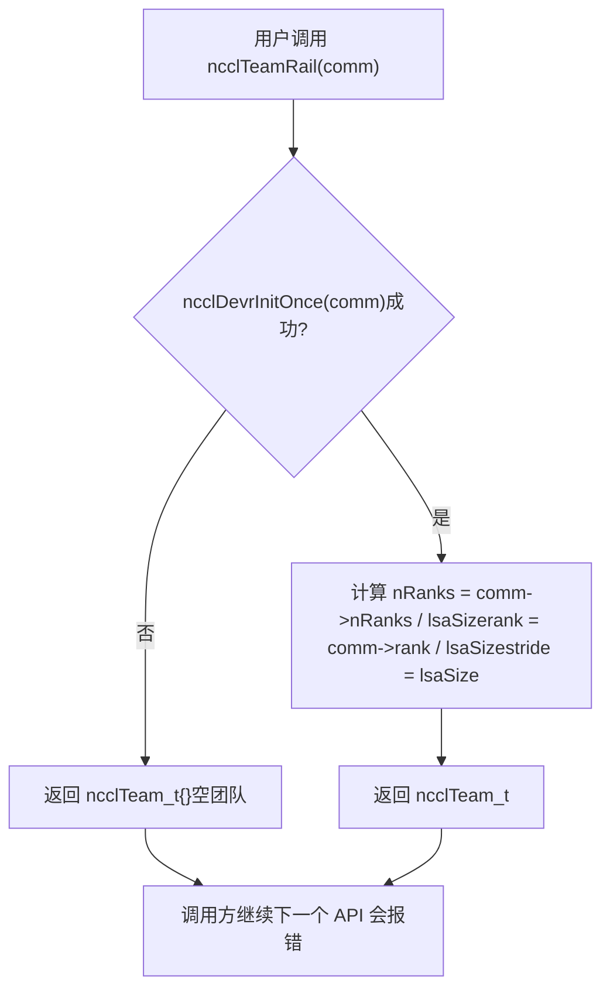
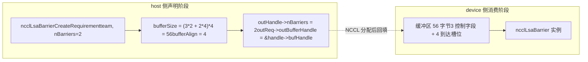
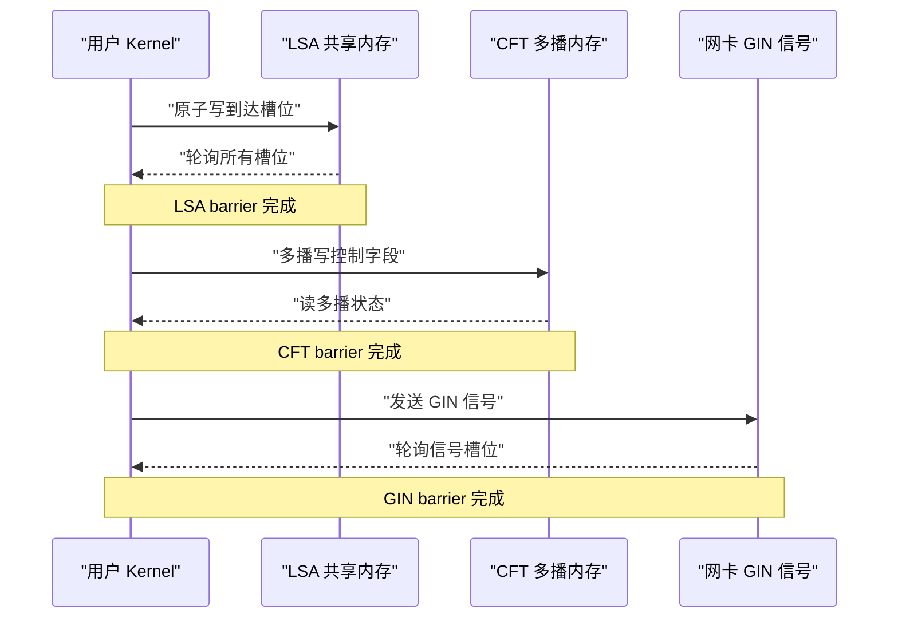
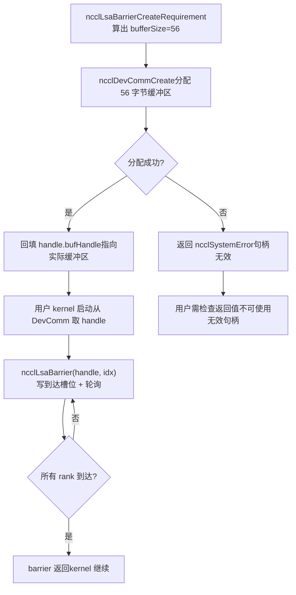
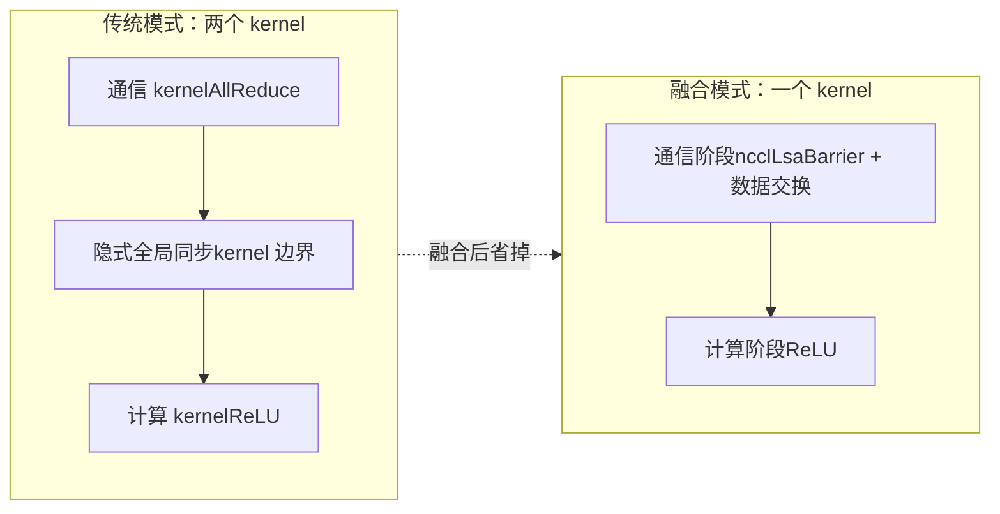

# Chapter 20: Device-Side Native APIs and Operator Fusion: nccl_device and kernel fusion practices

In the previous chapter, we saw clearly how devcomm maps the host-side ncclComm metadata in a versioned way to the device side, allowing the kernel to read rank, addresses, and connection status. But "being able to read metadata" and "being able to initiate communication" are two different things. If there is only metadata, a user kernel can at most calculate addresses on its own and write flags on its own. Once cross-rank synchronization or cross-machine signal transmission is involved, it still has to go back to the host side to call collective APIs such as ncclAllReduce—and every such call means a kernel launch and a host-device round trip. The src/nccl_device directory analyzed in this chapter is precisely the key to NCCL's transition from "a library that is called" to "a model that can be programmed." What it provides is not a new collective communication algorithm, but a set of device-side primitives: allowing the user's own kernel to internally call synchronization operations such as ncclBarrier, ncclLsaBarrier, and ncclGinBarrier, thereby packing "communication" and "computation" into the same kernel and eliminating the intermediate launch overhead. The source material in this chapter focuses on the host-side requirement declaration (CreateRequirement) and Team abstraction for this set of primitives, which is exactly the entry point of the device-side API. A key premise for understanding this chapter: the design philosophy of the device-side API is "the host side declares resource requirements, and the device side consumes resources." The host side does not directly create barriers; instead, it tells NCCL "I need nBarriers barriers, and the team has team.nRanks members." Based on this, NCCL calculates how many buffers and how many GIN signals are needed, and then instantiates these resources on the device side. This separation of "declaration-consumption" is the fundamental reason why device-side code can work without host pointers.

# 1. Team abstraction: the coordinate system of the device-side API

## Intuitive model

Imagine the organizational structure of a multinational company. To send an email, you first need to know "who to send it to"—whether it is to the whole company (World), to colleagues in the same office (LSA), or to a cross-office team on the same business line (Rail).`ncclTeam_t`This is the descriptor for the "recipient scope." Without the Team abstraction, every device-side API would have to recalculate on its own "what my position is in this communication domain and how many members there are in total," which would lead to duplicated code and be highly error-prone.

## Data structure and memory layout

`ncclTeam_t`It is the coordinate system of the device-side API, and its three fields define an**arithmetic progression**：

| Field | Meaning | Analogy |
| --- | --- | --- |
| `nRanks` | Total number of members in the team | How many people are in the group |
| `rank` | The number of the current rank within the team | My sequence number in the group |
| `stride` | The stride in world space between adjacent members in the team | How much the student IDs of two adjacent people in the group differ |

`stride`It is the most easily overlooked but most critical field. In the World team,`stride = 1`, because all ranks are arranged consecutively; but in the Rail team,`stride = lsaSize`, because ranks on the same rail appear in world space only once every`lsaSize`entries.

[FACT:src/nccl_device/core.cc:13-19]It shows the construction of the World team: directly take`comm->nRanks`and`comm->rank`，`stride`fixed to 1. This is the only team that does not require`ncclDevrInitOnce`, because all its information is in the host-side`comm`.

[FACT:src/nccl_device/core.cc:22-33]It is the LSA team. Note L26's`ncclDevrInitOnce(comm)`—this is the idempotent entry point for device-side resource initialization. The comments at L23-25 are very important:**errors are deliberately ignored here**, because if initialization fails, the returned team is a "garbage value," but the next API call that actually needs resources will trigger`ncclDevrInitOnce`again and report the error. This is a "delayed error reporting" strategy, avoiding throwing heavy errors on lightweight operations such as team queries.

## Scenario-driven walkthrough: coordinate transformation from World to Rail

Suppose an 8-GPU machine,`lsaSize = 4`(one LSA domain per 4 GPUs),`nRanks = 8`. Let us look at how`ncclTeamRail`is constructed:

[FACT:src/nccl_device/core.cc:70-79]In`nRanks = 8 / 4 = 2`，`rank = comm->rank / 4`，`stride = 4`. If the current rank is 5, then its`rank = 5 / 4 = 1`，`stride = 4`in the Rail team means that the members of the Rail team are rank 1 and rank 5 in world.

Now look at`ncclTeamRankToWorld`'s conversion formula:

[FACT:src/nccl_device/core.cc:82-84]'s`comm->rank + (rank - team.rank) * team.stride`is a**relative offset**calculation: first calculate the offset of the target rank relative to the current rank within the team`(rank - team.rank)`, then multiply by the stride`stride`, and add the world number of the current rank. This formula is universal for all teams, because`stride`already encodes the team's arrangement pattern.

`ncclTeamRankToLsa`is different:

[FACT:src/nccl_device/core.cc:87-92]uses`comm->devrState.lsaSelf + (rank - team.rank) * team.stride`. Note that here it uses`lsaSelf`rather than`comm->rank`—because the LSA number is known only after device-side resource initialization and may differ from the world rank.

This figure reveals the execution path of the "delayed error reporting" strategy: when initialization fails, an empty team is returned, but the caller is not interrupted; the error will be exposed at the next API that actually needs resources (such as`ncclLsaBarrierCreateRequirement`).

## Design considerations and pitfalls

**Why does`ncclTeamWorld`not call`ncclDevrInitOnce`？**Because the information of the World team comes entirely from the host side`comm`, without requiring any device-side resources. Forcing a call would make a pure host query operation depend on device-side initialization, adding unnecessary failure points.

**Pitfalls**：`ncclTeamRankToLsa`returns on initialization failure`-1`（[FACT:src/nccl_device/core.cc:87-92]), while`ncclTeamRankToWorld`never fails. If a caller mixes these two functions and does not check return values, it may obtain`-1`when LSA initialization fails and use it as a valid rank, causing out-of-bounds access. In production code,`ncclTeamRankToLsa`'s return value should be treated as an operation that may fail.

---

# II. Barrier Requirement Declaration: How the Host Side "Reserves" Device Resources

## Intuitive Model

Resource allocation on the device side is like**booking a meeting room**: you cannot just rush into the meeting room for a meeting; you must first submit an application to the front desk (host-side`CreateRequirement`)—"I want to hold 3 meetings, each with 8 attendees." Based on this, the front desk calculates how large a venue is needed (`bufferSize`), how many chairs are needed (`ginSignalCount`), and then gives you the venue number (`outBufferHandle`). Without this reservation mechanism, the device-side kernel would not know where its barrier buffer is or how large it is, and could not safely read from or write to it.

## Data Structures and Memory Layout

The`CreateRequirement`functions of the three barriers share the same pattern:**zero the requirement struct → fill in buffer size/alignment → fill in the output handle pointer**. But their resource types differ:

| Barrier Type | Resource Type | Size Formula | Alignment |
| --- | --- | --- | --- |
| LSA Barrier | Buffer | `(3*n + n*team.nRanks) * sizeof(uint32_t)` | `alignof(uint32_t)` |
| CFT Barrier | Buffer | `(3*n + n*team.nRanks) * NCCL_CFT_BARRIER_GRAN` | `NCCL_CFT_BARRIER_ALIGN` |
| GIN Barrier | GIN signal | `n * team.nRanks`signals | Does not involve a buffer |

First, look at the size formula for the LSA Barrier:

[FACT:src/nccl_device/lsa_barrier.cc:14-22]'s`(3 * nBarriers + nBarriers * team.nRanks) * sizeof(uint32_t)`can be broken down into two parts:

- `3 * nBarriers`: each barrier needs 3`uint32_t`control fields ([INFERENCE] usually "arrival count," "round," and "status flag").
- `nBarriers * team.nRanks`: each barrier needs to reserve one`uint32_t`arrival slot for each member in the team.

So the total size of a single barrier is`3 + team.nRanks`of`uint32_t`. This formula is exactly the same in LSA and CFT, except that CFT uses`NCCL_CFT_BARRIER_GRAN`as the granularity unit (possibly to align to a larger boundary).

GIN Barrier is completely different:

[FACT:src/nccl_device/gin_barrier.cc:14-20]does not allocate a buffer; instead it sets`ginSignalCount = nBarriers * team.nRanks`, and points`outGinSignalStart`to the`signal0`in the handle. This is because the GIN barrier uses the network signal path and does not need a shared memory buffer; instead, it needs signal slots that the NIC can recognize.

## Scenario-Driven Walkthrough: A Complete Reservation for One LSA Barrier

Suppose the user wants to create 2 barriers on a 4-GPU LSA team:

1. **Call** `ncclLsaBarrierCreateRequirement(team, 2, &handle, &req)`。

2. **zero**：`memset(outReq, 0, sizeof(*outReq))`（[FACT:src/nccl_device/lsa_barrier.cc:14-22])—ensures that unset fields have deterministic values, preventing the caller from reading garbage from the stack.

3. **Record the number of barriers**：`outHandle->nBarriers = 2`（[FACT:src/nccl_device/lsa_barrier.cc:14-22]）。

4. **Calculate the buffer size**：`(3*2 + 2*4) * 4 = (6 + 8) * 4 = 56`bytes ([FACT:src/nccl_device/lsa_barrier.cc:14-22]）。

5. **Set alignment**：`alignof(uint32_t) = 4`（[FACT:src/nccl_device/lsa_barrier.cc:14-22]）。

6. **Write back the handle pointer**：`outReq->outBufferHandle = &outHandle->bufHandle`（[FACT:src/nccl_device/lsa_barrier.cc:14-22])—lets NCCL write the address back to the handle after actually allocating the buffer.

This data flow diagram shows the separation of "declaration" and "consumption": the host side only calculates the size and pointer; the actual buffer allocation and instantiation happen inside NCCL, and the device-side kernel receives an already-filled handle.

## Design Considerations and Pitfalls

**Why use`memset`to zero the entire`outReq`？**Because`ncclDevResourceRequirements_t`is a multi-field struct, and different barrier types fill only part of its fields. Zeroing ensures that unused fields (such as`ginSignalCount`, which LSA barrier does not use) are 0, and NCCL internally uses this to determine "this resource is not needed." If it is not zeroed, random values on the stack may be mistaken for "GIN resources are needed," triggering the false-positive problem mentioned in the previous chapter.

**Pitfalls**：`outReq->outBufferHandle = &outHandle->bufHandle`hands the address of a field inside the handle to NCCL. This means that`outHandle`must remain valid until NCCL completes buffer allocation (it cannot be reclaimed by the stack or moved). If the user places`outHandle`in a scope that is released early, NCCL will write to a dangling pointer when writing back.

> **[Design Inference & Architectural Trade-offs]**
> **Granularity Difference of CFT Barrier**：[FACT:src/nccl_device/cft_barrier.cc:13-21]uses`NCCL_CFT_BARRIER_GRAN`and`NCCL_CFT_BARRIER_ALIGN`to replace LSA's`sizeof(uint32_t)`and`alignof(uint32_t)`. This indicates that the barrier of CFT (possibly Cross-Fabric Team or a similar cross-domain team) needs a larger alignment granularity, possibly because it must cross multicast memory regions, and the hardware has stricter requirements for address alignment.

---

# III. Semantic Division of Labor Among the Three Barriers: What LSA, CFT, and GIN Each Handle

## Intuitive Model

The three barriers are like "assembly whistles" for three different scopes:

- **LSA Barrier**: colleagues in the same office assemble, using shared memory, the fastest.
- **CFT Barrier**: assembly across offices but within the same building, using multicast memory, medium speed.
- **GIN Barrier**: assembly across cities or even countries, using network signals, the slowest but with the widest coverage.

Choosing the wrong barrier type will not cause errors, but it will bring huge performance losses—using a GIN barrier for same-office synchronization is like sending a document to the desk next door via international express.

## Comparison of Data Structures and Memory Layout

From the host-side requirement declaration, the resource requirements of the three are completely different:

| Dimension | LSA Barrier | CFT Barrier | GIN Barrier |
| --- | --- | --- | --- |
| Requires`comm`parameter | No | No | Yes |
| Buffer | Yes | Yes | No |
| GIN signal | No | No | Yes |
| Size unit | `uint32_t` | `NCCL_CFT_BARRIER_GRAN` | Number of signals |
| Output handle field | `bufHandle` | `bufHandle` | `signal0` |

Note that GIN Barrier is the only one that requires the`comm`parameter:

[FACT:src/nccl_device/gin_barrier.cc:14-20]'s function signature includes`ncclComm_t comm`, while the signatures of LSA and CFT only have`ncclTeam_t team`. This is because GIN signals need to be bound to specific network connections, and the network connection information is in`comm`.

## Scenario-Driven Walkthrough: Signal Allocation for GIN Barrier

[FACT:src/nccl_device/gin_barrier.cc:14-20]The logic of is simpler than LSA, but the semantics are more subtle:

1. **Zero out**：`memset(outReq, 0, sizeof(*outReq))`（L16）。

2. **Set signal count**：`outReq->ginSignalCount = nBarriers * team.nRanks`(L17) — each barrier needs to allocate a signal slot for each member in the team.

3. **Backfill signal start pointer**：`outReq->outGinSignalStart = &outHandle->signal0`(L18) — note that is not set here, because GIN barrier does not use a shared memory buffer.`bufferSize`[Design Inference and Architectural Trade-offs]

> **[Design Inference & Architectural Trade-offs]**
> `signal0`points to the first one, and NCCL uses this to know where to start allocating`signal0`, `signal1`, ...），`outGinSignalStart`signals.`nBarriers * team.nRanks`Concurrency Control and Hardware Interaction

## The concurrency control mechanisms of the three barriers are completely different:

: atomic operations based on shared memory.

- **LSA Barrier**out of`3 + team.nRanks`, the arrival slot uses atomic add or atomic write to mark "I have arrived," and the control field uses atomic read to check "whether everyone has arrived." This is pure intra-GPU synchronization and does not involve the network.`uint32_t`: based on multicast memory (multimem). [INFERENCE] Multicast memory allows a single write operation to simultaneously update the view of multiple ranks, so the CFT barrier may use fewer control fields to achieve broader synchronization.
- **CFT Barrier**: based on network signals.
- **GIN Barrier**signals are sent through the NIC, and the receiver polls the signal slots. This is the only barrier that involves cross-machine hardware.`ginSignalCount`Copy

Design Considerations and Pitfalls

## Why do LSA and CFT not need the

**parameter?`comm`Because their resources (shared memory, multicast memory) have already been bound to the team during the**phase,`ncclDevrInitOnce`itself implicitly contains the resource location information. However, GIN signals need to dynamically allocate network resources and must access the network connection state through`team`.`comm`Pitfall

**: GIN Barrier's**is`ginSignalCount`. If the team is very large (e.g., 1024 ranks) and there are many barriers (e.g., 100), the total number of signals will reach 102400. The NIC's signal slots are a limited resource, and excessive requests may cause`nBarriers * team.nRanks`to fail. Production code should request based on the actual minimum number of barriers needed, rather than requesting a large number of spares all at once.`ncclDevrInitOnce`IV. From Requirement Declaration to Device-Side Consumption: The Complete Lifecycle

---

# Intuitive Model

## is only "placing an order"; the actual "shipping" and "receiving" happen inside NCCL and in the device-side kernel. The entire lifecycle is like

`CreateRequirement`online shopping**: you place an order (CreateRequirement) -> the merchant prepares the goods (NCCL allocates resources) -> the courier delivers (resources are bound to DevComm) -> you sign for and use it (the device-side kernel calls barrier).**Data Structures and Memory Layout: Field Evolution of the Handle

## Taking

as an example, it goes through three stages in its lifecycle:`ncclLsaBarrierHandle_t`Stage

| Other Fields | `nBarriers` | `bufHandle` | After CreateRequirement |
| --- | --- | --- | --- |
| Already set | The address has been backfilled, but the content has not been allocated | Not set | After NCCL allocation |
| Already set | Points to the actual buffer | Already set | Device-side use |
| Read-only | Read-only | Read-only | sets |

[FACT:src/nccl_device/lsa_barrier.cc:14-22]backfills the address of`nBarriers`，[FACT:src/nccl_device/lsa_barrier.cc:14-22]. Between these two operations, NCCL internally completes the actual allocation of the buffer.`bufHandle`Scenario-Driven Walkthrough: A Complete Barrier Usage

## Host-side declaration

1. **: the user calls**and obtains`ncclLsaBarrierCreateRequirement(team, 2, &handle, &req)`Host-side submission`req.bufferSize = 56`。

2. **: the user hands**to`req`(content from the previous chapter), NCCL allocates a 56-byte buffer and writes the address into`ncclDevCommCreate`Device-side initialization`handle.bufHandle`。

3. **: when the user kernel starts, it retrieves**from DevComm and uses`handle`to locate the buffer.`bufHandle`Device-side synchronization

4. **: the kernel calls**, writes an arrival marker into the corresponding slot of the buffer, and polls the other slots.`ncclLsaBarrier(handle, barrierIndex)`Device-side completion

5. **: after all ranks have arrived, the barrier returns and the kernel continues execution.**Copy

itself always returns`ncclLsaBarrierCreateRequirement`); the real failure occurs in the subsequent resource allocation stage.`ncclSuccess`（[FACT:src/nccl_device/lsa_barrier.cc:14-22]Concurrency Control and Hardware Interaction

## The core of concurrency control for the device-side barrier is

atomic operations + memory barriers**. Taking the LSA barrier as an example:**Arrival phase

- **: each rank uses an atomic write (or atomic add) to update its own arrival slot. This step must use release semantics to ensure that all memory operations before the barrier are visible to other ranks.**Polling phase
- **: each rank uses an atomic read (or volatile read) to check all slots. This step must use acquire semantics to ensure that after seeing "everyone has arrived," it can read the data written by others before the barrier.**Reset phase
- **: after the barrier completes, the slots need to be reset for the next use. The concurrency control in this step is the most subtle — if the reset is too fast, it may overwrite the markers of ranks that have not yet read them.**[Design Inference and Architectural Trade-offs]

> **[Design Inference & Architectural Trade-offs]**
> `3 * nBarriers`These control fields are very likely used to handle this kind of "round" problem: one field records the current round, one field records the arrival count, and one field serves as a reset flag. This way, multiple barriers can reuse the same set of slots without confusing rounds.

## Production Pitfall Guide

**Pitfall 1: Handle Lifetime Management**。`outReq->outBufferHandle = &outHandle->bufHandle`The address of the handle's internal field was handed to NCCL. If the user destroys`ncclDevCommCreate`before`outHandle`returns, NCCL will write to freed memory when backfilling. The correct approach is to bind the lifetime of`outHandle`to the DevComm, rather than to the function scope that created it.

**Pitfall 2: The Product of Barrier Count and Team Size**。`bufferSize = (3*n + n*team.nRanks) * sizeof(uint32_t)`In`n*team.nRanks`the term dominates the size for large teams. 1024 ranks and 100 barriers require`100*1024*4 = 409600`bytes, about 400KB. If every rank requests this much, the memory pressure cannot be ignored. You should request based on the number of barriers actually used concurrently, not the total number of barriers.

**Pitfall 3: GIN Barrier Signal Exhaustion**. GIN signals are NIC resources and are limited in number. If multiple DevComms request a large number of GIN signals at the same time, they may exhaust the NIC slots. Production code should check whether DevComm creation failure is due to insufficient GIN signals, and consider reducing`nBarriers`or switching to LSA barriers.

**Pitfall 4: Delayed Exposure of Initialization Failure**。`ncclTeamLsa`Functions such as`ncclDevrInitOnce`return an empty team when[FACT:src/nccl_device/core.cc:22-33]fails, without reporting an error. If user code does not check the return values of subsequent APIs, it may continue operating on an empty team, causing hard-to-locate errors. It is recommended to explicitly check the validity of the team when using the device-side API for the first time (such as`team.nRanks > 0`）。

---

# V. Kernel Fusion: Why Put Communication and Computation into One Kernel

## Intuitive Model

In the traditional model, one "AllReduce + activation function" requires two kernels: one for communication and one for computation. There is an implicit global synchronization between the two kernels - the communication kernel must fully finish before the computation kernel can start. This is like**a relay race**: the first runner must hand the baton to the second runner after finishing, and at the moment of handoff both are waiting. Kernel fusion, by contrast, lets the same kernel perform both communication and computation, like**a person changing shoes while running**, eliminating the waiting at the handoff.

## Data Structures and Memory Layout

The key to kernel fusion is that communication primitives (such as barriers) and computation logic share the same kernel's registers and shared memory. This means:

- **Register Pressure**: The atomic operations and polling loops of communication primitives consume registers, squeezing the register budget of the computation logic.
- **Shared Memory Contention**: If the LSA barrier buffer is placed in shared memory, it will compete with the shared memory needs of the computation logic.
- **Occupancy Impact**: The occupancy of a fused kernel is usually lower than that of a pure computation kernel, because communication primitives require additional resources.

> **[Design Inference & Architectural Trade-offs]**
> The design of the device-side API (host side declares resources, device side consumes them) is precisely intended to alleviate these pressures: resources are pre-allocated on the host side, and the device-side kernel only needs to read and write, without dynamic allocation, reducing register usage.

## Scenario-Driven Walkthrough: Execution Flow of a Fused Kernel

Suppose the user wants to write a fused "AllReduce + ReLU" kernel:

1. **Host-side preparation**: call`ncclLsaBarrierCreateRequirement`to request a barrier, and call`ncclDevCommCreate`to allocate resources.

2. **Kernel launch**: the user kernel receives the DevComm and barrier handle as parameters.

3. **Communication phase**: inside the kernel, call`ncclLsaBarrier`to synchronize all ranks, then each rank exchanges data (directly reading and writing through symmetric memory).

4. **Computation phase**: after synchronization is complete, the kernel directly applies ReLU to the local data, without an additional kernel launch.

5. **Completion**: the kernel exits, and the host side does not need to wait for an additional communication kernel.

This comparison diagram shows the core benefit of fusion: eliminating the implicit global synchronization at the kernel boundary. In the traditional model, the cost of this synchronization is the latency of two kernel launches plus the draining of the GPU pipeline.

## Design Reflections and Pitfalls

**Why does the device-side API not directly provide "fused AllReduce"?**Because the specific form of fusion depends on the user's computation logic. What NCCL provides are**primitives**(barriers, signals, symmetric memory access), not**finished products**(fused AllReduce+ReLU). Users need to combine these primitives themselves to implement a fused kernel that meets their own needs. This is the essential difference between a "programming model" and a "library."

**Pitfalls**: Debugging a fused kernel is much harder than debugging separate kernels. If the barrier logic has a bug, it can cause the kernel to hang (deadlock), and a hung GPU kernel is not as easy to diagnose as a hung host process. It is recommended to add a timeout mechanism to the fused kernel, or first validate the barrier logic with a small-scale team.

**Pitfalls**: The reduced occupancy of a fused kernel may cause a loss in compute performance that exceeds the gains from saved communication. Before deciding to fuse, you should measure the end-to-end time before and after fusion, rather than only looking at the reduction in communication latency.

# Chapter Review and Self-Test

Q1: If in`ncclTeamLsa`L26, the`ncclDevrInitOnce`call is removed and it directly returns`comm->devrState.lsaSize`and`lsaSelf`, in what scenarios would the device-side kernel read incorrect team information?

**Reference Analysis**：`ncclDevrInitOnce`is the idempotent entry point for device-side resource initialization. If it is removed,`comm->devrState.lsaSize`and`lsaSelf`may still be at their initial values (usually 0 or undefined). In the scenario where the device-side API is used for the first time, when the user calls`ncclTeamLsa`, they will get`nRanks = 0`'s empty team. Later, if the user does not check the validity of the team and directly uses this team to call`ncclLsaBarrierCreateRequirement`, it will compute`bufferSize = (3*n + n*0) * 4 = 12n`bytes—smaller than actually needed, because the`n*team.nRanks`entry becomes 0. This leads to a buffer overflow: the barrier runtime tries to write`team.nRanks`arrival slots, but the buffer has only allocated space for`3n`of`uint32_t`. More subtly, if`lsaSelf`is also 0,`ncclTeamRankToLsa`will return an incorrect rank number, causing the barrier's arrival slot to be written to the wrong location, and it may never wait for all ranks to arrive, causing the kernel to hang. This is exactly the situation that the L23-25 comment's "return garbage value, next API reports error" strategy is meant to prevent—but only if the next API actually reports an error, rather than silently using the wrong size.

Q2：`ncclLsaBarrierCreateRequirement`The size formula is`(3*nBarriers + nBarriers*team.nRanks) * sizeof(uint32_t)`. If the team has 8 ranks and the user requests 1 barrier, the buffer is 44 bytes. Assume that in the barrier implementation the "3 control fields" are "arrival count", "round", and "reset flag". Reason through: when 8 ranks arrive simultaneously, if the "arrival count" uses a non-atomic`++`operation, what will happen?

**Reference Analysis**: A non-atomic`++`on the GPU is a three-step "read-modify-write", not an atomic operation. When 8 ranks execute`count++`simultaneously, multiple ranks may read the same old value (for example, all read 0), and then all write back 1. In the end,`count`increases by only 1 instead of 8, causing the barrier to always think that "not everyone has arrived yet", and all ranks spin forever in the polling phase. This is why the arrival slot of an LSA barrier must use atomic operations (such as`atomicAdd`) or each rank writes to its own independent slot (the`nBarriers * team.nRanks`entry is precisely to reserve an independent slot for each rank). If the "each rank writes its own slot" scheme is adopted, atomic add is not needed; only atomic write + memory barrier is needed, because each slot has only one writer. This also explains why the size formula includes the`nBarriers * team.nRanks`entry—it trades space for atomicity and avoids multi-writer contention.

Q3：`ncclGinBarrierCreateRequirement`requires the`comm`parameter while`ncclLsaBarrierCreateRequirement`does not. If the`comm`parameter were forcibly added to the LSA barrier as well (assuming for interface uniformity), what design problems would be introduced? Conversely, if the`comm`parameter were removed from the GIN barrier, in what scenarios would it fail?

**Reference Analysis**: The problem with adding the`comm`parameter to the LSA barrier is that it introduces an unnecessary dependency. The LSA barrier's resources (shared memory) have already been bound to the team during the`ncclDevrInitOnce`phase, and`team`itself already implies the resource location. Adding`comm`would make a pure team operation depend on communication domain state, increasing failure points (for example, if`comm`is invalid, the LSA barrier also cannot be created), and it violates the principle of "least privilege". Conversely, removing the`comm`parameter from the GIN barrier would fail, because GIN signals need to be bound to a specific network connection.`ncclGinBarrierCreateRequirement`'s`ginSignalCount`needs to know which NIC and which QP (Queue Pair) to send the signal to, and this information is in`comm`'s network transport layer state. Without`comm`, NCCL cannot determine which NIC's slot the signal should be assigned to, nor can it guarantee that the signal can be correctly routed to the target rank. This reflects a design principle of device-side APIs:**resource requirement declarations depend only on the context they truly need**—LSA only needs the team topology, while GIN needs the network connection.

---

Device-side APIs and kernel fusion turn NCCL from "a library you call" into "a programming model you use".`ncclTeam_t`provides the coordinate system,`CreateRequirement`provides the resource reservation mechanism, and the three barriers cover the entire synchronization range from shared memory to network signals. But declaring resources and writing a fused kernel does not mean the performance will be good—the number of barriers, the size of the team, and the granularity of fusion, every choice affects end-to-end performance. In the next chapter, we will enter the practice of performance tuning, looking at how tuning parameters affect algorithm selection and how to use real benchmarks to verify the tuning results.

At this point, we have completed the entire journey from devcomm metadata mapping to nccl_device device-side primitives, and seen how NCCL, through the "host declares, device consumes" model, allows user kernels to directly call barrier-type synchronization operations, fusing communication and computation into the same kernel. But after mastering these mechanisms, a more practical question naturally arises: when a real training task fails to meet performance targets, how do we determine whether it is due to an inappropriate algorithm choice, a protocol mismatch, or an unreasonable channel count configuration? The next chapter will string together the mechanisms from the previous 20 chapters into an actionable tuning methodology, combining performance reports, cost models, and environment variables to provide a troubleshooting path from symptoms to root causes.
