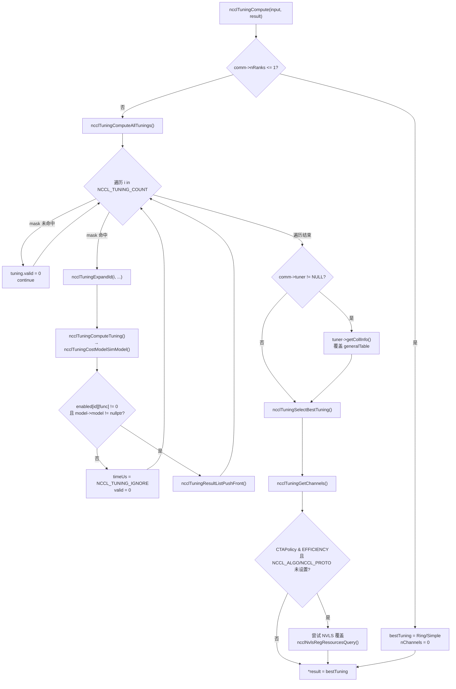
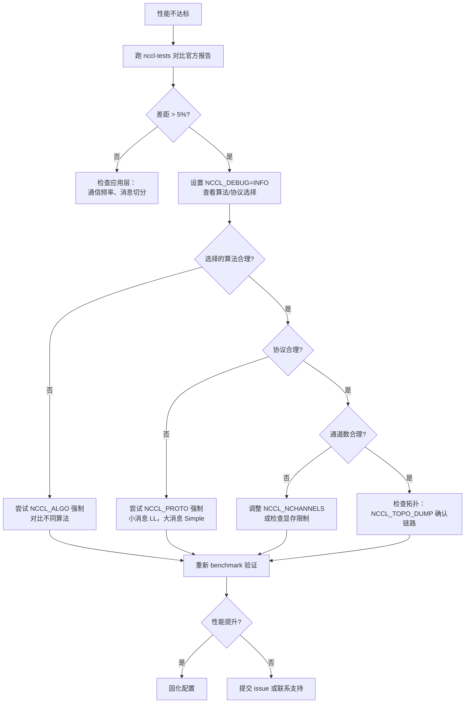

# Chapter 21: Performance Tuning in Practice: nccl-tests, Benchmarks & Methodology


上一章我们看到，用户自定义 kernel 如何通过设备侧 API 与 NCCL 通信原语协作，甚至将通信与计算融合进同一个 kernel。这打开了 NCCL 作为编程模型的可能性，但也带来一个现实问题：当通信性能不如预期时，该从哪里入手？NCCL 暴露了上百个 NCCL_PARAM，但真正决定一次集合通信走哪条路的，其实只有三个旋钮：算法（Algo）、协议（Proto）、通道数（nChannels）。本章把前 20 章的机制串成一条可操作的排查路径——先看性能报告定位现象，再读代价模型理解 NCCL 自己怎么选，最后用环境变量和 benchmark 验证你的假设。

## 21.1 性能报告：先建立「正常」的基准线

调优的第一步不是改参数，而是知道「正常」长什么样。如果你连当前系统的峰值带宽是多少都不清楚，任何调参都是盲猜。

NCCL 官方在 `docs/perf` 下发布参考性能数据，它的定位非常明确——不是产品级保证，而是对齐预期的参照点。

[FACT:docs/perf/README.md:3-14]
```
NCCL publishes reference performance data to:

1. Provide reference points that help users align performance expectations.
2. Help users validate their system setup.
3. Reduce repeated requests to the NCCL team for basic performance numbers.

These results are references, and NOT product-level guarantees that the same
performance is achievable on every system. Performance depends on a complex
combination of software versions, system configuration, hardware, and operating
conditions, including factors outside NCCL's control. A difference within 5% is
generally considered acceptable variance due to differences in the underlying
systems.
```

这里有两个关键信息，小白容易忽略：

第一，**5% 以内的差异属于正常波动**。这意味着你测出比官方低 3% 时，不要急着调参——先确认是不是测量噪声、GPU 时钟抖动、或者邻居任务干扰。

第二，**官方只发布峰值带宽，不发布延迟**。

[FACT:docs/perf/README.md:24-24]
```
We publish peak bandwidth for a selection of commonly used platforms. We do not
currently publish latency because it is typically more sensitive to factors
outside NCCL's control.
```

[INFERENCE] 为什么延迟不发布？因为延迟对系统状态极度敏感——CPU 频率、PCIe 链路状态、网卡固件版本、甚至 BIOS 的电源策略都会影响它。带宽在大消息下趋于饱和，相对稳定；延迟在小消息下由无数个微小环节叠加而成，任何一环抖动都会放大。所以调优时，**大消息看带宽，小消息看延迟**，这是两条不同的排查路径。

[FACT:docs/perf/README.md:24-24]
```
If your workload differs significantly from the published results, open an
issue in the [NCCL repository](https://github.com/NVIDIA/nccl/issues) or contact
NVIDIA Support. We will try our best to help.
```

**排查顺序的第一条**：先跑一个标准 benchmark（如 `nccl-tests` 的 `all_reduce_perf`），把结果和官方报告对比。如果差距在 5% 以内，说明系统配置没问题，性能瓶颈在你的应用层（比如通信频率、消息切分方式）；如果差距显著，才进入 NCCL 参数调优。

## 21.2 代价模型：NCCL 自己怎么选算法和协议

要调参，先得理解 NCCL 默认是怎么选的。它内部有一套「代价模型」（cost model），本质是一张查表 + 公式计算：给定消息大小、拓扑类型、rank 数，估算每种「算法 × 协议」组合的耗时，选最小的那个。

### Intuitive Architectural Model

把代价模型想象成导航软件。你输入起点终点（消息大小、拓扑），它内部对每条路线（算法/协议组合）估算时间，然后推荐最快的那条。导航的估算基于历史数据和道路等级，NCCL 的估算基于一张硬编码的延迟/带宽参数表。

如果没有这个模型，NCCL 就只能对所有场景用同一个固定算法——小消息会因启动开销过大而变慢，大消息会因带宽利用不足而变慢，系统会在两个极端都表现糟糕。

### 数据结构：模型表与调优上下文

代价模型的核心是 `modelMap` 数组，每个元素对应一种「算法/协议/对称内核」组合。

[FACT:src/tuning/cost_model.cc:230-277]
```
static struct ncclTuningModelEntry_t modelMap[] = {
    /*
Initialize default, static models here
{mod_init, mod_sim, mod_final, enabled}
Enable order: Broadcast, Reduce, AllGather, ReduceScatter, AllReduce
*/
  {ncclTuningTreeModelInit, ncclTuningTreeModelSim, nullptr, {0, 0, 0, 0, 1}},       // Tree/LL
  {ncclTuningTreeModelInit, ncclTuningTreeModelSim, nullptr, {0, 0, 0, 0, 1}},       // Tree/LL128
  {ncclTuningTreeModelInit, ncclTuningTreeModelSim, nullptr, {0, 0, 0, 0, 1}},       // Tree/Simple
  {ncclTuningRingModelInit, ncclTuningRingModelSim, nullptr, {1, 1, 1, 1, 1}},       // Ring/LL
  ...
```

每个条目有四个字段：`mod_init`（初始化函数）、`mod_sim`（模拟函数）、`mod_final`（清理函数）、`enabled`（5 个函数各自的启用标志）。`enabled` 数组的顺序是 `{Broadcast, Reduce, AllGather, ReduceScatter, AllReduce}`——注意这个顺序，后面读代码时会反复用到。

关键观察：**Tree 只在 AllReduce 上启用**（`{0,0,0,0,1}`），而 Ring 在所有函数上都启用（`{1,1,1,1,1}`）。[INFERENCE] 这是因为 Tree 算法的优势在于 AllReduce 的规约阶段可以并行，但对 AllGather/ReduceScatter 这类本质是环形流水的操作，Ring 更自然。

模型的具体参数存在 `ncclTunerConstants_t` 里，包含各拓扑下的基础延迟和带宽。

[FACT:src/tuning/cost_model.cc:142-152]
```
static const ncclTunerConstants_t ncclTunerConstantsDefaults = {
    // baseLatencies
  {
    {6.8, 14.0, 8.4},  // Tree
    {6.6, 14.0, 8.4},  // Ring
    {0, 0, 0},         // Collnet Direct
    {0, 0, 0},         // Collnet Chain
    {0, 0, 0},         // NVLS
    {0, 0, 0},         // NVLS Tree
    {8.0, 8.0, 8.0}    // PAT
  },
```

每个算法有三个基础延迟值，对应 LL / LL128 / Simple 三种协议。比如 Ring 的 `{6.6, 14.0, 8.4}` 意味着：LL 协议基础延迟 6.6 微秒，LL128 是 14.0，Simple 是 8.4。这些数字是 NVIDIA 在真实硬件上测出来的经验值。

硬件延迟则按拓扑类型（NVLink / PCI / NET）分别给出。

[FACT:src/tuning/cost_model.cc:153-184]
```
    // hwLatencies
  {
    /* NVLINK */
    {
      {0.6, 1.25, 4.0}, // Tree (LL/LL128/Simple)
      {0.6, 1.9, 3.4},  // Ring (LL/LL128/Simple)
      ...
    },
    /* PCI */
    {
      {1.0, 1.9, 4.0}, // Tree (LL/LL128/Simple)
      {1.0, 2.5, 5.7}, // Ring (LL/LL128/Simple)
      ...
    },
    /* NET */
    {
      {5.0, 8.5, 14},   // Tree (LL/LL128/Simple)
      {2.7, 4.0, 14.0}, // Ring (LL/LL128/Simple)
      ...
    },
  },
```

对比一下就能看出拓扑差异：NVLink 上 Ring/Simple 的每跳延迟是 3.4 微秒，PCI 上是 5.7，NET 上是 14.0。这就是为什么跨机通信慢——每一跳都要多花 10 微秒。

带宽参数按 GPU 架构分代给出。

[FACT:src/tuning/cost_model.cc:183-183]
```
    // llMaxBws
  {
    {39.0, 39.0, 20.4}, /* Volta-N1/Intel-N2/Intel-N4) */
    {87.7, 22.5 /*avg of ring & tree*/, 19.0}, /* Ampere-N1/AMD-N2/AMD-N4) */
    {141.0, 45.0 /*avg of ring & tree*/, 35.0}, /* Hopper-N1/AMD-N2/AMD-N4) */
    {2 * 141.2, 2 * 45.0 /*avg of ring & tree*/, 2 * 35.0}, /* Blackwell-N1/AMD-N2/AMD-N4) */
  },
```

每行对应一代架构，三个值分别是单机（N1）、双机（N2）、四机（N4）场景下的 LL 协议最大带宽。Hopper 单机 141 GB/s，Blackwell 翻倍到 282 GB/s——这解释了为什么新卡上同样的算法表现会好很多。

### 调优上下文：per-comm 的状态

每个通信域（communicator）持有一份 `ncclTuningContext_t`，保存这个 comm 的调优状态。

[FACT:src/include/tuning.h:81-95]
```
struct ncclTuningContext_t {
  // Persistant tuning parameters tied to a communicator.
  ncclTunerConstants_t tuningConstants;
  // State of the tuning models
  // Forced function is set via env var
  int forced[NCCL_NUM_FUNCTIONS];
  // Disabled tuning models are not execute and excluded from implemetation selection.
  int enabled[NCCL_TUNING_COUNT][NCCL_NUM_FUNCTIONS];
  // Store of model contexts per communicator.
  float generalLatencies[NCCL_NUM_FUNCTIONS][NCCL_NUM_ALGORITHMS][NCCL_NUM_PROTOCOLS];
  float generalBandwidths[NCCL_NUM_FUNCTIONS][NCCL_NUM_ALGORITHMS][NCCL_NUM_PROTOCOLS];

  ssize_t threadThresholds[NCCL_NUM_ALGORITHMS][NCCL_NUM_PROTOCOLS];
  int maxThreads[NCCL_NUM_ALGORITHMS][NCCL_NUM_PROTOCOLS];
};
```

四个关键字段：

- `forced[NCCL_NUM_FUNCTIONS]`：标记哪些函数被环境变量强制指定了算法/协议。这是 `NCCL_ALGO`/`NCCL_PROTO` 生效的落点。
- `enabled[NCCL_TUNING_COUNT][NCCL_NUM_FUNCTIONS]`：二维布尔表，标记某个模型对某个函数是否启用。被禁用的模型不参与选择。
- `generalLatencies` / `generalBandwidths`：三维数组，按「函数 × 算法 × 协议」存储估算的延迟和带宽。这是 `ncclTuningInit` 打印那张大表的来源。
- `threadThresholds` / `maxThreads`：线程数相关的阈值，决定每个 block 用多少线程。

### 场景驱动 Walkthrough：一次 AllReduce 的算法选择

假设你调用 `ncclAllReduce`，消息大小 1MB，8 卡单机 NVLink。NCCL 内部会构造一个 `ncclTuningInput_t`，然后调用 `ncclTuningCompute`。

[FACT:src/tuning/tuning.cc:180-202]
```
ncclResult_t ncclTuningCompute(struct ncclTuningInput_t* const input, struct ncclTuningResult_t* const result) {
  ncclResult_t ret = ncclSuccess;
  TRACE(NCCL_TUNING, ...);
  struct ncclTuningResultList_t tunings;
  tunings.head = nullptr;
  struct ncclTuningResult_t bestTuning = NCCL_TUNING_RESULT_INIT;
  // Set tuning to Ring/Simple for single rank case
  if (input->comm->nRanks <= 1) {
    bestTuning.algo = NCCL_ALGO_RING;
    bestTuning.proto = NCCL_PROTO_SIMPLE;
    ...
  } else {
    NCCLCHECKGOTO(ncclTuningComputeAllTunings(input, &tunings), ret, exit);
```

第一步：单 rank 直接返回 Ring/Simple，不做任何计算。这是短路优化——单卡没有通信，选什么算法都一样。

第二步：多 rank 时调用 `ncclTuningComputeAllTunings`，遍历所有候选组合。

[FACT:src/tuning/tuning.cc:128-149]
```
ncclResult_t ncclTuningComputeAllTunings(struct ncclTuningInput_t* const input,
                                         struct ncclTuningResultList_t* const tunings) {
  ncclResult_t ret = ncclSuccess;

  for (int i = 0; i < NCCL_TUNING_COUNT; i++) {
    struct ncclTuningResult_t tuning = NCCL_TUNING_RESULT_INIT;
    tuning.id = i;
    tuning.valid = 1;

    if (!(input->tuningMask & (1ULL << i))) {
      tuning.valid = 0;
      continue;
    }
    NCCLCHECK(ncclTuningExpandId(i, &tuning.algo, &tuning.proto, &tuning.symKernelId, &tuning.ceMethodId));
    NCCLCHECKGOTO(ncclTuningComputeTuning(i, input, &tuning), ret, fail);
    if (tuning.valid) NCCLCHECKGOTO(ncclTuningResultListPushFront(tunings, tuning), ret, fail);
  }
```

这里有个精妙的设计：`tuningMask` 是一个 64 位掩码，每一位对应一个候选组合。`NCCL_TUNING_MASK_GENERAL_KERNELS`、`NCCL_TUNING_MASK_SYM_KERNELS`、`NCCL_TUNING_MASK_CE` 分别圈定不同类别的候选。

[FACT:src/include/tuning.h:17-25]
```
#define NCCL_TUNING_SYM_KERNEL_ID_OFFSET (NCCL_NUM_ALGORITHMS * NCCL_NUM_PROTOCOLS)
#define NCCL_TUNING_CE_METHOD_ID_OFFSET (NCCL_TUNING_SYM_KERNEL_ID_OFFSET + ncclSymkKernelId_Count)
#define NCCL_TUNING_COUNT (NCCL_TUNING_CE_METHOD_ID_OFFSET + ncclCeMethodId_Count)

#define NCCL_TUNING_MASK_GENERAL_KERNELS ((1ULL << NCCL_TUNING_SYM_KERNEL_ID_OFFSET) - 1ULL)
#define NCCL_TUNING_MASK_SYM_KERNELS \
  ((1ULL << NCCL_TUNING_CE_METHOD_ID_OFFSET) - 1ULL - NCCL_TUNING_MASK_GENERAL_KERNELS)
#define NCCL_TUNING_MASK_CE ((1ULL << NCCL_TUNING_COUNT) - (1ULL << NCCL_TUNING_CE_METHOD_ID_OFFSET))
#define NCCL_TUNING_MASK_ALL ((1ULL << NCCL_TUNING_COUNT) - 1ULL)
```

掩码的布局是：低 `NCCL_NUM_ALGORITHMS × NCCL_NUM_PROTOCOLS` 位是传统「算法×协议」组合，中间 `ncclSymkKernelId_Count` 位是对称内核，高位是 CE（Copy Engine）方法。用位掩码而不是数组，是为了在 `ncclTuningCompute` 里快速判断「这个候选是否在本次调优范围内」。

第三步：对每个候选调用 `ncclTuningComputeTuning`，它转调 `ncclTuningCostModelSimModel`。

[FACT:src/tuning/cost_model.cc:470-497]
```
ncclResult_t ncclTuningCostModelSimModel(int id, struct ncclTuningInput_t* const input,
                                         struct ncclTuningResult_t* const result) {
  struct ncclTuningModelEntry_t* model = nullptr;
  ncclResult_t ret = ncclSuccess;
  result->forced = input->comm->tuningContext.forced[input->func];
  NCCLCHECKGOTO(getModelEntry(id, &model), ret, not_valid);
  if (model == nullptr) {
    ret = ncclInternalError;
    goto not_valid;
  }
  if (input->comm->tuningContext.enabled[id][input->func] == 0) {
    goto not_valid;
  }
  if (model->model != nullptr) {
    NCCLCHECKGOTO(model->model(input, result), ret, not_valid);
    if (result->timeUs <= 0.0) {
      goto not_valid;
    }
  } else {
    goto not_valid;
  }
exit:
  return ret;
not_valid:
  result->timeUs = NCCL_TUNING_IGNORE;
  result->valid = 0;
  goto exit;
}
```

注意 `not_valid` 标签的处理：任何一步失败（模型不存在、被禁用、模拟返回非正时间），都会把 `timeUs` 设为 `NCCL_TUNING_IGNORE`、`valid` 设为 0。这个候选就被排除在后续选择之外。

第四步：从所有有效候选中选耗时最小的。

[FACT:src/tuning/tuning.cc:155-173]
```
static ncclResult_t ncclTuningSelectBestTuning(struct ncclTuningResultList_t* tunings,
                                               struct ncclTuningResult_t* const bestTuning) {
  bestTuning->timeUs = FLT_MAX;
  float bestSelectionTimeUs = FLT_MAX;
  struct ncclTuningResultListNode* node = tunings->head;
  while (node != nullptr) {
    const struct ncclTuningResult_t& tuning = node->result;
    float selectionTimeUs = tuning.selectionTimeUs > 0.0f ? tuning.selectionTimeUs : tuning.timeUs;
    TRACE(NCCL_TUNING, "A/P/S %s/%s/%s, time: %f, selection time: %f", ...);
    if (selectionTimeUs < bestSelectionTimeUs) {
      *bestTuning = tuning;
      bestSelectionTimeUs = selectionTimeUs;
    }
    node = node->next;
  }
  return ncclSuccess;
}
```

这里有个细节：选择用的是 `selectionTimeUs`，如果它大于 0 就用它，否则回退到 `timeUs`。`selectionTimeUs` 是「选择时间」，可能包含了额外的惩罚项（比如某些算法在特定场景下要额外开销）。这给了代价模型一个「估算时间」和「选择时间」分离的能力。

### 流程图



这张图完整画出了从入口到最终结果的决策路径，包括单 rank 短路、掩码过滤、模型禁用、tuner 插件介入、CTAPolicy 覆盖等所有分支。

## 21.3 环境变量：真正影响性能的三个旋钮

理解了代价模型，就知道环境变量是怎么介入的。`NCCL_ALGO`、`NCCL_PROTO`、`NCCL_SYM_KERNEL` 这三个变量通过 `parseList` 解析后，直接修改 `enabled` 表，把不符合用户意图的候选全部禁用。

### 解析语法

`parseList` 支持的语法比大多数人想象的复杂。

[FACT:src/tuning/cost_model.cc:14-32]
```
// Parse a map of prefixes to a list of elements. The first prefix is
// optional and, if not present, the list of elements will be applied
// to all prefixes. Only the first list of elements can lack a
// prefix. Prefixes (if present) are followed by a colon. Lists of
// elements are comma delimited. Mappings of prefix to the lists of
// elements are semi-colon delimited.
//
// For example:
//
//     NCCL_ALGO="ring,collnetdirect;allreduce:tree,collnetdirect;broadcast:ring"
// Enable ring and collnetdirect for all functions, then select tree
// and collnetdirect for allreduce and ring for broadcast.
//
//     NCCL_PROTO="LL,Simple;allreduce:^LL"
// Enable LL and Simple for all functions, but everything except LL
// for allreduce.
//
//     NCCL_PROTO="^LL128;allreduce:LL128"
// Enable everything but LL128, but only LL128 for allreduce.
```

三种用法：

1. **全局列表**：`NCCL_ALGO="ring,tree"` —— 所有函数只用 ring 和 tree。
2. **按函数前缀**：`NCCL_ALGO="ring;allreduce:tree"` —— 默认 ring，但 allreduce 用 tree。
3. **排除语法**：`NCCL_PROTO="^LL128"` —— 除了 LL128 其他都启用。

`^` 前缀是关键——它表示「unset」，即从默认全启用中排除某个选项。

[FACT:src/tuning/cost_model.cc:59-67]
```
    int unset, set;
    if (elemList[0] == '^') {
      unset = 1;
      set = 0;
      elemList++;
    } else {
      unset = 0;
      set = 1;
    }
```

解析到 `^` 时，`unset=1`、`set=0`。随后对匹配的 prefix，先把整个列表填成 `unset`（全排除），再把列出的元素设为 `set`。

[FACT:src/tuning/cost_model.cc:69-96]
```
    bool foundPrefix = false;
    for (int p = 0; p < nprefixes; p++) {
      if (prefix && strcasecmp(prefix, prefixElems[p]) != 0) continue;
      foundPrefix = true;
      for (int e = 0; e < nelems; e++) list[p * nelems + e] = unset;

      tokStr = strdup(elemList);
      char* tmpStr;
      char* elem = strtok_r(tokStr, ",", &tmpStr);
      while (elem) {
        int e;
        for (e = 0; e < nelems; e++) {
          if (strcasecmp(elem, elems[e]) == 0) {
            list[p * nelems + e] = set;
            forced[p] = 1;
            break;
          }
        }
        if (e == nelems) {
          WARN("Unrecognized element token \"%s\" when parsing \"%s\"", elem, str);
          ret = ncclInvalidUsage;
          goto fail;
        }
        elem = strtok_r(NULL, ",", &tmpStr);
      }
```

注意 `forced[p] = 1` 这一行——只要用户显式列了某个元素，对应的函数就被标记为「强制」。这个标记后面会用来判断是否允许代价模型自由选择。

### 强制与禁用的交互

`ncclTuningCostModelInit` 里有一段关键逻辑，处理用户强制与环境变量、平台能力的交互。

[FACT:src/tuning/cost_model.cc:363-384]
```
    for (int f = 0; f < NCCL_NUM_FUNCTIONS; f++) {
      // Disable LL128 when 1) it is not supported on the platform, and 2) user did not explicitly request it.
      // protoEnable[..] == 2 indicates that user did not set NCCL_PROTO=LL128 explicitly.
      if (proto == NCCL_PROTO_LL128 && protoEnable[f * NCCL_NUM_PROTOCOLS + proto] == 2 &&
          !isLL128Enabled(comm->minCompCap, comm->maxCompCap, comm->graphs[algo].typeInter,
                          comm->graphs[algo].typeIntra, comm->nRanks, f, algo, comm->minDriverVersion)) {
        comm->tuningContext.enabled[i][f] = 0;
      }
      //  Check the user env vars only for functions that have a forced configuration and not already disabled.
      if (comm->tuningContext.forced[f] == 0 || comm->tuningContext.enabled[i][f] == 0) continue;
      comm->tuningContext.enabled[i][f] = 0;
      TRACE(NCCL_TUNING, "a/p/s %s/%s/%s enabled %d/%d/%d", ...);
      if (((algo != NCCL_ALGO_UNDEF && algoEnable[f * NCCL_NUM_ALGORITHMS + algo] != 0) &&
           (proto != NCCL_PROTO_UNDEF && protoEnable[f * NCCL_NUM_PROTOCOLS + proto] != 0)) ||
          (symKernelId != ncclSymkKernelId_Count && symKernelIdEnable[f * ncclSymkKernelId_Count + symKernelId] != 0)) {
        comm->tuningContext.enabled[i][f] = 1;
      }
    }
```

这段逻辑的顺序很重要：

1. **先处理 LL128 平台能力**：如果平台不支持 LL128（`isLL128Enabled` 返回 0）且用户没显式要求（`protoEnable == 2`），直接禁用。
2. **再处理用户强制**：如果这个函数被强制了（`forced[f] != 0`），先把它禁用（`enabled[i][f] = 0`），然后检查用户是否允许这个组合——允许就重新启用。

`protoEnable` 的值有三种：0（用户排除）、1（用户启用）、2（用户未提及，默认启用）。这个三态设计让「用户显式要求」和「平台默认」能区分开。

### 环境变量读取的缓存机制

所有 `NCCL_PARAM` 宏最终都走 `ncclLoadParam`。

[FACT:src/misc/param.cc:78-108]
```
int64_t ncclLoadParam(char const* env, int64_t deftVal, int64_t uninitialized, int64_t* cache, int8_t* noCache) {
  static std::mutex mutex;
  std::lock_guard<std::mutex> lock(mutex);

  // noCache is only load/stored within the mutex, no need for atomic
  if (*noCache == /*uninitialized*/ -1) ncclGetCachePolicy(env, noCache);

  if (COMPILER_ATOMIC_LOAD(cache, std::memory_order_relaxed) != uninitialized) {
    return COMPILER_ATOMIC_LOAD(cache, std::memory_order_relaxed);
  }

  // Read the environment variable
  const char* str = ncclGetEnv(env);
  int64_t value = deftVal;

  if (str && strlen(str) > 0) {
    errno = 0;
    char* end = nullptr;
    value = strtoll(str, &end, 0);
    // Preserve numeric-prefix parsing while rejecting non-numeric values.
    if (errno || end == str) {
      value = deftVal;
      ATTN("Invalid value %s for %s, using default %lld.", str, env, (long long)deftVal);
    } else {
      INFO(NCCL_ENV, "%s set by environment to %lld.", env, (long long)value);
    }
  }

  if (*noCache == /*cache*/ 0) COMPILER_ATOMIC_STORE(cache, value, std::memory_order_relaxed);
  return value;
}
```

这段代码有几个值得注意的设计：

**全局互斥锁**：`static std::mutex mutex` 保护整个读取过程。这意味着所有参数的首次读取是串行的。为什么用锁而不是无锁？因为参数读取只在初始化阶段发生，不在热路径上，锁的开销可以忽略，而正确性更重要。

**双重检查**：先原子读 `cache`，如果已初始化就直接返回。这避免了每次读参数都进锁——虽然锁本身在初始化后几乎不竞争，但原子读更快。

**缓存策略**：`noCache` 标志决定是否把读到的值写回 `cache`。某些参数（如需要动态响应的）可能禁用缓存，每次都重新读环境变量。

**错误处理**：`strtoll` 解析失败时用默认值，并打印 `ATTN` 警告。注意 `end == str` 的判断——如果字符串开头就不是数字，`end` 会等于 `str`，说明完全没解析出数字。

### 配置文件支持

环境变量不一定要从 shell 设置，NCCL 支持从配置文件读取。

[FACT:src/misc/param.cc:52-67]
```
static void initEnvFunc() {
  char confFilePath[1024];
  const char* userFile = std::getenv("NCCL_CONF_FILE");
  if (userFile && strlen(userFile) > 0) {
    snprintf(confFilePath, sizeof(confFilePath), "%s", userFile);
    setEnvFile(confFilePath);
  } else {
    const char* userDir = userHomeDir();
    if (userDir) {
      snprintf(confFilePath, sizeof(confFilePath), "%s/.nccl.conf", userDir);
      setEnvFile(confFilePath);
    }
  }
  snprintf(confFilePath, sizeof(confFilePath), "/etc/nccl.conf");
  setEnvFile(confFilePath);
}
```

加载顺序：`NCCL_CONF_FILE` 指定的文件（如果设置了）→ `~/.nccl.conf` → `/etc/nccl.conf`。后加载的会覆盖先加载的（因为 `setEnvFile` 调用 `ncclOsSetEnv`）。

[FACT:src/misc/param.cc:69-72]
```
void initEnv() {
  static std::once_flag once;
  std::call_once(once, initEnvFunc);
}
```

`std::call_once` 保证配置文件只加载一次，即使多个线程同时首次调用 `ncclGetEnv`。

## 21.4 通道数：被低估的性能旋钮

算法和协议决定「怎么走」，通道数决定「开几条路」。很多人调优时只关注前两个，忽略了通道数——但在大消息场景下，通道数往往是决定带宽利用率的关键。

### 通道数从哪来

`ncclTuningCompute` 在选出最佳算法/协议后，会调用 `ncclTuningGetChannels` 计算通道数。

[FACT:src/tuning/tuning.cc:233-235]
```
  if (bestTuning.algo != NCCL_ALGO_UNDEF && bestTuning.proto != NCCL_PROTO_UNDEF) {
    NCCLCHECKGOTO(ncclTuningGetChannels(input, &bestTuning), ret, exit);
  }
```

通道数的计算逻辑不在本章源码材料中，但可以从 `ncclTuningResult_t` 的字段看出它的作用。

[FACT:src/include/tuning.h:42-55]
```
struct ncclTuningResult_t {
  int id;
  int valid;
  float timeUs;
  float selectionTimeUs;
  int algo;
  int proto;
  int symKernelId;
  int ceMethodId;
  int nChannels;
  int maxChannels;
  int nWarps;
  int forced;
};
```

`nChannels` 是最终使用的通道数，`maxChannels` 是上限。`nWarps` 是每个 block 的 warp 数。

### CTAPolicy 对通道数的覆盖

有一段特殊逻辑处理 `NCCL_CTA_POLICY_EFFICIENCY` 策略。

[FACT:src/tuning/tuning.cc:236-257]
```
  // NCCL_CTA_POLICY_EFFICIENCY requires user (non-symmetric) buffer registration (currently unsupported with MNNVL).
  // Run after GetChannels so bestTuning.nChannels is valid. Skip when a tuner plugin owns selection
  // (same as pre-rearch). The NVLS-bit guard keeps this bias inside the candidate set: a per-call
  // algSelection may have narrowed tuningMask, so EFFICIENCY must not resurrect NVLS when excluded.
  if (input->comm->tuner == NULL && (input->CTAPolicy & NCCL_CTA_POLICY_EFFICIENCY) &&
      ncclGetEnv("NCCL_ALGO") == NULL && ncclGetEnv("NCCL_PROTO") == NULL && !input->comm->MNNVL &&
      (input->tuningMask & (1ull << (NCCL_ALGO_NVLS * NCCL_NUM_PROTOCOLS + NCCL_PROTO_SIMPLE)))) {
    if (input->regBuff && (input->func == ncclFuncAllGather || input->func == ncclFuncReduceScatter)) {
      if ((input->comm->nNodes > 1 && input->collNetSupport && input->nvlsSupport) ||
          (input->comm->nNodes == 1 && input->nvlsSupport)) {
        int recChannels;
        NCCLCHECKGOTO(ncclNvlsRegResourcesQuery(input->comm, input->func, &recChannels), ret, exit);
        if (recChannels <= bestTuning.nChannels) {
          bestTuning.algo = NCCL_ALGO_NVLS;
          bestTuning.proto = NCCL_PROTO_SIMPLE;
          bestTuning.nChannels = recChannels;
          bestTuning.maxChannels = recChannels;
          bestTuning.nWarps = input->comm->tuningContext.maxThreads[bestTuning.algo][bestTuning.proto] / WARP_SIZE;
        }
      }
    }
  }
```

这段代码的守卫条件非常密集，值得逐条解读：

1. `input->comm->tuner == NULL`：没有 tuner 插件时才走这段。插件拥有选择权时，NCCL 不干预。
2. `input->CTAPolicy & NCCL_CTA_POLICY_EFFICIENCY`：用户设置了效率优先策略。
3. `ncclGetEnv("NCCL_ALGO") == NULL && ncclGetEnv("NCCL_PROTO") == NULL`：用户没有强制算法/协议。如果强制了，尊重用户选择。
4. `!input->comm->MNNVL`：MNNVL 场景不支持。
5. `input->tuningMask & (1ull << (NCCL_ALGO_NVLS * NCCL_NUM_PROTOCOLS + NCCL_PROTO_SIMPLE))`：NVLS/Simple 在候选集内。这个守卫防止「复活」被排除的选项。

满足条件后，查询 NVLS 注册资源能支持的通道数，如果不超过当前选择，就切换到 NVLS 算法。

[INFERENCE] 为什么 EFFICIENCY 策略偏向 NVLS？因为 NVLS（NVLink SHARP）利用交换机硬件做规约，能减少 GPU 的计算和通信开销，在 AllGather/ReduceScatter 这类操作上效率更高。但它的通道数受限于硬件资源，所以需要 `ncclNvlsRegResourcesQuery` 查询实际可用量。

### 对称内核的回退逻辑

对称内核（symmetric kernel）是较新的特性，当它不可用时需要回退到通用内核。

[FACT:src/tuning/tuning.cc:258-298]
```
  if ((bestTuning.symKernelId != ncclSymkKernelId_Count ||
       (input->tuningMask & NCCL_TUNING_MASK_SYM_KERNELS && bestTuning.symKernelId == ncclSymkKernelId_Count)) &&
      bestTuning.algo == NCCL_ALGO_UNDEF && bestTuning.proto == NCCL_PROTO_UNDEF) {
    bool isLLKernel = (1 << bestTuning.symKernelId) & ncclSymkLLKernelMask();
    bool isOneThreadMultiGpus = input->comm->intraRanks > 1 && !ncclParamSingleProcMemRegEnable();
    bool needFallback = bestTuning.symKernelId != ncclSymkKernelId_Count ? false : true;

    // General kernel tuning structs if fallback is needed
    struct ncclTuningResult_t generalTuning = NCCL_TUNING_RESULT_INIT;
    struct ncclTuningInput_t generalInput = *input;
    generalInput.tuningMask = NCCL_TUNING_MASK_GENERAL_KERNELS;

    // Fallback logic for symmetric LL kernels:
    // - If both src and dst are registered, we don't fall back if a symmetric kernel is available.
    // - Otherwise, we have to fall back to generl kernel if running the selected symmetric LL kernel is
    //   not possible (if the buffers are not registered and we manage multiple GPUs).
    // - If the user forced a symmetric kernel via NCCL_SYM_KERNEL or requested preference for using
    //   symmetric kernels even without symmetric buffers via NCCL_SYM_NOWIN_ENABLE, we respect that.
    // - Otherwise, we query the general cost model and if it selects a non-LL proto, we pick that.
    if (bestTuning.symKernelId != ncclSymkKernelId_Count) {
      if (input->winRegType == ncclSymSendRegRecvReg) {
        needFallback = false;
      } else if (isLLKernel) {
        needFallback = isOneThreadMultiGpus && input->winRegType == ncclSymSendNonregRecvNonreg;
        if (!needFallback && !result->forced) {
          needFallback = !ncclParamSymNoWinEnable() && input->winRegType == ncclSymSendNonregRecvNonreg;
          if (!needFallback) {
            NOWARN(ncclTuningCompute(&generalInput, &generalTuning), NCCL_TUNING);
            needFallback = (generalTuning.proto != NCCL_PROTO_LL);
          }
        }
      }
    }
```

回退决策树：

- 如果发送和接收缓冲区都注册了（`ncclSymSendRegRecvReg`），不回退。
- 如果是 LL 内核且单线程管理多 GPU 且缓冲区未注册，回退。
- 如果用户没设置 `NCCL_SYM_NOWIN_ENABLE` 且缓冲区未注册，回退。
- 否则，查询通用代价模型，如果它选了非 LL 协议，回退。

[INFERENCE] 这个逻辑的核心是：对称 LL 内核需要缓冲区注册才能发挥优势。未注册时，LL 内核的优势（低延迟）可能被额外的地址转换开销抵消，所以回退到通用内核更划算。

### 无可用组合时的错误处理

如果所有候选都被排除，NCCL 会报错并给出诊断信息。

[FACT:src/tuning/tuning.cc:308-329]
```
  if ((bestTuning.algo == NCCL_ALGO_UNDEF || bestTuning.proto == NCCL_PROTO_UNDEF) &&
      bestTuning.symKernelId == ncclSymkKernelId_Count && bestTuning.ceMethodId == ncclCeMethodId_Count) {
    char ncclAlgoEnvStr[1024] = "";
    char ncclProtoEnvStr[1024] = "";
    char ncclSymKernelIdEnvStr[1024] = "";
    const char* symKernelIdEnv = ncclGetEnv("NCCL_SYM_KERNEL");
    if (symKernelIdEnv) {
      snprintf(ncclSymKernelIdEnvStr, 1023, " NCCL_SYM_KERNEL was set to %s.", symKernelIdEnv);
    }
    const char* algoEnv = ncclGetEnv("NCCL_ALGO");
    if (algoEnv) {
      snprintf(ncclAlgoEnvStr, 1023, " NCCL_ALGO was set to %s.", algoEnv);
    }
    const char* protoEnv = ncclGetEnv("NCCL_PROTO");
    if (protoEnv) {
      snprintf(ncclProtoEnvStr, 1023, " NCCL_PROTO was set to %s.", protoEnv);
    }
    WARN("No algorithm/protocol nor symKernelId available for function %s with datatype %s.%s%s%s",
         ncclFuncToString(input->func), ncclDatatypeToString(input->datatype), ncclAlgoEnvStr, ncclProtoEnvStr,
         ncclSymKernelIdEnvStr);
    ret = (algoEnv || protoEnv || symKernelIdEnv) ? ncclInvalidUsage : ncclInternalError;
  }
```

错误码的选择有讲究：如果用户设置了环境变量（`algoEnv || protoEnv || symKernelIdEnv`），返回 `ncclInvalidUsage`——这是用户的配置问题；否则返回 `ncclInternalError`——这是 NCCL 内部的问题（所有候选都被意外排除了）。

## 21.5 生产避坑指南

### 坑一：环境变量拼写错误导致静默回退

`parseList` 遇到无法识别的 token 会返回 `ncclInvalidUsage`，但如果你写的是 `NCCL_ALGO=RING`（大写），`strcasecmp` 会正确匹配。真正危险的是拼写错误，比如 `NCCL_ALGO=rnig`。

[FACT:src/tuning/cost_model.cc:87-91]
```
        if (e == nelems) {
          WARN("Unrecognized element token \"%s\" when parsing \"%s\"", elem, str);
          ret = ncclInvalidUsage;
          goto fail;
        }
```

这里会打印 WARN 并返回错误。但如果你没开 `NCCL_DEBUG=WARN`，可能看不到这条警告。**建议**：调优时始终设置 `NCCL_DEBUG=WARN` 或 `NCCL_DEBUG=INFO`，确保能看到配置解析的结果。

### 坑二：NCCL_ALGO 和 NCCL_PROTO 的交互

如果你设置 `NCCL_ALGO=tree` 但没设置 `NCCL_PROTO`，NCCL 会在 Tree 算法下选择最优协议。但如果你同时设置 `NCCL_ALGO=tree` 和 `NCCL_PROTO=LL`，而 Tree/LL 组合在某些函数上被禁用（比如 Tree 只在 AllReduce 启用），就会触发「无可用组合」错误。

[FACT:src/tuning/cost_model.cc:379-383]
```
      if (((algo != NCCL_ALGO_UNDEF && algoEnable[f * NCCL_NUM_ALGORITHMS + algo] != 0) &&
           (proto != NCCL_PROTO_UNDEF && protoEnable[f * NCCL_NUM_PROTOCOLS + proto] != 0)) ||
          (symKernelId != ncclSymkKernelId_Count && symKernelIdEnable[f * ncclSymkKernelId_Count + symKernelId] != 0)) {
        comm->tuningContext.enabled[i][f] = 1;
      }
```

只有当算法和协议**同时**被允许时，组合才启用。这是 AND 逻辑，不是 OR。

### 坑三：LL128 的平台限制

LL128 不是所有平台都支持。`isLL128Enabled` 检查了计算能力、驱动版本、连接类型。

[FACT:src/tuning/cost_model.cc:119-139]
```
static int isLL128Enabled(int minCompCap, int maxCompCap, int interType, int intraType, int nRanks, int func, int algo,
                          int minDriverVersion) {
  int ret = 1;
  if (ncclParamLl128C2c() && minCompCap >= 90 && (!RUBIN_AND_LATER(minCompCap) || minDriverVersion >= 13030)) {
    // Rubin, Blackwell, and Hopper: Enable LL128 for all P2C and PXN if CUDA supports it.
    ret &= (interType <= PATH_PXN);
  } else {
    // Enable LL128 only up to PXB. Don't enable LL128 over PxN because PxN can encapsulate PxB or P2C links.
    ret &= (interType <= PATH_PXB);
    if (!ncclParamLl128C2c() && minCompCap >= 90)
      INFO(
        NCCL_GRAPH | NCCL_TUNING,
        "Disabling LL128 over all PxN connections (PXB and C2C). This ensures that no C2C link will be used by LL128.");
  }
  ret &= (intraType <= PATH_NVB);
  // Enable LL128 for interoperability between GPUs with different compcap (Hopper and above)
  ret &= (minCompCap == maxCompCap || minCompCap >= 90);
  ret &= !(minCompCap < 70 || (minCompCap == 90 && CUDART_VERSION == 11080 && func == ncclFuncAllReduce &&
                               algo == NCCL_ALGO_RING && nRanks == 2));
  return ret;
}
```

几个关键限制：

- `minCompCap < 70`：Volta 之前的 GPU 不支持 LL128。
- `intraType <= PATH_NVB`：机内连接必须是 NVLink 级别。
- Hopper + CUDA 11.8 + AllReduce + Ring + 2 ranks：这是一个已知的 bug 场景，被显式排除。

**建议**：如果你的平台不支持 LL128，不要强行设置 `NCCL_PROTO=LL128`，否则会触发错误。让 NCCL 自动选择。

### 坑四：通道数与显存

通道数越多，需要的缓冲区越大。在显存紧张的场景下，过多的通道可能导致 OOM。

[FACT:src/tuning/tuning.cc:246-253]
```
        int recChannels;
        NCCLCHECKGOTO(ncclNvlsRegResourcesQuery(input->comm, input->func, &recChannels), ret, exit);
        if (recChannels <= bestTuning.nChannels) {
          bestTuning.algo = NCCL_ALGO_NVLS;
          bestTuning.proto = NCCL_PROTO_SIMPLE;
          bestTuning.nChannels = recChannels;
          bestTuning.maxChannels = recChannels;
          bestTuning.nWarps = input->comm->tuningContext.maxThreads[bestTuning.algo][bestTuning.proto] / WARP_SIZE;
        }
```

NVLS 的通道数由 `ncclNvlsRegResourcesQuery` 查询硬件资源决定，不是随意设置的。如果硬件资源不足，通道数会被限制。

## 21.6 调优决策流程

把前面的内容串起来，得到一个可操作的排查流程。



这个流程的核心思想是：**先定位，再调参，最后验证**。不要一上来就乱设环境变量。

## 本章Summary

本章把 NCCL 的调优路径拆成了四个层次：

1. **基准线**：用官方性能报告建立预期，5% 以内是正常波动，大消息看带宽、小消息看延迟。
2. **代价模型**：NCCL 内部用 `modelMap` 表 + 延迟/带宽参数估算每种组合的耗时，选最小的。理解这个模型是调参的前提。
3. **环境变量**：`NCCL_ALGO`、`NCCL_PROTO`、`NCCL_SYM_KERNEL` 通过 `parseList` 解析后修改 `enabled` 表，强制或排除特定组合。语法支持全局、按函数、排除三种模式。
4. **通道数**：由 `ncclTuningGetChannels` 计算，受硬件资源和 CTAPolicy 影响。

## 本章思考与自测

<details><summary>Q1: 如果把 `ncclTuningCompute` 中单 rank 短路逻辑（`input->comm->nRanks <= 1` 分支）去掉，会发生什么？在什么场景下会导致问题？</summary>

**参考解析**：

单 rank 短路在 [FACT:src/tuning/tuning.cc:191-200]：

```cpp
  // Set tuning to Ring/Simple for single rank case
  if (input->comm->nRanks <= 1) {
    bestTuning.algo = NCCL_ALGO_RING;
    bestTuning.proto = NCCL_PROTO_SIMPLE;
    bestTuning.symKernelId = ncclSymkKernelId_Count;
    bestTuning.ceMethodId = ncclCeMethodId_Count;
    bestTuning.nChannels = 0;
    bestTuning.maxChannels = 0;
    bestTuning.nWarps = 0;
    bestTuning.forced = 0;
  } else {
    NCCLCHECKGOTO(ncclTuningComputeAllTunings(input, &tunings), ret, exit);
    ...
```

如果去掉这个分支，单 rank 场景会进入 `ncclTuningComputeAllTunings`，遍历所有候选组合。问题在于：

1. **性能浪费**：单 rank 没有通信，所有算法的耗时估算都是纯开销，选哪个都一样。遍历所有候选是纯粹的浪费。
2. **可能选不出结果**：某些算法在单 rank 下可能被模型判定为无效（比如 Ring 需要至少 2 个 rank 才能形成环），导致 `tunings` 列表为空，`ncclTuningSelectBestTuning` 返回 `FLT_MAX` 的初始值，最终 `bestTuning.algo` 仍是 `NCCL_ALGO_UNDEF`。
3. **触发错误路径**：如果 `bestTuning.algo == NCCL_ALGO_UNDEF`，会进入 [FACT:src/tuning/tuning.cc:308-329] 的错误处理，打印 "No algorithm/protocol available" 警告，并返回 `ncclInternalError`。

所以这个短路不只是优化，更是正确性保证——单 rank 场景必须有一个确定的默认值。

</details>

<details><summary>Q2: `parseList` 中 `forced[p] = 1` 这行代码（[FACT:src/tuning/cost_model.cc:83]）的作用是什么？如果去掉它，`NCCL_ALGO=ring` 的行为会有什么变化？</summary>

**参考解析**：

`forced[p] = 1` 在 [FACT:src/tuning/cost_model.cc:80-85]：

```cpp
        for (e = 0; e < nelems; e++) {
          if (strcasecmp(elem, elems[e]) == 0) {
            list[p * nelems + e] = set;
            forced[p] = 1;
            break;
          }
        }
```

`forced` 数组在 `ncclTuningContext_t` 中定义（[

关键旋钮只有三个：算法、协议、通道数。其他参数大多是辅助诊断或特定场景优化。掌握了这条调优路径，你已经能让 NCCL 在多数场景下跑出接近硬件的性能。但性能之外，生产环境还有另一类更棘手的问题：那些看似正常的代码，可能在特定条件下挂死或出错。下一章我们将汇总 NCCL 在生产中的典型踩坑案例——死锁、超时、版本不匹配与常见误用，并看看 NCCL 内部是如何检测和报告这些问题的。