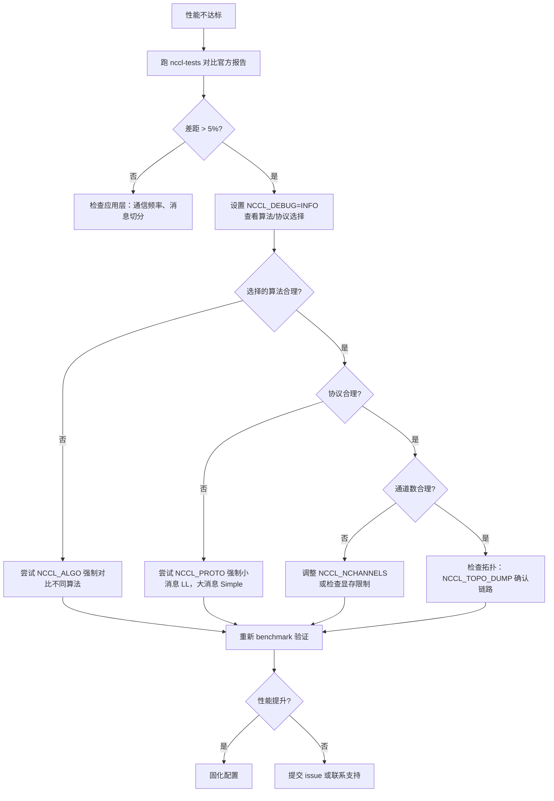

# Chapter 21: Performance Tuning in Practice: tuning hands-on, benchmark tools, and tuning methodology

In the previous chapter, we saw how user-defined kernels can cooperate with NCCL communication primitives through device-side APIs, and even fuse communication and computation into the same kernel. This opens up the possibility of NCCL as a programming model, but it also brings a practical question: when communication performance is not as expected, where should we start? NCCL exposes hundreds of NCCL_PARAMs, but what really determines which path a collective communication takes are actually only three knobs: algorithm (Algo), protocol (Proto), and number of channels (nChannels). This chapter strings together the mechanisms from the previous 20 chapters into an actionable troubleshooting path—first look at performance reports to locate the symptoms, then read the cost model to understand how NCCL itself chooses, and finally use environment variables and benchmarks to verify your hypothesis.

# 21.1 Performance Reports: First Establish a "Normal" Baseline

The first step in tuning is not to change parameters, but to know what "normal" looks like. If you do not even know what the peak bandwidth of the current system is, any parameter tuning is blind guessing.

NCCL officially publishes reference performance data under`docs/perf`, and its positioning is very clear—it is not a product-level guarantee, but a reference point for aligning expectations.

[FACT:docs/perf/README.md:3-14]

```
NCCL publishes reference performance data to:

1. Provide reference points that help users align performance expectations.
2. Help users validate their system setup.
3. Reduce repeated requests to the NCCL team for basic performance numbers.

These results are references, and NOT product-level guarantees that the same
performance is achievable on every system. Performance depends on a complex
combination of software versions, system configuration, hardware, and operating
conditions, including factors outside NCCL's control. A difference within 5% is
generally considered acceptable variance due to differences in the underlying
systems.
```

There are two key pieces of information here that beginners easily overlook:

First,**differences within 5% are normal fluctuation**. This means that when you measure 3% lower than the official result, do not rush to tune parameters—first confirm whether it is measurement noise, GPU clock jitter, or interference from neighboring jobs.

Second,**the official data only publishes peak bandwidth, not latency**。

[FACT:docs/perf/README.md:24-24]

```
We publish peak bandwidth for a selection of commonly used platforms. We do not
currently publish latency because it is typically more sensitive to factors
outside NCCL's control.
```

> **[Design Inference & Architectural Trade-offs]**
> Why is latency not published? Because latency is extremely sensitive to system state—CPU frequency, PCIe link status, NIC firmware version, and even the BIOS power policy can affect it. Bandwidth tends to saturate under large messages and is relatively stable; latency under small messages is formed by the superposition of countless tiny stages, and jitter in any one of them will be amplified. So when tuning,**large messages look at bandwidth, small messages look at latency**, and these are two different troubleshooting paths.

[FACT:docs/perf/README.md:24-24]

```
If your workload differs significantly from the published results, open an
issue in the [NCCL repository](https://github.com/NVIDIA/nccl/issues) or contact
NVIDIA Support. We will try our best to help.
```

**The first item in the troubleshooting order**: first run a standard benchmark (such as`nccl-tests`'s`all_reduce_perf`), and compare the result with the official report. If the gap is within 5%, it means the system configuration is fine, and the performance bottleneck is in your application layer (such as communication frequency or message splitting method); if the gap is significant, then proceed to NCCL parameter tuning.

# 21.2 Cost Model: How NCCL Itself Chooses Algorithms and Protocols

To tune parameters, you first need to understand how NCCL chooses by default. Internally it has a "cost model," which is essentially a lookup table plus formula calculation: given the message size, topology type, and number of ranks, it estimates the time cost of each "algorithm × protocol" combination and chooses the smallest one.

## Intuitive model

Think of the cost model as navigation software. You input the start and end points (message size, topology), and internally it estimates the time for each route (algorithm/protocol combination), then recommends the fastest one. Navigation estimates are based on historical data and road classes, while NCCL's estimates are based on a hardcoded table of latency/bandwidth parameters.

Without this model, NCCL could only use the same fixed algorithm for all scenarios—small messages would become slower due to excessive startup overhead, and large messages would become slower due to insufficient bandwidth utilization, so the system would perform poorly at both extremes.

## Data structures: model table and tuning context

The core of the cost model is the`modelMap`array, and each element corresponds to an "algorithm/protocol/symmetric kernel" combination.

[FACT:src/tuning/cost_model.cc:230-277]

```
static struct ncclTuningModelEntry_t modelMap[] = {
    /*
Initialize default, static models here
{mod_init, mod_sim, mod_final, enabled}
Enable order: Broadcast, Reduce, AllGather, ReduceScatter, AllReduce
*/
  {ncclTuningTreeModelInit, ncclTuningTreeModelSim, nullptr, {0, 0, 0, 0, 1}},       // Tree/LL
  {ncclTuningTreeModelInit, ncclTuningTreeModelSim, nullptr, {0, 0, 0, 0, 1}},       // Tree/LL128
  {ncclTuningTreeModelInit, ncclTuningTreeModelSim, nullptr, {0, 0, 0, 0, 1}},       // Tree/Simple
  {ncclTuningRingModelInit, ncclTuningRingModelSim, nullptr, {1, 1, 1, 1, 1}},       // Ring/LL
  ...
```

Each entry has four fields:`mod_init`(initialization function),`mod_sim`(simulation function),`mod_final`(cleanup function),`enabled`(enable flags for each of the 5 functions).`enabled`The order of the`{Broadcast, Reduce, AllGather, ReduceScatter, AllReduce}`array is

> **[Design Inference & Architectural Trade-offs]**
> [Design inference and architectural trade-offs]**Key observation:**（`{0,0,0,0,1}`Tree is only enabled for AllReduce`{1,1,1,1,1}`). This is because the advantage of the Tree algorithm lies in the fact that the reduction phase of AllReduce can be parallelized, but for operations like AllGather/ReduceScatter that are essentially ring-based pipelines, Ring is more natural.

The specific parameters of the model are stored in`ncclTunerConstants_t`, including the base latency and bandwidth under each topology.

[FACT:src/tuning/cost_model.cc:142-152]

```
static const ncclTunerConstants_t ncclTunerConstantsDefaults = {
    // baseLatencies
  {
    {6.8, 14.0, 8.4},  // Tree
    {6.6, 14.0, 8.4},  // Ring
    {0, 0, 0},         // Collnet Direct
    {0, 0, 0},         // Collnet Chain
    {0, 0, 0},         // NVLS
    {0, 0, 0},         // NVLS Tree
    {8.0, 8.0, 8.0}    // PAT
  },
```

Each algorithm has three base latency values, corresponding to the three protocols LL / LL128 / Simple. For example, Ring's`{6.6, 14.0, 8.4}`means: LL protocol base latency 6.6 microseconds, LL128 is 14.0, Simple is 8.4. These numbers are empirical values measured by NVIDIA on real hardware.

Hardware latency is given separately by topology type (NVLink / PCI / NET).

[FACT:src/tuning/cost_model.cc:153-184]

```
    // hwLatencies
  {
    /* NVLINK */
    {
      {0.6, 1.25, 4.0}, // Tree (LL/LL128/Simple)
      {0.6, 1.9, 3.4},  // Ring (LL/LL128/Simple)
      ...
    },
    /* PCI */
    {
      {1.0, 1.9, 4.0}, // Tree (LL/LL128/Simple)
      {1.0, 2.5, 5.7}, // Ring (LL/LL128/Simple)
      ...
    },
    /* NET */
    {
      {5.0, 8.5, 14},   // Tree (LL/LL128/Simple)
      {2.7, 4.0, 14.0}, // Ring (LL/LL128/Simple)
      ...
    },
  },
```

A comparison reveals the topology differences: on NVLink, the per-hop latency of Ring/Simple is 3.4 microseconds, on PCI it is 5.7, and on NET it is 14.0. This is why cross-machine communication is slow—each hop costs an extra 10 microseconds.

Bandwidth parameters are given by GPU architecture generation.

[FACT:src/tuning/cost_model.cc:183-183]

```
    // llMaxBws
  {
    {39.0, 39.0, 20.4}, /* Volta-N1/Intel-N2/Intel-N4) */
    {87.7, 22.5 /*avg of ring & tree*/, 19.0}, /* Ampere-N1/AMD-N2/AMD-N4) */
    {141.0, 45.0 /*avg of ring & tree*/, 35.0}, /* Hopper-N1/AMD-N2/AMD-N4) */
    {2 * 141.2, 2 * 45.0 /*avg of ring & tree*/, 2 * 35.0}, /* Blackwell-N1/AMD-N2/AMD-N4) */
  },
```

Each row corresponds to one architecture generation, and the three values are the maximum bandwidth of the LL protocol under single-machine (N1), dual-machine (N2), and quad-machine (N4) scenarios, respectively. Hopper single-machine is 141 GB/s, and Blackwell doubles it to 282 GB/s—this explains why the same algorithm performs much better on new cards.

## Tuning context: per-comm state

Each communicator holds a copy of`ncclTuningContext_t`, which stores the tuning state of this comm.

[FACT:src/include/tuning.h:81-95]

```
struct ncclTuningContext_t {
  // Persistant tuning parameters tied to a communicator.
  ncclTunerConstants_t tuningConstants;
  // State of the tuning models
  // Forced function is set via env var
  int forced[NCCL_NUM_FUNCTIONS];
  // Disabled tuning models are not execute and excluded from implemetation selection.
  int enabled[NCCL_TUNING_COUNT][NCCL_NUM_FUNCTIONS];
  // Store of model contexts per communicator.
  float generalLatencies[NCCL_NUM_FUNCTIONS][NCCL_NUM_ALGORITHMS][NCCL_NUM_PROTOCOLS];
  float generalBandwidths[NCCL_NUM_FUNCTIONS][NCCL_NUM_ALGORITHMS][NCCL_NUM_PROTOCOLS];

  ssize_t threadThresholds[NCCL_NUM_ALGORITHMS][NCCL_NUM_PROTOCOLS];
  int maxThreads[NCCL_NUM_ALGORITHMS][NCCL_NUM_PROTOCOLS];
};
```

Four key fields:

- `forced[NCCL_NUM_FUNCTIONS]`: marks which functions have their algorithm/protocol forcibly specified by environment variables. This is where`NCCL_ALGO`/`NCCL_PROTO`takes effect.
- `enabled[NCCL_TUNING_COUNT][NCCL_NUM_FUNCTIONS]`: a two-dimensional boolean table, marking whether a certain model is enabled for a certain function. Disabled models do not participate in selection.
- `generalLatencies` / `generalBandwidths`: a three-dimensional array, storing the estimated latency and bandwidth by "function × algorithm × protocol". This is the source of the large table printed by`ncclTuningInit`.
- `threadThresholds` / `maxThreads`: thresholds related to the number of threads, determining how many threads each block uses.

## Scenario-driven Walkthrough: Algorithm selection for one AllReduce

Suppose you call`ncclAllReduce`, with a message size of 1MB, 8 cards single-machine NVLink. Internally, NCCL will construct a`ncclTuningInput_t`, and then call`ncclTuningCompute`。

[FACT:src/tuning/tuning.cc:180-202]

```
ncclResult_t ncclTuningCompute(struct ncclTuningInput_t* const input, struct ncclTuningResult_t* const result) {
  ncclResult_t ret = ncclSuccess;
  TRACE(NCCL_TUNING, ...);
  struct ncclTuningResultList_t tunings;
  tunings.head = nullptr;
  struct ncclTuningResult_t bestTuning = NCCL_TUNING_RESULT_INIT;
  // Set tuning to Ring/Simple for single rank case
  if (input->comm->nRanks tuningMask & (1ULL forced = input->comm->tuningContext.forced[input->func];
  NCCLCHECKGOTO(getModelEntry(id, &model), ret, not_valid);
  if (model == nullptr) {
    ret = ncclInternalError;
    goto not_valid;
  }
  if (input->comm->tuningContext.enabled[id][input->func] == 0) {
    goto not_valid;
  }
  if (model->model != nullptr) {
    NCCLCHECKGOTO(model->model(input, result), ret, not_valid);
    if (result->timeUs timeUs = NCCL_TUNING_IGNORE;
  result->valid = 0;
  goto exit;
}
```

Note the handling of the`not_valid`label: if any step fails (model does not exist, is disabled, or simulation returns a non-positive time), it will set`timeUs`to`NCCL_TUNING_IGNORE`、`valid`and set it to 0. This candidate is then excluded from subsequent selection.

Step 4: Select the one with the minimum cost from all valid candidates.

[FACT:src/tuning/tuning.cc:155-173]

```
static ncclResult_t ncclTuningSelectBestTuning(struct ncclTuningResultList_t* tunings,
                                               struct ncclTuningResult_t* const bestTuning) {
  bestTuning->timeUs = FLT_MAX;
  float bestSelectionTimeUs = FLT_MAX;
  struct ncclTuningResultListNode* node = tunings->head;
  while (node != nullptr) {
    const struct ncclTuningResult_t& tuning = node->result;
    float selectionTimeUs = tuning.selectionTimeUs > 0.0f ? tuning.selectionTimeUs : tuning.timeUs;
    TRACE(NCCL_TUNING, "A/P/S %s/%s/%s, time: %f, selection time: %f", ...);
    if (selectionTimeUs next;
  }
  return ncclSuccess;
}
```

There is a detail here: the selection uses`selectionTimeUs`, and if it is greater than 0, it is used; otherwise it falls back to`timeUs`。`selectionTimeUs`is the "selection time", which may include additional penalty terms (for example, some algorithms incur extra overhead in specific scenarios). This gives the cost model the ability to separate "estimated time" and "selection time".

## Flowchart

```mermaid
flowchart TD
    start["ncclTuningCompute(input, result)"] --> check_ranks{"comm->nRanks |是| single["bestTuning = Ring/SimplenChannels = 0"]
    check_ranks -->|否| all["ncclTuningComputeAllTunings()"]
    all --> loop{"遍历 i in NCCL_TUNING_COUNT"}
    loop -->|mask 未命中| skip["tuning.valid = 0continue"]
    loop -->|mask 命中| expand["ncclTuningExpandId(i, ...)"]
    expand --> sim["ncclTuningComputeTuning()→ ncclTuningCostModelSimModel()"]
    sim --> sim_check{"enabled[id][func] != 0且 model->model != nullptr?"}
    sim_check -->|否| invalid["timeUs = NCCL_TUNING_IGNOREvalid = 0"]
    sim_check -->|是| push["ncclTuningResultListPushFront()"]
    skip --> loop
    invalid --> loop
    push --> loop
    loop -->|遍历结束| tuner_check{"comm->tuner != NULL?"}
    tuner_check -->|是| plugin["tuner->getCollInfo()覆盖 generalTable"]
    tuner_check -->|否| select["ncclTuningSelectBestTuning()"]
    plugin --> select
    select --> channels["ncclTuningGetChannels()"]
    channels --> eff{"CTAPolicy & EFFICIENCY且 NCCL_ALGO/NCCL_PROTO 未设置?"}
    eff -->|是| nvls["尝试 NVLS 覆盖ncclNvlsRegResourcesQuery()"]
    eff -->|否| done["*result = bestTuning"]
    nvls --> done
    single --> done
```

This diagram fully depicts the decision path from the entry point to the final result, including all branches such as single-rank short-circuiting, mask filtering, model disabling, tuner plugin intervention, and CTAPolicy override.

# 21.3 Environment variables: the three knobs that truly affect performance

Once you understand the cost model, you know how environment variables intervene.`NCCL_ALGO`、`NCCL_PROTO`、`NCCL_SYM_KERNEL`These three variables, after being parsed by`parseList`, directly modify the`enabled`table, disabling all candidates that do not match the user's intent.

## Parsing syntax

`parseList`The syntax supported by

[FACT:src/tuning/cost_model.cc:14-32]

```
// Parse a map of prefixes to a list of elements. The first prefix is
// optional and, if not present, the list of elements will be applied
// to all prefixes. Only the first list of elements can lack a
// prefix. Prefixes (if present) are followed by a colon. Lists of
// elements are comma delimited. Mappings of prefix to the lists of
// elements are semi-colon delimited.
//
// For example:
//
//     NCCL_ALGO="ring,collnetdirect;allreduce:tree,collnetdirect;broadcast:ring"
// Enable ring and collnetdirect for all functions, then select tree
// and collnetdirect for allreduce and ring for broadcast.
//
//     NCCL_PROTO="LL,Simple;allreduce:^LL"
// Enable LL and Simple for all functions, but everything except LL
// for allreduce.
//
//     NCCL_PROTO="^LL128;allreduce:LL128"
// Enable everything but LL128, but only LL128 for allreduce.
```

Copy

1. **Three usages:**：`NCCL_ALGO="ring,tree"`Global list

2. **— all functions use only ring and tree.**：`NCCL_ALGO="ring;allreduce:tree"`By function prefix

3. **— default is ring, but allreduce uses tree.**：`NCCL_PROTO="^LL128"`Exclusion syntax

`^`— everything except LL128 is enabled.

[FACT:src/tuning/cost_model.cc:59-67]

```
    int unset, set;
    if (elemList[0] == '^') {
      unset = 1;
      set = 0;
      elemList++;
    } else {
      unset = 0;
      set = 1;
    }
```

prefix is the key—it means "unset", i.e., excluding a certain option from the default of all-enabled.`^`Copy`unset=1`、`set=0`When parsing to`unset`,`set`。

[FACT:src/tuning/cost_model.cc:69-96]

```
    bool foundPrefix = false;
    for (int p = 0; p minCompCap, comm->maxCompCap, comm->graphs[algo].typeInter,
                          comm->graphs[algo].typeIntra, comm->nRanks, f, algo, comm->minDriverVersion)) {
        comm->tuningContext.enabled[i][f] = 0;
      }
      //  Check the user env vars only for functions that have a forced configuration and not already disabled.
      if (comm->tuningContext.forced[f] == 0 || comm->tuningContext.enabled[i][f] == 0) continue;
      comm->tuningContext.enabled[i][f] = 0;
      TRACE(NCCL_TUNING, "a/p/s %s/%s/%s enabled %d/%d/%d", ...);
      if (((algo != NCCL_ALGO_UNDEF && algoEnable[f * NCCL_NUM_ALGORITHMS + algo] != 0) &&
           (proto != NCCL_PROTO_UNDEF && protoEnable[f * NCCL_NUM_PROTOCOLS + proto] != 0)) ||
          (symKernelId != ncclSymkKernelId_Count && symKernelIdEnable[f * ncclSymkKernelId_Count + symKernelId] != 0)) {
        comm->tuningContext.enabled[i][f] = 1;
      }
    }
```

There is a key piece of logic in

1. **that handles the interaction between user forcing and environment variables and platform capabilities.**Copy`isLL128Enabled`The order of this logic is important:`protoEnable == 2`First handle LL128 platform capability

2. **: if the platform does not support LL128 (**returns 0) and the user did not explicitly request it (`forced[f] != 0`), disable it directly.`enabled[i][f] = 0`), then check whether the user allows this combination—if allowed, re-enable it.

`protoEnable`has three values: 0 (user excluded), 1 (user enabled), 2 (user did not mention, enabled by default). This tri-state design allows "explicit user request" and "platform default" to be distinguished.

## Caching Mechanism for Environment Variable Reads

All`NCCL_PARAM`macros ultimately go through`ncclLoadParam`。

[FACT:src/misc/param.cc:78-108]

```
int64_t ncclLoadParam(char const* env, int64_t deftVal, int64_t uninitialized, int64_t* cache, int8_t* noCache) {
  static std::mutex mutex;
  std::lock_guard lock(mutex);

  // noCache is only load/stored within the mutex, no need for atomic
  if (*noCache == /*uninitialized*/ -1) ncclGetCachePolicy(env, noCache);

  if (COMPILER_ATOMIC_LOAD(cache, std::memory_order_relaxed) != uninitialized) {
    return COMPILER_ATOMIC_LOAD(cache, std::memory_order_relaxed);
  }

  // Read the environment variable
  const char* str = ncclGetEnv(env);
  int64_t value = deftVal;

  if (str && strlen(str) > 0) {
    errno = 0;
    char* end = nullptr;
    value = strtoll(str, &end, 0);
    // Preserve numeric-prefix parsing while rejecting non-numeric values.
    if (errno || end == str) {
      value = deftVal;
      ATTN("Invalid value %s for %s, using default %lld.", str, env, (long long)deftVal);
    } else {
      INFO(NCCL_ENV, "%s set by environment to %lld.", env, (long long)value);
    }
  }

  if (*noCache == /*cache*/ 0) COMPILER_ATOMIC_STORE(cache, value, std::memory_order_relaxed);
  return value;
}
```

This code has several noteworthy design points:

**Global Mutex**：`static std::mutex mutex`protects the entire read process. This means the first read of all parameters is serialized. Why use a lock instead of lock-free? Because parameter reads only happen during the initialization phase, not on the hot path, so the lock overhead is negligible, while correctness is more important.

**Double-Check**: first atomically read`cache`, and if already initialized, return directly. This avoids entering the lock every time a parameter is read—although the lock itself has almost no contention after initialization, atomic reads are faster.

**Caching Strategy**：`noCache`flag determines whether to write the read value back to`cache`. Some parameters (such as those requiring dynamic response) may disable caching and re-read the environment variable every time.

**Error Handling**：`strtoll`When parsing fails, use the default value and print`ATTN`warning. Note the`end == str`check—if the string does not start with a digit,`end`will equal`str`, indicating that no number was parsed at all.

## Configuration File Support

Environment variables do not necessarily have to be set from the shell; NCCL supports reading from configuration files.

[FACT:src/misc/param.cc:52-67]

```
static void initEnvFunc() {
  char confFilePath[1024];
  const char* userFile = std::getenv("NCCL_CONF_FILE");
  if (userFile && strlen(userFile) > 0) {
    snprintf(confFilePath, sizeof(confFilePath), "%s", userFile);
    setEnvFile(confFilePath);
  } else {
    const char* userDir = userHomeDir();
    if (userDir) {
      snprintf(confFilePath, sizeof(confFilePath), "%s/.nccl.conf", userDir);
      setEnvFile(confFilePath);
    }
  }
  snprintf(confFilePath, sizeof(confFilePath), "/etc/nccl.conf");
  setEnvFile(confFilePath);
}
```

Load order:`NCCL_CONF_FILE`the specified file (if set) →`~/.nccl.conf` → `/etc/nccl.conf`. Later loads override earlier ones (because`setEnvFile`calls`ncclOsSetEnv`）。

[FACT:src/misc/param.cc:69-72]

```
void initEnv() {
  static std::once_flag once;
  std::call_once(once, initEnvFunc);
}
```

`std::call_once`ensures the configuration file is loaded only once, even if multiple threads call it for the first time simultaneously`ncclGetEnv`。

# 21.4 Number of Channels: The Underestimated Performance Knob

Algorithms and protocols determine "how to go"; the number of channels determines "how many paths to open." Many people focus only on the first two when tuning and ignore the number of channels—but in large-message scenarios, the number of channels is often the key to bandwidth utilization.

## Where the Number of Channels Comes From

`ncclTuningCompute`After selecting the best algorithm/protocol, it calls`ncclTuningGetChannels`to calculate the number of channels.

[FACT:src/tuning/tuning.cc:233-235]

```
  if (bestTuning.algo != NCCL_ALGO_UNDEF && bestTuning.proto != NCCL_PROTO_UNDEF) {
    NCCLCHECKGOTO(ncclTuningGetChannels(input, &bestTuning), ret, exit);
  }
```

The calculation logic for the number of channels is not in this chapter's source material, but its role can be seen from the fields of`ncclTuningResult_t`.

[FACT:src/include/tuning.h:42-55]

```
struct ncclTuningResult_t {
  int id;
  int valid;
  float timeUs;
  float selectionTimeUs;
  int algo;
  int proto;
  int symKernelId;
  int ceMethodId;
  int nChannels;
  int maxChannels;
  int nWarps;
  int forced;
};
```

`nChannels`is the final number of channels used,`maxChannels`is the upper limit.`nWarps`is the number of warps per block.

## CTAPolicy Override of the Number of Channels

There is a special piece of logic handling the`NCCL_CTA_POLICY_EFFICIENCY`policy.

[FACT:src/tuning/tuning.cc:236-257]

```
  // NCCL_CTA_POLICY_EFFICIENCY requires user (non-symmetric) buffer registration (currently unsupported with MNNVL).
  // Run after GetChannels so bestTuning.nChannels is valid. Skip when a tuner plugin owns selection
  // (same as pre-rearch). The NVLS-bit guard keeps this bias inside the candidate set: a per-call
  // algSelection may have narrowed tuningMask, so EFFICIENCY must not resurrect NVLS when excluded.
  if (input->comm->tuner == NULL && (input->CTAPolicy & NCCL_CTA_POLICY_EFFICIENCY) &&
      ncclGetEnv("NCCL_ALGO") == NULL && ncclGetEnv("NCCL_PROTO") == NULL && !input->comm->MNNVL &&
      (input->tuningMask & (1ull regBuff && (input->func == ncclFuncAllGather || input->func == ncclFuncReduceScatter)) {
      if ((input->comm->nNodes > 1 && input->collNetSupport && input->nvlsSupport) ||
          (input->comm->nNodes == 1 && input->nvlsSupport)) {
        int recChannels;
        NCCLCHECKGOTO(ncclNvlsRegResourcesQuery(input->comm, input->func, &recChannels), ret, exit);
        if (recChannels comm->tuningContext.maxThreads[bestTuning.algo][bestTuning.proto] / WARP_SIZE;
        }
      }
    }
  }
```

The guard conditions in this code are very dense and worth interpreting one by one:

1. `input->comm->tuner == NULL`: only take this path when there is no tuner plugin. When the plugin has the right to choose, NCCL does not intervene.

2. `input->CTAPolicy & NCCL_CTA_POLICY_EFFICIENCY`: the user has set the efficiency-first policy.

3. `ncclGetEnv("NCCL_ALGO") == NULL && ncclGetEnv("NCCL_PROTO") == NULL`: the user has not forced an algorithm/protocol. If forced, respect the user's choice.

4. `!input->comm->MNNVL`: not supported in the MNNVL scenario.

5. `input->tuningMask & (1ull << (NCCL_ALGO_NVLS * NCCL_NUM_PROTOCOLS + NCCL_PROTO_SIMPLE))`: NVLS/Simple is in the candidate set. This guard prevents "reviving" excluded options.

After the conditions are met, query the number of channels supported by NVLS registered resources, and if it does not exceed the current selection, switch to the NVLS algorithm.

> **[Design Inference & Architectural Trade-offs]**
> Why does the EFFICIENCY policy favor NVLS? Because NVLS (NVLink SHARP) uses switch hardware for reduction, which can reduce GPU computation and communication overhead and is more efficient for operations such as AllGather/ReduceScatter. However, its number of channels is limited by hardware resources, so`ncclNvlsRegResourcesQuery`is needed to query the actual available amount.

## Fallback Logic for Symmetric Kernels

Symmetric kernels are a newer feature, and when they are unavailable, they need to fall back to general kernels.

[FACT:src/tuning/tuning.cc:258-298]

```
  if ((bestTuning.symKernelId != ncclSymkKernelId_Count ||
       (input->tuningMask & NCCL_TUNING_MASK_SYM_KERNELS && bestTuning.symKernelId == ncclSymkKernelId_Count)) &&
      bestTuning.algo == NCCL_ALGO_UNDEF && bestTuning.proto == NCCL_PROTO_UNDEF) {
    bool isLLKernel = (1 comm->intraRanks > 1 && !ncclParamSingleProcMemRegEnable();
    bool needFallback = bestTuning.symKernelId != ncclSymkKernelId_Count ? false : true;

    // General kernel tuning structs if fallback is needed
    struct ncclTuningResult_t generalTuning = NCCL_TUNING_RESULT_INIT;
    struct ncclTuningInput_t generalInput = *input;
    generalInput.tuningMask = NCCL_TUNING_MASK_GENERAL_KERNELS;

    // Fallback logic for symmetric LL kernels:
    // - If both src and dst are registered, we don't fall back if a symmetric kernel is available.
    // - Otherwise, we have to fall back to generl kernel if running the selected symmetric LL kernel is
    //   not possible (if the buffers are not registered and we manage multiple GPUs).
    // - If the user forced a symmetric kernel via NCCL_SYM_KERNEL or requested preference for using
    //   symmetric kernels even without symmetric buffers via NCCL_SYM_NOWIN_ENABLE, we respect that.
    // - Otherwise, we query the general cost model and if it selects a non-LL proto, we pick that.
    if (bestTuning.symKernelId != ncclSymkKernelId_Count) {
      if (input->winRegType == ncclSymSendRegRecvReg) {
        needFallback = false;
      } else if (isLLKernel) {
        needFallback = isOneThreadMultiGpus && input->winRegType == ncclSymSendNonregRecvNonreg;
        if (!needFallback && !result->forced) {
          needFallback = !ncclParamSymNoWinEnable() && input->winRegType == ncclSymSendNonregRecvNonreg;
          if (!needFallback) {
            NOWARN(ncclTuningCompute(&generalInput, &generalTuning), NCCL_TUNING);
            needFallback = (generalTuning.proto != NCCL_PROTO_LL);
          }
        }
      }
    }
```

Fallback decision tree:

- If both send and receive buffers are registered (`ncclSymSendRegRecvReg`), do not fall back.
- If it is an LL kernel and a single thread manages multiple GPUs and the buffers are not registered, fall back.
- If the user has not set`NCCL_SYM_NOWIN_ENABLE`and the buffers are not registered, fall back.
- Otherwise, query the general cost model, and if it selects a non-LL protocol, fall back.

> **[Design Inference & Architectural Trade-offs]**
> The core of this logic is: symmetric LL kernels need buffer registration to leverage their advantages. When unregistered, the advantage of LL kernels (low latency) may be offset by additional address translation overhead, so falling back to general kernels is more worthwhile.

## Error Handling When No Combination Is Available

If all candidates are excluded, NCCL reports an error and provides diagnostic information.

[FACT:src/tuning/tuning.cc:308-329]

```
  if ((bestTuning.algo == NCCL_ALGO_UNDEF || bestTuning.proto == NCCL_PROTO_UNDEF) &&
      bestTuning.symKernelId == ncclSymkKernelId_Count && bestTuning.ceMethodId == ncclCeMethodId_Count) {
    char ncclAlgoEnvStr[1024] = "";
    char ncclProtoEnvStr[1024] = "";
    char ncclSymKernelIdEnvStr[1024] = "";
    const char* symKernelIdEnv = ncclGetEnv("NCCL_SYM_KERNEL");
    if (symKernelIdEnv) {
      snprintf(ncclSymKernelIdEnvStr, 1023, " NCCL_SYM_KERNEL was set to %s.", symKernelIdEnv);
    }
    const char* algoEnv = ncclGetEnv("NCCL_ALGO");
    if (algoEnv) {
      snprintf(ncclAlgoEnvStr, 1023, " NCCL_ALGO was set to %s.", algoEnv);
    }
    const char* protoEnv = ncclGetEnv("NCCL_PROTO");
    if (protoEnv) {
      snprintf(ncclProtoEnvStr, 1023, " NCCL_PROTO was set to %s.", protoEnv);
    }
    WARN("No algorithm/protocol nor symKernelId available for function %s with datatype %s.%s%s%s",
         ncclFuncToString(input->func), ncclDatatypeToString(input->datatype), ncclAlgoEnvStr, ncclProtoEnvStr,
         ncclSymKernelIdEnvStr);
    ret = (algoEnv || protoEnv || symKernelIdEnv) ? ncclInvalidUsage : ncclInternalError;
  }
```

The choice of error code is deliberate: if the user has set an environment variable (`algoEnv || protoEnv || symKernelIdEnv`), return`ncclInvalidUsage`—this is a user configuration problem; otherwise return`ncclInternalError`—this is an internal NCCL problem (all candidates were unexpectedly excluded).

# 21.5 Production Pitfall Guide

## Pitfall 1: Environment Variable Typos Causing Silent Fallback

`parseList`returns`ncclInvalidUsage`when encountering an unrecognized token, but if you write`NCCL_ALGO=RING`(uppercase),`strcasecmp`will match correctly. What is truly dangerous is a typo, such as`NCCL_ALGO=rnig`。

[FACT:src/tuning/cost_model.cc:87-91]

```
        if (e == nelems) {
          WARN("Unrecognized element token \"%s\" when parsing \"%s\"", elem, str);
          ret = ncclInvalidUsage;
          goto fail;
        }
```

Here it will print WARN and return an error. But if you have not enabled`NCCL_DEBUG=WARN`, you may not see this warning.**Recommendation**: always set`NCCL_DEBUG=WARN`or`NCCL_DEBUG=INFO`when tuning to ensure you can see the results of configuration parsing.

## Pitfall 2: Interaction Between NCCL_ALGO and NCCL_PROTO

If you set`NCCL_ALGO=tree`but do not set`NCCL_PROTO`, NCCL will choose the optimal protocol under the Tree algorithm. But if you set both`NCCL_ALGO=tree`and`NCCL_PROTO=LL`, and the Tree/LL combination is disabled for certain functions (for example, Tree is only enabled for AllReduce), it will trigger a "no available combination" error.

[FACT:src/tuning/cost_model.cc:379-383]

```
      if (((algo != NCCL_ALGO_UNDEF && algoEnable[f * NCCL_NUM_ALGORITHMS + algo] != 0) &&
           (proto != NCCL_PROTO_UNDEF && protoEnable[f * NCCL_NUM_PROTOCOLS + proto] != 0)) ||
          (symKernelId != ncclSymkKernelId_Count && symKernelIdEnable[f * ncclSymkKernelId_Count + symKernelId] != 0)) {
        comm->tuningContext.enabled[i][f] = 1;
      }
```

Only when the algorithm and protocol are**simultaneously**allowed is the combination enabled. This is AND logic, not OR.

## Pitfall 3: Platform Limitations of LL128

LL128 is not supported on all platforms.`isLL128Enabled`Checked compute capability, driver version, and connection type.

[FACT:src/tuning/cost_model.cc:119-139]

```
static int isLL128Enabled(int minCompCap, int maxCompCap, int interType, int intraType, int nRanks, int func, int algo,
                          int minDriverVersion) {
  int ret = 1;
  if (ncclParamLl128C2c() && minCompCap >= 90 && (!RUBIN_AND_LATER(minCompCap) || minDriverVersion >= 13030)) {
    // Rubin, Blackwell, and Hopper: Enable LL128 for all P2C and PXN if CUDA supports it.
    ret &= (interType = 90)
      INFO(
        NCCL_GRAPH | NCCL_TUNING,
        "Disabling LL128 over all PxN connections (PXB and C2C). This ensures that no C2C link will be used by LL128.");
  }
  ret &= (intraType = 90);
  ret &= !(minCompCap comm, input->func, &recChannels), ret, exit);
        if (recChannels comm->tuningContext.maxThreads[bestTuning.algo][bestTuning.proto] / WARP_SIZE;
        }
```

The number of channels for NVLS is determined by`ncclNvlsRegResourcesQuery`querying hardware resources, not set arbitrarily. If hardware resources are insufficient, the number of channels will be limited.

# 21.6 Tuning Decision Flow

Connect the previous content together to obtain an actionable troubleshooting process.



The core idea of this process is:**locate first, then tune parameters, and finally verify**. Do not randomly set environment variables right away.

# Chapter Summary

This chapter breaks down the NCCL tuning path into four levels:

1. **Baseline**: Use official performance reports to establish expectations. Within 5% is normal fluctuation. For large messages, look at bandwidth; for small messages, look at latency.

2. **Cost model**: Internally, NCCL uses the`modelMap`table plus latency/bandwidth parameters to estimate the time cost of each combination and selects the smallest one. Understanding this model is the prerequisite for tuning parameters.

3. **Environment variables**：`NCCL_ALGO`、`NCCL_PROTO`、`NCCL_SYM_KERNEL`are parsed through`parseList`and then modify the`enabled`table to force or exclude specific combinations. The syntax supports three modes: global, per-function, and exclusion.

4. **Number of channels**: Calculated by`ncclTuningGetChannels`, and affected by hardware resources and CTAPolicy.

# Chapter Review Questions

Q1: If the single-rank short-circuit logic in`ncclTuningCompute`(the`input->comm->nRanks <= 1`branch) is removed, what will happen? In what scenarios will it cause problems?

**Reference Analysis**：

The single-rank short-circuit in[FACT:src/tuning/tuning.cc:191-200]：

```cpp
  // Set tuning to Ring/Simple for single rank case
  if (input->comm->nRanks 
Q2: `parseList`In`forced[p] = 1`, what is the purpose of this line of code ([FACT:src/tuning/cost_model.cc:83])? If it is removed,`NCCL_ALGO=ring`how will the behavior of

**change?**：

`forced[p] = 1`Reference Analysis[FACT:src/tuning/cost_model.cc:80-85]：

```cpp
        for (e = 0; e
