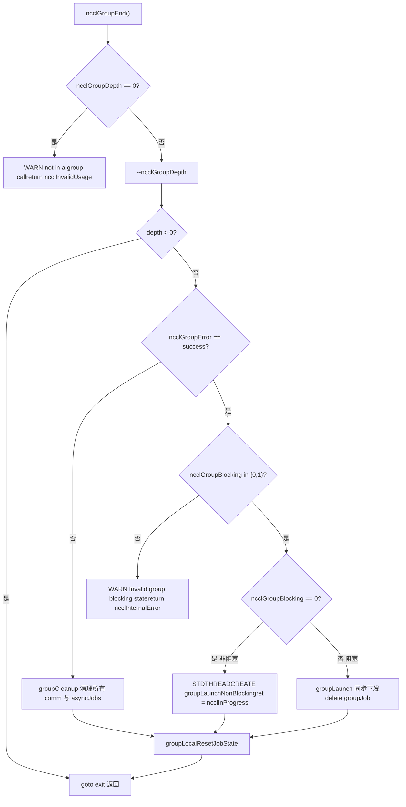

# Chapter 22: Production Troubleshooting and Pitfalls: Common Deadlocks, Timeouts, Version Mismatches, and Troubleshooting Solutions

In the previous chapter, we sorted out the troubleshooting order and key knobs for performance tuning, but NCCL failures in production environments are often not due to performance falling short, but because the program hangs directly or crashes. The root cause of these failures is usually not that some function was written incorrectly, but that the call order, lifecycle, or version contract was violated. This chapter focuses on the four most typical pitfalls: deadlocks caused by misuse of group semantics, silent errors caused by missing parameter validation, ABI version mismatches, and the boundaries of timeouts and retries. We will follow four clues - src/group.cc, src/misc/argcheck.cc, src/include/checks.h, and contrib/nccl_ep/nccl_ep.cc - to see clearly how NCCL blocks errors before they occur.

# Misuse of Group Semantics: Why "forgetting a GroupEnd" causes a hang

## Intuitive model: Group is a "shopping cart", not an "acceleration switch"

Think of`ncclGroupStart()` / `ncclGroupEnd()`as an online shopping cart: you put multiple items (multiple communication calls) into the cart, and finally check out all at once (`ncclGroupEnd`). If you only add items without checking out, the cart remains suspended forever - the`ncclGroupDepth`counter maintained internally by NCCL will not return to zero, and all subsequent communication calls will think they are "still accumulating the order", never actually launching the kernel, so the entire process hangs.

> **[Design Inference & Architectural Trade-offs]**
> This is the most common deadlock pattern in production: code in some exception branch`return`, skipping`ncclGroupEnd`, and`ncclGroupDepth`is`thread_local`, and will not be automatically cleaned up when the function returns.

## Data structure: thread_local group state

NCCL stores all group state in thread-local storage, which is the key to understanding the deadlock.

[FACT:src/group.cc:34-34]

```cpp
thread_local int ncclGroupDepth = 0; // depth of ncclGroupStart nesting
thread_local ncclResult_t ncclGroupError = ncclSuccess;
thread_local struct ncclComm* ncclGroupCommHead[ncclGroupTaskTypeNum] = {nullptr};
thread_local struct ncclComm* ncclGroupCommPreconnectHead = nullptr;
thread_local struct ncclIntruQueue ncclAsyncJobs;
thread_local int ncclGroupBlocking = -1; /* default mode */
```

Field-by-field interpretation:

- `ncclGroupDepth`: nesting depth.`ncclGroupStart`increments,`ncclGroupEnd`decrements, and only when it reaches 0 does it actually trigger submission. Supporting nesting is a design convenience, but it also means that "missing one End" will leave the depth stuck at 1 forever.
- `ncclGroupError`: the group error accumulated by this thread. Once a call fails, subsequent`ncclGroupEnd`will directly take the failure path.
- `ncclGroupCommHead[]`: the heads of the communication domain linked lists grouped by task type (collective / rawTask / mgmtTask / symRegister).
- `ncclAsyncJobs`: the queue of asynchronous tasks to be executed (such as preconnect, symmetric register).
- `ncclGroupBlocking`：`-1`means "no communication domain has been encountered yet,"`0`means non-blocking,`1`means blocking. This field is the core of the later "mixed blocking and non-blocking" detection.

> **[Design Inference & Architectural Trade-offs]**
> Using`thread_local`instead of a global variable has a straightforward motivation: NCCL allows multiple threads to each hold independent group contexts without interfering with each other. The cost is that these states are not automatically cleaned up when a thread exits. If a thread exits in the middle of a group, the state leaks.

## Step-by-Step: the complete validation chain of a GroupEnd

Scenario: the application calls`ncclGroupEnd()`, and at this point`ncclGroupDepth`is 1.

Step one, check whether it is really inside a group:

[FACT:src/group.cc:1048-1052]

```cpp
  if (ncclGroupDepth == 0) {
    WARN("ncclGroupEnd: not in a group call.");
    ret = ncclInvalidUsage;
    goto exit;
  }
```

If the user did not call`ncclGroupStart`and directly`ncclGroupEnd`, this will print "not in a group call" and return`ncclInvalidUsage`. This is the friendliest error - it reports immediately and will not hang.

Step two, decrement the depth and determine whether this is the outermost layer:

[FACT:src/group.cc:1061-1063]

```cpp
  if ((--ncclGroupDepth) > 0) goto exit;

  if ((ret = ncclGroupError) != ncclSuccess) goto fail;
```

If multiple layers are nested, the inner`End`only decrements the depth and returns without triggering submission. Only the outermost layer continues. At the same time, accumulated errors are checked.

Step three, validate consistency of the blocking mode. This is the detection point for "mixed blocking and non-blocking":

[FACT:src/group.cc:1095-1101]

```cpp
  if (hasCommHead || !ncclIntruQueueEmpty(&groupJob->asyncJobs) || ncclGroupCommPreconnectHead != nullptr) {
    /* make sure ncclGroupBlocking has been set. */
    if (ncclGroupBlocking != 0 && ncclGroupBlocking != 1) {
      WARN("Invalid group blocking state %d", ncclGroupBlocking);
      ret = ncclInternalError;
      goto fail;
    }
```

`ncclGroupBlocking`must be between`{0, 1}`. If it is still`-1`, it means the group contains neither a communication domain nor an asynchronous task, and logically execution should not reach here.

Step four, branch according to the blocking mode. Non-blocking goes through asynchronous submission by a thread, while blocking goes through synchronous submission:

[FACT:src/group.cc:1102-1134]

```cpp
    if (ncclGroupBlocking == 0) {
      /* nonblocking group */
      if (!ncclIntruQueueEmpty(&groupJob->asyncJobs)) {
        ncclAsyncJob* job = ncclIntruQueueHead(&groupJob->asyncJobs);
        do {
          NCCLCHECKGOTO(ncclCommSetAsyncError(job->comm, ncclInProgress), ret, fail);
          if (job->comm->groupJob == NULL) {
            job->comm->groupJob = groupJob;
            groupJob->groupRefCount++;
          }
          job = job->next;
        } while (job);
      }
      ...
      groupJob->base.func = groupLaunchNonBlocking;
      STDTHREADCREATE_GOTO(groupJob->base.thread, ncclAsyncJobMain, ret, fail, &groupJob->base);
      groupJob->nonBlockingInit = true;
      ret = ncclInProgress;
    }
```

Note`groupRefCount++`and`ret = ncclInProgress`: in non-blocking mode,`ncclGroupEnd`returns immediately with`ncclInProgress`, and the actual submission runs in a background thread. The caller must subsequently poll with`ncclCommGetAsyncError`, or wait with`ncclGroupJobComplete`.

## Mixing blocking and non-blocking: why it is forbidden

Return to`ncclAsyncLaunch`and look at the mixed-use detection:

[FACT:src/group.cc:55-64]

```cpp
    /* check if there are blocking and nonblocking comms at the same time in group. */
    if (comm->destroyFlag) {
      ncclGroupBlocking = 1;
    } else if (ncclGroupBlocking == -1) {
      /* first met communicator */
      ncclGroupBlocking = comm->config.blocking;
    } else if (ncclGroupBlocking != comm->config.blocking) {
      WARN("Blocking and nonblocking communicators are not allowed in the same group.");
      ret = ncclInvalidArgument;
    }
```

> **[Design Inference & Architectural Trade-offs]**
> Why is mixing forbidden? Because the submission semantics of a blocking communication domain are "the kernel has been submitted when the call returns," while non-blocking means "the task has been enqueued but not submitted when the call returns." If both are in the same group,`ncclGroupEnd`cannot provide a unified return semantics - should it wait or not? NCCL chooses to reject it outright and expose the problem at the API boundary.

## Production pitfalls: three real scenarios

**Scenario one: an exception branch misses GroupEnd.**Code throws an exception between`ncclGroupStart`and`ncclGroupEnd`or returns early`return`，`ncclGroupDepth`stays at 1. All subsequent communication calls enter a "batching" state and are never submitted. Troubleshooting method: print`ncclGroupEnd`before`ncclGroupDepth`, or use`gdb`to observe that thread_local variable.

**Scenario two: using the same comm across threads.**Because group state is`thread_local`, after thread A calls`ncclGroupStart`, thread B calling`ncclAllReduce`will not enter A's group. If A and B operate on the same comm, there will be confusion where "some calls are inside the group and some are outside the group." NCCL does not detect this situation because it assumes that a comm is operated on by only one thread at any given time.

**Scenario three: the interaction between CUDA graph capture and groups.**Look at the detection in`doLaunches`:

[FACT:src/group.cc:448-455]

```cpp
    if (capturingYes && capturingNo) {
      // We have entered barriers but are aborting without leaving them. Thus
      // these comms are permanently trashed. We need a good mechanism for
      // tracking and reporting that.
      WARN("Either none or all communicators in a ncclGroup() can be CUDA graph captured.");
      result = ncclInvalidUsage;
      goto failure;
    }
```

The comment says it very directly: once a barrier is entered and then abandoned midway, these comms are "permanently corrupted." So the rule is - all communication domains in a group must either all be in capture or all not be. Mixing them will cause inconsistent comm state, and NCCL currently has no good recovery mechanism.



# Parameter validation and silent errors: how ArgCheck blocks calls that "look normal"

## Intuitive model: ArgCheck is "airport security"

Parameter validation is like airport security: it is not responsible for making you fly faster, but it can block those things that "look like luggage but are actually dangerous goods." Without it, a pointer with the wrong device passed in will make the GPU kernel read garbage data, or worse - silently corrupt someone else's memory.

## Data structure: validation modes and the global check queue

NCCL parameter validation is not "check everything every time," but is divided into modes. The core is`comm->checkMode`：

[FACT:src/misc/argcheck.cc:227-251]

```cpp
  if (info->comm->checkMode != ncclCheckModeDefault) {
    if ((info->coll == ncclFuncSend || info->coll == ncclFuncRecv)) {
      if (info->count > 0) NCCLCHECK(CudaPtrCheck(info->recvbuff, info->comm, "buff", info->opName));
    } else if (info->coll == ncclFuncPutSignal || info->coll == ncclFuncSignal || info->coll == ncclFuncWaitSignal) {
      // One-sided RMA ops specify the remote destination via peerWin, not sendbuff/recvbuff,
      // so the standard CUDA pointer checks do not apply here.
      INFO(NCCL_COLL, "%s : skipping sendbuff/recvbuff pointer check (one-sided RMA uses peerWin)", info->opName);
    } else {
      // Check CUDA device pointers
      if (info->coll != ncclFuncBroadcast || info->comm->rank == info->root) {
        NCCLCHECK(CudaPtrCheck(info->sendbuff, info->comm, "sendbuff", info->opName));
      }
      if (info->coll != ncclFuncReduce || info->comm->rank == info->root) {
        NCCLCHECK(CudaPtrCheck(info->recvbuff, info->comm, "recvbuff", info->opName));
      }
    }

    if (info->comm->checkMode == ncclCheckModeDebugGlobal) {
      struct ncclArgsInfo* argsInfo;
      NCCLCHECK(ncclCalloc(&argsInfo, 1));
      argsInfo->info = *info;
      argsInfo->next = NULL;
      ncclIntruQueueEnqueue(&info->comm->argsInfoQueue, argsInfo);
    }
  }
```

Three modes:

- `ncclCheckModeDefault`: only the cheapest checks are performed (root range, datatype range, op range), without touching the CUDA API.
- Non-default mode: calls`CudaPtrCheck`, which actually calls`cudaPointerGetAttributes`, and has performance overhead.
- `ncclCheckModeDebugGlobal`: in addition to local checks, it also puts`ncclInfo`into`argsInfoQueue`, perform a cross-rank global consistency check when the group ends.

> **[Design Inference & Architectural Trade-offs]**
> This design is a trade-off between performance and correctness:`cudaPointerGetAttributes`It is a synchronous CUDA call, and calling it on every communication in the hot path would significantly slow down small messages. So the default mode only performs "zero-cost" checks, leaving expensive pointer validation to debug mode.

## Step-by-Step: The Three Layers of Defense in CudaPtrCheck

Scenario: The user passes in a`sendbuff`, and NCCL validates it in debug mode.

First layer, whether the pointer is valid:

[FACT:src/misc/argcheck.cc:12-18]

```cpp
ncclResult_t CudaPtrCheck(const void* pointer, struct ncclComm* comm, const char* ptrname, const char* opname) {
  cudaPointerAttributes attr;
  cudaError_t err = cudaPointerGetAttributes(&attr, pointer);
  if (err != cudaSuccess || attr.devicePointer == NULL) {
    WARN("%s : %s %p is not a valid pointer", opname, ptrname, pointer);
    return ncclInvalidArgument;
  }
```

`cudaPointerGetAttributes`It returns an error for invalid pointers, or`devicePointer`is NULL. This blocks "passed a host stack address" or "passed a freed pointer."

Second layer, whether the device matches:

[FACT:src/misc/argcheck.cc:19-26]

```cpp
#if CUDART_VERSION >= 10000
  if (attr.type == cudaMemoryTypeDevice && attr.device != comm->cudaDev) {
#else
  if (attr.memoryType == cudaMemoryTypeDevice && attr.device != comm->cudaDev) {
#endif
    WARN("%s : %s allocated on device %d mismatchs with NCCL device %d", opname, ptrname, attr.device, comm->cudaDev);
    return ncclInvalidArgument;
  }
```

This is the most insidious pitfall: the pointer is a valid GPU pointer, but it belongs to another GPU. On multi-GPU machines, if the user forgets`cudaSetDevice`, it is very easy to pass the wrong one. NCCL explicitly rejects it here.

Third layer, communication domain object integrity:

[FACT:src/misc/argcheck.cc:38-45]

```cpp
ncclResult_t CommCheck(struct ncclComm* comm, const char* opname, const char* ptrname) {
  NCCLCHECK(PtrCheck(comm, opname, ptrname));
  if (comm->startMagic != NCCL_MAGIC || comm->endMagic != NCCL_MAGIC) {
    WARN("Error: corrupted comm object detected");
    return ncclInvalidArgument;
  }
  return ncclSuccess;
}
```

`startMagic` / `endMagic`It is a sentinel value placed at the beginning and end of the`ncclComm`struct. If the user passes a wild pointer, or comm has already been freed, the magic will not match. This is the classic technique for "memory corruption detection" — sandwiching the struct with two sentinels, so any out-of-bounds write is likely to corrupt one of them.

## Global Consistency Check: registrationCheck's Cross-Rank Validation

This is the "heaviest" validation in NCCL, and is triggered only under`ncclCheckModeDebugGlobal`. What it checks is — whether the symmetric memory registration state of all ranks is consistent.

[FACT:src/misc/argcheck.cc:95-111]

```cpp
  NCCLCHECKGOTO(bootstrapAllGather(comm->bootstrap, bufInfo, sizeof(struct symBufInfo) * 2), ret, fail);

  cmpBufInfo[0] = bufInfo[0];
  cmpBufInfo[1] = bufInfo[1];
  for (int r = 1; r nRanks; r++) {
    int infoIdx = r * 2;
    if (cmpBufInfo[0].isSymRegistered != bufInfo[infoIdx].isSymRegistered ||
        cmpBufInfo[1].isSymRegistered != bufInfo[infoIdx + 1].isSymRegistered) {
      if (comm->rank == 0) {
        WARN("Coll %s size %ld symmetric registration check failed on rank %d: sendReg %d recvReg %d mismatch with "
             "rank 0 sendReg %d recvReg %d",
             info->opName, size, r, bufInfo[infoIdx].isSymRegistered, bufInfo[infoIdx + 1].isSymRegistered,
             cmpBufInfo[0].isSymRegistered, cmpBufInfo[1].isSymRegistered);
      }
      ret = ncclInvalidArgument;
      goto fail;
    }
```

It uses the bootstrap's`allGather`to collect each rank's`(isSymRegistered, bigOffset, userOffset)`, then compares them rank by rank. If rank 0's send buffer has symmetric memory registered, but rank 3 does not, an error will be reported here.

> **[Design Inference & Architectural Trade-offs]**
> Why is this check important? Symmetric memory requires all ranks to access the buffer using the same set of virtual addresses. If some rank's buffer is not registered, the address computed in the kernel will be wrong, causing reads of garbage or out-of-bounds access. This kind of error manifests at runtime as "results are occasionally wrong," and is extremely difficult to troubleshoot. NCCL chooses to block it at the API boundary at the cost of one allGather.

## Production Pitfalls

**Pitfall 1: Pointer errors are not reported in default mode.**If the user has not enabled debug mode and passes a pointer for the wrong device, NCCL will not report an error during the`ArgsCheck`phase, but will only discover it when the kernel executes — by which time it may have already corrupted another rank's GPU memory. It is recommended to use`NCCL_DEBUG=WARN`plus`checkMode`for debugging during development.

**Pitfall 2:`ncclCheckModeDebugGlobal`'s allGather overhead.**Every communication performs a bootstrap allGather, which becomes a bottleneck in high-frequency small-message scenarios. This mode is only suitable for debugging and cannot be used in production.

**Pitfall 3: The lifecycle of userRedOp.**Look at this section:

[FACT:src/misc/argcheck.cc:220-225]

```cpp
  int opIx = int(ncclUserRedOpMangle(info->comm, info->op)) - int(ncclNumOps);
  if (ncclNumOps op &&
      (info->comm->userRedOpCapacity comm->userRedOps[opIx].freeNext != -1)) {
    WARN("%s : reduction operation %d unknown to this communicator", info->opName, info->op);
    return ncclInvalidArgument;
  }
```

The user-defined reduction op is registered on comm. If the user passes an op that "was once registered but has already been freed,"`freeNext != -1`will detect that it has been reclaimed. This is a check to prevent "dangling op handles."

# Error Propagation Macros: How the NCCLCHECK Family Ensures "Errors Are Not Lost"

## Intuitive Model: Error propagation macros are a "relay baton"

NCCL's error handling relies on a set of macros in a relay: the lower-level function returns`ncclResult_t`, the upper layer uses`NCCLCHECK`to check, and if it is not successful, it returns immediately. This is like a relay race — the baton (error code) must be passed all the way to the end; if any leg drops it, the whole chain breaks.

## Data Structures: Overview of the Macro Family

[FACT:src/include/checks.h:148-166]

```cpp
#define NCCLCHECK(call) \
  do { \
    ncclResult_t RES = call; \
    if (RES != ncclSuccess && RES != ncclInProgress) { \
      /* Print the back trace*/ \
      if (ncclDebugNoWarn == 0) INFO_LOC(NCCL_ALL, "-> %d", RES); \
      return RES; \
    } \
  } while (0)

#define NCCLCHECKGOTO(call, RES, label) \
  do { \
    RES = call; \
    if (RES != ncclSuccess && RES != ncclInProgress) { \
      /* Print the back trace*/ \
      if (ncclDebugNoWarn == 0) INFO_LOC(NCCL_ALL, "-> %d", RES); \
      goto label; \
    } \
  } while (0)
```

Key details:`ncclInProgress`is treated as "not an error." This is the core of non-blocking communication —`ncclGroupEnd`returning`ncclInProgress`means "the task has been submitted but not yet completed," and the caller should continue polling rather than treating it as an error.

`NCCLCHECK`directly`return`，`NCCLCHECKGOTO`jumps to`label`. The latter is used in scenarios that require resource cleanup.

## Cleanup Path: NCCLCHECKIGNORE Preserves the First Error

[FACT:src/include/checks.h:168-177]

```cpp
// Report failure but continue - useful for cleanup paths where we want to
// attempt all cleanup steps. Preserves the first error in RES.
#define NCCLCHECKIGNORE(call, RES) \
  do { \
    ncclResult_t TMPRES = call; \
    if (TMPRES != ncclSuccess && TMPRES != ncclInProgress) { \
      if (ncclDebugNoWarn == 0) INFO_LOC(NCCL_ALL, "-> %d", TMPRES); \
      if (RES == ncclSuccess) RES = TMPRES; \
    } \
  } while (0)
```

The comment makes it very clear: on the cleanup path, it should "attempt all cleanup steps" and must not be interrupted by the first error. But the error code should preserve the first one — because the first error is usually the root cause with the most diagnostic value.

## Waiting and Aborting: NCCLWAIT's abortFlag Check

[FACT:src/include/checks.h:196-205]

```cpp
#define NCCLWAIT(call, cond, abortFlagPtr) \
  do { \
    uint32_t* tmpAbortFlag = (abortFlagPtr); \
    ncclResult_t RES = call; \
    if (RES != ncclSuccess && RES != ncclInProgress) { \
      if (ncclDebugNoWarn == 0) INFO_LOC(NCCL_ALL, "-> %d", RES); \
      return ncclInternalError; \
    } \
    if (COMPILER_ATOMIC_LOAD(tmpAbortFlag, std::memory_order_acquire)) NEQCHECK(*tmpAbortFlag, 0); \
  } while (!(cond))
```

This is the template for polling waits: each loop iteration calls`call`(advance progress), checks`cond`(whether it is satisfied), and also checks`abortFlag`(whether it has been aborted).`abortFlag`uses`memory_order_acquire`loading to ensure it sees the abort signal written by other threads.

> **[Design Inference & Architectural Trade-offs]**
> This design solves a classic problem: when one rank errors out, other ranks may still be waiting forever for its data.`abortFlag`is the mechanism for propagating the abort signal across ranks — once set, all waiting loops will exit.

## Safe Macros for Thread Creation and Memory Allocation

[FACT:src/include/checks.h:237-256]

```cpp
#define STDTHREADCREATE_IMPL(var, func, error_action, ...) \
  do { \
    try { \
      (var) = std::thread(func, __VA_ARGS__); \
    } catch (const std::exception& e) { \
      WARN("Thread creation failed: %s", e.what()); \
      error_action; \
    } \
  } while (0)

#define STDTHREADCREATE(var, func, ...) STDTHREADCREATE_IMPL(var, func, return ncclSystemError, __VA_ARGS__)

#define STDTHREADCREATE_GOTO(var, func, RES, label, ...) \
  STDTHREADCREATE_IMPL( \
    var, func, \
    do { \
      RES = ncclSystemError; \
      goto label; \
    } while (0), \
    __VA_ARGS__)
```

`std::thread`Construction failure throws an exception (for example, exceeding the thread limit). This macro converts the exception into`ncclSystemError`, preventing exceptions from crossing the C API boundary.

[FACT:src/include/checks.h:258-275]

```cpp
#define NEW_NOTHROW(var, x) \
  do { \
    (var) = new (std::nothrow) x{}; \
    if (!(var)) { \
      WARN("Allocation failed"); \
      return ncclSystemError; \
    } \
  } while (0)
```

`new (std::nothrow)`Returns nullptr instead of throwing an exception when allocation fails. This is the standard practice for C++ code at the C API boundary.

## Production Pitfalls

**Pitfall 1:`ncclInProgress`is mistakenly treated as success.**Some user code writes`if (ret == ncclSuccess)`to determine success, but in non-blocking mode what is returned is`ncclInProgress`. The correct approach is`if (ret == ncclSuccess || ret == ncclInProgress)`, or use`ncclCommGetAsyncError`to query.

**Pitfall 2:`NCCLCHECK`Used in destructors.**If used in a destructor`NCCLCHECK`, the error will directly`return`, skipping subsequent cleanup. Should use`NCCLCHECKIGNORE`。

# ABI version mismatch: nccl_ep's size-based design

## Intuitive model: ABI is a "socket standard"

ABI (Application Binary Interface) is like a power socket standard: if the library and the caller have inconsistent understanding of "what the struct looks like," it's like plugging a US-standard plug into a European-standard socket—at best it won't work, at worst it burns out.`contrib/nccl_ep`uses a clever design: every cross-boundary struct starts with a`size`field.

## Data structure: size + magic dual validation

[FACT:contrib/nccl_ep/nccl_ep.cc:70-76]

```cpp
// Size-based ABI versioning: every cross-boundary struct starts with a `size`
// field set by the caller to sizeof(struct). The library checks that against
// its own known size; any mismatch means caller and library are from different
// releases. Strict equality for now — see nccl_ep.h for the planned future
// relaxation (all-zero-trailing-bytes escape hatch).
// Immediately after `size` there is a `magic` field pre-filled by NCCL_EP_*_INIT
// to catch unininitialized structures.
```

Design points:

- `size`The field is filled in by the caller with`sizeof(struct)`, and the library checks whether it equals the size it recognizes.
- `magic`The field is pre-filled by the`NCCL_EP_*_INIT`macro, used to catch "uninitialized" structs.
- Currently it's strict equality; in the future there are plans to support a lenient mode where "if the tail is all zeros, a smaller size is allowed."

## Step-by-Step: EP_REQUIRE_STRUCT's validation flow

[FACT:contrib/nccl_ep/nccl_ep.cc:77-80]

```cpp
#define EP_REQUIRE_STRUCT(ptr) \
    do { \
        assert( \
            (ptr) != nullptr && (ptr)->size == sizeof(*(ptr)) && \
```

This macro is called at entry points such as`ncclEpDispatch`、`ncclEpCombine`:

[FACT:contrib/nccl_ep/nccl_ep.cc:2827-2830]

```cpp
    EP_REQUIRE_STRUCT(inputs);
    EP_REQUIRE_STRUCT(outputs);
    EP_OPTIONAL_LAYOUT_INFO(layout_info);
    EP_OPTIONAL_STRUCT(config);
```

`inputs`and`outputs`are required parameters, using`EP_REQUIRE_STRUCT`；`layout_info`and`config`are optional parameters, using`EP_OPTIONAL_*`。

## Version-safe field reading: layoutInfoRecvTopkIdxKind

This is the most ingenious part—how to safely read a field when "the caller's struct may be smaller."

[FACT:contrib/nccl_ep/nccl_ep.cc:139-144]

```cpp
// Safe field reader for ncclEpLayoutInfo_t::recv_topk_idx_kind. Returns AUTO
// when the caller's struct (size) does not cover the field, preserving the
// pre-flag default.
static inline ncclEpExpertIdKind_t layoutInfoRecvTopkIdxKind(const ncclEpLayoutInfo_t* lip) {
    if (lip == nullptr) return NCCL_EP_EXPERT_ID_AUTO;
    constexpr size_t field_end = offsetof(ncclEpLayoutInfo_t, recv_topk_idx_kind) + sizeof(ncclEpExpertIdKind_t);
    if (lip->size recv_topk_idx_kind;
}
```

The logic is: if the caller's`size`is less than "the offset where this field ends," it means the caller is using an older version of the struct, this field doesn't exist, and the default value`AUTO`is returned. Otherwise, read normally.

> **[Design Inference & Architectural Trade-offs]**
> This is the standard technique for ABI compatibility: new fields can only be added at the end of the struct, and when reading, use`size`to determine whether the field exists. This way, old callers use the old struct, and the new library can still handle it correctly.

## Version number check: soft warning rather than hard rejection

[FACT:contrib/nccl_ep/nccl_ep.cc:1393-1400]

```cpp
    if (in_config->version != NCCL_EP_API_VERSION) {
        fprintf(
            stderr,
            "NCCL EP WARN: ncclEpGroupConfig_t.version=%u, library API_VERSION=%u; "
            "behavior may differ across versions.\n",
            in_config->version,
            (unsigned)NCCL_EP_API_VERSION);
    }
```

Note that here it's`WARN`rather than`return error`. A version number mismatch is only a warning, because the`size`check already guarantees memory layout safety. The version number is more of a hint that "behavior may differ."

## Production pitfalls

**Pitfall 1: Forgetting to initialize with the INIT macro.**If the user manually`memset`the struct to 0,`magic`will be 0,`EP_REQUIRE_STRUCT`will fail. Must use the`NCCL_EP_*_INIT`macro.

**Pitfall 2: Mixing dynamic libraries across versions.**If the application links against a new version of`libnccl_ep.so`, but the header file is an old version,`sizeof(struct)`will be inconsistent,`EP_REQUIRE_STRUCT`will immediately report an error. This is by design—failing fast is better than silent errors.

**Pitfall 3:`EP_OPTIONAL_LAYOUT_INFO`range check.**Look at this:

[FACT:contrib/nccl_ep/nccl_ep.cc:114-123]

```cpp
            if ((ptr)->size size > sizeof(*(ptr))) { \
                fprintf( \
                    stderr, \
                    "NCCL EP: ncclEpLayoutInfo_t size out of supported range: " \
                    "got %u, expected [%zu, %zu]\n", \
                    (ptr)->size, \
                    kNcclEpLayoutInfoMinSize, \
                    sizeof(*(ptr))); \
                return ncclInvalidArgument; \
            } \
```

`layout_info`allows size within the`[min, sizeof]`range, which is more lenient than`EP_REQUIRE_STRUCT`'s strict equality. The reason is that`layout_info`is an optional parameter, and historically fields have been added and removed.

```mermaid
flowchart TD
    entry["ncclEpDispatch(inputs, outputs, layout_info, config)"] --> req_inputs{"EP_REQUIRE_STRUCT(inputs)size == sizeof?"}
    req_inputs -->|否| err_size["assert 失败 / 返回错误"]
    req_inputs -->|是| req_outputs{"EP_REQUIRE_STRUCT(outputs)"}
    req_outputs -->|否| err_size
    req_outputs -->|是| opt_layout{"layout_info != nullptr?"}
    opt_layout -->|否| skip_layout["跳过 layout 校验"]
    opt_layout -->|是| range_check{"size in [min, sizeof]?"}
    range_check -->|否| err_range["fprintf size out of rangereturn ncclInvalidArgument"]
    range_check -->|是| magic_check{"magic == NCCL_EP_MAGIC?"}
    magic_check -->|否| err_magic["fprintf magic mismatchreturn ncclInvalidArgument"]
    magic_check -->|是| read_field["layoutInfoRecvTopkIdxKindsize  read_field
    read_field --> proceed["继续执行 dispatch 逻辑"]
```

# Timeout, retry, and abort: from NCCLWAIT to nccl_ep's timeout_cycles

## Intuitive model: timeout is a "fuse"

In distributed communication, one stuck rank causes all ranks to wait forever. The timeout mechanism is like a fuse: under normal conditions it doesn't act, but once the current is abnormal it blows, preventing the entire system from burning out.

## Data structure: abortFlag and timeout_cycles

The NCCL core uses`abortFlag`to propagate the abort signal. Look at the propagation in`ncclAsyncLaunch`:

[FACT:src/group.cc:49-52]

```cpp
    job->abortFlag = comm->abortFlag;
    job->abortFlagDev = comm->abortFlagDev;
    job->childAbortFlag = comm->childAbortFlag;
    job->childAbortFlagDev = comm->childAbortFlagDev;
```

Each job holds a pointer to the comm's abortFlag. When the group detects an error:

[FACT:src/group.cc:118-126]

```cpp
        if (!job->destroyFlag &&
            (COMPILER_ATOMIC_LOAD(groupAbortFlag, std::memory_order_acquire) || errorJobAbortFlag == true)) {
          COMPILER_ATOMIC_STORE(job->abortFlag, uint32_t(1), std::memory_order_release);
          COMPILER_ATOMIC_STORE(job->abortFlagDev, uint32_t(1), std::memory_order_release);
          if (job->childAbortFlag) {
            COMPILER_ATOMIC_STORE(job->childAbortFlag, uint32_t(1), std::memory_order_release);
            COMPILER_ATOMIC_STORE(job->childAbortFlagDev, uint32_t(1), std::memory_order_release);
          }
        }
```

Once`groupAbortFlag`or`errorJobAbortFlag`is true, all jobs' abortFlag are set to 1.`memory_order_release`ensures that previous write operations are visible to other threads.

## nccl_ep's timeout design: GPU clock cycles

`nccl_ep`uses a more refined timeout—in units of GPU clock cycles.

[FACT:contrib/nccl_ep/nccl_ep.cc:1558-1591]

```cpp
    // Resolve timeout_cycles: env var > config field > compile-time default
    {
        int dev;
        int clock_khz_int;
        CUDA_CHECK(cudaGetDevice(&dev));
        CUDA_CHECK(cudaDeviceGetAttribute(&clock_khz_int, cudaDevAttrClockRate, dev));
        uint64_t clock_khz = static_cast(clock_khz_int);

        uint64_t resolved = NUM_TIMEOUT_CYCLES;
        const char* source = "compile-time default";
        const uint64_t env_ms = static_cast(ep_group->env.timeout_ms.value.ul);
        // Only a positive timeout overrides the default.
        const bool have_env_ms = ep_group->env.timeout_ms.is_set && env_ms > 0;

        if (have_env_ms) {
            resolved = clock_khz * 1000ULL * env_ms / 1000ULL;
            source = "NCCL_EP_TIMEOUT_MS env var";
            ...
        } else if (ep_group->config.timeout_ns != 0) {
            resolved = clock_khz * 1000ULL * (ep_group->config.timeout_ns / 1000000ULL) / 1000ULL;
            source = "config.timeout_ns";
        }

        ep_group->timeout_cycles = resolved;
```

The priority is: environment variable`NCCL_EP_TIMEOUT_MS`> config field`timeout_ns`> compile-time default. The conversion formula is`clock_khz * 1000 * ms / 1000`, i.e., converting milliseconds to clock cycles.

> **[Design Inference & Architectural Trade-offs]**
> Why use clock cycles instead of milliseconds? Because the wait loop inside a GPU kernel cannot call system time APIs, it can only read the`clock64()`register. Using clock cycles for timeout determination allows direct comparison inside the kernel, with no host involvement.

## Asynchronous error flag: host-pinned memory

[FACT:contrib/nccl_ep/nccl_ep.cc:1767-1778]

```cpp
    // Allocate mask buffer and async error flag for active-mask support
    if (ep_group->config.enable_mask && ep_group->config.algorithm == NCCL_EP_ALGO_LOW_LATENCY) {
        size_t mask_bytes = ep_group->nRanks * sizeof(int);
        CUDA_CHECK(cudaMalloc(reinterpret_cast(&ep_group->mask_buffer), mask_bytes));
        // Initialize all ranks as active (1 = active, 0 = masked/failed)
        std::vector all_active(ep_group->nRanks, 1);
        CUDA_CHECK(
            cudaMemcpyAsync(ep_group->mask_buffer, all_active.data(), mask_bytes, cudaMemcpyHostToDevice, stream));
        CUDA_CHECK(
            cudaHostAlloc(reinterpret_cast(&ep_group->async_error_flag), sizeof(int), cudaHostAllocMapped));
        *ep_group->async_error_flag = 0;
    }
```

`async_error_flag`uses`cudaHostAllocMapped`for allocation, which is host-pinned memory mapped into the device address space. The GPU kernel can write to it, and the host can read it, with no explicit copy needed.

## Reading asynchronous errors: atomic load

[FACT:contrib/nccl_ep/nccl_ep.cc:4312-4321]

```cpp
ncclResult_t ncclEpGetAsyncError(ncclEpGroup_t ep_group, int* error_out) {
    EP_HOST_ASSERT(ep_group != nullptr);
    if (!ep_group->config.enable_mask) {
        return ncclInvalidUsage;
    }
    EP_HOST_ASSERT(ep_group->async_error_flag != nullptr && "ncclEpGetAsyncError: enable_mask must be true");
    EP_HOST_ASSERT(error_out != nullptr);
    *error_out = __atomic_load_n(ep_group->async_error_flag, __ATOMIC_ACQUIRE);
    return ncclSuccess;
}
```

uses`__atomic_load_n`plus`__ATOMIC_ACQUIRE`, ensuring that what's read is the latest value written by the GPU, not a stale cached value.

## Production pitfalls

**Pitfall 1: Timeout set too short causing false positives.**If`NCCL_EP_TIMEOUT_MS`is set too small, normal network jitter will be misjudged as a timeout. It's recommended to set it based on the actual network RTT, generally no less than 10 seconds.

**Pitfall 2: abortFlag not cleared after being set.**Once abortFlag is set to 1, the comm enters an "aborted" state. If the user wants to continue using this comm, abortFlag must first be cleared. NCCL's`ncclCommAbort`does this cleanup.

**Pitfall 3:`ncclEpMaskClean`'s precondition.**Look at this:

[FACT:contrib/nccl_ep/nccl_ep.cc:4262-4266]

```cpp
    EP_HOST_ASSERT(ep_group->config.algorithm == NCCL_EP_ALGO_LOW_LATENCY);
    EP_HOST_ASSERT(
        ep_group->rdma_buffer != nullptr &&
        "ncclEpMaskClean: rdma_buffer not yet allocated; create at least one LL handle first");
    EP_HOST_ASSERT(ep_group->sync_buffer != nullptr && ep_group->sync_window != nullptr);
```

`ncclEpMaskClean`requires`rdma_buffer`to already be allocated. If the user has created a group but hasn't created any LL handle yet,`rdma_buffer`is nullptr (because LL is lazily allocated), and this will fail the assert.

# Chapter summary

This chapter ties together four types of production pitfalls:

1. **Group semantics misuse**：`ncclGroupDepth`is thread_local, missing`ncclGroupEnd`will cause a permanent hang; blocking and non-blocking communication domains cannot be mixed; CUDA graph capture must be all-or-nothing.

2. **Parameter validation**：`ArgsCheck`Mode-specific validation; default mode performs only zero-cost checks;`CudaPtrCheck`Three layers of defense block invalid pointers, wrong devices, and corrupted comms;`registrationCheck`Perform cross-rank symmetric memory consistency checks.

3. **Error propagation**：`NCCLCHECK`The family guarantees errors are not lost;`ncclInProgress`is not an error;`NCCLCHECKIGNORE`Used in cleanup paths to preserve the first error;`NCCLWAIT`Check abortFlag during polling.

4. **ABI versioning**：`nccl_ep`Uses a size-based design; every cross-boundary struct begins with`size`, paired with`magic`to catch uninitialized fields; new fields can only be appended at the end, and reads use`size`to determine whether they exist.

5. **Timeout and abort**: The core uses`abortFlag`to propagate aborts;`nccl_ep`Uses GPU clock cycles for timeouts,`async_error_flag`Uses host-pinned memory to implement GPU→host asynchronous notification.

# Chapter Review and Self-Test

Q1: If in`ncclGroupEndInternal`the`if ((--ncclGroupDepth) > 0) goto exit;`（[FACT:src/group.cc:1061]) is changed to`if (ncclGroupDepth > 0) goto exit;`(no decrement), what happens? What are the consequences in nested group scenarios?

**Reference Analysis**：

The original code`--ncclGroupDepth`decrements first, then checks. If changed to not decrement:

```cpp
if (ncclGroupDepth > 0) goto exit;  // 错误版本
```

Then each time`ncclGroupEnd`the depth will not decrease. Suppose the user writes:

```cpp
ncclGroupStart();  // depth = 1
ncclGroupStart();  // depth = 2
ncclAllReduce(...);
ncclGroupEnd();    // 原版: depth = 1, 返回; 错误版: depth = 2, 返回
ncclGroupEnd();    // 原版: depth = 0, 触发下发; 错误版: depth = 2, 返回
```

In the buggy version, on the second`ncclGroupEnd`,`ncclGroupDepth`is still 2,`> 0`holds, directly`goto exit`, and the dispatch is never triggered. All communication calls remain in the "batching" state, and the process hangs.

What is more insidious:`ncclGroupDepth`is thread_local and will not be reset when the function returns. Even if subsequent code no longer calls the group API, all communication on this thread will fail.

This change also breaks the pairing semantics of`ncclGroupStart`—`ncclGroupStart`increments,`ncclGroupEnd`does not decrement, so the depth only grows and eventually overflows (although int overflow requires 2 billion calls, in practice it is more likely to be a logical hang).

Q2: `CudaPtrCheck`In`attr.type == cudaMemoryTypeDevice && attr.device != comm->cudaDev`（[FACT:src/misc/argcheck.cc:20]), if the`attr.type == cudaMemoryTypeDevice`condition is removed, what problems arise? In what scenarios would it produce false positives?

**Reference Answer**：

`cudaPointerAttributes.type`has three possible values:`cudaMemoryTypeDevice`(device memory),`cudaMemoryTypeHost`(host memory),`cudaMemoryTypeManaged`(unified memory).

If the`attr.type == cudaMemoryTypeDevice`condition is removed, it becomes:

```cpp
if (attr.device != comm->cudaDev) {  // 错误版本
```

Then for host memory or managed memory,`attr.device`may be -1 or 0, which does not match`comm->cudaDev`, causing a false "device mismatch" report.

Specific scenario: the user passes a pointer allocated by`cudaMallocManaged`. The`attr.device`of managed memory is usually the device at allocation time, but if the memory is migrated to another device,`attr.device`may change. More commonly, for host memory (such as`cudaHostAlloc`allocated pinned memory),`attr.device`is -1, which is unequal to any`cudaDev`, causing a false positive.

NCCL allows host memory as a communication buffer (relayed through`cudaMemcpy`), so it is necessary to distinguish "device memory but wrong device" from "non-device memory." The former is an error; the latter is legal.

Q3: `layoutInfoRecvTopkIdxKind`（[FACT:contrib/nccl_ep/nccl_ep.cc:139-144]) uses`lip->size < field_end`to determine whether a field exists. If a new version inserts a field in the middle of the struct (rather than at the end), how does this check fail? Why does ABI design require that new fields can only be added at the end?

**Reference Analysis**：

Suppose the original struct is:

```c
struct ncclEpLayoutInfo_t {
    unsigned int size;
    unsigned int magic;
    ncclEpExpertIdKind_t recv_topk_idx_kind;  // offset = 8
};
```

`field_end = offsetof(recv_topk_idx_kind) + sizeof(...) = 8 + 4 = 12`。

If the new version inserts a field between`magic`and`recv_topk_idx_kind`:

```c
struct ncclEpLayoutInfo_t {
    unsigned int size;
    unsigned int magic;
    unsigned int new_field;                    // 新插入
    ncclEpExpertIdKind_t recv_topk_idx_kind;  // offset 变成 12
};
```

At this point`field_end = 12 + 4 = 16`. The old caller's`size`is 12 (the old struct size),`12 < 16`holds, and the function returns`AUTO`—but the old caller actually has the`recv_topk_idx_kind`field, just at a different offset. This causes the`recv_topk_idx_kind`set by the old caller to be ignored.

Worse, if the old caller writes`recv_topk_idx_kind`at the old offset (8), the new library reads at the new offset (12) and will read the value of`new_field`, causing complete corruption.

So the iron rule of ABI design is:**New fields can only be added at the end of the struct**. In this way, the old caller's`size`is smaller than the new field's`field_end`, and the function correctly returns the default value; the new caller's`size`covers the new field and reads it normally. Inserting fields in the middle breaks all`offsetof`-based version checks.

This chapter analyzed four typical pitfalls in production environments and their internal defense mechanisms. These boundary conditions remind us that the stable operation of NCCL depends not only on the core implementation, but also on the adaptation and extension of the surrounding ecosystem. In the next chapter, we will turn to the ecosystem and extensions to see how peripheral projects such as nccl4py, nccl4rust, nccl_ep, and nccl_ubx bring NCCL's capabilities to a broader set of users.
