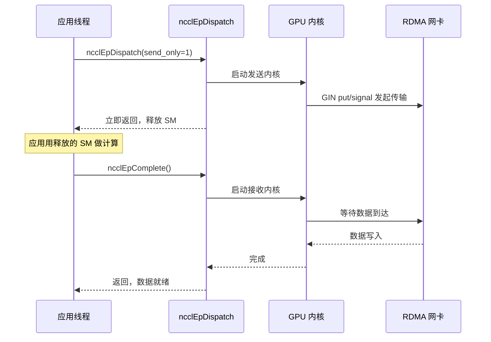
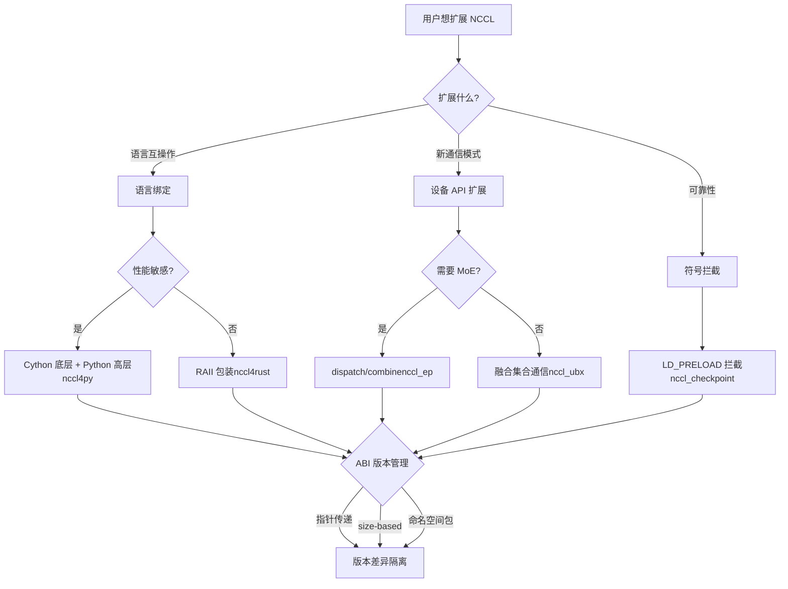

# Chapter 23: Ecosystem Extensions: Peripheral Projects Such as nccl4py, nccl4rust, nccl_ep, and nccl_ubx

In the previous chapter, we investigated typical NCCL failures in production environments—group semantics misuse, rank count mismatches, stream interactions, ABI version conflicts, and network timeouts. Most of these issues occur when using the C ABI directly, but modern large model training frameworks often do not call the C ABI directly. Instead, they reuse NCCL's capabilities through language bindings such as Python and Rust, or through extension projects targeting scenarios like MoE and ultra-high-bandwidth communication. These peripheral projects are placed under the bindings/ and contrib/ directories, positioned as experimental and community-maintained, and do not inherit the release quality assurance of the core library. This chapter examines nccl4py, nccl4rust, nccl_ep, nccl_ubx, and nccl_checkpoint one by one, looking at how they build a rich ecosystem outside the core through three paths: language bindings, device API extensions, and symbol interception.

# nccl4py: Cython bindings and namespace package design

## Intuitive model: translating the C ABI into something Python can understand

Imagine the NCCL core is a diplomat who only speaks C, and a Python training script is an intern who only speaks Python. nccl4py is that translator—it does not change what the diplomat says (NCCL's behavior), it only translates "`ncclAllReduce(sendbuff, recvbuff, count, ...)`" into "`nccl.all_reduce(tensor)`". Without this layer of translation, every Python framework would have to write its own ctypes bindings, which is repetitive work and error-prone.

## Layered structure: Cython low-level + Python high-level

The design of nccl4py has two layers: the low level is Cython bindings (`nccl/bindings/cynccl.pxd`), and the high level is the Python API (`nccl.core`). The README explicitly states this layering.[FACT:bindings/nccl4py/README.md:4-4]：

> `nccl4py provides low-level Cython bindings and a high-level Python API`

The Cython bindings are distributed with the wheel as`.pxd`files, for other Cython extensions to directly`cimport` [FACT:bindings/nccl4py/README.md:39-43]：

```cython
from nccl.bindings cimport cynccl
```

> **[Design Inference & Architectural Trade-offs]**
> Why expose the Cython layer and not just the Python layer? Because some frameworks (such as DeepSpeed and Megatron) have their core loops in Cython, and going through the Python interpreter on every call is too expensive. Directly`cimport cynccl`allows Cython extensions to call NCCL functions with near-C zero overhead. This is a typical "layered exposure" design—the high level is for ordinary users, and the low level is for performance-sensitive scenarios.

## Namespace package: multiple distributions share the`nccl`prefix

This is the most ingenious design of nccl4py.`nccl`is a PEP 420 implicit namespace package[FACT:bindings/nccl4py/README.md:50-51]：

> `nccl` is a PEP 420 implicit namespace package. nccl4py provides `nccl.bindings` and `nccl.core`; other NCCL extension distributions can provide additional `nccl.*` subpackages.

> **[Design Inference & Architectural Trade-offs]**
> In traditional Python packages,`nccl/__init__.py`would "own" the entire`nccl`namespace. If both nccl4py and nccl_ep's Python bindings want to provide`nccl.xxx`, they will conflict—whoever installs first wins. PEP 420 namespace packages solve this problem: without`__init__.py`, multiple distributions can each place subpackages into the`nccl/`directory, and the Python import system will merge them. So nccl4py provides`nccl.bindings`and`nccl.core`, while nccl_ep provides`nccl.ep`, and the two can coexist[FACT:contrib/nccl_ep/README.md:80-82]。

This design is crucial for ecosystem expansion: in the future, any third party that wants to add`nccl.monitoring`、`nccl.profiling`does not need to modify nccl4py's code.

## CUDA version selection: the extra mechanism

During installation, use`nccl4py[cu12]`or`nccl4py[cu13]`to select the CUDA major version[FACT:bindings/nccl4py/README.md:13-17]. The README explains the reason: extras will install the corresponding NCCL runtime and CUDA Python dependencies[FACT:bindings/nccl4py/README.md:19]. Published wheels do not require`CUDA_HOME`or a local CUDA Toolkit, but building from source requires[FACT:bindings/nccl4py/README.md:20-21]。

> **[Design Inference & Architectural Trade-offs]**
> This is the standard approach in the Python ecosystem for handling CUDA version fragmentation. CUDA 12 and 13 are ABI-incompatible, so one wheel cannot cover both. Using extras lets pip choose the correct binary dependency according to the user's environment, avoiding version mismatches that are only discovered at runtime.

## Production pitfalls

**Pitfall 1: namespace packages and`__init__.py`conflict.**If some third-party package places`nccl/`under`__init__.py`, the PEP 420 namespace package mechanism will be broken, causing`nccl.core`import failure. Troubleshooting method:`python -c "import nccl; print(nccl.__path__)"`, if it reports`AttributeError`it means`nccl`is not a namespace package.

**Pitfall 2: Cython ABI version drift.** `cynccl.pxd`is an experimental API[FACT:bindings/nccl4py/README.md:32-32], and when NCCL is upgraded`.pxd`may change. Cython extensions that depend on`cimport cynccl`must strictly match the nccl4py version, otherwise symbol resolution fails at compile time.

# nccl4rust: RAII ownership and device-side boundaries

## Intuitive model: let the compiler manage the lifecycle for you

In C, you`ncclCommInitRank`get a communicator, and when you are done you must`ncclCommDestroy`. Forgetting to destroy it leaks; destroying it early crashes. Rust's RAII (Resource Acquisition Is Initialization) mechanism lets the compiler automatically call the destructor when a variable leaves scope—like a hotel room card, where the system automatically settles the bill when you check out, without you having to go to the front desk manually.

The core value of nccl4rust is applying this ownership semantics to NCCL's C ABI.

## Layered structure: five crates each with their own role

The README's Layout table lists five crates[FACT:contrib/nccl4rust/README.md:20-28]：

| Path | Purpose |
| --- | --- |
| `crates/nccl-sys` | Raw host ABI generated by bindgen |
| `crates/nccl` | Rust-style host wrapper + RAII ownership |
| `crates/nccl-device-sys` | `no_std`CUDA-Oxide device declarations |
| `crates/nccl-device` | Typed`DevComm`、`Team`、`Window`Wrapper |
| `shim/` | Pure C-ABI shim, using only public headers |

> **[Design Inference & Architectural Trade-offs]**
> This split is deliberate. The README explains the motivation[FACT:contrib/nccl4rust/README.md:30-32]: host applications can use only`nccl`without needing the Rust GPU compiler; CUDA-Oxide kernels use`nccl-device`; consumers who need the raw ABI can choose the`-sys`crate. This "layer on demand" approach lets different users pay only the compilation cost they need.

## Key design: pass device communicators by pointer rather than by value

This is the most instructive design decision in nccl4rust. The README's Host/device ownership boundary section[FACT:contrib/nccl4rust/README.md:211-219]：

> `ncclDevCommCreate` produces a versioned public structure in host memory. The host `DeviceCommunicator` wrapper owns that structure and destroys it before its parent communicator. CUDA-Oxide remains responsible for allocating device memory, copying those bytes, and keeping the copy alive while kernels execute. Kernels construct `nccl_device::DevComm` from a pointer to that device copy. Using a pointer rather than a by-value Rust mirror keeps the versioned C struct layout out of the kernel argument ABI.

> **[Design Inference & Architectural Trade-offs]**
> Why not mirror C structs with Rust structs? Because`ncclDevComm_t`is versioned—different NCCL versions may have different fields. If kernel parameters pass a Rust mirror by value, then the kernel ABI is bound to a specific NCCL version's struct layout. Once NCCL upgrades the struct, all compiled kernels must be recompiled. Passing by pointer only passes an address, and the kernel accesses through the pointer, so layout changes do not affect the ABI. This is the same idea as the`ncclEpLayoutInfo_t`size-based ABI discussed in the previous chapter—**isolating version differences behind a pointer**。

## Safety boundary: what is unsafe

The README's Current API contracts section lists six contracts[FACT:contrib/nccl4rust/README.md:230-249], with several key ones:

- The raw`-sys`crate only mirrors the C ABI, without adding ownership or lifetime checks[FACT:contrib/nccl4rust/README.md:232-233]
- Current collective communication and point-to-point wrappers accept raw device pointers, declared as`unsafe` [FACT:contrib/nccl4rust/README.md:42-45]
- Pointer translation methods return raw device pointers and cannot validate offset bounds, alignment, peer membership, aliasing, or window lifetime[FACT:contrib/nccl4rust/README.md:242-244]

> **[Design Inference & Architectural Trade-offs]**
> This is the fundamental difficulty of Rust bindings to NCCL: many of NCCL's API contracts are "the buffer must remain valid until the CUDA stream completes," but Rust's type system cannot express the asynchronous event of "stream completion." So these methods can only be`unsafe`, handing responsibility back to the caller. The README also points out the direction for improvement[FACT:contrib/nccl4rust/README.md:44-45]: a stream-aware buffer abstraction could encode these requirements into a safe API. This is future work.

## Device side: CUDA-Oxide and the LTOIR shim

The core challenge on the device side is that NCCL's device API is C++ templates, while Rust device code (CUDA-Oxide) needs a C ABI. The solution is a C++ shim[FACT:contrib/nccl4rust/README.md:26]：

> `shim/` — CUDA C++ C-ABI shim built exclusively from public `nccl.h` and `nccl_device.h`

The shim is compiled into LTOIR (LLVM intermediate representation) and linked with Rust PTX into a cubin[FACT:contrib/nccl4rust/README.md:165-167]. The README explains the build process[FACT:contrib/nccl4rust/README.md:158-163]：

```bash
make device \
  NCCL_INCLUDE_DIR="$NCCL_INCLUDE_DIR" \
  CUDA_HOME="$CUDA_HOME" \
  ARCH=90
```

> **[Design Inference & Architectural Trade-offs]**
> LTOIR is NVIDIA's link-time optimization intermediate format. Using LTOIR rather than compiling directly to cubin is to allow the shim and Rust kernels to perform cross-language optimization at link time—for example, inlining shim functions into Rust kernels. This is the key technique for hybrid programming with "C++ templates + Rust kernels."

## Production pitfalls

**Pitfall one: the NCCL version must match exactly.**The README explicitly requires`Matching NCCL 2.31 headers and runtime` [FACT:contrib/nccl4rust/README.md:80-81], because the prototype directly initializes fields that differ in earlier NCCL device API versions. If the headers and`libnccl.so`versions are inconsistent, device communicator fields will be misaligned.

**Pitfall two: CUDA graph and device communicators.**The device communicator is a versioned structure in host memory; after being copied to the device, the kernel accesses it through a pointer. If CUDA graph capture bakes the device pointer into kernel parameters, recreating the communicator later will invalidate the pointer in the graph. This is the same root cause as the RDMA buffer reallocation problem in nccl_ep.

**Pitfall three: safe initialization cannot be mixed with raw groups.**The README warns[FACT:contrib/nccl4rust/README.md:238-239]: safe initialization and managed calls that produce output cannot be mixed with raw`nccl-sys`group state, because the wrapper layer cannot observe raw group state. Mixing them will cause the wrapper layer's polling logic to conflict with raw group semantics.

# nccl_ep: dispatch/combine primitives for expert parallelism

## Intuitive model: MoE's "sorting center"

In MoE (Mixture of Experts) models, each token must be routed to top-k experts. The experts are distributed across different GPUs, so tokens need to be transferred across GPUs—this is dispatch. After the experts compute, the results must be sent back to the GPU where the original token resides—this is combine. nccl_ep is the communication engine for this "sorting center."

Without it, every MoE framework would have to implement the dispatch/combine communication logic itself, which is repetitive and difficult to optimize. nccl_ep turns it into a standard primitive in the NCCL ecosystem.

## Two algorithms: LL and HT

The README explains two algorithms[FACT:contrib/nccl_ep/README.md:36-40]：

- **Low-Latency (LL)**: small batch, latency-sensitive (LLM inference). Uses direct point-to-point all-to-all communication.
- **High-Throughput (HT)**: large-batch training and inference prefill. Uses hierarchical communication—intra-node NVLink aggregation, inter-node RDMA. Leverages Hopper's warp-specialized pipeline and TMA.

> **[Design Inference & Architectural Trade-offs]**
> The split between these two algorithms reflects the different bottlenecks of MoE inference and training. During inference, the batch is small, and latency is the main contradiction, so LL uses direct point-to-point to avoid aggregation overhead. During training, the batch is large, and bandwidth is the main contradiction, so HT uses hierarchical aggregation to reduce cross-node traffic. This is a typical "choose the algorithm based on workload characteristics" design.

## Core data structure: ncclEpGroupConfig_t

This is the EP configuration structure, with many fields[FACT:contrib/nccl_ep/README.md:339-362]. Key fields:

- `size`and`version`: ABI version check, from the same origin as the size-based ABI discussed in the previous chapter[FACT:contrib/nccl_ep/README.md:340-341]
- `algorithm`: HT or LL[FACT:contrib/nccl_ep/README.md:342]
- `max_dispatch_tokens_per_rank`: maximum number of tokens dispatched by a single rank[FACT:contrib/nccl_ep/README.md:344]
- `rdma_buffer_size`: RDMA buffer size in LL mode[FACT:contrib/nccl_ep/README.md:356-356]
- `alloc`: custom device memory allocator[FACT:contrib/nccl_ep/README.md:359]

> **[Design Inference & Architectural Trade-offs]**
> `rdma_buffer_size`'s`NCCL_EP_AUTO`semantics are worth digging into. The README explains[FACT:contrib/nccl_ep/README.md:396-406]: in AUTO mode, the buffer is not allocated at`ncclEpCreateGroup`, but instead at the first`ncclEpInitHandle`according to the actual`(layout, num_topk)`. When a later handle needs a larger buffer, it will collectively reallocate. This "lazy allocation" design avoids requiring users to guess the buffer size, but introduces three constraints[FACT:contrib/nccl_ep/README.md:396-406]：

1. All ranks must use the same`(layout, num_topk)`synchronous call`ncclEpInitHandle`

2. Reallocation discards the old buffer contents,`send_only`temporarily stored data will be lost

3. CUDA graph capture bakes in the RDMA base address pointer, and after reallocation it must be recaptured

**This is one of the most important production pitfalls in this chapter.**Lazy allocation buys ease of use, but shifts the complexity of "when to reallocate" onto the user.

## Tensor descriptors: static and dynamic forms

`ncclEpTensor_t`is a lightweight value type[FACT:contrib/nccl_ep/README.md:310-332]. The README shows two usages:

**Static descriptor**(on the stack,`NCCL_EP_TENSOR_INIT_INLINE`）[FACT:contrib/nccl_ep/README.md:806-809]：

```c
ncclEpTensor_t expert_counters = { NCCL_EP_TENSOR_INIT_INLINE,
                                   .ndim = 1, .datatype = ncclInt32,
                                   .data = expert_counters_data,
                                   .sizes = expert_counters_dims };
```

**Dynamic descriptor**(on the heap,`ncclEpTensorAlloc`）[FACT:contrib/nccl_ep/README.md:793-798]：

```c
ncclEpTensor_t* topk_idx = nullptr;
{
    size_t dims[2] = { num_tokens, top_k };
    ncclEpTensorAlloc(&topk_idx, 2, ncclInt64, dims, /*config=*/NULL);
    cudaMalloc(&topk_idx->data, num_tokens * top_k * sizeof(int64_t));
}
```

> **[Design Inference & Architectural Trade-offs]**
> The difference between the two forms lies in`sizes`ownership of the array. The static descriptor's`sizes`is a caller-owned stack array, and must outlive the descriptor[FACT:contrib/nccl_ep/README.md:325-326]. The dynamic descriptor's`sizes`is a library-owned heap copy, freed by`ncclEpTensorDestroy`. The public struct holds the[FACT:contrib/nccl_ep/README.md:514-514]pointer, so the two forms can be mixed in the same call`ncclEpTensor_t*`. This design gives zero heap allocation for simple scenarios and library-managed convenience for complex scenarios.[FACT:contrib/nccl_ep/README.md:514-514]Execution modes: synchronous and staged

## The README's Execution Modes section

explains two modes:[FACT:contrib/nccl_ep/README.md:701-741]Synchronous mode

**(default): occupies GPU resources for the entire operation, including the time spent waiting to receive data**Staged mode[FACT:contrib/nccl_ep/README.md:705-709]。

**(LL only): the operation is split into send and receive phases**. Initiated with[FACT:contrib/nccl_ep/README.md:718-726], GPU resources are released after data transfer starts, the application can use these resources for computation, and finally`send_only = 1`is used to complete`ncclEpComplete`copy[FACT:contrib/nccl_ep/README.md:728-741]。



returns immediately after initiation, SM resources are released for computation, and after the application finishes other work it calls`send_only`to wait for receive completion. This is the classic "compute-communication overlap" pattern.`ncclEpComplete`Production pitfalls

## Pitfall one:

**conditional collectivity of`ncclEpInitHandle`. In AUTO mode,**is a conditional collective call`ncclEpInitHandle`. If some rank triggers reallocation due to a different layout, the other ranks must participate synchronously. Lack of synchronization will cause deadlock or data corruption.[FACT:contrib/nccl_ep/README.md:396-406]Pitfall two: prohibited during CUDA graph capture

**The README explicitly warns`ncclEpInitHandle`。**: in AUTO mode, you must not call[FACT:contrib/nccl_ep/README.md:396-406]between`cudaStreamBeginCapture`and`cudaStreamEndCapture`. Because reallocation changes the RDMA base address, while graph capture has already baked in the old pointer.`ncclEpInitHandle`Pitfall three: guard overhead.

**The README mentions**: EP adds a guard to internal communication buffers by default to prevent adjacent dispatch/combine calls from corrupting each other's data. Advanced users who have already ensured that consecutive operations will not contend can use[FACT:contrib/nccl_ep/README.md:299-303]to disable it and reclaim the overhead. But disabling it incorrectly will cause silent data corruption.`NCCL_EP_DISABLE_GUARD=1`nccl_ubx: fused collective communication and symmetric allocator

# Intuitive model: also hand over the "packing and unpacking before and after moving" to the moving company

## 直觉模型：把「搬家前后的打包拆包」也交给搬家公司

Ordinary collective communication is only responsible for moving data. But in real models, residual addition often needs to be done before AllReduce, and RMSNorm after it. If these operations are done separately, the data has to make extra trips through GPU memory. The idea of nccl_ubx is: fuse residual addition, RMSNorm, and mxfp8 quantization into the collective communication kernel[FACT:contrib/nccl_ubx/README.md:6-9]. It's like a moving company not only moving boxes, but also helping you pack and unpack, all in one trip.

## Hardware prerequisite: NVLink multicast is required

The README explicitly requires SM 9.0+ (Hopper/Blackwell), and the MC kernel path requires NVLink multicast hardware[FACT:contrib/nccl_ubx/README.md:24-24]. SM 8.0 (A100) is not supported, because Ampere does not have NVLink multicast hardware,`multimem.*`and inline PTX cannot be assembled for arch 8.0[FACT:contrib/nccl_ubx/README.md:24-24]。

> **[Design Inference & Architectural Trade-offs]**
> This explains why ubx is "experimental" — it depends on the NVLink multicast capability introduced only with Hopper.`multimem.*`The instruction allows one GPU to write data to the symmetric addresses of multiple GPUs with a single instruction, which is the hardware-accelerated foundation of collective communication. Without this hardware, the core optimization of ubx does not hold.

## Symmetric allocator: turning PyTorch tensors into NCCL windows

The core of ubx is a custom symmetric allocator[FACT:contrib/nccl_ubx/README.md:11-14]：

> A central piece of the design is a custom symmetric allocator that provides zero-copy collective input/output buffers while remaining easy to plug into existing PyTorch code: tensors are ordinary `torch.Tensor` instances backed by an NCCL-managed symmetric window.

> **[Design Inference & Architectural Trade-offs]**
> This is the most ingenious part of ubx. NCCL's symmetric memory requires all ranks to access the buffer using the same set of virtual addresses (as discussed in Chapter 14). But PyTorch users are used to using`torch.Tensor`. ubx makes`torch.Tensor`the underlying storage directly be an NCCL symmetric window, so user code does not need to change, but collective communication can be zero-copy — the input and output buffers are the symmetric memory itself, with no extra copy needed.

## Collective communication variants and automatic selection

The Available collectives table in the README[FACT:contrib/nccl_ubx/README.md:90-90]：

| Op | Variants | Auto-select |
| --- | --- | --- |
| AllReduce | `mc`, `uc`, `lamport`, `auto` | Lamport ≤ 0.25 MB, else MC |
| AllToAll | `uc`, `lamport`, `auto` | Lamport ≤ 0.25 MB, else UC |
| AllGather | `mc` | — |

> **[Design Inference & Architectural Trade-offs]**
> The differences among the three variants:`mc`uses NVLink multicast hardware,`uc`uses ordinary unicast,`lamport`is a low-latency algorithm. Automatic selection uses a 0.25 MB threshold — small messages use Lamport low latency, large messages use MC/UC high bandwidth. This threshold is similar to the tuning logic in the NCCL core, but ubx simplifies it to a fixed threshold.

## Fused operations: residual + RMSNorm

The README mentions[FACT:contrib/nccl_ubx/README.md:103-103]：

> `SymmAllocator.allreduce_mc()` and `allreduce_lamport()` accept optional `gamma`/`residual_in` parameters to fuse residual addition + RMSNorm into the same kernel.

> **[Design Inference & Architectural Trade-offs]**
> This is the core selling point of ubx. The traditional flow is: AllReduce → residual addition → RMSNorm, with three rounds of GPU memory reads and writes. After fusion, it is completed in one kernel, saving 2/3 of GPU memory bandwidth. For bandwidth-constrained large-model training, this is a real speedup.

## MoE token dispatch + mxfp8 quantization

The README describes`a2av_token_bf16_mxfp8` [FACT:contrib/nccl_ubx/README.md:103-103]：

> a single GPU kernel that routes bf16 tokens to remote ranks while quantizing them to mxfp8 (E8M0 scale per 32 elements) on the fly.

> **[Design Inference & Architectural Trade-offs]**
> This kernel fuses "routing + quantization." bf16 is 16-bit, mxfp8 is 8-bit, and after quantization the data volume is halved, so the cross-node transmission bandwidth requirement is halved. Quantizing before transmission is better than quantizing after transmission — what is saved is network bandwidth rather than GPU memory bandwidth. This is a key optimization for MoE inference.

## Production pitfalls

**Pitfall one:`TORCH_CUDA_ARCH_LIST`must include the`a`suffix.**The README emphasizes[FACT:contrib/nccl_ubx/README.md:47-56]: use the`a`suffix to ensure access to the complete`multimem.*`instruction set. Some acceleration-specific variants are unavailable on ordinary`9.0`/`10.0`, and future kernels using these variants will silently degrade performance or fail to assemble.

**Pitfall two:`UBX_BUILD_TIMEOUT`runtime overhead.**The README states[FACT:contrib/nccl_ubx/README.md:47-56]: setting it to 1 compiles a spinloop timeout into the kernel side, increasing runtime overhead (extra`clock64()`checks and`printf`on timeout). Only enable it when troubleshooting hangs.

**Pitfall three:`NCCL_NVLS_ENABLE=0`degradation.**The README lists this environment variable[FACT:contrib/nccl_ubx/README.md:202]: setting it to 0 allows running without NVLink multicast. But the MC kernel path becomes unavailable, leaving only the UC/Lamport variants, and performance drops significantly.

# nccl_checkpoint: LD_PRELOAD interception and state replay

## Intuitive model: taking a snapshot of the communication domain

A training job runs for several hours, and suddenly it needs to be migrated to another machine, or its state needs to be saved for recovery. Ordinary checkpoints only save model weights and optimizer state, but the state of the NCCL communication domain (rank IDs, connections, buffers) cannot be serialized directly. The idea of nccl_checkpoint is: intercept all NCCL calls, record the initialization steps, and replay these steps during recovery[FACT:contrib/nccl_checkpoint/README.md:3-7]。

It's like recording every step of assembling furniture, then reassembling it according to the recording after moving, instead of trying to move the assembled furniture as a whole.

## Core mechanism: LD_PRELOAD symbol interception

The Design section of the README[FACT:contrib/nccl_checkpoint/README.md:17-20]：

> The application is launched with `LD_PRELOAD=/path/to/libnccl-checkpoint-shim.so` in the environment. This allows the library to intercept all calls to NCCL functions to capture all resource initialization steps.

> **[Design Inference & Architectural Trade-offs]**
> `LD_PRELOAD`is a mechanism of the Linux dynamic linker: load the specified`.so`before the application normally loads shared libraries. If this`.so`defines symbols with the same names as NCCL (such as`ncclCommInitRank`), the dynamic linker will preferentially use the version in`.so`. In this way, the shim can intercept all NCCL calls, record parameters, and then replay them during recovery.

## Checkpoint flow

The Python example in the README[FACT:contrib/nccl_checkpoint/README.md:44-58]shows the complete workflow:

```python
nccl_checkpoint.checkpoint_prepare()
drv.cuCheckpointProcessLock(os.getpid(), None)
drv.cuCheckpointProcessCheckpoint(os.getpid(), None)
# CRIU dump happens here.
drv.cuCheckpointProcessRestore(os.getpid(), None)
drv.cuCheckpointProcessUnlock(os.getpid(), None)
nccl_checkpoint.checkpoint_restore()
```

> **[Design Inference & Architectural Trade-offs]**
> The workflow has four steps:

1. `checkpoint_prepare()`: Destroy all communicators so that CUDA Checkpoint and CRIU can safely dump process state[FACT:contrib/nccl_checkpoint/README.md:25-27]

2. `cuCheckpointProcessLock/Checkpoint`: CUDA driver locks the process and performs checkpointing

3. CRIU dump: External tools dump process memory and file descriptors to disk

4. `cuCheckpointProcessRestore/Unlock` + `checkpoint_restore()`: Restore the process and replay NCCL configuration[FACT:contrib/nccl_checkpoint/README.md:29-31]

## Redis KVS: Cross-machine rendezvous

The README explains why Redis is needed[FACT:contrib/nccl_checkpoint/README.md:33-38]：

> Because it is useful to restore on different hardware, IP addresses may have changed. There is no convenient way to directly inform the NCCL Checkpoint library of all peer addresses during the restore process, so the library depends on a temporary Redis Key-Value store to be made available.

> **[Design Inference & Architectural Trade-offs]**
> During recovery, the machine may change and the IP may change. Rebuilding the NCCL communication domain requires knowing the new addresses of all peers. But the shim cannot directly know these addresses, so a Redis KVS is used for rendezvous—all processes write their new addresses to the KVS and read other processes' addresses from the KVS. This is like after moving, everyone agrees to exchange new addresses on a public message board.

The README states that Redis is only needed during the recovery bootstrap phase[FACT:contrib/nccl_checkpoint/README.md:221-221]，`checkpoint_restore()`After returning, it can be stopped.

## Limitations: Three unsupported cases

The Limitations section of the README[FACT:contrib/nccl_checkpoint/README.md:119-129]lists three limitations:

1. `ncclWinGetUserPtr()`The returned pointer is invalid after recovery[FACT:contrib/nccl_checkpoint/README.md:125-126]

2. CUDA graph capture is not supported[FACT:contrib/nccl_checkpoint/README.md:136-136]

3. Device API is not supported—`ncclDevComm`objects and device-visible`ncclWindow_t`values cannot be restored[FACT:contrib/nccl_checkpoint/README.md:136-136]

> **[Design Inference & Architectural Trade-offs]**
> The third limitation is the most serious. The device API is a new direction for NCCL (DevComm discussed in Chapter 19), but checkpointing does not support it. This means applications using the device API (such as nccl_ep, nccl_ubx) cannot be recovered with checkpointing. This reflects ecosystem fragmentation—new features move fast, but reliability tools cannot keep up.

## Production Pitfalls

**Pitfall One:`NCCL_CHECKPOINT_KVS_PATH`Set before checkpointing; cannot be changed during recovery.**The README warns[FACT:contrib/nccl_checkpoint/README.md:221-221]: This environment variable is not used during the checkpoint preparation phase, but it will be captured into the checkpoint and cannot be easily modified during recovery. Therefore, it must be set before checkpointing, and the Redis address in the recovery environment must match.

**Pitfall Two:`NCCL_CHECKPOINT_KVS_TIMEOUT`Only covers the shim's Redis rendezvous.**The README states[FACT:contrib/nccl_checkpoint/README.md:221-221]: Default is 300 seconds. Once communicator replay enters the NCCL transport establishment phase, the underlying NCCL transport calls use their own behavior and may require transport-specific diagnostics. In other words, the timeout only protects the Redis phase; if the transport establishment phase hangs, you need to`NCCL_DEBUG`troubleshoot.

**Pitfall Three: NCCL version must match.**The README requires NCCL 2.31.0 or newer[FACT:contrib/nccl_checkpoint/README.md:158], and recommends`NCCL_SRC`that the NCCL version in the path exactly matches the runtime NCCL library version[FACT:contrib/nccl_checkpoint/README.md:156-158]. Version mismatch will cause struct layout misalignment during replay.

# Design Reflection: Three Modes of Ecosystem Extension

Reviewing these five projects, we can summarize three modes of NCCL ecosystem extension:

**Mode One: Language bindings (nccl4py, nccl4rust).**The core challenge is ownership and lifecycle. C's ABI has no ownership semantics, so the binding layer must add them itself. nccl4py uses Cython layering, nccl4rust uses RAII +`unsafe`boundaries. The common point is:**isolating version differences behind pointers**—nccl4rust passes DevComm via pointers, nccl4py isolates versions with namespace packages.

**Mode Two: Device API extensions (nccl_ep, nccl_ubx).**The core challenge is ABI version management and resource lifecycle. nccl_ep uses size-based ABI (detailed in the previous chapter), nccl_ubx uses a symmetric allocator. The common point is:**lazy allocation + collective reallocation**—nccl_ep's RDMA buffer and nccl_ubx's symmetric pool are both allocated on demand, but reallocation requires synchronization across all ranks.

**Mode Three: Symbol interception (nccl_checkpoint).**The core challenge is state capture and replay. Using`LD_PRELOAD`to intercept all NCCL calls, record initialization steps, and replay during recovery. This mode does not modify the NCCL core, but can transparently add checkpointing capability to existing applications.

> **[Design Inference & Architectural Trade-offs]**
> The common constraint of the three modes is**NCCL version compatibility**. All projects require an exact matching NCCL version because NCCL's ABI is evolving. This reflects a fundamental tension in the NCCL ecosystem: the core iterates rapidly, but surrounding projects need stability. Size-based ABI, pointer passing, and namespace packages are all technical means to alleviate this tension.



This decision diagram shows the path for choosing NCCL extensions. Whichever path you take, you ultimately face the core issue of ABI version management, and the three technical means (pointer passing, size-based ABI, namespace packages) all isolate version differences behind stable interfaces.

# Chapter Summary

This chapter analyzed five peripheral projects in the NCCL ecosystem:

- **nccl4py**Use Cython layering + PEP 420 namespace packages to let the Python ecosystem extend with zero conflicts`nccl.*`subpackages.
- **nccl4rust**Use RAII ownership + pointer-passed device communicators to isolate versioned C struct layouts outside the kernel ABI.
- **nccl_ep**Use LL/HT dual algorithms + lazy RDMA buffer allocation to provide dispatch/combine primitives for MoE, but this introduces constraints of conditional collective calls and CUDA graph invalidation.
- **nccl_ubx**Use symmetric allocators + kernel fusion to fold residual addition, RMSNorm, and mxfp8 quantization into collective communication kernels, but this depends on Hopper+ NVLink multicast hardware.
- **nccl_checkpoint**Use`LD_PRELOAD`symbol interception + Redis rendezvous to implement cross-machine communication domain checkpointing, but it does not support device APIs and CUDA graphs.

# Chapter Review and Self-Test

Q1: In nccl_ep's`rdma_buffer_size = NCCL_EP_AUTO`mode, if rank 0 first calls`ncclEpInitHandle`and triggers buffer reallocation, while rank 1 does not trigger reallocation because its layout is different, what happens? Please analyze in combination with[FACT:contrib/nccl_ep/README.md:396-406]'s constraints.

**Reference Analysis**: The README explicitly states[FACT:contrib/nccl_ep/README.md:396-406]：`All ranks must call ncclEpInitHandle in lockstep with the same (layout, num_topk)`. In AUTO mode,`ncclEpInitHandle`is a conditional collective call—whether reallocation is triggered depends on whether that handle's`(layout, num_topk)`requires more space than the current buffer.

If rank 0's layout requires a larger buffer and triggers reallocation, while rank 1's layout does not, then rank 0 will execute the collective operation sequence "deregister window → free → ncclMemAlloc → register"[FACT:contrib/nccl_ep/README.md:396-406], while rank 1 will not. This causes two problems:

1. **Collective operation mismatch**: NCCL's window deregister/register are collective operations and require all ranks to participate. Rank 0 unilaterally executing them will cause rank 1 to reference the old window handle in subsequent communication, while rank 0 has already switched to a new window, resulting in communication failure or data corruption.

2. **Base address inconsistency**: After reallocation, rank 0's RDMA base address changes, while rank 1's does not. Although the README says "recorded layout offsets on every live handle are pure offsets relative to the group's rdma_buffer and resolve correctly against the new base"[FACT:contrib/nccl_ep/README.md:396-406], this only holds under the premise that all ranks reallocate. Rank 1's base address has not changed, while rank 0's has, so cross-rank address resolution will be misaligned.

The correct approach is: all ranks use the same`(layout, num_topk)`to synchronously call`ncclEpInitHandle`, ensuring consistent reallocation decisions. If this cannot be guaranteed, explicit`rdma_buffer_size > 0`mode should be used, allocating a sufficiently large buffer at`ncclEpCreateGroup`time to avoid runtime reallocation[FACT:contrib/nccl_ep/README.md:396-406]。

Q2: Why does nccl4rust pass`ncclDevComm_t`to device kernels by pointer rather than by value? If changed to pass-by-value, what happens after NCCL upgrades the struct layout? Please analyze in combination with[FACT:contrib/nccl4rust/README.md:211-219].

**Reference Analysis**: The README explicitly states[FACT:contrib/nccl4rust/README.md:217-219]：`Kernels construct nccl_device::DevComm from a pointer to that device copy. Using a pointer rather than a by-value Rust mirror keeps the versioned C struct layout out of the kernel argument ABI.`

`ncclDevComm_t`is a versioned public struct, and fields may differ across NCCL versions. If passed by value:

1. **Kernel ABI binds to struct layout**: When kernel parameters are passed by value, the compiler bakes the entire struct's byte layout into the kernel's calling convention. After NCCL upgrades the struct (adding fields, changing field order, changing alignment), already-compiled kernels still parse parameters according to the old layout, causing field misalignment.

2. **All kernels must be recompiled**: Every NCCL upgrade requires recompiling all kernels that use device communicators. For training jobs deployed on a large number of machines, this is a huge operational burden.

3. **Cross-version incompatibility**: If the host side creates a communicator with the new NCCL, while the device-side kernel is compiled with the old NCCL, pass-by-value will cause the kernel to read incorrect fields.

Passing by pointer only passes an 8-byte address, and the kernel accesses the struct through the pointer. When NCCL upgrades the struct layout, as long as the host side creates the communicator with the new version and copies it to the device, the kernel accesses the new layout through the pointer. The kernel itself does not need to be recompiled, because its parameter is just an address. This isolates version differences behind the pointer—**the pointer is stable, while the content pointed to by the pointer can change**。

This is the same design philosophy as nccl_ep's size-based ABI: use a layer of indirection to isolate volatile version details behind a stable interface.

Q3: nccl_checkpoint uses`LD_PRELOAD`to intercept NCCL calls, but if an application links both nccl4py and nccl_checkpoint, nccl4py's Cython bindings directly call`libnccl.so`'s symbols,`LD_PRELOAD`can it intercept them? Please analyze the symbol resolution order.

**Reference Analysis**: This depends on the symbol resolution order.`LD_PRELOAD`The mechanism is: before loading the shared libraries that the application normally depends on, the dynamic linker first loads the`LD_PRELOAD`specified`.so`. When the application (or a library it depends on) references a symbol, the dynamic linker searches in "first loaded, first resolved" order—`LD_PRELOAD`'s`.so`takes precedence over`libnccl.so`。

So in theory, when nccl4py's Cython binding calls`ncclCommInitRank`, the dynamic linker will first find the symbol with the same name in`libnccl-checkpoint-shim.so`, and the interception succeeds.

But there are several edge cases:

1. **Direct`dlopen` + `dlsym`**: If nccl4py uses`dlopen("libnccl.so")`and then`dlsym`to get the function pointer,`LD_PRELOAD`cannot intercept it, because`dlsym`directly searches for the symbol in the specified`.so`, without going through the global symbol table. The README mentions that C applications use`dlsym`to resolve`ncclCheckpointPrepare` [FACT:contrib/nccl_checkpoint/README.md:109-109], but that is resolving the checkpoint's own symbols, not NCCL symbols.

2. **Symbol binding timing**: If nccl4py binds NCCL symbols before`LD_PRELOAD`takes effect (for example, in`__attribute__((constructor))`), interception may fail. But under normal circumstances`LD_PRELOAD`takes effect at process startup, earlier than any user code.

3. **`RTLD_DEEPBIND`**: If nccl4py uses`dlopen`and specifies`RTLD_DEEPBIND`, symbol lookup will preferentially resolve inside`libnccl.so`, bypassing`LD_PRELOAD`. This is a common pitfall.

4. **Static linking**: If nccl4py statically links NCCL,`LD_PRELOAD`is completely ineffective, because the symbols have already been resolved at compile time.

So the conclusion is:**In normal dynamic linking scenarios`LD_PRELOAD`can intercept nccl4py's calls**, but if nccl4py uses`dlopen` + `RTLD_DEEPBIND`or static linking, interception will fail. In production use, you should use`LD_DEBUG=bindings`to verify symbol binding and confirm that NCCL calls are intercepted by the shim.

In the next chapter we will turn to architectural evolution and future directions, and look at how NCCL evolves from a collective communication library into a programmable communication engine.

These surrounding projects demonstrate, through language bindings, device API extensions, and symbol interception, how NCCL's core capabilities can be reused in different scenarios. The core constraint running through all the projects is NCCL ABI version compatibility—size-based ABI, pointer passing, and namespace packages are all technical means of isolating version differences behind a stable interface. Understanding these means is the prerequisite for safely using these surrounding projects. As these extension projects keep probing the boundaries of the core, NCCL itself is also quietly evolving: from fixed collective operations to a programmable communication engine, from host proxy to GPU direct issue, from registered buffers to symmetric memory. In the next chapter, based on the traces of evolution in the source code, we will discuss how these changes will reshape the communication methods of upper-layer frameworks.
